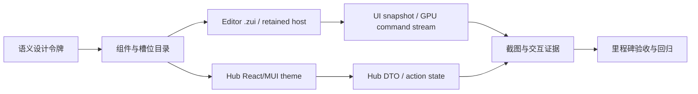
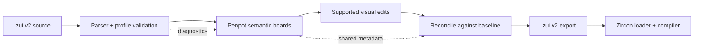
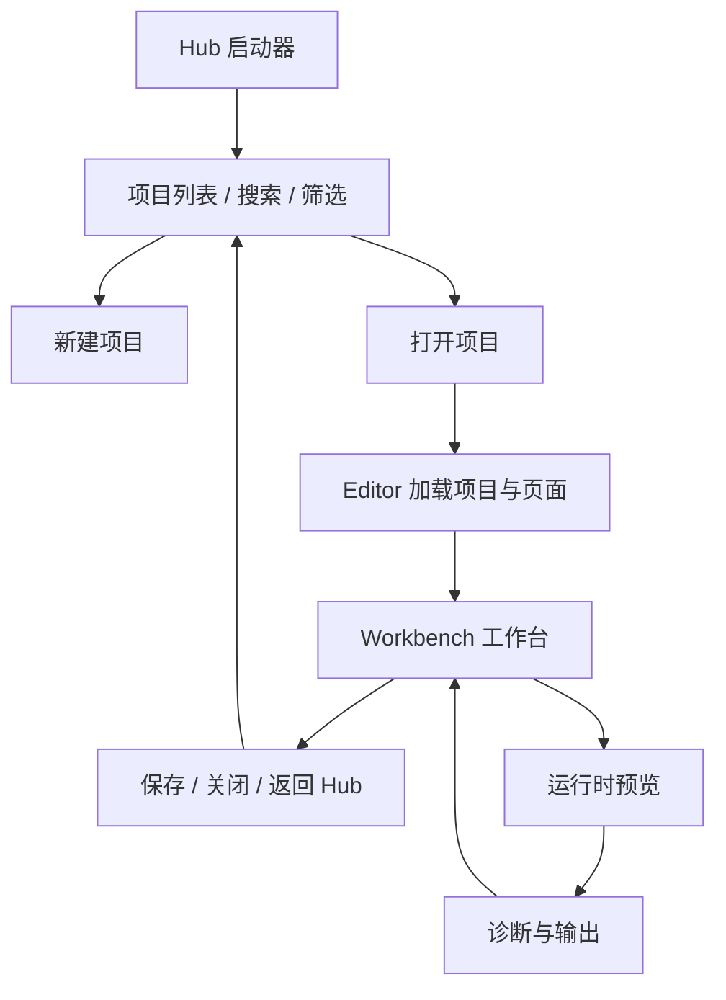
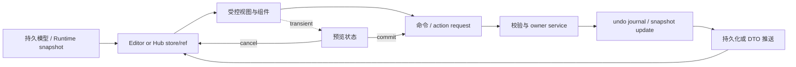
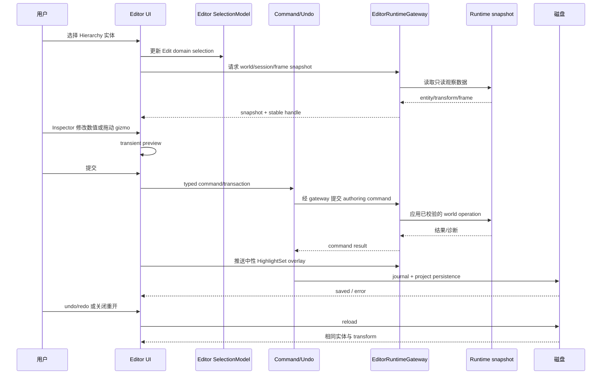

---
related_code:
  - zircon_runtime_interface/src/ui/mod.rs
  - zircon_runtime_interface/src/ui/style.rs
  - zircon_runtime_interface/src/ui/layout/mod.rs
  - zircon_runtime_interface/src/ui/component/descriptor/slot_schema.rs
  - zircon_runtime_interface/src/ui/component/data_binding/mod.rs
  - zircon_runtime/src/ui/layout/mod.rs
  - zircon_runtime/src/ui/layout/taffy_bridge/compute.rs
  - zircon_runtime_interface/src/ui/surface/render/command.rs
  - zircon_runtime/src/ui/surface/input
  - zircon_editor/src/ui/retained_host/app.rs
  - zircon_editor/src/ui/workbench/mod.rs
  - zircon_editor/src/ui/layouts/views
  - zircon_editor/src/ui/layouts
  - zircon_editor/assets/ui/editor
  - zircon_editor/assets/ui/editor/layout/shell_regions.toml
  - zircon_editor/assets/ui/editor/layout/presets.toml
  - zircon_editor/assets/ui/editor/layout/page_templates.toml
  - zircon_hub/src/tauri_app/commands.rs
  - zircon_hub/src/tauri_app/action_request.rs
  - zircon_hub/src/tauri_app/view_model.rs
  - zircon_hub/src/state/hub_snapshot.rs
  - zircon_hub/package.json
  - zircon_hub/web/src
  - zircon_hub/tests
  - tools/ui-profile-scale-fixture.ps1
  - tools/profile-capture-manifest.ps1
design_references:
  - dev/penpot/README.md
  - dev/penpot/HIGHLIGHTS.md
  - dev/penpot/CHANGES.md
  - dev/penpot/frontend/src/app/main/ui/workspace.cljs
  - dev/penpot/frontend/src/app/main/ui/workspace.scss
  - dev/penpot/frontend/src/app/main/ui/workspace/sidebar.cljs
  - dev/penpot/frontend/src/app/main/ui/workspace/left_header.cljs
  - dev/penpot/frontend/src/app/main/ui/workspace/right_header.cljs
  - dev/penpot/frontend/src/app/main/ui/workspace/top_toolbar.cljs
  - dev/penpot/frontend/src/app/main/ui/workspace/viewport.cljs
  - dev/penpot/frontend/src/app/main/data/persistence.cljs
  - dev/penpot/frontend/src/app/main/ui/ds.cljs
  - dev/penpot/frontend/src/app/main/ui/ds/colors.scss
  - dev/penpot/frontend/src/app/main/ui/ds/spacing.scss
  - dev/penpot/frontend/src/app/main/ui/ds/_sizes.scss
  - dev/penpot/frontend/src/app/main/ui/ds/_borders.scss
  - dev/penpot/frontend/src/app/main/ui/ds/typography.scss
  - dev/penpot/frontend/src/app/main/ui/ds/elevations.scss
  - dev/penpot/frontend/src/app/main/ui/ds/buttons/_buttons.scss
  - dev/penpot/frontend/src/app/main/ui/ds/buttons/icon_button.cljs
  - dev/penpot/frontend/src/app/main/ui/ds/controls/shared/dropdown_navigation.cljs
  - dev/penpot/frontend/resources/styles/common/refactor/design-tokens.scss
  - dev/penpot/plugins/libs/plugin-types/index.d.ts
  - dev/penpot/plugins/apps/zircon-zui-plugin
  - docs/ui-and-layout/editor-workbench-designs/STYLE-NOTES.md
  - docs/plans/zircon_editor/editor_layout/index.md
  - docs/plans/zircon_editor/editor_ui/index.md
  - docs/plans/zircon_hub/index.md
  - docs/plans/mvp/index.md
plan_sources:
  - "user: 2026-08-31 以 dev/penpot 作为界面设计参考，为 ZirconEngine 编写完整界面设计计划"
  - "user: 2026-08-31 先兼容当前 Penpot，实现 .zui 与 Penpot 资产互相转换，再推进 ZirconEngine 自举布局"
  - docs/plans/milestone-validation-policy.md
  - docs/plans/minimum-viable-engine-foundation.md
  - docs/plans/zircon_editor/editor_layout/01-design-tokens-and-language-contract.md
  - docs/plans/zircon_editor/editor_layout/02-declarative-layout-interface.md
  - docs/plans/zircon_editor/editor_layout/03-jetbrains-docking-workbench.md
  - docs/plans/zircon_editor/editor_layout/04-layout-presets-and-persistence.md
  - docs/plans/zircon_editor/editor_layout/05-page-layout-templates.md
  - docs/plans/zircon_editor/editor_layout/07-windowing-chrome-tabs-and-dockable-drawers.md
  - docs/plans/zircon_editor/editor_layout/09-incremental-message-bus-and-refresh.md
  - docs/plans/zircon_editor/editor_layout/11-data-binding-and-reactive-contract.md
  - docs/plans/zircon_editor/editor_layout/12-widget-slot-componentization.md
  - docs/plans/zircon_editor/editor_layout/15-component-standardization-from-primitives.md
  - docs/plans/zircon_editor/editor_layout/15e-domain-breakpoint-adaptation.md
  - docs/plans/zircon_editor/editor_layout/16-relative-layout-and-resolution-adaptation.md
  - docs/plans/zircon_editor/editor_layout/18-input-response-and-hit-testing.md
  - docs/plans/zircon_editor/editor_layout/19-focus-and-navigation-model.md
  - docs/plans/zircon_editor/editor_layout/20-style-cascade-and-computed-style.md
  - docs/plans/zircon_editor/editor_layout/21-gpu-submission-and-draw-pipeline.md
  - docs/plans/zircon_editor/editor/01-editor-kernel-and-runtime-interaction.md
  - docs/plans/zircon_editor/editor/03-command-transaction-and-undo.md
  - docs/plans/zircon_editor/editor/05-scene-editing-hierarchy-and-gizmos.md
  - docs/plans/zircon_editor/editor/06-ui-extension-framework.md
  - docs/plans/zircon_editor/editor/09-editor-asset-management.md
  - docs/plans/zircon_editor/editor/10-project-and-asset-reference-management.md
  - docs/plans/zircon_editor/editor/12-plugin-management.md
  - docs/plans/zircon_editor/editor/14-threading-and-job-scheduling.md
  - docs/plans/zircon_editor/editor/17-editor-services-and-recovery.md
  - docs/plans/zircon_editor/editor_ui/04-style-theme-and-painter-selector.md
  - docs/plans/zircon_editor/editor_ui/05-ui-asset-management.md
  - docs/plans/zircon_editor/editor_ui/06-component-library-mui.md
  - docs/plans/zircon_editor/editor_ui/08-workbench-shell-on-runtime-ui.md
  - docs/plans/zircon_runtime/runtime/06-plugin-surface-and-lifecycle.md
  - docs/plans/zircon_plugins/01-plugin-architecture-core.md
  - docs/plans/zircon_plugins/10-editor-integration.md
  - docs/plans/zircon_hub/02-background-task-framework-and-persistence.md
  - docs/plans/zircon_hub/05-frontend-componentization-and-type-safety.md
  - docs/plans/zircon_hub/06-layout-and-visual-standard.md
  - docs/plans/zircon_hub/07-localization-schema-and-coming-soon.md
  - docs/plans/zircon_hub/index.md
  - docs/plans/designment/02-milestone-execution-and-evidence.md
implementation_files:
  - dev/penpot/plugins/apps/zircon-zui-plugin/src/bridge/zui-document.ts
  - dev/penpot/plugins/apps/zircon-zui-plugin/src/bridge/penpot-projection.ts
  - dev/penpot/plugins/apps/zircon-zui-plugin/src/bridge/penpot-reconcile.ts
  - dev/penpot/plugins/apps/zircon-zui-plugin/src/plugin.ts
  - zircon_runtime_interface/src/ui/component/descriptor/slot_schema.rs
  - zircon_runtime_interface/src/ui/surface/render/command.rs
  - zircon_editor/src/ui/retained_host/app.rs
  - zircon_editor/src/ui/workbench/mod.rs
  - zircon_editor/assets/ui/editor/layout/shell_regions.toml
  - zircon_hub/src/tauri_app/view_model.rs
  - zircon_hub/web/src/App.tsx
  - zircon_hub/web/src/theme/muiTheme.ts
tests:
  - dev/penpot/plugins/apps/zircon-zui-plugin/src/bridge/zui-document.spec.ts
  - dev/penpot/plugins/apps/zircon-zui-plugin/src/bridge/penpot-projection.spec.ts
  - dev/penpot/plugins/apps/zircon-zui-plugin/src/bridge/penpot-asset.spec.ts
  - zircon_runtime/tests/zui_penpot_bridge_contract.rs
  - zircon_runtime_interface/src/ui/surface/render/batch/tests.rs
  - zircon_editor/tests/integration_contracts.rs
  - zircon_editor/src/ui/layouts/views/asset_browser/tests/mod.rs
  - zircon_hub/tests/tauri_react_shell_contract.rs
  - zircon_hub/web/tests/window_action_scheduler.test.mjs
  - tools/tests/ui-profile-scale-fixture.Tests.ps1
  - tools/tests/ui-profile-capture-output-contract.Tests.ps1
doc_type: milestone-detail
status: design-ready
last_refined: 2026-08-31
---

# Penpot 参考的 ZirconEngine 完整界面设计计划

## 0. 计划摘要

### 0.1 目标

建立一套面向工程师、技术美术和项目协作者的 ZirconEngine 界面设计语言，并将它分阶段落到两个产品面：

- **Zircon Editor**：以全视口、可停靠、可调整大小的工作台承载场景编辑、资产、Inspector、预览、动画和诊断。
- **Zircon Hub**：以 Tauri + React/MUI 承载项目启动、项目管理、构建、设置和状态反馈；它与编辑器共享语义而不共享宿主实现。

计划采用 Penpot 的思路和模式：开放标准、令牌作为单一事实源、组件/变体/库、语义面板、显式保存状态、可撤销命令、键盘优先、协作状态可见、响应式 Grid/Flex，以及把高频预览状态与已提交历史分开。计划不复制 Penpot 的 ClojureScript/Rumext/Potok 代码，也不把浏览器 DOM 或 CSS 作为编辑器运行时的前提。

### 0.2 交付原则

1. 先收敛产品结构和契约，再做视觉细节；任何新页面必须能指出所属区域、状态源、命令入口和退出条件。
2. 语义令牌优先。页面、`.zui` 资产、Hub 主题和截图 fixture 不得直接散落颜色、间距、圆角或状态值。
3. 组件是可组合的带槽位契约，不是一次性页面片段；同一行为只保留一个 owner。
4. 编辑器采用 `source model -> snapshot/ref -> view -> command -> journal/persist` 的单向路径；UI 不直接修改 ECS 或 runtime 世界。
5. 所有可变更操作可撤销、可重放、可诊断；预览中的连续拖动只在提交点进入历史。
6. Loading、Empty、Error、Disabled、Read-only、Pending、Saved、Conflict 等状态与成功态同等重要，并且每个状态都有可观察证据。
7. 以结构、组件和交互契约验收，不追求 Penpot 的逐像素复制；现有 Zircon 深色工作台语言仍是默认视觉权威。
8. MVP 是产品闸门。高级面板可以先设计，但不能以它们的静态完成掩盖 F0-F5 尚未闭环。

### 0.3 范围与非目标

**范围**

- 跨产品信息架构、工作台区域、页面模板、导航和窗口状态。
- 设计令牌、主题、组件/变体/槽位、图标、排版、密度和动效语义。
- 编辑器画布、选择/变换/Inspector、层级、资产和 token/library 工作流。
- Hub 的项目入口、项目详情、构建/任务、设置、团队/目录占位和错误恢复。
- 命令、快捷键、焦点、撤销/重做、持久化反馈、协作/评论占位和可访问性。
- 响应式、DPI、性能、截图和验收证据。

**非目标**

- 不实现 Penpot 的在线协作后端、浏览器插件、MCP 服务或云端权限系统。
- 不新增替代 `zircon_runtime_interface` 的 UI ABI，不在编辑器引入 Slint，不改变 Hub 的 Tauri/React/MUI 所有权。
- 不把 Penpot 的源码结构、命名或 CSS 变量原样搬入 Rust/`.zui`。
- 不在 MVP 之前承诺完整多人实时编辑、插件市场、复杂原型发布或完整动画曲线编辑。
- 不以“看起来像截图”作为唯一完成标准；像素差异必须能解释为字体、平台或密度差异，结构性回归仍必须修复。

### 0.4 用户角色与优先级

| 角色 | 高频任务 | 设计优先级 | 成功信号 |
|---|---|---|---|
| 引擎/游戏程序员 | 创建项目、运行场景、查看诊断、修改可运行参数 | P0 | 从 Hub 打开项目后能快速定位运行/错误状态 |
| 技术美术/场景作者 | 层级选择、gizmo/Inspector 调整、资产引用、预览 | P0 | 选择、修改、撤销、保存和重开没有第二套路径 |
| UI/工具作者 | 组件、`.zui`、token、页面模板和插件槽位 | P1 | 复用 catalog/slot，不需要复制 shell 或 raw style |
| 评审/协作者 | 只读查看、状态理解、评论/诊断定位 | P1（MVP 后） | 权限和能力边界清楚，不把占位当成实时协作 |
| Hub/构建操作者 | 搜索项目、启动任务、重试失败、查看日志 | P0 | 长任务异步、进度可解释、失败可恢复 |

优先级裁决顺序为：项目可启动和可恢复 -> 场景可观察和可编辑 -> 资产/组件可复用 -> 诊断和协作增强 -> 视觉 polish。任何设计决策都必须说明它服务的角色和是否阻塞 MVP。

### 0.5 MVP 闸门与设计/实现分层

`docs/plans/mvp/index.md` 当前将 F0-F5 标为 `blocked_by_*`，因此本计划采用三层门控：

| 阶段 | 允许内容 | 禁止内容 | 晋级条件 |
|---|---|---|---|
| Pre-F5 foundation | M0 审计、M1 令牌/组件契约、直接支撑 F0-F4 的 M2/M3 壳和 fixture | 高级面板的产品化实现、插件扩展、协作假数据、以截图填写完成记录 | 只能由对应 F gate owner 证明直接解除 foundation 阻塞 |
| Post-F5 product | M4-M8 的资产/library、反馈、Hub polish、domain panels、插件和完整视觉/性能验收 | 重新绕过 owner 计划或重建已存在的 runtime UI 基础设施 | `docs/plans/mvp/index.md` 的 F0-F5 全部 `accepted`，且有 clean validation copy |
| Release/maintenance | M9 集成、贡献门禁、迁移和上游模式复审 | 把未验收 failure 标成完成 | M8 证据齐全并经 owner review |

上层里程碑可以在 Pre-F5 阶段**只写设计契约、schema、fixture 和失败回传**，但状态表必须保持空白，不能宣称产品能力已交付。M4-M8 的每个实现切片都要在 validation manifest 中填写 `mvp_gate: F5-accepted`；若某个切片确实直接解除 F0-F4 阻塞，必须附对应 F gate 的 failure/owner 链接。

### 0.6 当前基线（2026-08-31）

- `docs/plans/mvp/index.md` 当前仍为 `in_progress`，F0-F5 保持 `blocked_by_*`；本计划不改变这些状态，也不把源码存在、历史输出或静态截图当作 accepted。
- `editor_layout`、`editor_ui/08`、Editor gateway/scene 和 Hub 子计划仍可能有 open failure 或未完成 managed validation。后续执行必须以 current-source、owner handoff 和本文件 companion 的实际 evidence 为准。
- 因此本次文档产出本身属于 `design-ready` 计划交付；M0-M3 的“退出”表示契约/交接就绪，M4-M9 的产品实现和视觉验收必须等待明确 gate。

## 1. 参考审计与模式转译

### 1.1 Penpot 模式清单

| Penpot 模式 | 本地证据 | ZirconEngine 的采用方式 | 明确不照搬 |
|---|---|---|---|
| Dashboard -> full-viewport workspace | `workspace.cljs`、`workspace.scss` | Hub 负责项目入口；Editor 打开后进入独立全视口工作台 | 不把 Hub 页面嵌入 Editor 进程 |
| 左右语义侧栏 + 中央画布 | `workspace/sidebar.cljs`、`workspace.scss` | 左侧工具/层级/资产，中央 viewport，右侧 Inspector/评论/诊断；区域由 `shell_regions.toml` 约束 | 不用网页绝对定位取代 Taffy/保留式布局 |
| 可折叠、可拖拽、可持久化面板 | `sidebar.cljs`、layout refs、resize hooks | drawer extent、preset、split、collapse 状态写入布局持久化 | 不把每个像素尺寸写成页面常量 |
| 上下文头部 | `left_header.cljs`、`right_header.cljs` | 项目/文件/页面上下文、保存状态、presence、zoom、分享/只读状态集中显示 | 不在标题栏复制业务状态的第二份事实 |
| 工具分组与飞出菜单 | `top_toolbar.cljs` | icon-first 工具组、hover 延迟、键盘切换、`aria-pressed`、tooltip | 不用无标签的图标堆替代命令模型 |
| 组件目录与 Storybook | `ds.cljs`、`ds/` | Runtime `.zui` catalog + Rust fixture + Hub MUI fixture；同一语义组件有变体和状态样例 | 不引入 Rumext/React 到 Editor runtime |
| 语义设计令牌、多主题 | `colors.scss`、`design-tokens.scss` | `editor.*`/`hub.*` 语义 token，主题映射和状态层级；Editor dark-first，Hub 继承产品主题 | 不直接复制 Penpot 的颜色数值或命名空间 |
| 高频预览与已提交历史分离 | `viewport.cljs`、`frontend/src/app/main/data/persistence.cljs` | pointer/drag/zoom 走 transient surface state；pointer-up/commit 进入 command/undo/persist | 不在每个 pointer move 写磁盘或污染撤销栈 |
| 显式保存、错误、冲突反馈 | `left_header.cljs`、persistence 状态 | Pending/Saving/Saved/Error/Conflict 可见，失败可重试、回滚或导出诊断 | 不用静默 autosave 掩盖失败 |
| 键盘导航和可访问图标 | `icon_button.cljs`、`dropdown_navigation.cljs` | 统一命令/焦点/菜单路由；icon-only 必须有 label 和 tooltip | 不以 hover 作为唯一操作入口 |
| Token/library/import/export | workspace token modules、design token SCSS | Engine token catalog、asset registry、library dependency 状态和导入预览 | 不承诺跨产品格式兼容，先定义可验证子集 |
| Presence、评论、分享权限 | `right_header.cljs`、workspace comments | 先做只读/本地 presence/status contract，再按 owner 计划接入协作 | 不伪造未存在的远端用户或同步状态 |

### 1.2 设计判断

Penpot 的可迁移核心不是“紫色/薄边框/网页布局”，而是把设计对象、交互状态、组件资产和代码交付放进同一套可追踪系统。ZirconEngine 应把这套思想翻译为：



这意味着设计文档本身必须描述状态源、边界和证据，而不是只列颜色或画面参考。

### 1.3 Penpot authoring bridge 与自举边界

Penpot 模式在本计划中首先落为一个可逆 authoring bridge，而不是第二套 UI schema。`.zui` v2 始终是运行时和版本控制中的事实源；Penpot board 是可视化编辑投影，插件 shared data 保存不可视字段和原始 document，Zircon loader/compiler 是最终接受者。



桥接资产使用以下视觉结构：

- 一个 asset board 对应一个 `.zui` document，保存 asset id、文件名和完整 metadata document。
- 每个语义 node 对应一个带稳定 node id/component metadata 的 board；shape 名称只服务可读性，重命名不改变语义身份。
- 文本以辅助 text shape 编辑；只有映射到 `text`、`value_text`、`value`、`placeholder` 或 `label` 的字符变化才回写。
- 不可达 node 进入单独的 Detached lane，仍参与导出完整性检查，不会被静默删除。
- `events`、bindings、repeat、imports、tokens、component contract、style scope 和未知表保存在 metadata 中；无显式映射时只读保留。
- 导出先比较 baseline/current，只写回受支持且实际变化的字段；缺失、重复、循环或 metadata 不一致会阻止导出。

截至 2026-08-31，bridge 已对共享工作树中可读取的 303 个当前 v2 `.zui` 做解析、投影和再序列化审计，覆盖 5516 个语义节点；7 个 style、1 个 theme_tokens 的无 node profile 也可原样往返。15 个 v1/旧 kind 测试夹具按版本策略拒绝，1 个被其他会话从工作树删除的跟踪文件不计入兼容结论。A0/A1/A2 的实时证据和未闭合项由 [02 companion](./02-milestone-execution-and-evidence.md) 维护。

## 2. 产品信息架构

### 2.1 跨产品入口



入口约束：Hub 只负责项目级生命周期和任务状态；Editor 负责页面/场景级作者操作；Runtime 负责运行世界和渲染；`zircon_runtime_interface` 负责跨边界稳定契约。

### 2.2 Editor 工作台区域

| 区域 | 默认内容 | 可替换内容 | 状态 owner | Penpot 转译 |
|---|---|---|---|---|
| Top Toolbar/Header | 项目上下文、文件/页面、保存状态、命令工具 | 运行/停止、布局 preset、只读徽章 | Editor shell + project session | left/right header + grouped tools |
| Left Activity Rail | 工具、页面、项目、资产、组件、token 入口 | 插件贡献项 | layout registry | semantic tab switcher |
| Left Drawer | 工具参数、Scene/Hierarchy、Asset Browser、Libraries | 页面专属 tree/list | domain view model | resizable semantic sidebar |
| Center Document Tabs | 场景、UI、Material、Animation、Preview | 打开的文档类型 | document registry | document context |
| Center Viewport | 画布、选择、变换、网格、标尺、吸附、预览 | split view、debug overlay | retained host + runtime snapshot | layered viewport |
| Right Drawer | Inspector、Design/Token、Comments、History、Diagnostics | 插件 Inspector section | editor authoring state | right sidebar modes |
| Bottom Output | Console、Build、Timeline、Problems、Status | 可停靠输出面板 | diagnostics/timeline owner | bottom toolbox |
| Floating Layer | Command Palette、Preferences、Context Menu、Toast | modal/dialog/popover | windowing + command router | overlay windows |

区域状态分成两类，避免把 UI 控件状态写进区域资产：`editor_layout`/WorkbenchLayout owner 负责 `visible`、`collapsed`、`resizable`、`extent` 等结构状态及其 preset 持久化；shell capability/command owner 负责 `active`、`disabled`、`read_only` 等派生交互状态。只有在既有 schema 允许的字段上扩展，新增字段必须由对应 owner 的迁移计划和 round-trip 测试批准；页面组件不得私自改写全局 shell。

### 2.3 Editor 页面模板

第一阶段只为下列模板定义稳定骨架，模板复用同一个 shell：

| 模板 | 主要工作 | MVP 关系 | 首要面板 |
|---|---|---|---|
| Welcome/Project Open | 选择、创建、恢复项目 | F0 | recent projects、diagnostics |
| Scene Authoring | 场景层级、实体选择和变换 | F1-F4 | hierarchy、viewport、Inspector |
| Game/Runtime Preview | 运行时观察与输入 | F2/F5 | viewport、status、console |
| Asset Browser | 注册、搜索、预览和引用资产 | F1 | asset tree、preview、metadata |
| UI Designer | `.zui` 结构、组件和样式 token | 后置 | tree、canvas、Inspector |
| Material/Shader | 材质参数和编译状态 | 后置 | asset/library、property editor |
| Animation | 时间线、关键帧和曲线 | 后置 | timeline、curve editor、Inspector |
| Diagnostics/Debug | 日志、性能和失败定位 | F2/F5 支撑 | console、problems、runtime state |

### 2.4 Hub 页面模板

Hub 继续使用现有 Tauri/React/MUI 页面集合，按 Penpot 的项目入口思路统一信息密度和反馈：

- Projects：搜索、筛选、最近打开、创建/打开、空状态和恢复失败。
- Project Detail：项目摘要、最近页面、资产/构建任务、打开 Editor。
- Builds/Tasks：任务队列、阶段进度、可重试错误、日志入口。
- Catalog/Libraries：可用模板/资产/组件库；当前没有后端能力时显示明确的本地/不可用状态。
- Settings：主题、语言、路径、快捷键和诊断导出。
- Team/Workspace：保留结构和权限状态，但不虚构实时协作能力。

### 2.5 页面、Board 与实体层级

Penpot 的 page/board/layer 语义在 Zircon 中映射为可定位的上下文链，不把“画布上的一个节点”和“运行时世界”混为一谈：

```text
Project -> File -> Page/Document -> Board/Scene -> Layer/Entity -> Component/Asset reference
```

- breadcrumb、document tab、Hierarchy 和 Inspector 必须显示同一条 context path，并携带 generation/revision。
- Page/Document 是 Editor authoring owner；Board/Scene 的可观察数据来自 runtime snapshot；Layer/Entity 的选中集由 Editor `SelectionModel` 持有。
- 移动、复制、重命名、删除、嵌套和切换页面都走 typed command/transaction；切换页面先保存或明确 dirty 冲突。
- 空 page/board 提供创建下一步；失效 parent、缺失 asset 或旧 schema 显示可恢复错误，不自动把节点移到隐含根节点。
- 本映射只定义语义和导航，不要求 Runtime 采用 Penpot 的对象模型或序列化格式。

## 3. 设计语言与令牌计划

### 3.1 令牌层级

采用三层令牌，名称与现有 `editor_layout/01` 对齐：

1. **原始值层**：平台/主题所需的基础色、字体、尺寸，仅在 token 源文件出现。
2. **语义层**：`editor.surface.1`、`editor.content.primary`、`editor.accent.active`、`hub.status.error` 等，组件只消费这一层。
3. **组件/状态层**：`editor.button.primary.hover`、`editor.tree.row.selected`、`editor.inspector.field.invalid` 等，定义状态映射和可访问对比度。

推荐表达：

```text
editor.surface.1 -> editor.control.background -> editor.button.secondary.rest
$editor.surface.1 -> $editor.button.secondary.rest
var(--editor-surface-1) -> var(--editor-button-secondary-rest)
```

具体语法由已有 Runtime style/cascade 契约裁决；上表只表达别名关系，不要求三种实现同时存在。

### 3.2 令牌分类

| 类别 | 必备语义 | 说明 |
|---|---|---|
| Surface | canvas、surface.0-3、panel、overlay、inverse | 现有深色工作台的层级，不靠阴影堆层 |
| Content | primary、secondary、muted、disabled、inverse、link | 文本/图标共用对比度角色 |
| Accent | active、selected、focus、info、teal-action | Teal 只用于行动、选择和焦点，不铺满背景 |
| Status | success、warning、error、progress、conflict | 每个状态至少有颜色、图标、文本三种表达中的两种 |
| Control | rest、hover、pressed、selected、focus、disabled、invalid | 统一交互状态矩阵 |
| Space | xxs=2、xs=4、sm=8、md=12、lg=16、xl=20、xxl=24、xxxl=32 | 与 Penpot spacing 思路同构，数值由 Zircon token 定稿 |
| Size | icon、control、row、rail、drawer-min/max、dialog | 稳定尺寸，避免动态文本造成布局跳动 |
| Type | display、title、headline、body、label、code、numeric | Editor 以紧凑工作台排版为主，禁止 hero-scale |
| Motion | hover、press、open、close、resize、progress、reduced-motion | 动效表达状态变化，不做装饰性循环动画 |
| Elevation | panel、popover、dialog、dragging | 优先边框和层级，阴影只用于真正浮层 |
| Breakpoint | compact、standard、wide、ultrawide、dpi-scale | 逻辑单位和区域折叠，而非缩放整张截图 |
| Layer | canvas、panel、overlay、modal、tooltip | 统一 z-index/命中测试顺序 |

### 3.3 视觉基线

- Editor 沿用 `docs/ui-and-layout/editor-workbench-designs/STYLE-NOTES.md` 的近黑表面、低圆角、1px 分隔和克制 teal；Penpot 的多主题思想用于组织 token，不覆盖现有品牌语言。
- Hub 保留 MUI 主题和既有品牌色，通过同名语义角色对齐 surface/content/status；不把 Editor 的暗色变量直接复制进 Hub。
- 默认圆角只允许 token 中的 0/4/6/8/12 等离散值；工作台区域不使用渐变、发光、装饰性 orb 或嵌套卡片。
- 字体、行高和数字字段必须固定在 token；数值输入使用等宽或 tabular numbers，避免 Inspector 读数跳动。
- 所有可见文本必须在容器内完整显示；长项目名、错误信息、树节点和 tab 采用省略、换行或可展开详情，并保留完整 tooltip/辅助文本。

### 3.4 主题与密度

第一期：Editor dark-first + Hub 当前主题；第二期：在语义 token 不变的前提下增加 Editor light/high-contrast fixture。密度提供 `comfortable` 与 `compact` 两档：

- comfortable：适合首次使用和触控/高 DPI。
- compact：适合层级、资产表、Inspector 和时间线的高密度工作。

密度切换只能改变 token，不得让页面组件分叉出两套布局实现。

## 4. 组件、资产与槽位目录

### 4.1 组件分层

| 层 | 组件族 | 必须具备的契约 |
|---|---|---|
| Foundation | Icon、Text、Heading、Divider、Surface、FocusRing、Portal | 语义标签、主题 token、最小尺寸、测试 fixture |
| Controls | Button、IconButton、Input、NumericInput、Select、Combobox、Checkbox、Radio、Switch、Slider、SegmentedControl | value/on-change、disabled/read-only、invalid、keyboard、aria |
| Navigation | ActivityRail、TabStrip、Tree、TreeRow、Breadcrumb、Accordion、Pagination | active/expanded、focus path、overflow、命令 ID |
| Data | ListRow、TableRow、PropertyRow、AssetCard、ThumbnailGrid、EmptyState、Skeleton | stable geometry、loading/empty/error、virtualization 边界 |
| Feedback | Tooltip、Popover、ContextMenu、Dialog、Toast、Banner、Progress、StatusPill | 锚点、焦点回收、Esc、可重试 action、live region |
| Editor composite | WorkbenchShell、Drawer、InspectorSection、HierarchyPanel、ViewportToolbar、TimelineStrip、CommandPalette、PreferencesWindow | owner、slots、layout binding、state snapshot |
| Hub composite | NavigationDrawer、TopBar、ProjectCard/Table、TaskRow、SettingsSection、PageHeader | DTO 驱动、路由 action、响应式和错误恢复 |

### 4.2 组件定义模板

每个新增或改造组件必须在 catalog/fixture 中记录：

```text
ComponentId
OwnerBoundary
Slots / required children
Inputs and emitted commands
Semantic roles and token aliases
Variants and state precedence
Keyboard and pointer behavior
Loading / empty / error / read-only behavior
Minimum geometry and responsive rule
Story/fixture id and focused test id
```

组件只通过 slot/descriptor 接收领域内容；领域模块不能复制一套“相似但略有不同”的按钮、树行或属性行。Editor 的 `.zui` 资产是可追踪的产品资产，Hub 的 React 组件使用同样的语义名和状态表，但保留各自宿主实现。

### 4.3 Token 与 library 的最小可验收格式

为避免“支持 token/library”变成不可测试的口号，M4 先固定一个可扩展但有边界的 v1 子集。格式最终由 `editor_layout/01`、`editor_ui/04` 和 `editor_ui/05` owner 会签；本计划不直接新增 ABI。

**Token bundle `zircon.ui.tokens/v1`**

```text
bundle_id, schema_version, source, digest
themes: { theme_id: { token_id: value } }
tokens: [
  { id, kind: color|dimension|number|boolean|string|typography,
    value_or_alias, description, deprecated }
]
```

v1 必须支持：语义 token、别名、dark/default theme、颜色/尺寸/数字/布尔/字符串/基础 typography；必须拒绝：别名环、未知 kind、未注册 token、跨 bundle 的隐式路径、任意脚本表达式和未验证的渐变/滤镜对象。导入先生成 preview/diff，用户确认后作为一个 transaction 提交；同一 `id` 的不同 digest 必须显示冲突并要求显式选择，禁止静默覆盖。

**Library manifest `zircon.ui.library/v1`**

```text
library_id, version, engine_min_version, source, digest
dependencies: [{ library_id, version_range, digest }]
entries: [{ entry_id, kind, asset_ref, variants, exposed_slots, token_refs }]
```

v1 只保证本地可读、依赖可解析、entry 可预览、引用可落盘、缺失可诊断和失败可回滚；不承诺远端发布、自动升级或跨产品格式兼容。依赖缺失、版本不满足、digest 不一致和 schema 太新都必须阻止 apply，并提供回滚/导出诊断。

### 4.4 Component instance、override 与 library upgrade

Penpot 的 component/variant 模式需要最小的实例语义，否则“复用组件”会退化为复制：

- instance 持有 `source_entry_id`、`source_version`、variant selection 和局部 override map；override 只能落在 source 暴露的 slot/property/token 上。
- 组件更新先生成 old/new diff；可自动合并的 token/slot 更新逐项显示，删除 slot、类型改变或来源 digest 冲突必须人工决策。
- `detach` 是显式、可撤销的命令，记录原 source 和 detach reason；不能由普通编辑静默产生 detached 副本。
- library upgrade 采用 preview -> migrate -> commit；失败保持旧版本引用，不能留下半更新树。
- fixture 至少覆盖：variant 切换、合法 override、越界 override、detach/undo、library upgrade 冲突、缺失依赖和回滚。

### 4.5 图标与可访问性

- 图标优先的工具栏按钮必须提供稳定 command id、`aria-label`/可见名称、tooltip 和 pressed/selected 状态。
- 仅图标按钮的点击区域使用稳定尺寸 token；命中区域不得随图标 SVG 尺寸变化。
- 图标语义由 catalog 注册，禁止页面直接内嵌一套未命名 SVG；产品 logo 和内容预览除外。
- Tooltip 不能是唯一说明；关键命令还要出现在 command palette、菜单或键盘快捷键表中。

## 5. 状态、数据流与边界契约

### 5.1 状态分层

| 状态层 | 例子 | 来源 | 生命周期 |
|---|---|---|---|
| Persistent domain | project、scene、entity、asset、token、layout preset | 磁盘/owner store | 可保存、可版本化 |
| Authoring | selection、inspector draft、active tool、open tabs | `zircon_editor` | 可撤销、会话级 |
| Runtime snapshot | world snapshot、render status、input state、diagnostics | `zircon_runtime`/interface | 帧或运行会话级 |
| Transient surface | hover、drag preview、zoom gesture、flyout、pointer capture | UI host | 不进入历史，结束即清理 |
| Product shell | route、task progress、theme、permission/read-only | Hub/Editor shell | 跨页面或会话持久化 |

### 5.2 Owner 与契约矩阵

| 能力 | 唯一事实源/owner | UI 可消费的形态 | UI 禁止持有 |
|---|---|---|---|
| Editor selection/mode | `zircon_editor` `SelectionModel` / `SceneModeStack`（见 editor/05） | selection snapshot、focus message、neutral highlight overlay | runtime session 私有 selected state |
| Runtime world/frame | `zircon_runtime` + `EditorRuntimeGateway`（见 editor/01） | world/session/frame/overlay snapshot、typed gateway result | `LevelSystem`/`World` 深路径旁路 |
| Authoring command/undo | `zircon_editor` command/transaction owner（editor/03/08） | command descriptor、can-execute、result/diagnostic | 直接写 ECS、直接改磁盘 |
| UI layout/style | `editor_layout` + `editor_ui` owner（layout 01/02/20、UI 04/06） | region binding、computed token/style、`.zui` descriptor | 页面自建 token resolver 或平行 ABI |
| UI assets/components | `editor_ui/05`、`editor_ui/06` 与 editor asset owner | catalog entry、slot schema、validated asset ref | 复制组件树、未注册 `.zui` |
| Hub lifecycle/tasks | `zircon_hub` Rust action/DTO owner | typed snapshot、generation、progress/error | 前端自行写配置或猜测后台状态 |
| Collaboration capability | 现有 Hub/Editor permission contract；未有 backend 时为 disabled | capability enum + real event only | 本地假用户、假 unread、假 remote sync |

### 5.3 单向路径



禁止项：

- 视图直接写 ECS、runtime world、Hub 配置或磁盘。
- 同一状态同时由页面局部 state、全局 store 和 DTO 各自维护且没有 generation/sequence 规则。
- pointer move、hover 或 resize 每次都产生持久化写入和 undo entry。
- 通过 fallback 文本/假数据掩盖 DTO、资产或 runtime snapshot 缺失。

### 5.4 通用状态矩阵

状态优先级固定为：`disabled > pressed > selected/focused > hovered > default`。领域错误和只读是正交维度，不能靠颜色覆盖。

| 组件/区域 | 必须覆盖的状态 | 行为要求 |
|---|---|---|
| Button/IconButton | default/hover/pressed/focus/disabled/read-only/busy | busy 保留尺寸，防止重复命令 |
| Field/NumericInput | empty/focused/invalid/dirty/committing/disabled/read-only | 输入法、单位、范围和错误原因可见 |
| Tree/Tab | active/selected/expanded/disabled/loading/empty/error | 键盘上下/左右/Enter/Esc，状态不依赖 hover |
| Drawer/Window | open/collapsed/resizing/blocked | resize 有最小/最大边界，关闭可恢复 |
| Viewport | loading/ready/empty/error/read-only/preview/running | 画布空态可执行下一步，错误可导出诊断 |
| Persistence | clean/pending/saving/saved/error/conflict/offline | 状态在 header/status bar 可定位，失败提供重试 |
| Task/Build | queued/running/progress/succeeded/failed/cancelled | 任务不会阻塞交互线程，支持取消或查看日志 |
| Collaboration | no-session/present/comment-unread/permission-read-only | 无后端时显示能力边界，不伪造在线状态 |

## 6. 核心交互流程

### 6.1 项目启动与打开

1. Hub 显示项目列表和明确的加载/空/失败状态。
2. `create-project`/`open-project` 通过现有 typed action/DTO 路径进入后台任务队列。
3. 任务阶段至少暴露 `queued -> loading -> validating -> opening -> ready/error`。
4. Editor 建立 project/file/page context，加载 layout preset、token catalog 和资产注册表。
5. 任意失败保留可复制诊断、重试或返回 Hub 的路径；不得打开半初始化工作台。

### 6.2 MVP 场景编辑闭环



`SelectionModel` 是 Editor 的唯一选中事实源；Runtime 只提供 world/session/frame 观察数据，并接收中性的 id/highlight overlay。`EditorRuntimeGateway` 是跨边界门面，不承载 authoring selection 的第二份状态。该序列只提供 M3 的 UI 证据输入，F0-F5 的产品晋级仍由 `docs/plans/mvp/index.md` 各自的 F gate owner 决定。

### 6.3 资产与 token 工作流

- Browse：树/列表/缩略图三种视图共享筛选、排序和 selection contract。
- Search：输入有 debounce/loading/无结果状态；搜索结果不改变持久化排序。
- Inspect：右侧 Inspector 显示来源、类型、依赖、版本和可编辑字段。
- Apply/Reference：拖放或命令创建 typed asset reference；失败回滚，不留下半成品引用。
- Import/Export：显示解析、校验、冲突、成功和失败阶段；导出内容带版本和诊断。
- Library/Token：库和 token 以 dependency graph/来源状态表达，应用 token 后可预览主题影响，提交才进入 journal。

### 6.4 命令、菜单和快捷键

- 每个可撤销动作有稳定 command id、参数 schema、可读标题、can-execute 原因和 undo label。
- Toolbar、context menu、command palette、快捷键都调用同一 command registry，不在 UI 层复制业务分支。
- Flyout/菜单支持 hover 延迟但也支持 click、focus、Arrow、Enter、Esc、Tab；打开菜单时焦点可预测地进入，关闭后回到触发器。
- 冲突快捷键显示来源和当前上下文；只读/运行中/错误状态给出禁用原因。

### 6.5 预览、运行和诊断

- Preview 与 Authoring 使用明确的 mode/permission 状态，不以隐藏按钮切换。
- 运行时启动、停止、暂停、重载和输入路由都有进度与失败反馈。
- Console/Problems/Runtime diagnostics 共享 correlation id；从错误行可跳回资源、实体或命令。
- 高负载操作异步、可取消、有进度；UI 帧不能等待编译、导入或持久化。

## 7. 响应式、DPI 与窗口行为

### 7.1 布局规则

- Editor shell 使用区域约束、Grid/Flex、Taffy 和逻辑单位；禁止用整页绝对坐标定位主要区域。
- Drawer 有 `min/max/preferred` extent；空间不足时按优先级折叠内容：底部输出 -> 次要 drawer -> activity rail label，中央 viewport 保留可用最小尺寸。
- Hub 使用 MUI breakpoints 和流式容器；项目卡、表格、筛选栏必须在窄宽度下换行或切换紧凑布局。
- 文档 tab 过多时使用 overflow menu/scroll affordance；不得压缩到文字不可读。

### 7.2 验证视口

最低截图矩阵：

| 产品 | 宽度/高度 | 额外条件 |
|---|---|---|
| Editor | 1280x720、1440x900、1920x1080 | dark、comfortable/compact |
| Editor | 1024x768、900x700 | drawer 折叠与 tab overflow |
| Editor | 1440x900 | Windows 125%、150%、200% DPI |
| Hub | 1280x720、1440x900 | projects/detail/build/settings |
| Hub | 1024x768、768x1024 | drawer、表格和表单重排 |
| Both | 任一基准尺寸 | loading/empty/error/read-only/reduced-motion |

验收关注结构、文字完整性、焦点、命中区域、滚动和状态对比；截图只是证据，不是唯一测试。

## 8. 可访问性与可用性基线

- 语义 HTML/控件或其等价 runtime role；键盘可以进入、操作和退出所有工作区控制。
- Focus-visible 使用独立 token；不能用颜色变化替代焦点环。
- Icon-only、树节点、tab、菜单项、进度和错误都有可读名称/状态；动态消息使用合适的 live region 或 runtime notification contract。
- Tab 顺序按视觉/工作流顺序，浮层打开时焦点捕获，关闭后恢复。
- 拖放、gizmo、颜色/图标状态都有键盘或数值输入等价路径；不能要求精确指针操作。
- reduced-motion 时取消非必要位移动画，只保留状态和焦点反馈。
- 对比度、最小命中尺寸、文本缩放和高 DPI 在 fixture 中验证；长文本、中文、英文、数字混排都要覆盖。

## 9. 里程碑与实施切片

> 每个里程碑的“测试阶段”是进入下一个里程碑前的硬门槛。实现切片可以由 owner 计划拆成更细的子计划，但不能删除本表的退出条件。

### M0. 现状基线与决策冻结

**目标**：冻结 Penpot 模式到 Zircon 术语的映射，确认现有能力、缺口、owner 和 MVP 依赖。

**切片**

- M0-S1：建立跨产品页面/区域清单，标注已存在的 `.zui`、布局 preset、Hub 组件和未验收 failure。
- M0-S2：建立模式映射表、非目标表、命令/状态/数据 owner 矩阵。
- M0-S3：为所有后续 screenshot、fixture、token 和 evidence 规定命名与目录。
- M0-S4：由 performance plan owner 将 `ui-profile-scale-fixture.ps1`、`profile-capture-manifest.ps1` 和现有 Pester contract 硬切到 companion 5.5 的 fixture schema v2；补齐 fixture ID、generator version、seed、层级/资产语义摘要和结果 DTO 校验，不保留可进入正式 baseline 的 v1 兼容读线。
- M0-S5：定稿 UI run-set 采样 gate，复用现有 profile capture/source/machine manifest，并补齐 sample-count 聚合、client size/window DPI、resolved theme/density 绑定；M0-S4/S5 均落地前性能预算不得 frozen。

**Owner 边界**：本计划编排；`editor_layout`/`editor_ui` 保持运行时 UI 契约 owner；`zircon_hub` 保持 Hub DTO/React owner。

**依赖**：只依赖现有源码和计划审计。

**测试阶段**：文档路径、frontmatter、引用文件和 owner 唯一性静态检查；`git diff --check`。若要在 M0 写入 `budget_status: frozen`，还必须通过 02 companion 5.5 规定的 fixture 与 run-set gates 及其 Pester contracts；仅完成设计审计时状态保持 `design-ready`。

**退出证据**：一张无歧义的页面/区域矩阵；每个缺口有 owner、依赖和“不做”理由；没有把 Penpot 实现细节写成 Zircon 强制接口。

### M1. 设计令牌、主题与组件契约

**目标**：在不重复建设 owner 能力的前提下，建立 semantic token、状态优先级、密度、主题和 foundation/control catalog 的可实现契约。Pre-F5 只允许契约、fixture 和直接解除 foundation gate 的最小切片；产品级组件实现要等 F5。

**切片**

- M1-S1：由 `editor_layout/01-design-tokens-and-language-contract.md` owner 审计并收敛 `editor.*` token，映射 surface/content/accent/status/control/space/type/motion/layer；本计划只记录跨产品语义映射。
- M1-S2：由 `editor_ui/04-style-theme-and-painter-selector.md`、`editor_ui/05-ui-asset-management.md` 和 `editor_ui/06-component-library-mui.md` owner 共同评审 foundation/control 的 variant/state/slot schema；Pre-F5 只生成 fixture 清单，不新建平行 resolver 或 ABI。
- M1-S3：定义 token lint/fixture 规则，禁止新页面使用未注册 raw value；dark/compact/high-DPI 样例先作为设计证据，产品实现延后到 F5 gate。

**依赖**：M0；`editor_layout/01`, `/12`, `/15`, `/20`；`editor_ui/04`, `/05`, `/06`。若切片不直接解除 F0-F4 failure，不得申请 Cargo 产品验证或填写完成记录。

**Owner/写入范围**：设计映射写入本目录；token/style、UI asset、component catalog 和 Hub theme 只能由上述 owner 计划修改。验证命令和 target/profile 由 [02-milestone-execution-and-evidence.md](./02-milestone-execution-and-evidence.md) 的 M1 manifest 记录。

**测试阶段**：先运行静态 token/raw-value 扫描和 fixture schema 校验；只有被 F gate owner 认定为直接阻塞时，才按 manifest 运行 `validate-matrix.ps1 -Package zircon_runtime_interface -SkipBuild -LibTests`、`-Package zircon_editor -SkipBuild -LibTests` 或 Hub 的受管 typecheck。不得以截图代替组件行为测试。

**退出证据**：`evidence/m1-token-component-contract.md` 中有可生成的 catalog、状态矩阵、语义 owner 和未支持项。该证据表示“契约就绪”，不表示 F0-F5 或产品组件已经 accepted。

### M2. Shell、导航与窗口模型

**目标**：将 Penpot 的全视口工作区、语义侧栏、上下文头部和浮层命令模型定义为 Editor shell 契约，并只实现直接支撑 F0/F4 的部分；其余视觉 polish 等待 F5。

**切片**

- M2-S1：由 `editor_layout/02-declarative-layout-interface.md`、`/03-jetbrains-docking-workbench.md` 和 `/04-layout-presets-and-persistence.md` owner 以 `shell_regions.toml`、`presets.toml`、`page_templates.toml` 定义区域、extent、折叠、split 和持久化 schema；区域结构状态与交互状态分离。
- M2-S2：收敛 top toolbar/header、activity rail、drawer、document tabs、bottom output、status bar 和 floating windows 的 slots。
- M2-S3：统一 command registry、keymap、tooltip、context menu、command palette、focus restoration。
- M2-S4：由 `zircon_hub/05-frontend-componentization-and-type-safety.md` 和 `/06-layout-and-visual-standard.md` owner 对齐 Hub NavigationDrawer/TopBar/PageHeader 的语义状态；项目打开/返回只在对应 F gate accepted 后做产品验收。

**依赖**：M1；`editor_layout/02`, `/03`, `/04`, `/07`, `/19`、`editor_ui/08`。产品切片依赖 F0 accepted；若仅产出契约/fixture，不得解除或填写 F0 以外的门槛。

**测试阶段**：按 M2 manifest 分开运行 Editor lib batch，精确 filter 为 `default_layout_uses_the_current_version_shell_and_roundtrips`、`preset_layout_supports_drawer_selection_detach_attach_and_focus`、`viewport_resize_projection_requires_presentation_and_render_only` 和 `focus_loss_releases_every_capture_in_the_exact_window`；integration batch 使用 `validate-matrix.ps1 -Package zircon_editor -SkipBuild -TestTarget integration_contracts`。Hub integration batch 为 `validate-matrix.ps1 -Package zircon_hub -SkipBuild -TestTarget tauri_react_shell_contract`，不得和 `-LibTests` 同传。视觉截图只在对应 F gate 或 F5 wave 中执行。

**退出证据**：`evidence/m2-shell-contract.md` 记录区域 owner、结构/交互状态映射和五个 Editor 基准尺寸（1280x720、1440x900、1920x1080、1024x768、900x700）的布局断言；Hub 只记录 action/DTO 映射。F0/F1 产品创建/打开证据仍归 `docs/plans/mvp` owner，不由 M2 代签。

### M3. Viewport、选择与 MVP Inspector

**目标**：把 Penpot layered viewport 思路转为 Zircon 的保留式 GPU 画布，并为 MVP F2-F4 提供正确的选择、变换和 Inspector 交互契约。M3 不拥有 F gate，也不在未接受的 F gate 上宣称产品闭环。

**切片**

- M3-S1：由 `editor/05-scene-editing-hierarchy-and-gizmos.md` 与 `editor_ui/08-workbench-shell-on-runtime-ui.md` 会签 viewport layer 顺序：背景/网格/场景/选择/变换 gizmo/标尺/辅助线/diagnostics；评论/presence 只保留 disabled overlay contract。
- M3-S2：由 `editor/06-ui-extension-framework.md` 的 M2 Inspector/FieldEditor owner 会签，以 Editor `SelectionModel` 为唯一选中事实源；经 `EditorRuntimeGateway` 读取 world/session/frame snapshot 和 stable handle，Inspector 只提交 typed command，禁止 view 或 FieldEditor 直接改 runtime world。
- M3-S3：由 `editor/03-command-transaction-and-undo.md` owner 实现 transient transform preview、commit/cancel、undo/redo、dirty/saving/saved/error 状态；runtime 只接收已校验的 command/neutral HighlightSet。
- M3-S4：在 `docs/plans/mvp` 对应 F3/F4 owner 接受后接入 persistence/reopen，并把证据提交给 F5 validation lane；本计划不代替 F3、F4 或 F5 的签字。

**依赖**：M2；F0 accepted 后才可进行 F2/F3 产品切片，F1/F2/F3 accepted 后才可进入 F4 交互证据；`zircon_runtime_interface` snapshot/command、`editor/01` gateway、`editor/03` transaction、`editor/05` SelectionModel、`editor/06` Inspector/FieldEditor。F5 必须由 `docs/plans/mvp/06-f5-acceptance-wave.md` 独占验收。

**测试阶段**：按 M3 manifest 分别运行 Editor lib filter `hierarchy_filter_preserves_the_editor_selection_overlay`、`play_pointer_commands_use_the_navigation_only_entry_and_block_authoring_frame_selection` 和 `ui_debug_reflector_selection_prefers_pick_top_hit`，Editor integration target `integration_contracts`，以及 Runtime Interface lib filter `ui_surface_frame_contract_carries_arranged_render_and_hit_state`、`request_requires_exact_view_frame_input_and_physical_pixel_identity`；Inspector/FieldEditor 追加 `editor/06` owner 登记的 binding/command filter。需要时再追加对应 Runtime lib batch。`-TestTarget` 与 `-LibTests` 必须互斥。F2/F4 产品 smoke 与 Windows 二次连续运行只在 mvp F5 lane 执行。

**退出证据**：`evidence/m3-viewport-inspector-contract.md` 记录 SelectionModel/gateway 边界、transient/commit 规则和 F2-F4 证据入口。M3 的完成含义是“UI 契约与 owner 交接就绪”；用户闭环只有在 MVP F0-F5 的独立记录 accepted 后才成立。

### M4. Assets、Libraries、Tokens 与 Inspector 深化

**目标**：在 MVP F5 accepted 后建立类似 Penpot libraries/tokens 的可浏览、可搜索、可预览、可引用资产工作流，并保持资产 registry 与运行时资源 owner 清晰。F5 之前只允许定义本计划 4.3/4.4 的 schema、fixture 和失败回传，不允许把高级 library 产品化。

**切片**

- M4-S1：由 `editor/09-editor-asset-management.md`、`editor/10-project-and-asset-reference-management.md` 和 `editor_ui/05-ui-asset-management.md` owner 收敛 Asset Browser 的 tree/list/grid/thumbnail、筛选、排序、搜索、空态和错误态数据契约。
- M4-S2：由 `editor/06-ui-extension-framework.md` 的 M2 Inspector/FieldEditor owner 与 `editor_ui/06-component-library-mui.md` 组件 owner 收敛 property row、numeric input、enum/select、resource picker 和 dependency/source/version 显示；复用 M1 catalog。
- M4-S3：实现本计划 4.3 定义的 `zircon.ui.tokens/v1` 最小子集：token catalog、theme preview、alias/dependency、import/export preview 和冲突提示；格式/解析 owner 仍是 `editor_layout/01` + `editor_ui/04/05`。
- M4-S4：实现本计划 4.3/4.4 定义的 `zircon.ui.library/v1`、instance override/detach、upgrade preview 和回滚；拖放只产生 typed command，资产落盘仍由 registry owner 负责。

**依赖**：设计契约依赖 M1-M3；产品实现硬依赖 `docs/plans/mvp/index.md` F0-F5 全部 accepted（尤其 F1/F3/F4/F5），以及 `editor/09`、`editor/10`、`editor_ui/04`、`/05`、`/06` owner 的 accepted gate。不得绕过 runtime asset registry 或创建第二份 `.zui` catalog。

**测试阶段**：F5 前只运行 schema/fixture 静态检查；F5 后运行 Editor lib batch `validate-matrix.ps1 -Package zircon_editor -SkipBuild -LibTests -TestFilter asset_browser` 与 integration batch `validate-matrix.ps1 -Package zircon_editor -SkipBuild -TestTarget editor_asset_facade`，需要时追加 Runtime lib batch。Hub Rust 使用真实 target `validate-matrix.ps1 -Package zircon_hub -SkipBuild -TestTarget ui_selected_project_catalog_contract`；Hub Web 在 `zircon_hub` 下运行 `node --test web/tests/catalog_group_by.test.mjs web/tests/project_search.test.mjs`。必须覆盖缺失依赖、别名环、digest 冲突、取消和回滚。

**退出证据**：F5 accepted 后，`evidence/m4-assets-library-tokens.md` 绑定 token/library schema、支持/拒绝字段、fixture、真实 registry trace 和回滚证据；资产从注册到预览、引用、保存、重开全链路可追踪。F5 之前的记录只能标记 `design-ready`，不能标记 `accepted`。

### M5. 反馈、任务、诊断与协作准备

**目标**：在 MVP F5 accepted 后让保存、构建、运行和导入状态像 Penpot 一样可见、可解释、可操作；协作只先建立能力边界和 disabled fixture，不实现或伪造远端同步。

**切片**

- M5-S1：由 `editor_ui/06-component-library-mui.md` 与 `zircon_hub/05-frontend-componentization-and-type-safety.md` owner 统一 status pill/toast/banner/progress/skeleton/empty/error primitives 和 live notification contract。
- M5-S2：由 `editor/14-threading-and-job-scheduling.md`、`editor/17-editor-services-and-recovery.md` 和 `zircon_hub/02-background-task-framework-and-persistence.md` owner 收敛任务队列、取消、重试、阶段进度、日志 correlation、问题列表与资源跳转。
- M5-S3：由 `zircon_hub/07-localization-schema-and-coming-soon.md` 与现有 permission/DTO owner 定义只读/权限/共享徽章。无协作 backend 时，fixture 只能是 `capability=unavailable` 的 disabled 状态；`active_session`、`presence`、`comment_unread` 不得由本地随机数据生成，真实事件来源未就绪时不得显示。
- M5-S4：由 Editor persistence/recovery owner 收敛保存冲突、离线/写入失败、回滚/replay、force persist 和恢复提示。

**依赖**：反馈/任务契约可在 F5 前以 schema/fixture 形式准备；任何产品实现硬依赖 F0-F5 accepted、`editor/14`/`17`、`zircon_hub/02`/`07` owner gate。协作后端不是本计划隐式依赖，未来接入必须另开 owner 计划。

**测试阶段**：F5 前只做错误状态 schema 和 disabled fixture 静态检查；F5 后按 manifest 运行 `validate-matrix.ps1 -Package zircon_editor -SkipBuild -LibTests`、`-Package zircon_hub -SkipBuild -LibTests`，并执行异步任务取消、错误注入/恢复、只读权限、notification/focus tests。截图只覆盖真实 DTO 或明确 unavailable fixture。

**退出证据**：`evidence/m5-feedback-task-recovery.md` 包含真实任务 trace、取消/重试/恢复、保存状态和 disabled collaboration fixture；任何长任务不阻塞 UI，用户能知道现在发生什么、下一步是什么、失败如何处理。伪协作数据零容忍。

### M6. Hub 产品化视觉与跨产品一致性

**目标**：在不改变 Hub 架构的前提下，把项目入口的基础可用性和（F5 后的）项目管理、设置、构建和目录页面收敛到同一语义设计系统。M6-PRE 只服务 F0/F1；M6-FULL 必须等待 F5。

**切片**

- M6-S1（M6-PRE）：由 `zircon_hub/05-frontend-componentization-and-type-safety.md` owner 只为 F0/F1 所需的 NavigationDrawer、TopBar、ProjectBrowser、open/create/error 状态定义 token/组件契约。
- M6-S2（M6-FULL）：F5 后由 `zircon_hub/06-layout-and-visual-standard.md` owner 统一 page header、filters、project card/table、task row、settings section 和 responsive states。
- M6-S3（M6-FULL）：F5 后补齐所有页面 loading/empty/error/disabled/read-only/unsaved 状态和 `zircon_hub/07-localization-schema-and-coming-soon.md` owner 的 DTO 文案。
- M6-S4（M6-PRE -> F5）：打开 Editor、返回 Hub、查看任务/诊断的跨进程握手只由现有 `zircon_hub` action/DTO owner 实现；视觉 polish 和完整竞态证据放入 F5 wave。

**依赖**：M6-PRE 依赖 M1-M2 和 F0/F1 直接 owner；M6-FULL 硬依赖 F0-F5 全部 accepted、`zircon_hub/01`-`/07` 相关 gate 和 DTO owner。不得引入新路由/状态/i18n 库而未获 owner 批准。

**测试阶段**：M6-PRE 按 manifest 分开运行 Hub lib filter `every_action_id_round_trips_between_as_str_and_from_str`、`parses_search_projects_typed_payload` 与 integration target `tauri_react_shell_contract`，不得组合 `-LibTests`/`-TestTarget`；M6-FULL 追加 Hub package-level check、`npm run typecheck`、`npm run build`、action race tests 和响应式截图。命令、profile、target-dir 必须写入 02 文档的 M6 manifest。

**退出证据**：M6-PRE 的 `evidence/m6-hub-entry-contract.md` 只证明入口/错误恢复；M6-FULL 的 `evidence/m6-hub-product-surface.md` 在 F5 后证明所有页面共享语义组件、跨尺寸无溢出、前端不硬编码业务文案且打开 Editor 失败可恢复。

### M7. Domain panels、插件槽位与可扩展工作流

**目标**：在 F5 accepted 且基础壳稳定后开放 Scene/UI/Material/Animation/Debug 页面和插件贡献点，保持 Penpot component/library 的可组合模式；F5 前只允许记录槽位 schema 和 disabled fixture。

**切片**

- M7-S1：由 `editor/06-ui-extension-framework.md` owner 定义稳定的 WorkbenchSlot、Inspector section、document toolkit 和 contribution priority；F5 前只写 schema/fixture。
- M7-S2：F5 后由各 domain owner 让 Scene/Asset/UI/Material/Animation/Debug 面板复用同一 tree/property/timeline/viewport primitives。
- M7-S3：由 `editor/12-plugin-management.md`、`zircon_runtime/runtime/06-plugin-surface-and-lifecycle.md`、`zircon_plugins/01-plugin-architecture-core.md` 和 `zircon_plugins/10-editor-integration.md` owner 处理插件声明、权限、生命周期、卸载和错误隔离；扩展不能直接持有内部 UI 节点或 ECS 可变引用。
- M7-S4：由 `editor_layout/04-layout-presets-and-persistence.md` owner 处理页面模板和 layout preset 的向后兼容、迁移和损坏恢复。

**依赖**：F0-F5 全部 accepted、M1-M5 产品 gate、`editor/06`、`editor/12`、`editor_layout/04`、`zircon_runtime/runtime/06`、`zircon_plugins/01` 与 `/10` owner gate。F5 前不得进行 domain/plugin 产品化实现。

**测试阶段**：F5 后按 manifest 运行 `validate-matrix.ps1 -Package zircon_editor -SkipBuild -LibTests` 及 plugin package 的 focused tests；slot/contribution contract、插件加载/卸载/故障隔离、layout migration round-trip、每个 domain 的 smoke fixture 和 visual state matrix 均需有 target/profile 记录。

**退出证据**：`evidence/m7-domain-extension.md` 证明新增 domain 不复制 shell，插件失败不破坏核心工作台，旧 preset 可迁移或给出可恢复错误；F5 前只允许 `design-ready`。

### M8. 质量、性能、可访问性与视觉验收

**目标**：在 F5 accepted 后对所有已交付表面做系统化验收，把 Penpot 的“设计即代码”思想变成可重复的质量门槛。F5 前仅运行不消耗 foundation 验证容量的静态 lint。

**切片**

- M8-S1：运行 token/component/catalog lint，扫描 raw color、magic spacing、未命名 icon、越界 z-index 和重复状态实现。
- M8-S2：执行多尺寸、多 DPI、主题、密度、中文/英文、长文本、reduced-motion 和键盘矩阵。
- M8-S3：按固定预算测量 UI frame、布局重算、viewport dirty region、asset thumbnail、Hub render/update 和任务响应时间。
- M8-S4：生成结构截图、交互录屏/trace、失败注入报告和无障碍检查清单，逐项挂回里程碑证据。

**依赖**：F0-F5 全部 accepted、M1-M7 产品 gate；`verification-before-completion`、`prefer-windows-validation`、Hub screenshot skill 和现有测试工具。F5 前不得进行完整视觉 wave。

**测试阶段**：F5 后 Windows 优先执行 Cargo/UI 验证；Hub typecheck/build；编辑器非空帧与交互 smoke；截图差异审查；必要时才做 Linux-specific WSL 验证。所有命令必须来自 02 manifest，并记录 coordinator target-dir、profile、过滤器和结果。

**退出证据**：`evidence/m8-quality-performance-a11y.md` 证明没有 P0/P1 视觉或交互回归，所有已声明状态有测试，性能预算和残余风险明确记录；任何未达预算的项必须有 owner、降级或回滚方案。

### M9. 产品集成、发布闸门与维护

**目标**：把通过验收的设计契约接入常规开发流程，防止后续页面重新分叉。

**切片**

- M9-S1：把 token/component/state/visual matrix 加入贡献检查和 owner review 模板。
- M9-S2：将 MVP 闭环、Hub->Editor 握手、保存重开、连续两次运行设为发布前硬门槛。
- M9-S3：发布 design changelog、迁移指南、组件 deprecation 和 failure 处理规则。
- M9-S4：按月审计 Penpot 上游参考变化，只吸收能映射到现有边界且有测试收益的模式。

**依赖**：M8 完成、MVP F0-F5 accepted 且 owner 计划通过；跨会话协调器无阻塞的设计目录租约。M9 不得替代或提前签署 MVP gate。

**测试阶段**：完整 Windows 产品验证、Hub build/package、回归截图、文档链接/路径审计、两次连续产品运行；每项均引用 02 的 manifest 和证据文件。

**退出证据**：`evidence/m9-release-checklist.md`、完整状态/组件目录、已归档截图和测试报告、未完成项及 owner 清单；本计划状态才可更新为 accepted。

## 10. 验证与证据规范

### 10.1 验证分层

| 层级 | 验证对象 | 典型证据 | 失败处理 |
|---|---|---|---|
| S0 静态 | 路径、frontmatter、token/raw value、组件目录 | lint 输出、`git diff --check`、清单 | 修正文档/契约后重跑 |
| S1 单元/契约 | command、binding、layout、token、DTO、state machine | Rust/TS focused test | 回到所属 owner 计划 |
| S2 集成 | Editor host + runtime snapshot、Hub action + DTO、资产/持久化 | integration test、correlation trace | 建 failure handoff，不绕过测试 |
| S3 产品 smoke | 创建/打开/渲染/选择/修改/保存/重开/返回 | Windows 二进制两次运行、诊断 | MVP 闸门保持 blocked |
| S4 视觉交互 | 尺寸、DPI、键盘、焦点、状态、文本 | 截图矩阵、交互 trace、人工审查 | 标记 P0/P1/P2 并回归 |
| S5 性能 | 帧、布局、重算、任务、thumbnail、Hub 更新 | profile/telemetry 报告；阈值见 02 §5 | 超预算即失败或经 owner 批准降级，禁止事后静默放宽 |

### 10.2 Windows 与目标目录

涉及 Cargo、WGPU、Tauri 或产品二进制的验证必须遵循仓库的 Windows-first 规则：使用 coordinator 分配的 `D:`、`E:` 或 `F:` 目标目录，不在仓库创建 `target/`；只有具体 Linux 行为才申请 WSL。测试命令和失败输出应保留可归因的 session/correlation id，不能只贴“通过”截图。

### 10.3 截图和 fixture 规则

- Editor 截图必须同时记录 layout preset、theme、density、DPI、viewport、project fixture 和状态 fixture。
- Hub 截图必须记录 route、DTO fixture、窗口尺寸、主题、语言和异步阶段。
- 每张截图只证明结构/视觉结果；交互测试另存 focus path、键盘序列、命令 id 或 trace。
- fixture 使用真实组件和真实 token；禁止为了截图在生产路径插入 mock-only 分支。
- 失败截图和回归对比放入已有 `docs/tests/editor`、`docs/tests/hub` 或对应 owner 计划目录，主计划只链接结果。

### 10.4 Validation manifest 与性能预算

每个 M0-M9 在测试阶段前必须创建 [02 执行与证据计划](./02-milestone-execution-and-evidence.md) 指定的 `manifests/m*.yaml`，至少声明 MVP gate、owner session、changed scope、package、feature/profile、interface boundary、coordinator target-dir、focused filter、产品/截图证据和 deferred checks。验证顺序固定为：一个 package-level check -> 一个 focused regression batch -> 共享 interface/DTO boundary batch（若触及）-> 产品/视觉/性能证据（若适用）。

默认性能门槛由 02 §5 定义，包括 Editor steady-state p95 16.7 ms、input-to-visible p95 50 ms、layout recompute p95 4 ms、dirty extraction p95 2 ms、Hub action update p95 100 ms 等。变更预算必须在实现前由 owner review，并在 evidence 中同时保留原预算、变更原因和替代阈值；不能在测量失败后调整门槛。

## 11. 风险、取舍与回滚

| 风险 | 触发信号 | 缓解 | 回滚/降级 |
|---|---|---|---|
| Penpot 模式被误读成网页实现 | Editor 引入 DOM/Slint 或页面绝对定位 | M0 owner review、架构边界检查 | 保留现有 retained host，撤销越界层 |
| token 与现有 editor_layout 分叉 | 同一语义出现两套颜色/间距/状态 | M1 token lint、单一 catalog | 以 editor_layout token 为准，迁移别名 |
| 壳层过度扩展阻塞 MVP | 先做评论/插件却无法保存重开 | 每个里程碑标注 MVP gate | 隐藏后置页面，仅保留骨架和明确 disabled |
| transient 状态污染历史/磁盘 | 拖动产生大量 journal 或写入 | M3 commit boundary、性能测试 | 清理 transient，回放最近 committed snapshot |
| Hub 与 Editor 状态竞态 | 打开/返回/任务顺序错乱 | action sequence/generation、DTO contract | 丢弃过期 generation，显示可重试错误 |
| 侧栏/窗口在窄屏重叠 | 文本裁切、命中区域漂移 | M2/M8 尺寸矩阵、min/max extent | 按优先级折叠 drawer，保留 viewport |
| 协作能力被伪造 | presence/comment 显示无来源用户 | 明确 unavailable/permission state | 关闭占位 feature，不生成假数据 |
| 长任务阻塞 UI | 编译/导入时无输入响应 | M5 async/cancellable contract | 放入后台队列，提供取消/日志 |
| 插件或 preset 破坏 shell | 卸载后布局损坏、旧 preset 无法打开 | M7 schema/version/migration | 隔离贡献、回退默认 preset |
| 跨平台字体/渲染差异误报 | 仅像素差异但结构正确 | 结构断言 + token/字体记录 | 调整 fixture 容忍度，不放宽可用性门槛 |

## 12. Definition of Done

本计划只有在以下条件全部满足时才能标记 `accepted`：

- Editor 与 Hub 的信息架构、区域 owner、状态源、命令入口和持久化边界有文档且无冲突。
- semantic token、组件/变体/槽位、图标和主题有可生成/可扫描的 catalog；新页面没有未注册 raw style 值。
- Editor 工作台在基准尺寸、窄窗口和高 DPI 下稳定布局；侧栏、tab、浮层、焦点和键盘路径可恢复。
- MVP F0-F5 的创建/打开、非空渲染、选择、Inspector 命令修改、保存重开和连续两次运行有产品证据。
- 资产、token、library、任务、错误、只读和保存状态都有真实来源；没有 fallback-only 或伪协作状态。
- Hub 的现有 Tauri/React/MUI 边界保持不变，页面通过 typed DTO/action，前端通过 typecheck/build 和响应式截图。
- 每个里程碑的测试阶段、失败 handoff、截图/trace、残余风险和 owner 已记录；没有把未验收 failure 写成完成。
- 可访问性、reduced-motion、中文/英文长文本、加载/空/错误状态和性能预算均有验证结果。
- 设计维护规则进入后续贡献流程：新增页面必须复用 shell、token、组件和命令 registry，并附相应 fixture/test。

## 13. 状态与产出记录

| 里程碑 | 范围 | 状态 | 完成日期 | 证据 |
|---|---|---|---|---|
| M0 | 现状基线与决策冻结 |  |  |  |
| M1 | 设计令牌、主题与组件契约 |  |  |  |
| M2 | Shell、导航与窗口模型 |  |  |  |
| M3 | Viewport、选择与 MVP Inspector |  |  |  |
| M4 | Assets、Libraries、Tokens 与 Inspector 深化 |  |  |  |
| M5 | 反馈、任务、诊断与协作准备 |  |  |  |
| M6 | Hub 产品化视觉与跨产品一致性 |  |  |  |
| M7 | Domain panels、插件槽位与可扩展工作流 |  |  |  |
| M8 | 质量、性能、可访问性与视觉验收 |  |  |  |
| M9 | 产品集成、发布闸门与维护 |  |  |  |

> 规划阶段不填写完成日期或证据。执行时，具体实现和失败记录放在对应 owner 子计划；本表只汇总已验证结果。
