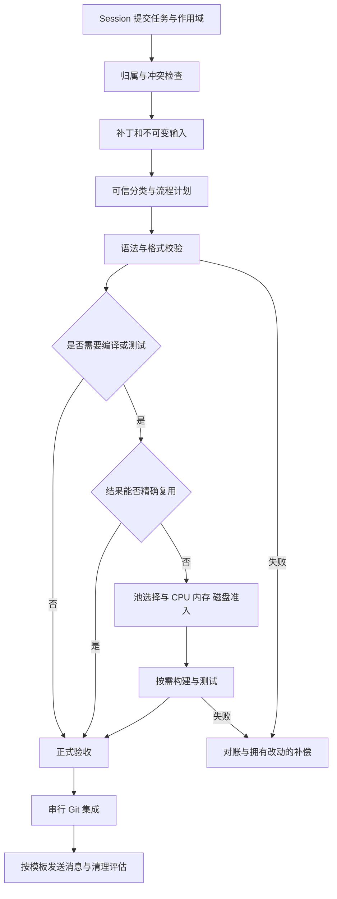

---
related_code:
  - .jenkins/deployment-spec.json
  - .jenkins/workflow-spec.json
  - .jenkins/plugins.lock
  - tools/dev/zircon-session.ps1
  - tools/build/zircon_build.py
  - tools/build/zircon_build_cargo_environment.py
implementation_files: []
planned_implementation_roots:
  - tools/jenkins/
  - .jenkins/pipeline/
plan_sources:
  - "user: 2026-10-02 工程内正式部署、单机多 Session 协调、可拼接流程与按需增量验收"
  - "user: 2026-10-02 多机器协调暂缓，前置功能完善后再考虑"
  - .jenkins/deployment-spec.json
  - .jenkins/workflow-spec.json
  - docs/tooling/jenkins-session-coordination-architecture.md
tests:
  - docs/plans/milestone-validation-policy.md
  - tools/jenkins/tests/
  - tools/jenkins/tray/tests/
doc_type: milestone-detail
status: implementing
created: 2026-10-02
---

# 单机 Jenkins 多 Session 协调实施计划

本计划交付一套以 Jenkins 为唯一构建提交入口的本机协调流程：多个 Session 共享 checkout 和兼容构建池，按改动范围选择校验、构建和测试，串行保护共享写入，在 CPU、内存和磁盘预算内尽快完成正式验收。

当前正在实施，正式运行切换尚未验收；产品仓库 Git 提交、推送和外部通知仍分别核对动作授权。多机器、远程节点接入与跨机器产物传输暂缓。在线驱动仍绑定 2026-10-04 的历史规格，只运行控制器。工作树规格与准入已同步为真实驱动器根级 `D/E/F:\cargo-targets`，默认 `D:\cargo-targets`，命名空间为 `<buildRoot>\zircon-local\zircon-jenkins`；明确选根不得自动换盘。在线驱动尚未加载新版本，编译仍暂停。历史目录、执行身份和回执保留为证据。

详细的模块职责、三类 Jenkins job、身份与状态模型、流程拼接、资源准入、Git 集成和恢复协议见[架构与实施方案](../../tooling/jenkins-session-coordination-architecture.md)。本文拥有里程碑顺序与交付门槛，架构文档拥有具体设计。

## 当前基线与实施约束

当前控制器为 `controller-running-quiet`：Home、专用 JDK／WAR／Python、79 个已校验插件和 Windows agent 组件位于工程 `.jenkins`。管理页面与认证 API 已在 `http://127.0.0.1:18080/` 直接启动，没有重启 Windows。三类 job、支持库和入口适配已实现，已有纯注释及三种真实 Cargo 流程回执。前次尚未启动 agent 的失联部署已通过专用仅控制器恢复核验；agent 与执行 broker 暂停，遗留构建的预约及 writer 保护保留，运行验收尚未通过。实时状态见 `.jenkins/state/deployment/service-health.json`，规格中的历史离线标签不作为实时健康状态。旧入口 `tools/dev/zircon-session.ps1` 与 `tools/session_coordinator/retirement.py` 明确拒绝启动、租约、验证与集成；旧服务不得恢复。以前的试点、状态数据库和源码保留为历史证据与迁移参考。

现有工程主包为 `zircon_app`、`zircon_runtime`、`zircon_editor`，构建仍受 workspace、lockfile、外部依赖及现有产品 profile 约束。本项属于 MVP 验收自动化，优先支撑构建与验收；不扩展引擎功能。验证范围遵循[里程碑验证政策](../milestone-validation-policy.md)。

必须保持以下边界：

- Jenkins Home、配置、用户、插件包、日志和协调状态放在工程 `.jenkins` 下；运行数据与密钥排除在 Git 之外。
- Jenkins 运行组件及控制数据留在工程 `.jenkins`；编译产物、编译器缓存和构建工作集使用已登记的真实驱动器根级 `D/E/F:\cargo-targets`。拒绝 C 盘、工程内 target、路径别名和 junction/symlink；当前历史工程内构建规格尚待同步，编译保持暂停。
- 不新增 Git worktree，不按 Session 或 build number 新建完整 target；采用有限、兼容性受管的构建池。
- 源码归属、路径租约、资源预约、产物索引和验收各有一个权威。Jenkins 调度流程；新支持库拥有这些策略和状态，不恢复旧服务、旧工作队列或自动离线重放。
- 每个重步骤使用不可变输入与真实进程回执；Jenkins SUCCESS、零退出码或 pending receipt 均不能单独代替正式验收。
- 修改共享代码前核对当前差异与任务归属。计划阶段不注册旧服务、不清历史状态、不改其他 Session 的变更。

旧支持层里的复用、合批、优先级、存储和 Git 逻辑只作为行为与测试参考。迁移必要能力时提取纯策略和受控操作到新支持库，补齐其依赖；禁止绕开退役检查直接调用旧 runtime。

## 最终流程与任务模式

流程由独立步骤按依赖图组合。每个步骤有明确的输入、资源需求、状态和验收回执；可单独执行，也可作为组合流程的一部分。以下“消息”“提交”等步骤使用任务中已有的明确动作授权，不因模板包含步骤而自动扩大权限。

| 模式 | 选定流程 | 重点 |
| --- | --- | --- |
| 纯注释 | 补丁 → 语法 → 格式 → 验收 → Git 提交 | 无 Cargo job、消息或 GC；可信分类证明没有语义影响 |
| 模块修改 | 补丁 → 语法 → 格式 → 按需构建 → 模块单测 → 验收 → Git 提交 → 消息 → 清理评估 | 只构建必要包、target、features 和依赖闭包 |
| 跨模块修改 | 模块流程 + 受影响接口及调用方验证 | 公共契约和反向依赖决定扩大范围 |
| 失败修复 | 模块流程 + 原失败回归及向上验证 | 修复最低故障支持层，再验收依赖它的任务 |
| 维护 | 产物／缓存清理评估 → 受管执行 → 回收核验 | 可独立调度；没有可回收项时记录原因并完成 |
| 失败恢复 | 对账 → 终止证明 → 本任务补偿／重新排队 | 只处理拥有的改动、资源和 attempt，不回滚整个共享 checkout |

“清理评估”不表示每个成功任务都删除缓存；实际清理根据容量、引用和重建成本决定。纯注释分类排除 doctest、编译／lint 指令、生成输入和源码文本嵌入等影响；若注释导致行号敏感表达式变化，也须按实际语义影响选择覆盖范围。

独立步骤重新执行或拼接时，仍须验证依赖回执。结果复用只覆盖原回执确实证明的输入、命令和测试范围；覆盖不足时补做缺失项。

## 目标实现结构与职责

下列目录拥有各层实现；代码存在与正式验收分别记录：

| 层 | 拟议位置 | 职责 |
| --- | --- | --- |
| 部署与插件版本 | `.jenkins` | 配置加载、Home、运行身份、版本清单、状态路径 |
| Pipeline 步骤和组合入口 | `.jenkins/pipeline/` | 步骤呈现、条件、依赖图、调用与回执对账 |
| 支持库与 CLI | `tools/jenkins/` | 输入封存、归属、准入、进程生命周期、结果／产物登记、验收和 Git 操作 |
| 协调状态 | `.jenkins/state/` | 事务化归属、reservation、幂等操作、attempt 和引用记录 |
| 构建输入和产物池 | 合法 `buildRoot` 下的受管 namespace，编译产物及缓存限真实 D/E/F 盘根级 `cargo-targets` | 少量稳定池、兼容增量状态与共享产物；新配置待运行加载与验收 |

Jenkins 自身拥有流程队列和执行调度；支持库提供短事务和受控执行操作，不另建常驻调度 daemon。等待资源不占 agent executor、CPU 预约或可变构建池 writer；已封存输入及必要引用保持可恢复。

首版选择 Scripted Pipeline，并用 `workflow-cps` 的 `load` 加载已封存、固定版本的步骤文件；目标插件清单已包含 `pipeline-groovy-lib` 和 `pipeline-model-definition`，实际启用状态以 M2 运行库存核对为准。[Jenkins 的 load 与 parallel](https://www.jenkins.io/doc/pipeline/steps/workflow-cps/)可表达模块化步骤与并行分支。后续切换实现机制仍需独立验收，包括[Shared Library](https://www.jenkins.io/doc/book/pipeline/shared-libraries/)。

## 里程碑依赖与交付顺序

`M0 → M1 → M2 → M3 → M4 → M5 → M6 → M7 → M8`。

M3 是首个轻量验收流程交付；M4 是按需编译验收交付。后续优化在正确性成立后推进。实际编译在对应里程碑的测试阶段运行；普通实现切片只做格式、解析、diff 与结构检查。

| 里程碑 | 交付能力 | 升级门槛 |
| --- | --- | --- |
| M0 | 当前基线、职责与迁移清单 | 不依赖退役服务的边界和验收清单明确 |
| M1 | 最小本机支持层 | 归属、存储、预约、进程和回执的负向测试通过 |
| M2 | 工程内正式 Jenkins 部署 | 真实 Home、插件、agent 路径及重启身份核验通过 |
| M3 | 独立步骤、流程拼接和纯注释流程 | 只执行五个步骤，不产生编译及通知副作用 |
| M4 | 模块按需构建与测试 | 范围最小且完整，不以删测试换速度 |
| M5 | 精确结果复用与兼容增量池 | 同输入单 writer；不同源码不复用旧成功结果 |
| M6 | 单机 CPU／内存／磁盘调度与 GC | 原子准入、压力下安全等待、公平性及保护边界通过 |
| M7 | 多 Session 合批、回滚和故障恢复 | 冲突、取消、重启及后续外来编辑均可对账 |
| M8 | 唯一入口切换与效能验收 | 所有入口一致，等价覆盖比较通过，回退演练完成 |

### M0：核定退役后的基线与迁移边界

**依赖：** 本计划与当前工作树。

**实现切片：** 核对退役标记、当前服务／agent／进程身份、源文件改动、历史运行和活跃产物。冻结必要策略清单：路径归属、源码封存、Cargo 准入、增量池、终止证明、验收、Git 集成和通知。区分可提取的纯策略、须重新实现的操作及只读历史数据，修正部署／流程规格里旧 owner 的含义。

**测试阶段 M0-T：** 执行只读结构与路径核验、退役边界测试；核对历史证据身份和来源，不把旧结果升级为新正式验收。建立后续性能场景和阶段耗时的记录口径；未具备合法编译入口时，编译基线保持 pending。

**验收：** 每项必需能力有新 owner、输入／输出、迁移依赖和测试责任；没有重新启用旧服务的实施步骤。

**回退：** 仅回退本任务的计划／规格修订，保留历史状态与其他任务变更。

### M1：最小本机支持层与安全准入

**依赖：** M0。

**实现切片：** 实现任务与 attempt 身份、持久化幂等操作、精确路径归属、补丁前后 hash、不可变源码／外部输入、产物引用及 writer reservation。落地批准物理根校验、初始串行 CPU／磁盘准入和 Windows 进程生命周期；为纯语法／格式结果定义独立验收类型。实现排队取消、失败阻断及基于前后 hash 的未提交补丁补偿；外来修改或终止不明时停止补偿并保留保护。提取必要旧策略与回归案例，避免导入退役 runtime。

初始编译并发为一；动态优化留待 M6，但磁盘、内存、路径及进程保护必须从此阶段生效。支持状态数据库不承载编译输出，也不盲目导入旧 lease 或重放旧请求。

**测试阶段 M1-T：** 批量运行支持层单元、持久化、并发及负向测试：重复请求、generation 失配、同时抢 writer、路径 aliases、错误根、缺失／陈旧库存、reservation 释放竞态、PID 重用、进程终止不明，以及补丁补偿期间的外来编辑。

**验收：** 只有持有正确归属与资源预约的 attempt 可启动；状态不明保持占用保护；通过的回执可精确绑定作者、输入、步骤版本和产物。

**回退：** drain 新请求，完成或终止本支持层拥有的执行，保存状态；保留退役边界，所需验收 pending。

### M2：Jenkins 正式部署在工程目录

**依赖：** M1；开始部署前重新核对原试点当前状态。

**实现切片：** 实现部署规格加载、插件及二进制校验、受管启动／停止／状态检查。控制器保持零执行槽、loopback 和一个 Windows agent；Home 放工程目录，agent 控制目录、Java temp、WAR／plugin 解包缓存放工程 `.jenkins`；封存输入、编译 workspace、Cargo target、编译器缓存、构建临时目录及大型产物归属合法 `buildRoot` 下的受管 namespace，编译相关路径按当前工作约定核验真实 D/E/F 盘根级 `cargo-targets`。迁移时先 drain 和证明 native terminal，再停控制器后复制一致 Home；保留用户、密钥和历史。仅控制器启动不得隐式放行 agent 或解除历史执行保护。

不把共享 checkout 作为自动 SCM 工作区覆盖；Pipeline 驱动代码从固定输入装载。为后续支持步骤登记可调用的受控 CLI 和版本身份。

**测试阶段 M2-T：** 真实启动、认证访问、插件启用、agent 注册、所有有效路径核验；执行固定轻任务并核对回执，演练 controller／agent 启停与身份恢复。仅复制目录、成功安装插件或健康页面不构成本阶段通过。

**验收：** 有稳定启动入口及运行身份；Home 和 Jenkins 控制目录实际位于工程 `.jenkins`，编译相关路径符合当前驱动器根级目录约定且无逃逸；历史和账号有效，尚未开放未完成的重步骤。仅控制器健康记录与 agent／完整运行验收分开。

**回退：** 恢复上一份已验证的 Jenkins 配置／Home 快照；无有效版本时停止新派发并保留 pending，不启动旧协调器。

### M3：步骤契约、组合器与纯注释流程

**依赖：** M2。

**实现切片：** 实现步骤注册、依赖图验证、跳过理由、阶段状态和恢复。任务声明只作为提示；可信分类器通过解析、token／AST 与依赖影响决定模板。首个完整组合为补丁、语法、格式、验收、Git 提交。

语法与格式对不可变输入执行只读检查；同一工具已提供两类证据时共用结果，避免重复工作。无法确认影响或缺少对应解析器时阻断并解释。Git 集成使用封存 blobs 和仓库级串行操作；将提交与通知彻底拆开，不允许旧候选通知钩子隐式发送。

**测试阶段 M3-T：** 普通注释、块注释、doc/doctest、源码嵌入、行号敏感表达式、格式失败、补丁 hash 冲突、缺失步骤、环形依赖、重复提交、过期回执、HEAD 漂移和提交状态不明。真实五阶段流程中的 Git 操作用本任务拥有的测试仓库；产品共享仓库提交遵守已有明确授权。

**验收：** 纯注释流程没有 Cargo job、消息或 GC；正式轻量验收拥有独立回执，不伪造编译 ticket；步骤独立调用与组合调用遵循同一契约。

**回退：** 暂停该模板，保留失败证据；已有提交不因编排回退自动撤销。

### M4：按模块选择构建与测试范围

**依赖：** M3。

**实现切片：** 根据 workspace、依赖图、变更路径、公共契约、features、profile 和 build scripts 生成覆盖 manifest。模块内部修改选择受影响包与单测；公共接口增加调用方和集成回归；已知失败修复增加原失败测试。未知影响先解析，不默认全量，也不静默漏测。

测试专用流程优先编译所需测试产物，不无条件先运行产品 build。[Cargo 的 --no-run](https://doc.rust-lang.org/cargo/commands/cargo-test.html)可分离编译与执行；实际拆分须由受管执行器登记测试二进制、hash、参数与终止证明。需要运行产品时再加入产品目标。构建和测试均从受管不可变输入读取，所有产物进入批准池。

**测试阶段 M4-T：** 模块内部、跨模块、依赖／lockfile／features／toolchain 改动、build script 及测试过滤场景。运行最小完整 package 编译和受影响测试批次，验证命令、coverage 与实际产物完全对应；失败从最低支持层修复后向上复验。

**验收：** 相同需求不发生无条件重复编译；单测、接口及调用方覆盖完整；无额外 worktree 或每 Session target。

**回退：** 禁用有误的范围选择器；对受影响任务明确生成较宽且受管的覆盖计划，保持同一入口与预算。

### M5：精确结果复用与兼容增量池

**依赖：** M4。

**实现切片：** 分开维护完整执行身份与 preparation 兼容身份。完整身份包含 dirty/new/deleted 主源码、外部及生成输入、依赖、工具链／wrapper、target、profile、features、完整命令、相关环境及覆盖。增量池按经验证的兼容策略稳定复用，源码改变仅失效相应构建图。

同一完整任务只启动一个 writer，等待者取得各自归属的消费回执。允许复用已验收的覆盖子集须有可检查映射，否则补做缺失项。存储中仅保留受管引用，Jenkins archive/stash 不复制编译输出。

减少体积先避免重复输入与二进制、无关 targets 和多余配置，再用既有合法 profile／开发链接策略。任何 debug、incremental 或链接配置变化均纳入身份和验收；保留调试与真实测试能力。[Cargo 增量状态会额外占用磁盘](https://doc.rust-lang.org/cargo/reference/profiles.html)，因此保留热池，按重建收益清理冷数据。

单体产物瘦身先测量测试二进制、调试符号与重复链接的体积来源，再按验收／调试用途定义少量固定 profile。仅在对应场景的调试、断言和测试要求不受损且经过对等验证时采用较小配置，不生成任意 profile 组合或静默 strip 当前验收产物。

**测试阶段 M5-T：** 同输入串行与并发、源码小改、外部依赖改动、profile／features／target 变化、坏 hash、失败／部分结果、产物失踪和 lease 失效。对真实同包任务进行首次／精确复用／增量修改比较，检查实际 writer 数和物理路径。

**验收：** 同输入只产生一份已接受产物；源码变化可复用兼容准备但不能复用过期成功结果；不同 Session 作者与验收回执保持独立。

**回退：** 停止结果复用但保留合法增量池与历史；先对账被怀疑条目，仅失效本层拥有的索引引用，不整池删除。

### M6：单机资源调度与磁盘压力缓解

**依赖：** M5。

**实现切片：** 由历史实际耗时和空间增长估计候选完成时间：等待 + 输入准备 + 增量编译 + 测试 + 验收。优先完整结果命中，再评估请求指定合法 `buildRoot` 内的热池；综合兼容性、增量容量、CPU／内存余量和重建成本分配。请求明确指定构建根后不得自动跨盘。

将执行并发、Cargo jobs、测试线程、峰值链接内存和预计磁盘增长纳入统一预算；调整发生在启动与输入封存前，不中途隐式修改构建环境。多任务开始时原子复核并占用预算，等待不持有 executor 或 CPU reservation。延续公平优先级与老化，避免普通任务长期饥饿。

区分轻量校验、编译和测试的资源需求，在总预算内调整本机 agent 的 executor 数；避免一个长编译占满全部轻量流程执行机会。executor 数不等于可启动编译数，编译和同池写入仍须独立准入；控制器继续零执行槽。

GC 是独立低优先级维护流程，也可作为重步骤准入前的空间缓解。先清已证明无人引用的终态 scratch 和重复数据，再考虑低重建成本的冷中间物；保留活跃 writer、accepted 引用和进程身份不明的对象。清理后重新取有效容量并准入，容量仍不足则等待。

**测试阶段 M6-T：** 可用／不足／陈旧／部分库存、可回收项为空、驱动器不可用、路径别名、并发申请、GC 与启动竞争、CPU 高负载、内存不足、优先任务连续进入和预约恢复。压力场景使用受管测试对象与可控预算，真实运行不故意填满工作盘。

**验收：** 资源总占用不超过配置预算；不放宽 freshness 或绕过准入；能记录为什么复用、换池、清理或等待；安全清理与公平性均通过。

**回退：** 关闭动态位置／并发策略，退回已验证的串行池与准入规则；禁止改到未批准目录。

### M7：多 Session 合批、故障定位与回滚

**依赖：** M6；M1–M3 已具备最小失败保护，本阶段完善复杂恢复。

**实现切片：** 同路径补丁串行并按当前 hash rebase；不同任务经归属、兼容性及覆盖核对后组成单一不可变验证视图。限制合批窗口，不为凑批无限延迟验收。独立只读测试可按预算并行；同一可变池继续单 writer。

批次失败先检查共享基础，再用有界诊断定位具体候选，阻断其依赖任务。补偿以本任务前后 hash 比较为前提；被其他 Session 后续修改时停止回滚并保留证据。已提交结果按获准的正向 revert 处理，不 reset 共享 HEAD。通知、验收后维护失败独立重试，不重复 Git 提交。

controller／agent 重启、网络中断、取消和迟到回执均先恢复原 request／attempt 身份；确认 native terminal 后才释放 writer、CPU 和存储引用。无法证明外部消息是否已送达时记录不明状态，不承诺外部 exactly-once。

**测试阶段 M7-T：** 至少三个 Session 的同路径、不同路径、相同输入和相互依赖场景；合批中一个失败、失败后外来编辑、排队／运行取消、controller／agent 重启、重复与迟到回执、提交超时、消息失败、GC 失败。

**验收：** 冲突不覆盖他人源码；合批保留每个 Session 作者、范围和消费回执；取消／重启不重复执行已确定的副作用，失败补偿不破坏外来编辑。

**回退：** 停用合批与独立重步骤并行，保留单任务五阶段或模块流程；先对账活跃 attempt，再释放其资源。

### M8：统一入口、效能验证与运行交付

**依赖：** M7。

**实现切片：** 核对所有 Session、CLI、脚本、CI 和产品启动相关构建调用方，统一转入 Jenkins 同一请求协议。正式编译执行器校验调度 token 和 reservation；未具备验收所需入口时保留 pending。不会以该机制承诺操作系统级阻止手工 Cargo；治理所有已知入口并记录绕过行为。

保留 Git 和历史读取能力；删除旧编排／适配逻辑前先完成调用和历史依赖核验。消息步骤仅用于已配置且获准的通知目的地；Git 远程推送仍有独立配置与动作授权。

提供最小运行视图：步骤、Session 归属、覆盖、等待原因、复用来源、物理池、资源预约、正式验收、Git／通知状态和恢复入口。运维说明覆盖启动、停止、插件版本升级、备份、回退及空间处置。

**测试阶段 M8-T：** 五类模板、独立步骤、现有调用方、故障恢复和配置回退的端到端批次。对匹配源码、工具链、配置、测试范围及缓存条件的场景成对测量，报告样本数及离散情况；不得拿冷缓存全量构建与热缓存局部测试声称加速。历史旧服务结果只在身份及口径匹配时作参考。

**验收：** 所有已知入口一致；正确性、复用、资源边界和恢复全部通过；存在可重复的验收时长及空间收益证据。首版不预设未经基线支持的速度倍数，不能用源码／配置结构检查关闭运行 gate。

**回退：** 切换至最近已验证的 Jenkins 步骤库与策略版本，保持请求身份及历史；无有效版本时 drain 并暂停新派发，所需编译 pending，旧协调器维持退役。

## 效能指标与完成判定

| 指标 | 测量口径 | 通过要求 |
| --- | --- | --- |
| 验收耗时 | submit 到正式接受；分别记录 prepare、queue、compile、test、receipt、integration | 相同覆盖及资源条件下与已确定基线比较，说明改进或退化原因 |
| 精确结果复用 | 完整身份命中次数与实际执行次数 | 同身份并发只有一个 writer；命中后无重复编译 |
| 增量复用 | 同兼容池的源码变化、重新编译模块／依赖数 | 改动局部失效，保留可验证兼容依赖 |
| 空间 | 单一物理产物大小、池驻留量、峰值增量、实际 GC 回收量 | 避免每 Session 副本；在预约预算内完成或安全等待 |
| 调度 | CPU／内存预约、jobs、测试线程、队列年龄 | 不超预算，普通任务不饥饿，等待不占重资源 |
| 归属与恢复 | 冲突、作者／范围、重复操作、native 终止、补偿对象 | 外来编辑零覆盖、重复提交零发生、活跃引用零误删 |

最终验收必须包含：纯注释零编译／零消息；模块范围正确；同输入复用；源码变化后的增量正确；磁盘和 CPU 压力；共享源码冲突；取消／重启；Git 提交与消息分离；拥有改动的回滚；活跃产物保护。

多机器功能仅在上述前置能力被正式接受后重新评估。本计划不预建远程节点、SSH 调度、跨机器路径映射或产物传输实现。

## 状态与产出记录

M0 基线、M3 纯注释及 M4 有界真实 Cargo 流程已有历史权威回执。2026-10-05 的 M1 完整支持层发现覆盖 297 项，零失败／错误、1 项因 Windows 无法创建目录 symlink 而跳过，测试前后源码／配置哈希一致；对应驱动已直接启动仅控制器模式，79 个插件复验通过。详情及回执见[直接启动记录](01/2026-10-05-controller-direct-start.md)。M2 仍待 agent、托盘运行及完整部署复验；M5 的真实增量补丁与源码变化后的增量、M6–M7 的并行／联合输入／宿主故障恢复、M8 的唯一入口切换均未关闭。遗留执行保护和目录准入修订仍阻断编译，控制器上线不构成这些阶段的验收。资源策略中的临时验收预算不是生产并发默认值。

M8 的源码审计已刷新 22 处已知调用面，移除了旧清单中的过时 API 阻塞描述。主要转发适配存在，但特性矩阵、产品／Export／Tauri 子执行和 hosted CI 仍有迁移及运行核验缺口；当前入口清单明确保持未完成、未激活。其审计证据不能替代所有调用方的运行接受、回退和等价输入性能比较。

请将产出记录放置在子计划中，此处仅展示当前现状的概述

已接受结果的单一记录见 [01/里程碑记录](01/2026-10-03-accepted-milestones.md)；完整机器证据索引位于 `.jenkins/state/migration-baseline/acceptance-index.json`，包含原 driver、真实回执及失败尝试。历史通过结果不能替代新驱动的运行验收。

新目录规格、严格 broker 隔离和请求绑定的工作树回归已完成：329 项收集，328 通过、1 项 symlink 检查跳过，零失败或错误；候选驱动已准备但未选择，在线服务保留原实例。详情见[目录与隔离记录](01/2026-10-05-drive-root-and-quarantine.md)。这批支持层证据不关闭 M2 或 M5–M8 运行门槛。
