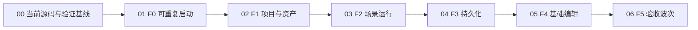

---
plan_sources:
  - docs/plans/minimum-viable-engine-foundation.md
  - docs/plans/milestone-validation-policy.md
  - docs/plans/zircon_runtime/runtime/02-core-spine-and-root-surface.md
  - docs/plans/zircon_runtime/runtime/04-asset-pipeline-alignment.md
  - docs/plans/zircon_editor/editor/01-editor-kernel-and-runtime-interaction.md
  - docs/plans/zircon_editor/editor/05-scene-editing-hierarchy-and-gizmos.md
  - docs/plans/zircon_editor/editor/11-serialization-and-versioning.md
status: in_progress
last_refined: 2026-07-24
---

# ZirconEngine MVP 引擎编辑器执行计划索引

> **For agentic workers:** 按编号子计划执行。每个 Session 开始前使用 `cross-session-coordination`，实现时使用 `executing-plans`，进入测试阶段前使用 `zircon-dev-validation` 与 `prefer-windows-validation`。不得跳过更低编号门槛宣称上层完成。

**Goal:** 交付一个可以创建或打开项目、渲染基础场景、保存并重开、选择实体并通过命令路径修改属性的最小可用 ZirconEngine 编辑器，并用当前 Windows 产品可执行文件完成两次连续验收运行。

**Architecture:** 本目录是跨 Runtime、Editor、App owner 的产品验收编排层，不取代现有编号计划。`00` 恢复当前源码基线，`01` 至 `06` 依次关闭 F0-F5；代码、接口和 failure 的权威所有权仍留在原 Runtime/Editor 编号计划中。

**Tech Stack:** Rust、Cargo、WGPU、Windows PowerShell、Zircon Session Coordinator、retained editor host、TOML/JSON 项目与场景格式、GitHub Actions。

---

## 1. 权威与适用范围

- 产品门槛定义以 [`../minimum-viable-engine-foundation.md`](../minimum-viable-engine-foundation.md) 为准。
- 验证调度以 [`../milestone-validation-policy.md`](../milestone-validation-policy.md) 为准。
- 本目录只决定 MVP 的依赖顺序、跨计划交付物和产品验收，不复制原 owner 计划的完整设计。
- 若本目录与现有 owner 计划发生冲突，行为和接口由当前源码、聚焦测试和 owner 计划共同裁决；MVP 子计划只收紧产品退出条件。
- 所有 Cargo 输出必须由 Windows coordinator 分配到 `D:`、`E:` 或 `F:` 的批准目标根目录。不得创建仓库内 `target/`，不得用 WSL 做普通验证。

## 2. 固定产品闭环

MVP 必须用同一个持久化项目完成以下闭环：

1. 从支持的产品入口创建 `RenderableEmpty` 项目，或打开已经创建的该项目。
2. 项目资产注册表和项目设置从磁盘权威加载，不处于 fallback-only 状态。
3. 默认场景包含一台 camera、一个引用持久资产的可见 primitive 和一盏 directional light。
4. runtime 接收 keyboard/mouse 输入，产生非空 WGPU 帧，并可确定性退出。
5. editor 从 Hierarchy 选择 primitive，通过 Inspector 或等价正常 UI binding 进入 command/transaction 路径修改 transform。
6. editor 保存项目，销毁当前 host/session，重新打开同一项目。
7. 重开后从持久数据观察到相同实体、资产引用和修改后的 transform。
8. 当前产品二进制在同一验证副本上连续运行两次，均产生可归因诊断并干净退出。

禁止用直接改 TOML、直接改 `World`、测试专用旁路、静态源码扫描或单个单元测试代替步骤 1-8。

## 3. 依赖顺序

上层 Session 可以提前实现不依赖未闭合行为的测试夹具或局部 owner 切片，但不得提前进入产品验收、填写完成记录或解除下层 failure。

## 4. 子计划路由

| 顺序 | 子计划 | 产品结果 | 主要 owner |
|---|---|---|---|
| 00 | [`00-current-source-baseline-recovery.md`](00-current-source-baseline-recovery.md) | validator 恢复机器可读输出；Runtime/Editor/App 当前源码重新可检查 | Tooling、Runtime 04、受影响的最低共享 owner |
| F0 | [`01-f0-reproducible-bootstrap.md`](01-f0-reproducible-bootstrap.md) | runtime/editor 支持 profile 可构建、启动、报错、退出 | Runtime 02/14、Editor 01、App entry |
| F1 | [`02-f1-project-and-assets.md`](02-f1-project-and-assets.md) | 一条产品路径创建并重开项目，registry/settings 权威加载 | Runtime 04、Editor 01/02 |
| F2 | [`03-f2-scene-runtime.md`](03-f2-scene-runtime.md) | 持久场景实际渲染 camera/primitive/light 并接收输入 | Runtime 08/09/12、Render foundations |
| F3 | [`04-f3-persistence.md`](04-f3-persistence.md) | 保存、销毁、重开后精确保留实体/transform/asset ref | Runtime 04/08、Editor 11 |
| F4 | [`05-f4-basic-authoring.md`](05-f4-basic-authoring.md) | editor 正常 UI/command 路径选择、修改、保存、重开观察 | Editor 01/02/05/08/11 |
| F5 | [`06-f5-acceptance-wave.md`](06-f5-acceptance-wave.md) | clean validation copy、聚焦套件、连续两次产品运行 | Dedicated validation lane、CI |

## 5. 多 Session 执行协议

### 5.1 领取规则

1. 一个 Session 一次只领取一个子计划中的一个未完成里程碑。
2. 开始前查询 coordinator 状态、最近四小时 Session 和该里程碑所有 owner 目录中的 open `failure-*.md`。
3. 使用当前子计划路径注册 Session，并把 `write_scope` 限定到实际要修改的 owner 源码、测试和该子计划文件。
4. 对共享文件先领取 coordinator lease；被占用时等待或提交 delayed patch，不创建文件锁、不覆盖其他 Session 修改。
5. fixing owner 若命中适用 open failure，先进入 `resolving_failure`；origin owner 继续不依赖该 failure 的切片。
6. 每个里程碑只在测试阶段完整通过后写一条状态记录。普通实现切片、失败的测试尝试和静态检查不写产出记录。

### 5.2 并行边界

- `00` 未完成前，只允许其他 Session 做只读审计或不依赖编译的测试设计。
- F0 完成后，F1 的项目入口和 F2 的场景夹具可以并行实现；F2 产品晋级必须等待 F1。
- F2 完成后，F3 持久化与 F4 的 Selection/SceneMode/inspection owner 切片可以并行；F4 产品晋级必须等待 F3。
- F5 不与任何未完成门槛并行。它必须消费冻结的 F0-F4 validation copy。

### 5.3 建议排程与工作量

以下是 2026-07-24 基于当前源码的工程量区间，不是完成承诺。`00` 完成并暴露全部 current-source 编译错误后必须重新估算一次。

| 阶段 | 建议同时活跃 Session | 工程量 | 关键不确定性 |
|---|---:|---:|---|
| 00 | 1 个 primary + 最低 owner repair Session | 2-5 人日 | resolver 后续编译错误数量；validator/coordinator 协议修复范围 |
| F0 | 2 个：profile/staging、startup diagnostics | 2-4 人日 | staged DLL/plugin/asset 清单和 Windows host teardown |
| F1 | 2 个：project authority、asset generation | 2-4 人日 | registry/cache 当前 generation 一致性 |
| F2 | 2 个：template/asset、runtime/render/input | 3-6 人日 | product shader/material 与真实 adapter 的可见输出 |
| F3 | 2 个：persistence、product reopen | 2-4 人日 | schema/migration/atomic write 的现有回归范围 |
| F4 | 最多 3 个：inspection、state/commands、host integration | 5-10 人日 | production `cfg(test)` hard cut、generation/delta、产品交互 trace |
| F5 | 1 个独占 validation Session；CI 可独立准备 | 2-4 人日 | clean wave 时长、Windows hosted runner 的 GPU/display 能力 |

总量约 18-37 工程日。由于门槛晋级严格串行，即使使用多个 Session，现实日历周期仍建议按 4-6 周规划；若 `00` 暴露大量级联编译失败，重新评估为 6-10 周并优先缩小 current-source integration scope。

### 5.4 Failure 路由

- 跨 owner 最低原因写入 fixing owner 的既有编号子目录，例如 `docs/plans/zircon_runtime/runtime/04/failure-*.md`。
- MVP 子计划只链接 failure 并标记被阻断的里程碑，不保留第二份 failure 正文。
- 修复并向上验证后，按仓库 failure/fixed 规则移动同一 artifact；不得复制一份 `fixed-*`。
- 性能或高级能力 failure 只有直接阻断当前 F0-F5 退出条件时才进入 MVP 关键路径。

## 6. 当前基线与风险

| 风险 | 2026-08-01 当前事实 | 处理位置 |
|---|---|---|
| 当前源码编译基线未闭合 | resolver module registration 与 coordinator JSON 污染均已修复；`00` 最新受管证据仍在 Runtime lib-test harness 暴露 owner-bound 编译错误，需按最低 owner 继续收敛 | `00` M0.3 |
| resolver 单一 generation 尚待上层验收 | `MigrationResolver` 已只消费 registry/resolver index；剩余风险是 run/scan/sidecar 的 current-source 上层验证，不是缺少 `mod resolver_index` | `00` M0.2 / Runtime04 |
| validator 当前可提交作业 | `zircon-session.ps1 -Json` 的 readiness 输出已受门控，validator 能创建/释放 managed job；后续失败应按具体 owner 或 CPU reservation 归因 | `00` M0.1（已修，保留回归） |
| 大量并行输入 | `git status --porcelain=v1 -uall` 曾报告 4,399 个路径级变化 | 每个 Session 重新盘点并严格 lease；不得据此删除用户文件 |
| F2 产品证据仍待晋级 | `RenderableEmpty` 模板已含 Camera/Cube/Sun 和持久 mesh/material refs，runtime test 也消费同一模板；仍须等待 F0/F1 后执行产品门 | `03` M2.1 |
| F4 产品交互证据仍待晋级 | scene-mode/selection 与 inspection publication 已是生产模块；仍须用正常 UI/command 路径完成 F4 端到端证据 | `05` M4.1/M4.2 |
| Windows workflow 已有但 F5 证据未闭合 | `.github/workflows/mvp-editor-windows.yml` 已存在，本轮修正为精确测试 ID 并逐项断言 `1 passed`；clean validation copy 与真实上传 artifact 仍未验收 | `06` M5.3 |

## 7. 晋级与回退规则

- 每个子计划的入口条件、风险清单、测试阶段和退出证据全部满足后才能晋级。
- 上层失败时先回查最低共享支持层；不得在 App/UI 层增加特殊旁路掩盖 Runtime/asset/serialization 问题。
- current-source 验证取代历史通过记录。源指纹变化后，旧 job/run 只能说明能力曾经存在。
- 测试阶段出现失败时，先缩小到最低 owner 的 focused batch，修复后向上重跑；不从头反复启动全工作区测试。
- 所有 changed contract 和高风险边界必须有直接证据；未覆盖项保持计划 open。

## 8. 明确延期

以下工作不阻断 MVP，除非执行证据证明它直接破坏当前产品闭环：

- temporal reconstruction、volumetrics、advanced GI、RenderDoc 优化和 shader permutation 扩展；
- 完整 BIDI/vertical text、富文本扩展和字体精修；
- AI、网络、多玩家复制和非必需第一方插件；
- 新 editor panels、复杂领域编辑器、额外 export targets；
- 不影响 1 个 MVP 项目和基础交互的 100k/1M 规模优化。

若某个 production gate 明确要求规模证据才能解除 `cfg(test)` 或发布共享 generation，该最小规模证据仍属于 MVP；其余性能扩展继续延期。

## 9. 总体完成定义

- [ ] `00` 至 `06` 的所有退出清单均完成。
- [ ] 所有直接阻断 MVP 的 open failure 已修复并完成 upward validation；无关 failure 保持原 owner 路由。
- [ ] 同一个项目贯穿 F1-F5，未在门槛间替换为更简单的测试夹具。
- [ ] F5 使用 coordinator 管理的干净 validation copy，而不是当前脏 checkout 直接宣称 clean。
- [ ] Windows runtime/editor 产品二进制连续两次运行成功，诊断、帧/窗口证据和持久化比较均可追溯到同一 validation run。
- [ ] 新增 Windows CI smoke 能在后续提交中保护最小产品路径。

## 10. 状态总览

> 请将产出记录放置在子计划中，此处仅展示当前现状的概述

| 阶段 | 当前状态 | 权威记录 |
|---|---|---|
| 00 | `in_progress` | [`00-current-source-baseline-recovery.md`](00-current-source-baseline-recovery.md) |
| F0 | `blocked_by_00` | [`01-f0-reproducible-bootstrap.md`](01-f0-reproducible-bootstrap.md) |
| F1 | `blocked_by_f0` | [`02-f1-project-and-assets.md`](02-f1-project-and-assets.md) |
| F2 | `blocked_by_f1` | [`03-f2-scene-runtime.md`](03-f2-scene-runtime.md) |
| F3 | `blocked_by_f2` | [`04-f3-persistence.md`](04-f3-persistence.md) |
| F4 | `blocked_by_f3` | [`05-f4-basic-authoring.md`](05-f4-basic-authoring.md) |
| F5 | `blocked_by_f4` | [`06-f5-acceptance-wave.md`](06-f5-acceptance-wave.md) |

## Code Review 处理结果 (2026-08-01)

### 已处理

- §6 已按 2026-08-01 当前源码刷新：resolver registration、validator JSON、RenderableEmpty primitive、生产 selection/inspection 投影和 Windows workflow 均不再列为“缺失实现”，而是分别保留其 current-source 或产品验收缺口。
- 总计划与 `00` 已更新为 `in_progress`。F0-F5 的 `blocked_by_*` 继续保留，因为它表达严格产品晋级顺序；它不否认上层源码切片已经存在，也不授权重复实现已有 owner。

### 验证缺口

- `00` 当前仍有 owner-bound Runtime lib-test 编译错误，F0-F5 也尚未按依赖顺序取得产品 gate；状态不得仅凭源码存在上调。
- §5.3 的 18-37 工程日 / 4-6 周只保留为 2026-07-24 历史估算。下一次 clean re-baseline 后必须重估，不用于当前 Session 数量或交付日期承诺。
