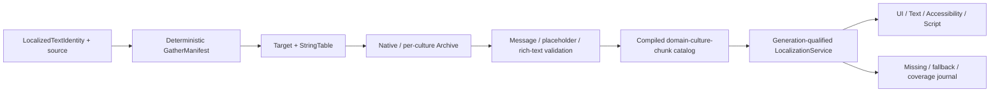

# Editor154 · Localization / String Table / Culture / Translation / Fallback / Pseudo / Preview 当前源码复核

## 1. 结论

Editor107之后，Editor shell本地化有真实进展。英文和简体中文内嵌bundle已从各54个增长到各74个key，当前静态扫描为完全对齐、无重复；`EditorLocalizationKey`、`EditorLocalizationBundleId`和immutable plugin bundle把插件设置页从literal descriptor硬切到了typed key。`SettingsWindowProjection`会捕获一次locale，内建设置与插件设置分别保留`BuiltIn/Plugin` domain，按canonical category key排序后再翻译；notification/decision也在presentation边界捕获locale，并用bounded `u64` arguments与单次模板扫描替代旧式多轮`String::replace`。这些基础必须保留。

这仍不是工程级Localization产品。Runtime没有`LocalizationService`、公共`LocalizedTextIdentity`、culture snapshot、compiled catalog generation、fallback DAG、plural/select/number/date formatter或script API。`ResourceKind`、`ImportedAsset`、project manifest和App entry config都没有String Table、Localization Target、Translation Archive、supported/native cultures、cultures-to-cook或domain loading policy。Runtime83只优化了递归path buffer与key-set查询，不能把“50,000个dependency的missing-key检查”误报成“50,000条translation lookup”。

最严重的正确性断点原样存在：component String schema看到`{ text_key = ... }`时，compiler制造`UiValue::String(String::new())`骗过类型验证，compiled attributes仍保留TOML table；renderer和Accessibility只读取scalar string，因此真实surface既得不到translation，也得不到fallback。`localization_dependencies`只进入UI compiled dependency manifest，没有cook/package/runtime consumer。全量扫描`zircon_editor/assets/ui`与`zircon_plugins`中的472个`.zui/.toml`文件，`text_key =`命中仍为0。

UI Asset Locale Preview也仍是假预览：列表固定为`authoring-fallback/en-US/zh-CN`，unknown locale静默回default；`compile_preview(document,size,imports)`没有culture/catalog/service参数；session catalog只存locale/table/key set，production没有完整注册链。切换菜单只改变报告与missing-key diagnostics，不改变display text、layout、shaping、glyph、direction或Accessibility。

Runtime图形路径新增了locale-sensitive SDF glyph identity与“localized text dirty”增量重建基线，这是文本渲染底座进展，不是Localization authority。该基线只是交替写入`L0000/L0001`并触发`UiInvalidationReason::Text`，没有translation lookup、catalog generation或culture switch。

目标链保持为：`LocalizedTextIdentity -> deterministic GatherManifest -> LocalizationTarget/StringTable -> native/per-culture Archive -> format validation -> compiled domain/culture/chunk catalog -> generation-qualified RuntimeLocalizationService -> UI/Text/Accessibility/Script`。Editor、Game与Plugin/DLC必须共享公共身份、culture和artifact合同，但保持独立domain、owner和loading policy。

## 2. 当前物理范围与证据等级

| 范围 | 文件 / 行 / 非空行 / bytes / tests / ignored | working-tree指纹与说明 |
|---|---:|---|
| Zircon selected source/contracts | **72 / 14,422 / 13,145 / 505,744 / 68 / 4** | Runtime Interface/UI/asset/project/text、Editor i18n/settings/plugin/notification/command/preview及App入口；`ea87e52e4e3d486cf1448df03891bf0290091090f8e6243a9512d58c56cfbdb1` |
| Product UI corpus | **472 / 52,474 / 46,048 / 3,040,428 / 0 / 0** | Editor UI与plugin `.zui/.toml`完整产品语料；`text_key =`为0；`71a1252e9084f6cb0be016b5ae2294bffe1fc36171b5cd9570d805833a24ab3e` |
| Zircon selected union | **544 / 66,896 / 59,193 / 3,546,172 / 68 / 4** | 上述两组去重并集；`b193f8569dd7064284d9c5a306ce72bec2128646ee808caf4cacdf9b87661d81` |
| Unreal/Godot/Fyrox/Bevy/Unity Graphics reference | **20 / 3,367 / 2,731 / 143,527 / 0 / 0** | Unreal Target/Runtime/StringTable/chunk、Godot Resource/Domain/Server/PO/CSV/preview、Bevy text boundary、Unity helper；`cc8e7f71f6c5b6f8ac5cb3ad4f9562a92ab9436a4ce843457ef34be2e770ca94` |

本轮开始取证时HEAD为`d5d41037e080ecc948a3b13f3e8bab38b4cd708a`，写报告前共享工作树前进到`188b40cac833fd5877bc8ccd8be2eb619d23708d`；对应commit只关闭coordinator failure lifecycle history。本报告没有回退或覆盖其他会话变化，而是以表中working-tree文件hash为物理快照。取证时`git status --short`有7038个条目，所以任何实施任务都必须先重算范围与指纹。

本轮按用户要求排除Tooling优化，也没有查询、轮询、等待或实时跟踪协调器。Gather/import/export/headless task的产品合同仍属于Localization闭环，但具体Tooling实现优化留待后续Rust迁移阶段。

## 3. 当前存在且必须保留的底座

1. Editor shell bundle是immutable TOML输入，能验证locale重复、key格式、空translation与English fallback；en/zh-CN当前各74 key并完全对齐。
2. `EditorI18nService`拥有settings generation fence、bounded locale event queue、drop/resync统计和captured-locale lookup；失败保留可用English catalog。
3. Notification/Decision/Progress presentation保存typed identity，compound projection在一个captured locale内完成；Decision arguments有数量、名称与字节上限。
4. Plugin设置页贡献已使用bundle ID和typed localization key，extension snapshot、ticket/revoke与settings projection共享immutable owner；旧literal settings-page schema已在当前源码中硬切。
5. UI localized-ref DTO、递归collector、structured diagnostic、package dependency manifest与key-presence catalog是真实底层能力，适合作为gather/schema validation输入，不适合作为Runtime catalog。
6. Runtime text已有language tag、direction/writing mode、composite font culture selector、font generation、glyph/shaping cache和locale-sensitive SDF key；它们应消费同一resolved culture snapshot。
7. UI dirty rebuild能把单个Text invalidation限制到局部layout/render工作，并有release-only profiling脚手架；未来culture generation切换可复用这一失效机制。
8. Project asset manager、Editor transaction/job/notification、plugin owner lease和compiled UI dependency manifest可承载Localization资产、任务与发布receipt，不应另建平行框架。

## 4. 当前断路与错误authority

| 当前表面 | 当前真实行为 | 工程断路 | 目标authority |
|---|---|---|---|
| `UiLocalizedTextRef` | key/table/fallback/direction DTO | 无domain/namespace/source/context/revision/arguments/owner | Runtime Interface `LocalizedTextIdentity` |
| component String validation | fabricated empty `UiValue::String` | 只通过schema，不产生display value | typed localized property + resolver result |
| compiled UI attributes | 保留TOML table与dependency行 | renderer/a11y只消费scalar string | culture-generation-qualified UI snapshot |
| `UiLocalizationTableCatalog` | exact raw locale/table到key set | 无value/fallback/state/generation/lease | compiled catalog registry |
| UI Asset locale menu | 固定三项、unknown回default | 不来自project target，不影响compile/render | `PreviewCultureSession` |
| Editor shell bundle | 2 cultures、74 keys | 无source/archive/plural/cook，未覆盖commands/ZUI | Editor domain compiled catalog |
| Plugin settings bundle | typed key与owner snapshot | 只覆盖settings page，不是content plugin localization SDK | shared substrate上的Plugin Editor domain |
| Editor command registry | literal display/description/menu path/keywords | menu和palette复制英文字符串 | stable command ID + LocalizedMessage identity |
| Runtime text locale | font/shaping language hint | 不是requested/resolved game culture | Runtime Localization snapshot |
| Resource/project/App | generic Data与普通project settings path | 无typed localization asset/culture startup policy | Target/Archive/Catalog + App culture precedence |
| Graphics localized-dirty baseline | 改literal text并局部重建 | 无translation lookup与catalog switch | Localization change set驱动bounded invalidation |

## 5. 参考实现差异

| 参考 | 直接源码事实 | Zircon必须补齐的合同 |
|---|---|---|
| Unreal Localization | `FLocalizationTargetSettings`覆盖source/package/metadata gather、native/supported cultures、dependencies、export/compile；resource generator验证stale、format、whitespace、rich text；chunk generator按packages与cultures-to-cook生成LocRes/LocMeta | Target/source/archive/artifact分层，deterministic gather/validation，compiled catalog与culture/chunk cook |
| Unreal Runtime/StringTable | `FTextLocalizationManager`按namespace/key管理display string和resource refresh；StringTable有namespace/key/source/metadata、CSV和Editor undo/redo/search | stable identity、runtime refresh generation、typed table toolkit与source metadata |
| Godot Translation | `Translation`是typed Resource，保存locale/context/plural；`TranslationDomain`有locale override/fallback/pseudo；`TranslationServer`管理loaded locale/domain/plural/number | typed assets、domain fallback、culture authority、plural/number与pseudo runtime |
| Godot Import/Preview | PO loader和CSV importer处理context/plural/locale并产出per-locale resource；Editor preview从真实loaded locales动态构造并可切pseudo | 真实import pipeline、dynamic preview session、translation value进入render |
| Fyrox | 本地选取范围仍无独立Localization/locale/StringTable子系统命中 | 不能作为降低Zircon标准的依据 |
| Bevy | 本地`bevy_text`只声明`sys-locale`并聚焦text/shaping | 只作文本生态边界，不当作first-party Localization产品标杆 |
| Unity Graphics | 唯一直证是调用`L10n.Tr`遍历VisualElement tooltip/label的temporary helper | 图形/editor包不应自建内容authority；该helper不是Unity Localization产品证据 |

## 6. P0当前状态

| ID | 状态 | 当前证据 | 必须重构 |
|---|---|---|---|
| P0-1 | `Open` | `component_prop_value`仍制造空String；renderer与a11y只读scalar，localized table不可显示 | compiler保存typed handle，surface实例化前通过generation-qualified resolver得到value/language/direction/provenance |
| P0-2 | `Open` | ResourceKind/ImportedAsset/project/App均无StringTable/Target/Archive/Catalog与culture-to-cook | typed source assets、project culture policy、compiled catalog、package/chunk closure和Runtime-only artifact消费 |
| P0-3 | `Open` | preview固定三locale，只更新report/diagnostic；compile无locale/catalog参数 | project-backed preview culture snapshot驱动text/layout/shaping/a11y同generation重建 |
| P0-4 | `Open` | 只有UI dependency collector和两份shell TOML；无Gather/PO/CSV/archive/compile闭环 | deterministic gather、source/native archive、translation archive、validation、atomic compile publication |
| P0-5 | `Partial` | Editor settings/plugin bundle已共享typed key、captured locale与domain标签；Runtime/Game仍完全分离 | 公共Culture/LocalizedText/Catalog generation合同，Editor/Game/Plugin保留独立domain/load policy |

## 7. P1身份、资产与文化模型

| ID | 状态 | 当前证据 | 需要重构 |
|---|---|---|---|
| P1-01 | `Open` | Editor key、bundle ID和UI key/table分散存在，没有公共identity | `domain/namespace/stable key/source/context/owner`序列化合同 |
| P1-02 | `Open` | UI `fallback`仍混用故障显示语义，没有native source authority | source revision与fallback policy分离 |
| P1-03 | `Open` | 无rename receipt、redirect、tombstone与reference repair | transactional key lifecycle与archive migration |
| P1-04 | `Open` | Generic Data/TOML和key-set catalog不等于String Table asset | typed table、entry schema/version/revision/notes/arguments/tags |
| P1-05 | `Open` | project manifest没有Localization Target | target ID、dependencies、gather rules、culture/load/compile policy |
| P1-06 | `Open` | 无per-culture Archive和entry review/stale/provenance state | typed archive与state machine |
| P1-07 | `Partial` | `EditorLocale`提供有限ASCII长度/case normalization，font/text另有language helper | 使用完整BCP 47 canonicalization、alias/likely-subtag与统一invalid diagnostics |
| P1-08 | `Partial` | shell和plugin bundle有exact locale + English fallback | 建立可验证requested/exact/parent/project/native fallback DAG与cycle拒绝 |
| P1-09 | `Partial` | settings已区分BuiltIn/Plugin，plugin bundle有owner snapshot；Game/DLC loading不存在 | 公共domain registry、priority、shadowing、lease与load policy |
| P1-10 | `Open` | Decision只有无文化语义的named `u64`替换，无plural/select schema | compiled message AST、plural/ordinal/select/gender与typed arguments |
| P1-11 | `Open` | bundle/UI compile不比较placeholder或rich-text AST | compile-time signature、tag、whitespace与token validation |
| P1-12 | `Partial` | UI dependency/candidate保存property path，key catalog可保存source URI | stable source location、extractor/version、多usage聚合与owner |

## 8. P1 Runtime Service、Lookup与文本接入

| ID | 状态 | 当前证据 | 需要重构 |
|---|---|---|---|
| P1-13 | `Open` | 全仓无Runtime LocalizationService或catalog generation | 唯一service拥有culture/domain/fallback/cache/diagnostics |
| P1-14 | `Open` | App/Project无CLI/project/user/platform/server/per-player culture precedence | 冻结scope与优先级，支持server/local multiplayer/preview |
| P1-15 | `Partial` | Editor settings/notification projection捕获一次locale；Runtime frame无共同catalog/font generation | atomic culture snapshot贯穿lookup/layout/shaping/a11y一帧 |
| P1-16 | `Partial` | Plugin Editor bundle随immutable contribution snapshot与ticket/revoke生存 | Runtime domain owner lease、reader fence、qualified unload与typed unavailable |
| P1-17 | `Open` | key-presence diagnostic不是lookup result，未返回resolved culture/state/generation | `LocalizationOutcome`携带value与完整provenance |
| P1-18 | `Open` | 无translation/format lookup cache、budget、generation invalidation | bounded read-mostly cache与metrics |
| P1-19 | `Partial` | UI catalog能报missing table/key，diagnostic带code/path；fallback和Runtime bounded journal缺失 | identity/culture去重、shipping policy、fallback receipt与bounded telemetry |
| P1-20 | `Open` | text/label/placeholder/options/custom String仍走scalar resolver | 所有localizable property统一typed resolver |
| P1-21 | `Open` | Accessibility name/alt/tooltip只接受scalar TOML | a11y identity进入gather并消费相同culture generation |
| P1-22 | `Open` | Runtime script目录无tr/plural/culture/domain API | typed、bounded Script Localization host |
| P1-23 | `Open` | locale event不是catalog edit/compile publication；无changed-domain/key generation receipt | 后台编译后原子换代，失败保留旧generation |
| P1-24 | `Partial` | path buffer、hoisted locale map lookup与localized-dirty profile脚手架存在，均只覆盖helper | 真实100K/1M catalog decode/lookup/format/switch与主线程交换预算 |

## 9. P1 Gather、Import/Export、Compile与Cook

| ID | 状态 | 当前证据 | 需要重构 |
|---|---|---|---|
| P1-25 | `Partial` | collector递归表/数组并识别text_key，但literal仅凭`.text/.label/.title`路径后缀 | component schema标记所有localizable property与nested content |
| P1-26 | `Open` | 无Rust macro/AST或script manifest emitter | 统一identity/source-location emitter，禁止全仓字符串正则生成key |
| P1-27 | `Open` | Dialogue/quest/notification/plugin asset没有versioned localization extractor | asset/metadata extractor registry与unknown-schema diagnostics |
| P1-28 | `Open` | UI package dependency manifest不是Gather Manifest/Archive | manifest/native archive/per-culture archive分层、schema/hash/diff |
| P1-29 | `Partial` | collector与catalog使用有序容器、path buffer输出稳定；无digest/cache/delete/rename规则 | source digest + extractor/schema/target rules的deterministic incrementality |
| P1-30 | `Open` | table registration仍覆盖同locale/table，没有不同source conflict model | conflict阻断、stabilize/fix task与typed receipt |
| P1-31 | `Open` | 无PO/CSV importer | context/plural/notes/escaping、line diagnostics、preview-first apply |
| P1-32 | `Open` | 无PO/versioned CSV/XLIFF export或roundtrip | 保留identity/state/format metadata的deterministic export |
| P1-33 | `Open` | 无source revision、stale、review与merge policy | source-change state transition与provenance-aware merge |
| P1-34 | `Open` | Editor commandlet框架存在但无Localization routes/tasks/receipts | Gather/Validate/Import/Export/Compile/Coverage headless parity |
| P1-35 | `Open` | compiled UI artifact只带dependency行，没有translation values/catalog header | compact versioned catalog、hash、profile strip与corrupt rejection |
| P1-36 | `Open` | project/export profile无culture/package/chunk closure | culture parents、plugin/DLC owner、content chunk与required-culture gate |

## 10. P1 Dashboard、Toolkit与真实预览

| ID | 状态 | 当前证据 | 需要重构 |
|---|---|---|---|
| P1-37 | `Open` | 无production Localization Dashboard | authority snapshot投影target/culture/coverage/missing/stale/conflict/generation |
| P1-38 | `Open` | 无Target/Culture authoring document | Editor02 transaction/save/recovery下的target与culture editor |
| P1-39 | `Open` | 无String Table toolkit/factory | namespace/key/source/translation/state/usage的undo/redo toolkit |
| P1-40 | `Open` | 无Table/Target/Archive多文档CAS、checkout与multi-file atomic save | dirty/history/external merge/source-control合同 |
| P1-41 | `Open` | 无大表virtualization/search/filter/bulk workflow | 按key/source/state/culture/owner/usage分页与bulk transaction |
| P1-42 | `Open` | dependency report不可跳转或repair source usage | usage/reference graph、redirect与source navigation |
| P1-43 | `Open` | 无import diff或逐entry决策 | add/change/stale/conflict/invalid preview与terminal receipt |
| P1-44 | `Open` | 通用Job系统存在但没有Localization job adapter | 分阶段target/culture progress、cancel acknowledgement与recovery |
| P1-45 | `Open` | preview菜单仍固定三项，unknown locale回fallback | 从project target/catalog snapshot动态生成stable option identity |
| P1-46 | `Open` | 无accent/expansion/double-vowel/fake-bidi/placeholder-preserving pseudo | session-scoped pseudo配置与resolver transformation |
| P1-47 | `Open` | Runtime有direction/font/language底座，preview切locale不触发任何一项 | culture切换同步direction/mirroring/font/line-break/number/caret |
| P1-48 | `Open` | 现有截图与text dirty profile不按culture/catalog/font generation | culture/device/scale/theme golden与overflow/glyph/a11y检测 |

## 11. P1 Shell迁移、可观测性、扩展与规模资格

| ID | 状态 | 当前证据 | 需要重构 |
|---|---|---|---|
| P1-49 | `Partial` | BuiltIn/Plugin settings共享Editor service与captured locale但分domain；Game content仍不接入 | 公共compiled substrate，Editor/Game/Plugin独立target/load/package |
| P1-50 | `Open` | 472个产品UI文件0 `text_key`；command descriptor/menu/palette仍是literal英文 | localizable property inventory、baseline与新增literal lint |
| P1-51 | `Partial` | en/zh-CN各74 key、完全对齐、无重复，并有bundle validation | required-culture/source/argument/rich-text/unused/orphan/conflict CI |
| P1-52 | `Partial` | production publisher、bounded drop/resync存在；settings window主动比较active locale，消息总线无真实subscriber | Retained Host typed generation subscriber与affected-key invalidation |
| P1-53 | `Partial` | Decision保存bounded named `u64`并单次扫描模板，unknown placeholder保留 | message signature、plural/select/escaping/missing-argument diagnostics |
| P1-54 | `Open` | 无number/date/time/unit/currency provider | locale-neutral storage + culture-aware formatter接口 |
| P1-55 | `Partial` | UI localization diagnostic有code/severity/path，Editor日志基础存在；各阶段仍分裂 | gather/import/compile/runtime/font/preview统一bounded journal |
| P1-56 | `Open` | Plugin localization bundle只是数据贡献，不是Extractor/Importer/Formatter capability SDK | versioned provider、formats/domains/schema/budget、lease/unload合同 |
| P1-57 | `Open` | 无TMS/external service adapter与secure credential boundary | export/import/review adapter、permission/audit/provider isolation |
| P1-58 | `Open` | 若干locale/bundle/helper单测不能覆盖不存在的pipeline | malformed/fuzz/provider/disk/cancel/stale/corrupt全链路矩阵 |
| P1-59 | `Partial` | 10K leaf、50K dependency与100K Decision projection有ignored release benchmark脚手架；无本轮实测数据 | target/culture/key/usage/RSS/p50/p99/switch-frame硬预算与CI证据 |
| P1-60 | `Open` | 无Windows/Linux、Editor/Client/Server、culture/domain/shipping矩阵 | deterministic artifact hash与跨平台release qualification |

P1合计为 **44 Open / 16 Partial / 0 Closed**。`Partial`只表示当前存在可复用的工程子合同，不表示对应能力可用于shipping。

## 12. P2高级能力

| ID | 状态 | 当前差异 | 进入条件 |
|---|---|---|---|
| P2-01 | `Open` | 无Translation Memory | M0-M8完成后接exact/fuzzy suggestion、provenance与tenant边界 |
| P2-02 | `Open` | 无Machine Translation provider | opt-in draft、成本/速率/数据驻留与review |
| P2-03 | `Open` | 无术语表/禁用词 | compile/review QA，不进入Runtime hot path |
| P2-04 | `Open` | dialogue/subtitle/voice未接Localization identity | 独立媒体关系与timing/audio artifact |
| P2-05 | `Open` | 无grammatical case/formality variants | typed formatter稳定后扩展schema |
| P2-06 | `Open` | 无隔离Live Localization Preview | session lease、权限、draft generation与rollback |
| P2-07 | `Open` | 无UGC/mod localization domain | sandbox、签名/预算、priority与protected key |
| P2-08 | `Open` | 无translation diff/review submission | source/translation/state/usage/generation diff |
| P2-09 | `Open` | 无privacy-aware analytics | bounded aggregate，不上传原始用户文本 |
| P2-10 | `Open` | 无distributed gather/compile | content-addressed immutable shard与deterministic merge |
| P2-11 | `Open` | 无culture-specific asset/remap | typed locale variants、cook dependency与residency |
| P2-12 | `Open` | 无跨引擎任务基准 | target/gather/roundtrip/pseudo/RTL/plugin cook任务级比较 |

## 13. 32个验收门当前状态

| Gate | 状态 | 当前证据与缺口 |
|---|---|---|
| G01 | `Partial` | typed Editor key/bundle ID与UI key/table存在；无公共domain/namespace/source/context identity |
| G02 | `Partial` | Editor locale做有限normalize；无完整BCP 47、alias/likely-subtag和fallback DAG |
| G03 | `Fail` | String Table/Target/Archive typed assets、migration、factory、transaction均不存在 |
| G04 | `Fail` | 无gather conflict阻断，table registration仍可覆盖 |
| G05 | `Partial` | UI collector递归结构但仅后缀识别literal，未覆盖schema-marked placeholder/tooltip/a11y/options |
| G06 | `Fail` | Rust/script/asset extractors与统一manifest不存在 |
| G07 | `Fail` | 无clean/incremental gather和hash可比 |
| G08 | `Fail` | 无redirect/orphan receipt与usage repair |
| G09 | `Fail` | 无PO/CSV roundtrip |
| G10 | `Fail` | 无import preview与atomic multi-culture apply |
| G11 | `Fail` | 无stale/conflict/review state machine |
| G12 | `Fail` | compile前不验证plural/select/argument/rich-text/whitespace |
| G13 | `Fail` | 无version/hash/domain/culture/generation compiled catalog |
| G14 | `Fail` | culture parents和plugin/DLC chunk不进入package closure |
| G15 | `Fail` | Runtime不能原子发布或保留catalog generation |
| G16 | `Partial` | Editor compound projections捕获一个locale；Runtime translation/direction/font/a11y无共同generation |
| G17 | `Fail` | `text_key`仍显示空/缺失而非目标culture value |
| G18 | `Partial` | missing table/key有structured diagnostic；无source/fallback provenance和bounded Runtime policy |
| G19 | `Fail` | placeholder/tooltip/options/custom component未接统一resolver |
| G20 | `Fail` | Script tr/plural/format API不存在 |
| G21 | `Fail` | Locale Preview仍固定`en-US/zh-CN`分支 |
| G22 | `Fail` | preview不重建translated text/layout/a11y |
| G23 | `Fail` | pseudo accent/expansion/fake bidi/RTL golden不存在 |
| G24 | `Fail` | composite font底座存在，但preview无glyph/fallback provenance |
| G25 | `Fail` | 无authority-backed Dashboard |
| G26 | `Fail` | 无String Table transactional authoring与multi-file recovery |
| G27 | `Partial` | producer有drop/resync、settings有locale currentness检查；Retained Host无真实bus subscriber |
| G28 | `Partial` | Decision有bounded numeric args和single-pass substitution；无plural rules/escaping/signature diagnostics |
| G29 | `Fail` | 不存在可验证的PO/CSV/catalog/provider fault pipeline |
| G30 | `Fail` | 只有10K leaf/50K key-presence ignored benchmark，未证明100K/1M真实lookup/gather/import/switch |
| G31 | `Fail` | 跨平台/target/domain/pseudo/RTL/plugin矩阵不存在 |
| G32 | `Fail` | 无headless gather/validate/compile/cook reproducible artifact gate |

Gate合计为 **25 Fail / 7 Partial / 0 Pass**。没有任何一项可以作为Localization shipping资格。

## 14. Owner边界与目标架构

| 领域 | 唯一owner | Editor154消费/提供 |
|---|---|---|
| Culture/LocalizedText/Catalog公共合同 | Runtime Interface | stable DTO、serialization、generation与typed result |
| Runtime lookup与format | Runtime Localization | culture snapshot、domain registry、fallback/cache/diagnostics |
| Target/Table/Archive source assets | Runtime Asset + Editor | typed schema、migration、reference、transactional toolkit |
| Project/App culture policy | Project + App entry | native/supported/cook cultures与startup precedence |
| UI/Text/A11y/Script消费 | 各Runtime owner | 只消费qualified resolver snapshot，不直接读source文件 |
| Editor shell | Editor Localization domain | 独立target/load policy，迁移commands/settings/notifications/ZUI literal |
| Plugin/DLC | Plugin owner lease | 独立domain/chunk/version，卸载有reader fence |
| Gather/import/export/compile task | Localization pipeline adapter | 共享typed task/receipt；Tooling优化按用户要求后置 |
| Dashboard/Table/Preview | Editor154 | authority projection、transaction、真实render preview，不另建数据真值 |

## 15. 分层重构里程碑

1. **M0 Truthfulness与合同冻结**：增加失败基线证明`text_key`当前不可显示；把Locale Preview标为report-only；冻结Culture、LocalizedText、Catalog header/generation和domain owner。
2. **M1 Typed source资产**：交付完整BCP 47 Culture、fallback DAG、String Table、Target、Archive、ResourceKind、factory、migration和project culture policy。
3. **M2 Gather与identity生命周期**：schema-driven ZUI extractor、Rust/script/asset emitter、stable location、conflict、rename/redirect/orphan与deterministic manifest。
4. **M3 Import/Export与validation**：PO/CSV roundtrip、preview merge、stale/review、compiled message AST、placeholder/rich-text/whitespace validation与typed task receipt。
5. **M4 Catalog/Cook/Runtime**：compact catalog、culture/domain/chunk package closure、Runtime service、fallback/cache/provenance、atomic generation publication。
6. **M5 UI/Text/A11y/Script接入**：删除fabricated String；所有localizable properties、a11y和script走同一resolver；culture switch执行bounded dirty invalidation。
7. **M6 Dashboard/Toolkit/Preview**：Target dashboard、String Table toolkit、usage browser、job progress、真实translated/pseudo/RTL/font/overflow preview。
8. **M7 Shell迁移与formatter**：Editor 74-key bundle迁移公共compiled substrate；commands/menu/palette/ZUI literal门禁；plural/select/number/date/unit/currency完整化。
9. **M8 fault/perf/release**：malformed/cancel/recovery、100K/1M、locale switch frame budget、Windows/Linux与Editor/Client/Server/plugin/DLC/shipping矩阵。

M0-M8通过后才能进入TMS、MT、dialogue/voice、UGC、live preview、analytics和distributed compile。Tooling当前只冻结接口与receipt，不在本轮优化其实现。

## 16. 禁止的临时修补

1. 禁止让renderer直接读`fallback`或返回raw key后宣称Runtime Localization完成。
2. 禁止继续用fabricated empty `UiValue::String`通过String schema。
3. 禁止把key-only `UiLocalizationTableCatalog`扩成全局mutable translation map。
4. 禁止把固定三项locale菜单增加为更多hardcoded cultures。
5. 禁止只刷新Preview报告，不重建真实text/layout/shaping/a11y。
6. 禁止把Editor两份74-key TOML直接当项目String Table或shipping catalog。
7. 禁止用全仓正则自动生成unstable keys和错误source identity。
8. 禁止继续扩展手写brace替换来实现plural/select/culture formatting。
9. 禁止让OS shaping locale、Editor setting和game culture分别决定同一帧文本。
10. 禁止把generic Data/TOML/CSV存在、missing-key report或font selector当作typed Localization product。
11. 禁止把localized-dirty性能基线误报为catalog lookup或culture switch基线。
12. 禁止在无generation/cook/chunk/fault/perf门禁时先接TMS/MT扩大状态面。

## 17. 本轮产出边界

本轮只完成当前工作树静态review、参考引擎对照、canonical finding重评、owner/目标架构与重构顺序，没有修改Rust/TOML/ZUI生产实现，没有运行Cargo、PO/CSV import、gather/cook/package、locale hot-switch、translated render、pseudo/RTL、font qualification或跨平台动态验证。现有3个settings/command/plugin localization failure记录仍应等待其各自动态验收；本报告只按当前静态源码承认plugin settings bundle/projection的局部进展，不把它提升为完整Localization闭环。
