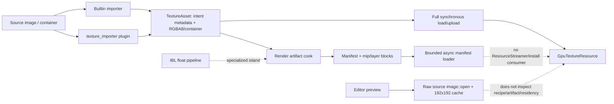

# Editor156 · Texture / Image / Cubemap / RenderTarget / Sampler / Compression / Streaming / Preview 当前源码复核

## 1. 结论

Editor109之后，Texture链出现了值得保留的工程进展。`render_manifest`已经能描述按mip/layer切分的内容块、bootstrap与streamable residency、raw/zstd codec、内容hash、alignment、dependency和target platform；发布顺序是block先于manifest，immutable store使用create-new原子写并拒绝同名异内容覆盖。对应loader具备bounded entry/ticket/retained-byte预算、priority/deadline、cancel/close、single-flight、异步I/O、zstd解码、稳定失败码和损坏/容量/decompression bomb测试。Mip residency manager也补出了字节预算、transition上限、hysteresis、offscreen eviction和transition identity。这些不是临时占位，应成为正式Texture artifact与streaming链的底座。

但这些底座仍是断开的岛。普通图片导入仍统一`to_rgba8()`，HDR/EXR只有Environment IBL专线保持float；builtin importer只写mip/compression意图，`texture_importer`才执行offline mip、normal和唯一的BC5编码，因此provider安装状态会改变实际输出。新的render manifest只被artifact模块自身消费，普通import、headless cook/package、`ResourceStreamer`和GPU install都没有接入；首次`ensure_texture()`仍同步加载并完整上传，mip切换仍同步重读完整资产并重建texture，compressed payload明确不能走resident-mip rebuild。

Editor产品链没有实质闭合。类型注册仍只有通用Texture和SourceImage thumbnail；preview直接`image::open()`原始source并固定缩放到192x192，cache key没有recipe/artifact/platform/color/view mode，写入不原子且没有GC。Texture Editor插件继续声明不存在的`plugins://texture/editor/authoring.zui`，没有document/toolkit/controller/factory/reimport transaction，也没有进入first-party Editor catalog与App产品装配。两套插件importer继续重叠声明owner，其中`asset_importers/texture`没有注册可执行importer，却与真实`texture_importer`同时宣称stable/complete。

因此Editor35继续是canonical owner，本轮只刷新currentness，不重复增加finding：**5个P0为3 Open / 2 Partial / 0 Closed；60个P1为30 Open / 30 Partial / 0 Closed；12个P2全部Open；32门为17 Fail / 15 Partial / 0 Pass**。工程目标仍应收敛为：

`TextureSourceAsset + versioned ImportRecipe -> canonical float/integer intermediate -> deterministic BuildGraph -> platform-qualified immutable TextureArtifact + BulkMip/VirtualPage blocks -> generation-qualified RuntimeInstallReceipt`

`TextureArtifact/RenderTarget/Sampler identity -> Runtime residency/lifetime owner -> artifact-aware Editor toolkit/preview/reimport -> headless cook/package/release evidence`

## 2. 当前物理范围与证据等级

| 范围 | 文件 / 行 / 非空行 / bytes / tests / ignored | working-tree指纹与说明 |
|---|---:|---|
| Zircon Runtime/Editor/Plugin selected | **238 / 53,313 / 48,560 / 1,860,340 / 552 / 44** | Texture asset/import/artifact、IBL、GPU resource、streaming、preview、plugin/catalog/App selected scope；`d1caf2223036b169c2224314af3df787e16fbbeb0ac9302cdf802c98d1ca3d33` |
| Unreal/Godot/Fyrox/Bevy/Unity Graphics reference | **29 / 27,536 / 23,887 / 1,095,686 / 82 / 0** | Texture build/streaming/editor、layered/cube/3D、typed image/sampler、RenderGraph resource与tests；`7eec8f42d737a475c5f2185278f3ba0725f2a7d8be4695bf5b58558f931a9944` |

指纹算法为：按仓库相对路径ordinal排序，对每个文件计算SHA-256，形成`relative_path<TAB>file_sha256<LF>`清单后再计算SHA-256。`tests`是Rust test attribute以及参考源码测试声明的静态计数，不等价于已执行或已通过；44个ignored主要是release-only microbenchmark，也不构成产品能力证明。

本轮逐文件读取了选择范围的完整文本，并执行了符号、caller、资源路径、feature/catalog、TODO/FIXME/unimplemented与测试声明扫描。没有运行Cargo、Editor、WGPU、真实import/cook、visual golden、fuzz、fault、scale、soak、跨平台或headless package动态lane。按用户要求排除Tooling优化；没有查询、轮询、等待或实时跟踪协调器。

## 3. 当前存在且必须保留的底座

1. `TextureAssetDescriptor`已经集中表达dimension、extent、mip policy、compression、color space、usage、SVT settings，并在normalize/validate阶段同步重复layer字段、检查cube/array/volume约束。
2. DDS/KTX/KTX2/ASTC container路径具备header、format、subresource layout、block大小、mip/layer范围和device capability检查；拒绝unsupported container比静默解码或伪造上传结果更接近正式边界。
3. Environment IBL专线使用RGBA32F source staging，支持equirectangular与external cube，生成PMREM、SH9和可选irradiance；request identity覆盖source/layout/required contents，算法版本、BLAKE3 key、atomic cache、restore/rebuild及串并行一致性测试可迁移到通用build graph。
4. `RenderArtifactManifest` schema v3、`TextureMipLayer` subresource、bootstrap/streamable residency、block codec/hash/size/alignment/dependency和texture layout已经构成可信的分块artifact合同雏形。
5. Texture artifact cook会从真实upload plan逐mip/layer切块，以mip tail作为bootstrap，并让高质量mip依赖更低质量级；store先写blocks再写manifest，create-new语义拒绝immutable identity冲突。
6. Manifest loader拥有bounded capacity、single-flight、priority/deadline、cancel/close、异步读取、zstd解码、hash/size校验、稳定diagnostic code和decompression上限；不能因尚未接生产链而重写成同步文件读取。
7. Runtime mip manager已记录resident bytes、请求/实际mip、transition id，具备每帧upload/byte/transition预算、hysteresis和offscreen eviction；这些policy应保留并改接真实bulk install。
8. GPU upload、sampler cache和output-target validation对当前受支持shape有明确拒绝路径；后续应扩展typed合同，而不是移除校验来扩大表面功能。
9. Preview job已有visible admission、generation/token stale protection和`JobContext` cancellation；应升级为artifact-aware多级调度，不应回退到同步UI解码。

## 4. 当前数据流与断路

| 当前表面 | 当前真实行为 | 工程断路 | 目标authority |
|---|---|---|---|
| 普通image decode | 所有普通格式进入RGBA8；HDR/EXR扩展可识别 | radiance在recipe/compiler前已丢失 | canonical intermediate decoder |
| Builtin与plugin import | builtin不执行offline mip/compression；plugin执行mip/normal/BC5 | provider安装状态改变actual artifact | shared Texture compiler + provider registry |
| Compression metadata | 可请求多种BC/ETC2/ASTC/Basis目标 | 实际encoder只有BC5，container pass-through不等于cook | actual-format artifact receipt |
| Render manifest | 真实分块、hash、bootstrap、依赖、原子store | 没有import/package/runtime caller | platform Texture artifact authority |
| Runtime streaming | 有预算、hysteresis与resident state | 首次完整上传；切mip同步重读和重建；compressed被拒绝 | async bulk I/O + in-place/generation install |
| Texture demand | 主视图visible mesh/material与resident texture | 半径由transform scale近似，无UV density与完整consumer图 | unified texture demand graph |
| SVT | 只有page size/border/tail与eligibility | 无page compiler/feedback/page table/tile cache | VirtualTexture artifact/runtime owner |
| RenderTarget | 普通Texture handle + late validation | 仅D2/单层/单mip/RGBA8/sample1，无pool/history/resolve | typed RenderTarget descriptor/handle/pool |
| Sampler | cache覆盖现有address/filter/aniso cap | descriptor缺compare/border/LOD/reduction等，aniso跨metadata | typed Sampler identity/project policy |
| Editor preview | raw source thumbnail、固定192、visible jobs | 不认识artifact/mip/layer/face/HDR/compression/residency | Texture toolkit preview service |
| Plugin product | 三个包重复声明Texture/importer能力 | 一个ZUI缺失，一个importer shell不注册，catalog/App未装配 | one package owner + admission receipt |

## 5. 参考引擎对照结论

| 参考 | 已核验的工程事实 | Zircon必须吸收的边界 |
|---|---|---|
| Unreal Engine | `Texture.h`以typed settings表达compression、mip、filter、LOD、virtual texture和source color；`TextureDerivedData.cpp`把build settings、texture format/version、encode speed、color/alpha/normal输入纳入derived key并产出per-mip data；`Texture2DStreamIn_IO.cpp`执行per-mip priority I/O、callback、cancel/abort和size校验；Texture Editor toolkit暴露mip/layer/slice/face/channel/zoom/exposure，RenderTarget有typed format、resize和auto-mip | source/build/runtime identity分层，actual encoder receipt，per-mip bulk生命周期，完整inspection surface和typed RenderTarget |
| Godot | 普通与layered importer明确区分lossless/lossy/VRAM/Basis、HDR、UASTC/RDO、mip、roughness、alpha/normal和reimport detection；2D/layered/3D拥有不同resource type/extension；Editor分别提供channel、mip、layer/face/slice、rotation与memory metadata | distinct texture shape identity、同一import policy到多平台artifact、layered/3D专用预览和可追踪reimport |
| Bevy | `Image`和descriptor使用typed `TextureFormat/TextureDimension/TextureUsages`，Sampler覆盖LOD、compare、anisotropy和border；HDR/EXR loader产出RGBA32Float；RenderAsset prepare安装GPU image；TextureCache以完整descriptor为key并按frame aging | typed closed set、HDR不可量化、prepare/install边界和descriptor-qualified cache |
| Fyrox | Texture资源区分kind/pixel kind、mip/filter/aniso/compression和render-target flag，loader读取per-resource import options；Editor inspector可选择资源并提供真实texture/resource editor | Rust typed resource/import options与Inspector联动，但需要在Zircon中进一步补齐artifact与streaming证据 |
| Unity Graphics | RenderGraph `TextureDesc`表达显式/相对/functor尺寸、GraphicsFormat、dimension、UAV、mip、MSAA、dynamic scale、clear/discard；RenderGraph tests验证create/release、transient误用和async queue lifetime；Texture2DAtlas具allocation/hash/update/invalidation和mips | RenderTarget必须属于graph lifetime而非普通sampled texture别名；cache/atlas需要descriptor key、失效和资源寿命测试 |

参考实现本身也有范围差异：Bevy/Fyrox不提供Unreal同级Texture Editor，Unity Graphics仓偏RenderGraph，Godot/Unreal包含较多历史兼容。Zircon应吸收可证明的owner、identity、artifact、lifetime与测试边界，而不是机械复制API数量。

## 6. P0当前状态

| ID | 状态 | 当前证据 | 必须重构 |
|---|---|---|---|
| P0-1 | Open | `decode_texture_source_image()`仍无条件`to_rgba8()`；builtin与image plugin共用该入口，只有IBL走RGBA32F | 建立float/half canonical intermediate、transfer/alpha/NaN policy和HDR source-to-readback fidelity gate |
| P0-2 | Partial | 原先`transcode_normal_bc5(...)`调用arity静态断点已修成一致的嵌套调用；本轮没有运行`--locked --offline` compile/repro lane | 冻结lock/toolchain，运行importer compile与fixture reproducibility；编译通过后仍不得绕过P0-3语义问题 |
| P0-3 | Partial | 新manifest/cook能从upload plan发布actual block layout、hash和bootstrap依赖；但builtin仍只写requested metadata，plugin只有BC5且manifest未接普通import/package/install | 以shared compiler产出actual format/mips/encoder receipt，禁止requested target冒充artifact结果 |
| P0-4 | Open | Texture Editor引用不存在的ZUI；`asset_importers/texture`声明重叠importer却不注册执行者；first-party Editor catalog/App无Texture产品，多个manifest仍标stable/complete | 收敛唯一package/importer owner，以资源、factory、catalog、runtime receipt和资格门共同决定admission/maturity |
| P0-5 | Open | sampled、cube/array、RenderTarget、SVT继续复用通用Texture identity；RenderTarget只能late reject shape/format，SVT metadata没有runtime产品 | 冻结typed Texture2D/Layered/Cube/Volume/RenderTarget/VirtualTexture/Sampler identity与合法转换边界 |

## 7. P1当前状态：Source、Recipe、Decode、Mip与Compression

| ID | 状态 | 当前证据与剩余差距 |
|---|---|---|
| P1-1 | Open | 没有独立、稳定、可迁移的`TextureSourceAsset`；source路径、内容身份和最终`TextureAsset`仍混合。 |
| P1-2 | Open | 没有versioned `TextureImportRecipe`、unknown-field preservation、migration或recipe revision。 |
| P1-3 | Open | 普通decode直接生成RGBA8 runtime payload，没有float/integer canonical intermediate及stage receipt。 |
| P1-4 | Partial | metadata与IBL已有sRGB/linear/HDR局部语义；普通decode、preview、mip、compression与readback没有统一transfer authority。 |
| P1-5 | Open | premultiply、coverage alpha、alpha dilation、threshold preservation和opaque detection没有统一recipe/golden。 |
| P1-6 | Partial | plugin存在normal convention归一化和BC5路径；builtin、mip filter、fallback与artifact receipt不共享该stage。 |
| P1-7 | Open | channel packing/swizzle/remap没有正式recipe、compiler stage与可视化验证。 |
| P1-8 | Open | resize/crop/pad、NPOT、max-size、aspect、normal/HDR filter和platform override没有统一policy。 |
| P1-9 | Partial | plugin可生成offline mip，artifact cook能切已有mips；builtin只声明`GenerateOffline`，不存在唯一mip compiler。 |
| P1-10 | Partial | BC5 encoder、预压缩container parser和device gate真实存在；BC1/4/6H/7、ETC2、ASTC、Basis实际provider合同与质量矩阵不完整。 |
| P1-11 | Partial | manifest保存`target_platform`，但variant key未覆盖source digest、recipe、tool/encoder version、feature tier、quality/RDO。 |
| P1-12 | Partial | schema v3已分mip/layer block并记录hash/size/codec/alignment/dependency；普通import、DDC GC、package与runtime install仍未消费。 |

## 8. P1当前状态：Shape、Cubemap、Sampler与RenderTarget

| ID | 状态 | 当前证据与剩余差距 |
|---|---|---|
| P1-13 | Open | `RenderImageDescriptor.format`仍为`String`，跨asset/render/GPU的format closed set没有统一authority。 |
| P1-14 | Partial | normalize会验证并同步`depth_or_array_layers`与`array_layer_count`；重复字段仍允许长期漂移和兼容负担。 |
| P1-15 | Open | 2D、layered、cube、volume、target与virtual texture没有稳定独立identity或受限variant合同。 |
| P1-16 | Partial | `.zarray`可表达引用或sliced source并有局部校验；最终仍flatten为TextureAsset，缺stable per-layer identity和可编辑source map artifact。 |
| P1-17 | Partial | `.zcube`覆盖six-file/cross/equirect和orientation tests；DDS/KTX与所有入口没有共享单一orientation authority/golden。 |
| P1-18 | Partial | cubemap具mip与基础布局处理；没有跨face seam fixup、mip edge数值误差和各压缩格式一致性门。 |
| P1-19 | Partial | IBL source/PMREM/SH/irradiance、版本、hash、原子cache与一致性测试较完整；仍是专线，未并入通用build graph/platform variant。 |
| P1-20 | Partial | sampler cache会按现有address/filter和anisotropy cap区分；descriptor缺compare、border、LOD clamp/bias、reduction与unnormalized coordinates。 |
| P1-21 | Open | Sampler不是独立typed resource，也没有清晰project/group policy；anisotropy部分位于Texture metadata。 |
| P1-22 | Open | RenderTarget继续使用`ResourceHandle<TextureMarker>`，没有typed descriptor、handle、view/resolve身份。 |
| P1-23 | Open | Output target只接受D2、单层、单mip、RGBA8、sample1；HDR/depth/array/cube/MSAA/UAV/resolve均不成立。 |
| P1-24 | Open | 没有relative/dynamic sizing、pool、history、aliasing、resize receipt、graph lifetime与device-loss恢复。 |

## 9. P1当前状态：Physical Streaming、Virtual Texture与性能

| ID | 状态 | 当前证据与剩余差距 |
|---|---|---|
| P1-25 | Partial | artifact plan能标记bootstrap mip tail并只规划bootstrap blocks；production首次ensure仍加载并上传完整texture。 |
| P1-26 | Partial | manifest loader具异步bounded I/O、priority/deadline/cancel；Runtime mip transition仍同步加载完整`TextureAsset`。 |
| P1-27 | Partial | artifact能保存compressed upload-ready blocks；`rebuild_resident_mips`明确拒绝compressed payload。 |
| P1-28 | Partial | manifest包含resource revision，loader ticket/transition有identity；GPU install没有generation-qualified prepare/apply/retire receipt。 |
| P1-29 | Partial | demand读取当前主视图visible mesh/material并估算screen coverage；半径仅由transform scale近似，没有UV density、projected texel footprint和采样反馈。 |
| P1-30 | Open | Sprite/UI/particle/decal/terrain/IBL/probe/editor preview/render graph/history等consumer没有进入统一demand图。 |
| P1-31 | Partial | Runtime有resident/upload byte预算与每帧transition cap；默认resident budget仍是`u64::MAX`，没有Texture Group、pool/class/priority policy。 |
| P1-32 | Partial | hysteresis、offscreen eviction与persistent resident bytes已存在；无全局pressure arbitration、anti-thrash telemetry、preemption和multi-view policy。 |
| P1-33 | Partial | loader与streamer已有stable failure code、deadline/corruption/capacity diagnostics；重试、backoff、fallback、operator action和跨阶段provenance未闭合。 |
| P1-34 | Open | SVT只有page size/border/tail和eligibility；无page compiler、feedback、page table、physical tile cache、eviction或shader sampling。 |
| P1-35 | Partial | resident bytes、请求/实际mip、transition与部分loader counters可观察；缺按group/consumer/asset的miss、stall、thrash、I/O/decode/upload/fence指标。 |
| P1-36 | Open | 没有规模fixture、startup tail latency、streaming bandwidth、CPU/GPU memory、cache hit、thrash与soak基线。 |

## 10. P1当前状态：Editor Toolkit、Preview、Reimport与交互

| ID | 状态 | 当前证据与剩余差距 |
|---|---|---|
| P1-37 | Open | 没有Texture document/toolkit/controller/factory；声明的`authoring.zui`物理不存在。 |
| P1-38 | Open | import settings没有schema-driven Inspector、capability filtering、validation、preset、migration或unknown-field view。 |
| P1-39 | Partial | Preview使用Background Job、generation token和cancel context；Texture import/reimport/build没有统一job、progress、cancel与publish receipt。 |
| P1-40 | Open | 没有source/recipe/intermediate/artifact/runtime之间的format、size、mip、quality、dependency和provenance diff。 |
| P1-41 | Open | 只有SourceImage thumbnail，没有RGBA channel、alpha/checker、normal、UV、zoom/pan、exposure和linear/sRGB inspection。 |
| P1-42 | Open | 无mip selector、requested-vs-actual format、block artifact、compression difference、PSNR/SSIM或artifact readback view。 |
| P1-43 | Open | 无layer/face/slice selector、cubemap rotation/projection、volume slice和seam inspection。 |
| P1-44 | Open | 无live RenderTarget picker、freeze/history、depth/HDR/exposure、MSAA resolve或producer lifetime view。 |
| P1-45 | Open | thumbnail直接解码raw source，不消费recipe/artifact/platform/generation，也不能证明与runtime结果一致。 |
| P1-46 | Open | 固定`thumbnail_exact(192,192)`，没有aspect/letterbox、HDR tone map、alpha checker、normal/color policy和DPI tier。 |
| P1-47 | Partial | cache key含UUID/source hash且generation token防止stale result；文件发布不原子，key不含recipe/artifact/view，且无size/age GC。 |
| P1-48 | Partial | visible-only、64 in-flight、cancel context与stale generation保护存在；没有byte budget、tier/fairness、decode/upload阶段、priority aging和shutdown receipt。 |

## 11. P1当前状态：Plugin、Diagnostics、测试与发布资格

| ID | 状态 | 当前证据与剩余差距 |
|---|---|---|
| P1-49 | Open | builtin、`texture_importer`和`asset_importers/texture`重叠；后者只声明descriptor，没有可执行`register`实现。 |
| P1-50 | Open | plugin test主要验证descriptor registration，不能证明resource/controller/import/cook/install/product execution。 |
| P1-51 | Partial | runtime catalog可在`base-runtime-plugins`包含Texture runtime；first-party Editor catalog与`zircon_app target-editor-host`没有Texture editor/provider branch。 |
| P1-52 | Open | 多个manifest仍标`stable`/`complete`，与缺资源、缺caller、缺产品装配及失败门不一致。 |
| P1-53 | Open | builtin与plugin对mip、normal、compression和diagnostic的结果不同，没有共享compiler或等价fallback。 |
| P1-54 | Partial | container、manifest loader和streamer已有部分stable codes；source decode、recipe validation、compiler/provider、publish/install没有统一typed diagnostic journal。 |
| P1-55 | Partial | container parser和manifest loader有大量malformed/size/corruption tests；没有受预算约束的持续fuzz corpus及跨格式decompression bomb lane。 |
| P1-56 | Partial | manifest排序、content hash、immutable atomic store和IBL key/cache具确定性底座；完整key、byte-identical cook、GC/rollback/cache-race门仍缺失。 |
| P1-57 | Open | 没有HDR、color/alpha/normal、mip、compression、cubemap seam、preview与GPU readback visual/quality golden矩阵。 |
| P1-58 | Partial | manifest loader已覆盖损坏、容量、deadline、close和decompression上限；仍没有I/O短读、cancel race、disk full、publish crash、GPU OOM/device loss、generation supersede的端到端fault matrix。 |
| P1-59 | Open | 没有Windows/Linux/macOS与D3D12/Vulkan/Metal、format tier、driver/device矩阵；静态capability test不能替代真实设备lane。 |
| P1-60 | Partial | artifact manifest/store/loader具备headless可复用组件；没有从source到platform package的命令产品、依赖闭包、签名、rollback和release evidence。 |

## 12. P2当前状态

| ID | 状态 | 当前判断 |
|---|---|---|
| P2-1 | Open | 无GPU/compute texture encoding farm、worker协议与deterministic receipt。 |
| P2-2 | Open | 无perceptual/RDO自动质量优化、内容分类与目标大小求解。 |
| P2-3 | Open | 无advanced virtual texturing、multi-space page policy与反馈预测。 |
| P2-4 | Open | 无sparse/reserved resource backend和跨API residency抽象。 |
| P2-5 | Open | 无UDIM、tile set identity、跨材质依赖与大型内容编辑体验。 |
| P2-6 | Open | 无runtime/procedural texture producer合同、graph lifetime和readback/cook policy。 |
| P2-7 | Open | 无Texture atlas、bindless descriptor与residency协同。 |
| P2-8 | Open | 无neural texture compression、super-resolution或可回退artifact。 |
| P2-9 | Open | 无自动内容审计、质量/内存风险解释与可事务修复建议。 |
| P2-10 | Open | 无多人Texture recipe/paint/metadata协同和冲突合并。 |
| P2-11 | Open | 无跨版本artifact migration、dual-read rollout、rollback和GC证明。 |
| P2-12 | Open | 无跨引擎同源质量、启动、streaming、显存与Editor交互基准。 |

## 13. 当前Authority与断路清单

| Authority | 当前冲突 | 硬切目标 |
|---|---|---|
| Source ownership | 路径、decoded image、TextureAsset与`.zcube/.zarray` recipe混在import结果 | immutable source identity + editable versioned recipe |
| Decode ownership | 普通RGBA8路径与IBL float路径分裂 | one canonical decoder/intermediate contract，IBL作为consumer stage |
| Compiler ownership | builtin、texture_importer与container pass-through各自解释mip/compression | shared graph，provider只实现声明能力并返回actual receipt |
| Artifact ownership | bincode TextureAsset、IBL cache和render manifest并存 | one platform-qualified manifest/block model，领域artifact引用而非复制 |
| Cache/DDC ownership | preview cache、IBL cache、artifact store各自key/GC/publish | shared immutable store policy + namespace-specific schema/key |
| Runtime install | ResourceStreamer完整上传/重建与manifest loader互不相连 | prepare block -> decode/transcode -> generation apply -> retire/fence receipt |
| Residency | Texture state、chunk residency、manifest loader预算分散 | one resource residency service，texture policy作为typed adapter |
| Shape identity | sampled/cube/array/volume/target/virtual共用Texture marker | typed identities + explicit legal conversion/reference graph |
| Sampler | descriptor和Texture metadata分担同一policy | independent immutable Sampler or explicit project/group policy |
| RenderTarget | 普通Texture handle承担target身份 | RenderGraph-owned target handle/descriptor/pool/history lifetime |
| Preview | raw source thumbnail与runtime artifact分裂 | artifact-aware preview service，共享color/decode/shape/provider |
| Package/plugin | 三个包重叠，descriptor/maturity可脱离执行者 | one package owner，admission基于resource/factory/provider/test receipt |

## 14. 分层重构里程碑

| 里程碑 | 依赖 | 必须完成的工程产物 | 退出条件 |
|---|---|---|---|
| M0 Truthfulness与可编译基线 | 无 | 修复/验证importer compile；缺失ZUI与无执行者descriptor不可见；stable/complete降级；冻结owner和unsupported矩阵 | G02、G04、G27、G28至少可证明，所有声明都有production caller或明确Unavailable |
| M1 Stable Source、Recipe、Typed Shape与Migration | M0 | `TextureSourceAsset`、versioned recipe、typed shape/format/usage/color/alpha、unknown preservation、migration、stable layer/face identity | G05通过，旧资产迁移与roundtrip byte/semantic evidence齐全 |
| M2 Canonical Decode与Shared Texture Compiler | M1 | float/integer canonical intermediate；color/alpha/normal/channel/resize/mip stages；provider registry和actual encoder receipt | G01、G03、G04、G06、G07、G11通过 |
| M3 Platform Artifact、DDC与Atomic Publication | M2 | 把现有manifest/store扩展为完整variant key、bulk dependencies、GC/rollback；builtin/plugin/IBL统一发布 | G08-G10、G13通过，local/headless cook byte-identical |
| M4 Runtime Install与Physical Streaming | M3 | manifest loader接ResourceStreamer；tail-first；compressed block upload；priority/cancel；generation prepare/apply/retire；全consumer demand与预算 | G17-G21通过，首帧不再完整上传，取消/替换不安装旧generation |
| M5 Sampler、RenderTarget与RenderGraph Lifetime | M1、M3 | 完整typed Sampler；typed RT descriptor/handle；format/shape/MSAA/resolve/depth/HDR；relative sizing、pool/history、device-loss恢复 | G14-G16通过，graph misuse/lifetime/fence tests齐全 |
| M6 Virtual Texture产品链 | M2-M4 | page compiler、tail/page artifact、feedback、page table、physical cache、shader path、budget/fallback/telemetry | G22通过，真实场景end-to-end visual与pressure测试成立 |
| M7 Texture Editor与Preview | M1-M5 | document/toolkit/factory、schema Inspector、transactional reimport、source/artifact diff、2D/layer/cube/volume/RT preview、artifact thumbnail/cache GC | G23-G26通过，Editor与headless/runtime消费同一artifact |
| M8 Plugin收敛与跨平台发布资格 | M0-M7 | 删除重复owner；catalog/App profile装配；diagnostic journal；fuzz/fault/quality/scale/device/headless package/release rollback | G27-G32全部通过，maturity由evidence自动派生 |
| M9 高级Streaming与内容优化 | M4、M6、M8 | GPU encoder farm、RDO、sparse resource、UDIM、procedural producer、bindless/atlas、neural artifact与跨引擎benchmark | 仅在M0-M8无回退且P2有独立预算/降级/发布合同后启动 |

里程碑必须按依赖推进。M7不能先做一套只改metadata的Texture Editor；M6不能在M3/M4没有真实bulk install时增加SVT checkbox；M9不能用实验性性能数字掩盖M0-M8的产品断路。

## 15. 验收门禁

| Gate | 当前状态 | 当前证据与通过条件 |
|---|---|---|
| G01 HDR/EXR fidelity | Fail | 普通入口仍RGBA8量化；必须验证float source到artifact/GPU readback辐射误差。 |
| G02 Importer compile/reproducibility | Partial | 静态arity断点已修；仍需locked/offline compile和同fixture重复产物。 |
| G03 Requested/actual truth | Partial | manifest能记录实际blocks；普通import仍可只写目标metadata。 |
| G04 Builtin/plugin parity | Fail | builtin与plugin在mip/normal/BC5行为不同。 |
| G05 Typed shape/reference | Partial | asset dimension有typed enum；render format字符串、shape identity和引用仍混装。 |
| G06 Color/alpha/normal golden | Fail | 无端到端golden矩阵。 |
| G07 Compression matrix | Fail | 只有BC5真实encoder，其他目标缺provider/quality/runtime矩阵。 |
| G08 Platform variant key | Partial | 有target platform，缺完整影响输入。 |
| G09 Artifact atomicity | Partial | block-before-manifest与create-new成立；多namespace发布/GC/rollback未闭合。 |
| G10 Artifact determinism | Partial | block hash/sort与IBL key成立；全compiler byte-identical门缺失。 |
| G11 Container malformed/fuzz | Partial | parser/loader malformed tests广泛；持续fuzz与总预算矩阵缺失。 |
| G12 Cubemap orientation/seams | Partial | `.zcube`有orientation tests；所有入口统一orientation和seam数值门缺失。 |
| G13 IBL preservation | Partial | float/PMREM/SH/version/atomic cache较完整；未接通用artifact/platform/runtime evidence。 |
| G14 Sampler completeness | Fail | descriptor字段和独立identity不完整。 |
| G15 RenderTarget format/shape | Fail | 仅RGBA8/D2/single-layer/single-mip/sample1。 |
| G16 RenderTarget resize/lifetime | Fail | 无pool/history/relative resize/graph lifetime/device-loss。 |
| G17 Tail-first startup | Partial | artifact plan可选bootstrap tail；production首次仍完整上传。 |
| G18 Compressed physical streaming | Partial | compressed blocks可cook；resident rebuild明确拒绝compressed。 |
| G19 Async/cancellation | Partial | manifest loader成立；production transition仍同步且无完整fence receipt。 |
| G20 Demand coverage | Fail | 只覆盖主视图部分mesh/material consumer。 |
| G21 Budget/thrash | Partial | byte/transition budget、hysteresis、offscreen eviction存在；默认无限和全局仲裁缺失。 |
| G22 SVT end-to-end | Fail | 只有settings，无page产品链。 |
| G23 Editor transaction | Fail | 无Texture document/toolkit/factory/undo/save。 |
| G24 Editor conflict/reimport | Fail | 无recipe revision、dependency diff、CAS/conflict与reimport transaction。 |
| G25 Preview modes | Fail | 只有raw source thumbnail。 |
| G26 Preview cache/scheduler | Partial | generation/cancel/visible admission存在；key/publication/GC/fairness/bytes不合格。 |
| G27 Plugin admission | Fail | 缺资源与无执行者descriptor仍可声明能力。 |
| G28 Maturity truth | Fail | stable/complete与实际执行链不一致。 |
| G29 Diagnostics | Partial | loader/container/streamer有局部stable code；全链journal/provenance/operator action缺失。 |
| G30 Scale/performance | Fail | 只有ignored microbench，没有产品scale/soak/budget基线。 |
| G31 Cross-platform/headless package | Fail | 无完整platform/device/headless source-to-package矩阵。 |
| G32 Release rollback | Fail | 无artifact generation rollout、dual-read、rollback和旧generation GC证明。 |

## 16. 禁止的临时修补

1. 禁止仅给`TexturePayload`增加一个float variant，却继续让builtin、plugin、preview和IBL各自解释颜色、mip与compression。
2. 禁止把requested compression字符串改名为actual format，或在没有encoder receipt时把container pass-through称为platform cook。
3. 禁止让Runtime先完整上传，再把后台重建较低mip称为tail-first streaming。
4. 禁止解压compressed texture为RGBA8后冒充compressed physical streaming；这会同时破坏带宽、显存与质量合同。
5. 禁止在SVT只有settings时增加Editor page-size面板、feature flag或stable capability。
6. 禁止继续用普通Texture handle承载RenderTarget，只靠创建时late validation扩展更多字符串format。
7. 禁止新增另一套Texture preview decode/cache；Editor必须消费与cook/runtime一致的recipe、artifact和color authority。
8. 禁止保留多个Texture importer owner并用priority掩盖语义差异；fallback必须共享compiler且产出等价receipt。
9. 禁止用大量unit test数量、ignored benchmark或descriptor registration test替代真实source-to-package、GPU、fault和跨平台lane。
10. 禁止在M0-M8完成前宣称性能或表现优于Unreal；比较必须使用同源内容、同质量目标、同平台预算和可复现实测协议。

## 17. 本轮产出边界

本报告只做当前源码review与重构规划，没有修改生产Rust、Cargo feature、plugin manifest、ZUI、资产schema或测试。Editor35仍持有canonical finding/gate定义；Editor156只冻结2026-08-27共享dirty working tree下的currentness、证据、状态与依赖顺序。

后续实现应从M0开始建立独立子计划，并在每个里程碑重新扫描source manifest、owner/caller、feature/catalog、资源存在性和动态门。任何局部实现如果不能明确落入`source -> recipe -> compiler -> artifact -> install -> editor/package evidence`链中的单一authority，都不能作为finding关闭依据。
