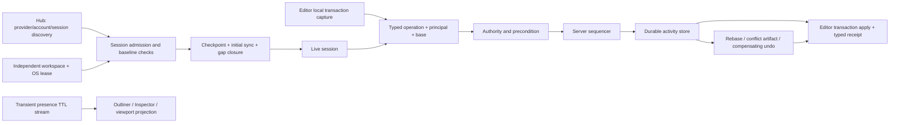

# Editor164 · Multi-User / Collaborative Editing / Session Replication 当前源码复审

## 1. 结论

Zircon 当前仍没有工程级 Multi-User 或 Collaborative Editing 产品。对 Editor、Runtime、Runtime Interface、Hub、App 与 plugins 下 **18,517 个物理源码文件**精确检索，`CollaborativeSessionService`、`CollaborativeEditingProvider`、`CollaborativeSession`、`MultiUser`、`PresenceService`、`ActivitySequence`、`ParticipantId`、`EndpointId`、`ResourceAuthorityService`、`AuthorityConflict`、`CollaborativeTransaction`、`RemoteTransaction` 共 **0 个命中**。这不是命名差异：源码中也没有可承担 session admission、initial sync、server sequence、durable activity、participant presence、distributed authority、remote transaction acceptance 或 conflict convergence 的组合 owner。

Editor117 之后，本地 transaction 与 recovery 底座有明显进展。现在已有严格 command codec registry、Scene command decoder、atomic local replay、per-document append-only journal、BLAKE3 record checksum、size/record bounds、tail fault classification、file sync 和 covered-prefix compaction。项目也已有非空 `ProjectGuid`、manifest digest、engine compatibility preflight、进程生命周期 ledger 和持有 named mutex/flock 的单工作区 OS lease。这些进展只能使 6 个 P1 finding 进入 Partial；它们仍没有 collaborative wire identity、authenticated principal、server order、remote precondition、ack/receipt 或 production recovery assembly。

durable journal 目前尤其容易被误判为“已完成”。`DocumentJournalCoordinator` 的唯一 append API 是 `#[cfg(test)] append_for_test`，源码明确说明在 transaction engine 拥有 commit linearization point 的 immutable capture 前，production publication 故意不可用。Scene codec 注册、`TransactionJournalReplayer`、journal discovery、read/compaction 也没有完整 production startup/recovery consumer。当前磁盘格式记录的仍是 process-local `TransactionId`、本地 `HistoryContextId`、被称为 `participants` 的 `DocumentId` 集合和 raw `NodeId`/字符串 field address；不是共享 activity。

当前还有一个必须先封口的 P0。`UiControlRequest::InvokeBinding` 与 `InvokeRoute` 直接进入 Editor binding/route 执行，只有 `CallAction` 检查 `callable_from_remote`；而 `EditorCommandDescriptor::new` 与 serde default 又把该值设为 `true`。请求模型没有 authenticated principal、session、device、role 或 capability。协作层若建立在这条 remote UI control 路径上，会形成默认开放、可绕过 action gate、无法审计到真实调用者的远程 mutation 面。

Editor43 的 canonical finding 总数保持不变。本轮状态为：**P0：5 Open；P1：64 Open / 6 Partial；P2：12 Open；Gates：29 Fail / 3 Partial / 0 Pass**。没有两个以上真实 Editor client、authoritative server、durable activity recovery、冲突矩阵、安全或规模测试，因此没有证据证明本域达到、接近或优于 Unreal Concert，更不能证明性能优于 Unreal。

## 2. 审查范围、统计与 currentness

统计读取共享 working tree 的物理内容，包含未跟踪文件。行数为物理行；tests/ignored 只统计精确 Rust `#[test]` / `#[tokio::test]` / `#[ignore]`。fingerprint 保留 repository-relative path 大小写并排序，对每文件 SHA-256 组成清单后再次计算 SHA-256。dirty 只表示选择集内文件，不代表整个仓库干净。

| 范围 | 文件 / 行 / 非空行 / bytes / tests / ignored / dirty | fingerprint |
|---|---:|---|
| Editor authoring / journal / session / remote surface | **161 / 28,020 / 25,473 / 976,480 / 231 / 0 / 0** | `a79f55b265162bcb09e611ffe1aa60d2345b1f293519807efa50181bfeb7b521` |
| Runtime/Interface identity / admission / net DTO | **58 / 5,380 / 4,804 / 166,559 / 18 / 0 / 0** | `4b733b9da425b2c1118046b8c0d5ee4bd9892bbbc5f8608aa229444fc9c027c8` |
| Net plugin product boundary | **169 / 16,302 / 14,700 / 572,716 / 147 / 0 / 0** | `0a9cea97170fa6fd9ed0d6e3a5daa2eeb923dc381994e629dbcf7ec49ddce0f7` |
| Hub team / collaboration surface | **4 / 752 / 701 / 26,249 / 6 / 0 / 0** | `f89379bf2346a53586083edebbccd73898665117b978b49119c71bc31db678d3` |
| Zircon selected union | **392 / 50,454 / 45,678 / 1,742,004 / 402 / 0 / 0** | `fdd6edc0e51004afdad9d7c877f605184896d1425f7c63df70d705478cf0e3ef` |
| Unreal / Godot / Fyrox / Bevy / Unity Graphics selected | **29 / 16,871 / 14,576 / 624,005 / 11 / 0 / 0** | `24c91238a4c7bfb61b4a9f7fa6f8dc0ab38d34da74b207ccdb362b22b2ff5f2f` |
| All selected | **421 / 67,325 / 60,254 / 2,366,009 / 413 / 0 / 0** | `6ae989be1426d845bc8d426977acfd56500f4a47c20058ff2d63da48222389db` |

- baseline/verification HEAD 冻结为 `7042269b8e282cff936b35adc9b86ac24ad3c1ae`，commit 时间为 2026-08-27T12:10:54+08:00。仓库存在大量与本域无关的共享改动，本报告没有覆盖或回退它们。
- Editor 集合包含完整 editing/document/editor_message、document journal、session guard、project preflight、Scene route、remote control surface 和聚焦测试。Runtime/Interface 集合包含完整 framework net DTO、project identity/admission/session lock 与 UI control contract。
- Net plugin 集合包含 runtime 及 HTTP/WebSocket/RUDP/RPC/replication/content-download feature runtime owner；它只用于判断可复用 transport 和游戏网络边界，详细产品裁决仍归 Runtime99zo。
- 参考集合是 frontmatter 中精确 29 个文件。Unreal Concert 是协作产品主基线；其余参考只承担本地 undo/redo、远程观测/调用和 authoring transaction 边界，不推断未公开实现。
- 按用户要求未查询、轮询、等待或实时跟踪协调器；Tooling 按用户要求排除。本轮只写 review 与索引，没有修改 production、tests、Cargo、ABI 或参考源码。

## 3. 当前源码事实与语义边界

### 3.1 产品 owner 和协议仍为零

1. 没有 session provider、server/client lifecycle、participant roster、endpoint membership、session state machine 或 live/archive session owner。
2. 没有 server-assigned ActivityId/ActivitySequence、durable activity store、checkpoint head、gap query、ack/dedup/reorder 或 reconnect resume cursor。
3. 没有 collaborative object/property address、authoritative lock/lease、same-property conflict artifact、optimistic reject rollback 或 compensating collaborative undo。
4. 没有 presence schema、TTL、coalescing、interest filtering、privacy、remote selection/viewport projection 或 presence/durable-stream separation。
5. 没有 package/source artifact transfer、checksum/chunk protocol、independent workspace manager、session archive/fork 或 activity audit UI。

### 3.2 本地 transaction engine 是应复用底座，不是协作协议

1. `EditorTransactionEngine` 已有 RAII/nested transaction、apply/revert/finalize、失败 rollback、selection restoration、dirty generation、history paging、operation gate/group 和 faulted state。
2. `TransactionJournal` 现在能严格 decode，`EditCommandCodecRegistry` 按 `(command_type, schema_version)` 注册并拒绝空名、重复和未注册 codec；Scene create/delete/update/reflected-field codec 已实现。
3. `TransactionJournalReplayer` 会先 decode 全部 command，再开启现有 transaction，逐项 push 后原子 commit；decode 失败不会产生半事务。这是未来 accepted activity 落地时应复用的正确边界。
4. journal 本身仍只携带 schema、process-local transaction/history、label/frame、本地 documents、selection、significant 和 command payload。它没有 participant principal、session/endpoint、global sequence、base revision、causal parent、ack、authority 或 audit provenance。
5. `TransactionId(u64)` 和 `HistorySaveToken` lineage 都是 engine instance 内身份；`DocumentId` 由本地 project path/scene key 派生并依赖本机 collision probing；这些值不得进入 wire protocol。

### 3.3 durable journal 已有存储 primitive，但 production 提交和恢复断路

1. per-document journal 使用 project-relative source path 的规范化 hash 作为磁盘 key，避免直接使用 session-local `DocumentId`；record 带连续 `u64` sequence、BLAKE3 checksum、1 MiB record、64 MiB journal 与 65,536 record 上限。
2. writer 写入 sequence/length/digest/payload 后 `sync_data`，写失败会 poison；reader 会报告 truncated tail、oversize、checksum mismatch、invalid transaction、non-contiguous sequence 和 record-limit fault。
3. compaction 只接受 caller 声明 snapshot 已覆盖的 prefix，并复用 atomic write。这些都属于真实 durability primitive。
4. 但 coordinator 只有测试可见的 `append_for_test`；production transaction commit 没有 immutable capture + append linearization point。`read_document`、`compact_covered_prefix`、`DurableJournal::discover`、Scene codec registry 和 replayer 没有组成 startup recovery workflow。
5. replay 测试只覆盖 matching baseline。没有 diverged baseline、remote duplicate/reorder、same-property conflict、schema/plugin drift、disk-full/crash 与 accepted/rejected receipt 测试。

### 3.4 Scene command 仍会在远端重放时退化为 silent last-writer-wins

1. `UpdateNodeCommand::apply` 调用 `apply_node_state(before, after)`，函数只验证 node 存在，并在 before 与 after 字段不同的情况下直接写 after；它不验证 scene 当前值是否仍等于 before。
2. `SetReflectedSceneFieldCommand::apply` 同样直接写入 after；replay validation 只检查 type/field 非空和 before != after，没有 current-value/hash/revision CAS。
3. payload 继续使用 raw `NodeId`、`component_type_path: String`、`field_name: String` 与完整 before/after value。没有 qualified project/scene/source/instance identity、field schema ID 或 provenance。
4. `try_merge` 只用于同一 local NodeId 的 command coalescing，不是并发三方 merge。把当前 replayer 接到网络会覆盖别人的修改而不产生 conflict artifact。

### 3.5 Project preflight 与 OS lease 的正确边界

1. manifest 已强制持久化非空 `ProjectGuid`；`ProjectPreflightReceipt` 组合 physical canonical descriptor path、ProjectGuid、manifest BLAKE3 digest 和 engine semver compatibility。
2. physical descriptor path 是本机 filesystem authority，不是跨 checkout wire identity。当前只建立了 Project 身份的一部分，没有稳定 Scene、Workspace、Participant、Endpoint 或 Collaborative Session identity。
3. `SessionGuard` 的 Claimed、PreflightApproved、Activating、Ready、Closing、RecoveryRequired 生命周期、heartbeat、exact-record takeover、Windows named mutex/Unix flock 都是可靠的单工作区写保护。
4. `ProjectSessionPrincipalV1` 源码明确说明它是 local desktop request provenance，不是 authentication claim。PID、instance ID、launch source、operation ID 和 session generation 不能替代用户认证、设备证明、role 或 capability。
5. Multi-User 必须给每个 participant 独立 checkout/sandbox/overlay，并保留各自 OS lease；不能删除 lease 后让多个进程写同一 physical root。

### 3.6 remote UI control 是独立 P0，不能成为协作传输

1. `UiControlRequest` 暴露 `InvokeBinding`、`InvokeRoute`、`SetProperty`、`CallAction` 等通用远程控制请求，但 envelope 没有 principal/session/device/role/capability/auth context。
2. `handle_control_request` 对 `InvokeBinding` 和 `InvokeRoute` 直接执行；只有 `CallAction` 查询并检查 `action.callable_from_remote`。
3. `EditorCommandDescriptor::new` 与 serde default 将 `callable_from_remote` 设为 `true`，安全默认方向错误。
4. remote invocation 被标记为 `UiBinding` 或 `Headless`，没有真实 `InvocationPrincipal`/`SourceProvenance`。因此现有 route 字符串、binding 和 action ID 必须在 M0 收口，协作 activity 使用独立 typed protocol。

### 3.7 Runtime Net 与 Hub Team 不是 Collaborative Editing

1. Runtime framework net 已有 TCP/UDP/HTTP/WebSocket interface 和 handshake/RPC/replication DTO；net plugins 也有 loopback、RUDP、RPC、replication/content-download 局部实现。Runtime99zo 已裁决其 session auth、RPC handler、World replication、schema/baseline 和默认产品装配仍不闭合。
2. gameplay `NetSessionId`、player string、client-owned replication authority 和 RPC target 不能重命名为 Editor participant、workspace authority 或 collaborative activity。
3. Hub Team 只读取本地 Git root、user.name/email 与最近 200 个 commit author，并展示最多 8 个 contributor。invite、permissions、remote collaboration 明确 disabled/Coming Soon。
4. 该 disabled UI 是诚实产品状态，应保留；未来 Hub 只拥有 account/provider/session discovery，Editor/Session service 才拥有 World activity、authority、presence 和 conflict state。

### 3.8 测试数量不能替代多进程资格

选择集有 402 个 Rust test attribute，主要验证本地 transaction、journal、session guard、net algorithm 和 Hub projection。它们没有启动两个 Editor client 与 authoritative server，也没有覆盖 initial sync、sequence gap、duplicate/reorder/loss、lock race、same-property conflict、participant auth、privacy、server crash/rejoin 或 2/4/16/64 client budget。当前测试密度不能用于宣称 Multi-User 功能存在。

## 4. 参考引擎差异

| 能力 | Zircon 当前 | Unreal Concert 参考 | 必须收敛的边界 |
|---|---|---|---|
| Session / admission | 本地 project preflight 与 single-root lease | live/archived session、endpoint membership、session request/response | 分离本地 workspace admission 与 collaborative server admission |
| Ordering / durability | process-local transaction/frame，journal production append 断路 | sequenced custom events、workspace activity、session database | server sequence、durable activity、checkpoint/gap/rejoin |
| Transaction | local apply/revert/replay，无 current==before | GUID transaction/operation、source endpoint、update index、snapshot/finalized/rejected | typed op、precondition、receipt、rollback、compensating undo |
| Lock / authority | 只有 physical root OS lease | package lock、object/property replication authority、conflict query/cache | 保留 OS lease，新增独立 resource authority service |
| Presence | 无 schema/owner | 独立 presence events/manager 与 live transaction authors | transient TTL stream，绝不污染 dirty/history/activity head |
| Package / workspace | 无 session artifact transfer/workspace manager | client/server workspace、package activity、database persistence | 独立 checkout、checksum/chunk/atomic publish、fork/archive |
| Product UI | Hub local Git + Coming Soon | session browser、participants、activity、locks/presence/workspace | capability-driven Hub discovery 与 Editor collaboration workspace |

补充参考边界：Godot `EditorUndoRedoManager` 和 remote debugger 证明本地历史与远程观测应分层；Fyrox command/message 是本地 trait-object command stack；Bevy Remote 是 typed JSON-RPC/ECS mutation/watch 边界；Unity Graphics Volume editor 使用 `SerializedObject`、Undo 与 `ApplyModifiedProperties`。这些参考都不能替 Zircon 证明多用户收敛，反而要求不要把本地命令、debug control 或 gameplay replication冒充协作协议。

## 5. 差距清单

### 5.1 P0：5 Open

1. **P0-01 · Open** 未认证、无 baseline compatibility 或未完成 initial sync 时，不得公开远程 mutation 或 Live 状态。
2. **P0-02 · Open** 不得把 local transaction journal、Hub Git Team、Runtime replication 或 SessionOwnershipLease 宣称为 Multi-User。
3. **P0-03 · Open** 禁止把 raw UI binding/route、trait object、local path、PID、DocumentId 或 NodeId 直接放入远程协议。
4. **P0-04 · Open** 在 server ordering、typed codec、precondition、authority、ack、rollback、audit 完成前，不得接受远程 World/asset 写入。
5. **P0-05 · Open** 必须保留每个 participant 独立 workspace/OS lease；不得通过共享 physical checkout 实现协同。

### 5.2 P1：64 Open / 6 Partial

1. **P1-01 · Partial** 已有持久 `ProjectGuid`、manifest digest 与 local project identity；仍需 immutable Scene/Workspace/Participant/Endpoint/Session identity，且 physical path 不得上 wire。
2. **P1-02 · Open** 定义 server-assigned ActivityId 与 monotonic ActivitySequence。
3. **P1-03 · Open** 定义 client operation UUID、causal parent、base revision、input digest。
4. **P1-04 · Open** 定义 Object/Component/Property qualified address 与 provenance。
5. **P1-05 · Open** 定义 participant principal、role、device、capability 和 auth context。
6. **P1-06 · Partial** 已有 local project preflight、manifest/engine compatibility 和 session-guard lifecycle；仍需 collaborative provider、source/plugin/schema baseline admission 与 server receipt。
7. **P1-07 · Open** 定义 durable activity、transient presence、package activity 三种 schema。
8. **P1-08 · Open** 定义 owner/generation/request/ack/retry/idempotency 的端到端传播。
9. **P1-09 · Open** 定义 payload limits、depth、collection、rate 与 privacy policy。
10. **P1-10 · Open** 禁止 display path、PID、local path 和 process-local IDs 作为 wire authority。
11. **P1-11 · Open** 实现 `CollaborativeSessionService` discovery/create/join/leave/close。
12. **P1-12 · Open** 实现 server admission 的 project/engine/schema/plugin/source checks。
13. **P1-13 · Open** 实现 checkpoint、initial sync、activity gap、Live transition。
14. **P1-14 · Open** 实现 reliable request/event envelope、ack、reject、retry、dedup。
15. **P1-15 · Open** 实现 ordered durable ActivityLog 与 server sequencer。
16. **P1-16 · Open** 实现 activity database、checkpoint、compaction、archive、recovery；local document journal 不得冒充 activity DB。
17. **P1-17 · Open** 建立 package/source artifact transfer、checksum、chunk、atomic publish。
18. **P1-18 · Open** 将 transport/backpressure 接入 Editor09 job、quota、shutdown。
19. **P1-19 · Partial** 已有 strict local command codec registry、schema lookup 与 decode-all-before-apply；仍需 collaborative owner registry、migration、wire validation 与 plugin/schema negotiation。
20. **P1-20 · Open** 将 local Scene commands 迁移到 stable address 与 before hash/revision CAS。
21. **P1-21 · Partial** replayer 已通过现有 transaction engine 原子 commit local decoded commands；仍无 server-accepted remote activity、authority/precondition、receipt 和 production assembly。
22. **P1-22 · Open** 为 apply/revert/replay 返回 typed acceptance/rejection receipt；当前 `Result<TransactionId, JournalReplayError>` 不是协作 receipt。
23. **P1-23 · Open** 实现 package/resource lock 与 object/property authority lease。
24. **P1-24 · Open** 实现 lock expiry/reclaim/disconnect/server restart 语义。
25. **P1-25 · Open** 实现 lock/authority conflict artifact，不静默 last-writer-wins。
26. **P1-26 · Open** 将 save/delete/rename/import/reimport 接入 lock、head、disk revision gate。
27. **P1-27 · Open** 建立 participant/session/scene/tool/selection/viewport presence schema。
28. **P1-28 · Open** 为 presence 增加 TTL、coalescing、interest、rate limit、privacy。
29. **P1-29 · Open** 保证 presence 不改变 dirty/history/activity head。
30. **P1-30 · Open** 接入 Outliner/Inspector/viewport remote projection 与 follow/jump。
31. **P1-31 · Open** 将 authenticated `InvocationPrincipal`/`SourceProvenance` 接入所有远程 command。
32. **P1-32 · Open** deny-by-default 校验 role、capability、object owner、operation policy。
33. **P1-33 · Open** 禁止远程执行任意 UI binding/route/menu 字符串，并修正默认 remote-callable 策略。
34. **P1-34 · Open** 将 Editor42/163 snapshot/diff/merge artifact 接入 rebase/conflict flow。
35. **P1-35 · Open** 分类 same-property、delete/edit、reparent、component topology 冲突。
36. **P1-36 · Open** 实现 optimistic rejection rollback 与 pending UI reconciliation。
37. **P1-37 · Open** 实现 collaborative undo 的 compensating activity，不删除共享历史。
38. **P1-38 · Open** 实现 offline queue、base pin、bounded queue 和 explicit read-only policy。
39. **P1-39 · Open** reconnect 按 checkpoint/head rebase，不按 timestamp 插入旧操作。
40. **P1-40 · Open** schema/plugin/codec mismatch 在 apply 前 typed reject。
41. **P1-41 · Open** 建立 VCS baseline/branch/revision handoff，不与 live head 混淆。
42. **P1-42 · Open** 建立独立 checkout/sandbox/overlay workspace manager。
43. **P1-43 · Partial** 已有 robust single-workspace OS lease、heartbeat、residual exact-record recovery；仍需 per-participant workspace manager 和 session/workspace mapping。
44. **P1-44 · Open** package transfer 中断可恢复或原子失败。
45. **P1-45 · Open** 维护 session fork/archive、checkpoint retention 与 cleanup。
46. **P1-46 · Open** 建立 activity query、stable pagination、cursor gap 与 audit view。
47. **P1-47 · Open** 接入 Editor11 durable diagnostic journal，敏感 payload 默认脱敏。
48. **P1-48 · Open** 统一 transport/store/codec/lock/presence/package error taxonomy。
49. **P1-49 · Open** 建立 server/client shutdown choreography、drain、terminal receipt。
50. **P1-50 · Open** Hub 提供 provider/account/session discovery，但不拥有 Editor world state。
51. **P1-51 · Open** Editor 提供 active session/participant/activity/authority/conflict workspace。
52. **P1-52 · Open** 所有 disabled/unavailable action 按实时 capability 显示真实原因；当前 static Coming Soon 只满足诚实占位。
53. **P1-53 · Open** 建立 multi-document transaction 与 cross-asset atomic policy。
54. **P1-54 · Open** 防止 VCS save、remote activity、local history 三者形成循环写入。
55. **P1-55 · Open** 建立 command/event/package fuzz、malformed input 和 plugin fault boundary。
56. **P1-56 · Open** 建立 process crash、server restart、client rejoin、partition recovery tests。
57. **P1-57 · Open** 建立 duplicate/reorder/delay/loss/backpressure deterministic tests。
58. **P1-58 · Open** 建立 same/disjoint property、hierarchy、asset/package conflict matrix。
59. **P1-59 · Open** 建立 auth denial、role escalation、privacy leakage、replay attack tests。
60. **P1-60 · Open** 建立 package checksum、partial file、atomic rename、disk-full fault tests。
61. **P1-61 · Open** 建立 2/4/16/64 client join/edit/accept latency budgets。
62. **P1-62 · Open** 建立 presence latency/drop/bandwidth budgets，不污染 durable metrics。
63. **P1-63 · Open** 建立 activity store CPU/memory/storage/network/resync telemetry。
64. **P1-64 · Open** 建立 lock contention、authority transfer 和 lease expiry telemetry。
65. **P1-65 · Open** 建立 baseline drift、source/plugin catalog change 诊断。
66. **P1-66 · Partial** local Editor bus、history 与 journal 已有消息数/字节/record bounds 和 backpressure reporting；仍需 collaborative request/page/inbox/peer quota 与 slow-client policy。
67. **P1-67 · Open** 建立 participant/session permission audit 和 operator controls。
68. **P1-68 · Open** 建立 offline intent discard/merge/review workflow。
69. **P1-69 · Open** 删除试验 raw transport、process-local identity 与 last-writer-wins 旁路。
70. **P1-70 · Open** 端到端证明 provider/session/server/store/codec/authority/presence/workspace/conflict/UX 全闭环。

### 5.3 P2：12 Open

1. **P2-01 · Open** 多地域 relay、带宽感知与低延迟 edge session。
2. **P2-02 · Open** 组织/项目级 RBAC、SCIM/SSO 与审计保留策略。
3. **P2-03 · Open** 大型 package dedup、content-addressed cache 与分布式 checkpoint。
4. **P2-04 · Open** remote viewport streaming、annotation、review comment 与 approval。
5. **P2-05 · Open** domain-specific merge resolver marketplace 与规则版本治理。
6. **P2-06 · Open** session recording/replay、activity scrubber 与 deterministic time travel。
7. **P2-07 · Open** shared selection/follow、presence heatmap 与 privacy presets。
8. **P2-08 · Open** collaborative Sequencer/Variant/PCG/LevelInstance 专用 adapters。
9. **P2-09 · Open** headless CI multi-user soak、chaos network 与 long-session leak tests。
10. **P2-10 · Open** remote mobile/console client 与 mixed-version compatibility window。
11. **P2-11 · Open** offline branch review、cherry-pick 与 conflict explanation UI。
12. **P2-12 · Open** 以同规模、同安全、同 durability、同平台和同故障条件建立超过参考引擎的协同基线。

## 6. 目标架构与 ownership

Runtime/Scene 只提供 stable schema、codec、reference resolve 和 deterministic local apply primitive；Session service 拥有 admission、ordered durable activity、checkpoint 与 reconnect；Authority service 拥有 lock/lease/conflict；Presence service 只处理 transient projection；Editor transaction engine 是唯一 local atomic apply authority；Editor163 提供 snapshot/diff/merge artifact；Editor27 提供 VCS baseline；Hub 只提供 provider/account/session discovery；OS lease 继续保护每个 participant 的独立 workspace。

## 7. 依赖顺序与里程碑

| Milestone | 退出条件 |
|---|---|
| M0 | 封口默认 remote-callable、raw binding/route 与伪 Live；共享 physical root 仍被 OS lease 阻断。 |
| M1 | identity、principal、session admission、wire envelope、capability ADR 冻结。 |
| M2 | checkpoint、initial sync、gap、server sequence、activity receipt 完成。 |
| M3 | durable activity store、package transfer、crash recovery 完成。 |
| M4 | typed codec、precondition、local transaction replay、reject rollback 完成。 |
| M5 | lock、object/property authority、save/package gate 完成。 |
| M6 | presence/interest/privacy 与 UI projection 完成。 |
| M7 | conflict/rebase/offline/reconnect 接入 Editor163 artifact。 |
| M8 | workspace/VCS/Hub/provider、session fork/archive 完成。 |
| M9 | product UX、admin、audit、diagnostics、unavailable policy 完成。 |
| M10 | fault/security/compatibility/scale qualification 完成。 |
| M11 | 删除 legacy/raw 旁路，32 门资格与文档/manifest 状态一致。 |

不得从“先能连上两个 Editor”开始倒推协议。M0/M1 必须先冻结安全默认、身份、baseline、wire 与 ownership；M2/M3 建立可恢复的 authoritative head 后，M4 才允许把 accepted activity 接入现有 transaction replayer；M5/M7 依赖 Editor163 stable change/conflict artifact；M6 presence 必须始终与 durable activity 分流。

## 8. 32 个验收门

| Gate | 状态 | 当前证据与退出条件 |
|---|---|---|
| G01 Provider | Fail | 无 collaborative provider/discovery/create/join/leave owner。 |
| G02 Auth / principal | Fail | local launch provenance 明确不是 auth；远程请求无 principal/role/device/capability。 |
| G03 Project / engine baseline | Partial | 有 ProjectGuid、manifest digest、engine semver preflight；缺 server baseline receipt、source/plugin catalog。 |
| G04 Plugin / schema compatibility | Fail | 无 collaborative plugin/schema negotiation、migration policy 与 typed reject。 |
| G05 Initial sync | Fail | 无 checkpoint fetch、snapshot install、gap closure。 |
| G06 Live transition | Fail | 无只有 initial sync 完成后才能进入的 Live state。 |
| G07 Wire identity | Fail | Scene/Workspace/Participant/Endpoint/Session 和 qualified object/property identity 缺失。 |
| G08 Principal propagation | Fail | UI/command/activity/store/audit 没有端到端 authenticated provenance。 |
| G09 Server sequence | Fail | 没有 ActivityId/ActivitySequence 或 authoritative head。 |
| G10 Ack / dedup / reorder | Fail | 没有 request ID、ack/reject、retry、dedup、reorder buffer。 |
| G11 Activity durability | Fail | local document journal production append 断路，也不是 server activity store。 |
| G12 Checkpoint / rejoin | Fail | 无 checkpoint generation、resume cursor、gap query、server crash recovery。 |
| G13 Typed codec | Partial | local registry、strict decode、decode-all-before-apply 已有；缺 wire/migration/plugin owner 和 production assembly。 |
| G14 Before hash / CAS | Fail | Scene update/reflected field 不比较 current 与 before。 |
| G15 Same-property conflict | Fail | 当前远端重放会 silent LWW，无 conflict artifact。 |
| G16 Disjoint merge | Fail | 无 property-level concurrent merge 或 dependency-aware apply。 |
| G17 Schema mismatch reject | Fail | 无协作 apply 前的 plugin/schema/codec negotiation 与 reject receipt。 |
| G18 Rollback / compensating undo | Fail | local rollback 可复用；无 optimistic reject reconciliation 或 shared-history compensating activity。 |
| G19 Resource lock | Fail | 只有 physical workspace lease，没有 package/object/property lock。 |
| G20 Authority expiry / transfer | Fail | 无 server lease、disconnect reclaim、transfer、restart recovery。 |
| G21 Save / package gate | Fail | save/delete/rename/import 未绑定 collaborative head/authority/disk revision。 |
| G22 Package atomic transfer | Fail | 无 collaborative chunk/checksum/resume/atomic publish protocol。 |
| G23 Workspace isolation / OS lease | Partial | robust single-root OS lease 和 residual recovery 已有；缺独立 checkout/sandbox/overlay manager。 |
| G24 Offline / reconnect | Fail | 无 base-pinned bounded offline queue、read-only policy、rebase/review。 |
| G25 Presence schema / TTL | Fail | 无 participant/scene/tool/selection/viewport presence owner。 |
| G26 Presence budgets / privacy | Fail | 无 TTL、interest、coalescing、rate、bandwidth、privacy policy。 |
| G27 Presence non-dirty separation | Fail | 目标边界可描述，但没有实际 presence stream 可验证。 |
| G28 Editor remote projection | Fail | 无 participant/activity/lock/conflict workspace 或 Outliner/Inspector/viewport projection。 |
| G29 Multi-document / cross-asset | Fail | 无 collaborative atomic policy、dependency order 或 partial-failure receipt。 |
| G30 Diagnostics / audit / shutdown | Fail | 无 session audit、redaction、operator control、drain 与 terminal receipt。 |
| G31 Fault / security / scale | Fail | 无 crash/partition/replay/fuzz/privacy/2-64 client/long-session qualification。 |
| G32 Product truth / integration | Fail | Hub 诚实 Coming Soon，但 provider/server/store/Editor UX/telemetry/docs 全链仍未装配。 |

## 9. 本轮验证与限制

本轮执行静态源码逐域审查、测试 inventory、精确 owner-name search、参考源码对照、物理范围统计与 fingerprint；没有运行 Cargo、Editor、server、多进程、网络故障、安全、soak、scale 或跨引擎 benchmark。静态测试数量不能替代两个以上客户端和 server 的动态证据。参考代码只用于合同、ownership 和失败语义对照，不以接口名相似度判定完成度。

实施前必须重新冻结 source manifest，并先解决 M0 的 remote control fail-open 与 M1 身份/协议 ADR。整个优化 review 仍在继续；本文不查询、轮询、等待或实时跟踪协调器，也不评审 Tooling。
