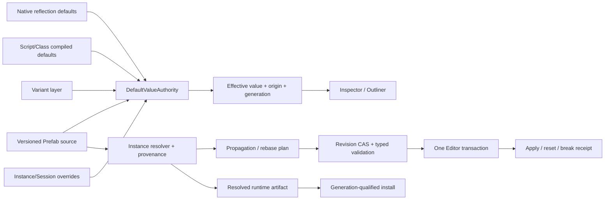

# Editor165 · Archetype / Class Defaults / Instance Override / Property Propagation 当前源码复审

## 1. 结论

Zircon 当前仍没有工程级 class default、Prefab source、instance override、property propagation 或 Reset-to-Default 产品。对当前 Editor、Runtime、Runtime Interface 与 plugins 物理树精确检索，`DefaultValueAuthority`、`EffectivePropertyValue`、`DefaultSourceIdentity`、`PrefabSourceDocument`、`PrefabPropagation`、`PrefabInstanceRecord` 均为 **0 命中**；`ResetToDefault` 的 16 个命中全部属于 dock/workspace layout reset，`ApplyToSource` 与 `RevertToParent` 为 0。现有同名能力仍分散为 reflection field default、Prefab DTO、ECS storage archetype、Material 局部 override projection 和固定 Workbench。

Editor118 之后有三项真实的安全进展。第一，Scene formal codec 与 World project IO 已把 `PrefabInstanceAsset` 保存在保留动态组件 `zircon.prefab.instance` 中，普通 roundtrip、runtime extension 安装后的 roundtrip 均逐字段相等，损坏的保留 JSON 在 save 时 fail closed。第二，`prefab_tools` 已删除 Apply/Revert/Break DTO 写 helper，Editor plugin 不再注册五个 writable operation、对应菜单、factory 或 executor。第三，因为 production 没有 Prefab source/live World 写入 command，旧的无 preflight 写入风险已被封口。旧 P0-01、P0-02、P0-04 因而关闭。

这些安全修正不等于功能实现。`PrefabAsset` 仍只有内嵌 Scene 与字符串 exposed properties；instance override 仍是 `entity_path + property_path + serde_json::Value`，没有 source revision、stable object/component/property identity、typed base value、topology operation、provenance、rebase、conflict 或 orphan。`load_prefab_asset` 只被 generic imported-asset dispatch 调用，生产代码没有 source instantiate、effective resolve、propagation 或 reset consumer。

产品面仍会误导用户。主 Editor 的 233 行 Prefab Workspace 固定显示 `PF_Chest`、`Chest_04`、18 children、6 overrides、2 warnings，并由 callback 直接返回 Apply/Validation queued 文本；这些 route 没有 provider、document、asset revision、job、transaction 或 runtime receipt。`prefab_tools` 又声明 authoring/instancing、注册两个不存在的 ZUI 资源、使用与 Scene preservation 不同的 component type identity，并与 builtin importer 同优先级声明 `.prefab.toml`。因此旧 P0-03、P0-05 继续 Open。

Editor44/118 的 canonical finding 数保持不变。本轮状态为：**P0：2 Open / 3 Closed；P1：59 Open / 11 Partial；P2：12 Open；Gates：28 Fail / 2 Partial / 2 Pass**。没有 source resolver、transactional reset/apply/revert/break、propagation/rebase、resolved cook artifact 或 100k-instance benchmark，不能宣称达到或优于 Unreal、Godot、Fyrox、Bevy 或 Unity Graphics 的对应工程边界，更没有性能证据支持优于 Unreal。

## 2. 审查范围、统计与 currentness

统计读取共享 working tree 的物理内容，包含未跟踪文件。行数按文本物理记录计；tests/ignored 只统计精确 Rust `#[test]`、`#[tokio::test]` 与 `#[ignore]`。fingerprint 保留 repository-relative path 大小写并排序，对每文件 SHA-256 组成无尾换行清单后再次计算 SHA-256。dirty 只表示选择集内文件，不代表整个仓库状态。

| 范围 | 文件 / 行 / 非空行 / bytes / tests / ignored / dirty | fingerprint |
|---|---:|---|
| Editor authoring / Inspector / transaction / fixed Prefab surfaces | **126 / 24,684 / 22,774 / 890,110 / 157 / 8 / 88** | `a929c658e70bf9d57066083f4a05ae0f1727f3cdf08ab0c6c66eb2aec9ea5dae` |
| Runtime asset / persistence / importer | **34 / 6,712 / 6,171 / 236,169 / 21 / 4 / 18** | `19650bb79be90bed695d6a1868a6cbea5f35d3524da5d3f0d75ea3c8fe4918ef` |
| Runtime Scene / reflection / ECS archetype / interface | **82 / 12,779 / 11,716 / 448,609 / 111 / 2 / 25** | `b19fd3fe6e6dc81eaa1e970178cf6d35312e215b2dc22f10d161f2b53dc41972` |
| Prefab plugin product boundary | **17 / 1,244 / 1,137 / 45,973 / 10 / 1 / 5** | `cbac15d7161973a09a06f76200ce3db6d2f9d22c3f3b20bb6feeac292b12a6f6` |
| Zircon selected union | **259 / 45,419 / 41,798 / 1,620,861 / 299 / 15 / 136** | `bde026de0d139f955f87b0776ae7bed3ed9dff4c2291fa84b79fb243ff80efd9` |
| Unreal / Godot / Fyrox / Bevy / Unity Graphics selected | **43 / 29,307 / 25,491 / 1,079,792 / 41 / 0 / 0** | `515b278e59d1921d345eb31896a620e44632e6c84710ae114880eaccd0e761a3` |
| All selected | **302 / 74,726 / 67,289 / 2,700,653 / 340 / 15 / 136** | `d48e40ba8f6bf68e53ab3b8edf2668ebf093a01686853d48db19c398e6ccb2e6` |

- baseline/verification HEAD 冻结为 `7042269b8e282cff936b35adc9b86ac24ad3c1ae`，commit 时间为 2026-08-27T12:10:54+08:00。选择集有 136 个 shared dirty 文件；本报告读取其当前物理内容，没有覆盖或回退这些修改。
- Editor 集合包括 editing transaction、Inspector extension、snapshot、Material projection、Prefab view/command/route/template/navigation/feedback 与聚焦测试。Runtime 集合包括 Prefab/Scene DTO、formal/cache/import/load、World project IO、reflection、ECS archetype 与聚焦测试。
- plugin 集合包括 `prefab_tools` 全部 Rust/TOML/README 和 editor-support registration boundary。参考集合为 frontmatter 的精确 43 文件，Unreal 是产品主基线，其余只承担局部默认值、继承、scene layering 和 editor override 边界。
- 按用户要求未查询、轮询、等待或实时跟踪协调器；Tooling 暂不纳入。本轮只写 review 与索引，没有修改 production、tests、Cargo、ABI 或参考源码。

## 3. 当前源码事实与语义边界

### 3.1 Scene roundtrip 已从数据破坏升级为无损保留

1. `World::from_scene_asset` 把 `PrefabInstanceAsset` 序列化到 reserved dynamic component `zircon.prefab.instance`；`World::to_scene_asset` 通过 `prefab_instance_for_record` 恢复它。
2. formal Scene writer/reader、World roundtrip、安装 runtime extension 后 roundtrip 均比较 prefab reference、local transform 与 raw overrides 的精确相等。
3. 保留 component 存在但 JSON 无法解码时，save 返回 `SceneProjectError`，不再静默写 `prefab_instance: None`。
4. 该实现只保存 metadata。它不加载 source `PrefabAsset`、不生成 source subtree、不解析 effective value、不传播 source change，也不判断 override 是否仍适用于 source revision。

### 3.2 Prefab schema 仍是不可演进的路径 + JSON 差量

1. `PrefabAsset` 只有 URI、name、内嵌 `SceneAsset` 和 `Vec<String>` exposed properties，没有 format/schema version、source revision、dependency digest 或 compiled artifact identity。
2. `PrefabInstanceAsset` 只有 `AssetReference`、local transform 与 override vector；`PrefabPropertyOverrideAsset` 使用两个 String path 和 `serde_json::Value`。
3. source object rename/reparent、component replacement、field rename、collection reorder 或 plugin schema migration 都没有 stable remap key。value 没有 declared type、unit、constraint、base hash 或 expected-before。
4. schema 没有 child/component add/remove/reparent/reorder、reference remap、nested source ancestry、loop、orphan、conflict 或 break materialization 记录。

### 3.3 生产链没有 resolver、instance owner 或 propagation service

1. `load_prefab_asset` 只在 generic `load_imported_asset` 的 `AssetKind::Prefab` 分支中被调用；没有 domain-specific instance consumer。
2. `PrefabPropertyOverrideAsset` 的生产使用仅限 DTO、Scene codec 与 plugin 的去重/诊断 helper；没有写入 World component field 的 resolver。
3. `effective_prefab_overrides` 只按两个字符串 key 做 last-wins 去重；它既不读取 source，也不返回 origin、modified、conflict 或 receipt。
4. 精确符号搜索没有 default authority/provider、Prefab source document、propagation/rebase service 或 instance record owner。

### 3.4 Reflection 是 typed schema 底座，不是 default authority

1. `ReflectFieldInfo` 已有 typed `ReflectedValue` default、numeric range、enum options 和 registry type validation，这是可复用底座。
2. `ReflectObjectAddress` 区分 Component/Resource，但 component address 仍是 raw `u64 entity + String type_path`，field name 仍是 String；它不是可跨 rename/reopen/cook 的 authoring stable property identity。
3. generic `InspectorField` 只有 id、label、type、string value、editable；`InspectorSnapshot` 与 plugin property snapshot 没有 effective/default/origin/local override/mixed/modified/reset target/source revision。
4. Material Editor 单独投影 `default_value`、`override_value`、`is_overridden`。这是一个 domain adapter，不是全引擎 precedence、provenance、reset 或 propagation authority。

### 3.5 Prefab plugin 已封口写操作，但 product contract 仍不完整

1. Editor plugin 不再注册 Create/Open/Apply/Revert/Break operation、菜单、factory 或 executor，测试明确断言这些入口不存在。
2. plugin 仍注册 read-only authoring view 与 Inspector customization，但 `plugins://prefab_tools/editor/authoring.zui` 和 `plugins://prefab_tools/editor/prefab_instance.zui` 对应物理资源均不存在。
3. runtime importer 仍是 `DiagnosticOnlyAssetImporter`，固定报告 `prefab importer backend is not installed`；manifest 却描述为 prefab authoring and instancing，并标记 beta/Partial。
4. builtin `zircon.builtin.toml.prefab` 与 plugin `prefab_tools.prefab` 都以 priority 0 声明 `.prefab.toml`。registry 能拒绝 matcher collision，但当前诊断/产品装配没有形成单一 owner 决策。
5. Scene preservation 使用 `zircon.prefab.instance`，plugin descriptor 使用 `prefab_tools.Component.PrefabInstance`，两种 type identity 没有 adapter、migration 或 ownership 声明。
6. component descriptor 把 `prefab` 标为 serializable，却把 `overrides: json` 标为 non-serializable；它与 formal Scene DTO 的可持久化 override 语义不一致。

### 3.6 主 Editor Prefab Workspace 继续伪造产品状态

1. Workspace 有 233 行、19 个 routes，固定 PF_Chest、Chest_04、18 children、6 overrides、2 warnings 与四个 prefab option。
2. Apply/Validate route 经 preview action whitelist 和 template binding 变成 `.invoke`，callback 直接返回 `Prefab override apply queued` 与 `Prefab validation queued`。
3. navigation spec 继续暴露 tabs、rows、Apply、Validate、field edit/commit；default command 继续公开 `view.prefab.open` 与 `window.prefab_editor.open`，built-in views 创建 Prefab Editor/viewport/inspector。
4. route 链没有 source/document/provider/generation/revision/job/transaction/dirty/save/runtime receipt。queued 文本只证明 callback 命中，不能证明 operation admission 或执行。

### 3.7 ECS archetype 必须留在 storage owner

1. `scene/ecs/archetype` 管理 component signature、table、column、row、locator 和 change tick，目标是存储局部性与 query 执行。
2. 它没有 object archetype、class default object、source parent、override bit、default origin 或 reset policy。
3. 把 ECS archetype 扩展成 authoring inheritance authority 会把运行时 storage generation 与长期 source identity 混合，必须明确禁止。

### 3.8 当前测试证明的是保留与封口，不是功能闭环

1. Scene tests 证明 Prefab metadata roundtrip 与 extension 安装后保留；plugin tests 证明 writable operation/menu 不存在、字符串 override 去重和基础诊断。
2. 没有 source instantiate、clean/overridden propagation、rename/reparent migration、nested topology、apply/revert/reset/break transaction、crash recovery 或 cook/runtime install 测试。
3. 没有 100k instances/source storm、bounded cache、cancellation、memory、cross-platform deterministic 或与参考引擎可比的性能数据。

## 4. 参考引擎差异

| 能力 | Zircon 当前 | 参考源码 | 必须收敛的边界 |
|---|---|---|---|
| Object/class default | reflection field 可选 default，无来源/层级 | Unreal 区分 CDO、object archetype、subobject template 与 authoritative class | 建立独立 default provider/layer identity，禁止借用 ECS archetype |
| Component inheritance | 无 source component record/override ownership | Unreal InheritableComponentHandler 与 ComponentInstanceDataCache 保存 template/instance state | stable source object/component/property identity 与 instance data cache |
| Reset policy | generic Inspector 无 reset/origin | Unreal PropertyEditorArchetypePolicy/SResetToDefault；Godot property revert；Fyrox typed Revert | 可解释的 immediate-parent/explicit-layer policy 与 transaction command |
| Scene/Prefab source | metadata 无损但不 instantiate | Godot PackedScene/SceneState 保存 owner/instance/inheritance；Bevy ScenePatch 先 resolve 后 apply | versioned source、dependency resolution、resolved instance artifact |
| Override evidence | string path + JSON，只有 last-wins | Unreal LevelInstance GUID mapping/diff/policy；Fyrox modified/parent availability | typed address、base/source/instance hash、provenance、conflict/orphan |
| Local parameter override | Material 局部 default/override projection | Unity Graphics VolumeParameter `overrideState` + SerializedObject/Undo | 复用局部 adapter 经验，但不冒充通用 Prefab authority |
| Runtime execution | 无 resolved Prefab artifact | Bevy ResolvedScene 先依赖 resolve、cached scene 先 apply，再施加本层 | cook-time resolve、schema/generation install、frame hot path 零 JSON/path |

## 5. 差距清单

### 5.1 P0：2 Open / 3 Closed

1. **P0-01 · Closed** Scene/World 已无损保留 `prefab_instance`，损坏保留 payload 在 save 时 fail closed。
2. **P0-02 · Closed** `prefab_tools` 在无 backend/factory/executor 时不再暴露可执行 Apply/Revert/Break/Validate operation/menu。
3. **P0-03 · Open** 主 Editor 固定 Prefab Workspace 仍以真实资产外观伪造 Apply/Validate queued 状态。
4. **P0-04 · Closed** 旧 DTO 写 helper 已删除，当前没有绕过 stable identity/revision/preflight/rollback 的 source/live World production 写入路径。
5. **P0-05 · Open** UI、view 与 plugin 描述仍把 DTO、metadata preservation 和固定 projection 表达为 Prefab authoring/instancing 产品。

### 5.2 P1：59 Open / 11 Partial

1. **P1-01 · Open** 定义 Native/Script/Class/Prefab/Variant/Instance/Transient default layer identity。
2. **P1-02 · Partial** 已有 `AssetReference` UUID/locator 和 Scene entity ID；仍缺 source/instance/object/component/property 稳定身份与跨 rename/reopen 规则。
3. **P1-03 · Open** 定义 source revision、schema fingerprint、plugin catalog digest。
4. **P1-04 · Partial** 已有 Component/Resource typed address 与 reflection slot adapter；Prefab 仍用 raw entity/string path，缺 collection selector 与 migration。
5. **P1-05 · Partial** reflection 已有 typed value/range/enum validation；Prefab value 仍是无 declared type 的 JSON，缺 unit/constraint/opaque policy。
6. **P1-06 · Open** 定义 default origin、effective value、local override、modified state API。
7. **P1-07 · Open** 定义 parent/source/instance provenance map。
8. **P1-08 · Open** 定义 owner/generation/request/receipt 传播。
9. **P1-09 · Open** 将 display path 与 authority identity 分离。
10. **P1-10 · Open** 为 legacy string/JSON override 建立只读迁移边界。
11. **P1-11 · Open** 实现 `DefaultValueAuthority` provider registry。
12. **P1-12 · Partial** reflection default 与 typed validation 可作为 native provider 输入；尚无 provider、origin、generation 或 invalidation。
13. **P1-13 · Open** 接入 Script/Class compiled default artifact（Editor152 owner）。
14. **P1-14 · Open** 实现 Prefab/Archetype source default provider。
15. **P1-15 · Open** 实现 Variant layer provider（Editor162 owner）。
16. **P1-16 · Open** 实现 Instance/Session transient provider 与 priority policy。
17. **P1-17 · Open** 建立 effective resolution cache 与 dependency invalidation。
18. **P1-18 · Partial** plugin 能报告 missing source、空 path、重复 path；仍缺 missing field/type/cycle/orphan/conflict 的 stable diagnostic artifact。
19. **P1-19 · Open** 为 provider 定义 thread/read consistency contract。
20. **P1-20 · Open** 为 layer change 输出 generation-qualified snapshot。
21. **P1-21 · Open** 建立 versioned Prefab source asset 与 migration。
22. **P1-22 · Open** 建立 source object/component/property stable records。
23. **P1-23 · Open** 建立 typed topology operations（child/component add/remove/reparent/reorder）。
24. **P1-24 · Open** 建立 source/instance provenance 与 reverse dependency index。
25. **P1-25 · Open** 实现 nested ancestry、loop detection、orphan classification。
26. **P1-26 · Open** 将 string path override 迁移为 typed address + source object ID。
27. **P1-27 · Open** 记录 base/source/instance value hash 与 expected-before。
28. **P1-28 · Open** 实现 source reload、three-way rebase、conflict/orphan/type mismatch。
29. **P1-29 · Partial** generic asset manager 能 load `PrefabAsset`；仍无 domain register/wait/fail/stale/cancel/retry 或 instance activation lifecycle。
30. **P1-30 · Partial** formal Scene、World 与 cache carrier 已无损保留 instance metadata；autosave/archive/cook/migration 及 source validity 仍未闭合。
31. **P1-31 · Open** 实现 property effective/origin/mixed/modified Inspector snapshot。
32. **P1-32 · Open** 实现 immediate-parent 与 explicit-layer Reset policy。
33. **P1-33 · Open** reset 只删除目标 layer override，不影响 sibling property。
34. **P1-34 · Open** 实现 Apply-to-Source 的 revision/CAS preflight。
35. **P1-35 · Open** 实现 Revert-to-Parent 的 live World/Inspector/dirty 更新。
36. **P1-36 · Open** 实现 Create/Apply/Revert/Reset/Break typed commands。
37. **P1-37 · Open** 将 commands 接入 Editor02 transaction/history/savepoint。
38. **P1-38 · Open** 实现 atomic rollback、selection restore、receipt；通用 transaction 底座尚未接 Prefab domain。
39. **P1-39 · Open** 将 Prefab source save 接入 atomic multi-document transaction。
40. **P1-40 · Open** source change 只访问 reverse dependency index 命中的 instances。
41. **P1-41 · Open** clean instance 自动传播 source change并更新 generation。
42. **P1-42 · Open** overridden instance 保留 effective local value 与 provenance。
43. **P1-43 · Open** simultaneous source/instance changes 生成 stable conflict artifact。
44. **P1-44 · Open** loaded/unloaded/partitioned instance 使用相同 rebase policy。
45. **P1-45 · Open** added/removed child/component/reference 有明确 propagation policy。
46. **P1-46 · Open** break 物化完整 subtree、component、reference、ownership。
47. **P1-47 · Open** break 后不再依赖 source asset，且可 undo/reopen。
48. **P1-48 · Open** plugin codec/provider 无法解析时 opaque 保留并阻止编辑。
49. **P1-49 · Partial** writable plugin operation/menu 已禁用；仍有缺失 ZUI、DiagnosticOnly importer、重复 matcher、双 component identity 与描述漂移。
50. **P1-50 · Open** Prefab Workbench 改为 provider-bound document/toolkit。
51. **P1-51 · Open** Outliner/Inspector 显示 origin、modified、orphan、conflict、source revision。
52. **P1-52 · Open** multi-selection 逐 target resolve default，混合值不可误写。
53. **P1-53 · Open** Editor jobs 接入 load/rebase/propagation/cook/cancel/shutdown。
54. **P1-54 · Open** 统一 stable diagnostic code、affected property、related asset、fix action。
55. **P1-55 · Open** cook 产出 resolved runtime default/override artifact 与 provenance。
56. **P1-56 · Open** runtime frame 不解析 JSON/path、不遍历 authoring inheritance chain。
57. **P1-57 · Open** runtime install 校验 artifact schema/plugin/generation。
58. **P1-58 · Open** hot reload/source replacement 保持 effective value 与 instance identity。
59. **P1-59 · Open** default cache 具有 bounded memory、invalidation 和 stale rejection。
60. **P1-60 · Open** 记录 resolution、propagation、rebase、save、cook 性能 telemetry。
61. **P1-61 · Open** 增加 default precedence golden matrix。
62. **P1-62 · Partial** 已有 formal/World/runtime-extension instance metadata roundtrip；仍无 Prefab source/instance migration golden。
63. **P1-63 · Open** 增加 stable rename/reparent/property migration tests。
64. **P1-64 · Open** 增加 reset/apply/revert/break transaction undo/redo tests。
65. **P1-65 · Open** 增加 source propagation/rebase/conflict/orphan matrix。
66. **P1-66 · Open** 增加 nested topology/reference remap/loop tests。
67. **P1-67 · Partial** 已测试 writable factory/action 不存在及 DiagnosticOnly package contract；仍缺 unknown codec/factory failure/unload/opaque preservation tests。
68. **P1-68 · Open** 增加 fault-injected save/rollback/crash recovery tests。
69. **P1-69 · Open** 增加 100k instances/source storm/cancel/memory performance tests。
70. **P1-70 · Partial** 旧危险 DTO 写 helper 已删除；固定 Workbench、字符串 key、缺失资源和双 identity 尚未硬切，端到端资格未完成。

### 5.3 P2：12 Open

1. **P2-01 · Open** class default visualizer、archetype graph 与 source navigation。
2. **P2-02 · Open** parameterized prefab、variant composition 与 inheritance templates。
3. **P2-03 · Open** per-type merge policy/plugin marketplace。
4. **P2-04 · Open** multi-user default/override edit lease 与 review。
5. **P2-05 · Open** remote/unloaded instance live preview 与 lazy propagation。
6. **P2-06 · Open** HLOD/partition-aware resolved default artifact。
7. **P2-07 · Open** script hot-reload schema diff 与 automated migration。
8. **P2-08 · Open** batch reset/apply、commandlet 与 headless validation。
9. **P2-09 · Open** provenance/diff browser 跨 Prefab/Variant/LevelInstance/Snapshot。
10. **P2-10 · Open** content-addressed default cache、dedup 与 remote build。
11. **P2-11 · Open** collaborative conflict auto-resolution、policy simulation 与 audit。
12. **P2-12 · Open** 以同数据完整度、同事务和同 runtime artifact 条件建立超过参考引擎的 propagation benchmark。

## 6. 目标架构与 ownership

Runtime Reflection 只拥有 typed schema、value codec 与 native default input；Asset/Prefab domain 拥有 versioned source、stable source records、dependency index 与 resolver；Editor Default domain 拥有 precedence、origin、reset policy 和 command construction；Editor transaction engine 是唯一 authoring mutation authority；Editor163 提供 semantic diff/conflict artifact；cook 输出已解析 artifact，runtime 不读取 authoring JSON/path。ECS archetype 继续只拥有 component storage layout。

## 7. 依赖顺序与里程碑

| Milestone | 当前 | 退出条件 |
|---|---|---|
| M0 | Partial | Scene roundtrip fail closed；插件写入口已封口；主 Editor 固定 Prefab UI/queued feedback 仍须删除或 capability-disable。 |
| M1 | Not met | stable identity、typed address、schema/migration、layer precedence ADR 冻结。 |
| M2 | Not met | `DefaultValueAuthority`、effective snapshot、origin/modified/reset policy 完成。 |
| M3 | Not met | versioned Prefab source、typed topology/property、provenance、loop validation 完成。 |
| M4 | Partial | formal/World metadata roundtrip 已完成；autosave/archive/cook/migration 未完成。 |
| M5 | Not met | create/apply/revert/reset/break transaction、CAS、rollback、receipt 完成。 |
| M6 | Not met | reverse index、source propagation、rebase/conflict/orphan、loaded/unloaded policy 完成。 |
| M7 | Not met | Inspector/Prefab toolkit、Outliner columns、multi-selection、accessibility 完成。 |
| M8 | Not met | resolved runtime artifact、generation install、hot reload、debug provenance 完成。 |
| M9 | Partial | writable plugin admission 已禁用；provider/codec/factory/resources/identity/compatibility suite 未闭合。 |
| M10 | Not met | 100k instance、source storm、partition、fault、cross-platform deterministic/performance 完成。 |
| M11 | Not met | legacy JSON/path/helper/fixture 硬切，32 门及文档/manifest/CI 闭合。 |

## 8. 32 个验收门

| Gate | 状态 | 当前证据 / 缺口 |
|---|---|---|
| G01 non-None Prefab formal/World roundtrip | Pass | exact prefab reference、transform、overrides 相等。 |
| G02 extension preservation + malformed fail closed | Pass | runtime extension 后保留；损坏 retained JSON 阻止 save。 |
| G03 plugin backend admission truth | Partial | writable operation/menu 不存在；缺失 ZUI、DiagnosticOnly importer 与描述/identity 漂移仍在。 |
| G04 fixed UI truth | Fail | Apply/Validate 继续输出固定 queued 文本。 |
| G05 stable IDs | Fail | 无 source object/component/property identity。 |
| G06 typed codec/schema/migration | Fail | Prefab 仍是 String path + JSON，无 version/migration。 |
| G07 layer precedence golden | Fail | 无统一 layer model/provider。 |
| G08 origin/modified/mixed snapshot | Fail | generic Inspector 无相关字段。 |
| G09 immediate-parent reset | Fail | 无 reset command/policy。 |
| G10 explicit-layer reset | Fail | 无 layer target。 |
| G11 source revision/CAS | Fail | DTO 无 revision，command 不存在。 |
| G12 transaction rollback/receipt | Fail | 通用底座未接 Prefab domain。 |
| G13 stable rename/reparent | Fail | string path 会漂移。 |
| G14 typed topology operation | Fail | 无 add/remove/reparent/reorder override。 |
| G15 provenance/nested loop | Fail | 无 ancestry/provenance/loop owner。 |
| G16 orphan/conflict classification | Fail | 只有 missing/empty/duplicate string diagnostic。 |
| G17 three-way rebase | Fail | 无 base/source/instance evidence。 |
| G18 deterministic change artifact | Fail | 无 propagation plan/receipt。 |
| G19 apply-to-source live behavior | Fail | 无 production operation。 |
| G20 revert/reset live behavior | Fail | 无 production operation。 |
| G21 break/reference remap | Fail | 无 subtree materialization/remap。 |
| G22 undo/dirty/selection | Fail | 无 Prefab transaction integration。 |
| G23 crash recovery | Fail | 无 domain journal/recovery workflow。 |
| G24 persistence across all paths | Partial | formal/World/cache carrier 已保留；autosave/archive/cook/migration 未证实。 |
| G25 opaque plugin codec | Fail | plugin 未知 schema 不能 opaque retain/edit-block。 |
| G26 cook artifact fingerprint | Fail | 无 resolved Prefab artifact。 |
| G27 runtime generation/hot reload | Fail | 无 install receipt/generation fence。 |
| G28 unloaded/partitioned parity | Fail | 无 reverse index或 unloaded policy。 |
| G29 runtime hot path | Fail | 产品未实现，无法证明零 JSON/path 与 bounded work。 |
| G30 telemetry/diagnostics | Fail | 无 resolution/propagation/rebase/cook telemetry。 |
| G31 scale/cross-platform qualification | Fail | 无 100k/source storm/fault/cross-platform evidence。 |
| G32 product E2E/UI/docs/benchmark | Fail | 固定 UI 与 manifest 仍过度表达，端到端和可比 benchmark 为零。 |

## 9. 重构顺序

1. 先完成 M0 产品诚实性：主 Editor Prefab Apply/Validate 与固定成功文本必须删除、disabled 或绑定真实 capability；修复 plugin 缺失资源、重复 importer owner 与双 component identity。
2. 冻结 M1 schema：source/instance/object/component/property stable IDs、typed address/value、source revision、schema/plugin digest、legacy migration 与六层 precedence。
3. 建立只读 authority：provider registry、effective/origin/modified snapshot、provenance、dependency index、load lifecycle 和 deterministic diagnostics。此阶段仍不开放 source mutation。
4. 建立 versioned Prefab source 与 resolver：typed property/topology operation、nested ancestry、loop/orphan/conflict、resolved instance artifact。
5. 只通过 Editor transaction 开放 mutation：typed reset/apply/revert/break、revision CAS、multi-document preflight、rollback、selection/dirty/history 与 typed receipt。
6. 接入 propagation/rebase：reverse index 命中、clean auto-update、override preservation、three-way conflict、loaded/unloaded/partitioned 一致性。
7. 完成 cook/runtime：resolved artifact、schema/plugin/generation install、hot reload、bounded cache，frame hot path不得解析 authoring JSON/path。
8. 最后进行 plugin/UX/fault/scale qualification，并硬切旧字符串 key、固定 Workbench、重复 importer 与所有旁路。

## 10. 本轮验证与限制

本轮只做静态源码、测试 inventory、物理内容 fingerprint 和本地参考源码复核。没有运行 Cargo、Editor、save/reopen、Prefab instantiate、propagation、reset/apply/revert/break、cook/runtime install、fault/scale/soak、跨平台或跨引擎动态 benchmark。选择集存在大量共享 dirty 文件，因此后续实施前必须重新冻结 source revision 与 fingerprint。

Editor162 负责 Variant/Data Layer/Level Instance/Outliner 产品边界，Editor163 负责 semantic snapshot/diff/conflict，Editor152 负责 Script/Class compiled schema，Editor05 负责 generic Inspector，Runtime99i 负责 ECS storage archetype，Runtime99j 负责 World/Scene IO。本报告只拥有统一 default authority、Prefab source/instance override、propagation/reset 产品收敛，不建立竞争 owner。整体工程 review 继续进行中。
