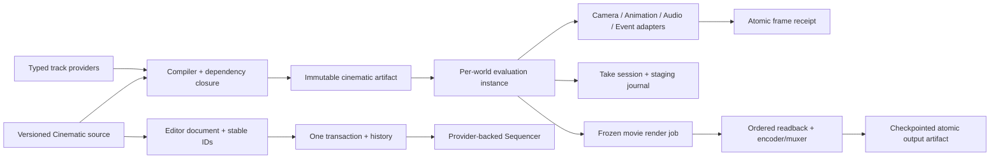

# Editor166 · Cinematic Sequencer / Take Recorder / Movie Render Queue 当前源码复审

## 1. 结论

Zircon 当前仍没有工程级 Cinematic Sequencer、Take Recorder 或 Movie Render Queue 产品链。对当前 tracked 生产源码以及 1,805 个未跟踪生产 Rust/TOML/ZUI 文件分别精确检索，`CinematicSequenceSource`、`CinematicEvaluationInstance`、`MovieRenderQueue`、`MovieRenderJob`、`TakeSession`、`TakeRecorder`、`SequenceHierarchy`、`PreAnimatedState`、`ShotAsset`、`TakeAsset` 均为 **0 命中**；`ResourceKind` 仍只有通用 `AnimationSequence`，没有 Cinematic、Shot、Take 或 Movie Render 资源身份。

产品表面却继续表达不存在的状态。233 行 Sequencer Workspace 固定显示 `SEQ_Intro`、`Camera_A`、Camera Cut、Audio Theme、Event Cues、12 shots、428 keys、24 fps 与具体区间；Preview/Validate route 直接写回 `queued`、`1 gap` 等固定文本。19 条 route 只改变控件状态或命中固定 feedback，没有 document/provider/source revision、operation admission、runtime evaluation、job、receipt 或 artifact。

`timeline_sequence` 插件的局部 key move 已有一项真实安全进展：它先验证 request、索引和完整 sequence，再用二分位置与一次 slice rotation 发布修改；失败零变更、NaN/Inf、equal-time 稳定顺序和 16,384 key ignored 性能门都有测试。因此 P0-03 从 Open 降为 Partial。这个 helper 仍以 `binding_index / track_index / key_index` 寻址，没有 stable key ID、document revision、Editor transaction、dirty/selection/history 或 undo receipt，也没有任何 operation factory/executor 调用它。插件声明的 `plugins://timeline_sequence/editor/authoring.zui` 物理不存在，五个 operation 只有 descriptor，dist 仍是空 command/event manifest、`invoke_command: None` 和零 bridge method。

通用 Animation、Camera 与 Capture 已形成可保留底座，但不能被包装成电影产品。Animation document 有 revision/CAS、transaction、undo/redo、compiler diagnostic 与 last-good；World sequence compiler 会预编译 property writer，避免逐帧解析 property path。与此同时，runtime sequence cache 仍按 asset ID 共享，忽略 sample 的实例 entity，compile 失败直接跳过，apply 结果由 `let _` 丢弃；compiled track 仍依赖 source Vec 的 binding/track index。Camera 没有 authoritative cut/director/history epoch；Capture 有 RGBA8、RGBA16F、generation、typed report、有界 RHI readback 和单帧 PNG staging/flush/sync/atomic replace，但没有 shot/frame/sample/tile/pass、stride、color、PTS、ordered writer、encoder/muxer、checkpoint 或 whole-run artifact。

Editor45/119 的 canonical finding 数保持不变。本轮状态为：**P0：4 Open / 1 Partial；P1：51 Open / 19 Partial；P2：12 Open；Gates：27 Fail / 5 Partial / 0 Pass**。当前没有同一 sequence、相同画质、相同镜头、相同采样策略、相同输出完整性条件下的动态结果或 benchmark，不能声称功能、性能或表现达到或优于 Unreal。

## 2. 审查范围、统计与 currentness

统计读取共享 working tree 的当前物理内容并包含未跟踪文件。行数按文本物理记录计；tests/ignored 统计 Rust `#[test]` / `#[tokio::test]` 与 `#[ignore...]`。fingerprint 保留 repository-relative path 大小写并排序，对每文件计算 SHA-256，以 `path|hash` 和 LF 拼接无尾换行 manifest 后再次计算 SHA-256。dirty 只表示选择集内文件。

| 范围 | 文件 / 行 / 非空行 / bytes / tests / ignored / dirty | fingerprint |
|---|---:|---|
| Editor document / timeline / curve / preview / fixed Sequencer surface | **82 / 11,614 / 10,861 / 443,239 / 44 / 4 / 66** | `4babbf883bf88b6ae840ee0d8e05b4bce769f13a630983c6053b7970c391f494` |
| Runtime Animation / compiler / evaluator | **231 / 30,404 / 27,815 / 1,050,617 / 208 / 7 / 94** | `334563937870beec46ce7f6c6a41d12e8a540f2b370d543b4786c778e38e3989` |
| Timeline plugin product boundary | **10 / 1,142 / 1,042 / 42,168 / 15 / 1 / 3** | `1a7b3fba4f2a86407bc7fb1fc3b4a4ad0124e01d0a1ad4076fa4b3928f486970` |
| Camera / Capture / RHI readback / PNG output substrate | **45 / 8,337 / 7,541 / 294,188 / 89 / 1 / 24** | `7ae25ef3299e174ded1f25e1292a9593c6aee7e02f8f165cb92289ffc286d680` |
| Zircon selected union | **368 / 51,497 / 47,259 / 1,830,212 / 356 / 13 / 187** | `669bd5ec6762e6c00e293437cbbef63fd09ecb1935e236a8ead2997cee626208` |
| Unreal / Godot / Fyrox / Bevy / Unity Graphics selected | **29 / 22,524 / 19,218 / 846,294 / 10 / 0 / 0** | `e04a3e8d3905ed1972a83c6120d6dbc5d0201d474ff72df04b1cd8987cb90724` |
| All selected | **397 / 74,021 / 66,477 / 2,676,506 / 366 / 13 / 187** | `95d957d0972ac4f158975d16361abdd42313e9b2b0fa7241910ade5790fb835c` |

- 审查开始时 HEAD 为 `982baa1ba87bc8c25fe44312507a4af15027e058`；冻结语料时共享 HEAD 已前移到 `7fea65a3ae9cb836ad85adfdcece01ae7a6b7df1`，commit 时间为 2026-08-27T13:12:45+08:00。选择集有 187 个 shared dirty 文件，本报告读取其物理内容，不回退、不覆盖、不暂存。
- tracked 与 1,805 个未跟踪生产 Rust/TOML/ZUI 的核心电影类型检索分开执行，避免把 docs/tests/reference 命中误认成产品 owner。
- 五引擎参考集使用 Editor119 frontmatter 的精确 29 文件。Unreal 是完整电影产品主基线；Godot、Fyrox、Bevy 和 Unity Graphics只承担 typed track、stable identity、command、event、writer/capture/AOV 等局部合同参考。
- 按用户要求未查询、轮询、等待或实时跟踪协调器；Tooling 暂不纳入。本轮只写 review 和索引，没有修改 production、tests、Cargo、ABI 或参考源码。

## 3. 当前源码事实与断路

### 3.1 独立电影 source、identity 与 time domain 为零

1. `AnimationSequenceAsset` 只有 duration、浮点 fps、binding、property track；binding 使用 `EntityPath` 与可选 `String target_id`，track/key/section/shot 没有持久 stable ID。
2. 时间以 `f32 seconds` 和 `frame / fps` 转换，Timeline UI 也使用 `f32`；没有 rational tick resolution、display rate、subframe、SMPTE/drop-frame timecode 或 qualified clock。
3. binary envelope 和 V1 fallback 属于通用 Animation schema。没有 Cinematic kind/version、source revision、dependency/provider fingerprint、unknown section opaque preservation、migration registry 或 canonical content digest。
4. `ResourceKind` 没有 CinematicSequence、Shot、Take、MovieRenderQueue/Preset/Artifact，因此 catalog、reference analysis、cook、toolkit 与 runtime install 没有可依附的电影身份。

### 3.2 Sequencer Workbench 是固定展示，不是 document projection

1. Workspace 有 233 行、27 个 node、19 条 route、0 provider/controller/data source；sequence、track、range、状态和计数全部写在 ZUI。
2. route 经过 preview-action whitelist、template binding 和 navigation spec 后，只更新 control-local selection/value 或进入固定 feedback。
3. `open` 返回 `Native extension workspace opened for SEQ_Intro`，`preview` 返回 `Preview queued SEQ_Intro 24 fps`，`validate` 返回 `Validation queued 12 shots 1 gap`；没有 operation request、admission、job ID、progress、terminal status 或 artifact locator。
4. Workbench namespace 为 `workbench.extension.sequencer.*`，插件 namespace 为 `timeline_sequence.*`，两者没有 document/session/operation bridge。

### 3.3 Timeline 插件只完成 descriptor 与局部 helper

1. 插件注册 Open/Create Track/Delete Track/Move Key/Validate 五个 command/menu descriptor，以及 transform、component property、event marker 三类 track descriptor。
2. toolkit 绑定 `ResourceKind::AnimationSequence`，模板指向不存在的 `plugins://timeline_sequence/editor/authoring.zui`；包内没有 operation factory/executor。
3. native dist 已有 editor entry 与 registration manifest，但 command/event manifest 为空，`invoke_command` 为 `None`，bridge method 数为 0。
4. `TimelineEventMarker` 是插件私有内存 struct，未进入 `AnimationSequenceAsset`、codec、compiler 或 runtime evaluator；依赖的 `runtime.feature.animation.timeline_event_track` 实际对应通用 Clip event 能力。
5. marker validator 没有显式拒绝非有限 marker time 或非法 duration，NaN 会绕过 `< 0` / `> duration` 比较；payload 也只是 `BTreeMap<String, String>`。
6. key move 现在失败零变更且 equal-time 稳定，这是应保留的局部 kernel；但三层 collection index、完整 sequence 每次全量验证和区间 Vec rotation 不能成为产品 identity、transaction 或 100k-key 性能结论。

### 3.4 通用 Animation 编译链真实存在，但实例与回执不完整

1. framework Sequence compiler 有稳定 `ZR-ANIM-COMP-SEQUENCE-*` diagnostic，校验 duration/fps/target/track/key/value/interpolation 并生成 immutable IR。
2. World compiler 把 entity/property binding 编译为 `CompiledScenePropertyWriter`，apply hot path 不再解析文本 property path，并以 World/schema generation 判断 currentness。
3. compiled track 仍保存 `binding_index / track_index` 并在 apply 时回读 source asset；artifact 不是自包含 dense storage，也没有 dependency graph、source map 或 evaluation field。
4. Animation runtime cache 以 asset ID + optional asset revision + World currentness 为 key；`LoadedSequenceSample.entity` 不参与 binding/root context，同 asset 多实例无法有不同 override、spawn/restore state。
5. compile 失败会删除 cache 后 `continue`，apply 使用 `let _ = apply_compiled_sequence_to_world(...)` 丢弃错误和 applied/missing stats；没有 frame request/receipt、domain atomic commit 或 terminal disposition。
6. 没有 subsequence hierarchy、root/local time transform、section interval、evaluation phase、pre-animated store、completion mode、Play/Jump/Scrub/Reverse/Loop event traversal。

### 3.5 Editor Animation document 是底座，不是 Cinematic document

1. `AnimationAuthoringDocumentStore` 以 `DocumentId + AssetUri + kind + monotonic revision` 持有 source，CAS swap command 接入 document history并支持 undo/redo。
2. Sequence mutation支持 create/remove/rebind track 和 add/remove key，先克隆完整 asset，再通过 transaction 发布；这提供失败零变更和 revision conflict 底座。
3. mutation仍以 `AnimationTrackPath + frame` 查找，key 身份由 time 推导；Timeline projection甚至用 `track_path@time_bits` 生成 UI key ID，重定时后 identity 改变。
4. shared Timeline/Curve model有 selection、key/section view、ruler/range 与 inverse-delta接口，但生产 Sequencer Workspace没有消费它；没有 virtualized cinematic rows、section/shot commands、multi-select drag/snap/ripple/overlap或 domain coalescing。
5. `PreviewSceneBackend` 只有 fake test实现，生产没有把 document compiler artifact送入隔离 preview world；Editor/PIE/runtime parity 为零。

### 3.6 Camera、Audio、Capture 与输出只形成分离底座

1. Camera stack、Scene endpoint、render descriptor和 temporal history是真实基础，但没有 `CameraDirector`、`CameraViewResult`、typed Cut request/receipt 或 cut history epoch。velocity threshold 猜测 cut 不能替代 authored camera cut。
2. Sound automation和通用 animation event是各自 domain 能力，没有 Cinematic section adapter、qualified clock、offset/fade/seek/reverse policy或统一 frame receipt。
3. `CapturedFrame` 明确为 RGBA8，`CapturedHdrFrame` 保留线性 RGBA16F，二者带 generation 和 capture report；V2 dynamic frame只传 width/height/generation/RGBA。
4. shared RHI readback具有 3-slot ring、预算、cancel、abort-frame、panic containment和 shutdown terminalization；这是 bounded transport，不是 ordered movie packet/writer。
5. App PNG writer使用同目录 staging、flush、file sync和 atomic replace，失败清理 partial file；它只能证明单帧 durable publish，不能证明多帧/多 pass/audio artifact 的整体原子性。
6. 没有 encoder、muxer、media clock、AOV selection、output token policy、frame naming collision policy、checkpoint/resume、headless worker 或 render queue UX。

### 3.7 Take Recorder 与 Movie Render Queue 没有隐藏实现

1. 没有 TakeSource registry、TakeSession、录制状态机、slate/take/timecode metadata、bounded source buffer、journal、staging/finalize、TakeAsset 或 sequence write-back transaction。
2. 没有 Queue/Job/Shot/Preset/Config/Run identity，没有 submit freeze、deterministic shot/frame/sample/tile/pass expansion 或 fixed-step movie clock。
3. 没有 warmup、pre/post-roll、temporal/spatial sample、shutter、tile overlap、cut reset、AOV/color/output format计划。
4. 没有 worker cancel/retry/resume、manifest/checkpoint/checksum、whole-run atomic publication或 Editor/headless parity。

### 3.8 当前测试证明的是基础行为，不是电影资格

1. timeline tests 证明 descriptor注册、依赖 gate、validation、key move失败零变更/equal-time稳定和ignored局部性能门。
2. animation tests 证明 document revision/CAS、compiler validation、compiled writer、cache currentness与部分 runtime apply。
3. capture/RHI tests 证明 format carrier、generation、bounded admission、cancel/abort/shutdown终态和单帧PNG原子替换。
4. 没有 Cinematic source roundtrip、stable ID migration、hierarchy/binding/spawn/restore、event/cut/audio parity、Take failure matrix、queue expansion、fixed-step sampling、AOV/color、worker resume或artifact completeness测试。

## 4. 参考引擎差异

| 能力 | Zircon 当前 | 参考源码 | 必须收敛的边界 |
|---|---|---|---|
| Sequence identity | path、String target、Vec index | Unreal binding GUID；Fyrox track UUID；Bevy `AnimationTargetId` | sequence/binding/track/section/shot/channel/key stable ID，display path只作显示 |
| Time | `f32 seconds`、浮点 fps | Unreal `FFrameRate/FFrameTime`、tick resolution/display rate与qualified time | rational frame/subframe、checked conversion、range/timecode/domain identity |
| Section/hierarchy | 无 cinematic section/subsequence | Unreal first-class section range、pre/post-roll、completion与多层 time transform | 编译 hierarchy、bias/trim/warp、interval evaluation field |
| Binding/lifecycle | EntityPath + optional String target | Unreal possessable/spawnable、binding override与player context | qualified resolver、spawn register、orphan diagnostic、per-instance override |
| Playback correctness | 普通 sequence sample/apply | Unreal Play/Jump/Scrub/Reverse/Loop、restore state | explicit request mode、previous/current range、pre-animated store、atomic frame receipt |
| Editor transaction | generic Animation CAS；插件 helper无 transaction | Unreal Sequencer transaction；Fyrox command/undo | stable domain command、one transaction、coalescing、dirty/selection/history rollback |
| Track/event model | property curve；插件 marker不持久化 | Godot typed track/method/audio；Bevy event；Fyrox signal | provider codec/compiler/evaluator/editor合同和确定 interval dispatch |
| Take | 无 | Unreal Take source、subsystem state、slate/take/timecode metadata | source registry、幂等session、bounded buffer、journal、atomic Take publish |
| Render queue | 无 | Unreal Queue/Job/Shot与AA/high-res/output settings | frozen job、deterministic expansion、fixed-step clock、worker/checkpoint/artifact |
| Movie output | 单帧 RGBA/PNG | Godot MovieWriter audio/video frame contract；Unity camera capture/AOV request | typed packet、ordered backpressure、AOV/color、encoder/muxer、whole-run publication |

Unreal 的对象和 UI 规模不是直接复制目标，但其 source/instance/time/section/binding/evaluation/take/job/artifact 分层是最低工程合同。Godot、Fyrox、Bevy和Unity Graphics证明局部实现可以更小，却仍必须有 typed identity、明确 command/event/writer 边界。Zircon要超越参考引擎，应在相同完整性下证明更低 steady-state allocation、更稳定并行评估、更强故障恢复和可复现输出，而不是以缺少功能获得更小开销。

## 5. Currentness 状态清单

### 5.1 P0：4 Open / 1 Partial

1. **P0-01 · Open** 移除或 fixture 化固定 `SEQ_Intro / 12 shots / 428 keys / queued` 产品表面；真实 provider 不存在时必须显示 unavailable。
2. **P0-02 · Open** Timeline plugin 缺资源、factory、compiler、evaluator或bridge时不得 admission 五个 operation 和 event marker track。
3. **P0-03 · Partial** key move 已做到 preflight 与失败零变更；仍须 stable key ID、document revision、one Editor transaction、dirty/selection/history与undo receipt 后才可被产品调用。
4. **P0-04 · Open** event marker 在进入 versioned source、compiler interval与runtime traversal前不得声明可用，并须补 finite duration/time 验证。
5. **P0-05 · Open** 独立 cinematic source/evaluation instance/take session/render queue/job/artifact为零时，不得把普通 AnimationSequence 或单帧capture包装为电影产品。

### 5.2 P1：51 Open / 19 Partial / 0 Closed

1. **P1-01 · Open** 建立 versioned `CinematicSequenceSource`、source ID、revision 与 catalog fingerprint。
2. **P1-02 · Open** 为 sequence/binding/track/section/shot/folder/marker/channel/key分配持久 stable ID。
3. **P1-03 · Open** 分离 tick resolution、display rate与timecode，使用有理数frame/subframe。
4. **P1-04 · Partial** Animation binary已有kind/V1 fallback和稳定compiler diagnostic；仍缺Cinematic schema、连续migration、unknown section与plugin capability policy。
5. **P1-05 · Open** 定义 source/world/instance/player qualified identity。
6. **P1-06 · Partial** `ComponentPropertyPath`、`EntityPath`和optional target可作typed输入；仍缺stable binding target、field ID、schema fingerprint与migration。
7. **P1-07 · Open** 定义 root/local/global qualified time、range与pre/post-roll。
8. **P1-08 · Open** 定义 owner/generation/request/job/receipt的完整传播和terminal disposition。
9. **P1-09 · Open** display path、EntityPath和collection index不得成为authority key。
10. **P1-10 · Partial** Animation binary、compiler排序和equal-time helper有确定性基础；仍缺Cinematic canonical order、content digest与跨平台浮点规范。
11. **P1-11 · Open** 实现 possessable/spawnable binding source与qualified resolver。
12. **P1-12 · Open** 实现 nested sequence/subsequence hierarchy、time transform、bias与trim。
13. **P1-13 · Open** 实现 spawn register、lifetime、orphan和missing binding diagnostic。
14. **P1-14 · Open** 建立 binding override、instance context与PIE/world duplication policy。
15. **P1-15 · Open** 建立 track/section/shot/folder registry与typed factory。
16. **P1-16 · Open** 定义 section range、row、overlap、priority、completion与blend policy。
17. **P1-17 · Open** 实现 transform/animation/property/camera/audio/event typed adapters。
18. **P1-18 · Open** 让plugin track provider同时拥有codec/compiler/evaluator/editor/migration合同；缺项只读且不可执行。
19. **P1-19 · Partial** 通用Sequence已有source compiler、World compiler、validation和cache；仍缺Cinematic dependency graph、单一artifact、provider/root-context key和LKG/CAS install。
20. **P1-20 · Partial** compiled property writer已消除frame-time文本解析；仍缺自包含dense channel storage和interval evaluation field，当前还回读source Vec index。
21. **P1-21 · Open** 实现固定evaluation phase、pre/post hooks与deterministic order。
22. **P1-22 · Open** 建立 `CinematicEvaluationInstance` root context与scoped state。
23. **P1-23 · Open** 实现pre-animated state capture/restore及abort/error/sequence switch policy。
24. **P1-24 · Open** 定义Play/Jump/Scrub/Reverse/Loop event traversal语义。
25. **P1-25 · Open** 将Camera Cut接入Editor30 authoritative endpoint/director/history epoch合同。
26. **P1-26 · Partial** 通用Animation document、Timeline和Curve foundation可复用；Sequencer尚未消费typed曲线、stable key或preview artifact。
27. **P1-27 · Open** 接入Editor36 qualified media/audio timestamp、clock、encoder与muxer合同；当前对应产品仍未建立。
28. **P1-28 · Open** 建立Editor/PIE/runtime同artifact、同time、同binding的preview parity。
29. **P1-29 · Partial** 通用Animation document已有revision/CAS/history/save基础；仍无Cinematic document、dirty/autosave/recovery和external-change政策。
30. **P1-30 · Partial** 通用Animation支持transactional create/remove/rebind track与add/remove key；仍缺stable-ID move/trim/slip/split key/section/shot one-transaction commands。
31. **P1-31 · Open** 将key identity从collection index或`path@time_bits`迁移到stable ID。
32. **P1-32 · Partial** helper失败零变更、document CAS与rollback基础存在；仍需覆盖source/dirty/history/selection/save/compile的完整Cinematic失败不变合同。
33. **P1-33 · Open** 建立Timeline virtualized rows、ruler、zoom、curve和selection product projection。
34. **P1-34 · Open** 实现multi-select、drag、snap、ripple、overlap与keyboard commands。
35. **P1-35 · Open** 建立source revision/external-change conflict与rebase policy。
36. **P1-36 · Open** 所有UI feedback必须来自provider/job/receipt，删除固定回写。
37. **P1-37 · Open** 实现TakeSource registry、typed source capability与arm/prepare lifecycle。
38. **P1-38 · Open** 建立TakeSession clock、frame counter、timecode、metadata、slate与take number。
39. **P1-39 · Open** 为每个take source提供bounded buffer、backpressure与drop/error receipt。
40. **P1-40 · Open** 实现start/tick/stop/finalize/cancel/recover幂等状态机。
41. **P1-41 · Open** 录制结果先写journal/staging，完整校验后atomic publish TakeAsset。
42. **P1-42 · Open** source failure、disk full、device loss、cancel或finalize crash不得发布半Take。
43. **P1-43 · Open** 将录制section以stable binding/key/channel写回sequence transaction。
44. **P1-44 · Open** 建立`MovieRenderQueue`、Job、Shot、Preset、Config与Output Artifact类型。
45. **P1-45 · Open** Queue submit冻结source/map/content/plugin/engine/config fingerprints。
46. **P1-46 · Open** Queue确定性展开shot/frame/sample/tile/pass plan和checkpoint。
47. **P1-47 · Open** 建立fixed-step movie clock、warmup、pre/post-roll与cut history reset。
48. **P1-48 · Open** 实现temporal/spatial sample、shutter、AA、tile和high-resolution policy。
49. **P1-49 · Open** 建立camera/audio/event/AOV pass选择与metadata schema。
50. **P1-50 · Partial** capture已有RGBA8/RGBA16F、尺寸、generation和typed report；仍缺format/stride/color/premultiply/PTS/timecode及shot/frame/sample/tile/pass身份。
51. **P1-51 · Partial** shared RHI readback已有3-slot ring、byte/count预算、cancel/abort/shutdown终态；仍缺ordered movie packet、writer backpressure与exactly-once receipt。
52. **P1-52 · Open** 接入Editor36 encoder/muxer，不在Cinematic域复制codec。
53. **P1-53 · Partial** capture载体表达resolution、RGBA8/HDR与alpha基础；仍缺typed naming、color transform、depth/normal/motion/ID、collision和output policy。
54. **P1-54 · Open** worker支持cancel/retry/resume，并按shot/frame/sample/tile/pass checkpoint恢复。
55. **P1-55 · Partial** 单帧PNG已有staging、flush/sync与atomic replace；仍缺全部frame/pass/audio验证后的whole-run atomic artifact。
56. **P1-56 · Open** headless与Editor worker共享compiler、clock、binding和sample schedule。
57. **P1-57 · Open** 接入Editor09 job admission、quota、priority、progress、cancel和shutdown drain；当前没有Cinematic caller。
58. **P1-58 · Partial** Animation compiler、Camera stack和Capture report是真实底座；仍缺Editor22/30/36的typed cross-owner orchestration与统一receipt。
59. **P1-59 · Partial** Animation compiler与RHI readback已有stable diagnostic/terminal基础；仍缺source/shot/frame/sample/tile/pass/item定位和Cinematic error artifact。
60. **P1-60 · Partial** frame profile、capture/readback统计与apply stats可复用；后者仍被丢弃，且无compile/evaluate/preview/take/render budget telemetry。
61. **P1-61 · Open** 增加source/schema/ID/time precision/migration golden tests。
62. **P1-62 · Open** 增加binding/spawn/hierarchy/evaluation/pre-animated restore tests。
63. **P1-63 · Partial** helper和通用document已有failure-zero-mutation/CAS测试；仍缺stable key/section/shot transaction、undo/redo和selection/dirty不变矩阵。
64. **P1-64 · Open** 增加event traversal、camera cut、audio sync和preview parity tests。
65. **P1-65 · Open** 增加Take state、buffer overflow、device/disk/finalize crash tests。
66. **P1-66 · Open** 增加queue expansion、fixed-step、sampling、AOV/color golden tests。
67. **P1-67 · Open** 增加worker cancel/retry/resume、artifact completeness/atomic tests。
68. **P1-68 · Open** 增加plugin unknown provider、codec mismatch、unload与schema migration tests。
69. **P1-69 · Partial** timeline有ignored 16,384-key局部move性能门；仍无1k track/100k key、long take、large queue、多shot或steady-state allocation资格。
70. **P1-70 · Partial** mutation-before-validation旧机制已封口；固定feedback、index identity、ambiguous Animation API、缺失资源和潜在第二writer authority仍未硬切。

### 5.3 P2：12 Open

1. **P2-01 · Open** Virtual Production、Live Link与硬件timecode同步。
2. **P2-02 · Open** procedural shot、batch variant、EDL/OTIO/AAF式交换。
3. **P2-03 · Open** distributed render farm、remote worker与cloud queue。
4. **P2-04 · Open** collaborative Sequencer edit lock、annotation与review。
5. **P2-05 · Open** ML辅助镜头、剪辑、key reduction与质量检测。
6. **P2-06 · Open** viewport stream、remote take与multi-camera control。
7. **P2-07 · Open** HDR mastering、OCIO、deep output与高级AOV。
8. **P2-08 · Open** dependency graph、partial rerender与frame cache复用。
9. **P2-09 · Open** audio post、ADR、subtitle与DAW交换。
10. **P2-10 · Open** deterministic replay、evaluation debugger与archive inspection。
11. **P2-11 · Open** headless CI、long-run soak与fault campaign。
12. **P2-12 · Open** 在同功能、同质量、同故障完整性条件下建立超过参考引擎的可复现benchmark。

## 6. 目标架构与 ownership

Runtime150唯一拥有cinematic codec/compiler/artifact、binding/hierarchy、evaluation instance、playback authority、runtime adapters、Take capture执行、Movie Render执行、network/save/replay。Editor166只拥有Cinematic authoring document、stable-ID transaction、Sequencer projection、Take/MRQ orchestration与产品UX。Editor14/136拥有通用Animation与Curve；Editor30/151拥有Camera Director/Cut；Editor36/157拥有media clock/encoder/muxer；Editor22与RHI拥有capture/readback。任何实施都不得复制第二套owner。

## 7. 依赖顺序与里程碑

| Milestone | 当前 | 退出条件 |
|---|---|---|
| M0 | Partial | key move失败零变更已完成；固定Sequencer、queued feedback、缺失plugin resource和无factory operation必须fail-close。 |
| M1 | Not met | Cinematic source、stable IDs、rational time、schema/migration、canonical digest与artifact identity冻结。 |
| M2 | Not met | binding/possessable/spawnable、qualified resolver、override、hierarchy/time transform与orphan diagnostic完成。 |
| M3 | Not met | typed track/section/shot/event/camera/audio provider registry和缺能力只读策略完成。 |
| M4 | Partial | 通用Animation compiler/writer可复用；Cinematic compiler/evaluation field/instance/pre-animated/event/cut parity未完成。 |
| M5 | Partial | 通用Animation document transaction可复用；provider-backed Sequencer、stable command、save/recovery、virtualized UI未完成。 |
| M6 | Partial | Camera/Animation/Capture底座存在；Camera Cut、Media clock和Editor/runtime preview cross-contract未完成。 |
| M7 | Not met | Take Source/Session/timecode/buffer/journal/staging/finalize/recovery/atomic publish完成。 |
| M8 | Not met | Queue/Job/Shot/Preset、submit freeze、fixed-step、sampling/output policy与headless worker完成。 |
| M9 | Partial | bounded readback和单帧atomic PNG存在；ordered packet、AOV/color、encoder/muxer、checkpoint与whole-run artifact未完成。 |
| M10 | Not met | cook、plugin unload/migration、fault、long take/large queue、cross-platform determinism与性能完成。 |
| M11 | Not met | 删除legacy static/index authority，32门、默认装配、docs/manifest/CI和可比benchmark闭合。 |

## 8. 32 个验收门

| Gate | 状态 | 当前证据 / 缺口 |
|---|---|---|
| G01 provider-backed product UI | Fail | Sequencer仍由固定ZUI和feedback提供业务事实。 |
| G02 plugin capability/admission truth | Fail | 资源缺失、无factory/executor/bridge时仍注册operation和track。 |
| G03 stable sequence element IDs | Fail | path、time和Vec index仍是identity。 |
| G04 rational time/timecode | Fail | 仍是`f32 seconds/fps`。 |
| G05 schema/migration/unknown data | Partial | Animation kind/V1 fallback存在；Cinematic schema与unknown section policy不存在。 |
| G06 canonical source/content digest | Fail | 无Cinematic source或digest。 |
| G07 qualified binding resolver | Partial | EntityPath/target_id与compiled writer存在；无qualified context/possessable/spawnable。 |
| G08 spawnable lifecycle | Fail | 无spawn register或teardown receipt。 |
| G09 subsequence hierarchy/time transform | Fail | 无Cinematic hierarchy。 |
| G10 section range/overlap/completion | Fail | shared UI section view不对应可执行source。 |
| G11 typed track compiler | Partial | property Sequence compiler存在；无Cinematic provider registry/evaluation field。 |
| G12 deterministic artifact/orphan diagnostic | Fail | 无Cinematic artifact和source-located orphan report。 |
| G13 Play/Jump/Scrub/Reverse/Loop event traversal | Fail | 无请求模式和interval event evaluator。 |
| G14 pre-animated capture/restore | Fail | 无restore owner。 |
| G15 authoritative Camera Cut | Fail | 无Director/Cut/history epoch。 |
| G16 qualified audio sync | Fail | Sound底座未接Cinematic clock/receipt。 |
| G17 transaction/failure-zero-mutation | Partial | helper与通用document局部通过；stable Cinematic command/history/selection/dirty未闭合。 |
| G18 Editor/PIE/runtime preview parity | Fail | production PreviewSceneBackend和Cinematic instance均不存在。 |
| G19 Take lifecycle | Fail | 无TakeSession状态机。 |
| G20 Take timecode/metadata | Fail | 无typed clock、slate或take metadata。 |
| G21 Take bounded buffer/backpressure | Fail | RHI readback不能替代多source录制buffer。 |
| G22 Take failure recovery | Fail | 无journal/checkpoint/recovery。 |
| G23 Take staging/finalize | Fail | 无staging Take artifact。 |
| G24 atomic Take publication/write-back | Fail | 无TakeAsset和cross-document transaction。 |
| G25 queue submit freeze | Fail | 无Queue/Job/Run identity或fingerprint。 |
| G26 deterministic expansion/fixed-step | Fail | 无shot/frame/sample/pass plan或movie clock。 |
| G27 sampling/AOV/color | Fail | 无temporal/spatial/tile/shutter/AOV policy。 |
| G28 bounded readback | Partial | shared RHI有预算与终态；无ordered movie packet和writer backpressure。 |
| G29 encoder/muxer | Fail | 产品实现为零。 |
| G30 checkpoint/resume/atomic movie artifact | Fail | 单帧PNG原子替换不满足whole-run合同。 |
| G31 scale/cross-platform benchmark | Fail | 只有ignored 16k key helper门，无产品规模资格。 |
| G32 E2E/cook/headless/docs/manifest/telemetry | Fail | 产品不存在且UI/manifest继续过度表达。 |

Gate复算：Partial为G05、G07、G11、G17、G28，共5项；其余27项Fail，0项Pass。

## 9. 重构顺序

1. 先完成M0产品诚实性：固定Sequencer数据/queued反馈删除、fixture标识或capability-disable；插件资源/factory/codec/compiler/evaluator不闭合时不admit operation/track。
2. 冻结M1 source合同：Cinematic资源kind、stable IDs、rational time/range/timecode、schema/migration、plugin opaque data、canonical digest与dependency fingerprint。
3. 建立Runtime150的只读compile/evaluate主链：qualified binding、possessable/spawnable、hierarchy、typed track provider、self-contained artifact、evaluation field、per-instance state与atomic frame receipt。
4. 只在上述artifact可运行后建立Editor document：stable-ID commands、revision CAS、one transaction、undo/redo、dirty/save/autosave/recovery、virtualized Sequencer和production preview parity。
5. 接入Camera/Animation/Audio/Event adapters，并以同一frame request/receipt验证Play/Jump/Scrub/Reverse/Loop、cut epoch、restore和错误原子性。
6. 建立Take Recorder：typed source、幂等session、authoritative timecode、bounded buffers、journal/staging/finalize/recovery、atomic Take publish和sequence write-back transaction。
7. 建立Movie Render Queue：frozen job、deterministic expansion、fixed-step clock、sampling/AOV/color/output、ordered readback、encoder/muxer、checkpoint/resume和whole-run artifact。
8. 最后进行plugin unload/migration、fault、long-run、1k-track/100k-key/large-queue、cross-platform deterministic和同语义跨引擎benchmark，再硬切所有legacy static/index/second-writer入口。

## 10. 本轮验证与限制

本轮只做静态源码、测试inventory、当前物理内容fingerprint和本地参考源码复核。没有运行Cargo、Editor、PIE、Sequencer、Take、GPU movie readback、encoder/muxer、cook/headless worker、fault/scale/soak、跨平台或跨引擎动态benchmark。shared working tree在审查期间持续变化，因此实施前必须重新冻结HEAD和选择集fingerprint，并重跑P0/P1/Gate currentness。

Editor45继续拥有canonical 5/70/12 finding；本报告只刷新状态，不重复增加总账。Runtime150拥有运行时电影执行；Editor14/136、Editor30/151、Editor36/157、Editor22和RHI边界必须保持。整体工程review继续进行中。
