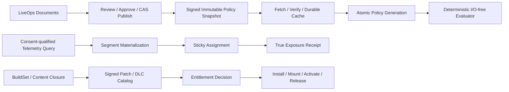

# Editor167 - LiveOps、Feature Flag、Remote Config、Segment、Experiment、Patch、DLC 与 Crash Control Plane 当前源码复审

## 1. 最终结论

Editor46的结论仍成立：Zircon当前没有工程级LiveOps控制面，也没有可运行的Feature Flag、Remote Config、Player Segment、Experiment、Patch Planner、DLC Catalog或Crash Symbolication Editor产品。对当前磁盘中的`zircon_editor`、`zircon_runtime`、`zircon_runtime_interface`、`zircon_plugins`和`zircon_app`生产Rust/TOML/ZUI语料精确扫描后，八个产品页ID及`FeatureFlagDefinition`、`RemoteConfigDefinition`、`PolicySnapshot`、`LiveOpsProvider`、`LiveOpsProjectId`、`ExperimentDefinition`、`AssignmentReceipt`、`ExposureReceipt`、`InstallBundle`、`EntitlementDecision`、`CrashArtifactId`、`SegmentDefinition`等核心类型均为0命中。13个builtin page中没有LiveOps页面，九组Workbench extension binding中也没有LiveOps owner。

当前源码并非完全没有可复用工程基础。`ZrRuntimeBuildSetId`、runtime artifact manifest、SHA-256 artifact/host identity、InterfaceSpec/payload schema/target/capability校验已进入App加载前准入；Project manifest也有typed GUID和引擎semver compatibility disposition。Editor Job现在具备容量准入、优先级、公平调度、取消、按entries/bytes限制的内存event journal、progress coalescing和gap/resync。Content Download、ZrPack和Plugin lifecycle仍提供真实的Range/hash、确定性闭包、staging/promotion/backup/receipt、owner revoke、generation reload和state rollback底座。这些基础将P1-004与P1-051从旧报告的Open提升为Partial，并保留旧有7项Partial。

这些变化没有闭合LiveOps产品链。BuildSet manifest没有签名、issuer、environment、expiry或revocation，且源码注释明确承认按路径hash后再`Library::new`存在TOCTOU窗口；ZrPack、Content Download和delta-plugin hot update均不消费BuildSet。Content Download仍硬编码`NetSecurityPolicy::development()`，使用固定30秒timeout和1次retry，把manifest、bitmap、failure和完整partial chunk保存在内存`HashMap`/`Vec<u8>`。Pack receipt仍是无签名JSON，不做journal/fsync/mount/activation/release；跨pack/plugin更新仍按`rebuild -> promote -> receipt -> hot reload`执行，hot reload失败不会恢复已经promote的pack generation。生产代码也没有SecurityContext、TrustReceipt、EnvironmentId、PrincipalId、ConsentReceipt、CrashArtifact或SymbolicationResult。

本轮不审计`tools/`，也不重新判断其中八张历史DesignSpec的当前实现。它们只继承为Editor84已经冻结的“prototype不能作为产品资格”证据；未来Rust Tooling迁移由独立owner负责。本报告只审生产Editor/Runtime/Interface/Plugin/App、相邻owner报告与本地五套参考源码。

本轮不新增canonical finding，继续刷新Editor46的**6项P0、72项P1、12项P2**。当前状态为：P0 **6 Open**；P1 **63 Open / 9 Partial / 0 Closed**；P2 **12 Open**。合计**81 Open / 9 Partial / 0 Closed**。原36项资格门为**36 Fail / 0 Partial / 0 Pass**。不存在可支持“性能和表现优于Unreal”的产品、故障、规模、安全或平台证据。

## 2. 审查边界与currentness

### 2.1 唯一owner与去重

- Editor46继续唯一拥有LiveOps authoring document、review/approval、publish/rollout、simulation、status/provenance和Unavailable/Degraded UX。
- Runtime应新增唯一LiveOps domain，拥有signed policy fetch/verify/cache/install/evaluate；Network、Settings、Cargo feature、Plugin feature和Render flag都不得改名充当该domain。
- Editor147/Editor25拥有telemetry/observability authoring、consent/privacy/query qualification；在线identity由网络/online owner提供；Crash/Symbol、release、trust和version仍由其canonical owner提供。
- Runtime Content Download、ZrPack、runtime BuildSet和Plugin lifecycle是adapter foundation，不是LiveOps authority、Install Bundle产品或DLC catalog。
- Tooling实现按用户要求排除；本文不读取、修改或对比`tools/`源码。

### 2.2 冻结点

- production source baseline：`982baa1ba87bc8c25fe44312507a4af15027e058`，时间`2026-08-27T12:53:32+08:00`。
- evidence HEAD：`7fea65a3ae9cb836ad85adfdcece01ae7a6b7df1`，时间`2026-08-27T13:12:45+08:00`；取证时间`2026-08-27T13:44:11.0055477+08:00`。
- 共享工作树取证时有9,630条status entry；本报告331个Zircon selected file均属于当前磁盘变化集。因此本文以逐文件current-disk SHA-256为准，不把Git HEAD误作完整源码快照，也不回退其他Session修改。
- 对13,730个当前磁盘生产根Rust/TOML/ZUI文件进行合并精确扫描；显式排除`tools/`、文档、cache、fixture、target和tests目录。核心LiveOps类型与八个页面ID全部0命中。
- 本轮是review-only，没有运行Cargo、Editor、远端provider、真实CDN、签名者、崩溃、断电、跨平台、soak或benchmark。静态证据只能裁决缺失与架构断点，不能把Gate升级为Pass。

### 2.3 可复算selected set

统计口径：文件按lowercase正斜杠路径排序；逐文件SHA-256后，以`path + NUL + lowercase hash + LF`聚合再做SHA-256。tests统计Rust `#[test]`、Unreal automation macro和常见C# test attribute；ignored单列。

| 范围 | files / lines / non-empty / bytes / tests / ignored | fingerprint |
|---|---:|---|
| Editor control foundation、Settings、Job/Notification、Project/BuildSet | 221 / 31,367 / 28,634 / 1,026,683 / 314 / 13 | `87256673ed59a40c29a56fd58e93351fec745d7d354a4644776a81c7d25d871b` |
| Content Download package | 21 / 2,223 / 2,012 / 81,184 / 25 / 4 | `555562689bb924c74163503063e3a962189e10ec619f20d18252f975f980be2b` |
| ZrPack、pack tests与delta hot-update adapter | 31 / 4,769 / 4,290 / 162,421 / 68 / 7 | `2c5f693eb8361c6681f58239e6e6239f938feab0f753075e8a1c8277ed755fac` |
| Plugin lifecycle、live host与extension registry | 60 / 15,564 / 14,288 / 565,846 / 149 / 26 | `914e897e0cf1d8eeb6a684cb32168b4b764938ea46aa1fbc662107a0b94f2e14` |
| **Zircon union** | **331 / 53,382 / 48,742 / 1,817,267 / 555 / 50** | `a063a6c1eeb1ebd2f7e6107f38e8c2722b7fa0a797762a9d6854244cff5c106c` |
| Five-engine references | 29 / 24,735 / 21,529 / 968,784 / 24 / 0 | `5f6fcb7bdae5d02e4819e03a327b19303536a2bba01c2ae86dee723d78cd7669` |
| **All selected** | **360 / 78,117 / 70,271 / 2,786,051 / 579 / 50** | `3dc7f2e770b2b41465f4e0b4101ffa032be535208bb22c2427e74fedab0c477d` |

## 3. 当前生产链事实

### 3.1 Editor没有LiveOps产品owner

`PageLayoutTemplate::builtin_templates()`只返回Scene、Game、Material、Material Preview、Inspector、Prefab、UI Designer、UI Source、Animation Timeline、Animation Graph、Asset Browser、Console和Runtime Diagnostics。Workbench extension binding只安装gameplay animation/state、render/VFX、simulation/physics、online sessions、runtime state、UI authoring、diagnostics/observability和world building。八个LiveOps page ID、document/provider/controller/data source、operation adapter和capability descriptor均不存在。

Diagnostics extension中出现的Telemetry Dashboard不能算LiveOps：Editor147已证明该surface仍显示固定DAU、Crash Rate和Events，0 provider，生产Telemetry只有泛化内部指标命名，没有event schema、consent、tenant、delivery或retention产品。它必须由Telemetry owner先闭合，Editor46只能消费qualified query。

### 3.2 Settings和现有feature空间必须隔离

Settings已具有User/Project/Session scope、typed definition、validation、revision、snapshot和持久化preflight；runtime build feature、plugin feature bundle及render feature flag也各有真实编译或装配语义。但它们的输入不含tenant/environment/principal/audience/assignment/policy revision，权限和生命周期也完全不同。未来Remote Config必须使用独立schema、namespace、provider、signature和evaluation context，禁止远程覆盖Cargo/plugin/render/experimental bool。

### 3.3 Runtime BuildSet和Compatibility是真实新底座

`ZrRuntimeArtifactManifestV1`包含schema version、BuildSet ID、build mode、runtime features、InterfaceSpec及digest、payload schema digest、target、artifact、host artifacts和capabilities。`validate_against()`校验derived BuildSet、host expectation、target、capability及SHA-256 artifact identity；App在`Library::new`前读取sidecar并hash文件。Editor recovery、hub focus和runtime session也已消费`ZrRuntimeBuildSetId`。

`ProjectEngineCompatibility`把manifest semver requirement、running engine与`Compatible / ProjectRequiresNewerEngine / ProjectRequiresOlderEngine / Incompatible`冻结为typed decision。这是P1-004/P1-051的Partial基础，但不是LiveOps content compatibility：它没有base/target BuildSet、platform/content schema、provider support window、environment或patch candidate，Pack/Download/Hot Update对这些类型均为0命中。

BuildSet sidecar本身未签名，也无issuer/key/revocation；App源码明确说明hash-by-path只能检测静态staging mismatch，不能阻止hash后替换。它不能被宣传成供应链信任或signed policy envelope。

### 3.4 Content Download是真实下载算法，不是可信data plane

`net.content_download`是真实可注册Runtime feature，依赖canonical NetManager，具备manifest验证、mirror选择、Range resume、Content-Range/length检查、BLAKE3 chunk hash、进度、cancel和测试。indexed bitmap、nested partial map和attempt URL lookup是有价值的局部性能改进。

产品阻断仍在：manager状态全部位于`Arc<Mutex<State>>`，其中包含无界manifest/progress/cache/attempt/failure/partial/bitmap maps；partial chunk与HTTP response整体进入`Vec<u8>`。请求ID只由每个chunk的attempt index加一生成，固定30秒timeout和1次retry，无backoff/jitter/Retry-After/ETag；cancel不终止底层HTTP；resume、cache和failure均不持久化。请求强制使用`NetSecurityPolicy::development()`，没有signature、origin/key、credential、environment、BuildSet、LKG、disk quota、startup recovery或atomic install。

### 3.5 ZrPack不是Install Bundle

ZrPack已拥有确定性manifest、规范路径、chunk/hash验证、reachable dependency closure、delta base/target重建、staging、rename/copy promotion、backup恢复和install receipt。pack测试覆盖错误base、invalid staging、promotion fallback和receipt mismatch，这些能力应迁入未来Content Delivery owner。

但pack manifest、promotion和receipt对BuildSet、Project compatibility、signature、issuer、environment、entitlement、mount和activation均0命中。file I/O仍直接使用`fs::read/write/rename/copy/remove`，没有temp+flush+sync、durable journal、startup recovery、CAS、operation ID、dependency bundle graph、quota、mount generation、activate/deactivate/release/refcount。receipt只证明某次单文件promotion的局部结果，不是可恢复的Install Bundle lifecycle。

### 3.6 Plugin lifecycle不能补偿跨pack事务

Native live host和runtime catalog已有owner revocation、strong dependency拒绝、frame-boundary bridge lifecycle、state snapshot/restore、generation reload和局部失败回滚。它们属于Plugin owner，应保留并通过typed adapter被DLC链消费。

`hot_reload_runtime_plugins_after_delta_pack_install()`仍先重建、promote pack、可选写receipt，然后调用plugin hot reload。后者对单个candidate失败通常只累积diagnostic，函数即使返回错误也不会把backup pack恢复为installed；更不会撤销同批已更新plugin、恢复mount generation或持久化补偿cursor。整条链没有signed catalog、entitlement、BuildSet、SecurityContext或TrustReceipt。

### 3.7 Job/Notification是强通用底座，不是发布journal

当前Editor Job有category/priority/mutex/dependency、pre-materialization admission、pending entry/byte/age quota、公平调度、cancellation、progress、shutdown和bounded in-memory event journal；journal支持progress coalescing、drop accounting与gap/resync。Notifications有typed identity/source、toast/progress/decision center、retention与presentation基础。

LiveOps仍没有operation adapter、durable operation ID、idempotency key、resume cursor、remote stage receipt、approval/audit link、跨重启恢复或provider transaction。内存event journal不能替代publish/rollout/install的durable journal，UI也不能因Job结束就宣称远端effect成功。

### 3.8 Segment、Experiment、Crash与Security整链为零

生产精确扫描没有EnvironmentId、PrincipalId、TenantId、ConsentReceipt、SegmentDefinition、ExperimentDefinition、AssignmentReceipt、ExposureReceipt、CrashArtifact、SymbolicationResult、SecurityContext、TrustReceipt或CredentialRef。泛化`telemetry`命中主要是内部性能计数，`exposure`主要是相机曝光，`experiment`主要是render experimental maturity；均不得计为玩家实验或运营数据产品。

## 4. 参考引擎差异

### 4.1 Unreal是主要工程基准

`IInstallBundleManager`把initialize、source/cache、content/install state、dependency-expanded query、update、release、flush、remove-on-next-init、cancel、pause、resume、progress及typed result/error公开为产品合同。`GameFeaturePluginStateMachine`进一步把Installed、Registered、Loaded、Active及反向状态、dependency、mount、activation/deactivation和error放入显式状态机，测试覆盖target transition、restore、dependency auto-state与transitive closure。

`OnlineHotfixManager`明确限定hotfix为non-executable files，跟踪changed/removed files、progress、INI backup/restore、PAK mount/unmount及needs reload/relaunch；`UpdateManager`拥有Idle/Pending/Patch/Hotfix/Preload/Complete状态。Analytics provider将session/user/event/flush分开，CrashReport config拥有用户同意、日志发送和dump边界。Zircon不必照搬API，但必须达到同等级typed state、dependency、progress、cancel/pause/resume、failure compensation、mount/activate/release与可观测测试。

### 4.2 Godot只提供pack/crash下限

Godot PCK提供start、add/remove、AES256 directory/file encryption和flush；Windows crash handler提供debugger guard、native/script backtrace及异常继续传播。这说明pack mutation和平台crash capture必须有明确owner，但Godot这些文件不提供LiveOps publish、segment、experiment、entitlement或Install Bundle控制面，不能用作降低Zircon目标的依据。

### 4.3 Bevy只提供source/transport扩展下限

Bevy AssetSource显式区分default/named source并装配reader/writer/watcher/processed source；AssetServer负责source与reload。`bevy_remote`把Remote core/method registry、JSON-RPC DTO/error和HTTP transport分开。这支持Zircon采用provider-neutral source/transport，但没有signed policy、publish governance、consent experiment或DLC lifecycle。

### 4.4 Fyrox只提供resource reload/state restore下限

Fyrox ResourceManager有loader registry、watcher、Pending/LoadError/Ok资源状态与Loaded/Reloaded/Added/Removed事件；reload失败保留旧资源。Engine hot reload会序列化scene、plugin node、script和user data再恢复。这是last-good resource和state restore的有用基础，但没有signed catalog、entitlement、environment或运营控制面。

### 4.5 Unity Graphics镜像不能代表Unity LiveOps

本地Graphics源码只证明analytics enabled gate、typed analytic payload/post-build send、pre/post build lifetime和runtime debugger settings stripping。该镜像不含Unity Gaming Services的Remote Config、Experiment或Cloud Content Delivery实现；本文不凭产品印象补齐闭源能力，也不把Graphics package的缺失外推为Unity整体缺失。

## 5. Editor46 finding重判

### 5.1 汇总

| 优先级 | Open | Partial | Closed | canonical total |
|---|---:|---:|---:|---:|
| P0 | 6 | 0 | 0 | 6 |
| P1 | 63 | 9 | 0 | 72 |
| P2 | 12 | 0 | 0 | 12 |
| **合计** | **81** | **9** | **0** | **90** |

Partial仅承认可复用局部机制；没有任何LiveOps document、provider、publish、evaluation、segment、experiment、bundle或crash产品被关闭。

### 5.2 P0

| ID | 状态 | 当前判断与必须重构内容 |
|---|---|---|
| P0-001 八张静态页面fail-close | Open | production八页不存在；历史DesignSpec只继承为prototype证据。必须引入typed maturity/capability，无provider时只显示Unavailable且不得进入coverage。 |
| P0-002 禁止远程化Cargo/Plugin/Render bool | Open | 当前未误接，但没有独立LiveOps类型/namespace/compile guard。新增domain前先建立跨域隔离测试。 |
| P0-003 未签名/不兼容/过期策略不得进入Runtime | Open | policy envelope/verify/install不存在；BuildSet sidecar未签名，downloader还使用development security。 |
| P0-004 UI不得直接宣称Publish/Rollout/Launch/Resolve/Package成功 | Open | production没有typed operation/terminal receipt；任何未来UI必须只消费provider terminal receipt。 |
| P0-005 无consent/identity/exposure禁用Segment/Experiment | Open | consent、principal、segment、assignment和exposure类型全为0；能力必须默认禁用。 |
| P0-006 Patch/DLC/Crash不得绕过canonical安全owner | Open | pack/plugin链无BuildSet绑定、TrustReceipt、entitlement、whole-operation compensation或CrashArtifact。 |

### 5.3 P1

| ID | 状态 | 当前判断与目标 |
|---|---|---|
| P1-001 六个domain model | Open | Feature Flag、Remote Config、Segment、Experiment、Patch/DLC、Crash产品model均不存在。 |
| P1-002 稳定typed identity | Open | LiveOps project/policy/environment/operation/assignment identity不存在。 |
| P1-003 environment/principal一等边界 | Open | EnvironmentId、PrincipalId、TenantId为0；settings scope不能替代。 |
| P1-004 source revision/BuildSet/compatible range | Partial | Runtime BuildSet ID/artifact manifest与Project semver range真实存在；LiveOps source revision、environment和content compatibility未连接。 |
| P1-005 typed config value schema | Open | bool/int/float/string/enum/json/secret/ref及bounds schema不存在。 |
| P1-006 default/required/fallback语义 | Open | 没有missing/invalid/expired/offline的typed resolution。 |
| P1-007 targeting attribute registry | Open | attribute identity/type/privacy/producer/consumer registry不存在。 |
| P1-008 versioned targeting AST | Open | operator/typecheck/depth/node/cardinality预算不存在。 |
| P1-009 policy dependency graph | Open | flag/config/segment/experiment依赖、cycle和topological compilation不存在。 |
| P1-010 alias/deprecation/migration | Open | policy rename、schema evolution和dual-read/controlled-write不存在。 |
| P1-011 owner/provenance | Open | plugin owner与Project GUID不能替代policy owner/issuer/environment provenance。 |
| P1-012 canonical serialization/hash/signature envelope | Open | BuildSet canonical hash是可复用形状，但不是policy envelope，且无签名/issuer/revocation。 |
| P1-013 provider-neutral Runtime LiveOps接口 | Open | NetManager/content feature不是LiveOps provider。 |
| P1-014 有界fetch/cache pipeline | Partial | HTTP/mirror/range/timeout/hash真实；durable cache、ETag/backoff、global budget、offline/LKG缺失。 |
| P1-015 验签先于解析安装 | Partial | chunk/artifact hash在部分load前校验；signature/key/origin/environment/build/expiry/revocation全部缺失。 |
| P1-016 bootstrap/offline策略 | Open | bundled bootstrap、LKG、stale/expired/future schema outcome不存在。 |
| P1-017 snapshot原子安装与恢复 | Open | policy generation install不存在；pack rename不能替代。 |
| P1-018 evaluation确定且无I/O | Open | evaluator/compiler不存在。 |
| P1-019 EvaluationContext冻结且最小 | Open | context、field allowlist和privacy boundary不存在。 |
| P1-020 sticky percentage assignment | Open | stable subject hash、salt、bucket和migration不存在。 |
| P1-021 kill switch/override precedence | Open | emergency/default/local/remote precedence不存在。 |
| P1-022 session/frame一致性cadence | Open | snapshot generation读取cadence不存在。 |
| P1-023 预算与攻击面上限 | Open | targeting预算不存在，download仍有无界maps和whole-chunk Vec。 |
| P1-024 完整低敏诊断 | Open | 没有policy/evaluation reason、redacted provenance和drop/fallback metrics。 |
| P1-025 transactional draft document | Open | lossless document、undo/redo/autosave/recovery不存在。 |
| P1-026 跨environment promotion | Open | dev/stage/prod immutable promotion不存在。 |
| P1-027 semantic diff | Open | rule/value/audience/effect semantic diff不存在。 |
| P1-028 publish validation artifact | Open | schema/type/dependency/security/impact validation artifact不存在。 |
| P1-029 RBAC与多方approval | Open | read/edit/review/approve/publish/rollback权限不存在。 |
| P1-030 idempotent publish | Open | operation ID、source CAS和duplicate suppression不存在。 |
| P1-031 rollout state machine | Open | prepare/start/pause/resume/expand/complete/fail/rollback不存在。 |
| P1-032 qualified health gate | Open | 无query revision/source/freshness/sample qualification。 |
| P1-033 rollback一等operation | Open | pack backup仅局部failure fallback，不是rollout rollback。 |
| P1-034 clock/timezone调度 | Open | schedule identity、timezone、DST和clock uncertainty不存在。 |
| P1-035 并发编辑/发布CAS | Open | revision token、conflict resolution和stale draft阻断不存在。 |
| P1-036 immutable audit journal | Open | principal/operation/before-after digest/effect receipt不存在。 |
| P1-037 attribute/event privacy class | Open | privacy class、purpose、region、allowlist不存在。 |
| P1-038 consent/legal basis进入query plan | Open | ConsentReceipt和qualified query plan不存在。 |
| P1-039 minimization/pseudonymization | Open | subject tokenization和field minimization不存在。 |
| P1-040 retention/deletion派生传播 | Open | segment/assignment/exposure/analysis删除传播不存在。 |
| P1-041 Segment time semantics | Open | event/processing/as-of/window/late data语义不存在。 |
| P1-042 materialization freshness/completeness | Open | watermark、partial、estimate、freshness receipt不存在。 |
| P1-043 identity merge/split audit | Open | identity graph和merge/split lineage不存在。 |
| P1-044 experiment hypothesis/randomization unit | Open | hypothesis、metric、unit、duration和guardrail不存在。 |
| P1-045 mutual exclusion/holdout/layer | Open | allocation layer、holdout和collision policy不存在。 |
| P1-046 allocation/SRM gate | Open | sample ratio mismatch检测与launch block不存在。 |
| P1-047 true exposure once-record | Open | AssignmentReceipt/ExposureReceipt均为0。 |
| P1-048 statistically qualified results | Open | estimator、confidence、multiple testing、sample/freshness qualification不存在。 |
| P1-049 Telemetry Query只消费Editor25 provider | Open | LiveOps query integration不存在；静态Dashboard不得复用。 |
| P1-050 Patch candidate绑定BuildSet | Open | BuildSet基础存在，但pack/download/hot update对其0命中，PatchCandidate也不存在。 |
| P1-051 typed compatibility decision | Partial | Project engine semver disposition真实；base/target content、platform、schema和provider compatibility缺失。 |
| P1-052 deterministic content closure | Partial | ZrPack有deterministic reachable closure/missing dependency；无bundle identity/platform/BuildSet/signature。 |
| P1-053 Install Bundle完整生命周期 | Partial | download+staging+promotion+backup+receipt存在；pause/resume仍非安装级，mount/activate/release/recovery/entitlement缺失。 |
| P1-054 provider entitlement decision | Open | EntitlementDecision和provider receipt为0。 |
| P1-055 Store mapping/price不进入engine truth | Open | typed provider boundary不存在；未来engine只消费entitlement，不持有商店价格真值。 |
| P1-056 Hotfix限制可执行内容/apply surface | Open | delta pack可触发native plugin reload，无signed admission/payload policy。 |
| P1-057 Crash ingestion/grouping由canonical owner提供 | Open | owner边界明确，但没有typed Editor消费链。 |
| P1-058 Symbol store绑定build/access | Open | SymbolicationResult/build/module/symbol revision/access receipt不存在。 |
| P1-059 DLC/Game Feature复用Plugin lifecycle | Partial | owner revoke、strong dependency、frame boundary、state rollback真实；catalog/install/entitlement/mount generation未接。 |
| P1-060 外部effect消费Security Control Plane | Open | SecurityContext/TrustReceipt/CredentialRef为0，downloader强制development policy。 |
| P1-061 每个产品真实capability descriptor | Open | 八页production descriptor为0。 |
| P1-062 provider-backed document/query snapshot | Open | provider/document/query snapshot不存在。 |
| P1-063 完整status/provenance | Open | 无产品surface，也无draft/published/stale/partial/unauthorized provenance。 |
| P1-064 大列表虚拟化/分页 | Open | 无LiveOps data source、cursor或规模测试。 |
| P1-065 typed rule/value editor | Open | 无schema-driven editor、validation或secret handling。 |
| P1-066 offline simulation/subject preview | Open | evaluator、frozen subject和golden parity不存在。 |
| P1-067 semantic diff/impact review | Open | 无产品级diff、audience estimate和blast-radius artifact。 |
| P1-068 长操作接Job/Notification/Journal | Partial | bounded Job、cancel、公平调度、内存journal/gap与typed Notification真实；无LiveOps adapter、durable resume/audit/link。 |
| P1-069 localization/accessibility | Open | generic presentation基础不能替代八页reader/focus/table/chart alternative/locale/RTL。 |
| P1-070 Unavailable/Degraded一等状态 | Open | 物理缺页不是typed capability状态。 |
| P1-071 故障与安全测试矩阵 | Partial | download/pack/plugin/BuildSet/Job有大量局部tests；policy signature/privacy/whole transaction/remote provider矩阵为0。 |
| P1-072 规模/性能/currentness门 | Open | 无LiveOps benchmark、soak、provider matrix或BuildSet-bound qualification artifact。 |

Partial连续集合：004、014、015、051、052、053、059、068、071，共9项；其余63项Open，无Closed。

### 5.4 P2

| ID | 状态 | 当前判断 |
|---|---|---|
| P2-001 可视化规则DSL | Open | 无基础AST/compiler，不先建第二套图编辑器。 |
| P2-002 历史snapshot replay | Open | 无snapshot/journal/evaluator。 |
| P2-003 multi-region active-active | Open | 无provider/environment/consistency模型。 |
| P2-004 multi-provider federation | Open | 无provider-neutral基础。 |
| P2-005 高级experiment statistics | Open | 无qualified experiment数据链。 |
| P2-006 contextual bandit | Open | MVP allocation/exposure尚未存在。 |
| P2-007 automatic health guard | Open | qualified metrics和rollout state machine尚未存在。 |
| P2-008 Dynamic Game Feature热激活 | Open | plugin局部reload不能替代signed bundle/mount transaction。 |
| P2-009 cross-store entitlement reconciliation | Open | entitlement provider为0。 |
| P2-010 privacy-preserving aggregation | Open | privacy/consent基础为0。 |
| P2-011 multi-person approval collaboration | Open | document/RBAC/CAS/audit均为0。 |
| P2-012 full-chain time travel | Open | policy/data/content generations和artifact journal均未闭合。 |

## 6. Canonical资格门

| Gate | 状态 | 当前阻断 |
|---|---|---|
| G01 | Fail | 无typed DesignSpec maturity/coverage admission；Tooling本轮未审。 |
| G02 | Fail | production无provider-backed八产品，也无typed Unavailable投影。 |
| G03 | Fail | 无独立LiveOps domain与跨域隔离测试。 |
| G04 | Fail | definitions/snapshots不存在；BuildSet未接policy identity。 |
| G05 | Fail | 无policy canonical serialization跨平台golden。 |
| G06 | Fail | signature/key/origin/environment/build/expiry/revocation pipeline不存在。 |
| G07 | Fail | policy cache、partial-write recovery与atomic generation不存在。 |
| G08 | Fail | evaluator不存在，0 I/O/allocation/latency无证据。 |
| G09 | Fail | session/frame policy generation cadence不存在。 |
| G10 | Fail | targeting AST和malformed/deep/cyclic corpus不存在。 |
| G11 | Fail | sticky rollout与migration不存在。 |
| G12 | Fail | default/LKG/expired/offline/future schema typed outcome不存在。 |
| G13 | Fail | LiveOps draft/undo/autosave/recovery不存在。 |
| G14 | Fail | publish CAS/idempotency/approval不存在。 |
| G15 | Fail | rollout state machine和stage receipt不存在。 |
| G16 | Fail | qualified health query不存在。 |
| G17 | Fail | immutable redacted audit不存在。 |
| G18 | Fail | privacy class/purpose/region/retention/allowlist不存在。 |
| G19 | Fail | consent withdrawal/deletion propagation不存在。 |
| G20 | Fail | Segment watermark/late/partial/freshness不存在。 |
| G21 | Fail | Experiment allocation/SRM/exposure once不存在。 |
| G22 | Fail | Runtime evaluator与Editor simulation均不存在。 |
| G23 | Fail | PatchCandidate与BuildSet/content/test/compat lineage不存在。 |
| G24 | Fail | bundle install/mount/activate/release及crash recovery不存在。 |
| G25 | Fail | entitlement typed decision不存在。 |
| G26 | Fail | hotfix executable payload restriction不存在。 |
| G27 | Fail | pack+plugin whole-operation compensation不存在。 |
| G28 | Fail | CrashArtifact/BuildSet/privacy/group revision query不存在。 |
| G29 | Fail | symbol result与binary/module/build/symbol revision不存在。 |
| G30 | Fail | credential/security control plane不存在。 |
| G31 | Fail | 10k/100k/1k/million规模产品与UI证据不存在。 |
| G32 | Fail | LiveOps durable job/retry/resume/link不存在。 |
| G33 | Fail | 八产品keyboard/reader/focus/chart/locale/RTL/DPI矩阵不存在。 |
| G34 | Fail | provider/region/platform/build compatibility矩阵不存在。 |
| G35 | Fail | source/provider/schema fingerprint stale admission不存在。 |
| G36 | Fail | 无同场景性能、可靠性和安全证据，禁止宣称达到或超过Unreal。 |

Gate汇总：36 Fail、0 Partial、0 Pass。通用BuildSet、Job、Download或Plugin局部机制不满足任何完整产品Gate。

## 7. 目标架构与Hard Cutover

目标owner必须硬切为以下边界：

| Owner | 唯一职责 | 禁止吸收 |
|---|---|---|
| Editor LiveOps | document、diff、review、publish/rollout orchestration、simulation、truth projection | provider secret、Runtime evaluator、pack mutation |
| Runtime LiveOps | provider-neutral fetch、signature-first admission、bounded durable cache、atomic generation、I/O-free evaluate | Editor UI、Cargo/plugin/render feature truth |
| Telemetry/Identity | consent、privacy、query qualification、principal/subject lineage、exposure sink | 实验决策和页面fixture |
| Content Delivery | signed catalog、BuildSet closure、bundle graph、download/install/mount/activate/release/recovery | plugin内部生命周期和store price truth |
| Plugin | verified artifact后的dependency/generation/activate/deactivate/state restore | Marketplace、entitlement、pack transaction |
| Crash/Symbol | CrashArtifact、group revision、symbol store/build/access receipt | Editor固定resolved计数 |
| Security | key/credential/principal/trust/revocation/audit | 任意domain本地development override |

必须删除或禁止的临时路径：

1. 禁止把Settings snapshot、Cargo/runtime feature、Plugin feature或Render flag暴露为Remote Config。
2. 禁止把chunk hash或BuildSet SHA-256描述为签名或TrustReceipt。
3. 禁止从`NetSecurityPolicy::development()`进入shipping download/install路径。
4. 禁止让内存bitmap/partial chunk/Job journal承担跨重启恢复。
5. 禁止先promote pack再best-effort reload plugin；必须由durable transaction owner统一切换和补偿。
6. 禁止UI由本地callback立即生成Publish/Launch/Resolve/Package成功文案。
7. 禁止Segment/Experiment在consent、principal、assignment和exposure chain缺失时开放。
8. 禁止以ignored microbenchmark或局部容器优化宣称LiveOps性能领先Unreal。

## 8. 分层重构计划

| Milestone | 当前状态 | 交付要求 |
|---|---|---|
| M0 Truth Closure | Not started | 八产品建立typed capability/maturity；无provider时Unavailable；历史prototype不进入coverage或成功文案。 |
| M1 Domain & Identity | Partial foundation only | 定义六domain、stable IDs、tenant/environment/principal、revision、BuildSet binding、compatibility；复用现有BuildSet/Project identity但不扩张其owner。 |
| M2 Schema & Compiler | Not started | typed value、attribute registry、versioned targeting AST、dependency/cycle、canonical serialization、signed envelope、migration。 |
| M3 Runtime Data Plane | Not started | provider-neutral fetch、signature-first verify、durable bounded cache、bootstrap/LKG、atomic policy generation、I/O-free evaluator。 |
| M4 Publish & Rollout | Not started | transactional draft、semantic diff、RBAC/approval、CAS/idempotency、rollout/health/rollback/audit。 |
| M5 Segment & Experiment | Not started | consent/identity query、watermark/materialization、sticky assignment、exposure once、SRM/holdout和qualified results。 |
| M6 Content Delivery | Partial foundation only | 把download/ZrPack接到signed BuildSet catalog；实现bundle graph、entitlement、durable install/mount/activate/release和whole-operation compensation。 |
| M7 Crash & Symbol Integration | Not started | 只消费canonical CrashArtifact/group/symbol/access receipt，不复制crash或symbol authority。 |
| M8 Editor Product | Partial generic UX only | 八个provider-backed surface接Document/Operation/Job/Notification；typed degraded/offline/stale/unauthorized、virtualization、a11y/i18n。 |
| M9 Qualification | Not started | golden/fault/security/privacy/provider/region/platform/build/scale/soak/incident矩阵，所有Gate通过后才可升级maturity。 |

实施顺序固定为`M0 -> M1 -> M2 -> M3 -> M4/M5 -> M6/M7 -> M8 -> M9`。M1/M6现有Partial只表示底座可复用，不允许绕过M0-M3先做可点击DLC或Experiment页面。

## 9. 逐文件检查台账

| 路径 | 当前事实 | 裁决 |
|---|---|---|
| `zircon_editor/src/ui/workbench/page_layout_template.rs` | 13个builtin page，无LiveOps | P0-001/P1-061 Open |
| `zircon_editor/src/ui/template_runtime/builtin/workbench_extension_module_template_bindings.rs`及子模块 | 九组extension domain，无LiveOps | 无product binding |
| `zircon_editor/src/core/settings` | typed layered local settings/snapshot | 只作本地配置底座，禁止远程扩张 |
| `zircon_editor/src/core/jobs` | admission/fairness/cancel/progress/bounded memory journal/gap | P1-068 Partial；无durable operation |
| `zircon_editor/src/core/notifications` | typed toast/progress/decision/presentation | P1-068 Partial；无LiveOps receipt |
| `zircon_runtime_interface/src/runtime_build_set` | typed BuildSet/artifact/interface/payload/target/capability/hash validation | P1-004 Partial；无签名/LiveOps/content binding |
| `zircon_runtime_interface/src/project` | Project GUID/identity/semver compatibility | P1-051 Partial；不是Patch compatibility |
| `zircon_app/src/entry/runtime_library/artifact_manifest.rs` | `Library::new`前sidecar/hash验证，源码承认TOCTOU | 保留fail-close形状，不能算TrustReceipt |
| `zircon_runtime/src/core/framework/net/download.rs` | download/chunk/attempt/progress DTO | provider-neutral DTO底座 |
| `zircon_plugins/net/features/content_download` | HTTP/mirror/range/hash/progress/cancel，内存状态和development security | P1-014/015/071 Partial |
| `zircon_runtime/src/asset/pack` | deterministic closure/delta/staging/promotion/backup/receipt | P1-052/053/071 Partial |
| `zircon_runtime/src/plugin/native_plugin_loader/native_plugin_live_host/hot_update_application.rs` | promote/receipt后hot reload，无整事务补偿 | P0-006/P1-056 Open，P1-059 Partial |
| `zircon_runtime/src/plugin/runtime_plugin/runtime_plugin_catalog/bridge_lifecycle*.rs` | frame-boundary provider lifecycle | Plugin adapter基础，不是DLC owner |
| `zircon_runtime/src/plugin/extension_registry` | owner-scoped revoke/registry | Plugin adapter基础，不是entitlement/catalog |

## 10. 完成定义与本轮closeout

Editor167仅完成Editor46的current-source静态复审和重构台账，不表示implementation complete。只有90项canonical finding全部Closed、36项Gate全部Pass、八个产品surface由真实provider驱动、Runtime policy和Content Delivery通过签名/故障/平台/规模资格、Crash/Telemetry/Identity/Security owner均以typed receipt接入，并且同场景性能可靠性证据可复现后，才允许声称达到工程级或与Unreal比较。

当前状态保持`review_complete / implementation_not_started / source_recheck_required`。下一实施切片应从M0 truth closure和M1 domain identity开始；不得从静态页面或直接调用pack/plugin helper开始。
