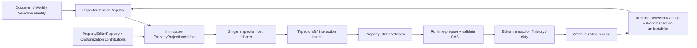

# Editor Inspector / Property Authoring 当前源码复核（Editor183）

## 1. 结论

当前Inspector不能作为工程级authoring系统验收。Editor62之后出现了三类真实基础进展：field editor contribution已经进入ticket/capability过滤的immutable Store snapshot；Runtime inspection能够发布focused field identity delta；componentized property list已经使用有界物理row pool、稳定item key和受保护slot rebind。它们应保留，但都没有闭合到最终属性编辑合同。

两条数据正确性P0仍可由当前产品路径直接触发：

1. `sync_selection_state()`仍把Translation和Scale格式化为两位小数；`apply_inspector_changes()`仍无条件重新解析并提交Name、Parent、完整Translation与Scale。只编辑Name或一个插件字段也会把未编辑Transform量化后写回World。
2. 多选snapshot仍只来自primary；Apply仍对每个selected node生成同一整表单更新。secondary的Name、Parent、Translation、Scale和dynamic字段会被primary草稿覆盖。现有测试继续把两个对象收到同一个Name和插件值断言为成功。

此外，componentized插件property的`Edit`与`Commit`仍只是修改模板row的`value/value_text`并请求paint；Runtime UI component adapter则把`ValueChanged`与`Commit`都降成draft mutation，却返回形似transaction的字符串。它们是可见的假提交语义，不能计为World mutation、history或save事实。

Editor05继续是Inspector finding与20项资格门的唯一canonical owner。Editor183新增canonical finding为 **0 P0 / 0 P1 / 0 P2**，只刷新父账状态：**2项P0 Open；32项P1为25 Open / 7 Partial；9项P2为7 Open / 2 Partial；20项Gate为15 Fail / 5 Partial / 0 Pass**。Prefab/default/instance override归Editor44，asset catalog/reference session归Editor57，document/world/selection identity归Editor61/60，Runtime schema/address/artifact归Runtime111；不得跨报告重复计数。

本轮只做静态review和重构计划，没有修改production或tests，没有运行Cargo、真实Editor、save/reopen、plugin reload、pointer/IME、10K fields/targets、fault/soak/profile或同硬件跨引擎benchmark。当前证据不支持“性能或表现优于Unreal”的声明；这种声明只能由语义等价的产品基准和新鲜capture证明。

## 2. 审查边界与currentness

### 2.1 冻结语料

fingerprint算法为：相对路径转小写并统一分隔符，追加NUL、文件原始bytes、NUL，再对排序后的集合计算SHA-256。它只冻结本轮实际读取的当前磁盘内容，不是ABI、artifact、动态验收或性能receipt。

| 范围 | 文件 / 行 / 非空行 / bytes / tests / ignored | 本轮证据 | fingerprint |
|---|---:|---|---|
| Zircon production focused set | **67 / 14,309 / 13,198 / 501,326 / 47 / 2** | Inspector extension、mutation、snapshot、pane/componentized projection、adapter、inspection delta与virtual materialization | `e6ef6a9c5464d5ab02b4e5dc6f4546392d6e8cad44efe63a711c05fbeee97fd3` |
| Focused tests | **47 / 12,856 / 12,048 / 475,541 / 170 / 0** | reflected batch、adapter、plugin contribution、pane/workbench projection与scroll | `3126f98c28d9e13691afecc6a2e6e3a0a874f30feb462773b1e3253b4a10e1fd` |
| Inspector UI assets | **4 / 674 / 578 / 43,322 / 0 / 0** | legacy Inspector、host body/controls与componentized panel | `ba7d3140f13f161dc2ed73a21377f7950735f775674cbfef08dabf9b6af31fdf` |
| Unreal PropertyEditor selected set | **4 / 12,645 / 10,700 / 441,442 / 0 / 0** | typed handle、multiple values、interactive transaction、container/default/details root | `90f77d652ad3e95252aeeb4224640dc8252f67a2dd6dc418b13d7cc420571772` |
| Godot Inspector selected set | **4 / 7,794 / 6,540 / 270,575 / 0 / 0** | common property intersection、fieldwise edit、per-target undo与revert | `0a1b26d883847beeccfba9fff5e7a4f5e8b559c84cb6f02981cbd68ec642ecb6` |
| Fyrox Inspector subtree | **28 / 8,315 / 7,591 / 309,683 / 1 / 0** | editor definition/instance、recursive path、collection action、sync与revert | `c962bc2134cf79b9028ad2e8812c47f5af0e6abbae5b03d81b3fbf2780b112b4` |
| Bevy Reflect path selected set | **4 / 1,481 / 1,348 / 50,579 / 8 / 0** | parsed structured access、typed mutable traversal与path error | `8f7d0b1231d1361138ef8985529db127500f85ac99f060ee1b0cdaae3f2e3517` |
| Unity Graphics selected set | **2 / 1,899 / 1,615 / 74,243 / 0 / 0** | typed SerializedProperty/override consumer与真实Curve editor | `fe269bb37825f1657b71cf85817df21201bf869f1cbc660705feb80b75a03f62` |

主仓HEAD在冻结时为`f48ed29a1ff80cf6c35ba747f074532aec48ea6a`。Godot、Fyrox、Bevy和Unity Graphics revision分别为`8c7e6c5877a78e8e61ea4fd42673219a9091dca7`、`8d815db36494f1badb347547dfc7094bf4fbbdf8`、`fb89a8649d9b359e53ffb6e5492ebb7c059ac8af`与`a7e4c051d256a781ab362c64316b125a1e104694`；Unreal镜像随主仓工作区冻结。

### 2.2 共享工作树与证据规则

本轮读取时focused范围存在大量其他Session或用户修改，包含Inspector extension、command、binding、snapshot、pane、componentized bridge、inspection artifact、reflection registry、UI asset和virtual-list实现；另有相关untracked拆分文件。本文以冻结fingerprint对应的当前磁盘为唯一事实，不尝试归因、不覆盖、不回退这些改动。

因此：

- 本报告可裁决当前静态可达语义，但不能替代合并后的source-bound动态验证。
- 后续实现前必须重新读取所有active owner、重新计算fingerprint，并确认假提交路径是否已被其他改动硬切。
- failure记录仍为open时，不因源码出现局部实现而擅自写成fixed；只有新鲜受管验证和owner回传可以关闭。
- 本轮按用户要求不查询、轮询、等待或实时跟踪协调器，阻塞项留在原owner，继续完成独立review工作。

### 2.3 Owner与去重

| 主题 | 唯一owner | Editor183职责 |
|---|---|---|
| Inspector/property authoring finding与20门 | Editor05 | current-source状态、产品路径补证、重构顺序 |
| Reflection schema/address/artifact/subscription | Runtime111 | 定义Editor消费与mutation需求，不复制Runtime finding |
| Transaction/history/save/autosave | Editor02 | 复用统一history/dirty，不建立Inspector私有undo |
| Prefab/default/instance override | Editor44 | 消费source-of-value/reset authority，不在Inspector重建真值 |
| Selection、Hierarchy、multi-world、stale NodeId | Editor60/03 | session绑定qualified target set与revision |
| Scene document/world identity | Editor61 | address/context携document与world generation |
| Asset catalog/reference picker | Editor57 | Inspector拥有typed editor/pick session，不拥有asset真值 |
| Plugin lifecycle/customization ownership | Editor50 | ticket、capability、surface mount/unmount与fault supervisor |
| UI message/event runtime | Editor48/49 | delta、typed edit intent与receipt delivery |

## 3. 当前产品链逐段裁决

### 3.1 Snapshot仍是primary字符串表单

`EditorState::sync_selection_state()`只读取active primary，并把Translation/Scale写入字符串数组；没有target set、mixed state、schema intersection、before value、dirty mask或source revision。`EditorStateSnapshot`把Name、Parent、Translation和Scale作为专用字段，再单独枚举dynamic components。Camera、Mesh、Light、Physics、Mobility、Activation和RenderLayer等Runtime built-in reflection registration没有进入统一component tree。

`inspector_plugin_components()`只调用`Scene::dynamic_components_for_entity(primary)`。每个schema field再对reflected fields线性`find`，形成O(F²)配对；随后按显示名排序，丢弃声明顺序/category。reflect失败被`unwrap_or_else`转换成只读JSON rows，真实schema/read corruption被抹成fallback。

### 3.2 Apply仍是full-form destructive mutation

`apply_inspector_changes()`先解析完整Parent、Translation和Scale，然后对每个selected node执行：

1. `prepare_reflected_node_updates()`始终生成Name、Hierarchy.parent、LocalTransform.translation和LocalTransform.scale四项更新；
2. `prepare_reflected_component_updates()`遍历`inspector_dynamic_fields`全部草稿；
3. 每项通过`EditorCommand::set_reflected_scene_field()`捕获before/after；
4. 所有命令以`MergeMode::Disable`放入一条history transaction。

“先捕获全部command、任一失败则不执行”的原子性是真实基础，missing dynamic component测试也证明零部分提交。但原子地执行错误payload仍是数据破坏；它没有把primary表单复制行为变成合法多选语义。

### 3.3 UI binding没有稳定编辑上下文

`InspectorFieldChange`仍只有`field_id: String`和`UiBindingValue`。`entity://selected`在dispatch时重新读取当前primary；`node://{u64}`只检查当前World是否存在同值ID。事件没有DocumentId、WorldGeneration、SelectionRevision、schema generation、object revision、stable component instance或expected value。

binding只先改一个draft field，随后调用`ApplyInspectorChanges`，所以单轴Position/Scale的typed finite scalar Submit仍落入full-form Apply。中途selection改变、World替换、NodeId复用或schema reload时没有compare-and-set；authoring gateway的generation保护和Runtime的world/schema generation尚未进入Inspector request。

### 3.4 两类可见假提交

`ui/template_runtime/component_adapter/inspector.rs`把`ValueChanged`与`Commit`合并到同一分支，只调用`apply_inspector_draft_field()`。它没有写World或history，却返回`transaction_id = inspector:<path>`、dirty与success status。reflection adapter复用同一draft路径并重写transaction字符串。

`ui/retained_host/callback_dispatch/template_bridge/workbench/property_edit.rs`同样把插件property Edit/Commit映射到同一row，只修改模板节点的`value/value_text`并refresh。`dispatch_componentized_workbench_surface_control_edited()`截获该事件后仅请求paint，根本不进入host runtime、binding dispatch、World mutation或history。

测试只验证draft/snapshot、row preview、paint invalidation和字符串transaction ID。这些测试冻结了presentation行为，却没有证明commit、undo、dirty、save/reopen或Runtime receipt。

### 3.5 Field editor ownership进步，但实例仍是descriptor

`FieldEditorDefinition`已经进入`ContributionBatch`、Store immutable snapshot、ticket/capability过滤和revoke路径。Host为每次snapshot构建active `FieldEditorContainer`；测试证明旧snapshot在capability变化后保持immutable，新snapshot在贡献失效后回退Auto。这实质满足“不能有绕过ticket的全局field-editor container”这一局部架构要求。

但`FieldEditorInstance`仍只有`FieldEditorKind`和21个字符串asset markers；factory只是返回descriptor，没有widget build/update、typed binding、validate、begin/commit/cancel或lifecycle。Curve仍明确为`CurvePlaceholder`，asset类型仍靠名字包含`asset/resource`启发式判断。

pane payload已经保留`field_editor_kind`和asset markers，这是Editor62之后应保留的进展；然而`InspectorPluginComponentPropertyViewData`再次只保留field/value/value_kind/editable，legacy和componentized最终控件继续按字符串`value_kind`猜Number/Text。resolved editor identity没有端到端到达真实widget。

### 3.6 Customization有操作白名单，没有surface产品闭环

Store snapshot、capability过滤、surface metadata和声明operation allowlist是真实基础。`component_drawer` adapter会拒绝未声明operation，并能把允许的操作交给Host operation registry；相关fixture证明一个声明的`scene.node.create_cube`可以真实执行。

但`InspectorCustomizationChain::build()`仍没有production caller，chain仍按注册顺序first-match whole target。snapshot/pane payload虽携带UI document、controller、template、data root和bindings，最终host view data只保留document/template；产品把它们显示成header的value/validation文本，没有mount插件UI、实例化controller、绑定data root或在ticket revoke时unmount。

同时`customization_available = schema.is_some() && customization.is_some()`仍是字段enabled gate。即使Runtime schema足以自动编辑primitive，缺customization的component也被全部禁用。Customization被错误地当成generic editor准入，而不是可选覆盖层。

### 3.7 增量artifact存在，但Inspector没有消费

Runtime `WorldInspectionFieldsArtifact`能够按generation生成changed/removed field identity；Editor发布`SceneInspectionFieldsDelta`，message bus也把property path计入retained-byte预算。当前consumer只用SceneInspection消息更新Hierarchy/Selection，Inspector没有按changed path读取artifact或patch row。

因此每次刷新仍在shell路径同步读取World、克隆dynamic component JSON、再次reflect/clone fields并重建Inspector snapshot。底层delta存在不等于产品具备immutable session、visible-only materialization或bounded update。

### 3.8 物理row虚拟化真实，数据源仍全量

component property rows已经从“一项一物理节点”升级为一个authored prototype和有界slot pool。Runtime依据viewport、item extent和overscan计算slot capacity；稳定item key、assignment generation以及focus/capture/pressed/pointer drag/drop保护阻止活动row被错误rebind；一行scroll只更新变化slot，并发布changed-slot metrics。

这关闭了“物理节点数量随property总数线性增长”的局部问题，但没有关闭整体规模问题：

- snapshot仍提前克隆所有dynamic component/property；
- componentized bridge仍保存`component.properties.clone()`和全量item keys；
- schema/reflected field仍O(F²) join；
- 只显示第一个plugin component；
- 没有expanded category、lazy value、heavy value摘要、item/time/byte/frame预算或10K资格。

### 3.9 可见但未实现的产品能力

- `WorkbenchAddComponent`同时存在ZUI route和builtin menu action，但唯一命中是preview action allowlist，没有production component catalog/handler/transaction。
- Rotation三轴控件存在，但显式`disabled = true`、无Edit/Commit route；Registry里只声明只读Vec3 Rotation metadata。
- legacy surface仍保留ApplyBatchButton，并把所有当前值重新打包。
- 无property Reset/Revert、Copy/Paste、source-of-value、override/pin、keyframe、context menu或component remove/reorder/enable。
- Resource和Entity仍为裸String/`Option<u64>`；Inspector header虽能作为object drag source，却不是typed asset/entity picker、drop validator或broken-reference workflow。

## 4. P0 current-source裁决

### E-INSP-P0-01：无关commit量化未编辑Transform

状态：**Open**。

直接证据：

- `editor_state_selection.rs:296-305`使用`{:.2}`生成authoring draft；
- `editor_state_selection.rs:97-126`每次Apply解析并提交完整Translation/Scale；
- `prepare_reflected_node_updates()`不接收changed mask，始终生成四类base update；
- legacy Apply、componentized Position/Scale Submit最终都到达该路径。

关闭条件：authoritative value不得从display string round-trip；每个row持有typed draft与精确changed path；no-op/其他字段commit产生零Transform command；以高精度值覆盖edit、undo/redo、save/reopen回归。

### E-INSP-P0-02：primary完整表单覆盖secondary

状态：**Open**。

直接证据：

- snapshot只读取primary；
- Apply对所有selected node复用同一Name/Parent/Transform和全部dynamic drafts；
- `reflected_inspector_batch_mutates_all_selected_nodes_in_one_history_record`明确断言cube/camera获得同一Name与coverage；
- 系统没有`Uniform/Mixed/MissingOnSome/ReadOnly`、Absolute/Relative/PerTarget/Reset或共同schema投影。

关闭条件：请求绑定稳定target set与selection revision，只携用户明确编辑的property address；每个目标在authoritative prepare阶段独立计算before/after；异构目标、missing component、parent cycle和validation失败必须原子拒绝且给出逐目标诊断。

## 5. Editor05 canonical finding状态

### 5.1 P1逐项总账

| ID | 状态 | 当前源码裁决 | 关闭所需重构 |
|---|---|---|---|
| E-INSP-P1-01 | **Open** | 通用Inspector只枚举dynamic component，built-in reflection registration不进入同一tree。 | Runtime registry + entity presence生成统一component/property artifact。 |
| E-INSP-P1-02 | **Open** | base字段仍有Editor专用draft/parser；dynamic字段用字符串拆type/field。 | built-in/dynamic共用typed address/accessor，customization只决定呈现。 |
| E-INSP-P1-03 | **Open** | incoming batch可含单字段，但Apply仍重发完整表单；无dirty/provenance。 | `PropertyEditRequest`只携changed addresses、typed values、mode与context token。 |
| E-INSP-P1-04 | **Open** | primary-only，无共同schema、mixed、missing或per-target value。 | session projection显式建模`Uniform/Mixed/MissingOnSome/ReadOnly`。 |
| E-INSP-P1-05 | **Open** | subject晚绑定current selection；裸NodeId无document/world/schema/selection generation。 | generation-qualified `PropertyEditContext`和stable object handle。 |
| E-INSP-P1-06 | **Open** | Runtime read/write仍是顶层field string；Editor靠最后一个`.`拆分。 | 结构化path segment、stable field ID和可缓存compiled access plan。 |
| E-INSP-P1-07 | **Open** | List/Map/Json只读，无insert/remove/move/resize/set-key。 | 递归node与原子container operations，定义元素identity/invalidation。 |
| E-INSP-P1-08 | **Open** | Resource domain没有接入Scene field command或统一frontend。 | domain-specific transaction adapter共享property frontend。 |
| E-INSP-P1-09 | **Open** | Runtime default metadata存在，产品无Reset/Revert/source。 | DefaultValueAuthority投影、per-target reset plan和undo。 |
| E-INSP-P1-10 | **Open** | numeric range/step/precision未进入row；Transform范围仍手写。 | schema/unit policy驱动hard/soft range、step、precision与clamp。 |
| E-INSP-P1-11 | **Open** | enum options/editor hint在snapshot丢失，Enum退化String。 | option model、unknown recovery、hint-driven editor。 |
| E-INSP-P1-12 | **Open** | documentation、deprecation和read-only reason没有稳定row字段。 | schema diagnostics/help/search完整投影。 |
| E-INSP-P1-13 | **Open** | `ReflectedValue`仍只覆盖有限scalar/vector/string/List/Map/Json。 | 覆盖公共authoring类型或使用typed dynamic reflect node。 |
| E-INSP-P1-14 | **Open** | Resource是String，asset markers是名字启发式且在最终view data丢失。 | typed AssetTypeId约束、picker/search/drop/clear/locate/preview/broken state。 |
| E-INSP-P1-15 | **Open** | Entity是`Option<u64>`文本，无world identity、picker和过滤。 | typed object reference + pick session + cross-world/cycle policy。 |
| E-INSP-P1-16 | **Partial** | Position/Scale已有typed finite单轴Submit；仍触发full Apply，Rotation禁用，Vec/Quat仍字符串。 | compound Transform editor、local/world、Euler/Quat、unit、lock axis与gesture transaction。 |
| E-INSP-P1-17 | **Partial** | field editor已ticket-owned、capability-filtered、snapshot-resolved；instance仍只是kind/markers descriptor。 | 真实widget factory、typed handle、validate、begin/update/commit/cancel和unmount。 |
| E-INSP-P1-18 | **Partial** | pane payload保留kind/markers；pane projection和host view data再次丢弃。 | resolved editor identity与schema metadata端到端不可逆传递。 |
| E-INSP-P1-19 | **Open** | Boolean/Color/Enum/Asset未决定production控件，Curve仍placeholder。 | 实装typed editors；Curve复用共享curve/timeline基础。 |
| E-INSP-P1-20 | **Open** | `InspectorCustomizationChain::build()`仍无production caller。 | 执行受控composition，或删除虚假build API并建立真实surface model。 |
| E-INSP-P1-21 | **Partial** | surface metadata/allowlisted operation可达Host；controller/data root/bindings在最终projection丢失，无mount/unmount。 | ticket-owned surface host、controller/data binding、deterministic revoke。 |
| E-INSP-P1-22 | **Open** | `schema && customization`仍作为generic字段enabled gate。 | 自动reflection editor是fallback，customization仅覆盖/扩展。 |
| E-INSP-P1-23 | **Open** | chain仍注册顺序first-match whole target，无priority/composition/conflict。 | 分层class layout/property editor/row extension/validation provider并确定性排序。 |
| E-INSP-P1-24 | **Open** | 无interaction state；component Commit是假提交；真实Apply固定Merge Disable。 | `Idle -> Preview -> Validate -> Commit/Cancel`及一gesture一history。 |
| E-INSP-P1-25 | **Partial** | command先完整capture再execute，missing component能零部分提交；错误仍是whole-batch String/status。 | typed per-path/per-target severity/code/repair与cross-field validation。 |
| E-INSP-P1-26 | **Open** | command只保存before/after，未携expected world/object/schema revision。 | authoritative prepare/CAS/rebase policy和明确Conflict receipt。 |
| E-INSP-P1-27 | **Open** | Add Component仅preview action；无remove/reorder/enable/disable。 | ComponentAuthoringCatalog + structural planner/transaction/undo。 |
| E-INSP-P1-28 | **Open** | 无reset/copy/paste/source/override/keyframe/context command。 | capability-driven row action registry，统一走transaction。 |
| E-INSP-P1-29 | **Partial** | immutable inspection artifact与focused field delta已发布；Inspector无consumer，仍全量读World。 | session订阅artifact generation并按visible changed path materialize。 |
| E-INSP-P1-30 | **Partial** | 物理row pool已真正bounded；snapshot仍O(F²)、全量clone且只取首component。 | O(F) slot join、lazy expanded ranges、硬预算与p95/p99 metrics。 |
| E-INSP-P1-31 | **Open** | reflect失败静默退JSON；真实field/component error不进入row。 | typed error/currentness/retry，禁止corruption被fallback吞掉。 |
| E-INSP-P1-32 | **Open** | legacy pane、componentized bridge、runtime adapter三条功能不等价路径并存。 | 单一presentation model和host adapter，硬删平行authority。 |

P1合计：**25 Open / 7 Partial / 0 Closed**。

### 5.2 P2逐项总账

| ID | 状态 | 当前源码裁决 | 关闭所需重构 |
|---|---|---|---|
| E-INSP-P2-01 | **Open** | Scalar parser接受`NaN/inf`，向量parser却提前拒绝非有限值。 | 一个typed draft validator统一preview/commit层级。 |
| E-INSP-P2-02 | **Open** | field/type/subject/value反复字符串化，`rsplit_once('.')`隐含语法。 | 集中versioned codec、结构化ID、round-trip/fuzz。 |
| E-INSP-P2-03 | **Open** | number projection仍`parse::<f32>().unwrap_or(0.0)`。 | `Valid/Invalid/Incomplete` draft，不把失败显示为0。 |
| E-INSP-P2-04 | **Open** | label、顺序、精度、单位与numeric kind在多处手写。 | schema-owned presentation metadata与locale/unit formatter。 |
| E-INSP-P2-05 | **Open** | active contribution重建仍`expect`；callback无panic/deadline/item/byte隔离。 | CallbackSupervisor、预算、quarantine和diagnostic receipt。 |
| E-INSP-P2-06 | **Open** | 多选测试继续固化整对象覆盖；无no-op、精度、mixed、异构schema矩阵。 | M0先写RED并删除错误断言。 |
| E-INSP-P2-07 | **Partial** | fixture已验证capability和allowlisted operation；没有真实surface mount/edit/unload/reload。 | 真实插件document/controller/binding和ticket revoke E2E。 |
| E-INSP-P2-08 | **Partial** | 64-row scroll与slot generation/protection测试存在；无10K/targets/Hz/huge container基准。 | 建立clone/allocation/frame/history memory的规模矩阵。 |
| E-INSP-P2-09 | **Open** | Editor06两个failure仍open，旧“contract complete”不能代表产品完成。 | source-bound验证后回填fixed/superseded及canonical状态。 |

P2合计：**7 Open / 2 Partial / 0 Closed**。

### 5.3 Failure记录复核

| Failure | 当前源码事实 | 本轮裁决 |
|---|---|---|
| `inspector-multi-selection-batch-mutation-missing` | active selection按稳定顺序prepare、一条transaction、失败零mutation、undo/redo存在；但payload仍来自primary完整表单。 | 原子批次基础可保留，不能关闭P0-02；failure保持open直到精确path/mixed/per-target动态验证。 |
| `ticket-owned-field-editor-container-missing` | field editor已进入Contribution Store/ticket/capability/immutable snapshot，新snapshot在撤销后回退。 | 架构局部满足，P1-17升为Partial；failure仍按owner记录保持open，等待最终source-bound gate。 |

## 6. 五引擎对照

### 6.1 Unreal PropertyEditor

`IPropertyHandle`提供typed get/set、metadata、child/container handle、outer objects、reset/default和变更通知。`FPropertyValueImpl::GetValueData()`在多对象值不一致时返回`MultipleValues`，而不是借primary值；interactive flag区分连续变更和最终提交，pre/post change与transaction只在实际变化时建立。Array/Set/Map有专用语义和重复校验，Reset走独立transaction并读取default。

Zircon差距不是缺一个控件，而是没有同等级`TypedPropertyHandle + multi-value state + interaction transaction + default/source`合同。实现时可借鉴责任分层，不应复制Unreal全局对象模型或宏体系。

### 6.2 Godot EditorInspector / MultiNodeEdit

`MultiNodeEdit::_get_property_list()`按name、type、class、hint和usage统计所有目标，只展示每个目标都兼容的property。`_set_impl()`只写指定property；field edit用`fieldwise_assign(current, value, field)`保留其他子字段，并为每个node记录do/undo。revert会查询对象自定义default、property default和class default。

这直接反证Zircon的primary完整表单复制。应借鉴共同schema、fieldwise/per-target mutation和revert优先级，但不能照搬Godot的StringName/Variant作为内部高性能执行协议。

### 6.3 Fyrox Inspector

Fyrox的`PropertyEditorDefinition`创建真实editor instance，`InspectorContext`保留widget handle、entry、definition container和environment并执行sync。`PropertyAction`区分Modify、AddItem、RemoveItem和Revert，collection editor递归创建item editor并传播路径。

Zircon当前`FieldEditorInstance`只是枚举descriptor，List/Map又只读。应借鉴definition/instance、recursive path和collection action的职责边界，同时补上Zircon需要的generation/CAS、plugin ticket和bounded projection。

### 6.4 Bevy Reflect path

Bevy用`Access::Field/FieldIndex/TupleIndex/ListIndex`表达结构化segment，`ParsedPath`把字符串解析成本地可复用访问计划，避免每次访问重复解析，并对类型、variant、missing field和downcast返回结构化错误。

Zircon应复用这一原则建立owning stable property path与compiled plan；字符串只用于显示/持久格式。Bevy该模块不是完整Editor/undo/customization参考，不能用它替代产品层设计。

### 6.5 Unity Graphics

Unity Graphics不是闭源UnityEditor Inspector核心源码，只能作为consumer证据。`VolumeComponentEditor`通过`SerializedProperty`/`SerializedDataParameter`保留typed serialized path、override state、tooltip/decorator和custom/standard drawer fallback，Set All Overrides调用Undo。`InspectorCurveEditor`是真实可交互curve consumer并把keyframe变化写回SerializedProperty。

这足以证明Zircon的String Resource、lost editor kind和CurvePlaceholder不是同级产品实现，但不能据此推测Unity完整multi-object、transaction或内部性能。

## 7. 目标架构与唯一权威

### 7.1 Runtime-owned property contract

Runtime111应拥有：

- `PropertyAddress { domain, object, component, segments, schema_generation }`；
- `PropertySchemaId/FieldId`、typed value node、read/write/reset/container capability；
- `PropertyProjectionArtifact`所需的immutable schema/value/source/error视图；
- `prepare_property_mutation(request)`，在authoritative lock内验证target、revision、schema、type、constraint和cross-field规则；
- `PreparedPropertyMutation`只能被一次commit或cancel，并产typed receipt/delta；
- built-in与dynamic component走同一registry、address和mutation adapter。

Editor不得从字符串type path和field name自行重建Runtime反射规则。

### 7.2 Editor-owned Inspector session

`InspectorSessionRegistry`按DocumentId、WorldGeneration、SelectionRevision和target set建立会话。Projection row至少包含：

- stable row/property identity；
- target/schema generation；
- `Uniform(T) / Mixed / MissingOnSome / ReadOnly(reason) / Error(diagnostic)`；
- type/editor metadata、default/source/override、validation和actions；
- visible/expanded materialization token；
- resolved field editor/customization ownership generation。

selection变化、world replacement、schema reload或plugin revoke必须明确retire旧session，迟到event返回Stale/Conflict，不能重定向到新对象。

### 7.3 PropertyEditCoordinator

唯一mutation入口接收typed request：target session token、property address、edit mode、typed value、expected revision和interaction ID。流程固定为：

1. resolve并验证session currentness；
2. 对全部targets prepare before/after与逐项diagnostic；
3. 任一目标失败则零World mutation；
4. 一次transaction提交全部prepared operations；
5. 连续drag/color/curve按interaction ID preview/merge，Esc恢复before；
6. commit返回transaction/history/world generation receipt；
7. inspection delta驱动projection patch。

UI adapter不得自行伪造transaction ID或success status。

### 7.4 Editor registry与customization

分离四类贡献：class layout、property type editor、row extension/action、validation provider。每项都有ticket、owner generation、capability、priority、conflict policy、fault budget和lifecycle。

auto reflection是基础fallback；customization只能覆盖或组合指定区域。Field editor实例必须持有typed property binding和widget lifecycle，resolved identity贯穿projection到host。插件surface由统一host mount document/controller/data root/bindings，revoke先阻止新事件，再drain callback，最后unmount/drop。

### 7.5 单一presentation与规模合同

legacy pane、componentized bridge和runtime component adapter必须硬切到同一`InspectorPresentationModel`。物理row pool继续复用，但数据源改为lazy provider：只materialize visible + overscan、expanded ancestors和活动interaction rows；schema/value使用slot/hash join，重型值摘要化。

必须量化每帧build/visit/clone/allocation/bytes、delta backlog、plugin callback、history memory和p95/p99 latency。没有语义等价的1/100/10K fields、targets与125/500/1000Hz输入基准，不得声称优于Unreal/Fyrox/Godot。

## 8. 硬切重构清单

| 当前owner | 必须删除/收敛 | 目标owner |
|---|---|---|
| `editor_state_selection.rs` | 删除Name/Parent/Transform/dynamic完整字符串表单作为mutation authority；selection同步不再生成可回写草稿。 | `InspectorSessionRegistry` + typed row drafts |
| `InspectorFieldChange`、`binding_dispatch/inspector` | 删除裸subject/field string晚绑定和draft后full Apply。 | `PropertyEditRequest` + coordinator |
| `SetReflectedSceneFieldCommand` | 不再由UI逐字段临时capture且无expected revision。 | Runtime prepared mutation + Editor transaction adapter |
| runtime `inspector/reflection` component adapters | 删除ValueChanged/Commit同义和伪transaction receipt。 | preview intent与commit intent分离，只转发typed request/receipt |
| componentized `property_edit.rs` | 删除row-only Commit。未接真实mutation前控件必须只读并明确Unavailable。 | single host adapter |
| `editor_state_snapshot_build.rs` | 删除dynamic-only、primary-only、O(F²)、reflect-error-to-JSON与customization admission。 | immutable session projection consumer |
| `field_editor.rs` | `FieldEditorInstance`不再只是kind/markers；删除CurvePlaceholder和asset名字启发式。 | lifecycle-aware `PropertyEditorFactory/Instance` |
| `InspectorCustomizationChain` | 删除production不用的build外形和first-match whole target。 | deterministic contribution composition + mounted surface lease |
| pane payload/projection/view data | 不再反复降级、复制和猜`value_kind`。 | 一个immutable row DTO或直接共享Arc projection |
| component property virtualization | 保留slot pool、item key和protection；删除全量property clone/首component特例。 | lazy multi-component tree provider |
| Inspector ZUI/workbench preview actions | 删除无handler的Add Component与禁用Rotation产品暗示，或接入真实能力。 | capability-backed controls |
| tests | 删除“整对象覆盖成功”和字符串transaction即成功的断言。 | World/history/dirty/save/currentness/scale receipt矩阵 |

兼容层不允许长期存在。新session/coordinator接通一条产品路径后必须删除对应旧Apply、draft authority和preview-only Commit，不能以feature flag永久并行。

## 9. 依赖有序实施里程碑

### ED183-M0：P0止血

1. 先写RED：高精度Transform + Name-only/plugin-only commit；两个不同对象的mixed Name/Parent/Transform；no-op Apply；异构component。
2. 可见提交只允许生成显式changed field命令；暂时无法迁移的component property Commit降为只读/Unavailable。
3. 删除或隔离full-form Apply；保留原子batch和undo。
4. 更新旧多选测试，不再把primary覆盖secondary作为成功。

M0完成前禁止扩展更多Inspector控件或customization，因为它们会扩大数据破坏入口。

### ED183-M1：Runtime schema/address/prepare

依Runtime111落地结构化address、schema generation、typed value、nested/container path、default/source metadata和prepare/CAS。built-in/dynamic统一注册与访问，Editor只消费公开合同。

### ED183-M2：Inspector session与artifact

建立per-document/world/selection session；从WorldInspection artifact读取统一component tree，消费focused field delta；实现mixed/common schema/error/source state。先以O(F) join替换当前O(F²)，再做visible/expanded lazy materialization。

### ED183-M3：交互事务与诊断

实现PropertyEditCoordinator、typed validation、per-target prepare、Conflict/rebase、begin/update/end/cancel和一gesture一history。所有receipt由transaction/Runtime事实生成，UI不得命名模拟。

### ED183-M4：真实typed editor与customization

把ticket-owned definitions升级为widget factories/instances；贯通Bool、numeric、Enum、Color、Vector/Rotation/Transform、Asset、Entity、Curve和container。实现auto fallback、deterministic contribution composition、surface mount、controller/data binding、fault budget和revoke unmount。

### ED183-M5：Component topology与日常操作

接Editor64/Runtime catalog完成add/remove/reorder/enable/disable；接Editor44完成default/source/override/reset；接Editor57完成asset/entity pick/drop/locate/broken state；实现copy/paste/context action/keyframe capability。

### ED183-M6：单一presentation硬切与规模治理

迁移legacy、componentized和runtime adapter到同一presentation/session，逐条删除旧DTO、value_kind猜测、preview Commit和ApplyBatch。保留并扩展物理row pool为多component/category/tree lazy provider，加入硬预算与metrics。

### ED183-M7：产品资格

在真实Windows Editor完成单/多选、multi-document/world replacement、plugin unload/reload、schema migration、undo/redo、dirty/save/reopen、prefab/default、asset/entity picker、10K fields/targets、1000Hz scrub、huge container、fault/soak/profile和同硬件跨引擎对照。只用新鲜receipt关闭Editor05状态。

## 10. 产品资格门current-source裁决

| # | Editor05门禁摘要 | 状态 | 当前证据 |
|---:|---|---|---|
| 1 | 未编辑property不被其他commit改变 | **Fail** | full-form Apply重写base/dynamic全部草稿。 |
| 2 | 浮点显示、其他编辑、save不损精度 | **Fail** | Translation/Scale仍`{:.2}`回写。 |
| 3 | 多选共同schema、mixed、指定字段提交 | **Fail** | primary-only snapshot和整表单覆盖。 |
| 4 | Transform Absolute/Relative/PerTarget | **Fail** | 无模式；Rotation禁用。 |
| 5 | built-in组件统一查看/编辑 | **Fail** | 通用tree只枚举dynamic。 |
| 6 | built-in/dynamic同address/validation/transaction/undo | **Partial** | 都可落入reflected command和一条transaction；discovery、draft、address仍分裂。 |
| 7 | nested/container完整编辑与undo | **Fail** | List/Map/Json只读，无container op。 |
| 8 | range/enum/doc/default驱动UI | **Fail** | metadata未进入最终row/widget。 |
| 9 | typed Asset/Entity picker与约束 | **Fail** | String/u64与marker猜测。 |
| 10 | typed controls不退化，Curve真实 | **Partial** | ticket-owned kind和payload存在；最终仍Number/Text且Curve placeholder。 |
| 11 | gesture一条history且可cancel | **Fail** | 无interaction state，Apply固定Merge Disable。 |
| 12 | validation失败零部分提交且逐项诊断 | **Partial** | prepare全部command后再执行；只有whole-batch String错误。 |
| 13 | stale document/world/schema/selection冲突 | **Fail** | subject晚绑定、NodeId无generation/CAS。 |
| 14 | Reset/Copy/Paste/component topology可撤销 | **Fail** | 无property actions；Add Component仅preview。 |
| 15 | plugin surface真实mount且fault-isolated | **Partial** | ticket/capability/allowlisted operation存在；surface未mount且callback无统一budget。 |
| 16 | 无customization仍有auto fallback | **Fail** | `schema && customization`仍是enabled gate。 |
| 17 | 10K tree只构建visible/expanded range | **Partial** | 物理slot pool有界；source snapshot/key/property仍全量。 |
| 18 | 1000Hz输入有界且history合并 | **Fail** | 无scrub state、queue/budget或动态证明。 |
| 19 | 三套projection与字符串authority删除 | **Fail** | 三条功能不等价路径仍并存。 |
| 20 | focused/package/workspace/产品/save矩阵新鲜 | **Fail** | 本轮静态审查；现有测试缺关键语义且未运行。 |

门禁合计：**0 Pass / 5 Partial / 15 Fail**。

## 11. 首批RED与验收receipt

### 11.1 数据正确性

- Name-only commit保持所有target的Transform bitwise不变。
- plugin-only commit保持Name/Parent/Transform和其他plugin fields不变。
- no-op、invalid/incomplete draft不创建command/history/dirty。
- mixed值显示不借primary；Absolute/Relative/PerTarget分别验证。
- selection/world/schema在event与commit间变化返回Conflict，旧NodeId不能命中新World。
- 一target缺component、readonly、range/type/cross-field失败时全批零mutation，并返回逐项诊断。

### 11.2 Transaction与持久化

- slider/color/curve 1000次update只形成一条可撤销history；Esc恢复所有targets。
- undo/redo、dirty generation、save/reopen与before/after逐字段一致。
- Reset按每个target自己的default/source执行；Prefab/instance override变化由Editor44 receipt证明。
- plugin unload在交互中发生时，先取消或完成已确认transaction，再retire widget/session，不得调用已卸载代码。

### 11.3 Presentation与插件

- 每个resolved editor kind实际实例化对应控件，不允许consumer重新猜type。
- auto editor在无customization时可编辑安全primitive；plugin surface真实mount/controller/bind/event/unmount。
- legacy/componentized/runtime adapter对同一projection输出等价，随后删除多余路径。
- Add Component、Rotation、Asset/Entity picker只有在真实handler/receipt存在时才可用。

### 11.4 规模与性能

- 1/100/10K fields和targets，collapsed/expanded/filtered/mixed场景；记录snapshot build、visible materialize、delta patch、clone/allocation/bytes和frame p95/p99。
- huge List/Map、heavy Resource/JSON只读取摘要与visible children。
- 125/500/1000Hz输入测queue depth、coalescing、history memory、cancel/commit latency。
- slow/panic plugin测deadline、quarantine、row/byte budget、unload drain和Editor可继续操作。
- 与Unreal/Fyrox/Godot做相同数据、相同操作、相同硬件、warmup与重复次数的对照；报告功能完整性和性能，不以缺少语义的简化路径冒充优势。

## 12. 后续复核边界

实现顺序固定为ED183-M0至M7。M0只止血并建立正确changed-path语义；M1/M2决定Runtime和Editor authority；M3以后才允许扩展高级控件。任何“先新增Boolean/Color/Curve控件、以后再接transaction”的方案都会把假提交扩散到更多类型，应拒绝。

完成每个里程碑时回填Editor05 canonical finding与20项Gate；Runtime合同变化回填Runtime111，默认/override、asset reference、document/selection、component topology分别回填Editor44/57/61/60/64。Editor183保持current-source refresh，不创建平行canonical账本。

本切片只完成Inspector/property authoring静态深审、五引擎对照和重构路线。整个ZirconEngine仍需按后续域继续逐角落扫描；本报告不声明Editor或Engine整体review完成，也不把任何静态源码存在性当作“优于Unreal”的性能结论。
