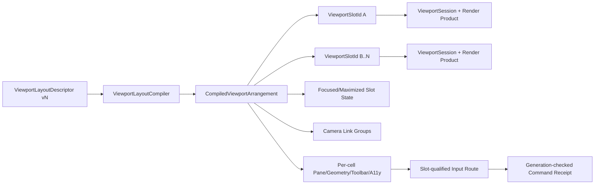

# Editor Scene Viewport Layout、Split View、Orthographic Quadrant、Maximize、Link Sync、Slot Focus、Toolbar、Persistence、Performance 与 Product Integration 当前源码复核

## 1. 结论

Editor72之后，Zircon的通用Workbench布局、Retained Host surface和Viewport产品链有真实进展，但Scene多视口产品本身仍未建立。`DocumentNode::SplitNode`能够表达递归split tree，snapshot也会保留axis、ratio和两个子树；toolbar能按docked/floating surface生成独立hit frame并复用缓存；Scene、Simulate、Game图像已分槽，GPU product保留resource key和generation，Play frame保留gateway/instance/generation identity；页面布局持久化已有user/page scope、format version和version mismatch fallback。这些基础应保留。

两个P0仍然成立。第一，`collect_document_tabs`把所有split leaf压成一个`Vec<DocumentTabModel>`，`document_pane_selection`再选择全局第一个active tab，否则第一个tab；`scene_projection`只构造一个`HostDocumentDockSurfaceData`和一个document content frame。模型已接受并持久化的多leaf布局因此在产品投影中失真。第二，`ViewportToolbarPointerRoute`每个variant都带`surface_key`，click hit test也按surface查找frame，但`dispatch_viewport_toolbar_pointer_route`以`{ .. }`忽略该identity，并读取/修改唯一全局`scene_viewport_settings`。一旦显示两个Scene surface，点击A的toolbar可以修改B也共享的全局状态。

Scene和Game descriptor仍是single-instance，新实例payload仍为`Value::Null`；`EditorState`只有一个`SceneViewportController`，Retained Host只有一个`viewport_size`、一个controller和一个Scene image slot。按pane kind绘制时，所有Scene pane都读取同一`HostViewportImageSet::scene/simulate`资源。代码中不存在`ViewportSlotId`、versioned layout descriptor/registry、per-slot session、maximize restore token、camera sync group或layout activation receipt。对tracked源码及2,131份untracked Rust/ZUI源的目标类型检索均为零命中。

通用布局预设也不能替代视口布局。`LayoutPreset`只保存drawer state、三个尺寸token和`CenterSplitLayout::{SingleDocument, Split { axis, panes }}`；捕获时丢失exact tree、ratio、leaf assignment、active tab和全部view payload，恢复时把所有tab折叠到首leaf并以固定0.5生成空tail。完整`WorkbenchLayout`预设资产虽能序列化更多数据，但加载采用直接替换，没有compile/validate/warm/atomic commit或last-known-good receipt；`LayoutManager::apply`的部分命令还会先detach再验证target，失败时可能留下部分mutation。

本轮保持Editor72的2项P0，48项P1当前为 **34 Open / 14 Partial / 0 Closed**，10项P2为 **10 Open**；48个资格门为 **36 Fail / 12 Partial / 0 Pass**。Partial只表示通用surface、window focus、capture、generation、persistence fallback、frame demand或预算底座可复用，不表示multi-viewport产品可用。

本轮只做review，未修改production Rust，未运行Cargo、Editor、GUI、GPU、多窗口、多视口、a11y、fault、scale、soak、profile或同硬件跨引擎benchmark。Tooling按用户要求排除；没有查询、轮询、等待或实时跟踪协调器。当前不能声称本域功能、表现或性能达到或超过Unreal。

## 2. 审查边界与冻结语料

### 2.1 Current working tree

主仓HEAD为`681588f7a1cbfaae3147e8b93e1be6705d810f21`。报告以2026-08-28实际读取的current working tree为事实源；相关源码中包含其他会话的modified或untracked实现。本轮不回退、不格式化、不吸收这些生产改动。

MVP baseline recovery仍为`in_progress`。Editor05的viewport overlay、pointer candidate、shared extract、world generation和scene-mode input failure记录说明底层已有真实工程约束，但这些记录不能替代多视口产品证据，也不阻塞本轮只读审查。

### 2.2 冻结物理范围

| 范围 | 文件 / 行 / 非空行 / bytes / tests | 本轮证据 | working-tree fingerprint |
|---|---:|---|---|
| Editor layout/product | **55 / 10,041 / 9,237 / 401,340 / 36** | layout、projection、surface、toolbar、render、persistence与focus/capture | `b217d82d15e6c937aeb3a38e60ee53af7b529aba82f66c2d914ed18d078536fa` |
| Focused tests | **16 / 2,944 / 2,708 / 105,859 / 49** | split、restore、pane、toolbar、image与viewport controller | `3d6bbd0519a6bddbaf08998ccb7f5ec9bdad0e10c7741cdf00488718c46e963b` |
| Zircon deduplicated focused set | **71 / 12,985 / 11,945 / 507,199 / 85** | 上述两组无重复路径 | `8d96024cd0974c9f2869f6f9272ecab45979473d288061c2fdce99f8046b6bdb` |
| Unreal selected set | **10 / 2,039 / 1,670 / 77,818 / 0** | layout entity、configuration、maximize、config与2x2 | `bf48fb3309055fea74ba52f5852616fdcbe68baa2c5091d95f9750f4c2ed7aa1` |
| Godot selected set | **4 / 12,586 / 10,703 / 500,558 / 0** | 1/2/3/4 viewport、orthogonal camera与menu/persistence | `3cf648f003692ca8d20cc1343027e0a9c020b1774308f8040b71c55a15f8bb94` |
| Fyrox selected set | **8 / 7,407 / 6,734 / 283,136 / 1** | dock config、scene viewer、camera与window settings | `33e1759f828ef0bf0cfc28de002de2a45fefd271705eb493e2b481b1f0faab81` |
| Bevy selected set | **3 / 2,514 / 2,332 / 100,225 / 3** | per-camera viewport rect、resize、target与coordinate conversion | `396d12d1f246260767b2aaff13e499ec24882f34e1f5c66438b03fe4f60fea22` |
| Unity Graphics selected set | **5 / 1,988 / 1,788 / 93,150 / 0** | per-view Scene settings、RTHandle resize/history与tests | `eadfe14488eb7bdcff657cfc321c3aca9d7c8e48dece5a6de3f06c2462baa3f2` |

fingerprint按小写规范化相对路径排序，将每个`path + newline + file SHA-256 + newline`聚合后再做SHA-256，只证明本轮working-tree选择集。Godot、Fyrox、Bevy与Unity Graphics revision分别为`8c7e6c5877a78e8e61ea4fd42673219a9091dca7`、`8d815db36494f1badb347547dfc7094bf4fbbdf8`、`fb89a8649d9b359e53ffb6e5492ebb7c059ac8af`与`a7e4c051d256a781ab362c64316b125a1e104694`；Unreal跟随主workspace。

### 2.3 Owner边界

Editor193只刷新Editor72拥有的viewport layout descriptor、stable slot、multi-cell projection、maximize、link sync、slot focus、per-slot persistence和layout qualification。Editor175拥有通用Workbench geometry；Editor179拥有render product/surface lifecycle；Editor180拥有input/picking/capture；Editor187拥有camera；Editor189拥有display/show flags；Editor190拥有realtime/frame demand。实现必须连接这些owner，不能在layout模块复制第二套camera、render session、input capture、display profile或frame scheduler。

## 3. 当前实现拓扑

### 3.1 Split tree在model中存在，在product中消失

`resolve_document_workspace`递归生成`DocumentWorkspaceSnapshot::Split`，保留axis、ratio、first和second。随后`collect_document_tabs`递归遍历所有leaf，却把每个tab追加到单一`document_tabs`数组。`document_pane_selection`不读取workspace path或leaf，只找全局第一个active tab；`document_pane_with_template_v2_data`因此只生成一个PaneData。最终`scene_projection`只发布一个`document_dock`、一个pane和一个content frame。

这不是视觉细节，而是model-to-product contract断裂。保存和恢复能够接受两个active leaf，产品却不能同时呈现它们；pointer、toolbar、render和focus也就没有机会获得leaf identity。

### 3.2 Scene/Game仍是全局单实例

`ViewDescriptor::new`默认`multi_instance = false`，Scene/Game descriptor未覆盖该值。`open_descriptor`对single-instance直接返回现有实例，新实例payload为`Value::Null`；`ensure_shell_instances`也显式维护单实例。`workspace_path`只是可变tree position，不是稳定slot identity。

`EditorState`只有一个`viewport_controller`，host只有一个`viewport_size`和`RetainedViewportController`。resize只读取`componentized_workbench_layout_frames.viewport_content_frame`，提交只生成一份render frame submission，poll也只跟踪一个viewport handle和latest generation。

### 3.3 图像按模式分槽，不按viewport slot分槽

`HostViewportImageSet`只有`scene`、`simulate`、`game`三个全局Option。`for_pane("Scene")`返回simulate或scene，`for_pane("Game")`返回game；绘制函数仅按`pane.kind`取图。因此两个Scene pane即使能被投影，也会显示同一资源、同一generation和同一overlay。

这里仍有可保留进展：Scene/Simulate/Game不再互相无条件fallback，Play frame保留gateway identity，GPU product不再要求CPU pixels，重复resource key不会触发无效更新。但这些是per-kind currentness，不是per-slot currentness。

### 3.4 Toolbar identity只活到dispatch之前

toolbar projection能给document、left、right、bottom和floating surface分别附加frame；缓存键包含surface和size，route-only变化可重投影而不重排版，1,000次稳定attachment测试也证明不会重复构建geometry。pointer click根据`surface_key`选择正确frame并进行hit test。

随后identity被丢弃。`ViewportToolbarPointerRoute`每个variant包含`surface_key`，但`route_mapping.rs`全部用`{ field, .. }`或`{ .. }`匹配，并调用全局`runtime.scene_viewport_settings()`。现有测试甚至只断言`scene.main` route最终产生全局`SetDisplayMode`事件，没有第二surface隔离断言。

### 3.5 通用preset有版本与scope，但仍是有损布局摘要

`LayoutPresetPersistenceStore`按`LayoutPresetScope { user_id, page_id }`排序保存，`PersistedLayoutPreset`有`format_version`，missing或version mismatch会回退Authoring preset。该通用恢复能力应复用。

但`capture_from_layout`只计算drawer states、三个整数尺寸和center leaf count。`center_split_from_document`只保留根axis与panes，所有ratio、混合axis、leaf view assignment和active selection丢失。`apply_center_split`先collapse全部tabs，再以固定0.5递归生成同axis empty tail。测试明确断言序列化结果不包含Scene/Material实例id，这对viewport exact round-trip是负证据。

### 3.6 布局应用不是prepare/commit事务

完整preset资产加载后直接`session.layout = layout`并recompute metadata；没有schema compile、capability admission、resource warmup、generation barrier、commit receipt或rollback。`LayoutManager::apply`中的Open/Move/Attach/CreateSplit会先`detach_instance`，之后才解析target/path；若验证失败，原位置已被修改。`set_drawer_extents_atomically`只对一小组drawer extent实现预验证，不代表整个layout activation原子化。

### 3.7 Focus、capture与floating只是通用基础

callback source能定位floating window并避免重复focus dispatch，shell resize能release pointer capture，Editor180也已有mode/cancel基础。这些可用于后续slot focus和capture handoff。但当前没有`FocusedViewportSlot`、per-window last-used slot、spatial keyboard traversal、layout rebuild focus token或slot-aware capture owner。floating window中的Scene仍消费全局Scene image和全局settings。

### 3.8 Maximize、orthographic quadrant与link sync完全缺席

当前源码未命中viewport maximize、layout restore token、camera sync group、sync epoch/origin/cycle suppression等产品类型。工具栏能设置单一全局projection/alignment，不能描述2x2中Perspective/Top/Front/Side的canonical assignment。也没有source/world/projection兼容性检查、member revoke、degraded group或sync diagnostics。

## 4. 五引擎参考与适用边界

### 4.1 Unreal

Unreal把viewport layout entity保存到按config key索引的map，layout configuration负责构建、load/save和可见性；maximize transition绑定到具体entity，非最大化viewport只是不可见而不是销毁其身份，PIE切换还会重新注册对应game viewport。2x2实现定义固定viewport type与splitter组织。Zircon应借鉴stable entity、layout configuration、non-destructive maximize和per-entity config，不复制Unreal的legacy全局单例。

### 4.2 Godot

Godot 3D editor长期持有四个viewport，并提供1/2/3/3-alt/4种布局；每个viewport有独立camera、orthogonal/perspective mode、view menu和状态。布局切换改变容器可见性与split，而不是把四个视角压成单一全局camera。Zircon至少需要达到这一产品基线，同时补充generation、typed receipt和extension fault domain。

### 4.3 Fyrox

Fyrox的DockingManager/Tile/TileContent和DockingManagerDescriptor证明通用dock tree、floating window及配置恢复边界；Scene Viewer和camera settings则提示camera状态应属于scene/viewer owner。它不是完整多视口实现，因此只能校准通用dock与settings边界，不能作为功能上限。

### 4.4 Bevy

Bevy split-screen example给每台camera分配独立`Viewport { physical_position, physical_size }`和render order，并在window resize时重算；camera API区分viewport size与target size，world/viewport conversion也以实际viewport rect为基准。Zircon的per-cell geometry、pointer local mapping和render binding必须保持同样明确的物理像素/DPI语义。

### 4.5 Unity Graphics

Unity Graphics的Scene View settings按view维护，RTHandleSystem将reference size、scale、allocation和resize历史分开，tests验证buffered RT生命周期。它适合约束per-slot visual state与render-target admission，但不提供完整Editor layout/focus/maximize架构，不能单独作为产品参考。

## 5. 差异矩阵

| 能力 | 当前实现 | 工程目标 | 判定 |
|---|---|---|---|
| Layout authority | 通用`DocumentNode`，无viewport descriptor | versioned descriptor registry + compiler | Open |
| Stable identity | `workspace_path`和surface string | `ViewportSlotId` + layout/session generation | Open |
| Multi-cell projection | split snapshot压平为单PaneData | 每leaf独立pane/frame/toolbar/a11y | P0 Open |
| Multi-instance | Scene/Game single-instance、Null payload | policy-bound multi-instance与typed payload | Open |
| Render binding | 一个controller/size/Scene image | slot-qualified render session/product receipt | Partial foundation |
| Toolbar | per-surface hit frame，dispatch丢surface | surface/slot/generation贯穿命令 | P0 Open |
| Focus/input | window focus与通用capture | slot focus、traversal、handoff、return | Partial foundation |
| Presets | user/page/version fallback，有损center摘要 | exact tree/ratio/assignment/payload round-trip | Partial foundation |
| Activation | 原地mutation/direct replace | prepare/admit/warm/commit/rollback receipt | Open |
| Maximize | 无 | non-destructive state machine + restore token | Open |
| Link sync | 无 | typed group/policy/epoch/origin/degrade | Open |
| Performance | 单viewport generation/cache/部分可见性 | per-slot demand、budget、fairness与telemetry | Partial foundation |

## 6. Findings

### 6.1 P0

| ID | 状态 | 当前源码证据与重构要求 |
|---|---|---|
| ED72-P0-01 | Open | split snapshot真实存在，但tab collection和pane selection将所有leaf压平为唯一document pane。先补RED product test，再让每个visible leaf生成独立pane/content frame；禁止以“model能split”宣称产品完成。 |
| ED72-P0-02 | Open | toolbar hit route携`surface_key`，dispatch mapping明确丢弃并写全局settings。命令必须携`ViewportSlotId + surface/window + layout/session generation`并在执行前重验；没有第二surface隔离测试前不得开放multi-cell。 |

### 6.2 P1

| ID | 状态 | 当前源码证据与需要重构的内容 |
|---|---|---|
| ED72-P1-01 | Open | 无versioned viewport layout descriptor/registry。建立stable layout id、schema version、owner ticket、capability与migration。 |
| ED72-P1-02 | Open | Scene/Game descriptor仍single-instance。改为受布局策略约束的multi-instance，禁止无界重复打开。 |
| ED72-P1-03 | Open | 无`ViewportSlotId`。slot identity必须跨tree重排、maximize和restore稳定。 |
| ED72-P1-04 | Open | `workspace_path`只定位当前tree。不得用path、title、surface string或显示文本充当slot id。 |
| ED72-P1-05 | Open | Scene/Game payload仍为Null。引入versioned slot payload，持久化kind/source/camera/visual/realtime/sync policy。 |
| ED72-P1-06 | Open | 无typed slot view kind/canonical camera preset。定义Perspective/Top/Front/Side/Game/Preview等闭集及扩展边界。 |
| ED72-P1-07 | Open | 无primary/listener/source policy。明确selection focus、audio listener、Play camera与authoring source。 |
| ED72-P1-08 | Open | 通用extension snapshot存在，但layout/slot未接入capability或typed unavailable。复用owner ticket/generation，禁止私建插件表。 |
| ED72-P1-09 | Open | 无layout compiler。编译阶段必须拒绝duplicate slot、invalid ratio、unsupported source、cycle和超预算布局。 |
| ED72-P1-10 | Open | 产品仍只有一个document pane。按compiled visible cells投影独立PaneData。 |
| ED72-P1-11 | Open | 只有单一document/viewport content frame。输出per-cell logical/physical/clip/DPI geometry。 |
| ED72-P1-12 | Partial | per-surface toolbar frame与缓存是真实底座；没有per-cell toolbar/HUD state或slot binding。把surface frame从pane kind升级为slot-qualified projection。 |
| ED72-P1-13 | Partial | toolbar pointer已有per-surface hit frame；viewport content仍只有一个pointer frame。统一输出per-cell route frame和local coordinate transform。 |
| ED72-P1-14 | Partial | `RenderViewportHandle`、GPU resource key和mode image slots可复用；没有slot-to-session/product binding。由Editor179的session registry owner提供绑定。 |
| ED72-P1-15 | Partial | render product有generation，Play frame有gateway identity；没有layout/slot/source/camera-qualified currentness。扩展为present receipt并拒绝stale source。 |
| ED72-P1-16 | Open | 无per-cell a11y subtree、role/name/state/relationship。布局投影必须与视觉树同代发布。 |
| ED72-P1-17 | Open | 只有active document和window focus，没有cell focus authority。建立唯一`FocusedViewportSlot`。 |
| ED72-P1-18 | Open | 无空间顺序键盘遍历。按compiled geometry定义next/previous/up/down，而非tree插入顺序。 |
| ED72-P1-19 | Open | callback window focus不能恢复slot。layout rebuild/maximize/close必须使用generation-qualified focus return token。 |
| ED72-P1-20 | Partial | shell capture release和Editor180 interaction cancel可复用；没有slot capture owner/handoff。切换、隐藏、window loss必须产生terminal receipt。 |
| ED72-P1-21 | Partial | 通用splitter和viewport mode arbitration各自存在；没有同一pointer stream的优先级/ownership协议。由Editor180统一仲裁。 |
| ED72-P1-22 | Open | 只记last focused callback window，不记per-window last-used slot。状态应属于window/layout session。 |
| ED72-P1-23 | Open | 无focused/maximized/synced/stale视觉及等价a11y反馈。不得只靠toolbar文本或颜色。 |
| ED72-P1-24 | Open | 无1/2/3/3-alt/4产品命令与真实多cell呈现。先交付1与2，再扩3/4。 |
| ED72-P1-25 | Open | 无orthographic quadrant assignment。定义稳定Perspective/Top/Front/Side映射与up-axis约定。 |
| ED72-P1-26 | Open | 无maximize状态机。实现Normal/Entering/Maximized/Exiting及明确重入政策。 |
| ED72-P1-27 | Open | 无restore context。保存layout generation、visible set、focus、capture、split和slot session lease。 |
| ED72-P1-28 | Open | layout switch/maximize无queue/coalesce/reject和receipt。命令必须可重放并有terminal outcome。 |
| ED72-P1-29 | Partial | 通用floating/native window存在；没有viewport fullscreen/immersive/native maximize语义。明确各层所有权和返回路径。 |
| ED72-P1-30 | Partial | 通用constraint/autolayout和ratio clamp存在；没有per-cell min-size、collapse priority或toolbar overflow。由Editor175输出策略化geometry。 |
| ED72-P1-31 | Open | 无camera link group descriptor。stable group id、scope、members、leader和policy必须一等化。 |
| ED72-P1-32 | Open | 无sync epoch/origin/cycle suppression。每次传播携origin slot和monotonic epoch。 |
| ED72-P1-33 | Open | 无projection-aware sync。Perspective与Orthographic只同步兼容子集，禁止盲复制projection参数。 |
| ED72-P1-34 | Open | 无source/world compatibility gate。跨world、Play/authoring、pilot source必须返回stable reject reason。 |
| ED72-P1-35 | Open | 无member revoke/failure/world replacement降级。group需移除成员、选新leader或进入degraded。 |
| ED72-P1-36 | Open | 无扩展sync provider。接入通用owner ticket/generation/capability/fault budget。 |
| ED72-P1-37 | Open | `ProjectEditorWorkspace.layout_version`和preset version都不是viewport payload逐版本migration。建立独立schema与migration corpus。 |
| ED72-P1-38 | Open | 无per-slot project/user/document scope和override precedence。明确共享布局与个人camera/view state边界。 |
| ED72-P1-39 | Partial | preset已有scope/version/fallback，但明确有损压缩tree、ratio、assignment和payload。改成exact schema；摘要preset仅可作为模板。 |
| ED72-P1-40 | Partial | missing/version mismatch会回退Authoring，通用UI hot reload也有LKG基础；没有保留未知原文、quarantine、diagnostic或viewport LKG。 |
| ED72-P1-41 | Open | 完整layout仍direct replace，命令可能detach后验证失败。实现immutable candidate、compile、admit、warm、commit、rollback与typed receipt。 |
| ED72-P1-42 | Open | 通用extension revoke存在但layout未接入。owner reload/revoke必须退休descriptor、session、sync group和in-flight activation。 |
| ED72-P1-43 | Partial | 单viewport realtime/invalidation与frame demand基础存在；没有per-slot active/visible/invalidated demand。复用Editor190 resolver。 |
| ED72-P1-44 | Partial | Runtime有部分cache/RT预算与统计；没有2-4 slot CPU/GPU/VRAM admission或降级策略。activation前必须给出预算receipt。 |
| ED72-P1-45 | Partial | hidden Game/Simulate可跳过部分capture，host有窗口可见性基础；没有occluded/maximized-away slot节流和公平调度。 |
| ED72-P1-46 | Partial | performance timeline、render counters和generation可复用；没有layout/slot/session级Inspector、stale/drop/latency/budget关联。 |
| ED72-P1-47 | Open | 没有2-4 cell真实窗口、resize、focus、input、toolbar、camera与current frame动态资格。source-shape测试不算。 |
| ED72-P1-48 | Open | 没有完整E2E、a11y、keyboard、locale、HiDPI、fault、soak、backend或跨引擎基准矩阵。 |

### 6.3 P2

| ID | 状态 | 当前源码证据与需要重构的内容 |
|---|---|---|
| ED72-P2-01 | Open | split ratio仍为裸`f32`，只在部分命令clamp。引入validated ratio/newtype与反序列化拒绝原因。 |
| ED72-P2-02 | Open | `main`、`document`、`scene.main`等surface key仍是重复字符串。建立typed surface/slot key。 |
| ED72-P2-03 | Open | toolbar高度硬编码`28.0`。纳入density/theme/layout token并参与DPI测试。 |
| ED72-P2-04 | Open | slot/title/projection label没有完整localization key和稳定语义id。 |
| ED72-P2-05 | Open | Game pane继续使用blank chrome；应投影明确Play source、camera、resolution、pause与unavailable状态。 |
| ED72-P2-06 | Open | Layout产品入口仍以disabled静态项代替可执行命令和availability reason。 |
| ED72-P2-07 | Open | 无窄cell compact toolbar/overflow/focus order规范。 |
| ED72-P2-08 | Open | 无确定性layout/maximize/sync trace replay。 |
| ED72-P2-09 | Open | 无viewport schema fuzz、migration golden、corrupt/future corpus。 |
| ED72-P2-10 | Open | 无同语义、同硬件、同场景、同像素预算的跨引擎性能阈值。 |

## 7. 目标架构

### 7.1 唯一权威对象

`ViewportLayoutDescriptor`只描述持久化意图；`CompiledViewportArrangement`是一次activation的immutable结果；`ViewportSlotId`是稳定逻辑身份；`ViewportSession`由Editor179 owner管理render lease；camera、display、interaction、realtime分别复用Editor187/189/180/190 owner。UI只消费compiled product，不反向成为状态authority。

### 7.2 编译与激活流程

1. Parse：保留unknown字段和原文，生成typed schema error。
2. Resolve：解析layout/slot/provider owner与capability snapshot。
3. Compile：验证identity、tree、ratio、source、projection、sync group和scope。
4. Admit：计算CPU/GPU/RT memory、visible slot和degraded policy。
5. Warm：创建或复用session/target，不发布半成品。
6. Commit：以同一layout generation原子替换model、pane、geometry、input与render binding。
7. Retire：终态化旧capture/focus/request并释放旧session lease。
8. Receipt：记录accepted/rejected/committed/rolled-back/degraded及稳定原因。

### 7.3 Maximize与restore

Maximize不能销毁非目标slot。进入时冻结`layout generation + target slot + visible set + focus + capture disposition + split state`；只改变compiled visibility和resource policy。退出时只接受匹配generation的restore token，若期间layout已切换则显式reject或rebase，禁止复活旧world/session。

### 7.4 Camera link sync

同步消息携`group id + origin slot + sync epoch + source/world generation + typed camera delta`。每个成员记录last applied epoch，拒绝回环；Perspective/Orthographic、不同world、pilot/Play与extension provider按policy选择映射、跳过或降级，并投影诊断。

### 7.5 性能政策

每slot发布frame demand与visibility class：FocusedVisible、Visible、BackgroundVisible、Occluded、MaximizedAway、Hidden、Suspended。scheduler按交互deadline、refresh tier和budget公平调度；activation必须在提交前计算target count、pixel count、HDR/MSAA/history、CPU extract和GPU/VRAM上限。不能用“隐藏后不capture”替代完整资源政策。

## 8. 分层里程碑

### ED72-M0：Truthfulness与P0 RED guards

补两个RED测试：两个active split leaf必须同时投影；surface A toolbar不得修改surface B状态。未通过前隐藏/禁用多视口入口，保留明确Unavailable reason。

### ED72-M1：Schema、Descriptor与Stable Slot Identity

落地versioned descriptor、`ViewportSlotId`、typed slot kind/payload、scope、migration和registry owner。硬切断用workspace path/title/surface string充当identity的路径。

### ED72-M2：Per-slot Session Binding

把Scene/Game view改为策略化multi-instance，接入Editor179 session registry；每slot绑定camera/display/realtime/source epoch和render product receipt。

### ED72-M3：Multi-cell Product Projection

停止flatten-to-single-pane。为每个visible leaf投影pane、content frame、toolbar/HUD、a11y subtree、image/product和local pointer frame，首先完成双视口。

### ED72-M4：Focus、Input与Splitter

建立focused slot、per-window last-used slot、keyboard spatial traversal、focus return、slot capture handoff以及splitter/camera/gizmo仲裁。

### ED72-M5：Preset与Atomic Activation

实现exact tree/ratio/assignment/payload round-trip以及prepare/admit/warm/commit/rollback receipt；通用摘要preset只作为创建模板，不作为精确恢复格式。

### ED72-M6：1/2/3/4、Orthographic与Maximize

交付布局族、canonical quadrant、non-destructive maximize、generation-qualified restore和floating/fullscreen/immersive边界。

### ED72-M7：Camera Link Sync

落地group descriptor、origin/epoch、projection-aware policy、world/source gate、cycle suppression、degrade、diagnostics和extension lifecycle。

### ED72-M8：Persistence、Recovery与Extension

加入逐版本migration、unknown preservation、LKG/quarantine、project/user/document precedence、owner reload/revoke和session retirement。

### ED72-M9：Budget、Fault、Scale与资格

完成per-slot frame demand、CPU/GPU/VRAM admission、occlusion/fairness、Inspector、2-4 cell E2E、a11y/locale/HiDPI、fault/soak/profile和跨引擎基准。

## 9. 资格门

| Gate | 当前 | 通过条件 |
|---|---|---|
| ED72-G01 | Fail | viewport layout拥有唯一Editor authority |
| ED72-G02 | Fail | descriptor有stable id、version、owner与capability |
| ED72-G03 | Fail | 每个cell有stable `ViewportSlotId` |
| ED72-G04 | Fail | slot id不依赖tree path、title或显示文本 |
| ED72-G05 | Fail | Scene/Game支持受策略约束的multi-instance |
| ED72-G06 | Fail | slot绑定generation-qualified ViewInstance与ViewportSession |
| ED72-G07 | Fail | per-slot camera/visual/preview状态只由父owner提供 |
| ED72-G08 | Fail | descriptor compile拒绝duplicate/invalid/unsupported source |
| ED72-G09 | Fail | 1/2/3/4及2x2布局有真实产品命令 |
| ED72-G10 | Fail | 每个visible leaf投影独立pane与content frame |
| ED72-G11 | Partial | 通用per-surface toolbar存在；仍需per-slot toolbar/HUD/currentness |
| ED72-G12 | Partial | toolbar hit frame按surface；仍需viewport content local mapping与clip |
| ED72-G13 | Partial | 单一render product/image基础存在；仍需per-slot binding |
| ED72-G14 | Fail | orthographic quadrant assignment确定且可恢复 |
| ED72-G15 | Partial | 通用ratio clamp/constraints存在；仍需DPI/resize下per-cell策略 |
| ED72-G16 | Fail | layout generation原子覆盖model、UI、input与render |
| ED72-G17 | Fail | active tab、focused slot与last-used slot语义分离 |
| ED72-G18 | Fail | toolbar command保留slot/surface/generation |
| ED72-G19 | Partial | 通用capture release存在；仍需slot隔离和handoff |
| ED72-G20 | Partial | splitter与mode arbitration分别存在；仍需统一pointer ownership |
| ED72-G21 | Fail | keyboard可按空间顺序遍历slot |
| ED72-G22 | Fail | layout rebuild后focus确定恢复 |
| ED72-G23 | Partial | 通用cancel/window基础存在；仍需slot interaction终态 |
| ED72-G24 | Fail | focused/maximized/synced/stale有等价视觉与a11y状态 |
| ED72-G25 | Fail | maximize不销毁slot session或per-slot state |
| ED72-G26 | Fail | maximize保存并恢复split、visible set、focus与capture |
| ED72-G27 | Fail | maximize/switch重入有queue/coalesce/reject政策 |
| ED72-G28 | Fail | restore token与layout generation匹配 |
| ED72-G29 | Partial | floating window存在；仍需viewport fullscreen/immersive语义 |
| ED72-G30 | Fail | PIE/pilot/preview transition不误复活旧slot |
| ED72-G31 | Fail | camera sync group有stable identity与scope |
| ED72-G32 | Fail | sync update携epoch/origin并抑制循环 |
| ED72-G33 | Fail | perspective/orthographic同步使用typed policy |
| ED72-G34 | Fail | incompatible world/source/projection有stable reject reason |
| ED72-G35 | Fail | member revoke/failure/world replacement安全降级 |
| ED72-G36 | Fail | sync provider panic/timeout/oversize被隔离 |
| ED72-G37 | Fail | viewport layout/payload schema有逐版本migration |
| ED72-G38 | Fail | project/user/document scope与override政策确定 |
| ED72-G39 | Fail | exact ratios、slot assignment与payload可round-trip |
| ED72-G40 | Partial | missing/version fallback存在；仍需unknown preservation/LKG/quarantine |
| ED72-G41 | Fail | activation prepare/admit/warm/commit产生typed receipt |
| ED72-G42 | Fail | plugin reload/revoke退休旧layout/slot/sync state |
| ED72-G43 | Partial | 单viewport demand基础存在；仍需per-slot调度 |
| ED72-G44 | Partial | Runtime局部预算存在；仍需layout admission与降级 |
| ED72-G45 | Partial | 部分不可见capture可跳过；仍需occlusion/fairness政策 |
| ED72-G46 | Fail | 2-4 cell E2E证明独立camera/input/toolbar/current frame |
| ED72-G47 | Fail | fault/soak/profile/a11y/locale/HiDPI矩阵通过 |
| ED72-G48 | Fail | 同语义跨引擎benchmark有可复现receipt |

汇总：**36 Fail / 12 Partial / 0 Pass**。任何Partial都不能用于开启multi-cell产品开关。

## 10. 测试与动态证据矩阵

| 层级 | 当前已有 | 仍缺失 |
|---|---|---|
| Model | split create/attach/round-trip、snapshot保留tree | descriptor compile、stable slot、migration/fuzz |
| Preset | user/page scope、version fallback、drawer/center摘要 | exact ratio/tree/assignment/payload、unknown/LKG/quarantine |
| Projection | 单document pane、docked/floating toolbar frame | 两个以上visible leaf同时pane/frame/a11y |
| Toolbar | 单surface route和全局event、geometry cache storm | 两surface独立状态、stale generation reject |
| Render | 单controller capture/GPU product generation、Play identity | per-slot session/source/camera/present currentness |
| Input/focus | window focus、通用capture release、单viewport pointer | spatial traversal、slot handoff、splitter/tool arbitration |
| Layout features | 通用split tree | 1/2/3/4、quadrant、maximize/restore、link sync |
| Performance | 局部cache/invalidation/counters | 2-4 slot admission、fairness、VRAM/latency/drop profile |
| Product | source-shape与局部unit tests | real Editor、多窗口、HiDPI、a11y、fault、soak、backend E2E |

动态验收必须至少覆盖：双Scene不同camera/toolbar；2x2 Perspective/Top/Front/Side；maximize往返不销毁session；resize/DPI后pointer local mapping；Play/authoring source隔离；link cycle suppression；provider revoke；corrupt/future layout；GPU OOM/device loss降级；10分钟交互soak；同场景同像素预算跨引擎profile。

## 11. Owner路由与禁止重复实现

| 能力 | 唯一owner | 本报告只负责 |
|---|---|---|
| Workbench constraints/frames | Editor175 / Editor54 | 提供compiled cell需求，不复制solver |
| Viewport session/render product | Editor179 / Editor58 | slot binding和layout admission，不复制renderer |
| Input/picking/capture | Editor180 / Editor59 | slot route与handoff，不复制controller |
| Camera/navigation | Editor187 / Editor66 | slot camera binding与sync policy，不复制camera math |
| Display/show flags | Editor189 / Editor68 | per-slot profile引用，不复制display authority |
| Realtime/frame demand | Editor190 / Editor69 | per-slot demand分类，不复制time scheduler |
| Extension lifecycle | Editor171 / Editor50 | layout provider接入owner ticket，不复制registry |
| Layout product | Editor72 canonical | descriptor、slot、arrangement、maximize、sync与qualification |

禁止以以下方式“快速完成”：为每个pane clone全局controller；以tree path或`scene.main`作为slot id；继续按pane kind共享Scene image；在UI callback里直接改全局settings；把四视口硬编码进ZUI；仅保存pane count而不保存slot assignment；maximize时销毁再创建viewport；camera sync相互调用setter；用source-shape测试代替真实多surface行为。

## 12. 状态与产出记录

- Canonical owner仍是Editor72；Editor193是current-source refresh，不重复增加canonical finding登记数。
- P0：**2 Open**。
- P1：**34 Open / 14 Partial / 0 Closed**。
- P2：**10 Open**。
- Gates：**36 Fail / 12 Partial / 0 Pass**。
- 本轮新增review文档并更新索引/coverage，不改production code。
- 本轮没有运行Cargo、Editor或动态产品矩阵，原因是纯静态review且共享working tree含在途生产实现。
- Tooling排除；没有查询、轮询、等待或实时跟踪协调器。

## 13. 最终判断

Zircon当前拥有“通用split model + 单一viewport产品 + per-surface toolbar hit geometry + per-kind图像 + 有损layout preset”的组合，而不是工程级多视口系统。最危险的临时实现不是缺少按钮，而是identity在层间不断丢失：leaf identity在pane projection丢失，surface identity在toolbar dispatch丢失，slot identity从未建立，render/currentness只绑定全局controller，preset又压缩掉exact layout状态。

正确重构顺序必须从两个P0 RED guard开始，随后建立versioned descriptor和stable slot，再接入per-slot session/render/camera/input owner，最后才实现2x2、maximize、sync和性能资格。绕过这一顺序继续堆UI，会让多视口看似出现但所有surface共享同一camera、图像和命令目标，属于不可接受的错误产品状态。
