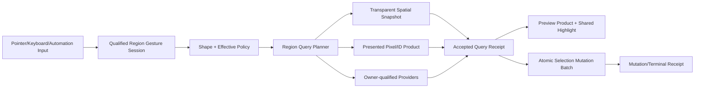

# Editor Scene Viewport Region Selection、Marquee、Box/Lasso、Preview、Query、Mutation、Performance 与 Product Integration 当前源码复核

## 1. 结论

Zircon当前仍有一条可执行但非常窄的框选链：Select/Transform Scene Mode把primary input变成typed effect，press只有在pointer product为Current时才建立`ViewportDragSession::PrimarySelection`；move超过固定4px后把`active`置为true；release调用`selectable_owners_in_rect`，再把结果以Replace、Extend或Toggle提交到active world domain的`SelectionModel`。Pointer Cancel、Scene reset和第二按键覆盖旧drag的问题已有通用防线，这些不能被旧报告忽略。

Region Selection产品本身没有工程化进展。drag session仍只保存`start/current/active/target/mutation`，没有gesture、document、world、viewport、view、frame、pointer/capture或source generation；move只改controller内存，`ViewportFeedback`没有marquee/preview字段，event effect也不会产生RenderChanged或PresentationChanged。当前代码因此既不画框，也不发布候选preview、count、pending/degraded或highlight diff。

release查询仍绕过新的renderer-visible spatial product。`selectable_owners_in_rect`始终遍历`renderable_candidates`和scene gizmo pick shapes，投影为圆/segment后做矩形相交；当renderer-visible snapshot存在时，router只会把`layout.renderables`置空以让点选走新source，但原始`renderable_candidates`仍保留并被Region直接扫描。Region因而没有world/viewport/frame identity、query stats、visibility currentness或stale reject，也不支持Window/Crossing、PresentedPixels/TransparentVolume、strict containment、lasso、subobject/provider或result receipt。

相邻底座有实质增强。Runtime `RenderVisibleSpatialQuerySnapshot`已绑定world、viewport、frame generation和view，支持sphere/ray query；实现会验证finite input、限制索引cell访问、极端有限范围退回visible-entry线性扫描、返回visited/candidate/hit stats，并对结果排序去重，已有10K规模测试。Editor的point-pick source会复用generation-bound projection和owner map，并发布profile counters。Viewport overlay provider registry也已有owner id、capability gate、prepare/install、callback quarantine。这些应成为Region query/provider的父能力，但现有Region一项都没有消费。

选择提交仍不是完整原子手势。Replace和Extend各通过一次`mutate`推进selection revision，Toggle却对每个唯一候选逐项调用`toggle_active`，N个结果会推进N次domain generation与model revision，primary/order也依赖当前renderable/gizmo遍历。没有`RegionSelectionRequest`、`QueryReceipt`、`SelectionMutationBatch`、commit receipt或observer before/after合同。

对tracked Rust/ZUI及当前2,142个untracked Rust/ZUI文件进行精确类型扫描后，`RegionSelectionSession`、`RegionSelectionShape`、`RegionSelectionPolicy`、`RegionSelectionRequest`、`RegionSelectionQueryReceipt`、`RegionSelectionPreview`、`RegionSelectionProvider`、`SelectionMutationBatch`与`SelectionMutationReceipt`均为0命中。这里的0是生产类型缺失证据，不把本文或其他Markdown中的目标设计词计作实现。

本轮不新增P0。Editor73的24项P1当前为 **12 Open / 12 Partial / 0 Closed**，10项P2为 **4 Open / 6 Partial**；48门为 **33 Fail / 15 Partial / 0 Pass**。Partial只表示current pointer gate、world reset/cancel、typed mutation/command、selection revision、overlay provider quarantine或Runtime spatial query可复用，不表示Marquee、Preview、Region Query或Atomic Commit已经成立。

本轮只做review，未修改production Rust/ZUI，未运行Cargo、Editor、GUI/GPU、native input、render golden、plugin reload、fault、100K/1M、soak、profile或同语义跨引擎benchmark。Tooling按用户要求排除；没有查询、轮询、等待或实时跟踪协调器。

## 2. 审查边界与冻结语料

### 2.1 Current working tree

主仓HEAD为`681588f7a1cbfaae3147e8b93e1be6705d810f21`。报告以2026-08-28读取的current working tree为事实源；相关Editor/Runtime源包含其他会话的modified或untracked实现。本轮不回退或修改生产代码。

MVP baseline recovery仍为`in_progress`。Editor05的pointer candidate regeneration、shared extract、world inspection generation和scene-mode input failure记录是本轮currentness与owner划分依据，但不替代Region产品资格。

### 2.2 冻结物理范围

| 范围 | 文件 / 行 / 非空行 / bytes / tests | 本轮证据 | working-tree fingerprint |
|---|---:|---|---|
| Editor/Runtime Region foundation | **38 / 4,929 / 4,452 / 174,023 / 46** | gesture、selection、query、provider、host effect与Runtime spatial | `c8e1a30dd2290af023821c1aea79c26fb7533d3dc5118df7b58b2ebe98ea310b` |
| Focused tests | **6 / 2,903 / 2,596 / 96,479 / 73** | selection、mode、viewport lifecycle、host pointer与editing | `36f4e1a74a413980443087ea24ba0d9f1956586cf62c1467bc81b7882dcd67bc` |
| Zircon deduplicated focused set | **44 / 7,832 / 7,048 / 270,502 / 119** | 上述两组无重复路径 | `53ae9676c2ad8eb018f186a0f0070806c7dbc01a178e96a2b838aa1613ea9700` |
| Unreal selected set | **12 / 2,312 / 1,939 / 78,096 / 0** | legacy/ITF Box、Frustum、Marquee、strict/transparent/provider与transaction | `8782f548e716f980628fb4ce0e7db85c422fd719175b7a2285c15fd671a9cf44` |
| Godot selected set | **6 / 7,049 / 5,908 / 271,225 / 0** | frustum/subgizmo query、3D editor gesture与DynamicBVH | `51025dd70d79a81b77a94f3663b48593db3de1b8699867492a32341fc7080df9` |
| Fyrox selected set | **6 / 3,581 / 3,263 / 130,112 / 0** | selection frame、world bounds、capture和ChangeSelectionCommand | `576cc8a73dd9ecb6dd1b07ffe1252d27e16491622c7b75393d30b64588c0595b` |
| Bevy selected set | **6 / 3,726 / 3,398 / 145,757 / 15** | pointer identity/action、backend hit merge、ray/viewport与cancel lifecycle | `2ef1d84a6084c5fb07fe62e3edf653299eafb2e01520bbff56cf4e16cc71dc82` |
| Unity Graphics selected set | **3 / 4,203 / 3,548 / 192,487 / 0** | SelectionOutline view、include/exclude filter与occlusion-aware culling | `d7604e03d4b3d82890ed158e876842d65ae9c7eff71c040ecd8bc6b70c751604` |

fingerprint按小写规范化相对路径排序，将每个`path + newline + file SHA-256 + newline`聚合后再做SHA-256。Godot、Fyrox、Bevy与Unity Graphics revision分别为`8c7e6c5877a78e8e61ea4fd42673219a9091dca7`、`8d815db36494f1badb347547dfc7094bf4fbbdf8`、`fb89a8649d9b359e53ffb6e5492ebb7c059ac8af`与`a7e4c051d256a781ab362c64316b125a1e104694`；Unreal跟随主workspace。

### 2.3 Owner边界

Editor194只刷新Editor73拥有的qualified Region gesture/session、shape/policy、marquee/preview、query planner/receipt、provider dispatch、preview/commit parity、atomic selection batch、profile/capability和资格。Editor180/59拥有pointer、capture、picking与shared spatial consumer；Editor191/70拥有effective visibility/eligibility；Editor184/63拥有transaction/journal；Editor171/50拥有extension lifecycle；Runtime/Graphics拥有spatial index和renderer facts；Editor193/72拥有per-slot viewport identity。Region模块不得复制这些authority。

## 3. 当前实现拓扑

### 3.1 Press有current gate，session仍没有qualified identity

Scene Mode把LeftPressed映射成`SelectionPrimaryPressed`或`TransformPrimaryPressed`，controller随后调用`route_primary_pressed`。只有pointer product为Current才进入`begin_primary_selection`，Stale会要求render rebuild，Preparing会fail-close。这是可保留进展。

建立的session仍只是五个值：start、current、active、target、mutation。active world domain在SelectionModel里是typed状态，但没有冻结进session；active document、world generation、viewport/session、camera/view、frame generation、pointer/capture和provider generation也全部缺席。

### 3.2 Move不生成产品反馈

PointerMoved只更新current并比较固定`PRIMARY_NAV_THRESHOLD = 4.0`。`ViewportFeedback`只有hovered axis、transform request/node、camera/settings和interaction-stale，不含region状态。`viewport_effects`也只在camera、transform、hover、stale或structural event时invalidates；active selection drag move保持dirty domain idle。当前代码没有任何marquee绘制入口。

### 3.3 Release才同步扫描，且绕过renderer-visible source

release-time helper先归一化min/max，因此拖动方向永久丢失。它对每个renderable candidate建立projection、估算屏幕圆半径并做circle-rect overlap，再扫描gizmo Sphere/Segment/Circle。返回值只有按发现顺序去重的`Vec<u64>`。

新的renderer-visible snapshot只用于point path的`candidates_at`。Region helper直接读router的原始candidate数组，没有snapshot identity、query stats或visible set资格；`RenderVisibleSpatialQuery`本身也只暴露sphere/ray，没有screen rect、convex volume或polygon query。

### 3.4 Reset和Cancel能清drag，但没有terminal receipt

`cancel_interaction`会take drag，handle session还会end；`reset_from_scene`会invalidate extract、清hover/drag并重建pointer router。World replacement因此不再必然把旧drag提交到新world，这是P1-04/P1-24的Partial基础。

但这些路径只返回bool，没有gesture identity、cancel reason、owner-loss disposition或preview cleanup receipt。resize、surface generation、view/source replacement和plugin revoke也没有Region-specific状态机。

### 3.5 SelectionModel只有部分atomic

Replace、Extend把整组输入收集后通过一次`SelectionModel::mutate`推进revision；Toggle先用IndexSet去重，再对每个entity调用`toggle_active`。因此多项Toggle的domain generation和model revision逐项增长。`select_nodes`还会依据最终primary更新orbit target，使结果primary受到candidate traversal顺序影响。

### 3.6 Runtime spatial基础强于Region consumer

Runtime snapshot identity包含world、viewport、frame generation和view，query result包含排序去重entities及visited/candidate/hit stats。spatial implementation有finite validation、static/dynamic index、4,096 cell上限、oversized finite fallback和10K candidate-cost测试。这足以支撑后续transparent volume broad phase，但Region需要新的typed volume/policy/receipt，不能用sphere包住frustum后假装语义等价。

### 3.7 Overlay provider不能直接充当Region provider

Viewport overlay provider registry已有owner/capability/prepare/install/toggle/quarantine，并通过plugin boundary捕获callback failure；Scene Mode也有registry和typed input effect。这些是provider lifecycle底座。

当前provider只输出`SceneGizmoOverlayExtract`，Region helper最终只折叠到NodeId，没有Entity/Component/Subobject target、per-provider query、admission、deadline、generation或commit contract。不能给overlay provider加一个可选闭包就宣布Region extension完成。

## 4. 五引擎参考与适用边界

### 4.1 Unreal

legacy Box/Frustum工具会绘制DPI-aware marquee，区分strict containment与intersection，并在transparent selection时走frustum、否则走viewport hit-proxy rectangle；Editor Mode和Component Visualizer可接管Box/Frustum选择，最终使用selection transaction。ITF进一步把Marquee、Box和Frustum interaction拆成明确对象。Zircon应借鉴shape/policy/provider/transaction边界，不复制legacy全局状态。

### 4.2 Godot

Godot 3D editor构造selection frustum，gizmo/subgizmo提供独立query路径，DynamicBVH提供空间加速。Zircon应借鉴subobject/provider与broad-phase分层，同时补充generation receipt、fault isolation和preview/commit parity。

### 4.3 Fyrox

Fyrox Select Mode在press显示selection frame，move更新位置/宽高，release以projected world bounds求交并通过`ChangeSelectionCommand`提交，Scene Viewer负责mouse capture/release。它证明“有框、有capture、有command”是基础门槛；其同步全扫仍不能作为Zircon性能上限。

### 4.4 Bevy

Bevy Picking定义pointer identity/action、backend hit data与排序/merge，并区分pointer生命周期和viewport/camera ray映射。它不是完整Editor marquee参考，但适合约束多设备identity、backend contribution和cancel terminal semantics。

### 4.5 Unity Graphics

本地Graphics源码把SelectionOutline作为明确的culling view type，并应用include/exclude list、scene/layer mask与occlusion。它只证明selection呈现/可见性必须进入render policy，不能代表完整Unity Editor Region Selection实现。

## 5. 差异矩阵

| 能力 | 当前实现 | 工程目标 | 判定 |
|---|---|---|---|
| Gesture identity | 五字段`PrimarySelection` | qualified id/snapshot/phase/terminal receipt | Open |
| Marquee | 无，move不invalidate | DPI/theme-aware shape product | Open |
| Preview | 无 | candidate diff/count/status + shared highlight | Open |
| Shape/policy | normalized rect + intersection | Rect/Polygon、Window/Crossing、source、target、mutation | Open |
| Query | O(N) proxy/gizmo scan，返回Vec | planner + generation-bound request/receipt | Open |
| Shared spatial | point path已接入，Region绕过 | transparent volume消费Runtime snapshot | Partial foundation |
| Provider | Scene Mode/overlay registry存在 | Region provider/target/fault contract | Partial foundation |
| Currentness | press gate、world reset | press/preview/release/commit two-phase validation | Partial foundation |
| Mutation | Replace/Extend单次，Toggle逐项 | atomic batch + stable primary/order + receipt | Partial foundation |
| Performance | Runtime spatial有索引/统计/10K tests | Region deadline/cancel/backpressure/caps/100K-1M | Partial foundation |
| Accessibility | typed low-level commands | canonical mode/announce/keyboard automation | Partial foundation |

## 6. Findings

### 6.1 P0

本轮不新增P0。Region selection改变的是可逆Editor selection，当前没有证据证明它直接造成持久化数据损坏、权限突破、启动阻断或不可恢复崩溃。错误目标/currentness仍是严重产品问题，按P1保留，不人为抬高severity。

### 6.2 P1

| ID | 状态 | 当前源码证据与需要重构的内容 |
|---|---|---|
| ED73-P1-01 | Open | active drag无marquee，move无Render/Presentation effect。建立Region visual product和coalesced invalidation。 |
| ED73-P1-02 | Open | 拖动中不查询、不发布candidate preview/diff/count/status。由Editor180 highlight owner消费preview。 |
| ED73-P1-03 | Open | session无gesture/document/world/viewport/view/frame/pointer/capture/source identity或phase。替换为qualified state machine。 |
| ED73-P1-04 | Partial | press stale fail-close且`reset_from_scene`清drag；release仍不对view/source/query/selection currentness做two-phase revalidation。 |
| ED73-P1-05 | Open | 固定4px阈值无DPI/device/slop/hysteresis/degenerate policy。引入input profile解析值。 |
| ED73-P1-06 | Partial | Replace/Extend/Toggle是typed enum；仍缺Subtract、target/source/visibility policy与stable disabled reason。 |
| ED73-P1-07 | Open | mutation在press隐式冻结，拖动中modifier变化无合同或视觉。明确press-snapshot或live policy。 |
| ED73-P1-08 | Open | min/max归一化丢drag direction，无Window/Crossing/AutoDirection及视觉cue。 |
| ED73-P1-09 | Open | Region无法选择PresentedPixels或TransparentVolume，也无能力不足时typed degrade/reject。 |
| ED73-P1-10 | Open | shape硬编码start/end rect，无Polygon/Lasso、finite/bounds/simplification/self-intersection schema。 |
| ED73-P1-11 | Partial | Runtime query result已有identity外置、stats和sorted entities；Region仍只返回裸Vec，无request/receipt/error/degradation。 |
| ED73-P1-12 | Open | Region直接扫描retained candidates，完全绕过renderer-visible snapshot。接入Editor180 shared selectable product。 |
| ED73-P1-13 | Partial | Scene Mode typed effect和overlay provider owner/capability/quarantine可复用；无Region provider或subobject target。 |
| ED73-P1-14 | Open | 没有preview，更无preview/commit同source/policy/generation或accepted receipt引用。 |
| ED73-P1-15 | Partial | Replace/Extend一次推进revision；Toggle仍逐entity推进。实现单次`SelectionMutationBatch`。 |
| ED73-P1-16 | Partial | Runtime spatial结果排序去重；Region仍按renderable/gizmo发现顺序决定primary/order。定义stable result/primary policy。 |
| ED73-P1-17 | Partial | SelectionModel有domain generation/model revision并同步Editor selection；没有operation/journal/observer receipt。接入Editor184而不复制history。 |
| ED73-P1-18 | Partial | Runtime索引有cell cap、fallback和10K规模测试；Region release仍同步O(N)、无deadline/cancel/result cap/async。 |
| ED73-P1-19 | Open | 无preview job，因而无move coalescing、latest-wins、backpressure、late result discard或commit barrier。 |
| ED73-P1-20 | Partial | point source复用projection/owner map，Runtime broad phase复用索引；Region仍每次创建IndexSet/Vec并全投影。定义scratch/readback预算。 |
| ED73-P1-21 | Open | 无Region profile、scope、schema/migration/LKG或capability snapshot投影。 |
| ED73-P1-22 | Partial | typed `ViewportCommand`和CancelInteraction可自动化触发低级链；无canonical Region start/update/accept、keyboard/a11y API。 |
| ED73-P1-23 | Partial | point/Runtime query已有visited/candidate/hit与owner-map counters；无Region latency/allocation/stale/truncate/commit telemetry。 |
| ED73-P1-24 | Partial | reset/cancel与overlay provider quarantine存在；无Region owner lease、provider generation、timeout/oversize/revoke和exact terminal receipt。 |

### 6.3 P2

| ID | 状态 | 当前源码证据与需要重构的内容 |
|---|---|---|
| ED73-P2-01 | Partial | 已覆盖cube框选、Extend/Toggle、mode effect和selection order局部路径；完整session/product合同仍无测试。 |
| ED73-P2-02 | Open | 无marquee/preview视觉，自然也没有DPI/theme/golden/screenshot资格。 |
| ED73-P2-03 | Partial | world reset/extract stale已有测试；缺active Region期间open/reload/play/camera/resize/surface/frame rollover矩阵。 |
| ED73-P2-04 | Open | 无Window/Crossing/presented/transparent/strict containment与near-plane/occlusion golden。 |
| ED73-P2-05 | Open | 无Scene Mode/visualizer/subgizmo/provider target组合及revoke/fault测试。 |
| ED73-P2-06 | Partial | selection tests覆盖order/primary/revision和duplicate toggle；未证明1,000对象Toggle单revision及observer atomicity。 |
| ED73-P2-07 | Partial | pointer Cancel、modifier press mapping和第二按键guard已有测试；缺capture loss/release outside/focus/DPI/pen/touch/degenerate矩阵。 |
| ED73-P2-08 | Partial | Runtime sphere/ray有finite validation和规模性质测试；Rect/Frustum/Lasso仍无NaN/Inf/property/fuzz。 |
| ED73-P2-09 | Partial | Runtime spatial已有10K和ignored performance evidence；Region无100K/1M preview/cancel/allocation/soak。 |
| ED73-P2-10 | Open | Region没有query/mutation receipt，无法做schema、诊断、journal correlation或回放测试。 |

## 7. 目标架构

Gesture session冻结document/world/viewport/view/pointer/capture/source/selection generation并经历Armed、Previewing、Querying、Committing和唯一terminal phase。Shape支持Rect/Polygon，Policy包含Window/Crossing/AutoDirection、PresentedPixels/TransparentVolume、Entity/Component/Subobject和Replace/Extend/Subtract/Toggle。

Query planner只选择父owner提供的source。TransparentVolume消费Runtime generation-bound spatial snapshot并用exact convex/polygon narrow phase；PresentedPixels消费renderer picking/ID product；provider贡献必须携owner/generation/capability。任何unsupported、stale、timeout、truncated或degraded都进入typed receipt，禁止静默改语义。

Preview引用accepted query receipt，只发布candidate/diff/count/status，由Editor180 highlight owner呈现。Commit也引用同一receipt；若必须requery，应返回Changed/Stale并要求政策化确认或拒绝。Selection batch一次计算before/after/primary/order，一次推进generation/revision，一次通知observer。

## 8. 分层里程碑

### ED73-M0：Currentness与RED Guards

先补active drag move必须产生visual product、world/view/source变化必须fail-close、multi-toggle只推进一次revision三类RED测试。

### ED73-M1：Identity、Shape与Policy Schema

落地GestureId、session snapshot/phase、Rect/Polygon、Window/Crossing/AutoDirection、source/target/mutation和DPI/device threshold。

### ED73-M2：Marquee与Preview Presentation

接入per-slot surface，发布DPI/theme-aware marquee、mode cue、candidate count/status和shared highlight diff，保证cancel原子清理。

### ED73-M3：Typed Query/Receipt与Shared Product

扩展Runtime/Graphics volume query contract，定义planner/request/receipt/stale/degrade，移除Region retained-candidate旁路。

### ED73-M4：Presented/Transparent与Window/Crossing

实现renderer ID path、transparent convex-volume path、strict containment和direction policy；不支持时显式Unavailable。

### ED73-M5：Provider、Subobject与Lasso

复用extension owner/capability/quarantine，加入Entity/Component/Subobject target、Scene Mode/visualizer/gizmo provider和Polygon simplification。

### ED73-M6：Atomic Selection Mutation

实现Replace/Extend/Subtract/Toggle batch、stable order/primary、single generation/revision、observer before/after与journal correlation。

### ED73-M7：Budget、Async与Backpressure

加入deadline、cancel、result/memory cap、scratch/readback pool、latest-wins、bounded in-flight和commit barrier。

### ED73-M8：Profile、Capability与Product

加入user/project/view scope、schema/migration/LKG、capability/disabled reason、canonical command、keyboard/a11y/automation及Inspector。

### ED73-M9：Fault、Soak与跨引擎资格

完成provider fault/revoke、world/view/surface owner loss、100K/1M、GUI/GPU/native input、HiDPI、soak/profile和同语义benchmark。

## 9. 资格门

| Gate | 当前 | 通过条件 |
|---|---|---|
| ED73-G01 | Fail | Region Selection拥有唯一Editor产品authority |
| ED73-G02 | Fail | 每次gesture有qualified stable identity |
| ED73-G03 | Fail | session绑定document/world/viewport/view/pointer generation |
| ED73-G04 | Partial | cancel/reset有终态基础；仍需完整phase与exactly-once receipt |
| ED73-G05 | Fail | Rect/Polygon shape有finite、bounded、坐标空间合同 |
| ED73-G06 | Fail | threshold按DPI/device profile解析 |
| ED73-G07 | Fail | degenerate region与point selection转换政策明确 |
| ED73-G08 | Partial | mutation在press时typed冻结；仍需显式press/live合同与视觉 |
| ED73-G09 | Fail | active drag有DPI/theme-aware marquee |
| ED73-G10 | Fail | Window/Crossing/AutoDirection有不同视觉cue |
| ED73-G11 | Fail | active move触发coalesced presentation invalidation |
| ED73-G12 | Fail | preview发布candidate set/diff/count/status |
| ED73-G13 | Fail | preview与highlight共享父owner产品 |
| ED73-G14 | Partial | cancel/reset可清drag；仍需preview atomic cleanup和receipt |
| ED73-G15 | Fail | query request携带shape/policy/source/currentness |
| ED73-G16 | Partial | Runtime query有stats；仍需Region generation/error/degradation receipt |
| ED73-G17 | Fail | Region消费共享Selectable Spatial Product |
| ED73-G18 | Partial | press stale和world reset fail-close；release/commit仍无全链currentness |
| ED73-G19 | Fail | Window使用完整包含语义 |
| ED73-G20 | Fail | Crossing使用相交语义 |
| ED73-G21 | Fail | AutoDirection保留drag direction并稳定解析 |
| ED73-G22 | Fail | PresentedPixels由renderer picking/ID product回答 |
| ED73-G23 | Fail | TransparentVolume由generation-qualified spatial query回答 |
| ED73-G24 | Fail | 不支持的source/policy不静默换语义 |
| ED73-G25 | Fail | visibility/eligibility只消费Editor191 effective snapshot |
| ED73-G26 | Fail | Region provider registry有stable owner/type/generation |
| ED73-G27 | Partial | Scene Mode/overlay provider有typed owner基础；尚未走同一Region request |
| ED73-G28 | Fail | target address支持Entity/Component/Subobject |
| ED73-G29 | Partial | overlay provider可quarantine callback fault；Region无timeout/oversize/revoke隔离 |
| ED73-G30 | Fail | lasso与rect共享query/preview/commit产品 |
| ED73-G31 | Fail | preview与commit引用同一accepted query receipt |
| ED73-G32 | Fail | requery导致变化时有明确stale/changed disposition |
| ED73-G33 | Partial | Replace/Extend/Toggle typed；Subtract和完整policy缺失 |
| ED73-G34 | Partial | Replace/Extend单revision；多项Toggle仍逐项推进 |
| ED73-G35 | Fail | observer只看见atomic before/after集合 |
| ED73-G36 | Partial | Runtime query结果稳定排序；Region结果/primary仍依赖遍历 |
| ED73-G37 | Partial | Selection generation/revision存在；仍无typed mutation receipt/journal correlation |
| ED73-G38 | Partial | Runtime spatial有有限query cap/fallback；Region无deadline/cancel/result/memory cap |
| ED73-G39 | Fail | preview latest-wins且in-flight有界 |
| ED73-G40 | Partial | point source复用projection/index；Region无scratch/readback预算 |
| ED73-G41 | Fail | 超限返回typed defer/truncate/reject状态 |
| ED73-G42 | Fail | Region profile有scope/schema/migration/LKG |
| ED73-G43 | Fail | capability snapshot决定可用模式并给disabled reason |
| ED73-G44 | Partial | typed viewport/cancel命令存在；Region无canonical keyboard/a11y/automation API |
| ED73-G45 | Fail | screen reader获得mode/count/status/terminal反馈 |
| ED73-G46 | Partial | point/Runtime counters存在；Region telemetry不完整 |
| ED73-G47 | Fail | 100K/1M、fault/soak/GUI/GPU/native input矩阵通过 |
| ED73-G48 | Fail | 同语义跨引擎benchmark有可复现receipt |

汇总：**33 Fail / 15 Partial / 0 Pass**。Partial不得作为启用Preview、Lasso或PresentedPixels的依据。

## 10. 测试与动态证据矩阵

| 层级 | 当前已有 | 仍缺失 |
|---|---|---|
| Gesture | primary press/move/release、Cancel、mode typed effect | qualified phase、DPI/device、focus/capture/owner-loss terminal |
| Selection | Replace/Extend/Toggle、domain隔离、order/primary/revision | Subtract、atomic multi-toggle、observer before/after、receipt |
| Point query | renderer-visible identity、ray stats、stale fail-close | Region request/volume/source parity |
| Runtime spatial | sphere/ray、finite validation、cell cap、10K tests | convex/polygon/rect query、deadline/cancel/result cap receipt |
| Provider | overlay prepare/install/capability/quarantine | Region target/provider generation、timeout/oversize/revoke |
| Visual | 无 | marquee、preview/highlight、count/status、DPI/theme/a11y golden |
| Product | cube box happy path | Window/Crossing、presented/transparent、lasso、subobject E2E |
| Scale | Runtime局部10K | Region 100K/1M、move frequency、allocation、cancel latency、soak |

## 11. Owner路由与禁止重复实现

| 能力 | 唯一owner | Editor73只负责 |
|---|---|---|
| Pointer/capture/picking/highlight | Editor180 / Editor59 | qualified Region consumer和preview引用 |
| Visibility/eligibility | Editor191 / Editor70 | policy消费，不复制hidden/locked/isolate resolver |
| Transaction/journal | Editor184 / Editor63 | mutation correlation，不复制history |
| Extension lifecycle | Editor171 / Editor50 | Region provider接入ticket/capability/fault |
| Viewport slot identity | Editor193 / Editor72 | session引用slot，不复制layout authority |
| Spatial index/renderer facts | Runtime/Graphics | request/receipt和exact Region query扩展 |
| Region product | Editor73 canonical | gesture、shape/policy、preview、planner、batch与资格 |

禁止把Region实现为：继续给`selectable_owners_in_rect`堆bool；每move同步全扫描；sphere包围frustum冒充strict query；CPU proxy和GPU ID之间静默fallback；preview与release各查一次却无receipt；overlay provider直接返回NodeId数组；Toggle逐项通知observer；用鼠标脚本代替canonical command；用Runtime 10K sphere benchmark宣称Region 1M合格。

## 12. 状态与产出记录

- Canonical owner仍是Editor73；Editor194是current-source refresh，不重复增加canonical finding数量。
- P0：**0项**。
- P1：**12 Open / 12 Partial / 0 Closed**。
- P2：**4 Open / 6 Partial**。
- Gates：**33 Fail / 15 Partial / 0 Pass**。
- 本轮新增review并更新索引/coverage，不改production code。
- 本轮没有运行Cargo、Editor或动态产品矩阵，原因是纯静态review且共享working tree含在途实现。
- Tooling排除；没有查询、轮询、等待或实时跟踪协调器。

## 13. 最终判断

当前Zircon Region Selection本质上仍是“press记录两个点，release同步扫描代理，直接改SelectionModel”的辅助功能。工程底座已经变强，但底座和产品之间没有连接：renderer-visible snapshot有identity/stats/index，Region却绕过；overlay provider有owner/quarantine，Region没有provider；SelectionModel有domain revision，Toggle却逐项提交；Host有event effects，active drag却不invalidates。

正确重构必须先把gesture、shape/policy和receipt变成一等对象，再接共享spatial/renderer/provider产品，之后实现preview和atomic batch，最后加入async budget与资格矩阵。直接添加一个矩形绘制或lasso循环，只会让不可审计的release-time helper看起来更完整，不会解决currentness、语义一致性和规模问题。
