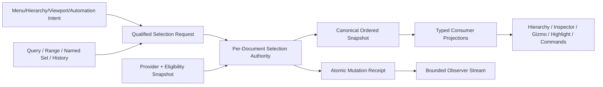

# Editor Scene Selection Authority、Primary-Active、Range、Filter、Named Set、History、Document-World Scope、Lifecycle、Performance 与 Product Integration 当前源码复核

## 1. 结论

Zircon的Selection底座自Editor74后有三项真实进展。第一，`WorldDomain::Play`现在携带`PlayInstanceId`，`SelectionModel`以`BTreeMap<PlayInstanceId, DomainSelection>`隔离多个Play实例，并提供activate/retire；`SelectionDomain::Scene(WorldDomain)`和message inbox也保留Play identity。第二，Selection host event忠实传播`select_node_in_world`返回的changed，`effects_when(changed, ...)`让重复Hierarchy选择不再产生Presentation/Reflection effect，并已有invalidation no-op回归测试。第三，删除命令会在transaction selection中剔除被删subtree，保留survivor并由Undo恢复；generic message bus具备Latest coalescing、gap/resync和有界backpressure测试。

这些变化没有形成唯一Selection Authority。`SceneViewportController`仍拥有可写`SelectionModel`，`CoreEditContext`仍另存`BTreeMap<WorldDomain, SelectionSnapshot>`；命令前把模型复制为`SceneSelection`，命令后再写回模型。controller和`SceneModeCtx`仍暴露`&mut SelectionModel`，Viewport、Mode、startup、Play、transaction与测试可绕开统一admission/observer/journal。`SceneSelection::new`继续接受duplicate、invalid primary与任意order，只有`DomainSelection::replace`做canonicalization。

产品输入仍只有`SelectionCommand::SelectSceneNode { node_id: u64 }`。codec把`UiBindingValue::Unsigned(u64)`通过`as_u32()`解码，合法的`u32::MAX + 1 ..= u64::MAX`仍无法进入Hierarchy/automation选择链。产品没有Subtract、Promote Primary、Select All/None/Invert/Matching、range anchor、typed query、named set、previous/next history、provider target、subobject address、request/admission/receipt、权限lease或diagnostic replay。

consumer仍各自解释选择。Delete与Interactive Transform分别实现自己的top-root归一化；Highlight与Frame读取全集合；Inspector/Edit-mode投影读取primary；Hierarchy把order降为set。Viewport selection mutation没有写入`ViewportFeedback`，Workbench仍只比较primary决定是否`sync_selection_state()`；LeftReleased的结构化effect会掩盖部分secondary-only问题，但直接controller/mode路径仍没有commit-driven consumer更新。

对tracked Rust/ZUI以及扫描时2,208个untracked Rust/ZUI文件做精确类型扫描后，`SceneSelectionAuthority`、`SelectionSessionKey`、`SelectionTargetAddress`、`SelectionRequest`、`SelectionMutationReceipt`、`SelectionQuery`、`NamedSelectionSet`、`SelectionNavigationHistory`与`SelectionProvider`均为0命中。Markdown目标设计不计作实现。

本轮不新增P0。Editor74的24项P1当前为 **12 Open / 11 Partial / 1 Closed**，10项P2为 **2 Open / 6 Partial / 2 Closed**；48门为 **32 Fail / 15 Partial / 1 Pass**。Closed仅确认重复Hierarchy选择不再制造invalidation，以及selection/world domain名称和Play identity已变为明确的嵌套类型；它不代表Selection Authority完成。

本轮只做静态review，不修改production Rust/ZUI，不运行Cargo、Editor、GUI/GPU、native input、save/reopen、plugin reload、fault/soak、100K/1M或同语义跨引擎benchmark。Tooling按用户要求排除；没有查询、轮询、等待或实时跟踪协调器。

## 2. 审查边界与冻结语料

### 2.1 Current working tree

主仓HEAD为`681588f7a1cbfaae3147e8b93e1be6705d810f21`。报告读取2026-08-28 current working tree；`selection_model.rs`、selection tests、message domain和host event等含共享工作树中的在途修改。本报告保存当前事实，不回退、不归属也不提交这些production改动。

MVP baseline recovery仍为`in_progress`。只要实现层F0-F5没有解除，本报告只能作为静态差距账本；实现前必须复算fingerprint并读取父owner终态。

### 2.2 冻结物理范围

| 范围 | 文件 / 行 / 非空行 / bytes / tests | 本轮证据 | working-tree fingerprint |
|---|---:|---|---|
| Selection authority/product foundation | **56 / 10,549 / 9,659 / 368,647 / 45** | model、Play identity、transaction、viewport/mode、binding/event、publication与consumer | `85641cbc89d9124f8302bf3dd8cbc477143692c60602ebed883dfda51037fab8` |
| Focused tests | **17 / 7,418 / 6,715 / 250,817 / 181** | selection、Play、transaction、Hierarchy no-op、message backpressure与automation | `c8c2099a77227ddf61c6313c544d1cd01a5eeae2940c0552b90db0664bd5f56c` |
| Zircon deduplicated focused set | **73 / 17,967 / 16,374 / 619,464 / 226** | 上述两组无重复路径 | `153a657ebfa713b7226660e28d78053c75bad224a5aa8363fc6f2924afad4a27` |
| Unreal selected set | **12 / 7,221 / 6,099 / 259,570 / 0** | Typed Element set/interface、legacy batch bridge、actor/component customization与产品操作 | `c73dbac7963e370c980c209c51dc6a8c28a6b35c46d9030a5969a23e08efc182` |
| Godot selected set | **4 / 11,814 / 10,049 / 433,342 / 0** | central selection、top roots、lifecycle、history与3D policy | `c8945e80e0194168817a59a1fa56500a28888aaaa5141d2079fec22a209b4117` |
| Fyrox selected set | **5 / 3,031 / 2,722 / 101,588 / 0** | per-scene typed selection、command swap、root normalization与interaction | `df17eaa1112d5b184a008f55dfc127fd634bf17620f88f958d086c9125707592` |
| Bevy selected set | **3 / 3,640 / 3,329 / 150,191 / 14** | generational entity、pointer provenance、hover previous/current复用 | `8ac1bd375ed2a35975c7468089e0aee65f53645c34bd38ad6f63b37c079ab2ac` |
| Unity Graphics selected set | **4 / 329 / 257 / 12,257 / 0** | object/selection ID、entity/submesh instance与alpha picking parity | `c71908a43ad928153c19027e82d9a279519cf932111b60a157b658cbb2b3c2c2` |
| 五引擎参考合计 | **28 / 26,035 / 22,456 / 956,948 / 14** | 五组显式路径去重 | `e56137a2bf9b10384bb8f4b2c5971fb571efcc256b5eebc5856f5348f14e1287` |

fingerprint按小写规范化相对路径排序，将每个`path + NUL + file SHA-256 + LF`聚合后再做SHA-256。它是审查输入receipt，不是ABI或build cache key。

### 2.3 Owner边界

Editor195只刷新Editor74拥有的per-document/session Selection Authority、target address、mutation request/receipt、primary/order/range、query、named set、selection navigation、observer与consumer projection合同。Editor181/60拥有Hierarchy gesture/range universe；Editor182/61拥有document/world lifecycle；Editor183/62拥有Inspector multi-selection；Editor184/63拥有transaction/Undo；Editor191/70拥有eligibility；Editor194/73拥有Region query/preview。这里不复制这些owner的finding。

## 3. 当前实现拓扑

```text
Hierarchy / automation
  -> SelectionCommand::SelectSceneNode(u64)
  -> codec as_u32() narrowing
  -> SelectionHostEvent { WorldDomain::Edit, node_id }
  -> EditorState::select_node_in_world
  -> SelectionModel::select_only_active
  -> conditional event effects

Viewport / Scene Mode
  -> SceneModeCtx { &mut SelectionModel }
  -> point or region target Vec<EntityId>
  -> SelectionModel::apply_active(Replace | Extend | Toggle)
  -> ViewportFeedback has no selection commit
  -> Workbench samples primary before/after

Transaction
  -> SelectionModel items/primary
  -> SceneSelection::new + SelectionSnapshot in CoreEditContext
  -> command mutates SceneSelection
  -> sync_selection_from_transaction_snapshot
  -> SelectionModel::replace_active

Publication
  -> SelectionModel revision/items/primary
  -> filter against current Scene
  -> Arc<BTreeSet<EntityId>> + set difference
  -> SceneInspectionSelectionDelta(revision, added, removed)
  -> focused_entity side channel
```

### 3.1 可保留底座

1. `IndexSet`提供去重、membership与稳定插入顺序；`DomainSelection::replace`保证primary在集合内。
2. Edit与每个`PlayInstanceId`拥有独立DomainSelection；unknown Play domain fail-close为empty/false。
3. `SelectionDomain::Scene(WorldDomain)`可在message retention中按Play实例分区。
4. selection mutation返回真实changed，host effects按changed发布；重复Hierarchy选择已有negative regression。
5. Delete command在同一transaction snapshot内prune已删除subtree并支持Undo恢复。
6. `SceneSelection`与`SelectionSnapshot`使用Arc共享transaction payload。
7. scene inspection具备revision gap/resync、Latest delta coalescing和selection snapshot repair入口。
8. Highlight和Frame已经消费完整active selection，不再是单选实现。
9. message bus具备有界inbox、byte budget、latest coalescing与fanout performance evidence。

### 3.2 不能误判为完成

1. 多Play domain不是per-document/session authority；Edit仍只有一个全局slot。
2. `FocusMessage::SelectionChanged`在production selection链没有publisher，不能冒充observer闭环。
3. conditional effects修复的是no-op invalidation，不提供typed receipt、correlation或provenance。
4. transaction Arc只优化snapshot clone；Scene Mode checkpoint与Play session仍深拷贝SelectionModel。
5. scene inspection gap repair仍从第二表示重建BTreeSet，不是authority commit delta。

## 4. 五引擎参考与适用边界

| 参考 | 本地源码可验证事实 | Zircon应采用 | 证据限制 |
|---|---|---|---|
| Unreal | Typed Element提供CanSelect/CanDeselect、Select/Deselect/Set/Clear batch、GetSelectionElement、normalized selection、pre/change通知和replacement；Actor/Component customization处理root/group/parent；legacy Editor提供Select None/Invert/Matching | typed provider、central policy、batch、normalized consumer projection、replacement与产品操作 | 不复制UObject/global singleton或legacy多facade |
| Godot | `EditorSelection`集中多入口选择并维护top selected；节点退出时清理；`EditorSelectionHistory`裁剪forward branch、清invalid ObjectID并previous/next；3D viewport处理owner/group/lock/subgizmo | lifecycle prune、top-root cache、独立navigation history、scene policy | Node特化与中心单例不是多document终态 |
| Fyrox | 每个scene container拥有Selection与CommandStack；Graph/UI/Navmesh等selection可类型化；`ChangeSelectionCommand`用swap统一execute/revert；delete/move计算root nodes | per-scene owner、typed target family、single command path | clone/swap与局部线性算法不证明大规模性能 |
| Bevy | Entity包含generation；picking event携pointer/location/target；HoverMap保留previous/current并复用allocation | generational target、input provenance、persistent observer state | 不包含完整Editor selection产品 |
| Unity Graphics | picking/selection pass输出object ID，DOTS路径携entity/submesh，particle/alpha规则与可见像素一致 | renderer target address与selection visual parity | `dev/Graphics`没有UnityEditor authority/query/history，不外推其产品合同 |

共同点不是更大的集合，而是stable typed identity、统一policy/batch、明确primary/order/normalization、lifecycle reconcile、产品操作和同commit observer。Zircon目前只有集合及若干消费者底座。

## 5. 差异矩阵

| 能力 | 当前Zircon | 工程级目标 | 当前判定 |
|---|---|---|---|
| Authority | Viewport model与Core transaction snapshot均可写 | 每session唯一authority，transaction只引用snapshot/token | Fail |
| Scope | Edit + per-Play instance | document/world/view/tool/epoch qualified session | Partial |
| Address | raw u64 EntityId，binding还收窄u32 | provider/kind/owner/subobject/generation无损地址 | Fail |
| Mutation | Replace/Extend/Toggle/Clear + bool | request/plan/admission/atomic receipt，含Subtract/Promote | Partial |
| No-op | host effect已conditional | 所有入口统一Unchanged receipt且零副作用 | Partial |
| Primary/order | insertion order + primary | Promote、range anchor、order-only/primary-only revision | Partial |
| Normalization | Delete/Transform各自算roots | authority/provider统一typed projections | Fail |
| Observer | inspection delta + focus side channel | 同commit snapshot/delta，scope/reason/order/primary完整 | Partial |
| Lifecycle | delete prune、world clear、Play activate/retire | removal/replacement/reload/provider revoke原子reconcile | Partial |
| Product operations | single-node selection、Frame/Delete | All/None/Invert/Matching/range/history/named set/query | Fail |
| Provider | SceneMode直接取mutable model | owner lease/capability/fault/alias/subobject | Fail |
| Performance | Arc transaction、10K/32K局部tests、bus budget | COW authority、bounded history/query、100K/1M receipts | Partial |

## 6. Findings

### 6.1 P0

本轮不新增P0。正式world/project replacement会清Selection；Delete command也会prune被删节点。仍存在的stale target、binding高位ID拒绝、双authority和consumer分裂是严重P1，但当前没有证明它们通过正式产品路径造成不可恢复数据破坏、权限突破或启动阻断。

### 6.2 P1

| ID | 状态 | 当前源码证据与需要重构的内容 |
|---|---|---|
| ED74-P1-01 | Open | `SelectionModel`与`CoreEditContext`的per-World snapshots仍是双可写authority，bind/sync来回复制。硬切为单一per-session authority。 |
| ED74-P1-02 | Open | mutation仍只有方法参数与bool，没有request/plan/admission/disposition/receipt/expected revision/correlation。 |
| ED74-P1-03 | Open | `SelectionCommand`是u64，但codec仍调用`UiBindingValue::as_u32()`；建立opaque无损target codec。 |
| ED74-P1-04 | Closed | host selection执行已忠实传播changed并用`effects_when`；重复Hierarchy选择negative test证明无Presentation/Layout/Render invalidation。 |
| ED74-P1-05 | Partial | `DomainSelection::replace`已有canonical invariant；`SceneSelection::new`、journal/provider输入仍可携duplicate、invalid primary与任意order。 |
| ED74-P1-06 | Partial | ordered items、primary和generation真实存在；没有PromotePrimary、range anchor、focus/order-only operation或稳定语义合同。 |
| ED74-P1-07 | Partial | Delete和Interactive Transform各自实现top-root逻辑，Highlight/Frame用全集；仍无共享typed consumer projection。 |
| ED74-P1-08 | Partial | inspection delta有revision/added/removed，`SelectionDomain`保留Play identity；production event仍缺document、primary、order、source/reason。 |
| ED74-P1-09 | Partial | Workbench仍只比较primary决定sync；LeftReleased effect和snapshot直读会刷新部分secondary变化，但direct controller/mode路径无commit驱动。 |
| ED74-P1-10 | Partial | Delete transaction会prune并Undo恢复，project/world replacement会clear；任意direct stale ID仍留在model并被snapshot/publication各自过滤。 |
| ED74-P1-11 | Open | Select All/None/Invert/Matching精确产品扫描为0；没有统一eligible universe。 |
| ED74-P1-12 | Open | 没有selection query AST/compiler/index/currentness/deadline/cancel/result cap。 |
| ED74-P1-13 | Open | 没有static/dynamic named set、scope、migration、missing/unknown-provider政策。 |
| ED74-P1-14 | Open | Scene selection没有previous/next navigation history；transaction Undo不能替代selection navigation。 |
| ED74-P1-15 | Open | 没有typed selection provider、customization、alias/group/parent resolution或replacement contract。 |
| ED74-P1-16 | Open | raw EntityId无法表达component、instance、submesh/material slot、bone/socket或provider subobject。 |
| ED74-P1-17 | Open | mutation没有source/provenance/reason/policy snapshot，无法审计gesture、automation、lifecycle或history restore。 |
| ED74-P1-18 | Partial | Scene Mode callback已有panic isolation与overlay invalidation；却仍直接持有`&mut SelectionModel`，没有owner lease、权限或revoke。 |
| ED74-P1-19 | Open | canonical command surface仍只有single-node Replace；Hierarchy modifier/range与其他selection operations没有共享intent。 |
| ED74-P1-20 | Open | 每个mode input checkpoint仍clone整个SelectionModel，且现在会复制所有Play domain集合。改为revision/token/COW rollback。 |
| ED74-P1-21 | Partial | unchanged revision可复用Arc，delta coalescing已用HashSet并有32K evidence；selection变化仍重建BTreeSet并做全量difference。 |
| ED74-P1-22 | Partial | per-Play instance隔离与retire已实现；enter/exit Play仍capture/restore整个SelectionModel并同步clone Edit集合。 |
| ED74-P1-23 | Partial | 有10K Arc/publication、32K coalescing、bus fanout与mode checkpoint counters；没有Selection 100K/1M、high churn、history/query预算。 |
| ED74-P1-24 | Partial | mode checkpoint item count与message bus pressure指标可复用；没有selection request latency/diff/no-op/reject/prune/provider/receipt telemetry或replay。 |

### 6.3 P2

| ID | 状态 | 当前源码证据与需要补齐的验证 |
|---|---|---|
| ED74-P2-01 | Open | 仍无`u32::MAX + 1`、`i64::MAX + 1`、`u64::MAX` binding/event/automation round-trip测试。 |
| ED74-P2-02 | Closed | `repeated_hierarchy_selection_is_an_invalidation_noop`覆盖重复选择不产生Presentation/Layout/Render dirty，执行代码也排除Reflection effect。 |
| ED74-P2-03 | Partial | model覆盖duplicate、primary、order与generation；缺invalid `SceneSelection`、primary-only/order-only与反序列化性质测试。 |
| ED74-P2-04 | Partial | delete/Undo、world replacement、Play instance retirement/restore已有测试；缺provider revoke、reload、late snapshot与multi-document矩阵。 |
| ED74-P2-05 | Partial | inspection delta覆盖gap/resync/coalescing与10K patch；缺同authority primary/order event、slow/reentrant/failing observer测试。 |
| ED74-P2-06 | Open | All/None/Invert/Matching、range、query、named set与selection history产品测试均不存在。 |
| ED74-P2-07 | Partial | Scene Mode有panic isolation；component/subobject/provider alias、reload/revoke/oversize/unknown-provider测试仍不存在。 |
| ED74-P2-08 | Closed | `SelectionDomain::Scene(WorldDomain)`已明确target family与world scope，并有Play instance serialization/partition测试。 |
| ED74-P2-09 | Partial | 10K/32K与bus performance evidence存在；Selection本体仍无100K/1M、mass Toggle、checkpoint、Play clone与retention soak。 |
| ED74-P2-10 | Partial | retained Hierarchy/automation与Play/transaction路径有集成测试；缺keyboard/a11y/save-reopen/multi-document/multi-view/cross-engine receipt。 |

## 7. 目标架构



### 7.1 Qualified session与target address

`SelectionSessionKey`至少绑定DocumentSessionId、WorldDomain/Gateway identity、view/tool scope与epoch。`SelectionTargetAddress`至少包含provider、owner stable address、kind、optional subobject和generation。EntityId只是Scene provider的payload，不是跨document最终身份。

### 7.2 单一authority

每个session只有一个可写authority。外界提交`SelectionRequest { operation, source, expected_revision, policy_snapshot }`；authority先resolve provider和eligibility，再canonicalize/order/primary/range anchor，最后一次commit并产生`SelectionMutationReceipt`。Transaction只保存authority snapshot/token，不维护第二套selection generation。

### 7.3 Provider与projection

Provider按owner lease注册resolve/remap/replacement、CanSelect/CanDeselect、alias/group/parent normalization、display和subobject promotion。authority基于同一revision输出FullOrdered、Primary、TopLevelRoots、TransformRoots、CopyDeleteRoots、RenderableTargets与InspectorTargets，consumer不得自行扫parent链或Scene过滤。

### 7.4 产品能力

Replace/Add/Subtract/Toggle/Clear/Promote、Select All/Invert、Range、typed Query、static/dynamic Named Set和Previous/Next都走同一request。Query绑定schema/provider/index/eligibility revisions并具deadline/cancel/result/memory cap；Named Set定义scope/migration/missing provider；navigation history与Editor63 Undo职责明确分离。

### 7.5 Observer与性能

commit event同时携session、before/after revision、added/removed、primary/order delta、source/reason和receipt correlation。Latest observer可gap-resync到同一immutable snapshot；edge/terminal事件不得丢失。Snapshot、history和named set采用COW/bounded retention；hot input不允许按selection size clone。

## 8. 分层里程碑

### ED74-M0：RED Guards与hard-cut inventory

先锁定高位ID codec、所有裸`selection_mut`生产调用、双authority sync、secondary-only update、multi-toggle revision、mode checkpoint clone与stale selection split-brain。

### ED74-M1：Session、address与canonical snapshot

落地qualified session/target address、canonical ordered snapshot、checked revision/epoch、primary/order/range invariant和旧EntityId adapter。

### ED74-M2：Authority、request与atomic receipt

建立单写authority与typed admission；Replace/Add/Subtract/Toggle/Clear/Promote一次commit、一次revision、一次receipt。硬切Viewport、Hierarchy、automation和transaction入口。

### ED74-M3：Lifecycle、provider与policy

接入document/world/Play lifecycle、node removal/replacement、provider registry/lease/revoke、Editor191 eligibility和fail-close fault policy。

### ED74-M4：Observer与consumer projection

发布同commit snapshot/delta，替换focused side channel和BTreeSet重建；统一Hierarchy、Inspector、Transform、Delete/Copy、Highlight与Frame projection。

### ED74-M5：核心产品操作

交付All/None/Invert/Promote、canonical menu/palette/keymap/automation、availability reason、count/status和keyboard/a11y反馈。

### ED74-M6：Range、query与named set

接入stable ordered universe、query compiler/index/currentness/budget，以及static/dynamic named set schema、scope、migration和unknown-provider保留。

### ED74-M7：Navigation与transaction integration

实现per-document bounded previous/next history，区分selection navigation与Undo，transaction只持authority snapshot/token。

### ED74-M8：Scale、diagnostics与qualification

消除Scene Mode和Play的深clone；加入telemetry/receipt replay、100K/1M/high-churn/fanout/soak、native input/a11y/save-reopen/multi-view及跨引擎同语义基准。

## 9. 资格门

| Gate | 当前 | 通过条件 |
|---|---|---|
| ED74-G01 | Fail | 每个active document/session只有一个可写Selection Authority |
| ED74-G02 | Fail | SelectionModel/SceneSelection不再形成双authority |
| ED74-G03 | Fail | production调用点不能取得裸`&mut SelectionModel` |
| ED74-G04 | Partial | Play instance scope存在；仍需document/view/tool/epoch identity |
| ED74-G05 | Fail | target address无损支持provider/kind/subobject/generation |
| ED74-G06 | Fail | u64边界binding/event/journal round-trip通过 |
| ED74-G07 | Partial | DomainSelection canonical；所有snapshot/provider输入仍需统一validator |
| ED74-G08 | Partial | primary/order存在；range anchor与primary/order-only语义未完成 |
| ED74-G09 | Fail | request携operation/source/policy/expected revision |
| ED74-G10 | Fail | admission返回typed accept/reject/stale/unsupported reason |
| ED74-G11 | Partial | Replace/Extend/Toggle/Clear typed；Subtract/Promote缺失 |
| ED74-G12 | Partial | Replace/Extend单revision；multi-target Toggle仍逐项revision |
| ED74-G13 | Pass | 重复Hierarchy选择不产生changed或Presentation/Reflection invalidation |
| ED74-G14 | Fail | receipt含before/after/diff/primary/reason/correlation |
| ED74-G15 | Fail | stale/late request按session epoch fail-close |
| ED74-G16 | Fail | provider registry有stable owner/type/generation/lease |
| ED74-G17 | Fail | provider定义resolve/remap/alias/group/customization |
| ED74-G18 | Fail | plugin revoke/panic/timeout/oversize在selection authority终态化 |
| ED74-G19 | Fail | eligibility只消费Editor191 revision-qualified snapshot |
| ED74-G20 | Partial | Delete/world replacement有prune/clear；仍需统一remap/reason |
| ED74-G21 | Partial | Play activate/retire存在；document/Play transition仍clone且无session retirement receipt |
| ED74-G22 | Partial | transport有domain/revision；event仍缺primary/order/source/reason |
| ED74-G23 | Partial | inspection gap可resync；snapshot仍来自第二表示 |
| ED74-G24 | Partial | generic bus有bounded/coalescing；authority observer的slow/reentrant/fault合同缺失 |
| ED74-G25 | Fail | secondary-only与primary-only变化都由commit驱动正确consumer |
| ED74-G26 | Fail | scene inspection不再隐式过滤出另一集合 |
| ED74-G27 | Fail | top roots/transform/copy-delete/Inspector/highlight projection统一 |
| ED74-G28 | Fail | parent-child/group/alias normalization只有一个owner |
| ED74-G29 | Fail | Select All/None/Invert使用明确eligible universe |
| ED74-G30 | Fail | Select Matching支持type/component/tag/property/material typed query |
| ED74-G31 | Fail | query绑定schema/provider/index/eligibility revisions |
| ED74-G32 | Fail | query有deadline/cancel/result/memory cap与typed overload |
| ED74-G33 | Fail | range mutation消费stable ordered universe和anchor |
| ED74-G34 | Fail | named set区分static targets与dynamic query |
| ED74-G35 | Fail | named set有scope/schema/migration/missing-provider政策 |
| ED74-G36 | Fail | previous/next history per-document、bounded并清invalid target |
| ED74-G37 | Partial | Editor63 transaction snapshot可复用；navigation与Undo职责尚未产品化 |
| ED74-G38 | Fail | menu/palette/keymap/Hierarchy/viewport/automation共享canonical intent |
| ED74-G39 | Fail | command availability有disabled/rejection reason与count反馈 |
| ED74-G40 | Fail | keyboard和screen reader获得primary/count/change/terminal反馈 |
| ED74-G41 | Fail | mode checkpoint不随selection size深拷贝 |
| ED74-G42 | Fail | publication直接消费commit delta，不做全量BTreeSet重建 |
| ED74-G43 | Partial | transaction snapshot与bus有Arc/bounds；model/history/named set预算未成立 |
| ED74-G44 | Partial | checkpoint/bus指标存在；selection latency/diff/reject/prune/provider指标缺失 |
| ED74-G45 | Fail | receipt可脱敏导出并确定性重放 |
| ED74-G46 | Partial | 10K/32K局部evidence存在；100K/1M与selection全链未通过 |
| ED74-G47 | Partial | delete/world/Play测试存在；reload/provider/fault/soak/save-reopen矩阵缺失 |
| ED74-G48 | Fail | 同语义跨引擎功能、性能与renderer parity receipt可复现 |

汇总：**32 Fail / 15 Partial / 1 Pass**。唯一Pass只关闭no-op invalidation资格，不可用于宣称Selection产品完成。

## 10. 测试与动态证据矩阵

| 层级 | 当前已有 | 仍缺失 |
|---|---|---|
| Model | order/primary/generation、Edit/per-Play隔离、retire、Replace/Extend/Toggle/Clear | high ID、Subtract/Promote、multi-toggle单revision、epoch exhaustion policy |
| No-op | repeated Hierarchy selection invalidation negative test | typed Unchanged receipt、status/inspection/observer zero-work断言 |
| Transaction | Arc snapshot、delete survivor/Undo、multi-node command、per-Play route | single authority token、invalid snapshot、late/stale commit、selection navigation policy |
| Lifecycle | project/world clear、delete prune、Play activate/retire/restore | document switch、reload、provider revoke、target replacement/remap、multi-document |
| Observer | revision delta、gap/resync、coalescing、10K patch、bus pressure | primary/order/source/reason、slow/reentrant/fault subscriber、same-authority snapshot |
| Provider/query | Scene Mode panic isolation | selection provider、subobject、query/range/named set/history、timeout/oversize |
| Scale | 10K Arc/publication、32K coalesce、fanout benchmark、checkpoint counters | 100K/1M selection、mass Toggle、Play clone、history/named set retention、soak |
| Product | Hierarchy/automation single select、Viewport region happy path、Frame/Delete | All/None/Invert/Matching、keyboard/a11y、save-reopen、multi-view、cross-engine receipt |

本轮未执行这些测试；表格只描述当前源码中可见的测试声明与缺口。

## 11. Owner路由与禁止重复实现

| 领域 | 唯一owner | Editor74消费方式 |
|---|---|---|
| Document/world lifecycle | Editor61/182 | session key、retire/migrate trigger |
| Hierarchy order/range gesture | Editor60/181 | stable ordered universe与range input |
| Eligibility/visibility/lock | Editor70/191 | revision-qualified policy snapshot |
| Pointer/Region | Editor59/180、Editor73/194 | source request与accepted target receipt |
| Transaction/Undo | Editor63/184 | snapshot/token与journal correlation |
| Inspector multi-selection | Editor62/183 | typed InspectorTargets projection |
| Extension lifecycle | Editor50/171 | provider owner lease与revoke |
| Renderer selection visual | Runtime/Graphics | generation-qualified render target projection |

禁止在Hierarchy、Viewport、Inspector、Gizmo、Delete或plugin中各建一套selection store/query/history。任何临时Vec/HashSet复制只能是同一authority receipt的局部投影，不能拥有独立revision或写回规则。

## 12. 状态与产出记录

- P0：本轮新增0；父owner阻断不重复登记。
- P1：**12 Open / 11 Partial / 1 Closed**。
- P2：**2 Open / 6 Partial / 2 Closed**。
- Gates：**32 Fail / 15 Partial / 1 Pass**。
- 本轮新增review并更新后续索引/coverage，不改production code。
- 本轮未运行Cargo、Editor或动态产品矩阵，原因是纯静态review且共享working tree含在途实现。
- Tooling排除；没有查询、轮询、等待或实时跟踪协调器。

## 13. 最终判断

当前Zircon selection比Editor74快照更诚实也更稳：多Play identity不再塌成一个域，重复选择不再制造host invalidation，删除/Undo和message backpressure有真实测试。但核心仍是“多个可写集合通过复制保持大致同步”，不是工程级Selection Authority。

正确重构顺序是先冻结qualified session与target address，再建立唯一request/admission/receipt authority，随后硬切所有直写入口与consumer projection，最后交付query/range/named set/history及规模资格。先添加Select All按钮、named set Vec或更多consumer-side过滤，会继续扩大双authority和split-brain成本。
