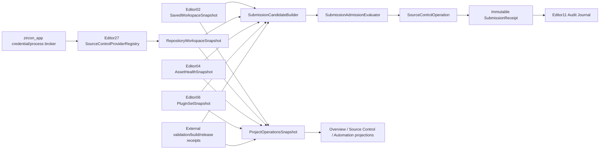

# Editor Project Operations、Source Control、Automation、Submission Gate 与 Health Dashboard 当前源码复核

## 1. 结论

Editor27/85/101的主结论仍成立。当前工作树确实增强了真实Build Export、Plugin Manager、Asset Workspace和authoring automation周边基础，但没有交付Project Operations领域合同。Build Export新增或扩展的是projection cache、overlay generation、终态跳过、容量预分配和队列测试；Plugin Manager新增或扩展的是`Arc<EditorPluginStatusReport>`快照、row projection cache、直接字符串构建、依赖容量测试和debug native artifact watcher。这些改进应保留，却都没有产生repository identity、workspace revision、typed diff、validation receipt、submission candidate或admission receipt。

与此同时，五张位于`extensions/production`的Workbench页面仍作为正式产品入口存在。Source Control固定展示`CL_2048`、18 files、2 conflicts和6 checks，在明确存在冲突时仍返回`Submit queued`；Automation Report固定展示642 tests、7 failures、3 flakes、`Worker_03/09/11`和`Screenshot diff`；Project Overview extension固定展示`NebulaGame`、Healthy、72 percent coverage、7 tasks、3 build jobs，并允许用户直接编辑Owner、Channel和Health。Build Export与Plugin Manager extension也继续显示固定62 percent/CDN或18 installed/3 updates/1 warning，与真实产品形成同名双authority。

当前tracked和untracked production源码精确搜索中，`SourceControlProvider`、`RepositoryIdentity`、`WorkspaceRevision`、`SubmissionCandidate`、`SubmissionAdmissionReceipt`、`ProjectOperationsSnapshot`、`ValidationSet`与`TestAttempt`全部为0命中。Tooling目录中的同名协调器类型不属于产品实现，也按用户要求排除。因此本轮不关闭任何canonical finding：5项P0全Open；60项P1中55 Open、5 Partial；12项P2全Open，总计72 Open、5 Partial、0 Closed。32个验收门仍为30 Fail、1 Partial、1 Pass。

唯一Pass仍是authoring automation通过正常retained-host callback和journal执行，不走direct dispatch旁路；唯一gate Partial仍只是完成旧workspace/binding inventory而尚未硬删除。MVP总计划仍为`in_progress`，本报告只做read-only review与重构规划，不实施高级产品代码，不运行Cargo、Editor、真实repository/provider、worker、artifact store或发布流水线，也不查询、轮询、等待或实时跟踪协调器。

## 2. 当前物理范围与可复算证据

### 2.1 冻结统计

统计口径：递归展开frontmatter中的`related_code`与`tests`，按小写正斜杠路径去重排序；逐文件SHA-256，再以`path + NUL + lowercase hash + LF`计算集合fingerprint。行数使用物理行，test为Rust常见test attribute的静态声明计数，不是测试通过数。

| 范围 | 文件 | 行 | 非空行 | bytes | 静态test | fingerprint |
|---|---:|---:|---:|---:|---:|---|
| Zircon Editor/App/Runtime selected union | 221 | 35,405 | 33,025 | 1,331,235 | 222 | `6186540f5dd4d39930f8b996ebdcbec409df276e7ff18cf561e13a912dc38105` |
| Unreal/Godot/Bevy/Fyrox/Unity Graphics reference set | 28 | 13,483 | 11,652 | 473,967 | 未作为通过数统计 | `2bd863958b76a1d697029ec7e53be63bf87eb481e2d075968dcf67427779e947` |

相比Editor101的195文件聚焦集，当前选择集扩展到221文件。新增文件主要是Build Export、Plugin status/projection与字符串容量/索引优化测试；fingerprint变化不能被解释为Project Operations领域实现，必须结合下述类型、数据流和caller证据判断。

### 2.2 五张假产品仍可达

| Surface | 固定业务事实 | 当前command结果 | 实际authority |
|---|---|---|---|
| Source Control | `CL_2048`、固定文件/owner、18 files、2 conflicts、6 checks | Validate/Submit返回固定queued文本 | 无provider、revision、diff、changelist或receipt |
| Automation Report | 642 tests、7 failed、3 flakes、三个Worker字符串、Screenshot diff | Validate/Publish返回固定queued文本 | 不消费commandlet或外部ValidationSet |
| Project Overview extension | `NebulaGame`、Healthy、72 percent、7 tasks、3 jobs | Refresh/Publish固定文本，Health可编辑 | 不消费真实Project Overview/Build/Plugin结果 |
| Build Export extension | Win64 Shipping、Cook 62 percent、Publish CDN Pending | Validate/Package固定文本 | 与真实export queue完全平行 |
| Plugin Manager extension | Audio Runtime、18 installed、3 updates、1 warning | Hot Reload/Validate固定文本 | 与真实plugin report/live host完全平行 |

五张ZUI分别为233、234、233、233、233行，每张仍声明19条route。总索引直接import并实例化五个workspace host；Assets Workspace提供同名open入口；`data_production.rs`映射固定command/row反馈；navigation spec映射固定tab/row/command/field；template binding把它们安装进retained host；`module_field_edit.rs`只把输入写回control的`value`与`value_text`并刷新surface。整个链没有调用document transaction、command descriptor、job admission、repository authority、result store或journal receipt。

### 2.3 真实基础的当前边界

1. `ProjectOverviewSnapshot`仍只有8个字段：project name/root、assets/cache root、default scene、catalog revision、folder/asset count。它是真实投影，但没有document、source、plugin、validation、build、release section，也没有owner/generation/freshness。
2. `AssetWorkspaceState`新增或强化incremental patch、resource sequence、projection generation和item cache；这改善Editor04规模行为，却没有把import/reference failure或source revision投影进Operations snapshot。
3. Build Export有真实target、wizard session、job ID、Queued/Running/CancelRequested、progress、terminal summary和output diagnostics。当前新增cache revision、overlay generation、terminal skip与容量测试值得保留；但summary没有source revision、toolchain/environment identity、artifact manifest/hash、signing/promotion receipt或Operations aggregation。
4. Plugin Manager有真实`EditorPluginStatusReport`、project/native status、optional feature dependency、target mode、packaging和live-host action。当前`Arc`发布快照、projection cache及debug artifact watcher改善读取和开发热更；但status report仍没有plugin-set generation/currentness，live outcome没有operation ID/deadline/cancel/journal correlation，且这些事实未进入Operations snapshot。
5. `AuthoringAutomationCommandletRequest`仍只携project root与automation path；JSON request仍只携bindings。report已有project/manifest/scene identity、inspection generation、event records和最终scene snapshot，因此P1-28保持Partial；但没有schema version、attempt ID、source/build/environment identity、deadline/cancel、deterministic seed/clock、per-binding duration或artifact manifest。
6. `ProjectManifest`现在包含project GUID、format/engine version、scene/UI/asset roots、settings、asset manifest、library version、plugins、scripts和export profiles。它仍没有repository/workspace或submission policy，这是正确边界的一部分：credential绝不能塞入Runtime manifest；非敏感provider配置应属于Editor project session，secret lease应由`zircon_app`安全broker提供。
7. Editor编号实施计划当前只有00至17，没有独立Project Operations实现owner。Editor12/15/16的plugin/export/commandlet failure与计划只覆盖底层能力，不能被计作Editor27的VCS、Validation consumption或Submission transaction交付。

## 3. 参考引擎对照

### 3.1 Unreal：必须分离provider、state、operation与submission

- `ISourceControlProvider`区分初始化、availability/status、state cache、branch state、changelist查询、同步/异步`Execute`、completion delegate、`CanCancelOperation`与`CancelOperation`。Zircon需要provider-neutral SPI与capability negotiation，不能直接包装`git status`文本。
- `ISourceControlState`独立表达history、timestamp、controlled/added/deleted/modified/conflicted、checkout owner与other-branch状态；`ISourceControlOperation`持有操作identity、进行中文案与结构化result info；`ISourceControlChangelistState`持有description、file states和changelist identity。
- Automation Controller区分worker discovery、cluster/device、enabled test tree、run/stop/tick、per-pass result、duration与export。固定`Worker_03`和总数无法替代attempt/result authority。
- SubmitTool又把changelist service、preflight request/fetch、preflight state/outcome/step result分离。这说明Source submit不是一个按钮直接调用provider，而是candidate、policy evaluation、preflight evidence和最终provider mutation的复合事务。

### 3.2 Godot：可用Editor VCS的最低产品面

Godot的`EditorVCSInterface`和`VersionControlEditorPlugin`至少提供modified file data、stage/unstage、diff、discard确认、commit/amend、history、branch、remote、pull/push/fetch，以及staged/unstaged tree和split/unified diff UI。Zircon未来还要增加大型团队所需的capability、checkout/lock/changelist、binary/semantic asset diff、generation、budget和receipt，但当前连这个下限都没有达到。

### 3.3 Bevy、Fyrox与Unity Graphics：只作为边界参考

- Bevy `AssetSourceBuilder`分离reader/writer/watcher和processed source，并显式处理watch缺失；它可指导source watcher与resync，不是VCS provider。
- Fyrox提供build profile、command queue与child process工作流，可对照Build Export进程边界，不提供Project Operations submission authority。
- Unity Graphics Yamato job显式声明agent、commands、timeout、dependency与artifacts；`AsyncBuildReportJob`和`ShaderBuildReport`区分异步job与可序列化compile/performance evidence。这些可指导外部receipt消费，不授权Editor复制Tooling runner。

## 4. 目标架构与唯一owner

必须先定义的最小合同：

- `SourceControlProviderRegistration`：provider ID、contract version、capabilities、config schema、owner lease、operation factory；capability显式区分staging、changelist、checkout、lock、shelve、history、remote sync和partial workspace。
- `RepositoryIdentity`与`WorkspaceRevision`：provider/repository/workspace/root/case policy，以及base/head/local change set、observed time和generation。branch、mtime或project name都不能单独充当revision。
- `SourceControlFileState`与`TypedDiff`：qualified path、change kind、staged area、checkout/lock owner、base revision、content hash、conflict、generation；text/binary/asset/too-large/unavailable必须分型并带budget/truncation。
- `SourceControlOperationRequest/Receipt`：operation ID、actor、workspace、expected revision、scope、deadline、cancel token、progress、terminal outcome、retryability、provider diagnostics和journal correlation。
- `ProjectOperationsSnapshot`：document/source/asset/plugin/validation/build/job/release section；每节携owner、generation、source revision、produced/expires time、availability与freshness。Health只能由versioned policy只读派生。
- `SubmissionCandidate`：冻结saved document generation、workspace change set、asset/plugin revision、required ValidationSet、BuildArtifactSet和policy digest；任何输入变化都使candidate Stale。
- `SubmissionAdmissionReceipt`与`SubmissionReceipt`：逐项decision/evidence/override approval/expected revision，以及最终revision、included paths、provider receipt、actor、timestamps和evidence digest。
- `AuthoringAutomationAttemptAdapter`：把现有retained-host records/snapshot包装进外部attempt schema，不把现有commandlet JSON改名成第二套全局TestResult。

## 5. P0当前重判

| ID | 状态 | 当前证据与必须动作 |
|---|---|---|
| P0-1 Source Control无provider却公开Validate/Submit | Open | `CL_2048`与2 conflicts仍产生queued反馈；无provider时必须Unavailable并禁用危险命令。 |
| P0-2 Automation Report伪造worker/test/failure/flake/artifact | Open | 642/7/3、Worker与Screenshot diff仍为静态文本；删除完成式事实，只消费immutable attempt/result。 |
| P0-3 Project Overview伪造可编辑health/build/coverage/release | Open | Healthy/72 percent/7 tasks/3 jobs仍存在，Health/Channel仍可编辑；derived health必须只读。 |
| P0-4 五张production workspace形成重复第二Authority | Open | 总索引、Assets入口、100个binding和fixed feedback仍存在；先inventory，再硬切到唯一真实owner。 |
| P0-5 无source-bound、document-bound提交事务 | Open | Candidate/Admission/SubmissionReceipt精确类型与caller均为0；任一证据unknown/stale时必须fail closed。 |

## 6. P1当前重判

### 6.1 Source Control Provider、Workspace、Diff与Changelist

| ID | 状态 | 当前差距 |
|---|---|---|
| P1-1 provider registry/capability negotiation | Open | 无registration、contract version、capability或owner lease。 |
| P1-2 repository/workspace identity | Open | 无provider/repository/workspace/root/case identity。 |
| P1-3 generation-qualified file state | Open | 文件row为固定字符串，无observed generation。 |
| P1-4 async operation lifecycle | Open | 无operation ID、progress、completion、cancel acknowledgement。 |
| P1-5 revision/history/content contract | Open | 无revision object、history query与内容读取预算。 |
| P1-6 typed diff | Open | 无file/hunk/line/binary/asset/too-large模型。 |
| P1-7 rename/copy/submodule/case-only | Open | change kind闭集不存在。 |
| P1-8 changelist/staging abstraction | Open | `CL_2048`只是UI标签，未绑定paths或provider state。 |
| P1-9 checkout/lock/ownership | Open | Alice/Bob/Chen是fixture，不是principal或lease。 |
| P1-10 conflict/resolve state machine | Open | 2 conflicts没有base/ours/theirs/result hash与resolve receipt。 |
| P1-11 asset-aware diff/reference impact | Open | 未接Editor04 schema/reference graph。 |
| P1-12 watcher/provider refresh coordination | Open | plugin artifact watcher不是repository watcher；无cursor/gap/resync。 |
| P1-13 large repository budget | Open | 无pagination、bytes/time/paths budget与100K fixture。 |
| P1-14 credential/secret boundary | Open | 无App credential broker、scope、lease与redaction测试。 |
| P1-15 provider conformance suite | Open | 无fake/real adapter共享offline/auth/race/cancel/large-diff测试。 |

### 6.2 Automation Control Plane与结果消费

| ID | 状态 | 当前差距 |
|---|---|---|
| P1-16 Automation UI消费canonical test plan | Open | fake pane不读取外部plan/result receipt。 |
| P1-17 immutable TestAttempt identity | Open | commandlet无attempt ID、source/build/environment identity。 |
| P1-18 worker discovery/capability/lease | Open | Worker_03/09/11均为固定文本。 |
| P1-19 run/stop/cancel/pause状态机 | Open | Validate/Publish只返回queued字符串。 |
| P1-20 deadline/heartbeat/lost worker/late result | Open | request无deadline/cancel，产品无heartbeat或唯一终态。 |
| P1-21 typed case result/event severity | Open | 无case tree与Pass/Skip/Timeout/Crash/Infrastructure Error分离。 |
| P1-22 artifact manifest与安全导航 | Open | Screenshot diff无hash/size/MIME/producer/retention/redaction。 |
| P1-23 visual regression语义 | Open | 无baseline/candidate/diff/environment/tolerance。 |
| P1-24 flake/quarantine治理 | Open | 3 flakes是固定数字，无attempt history、owner与expiry。 |
| P1-25 coverage provenance | Open | 72 percent无instrumented build/source/metric/merge completeness。 |
| P1-26 result currentness/supersession | Open | 无source revision与superseded-by关系。 |
| P1-27 authoring request版本和资源预算 | Open | 只有bindings非空校验，无schema/bytes/steps/deadline/cancel/seed。 |
| P1-28 authoring report attempt provenance | Partial | 已有project/manifest/scene identity、inspection generation、records和snapshot；仍缺attempt/source/build/env/time/artifact。 |
| P1-29 query/pagination/incremental update | Open | pane数据固定，无result store cursor/page/delta。 |
| P1-30 publication/export receipt | Open | commandlet stdout JSON不是qualified publication receipt。 |

### 6.3 Project Operations Snapshot与Health

| ID | 状态 | 当前差距 |
|---|---|---|
| P1-31 canonical ProjectOperationsSnapshot | Open | 只有8字段`ProjectOverviewSnapshot`。 |
| P1-32 project/source identity关联 | Open | project GUID存在但无repository/workspace/source revision。 |
| P1-33 per-section provenance/freshness | Open | 无owner、produced/expires、availability或stale reason。 |
| P1-34 versioned health policy | Open | Healthy仍是可编辑fixture。 |
| P1-35 document/save projection | Open | 未消费Editor02 dirty/save/conflict/recovery generation。 |
| P1-36 asset/catalog/import projection | Partial | 真实catalog revision、folder/asset count和增量cache存在；无import failure/readiness/provenance。 |
| P1-37 plugin set/reload projection | Partial | 真实Plugin status/report/live host存在；无set generation/currentness与Operations聚合。 |
| P1-38 build/cook/package/sign projection | Partial | 真实Export job/progress/cancel/summary存在；无source-bound artifact set/signing receipt与聚合。 |
| P1-39 test/validation projection | Open | fake 642 tests未消费receipt。 |
| P1-40 job/operation projection | Partial | Export queue与通用Editor job底座存在；无统一Operations section/correlation。 |
| P1-41 release/channel projection | Open | Channel是control-local字段，无policy/permission/receipt。 |
| P1-42 snapshot consistency/delta protocol | Open | 无section generation vector、mixed-generation、gap或resync。 |

### 6.4 Submission Candidate、Admission与Receipt

| ID | 状态 | 当前差距 |
|---|---|---|
| P1-43 saved workspace precondition | Open | 无save barrier/candidate input。 |
| P1-44 source change-set freeze | Open | 无workspace revision/path set/content hash freeze。 |
| P1-45 required ValidationSet解析 | Open | 无policy到required receipt解析。 |
| P1-46 build artifact/test result绑定 | Open | 无共同source/build/toolchain identity。 |
| P1-47 preflight admission evaluator | Open | Validate不是纯函数decision，只是fixed feedback。 |
| P1-48 race-safe expected revision | Open | 无compare-and-submit或stale rejection。 |
| P1-49 composite order/compensation | Open | Save/Refresh/Validate/Build/Submit无operation graph。 |
| P1-50 override/approval/permission audit | Open | 无principal、approval或policy exception receipt。 |
| P1-51 immutable submit/publish receipt | Open | 无final revision、included paths、evidence digest。 |
| P1-52 crash/restart/idempotency | Open | 无operation journal、idempotency key或recovery query。 |

### 6.5 产品集成、质量与治理

| ID | 状态 | 当前差距 |
|---|---|---|
| P1-53 unique navigation/authority convergence | Open | 同名fake与真实Project/Build/Plugin产品并存。 |
| P1-54 typed command registry integration | Open | 100个preview binding未接Editor08 descriptor/capability。 |
| P1-55 notification/diagnostic correlation | Open | fixed output无operation/journal/diagnostic ID。 |
| P1-56 offline/partial/degraded UX | Open | 无Unavailable/Unknown/Stale/AuthExpired区分。 |
| P1-57 accessibility/keyboard diff workflow | Open | 无真实diff tree、focus model与危险scope确认。 |
| P1-58 redaction/minimum exposure | Open | 无credential/log/artifact redaction contract。 |
| P1-59 end-to-end fault/performance qualification | Open | 无repository/worker/artifact/provider fault fixture与规模门。 |
| P1-60 fixture/schema migration/delete gate | Open | fixed workspace仍有产品引用，无zero-reference hard cutover test。 |

## 7. P2当前重判

| ID | 状态 | 当前差距 |
|---|---|---|
| P2-1 multi-provider/mixed workspace | Open | 无单provider合同，更无组合。 |
| P2-2 branch/stream/worktree management | Open | 无workspace identity与switch transaction。 |
| P2-3 sparse/partial clone、LFS、大二进制 | Open | 无capability与storage/bandwidth预算。 |
| P2-4 semantic merge/binary conflict tool | Open | 无typed conflict或asset merge extension。 |
| P2-5 code review/change request link | Open | 无review provider identity。 |
| P2-6 distributed worker/capacity scheduling | Open | 无worker authority。 |
| P2-7 validation/health trend | Open | 无immutable history与metric schema。 |
| P2-8 configurable operations view | Open | fake fields不是versioned layout/query。 |
| P2-9 notification/subscription/external integration | Open | 无subscription policy或delivery receipt。 |
| P2-10 automation recording/maintainable scripts | Open | binding JSON可执行但无recording、locator migration或schema tooling。 |
| P2-11 team ownership/policy metadata | Open | Alice/Bob/Chen和Owner字段是fixture。 |
| P2-12 cross-engine compatibility/migration | Open | 无provider/test/result import contract。 |

## 8. 分层重构里程碑

| Milestone | 交付内容 | 退出条件 |
|---|---|---|
| M0 Truthfulness与owner冻结 | 禁用五张workspace危险命令或移出产品索引；冻结18文件/100 binding inventory；删除固定成功反馈。 | G01-G03通过；无provider/result时只能Unavailable。 |
| M1 Source Control核心合同 | provider registry、capability、repository/workspace identity、file state、operation、fake provider与conformance suite。 | G04-G08通过。 |
| M2 真实adapter与Diff产品 | 至少一个真实adapter、credential broker、watch refresh、typed diff/history/stage/changelist/checkout/lock/resolve。 | G05-G11通过；100K fixture达预算。 |
| M3 Validation result消费 | 定义外部receipt adapter、attempt/currentness/artifact projection；authoring automation包装为一个case adapter。 | G12-G18通过；不创建第二结果schema。 |
| M4 ProjectOperationsSnapshot | 聚合document/source/asset/plugin/validation/build/job/release，带provenance/freshness和versioned health。 | G19-G23通过。 |
| M5 Candidate与纯Preflight | 冻结全部identity，解析required evidence，实现纯admission evaluator。 | G24-G25通过；任何输入变化自动失效。 |
| M6 Submit/Publish复合事务 | operation graph、expected revision、override approval、idempotency、compensation、immutable receipt。 | G26-G28通过。 |
| M7 产品硬切 | 删除旧workspace、100个旧binding、route与fixed feedback，导航到唯一真实pane。 | G01-G02/G22通过；旧ID零产品引用。 |
| M8 安全、恢复、可访问性与规模 | credential/redaction、offline/auth degraded、keyboard/screen reader、large repo、crash resume、fault/soak/profile。 | G29-G32通过。 |
| M9 高级团队能力 | multi-provider、stream/worktree、LFS、semantic merge、review、trend、distributed workers。 | P2按独立架构计划资格化。 |

M0-M8必须按依赖顺序推进。禁止先做趋势图、多provider或视觉Dashboard，同时保留fixed authority；M0-M2是Source Control真实性门，M3-M6完成后才能恢复Validate/Submit/Publish完成语义。

## 9. 32个验收门当前状态

| Gate | 状态 | 当前判定 |
|---|---|---|
| G01 fixed业务事实清零 | Fail | 五张ZUI与feedback仍存在。 |
| G02 旧workspace/binding完整inventory并零产品引用 | Partial | 已识别18文件/100 binding范围；删除与零引用未完成。 |
| G03 无provider时Unavailable且危险命令禁用 | Fail | 冲突存在时仍返回queued。 |
| G04 fake与真实adapter同一conformance suite | Fail | 无合同/adapter。 |
| G05 repository/workspace/revision identity稳定 | Fail | 类型缺失。 |
| G06 100K status refresh预算/取消/新旧generation | Fail | 无repository refresh链。 |
| G07 typed text/binary/asset diff | Fail | 无diff模型。 |
| G08 capability-driven stage/changelist/checkout/lock | Fail | 无capability。 |
| G09 remote head/expected revision竞态原子拒绝 | Fail | 无candidate/expected revision。 |
| G10 conflict resolve保留base/ours/theirs/result | Fail | 无state machine。 |
| G11 credential零泄漏 | Fail | 无broker与测试。 |
| G12 Automation只消费canonical attempt identity | Fail | fixed report仍存在。 |
| G13 run/stop/cancel在lost/timeout/late result下唯一终态 | Fail | 无attempt lifecycle。 |
| G14 visual artifact可导航且环境/tolerance完整 | Fail | Screenshot diff只是文本。 |
| G15 flake retry保留所有attempt/quarantine policy | Fail | 无结果模型。 |
| G16 coverage绑定instrumented build/source/metric | Fail | 72 percent固定。 |
| G17 authoring automation走retained-host callback/journal | Pass | 实现与静态测试继续禁止direct dispatch旁路。 |
| G18 authoring request有schema/bytes/deadline/cancel预算 | Fail | 只有bindings非空校验。 |
| G19 Overview section均有owner/provenance/freshness | Fail | 8字段snapshot无元数据。 |
| G20 Health由versioned policy只读派生 | Fail | Health可编辑。 |
| G21 dirty/autosave/conflict/recovery进入candidate policy | Fail | 无candidate。 |
| G22 section可导航到唯一owner与原始receipt | Fail | 同名fake/real并存。 |
| G23 mixed generation与gap resync | Fail | 无section generation vector。 |
| G24 candidate冻结全部identity且变化失效 | Fail | 类型缺失。 |
| G25 validation missing/failed/stale/revision mismatch拒绝 | Fail | 无ValidationSet。 |
| G26 复合故障不产生半真Healthy/Published | Fail | 无operation graph。 |
| G27 crash/restart按idempotency恢复且不重复提交 | Fail | 无journal/key。 |
| G28 immutable receipt可追溯revision/paths/evidence/actor | Fail | 无receipt。 |
| G29 Revert/Discard/Resolve/Submit/Publish scope与a11y确认 | Fail | 无真实命令。 |
| G30 offline/auth/provider degraded状态分离 | Fail | 无availability model。 |
| G31 Windows优先repository/worker/artifact/policy动态fixture | Fail | 产品链不存在，本轮未运行。 |
| G32 watch/result/snapshot/journal有界soak | Fail | 无可运行端到端链。 |

## 10. 禁止的临时修补

1. 禁止把`git status`、`git diff`或`p4 opened`文本解析直接塞进pane并称为provider architecture。
2. 禁止在核心合同写死Git index/branch/commit或Perforce depot/changelist；差异必须进入adapter capability。
3. 禁止继续用control `value_text`保存changelist、owner、gate、health、channel或test selection业务状态。
4. 禁止在conflict、unknown、stale、missing evidence时弹warning后继续Submit/Publish。
5. 禁止把authoring automation现有JSON envelope改名为全局TestResult。
6. 禁止用retry后的Pass覆盖首次Failure，或直接修改flake/coverage数字。
7. 禁止删除真实内置Project Overview而保留`NebulaGame` extension。
8. 禁止Dashboard复制Plugin/Build/Asset mutable state并成为第二writer。
9. 禁止把source revision简化为branch、时间戳、目录mtime或project name。
10. 禁止把credential/token/ticket/remote secret写入project manifest、journal、notification、artifact或clipboard。
11. 禁止为通过自动化绕过retained-host callback、document transaction、job authority或provider receipt。
12. 禁止长期双轨；M7后旧workspace、route、binding、feedback和fixture必须零引用硬删除。
13. 禁止因Tooling暂时排除就在Editor内复制test runner、build pipeline或release publisher。
14. 禁止把Build Export缓存、Plugin watcher或字符串容量优化宣称为Source Control/Submission产品完成。
15. 禁止在M0-M6未通过前声称达到或超过Unreal同类工程能力。

## 11. 本轮验证与产出边界

本轮逐文件复核了五张production ZUI、总索引与Assets入口、navigation/field/feedback/template binding、真实Project Overview和Asset Workspace、Build Export action/queue/wizard/projection、Plugin report/action/projection/live host、commandlet/retained-host/App automation、ProjectManifest，以及28个Unreal/Godot/Bevy/Fyrox/Unity Graphics参考文件。tracked与untracked production精确类型搜索均完成。

本轮只修改review、索引与coverage文档。没有修改production Rust/ZUI/test，没有运行Cargo、Editor窗口、真实repository、provider login、diff/stage/resolve/submit、worker、artifact store、build/sign/release、故障注入、规模测试或soak。实施前必须重取HEAD、working-tree diff、selected fingerprint和动态结果，并先建立独立Editor27编号实施计划；不得用Editor12/15/16的局部计划冒充Project Operations owner。
