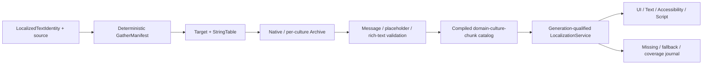

# Editor210 · Localization / String Table / Culture / Translation / Fallback / Pseudo / Preview 当前源码复核

## 1. 结论

Editor154之后出现了五项真实但局部的进展。Editor shell的`en/zh-CN`内嵌bundle由各74个增长到各79个key，当前key集合完全对齐、无空值，唯一带参数的message在两种语言中均保留`pending_count/payload_bytes/oldest_age_secs`三个参数。composition root现在确实安装`EditorMessageI18nEventSink`，并向`EditorTopic::i18n()`发布locale-changed/resync schema。插件SettingsPage已在当前源码静态硬切到schema V2、typed bundle/key/category key与owner校验。Runtime text使用`icu_locale_core::Locale`规范化language/script/region，SDF atlas key也包含规范化language identity。`TextLayoutError`新增稳定diagnostic code/message key。以上底座都应保留。

这些进展没有形成工程级Localization产品。Runtime仍无`LocalizationService`、公共`LocalizedTextIdentity`、culture snapshot、translation value catalog、fallback DAG、compiled message formatter、script API和catalog generation发布。`ResourceKind`、`ImportedAsset`、project manifest及两个App config仍没有String Table、Localization Target、Translation Archive、native/supported cultures、cultures-to-cook或domain loading policy。Runtime83仍是Runtime owner；Editor210不复制其finding，只记录Editor消费端与跨owner断路。

最高风险的truthfulness断点仍存在：component String schema遇到`{ text_key = ... }`时仍制造空`UiValue::String`通过类型验证，compiled attribute保留TOML table，而renderer与Accessibility只读取scalar string。`UiLocalizationTableCatalog`仅保存`locale -> table -> key set/source URI`，没有translation value、generation、owner或fallback。`localization_dependencies`只写入UI package manifest，没有production loader/cook/runtime consumer。

产品语料仍未迁移。按与Editor154相同的范围扫描`zircon_editor/assets/ui`和`zircon_plugins`中472个`.zui/.toml`文件，`text_key`命中为0。UI Asset Locale Preview仍固定`authoring-fallback/en-US/zh-CN`，unknown locale静默归一到authoring fallback；`compile_preview(document, preview_size, imports)`没有culture/catalog/service参数；production没有locale table注册链。当前测试只证明缺表/缺键诊断，不证明翻译值进入画布、layout、shaping、glyph、direction或Accessibility。

因此canonical状态保持：**P0 4 Open / 1 Partial；P1 44 Open / 16 Partial / 0 Closed；P2 12 Open；Gate 25 Fail / 7 Partial / 0 Pass**。目标链仍是`LocalizedTextIdentity -> GatherManifest -> Target/StringTable -> native/per-culture Archive -> validation -> compiled domain/culture/chunk catalog -> generation-qualified RuntimeLocalizationService -> UI/Text/A11y/Script`。

## 2. 当前物理范围与证据等级

| 范围 | 文件 / 行 / 非空行 / bytes / tests / ignored | working-tree指纹与说明 |
|---|---:|---|
| Zircon selected source/contracts | **68 / 12,936 / 11,652 / 450,742 / 78 / 3** | Interface/UI/asset/project/text、Editor i18n/context/settings/plugin/notification/command/preview及App config；`4f2e16956900fff7a063133dd1dce437a49a6dc60b0f75ea4f3fbbf479260359` |
| Product UI corpus | **472 / 53,032 / 46,142 / 3,040,850 / 0 / 0** | `zircon_editor/assets/ui`与`zircon_plugins`的`.zui/.toml`完整语料；`text_key`为0；`904c2d8b7c1ff17217a90056ee8764008f43cdcc47e9a5642c90d304590720a8` |
| Zircon selected union | **540 / 65,968 / 57,794 / 3,491,592 / 78 / 3** | 上述两组去重并集；`3f4f99abafafe4314c21083b899627359082a9d8011940c0614196a50c77af28` |
| Reference source | **21 / 3,436 / 2,775 / 144,341 / 0 / 0** | Unreal/Godot/Fyrox/Bevy/Unity Graphics选定接口与编辑器工作流；`150adcc93b1bd2099f3066967f4b02348328de0a4228985b652efb6acd960def` |

指纹算法为按规范化相对路径排序后，对每个`path<TAB>file_sha256<LF>`再做SHA-256。取证与写入基线HEAD均为`a2d8d811c4a3a1fc1db6f5375c491e7e4502533f`；取证时共享工作树`git status --short --untracked-files=all`为11,597项，因此后续实施必须以磁盘当前文件重新取证，不能把HEAD当成全部源码快照。

参考版本中Godot为`8c7e6c5877a78e8e61ea4fd42673219a9091dca7`、Fyrox为`8d815db36494f1badb347547dfc7094bf4fbbdf8`、Bevy为`fb89a8649d9b359e53ffb6e5492ebb7c059ac8af`、Unity Graphics为`a7e4c051d256a781ab362c64316b125a1e104694`。Unreal目录不是独立Git worktree，故以选定文件指纹而非父仓HEAD标识。

本轮按用户要求排除Tooling优化，也没有查询、轮询、等待或实时跟踪协调器。Gather/import/export/headless task的产品合同仍属于Localization闭环，但具体Tooling实现后置。

## 3. 当前存在且必须保留的底座

1. Editor shell bundle是immutable TOML输入，能拒绝locale/key/空translation错误；当前两种语言各79 key且集合一致。
2. `EditorI18nService`有settings generation fence、32-event/64-byte pending queue、drop/resync统计和captured-locale lookup；composition root已安装canonical message-bus sink。
3. Notification/Decision projection捕获一次locale；Decision arguments限制为8项、lowercase underscore名称、64-byte name和`u64`值，模板只扫描一次。
4. Plugin SettingsPage V2只接受typed bundle/key/category key，materializer/store验证bundle owner和所有引用key，projection捕获contribution generation与locale并按canonical category key排序。
5. UI localized-ref DTO、递归collector、structured diagnostic、package dependency manifest与key-presence catalog是真实schema/gather底座。
6. Runtime text的ICU4X tag规范化、culture selector、font generation、language-sensitive glyph identity和局部Text invalidation是未来culture snapshot的消费底座。
7. `TextLayoutError::diagnostic_code/message_key`提供locale-neutral诊断身份，但当前只有测试读取message key，尚无Runtime catalog消费。
8. Project asset manager、Editor transaction/job/notification、plugin owner lease与compiled UI manifest可承载未来资产、任务与publication receipt，不应建立平行框架。

## 4. 当前断路与错误authority

| 当前表面 | 当前真实行为 | 工程断路 | 目标authority |
|---|---|---|---|
| `UiLocalizedTextRef` | key/table/fallback/direction DTO，仅验证空key | 无domain/namespace/source/context/revision/arguments/owner | Runtime Interface `LocalizedTextIdentity` |
| component String validation | fabricated empty String | 只骗过schema，不生成display value | typed localized property + resolver outcome |
| compiled UI/render/a11y | table被保留，消费者只读scalar | translation和fallback都不显示 | culture-generation-qualified UI snapshot |
| `UiLocalizationTableCatalog` | exact raw locale/table到key set | 无值、fallback、generation、owner/lease | compiled catalog registry |
| Locale Preview | 固定三项、unknown回default | 不来自project target且不影响compile/render | `PreviewCultureSession` |
| Editor shell bundle | 两文化、79 key | 无source/archive/plural/cook，commands/ZUI未迁移 | Editor domain compiled catalog |
| command registry | literal display/description/menu path | `split_once('/')`构造英文菜单，palette复制literal | stable command ID + localized identity |
| Runtime text language | ICU规范化的font/shaping hint | 不是requested/resolved game culture | Runtime Localization snapshot |
| Resource/project/App | generic资产和普通config | 无typed localization资产与startup/cook policy | Target/Archive/Catalog + culture precedence |
| localized-dirty baseline | 交替写`L0000/L0001`并Text invalidate | 无lookup/catalog generation/culture switch | change set驱动bounded invalidation |

## 5. 参考实现差异

| 参考 | 当前本地源码事实 | Zircon必须补齐的合同 |
|---|---|---|
| Unreal Target/Cook | `FLocalizationTargetSettings`有gather rules、native/supported culture、dependency和word count；resource/chunk generator产LocMeta/LocRes并按packages/cultures-to-cook切chunk | Target/source/archive/artifact分层、deterministic gather/validation与culture/chunk cook |
| Unreal Runtime/Table | `FTextLocalizationManager`按namespace/key管理display string、resource refresh与revision event；`FStringTable`有source/dev note/metadata及CSV import/export；`FTextFormatter`编译named/ordered argument | stable identity、generation refresh、typed table toolkit与compiled formatter |
| Unreal Editor tasks | commandlet task串联Gather/Import/Export/Compile，Dashboard与String Table Editor投影同一资产模型 | GUI/headless parity、typed receipt、transactional authoring与coverage |
| Godot Resource/Domain | `Translation`是locale/context/plural资源；`TranslationDomain`有translate/plural/pseudo；`TranslationServer`有locale/fallback/standardize/compare | typed assets、domain fallback、culture authority、plural与pseudo runtime |
| Godot Import/Preview | PO/CSV处理context/plural/locale并输出per-locale resource；preview菜单从loaded locales动态构造并支持pseudo | roundtrip importer、动态真实preview、translation value进入render |
| Fyrox | 当前树按文件名和源码精确搜索无first-party Localization/i18n/translation子系统 | 只能作为能力缺失交叉检查，不能降低Zircon标准 |
| Bevy | 当前first-party源码无Localization/i18n/Fluent/ICU命中，`bevy_text`仍是text边界 | 不把通用ECS/text能力误报为Localization产品 |
| Unity Graphics | `LocalizationHelper`注释明确是等待更好UXML支持的temporary helper，只对tooltip/label调用`L10n.Tr` | 仅作包边界反例，不是完整Unity Localization证据 |

## 6. P0当前状态

| ID | 状态 | 当前证据 | 必须重构 |
|---|---|---|---|
| P0-1 | `Open` | fabricated String、scalar renderer/a11y仍在 | compiler保存typed handle，实例化前按generation解析value/language/direction/provenance |
| P0-2 | `Open` | ResourceKind/ImportedAsset/project/App均无Localization typed asset/culture cook | typed source/archive/catalog、project policy、package/chunk闭包、Runtime artifact消费 |
| P0-3 | `Open` | preview只改变报告/缺键诊断，不改变可见文本 | project-backed preview snapshot驱动text/layout/shaping/a11y同generation重建 |
| P0-4 | `Open` | 只有UI collector与shell TOML，无Gather/PO/CSV/archive/compile闭环 | deterministic gather、archive、import/export、validation、atomic publication |
| P0-5 | `Partial` | Editor settings/plugin共享typed key与captured locale；Runtime/Game仍分离 | 公共Culture/LocalizedText/Catalog generation，保留Editor/Game/Plugin独立domain |

## 7. P1身份、资产与文化模型

| ID | 状态 | 当前证据 | 需要重构 |
|---|---|---|---|
| P1-01 | `Open` | Editor key/bundle和UI key/table分散 | 公共`domain/namespace/key/source/context/owner`身份 |
| P1-02 | `Open` | UI fallback混用故障显示与native source | source revision与fallback policy分离 |
| P1-03 | `Open` | 无rename/redirect/tombstone/reference repair | transactional key lifecycle与archive migration |
| P1-04 | `Open` | Generic Data/TOML和key-set catalog不是String Table | typed table、entry schema/version/revision/notes/arguments/tags |
| P1-05 | `Open` | project manifest无Localization Target | target ID、dependency、gather/culture/load/compile policy |
| P1-06 | `Open` | 无per-culture Archive和entry state | typed archive及review/stale/provenance状态机 |
| P1-07 | `Partial` | Runtime text已用ICU4X规范化language/script/region；EditorLocale仍是2-3字母+单qualifier近似解析 | 统一BCP 47、alias/likely-subtag、invalid diagnostic与fallback identity |
| P1-08 | `Partial` | shell/plugin只有exact locale + English | requested/exact/parent/project/native fallback DAG与cycle拒绝 |
| P1-09 | `Partial` | settings区分BuiltIn/Plugin，bundle有owner snapshot | 公共domain registry、priority、shadowing、lease/load policy |
| P1-10 | `Open` | Decision只有named `u64`字符串替换 | compiled AST、plural/ordinal/select/gender与typed arguments |
| P1-11 | `Open` | 仅当前embedded bundle参数集合人工一致 | compile-time signature/tag/whitespace/token validation |
| P1-12 | `Partial` | dependency/candidate有property path，key catalog可留source URI | stable source location、extractor/version、多usage聚合与owner |

## 8. P1 Runtime Service、Lookup与文本接入

| ID | 状态 | 当前证据 | 需要重构 |
|---|---|---|---|
| P1-13 | `Open` | 无Runtime LocalizationService/catalog generation | 唯一service拥有culture/domain/fallback/cache/diagnostics |
| P1-14 | `Open` | 无CLI/project/user/platform/server/player precedence | 冻结scope与优先级并支持preview/per-player |
| P1-15 | `Partial` | Editor projection捕获locale；Runtime frame无共同catalog/font generation | atomic culture snapshot贯穿lookup/layout/shaping/a11y |
| P1-16 | `Partial` | Plugin Editor bundle随snapshot/ticket/revoke生存 | Runtime owner lease、reader fence、qualified unload |
| P1-17 | `Open` | key-presence diagnostic不是lookup outcome | value/resolved culture/state/generation完整provenance |
| P1-18 | `Open` | 无translation/format cache、budget和generation invalidation | bounded read-mostly cache与metrics |
| P1-19 | `Partial` | missing table/key有code/path；无fallback/runtime journal | identity/culture去重、shipping policy、fallback receipt |
| P1-20 | `Open` | text/label/placeholder/options/custom String走scalar resolver | 所有localizable property统一typed resolver |
| P1-21 | `Open` | Accessibility只接受scalar text/label/value/alt/tooltip | a11y identity参与gather并消费同generation |
| P1-22 | `Open` | script搜索仅命中Transform translate，无tr/plural/culture API | typed、bounded Script Localization host |
| P1-23 | `Open` | locale event不是catalog compile/publication receipt | 后台编译后原子换代，失败保留旧generation |
| P1-24 | `Partial` | language-sensitive atlas key和局部Text dirty存在；dirty基线只改literal | 真实catalog decode/lookup/format/switch与主线程交换预算 |

## 9. P1 Gather、Import/Export、Compile与Cook

| ID | 状态 | 当前证据 | 需要重构 |
|---|---|---|---|
| P1-25 | `Partial` | collector递归表/数组，literal仅凭`.text/.label/.title` | component schema声明全部localizable property |
| P1-26 | `Open` | 无Rust macro/AST或script emitter | 统一identity/source-location emitter |
| P1-27 | `Open` | dialogue/quest/notification/plugin asset无versioned extractor | asset/metadata extractor registry |
| P1-28 | `Open` | UI dependency manifest不是Gather Manifest/Archive | manifest/native archive/per-culture archive分层 |
| P1-29 | `Partial` | 有序容器/path buffer稳定；无digest/cache/delete/rename规则 | deterministic incremental gather与source digest |
| P1-30 | `Open` | table registration覆盖同locale/table，无source conflict | conflict阻断、repair task与typed receipt |
| P1-31 | `Open` | 无PO/CSV importer | context/plural/notes/escaping、line diagnostic、preview apply |
| P1-32 | `Open` | 无PO/versioned CSV/XLIFF export/roundtrip | deterministic metadata-preserving export |
| P1-33 | `Open` | 无source revision、stale/review/merge policy | source-change state transition与provenance merge |
| P1-34 | `Open` | 无Localization task/route/receipt | Gather/Validate/Import/Export/Compile/Coverage headless parity |
| P1-35 | `Open` | UI artifact只有dependency行，无catalog value/header | compact versioned catalog、hash/profile strip/corrupt rejection |
| P1-36 | `Open` | project/export无culture/package/chunk closure | parent culture、plugin/DLC owner、chunk与required-culture gate |

## 10. P1 Dashboard、Toolkit与真实预览

| ID | 状态 | 当前证据 | 需要重构 |
|---|---|---|---|
| P1-37 | `Open` | 无production Localization Dashboard | target/culture/coverage/missing/stale/conflict/generation投影 |
| P1-38 | `Open` | 无Target/Culture authoring document | transaction/save/recovery下的typed editor |
| P1-39 | `Open` | 无String Table toolkit/factory | namespace/key/source/translation/state/usage undo/redo toolkit |
| P1-40 | `Open` | 无Table/Target/Archive多文档CAS/atomic save | dirty/history/external merge/source-control合同 |
| P1-41 | `Open` | 无大表virtualization/search/filter/bulk | 按key/source/state/culture/owner/usage分页与bulk transaction |
| P1-42 | `Open` | dependency report不可导航/repair | usage graph、redirect与source navigation |
| P1-43 | `Open` | 无import diff/逐entry决策 | add/change/stale/conflict/invalid preview与receipt |
| P1-44 | `Open` | Job系统无Localization adapter | 分阶段target/culture progress、cancel ack与recovery |
| P1-45 | `Open` | preview固定三项，unknown回fallback | 从project/catalog snapshot动态生成stable options |
| P1-46 | `Open` | 无accent/expansion/double-vowel/fake-bidi pseudo | session-scoped pseudo配置与resolver transform |
| P1-47 | `Open` | preview locale不触发direction/font/line-break/number/caret | culture切换同步全部文本消费面 |
| P1-48 | `Open` | screenshot/text dirty不按culture/catalog/font generation | culture/device/scale/theme golden及overflow/glyph/a11y检测 |

## 11. P1 Shell迁移、可观测性、扩展与规模资格

| ID | 状态 | 当前证据 | 需要重构 |
|---|---|---|---|
| P1-49 | `Partial` | BuiltIn/Plugin settings共享Editor service；Game content不接入 | 公共compiled substrate与独立target/load/package |
| P1-50 | `Open` | 472个产品UI文件0 `text_key`；command descriptor/menu/palette仍literal | inventory、migration baseline与新增literal lint |
| P1-51 | `Partial` | en/zh-CN各79 key、集合一致、无空值，单个参数模板签名一致 | required culture/source/argument/rich-text/unused/conflict CI |
| P1-52 | `Partial` | composition root已配置publisher；只有测试订阅i18n，settings window靠轮询revision.locale | Retained Host typed generation subscriber与affected-key invalidation |
| P1-53 | `Partial` | bounded numeric args和single-pass替换；unknown token保留，`{{...}}`无正式escape grammar | signature、plural/select/escaping/missing-argument diagnostics |
| P1-54 | `Open` | 无number/date/time/unit/currency provider | locale-neutral storage与culture formatter |
| P1-55 | `Partial` | UI code/severity/path和TextLayoutError code/message key存在；阶段仍分裂 | gather/import/compile/runtime/font/preview统一bounded journal |
| P1-56 | `Open` | Plugin bundle是data contribution，不是provider SDK | versioned extractor/importer/formatter capability与budget/lease |
| P1-57 | `Open` | 无TMS/external service adapter/credential boundary | permission/audit/provider isolation |
| P1-58 | `Open` | 单测只覆盖局部DTO/helper，不覆盖不存在的pipeline | malformed/fuzz/disk/cancel/stale/corrupt全链路矩阵 |
| P1-59 | `Partial` | 10K leaf/50K dependency微基准均`#[ignore]`且只测path/key-set；Decision 100K也非真实catalog | 100K/1M lookup/gather/import/RSS/p50/p99/switch-frame CI硬预算 |
| P1-60 | `Open` | 无跨平台、target/domain/pseudo/RTL/plugin矩阵 | deterministic artifact hash与release qualification |

P1合计为 **44 Open / 16 Partial / 0 Closed**。`Partial`只表示存在可复用的局部合同，不表示shipping能力。

## 12. P2高级能力

| ID | 状态 | 当前差异 | 进入条件 |
|---|---|---|---|
| P2-01 | `Open` | 无Translation Memory | M0-M8后接suggestion/provenance/tenant |
| P2-02 | `Open` | 无Machine Translation provider | opt-in draft、成本/速率/驻留/review |
| P2-03 | `Open` | 无术语表/禁用词 | compile/review QA |
| P2-04 | `Open` | dialogue/subtitle/voice未接identity | 独立媒体关系与timing/audio artifact |
| P2-05 | `Open` | 无case/formality variant | typed formatter稳定后扩展 |
| P2-06 | `Open` | 无隔离Live Preview | session lease、权限、draft generation/rollback |
| P2-07 | `Open` | 无UGC/mod domain | sandbox、签名/预算、priority/protected key |
| P2-08 | `Open` | 无translation diff/review submission | source/translation/state/usage/generation diff |
| P2-09 | `Open` | 无privacy-aware analytics | bounded aggregate，不上传原始文本 |
| P2-10 | `Open` | 无distributed gather/compile | content-addressed shard与deterministic merge |
| P2-11 | `Open` | 无culture-specific asset/remap | typed variants、cook dependency/residency |
| P2-12 | `Open` | 无跨引擎任务基准 | gather/roundtrip/pseudo/RTL/plugin cook比较 |

## 13. Failure记录当前状态

| 记录 | 当前静态源码 | 记录状态与处理 |
|---|---|---|
| Editor06 settings page hard cut | 记录正文的V1 raw DTO描述已过时；当前SettingsPage V2和typed projection已存在 | frontmatter仍`open`，2026-08-27说明仍待owner gate；Editor210不擅自关闭 |
| Editor08 command projection | descriptor仍保存`display_name/description/menu_path`，menu仍按`/`拆分，palette仍复制literal | 失败直接可达，保持`open / forward_repair_required` |
| Editor12 plugin SettingsPage | V2 schema、bundle owner/key validation、V1 rejection与SDK builder静态存在 | 2026-08-28已记`implementation_static_green / managed_cargo_pending`，frontmatter仍`open` |

Failure正文中的历史搜索数量不是current-source authority；例如当前构造点已因模块演进变化，但Editor08的literal合同仍成立。关闭动作必须由各owner在规定Cargo/行为门通过后回写，不能由本报告以静态阅读代替。

## 14. 32个验收门当前状态

| Gate | 状态 | 当前证据与缺口 |
|---|---|---|
| G01 | `Partial` | typed Editor/UI key存在；无公共domain/namespace/source/context identity |
| G02 | `Partial` | Runtime text已有ICU4X规范化；Editor/game culture与fallback DAG未统一 |
| G03 | `Fail` | String Table/Target/Archive asset、migration/factory/transaction不存在 |
| G04 | `Fail` | 无gather conflict阻断，table registration可覆盖 |
| G05 | `Partial` | UI递归collector仍依赖少量property后缀 |
| G06 | `Fail` | Rust/script/asset extractor及统一manifest不存在 |
| G07 | `Fail` | 无clean/incremental gather hash证据 |
| G08 | `Fail` | 无redirect/orphan receipt/repair |
| G09 | `Fail` | 无PO/CSV roundtrip |
| G10 | `Fail` | 无import preview/atomic apply |
| G11 | `Fail` | 无stale/conflict/review状态机 |
| G12 | `Fail` | 无plural/select/argument/rich-text validation |
| G13 | `Fail` | 无version/hash/domain/culture/generation catalog |
| G14 | `Fail` | culture parent和plugin/DLC chunk不进package closure |
| G15 | `Fail` | Runtime不能原子发布/保留catalog generation |
| G16 | `Partial` | Editor projection捕获locale；Runtime text/a11y无共同generation |
| G17 | `Fail` | `text_key`不显示目标culture value |
| G18 | `Partial` | missing table/key有structured diagnostic；无fallback provenance/journal |
| G19 | `Fail` | placeholder/tooltip/options/custom component未接resolver |
| G20 | `Fail` | Script API不存在 |
| G21 | `Fail` | Preview仍固定三项 |
| G22 | `Fail` | Preview不重建translated text/layout/a11y |
| G23 | `Fail` | pseudo/RTL golden不存在 |
| G24 | `Fail` | font/language底座存在，preview无glyph/fallback provenance |
| G25 | `Fail` | 无authority-backed Dashboard |
| G26 | `Fail` | 无String Table transactional authoring/recovery |
| G27 | `Partial` | publisher已接composition root；无product i18n subscriber |
| G28 | `Partial` | bounded numeric args/single-pass；无plural/escape/signature diagnostics |
| G29 | `Fail` | 无可故障注入的import/catalog/provider pipeline |
| G30 | `Fail` | ignored helper微基准不证明真实100K/1M pipeline |
| G31 | `Fail` | 跨平台/domain/pseudo/RTL/plugin矩阵不存在 |
| G32 | `Fail` | 无headless reproducible gather/validate/compile/cook gate |

Gate合计为 **25 Fail / 7 Partial / 0 Pass**。

## 15. Owner边界与目标架构

| 领域 | 唯一owner | Editor210消费/提供 |
|---|---|---|
| Culture/LocalizedText/Catalog公共合同 | Runtime Interface / Runtime83 | DTO、serialization、generation、typed outcome |
| Runtime lookup与format | Runtime Localization / Runtime83 | snapshot、domain registry、fallback/cache/journal |
| Target/Table/Archive source assets | Runtime Asset + Editor | schema、migration、reference与transactional toolkit |
| Project/App culture policy | Project + App entry | native/supported/cook cultures与startup precedence |
| UI/Text/A11y/Script | 各Runtime owner | 只消费qualified resolver，不直接读source文件 |
| Editor shell | Editor Localization domain | 独立target/load policy，迁移commands/settings/notifications/ZUI |
| Plugin/DLC | Plugin owner lease | 独立domain/chunk/version及reader-fenced unload |
| Pipeline task | Localization adapter | 共享typed task/receipt；Tooling实现本轮后置 |
| Dashboard/Table/Preview | Editor33/Editor210 | authority projection、transaction、真实render preview |

## 16. 分层重构里程碑

1. **M0 Truthfulness与合同冻结**：失败测试证明`text_key`当前不可显示；Preview标记report-only；冻结Culture、LocalizedText、Catalog header/generation/domain owner。
2. **M1 Typed source资产**：统一BCP 47 Culture/fallback DAG，加入String Table、Target、Archive、ResourceKind、migration与project policy。
3. **M2 Gather与identity生命周期**：schema-driven ZUI、Rust/script/asset emitter、stable location、conflict、rename/redirect/orphan、deterministic manifest。
4. **M3 Import/Export与validation**：PO/CSV roundtrip、preview merge、stale/review、compiled message AST及placeholder/rich-text validation。
5. **M4 Catalog/Cook/Runtime**：compact catalog、culture/domain/chunk closure、Runtime service、cache/provenance、atomic generation publication。
6. **M5 UI/Text/A11y/Script接入**：删除fabricated String；所有localizable property和a11y/script走同一resolver；culture switch执行bounded dirty invalidation。
7. **M6 Dashboard/Toolkit/Preview**：Target dashboard、String Table toolkit、usage browser、真实translated/pseudo/RTL/font/overflow preview。
8. **M7 Shell迁移与formatter**：79-key shell迁移公共compiled substrate；commands/menu/palette/ZUI literal门禁；plural/select/number/date/unit/currency。
9. **M8 fault/perf/release**：malformed/cancel/recovery、100K/1M、switch frame budget、Windows/Linux、Editor/Client/Server/plugin/DLC矩阵。

M0-M8通过后再进入TMS、MT、dialogue/voice、UGC、live preview、analytics与distributed compile。

## 17. 禁止的临时修补

1. 禁止renderer直接读`fallback`或返回raw key后宣称Runtime Localization完成。
2. 禁止继续用fabricated empty String通过String schema。
3. 禁止把key-only catalog直接扩成无generation/owner的全局mutable map。
4. 禁止给固定locale菜单继续添加hardcoded culture。
5. 禁止只刷新diagnostic而不重建text/layout/shaping/a11y。
6. 禁止把两份79-key TOML当项目String Table或shipping catalog。
7. 禁止全仓正则生成unstable key/source identity。
8. 禁止扩展手写brace替换模拟plural/select/culture formatter。
9. 禁止让OS shaping locale、Editor setting和game culture分别决定同帧文本。
10. 禁止把generic TOML/CSV、missing-key report、ICU parser或font selector单独称为Localization产品。
11. 禁止把localized-dirty或key-presence微基准称为catalog lookup/culture switch基准。
12. 禁止在generation/cook/chunk/fault/perf gate之前先接TMS/MT扩大状态面。

## 18. 本轮产出边界

本轮只完成当前磁盘静态review、参考引擎对照、canonical finding重评、owner/目标架构与重构顺序，没有修改Rust/TOML/ZUI生产实现，也没有运行Cargo、GUI/GPU、PO/CSV import、gather/cook/package、locale hot-switch、translated render、pseudo/RTL、font qualification或跨平台动态验证。三个failure record均保持其现有open状态；Editor210只记录当前源码事实，不越权关闭owner验收。
