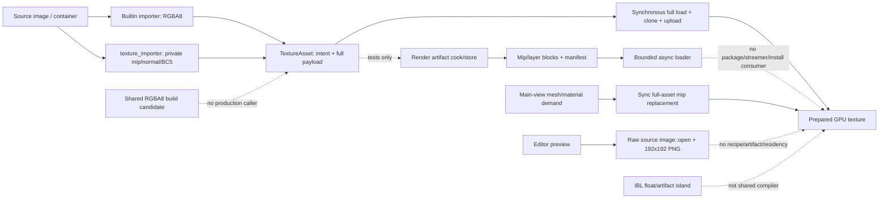

# Editor212 · Texture / Image / Cubemap / RenderTarget / Sampler / Compression / Streaming / Preview 当前源码复核

> currentness 刷新：Editor35、Editor109、Editor156
>
> Runtime 合同 owner：Runtime92
>
> 审查日期：2026-08-29
>
> 审查基线：共享 working tree，HEAD `a2d8d811c4a3a1fc1db6f5375c491e7e4502533f`

## 1. 结论

当前 Texture 纵向产品链仍不是工程级闭环，不能标记为“功能已完成”，更不能据现有证据声称性能或表现优于 Unreal。近期源码有四项真实进展：新增 shared RGBA8 build candidate、RenderArtifact mip/layer 分块合同、RHI `Arc<[u8]>` 批上传与 frame submission transaction、mip transition 的 revision snapshot；这些底座必须保留。但它们尚未组成普通 `source -> build -> cook -> package -> async load -> generation-qualified install -> Editor inspect` 生产链。

本轮最关键的 current-source 结论如下：

1. 普通 image、array 与 cubemap source 仍在进入 recipe/compiler 前统一 `to_rgba8()`；只有 Environment IBL 使用 RGBA32F 专线。HDR/EXR fidelity P0 未关闭。
2. 新 `build_decoded_rgba8_texture()` 能生成 linear-space sRGB mip、Kaiser/Box mip 和 normal-aware mip，但除本文件测试与 re-export 外没有 production caller；plugin 仍保留另一套 mip/normal/BC5 pipeline。
3. RenderArtifact schema/cook/store/loader 已形成可信分块底座，但 cook、publish 和 loader construction 只在自身测试出现，普通 import/package/ResourceStreamer/install 无消费者。
4. Runtime 首次 ensure 仍同步 clone 完整 `TextureAsset` 并全量上传；mip transition 仍同步重读完整 asset、构建 replacement texture。compressed payload 仍被 partial mip rebuild 显式拒绝。
5. mip demand 只覆盖主视图 visible mesh/material，screen coverage 虽已区分 perspective/orthographic，但半径来自 transform scale，不使用真实 mesh bounds 或 UV density，也不覆盖 UI/Sprite/particle/decal/terrain/probe/preview 等消费者。
6. RenderTarget 仍借用普通 Texture identity，只支持 D2、单层、单 mip、RGBA8、sample1；Sampler 仍缺 compare、border、LOD clamp/bias、reduction 等完整合同；SVT 仍只有 settings，没有 page 产品链。
7. Editor 仍只有 raw-source 192x192 thumbnail。Texture document/toolkit/controller/factory、mip/layer/face/HDR/compression/residency inspection 均不存在；声明的 `plugins://texture/editor/authoring.zui` 物理不存在。
8. Texture runtime package 已进入 first-party runtime catalog，但 first-party Editor catalog/App 没有 Texture editor provider；重叠的 `asset_importers/texture` 仍只声明 descriptor 而不注册执行者，多个 manifest 的 `stable`/`complete` 继续高于真实资格。

Editor35 继续是唯一 canonical finding owner。本轮状态为：**P0 3 Open / 2 Partial / 0 Closed；P1 30 Open / 30 Partial / 0 Closed；P2 12 Open；32 门 17 Fail / 15 Partial / 0 Pass**。这不是新增一套 finding，也不重复增加 canonical 总数。

## 2. 审查边界与证据

### 2.1 当前 Zircon 物理语料

| 范围 | 文件 / 行 / 非空行 / bytes / tests / ignored | 本轮证据 |
|---|---:|---|
| Zircon Runtime/Editor/Plugin selected | **369 / 75,029 / 68,221 / 2,639,425 / 816 / 44** | asset texture、IBL、RenderArtifact、GPU resource、streamer、RHI upload、Editor type/preview、plugin/catalog/App；fingerprint `7458e2e53c441efe661f3a482179252a5b121f4db67eaa003838d4dbff3f039e` |
| Unreal/Godot/Fyrox/Bevy/Unity Graphics reference | **51 / 45,757 / 39,521 / 1,783,583 / 96 markers** | source/build key、physical/virtual streaming、typed storage/image、RenderGraph target、Texture Editor；fingerprint `fa6d4237d46c50b2f0138dc7606b5007fa275880834589533f804a3ddfcea0cd` |
| 全部选择集 | **420 / 120,786 / 107,742 / 4,423,008** | 两组显式路径并集；未把 `dev/` 参考源码计入 Zircon 产品统计 |

指纹算法为：按仓库相对路径 ordinal 排序，逐文件 SHA-256，拼接 `relative_path<TAB>file_sha256<LF>` 后再计算 SHA-256。`tests` 是 Rust test attribute 的静态计数，参考侧为 Rust/C++/C# 测试声明 marker；不表示已执行或通过。选择语料完整文本已逐文件读取，并执行 symbol/caller、manifest/resource、catalog/App、TODO/FIXME/HACK/XXX/`todo!`/`unimplemented!` 与测试声明扫描。所选 Zircon 语料上述显式技术债 marker 均为 0；当前主要问题是孤立实现、弱合同和虚假产品声明，而不是显式占位符。

本轮只做静态 review，没有修改 Rust、Cargo、ZUI 或产品资产，没有运行 Cargo、Editor、WGPU、真实 import/cook/package、visual golden、fuzz、fault、scale、soak、跨平台或 headless release lane。Tooling 按用户要求排除；没有查询、轮询、等待或实时跟踪协调器。

### 2.2 参考版本

| 参考 | revision / 版本 | 定位 |
|---|---|---|
| Unreal Engine | 本地 `Build.version` 6.0.0、UE5、changelist 0，无独立 Git revision | 主基线：source/build key、per-mip I/O、cancel/budget、VT/SVT、Texture Editor、RenderTarget |
| Godot | `8c7e6c5877a78e8e61ea4fd42673219a9091dca7` | layered/3D resource/import/editor 与 centralized texture storage |
| Fyrox | `8d815db36494f1badb347547dfc7094bf4fbbdf8` | Rust typed texture/import options、resource manager 与 renderer cache |
| Bevy | `fb89a8649d9b359e53ffb6e5492ebb7c059ac8af` | typed image/sampler、HDR/EXR、extract/prepare/remove 与 cache lifetime |
| Unity Graphics | `a7e4c051d256a781ab362c64316b125a1e104694` | RenderGraph texture descriptor/lifetime、atlas 与 VT feedback surface；不推断缺失的 Unity native streamer |

### 2.3 相关未关闭 failure

| Failure | 当前意义 |
|---|---|
| `docs/plans/zircon_editor/editor/09/failure-2026-07-17-editor-asset-catalog-full-rebuild-and-preview-lock.md` | Preview 已有 immutable generation、Arc projection、job/cancel/token 和 bounded mailbox，但 catalog input generation、条件发布与 10k 动态证据仍未闭合 |
| `docs/plans/optimize/zircon_runtime/90/failure-2026-08-28-rhi-upload-batch-payload-owner-lifetime.md` | RHI upload payload owner 修复及 focused test 已有记录，失败仍因 atomic integration pending 保持 Open；它不能替代 Texture generation install/completion |
| `docs/plans/zircon_runtime/frameworks/01/failure-2026-08-25-resource-conditional-atomic-write-authority.md` | durable write 底座已增强，但 Preview/Texture artifact 的 product CAS、generation publication 和 rollback 仍需使用该 authority |

## 3. 必须保留的真实底座

1. `TextureAssetDescriptor` 已集中表达 dimension、extent、mip、compression、color space、usage、anisotropy 与 SVT settings，并在 normalize/validate 时检查 cube/array/volume 约束。
2. DDS/KTX/KTX2/ASTC container 路径已有 header、subresource layout、block extent、mip/layer range、supercompression 上限与 device capability gate；unsupported 应保持早拒绝。
3. Environment IBL 已有 RGBA32F decode、equirect/external cube、PMREM/SH9/可选 irradiance、versioned request identity、BLAKE3 key、prepared durable writes、atomic runtime cache 与 bounded hydration cache。
4. `build_decoded_rgba8_texture()` 对 D2/single-layer/uncompressed 输入执行 descriptor 校验、linear-space sRGB downsample、Box/Kaiser filter 和 normal renormalization；它适合成为 shared compiler stage，而不是继续作为无 caller 的第二个候选实现。
5. `RenderArtifactManifest` schema v3 能描述 texture mip/layer block、bootstrap/streamable residency、codec/hash/size/alignment/dependency、resource revision 与 target platform。
6. Texture cook 从实际 upload plan 切分 mip/layer blocks；store 先发布 immutable blocks 再发布 manifest，loader 具 bounded capacity、single-flight、priority/deadline/cancel/close、zstd/hash/size/decompression-limit diagnostics。
7. RHI `BufferUpload`/`TextureUpload` 持有 `Arc<[u8]>` 与选定 range，GPU Texture upload 已改用 batch，并由 frame submission transaction 保留 pre/copy/post command buffer 与 payload owner。
8. Texture streamer 已有 resident/upload byte budget、per-frame transition cap、hysteresis、offscreen eviction、transition identity 与 revision snapshot；这些 policy 应改接真实 bulk/install，不应删除后重写成无预算同步路径。
9. sampler cache 对当前 address/filter/anisotropy cap 使用稳定 key；OutputTarget 对当前狭窄 shape/format 明确拒绝，后续应扩展 typed contract 而不是放宽 late validation。
10. Preview 已有 visible-only admission、Background Job、generation/token stale protection、`JobContext` cancel 和短 publication gate；应升级为 artifact-aware 多阶段服务。

## 4. 当前产品链与断路

| 当前表面 | 当前真实行为 | 断路 | 目标 authority |
|---|---|---|---|
| 普通 decode | `decode_texture_source_image()`、array manifest、cubemap manifest 都 `to_rgba8()` | HDR/EXR 与高位深在 recipe/compiler 前丢失 | canonical intermediate decoder |
| Shared build | 有版本 2 RGBA8 mip builder | 只有定义、测试、re-export；builtin/plugin 均未调用 | single Texture compiler graph |
| Plugin build | 私有 offline mip、normal convention、BC5 | builtin fallback 行为不同，实际 provider 只覆盖 BC5 | provider registry + actual receipt |
| Render artifact | 真实 mip/layer block、hash、bootstrap 与 immutable publication | cook/publish/loader construction 均无 production caller | platform artifact/DDC/package owner |
| First load | `load_texture_asset_snapshot` 后 clone 完整 asset 并全上传 | 无 tail-first、range I/O、async decode、cancel | async bulk prepare/install service |
| Mip transition | 同步重读完整 asset、构造 replacement、enqueue 后替换 prepared | compressed partial rebuild 显式拒绝；无 fence/generation retire | generation-qualified subresource install |
| Demand | 主视图 visible mesh/material；投影类型已区分 | 半径来自 transform scale；无真实 bounds、UV density、multi-view/consumer graph | unified demand graph |
| Budget | resident/upload bytes、transition cap、hysteresis | resident 默认 `u64::MAX`，只统计普通 texture map，无 in-flight/retired 总账 | global texture residency ledger |
| Sampler | address/filter/aniso cache | 字段与独立 identity 不完整 | typed Sampler resource/policy |
| RenderTarget | 普通 Texture handle + late validation | 仅 RGBA8/D2/single/single/sample1，无 pool/history/resolve/device recovery | typed graph-owned RenderTarget |
| SVT | page size/border/tail metadata | no page compiler/page table/feedback/tile cache/shader path | VirtualTexture product owner |
| Preview | raw source 固定缩放并直接写 final PNG | 失真、非原子、弱 key、无 GC/byte budget/fairness/modes | Texture toolkit preview service |
| Product assembly | runtime catalog 有 Texture runtime | Editor catalog/App 无 provider；缺 ZUI；重复 importer 无 executor | single package owner + admission receipt |

## 5. 五引擎差异

| 参考 | 当前源码事实 | Zircon 必须吸收的边界 |
|---|---|---|
| Unreal Engine | `FTextureSource`、build settings、texture format/version、encode/color/alpha/normal 输入进入 derived data；`FRenderAssetUpdate` 和 per-mip stream-in 区分线程任务、priority、cancel/abort、size/lock/copy/intermediate resource；manager 有 view、pool/margin/temp memory 与 stream-out；VT/SVT 是独立 page/chunk/upload 管理器；Texture Editor 有 mip/layer/slice/face/channel/zoom/exposure；RenderTarget 有 typed format/resize/auto-mip | source/build/runtime identity 分层，actual encoder receipt，per-mip bulk 生命周期、全局预算与 cancel，独立 VT/SVT，完整 inspection surface |
| Godot | 普通与 layered importer 区分 lossless/lossy/VRAM/Basis、HDR/UASTC/RDO/mip/roughness/normal；2D/layered/3D 有独立 resource/editor；TextureStorage 集中 allocate/initialize/update/replace/free、partial update、slice/proxy 与 memory | shape 是产品 identity 而非 descriptor hint；import policy、storage lifetime 和 subtype editor 必须同一闭环 |
| Bevy | `Image` 使用 typed format/dimension/usage，Sampler 覆盖 LOD/compare/aniso/border；HDR/EXR 产出 RGBA32Float；RenderAsset 明确 extract/prepare/retry/remove/unused 和 bytes-per-frame；TextureCache descriptor-qualified 且按 frame aging | 即使不实现 Unreal streamer，也必须先闭合 typed contract、HDR preservation、prepare/install/remove 与 cache retirement |
| Fyrox | Texture 使用 typed kind/pixel kind/mip/filter/aniso/compression，loader 读取 resource import options；ResourceManager 共享异步 loading，renderer cache 响应 resource event/TTL | Rust 类型与 import options/Inspector 联动；`load -> clone full -> permanent map` 不是资源生命周期终点 |
| Unity Graphics | RenderGraph `TextureDesc` 表达显式/相对/functor size、GraphicsFormat、dimension、UAV、mip、MSAA、dynamic scale、clear/discard；tests 验证 create/release、transient misuse 与 async queue lifetime；atlas 有 allocate/release/update/invalidation，VT 有 cache settings 与 feedback shader | RenderTarget 属于 graph lifetime；atlas/VT 需要 descriptor key、失效、反馈和资源寿命证据。Unity native streamer 不在本地仓，不能据此臆测 |

## 6. P0 当前状态

| Finding | 状态 | 当前证据 | 关闭要求 |
|---|---|---|---|
| P0-1 | Open | ordinary、array、cubemap source 仍无条件 `to_rgba8()`；仅 IBL 走 RGBA32F | 建立 float/half/integer canonical intermediate、transfer/alpha/NaN policy 和 source-to-artifact/GPU readback fidelity gate |
| P0-2 | Partial | 旧 `transcode_normal_bc5` arity 断点已修；当前 plugin 内部调用结构一致，但本轮未运行 locked/offline compile/repro lane | 冻结 lock/toolchain，执行 compile 与同 fixture byte-identical reproducibility；通过也不能绕过 actual artifact 语义 |
| P0-3 | Partial | manifest/cook 能记录 actual block layout/hash/bootstrap；shared RGBA8 build 也真实生成 mip，但两者均未接 ordinary import/package/install，builtin 仍可只写 requested metadata | shared compiler 必须输出 actual format/mips/provider/version receipt，package/runtime 只消费该 receipt |
| P0-4 | Open | Texture Editor ZUI 缺失；重复 importer 无 executor；first-party Editor catalog/App 无 Texture；多个 manifest 仍 `stable`/`complete` | 收敛唯一 package/importer owner，以资源、factory、catalog、runtime receipt 和资格门共同决定 admission/maturity |
| P0-5 | Open | sampled、cube/array、RenderTarget、SVT 继续复用通用 Texture identity；错误依赖 late validation | 冻结 typed Texture2D/Layered/Cube/Volume/RenderTarget/VirtualTexture/Sampler identity、合法转换和 migration |

## 7. P1：Source、Recipe、Decode、Mip 与 Compression

| Finding | 状态 | 当前证据与重构要求 |
|---|---|---|
| P1-1 | Open | 没有稳定、可迁移的 `TextureSourceAsset`；source reference、content identity 与最终 runtime payload 继续混合。 |
| P1-2 | Open | 没有 versioned `TextureImportRecipe`、unknown-field preservation、migration、recipe revision 或 project/platform override hierarchy。 |
| P1-3 | Open | 普通 decode 直接生成 RGBA8 runtime payload，没有 float/integer canonical image 和 stage receipt。 |
| P1-4 | Partial | metadata 与 IBL 有 sRGB/linear/HDR 局部语义；普通 decode、preview、mip、compression/readback 没有统一 transfer authority。 |
| P1-5 | Open | premultiply、coverage alpha、dilation、threshold preservation、opaque detection 和 HDR alpha policy 未工程化。 |
| P1-6 | Partial | plugin 与 shared build candidate 有 normal renormalization/convention 局部实现；builtin、artifact 与 fallback 未共享。 |
| P1-7 | Open | channel packing/swizzle/remap 没有 recipe/compiler stage、artifact receipt 与可视化验证。 |
| P1-8 | Open | resize/crop/pad、NPOT、max-size、aspect、HDR/normal filter 与 platform override 没有统一 policy。 |
| P1-9 | Partial | 新 shared build candidate 和 plugin 私有 mipgen 都能生成 mip；production caller 仍只走 plugin 私有实现，唯一 compiler authority 未成立。 |
| P1-10 | Partial | BC5 encoder、container parser/device gate 真实存在；BC1/4/6H/7、ETC2、ASTC、Basis provider/version/quality/RDO/fallback 矩阵不完整。 |
| P1-11 | Partial | manifest 保存 target platform；variant key 未覆盖 source digest、完整 recipe、tool/encoder version、device profile、quality/RDO。 |
| P1-12 | Partial | schema v3 分 mip/layer block 并记录 hash/size/codec/alignment/dependency；普通 import、DDC GC、package 与 runtime install 无 production consumer。 |

## 8. P1：Shape、Cubemap、Sampler 与 RenderTarget

| Finding | 状态 | 当前证据与重构要求 |
|---|---|---|
| P1-13 | Open | `RenderImageDescriptor.format` 与 container format 仍以 `String` 穿过 asset/render/GPU，缺统一 closed set 与显式 compatibility conversion。 |
| P1-14 | Partial | normalize 会同步 `depth_or_array_layers`/`array_layer_count`；两个字段仍是长期双 authority。 |
| P1-15 | Open | 2D、array、cube、volume、target、virtual texture 没有稳定独立 resource identity 与受限 variant contract。 |
| P1-16 | Partial | `.zarray` 支持引用或纵向切片并验证 layer 一致性；最终 flatten 为 RGBA8 `TextureAsset`，无 stable per-layer provenance/edit map。 |
| P1-17 | Partial | `.zcube` 支持 six-file/cross/equirect 与 orientation 局部测试；所有入口不共享 orientation authority，manifest source 也先量化 RGBA8。 |
| P1-18 | Partial | cube mip/layout 基础成立；无跨 face seam fixup、filter footprint、compressed edge 与数值误差矩阵。 |
| P1-19 | Partial | IBL 的 float staging、PMREM/SH、version/hash、prepared/atomic cache 与 hydration cache 较成熟；仍是专线，未并入通用 build/platform artifact。 |
| P1-20 | Partial | sampler cache 覆盖现有 address/filter/aniso cap；缺 compare、border、LOD clamp/bias、reduction、unnormalized coordinates 与 capability receipt。 |
| P1-21 | Open | Sampler 不是独立 typed resource/project policy，anisotropy 部分寄生在 Texture metadata。 |
| P1-22 | Open | RenderTarget 继续使用普通 Texture marker/handle，没有 typed descriptor、view、resolve 与 producer identity。 |
| P1-23 | Open | Output target 仅支持 D2、单层、单 mip、RGBA8、sample1；HDR/depth/array/cube/MSAA/UAV/resolve 均不成立。 |
| P1-24 | Open | 无 relative/dynamic sizing、pool、history、aliasing、resize receipt、graph lifetime、device-loss recovery。 |

## 9. P1：Physical Streaming、Virtual Texture 与性能

| Finding | 状态 | 当前证据与重构要求 |
|---|---|---|
| P1-25 | Partial | artifact plan 可标 bootstrap mip tail；production 首次 ensure 仍 clone/upload full chain。 |
| P1-26 | Partial | manifest loader 有 async bounded I/O、priority/deadline/cancel；Runtime transition 仍同步加载完整 `TextureAsset`。 |
| P1-27 | Partial | cook/`compressed_mip_upload` 可处理 upload-ready compressed blocks；`rebuild_resident_mips` 仍明确拒绝 compressed partial residency。 |
| P1-28 | Partial | revision snapshot、Arc upload owner、batch 和 frame submission transaction 是真实进展；GPU publish 仍无 device/resource generation、completion/fence-qualified install/retire receipt。 |
| P1-29 | Partial | screen coverage 已按 perspective/orthographic 计算；半径仍由 transform scale 近似，未消费已有 mesh bounds、UV density、tiling、resolution 与 feedback。 |
| P1-30 | Open | Sprite/UI/particle/decal/terrain/lightmap/IBL/probe/editor preview/render graph/history 等消费者没有进入统一 demand graph。 |
| P1-31 | Partial | resident/upload byte budget 与 transition cap 存在；默认 resident budget 是 `u64::MAX`，无 Texture Group、pool/class/profile/priority policy。 |
| P1-32 | Partial | hysteresis、offscreen eviction、persistent resident bytes 存在；无全局 pressure arbitration、preemption、multi-view policy、anti-thrash debt 与 in-flight/retired 总账。 |
| P1-33 | Partial | loader/streamer 有 corruption/deadline/capacity diagnostics；retry/backoff/fallback/operator action 与跨阶段 provenance 未闭合。 |
| P1-34 | Open | SVT 只有 page size/border/tail 与 eligibility；无 page compiler、range package、feedback、page table、physical tile cache、eviction/shader sampling。 |
| P1-35 | Partial | resident bytes、requested/actual mip、transition 与局部 loader counters 可观察；缺 group/consumer/asset miss、stall、thrash、I/O/decode/upload/fence 指标。 |
| P1-36 | Open | 无 1/1k/100k texture、4K/8K/16K cold/warm、startup tail latency、bandwidth、memory、cache hit、thrash 与 soak 基线。 |

## 10. P1：Editor Toolkit、Preview、Reimport 与交互

| Finding | 状态 | 当前证据与重构要求 |
|---|---|---|
| P1-37 | Open | 无 Texture document/toolkit/controller/factory；`authoring.zui` 不存在，builtin toolkit 只覆盖 UI/Animation。 |
| P1-38 | Open | import settings 无 schema-driven Inspector、capability filtering、validation、preset、migration、unknown-field 或 platform diff view。 |
| P1-39 | Partial | Preview 使用 Background Job、token/generation/cancel；Texture import/reimport/build 没有统一 job/progress/cancel/publish receipt。 |
| P1-40 | Open | 无 source/recipe/intermediate/artifact/runtime format、size、mip、quality、dependency、provider 与 provenance diff。 |
| P1-41 | Open | 只有 SourceImage thumbnail；无 RGBA channel、alpha/checker、normal、UV、zoom/pan、exposure、linear/sRGB inspection。 |
| P1-42 | Open | 无 mip selector、requested-vs-actual format、block/compression diff、PSNR/SSIM 或 artifact/GPU readback view。 |
| P1-43 | Open | 无 layer/face/slice selector、cubemap rotation/projection、volume slice 与 seam inspection。 |
| P1-44 | Open | 无 live RenderTarget picker、freeze/history、depth/HDR/exposure、MSAA resolve 或 producer lifetime view。 |
| P1-45 | Open | thumbnail 直接 `image::open` raw source，不消费 recipe/artifact/platform/generation，不能证明与 runtime 一致。 |
| P1-46 | Open | `thumbnail_exact(192, 192)` 破坏 aspect；无 letterbox、HDR tone map、alpha checker、normal/color policy 与 DPI tier。 |
| P1-47 | Partial | key 含 UUID/source hash 且 generation 防 stale；直接写 final PNG 非原子，key 不含 recipe/artifact/view/schema，且无 size/age GC。 |
| P1-48 | Partial | visible admission、64 count in-flight、cancel/stale gate 存在；无 byte budget、tier/fairness、priority aging、decode/upload stage 与 shutdown receipt。 |

## 11. P1：Plugin、Diagnostics、测试与发布资格

| Finding | 状态 | 当前证据与重构要求 |
|---|---|---|
| P1-49 | Open | builtin、`texture_importer`、`asset_importers/texture` 重叠；后者只声明 descriptors，不执行 register。 |
| P1-50 | Open | plugin tests 主要验证 descriptor/capability registration，不能证明 resource/controller/import/cook/package/install/product execution。 |
| P1-51 | Partial | first-party runtime catalog 可包含 Texture runtime；Editor catalog 与 `zircon_app target-editor-host` 没有 Texture provider/feature branch。 |
| P1-52 | Open | Texture package 与 importer manifest 的 `stable`/`complete` 高于资源、caller、产品装配和资格证据。 |
| P1-53 | Open | builtin/plugin 对 mip、normal、compression、diagnostic 的结果不同，没有 shared compiler 或等价 fallback。 |
| P1-54 | Partial | container、manifest loader、streamer 有部分 stable codes；decode/recipe/compiler/provider/publish/install 没有统一 typed diagnostic journal。 |
| P1-55 | Partial | parser/loader 有 malformed/size/corruption tests；无预算化持续 fuzz corpus、decompression bomb 与全格式矩阵。 |
| P1-56 | Partial | manifest sort/hash/immutable store 与 IBL key/cache 有 determinism 底座；完整 key、byte-identical cook、GC/rollback/cache-race 门缺失。 |
| P1-57 | Open | 无 HDR、color/alpha/normal、mip、compression、cubemap seam、preview 与 GPU readback visual/quality golden。 |
| P1-58 | Partial | loader 已测 corruption/capacity/deadline/close/decompression limit；无 short read/cancel race/disk full/crash/GPU OOM/device loss/generation supersede E2E。 |
| P1-59 | Open | 无 Windows/Linux/macOS 与 D3D12/Vulkan/Metal、format tier、driver/device matrix；静态 capability test 不能替代真实设备。 |
| P1-60 | Partial | manifest/store/loader 可 headless 复用；无 source-to-platform package 命令产品、dependency closure、签名、rollback 与 release evidence。 |

## 12. P2 当前状态

| Finding | 状态 | 长期要求 |
|---|---|---|
| P2-1 | Open | GPU/compute texture encoding farm、worker protocol、deterministic receipt。 |
| P2-2 | Open | perceptual/RDO 自动质量优化、内容分类与目标大小求解。 |
| P2-3 | Open | advanced virtual texturing、multi-space page policy 与反馈预测。 |
| P2-4 | Open | sparse/reserved resource backend 与跨 API residency abstraction。 |
| P2-5 | Open | UDIM/tile-set identity、跨材质依赖与大型内容编辑。 |
| P2-6 | Open | runtime/procedural texture producer、graph lifetime、readback/cook policy。 |
| P2-7 | Open | Texture atlas、bindless descriptor 与 residency 协同。 |
| P2-8 | Open | neural texture compression、super-resolution 与可回退 artifact。 |
| P2-9 | Open | 自动内容审计、质量/内存风险解释与事务化修复建议。 |
| P2-10 | Open | 多人 Texture recipe/paint/metadata 协同与冲突合并。 |
| P2-11 | Open | 跨版本 artifact migration、dual-read rollout、rollback 与 GC 证明。 |
| P2-12 | Open | 跨引擎同源质量、启动、streaming、显存与 Editor 交互 benchmark。 |

## 13. Owner 与重构边界

| Owner | 唯一职责 | 禁止复制 |
|---|---|---|
| Runtime85 / Runtime86 | 通用 source/import/build graph 与 schema/version/migration | Texture 不自建另一套 durable transaction/schema registry |
| Runtime90 | RHI device/upload/submission/completion/fence | Texture 只提交 typed upload/install request，不自行散落 queue writes |
| Runtime92 | Texture source/cooked/runtime descriptor、platform artifact、subresource request、residency policy 与预算接入 | Editor 不实现压缩/mip compiler，Plugin 不拥有 runtime residency |
| Editor35 | Texture document/toolkit/preview/reimport transaction 与 inspection UX | 不复制 Runtime compiler、artifact store 或 GPU lifetime |
| Plugins18 | 唯一 first-party Texture package/importer/provider 的装配、capability、admission 与 maturity | 删除重叠 importer shell 和无资源的虚假 product surface |
| Framework Resource | CAS、durable generation、atomic publication、GC/rollback primitives | Preview/Texture artifact 不以 direct final-file write 代替 product CAS |

目标纵向链必须固定为：

`TextureSourceAsset + TextureImportRecipe -> CanonicalImage -> TextureBuildPlan -> PlatformTextureArtifact + Bulk/Page Manifest -> Async TexturePrepareTicket -> Generation-qualified Install/Retire Receipt -> Unified Demand/Budget -> Texture Editor Toolkit/Preview`。

关键类型至少包括：`TextureShape`、`TextureFormat`、`TextureSourceFormat`、`TextureImportRecipeVersion`、`TextureBuildKey`、`TextureSubresourceId`、`TextureArtifactId`、`TextureVariantKey`、`TexturePrepareTicket`、`TextureInstallReceipt`、`TextureResidencyState`、`SamplerDescriptor`、`RenderTargetDescriptor`、`VirtualTextureDescriptor`。任何 requested setting 到 actual runtime representation 的转换都必须留下可追踪 receipt。

## 14. 分层重构里程碑

| Milestone | 必须交付的闭环 | 前置 |
|---|---|---|
| M0 Truthfulness | 下调 manifest maturity/capability，禁 requested-as-actual，移除缺 ZUI/无 executor 的产品声明；建立 compile/repro lane | 无 |
| M1 Stable source/schema | typed source/recipe/shape/format/sampler/target、version/migration/unknown preservation | M0、Runtime85/86 |
| M2 Shared compiler | canonical HDR/integer image、color/alpha/normal/channel/resize、唯一 mip compiler、provider registry 与 actual receipt | M1 |
| M3 Artifact/DDC/package | 完整 build key、platform variants、mip/layer/page blocks、atomic generation、GC/rollback、headless package | M2、Resource authority |
| M4 Runtime physical streaming | tail-first、async range I/O、batch upload、completion/generation install、compressed array/cube/volume partial residency | M3、Runtime90 |
| M5 Demand/budget/lifecycle | real bounds/UV/multi-view/consumer graph、global ledger、pressure arbitration、retire/device recovery/telemetry | M4 |
| M6 Sampler/RenderTarget | complete typed sampler；graph-owned target、relative resize、pool/history/MSAA/resolve/device recovery | M1、Runtime89/90 |
| M7 Virtual Texture | page compiler/package、feedback/page table/tile pool/eviction/fallback/shader path | M3-M5 |
| M8 Editor product | Texture document/toolkit/factory、schema inspector、artifact-aware preview、mip/layer/face/HDR/compression/RT modes、transactional reimport | M2-M7、Editor09 |
| M9 Plugin/release | one package owner、catalog/App closure、admission receipts、fault/scale/quality/cross-platform/release rollback | M0-M8 |

## 15. 验收门

| Gate | 状态 | 当前证据与通过条件 |
|---|---|---|
| G01 HDR/EXR fidelity | Fail | ordinary/array/cube 仍量化；必须验证 float source 到 artifact/GPU readback 的辐射误差。 |
| G02 Importer compile/reproducibility | Partial | 静态 arity 已修；需 locked/offline compile 与同 fixture 重复产物。 |
| G03 Requested/actual truth | Partial | manifest/shared build 可生成 actual 数据；ordinary product chain 未消费。 |
| G04 Builtin/plugin parity | Fail | mip/normal/BC5 行为仍分裂。 |
| G05 Typed shape/reference | Partial | dimension 局部 typed；format string、resource identity 与 duplicate extent 未关闭。 |
| G06 Color/alpha/normal golden | Fail | 无端到端 golden。 |
| G07 Compression matrix | Fail | 实际 encoder 覆盖远小于声明矩阵。 |
| G08 Platform variant key | Partial | 有 target platform，缺全部影响输入。 |
| G09 Artifact atomicity | Partial | block-before-manifest、immutable create-new 与 IBL atomic cache 成立；跨 namespace generation/GC/rollback 未闭合。 |
| G10 Artifact determinism | Partial | block hash/sort、IBL key、shared builder version 存在；全 compiler byte-identical 门缺失。 |
| G11 Container malformed/fuzz | Partial | parser/loader malformed tests 多；持续 fuzz 与全预算矩阵缺失。 |
| G12 Cubemap orientation/seams | Partial | cross/equirect 与局部 orientation tests 存在；所有入口统一/seam 数值门缺失。 |
| G13 IBL preservation | Partial | float/PMREM/SH/version/atomic/hydration 较完整；未接通用 platform artifact/install。 |
| G14 Sampler completeness | Fail | 字段与独立 identity 不完整。 |
| G15 RenderTarget format/shape | Fail | 仅 RGBA8/D2/single/single/sample1。 |
| G16 RenderTarget resize/lifetime | Fail | 无 graph pool/history/relative resize/resolve/device recovery。 |
| G17 Tail-first startup | Partial | artifact 能定义 bootstrap tail；production 首次仍 full upload。 |
| G18 Compressed physical streaming | Partial | compressed block/batch 可用；partial resident rebuild 显式拒绝。 |
| G19 Async/cancellation | Partial | manifest loader 成立；production transition 同步且无 completion install receipt。 |
| G20 Demand coverage | Fail | 只覆盖主视图部分 mesh/material。 |
| G21 Budget/thrash | Partial | byte/transition budget、hysteresis/offscreen eviction 存在；默认无限、global ledger 与 anti-thrash 缺失。 |
| G22 SVT end-to-end | Fail | 只有 settings。 |
| G23 Editor transaction | Fail | 无 Texture document/toolkit/factory/undo/save。 |
| G24 Editor conflict/reimport | Fail | 无 recipe revision、dependency diff、CAS/conflict/reimport transaction。 |
| G25 Preview modes | Fail | 只有 raw source thumbnail。 |
| G26 Preview cache/scheduler | Partial | generation/cancel/visible admission 存在；key/publication/GC/fairness/bytes 不合格。 |
| G27 Plugin admission | Fail | 缺资源与无 executor descriptor 仍可声明能力。 |
| G28 Maturity truth | Fail | `stable`/`complete` 与执行链不一致。 |
| G29 Diagnostics | Partial | loader/container/streamer 有局部 stable code；全链 journal/provenance/operator action 缺失。 |
| G30 Scale/performance | Fail | 无产品级 scale/soak/budget baseline。 |
| G31 Cross-platform/headless package | Fail | 无完整 source-to-platform/device/package matrix。 |
| G32 Release rollback | Fail | 无 artifact generation rollout、dual-read、rollback 和旧 generation GC。 |

## 16. 禁止的临时修补

1. 禁止给 HDR/EXR 入口增加扩展名特判后仍输出 RGBA8，并把它称为 HDR 支持。
2. 禁止通过修改 descriptor metadata 伪装 compression/mip 已实际生成。
3. 禁止把新 shared builder、RenderArtifact cook/loader 或 upload batch 的单元测试存在等同于生产链接通。
4. 禁止在 Editor/plugin 内复制 mip、compression、color、normal 或 artifact compiler。
5. 禁止让 Runtime streamer 继续在 render/frame hot path 同步读文件、解码、解压或 clone 全资产。
6. 禁止为 compressed streaming 再建一条 full-rebuild 特例；必须按 subresource/range 安装并受统一预算与 generation 管理。
7. 禁止继续用 `String` format 与 duplicate layer/extent 字段扩大 public API。
8. 禁止用普通 Texture handle 继续承载 RenderTarget/VirtualTexture 的 lifetime 与合法 shape。
9. 禁止以固定 192 thumbnail 或 metadata-only panel 代替 Texture Toolkit。
10. 禁止只创建缺失 ZUI 空壳、只补 descriptor registration、只改 maturity 文案而保留不可执行产品。
11. 禁止以 ignored microbenchmark、静态 capability test 或失败记录中的历史测试结果声称性能超过 Unreal。
12. 禁止为本计划新增 Python/Node tooling；用户已明确 tooling 后续由 Rust 处理。

## 17. 本轮输出边界

本轮只刷新 current-source review、分类索引、总索引与 coverage，不实施代码修正。Editor35 的 finding ID、优先级与 owner 保持稳定；Runtime92 继续拥有运行时 Texture 合同，Editor212 只记录 Editor/Plugin/Preview 纵向闭环和跨 owner 依赖。实施前必须重新冻结共享 working tree 指纹，先执行 M0 truthfulness，再按依赖顺序推进，不允许从 UI 空壳或高级 SVT 表面倒序实现。
