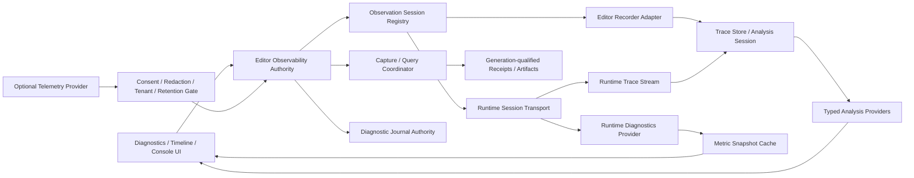

---
related_code:
  - zircon_editor/assets/ui/editor/components/workbench/modules/extensions/diagnostics
  - zircon_editor/assets/ui/editor/host/runtime_diagnostics_body.zui
  - zircon_editor/assets/ui/editor/host/performance_timeline_body.zui
  - zircon_editor/src/core/gateway/session/profile.rs
  - zircon_editor/src/ui/host/editor_manager_runtime_diagnostics.rs
  - zircon_editor/src/ui/layouts/windows/workbench_host_window/pane_payload_builders
  - zircon_editor/src/ui/retained_host/app/profiling
  - zircon_editor/src/ui/retained_host/app/runtime_diagnostics_visibility.rs
  - zircon_editor/src/ui/retained_host/callback_dispatch/template_bridge/workbench
  - zircon_editor/src/ui/retained_host/ui/pane_data_conversion
  - zircon_runtime_interface/src/profiling.rs
  - zircon_runtime/src/core/runtime/diagnostics
  - zircon_runtime/src/core/runtime/handle/diagnostics.rs
  - zircon_runtime/src/runtime_diagnostics
  - zircon_runtime/src/dynamic_api/session/diagnostics.rs
  - zircon_runtime/src/dynamic_api/session/ffi.rs
  - zircon_plugins/runtime_diagnostics
plan_sources:
  - docs/plans/optimize/00-engine-wide-review.md
  - docs/plans/optimize/zircon_runtime/03-core-runtime-diagnostics-profiling-config-review.md
  - docs/plans/optimize/zircon_editor/07-play-session-process-pie-game-view-live-edit-recovery-review.md
  - docs/plans/optimize/zircon_editor/09-background-jobs-admission-scheduling-cancellation-progress-shutdown-product-integration-review.md
  - docs/plans/optimize/zircon_editor/10-notification-center-toast-decision-history-actions-retention-accessibility-diagnostic-integration-review.md
  - docs/plans/optimize/zircon_editor/11-logging-diagnostic-journal-output-console-status-routing-retention-export-review.md
  - docs/plans/optimize/zircon_editor/22-render-pipeline-frame-capture-lighting-bake-reflection-probe-post-process-debug-authoring-review.md
  - docs/plans/optimize/zircon_tooling/07-performance-benchmark-profile-capture-symbol-crash-evidence-baseline-review.md
reference_engines:
  - dev/UnrealEngine/Engine/Source/Developer/TraceServices/Public/TraceServices/Model/AnalysisSession.h
  - dev/UnrealEngine/Engine/Source/Developer/TraceServices/Public/TraceServices/AnalysisService.h
  - dev/UnrealEngine/Engine/Source/Developer/TraceInsights/Public/Insights/IInsightsManager.h
  - dev/UnrealEngine/Engine/Source/Developer/TraceInsights/Public/Insights/ITimingViewSession.h
  - dev/UnrealEngine/Engine/Source/Developer/TraceInsights/Private/Insights/TimingProfiler
  - dev/godot/editor/debugger/editor_debugger_plugin.h
  - dev/godot/editor/debugger/editor_debugger_node.h
  - dev/godot/editor/debugger/editor_performance_profiler.h
  - dev/godot/editor/debugger/editor_profiler.h
  - dev/bevy/crates/bevy_diagnostic/src/diagnostic.rs
  - dev/bevy/crates/bevy_remote/src/lib.rs
  - dev/bevy/crates/bevy_remote/src/http.rs
  - dev/Fyrox/editor/src/stats.rs
  - dev/Fyrox/fyrox-impl/src/engine/mod.rs
  - dev/Fyrox/fyrox-impl/src/scene/graph/mod.rs
  - dev/Graphics/Packages/com.unity.render-pipelines.core/Runtime/Debugging/DebugManager.cs
  - dev/Graphics/Packages/com.unity.render-pipelines.core/Runtime/Debugging/IDebugDisplaySettings.cs
  - dev/Graphics/Packages/com.unity.render-pipelines.core/Runtime/Debugging/DebugFrameTiming.cs
doc_type: review-and-refactor-plan
review_status: review_complete
implementation_status: pending
source_recheck_required: true
---

# 25 · Runtime Diagnostics / Performance Timeline / Console / Telemetry / Observability Authoring 工程化差距

## 1. 结论

Zircon已经拥有可保留的诊断与剖析底座，不应把本轮结论误读为“全部推倒”。Runtime有带history上限的`DiagnosticStore`、大量render/physics/animation指标、feature-gated全局profile recorder、frame/span/counter环形保留、hotspot分析、native/Perfetto导出以及动态Runtime FFI输出预算；Editor也有真实的Runtime Diagnostics、Debug Observatory和Performance Timeline descriptor、可见性门控、UI debug reflector、pane payload与capture控制。这些能力已经超过只显示FPS文本的最低实现。

但是当前产品同时暴露了两套互相矛盾的事实。真实builtin面板只采集Editor进程内的render/physics/animation状态，并把子Runtime的`ProfileSnapshot`拼到本地profile；它没有请求子Runtime已经能够返回的`RuntimeDiagnosticsSnapshot`，也完全没有把`DiagnosticStoreSnapshot.series`投影到面板。另一边，Workbench的Console Diagnostics、Runtime Diagnostics、Performance和Telemetry Dashboard四张工作区直接写死`Session_Player_01`、420 actors、1.2K events、Frame 1234、GPU 9.2 ms、2.4M events、DAU 128K与Crash Rate 0.18%，按钮只改变control文本，却宣称capture、filter、clear、export和query已经queued或完成。

真实Performance Timeline也存在会产生错误结论的跨进程合并。Editor recorder与子Runtime recorder分别在各自`Instant::now()`上建立零点，快照没有process/source/clock-domain/base-time/generation；合并层只偏移span ID、拼接数组、对`active`和`feature_enabled`做OR，并把session字符串拼成`editor+runtime`。因此两个不可比较的时间轴、frame index和同名stream会被当成一个capture，hotspot还会按相同`stream/category/name/path`聚合。控制端先同步控制Editor recorder，再同步调用Runtime FFI，没有事务、timeout、cancel或补偿；部分成功后UI仍只能显示一行拼接状态。

诊断观察本身也可能成为性能故障。面板可见时，每次宿主presentation重算都会同步查询render stats与Virtual Geometry debug、克隆整个诊断仓库、在这个临时clone上重新构造render派生指标、复制profile rings，再同步请求动态Runtime profile。当前render diagnostics源码包含648个唯一`render.*`路径token，派生值写进clone后立即snapshot并丢弃，历史不会跨采集累积，却会反复分配和复制。动态Runtime不可用或解码失败时，Editor直接返回本地快照，不显示stale/disconnected/error，操作者会把不完整数据当成实时全局数据。

Telemetry Dashboard则没有任何生产authority。精确扫描没有发现telemetry/analytics/OpenTelemetry依赖、provider、event schema、ingest、query、tenant、auth、retention、consent、redaction或privacy policy；命中仅限静态Dashboard UI和示例协议。把DAU、留存、raw events和crash rate做成固定成功反馈，不只是未完成界面，而是在没有数据治理与授权边界时伪造运营事实。

本轮登记6项P0、60项P1、12项P2和32个验收门。实施顺序必须先关闭四张静态假产品和错误跨进程合并，建立source-qualified observation session与统一capture coordinator；随后把指标注册、采集缓存、远程Runtime diagnostics、trace analysis和真实Timeline接通；最后才允许在独立、显式启用且具备隐私治理的provider后面开放Telemetry Dashboard。Editor11继续拥有日志journal与Console，Runtime03拥有底层recorder/export，Tooling07拥有benchmark/crash证据；本篇拥有Editor observability产品、跨进程会话、查询与presentation，不重复制造第二套基础设施。

## 2. 审查边界与证据

### 2.1 当前工作树物理范围

| 子域 | 文件 / 行数 / bytes | test attributes | 证据等级 |
|---|---:|---:|---|
| Editor Workbench静态surface、binding、navigation与feedback | 15 / 4,400 / 229,944 | 0 | E3：四份ZUI、HUD入口、field mutation、command feedback与page template逐分支 |
| Editor真实diagnostics、gateway、payload与presentation | 27 / 3,764 / 133,596 | 21 | E3：descriptor、visibility、recompute、FFI调用、merge、payload、conversion与paint链 |
| Runtime diagnostics、全部render-stat provider、profiling与interface | 62 / 14,242 / 472,878 | 82 | E3：store、648个render path token、collector、recorder、hotspot、export、ABI与dynamic response |
| `runtime_diagnostics` plugin package | 9 / 436 / 16,128 | 4 | E3：manifest、capability、descriptor、dist与资源存在性 |
| focused tests | 10 / 2,376 / 91,009 | 32 | E3静态阅读：descriptor、pane、drawer、dynamic diagnostics与profile control |
| selected combined scope | 123 / 25,218 / 943,555 | 139 | 当前工作树fingerprint `856cab602f30cc0b53c2c64dca4a0f77dbdd35c74f786d43c557154efee6a5bb`；0 ignored，8个在途文件 |

行数为物理文本行。fingerprint按相对路径排序，对每个选定文件计算SHA-256，再对`path<TAB>hash<LF>`清单计算SHA-256。范围内已有8个非本轮修改：`zircon_editor/src/core/gateway/session/profile.rs`、`first_wave_payloads.rs`、`pane_payload_builders/runtime_diagnostics.rs`、`template_documents.rs`、diagnostics `observability.rs` binding，以及`zircon_runtime/src/dynamic_api/session/ffi.rs`、`profile.rs`、`state.rs`。本轮按当前工作树取证，不吸收、不回退；实施前必须重算fingerprint并复核这些入口的终态。

本轮把`render_stats_store`的33个叶文件全部纳入，而不是只读collector入口。其源码含453处`record_count`、23处`record_bytes`、10处`record_microseconds`、133处`record_bool`调用和648个唯一`render.*`路径token。这些数字是静态容量证据，不代表648个指标每帧必然全部有效，也不把Graphics域的算法正确性重复归本篇；本篇只审查这些指标如何注册、保存、传输和展示。

### 2.2 动态证据边界

本轮没有运行新的Cargo、Editor窗口、长时间capture、跨进程时钟校准、650指标压力、断线重连、远程watch、Perfetto互操作、Telemetry后端或隐私测试。此前`zircon_editor --lib`测试编译在617.2秒后被239个既有错误和122个warning阻断；相关编译门没有出现足以越过阻断的变化，因此没有重复同一lane。139个test attribute是静态inventory，不是通过数；它们证明局部DTO、renderer、descriptor和导出逻辑存在，不能证明产品观测闭环正确。

### 2.3 参考边界

- Unreal TraceServices用于定义analysis session、provider读写锁、base date/time、metadata、异步analysis生命周期与TraceInsights session事件；Timing View用于定义track、marker、selection、relation和扩展边界。本文不要求复制Slate或UE Trace编码。
- Godot debugger用于定义多session、active/breaked状态、plugin capture channel、profiler toggle、远程tree/object inspection与断开生命周期。它证明“一个字符串session下拉框”不是远程诊断产品。
- Bevy Diagnostics用于定义先注册`Diagnostic`再写measurement、稳定path、可配置history与time-aware smoothing；Bevy Remote用于证明transport/plugin与JSON-RPC request/error合同应独立于UI。本文不把Bevy的HTTP默认安全性当作Zircon产品门槛。
- Fyrox仅提供较窄的engine/scene/physics统计和文本StatisticsWindow，可作为最低可用下限，不能作为工程级Timeline、跨进程trace或telemetry的上限。
- 本地Unity Graphics只覆盖Rendering Debugger、`DebugManager`数据注册、受控刷新率与有界frame timing history，不包含Unity Profiler或Analytics完整源码。本文只引用可验证的graphics debug合同，不以外部印象补齐闭源部分。

## 3. 必须保留的真实基础

1. 保留`DiagnosticStore`的per-series有界history、current/smoothed/min/max和static metadata fast path；问题在全局cardinality、schema与snapshot策略，不在“有无history”。
2. 保留render、physics与animation collector的显式`available/error`状态，以及render device、scene reload和input diagnostics的动态Runtime DTO。
3. 保留profile recorder的frame/span/counter分离、容量上限、overwrite计数、scope parent关系、feature gate和cheap inactive hint。
4. 保留native trace、Perfetto、hotspot/counter/UI hotspot导出基础；后续应由统一capture artifact owner调用，而不是删除重写。
5. 保留dynamic Runtime ABI的owned output、字节预算、item-count校验和typed request/response serde边界。
6. 保留Editor builtin Runtime Diagnostics、Debug Observatory与Performance Timeline descriptor，以及可见时才采集的初步门控。
7. 保留真实Console journal、source/severity filter、jump sequence与export能力，静态Console Diagnostics应并入它，而不是反向替换。
8. 保留UI debug reflector及其surface/tree/schedule证据；它应成为一个provider/track，而不是占据整个Runtime Diagnostics产品。
9. 保留已有world query/watch、PIE session和runtime gateway能力作为远程inspection底座，但必须通过Editor07的session authority接入。
10. 保留profiling宏与Tracy adapter的低侵入调用方式，同时补齐source identity和capture session协调。

## 4. 目标架构

目标合同必须满足以下边界：

- `ObservationSessionId`不能只是显示名，至少包含process identity、runtime session generation、project/world identity、target/platform、connection state与capability set。
- 每个sample必须携带`source_id + clock_domain + timestamp + sequence`；只有完成校准并报告误差界的数据源才允许叠到同一时间轴。
- `MetricDescriptor`先注册stable metric ID、value kind、unit、temporality、aggregation、owner lease、cardinality budget和privacy classification，再提交measurement。
- Runtime collector在固定budget/cadence下生产immutable generation snapshot或delta；UI只消费缓存，不在presentation路径查询GPU/service/FFI。
- Capture coordinator对Editor与Runtime执行prepare/start/stop/finalize协议，返回逐source receipt；部分成功必须显示degraded并可补偿，不能靠字符串拼接掩盖。
- Trace store按session/source保存原始event，analysis provider产出frame、timer、counter、GPU queue、log、object或network等typed view；UI不直接拼原始Vec。
- Telemetry是可选的独立数据产品，必须先具备schema、consent、redaction、auth、tenant、retention和deletion policy；本地性能诊断不能自动上传。

## 5. P0：先关闭假事实、错误时间线与Observer Effect

### P0-1：四张Diagnostics Workbench把fixture和control mutation冒充产品状态

Console Diagnostics、Runtime Diagnostics、Performance和Telemetry Dashboard的行、计数、session、filter与输出均写死在ZUI/feedback。navigation只切tab/selected row，field edit只改`value`与`value_text`，command feedback把按钮点击直接改成“queued/filtered/cleared”。必须立即改为显式Demo/Unavailable，或从默认产品入口移除；任何`capture/export/query/clear`成功文案必须来自真实provider receipt。

### P0-2：Editor显示的是宿主Runtime，未观察子Runtime diagnostics，却使用“Runtime Diagnostics”产品名

`runtime_diagnostics_with_profile()`先调用`editor_manager.runtime_diagnostics()`，这会采集Editor宿主Core；随后只向动态Runtime发送`ProfileControlCommand::Snapshot`。动态ABI已经支持`RuntimeDiagnosticsSnapshot`并能返回project、scene、device、input、diagnostic series和reload状态，但Editor面板从未请求或投影它。更严重的是，本地collector产生的`diagnostics.store`也没有进入`RuntimeDiagnosticsPanePayload`。必须在session authority中明确`Editor Host`与每个子Runtime source，并让用户看到当前source、freshness和connection state。

### P0-3：跨进程profile merge把不可比较的时钟、frame与stream伪装成一条时间线

两个recorder各自以`Instant::now()`为origin，DTO没有clock domain/base time/source/process/generation。`merge_profile_snapshot`只偏移runtime span ID，OR active状态并append Vec；frame/counter identity、预算与timestamp都未校准。当前hotspot会合并同名path，最近12行又按append顺序而非时间排序。必须停止物理merge，改为source-qualified multi-track session；在时钟校准前只能并列显示，不能叠加、排序或聚合。

### P0-4：可见面板在presentation重算中同步制造大规模采集、复制与FFI等待

宿主每次recompute收集pane payload时，同步query render stats、Virtual Geometry debug、clone整个store、重新写入最多数百个render派生series、snapshot全history、clone profile rings并调用动态Runtime FFI。648个render路径token表明这不是常数级小对象；而派生series只写进临时clone，下一次又重新分配。必须建立后台collector、固定cadence、immutable cache、delta与resource admission，presentation只能读取最近已提交generation。

### P0-5：DiagnosticStore总series与动态metadata无界，可被插件或高基数路径拖垮

per-series history虽然限制为64，但`BTreeMap<DiagnosticPath, DiagnosticSeries>`没有series总数、path长度、tag数量/长度或owner quota；公开`record_diagnostic`接受任意动态String，unit可被覆盖、tag只增不减。高基数entity/request/path会永久增长，并放大mutex clone、JSON输出和UI采集。必须改为descriptor registration、owner/cardinality budget、拒绝计数、deregister lease和非有限数值校验。

### P0-6：Telemetry Dashboard在无provider与隐私治理时伪造运营与崩溃事实

代码库没有telemetry backend、event schema、consent、PII classification、redaction、auth、tenant、retention或query engine，却固定显示DAU、留存、raw events与crash rate。必须默认关闭并标为Unavailable；只有独立Telemetry provider通过法律/安全/运维门禁后，UI才可展示真实source、time range、query revision、sampling与freshness。Runtime diagnostics和profiling数据不得默认外发。

## 6. P1：Observation Session、Clock 与 Transport Contract

### P1-1：`ProfileSnapshot`缺少稳定source/process identity

`session_id`只是自由字符串，无法区分Editor、PIE child、standalone client、server或重启后的同名进程。新增`ObservationSourceId`、process UUID/PID、runtime generation与target role。

### P1-2：snapshot缺少clock domain与绝对基准

`start_us`和`timestamp_us`只相对各自recorder origin。新增monotonic clock ID、base UTC、frequency、calibration pair与最大误差；跨source操作必须显式验证可比较性。

### P1-3：没有完整session lifecycle

UI只能看到profile active bool，不能区分discovering、connecting、live、paused、stale、disconnected、terminated和restarted。Session registry应持有状态机、last heartbeat、disconnect reason和generation fence。

### P1-4：capture/query/export没有request identity

控制DTO没有request ID、idempotency key、deadline、caller或result generation。重复点击、延迟响应和重连后旧响应无法隔离。

### P1-5：没有capability negotiation

feature_enabled只能说明profiling编译开关，不能说明GPU timestamps、runtime diagnostics、world watch、Perfetto、counter classes或export format。握手必须返回versioned capability set与限制。

### P1-6：Runtime diagnostics快照没有采集时间与freshness

内部snapshot甚至没有frame index；ABI snapshot虽有frame index，也没有collected_at、source generation、duration或age。UI无法说明数据来自哪一帧、耗时多久、是否过期。

### P1-7：response状态依赖自由字符串

`ProfileControlResponse.status`与`message`都是String，Editor status只拼接message。新增typed outcome/code、retryability、source receipt、diagnostic IDs和structured details。

### P1-8：一次runtime diagnostics不是一致性快照

render、physics、animation、store和profile按顺序独立读取，中间Runtime可继续推进。必须定义snapshot barrier或逐provider generation/time，不能暗示所有字段属于同一帧。

### P1-9：传输只有全量JSON request/response

动态ABI每次序列化全部frames/spans/counters/series/history，缺少分页、delta、stream、compression和backpressure。为live UI建立bounded stream或generation delta，保留全量snapshot作恢复路径。

### P1-10：gateway错误被presentation静默吞掉

`let Ok(Some(response)) ... else { return; }`把unavailable、protocol error、budget rejection与runtime disconnect全部变成本地profile。必须把transport状态作为pane payload的一等字段，并将错误送入Editor11 journal。

## 7. P1：Metric Registry、Collector 与 Snapshot Store

### P1-11：指标不要求预注册descriptor

任何调用者都能首次record时创建path。应仿照Bevy的register-first边界，拒绝未注册metric并记录稳定diagnostic。

### P1-12：metric ID由显示path承担

重命名path会切断历史与dashboard引用。需要stable ID、display path、aliases和migration catalog分离。

### P1-13：unit是自由字符串且可原位改变

同一path可从ms改成bytes而不产生schema错误，历史随即混合。unit/value kind/temporality必须冻结在descriptor generation。

### P1-14：tag集合会永久并集

后续record只把新tag加入series，无法表示每个sample的attributes，也无法移除错误tag。固定descriptor tags与per-sample bounded attributes必须分开。

### P1-15：没有owner lease与deregister

plugin卸载、world销毁或session结束后series仍留在store。registry必须按owner lease撤销并保留可解释tombstone/retention policy。

### P1-16：全局series cardinality没有budget

为engine、plugin、session、metric family分别设置series/path/attribute预算，并公开accepted/rejected/evicted计数。

### P1-17：path、tag和unit没有长度预算

任意长String会进入BTree key、clone与JSON。注册时必须限制UTF-8 bytes、segment数量与字符策略。

### P1-18：非有限measurement没有被拒绝

NaN/Inf会污染min/max、EMA、JSON和图形尺度。写入必须验证value kind与finite policy，并产生可计数拒绝原因。

### P1-19：EMA固定按sample做0.9/0.1平滑

不同采样间隔与丢帧会得到不可比较结果。descriptor应声明gauge/counter/histogram和time-aware aggregation，UI不应猜测。

### P1-20：min/max是进程生命周期值

没有window、reset generation或capture边界，面板无法说明极值范围。提供window/capture/session aggregation并显示范围。

### P1-21：measurement只有frame index

跨stream、无frame事件和远程source无法定位。增加monotonic timestamp、sequence、source和可选frame correlation key。

### P1-22：snapshot总是深复制全部series与history

当前没有Arc generation、copy-on-write、filter-before-copy或pagination。建立immutable snapshot pages与查询预算，避免每次UI刷新复制数万measurement。

### P1-23：`diagnostic_store()`在mutex内clone整个store

clone时持有全局锁，producer会被UI observer阻塞。collector应通过短临界区交换generation或读取预构建snapshot。

### P1-24：render派生指标只写临时clone

`collect_diagnostic_store_snapshot`对clone调用`record_render_stats_diagnostics`，所以派生history、EMA和min/max每次从一条样本重新开始。应由render provider在生产时提交，或把derived view明确标成无历史instant snapshot。

### P1-25：没有provider cadence、cost与health诊断

render query、VG debug、physics和animation的耗时、超时、skipped、stale与last success不可见。每个provider需要budget/cadence/health receipt，observer自身也必须可观测。

## 8. P1：Remote Runtime Diagnostics、Watch、Events 与 Console

### P1-26：builtin Runtime Diagnostics完全不展示metric series

`RuntimeDiagnosticsPanePayload`只有三类status、detail strings与UI reflector，不含series model。必须提供可虚拟化metric tree/table、typed value、history、unit、source与freshness。

### P1-27：动态Runtime diagnostics response没有Editor consumer

ABI已能返回project、scene、adapter、input、series和reload信息，但Editor只请求profile snapshot。接入必须经过Editor07 session registry并保留source/generation，不能再新增旁路gateway。

### P1-28：没有多Runtime session选择与比较

静态dropdown只有`Session_Player_01`字符串。产品需要枚举PIE client/server、standalone与remote device，支持pin、compare和断开后保留capture。

### P1-29：现有world query/watch未接到诊断产品

Runtime已有generic world query/watch底座，但Diagnostics UI没有registration token、invalidation generation、session fence或error surface。应复用已有协议，而不是用任意字符串表达式直接穿透World。

### P1-30：watch没有typed address与schema

`Player.Health`等fixture没有entity generation、component type ID、field path、value kind或unavailable reason。建立stable object address、reflection schema与read-only默认权限。

### P1-31：watch没有采样与触发策略

缺少on-change/fixed-rate/on-break、threshold、debounce、history budget和暂停语义。所有策略必须受session和resource admission约束。

### P1-32：events tab没有event provider

没有event schema、sequence、source、severity、payload budget、loss counter或backpressure。复用trace/journal provider，禁止把任意debug字符串当事件流。

### P1-33：远程inspect/edit权限未在此产品表达

Godot式remote object inspection至少有明确session与debugger状态。Zircon应显示只读/可写capability、pause要求、authorization与每次修改receipt，并复用Editor07 live-edit transaction。

### P1-34：没有break/step/stack/callsite关联

当前“Runtime Diagnostics”不等于debugger。产品命名与信息架构必须区分metrics、trace、object inspector与script debugger；后者缺失时应明确Unavailable而非用Console tab暗示存在。

### P1-35：Console Diagnostics复制了真实Console的职责

固定日志、filter和clear应删除，入口指向Editor11拥有的journal query。clear必须定义view clear、retention deletion或source reset，不能只改一行反馈。

## 9. P1：Performance Timeline、Capture 与 Analysis

### P1-36：当前Timeline只是最近12条frame/span/hotspot列表

没有连续时间轴、track布局或事件几何。应建立virtualized timeline viewport，而不是继续扩展文本行数量。

### P1-37：没有zoom、pan、range与marker

至少需要visible range、selection range、time marker、fit capture、follow live和键盘导航，并把交互状态与capture数据分离。

### P1-38：track identity不足

只有自由字符串stream/category，缺少process/thread/core/task/GPU queue/async lane identity与颜色/排序metadata。track由analysis provider注册并带stable ID。

### P1-39：counter被采集却不展示

summary计数counter数量，但pane没有counter rows、graph、scale或单位。提供counter track、aggregation、range stats和同轴关联。

### P1-40：GPU时间与CPU时间没有correlation合同

Render报告包含GPU timing与latency，但Timeline没有GPU clock calibration、readback frame、queue或availability。接入Editor22 capture provider，显示延迟和不确定性。

### P1-41：frame只有stream内局部index

不同source和stream都从0开始，无法关联Editor presentation、Runtime game frame与GPU submission。新增source-qualified frame key和显式correlation edges。

### P1-42：span关系只支持parent ID

缺少async begin/end、flow、task dependency、wait/wake、frame relation和cross-process message。trace schema需要typed relation，不可把所有关系压成树。

### P1-43：hotspot按显示字符串聚合

同名path来自不同process/plugin会混在一起，rename也会切断历史。按provider event type/stable scope ID/source聚合，显示symbol/callsite revision。

### P1-44：merge保留Editor budget并丢弃Runtime budget差异

`frame_budget_ms`没有合并策略，hotspot统一使用Editor值。每个frame/track保留自身budget policy，跨source汇总必须声明目标。

### P1-45：append后reverse导致source顺序支配“最近”样本

runtime arrays追加在Editor之后，UI从尾部取12条，因此常由Runtime样本占满；这不是按timestamp选择。建立query range、source filter和稳定排序。

### P1-46：capture start/stop是非事务双写

Editor先执行，Runtime后执行；Runtime失败时没有rollback或degraded capture identity。实现prepare/start barrier、逐sourceack和partial capture终态。

### P1-47：reset可先删除Editor证据再遭遇Runtime失败

当前先清本地ring，随后FFI可能失败。Reset必须指定source scope、确认不可逆影响，并以generation receipt完成；默认不应同时清多个source。

### P1-48：Export可能由两个recorder写同名目录

默认`output_root=target/zircon-profiles`且`session_id=local`，Editor与Runtime分别执行ExportReport，使用相同文件名集合；结果可能覆盖，且导出的也不是UI所显示的merged数据。统一artifact owner必须分source目录、原子finalize并生成manifest。

### P1-49：控制与snapshot在UI线程同步执行

capture、export与动态FFI没有job、timeout、cancel或progress。接入Editor09 job authority，UI只提交command并订阅receipt。

### P1-50：没有trace store与analysis provider层

pane直接消费`Vec<ProfileFrameSnapshot>`并每次现场分析hotspot。建立持久/流式trace store、read scopes、provider generation与query cache，参考Unreal analysis session而非复制其实现。

## 10. P1：Telemetry、Plugin、Authority、Testing 与资格

### P1-51：Telemetry没有event schema registry

缺少stable event/field ID、type、required/optional、version、producer owner与compatibility policy。Dashboard不应接受无schema raw event。

### P1-52：没有consent、classification与redaction

项目、账号、device、IP、object name与日志内容可能含敏感信息。每个field需privacy class、purpose、consent basis、redaction和local-only policy。

### P1-53：没有endpoint、auth、tenant与environment

DAU/retention查询至少要明确backend、project/tenant、dev/staging/prod、credential scope与authorization。Editor不得把密钥写入project或界面fixture。

### P1-54：没有ingest、offline queue与delivery receipt

缺少batch、compression、retry、backoff、quota、disk spool、drop counter、shutdown flush和server acknowledgement。不能用“2.4M events queued”代替这些合同。

### P1-55：没有retention、deletion与aggregation policy

raw events、segments、DAU和crash rate需要不同retention/aggregation/late-arrival规则，并支持用户/tenant删除。UI必须显示数据窗口和采样率。

### P1-56：Crash Rate没有crash evidence source

当前未连接Tooling07 crash capture、symbol、build ID、upload或deduplication。只有建立build-qualified crash group与上传receipt后才能显示rate。

### P1-57：`runtime_diagnostics` plugin引用不存在的template资源

plugin注册`plugins://runtime_diagnostics/editor/authoring.zui`，包内没有该文件；测试只验证descriptor字符串。补齐资源解析测试前该插件必须不可发布或加载后明确失败。

### P1-58：plugin与builtin重复拥有`editor.runtime_diagnostics`

builtin descriptor已经注册同一view ID，optional plugin再次贡献同名surface、drawer与menu operation。必须选定唯一owner；若plugin只是adapter，应扩展provider而不是重注册产品view。

### P1-59：plugin catalog装配语义矛盾

它出现在first-party runtime manifest生成测试，却没有first-party Editor catalog产品接线，且manifest声明editor-host only。生成catalog、package目标与实际加载路径必须一致并有端到端解析测试。

### P1-60：测试主要证明字符串、投影和局部DTO，不证明观测闭环

缺少双进程时钟、断线、partial control、650指标、cardinality attack、stale UI、artifact collision、missing template、Telemetry禁用与隐私测试。建立分层fixture、故障注入和规模资格，禁止用`include_str`自检代替产品行为。

## 11. P2：完整性、可用性与维护性

### P2-1：Diagnostics、Debug Observatory与Runtime Diagnostics术语重叠

建立信息架构词表，区分metric、trace、log、remote inspector、debugger和telemetry。

### P2-2：内部与ABI各有一套`RuntimeDiagnosticsSnapshot`

需要显式projection/version mapping测试，避免字段新增只进入一侧。

### P2-3：显示状态仍大量依赖拼接String

保留typed model到最后一层再格式化，便于filter、localization、sorting和automation。

### P2-4：`MAX_TIMELINE_ROWS=12`是局部固定策略

未来列表模式应由viewport/query budget决定，并显示截断/总数，不应静默丢行。

### P2-5：输出路径直接作为UI字符串

使用artifact identity与Open/Reveal动作，处理长路径、不可用目录与敏感用户名。

### P2-6：诊断状态缺少稳定source jump

metric/span/log应能跳到provider、asset、object、source或相关capture，失败需给出原因。

### P2-7：view preference没有持久化

track可见性、filter、range、column、sampling与source pin应进入versioned workspace state。

### P2-8：accessibility与键盘时间线操作未定义

Timeline必须提供可聚焦track/event、范围朗读、非颜色告警和等价表格视图。

### P2-9：live与captured数据的视觉语义未分离

明确标识Live、Paused、Frozen、Imported与Stale，避免用户把历史capture当实时状态。

### P2-10：profile span ID偏移使用saturating add

即便hard cutover后不再merge，也应删除潜在ID汇聚行为并以复合identity替代。

### P2-11：manifest maturity没有传播到产品入口

experimental plugin不得以无警示的正式工具出现在默认菜单或导出包。

### P2-12：参考引擎能力不能被简单等同

Fyrox文本stats、Unity Graphics debugger、Bevy diagnostics与Unreal Insights覆盖层次不同；文档应保持边界，避免以最低实现证明Zircon已工程化。

## 12. 当前第二Authority与断路清单

| Surface / Authority | 当前显示或承诺 | 实际authority | 决策 |
|---|---|---|---|
| Workbench Console Diagnostics | 固定4条日志、24 warnings、1 error、Clear queued | 真实Console journal在Editor11 | 删除静态workspace，入口转真实Console |
| Workbench Runtime Diagnostics | Player_01、420 actors、watch/events、snapshot/export | builtin只显示宿主系统状态；子Runtime diagnostics response无consumer | 立即Unavailable，后续并入Observation Session产品 |
| Workbench Performance | Frame 1234、CPU/GPU固定行、Capture Frame queued | builtin profiler rings与简易12行列表 | 删除静态workspace，升级builtin Timeline |
| Workbench Telemetry Dashboard | DAU、retention、raw events、crash rate | 无provider | 默认移除/Unavailable，等待独立Telemetry产品 |
| builtin Runtime Diagnostics | 宿主render/physics/animation + UI reflector | 真实但命名/来源不完整 | 保留并source-qualified |
| builtin Performance Timeline | local rings + 错误merged Runtime rings | 真实底座但分析语义错误 | 保留UI壳，停止merge并接analysis session |
| `runtime_diagnostics` plugin | 同名view、drawer、missing authoring.zui | 重复且资源断路 | 选唯一owner；adapter化或移除 |

## 13. 分层重构里程碑

### M0：Truthfulness与基线冻结

撤销四张静态surface的成功文案和默认入口；记录当前capture开销、store规模、FFI时延、artifact覆盖与断线行为；冻结本报告fingerprint和所有owner。

### M1：Observation Session与Source Identity

建立session registry、source/process/runtime generation、capability、connection lifecycle、freshness与Editor07 gateway集成。

### M2：Clock、Sequence与Transport

升级profile/diagnostics DTO，增加clock domain、base time、calibration、sequence、request ID、typed outcome、分页/delta与backpressure。

### M3：Metric Registry与Collector Cache

建立descriptor registration、owner lease、cardinality/length/value预算、immutable generation snapshot、后台cadence和provider health。

### M4：Runtime Diagnostics与Remote Inspector

接入动态Runtime diagnostics、metric tree/history、source selection和existing world query/watch；明确与script debugger的边界。

### M5：Trace Store与Analysis Providers

建立session trace store、frame/timer/counter/log/GPU provider、read scopes、query cache、relations与import/export格式。

### M6：Capture Coordinator与Artifact

实现多source prepare/start/stop/finalize、partial receipt、timeout/cancel、source-separated artifact、manifest、symbol/build metadata和Editor09 job接线。

### M7：真实Performance Timeline

完成virtualized tracks、zoom/pan/range/marker、counter、GPU correlation、selection/details、search/filter和accessibility table。

### M8：Console与Plugin Authority收敛

删除Console静态副本；修复或移除missing-template plugin；确保builtin view、plugin provider、catalog与menu只有一个产品authority。

### M9：Telemetry与工程资格

仅在独立provider完成schema、consent、redaction、auth、tenant、retention、deletion、offline queue和crash evidence后开放Dashboard；完成规模、故障、跨平台和隐私门禁。

## 14. 验收门禁

1. **G01 Truthfulness**：默认产品中不存在固定session/frame/actor/event/DAU/crash成功反馈。
2. **G02 Unique authority**：Console、Runtime Diagnostics、Timeline各只有一个view owner；plugin只能注册provider/extension。
3. **G03 Missing resource**：所有plugin template URI在source、library embed与native dynamic包中均可解析。
4. **G04 Source identity**：每个sample可追溯到process、runtime generation、target role和project/world。
5. **G05 Clock domain**：未校准source不能在同一时间轴排序或聚合；校准误差可见且受阈值限制。
6. **G06 Session lifecycle**：connect/restart/disconnect/terminate产生generation fence，旧响应不能污染新session。
7. **G07 Request identity**：capture/query/export/reset具备request ID、deadline、idempotency与terminal receipt。
8. **G08 Typed outcome**：错误有稳定code、source、retryability与journal记录，不依赖message解析。
9. **G09 Capability**：UI只启用source真实支持的metric/trace/GPU/export/world-watch功能。
10. **G10 Snapshot consistency**：每个provider报告generation/time；跨provider组合明确一致性边界。
11. **G11 Registered metrics**：未注册metric写入被拒绝并计数，descriptor含stable ID/type/unit/temporality/owner。
12. **G12 Cardinality**：path/tag/series/owner总量受预算；攻击fixture不会无界增长。
13. **G13 Value validation**：NaN/Inf、unit/type变化和超长metadata被拒绝且不污染历史。
14. **G14 Owner cleanup**：plugin unload、world close、session end能撤销metric/provider lease。
15. **G15 Bounded collection**：650+指标、16K spans、4K counters下采集满足CPU、allocation、lock和bytes预算。
16. **G16 No presentation IO**：pane presentation不查询GPU/service/FFI，不深复制完整store或rings。
17. **G17 Freshness**：Live面板显示source、capture time、age、stale/disconnected和last error。
18. **G18 Delta recovery**：丢delta、超预算或重连可通过有界full snapshot恢复并报告gap。
19. **G19 Runtime source**：Editor可选择并展示真实子Runtime diagnostic series，不把宿主数据冒充游戏Runtime。
20. **G20 World watch**：typed watch具有session fence、token、schema、rate/history预算与unavailable reason。
21. **G21 Event loss**：event stream有sequence、drop/overwrite计数、payload限制和backpressure。
22. **G22 Console convergence**：所有Diagnostics日志查询走Editor11 journal；clear语义和保留影响明确。
23. **G23 Timeline interaction**：百万event capture下zoom/pan/range/selection保持交互预算且不全量materialize。
24. **G24 Multi-track**：CPU thread/task、Runtime、Editor、GPU queue与counter使用stable track ID，可filter/pin/compare。
25. **G25 Correlation**：frame、async flow、GPU readback与cross-process relation均有typed edge和不确定性。
26. **G26 Capture transaction**：任一source拒绝/超时/断线时显示partial/degraded，支持补偿且不谎报全局active。
27. **G27 Reset safety**：reset有scope与确认，失败不会先丢另一source的唯一证据。
28. **G28 Artifact isolation**：Editor/Runtime source不会覆盖同名profile文件；manifest含hash、source、build与completeness。
29. **G29 Export fidelity**：导出内容与UI选定capture/session/range一致，可重新导入并复现核心查询。
30. **G30 Telemetry off by default**：无provider/consent时不采集、不上传、不显示虚构运营数据。
31. **G31 Privacy**：PII fixture通过classification/redaction/deletion/tenant isolation测试，本地诊断不会隐式外发。
32. **G32 Failure and scale**：覆盖断线、重启、partial control、650指标、cardinality attack、artifact collision、missing plugin resource与长时capture。

## 15. 禁止的临时修补

- 禁止只把固定`Session_Player_01`、Frame 1234或DAU数值换成随机数/当前FPS。
- 禁止继续向`merge_profile_snapshot`添加排序或更多ID偏移来掩盖缺失的source与clock domain。
- 禁止通过提高`MAX_TIMELINE_ROWS`把文本列表称为Timeline。
- 禁止在presentation/recompute路径增加更多Runtime query、GPU readback或同步FFI。
- 禁止只提高单series history上限而不限制series/cardinality总量。
- 禁止让metric path拼接entity、request、asset或用户输入作为无界label。
- 禁止把动态Runtime错误吞掉后继续显示Live/Ready。
- 禁止让Editor与Runtime分别向同一`target/zircon-profiles/local`目录写同名文件。
- 禁止为修复plugin资源缺失而复制一份新的静态Diagnostics ZUI。
- 禁止在未完成consent、redaction、auth与retention前接入任意Telemetry endpoint。
- 禁止把日志、trace、metrics、remote inspector和telemetry塞进一个无版本String payload。
- 禁止用descriptor/string/include_str测试替代真实双进程、断线、规模、artifact与隐私验收。

## 16. 本轮产出边界

本轮只完成review与重构计划，不修改Runtime、Editor、ABI、plugin或测试实现，不生成capture，不连接外部Telemetry，也不宣称动态测试通过。下一轮实现必须从M0开始，并在任何源码编辑前重取8个在途文件、重算123文件fingerprint、确认Editor07/09/11、Runtime03、Editor22与Tooling07的owner边界。只有G01-G32全部由可复核证据通过后，Runtime Diagnostics、Performance Timeline或Telemetry Dashboard才可被标记为工程级产品。
