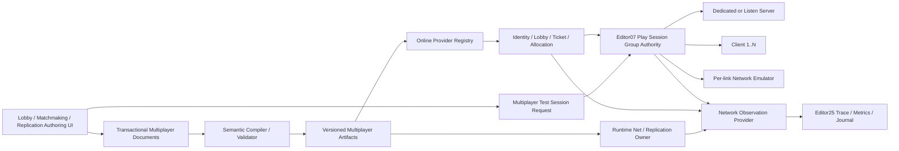

---
related_code:
  - zircon_editor/assets/ui/editor/components/workbench/modules/extensions/multiplayer
  - zircon_editor/src/ui/retained_host/workbench_preview_actions/extensions.rs
  - zircon_editor/src/ui/retained_host/callback_dispatch/template_bridge/workbench/module_field_edit.rs
  - zircon_editor/src/ui/template_runtime/builtin/workbench_extension_module_template_bindings/online_sessions.rs
  - zircon_editor/src/ui/retained_host/callback_dispatch/template_bridge/workbench/extension_module_navigation/specs/online_sessions.rs
  - zircon_editor/src/ui/retained_host/callback_dispatch/template_bridge/workbench/module_command_feedback.rs
  - zircon_editor/src/core/play
  - zircon_editor/src/ui/host/editor_host_event_controller.rs
  - zircon_plugins/net/editor
  - zircon_plugins/net/features/replication/runtime
  - zircon_plugins/net/features/rpc/runtime
  - zircon_plugins/net/runtime
  - zircon_plugins/first_party_editor_catalog
  - zircon_plugins/first_party_runtime_catalog
  - zircon_runtime/src/core/framework/net
  - zircon_app/src/entry/first_party_editor_plugins.rs
plan_sources:
  - docs/plans/optimize/00-engine-wide-review.md
  - docs/plans/optimize/zircon_runtime/08e-network-runtime-review.md
  - docs/plans/optimize/zircon_editor/02-document-transaction-save-autosave-recovery-review.md
  - docs/plans/optimize/zircon_editor/04-asset-index-import-reimport-catalog-thumbnail-reference-workflow-review.md
  - docs/plans/optimize/zircon_editor/05-inspector-reflection-property-authoring-customization-review.md
  - docs/plans/optimize/zircon_editor/07-play-session-process-pie-game-view-live-edit-recovery-review.md
  - docs/plans/optimize/zircon_editor/09-background-jobs-admission-scheduling-cancellation-progress-shutdown-product-integration-review.md
  - docs/plans/optimize/zircon_editor/11-logging-diagnostic-journal-output-console-status-routing-retention-export-review.md
  - docs/plans/optimize/zircon_editor/25-runtime-diagnostics-performance-timeline-console-telemetry-observability-authoring-review.md
reference_engines:
  - dev/UnrealEngine/Engine/Plugins/Online/OnlineSubsystem/Source/Public/Interfaces/OnlineSessionInterface.h
  - dev/UnrealEngine/Engine/Plugins/Online/OnlineSubsystem/Source/Public/OnlineSessionSettings.h
  - dev/UnrealEngine/Engine/Source/Editor/UnrealEd/Classes/Settings/LevelEditorPlaySettings.h
  - dev/UnrealEngine/Engine/Source/Editor/UnrealEd/Classes/Settings/LevelEditorPlayNetworkEmulationSettings.h
  - dev/UnrealEngine/Engine/Plugins/Runtime/ReplicationGraph/Source/Public/ReplicationGraph.h
  - dev/UnrealEngine/Engine/Source/Runtime/Net/Iris/Public/Iris/ReplicationSystem/ReplicationSystem.h
  - dev/UnrealEngine/Engine/Source/Runtime/Net/Iris/Public/Iris/ReplicationState/ReplicationStateDescriptor.h
  - dev/UnrealEngine/Engine/Plugins/Runtime/NetworkPredictionInsights/Source/NetworkPredictionInsights/Public/INetworkPredictionProvider.h
  - dev/godot/modules/multiplayer/editor/replication_editor.h
  - dev/godot/modules/multiplayer/editor/replication_editor.cpp
  - dev/godot/modules/multiplayer/editor/editor_network_profiler.h
  - dev/godot/modules/multiplayer/editor/editor_network_profiler.cpp
  - dev/godot/modules/multiplayer/scene_multiplayer.h
  - dev/godot/modules/multiplayer/scene_replication_config.h
  - dev/godot/scene/main/multiplayer_api.h
doc_type: review-and-refactor-plan
review_status: review_complete
implementation_status: pending
source_recheck_required: true
---

# 26 · Multiplayer Lobby / Matchmaking / Online Services / Replication / Network Emulation / PIE Authoring 工程化差距

## 1. 结论

Zircon并非没有网络基础。Runtime已经定义Dedicated Server、Client、Listen Server三种mode，拥有typed Hello/Challenge/Login/Welcome/NetSpeed/Failure/Join控制消息、session policy与报告；RPC有direction、schema、quota、request/session ID和queue；Replication有descriptor、authority、strategy、field bytes、interest、budget、delta、schedule、late join与本地测试。这些基础应由Runtime 08E继续收敛到真实world/connection/transport owner，本篇不重复推倒。

但Editor当前公开的Lobby Editor与Matchmaking Editor不是这些基础的创作入口，而是两份固定样例。Lobby始终显示`Lobby_Default`、8 slots、4 players、Windows/Console crossplay warning；Matchmaking始终显示Ranked、Bronze/Gold/Diamond/Backfill、6 queues、128 players与2 warnings。两份ZUI各有19条event route，合计40个安装binding；tab/row只改变选中态，field edit/commit只改control的`value`与`value_text`，Simulate/Validate直接写固定成功或warning文本。代码库中不存在Lobby、Party、Matchmaking、Ticket、Allocation、Backfill、Playlist、Crossplay、Online Identity或Online Service provider的production domain，因此这些数字没有数据owner。

Net Editor看起来提供了另一条更正式的入口：2个view、1个drawer、6个operation、3个inspector customization、`net.replication_schema`资产、graph editor与两个palette node。但默认first-party Editor catalog只装配Navigation和Neural，Net Editor不会随已选Net Runtime进入Editor；即使手工注册，`authoring.zui`、`listener_config.zui`、`route_config.zui`、`replication_schema.zui`和default TOML五个资源均不存在，6个operation也没有factory/handler，调用会落到`MissingFactory`。唯一focused test只验证descriptor字符串和palette存在，恰好没有解析资源、创建资产或调用operation。

所谓Replication Schema也没有source document、parser、semantic compiler、stable wire ID、artifact、migration或runtime install bridge。Runtime manager按component String注册descriptor，在进程内排序后分配临时dense index；它不连接World、Reflection、Component Registry或transport。Replication feature依赖NetManager，但factory忽略该依赖并创建孤立的`Arc<Mutex<HashMap...>>` manager。现有单元测试能证明局部delta/interest/budget/late-join算法运行，不能证明Editor创建的schema能驱动一个多客户端游戏。

多人模拟同样没有测试拓扑。Editor07已经确认`PlayStartRequest`没有server/client role、client count、port、account、network profile，process backend只拥有一个child，命令行也不携Play kind或拓扑。当前“Simulate Lobby/Match”既不会启动dedicated/listen server与多个client，也没有逐link latency/loss/duplication/reorder/bandwidth emulation，更没有身份、join、replication、prediction或disconnect trace。因此它无法验证一个规则，更不能作为性能优于Unreal的证据。

本轮登记5项P0、60项P1、12项P2和32个验收门。实施必须先撤销两份静态假产品和断路Net Editor，定义`Online Provider + Authoring Document + Compiled Artifact + Multiplayer Test Session + Observation`五层owner；再让Lobby/Matchmaking/Replication配置通过typed、versioned、transactional链进入真实provider与Runtime；最后才开放平台集成、规模化匹配和多机资格。任何provider凭据、玩家身份和平台政策都不能存进普通项目资产或日志。

## 2. 审查边界与证据

### 2.1 当前工作树物理范围

| 子域 | 文件 / 行数 / bytes | test attributes | 证据等级 |
|---|---:|---:|---|
| Workbench Lobby/Matchmaking、route、binding、field与feedback | 14 / 3,886 / 211,030 | 1 | E3：两份ZUI逐control及40个binding到最终UI mutation |
| Net Editor、first-party Editor/Runtime catalog与App装配 | 15 / 1,896 / 74,553 | 1 | E3：descriptor、资源URI、operation、palette、manifest与默认装配分支 |
| Runtime session、RPC与Replication focused implementation | 46 / 3,799 / 125,326 | 0 | E2/E3 owner handoff：typed合同、manager、factory、schedule、apply与transport断点 |
| Play topology bridge | 10 / 2,011 / 68,765 | 23 | E3：request、controller、单child backend、process args与状态测试 |
| focused tests | 28 / 4,863 / 172,863 | 93 | E3静态阅读：Workbench、catalog、Net Editor、RPC、Replication与Play tests |
| selected combined scope | 113 / 16,455 / 652,537 | 118 | 当前工作树fingerprint `55e857ec11f9239b6313db66b0d7e204c6af148851ce79d2522ac8b4f7cb498d`；0 ignored，3个在途文件 |

行数为物理文本行。fingerprint按相对路径排序，对每个文件计算SHA-256，再对`path<TAB>hash<LF>`清单计算SHA-256。范围内3个非本轮修改为`zircon_app/Cargo.toml`、`zircon_editor/src/core/play/tests.rs`和`zircon_editor/src/ui/template_runtime/builtin/workbench_extension_module_template_bindings/online_sessions.rs`；前者新增Runtime Host依赖，后两者分别含foreign output参数调整与import排序。本轮按当前工作树取证，不吸收、不回退，实施前必须复核diff并重算fingerprint。

两份Workbench各有154个`key = value`式节点/属性行和19条ZUI event route；安装binding为Lobby 20项、Matchmaking 20项。两者把Telemetry tab与其他tab一起注册，但没有独立panel model或provider；不能因为标签可点击就把它计为在线指标能力。

### 2.2 动态证据边界

本轮没有运行新的Cargo、Editor窗口、Net plugin加载、Lobby provider、match allocator、dedicated server、多client、packet capture、network emulation、跨平台登录、soak或规模测试。此前`zircon_editor --lib`测试编译在617.2秒后被239个既有错误和122个warning阻断，相关编译门没有出现足以越过阻断的变化，因此没有重复同一lane。118个test attribute是静态inventory，不是通过数；RPC/Replication test直接构造内存manager，Play test使用单backend fake，不能替代产品闭环证据。

### 2.3 参考边界

- Unreal Online Session接口定义Create/Start/Update/End/Destroy、Start/Cancel Matchmaking、Find/Cancel/Ping/Join、invite与player register/unregister的异步生命周期、delegate和typed join result；Session Settings定义public connections、join-in-progress、presence、invites、build ID、custom/member settings、search query与ping。本文吸收状态机和回执边界，不要求复制OnlineSubsystem类层次或一次实现所有平台。
- Unreal Play Settings明确区分standalone/listen/client、separate server、one-process、1到10 client、primary client、server port/args/map、server/client fixed FPS；Network Emulation Settings对server/client/all target及入站/出站latency/loss分别建模。它证明多人测试是拓扑和链路配置，不是一个“Simulate”按钮。
- Unreal Replication Graph按global/per-connection/shared node维护持久actor list，再做distance/frequency cull、merge和priority，以共享工作降低actor × connection复杂度；Iris把stable replication descriptor、poll/dirty/filter/priority/change mask与connection lifecycle分开。本文将其作为规模和artifact设计参考，不要求照搬UObject。
- Unreal Network Prediction Insights保存role、tick policy、network LOD、simulation tick、net receive、user state与fault，并通过trace version/data counter/read view提供分析。Editor25仍拥有通用trace产品，本篇只定义network provider与关联字段。
- Godot Replication Editor真实绑定`MultiplayerSynchronizer`和`SceneReplicationConfig`，支持property picker、ordered property set、spawn/always/on-change/watch与undo/redo，并对无效path和不支持type给出warning；Network Profiler能够capture/clear/autostart并按node/RPC/synchronizer统计in/out bandwidth、count与bytes。它是可验证的最小Editor产品下限。
- Godot SceneMultiplayer拥有peer auth callback/timeout、authenticated/pending peer、root path、refuse new connections、object decode policy、relay、sync/delta packet size与disconnect/clear；Multiplayer API定义RPC mode、authority与object configuration。本文不把它的API规模当作大规模在线服务上限。
- 本地Bevy与Fyrox参考树没有first-party game lobby/matchmaking stack；Bevy Remote只是远程检查，不是匹配服务。Unity Graphics参考树只含测试模板中的serialized network/multiplayer设置，不包含可审查的Netcode/Services源码。本篇不会用缺失参考替Zircon降低标准，也不猜测闭源行为。

## 3. 必须保留的真实基础

1. 保留`NetRuntimeMode::{DedicatedServer, Client, ListenServer}`，但必须让它进入真实启动配置和测试拓扑，而不是停留在DTO。
2. 保留typed控制消息、`NetSessionId`、session policy/state/report与handshake测试，后续将身份和role从认证connection派生。
3. 保留RPC direction、reflect payload schema、quota、correlation、priority queue和timeout报告，后续接入真实transport与session authority。
4. 保留Replication descriptor、authority、strategy、delta、interest、budget、schedule、spawn/update/despawn与late-join局部算法。
5. 保留Net Editor的asset contribution、toolkit、graph descriptor和capability思想；修复默认装配、资源和factory，而不是再造第三个编辑器。
6. 保留Editor07的process lifecycle、snapshot、output budget、plugin activation补偿和gateway基础，由它扩展`PlaySessionGroupAuthority`。
7. 保留Editor02 transaction/save/recovery、Editor04 catalog/import、Editor05 inspector、Editor09 jobs、Editor11 journal和Editor25 observation，不在本篇复制通用基础设施。
8. 保留Workbench的视觉入口和控件样式作为未来真实projection壳，但先关闭静态业务事实与伪成功。
9. 保留平台无关的provider抽象，允许EOS、Steam、console或自托管服务以后作为adapter接入；核心资产不能绑定单一供应商。
10. 保留Runtime08E已经登记的安全、transport、RPC与replication修复ownership，本篇通过显式接口消费其终态。

## 4. 目标架构与Owner边界

必须固定以下owner：

| 领域 | 唯一owner | 本篇接口 |
|---|---|---|
| project资产、dirty/undo/save/recovery | Editor02 | `LobbyDefinitionDocument`、`MatchmakingConfigDocument`、`ReplicationSchemaDocument`接入document transaction |
| asset catalog/import/artifact引用 | Editor04 | 三类source asset与compiled artifact registration |
| operation执行、job与诊断 | Editor08/09/11 | typed factory、job receipt、journal event |
| Play/PIE进程与world session | Editor07 | `MultiplayerTestSessionRequest`和`PlaySessionGroupAuthority` |
| socket/connection/session/RPC/replication runtime | Runtime08E | versioned install artifact、authenticated connection和observation events |
| metrics/trace/timeline/capture | Editor25 | `NetworkObservationProvider`，不新建第二套Timeline |
| online identity/lobby/matchmaking | Editor26 | provider-neutral registry、state machine、authoring与test orchestration |

建议的核心合同至少包括：

- `OnlineProviderRegistration { provider_id, capabilities, environments, schema_versions, credential_policy, owner_lease }`。
- `OnlineUserHandle`只携provider/environment/subject的opaque引用；access token、refresh token和platform secret必须来自secure credential lease，禁止序列化进资产、session archive或日志。
- `LobbyDefinitionDocument`保存stable lobby/schema/member attribute ID、join/presence/invite/capacity/crossplay policy与provider overrides；`MatchmakingConfigDocument`保存queue/rule/team/quality/expansion/backfill/allocation策略。
- `CompiledReplicationSchemaArtifact`携source revision、compiler version、schema version、wire protocol version、stable type/field/RPC ID、serializer/quantization/condition、compatibility hash与target capability。
- `MultiplayerTestSessionRequest`携server mode、process model、client count、ports/accounts/maps/build、join plan、seed、network profile和artifact revisions；每个实例/链路都有稳定ID。
- `OnlineOperationReceipt`与`TestSessionReceipt`必须有request ID、state transition、provider/source、deadline、retryability、terminal outcome和journal correlation。

## 5. P0：先关闭假产品与不可执行入口

### P0-1：Lobby与Matchmaking Workbench把fixture冒充在线产品

固定Lobby/slot/crossplay与queue/player/latency数据没有document、provider、runtime或receipt；40个binding只切选中态、改字符串或写固定反馈。立即从默认产品入口移除或明确标为Demo/Unavailable，直到数据来自真实source revision和provider/test session。

### P0-2：代码库不存在Online Service、Lobby或Matchmaking runtime authority

精确依赖与source扫描没有发现identity、party、lobby、ticket、playlist、backfill、allocation、crossplay或provider domain。`NetManager`只提供socket/HTTP/WebSocket/events/diagnostics，不能被UI改名成在线服务。先定义provider-neutral product boundary，再接自托管或平台adapter。

### P0-3：Net Editor默认不可达，手工加载后仍因5个资源和6个factory缺失而断路

first-party Runtime catalog能装配Net，Editor catalog却只映射Navigation/Neural；App也没有Net Editor依赖/feature。手工注册后所有surface/inspector/default document URI缺文件，operation调用返回`MissingFactory`。必须在manifest/catalog/resource resolver/factory端到端测试通过前撤销可用声明。

### P0-4：Replication Schema没有document/compiler/artifact/runtime install闭环

当前asset与graph仅是descriptor；Runtime只接受进程内String descriptor并生成临时index，未连接Reflection/World/transport。禁止让Create/Validate/Compile返回成功，直到同一source revision能被编译、hash、安装到server/client并由wire compatibility测试证明。

### P0-5：Simulate没有多人拓扑、真实provider或网络仿真，却宣称规则通过

Play只能启动一个child，request/CLI没有role、client count、port/account/profile；按钮不启动进程也不采集network evidence。必须先建立可终止、可观测的server + N clients session group与per-link emulation，再允许使用Simulate/Validate产品语义。

## 6. P1：资产、Document、Operation 与Provider配置

### P1-1：Lobby没有正式资产类型

新增stable asset kind、factory、toolkit、thumbnail、reference extraction、create template和runtime/provider consumer，不能把ZUI control状态当document。

### P1-2：Matchmaking配置没有正式资产类型

Playlist、queue、rule、team、quality、expansion、backfill和allocation必须进入versioned source document，而不是自由String。

### P1-3：Replication Schema graph没有canonical source model

定义stable node/pin/property ID、ordered declarations、unknown-field preservation和lossless round-trip；palette只是projection，不是schema本身。

### P1-4：三类多人资产没有Editor02 transaction接线

所有add/remove/reorder/rename/property edit必须产生可逆changed-path command、dirty revision和undo/redo；field commit不能继续直接改control字符串。

### P1-5：Save/Close/Autosave/Recovery语义未定义

接入revision CAS、atomic write、external conflict、autosave journal和crash recovery；provider-side变更不能覆盖未保存本地revision。

### P1-6：引用关系没有stable identity

Lobby对map/ruleset、Matchmaking对playlist/lobby/build、Replication对reflect type/component/RPC的引用必须进入Editor04 reference graph并支持rename/move/redirect。

### P1-7：Validate没有semantic diagnostic schema

诊断需含stable code、severity、asset/revision、typed path、source range/node、provider capability和fix action，禁止只返回“1 warning/2 warnings”。

### P1-8：Compile没有artifact identity

编译输出需含source hash、compiler/schema/wire version、target/provider capability、dependency manifest和content hash，并由artifact store原子发布。

### P1-9：operation descriptor没有factory/handler

为create/open/validate/compile/listener/route提供typed payload、authorization、cancel/deadline、receipt与undo/job边界；missing factory必须在注册时被拒绝。

### P1-10：Net Editor缺少默认产品装配合同

生成式catalog必须从manifest投影Runtime/Editor pair，覆盖enable/disable/target/dedup/resource/package tests；不能手写只支持两个plugin的分支。

## 7. P1：Identity、Session、Lobby 与Online Provider

### P1-11：没有provider registry与capability negotiation

定义Identity、Presence、Friends、Lobby、Session、Matchmaking、Allocation、Stats等独立capability；UI只显示当前environment/provider真实支持的功能。

### P1-12：没有environment隔离

Development、Certification、Staging与Production的endpoint、app ID、build policy和credential scope必须显式分离，禁止资产内自由URL切换生产环境。

### P1-13：没有安全credential owner

Editor应通过OS keychain/平台登录/短期lease获得凭据；secret必须redact、过期、撤销且绝不进入项目文件、CLI、diagnostic payload或crash artifact。

### P1-14：`player_id`与静态nonce不构成认证身份

Runtime08E必须把session identity/role从已认证connection与provider assertion派生；Editor只能选择test account lease，不能直接声明caller role或玩家ID。

### P1-15：没有login/logout/refresh状态机

定义signed-out/authenticating/authenticated/refreshing/expired/revoked/offline及terminal receipt；重启、账号切换和provider断线必须generation-fenced。

### P1-16：Lobby lifecycle缺失

至少支持Create/Join/Leave/Update/Destroy、owner transfer、member register/unregister、invite与join-in-progress policy，并明确异步中间态和失败补偿。

### P1-17：Lobby attributes没有schema

Lobby/member attribute需stable key/type/visibility/write authority/index/query semantics、length/cardinality budget与migration；禁止任意String map直通provider。

### P1-18：成员并发更新没有revision/CAS

capacity、ready、team、slot与owner变化必须携server revision或etag，冲突不能last-write-wins后仍显示成功。

### P1-19：Presence、invite与deep link没有边界

区分provider presence、game session joinability与Editor test session；invite/deep link需要验证environment/build/project和用户授权。

### P1-20：跨平台与合规不能由一个checkbox表示

Crossplay、cross-progression、voice/UGC/parental/age/region/entitlement是provider和平台policy结果；UI应展示capability与拒绝原因，不能固定“Windows/Console Warning”。

## 8. P1：Matchmaking、Quality、Allocation 与Backfill

### P1-21：没有typed matchmaking ticket状态机

定义Create/Search/Queued/Expanding/Matched/Allocating/Connecting/Completed/Cancelled/Expired/Failed，所有transition携ticket generation与terminal receipt。

### P1-22：queue/playlist/rule identity是自由String

使用stable ID、display name、version与redirect；rename不能改变线上协议identity，删除需检查active ticket与deployment引用。

### P1-23：rule表达式和类型系统缺失

属性比较、range、set、distance、team aggregation、hard/soft constraint、weight与missing-value policy需要可验证AST和provider lowering，而不是`Rule_Latency`标签。

### P1-24：扩展搜索策略缺失

定义time-bucket expansion、allowed relaxation、upper bound、deterministic ordering和audit trace，避免等待越久无界降低所有质量门。

### P1-25：网络质量采样没有source

region latency/jitter/loss/relay/route应来自版本化QoS probe与freshness，含采样预算、超时、失败和隐私边界；不能写死42/48/58/62 ms。

### P1-26：party/group matchmaking缺失

ticket需要party revision、成员、leader、crossplay/entitlement、skill aggregate和原子accept/cancel，避免部分成员进入不同match。

### P1-27：team assembly与容量约束缺失

定义team size/count、role composition、party preservation、skill/latency tradeoff、bot/empty slot policy和可解释结果。

### P1-28：backfill不是一行“Queued”状态

建立match/server slot revision、reservation、expiry、reconnect、join-in-progress、replacement和cancel race合同，且不会超过服务器实际capacity。

### P1-29：server allocation与reservation缺失

匹配成功后需要build/map/region/fleet allocation、health/readiness、connection token、reservation TTL和失败重试；ticket不能直接假定有可加入服务器。

### P1-30：没有可重放的匹配解释与离线仿真

保存去标识化input fixture、config revision、seed、candidate elimination/score/expansion trace和expected outcome；离线仿真必须与provider lowering版本对应。

## 9. P1：Replication Schema、Compiler 与Runtime Bridge

### P1-31：type/component绑定没有Reflection identity

用stable reflect type/component ID与schema revision替代component name String；rename、module unload、unknown type和hot reload必须显式处理。

### P1-32：field只有name与raw bytes

descriptor必须记录serializer、wire type、quantization、range/default、condition、reliability、owner、delta/change mask与兼容规则。

### P1-33：dense index不具备跨build稳定性

stable wire ID由compiler分配并写入artifact；server/client使用相同compatibility hash验证，运行时排序只能用于内部cache，不能成为协议。

### P1-34：schema evolution与兼容策略缺失

定义add/remove/rename/type-change/quantization-change、deprecated field、version negotiation、rollback和mixed-build policy；不兼容必须在join前失败。

### P1-35：RPC schema未并入同一协议artifact

RPC ID、direction、payload/response type、reliability、channel、quota和authorization需与replication schema共享build/wire compatibility manifest。

### P1-36：authority/ownership没有绑定World实体

Runtime08E应从world-scoped net driver、authenticated connection和entity ownership派生send/apply permission，不能由调用者传role或任意snapshot。

### P1-37：spawn/despawn与scene/prefab资产未连接

定义network object archetype/prefab ID、spawn authority、initial state、dependency、late join、tear-off与despawn reason；Editor可追踪到真实asset/reference。

### P1-38：interest group只是精确String list

建立可扩展interest policy接口、spatial/team/owner/always/dormancy节点、per-connection state和budget telemetry；Editor显示规则成本与覆盖，而非静态group。

### P1-39：schedule在单mutex内clone/sort全部snapshot

Runtime08E负责dirty list、persistent per-connection candidate set、frequency bucket、priority、baseline/ack和分片预算；Editor compiler需输出可执行policy metadata。

### P1-40：byte budget不含真实wire成本

预算必须计算packet/channel/entity/component/field header、compression/encryption/FEC与retransmission，报告estimated和actual bytes及drop/defer reason。

### P1-41：Transform插值启发式不是typed smoothing

禁止按component名字含`transform`且读取首4字节；schema应声明typed serializer、interpolation/extrapolation、buffer、teleport、error threshold与prediction owner。

### P1-42：没有compile-to-runtime一致性测试

从Editor source编译artifact，启动server/client加载相同hash，执行spawn/update/despawn/RPC/late join/mismatch/rollback并对wire golden与world state做断言。

## 10. P1：多人PIE、网络仿真、观测与工程资格

### P1-43：`PlayStartRequest`没有多人拓扑

扩展为server kind、client count、process model、primary client、ports、maps、accounts、build/artifact revision和join plan；普通Play仍可投影为单实例请求。

### P1-44：Play backend只拥有一个child

Editor07建立session group与per-instance state/handle/output/gateway，支持ordered start、readiness barrier、partial failure、stop/reap和crash isolation。

### P1-45：Dedicated/Listen/Client mode没有进入CLI与Runtime config

每个实例必须收到typed role、session group/instance ID、endpoint、artifact和credential lease reference，并在handshake回报实际配置。

### P1-46：端口与临时目录分配没有authority

实现原子reservation、collision retry、IPv4/IPv6/interface policy、per-instance sandbox和清理receipt；禁止用固定端口或共享输出覆盖。

### P1-47：测试账号与身份切换未定义

使用明确授权的test identity pool/credential lease、并发占用与revoke；禁止把真实用户token复制给N个child或写入命令行。

### P1-48：没有per-link Network Emulation

定义方向、latency range/distribution、loss、duplication、reorder、corruption、bandwidth、queue、burst与seed，分别作用于server/client/特定link并显示effective profile。

### P1-49：网络仿真没有可重放性

profile、seed、start time、packet decision与topology revision进入capture artifact；同build同input可复现实例间故障序列。

### P1-50：缺少connection/session/lobby/ticket统一状态视图

UI按provider user、lobby、ticket、allocation、transport connection、net session、world和instance显示关联图及generation，禁止用一个selected row混合所有层级。

### P1-51：缺少packet/channel/RPC/replication观测provider

向Editor25注册typed network tracks：bytes/packets、RTT/jitter/loss、queue/drop、channel、RPC、replication candidates/selected/deferred、correction/fault与ticket transition。

### P1-52：没有对象级复制检查器

支持按instance/connection/entity/component/field查看authority、last change、baseline/ack、priority、frequency、bytes、dormancy/interest与why replicated/not replicated。

### P1-53：Telemetry tab没有数据治理

本地PIE trace与线上运营telemetry必须分离；线上数据需要consent、redaction、tenant、retention、sampling、deletion和provider auth，默认关闭。

### P1-54：在线错误没有统一journal与action

provider/session/transport/schema/test failure写入Editor11 typed diagnostic，带correlation、retryability、source jump和安全redaction；UI不能只覆写一行output。

### P1-55：测试只验证descriptor和孤立manager

补充resource resolution、operation invocation、document round-trip、compiler golden、catalog装配、provider fake、multi-process topology、network emulation、disconnect和artifact mismatch测试。

### P1-56：缺少容量与DoS预算

为lobby/member/attribute/ticket/candidate、connection/channel/RPC、replication object/field/queue、trace与UI row定义entry/bytes/rate/age/owner配额和拒绝计数。

### P1-57：缺少大规模匹配基准

建立10K/100K tickets、party/team/backfill/expansion数据集，报告吞吐、P50/P95/P99等待与质量、CPU/内存/网络成本；结果必须带算法/config/build/硬件版本。

### P1-58：缺少多人复制规模基准

覆盖1/8/32/128 connections、1K/10K/100K network objects、静态/移动/热点分布、late join和packet loss，记录server tick、per-client bytes、memory与tail latency。

### P1-59：缺少故障与恢复矩阵

覆盖provider timeout/rate limit、ticket cancel race、allocation crash、server/client crash、credential expiry、NAT/route failure、packet burst loss、schema mismatch、reconnect和Editor shutdown。

### P1-60：产品成熟度与发布声明没有证据门

manifest的beta/partial、Editor可见性、平台认证与“complete/stable”必须由G01-G32的artifact驱动；没有跨平台、规模、安全、soak与可恢复证据时不得宣称工程级多人完成。

## 11. P2：完整性、扩展性与高级能力

### P2-1：Party、Lobby、Game Session与Match需要统一术语表

定义identity和state关系，避免`NetSessionInfo`被误用为平台Online Session，或把Lobby直接等同正在运行的match server。

### P2-2：平台provider需要adapter合规矩阵

记录capability差异、认证/邀请/朋友/跨玩/认证要求和降级行为，但不让平台特例污染核心document。

### P2-3：NAT traversal、relay与P2P策略尚未设计

进入独立安全与运维里程碑，含ICE/STUN/TURN或平台relay、地址隐私、anti-amplification和fallback；不能临时把公网地址直传客户端。

### P2-4：跨区域与fleet迁移尚未设计

后续支持region failover、server drain、session migration、reservation transfer和state handoff，建立明确一致性与玩家体验门。

### P2-5：Replay与deterministic network recording未定义

将packet、input、RPC、replication和world checkpoint版本化，用于bug重现；它与在线anti-cheat evidence需隔离权限和隐私。

### P2-6：Prediction/rollback/lag compensation需要专项authoring

定义input command、state history、correction、rewind query、hit validation和debug trace；不要把固定100ms interpolation扩展成万能方案。

### P2-7：Voice、text chat与moderation不在当前domain

未来作为独立provider capability处理encryption、consent、block/report、parental control、retention和平台政策，不能塞入普通RPC。

### P2-8：Anti-cheat与server trust未定义

需要signed build、attestation、authoritative validation、abuse/rate policy和evidence access control；Editor test bypass必须在Shipping不可用。

### P2-9：Graph authoring的可访问性与规模体验未定义

Replication/Matchmaking graph需要键盘导航、非颜色诊断、outline/table等价视图、虚拟化和大型schema搜索。

### P2-10：多人配置的团队协作与merge未定义

为stable node/field/rule ID提供结构化diff/merge、ownership、review annotation和冲突诊断，避免依赖整文件文本冲突。

### P2-11：Provider deployment与schema rollout工具缺失

未来需要dry-run、canary、compatibility window、rollback、audit和environment promotion；Editor Save不能直接修改Production。

### P2-12：参考引擎不能被表面功能数量等同

Unreal Online/PIE/Replication、Godot scene multiplayer与本地缺失的Bevy/Fyrox/Unity网络参考覆盖层次不同；验收应基于Zircon自身正确性、规模和证据，而非控件数量。

## 12. 当前第二Authority与断路清单

| Surface / Authority | 当前显示或承诺 | 实际authority | 决策 |
|---|---|---|---|
| Lobby Editor Workbench | Lobby_Default、8 slots、4 players、crossplay warning、Simulate/Validate | 固定ZUI + control mutation + fixed feedback | 立即Demo/Unavailable；未来投影Lobby document/provider/test session |
| Matchmaking Editor Workbench | Ranked、6 queues、128 players、latency/backfill、Simulate/Validate | 固定ZUI + control mutation + fixed feedback | 立即Demo/Unavailable；未来投影Matchmaking document/ticket simulator |
| Net Editor views | Network、Diagnostics、listener/route/schema commands | 默认catalog未装配；5资源缺失，6 operation无factory | 修复为唯一Net authoring plugin或撤销发布 |
| Replication Schema asset/graph | Create/Open/Validate/Compile与两个node | 只有descriptor，无source/compiler/artifact/runtime bridge | 建立canonical source和shared compiler后再开放 |
| Runtime RPC manager | session/handshake/RPC/quota/queue | 独立内存manager，身份/role由caller输入，未连transport | Runtime08E收敛到authenticated world-scoped driver |
| Runtime Replication manager | delta/interest/budget/schedule/late join | 独立String/raw-byte manager，未连World/Reflection/transport | Runtime08E消费compiled schema并接真实connection/world |
| Editor Play backend | Play/Simulate单child | 无role/topology/network profile | Editor07升级session group；本篇只提交typed multiplayer request |
| Telemetry tabs | Lobby/Matchmaking Telemetry | 无provider、schema或数据治理 | 删除/Unavailable；线上数据经Editor25可选provider |

## 13. 分层重构里程碑

### M0：Truthfulness、Owner与基线冻结

关闭两份静态成功与断路Net Editor入口；重算113文件fingerprint；记录现有resource/factory/catalog/Play/Runtime断点并冻结Editor02/04/07/09/11/25与Runtime08E owner。

### M1：Canonical Documents与操作闭环

建立Lobby、Matchmaking、Replication三类versioned source document、factory/toolkit、transaction/save/recovery、reference graph、typed operation和semantic diagnostics。

### M2：Compiler、Artifact与Protocol Compatibility

实现stable IDs、provider lowering、replication/RPC wire manifest、content hash、schema evolution、golden/round-trip与server/client install接口。

### M3：Online Provider、Identity与Environment

建立provider registry/capability、environment隔离、secure credential lease、user identity/login lifecycle、redaction与fake provider testkit。

### M4：Lobby与Online Session产品

实现Create/Join/Leave/Update/Destroy、member/attribute/revision/capacity/invite/presence/build policy与typed async receipt。

### M5：Matchmaking、QoS、Allocation与Backfill

实现ticket/rule/expansion/party/team/QoS/allocation/reservation/backfill状态机、可解释trace、离线deterministic simulator和provider adapter。

### M6：Runtime Replication/RPC Integration

由Runtime08E把compiled artifact接入Reflection/World/connection/transport，完成stable wire ID、ownership、interest、baseline/ack、typed smoothing和规模预算。

### M7：Multiplayer Play Session Group与Emulation

由Editor07建立server + N clients的process/session group、port/account/sandbox/readiness/termination与per-link deterministic network emulation；本篇接入artifact/provider/join plan。

### M8：Network Inspector、Trace与Failure Workflow

向Editor25注册connection/ticket/RPC/replication/prediction tracks和对象检查器，向Editor11写typed diagnostics，完成disconnect/reconnect/crash/schema mismatch与artifact导出。

### M9：规模、安全、平台与发布资格

执行100K ticket、128 client/100K object、loss/latency、soak、credential/PII、provider rate limit、跨平台和deployment rollback门；通过前保持beta/partial并禁止工程级完成声明。

## 14. 验收门禁

1. **G01 Truthfulness**：默认产品没有固定Lobby/queue/player/latency/warning和无receipt成功文案。
2. **G02 Unique authority**：Lobby、Matchmaking、Replication Schema各只有一个document/product owner；Workbench只是projection。
3. **G03 Catalog reachability**：选择Net时Runtime/Editor provider按target正确装配，disable/dedup/缺包均有明确结果。
4. **G04 Resource resolution**：5个Net Editor URI及所有新增template在source、embedded和dynamic package中解析一致。
5. **G05 Operation execution**：6个operation均有factory、typed payload、authorization、deadline/cancel和terminal receipt；注册时拒绝MissingFactory。
6. **G06 Transactional documents**：三类资产的edit/undo/redo/save/conflict/autosave/recovery保持revision与changed path一致。
7. **G07 Lossless source**：unknown/new字段和稳定node/field/rule ID经load-edit-save不丢失、不重排语义。
8. **G08 Semantic diagnostics**：无效引用、类型、容量、规则、provider capability和schema compatibility产生稳定code与source jump。
9. **G09 Artifact identity**：compile产物含source/compiler/schema/wire/provider/target版本、dependency和content hash。
10. **G10 Compatibility**：同artifact server/client可加入；不兼容build在建立游戏session前以typed reason拒绝。
11. **G11 Provider isolation**：Development/Staging/Production配置、凭据和数据严格隔离，项目资产不能携secret。
12. **G12 Identity binding**：玩家subject、connection、session与role来自认证链，caller不能伪造`player_id`或role。
13. **G13 Credential safety**：token不会进入文件、CLI、日志、trace、crash或子进程环境dump；expiry/revoke可终止会话。
14. **G14 Lobby lifecycle**：Create/Join/Update/Leave/Destroy及owner/member/capacity race有revision、idempotency和补偿测试。
15. **G15 Attribute schema**：Lobby/member attribute的type/visibility/authority/query/length/cardinality受schema与budget控制。
16. **G16 Match ticket**：Create/Cancel/Expire/Matched/Allocate/Connect每条race只产生一个合法terminal outcome。
17. **G17 Match quality**：QoS freshness、party/team、constraint/expansion/backfill与解释trace可重放并匹配config revision。
18. **G18 Allocation**：build/map/region/fleet readiness、reservation TTL、connection token和失败重试不产生幽灵server或超卖slot。
19. **G19 Stable wire IDs**：type/component/field/RPC ID跨进程、平台和build可复现；rename通过migration/redirect处理。
20. **G20 World ownership**：spawn/update/despawn/RPC权限从world/entity/authenticated connection派生，未授权输入被拒绝并计数。
21. **G21 Replication scale**：per-connection persistent interest/priority/baseline避免每tick全量clone/sort，满足目标CPU/内存/bytes预算。
22. **G22 Wire budget**：预算含全部header、compression/encryption/retransmission，estimated/actual/deferred/drop可观察。
23. **G23 Typed smoothing**：插值/外推/teleport/prediction由schema type和policy驱动，不使用名字或raw first-f32启发式。
24. **G24 Session topology**：可启动Dedicated或Listen server及1..N client，每实例role/port/account/world/build可检视。
25. **G25 Lifecycle recovery**：任一实例start/crash/stop/reap失败不会丢失其handle或让session group假Running/Stopped。
26. **G26 Network emulation**：每link/方向latency/loss/dup/reorder/bandwidth生效，seed与packet decision可重放。
27. **G27 Readiness and join**：provider allocation、server readiness、client join与world ready有barrier、timeout、cancel和partial outcome。
28. **G28 Network observation**：ticket、connection、packet/channel/RPC/replication/correction有typed source/sequence/generation并进入Editor25。
29. **G29 Replication inspector**：任意对象可解释why/why-not、authority、interest、priority、baseline/ack、bytes与last change。
30. **G30 Bounded resources**：provider、ticket、connection、RPC、replication、trace和UI在恶意/规模fixture下遵守entry/bytes/rate/age预算。
31. **G31 Failure/security/privacy**：覆盖credential expiry、rate limit、cancel race、server/client crash、schema mismatch、disconnect/reconnect和PII redaction。
32. **G32 Product and scale evidence**：100K ticket、128 client/100K object、长时soak、跨平台与rollback artifact通过后才允许提升maturity。

## 15. 禁止的临时修补

- 禁止把固定Lobby、queue、玩家数或延迟换成随机数、当前socket计数或计时器后继续称为Simulate。
- 禁止新增第三份Lobby/Matchmaking manager来绕过Runtime08E的canonical network owner。
- 禁止把`NetSessionInfo`改名为Online Session，二者处于不同产品层。
- 禁止只创建5个空ZUI文件来让resource existence test变绿。
- 禁止只给6个operation注册返回`Ok(())`的factory而没有document/job/runtime receipt。
- 禁止把provider token、platform secret、真实用户ID写进TOML、asset、CLI、日志或trace。
- 禁止用自由String component/field/RPC name或运行时排序index作为稳定wire protocol。
- 禁止把`Arc<Mutex<HashMap>>`内存manager的单元测试称为多人网络产品测试。
- 禁止继续按名字包含`transform`或首4字节f32推断插值类型。
- 禁止让多人Play继续共享固定端口、目录、账号、output或artifact路径。
- 禁止在UI线程同步等待login、lobby、match、allocation、compile或多进程ready。
- 禁止把线上Telemetry默认启用，或把PIE trace自动上传到任何provider。
- 禁止用单机loopback平均值证明优于Unreal；必须公开build、硬件、拓扑、数据集、tail latency和完整artifact。
- 禁止在G01-G32未通过时把manifest从beta/partial提升为stable/complete。

## 16. 本轮产出边界

本轮只完成静态review与分层重构计划，不修改Runtime、Editor、plugin、ABI、测试或产品资源，不连接外部Online provider，也不宣称动态测试通过。下一轮实现必须从M0开始，在任何源码编辑前复核3个在途文件、重算113文件fingerprint，并确认Runtime08E、Editor02/04/07/08/09/11/25的最新owner终态。只有G01-G32全部产生可复核artifact后，Lobby、Matchmaking、Replication Schema或Multiplayer Simulate才可被标记为工程级产品。
