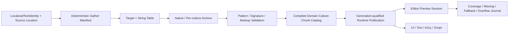

# Editor264 · Localization / String Table / Culture / Gather / Import / Export / Pseudo / Preview 当前工作树复核

## 1. 结论

Editor210之后，Editor shell本地化出现了值得保留的实质进展。`en.toml`与`zh-CN.toml`已从各79个键增长到各532个键，两个集合完全一致且无重复；其中`command.*`占422个、`settings.*`占39个、`editor.*`占38个、`menu.*`占33个。Command descriptor已经删除literal display/description和string menu path，改为stable operation ID派生的typed label/description key、typed menu segment ID/key以及locale-bound palette/menu projection。插件Command和SettingsPage能够绑定ticket-owned immutable bundle，验证owner和部分引用键，并随contribution generation撤销。这修复了Editor210所记录的命令字面值主路径，因此P1-50由Open重判为Partial。

Editor I18N service本身也不是临时全局map。它具备显式service依赖、不可变catalog value、settings generation fence、captured-locale lookup、32-event/64-byte有界locale事件队列、drop/resync统计和composition-root message sink。Notification/Decision/Settings/Command投影会捕获同一locale，避免单次复合投影混用两个语言代际。这些基础应保留。

但当前仍不是工程级Localization产品。Editor没有Localization Target、String Table source asset、native/per-culture Archive、Gather Manifest、PO/CSV/XLIFF roundtrip、stale/review/conflict状态、compiled message AST、catalog generation、pseudo-localization或authority-backed Dashboard。`EditorLocale`仍是自制的近似tag parser；built-in bundle只做exact locale -> English -> raw key，plugin bundle甚至不要求English/native culture、跨culture key parity或argument signature一致。唯一带参数的shell message仍由手写brace扫描器只替换`u64`。

作者预览也没有闭环。UI Asset Editor只展示localized-ref extraction、dependency和missing table/key诊断；locale选项固定为`authoring-fallback/en-US/zh-CN`，unknown值静默回退；`compile_preview(document, preview_size, imports)`不接收culture、catalog或Localization service。Runtime compiler仍以空String绕过localized String schema，render和Accessibility仍只消费scalar string。当前产品语料516个`.zui/.toml`文件、298个ZUI，`text_key=0`、`label_key=0`；同一语料仍有`text=2937`、`label=169`、`title=12`、`placeholder=64`、`tooltip=15`、`description=197`处字面值。

因此shipping结论保持严格：**P0 4 Open / 1 Partial；P1 43 Open / 17 Partial / 0 Closed；P2 12 Open；Gate 25 Fail / 7 Partial / 0 Pass**。正确目标是让Editor投影Runtime202定义的公共Culture/LocalizedText/Catalog authority，并建立`source identity -> deterministic gather -> target/table/archive -> validate/import/export -> compiled catalog -> generation publication -> real preview/runtime`唯一链，而不是继续扩展embedded TOML或hard-coded locale菜单。

## 2. 冻结范围与证据等级

统计规则：路径去重；物理行与非空行按磁盘当前内容统计；tests统计Rust `#[test]`/`#[tokio::test]`，参考测试另统计Unreal Automation与Godot `TEST_CASE`；fingerprint为相对路径排序后，对`path<TAB>file_sha256<LF>`再次计算SHA-256。选择集读取当前共享工作树，不回退到HEAD。

| 范围 | files | lines | non-empty | bytes | tests | ignored | fingerprint |
|---|---:|---:|---:|---:|---:|---:|---|
| Editor shell I18N、Command、Settings、Notification、Extension、UI Asset Preview | **129** | **28,675** | **26,184** | **1,024,165** | **218** | **0** | `2f6219570741ee5f6b3811d11aacb3f24f04263c5cffc10fca390cbda7e9c0a3` |
| Runtime/UI/Project/App邻接合同 | **33** | **4,919** | **4,412** | **174,989** | **30** | **0** | `5458745d8a7c444b0894b4ad5594bf33b8f33b56dd03d3f67f2c494acef6b143` |
| Product `.zui/.toml` corpus | **516** | **66,403** | **57,855** | **3,549,609** | **0** | **0** | `f89d5404e33fadc9f64b2a72c0cd4cb475511e862a1e267a9203661c6f0f11cc` |
| Zircon选择集去重总计 | **678** | **99,997** | **88,451** | **4,748,763** | **248** | **0** | `6b8c46a9f04d5c9d2c0a84df5622fea905d3d548b5e006f447d7746a4c46a8ad` |
| Unreal/Godot/Bevy/Fyrox/Unity Graphics参考 | **34** | **7,572** | **6,254** | **315,807** | **10** | **0** | `30e2264d150f70e29f2aee6d3c138201294616b851e7006202c9ed861fdb667d` |

冻结时HEAD为`14c89f9776bed828cc85e05e4b9914b3f8d1e784`，全仓`git status --short --untracked-files=all`为15,191项。共享工作树正在并发演进，因此本报告只对`2026-08-31T08:19:24.9507969+08:00`选择集负责；实施前必须重新扫描调用点、键集合、语料和指纹。

本轮是review-only。没有修改Rust、Cargo、ABI、TOML/ZUI生产资产或failure record，没有运行Cargo、Editor GUI、Runtime、gather/import/export/cook、locale switch、translated framebuffer、Accessibility、pseudo/RTL、fault、soak或benchmark。按用户要求排除Tooling审查，也没有查询、轮询、等待或实时跟踪协调器。

## 3. 当前存在且必须保留的底座

1. `EditorLocalizationKey`和`EditorLocalizationBundleId`已在反序列化边界验证稳定identity，不再允许任意空白literal混入Command/Settings主路径。
2. Built-in catalog是immutable locale map，必须含English fallback，拒绝非法locale、非法key和空translation；两份当前bundle各532键且集合相等。
3. `EditorI18nService`显式持有catalog，locale由Settings authority同步，迟到settings generation不能覆盖新locale。
4. Locale event queue有明确event/byte上限、backpressure、coalesced resync和failed-resync保留，consumer故障不会无限积压。
5. Command presentation把stable operation identity与localized label/description分离；menu root/group/leaf也有stable segment ID和label key，palette按locale重建索引而复用neutral seed。
6. Plugin Command bundle在materialization后绑定immutable contribution snapshot；SettingsPage验证bundle owner及label/description/category key，projection同时捕获contribution generation与locale。
7. Notification projection捕获一次locale，Decision argument有数量、名称、byte和类型边界；手写formatter虽不完整，但single-pass和bounded producer contract可作为未来compiled formatter调用层。
8. UI localized-ref DTO、recursive collector、structured diagnostic、package dependency manifest和source URI/key-presence report可迁移为Gather/usage证据，不应删除后重造。
9. Runtime text已有ICU4X BCP 47 normalization、language/script/region selector和language-sensitive font/glyph identity；Editor应消费公共Culture合同，而不是把`EditorLocale`继续扩成第二套ICU。
10. Editor transaction、document save/recovery、Job、Contribution owner lease和Asset import framework可承载Localization source document与长任务，不应建立Localization专用平行基础设施。

## 4. 当前真实行为与断路

### 4.1 Shell catalog与Culture

`EditorI18nCatalog`只有embedded `en`和`zh-CN`值表、一个`RwLock<EditorLocale>`以及exact active -> English -> raw key fallback。它没有native culture、parent culture、project fallback、domain priority、source revision、catalog generation、load receipt或reader lease。locale切换只改变active tag，不代表某个compiled catalog已成功发布。

`EditorLocale::parse()`要求2到3字母language，随后接受任意2到8位字母数字qualifier；两字母alpha qualifier转大写，其余统一小写。它不能完整表达或规范化BCP 47 script、numeric region、variant、extension、private use、alias和likely-subtag，也与Runtime `icu_locale_core::Locale`形成双authority。

Built-in catalog要求English存在，但不验证所有locale拥有相同key集合、message argument signature、markup/token、whitespace或unused key。当前两个文件相等是磁盘事实，不是schema invariant。唯一参数模板`editor.play.pending_edits.message`在两种语言中人工保留三个参数，但没有编译期签名门。

### 4.2 Plugin bundle与Extension表面

`EditorLocalizationBundle::from_locale_maps()`要求至少一个locale且每个locale至少一个非空value，但不要求English/native locale，也不要求各locale key parity。`contains_key()`只要任一locale定义key即返回true；SettingsPage或Command在一个culture有key即可通过注册，切到另一个culture可能退到English或raw key。

Command label/description会在`into_contribution_batch()`绑定bundle并验证key存在。Plugin menu segment的root/group/leaf key虽然typed，却没有同等的bundle key presence验证；菜单解析缺键时直接显示raw key。Serialized contribution中bundle ID必须等于package owner，这是正确owner约束，但当前`zircon_plugins`只有`editor_contribution_fixture`贡献LocalizationBundle，不能代表真实first-party plugin产品迁移。

SettingsPage V2已经消除literal label/description/category path；但Serialized View、Drawer、AssetType等贡献仍使用`title/category/display_name/badge`字面字段。Editor shell的本地化迁移不能只覆盖Command和Settings，否则扩展生态仍有多套presentation合同。

### 4.3 Command、Notification与事件消费

Built-in Command主路径已迁移：descriptor production shape不再保存literal `display_name`、literal description或`Option<String>` menu path，当前bundle中有422个`command.*`键和33个`menu.*`键。这个变化真实修复了Editor210对Command的主要静态判断，但还缺全catalog引用闭包、unused/missing key CI以及所有View/Drawer/Asset/toolbar/context action表面的统一identity。

Decision message formatter扫描`{name}`并只替换`u64`，unknown token原样保留；`{{...}}`没有正式escape grammar。它没有plural/ordinal/select/gender、number/date/time/unit/currency、rich text token或missing/wrong-type diagnostic。继续向该扫描器增加分支会形成第二个message language。

Composition root发布`zircon.editor.i18n.locale-changed.v1`与`locale-resync.v1`，但production source中未发现`EditorTopic::i18n()` subscriber；Settings window仍比较`revision.locale`进行刷新。Event存在不等于Retained Host已按affected key/catalog generation执行bounded invalidation。

### 4.4 UI Asset作者面板与真实Preview

`collect_document_localization_report()`和`validate_localization_report_against_catalog()`只支撑抽取候选、依赖、缺表/缺键和source path诊断。Session内`register_locale_table_keys()`注入的是测试/作者态key set，不保存translation value、message pattern、owner或generation；production没有项目catalog loader调用链。

`LOCALE_PREVIEW_OPTIONS`硬编码`authoring-fallback/en-US/zh-CN`。unknown action/locale被当作unhandled或静默归一到authoring fallback；列表不来自Project supported cultures、已加载domain、catalog snapshot或cultures-to-cook。没有pseudo开关、expansion ratio、accent/double-vowel、fake bidi、mirroring或fallback trace。

`compile_preview()`只接收document、size和UI imports。locale切换只刷新report/diagnostic，不向compiler、tree、render、text shaping、font fallback、caret、line break或Accessibility传入CultureSnapshot。当前测试只证明缺表/缺键诊断变化，不能证明译文进入画布或screen reader。

### 4.5 Runtime/Project/App跨owner断路

Runtime202已冻结最高优先级truthfulness问题：localized String property仍制造空`UiValue::String`通过schema，compiled tree保留raw table，render/A11y只读scalar；UI package虽保存`localization_dependencies`，production loader没有consumer。Editor264不复制Runtime finding ID，但Preview必须等待并消费Runtime202的typed identity、catalog generation和resolver outcome，不能在Editor另写translator。

`ResourceKind`、`ImportedAsset`、project manifest与两个App config仍没有StringTable/LocalizationTarget/TranslationArchive、native/supported cultures、domain load policy或cultures-to-cook。没有这些合同，Editor无法创建可cook source asset，也无法从shipping artifact回放真实Preview。

### 4.6 产品语料、诊断与性能真实性

产品corpus指纹与Runtime202一致：516文件、298个ZUI、`text_key=0`、`label_key=0`。532-key shell TOML没有改变ZUI产品语料仍为literal的事实；只迁移Command descriptor也不能证明Editor窗口、插件UI、placeholder、tooltip和Accessibility进入统一identity。

现有性能证据只覆盖Decision template scan、collector path或key-presence lookup等局部helper。它不测100K/1M真实translation value、pattern AST、fallback depth、culture switch、catalog publication、UI rebuild、RSS、load/unload、corrupt recovery或与Unreal同负载p50/p95/p99，因此不能支持“性能优于Unreal”的声明。

## 5. 参考实现差异

| 参考 | 本地源码事实 | Zircon必须吸收的合同 |
|---|---|---|
| Unreal Target | `FLocalizationTargetSettings`同时表达gather sources、exclude/include、target/manifest dependency、native/supported culture、word count、conflict与loading policy | typed Target/source/archive/culture/load policy和coverage/conflict状态，不以Editor面板字段代替资产 |
| Unreal Gather/Tasks | Gather driver按sequential/parallel phase调度；Editor task覆盖Gather/Import/Export/Compile/word count/dialogue并投影同一Target | GUI/headless同语义task、typed progress/cancel/receipt、deterministic phase依赖 |
| Unreal String Table | String Table Editor编辑namespace/key/source/dev notes，支持filter、undo/redo、CSV import/export和identity/uniqueness validation | transaction/save/recovery下的typed Table document、usage/notes/metadata与roundtrip |
| Unreal Catalog/Cook | LocRes/LocMeta生成、chunk/package/culture closure、resource revision与refresh进入shipping路径 | versioned compact artifact、domain/culture/chunk dependency和atomic generation publication |
| Unreal tests | `LocTextHelperTests`用100条source及en/fr/de archive验证add/find/enumerate/export | source/native/foreign archive矩阵、枚举闭包、roundtrip和规模回归 |
| Godot Resource/Import | Translation resource支持context/plural；CSV importer解析locale、context、plural rule并输出per-locale resource，可选optimized form | typed per-culture archive、context/plural、line diagnostic、deterministic imported artifact |
| Godot Gather/Template | 可注册parser，scene/source抽取汇合到POT/CSV template，保留context/plural/comment/location | versioned extractor registry、统一manifest、source location与可复现template |
| Godot Preview | Preview菜单动态读取loaded locales，独立pseudo开关；Project Settings管理translation/remap/template source | project-backed stable option、pseudo session和真实Runtime resolver，不增加hard-coded locale |
| Godot tests | 覆盖locale standardize/compare/fallback、domain add/remove、context/plural规则、optimized lookup和CSV import | locale/fallback边界、negative plural grammar、load/unload、import与optimized artifact测试 |
| Bevy/Fyrox | 当前first-party本地树没有完整Localization authority | 只作Rust边界交叉检查，不能降低Unreal/Godot目标标准 |
| Unity Graphics | `LocalizationHelper`源码明确是temporary UXML helper，只遍历tooltip/label调用`L10n.Tr` | 应避免的临时反例，不是完整Unity Localization能力证据 |

主导参考为Unreal的Target/Gather/Archive/Catalog/Editor pipeline；Godot用于稳定Rust可实现的Resource/import/parser/pseudo/preview边界。Zircon有意不复制Unreal UObject/Commandlet类型体系，而复用现有Rust Asset、Job、Document transaction、Contribution lease与Runtime generation发布基础；语义能力不能因此缩减。

## 6. 目标Architecture与Owner

| 领域 | 唯一owner | Editor职责 |
|---|---|---|
| Culture/LocalizedText/Catalog公共合同 | Runtime Interface + Runtime202 | 只消费typed DTO、snapshot、generation和outcome |
| Runtime lookup/format/publication | Runtime Localization | Editor preview连接同一service，不直接读source TOML/PO |
| Target/Table/Archive资产 | Runtime Asset schema + Editor document | factory/import、transaction、save/recovery、reference repair |
| Project/App/cook policy | Project + App | native/supported/cook culture作者投影与validation |
| Gather/import/export/compile任务 | Shared operation/Job adapter | GUI/headless同合同、progress/cancel/receipt |
| Dashboard/Table/Preview | Editor33 / Editor264 | authority projection、diff/merge、真实render/A11y预览 |
| Editor shell domain | Editor Localization target | 迁移Command/Settings/Notification/View/ZUI，独立load policy |
| Plugin/DLC domain | Plugin owner lease | bundle/target/extractor capability、budget、reader-fenced revoke |

## 7. P0当前状态

| ID | 状态 | 当前证据 | 必须重构 |
|---|---|---|---|
| P0-1 | `Open` | localized String仍fabricate empty value，render/A11y只读scalar | compiler保存typed identity，Runtime snapshot解析value/language/direction/provenance |
| P0-2 | `Open` | 无Target/Table/Archive asset、project culture和cook closure | typed source/archive/catalog、project policy和artifact dependency |
| P0-3 | `Open` | locale preview只改变report/diagnostic | project-backed CultureSnapshot驱动text/layout/shaping/font/A11y同代际重建 |
| P0-4 | `Open` | 无Gather/Import/Export/Validate/Compile闭环 | deterministic pipeline、atomic apply/publication和headless parity |
| P0-5 | `Partial` | Editor Command/Settings/Plugin共享typed key与captured locale；Runtime/Game仍分离 | 公共Culture/Identity/Catalog substrate，Editor/Game/Plugin保留独立domain |

## 8. P1身份、文化、资产与格式化

| ID | 状态 | 当前差距 | 需要重构 |
|---|---|---|---|
| P1-01 | `Open` | Editor key/bundle与UI key/table仍是两套identity | 公共domain/namespace/key/source/context/owner identity |
| P1-02 | `Open` | authoring fallback混用native source与故障显示 | source revision、native text、fallback policy分离 |
| P1-03 | `Open` | 无rename/redirect/tombstone/reference repair | transactional key lifecycle与archive migration |
| P1-04 | `Open` | embedded/plugin map和key-set catalog不是String Table | typed table entry/version/revision/notes/arguments/tags |
| P1-05 | `Open` | project manifest无Localization Target | target ID/dependency/gather/culture/load/compile policy |
| P1-06 | `Open` | 无native/per-culture Archive及entry state | archive source hash、translation、review/stale/provenance状态机 |
| P1-07 | `Partial` | Runtime有ICU Locale；EditorLocale仍为近似parser | 全仓唯一BCP 47 normalization、alias/likely-subtag和structured error |
| P1-08 | `Partial` | built-in/plugin只有exact -> English -> raw key | requested/exact/parent/project/native fallback DAG与cycle拒绝 |
| P1-09 | `Partial` | BuiltIn/Plugin domain和snapshot owner初步存在 | 公共domain registry、priority/shadowing、lease/load policy |
| P1-10 | `Open` | Decision只有手写named `u64`替换 | compiled plural/ordinal/select/gender AST和typed arguments |
| P1-11 | `Open` | 无跨culture signature/markup/token validation | compile-time argument、tag、whitespace、rich-text parity gate |
| P1-12 | `Partial` | UI dependency/candidate有property path和source URI | stable location、extractor version、usage aggregation与owner |

## 9. P1 Runtime消费、发布与文本接入

| ID | 状态 | 当前差距 | 需要重构 |
|---|---|---|---|
| P1-13 | `Open` | 无Runtime LocalizationService/catalog generation | 唯一service拥有culture/domain/fallback/cache/diagnostic journal |
| P1-14 | `Open` | 无CLI/project/user/platform/server/player precedence | 冻结scope与优先级，支持preview/per-player snapshot |
| P1-15 | `Partial` | Editor compound projection捕获locale；Runtime frame无共同catalog/font generation | atomic CultureSnapshot贯穿lookup/layout/shaping/A11y |
| P1-16 | `Partial` | Editor plugin bundle随ticket/revoke；Runtime无reader fence | generation-qualified owner lease和unload |
| P1-17 | `Open` | key-presence结果不是lookup outcome | value/resolved culture/state/source hash/generation provenance |
| P1-18 | `Open` | 无translation/format cache budget | bounded read-mostly cache、eviction、metrics与generation invalidation |
| P1-19 | `Partial` | missing table/key有code/path/source URI | fallback receipt、dedup journal、redaction与shipping policy |
| P1-20 | `Open` | text/label/placeholder/options/custom String仍走scalar | 所有localizable property统一typed resolver |
| P1-21 | `Open` | Accessibility仍只接scalar name/value/tooltip | A11y identity参与gather并消费同generation |
| P1-22 | `Open` | Script/ABI没有tr/plural/culture snapshot API | typed、bounded、versioned Localization host |
| P1-23 | `Open` | locale event不是catalog compile/publication receipt | background build + atomic publish + last-good retention |
| P1-24 | `Partial` | language-sensitive font/glyph key和Text dirty底座存在 | 真实catalog switch触发bounded affected-key invalidation |

## 10. P1 Gather、Import/Export、Compile与Cook

| ID | 状态 | 当前差距 | 需要重构 |
|---|---|---|---|
| P1-25 | `Partial` | collector递归table/array，literal extraction依赖少量字段后缀 | component schema声明全部localizable/A11y property |
| P1-26 | `Open` | 无Rust macro/AST或Script emitter | 统一identity/source-location emitter |
| P1-27 | `Open` | dialogue/quest/notification/plugin asset无versioned extractor | capability-driven extractor registry，不按type name特判 |
| P1-28 | `Open` | UI dependency manifest不是Gather Manifest/Archive | source manifest、native archive、per-culture archive分层 |
| P1-29 | `Partial` | 有序collector/path buffer可复用 | source digest、incremental cache、delete/rename/orphan规则 |
| P1-30 | `Open` | locale/table注册可覆盖，无source conflict model | duplicate/conflict阻断、repair operation与receipt |
| P1-31 | `Open` | 无PO/CSV importer | context/plural/notes/escaping/line diagnostic与preview apply |
| P1-32 | `Open` | 无PO/versioned CSV/XLIFF export | deterministic metadata-preserving roundtrip |
| P1-33 | `Open` | 无source revision/stale/review/merge policy | source-change transition和provenance merge |
| P1-34 | `Open` | 无Localization operation/job/receipt | Gather/Validate/Import/Export/Compile/Coverage GUI/headless parity |
| P1-35 | `Open` | artifact无catalog value/header/profile strip | compact versioned catalog、hash、corrupt rejection与limits |
| P1-36 | `Open` | export无culture/domain/plugin/DLC chunk closure | parent culture、owner、required culture和chunk gate |

## 11. P1 Dashboard、Toolkit与真实Preview

| ID | 状态 | 当前差距 | 需要重构 |
|---|---|---|---|
| P1-37 | `Open` | 无Localization Dashboard | target/culture/coverage/missing/stale/conflict/generation投影 |
| P1-38 | `Open` | 无Target/Culture authoring document | transaction/save/recovery下的typed editor |
| P1-39 | `Open` | 无String Table toolkit/factory | namespace/key/source/translation/state/usage undo/redo toolkit |
| P1-40 | `Open` | 无Target/Table/Archive多文档atomic save | CAS、dirty/history、external merge和source-control合同 |
| P1-41 | `Open` | 无大表virtualization/search/filter/bulk | key/source/state/culture/owner/usage索引和bulk transaction |
| P1-42 | `Open` | dependency report不可导航/repair | usage graph、source navigation、rename/redirect repair |
| P1-43 | `Open` | 无import diff/逐entry决策 | add/change/stale/conflict/invalid preview和typed receipt |
| P1-44 | `Open` | Job系统无Localization adapter | 分阶段target/culture progress、cancel ack和recovery |
| P1-45 | `Open` | preview固定三项，unknown回authoring fallback | 从project/catalog snapshot生成stable options |
| P1-46 | `Open` | 无pseudo transform | accent/expansion/double-vowel/fake-bidi/mirroring session config |
| P1-47 | `Open` | preview locale不触发译文、direction、font、line break、caret | 同一CultureSnapshot重建全部文本消费面 |
| P1-48 | `Open` | 无culture/catalog/font generation golden | overflow/glyph/bidi/A11y截图与semantic diff矩阵 |

## 12. P1 Shell迁移、扩展、诊断与资格

| ID | 状态 | 当前差距 | 需要重构 |
|---|---|---|---|
| P1-49 | `Partial` | Editor Command/Settings/Plugin共享service；Game content不接入 | 公共compiled substrate与独立target/load/package |
| P1-50 | `Partial` | Command/menu已键化；516份产品语料仍0 `text_key`，View/Drawer/Asset贡献仍literal | 全surface inventory、真实flow迁移和新增literal lint |
| P1-51 | `Partial` | en/zh-CN各532键且集合相等 | required culture/source/signature/markup/unused/conflict CI |
| P1-52 | `Partial` | composition root发布locale event；无production subscriber | typed generation subscriber和affected-key invalidation |
| P1-53 | `Partial` | bounded `u64` arguments与single-pass扫描 | compiled grammar、escaping、plural/select和missing/wrong-type diagnostic |
| P1-54 | `Open` | 无number/date/time/unit/currency provider | locale-neutral storage与CLDR/ICU formatter |
| P1-55 | `Partial` | UI code/severity/path/source URI与Editor event diagnostics存在 | gather/import/compile/runtime/font/preview统一bounded journal |
| P1-56 | `Open` | Plugin bundle是data contribution，不是provider SDK | versioned extractor/importer/formatter capability、budget和lease |
| P1-57 | `Open` | 无TMS/external adapter/credential boundary | permission/audit/provider isolation；M0-M8前不实施 |
| P1-58 | `Open` | 测试覆盖局部DTO/helper，不覆盖不存在的pipeline | malformed/fuzz/disk/cancel/stale/corrupt全链路矩阵 |
| P1-59 | `Partial` | 有局部helper微基准，无真实catalog workload | 100K/1M lookup/gather/import/RSS/p50/p99/switch-frame硬预算 |
| P1-60 | `Open` | 无跨平台/domain/pseudo/RTL/plugin矩阵 | deterministic artifact hash和release qualification |

P1合计为 **43 Open / 17 Partial / 0 Closed**。`Partial`只表示存在可复用的局部合同；Command迁移没有关闭任何shipping能力门。

## 13. P2高级能力

| ID | 状态 | 当前差距 | 进入条件 |
|---|---|---|---|
| P2-01 | `Open` | 无Translation Memory | M0-M8后接suggestion/provenance/tenant |
| P2-02 | `Open` | 无Machine Translation provider | opt-in draft、成本/速率/驻留/review |
| P2-03 | `Open` | 无术语表/禁用词 | compile/review QA稳定后 |
| P2-04 | `Open` | dialogue/subtitle/voice未接identity | 独立媒体关系、timing/audio artifact |
| P2-05 | `Open` | 无case/formality variant | typed formatter稳定后扩展 |
| P2-06 | `Open` | 无隔离Live Preview | session lease、权限、draft generation/rollback |
| P2-07 | `Open` | 无UGC/mod domain | sandbox、签名/预算、priority/protected key |
| P2-08 | `Open` | 无translation diff/review submission | source/translation/state/usage/generation diff |
| P2-09 | `Open` | 无privacy-aware analytics | bounded aggregate，不上传原始文本 |
| P2-10 | `Open` | 无distributed gather/compile | content-addressed shard与deterministic merge |
| P2-11 | `Open` | 无culture-specific asset/remap | typed variants、cook dependency/residency |
| P2-12 | `Open` | 无跨引擎任务基准 | gather/roundtrip/pseudo/RTL/plugin cook同负载比较 |

## 14. 32项验收门

| Gate | 状态 | 当前证据与缺口 |
|---|---|---|
| G01 | `Partial` | typed Editor/UI key存在；无公共domain/namespace/source/context identity |
| G02 | `Partial` | Runtime有ICU normalization；EditorLocale和fallback DAG未统一 |
| G03 | `Fail` | String Table/Target/Archive asset、factory、migration、transaction不存在 |
| G04 | `Fail` | 无gather conflict阻断，table registration可覆盖 |
| G05 | `Partial` | UI递归collector仍依赖property后缀且产品语料未迁移 |
| G06 | `Fail` | Rust/Script/asset extractor registry和统一manifest不存在 |
| G07 | `Fail` | 无clean/incremental gather hash证据 |
| G08 | `Fail` | 无redirect/orphan/reference repair receipt |
| G09 | `Fail` | 无PO/CSV/XLIFF roundtrip |
| G10 | `Fail` | 无import preview/atomic apply |
| G11 | `Fail` | 无stale/conflict/review状态机 |
| G12 | `Fail` | 无plural/select/signature/rich-text validation |
| G13 | `Fail` | 无version/hash/domain/culture/generation catalog |
| G14 | `Fail` | culture parent和plugin/DLC chunk不进package closure |
| G15 | `Fail` | Runtime不能原子发布并保留last-good catalog generation |
| G16 | `Partial` | Editor投影捕获locale；Runtime text/A11y无共同generation |
| G17 | `Fail` | `text_key`不能显示目标culture value |
| G18 | `Partial` | missing table/key有structured diagnostic；无fallback provenance/journal |
| G19 | `Fail` | placeholder/tooltip/options/custom component未接resolver |
| G20 | `Fail` | Script/ABI Localization API不存在 |
| G21 | `Fail` | Preview仍固定三项且不来自project |
| G22 | `Fail` | Preview不重建translated text/layout/shaping/A11y |
| G23 | `Fail` | pseudo/RTL/overflow golden不存在 |
| G24 | `Fail` | font/language底座存在，preview无glyph/fallback provenance |
| G25 | `Fail` | 无authority-backed Dashboard |
| G26 | `Fail` | 无String Table transactional authoring/save/recovery |
| G27 | `Partial` | publisher已接composition root；无product i18n subscriber |
| G28 | `Partial` | bounded numeric args/single-pass；无compiled grammar/signature diagnostic |
| G29 | `Fail` | 无可fault injection的import/catalog/provider pipeline |
| G30 | `Fail` | helper微基准不证明真实100K/1M pipeline |
| G31 | `Fail` | 跨平台/domain/pseudo/RTL/plugin矩阵不存在 |
| G32 | `Fail` | 无headless reproducible gather/validate/compile/cook gate |

Gate合计为 **25 Fail / 7 Partial / 0 Pass**。

## 15. 分层重构顺序

1. **M0 Truthfulness**：加入失败测试固定localized String当前不显示、Preview report-only；冻结公共Culture、Identity、Catalog header/generation/outcome。
2. **M1 Typed source asset**：String Table、Target、Archive、ResourceKind、migration、project native/supported/cook culture和fallback DAG。
3. **M2 Gather/identity lifecycle**：schema-driven ZUI/A11y、Rust/Script/asset emitter、stable location、digest、conflict、rename/redirect/orphan。
4. **M3 Import/Export/validation**：PO/CSV/XLIFF roundtrip、import diff/atomic apply、stale/review、compiled pattern/signature/markup validation。
5. **M4 Catalog/Cook/Runtime**：compact catalog、domain/culture/chunk closure、cache/provenance、background build和atomic last-good publication。
6. **M5 Product consumers**：删除fabricated String；UI/Text/A11y/Script统一resolver；culture change执行bounded affected-key invalidation。
7. **M6 Editor authoring**：Dashboard、Target/Table/Archive document、usage/repair、large-table virtualization、Job/operation/headless parity。
8. **M7 Real Preview/Shell migration**：project-backed locale、pseudo/RTL/font/overflow/A11y preview；迁移View/Drawer/Asset/ZUI和所有first-party plugin表面。
9. **M8 Qualification**：malformed/cancel/recovery/corrupt、100K/1M、RSS、switch-frame、Windows/Linux、Editor/Client/Server/plugin/DLC及与Unreal同负载对照。

M0-M5是产品真实性前置；M6-M8不得通过Editor直接读取source file、硬编码locale或在render path临时翻译绕过Runtime authority。TMS、MT和distributed compile必须后置。

## 16. 禁止的临时修补

1. 禁止给`LOCALE_PREVIEW_OPTIONS`继续追加hard-coded culture。
2. 禁止Editor Preview直接读embedded TOML、PO或CSV并跳过compiled Runtime catalog。
3. 禁止renderer直接读`fallback`或raw key后宣称Localization完成。
4. 禁止继续用empty String通过localized String schema。
5. 禁止把plugin/built-in bundle扩成无generation/owner/lease的全局mutable map。
6. 禁止扩展手写brace scanner模拟plural/select/number/date formatter。
7. 禁止把`EditorLocale`扩成第三方不兼容的BCP 47实现；统一到公共ICU合同。
8. 禁止只迁移Command/Settings测试fixture而不迁移真实View/Drawer/Asset/ZUI和first-party plugin flow。
9. 禁止用全仓正则自动生成unstable key或把literal English当identity。
10. 禁止locale event只刷新diagnostic而不重建text/layout/shaping/font/A11y。
11. 禁止把532-key bundle、key-presence catalog、collector或测试数量称为shipping Localization产品。
12. 禁止用helper benchmark、Rust语言或容器选择推导性能优于Unreal。

## 17. 本轮完成边界

本轮完成了Editor I18N service、embedded bundle、Command/Menu/Palette、Settings、Notification、Contribution/Plugin、UI Asset report/preview、Runtime/Project/App邻接合同、516份产品语料以及34份Unreal/Godot/Bevy/Fyrox/Unity Graphics参考源码与测试的当前工作树静态复核。报告登记了真实进展、仍开放的工程差距、唯一owner、分层路线和32项验收门；没有实施代码修正，也没有关闭P0、P1、P2或failure record。后续实现必须从M0 truthfulness和Runtime202公共合同开始，并在共享工作树稳定后重新冻结证据。
