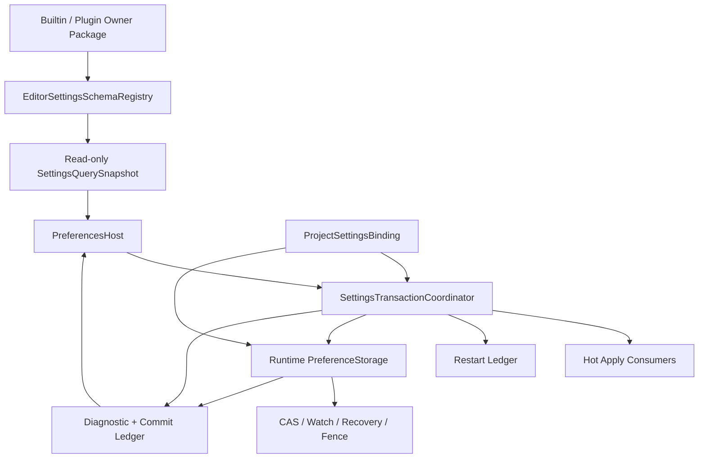

---
related_code:
  - zircon_editor/src/core/settings
  - zircon_editor/src/core/context/builder
  - zircon_editor/src/core/context/editor_context.rs
  - zircon_editor/src/core/jobs/quota_settings.rs
  - zircon_editor/src/core/extension/settings_page_projection.rs
  - zircon_editor/src/core/extension/store
  - zircon_editor/src/core/plugin
  - zircon_editor/src/core/editor_extension
  - zircon_editor/src/ui/settings
  - zircon_editor/src/ui/host/editor_event_runtime_access
  - zircon_editor/src/ui/host/project_access.rs
  - zircon_editor/src/ui/host/editor_manager_project.rs
  - zircon_editor/src/ui/retained_host/app/settings_window_actions.rs
  - zircon_editor/src/ui/retained_host/callback_dispatch/template_bridge/workbench/settings_window.rs
  - zircon_editor/src/ui/retained_host/host_contract/settings_window_geometry.rs
  - zircon_editor/src/ui/retained_host/host_contract/paint_template_nodes/template_settings_window.rs
  - zircon_editor/src/ui/retained_host/host_contract/paint_template_nodes/template_settings_window
  - zircon_editor/src/ui/retained_host/host_contract/surface_hit_test/template_node/popup_rows/settings.rs
  - zircon_editor/src/ui/retained_host/ui/pane_data_conversion/pane_component_projection/settings_window
  - zircon_editor/src/workbench
  - zircon_runtime/src/framework/preference
  - zircon_runtime/src/platform/preference
  - zircon_app/src
plan_sources:
  - docs/plans/optimize/zircon_editor/12-settings-preferences-scope-persistence-locale-i18n-appearance-plugin-extensibility-review.md
  - docs/plans/optimize/zircon_editor/134-editor-settings-preferences-scope-persistence-locale-i18n-appearance-plugin-extensibility-current-source-review.md
  - docs/plans/optimize/zircon_editor/259-editor-plugin-provider-catalog-current-working-tree-review.md
  - docs/plans/optimize/zircon_editor/260-editor-extension-contribution-store-toolkit-reload-lifecycle-current-working-tree-review.md
  - docs/plans/optimize/zircon_editor/262-editor-ui-host-retained-surface-native-input-window-binding-frame-current-working-tree-review.md
  - docs/plans/optimize/zircon_editor/264-editor-localization-string-table-culture-gather-import-export-pseudo-preview-runtime-authority-current-working-tree-review.md
  - docs/plans/optimize/zircon_runtime/45-preference-settings-scope-storage-overlay-bounded-io-generation-fence-durability-migration-multi-process-product-integration-review.md
  - docs/plans/optimize/zircon_runtime/99zi-runtime-preference-settings-scope-storage-overlay-bounded-io-generation-fence-durability-migration-multi-process-product-integration-current-source-review.md
  - docs/plans/optimize/zircon_runtime/202-runtime-localization-i18n-locale-culture-message-format-string-table-resource-authority-current-working-tree-review.md
reference_engines:
  - dev/UnrealEngine/Engine/Source/Developer/Settings/Public/ISettingsModule.h
  - dev/UnrealEngine/Engine/Source/Developer/Settings/Public/ISettingsSection.h
  - dev/UnrealEngine/Engine/Source/Developer/Settings/Private/SettingsSection.cpp
  - dev/UnrealEngine/Engine/Source/Runtime/DeveloperSettings/Public/Engine/DeveloperSettings.h
  - dev/UnrealEngine/Engine/Source/Runtime/DeveloperSettings/Private/Engine/DeveloperSettings.cpp
  - dev/UnrealEngine/Engine/Source/Runtime/Core/Public/Misc/ConfigCacheIni.h
  - dev/UnrealEngine/Engine/Source/Runtime/Core/Public/Misc/ConfigContext.h
  - dev/UnrealEngine/Engine/Source/Editor/UnrealEd/Classes/Editor/EditorPerProjectUserSettings.h
  - dev/UnrealEngine/Engine/Source/Editor/UnrealEd/Classes/Settings/EditorLoadingSavingSettings.h
  - dev/godot/editor/settings/editor_settings.h
  - dev/godot/editor/settings/editor_settings.cpp
  - dev/godot/editor/settings/editor_settings_dialog.h
  - dev/godot/editor/settings/editor_settings_dialog.cpp
  - dev/godot/core/config/project_settings.h
  - dev/godot/core/config/project_settings.cpp
  - dev/godot/tests/core/config/test_project_settings.cpp
  - dev/Fyrox/editor/src/plugins/settings.rs
  - dev/bevy/crates/bevy_platform/src/dirs/mod.rs
  - dev/bevy/crates/bevy_platform/src/dirs/windows.rs
  - dev/bevy/crates/bevy_platform/tests/preferences_dir.rs
  - dev/Graphics/Packages/com.unity.render-pipelines.core/Editor/CoreRenderPipelinePreferences.cs
  - dev/Graphics/Packages/com.unity.render-pipelines.core/Editor/ICoreRenderPipelinePreferencesProvider.cs
  - dev/Graphics/Packages/com.unity.render-pipelines.core/Editor/Properties/PropertiesPreferencesProvider.cs
  - dev/Graphics/Packages/com.unity.render-pipelines.core/Runtime/RenderPipeline/RenderPipelineGlobalSettings.cs
  - dev/Graphics/Packages/com.unity.render-pipelines.core/Tests/Editor/RenderPipeline/RenderPipelineGlobalSettingsUtilsTests.cs
refreshes: docs/plans/optimize/zircon_editor/134-editor-settings-preferences-scope-persistence-locale-i18n-appearance-plugin-extensibility-current-source-review.md
doc_type: current-working-tree-review-and-refactor-plan
review_status: current_source_refresh_complete
implementation_status: pending
source_recheck_required: true
evidence_captured_at: "2026-08-31T08:58:01.7507812+08:00"
evidence_head: 0aeb32c037cf30028d7a8950ce373ae052c97c38
---

# 265 - Editor Settings / Preferences / Project Settings / Scope / Schema / Overlay / Persistence / Migration / Restart / Plugin Window 当前工作树复审

## 1. 结论

当前 Settings 已经不再是 Editor134 看到的“可打开但只显示 metadata”的临时窗口。当前工作树新增了一个进程级 `SettingsMutationCoordinator`，持久化写入按 User/Project 文档归并，invalid source 在内存修改前拒绝，持久化健康状态能进入 Notification 与 Settings 窗口；Preferences 也已经有 bool、整数/浮点步进、enum、RGBA color、string、chord、单项 reset 和持久化 retry 的真实 action/hit-test/paint 路径。窗口打开期间会分别跟踪 catalog/contribution/locale 与 value generation，列表具备 clip-bounded row projection、scroll 和基础窄窗几何测试。Editor134 关于“没有 value/source、没有 typed control、只在 open 时 capture”的结论已经过时。

但是，这些进展仍没有组成可用于大型工程的配置平台。当前最危险的断点不是控件数量，而是 authority、项目生命周期和耐久语义不一致：

1. `EditorContext::settings()`仍公开可变 `Arc<SettingsAuthority>`；项目打开和关闭分别在 `project_access.rs:32`、`editor_manager_project.rs:78`直接调用 `clear_project_layer()`，绕过 `SettingsMutationCoordinator::bind_project/clear_project` 的 pending ticket retirement、project generation 与 persistence health。类型边界没有保证“所有 persistent mutation 和 project transition 只有一个 owner”。
2. persistence ticket 记录 admission 时的 `authority_generation`/`file_generation`，但 worker 在执行时才从 authority 重新序列化整个当前 layer（`persistence.rs:392-405`），不是冻结该 ticket 对应的 document。重试也会再次读取当前 authority。receipt 因此不能证明写入了哪个 generation/digest。
3. `prepare_persistent_layer_for_write()`在 project transition、path 已替换或 source invalid 时返回 `None`（`authority.rs:243-260`），而 `save_authority_layer()`把它折叠成 `Ok(())`（`io.rs:251-259`）。lane ticket 可以终态 `Succeeded`，但实际没有 write/fsync/rename。这不是“最终一致性”，而是成功语义错误。
4. Editor 仍直接拥有 `.zircon/settings.toml` 的读取、version envelope、atomic rename 和恢复语义；Runtime 已经另有 `PreferenceStorage`、read-your-write overlay、ticket/fence、platform path/product identity。两个层级分别实现持久化 authority，平台能力、CAS、恢复、诊断和 shutdown 不可能长期一致。
5. 12 个内置 definition 中只有 locale、autosave、3 个 viewport snap 和 4 个 job quota 共 9 项能在当前窗口完成有效编辑。`DesignTokens`、`KeymapOverrides`、`CommandPaletteMru` 只显示空/unsupported control；虽然 schema 枚举有 bool/string/color/chord，产品 registry 没有相应 builtin definition。绝大多数 Editor 行为仍未采用 Settings registry。
6. 插件 `SettingsPageDescriptor` 只有 id、bundle、label、description、category（`page.rs:8-14`），没有 setting IDs、definition package、content provider、order、keywords、scope 或 actions；plugin row 在 hit test 中被明确 `Blocked`（`popup_rows/settings.rs:140-141`）。这仍是 metadata contribution，不是插件设置产品。
7. `requires_restart`只穿过 definition/change/receipt 并画成一个 marker，没有 pending-restart ledger、原因、受影响子系统、Save & Restart、取消或 restart command。窗口也没有 search/filter、直接数值输入、batch apply/cancel、section reset、import/export/diff、conflict/LKG recovery 或 layer target selector。

本轮聚焦 Settings/Preferences 后，P0 为 `1 Open / 2 Partial / 0 Closed`，P1 为 `21 Open / 15 Partial / 2 Closed`，P2 为 `5 Open / 4 Partial / 0 Closed`；30 个工程资格门为 `16 Fail / 8 Partial / 6 Pass`。Editor134 的 localization 与 appearance 表不在本报告重复：Localization 由 Editor264/Runtime202 继续作为 canonical owner，Typography 由 Editor263/Runtime201 跟踪，Theme/Style 由 Runtime73 跟踪。本报告只刷新 Editor134 中 Settings authority、scope、persistence、Preferences 与 plugin settings page 的状态。

## 2. 审查边界与证据快照

### 2.1 物理选择集

| 选择集 | files | lines | non-empty | bytes | tests | ignored | fingerprint |
|---|---:|---:|---:|---:|---:|---:|---|
| Settings core：`zircon_editor/src/core/settings/**/*.rs` | **26** | **6,363** | **5,777** | **217,579** | **54 markers** | **1** | `74e9233431ba9ce6749221ea0c9aeb2b904239481fb9f8897e719188001647dd` |
| Settings UI/retained host/action/projection closure | **37** | **5,768** | **5,440** | **199,825** | **24 markers** | **0** | `955456d35536492c469eeddd1209cdc1998701c385bca005ec2241c2ed893009` |
| composition、plugin、project lifecycle、product adoption closure | **30** | **10,993** | **10,268** | **452,516** | **65 markers** | **0** | `e420f599d8c81ac9375b11cf2833e10f6658cb1a311ef9fbe27393ada9cdbad2` |
| Runtime Preference + App platform boundary | **22** | **4,629** | **4,211** | **162,272** | **31 markers** | **3** | `f5cff0b9310ab433b93799118e16145bed5ba2dbf71814e613d09f08985a27bc` |
| Zircon 去重源码总集 | **115** | **27,753** | **25,696** | **1,032,192** | **174 markers** | **4** | `12c1b0af16cace83a73907778f983ac41e11a53832b04cd606e7d1cd3e1197c2` |
| Unreal/Godot/Fyrox/Bevy/Unity Graphics 参考选择集 | **22** | **11,306** | **9,507** | **474,545** | **15 markers** | **0** | `dd2ad2c06b81142417aa9bb92fdc881a0278d265ff0c2d661f6116f46c2061fd` |
| 全部证据去重总集 | **137** | **39,059** | **35,203** | **1,506,737** | **189 markers** | **4** | `62e5ce593e89af497cdc2b6d7548cf8cb3781c8b5b821ce624aa860c7a10581d` |

fingerprint 采用规范化小写相对路径排序，对 `path + NUL + per-file SHA-256 + LF` 清单再做 SHA-256；tests 同时统计 Rust `#[test]`、C++ test/automation 与 C# `[Test]` 声明。快照冻结于 `2026-08-31T08:58:01.7507812+08:00`，HEAD 为 `0aeb32c037cf30028d7a8950ce373ae052c97c38`。共享工作树在审查期间存在其他未提交变更，本报告没有回退或接管它们；实施前必须按 `source_recheck_required` 重取关键调用点、fingerprint 和真实产品证据。

### 2.2 选择集定义

- Settings core 覆盖 authority、registry、definition、catalog、snapshot、change log、mutation coordinator、health、persistence、I/O、startup、defaults、page 与全部同目录测试。
- UI closure 覆盖 Settings projection/localization/action IDs、runtime access、Preferences open/sync/actions、template bridge、pane projection、paint、popup/hit test、scroll、geometry 与 Settings 专项测试。
- composition closure 覆盖 context builder、locale/hot-apply、persistence health、job quota、project open/close/document load、Editor manager/host、notification、extension contribution、plugin materializer/SDK、viewport setting consumer、App/Runtime entry 邻接边界。
- Runtime boundary 覆盖 framework/platform preference contract、overlay、ticket/fence、storage identity 与 App platform preference composition，用于判断 Editor 是否重复拥有 filesystem authority。
- reference set 只读取与 scope、section/provider、persistence、restart、migration、search、custom page、project settings 和测试直接相关的 22 个文件；没有把参考引擎目录的文件数量当成功能证明。

### 2.3 未执行的动态证据

本轮是 review-only，没有修改生产 Rust、Cargo、ABI、ZUI 或测试，也没有运行 Cargo。没有启动真实 Editor、进行 UIA/读屏、DPI/CJK、权限撤销、磁盘满、断电、双进程竞争、project switch race、plugin hot unload、10k definition、shutdown hang、fuzz、soak 或 benchmark。源码级结论是 E3；真实 OS durability、交互与规模资格仍必须在后续实现里补齐，不能由现有 unit test 推断。

## 3. 当前生产链

1. Builder 创建静态 registry，注册 `defaults.rs` 的 8 项 definition 和 `quota_settings.rs` 的 4 项 job quota，加载 User layer，再创建 `SettingsAuthority`、`SettingsPersistenceService`、`SettingsMutationCoordinator`、hot-apply subscriber 与 health subscriber。
2. `SettingsAuthority` 在 mutex 内拥有 mutable registry，以 snapshot 发布 effective value/source/catalog/generation；authority 仍只支持一个同步 change subscriber。definition registry 在构造后不可动态增删。
3. `SettingsMutationCoordinator::set/clear`先验证 setting、scope、source availability，再改变 authority；persistent scope 随后生成 file generation 并尝试进入 bounded keyed I/O lane。admission 失败时内存/hot apply 已发生，但 disposition 和 health 会明确进入 `AppliedPendingAdmission`/retryable state。
4. pending map 只保留 User/Project 每个 document 的最新 request，替换旧 ticket；lane key 已按目标文档而不是 setting key 合并。这关闭了 Editor134 的“每 key 并行重复整文件 lane”问题。
5. worker 仍持有 authority，在真正执行时调用 `save_authority_layer(scope, authority)`，因此序列化的是执行时当前 layer。request 上的 authority generation 只用于日志/receipt identity，并没有冻结 bytes 或 digest。
6. I/O 使用 versioned text envelope v1、temp file、file `sync_all`、rename；Unix 尝试同步 parent，Windows 注释把 replace-capable rename 当支持边界。读取使用无上限 `read_to_string`；v0 明确拒绝，没有可执行 migration。
7. User/Project health 可表示 Unavailable、Ready、Queued、Durable、PendingAdmission、Terminal；一个 health subscriber 把失败送入 Notification，并刷新打开的 Settings 窗口。延迟 worker failure 不再只存在日志。
8. 打开 Preferences 时 capture catalog、plugin page、category 与 selected category values。catalog/contribution/capability/locale 变化重建目录，settings generation 变化只刷新 value batch；value/source generation 不再冻结在首次 open。
9. builtin row 根据 schema 产生 bool toggle、number stepper、enum popup、color channel popup、string/chord input和 reset；UI 始终写 definition 固定的 `scope`，没有让用户选择 User/Project/Session target。
10. category tree会为每个 prefix建立节点，但 `capture_settings_values_for_category` 和 `entry_matches_category` 只对 exact category path 取 row（`settings_projection.rs:33-37`、pane projection `mod.rs:236-243`）。父 category 可以被选择却为空，除非恰有 definition/page 直接落在该 prefix。
11. plugin settings page会进入 category/row projection和paint，但 entry 被标为 `plugin_page`，hit test直接阻断。它没有 definition/content/provider，所以无法编辑或打开真正的插件页面。
12. Project open path先让 runtime 激活项目，然后直接清空 authority、由 `EditorProjectDocument::load_from_activated_project` 直接加载 layer；Project close path也直接清空 authority。另有 `EditorState` 使用 coordinator 的正确路径，因此当前存在两套 project settings transition owner。

## 4. 当前实现中应保留的底座

1. `SettingsKey`、typed `SettingValue/SettingSchema`、default 与 Session > Project > User > default precedence 是可继续扩展的核心模型。
2. immutable `SettingsSnapshot`、definition catalog、effective source、exact generation value batch使 UI 不必持有 registry lock。
3. `SettingsMutationCoordinator` 的 preflight、document pending replacement、file generation、project binding generation、health 与 retry disposition可以作为 transaction coordinator 的起点。
4. bounded keyed I/O admission及 fence 是正确方向；document-level lane key和 coalescing 应保留。
5. versioned envelope、canonical encode、temp + sync + rename 可以下沉到 Runtime storage codec/backend，而不是删除所有实现重新写。
6. Settings window的 typed row projection、clip/overscan、scroll、popup geometry、exact source显示、单项 reset 和 failure retry是可复用产品骨架。
7. plugin LocalizationBundle 与 SettingsPage contribution 已具 owner ticket、capability filter、generation snapshot和撤销；应该升级为原子 definition/page/provider package。
8. notification health projection使异步失败能到达用户；应扩展为 commit/conflict/recovery/restart ledger，而不是旁建另一套 toast。
9. `SettingsStore` 对 stale project path 的抑制避免把旧项目 request 写入新项目文件；正确修复是返回 typed `SkippedStale`，不是删除 generation guard。

## 5. P0 复核

### E-SET-P0-01 - Partial - mutation coordinator 已建立，但唯一 authority 仍未被类型边界强制

Editor134 时 feature 可以直接 `authority.set/clear` 后自行决定是否 submit；当前 Settings 窗口与 viewport 已进入统一 coordinator，persistent source preflight、ticket、health、retry和document coalescing均有真实实现，这是实质进展。

该项仍不能关闭。`EditorContext::settings()`在 `editor_context.rs:127-129`返回 `Arc<SettingsAuthority>`，项目 open/close直接调用 `clear_project_layer`，document load也直接在 authority 上读 layer。只要 mutable authority 仍公开，任何 feature 都能绕过 coordinator，造成 snapshot、pending document、project binding、health 与 disk generation分裂。最终 contract 必须只公开 read-only query/snapshot；set/clear/batch/project bind/clear/reload/recover只能由 `SettingsTransactionCoordinator` 完成。

### E-SET-P0-02 - Partial - Preferences 已可编辑，但还不是工程级配置产品

旧“只读 metadata window”问题已经明显改善：9 个实际 builtin setting可通过真实控件改变、显示 effective source、reset override，并能看到 persistence failure/retry。列表 refresh、scroll和popup也不是静态 mock。

仍缺失 search、breadcrumb result、direct number input、multi-layer target、staged/live/restart apply、batch apply/cancel、section/all reset、import/export/diff、inline validation、conflict/recovery、pending restart、plugin content、keyboard/a11y和大规模资格。3 个 structured builtin在当前窗口不可编辑，插件行被显式阻断。它现在是“可用的局部设置窗口”，不是 Unreal/Godot/Unity 级别可扩展 Preferences 产品。

### E-SET-P0-04 - Open - Editor 与 Runtime 各自拥有一套 preference filesystem authority

Runtime 已有 platform `PreferenceStorage`、product storage identity、overlay、write ticket、fence和backend contract；Editor 同时直接选择路径、读取 `settings.toml`、定义 envelope/migration、执行 atomic write并解释 durability。两个 owner 会分别演化 CAS、watch、multi-process、backup、platform capability、shutdown和diagnostic语义，最终必然出现“Runtime认为 durable、Editor认为 failed”或相反的分裂。

目标不是把 Editor schema搬进 Runtime。Runtime 应拥有中立的 address/storage/CAS/watch/recovery/fence；Editor在其上拥有 Settings document schema、definition、layer merge、validation、UI transaction和restart policy。Editor完成迁移后必须删除直接 filesystem writer，不能永久保留“双保险”路径。

## 6. P1 差距状态

### 6.1 Authority、schema、overlay 与插件 ownership

| ID | 状态 | 当前证据与差距 | 必须重构为 |
|---|---|---|---|
| E-SET-P1-01 | Partial | definition 已有12项、job quota和viewport/autosave/locale真实消费；全 Editor adoption 仍极低。 | 按 owner 建 adoption catalog，登记 stable ID、scope、default、schema、apply policy、persistence和页面。 |
| E-SET-P1-02 | Open | registry 仍只在 authority 构造前注册，无 owner lease、register/unregister/batch generation。 | 动态 schema registry；builtin/plugin package 原子 admit/revoke，旧 snapshot 可 pin owner generation。 |
| E-SET-P1-03 | Open | plugin SettingsPage 与 SettingDefinition 仍是两条链，页面不能声明或绑定真实 setting。 | contribution package 原子携 definitions、page/provider、bundle、capability、migration 与 owner lease。 |
| E-SET-P1-04 | Partial | snapshot/catalog和按category value batch有 effective/source/generation；无每层值、default、restart、validation、commit ledger。 | bounded/paged query返回 descriptor、effective、layer stack、origin、dirty、validation、restart和storage health。 |
| E-SET-P1-05 | Partial | page已有typed localization与category generation；仍无setting IDs、provider/content、order、keywords、scope、actions。 | schema-generated page优先；custom provider只通过显式capability和生命周期contract进入。 |
| E-SET-P1-06 | Open | authority只有一个可替换同步change subscriber，health也只有一个subscriber。 | owner-bound multi-subscriber registry，cursor/queue/backpressure/resync/health明确。 |
| E-SET-P1-07 | Open | hot apply callback仍在mutation caller线程执行，slow/panic consumer影响提交。 | commit publish与consumer apply解耦；每consumer有deadline、panic containment和apply receipt。 |
| E-SET-P1-08 | Open | 源码测试明确允许callback在锁释放后再次mutation，只有注释警告重入。 | transaction phase/cycle policy；递归写入进入后续batch或返回typed reentrancy error。 |
| E-SET-P1-09 | Partial | coordinator已有project binding generation与pending retirement；生产open/close/document load仍绕过它。 | 唯一 `ProjectSettingsBinding` 事务拥有 fence old -> bind/load new -> publish health 全过程。 |
| E-SET-P1-10 | Partial | invalid User source会使 writable store 缺席，Project health可标unavailable；没有reload/repair/recover operation。 | source health是可变状态，提供reload/quarantine/replace/recover并返回generation-bound diagnostic。 |
| E-SET-P1-11 | Open | registry/change generation仍有`saturating_add`，health另用wrapping nonzero策略。 | 统一checked epoch+counter，耗尽进入明确terminal state，禁止identity静默复用。 |
| E-SET-P1-12 | Open | persistent layer replacement仍逐key增加revision并反复重建snapshot。 | batch validate/canonicalize/diff/publish一次完成，共享transaction identity。 |
| E-SET-P1-13 | Open | DesignTokens/KeymapOverrides/MRU schema只验证outer variant，缺内部size/depth/canonical不变量。 | structured type拥有versioned validator、budget、canonical codec和migration。 |
| E-SET-P1-14 | Open | 通用schema缺path、duration、bytes、collection、optional、secret、reference、owner custom codec。 | 可组合schema + bounded custom editor codec，存储与展示类型分离。 |

### 6.2 Persistence、migration、recovery 与并发

| ID | 状态 | 当前证据与差距 | 必须重构为 |
|---|---|---|---|
| E-SET-P1-15 | Open | request记录generation，worker执行时才序列化当前authority；retry也读取当前值。 | admission冻结canonical document bytes或immutable snapshot/digest，receipt证明实际durable generation。 |
| E-SET-P1-16 | Closed | lane key已按target document，pending map每个User/Project只保留最新请求并取消旧请求。 | 保留document lane/coalescing，并用冻结snapshot和explicit superseded receipt强化。 |
| E-SET-P1-17 | Partial | 已有Queued/Durable/PendingAdmission/Terminal health；没有完整dirty、committing bytes/digest、conflict和close decision。 | per-scope commit ledger记录candidate/admitted/written/synced/superseded/failed/conflicted。 |
| E-SET-P1-18 | Partial | delayed failure可进入Notification和Preferences retry banner；diagnostic仍缺path/generation/digest/recovery decision完整上下文。 | typed Diagnostic Journal record + retry/recover/reload/overwrite actions。 |
| E-SET-P1-19 | Open | `flush_then_shutdown`无deadline，底层fence可无限等待hung I/O。 | deadline、cancel acknowledgement、emergency spool/abandon policy和non-durable close decision。 |
| E-SET-P1-20 | Open | 无writer lease、on-disk revision/CAS、external watch或three-way merge。 | Runtime storage提供lock/CAS/watch；Editor提供schema-aware reload/merge/overwrite。 |
| E-SET-P1-21 | Open | 无backup、LKG、corrupt quarantine、temp sweep或recovery journal。 | generation slots、LKG、损坏隔离、启动恢复和有配额temp清理。 |
| E-SET-P1-22 | Open | unknown setting会使整个layer apply失败；禁用/升级插件的orphan无法保留。 | known values与owner-versioned orphan store分离，owner恢复后claim+validate+migrate。 |
| E-SET-P1-23 | Open | envelope只有v1；v0在`io.rs:397`明确拒绝，无连续migration fixture。 | alias/split/merge/type conversion migration chain，迁移前backup，future version只读策略。 |
| E-SET-P1-24 | Open | 文件名是`settings.toml`，实际内容是versioned JSON text envelope。 | 扩展名与canonical format一致，或采用真实TOML；公开格式与schema contract。 |
| E-SET-P1-25 | Open | 两条load路径都在decode前使用无界`read_to_string`。 | metadata/file cap + bounded reader + entry/string/depth/node budget。 |
| E-SET-P1-26 | Partial | invalid source在mutation preflight被阻止，避免直接覆盖坏文件；仍无产品repair/recover，User health主要冻结于startup。 | 所有invalid source进入显式read-only/quarantine，可预览错误并选择恢复。 |
| E-SET-P1-27 | Open | 无stable alias/deprecation、owner schema version、split/merge和platform transform。 | `SettingId + OwnerSchemaVersion + MigrationRule` 形成可测试连续升级图。 |
| E-SET-P1-28 | Open | 无Machine/Profile/Managed/Secret层，也不建模source control/read-only checkout。 | 分层storage address、权限、审计和policy precedence；secret绝不进入普通document/telemetry。 |
| E-SET-P1-59 | Open | `prepare... == None`被转换为`Ok(())`，ticket可Succeeded而无物理写入。 | terminal严格区分Written/SkippedStale/BlockedInvalid/NoTarget/Superseded；只有write+sync+replace匹配digest才是Durable。 |

### 6.3 Preferences 产品、restart 与可访问性

| ID | 状态 | 当前证据与差距 | 必须重构为 |
|---|---|---|---|
| E-SET-P1-29 | Closed | `editor.settings.open`已有command/menu/event/retained window真实入口。 | 保留入口，增加`show(category/section/key)` deep link而不建旁路窗口。 |
| E-SET-P1-30 | Partial | category/catalog/value/plugin/locale generation会刷新，rows已virtualized/clip-bounded；order、owner和增量patch仍弱。 | stable owner/order的paged tree/row query，按generation增量patch且可恢复selection/focus。 |
| E-SET-P1-31 | Partial | bool/int/float/enum/color/string/chord已有control路径；3个structured builtin unsupported，实际产品只覆盖9项且number只能step。 | 复用Inspector typed editor factory，支持direct input、unit/precision、structured/custom editor和validation。 |
| E-SET-P1-32 | Open | 当前Settings UI没有search/filter/query action或index。 | Unicode-normalized indexed search，覆盖label/description/key/keyword/owner并显示breadcrumb。 |
| E-SET-P1-33 | Partial | row显示effective source且可reset当前override；不能查看完整layer stack或选择写入User/Project/Session。 | origin/override stack、target layer selector、remove override、policy/read-only说明。 |
| E-SET-P1-34 | Partial | `requires_restart`只绘制marker；没有apply policy或pending restart consumer。 | Live/Staged/Restart apply policy + pending restart ledger + Save & Restart/Cancel/Revert。 |
| E-SET-P1-35 | Partial | 已有per-item reset；没有section/all reset、import/export、backup、diff preview。 | capability-aware batch action先预览affected keys/scope，再返回durable transaction receipt。 |
| E-SET-P1-36 | Partial | failure/retry banner存在；没有inline validation、commit progress、conflict、LKG/recovery surface。 | row validation + top-level commit/conflict/recovery state + Diagnostic Journal deep link。 |
| E-SET-P1-37 | Partial | 已有scroll、clip和窄窗geometry测试；缺键盘row navigation、focus trap、screen reader、UIA、DPI/CJK真实证据。 | 完整dialog accessibility、stable focus、semantic controls、reader actions和截图/UIA矩阵。 |

## 7. P2 差距状态

| ID | 状态 | 当前差距 | 建议收敛 |
|---|---|---|---|
| E-SET-P2-01 | Partial | SettingsPage字段已typed localization且category非空；page id、owner/content identity仍只是String/metadata。 | 全字段validated stable type，owner generation/content identity可序列化和诊断。 |
| E-SET-P2-05 | Open | temp identity仍依赖process/time/attempt，未绑定transaction/digest。 | Runtime storage分配session/transaction/file generation/digest identity。 |
| E-SET-P2-07 | Partial | 当前preferred约860x560、max约960x680且有窄窗布局/scroll测试；min约束、DPI/CJK/长词/reader没有产品证据。 | responsive tracks、min-content、dynamic wrapping和多DPI/CJK screenshot matrix。 |
| E-SET-P2-08 | Open | definition无docs URL、examples、unit、precision、risk/deprecation信息。 | presentation metadata可选携help、unit、precision、example、risk和owner docs identity。 |
| E-SET-P2-09 | Partial | health/counter有generation和failure状态；没有privacy-aware access、apply latency、bytes、coalesce、write热点指标。 | 只记录identity/latency/bytes/result的bounded metrics，禁止记录secret value。 |
| E-SET-P2-10 | Open | unit tests数量增加，但缺schema/document/migration/property/fuzz、real UI、fault和multi-process corpus。 | property/fuzz + golden migration + subprocess fault + UI automation + scale/soak。 |
| E-SET-P2-11 | Partial | persistence failure code与typed errors已有局部结构；大量产品错误仍直接拼英文，没有统一stable diagnostic code。 | stable code + structured context；presentation由I18N层本地化。 |
| E-SET-P2-12 | Open | production注释仍引用Editor17/Plan11等历史计划编号。 | 注释只描述module/schema/owner contract，历史归属留在docs。 |
| E-SET-P2-13 | Open | prefix category被投影成可选节点，但row/value按exact path过滤，父节点可显示空白。 | category query明确aggregate descendants或把纯prefix节点设为不可选择，测试两种语义。 |

## 8. 参考引擎差异

| 参考 | 仓内源码可验证能力 | Zircon 当前差异 | 应吸收的原则 |
|---|---|---|---|
| Unreal | `ISettingsModule`按container/category/section注册object或custom widget并可Show/Unregister；`ISettingsSection`有CanEdit/Save/Reset/Import/Export/SaveDefaults/status/delegates；`UDeveloperSettings`可自动发现、区分Editor/Project container、传播change、CVar import/export和restart metadata；Config层提供分层load/flush/reload。 | Zircon只有静态definition和metadata plugin page，缺section operation、dynamic owner、restart workflow、config reload/CAS。 | registry、section operation、scope/container、restart与custom provider必须进入同一owner lifecycle。 |
| Godot | `EditorSettings`记录property metadata/default/order/basic/hide/save/restart flag、changed set、compat rename、shortcuts和project metadata；Dialog有search、advanced、Inspector、shortcut editor、override undo/redo、restart banner/Save & Restart、delayed save及accessibility name；ProjectSettings有feature override和changed tests。 | Zircon没有changed-key ledger、search/advanced、restart command、compat rename、undoable override或完整shortcut editor。 | 设置是可查询/可迁移/可重启的产品状态，不是把scalar row画出来即完成。 |
| Fyrox | Settings plugin有menu/window、reflection Inspector、search/fuzzy filter、Default/OK、property editing和renderer quality hot apply。 | Zircon typed controls更细，但没有通用Inspector复用、search和明确Default/OK apply transaction。 | 复用property editor和reflection contract，避免为每个schema手写临时控件。 |
| Bevy | `bevy_platform::dirs`集中提供跨平台preferences目录并用平台测试固定路径语义；它本身并不冒充完整Preferences authority。 | Zircon Editor自己解释platform path，同时Runtime也已有storage contract。 | 平台根路径属于底层platform/storage；Editor只拥有领域schema和产品交互。 |
| Unity Graphics | `CoreRenderPipelinePreferences`通过TypeCache发现provider、要求public ctor、按DisplayInfo排序、聚合keywords并打开SettingsService固定User页；provider contract有keywords/header/GUI。`RenderPipelineGlobalSettings`建模project-wide asset与reset，测试覆盖ensure/create/register。 | Zircon插件页不能发现真实provider或提供keywords/content，Project settings不是明确asset/owner。 | provider discovery、keywords、ordering和project-wide settings asset都必须可测试且有生命周期。 |

没有任何单一参考实现可以直接照搬。Unreal/Godot更完整地展示scope/section/restart/migration，Fyrox展示reflection editor复用，Bevy只证明platform path owner，Unity Graphics展示provider discovery和project-wide asset。Zircon目标应把这些原则压缩成明确的 Rust ownership、immutable snapshot、bounded query 和可证明 durability，而不是复制某个引擎的宏或单例。

## 9. 目标架构

### 9.1 `EditorSettingsSchemaRegistry`

- `SettingId`、`OwnerId`、`OwnerGeneration`、`OwnerSchemaVersion`必须是validated stable identity。
- definition声明 allowed scopes、default、schema、apply policy、presentation/search/help、migration、secret/managed policy与editor descriptor。
- builtin/plugin都提交原子 owner package：definitions + page/provider + localization bundle + capability + migration。失败不能发布partial page或partial schema。
- unregister撤销owner的active definitions/provider，但持久值进入versioned orphan store；相同owner/version重新加载后可claim、migrate、validate。
- snapshot immutable且可pin generation；query只暴露read-only view，任何产品层都拿不到mutable authority。

### 9.2 `SettingsTransactionCoordinator`

- mutation request携expected catalog/value/project generation、target scope、candidate batch和origin command/session。
- 在单次transaction内完成：lookup -> permission/source preflight -> canonicalize/validate -> candidate layer -> effective diff -> immutable document bytes/digest -> Runtime storage admission -> hot-apply dispatch -> commit/restart ledger publish。
- Live setting在apply失败时保留旧generation或进入明确degraded receipt；Staged setting直到Apply才发布；Restart setting写入durable layer并进入pending restart，不伪装为当前runtime已生效。
- terminal receipt至少区分Rejected、AppliedVolatile、Admitted、Durable、Superseded、SkippedStale、BlockedInvalid、Conflicted、RolledBack；`Succeeded`不得同时代表“什么都没写”。
- subscriber使用owner-bound queue/cursor/resync；禁止同步callback重入修改同一transaction。

### 9.3 Runtime Preference bridge

- Runtime拥有 `ProductStorageIdentity`、User/Project address、platform capability、read/write/CAS/watch、backup/LKG、quarantine、bounded read、atomic replacement、multi-process lease和shutdown fence。
- Editor拥有document schema codec、layer merge、orphan/migration、setting validation和产品策略。Editor把冻结bytes/digest交给Runtime，不传mutable authority给worker。
- Runtime receipt回报address、expected/actual revision、digest、bytes、sync/replace disposition；Editor把它映射为setting transaction/health，而不是另写文件。
- 完成迁移后删除Editor私有filesystem writer和重复path选择；旧`settings.toml`只允许一次性迁移，不保留永久legacy fallback。

### 9.4 `ProjectSettingsBinding`

- project open/switch/close必须是一个不可分叉的owner流程：停止新旧项目写入 -> fence/retire旧project generation -> bind Runtime storage address -> bounded load/decode/migrate -> publishProject layer/source health -> 允许新mutation。
- `EditorUiHost`、`EditorProjectDocument`和feature controller只消费binding/query，不得直接clear/load authority。
- 同路径 reopen同样产生新generation；stale request必须得到`SkippedStale/Superseded` receipt并从health中退休。
- invalid/corrupt/read-only/source-control状态必须进入项目session decision，不能只清空layer继续运行。

### 9.5 `PreferencesHost`

- 左侧category tree明确父节点aggregate descendants语义；主区提供indexed search、breadcrumb、owner/scope filter和稳定keyboard navigation。
- typed editor复用Inspector/property editor factory；支持direct number input、unit/precision、path/reference picker、collection、structured/custom provider。
- 每项展示effective、default、layer stack、target layer、validation、apply policy、dirty/commit/restart和owner；支持remove override。
- 支持item/section/all reset、import/export、diff preview、Apply/Cancel/Revert、conflict/recovery/LKG和Save & Restart。
- health banner显示当前transaction generation、committing/durable/conflicted/failed，不只在失败时显示一个retry文本。

### 9.6 Plugin page/provider contract

- 默认路径是schema-generated page，插件只声明definition与presentation，不获得任意Host UI权限。
- 确需custom content时，provider必须声明capability、owner generation、query budget、action namespace、shutdown/reload和accessibility contract。
- page descriptor携stable page/section identity、setting IDs/provider identity、order、keywords、scope filter、help和actions；category/locale/provider/definition作为一个package原子发布。

## 10. 硬切约束

1. 限制或删除产品层 `EditorContext::settings() -> Arc<SettingsAuthority>`；只保留read-only query/snapshot。
2. `SettingsAuthority::set/clear/clear_project_layer/load_*`不得被composition root之外调用，最终吸收到transaction/binding owner。
3. Runtime bridge完成后删除Editor `SettingsStore` filesystem backend；不得长期双写或以fallback保留第二authority。
4. 每个durable ticket必须绑定冻结bytes/digest；禁止worker晚取mutable authority。
5. `None -> Ok(()) -> Succeeded`必须删除；stale/invalid/no-target都是可观察terminal disposition。
6. plugin SettingsPage不得继续以metadata-only row宣称产品完成；没有definition/provider就不发布可交互page。
7. feature owner不得自建submit/ticket/retry队列；所有persistent setting共用coordinator和commit ledger。
8. legacy文件只做一次性可测试migration；迁移完成后hard cut旧extension/codec/path，不建立永久兼容分支。
9. production注释、type和error不引用计划编号；计划历史只存在docs。

## 11. 分阶段重构路线

### M0 - Contract freeze、owner map 与失败测试

- 冻结 stable identity、scope/apply policy、transaction/receipt、storage bridge、project binding和plugin package contract。
- 建立所有12项definition及未采用Settings的Editor owner inventory；明确secret/managed/project/source-control策略。
- 先写 project bypass、suppressed-success、late authority serialization、reentrant subscriber、prefix empty category 的失败测试。
- 交付物：ADR、owner表、contract tests、删除清单；不先扩展Preferences UI。

### M1 - Runtime storage 前置能力

- 与 Runtime45/99zi 对齐 address、product identity、bounded read、CAS/watch、backup/LKG/quarantine、multi-process lease、deadline fence和typed receipt。
- 增加冻结bytes/digest写入API与fault-injection backend。
- Editor旧store暂时作为adapter，但不能再增加新能力。

### M2 - Dynamic schema registry 与 orphan/migration

- 实现owner package、lease/generation、atomic register/unregister、immutable snapshot和orphan claim。
- 增加alias/split/merge/type conversion、owner version、future-version read-only和golden migration chain。
- 把12项builtin迁移到统一package；plugin page必须与definition/provider同批提交。

### M3 - Transaction、hot apply、durability 与 restart ledger

- admission冻结candidate layer/document/digest；连接Runtime storage receipt。
- 收敛Live/Staged/Restart三种apply policy、consumer receipt、rollback/degraded state和pending restart。
- health升级为完整commit ledger，Notification/close flow/Preferences共享同一generation。

### M4 - Project lifecycle hard cut

- 用`ProjectSettingsBinding`替换 `project_access.rs`、`editor_manager_project.rs`、project document的直接authority调用。
- project open/switch/reopen/close统一retire pending、fence、load、publish health；删除第二条transition path。
- 增加same-root reopen、rapid switch、stale ticket、invalid/corrupt/read-only/source-control测试。

### M5 - Preferences query、search 与 typed editor

- 实现paged query、search index、descendant category、layer stack、target layer、direct typed input、validation和stable focus。
- 复用Inspector editor factory；删除专用控件中可由共享schema处理的重复逻辑。
- 增加Apply/Cancel/Revert、item/section/all reset、deep link和commit/restart状态。

### M6 - Plugin settings product

- schema-generated plugin setting先完成；custom provider后完成且受capability/budget/lifecycle约束。
- 验证admit/revoke/reload时definition/page/provider/bundle原子一致，旧snapshot可pin，orphan可claim。

### M7 - Import/export、recovery 与 conflict

- 实现diff preview、scope-aware import/export、backup/LKG恢复、corrupt quarantine、external change reload/merge/overwrite。
- close/project switch/restart都消费commit/restart ledger，不用临时toast替代decision。

### M8 - 资格验证与旧路径删除

- UIA/读屏、keyboard、DPI/CJK/long text、多窗口、10k definitions、plugin churn、fault、multi-process、shutdown deadline、scale/soak/benchmark。
- 删除Editor filesystem store、mutable authority escapes、metadata-only plugin row、旧codec/path和feature-private ticket。
- 只有动态门通过后才能把Settings/Preferences标为工程完成。

M0-M4是M5 UI扩展的硬前置。若先增加search、更多控件或漂亮banner，会把错误的authority和durability语义固化到更多产品面。

## 12. 逐文件重构判定

| 文件/组 | 当前判定 | 后续动作 |
|---|---|---|
| `core/settings/definition.rs`、`scope.rs` | Preserve + Extend | 保留typed scalar/value，加入stable owner/version、allowed scopes、apply policy、help/search/migration和组合schema。 |
| `core/settings/registry.rs`、`catalog/*`、`snapshot.rs`、`change_log.rs` | Partial Replace | 保留immutable snapshot/effective source；替换静态注册、逐key replacement、saturating generation和有限query。 |
| `core/settings/defaults.rs`、`core/jobs/quota_settings.rs` | Migrate | 把12项builtin转成owner package；3个structured value改为真正resource/editor或从通用Settings页移除。 |
| `core/settings/authority.rs` | Replace Boundary | 保留内部layer/effective计算；隐藏mutation/project I/O，删除产品可变escape和单subscriber contract。 |
| `core/settings/mutation.rs`、`mutation/health.rs` | Preserve Core + Refactor | 保留preflight/project generation/document pending/health；升级为batch transaction、frozen document、consumer/restart/commit ledger。 |
| `core/settings/persistence.rs` | Replace | lane/admission可迁移；删除late authority capture，改为Runtime storage冻结bytes/digest request和typed terminal。 |
| `core/settings/io.rs`、`startup.rs` | Absorb Then Delete | codec/migration进入Editor schema层，filesystem/path/atomic writer下沉Runtime；补bounded read、CAS、recovery后删除重复backend。 |
| `core/settings/page.rs`、`core/extension/settings_page_projection.rs` | Replace Contract | 从metadata page升级为definition/provider/section package，增加order/keywords/scope/actions/owner generation。 |
| `core/extension/store/*`、plugin materializer/SDK | Extend | contribution transaction加入Settings definitions/provider/migration，保持bundle/page/owner原子admit/revoke。 |
| `ui/host/editor_event_runtime_access/settings_projection.rs` | Refactor | exact category value query改paged/descendant/query service，返回layer/restart/validation/commit state。 |
| `ui/settings/*` | Preserve + Extend | 保留localization/category/projection；加入search model、stable selection/focus、owner/order和query cursor。 |
| `retained_host/app/settings_window_actions.rs` | Preserve + Extend | 保留generation refresh；动作统一提交transaction，加入apply/cancel/revert/restart/import/export/recovery。 |
| pane projection、template Settings paint/hit/geometry | Partial Preserve | 保留virtualization/geometry/typed hit；复用shared property editor，补semantic a11y、keyboard、direct input和plugin provider host。 |
| `ui/host/project_access.rs` | Hard Cut | 删除直接 `clear_project_layer`/authority load，改为唯一ProjectSettingsBinding。 |
| `ui/host/editor_manager_project.rs` | Hard Cut | close只调用binding transaction并消费receipt，不直接触碰authority。 |
| `core/context/editor_context.rs` | Hard Cut API | 删除公开mutable SettingsAuthority；公开query、transaction client、health/restart snapshots。 |
| Runtime `framework/platform/preference` 与 App wiring | Extend Owner | 成为唯一storage/address/CAS/watch/recovery/fence owner；保持Editor schema中立。 |
| `core/settings/tests/*` 与 retained Settings tests | Expand | 保留现有54+24 marker；新增transaction/project/fault/migration/plugin/UIA/scale/real-window证据。 |

## 13. 工程资格门

| Gate | 状态 | 验收要求 |
|---|---|---|
| E-SET-G01 唯一persistent mutation owner | Partial | 产品层无法取得mutable authority，全部写入有transaction identity。 |
| E-SET-G02 唯一project transition owner | Fail | open/switch/reopen/close只经ProjectSettingsBinding，旧pending/health全部退休。 |
| E-SET-G03 Runtime storage统一 | Fail | Editor不再直接选路径/读写文件，Runtime receipt可证明storage结果。 |
| E-SET-G04 frozen exact receipt | Fail | ticket绑定immutable bytes/digest和expected revision，retry不改变原request内容。 |
| E-SET-G05 no suppressed success | Fail | stale/invalid/no-target不能返回Succeeded/Durable。 |
| E-SET-G06 invalid source preflight | Pass | invalid/unavailable persistent source在内存修改前拒绝。 |
| E-SET-G07 document lane/coalescing | Pass | User/Project按document target归并并退休旧pending。 |
| E-SET-G08 bounded admission | Pass | item/byte预算和typed admission failure存在。 |
| E-SET-G09 atomic replace durability | Partial | temp+file sync+rename已有；Windows parent durability、CAS/receipt仍不完整。 |
| E-SET-G10 bounded shutdown | Fail | fence有deadline/cancel/abandon且不会无限等待I/O。 |
| E-SET-G11 executable migrations | Fail | 连续版本golden覆盖rename/split/merge/type conversion/future version。 |
| E-SET-G12 plugin orphan preservation | Fail | disabled/unknown owner值不阻断整个document并可重新claim。 |
| E-SET-G13 bounded read/decode | Fail | file/entry/string/depth/node均有硬预算和diagnostic。 |
| E-SET-G14 multi-process/CAS/watch | Fail | writer lease、external revision和merge/overwrite decision可验证。 |
| E-SET-G15 backup/LKG/recovery | Fail | corrupt/quarantine/temp sweep/last-good/startup recovery闭环。 |
| E-SET-G16 generation-consistent query | Pass | category value batch返回exact settings generation/effective/source。 |
| E-SET-G17 Preferences入口可达 | Pass | command/menu/event/real retained window路径存在。 |
| E-SET-G18 typed editor coverage | Partial | generic scalar control存在；所有registered schema和real definition仍未覆盖。 |
| E-SET-G19 layer/source UX | Partial | source/reset存在；完整stack/target/read-only policy缺失。 |
| E-SET-G20 per-item reset | Pass | 当前override可从真实window action移除。 |
| E-SET-G21 indexed search | Fail | label/description/key/keyword/owner search与breadcrumb缺失。 |
| E-SET-G22 restart workflow | Fail | pending ledger、Save & Restart、cancel/revert与startup clear缺失。 |
| E-SET-G23 persistence health UX | Partial | failure/retry存在；committing/durable/conflict/recovery provenance不完整。 |
| E-SET-G24 plugin definitions/content | Fail | plugin row必须能编辑schema或打开lifecycle-bound provider。 |
| E-SET-G25 dynamic registry lifecycle | Fail | owner package register/unregister/reload/orphan/pinned snapshot缺失。 |
| E-SET-G26 accessibility | Partial | 基础props/geometry存在；keyboard/UIA/reader/focus trap未验证。 |
| E-SET-G27 responsive/virtualized layout | Partial | clip/scroll/窄窗测试存在；DPI/CJK/long text/real window未验证。 |
| E-SET-G28 source-level tests | Partial | core和geometry测试较丰富；跨层transaction/restart/plugin E2E缺失。 |
| E-SET-G29 fault/crash/multi-process tests | Fail | disk full/permission/crash/CAS/watch/switch race/shutdown hang未覆盖。 |
| E-SET-G30 scale与真实产品资格 | Fail | 10k definitions、plugin churn、search latency、write coalesce、soak/benchmark和全Editor adoption未证明。 |

统计校验：`Pass = 6`（G06/G07/G08/G16/G17/G20），`Partial = 8`（G01/G09/G18/G19/G23/G26/G27/G28），`Fail = 16`（其余）。

## 14. 测试与证据策略

### 14.1 Contract/property

- arbitrary schema/value/layer batch验证canonicalization、precedence、same-value no-change、generation monotonicity、overflow terminal和rollback原子性。
- dynamic owner package验证collision、partial rejection、unregister、pinned old snapshot、orphan claim和schema version migration。
- transaction验证expected generation、batch all-or-nothing、consumer failure、restart-only、superseded和receipt状态机。

### 14.2 Persistence/fault

- fake Runtime storage精确验证request bytes/digest不随authority后续变化；retry保持同一payload。
- 在prepare/write/sync/rename/parent sync/CAS/watch每个边界注入failure、crash、timeout和permission revoke。
- subprocess验证同文件双writer、external edit、stale CAS、merge/overwrite、hung I/O shutdown deadline和crash recovery。
- corrupt/oversize/future version/unknown plugin/alias/split/merge/type conversion使用golden fixtures。

### 14.3 Project lifecycle

- open A -> edit queued -> switch B、same-root reopen、close while queued、invalid A、read-only B、runtime activation failure、document load failure。
- 每个场景断言authority snapshot、binding generation、pending ledger、health、disk target和terminal receipt一致。
- 源码门禁止 `SettingsAuthority::clear_project_layer/load_project_layer` 从binding owner外被调用。

### 14.4 Preferences/plugin

- real retained window完成所有schema edit、direct input、reset、layer target、apply/cancel/restart、search、import/export、conflict/recovery。
- plugin package admit/reload/revoke时page/definition/provider/bundle原子出现/消失；old window snapshot不会use-after-retire。
- keyboard-only、focus trap、UIA tree/roles/actions、screen reader name/value/state、200% DPI、CJK/长词、窄窗与多窗口。

### 14.5 Scale/performance

- 10k definitions、1k categories、100 plugin owners、rapid value updates、search p50/p95、snapshot/query allocation、row virtualization和plugin churn。
- 1k rapid mutations只生成有界document writes；统计coalesce ratio、bytes、latency、failure和resident memory。
- shutdown、project switch和plugin reload必须有deadline并证明owner quiescence，不以固定poll次数代替。

## 15. 状态与产出记录

| 里程碑 | 范围 | 状态 | 完成日期 | 证据 |
|---|---|---|---|---|

## 16. 完成定义

只有同时满足以下条件，Settings/Preferences 才能从“局部可用”升级为工程完成：

1. mutable authority与直接filesystem I/O从产品层消失，Runtime storage和Editor schema各有唯一清晰owner。
2. project open/switch/reopen/close与persistent mutation共享transaction/binding/commit ledger，不再有旁路。
3. 每个durable receipt证明exact bytes/digest/revision；stale/invalid/superseded永不伪装为success。
4. dynamic builtin/plugin schema、owner lease、orphan、migration、reload和pinned snapshot闭环。
5. Preferences具search、完整typed editor、layer stack、apply/restart、reset/import/export/diff、validation/conflict/recovery和plugin content。
6. 30个资格门全部Pass，并有Windows真实产品、fault、multi-process、accessibility、scale、soak与benchmark证据。

在此之前，不应通过继续添加静态definition、专用row控件、metadata plugin page或另一个settings文件来提高表面功能数量；这些做法会扩大需要硬切的错误边界。
