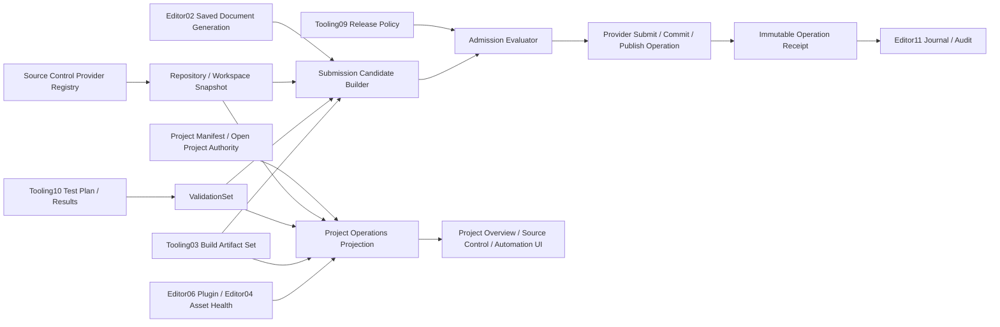

---
related_code:
  - zircon_editor/assets/ui/editor/components/workbench/modules/extensions/production
  - zircon_editor/assets/ui/editor/project_overview.zui
  - zircon_editor/src/ui/retained_host/workbench_preview_actions/extensions.rs
  - zircon_editor/src/ui/retained_host/callback_dispatch/template_bridge/workbench/module_field_edit.rs
  - zircon_editor/src/ui/retained_host/callback_dispatch/template_bridge/workbench/extension_module_feedback/data_production.rs
  - zircon_editor/src/ui/retained_host/callback_dispatch/template_bridge/workbench/extension_module_navigation/specs/data_production.rs
  - zircon_editor/src/ui/template_runtime/builtin/workbench_extension_module_template_bindings/render_asset_vfx.rs
  - zircon_editor/src/ui/layouts/views/project_overview.rs
  - zircon_editor/src/ui/workbench/project/asset_workspace_state.rs
  - zircon_editor/src/ui/workbench/snapshot/data/project_overview_snapshot.rs
  - zircon_editor/src/core/commandlet
  - zircon_editor/src/ui/retained_host/app/automation.rs
  - zircon_editor/src/ui/retained_host/app/tests/retained_host_automation.rs
  - zircon_app/src/entry/entry_runner/editor/project_automation.rs
  - zircon_runtime/src/asset/project/manifest/project_manifest.rs
plan_sources:
  - docs/plans/optimize/00-engine-wide-review.md
  - docs/plans/optimize/zircon_editor/02-document-transaction-save-autosave-recovery-review.md
  - docs/plans/optimize/zircon_editor/04-asset-index-import-reimport-catalog-thumbnail-reference-workflow-review.md
  - docs/plans/optimize/zircon_editor/06-plugin-manager-discovery-enablement-live-reload-settings-diagnostics-review.md
  - docs/plans/optimize/zircon_editor/08-command-registry-keymap-menu-palette-context-routing-remote-automation-review.md
  - docs/plans/optimize/zircon_editor/09-background-jobs-admission-scheduling-cancellation-progress-shutdown-product-integration-review.md
  - docs/plans/optimize/zircon_editor/10-notification-center-toast-decision-history-actions-retention-accessibility-diagnostic-integration-review.md
  - docs/plans/optimize/zircon_editor/11-logging-diagnostic-journal-output-console-status-routing-retention-export-review.md
  - docs/plans/optimize/zircon_tooling/03-export-preset-build-cook-pack-platform-bundle-release-review.md
  - docs/plans/optimize/zircon_tooling/06-session-coordinator-control-plane-leases-validation-artifacts-finalize-supervision-review.md
  - docs/plans/optimize/zircon_tooling/09-release-channel-artifact-repository-install-update-rollback-operations-review.md
  - docs/plans/optimize/zircon_tooling/10-test-architecture-partition-selection-isolation-fixture-flake-results-review.md
reference_engines:
  - dev/UnrealEngine/Engine/Source/Developer/SourceControl/Public/ISourceControlProvider.h
  - dev/UnrealEngine/Engine/Source/Developer/SourceControl/Public/ISourceControlState.h
  - dev/UnrealEngine/Engine/Source/Developer/SourceControl/Public/ISourceControlOperation.h
  - dev/UnrealEngine/Engine/Source/Developer/SourceControl/Public/ISourceControlChangelistState.h
  - dev/UnrealEngine/Engine/Source/Developer/SourceControl/Public/SourceControlOperations.h
  - dev/UnrealEngine/Engine/Source/Developer/AutomationController/Public/IAutomationControllerManager.h
  - dev/UnrealEngine/Engine/Source/Developer/AutomationController/Public/IAutomationReport.h
  - dev/UnrealEngine/Engine/Source/Developer/AutomationController/Public/AutomatedTestResults.h
  - dev/godot/editor/version_control/editor_vcs_interface.h
  - dev/godot/editor/version_control/version_control_editor_plugin.h
doc_type: review-and-refactor-plan
review_status: review_complete
implementation_status: pending
source_recheck_required: true
---

# 27 · Project Operations / Source Control / Changelist / Diff / Automation Report / Submit Gates / Health Dashboard 工程化差距

## 1. 结论

Zircon并非没有项目或自动化基础。内置Project Overview从真实`AssetWorkspaceState`投影项目名、project/assets/cache root、default scene、catalog revision、folder count与asset count；`authoring-automation` commandlet要求已存在的project/request路径，打开真实`EditorApplicationComposition`，通过retained-host callback执行selection、Inspector transform X、Save、Undo与Redo，并返回project/manifest/scene identity、inspection generation、event records和scene snapshot。它们应当保留，不能因为Production工作台造假而被一起删除。

但Production分组公开的五张Workspace没有消费这些authority。Source Control固定显示`CL_2048`、18 files、2 conflicts、6 checks和四条文件状态，Validate与Submit只写固定“queued”文本，甚至在2个conflict仍存在时声称Submit已排队。精确Cargo与production source扫描没有发现Git/libgit2/gix、Perforce/P4、SVN或其他repository provider，也没有provider registration、repository identity、file-state refresh、diff/revision/changelist operation或submit receipt。项目manifest同样不保存repository/provider或submit policy。这个产品目前不是“后端稍弱”，而是完全没有VCS authority。

Automation Report固定显示642 tests、7 failed、3 flakes、Worker_03/09/11和Screenshot diff；Validate/Publish同样只写固定反馈。它既不读取真实authoring commandlet报告，也不读取Tooling10要求的`TestPlanManifest`、`TestAttemptReceipt`、`TestCaseResult`、`TestArtifactManifest`与`ValidationSet`。真实commandlet只是窄域交互驱动器，也没有plan version、attempt ID、deadline/cancel、worker/environment/build/source identity、per-binding duration或artifact contract，不能被改名成全引擎测试控制面。

Project Overview extension固定显示`NebulaGame`、M3、Healthy、Win64 Development Success、72% coverage、7 tasks与3 build jobs，并允许用户直接编辑Owner、Channel和Health；它与内置真实Project Overview构成两个产品。Build Export和Plugin Manager extension也分别伪造62% cook/CDN pending与18 installed/3 updates/1 warning，重复Tooling03和Editor06已经审查的真实owner。五张Workspace各有19条ZUI route、5条固定结果row、6条field Change/Submit，安装20个binding；tab/row只改变选择，field只改control字符串，五个反馈分支只改status/output文本。

更严重的是，Editor没有把dirty document generation、source revision/change set、required validation results、build artifacts、plugin/asset health与release policy冻结成同一个提交候选。当前UI无法证明“看到的测试结果就是准备提交的代码和保存后的资产”，也无法在save/refresh/validate/build/submit任一步失败时补偿。因此任何Validate、Submit或Publish产品语义都必须先关闭。

本轮登记5项P0、60项P1、12项P2和32个验收门。实施必须先删除静态业务事实与伪成功，再定义provider-neutral Source Control合同、`ProjectOperationsSnapshot`和source-bound `SubmissionCandidate`；Automation UI只消费Tooling10结果，Build/Release分别消费Tooling03/09，Plugin状态消费Editor06，Project Overview成为这些owner的只读、带provenance/freshness的聚合投影。核心合同不得硬编码Git，也不能让Dashboard成为新的执行authority。

## 2. 审查边界与证据

### 2.1 当前工作树物理范围

| 子域 | 文件 / 行数 / bytes | test attributes | 证据等级 |
|---|---:|---:|---|
| 五张Production Workbench、route、binding、field与feedback | 14 / 5,140 / 262,920 | 1 | E3：逐control、100个binding、最终selection/string/fixed feedback mutation |
| 真实Project Overview与projection closure | 9 / 3,071 / 114,394 | 10 | E3：真实project/catalog字段、pane projection与focused tests |
| authoring commandlet、App composition与retained-host automation | 14 / 6,041 / 216,796 | 66 | E3：typed request、path resolution、callback、journal、save/undo/redo、report与failure tests |
| manifest、document/job/plugin/build/test/release owner handoff anchors | 26 / 5,011 / 181,730 | 31 | E2/E3：确认边界与消费合同，不在本篇重做各owner |
| selected combined scope | 63 / 19,263 / 775,840 | 108 | 1 ignored；7个在途文件；初始61文件清单fingerprint见下 |

初始61文件清单的当前工作树fingerprint为`e22fb06d3c0fc31369e247021a7224bbb434760cc8b1a40f1c80a98d52e83670`。随后为避免漏判真实callback路径，额外纳入`app/automation.rs`与`retained_host_automation.rs`，其SHA-256分别为`cbd9db0299ee32a383c6f2f3fe00d8b824f0b1356cf3a8cfb304200fec7f113e`与`1bcf4feade772bf8272448ad34b9d760b0c09ce7c270603e8cf80f05e99cdac1`。本文不把61文件hash冒充63文件hash；实施前必须导出完整63文件manifest并重算组合fingerprint。

范围内7个非本轮修改为`core/commandlet/mod.rs`、`runner.rs`、`tests.rs`、`core/commands/registry.rs`、`layouts/views/project_overview.rs`、`retained_host/workbench_preview_actions.rs`和template binding `render_asset_vfx.rs`。逐个diff只见formatter/import reorder与相邻命令注册整理；本轮按当前工作树取证，不吸收、不回退，实施前仍须复核。

### 2.2 静态事实清单

- Source Control的tabs为Diff/Owners/Submit；固定changelist choices为`CL_2048`、`CL_2049`、`Shelved_Alice`，owner为Alice，gate为Fast/Full/Submit Only。
- 固定文件状态为`runtime/ui/render.rs Modified Alice Selected`、`editor/painter.rs Modified Bob Review`、`docs/ui.md Added Alice Ready`和`asset/import.rs Conflict Chen Warning`。
- Automation Report固定suite为Smoke/Rendering/Gameplay，四条case为Renderer.Smoke Running 62%、Gameplay.Tags Queued、Asset.Import Passed和UI.Layout Failed。
- Project Overview extension固定Project/Milestone/Risk、Health/Build/Coverage/Dependencies与Overview summary；内置Project Overview只展示真实项目与catalog元数据，没有health/build/test/source/release状态。
- Build Export与Plugin Manager extension也是同一generic preview机制；其真实产品ownership已分别登记在Tooling03与Editor06，Editor27不复制实现方案。
- `ProjectManifest`有format/engine/default scene/UI/asset roots/settings/library/plugins/scripts/export profiles，没有repository、provider、branch/workspace revision、submit policy或team metadata。
- Cargo manifest与tracked production source精确搜索未找到Git2/libgit2/gix、Perforce/P4或SVN provider依赖，也未找到`SourceControlProvider`、`ChangelistIdentity`、`SubmissionCandidate`或`ProjectOperationsSnapshot`合同。

### 2.3 动态证据边界

本轮没有运行新的Cargo、Editor窗口、repository checkout、diff、stage、commit、submit、test worker、artifact publication或release admission。此前`zircon_editor --lib`测试编译在617.2秒后被239个既有错误和122个warning阻断；相关编译门没有出现足以越过阻断的变化，因此没有重复同一lane。108个test attribute是静态inventory，不是通过数；唯一ignored test必须在实施前解释或恢复。

### 2.4 参考边界

- Unreal `ISourceControlProvider`把provider lifecycle/capability、文件与changelist state查询、同步/异步operation、cancel、label/changelist、status refresh、settings和state-change event分开；`ISourceControlState`区分controlled/current/added/deleted/modified/conflicted/checked-out-by-self-or-other及revision/history。本文吸收合同和状态边界，不复制其类层次。
- Unreal source-control operations覆盖Connect、CheckIn/Out、MarkForAdd、Delete、Revert、Sync/Preview、UpdateStatus、Resolve、pending/submitted changelist、shelve/unshelve和workspace等能力；Zircon核心只定义capability-driven抽象，adapter按provider能力开放命令。
- Godot `EditorVCSInterface`用typed diff file/hunk/line与staged/unstaged/commit area表达最小DVCS产品，提供stage/unstage/discard/commit/status/history/branch/remote/pull/push/fetch；其Editor plugin还处理commit message/amend、split/unified diff和危险操作确认。这是可用Editor VCS的下限，不是大型团队的上限。
- Unreal Automation Controller定义worker/test discovery、cluster/device、run/stop/tick、passes/filter、report/result/artifact、duration/participant/skip/exclusion和export。本文只把它作为Editor消费模型参考；canonical test schema与release admission仍由Tooling10拥有。
- 本地Fyrox与Bevy参考树没有同级first-party Editor VCS产品；Bevy CI和Unity Graphics Wrench/测试模板属于Tooling10的runner参考。本文不以缺少同类源码降低Zircon标准，也不推测闭源Unity Editor内部实现。

## 3. 必须保留的真实基础

1. 保留内置Project Overview的真实project/assets/cache/default scene/catalog revision/folder/asset投影，扩展为聚合视图而不是用fixture替换。
2. 保留`authoring-automation`的typed commandlet、resolved path、single project authority、retained-host callback、journal normalization与非degraded open门。
3. 保留automation通过普通selection/Inspector transaction/Save/Undo/Redo路径验证产品行为的原则，禁止为测试添加直接dispatch旁路。
4. 保留Editor02的dirty/history/save/recovery与external conflict authority；Source Control只能消费保存后的document generation，不能另建dirty状态。
5. 保留Editor04 catalog/reference与Editor06 plugin lifecycle；Dashboard只读投影这些owner的snapshot。
6. 保留Editor08 command registry、Editor09 job authority、Editor10 notification和Editor11 journal；VCS/Test/Submit operation通过这些公共控制面执行和观察。
7. 保留Tooling03 Build Export、Tooling09 Release Promotion与Tooling10 Test Control Plane的owner，不把Build/Automation/Publish逻辑搬进Editor pane。
8. 保留五张Workbench的布局与control视觉壳作为未来projection候选，但立即移除固定业务事实和伪成功。
9. 保留provider-neutral核心；Git、Perforce或其他系统作为capability adapter注册，项目资产不绑定单一供应商。
10. 保留本地离线开发能力，但offline/unknown/stale必须显式展示，不能自动变成Healthy或Ready。

## 4. 目标架构与Owner边界

| 领域 | 唯一owner | Editor27消费/提供 |
|---|---|---|
| document dirty/save/conflict/recovery | Editor02 | `SavedWorkspaceSnapshot`与save barrier |
| asset catalog/import/reference health | Editor04 | generation-qualified asset health projection |
| plugin discovery/enable/reload/diagnostics | Editor06 | plugin set revision与health projection |
| command/job/notification/journal | Editor08/09/10/11 | operation dispatch、progress、cancel、terminal receipt与audit |
| build/cook/package/sign artifact | Tooling03 | immutable `BuildArtifactSet`与provenance |
| release channel/promotion/rollback policy | Tooling09 | `ReleaseAdmissionPolicy`与promotion receipt |
| test plan/attempt/result/artifact/validation | Tooling10 | `ValidationSet`；Automation UI不自定义第二套schema |
| repository/provider/file/diff/changelist UX | Editor27 | provider registry、workspace snapshot、typed operations与diff projection |
| project operations dashboard/submit orchestration | Editor27 | read-only aggregate、candidate builder和admission UX，不拥有下游执行算法 |

建议的核心合同至少包括：

- `SourceControlProviderRegistration { provider_id, capabilities, config_schema_version, owner_lease, operation_factory }`，capabilities显式区分checkout、staging、changelist、shelve、branch、lock、history与remote sync。
- `RepositoryIdentity { provider_id, repository_id, workspace_id, root, case_policy }`与`WorkspaceRevision { base_revision, head_revision, local_change_set_id, observed_at, generation }`；不能只用branch字符串或目录路径。
- `SourceControlFileState { path, state, staged_area, lock_owner, checkout_owner, base_revision, content_hash, conflict, observed_generation }`，binary/asset状态不得强行退化为text diff。
- `SourceControlOperationRequest/Receipt`携operation ID、repository/workspace、expected revision、target paths/changelist、deadline、cancel token、progress、terminal outcome、retryability、provider diagnostics与journal correlation。
- `ProjectOperationsSnapshot`聚合project/document/source/asset/plugin/test/build/job/release子快照；每个子快照都有owner、generation、source revision、produced_at、expires_at和terminal/unknown/stale状态。
- `SubmissionCandidate`冻结saved workspace generation、source change set、required `ValidationSet`、optional/required `BuildArtifactSet`、plugin/asset health与policy digest；任一输入变化即失效。
- `SubmissionAdmissionReceipt`保存每条policy判定、evidence引用、override授权、submit provider receipt和最终revision；它不能只保存“6 checks passed”。
- `AuthoringAutomationAttempt`作为Tooling10 test attempt的adapter，保留其callback/journal/scene证据，但不再发明独立的全局测试报告协议。

## 5. P0：先关闭假产品与危险命令

### P0-1：Source Control没有provider或repository authority，却公开Validate和Submit

固定CL、文件、owner、conflict与checks不来自任何repository；按钮只写文本，且2 conflicts存在仍声称Submit queued。立即禁用或标记Unavailable，直到真实provider state、expected revision、operation receipt和冲突门可用。

### P0-2：Automation Report伪造worker、test、failure、flake和artifact事实

642 tests/7 failed/3 flakes及Worker_03等值没有TestPlan/TestAttempt/Artifact owner。删除固定数据和Publish成功语义；UI只能投影Tooling10带source/build/environment identity的结果，真实authoring commandlet作为其中一种attempt adapter。

### P0-3：Project Overview extension伪造可编辑的健康、构建、覆盖率与发布状态

`Healthy`、Win64 Success、72% coverage和7 tasks不是下游owner投影，用户甚至能直接把Health改成Healthy。撤销该extension或与内置真实pane硬收敛；健康必须由versioned policy对证据派生，禁止手工覆盖事实。

### P0-4：五张Production Workspace构成重复且断开的第二Authority

Build Export与Plugin Manager重复真实产品，Source Control/Automation没有后端，Project Overview重复内置pane；100个binding共同落入generic preview mutation。必须先建立唯一owner映射，再删除重复入口、固定row和固定feedback，禁止修补更多字符串分支。

### P0-5：不存在source-bound、document-bound的Submission/Release Admission事务

Editor无法冻结saved document、workspace revision、validation、build和policy，也无法检测结果过期或对部分失败补偿。任何Submit/Publish必须保持不可用，直到`SubmissionCandidate -> AdmissionReceipt -> ProviderReceipt`闭环通过故障注入。

## 6. P1：Source Control Provider、Workspace 与 Diff

### P1-1：缺少provider registry与capability negotiation

定义注册、启停、availability、authentication、settings、capability与owner lease；UI按能力隐藏或禁用命令，不能假设所有provider都有stage/changelist/checkout。

### P1-2：缺少repository与workspace identity

区分repository、workspace/client、root、remote/depot、branch/stream和case policy；同一路径重新clone或切换workspace必须生成新identity。

### P1-3：缺少可刷新且有generation的文件状态

实现tracked/untracked/ignored/added/deleted/renamed/modified/conflicted/staged/checked-out/locked状态、观察时间和generation；stale refresh不得显示为当前事实。

### P1-4：缺少异步operation生命周期

Connect、Refresh、Add、Delete、Revert、Sync、Resolve、Stage、Submit等必须通过Editor09 job和typed receipt执行，支持progress、cancel request/ack、deadline、retry与terminal outcome。

### P1-5：缺少revision/history与内容读取合同

能够按provider revision读取base/local/remote内容、metadata和history；large/binary内容必须stream/budget，不能把完整blob复制进UI snapshot。

### P1-6：缺少typed diff模型

定义file/hunk/line、old/new range、line kind、encoding、binary/too-large/truncated状态和stable selection ID；split/unified只是projection，不是解析authority。

### P1-7：缺少rename/copy/submodule与case-only change语义

不能将rename退化为delete+add后丢失history；Windows case-insensitive workspace必须处理case-only rename和canonical path碰撞。

### P1-8：缺少changelist/staging-area抽象

用provider capability表达Git index、Perforce changelist和uncontrolled changelist；path membership变化必须带expected generation并可撤销或补偿。

### P1-9：缺少checkout、lock与ownership事实

区分checked out by self/other、exclusive lock、soft lock和owner suggestion；静态Alice/Bob/Chen不能作为权限或冲突依据。

### P1-10：缺少conflict/resolve状态机

建模content、rename/delete、binary、directory/file与provider-specific conflict，Resolve必须记录base/ours/theirs/result hash和operation receipt。

### P1-11：缺少asset-aware diff与reference影响

场景、UI、material、graph等结构化资产应通过Editor04/各authoring owner提供semantic diff；文本fallback必须明确，不能把binary资产显示为无差异。

### P1-12：缺少filesystem watcher与provider refresh协调

外部checkout/sync/branch change必须使document、asset catalog和source snapshot失效；debounce/coalesce后仍要保留overflow/rescan语义。

### P1-13：缺少大型repository预算

为tracked paths、status batch、diff bytes/hunks、history pages、refresh CPU/I/O、watch events与UI rows定义限额、分页、取消和truncation telemetry。

### P1-14：缺少credential与secret边界

token/password/ticket/SSH key只能通过secure credential lease进入provider，不得序列化到project manifest、settings export、operation receipt或diagnostic journal。

### P1-15：缺少provider contract与conformance tests

每个adapter必须通过fake repository、offline/auth expiry、concurrent head move、partial failure、cancel、large diff、path encoding和crash recovery suite。

## 7. P1：Automation Control Plane 与结果消费

### P1-16：Automation UI没有消费Tooling10 TestPlan

Suite/platform/retry必须来自versioned `TestPlanManifest`及resolved selection，显示plan ID、source revision、build/toolchain、environment和selection reason。

### P1-17：缺少immutable TestAttempt identity

每次执行必须有attempt ID、parent plan、attempt ordinal、worker/cluster、start/end、terminal state和superseded关系，禁止覆盖上次结果。

### P1-18：缺少worker discovery与capability

Worker必须由真实coordinator注册OS/GPU/driver/toolchain/plugin/capacity/health/lease；Worker_03字符串不能代替可调度资源。

### P1-19：缺少run/stop/cancel/pause状态机

UI命令通过Tooling10/06发起并显示admission、queued、running、cancel requested、cancelled、completed、lost与timed out，不能点击后直接写Running或Passed。

### P1-20：缺少deadline、heartbeat与lost-worker处理

attempt和case均需deadline/heartbeat/lease expiry；worker失联必须终止或重排，并保留重复执行与late result判定。

### P1-21：缺少typed case result与event severity

Pass/Fail/Skip/Disabled/Timeout/Crash/Infrastructure Error需分开；assert/log/warning/error不能只压成一行Failed文本。

### P1-22：缺少artifact manifest与安全下载

截图、diff、log、trace、dump、coverage和report需有content hash、media type、size、producer、retention、redaction和authorization；UI按需stream。

### P1-23：缺少visual regression语义

Screenshot diff必须引用baseline/candidate/diff artifact、viewport/DPI/color space/renderer/GPU tolerance与approval history，不能只有字符串。

### P1-24：缺少flake判定与quarantine治理

Flake必须基于attempt history和policy，保留first failure/retry outcome、quarantine owner、expiry与issue；重试不能把failure静默抹掉。

### P1-25：缺少coverage provenance

Coverage必须绑定instrumented build、source revision、path mapping、line/branch/function口径、excluded/generated规则与merge completeness；72%不能作为手填健康字段。

### P1-26：缺少result currentness与supersession

source、document、toolchain、test definition、environment或required selection变化后，旧结果立即标Stale/Superseded，不能继续满足submit gate。

### P1-27：authoring automation request没有版本和资源预算

为request加schema version、最大bindings/bytes、deadline、cancel、deterministic seed/clock和allowed command set；同步无界遍历不能成为CI控制面。

### P1-28：authoring automation report缺少attempt provenance

补source revision、build/toolchain identity、environment、attempt ID、per-binding duration、artifact refs和terminal reason，再适配Tooling10结果，不扩张为平行schema。

### P1-29：Automation Report没有查询、分页与增量更新

支持按plan/suite/case/state/tag/worker/revision过滤，结果树和事件分页，增量更新以generation/cursor应用；不能每次复制完整报告。

### P1-30：缺少结果发布与导出的真实receipt

Publish/Export必须明确目标、format、retention、access、redaction、content hash和terminal receipt；上传失败不得显示Published。

## 8. P1：Project Operations Snapshot 与健康投影

### P1-31：缺少canonical ProjectOperationsSnapshot

建立只读聚合合同，引用各owner快照而非复制其可变模型；聚合生成失败时保留per-source error/unknown。

### P1-32：缺少project与source identity关联

Snapshot必须同时携project manifest identity、open project generation、repository/workspace identity与source revision，防止相同项目名串线。

### P1-33：缺少per-section provenance和freshness

Build/Test/Plugin/Asset/Jobs/Release每节显示owner、generation、produced time、expires/stale reason；不能用一个全局Healthy覆盖unknown。

### P1-34：健康状态没有versioned policy

定义policy ID/version/digest、required signals、severity和unknown/stale规则；Health是可解释派生值，不是可编辑字段。

### P1-35：缺少document/save状态投影

展示dirty documents、autosave/recovery/conflict、last saved generation和save barrier；未保存内容必须显式阻止source-bound验证。

### P1-36：缺少asset/catalog/import状态投影

消费Editor04的catalog generation、failed/stale/importing assets、reference errors和artifact readiness；不能只显示asset count。

### P1-37：缺少plugin set与reload状态投影

消费Editor06的resolved plugin set、manifest generation、enablement、compatibility、reload/restart required和diagnostics，删除静态18 installed。

### P1-38：缺少build/cook/package/sign状态投影

消费Tooling03 immutable job/artifact receipt，区分Queued/Running/Failed/Cancelled/Succeeded/Published和stale；删除静态62%。

### P1-39：缺少test/validation状态投影

消费Tooling10 `ValidationSet`，显示required/optional/missing/stale/failing lanes、attempt和artifact，而不是手填coverage。

### P1-40：缺少job与operation状态投影

消费Editor09 active/queued/blocked/cancel states与resource admission，7 tasks/3 build jobs必须来自真实query并支持导航。

### P1-41：缺少release/channel状态投影

消费Tooling09 channel、candidate、promotion、rollback与policy receipt；Channel选择是有权限的operation request，不是control字符串。

### P1-42：缺少snapshot一致性与增量协议

定义聚合读取barrier或显式mixed-generation标记；增量patch必须带base/target generation，丢patch后全量resync。

## 9. P1：Submission Candidate、Gate 与不可分割回执

### P1-43：缺少saved workspace precondition

候选必须引用Editor02确认持久化的document generation；dirty/autosave-only/conflict/recovery状态按policy阻止或要求显式授权。

### P1-44：缺少source change-set freeze

冻结path membership、content hashes、base/head/local revision和provider workspace generation；验证过程中内容变化立即使候选失效。

### P1-45：缺少required ValidationSet解析

按project/channel/change impact解析required lanes并保存policy digest；Fast/Full/Submit Only不能是无定义的三个字符串。

### P1-46：缺少build artifact与test结果绑定

每个required result必须引用同一source/document/plugin/toolchain/build identity；跨revision借用绿色结果必须被拒绝。

### P1-47：缺少preflight admission evaluator

在任何provider mutation前纯函数评估dirty/source/conflict/asset/plugin/test/build/release/permission/credential，并返回逐条可解释decision。

### P1-48：缺少race-safe expected revision

Submit携expected workspace/head revision；远端head、local change set或document generation改变时以typed stale/conflict失败，不能继续提交。

### P1-49：缺少复合operation顺序与compensation

Save、refresh、validate、build、stage/changelist update、submit、publish必须有持久step journal；失败时回滚可逆步骤并明确不可逆边界。

### P1-50：缺少override、approval与权限审计

Policy override必须有actor、scope、reason、expiry、approver和被覆盖evidence，敏感channel支持two-person approval；不能用Owner文本代表授权。

### P1-51：缺少immutable submit/publish receipt

记录candidate/policy/provider operation ID、final revision/changelist、included paths/hashes、validation/build evidence和terminal timestamp，支持审计与复现。

### P1-52：缺少crash/restart与idempotency语义

重启后恢复in-flight operation，按idempotency key查询provider terminal result；禁止因UI重试重复提交、重复发布或丢失成功回执。

## 10. P1：产品集成、质量与治理

### P1-53：缺少唯一导航与authority收敛

定义内置Project Overview、Source Control、Automation、Build和Plugin入口的唯一映射；旧extension URI迁移到真实产品或Unavailable placeholder。

### P1-54：缺少typed command registry接入

所有refresh/diff/stage/revert/validate/submit/publish通过Editor08 command ID、context predicate、permission和factory执行，禁止pane私有字符串分派。

### P1-55：缺少notification与diagnostic关联

长操作通过Editor10/11发布progress/terminal notification、action和correlation ID；UI关闭后仍可恢复查看结果。

### P1-56：缺少离线、partial availability与degraded UX

Provider/Test/Build任一owner不可用时逐节显示Unavailable/Unknown/Stale及恢复动作；不能把缺失信号折叠为Healthy。

### P1-57：缺少accessibility与键盘diff工作流

状态、diff hunk、conflict、gate decision与危险确认提供语义名称、焦点顺序、键盘导航、非颜色提示和screen-reader摘要。

### P1-58：缺少敏感信息redaction与最小暴露

路径、remote URL、user identity、commit message、test log、artifact和credentials按policy脱敏；export/clipboard/telemetry都经过同一redaction层。

### P1-59：缺少端到端故障注入和性能资格

覆盖provider offline/auth expiry/head race/partial submit、test worker lost、artifact upload failure、Editor crash/restart和100K-file repository；报告延迟、内存、I/O与恢复正确性。

### P1-60：缺少旧fixture与schema迁移/删除门

列出五张ZUI、100个binding、generic preview分支和旧workspace ID；迁移后做零引用/零固定业务值/零伪success扫描，禁止长期双轨。

## 11. P2：完整性、扩展性与高级能力

### P2-1：多provider与mixed workspace

支持不同project选择Git/Perforce等adapter，并对nested repository/submodule给出显式边界；不在同一path上混合authority。

### P2-2：branch/stream/worktree与workspace管理

提供创建/切换/清理、dirty guard、document/asset invalidation和恢复，不让branch操作绕过open-project lifecycle。

### P2-3：sparse/partial clone、LFS与大二进制资产

把materialization、placeholder、lock、download progress和offline cache纳入文件状态与asset load，不把未下载内容误报Missing。

### P2-4：semantic merge与binary conflict工具

为scene/prefab/UI/material/graph等注册可验证merge driver、preview和undoable resolve，失败时回退安全的manual workflow。

### P2-5：code review与change-request关联

以provider-neutral review ID、comment/thread、approval和CI status引用提交候选；Editor不复制托管平台全部社交功能。

### P2-6：分布式worker与容量调度

Automation UI展示cluster/device/capability/lease和queue pressure，支持shard、retry placement与cost budget。

### P2-7：测试与健康趋势分析

在immutable history上计算duration、failure、flake、coverage、build和asset-health趋势，保留算法版本与置信区间。

### P2-8：可配置项目运营视图

允许团队保存section/filter/layout profile，但字段只能来自registered projection provider，不能插入无owner的自由文本健康值。

### P2-9：通知、订阅与外部联动

对candidate、gate、worker、build和promotion状态提供有权限的subscription/webhook adapter，带签名、retry、dedupe和dead-letter。

### P2-10：automation录制与可维护脚本

从真实UI操作生成typed binding sequence、assertion和fixture引用，经过review后成为versioned test asset；录制不能捕获secret或脆弱坐标。

### P2-11：团队ownership与policy metadata

Owner、reviewer、path policy和release responsibility来自versioned team/policy provider，支持历史与审计，不写死Alice/Bob/Chen。

### P2-12：跨引擎兼容与迁移工具

为Git attributes、Perforce typemap/stream、CI result、JUnit/coverage和现有project配置提供显式import/migration report，未知字段保留或拒绝，禁止静默降级。

## 12. 当前第二Authority与断路清单

| 表面产品 | 当前事实来源 | 最终动作 |
|---|---|---|
| Source Control Workspace | 5条固定row、20个binding、5个fixed feedback | 先Unavailable；接`SourceControlProviderRegistry`和workspace projection后恢复 |
| Automation Report Workspace | 固定642/7/3、worker与Screenshot diff | 删除fixture；只消费Tooling10 plan/attempt/result/artifact/ValidationSet |
| Project Overview extension | 固定NebulaGame/M3/Healthy/72%/jobs | 与内置真实Project Overview硬收敛为`ProjectOperationsSnapshot` |
| Build Export extension | 固定Win64/62%/Cert/CDN | 删除第二入口；导航到Tooling03真实job/artifact产品 |
| Plugin Manager extension | 固定18 installed/3 updates/1 warning | 删除第二入口；导航到Editor06真实Plugin Manager |
| generic field mutation | `.edit/.commit`只改control value/value_text | 仅保留纯UI preference；业务field必须走typed transaction/operation |
| fixed feedback router | 每产品5个静态status/output分支 | 删除；投影真实job/operation receipt与diagnostic |
| Publish/Submit | 无candidate、policy、provider或receipt | 保持不可用直到admission闭环通过G01-G32 |

## 13. 分层重构里程碑

### M0：Truthfulness、Inventory与Owner冻结

禁用Validate/Submit/Publish，删除固定健康/测试/文件事实；冻结63文件证据manifest、100个binding与所有旧URI，明确Editor02/04/06/08-11、Tooling03/09/10 owner。

### M1：Source Control核心合同与Fake Provider

实现provider registry、repository/workspace/revision/file state、operation request/receipt、capability与conformance fake；先不接真实Git/P4。

### M2：真实Adapter、Status与Diff产品

至少接一个真实provider，完成refresh/history/content/diff/stage或changelist/checkout/lock/conflict/resolve及大型repository预算。

### M3：Test Result消费与Authoring Adapter

接入Tooling10 plan/attempt/result/artifact/ValidationSet，把现有authoring commandlet包装为受预算attempt；移除Automation fixture与第二schema。

### M4：ProjectOperationsSnapshot

聚合真实project/document/source/asset/plugin/test/build/job/release快照，完成provenance、freshness、unknown/stale与一致性/增量协议。

### M5：SubmissionCandidate与纯Preflight

冻结saved generation、source change set、ValidationSet、BuildArtifactSet和policy digest；实现无副作用、可解释的admission evaluator。

### M6：复合Submit/Publish事务

通过Editor09 job执行save barrier、refresh、validate/build、provider submit和promotion，加入expected revision、idempotency、step journal、compensation与immutable receipt。

### M7：产品收敛与迁移

内置Project Overview升级为运营聚合，Source Control/Automation成为真实pane，Build/Plugin跳转其owner；删除五张fixture workspace、100个preview binding与固定feedback。

### M8：安全、恢复、规模与可访问性

完成credential lease、redaction、approval/override、offline/degraded、crash recovery、100K-file/large-result性能和keyboard/screen-reader资格。

### M9：多Provider、趋势、团队与发布资格

扩展第二provider、branch/stream/worktree、LFS/lock、semantic merge、review/team policy、distributed worker/trend，并以长期soak与release gate收敛。

## 14. 验收门禁

- G01：默认产品入口不再显示`CL_2048`、642 tests、Worker_03、NebulaGame、72 percent、18 installed或62 percent等固定业务事实。
- G02：五张旧Workspace、100个preview binding和fixed feedback分支有完整inventory，迁移后零产品引用。
- G03：没有provider时Source Control明确Unavailable，Validate/Submit不可调用且不产生success/queued文本。
- G04：fake provider与至少一个真实adapter通过同一capability/conformance suite。
- G05：repository/workspace/revision identity在clone、branch/stream切换和root变化后不会串线。
- G06：100K-file status refresh有分页/取消/预算，UI保持响应且stale generation不会覆盖新结果。
- G07：text diff保留file/hunk/line/range/encoding/truncation，binary/too-large有明确状态。
- G08：stage/changelist/checkout/lock命令按provider capability开放，unsupported返回typed结果。
- G09：remote head变化或expected revision失配时Submit原子失败且不产生错误成功回执。
- G10：conflict resolve记录base/ours/theirs/result hash，失败不会丢原内容或状态。
- G11：credential不会出现在project file、settings export、journal、notification、artifact或clipboard中。
- G12：Automation pane的suite/case/worker/result全部来自Tooling10 identity，不存在第二套结果schema。
- G13：Run/Stop/Cancel在worker lost、timeout和late result下都有唯一terminal attempt。
- G14：visual failure可以打开baseline/candidate/diff artifact并显示完整render环境与tolerance。
- G15：flake retry保留首次failure、每次attempt和quarantine policy，不把重试成功改写成普通Pass。
- G16：coverage显示instrumented build/source revision/口径，任一identity变化后自动Stale。
- G17：authoring automation继续走retained-host callback/journal/save/undo/redo，没有direct dispatch旁路。
- G18：authoring request有schema/binding/bytes/deadline/cancel预算，超限产生typed terminal result。
- G19：Project Overview所有section显示owner、generation、provenance和freshness，unknown不聚合成Healthy。
- G20：Health由versioned policy派生，UI不能直接编辑结果；override单独审计。
- G21：dirty/autosave-only/conflicted/recovery document会阻止或按显式policy进入候选。
- G22：asset/plugin/build/test/job/release状态均可导航到其唯一owner产品和原始receipt。
- G23：同一Dashboard snapshot的mixed generations被显式标记，丢增量后能全量resync。
- G24：SubmissionCandidate冻结document/source/plugin/toolchain/test/build/policy identity，任一变化即失效。
- G25：required ValidationSet缺失、失败、stale或来自不同revision时Preflight拒绝Submit。
- G26：Save/Refresh/Validate/Build/Submit任一步故障注入不会产生半真Healthy或虚假Published。
- G27：Editor crash/restart后可按idempotency key恢复/查询operation，不重复提交或发布。
- G28：immutable receipt能追溯最终revision、included paths、policy decisions、validation/build evidence和actor。
- G29：危险Revert/Discard/Resolve/Submit/Publish有正确scope预览、键盘流程与可访问确认。
- G30：offline/auth expiry/provider unavailable/test coordinator unavailable分别显示可恢复degraded状态。
- G31：动态测试、repository fixture、worker fixture、artifact store和release policy fixture在Windows优先lane通过；Linux-specific需求另行取证。
- G32：连续soak证明watch refresh、result stream、Dashboard增量和operation journal有界，无secret泄漏、无generation回退、无终态丢失。

## 15. 禁止的临时修补

1. 禁止把`git status`文本解析直接塞进pane并称为Source Control architecture。
2. 禁止在核心合同写死Git branch/index/commit或Perforce depot/changelist字段；差异进入adapter capability。
3. 禁止让Submit在conflict、unknown、stale或missing evidence时只弹warning后继续。
4. 禁止用control `value_text`保存changelist、owner、gate、health、channel或test selection业务状态。
5. 禁止把authoring automation现有JSON report改名为全局TestResult而绕开Tooling10。
6. 禁止用重试后的Pass覆盖首次Failure，或手工把flake数改为0。
7. 禁止把内置Project Overview删除后只保留固定NebulaGame dashboard。
8. 禁止在Dashboard复制Plugin/Build/Test/Asset mutable state并成为第二个writer。
9. 禁止把source revision只记录为branch名、时间戳或目录mtime。
10. 禁止保存credential、token、ticket、remote embedded secret或未脱敏日志。
11. 禁止为通过测试绕过retained-host callback、document transaction、job authority或provider receipt。
12. 禁止在旧workspace与新产品长期双轨；迁移完成必须零引用硬删除。

## 16. 本轮产出边界

本轮只完成静态review、参考对照、owner划分与分层重构计划，没有修改production Editor/runtime/app/tooling代码或tests，没有接Git/Perforce，也没有运行动态测试。结论不能作为Source Control、Automation、Submit或Project Operations功能已通过的声明；实施必须从M0开始，并在每个里程碑重取当前源码、在途diff、63文件manifest与动态结果。
