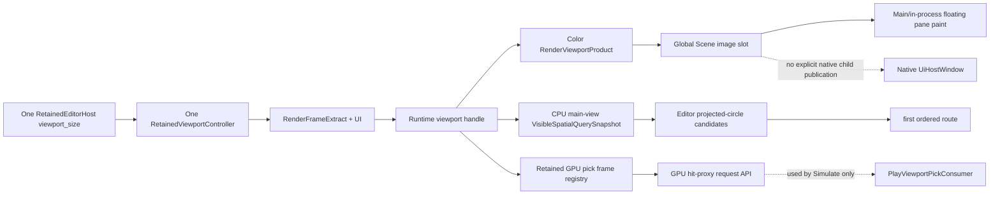

# 270 · Editor Scene Viewport / Runtime Render Scene / Visibility / HZB / Picking / Surface Product 集成当前工作树复核

- 审查日期：2026-09-01
- 审查基线：Git HEAD `5798051603e7f7f565538125c9aba96d5beabae2`
- 审查类型：review only；不修改生产实现
- 父报告：Editor253、Editor254；Runtime213
- MVP 边界：`docs/plans/mvp/index.md` 仍为 `in_progress`，`00` 未完成，F0-F5 仍按依赖阻塞；本轮允许只读复核和文档收敛，不据源码存在宣称产品门通过

## 1. 结论

当前 Zircon 已经拥有三块不能再被误判为“完全没有”的真实底座：

1. Runtime viewport 产品按 `viewport + generation` 生成稳定资源键；WGPU framework 会为已渲染帧保留有界 pick snapshot，并能对指定像素异步执行真正的 GPU hit-proxy pass，返回 entity、instance、subobject、depth、world position 和 world normal。
2. Runtime 会在成功记录 viewport frame 后发布不可变的 `RenderVisibleSpatialQuerySnapshot`，identity 含 world、viewport、frame generation 和 main-camera view；Editor 会在 world 不匹配时 fail closed，并复用同代 projection source。
3. Simulate/Play 已保留 play instance、gateway/session identity、frame generation 和 size，拾取请求绑定当前已显示帧；highlight 发送失败也不会再吞掉 base Scene frame。

但作者态 Scene viewport 仍不是工程级 viewport product。它目前是“一套全局 controller/size/dirty/image slots + 若干局部 generation”的组合，而不是每个 pane/window/surface/view 独立拥有的 session。屏幕上显示的 authoring color product、post-submit visible query、CPU precision candidate、highlight set 和 pointer event 没有共同的原子 identity，也没有共同的 Presented/Consumed receipt。结果是：

- Runtime 已有 frame-qualified GPU ID picking，作者态 Scene 却完全没有调用 `request_viewport_pick/poll_viewport_pick`，仍把 mesh transform translation、经验半径和投影圆作为最终命中；
- Editor 所称 renderer-visible 查询来自 CPU main-view visibility/bounds，不是 HZB/GPU compact 后最终真正绘制的可见集；
- authoring image DTO 丢掉 viewport、world、camera、window、surface、request 和 presented identity，无法证明输入针对用户正在看的那一帧；
- native floating window 虽有独立 `UiHostWindow` 和 callback source，但 presentation 构造不携带 viewport image/product，Host presentation replacement 又把 image set 重置为空；没有找到原生子窗口的 live Scene/Game product 发布路径；
- resize 在新 target ready 前销毁旧 target，submit error 又清掉 dirty；产品缺 last-good/current/stale/degraded/lost 状态；
- `world_space_ui` 仍只画 screen-space `Quad` 并做 2D rect hit，depth/billboard 只影响颜色，命名与能力不符。

因此 Editor253 的 P0 仍为 `2 Open / 1 Partial / 1 Closed`，Editor254 的 P0 仍为 `0 Open / 1 Partial / 2 Closed`。本轮唯一明确的父 P1 状态修正是 `ED59-P1-08` 从 Open 降为 Partial：共享 visible-spatial product 已存在，但只覆盖 Point broad phase，Box/Frame、真实 geometry、最终 HZB truth 和统一 eligibility 仍未接入。两份父账本合并后为 P0 `2 Open / 2 Partial / 3 Closed`、P1 `39 Open / 24 Partial / 1 Closed`、P2 `13 Open / 5 Partial`；本轮 32 道跨边界资格门为 `22 Fail / 4 Partial / 6 Pass`。

当前静态证据不支持“性能或表现优于 Unreal”。在 per-view identity、displayed-frame correctness、native multi-window、GPU picking、final visibility truth、恢复、画质和规模资格未闭合前，任何跨引擎 benchmark 都不具可比性。

## 2. 审查冻结点

### 2.1 当前磁盘选择集

| 范围 | files | lines | non-empty | bytes | tests | ignored | unsafe lexical | HEAD / index / dirty | fingerprint |
|---|---:|---:|---:|---:|---:|---:|---:|---:|---|
| Editor Scene viewport、retained viewport、Gateway、host/native presenter、Workbench render + Runtime viewport pick/visibility/submission closure | **444** | **55,572** | **51,040** | **1,993,406** | **539** | **42** | **56** | **444 / 444 / 0** | `cd1abbd037aaecac48cb8925379a0c475624058aee8354ea7ae13b3558172e84` |
| Unreal/Godot/Fyrox/Bevy/Unity Graphics selected references | **27** | **40,669** | **34,553** | **1,579,654** | **1** | **0** | **19** | n/a | `25245e3f44ab9fb3eca9d5674e7c3397acc5c68ba64155fecd332c09bcbc3fa2` |

统计对去重后的 normalized relative path 按 ordinal 排序，将 `lowercase path + NUL + raw bytes + NUL` 串联后计算 SHA-256。tests、ignored 和 unsafe 均为词法 marker，不是执行或安全证明。Zircon 选择集在冻结时全部进入 HEAD/index 且该选择集无 dirty source；共享工作树的其他目录仍有并发修改，本报告不覆盖、不回退这些修改。

### 2.2 逐文件与负扫描范围

本轮完整枚举并逐文件扫描：

- `zircon_editor/src/scene/viewport/**` 的 135 个 controller、projection、interaction、handle、pointer、precision、render packet 文件；
- `zircon_editor/src/ui/retained_host/viewport/**` 的 lifecycle、submit、poll、presenter factory、world UI 和 focused tests；
- `core/gateway/**` 的 in-process/session pick、highlight、surface contract 与 route；
- retained host 的 render submission、viewport recompute、image redraw、Play pick、native presenter、Host image/global state 和 pane paint；
- Runtime viewport product/pick frame/store、GPU hit-proxy submission、visible spatial query、viewport record 和 submit/present publication；
- 对 authoring Editor 生产调用执行 `request_viewport_pick`、`poll_viewport_pick`、surface presenter、visible snapshot、highlight receipt 的正/负 call-site 扫描。

关键负扫描结果：Editor 中 `request_viewport_pick/poll_viewport_pick` 的生产消费只出现在 `PlayViewportPickConsumer`；authoring Scene controller/pointer router 没有 caller。没有找到 `HighlightReceipt`、per-pane authoring frame identity、native child viewport image publication 或 1/2/3/4 view session registry。

## 3. 当前真实产品流

问题不是每个局部模块都没有 generation，而是 generation 没有汇聚成一个可由 presentation 和 input 共同引用的原子产品。当前至少存在以下互不等价的游标：

| 游标/identity | 当前拥有字段 | 缺失关系 |
|---|---|---|
| `RenderViewportProduct` | resource key、size、generation | 无 world/camera/request/window/surface/view instance/presented receipt |
| `RenderVisibleSpatialQuerySnapshotId` | world、viewport、frame generation、MainCamera | 无 final HZB visibility、displayed/presented product identity |
| `ViewportPickFrameSnapshot` | viewport、size、generation、extract、visible keys、hit proxies、render region、quality | 作者态没有消费；visible keys仍取 CPU frame visibility main view |
| `HostViewportImageData` | key、size、optional RGBA、optional Play identity、overlay | authoring Scene 没有 structured frame identity；kind-global slot |
| `EditorRuntimeHighlightSet` | viewport、generation、entities、attributes | 无 independent revision、consumer cursor、presented receipt、teardown |
| authoring pointer route | local point、modifiers、固定 pointer 1/camera 0 | 无 device/window/surface/view/frame/capture/input sequence |

## 4. 对 Editor253 / Editor254 的时效纠正

### 4.1 不能继续写成 Open 的能力

1. `ED59-P1-08` 调整为 Partial。Runtime 的 `VisibleSpatialQuery` 已以 immutable snapshot 形式共享给 Editor，包含 static/dynamic index、world/viewport/frame/view identity，Point 路由不再在事件时扫描所有 render meshes。
2. Runtime viewport pick 不是 stub。`viewport_pick.rs` 会 resolve 指定 frame generation、提交 GPU hit-proxy product、解析稳定 token，并异步返回 instance/subobject/world position/normal；poll 使用 `try_lock`，不会等待 readback。
3. in-process floating pane paint 已接收同一个全局 `HostViewportImageSet`。因此“所有 floating window 都一定为空”是过时的；准确结论是 in-process floating 复用 kind-global product，而 native child window 没有找到显式 image publication。
4. visible snapshot 在 interaction extract 变化时会被清除，wrong-world snapshot 会 fail closed；这是真实 currentness foundation。

### 4.2 仍不能关闭的能力

1. shared visible query 不等于最终 displayed visibility。它读取 `frame_visibility.main_view.visible` 与球形 bounds；Runtime213 已确认最终 HZB compact truth 未发布到统一产品。
2. GPU pick API 存在不等于 authoring Scene 已接入。Editor 的 authoring pointer path没有 request/poll caller，仍以 CPU 代理圆决定最终 route。
3. in-process floating 能画同一张图不等于 multi-viewport。它没有独立 camera、size、viewport handle、request、cadence 或 input/product identity。
4. native presenter factory 能创建 `UiSurfacePresenter` 不等于 native child pane 已绑定 authoring viewport product；当前 factory 只共享 render framework owner，native presentation 参数不携带 image/product。
5. highlight store 存在不等于 overlay frame consumption 闭环。Editor 在构造 base extract 前独立 fire-and-forget submit，没有 consumer/present receipt。

## 5. 父 P0 重判

| Finding | 状态 | 当前重判 |
|---|---|---|
| ED58-P0-01 per-instance viewport product | Partial | `ViewInstanceId`、native `MainPageId` 与独立 `UiHostWindow` 是基础；controller、size、image slots、render request 和 authoring product仍是全局单例 |
| ED58-P0-02 resize/create/quality/submit failure | Open | destroy 成功后 create/quality 失败会留下空 target；submit error 清 dirty；无 last-good/retry/degraded state |
| ED58-P0-03 world-space UI truth | Open | 仍是 viewport rect 到 `UiRenderCommandKind::Quad`；world transform/depth/billboard/ray-UV 未实现 |
| ED58-P0-04 Runtime post-render generation gate | Closed | Runtime 继续在渲染提交完成并验证 generation 后发布产品 |
| ED59-P0-01 qualified cancel owner/receipt | Partial | batch interactive transform rollback真实；pointer/window/viewport/capture generation 和 terminal receipt仍缺 |
| ED59-P0-02 secondary chord implicit commit | Closed | guard仍在 |
| ED59-P0-03 highlight failure drops base frame | Closed | highlight error仅记录，base extract继续提交 |

## 6. 跨边界差异与重构账本

以下 `ED270-XB-*` 是父 finding 的跨边界映射，不增加第二套 canonical 计数。

### 6.1 Session、window、surface 与 product identity

| ID | 状态 | 当前源码事实 | 必须重构为 |
|---|---|---|---|
| ED270-XB-01 | Open | Host只有一个 `RetainedViewportController`、`viewport_size` 和 `render_dirty` | `ViewportSessionRegistry`，由 `ViewInstanceId + document + window + surface lease + viewport handle` 唯一标识 |
| ED270-XB-02 | Open | Scene/Simulate/Game 是三个 kind slot，不能表达同 kind 多实例 | per-session product map；pane关闭/移动/复制不得覆盖兄弟实例 |
| ED270-XB-03 | Partial | in-process floating pane能绘制全局 image；native callback能解析 source window | 独立 pane仍需 measured extent、camera、cadence、product/currentness；不得把共享图误称多视口 |
| ED270-XB-04 | Open | native child `apply_presentation` 不接 image/product，replacement重置 image set | native window presenter显式接收 session-qualified image/product lease，并回传 present completion |
| ED270-XB-05 | Open | `RenderViewportProduct`只有 key/size/generation | 增加 session、source epochs、format/colorspace/HDR、render/present receipt 和资源 lease |
| ED270-XB-06 | Open | authoring `HostViewportImageData` 丢全部 structured source identity | 保留不可拆的 `ViewportFrameIdentity`，input只能引用当前 displayed identity |

### 6.2 Lifecycle、submission 与 currentness

| ID | 状态 | 当前源码事实 | 必须重构为 |
|---|---|---|---|
| ED270-XB-07 | Open | resize先clear/destroy旧target，再create/configure新target | prepare new target -> first-frame-ready -> atomic swap -> retire old target；失败继续显示last-good |
| ED270-XB-08 | Open | submit `Err`记录日志后 `render_dirty=false` | typed retryability、bounded backoff、incident、retry deadline 与 explicit terminal state |
| ED270-XB-09 | Open | direct product和capture共用 `latest_generation` | per-mode cursor/epoch + explicit transition barrier，禁止模式切换互相压制 |
| ED270-XB-10 | Open | visible snapshot在submit成功后另查，image稍后poll | Runtime一次发布 `ViewportFrameProduct`，color/depth/ID/visible/highlight receipt共享同一identity |

### 6.3 Visibility、HZB 与 picking

| ID | 状态 | 当前源码事实 | 必须重构为 |
|---|---|---|---|
| ED270-XB-11 | Partial | immutable visible spatial query、static/dynamic index、world/viewport/frame/view identity真实存在 | 继续保留为 broad-phase product，但标明 completeness/backend/stage，不得命名为最终 displayed-visible truth |
| ED270-XB-12 | Open | query从 CPU `main_view.visible`构造，occlusion/HZB compact结果未进入 | Runtime213发布 final visible instance/primitive product或明确 conservative superset contract |
| ED270-XB-13 | Open | Runtime GPU hit-proxy pick已完整，authoring Scene caller为0 | authoring point pick硬切到 displayed-frame-qualified request/poll/cancel；CPU只能是typed fallback |
| ED270-XB-14 | Open | fallback radius为 `max(abs(scale))*0.75` 并 clamp，最终投影为circle | 使用真实 mesh/instance/subobject/alpha/skinned/thin geometry；fallback必须带精度等级和用户可见degraded state |
| ED270-XB-15 | Open | Runtime/Editor visibility bounds仍依赖近似球；同entity多primitive在Editor owner map中收敛 | 保留 stable primitive/instance identity，命中与selection policy决定聚合时机 |
| ED270-XB-16 | Open | Point、Box、Frame仍不是同一 selectable spatial product | `SelectableSpatialProduct` 统一 visibility、eligibility、bounds、geometry、instance、frame和query modes |

### 6.4 Input、selection、highlight 与 gizmo

| ID | 状态 | 当前源码事实 | 必须重构为 |
|---|---|---|---|
| ED270-XB-17 | Open | authoring adapter固定 pointer id 1、camera id 0 | 保留 device/pointer/window/surface/view/camera/frame/input sequence 与 capture generation |
| ED270-XB-18 | Open | Runtime排序多个hit，Editor最终 `.first()` | 保存ordered hit receipt；支持stable cycle/list/behind-object policy与tie explanation |
| ED270-XB-19 | Open | selection admission主要检查node存在 | generation-frozen eligibility snapshot，统一hidden/locked/active/document/tool/editability/layer policy |
| ED270-XB-20 | Partial | interaction extract改变会清 visible snapshot；wrong-world拒绝 | 再绑定 displayed frame generation、surface generation和input sequence，避免旧屏幕/新query组合 |
| ED270-XB-21 | Open | highlight先于base extract独立提交，selection generation兼作overlay generation | frame-bound highlight product、独立revision、remove/tombstone、consumer cursor与Presented receipt |
| ED270-XB-22 | Partial | `InteractiveTransformSession` 已有multi-root冻结、原子preview/rollback和batch command | peripheral capture owner、typed terminal、negative scale/math policy仍由Editor254/255/188收敛 |
| ED270-XB-23 | Open | scene gizmo只覆盖Camera和DirectionalLight，camera far显示被截到2.5 | plugin/descriptor-driven gizmo registry，覆盖Point/Spot/Rect/Ambient及component/subobject；显示尺度与真实参数分离 |
| ED270-XB-24 | Open | 只有一个camera/settings/size，builtin Scene/Game不支持multi-instance | 1/2/3/4 layout、per-view camera/show flags/quality/history、持久restore和公平预算 |

## 7. 精确源码证据

### 7.1 Editor host / surface

- `viewport_state.rs:15-29` 保存单 `ActiveViewport`、单 `latest_generation`、单error与全局world-UI capture。
- `viewport_lifecycle.rs:32-52` 在新target成功前销毁旧target；quality失败只销毁新handle，不恢复旧画面。
- `render_submission.rs:35-70` 只有lazy backend `Ok(false)`保留dirty；`Err`最终清dirty。visible query在submit后单独获取并立即安装。
- `recompute_viewport.rs:14-70` 只从主 componentized `viewport_content_frame` 计算一个 `viewport_size`，并更新一套pointer bridge。
- `viewport_image.rs:10-36` 只有Scene/Simulate/Game槽；authoring转换不保存structured identity。
- `native_window_presenters/presentation.rs:38-57` 的 `apply_presentation` 参数没有viewport image/product；`HostContractState::replace_host_presentation`把 `presentation.viewport_images` 重置default。
- `presenter_factory.rs:15-37` 只共享controller以创建Runtime UI surface presenter，没有把pane/window/session绑定到authoring viewport target。

### 7.2 Runtime visibility / pick

- `viewport_pick_frame_registry.rs:31-52` 从已渲染frame冻结extract、visible keys、hit proxy table、render region和quality；registry每viewport保留最多3代。
- 同文件 `matches_request:131-139` 精确校验viewport、size和frame generation。
- Runtime `viewport_pick.rs:41-84` resolve指定generation并提交 `submit_hit_proxy_product`；`87-105`把GPU token解析成entity/instance/subobject和world-space hit数据。
- `viewport_pick.rs:108-126` 的poll使用 `try_lock`并pump readback completion，WouldBlock时返回pending。
- `spatial_query.rs:28-49` 只从 `frame_visibility.main_view_visible_stable_instance_key_set()` 与 BVH bounds构造可见entry；ray最终是sphere intersection。
- `viewport_record/visible_spatial_query.rs:19-27` identity固定为 `MainCamera`，包含world、viewport和frame generation，但没有visibility stage/completeness/HZB generation。

### 7.3 Authoring pointer / overlay

- `runtime_picking_adapter.rs:15-19` 固定pointer 1与camera 0；`69-78`只消费first hit。
- `renderable_pick_radius.rs:3-10` 用transform scale生成经验半径；`renderable_candidate.rs:11-30`只投影center circle。
- `viewport_overlay_pointer_router_visible_spatial_query.rs:17-25` 只按world过滤snapshot；`58-81`按snapshot/camera/viewport复用projection source，没有displayed product校验。
- `editor_state_render.rs:37-54` 先独立submit highlight，再构造base extract；两者没有共同receipt。
- `render_packet.rs:67-107` 只为Camera与DirectionalLight生成scene gizmo；Point/Rect/Spot/Ambient返回None，camera far wire被限制到2.5。
- `world_space_ui.rs:187-247` 只读取viewport rectangle，画screen `Quad`并做2D矩形topmost hit。

## 8. 参考引擎约束

| 参考 | 可迁移工程约束 | Zircon差异 | 不应照搬 |
|---|---|---|---|
| Unreal `FEditorViewportClient` / `FLevelEditorViewportClient` | `InputKey`携带实际`FViewport`；Draw按目标构建`FSceneViewFamily`；display invalidation与hit-proxy invalidation可分离；`ProcessClick`分派Widget/Element/Actor/Instance/Vertex/Surface typed proxy | Zircon输入与product未绑定同一个viewport；authoring有GPU proxy能力却绕过 | UObject/legacy global editor状态与所有历史兼容分支 |
| Unity Graphics `InstanceCuller` | Picking和SelectionOutline是明确的`BatchCullingViewType`；各有include/exclude filter、picking entity IDs和独立draw output；occlusion状态与view instance ID显式 | Zircon highlight/pick/visible query仍是三条松散旁路，authoring不消费GPU pick | Unity Editor静态API与C# Job布局 |
| Godot `Node3DEditorViewport` | 每个viewport拥有SubViewport/Camera；ray由该camera投射；gizmo DynamicBVH缩小候选；结果按depth排序并提供重叠列表；3D editor维护最多4个viewport | Zircon只有单controller/size/camera，重叠列表丢弃，Scene gizmo覆盖极窄 | Godot节点/Ref/ObjectDB所有权模型 |
| Bevy Picking | `PointerId`区分mouse/touch/custom；`Location`携带`NormalizedRenderTarget`；camera由backend按target匹配；`PointerInteraction`保留近到远列表；HitData含camera/depth/position/normal/typed extra | Zircon authoring固定pointer/camera并在bridge丢render target，HitData以screen score伪depth | ECS schedule和通用plugin API本身 |
| Fyrox Editor | InteractionMode是可注册对象；selection frame投影真实world bounds；gizmo pick使用所属camera、render target size和每part AABB；selection通过Command提交 | Zircon Box/Frame与Point语义分裂，gizmo registry/部件覆盖不足 | Fyrox现有cancel和scale策略不能作为充分正确性基线 |

## 9. 目标架构与唯一 owner

### 9.1 核心合同

| 合同 | 最小字段/责任 |
|---|---|
| `ViewportSessionId` | view instance、document/world session、window、surface lease、runtime viewport handle、session generation |
| `ViewportSourceEpochs` | world、camera、settings/show flags、selection、highlight、UI、size/DPI、quality、device epochs |
| `ViewportRenderRequest` | request id、session id、source epochs、reason/deadline/cancel、desired product set |
| `ViewportFrameProduct` | request/session/source identity；color/depth/ID/final-visible/broad-phase/highlight products；render/publish/present states |
| `ViewportPresentReceipt` | presenter/window/surface、frame identity、accepted/presented/dropped/failed、timestamp、typed failure |
| `ViewportPickRequest/Receipt` | displayed frame identity、pointer/input sequence、pixel/policy；ordered entity/instance/subobject hits与precision/backend |
| `ViewportLifecycleReceipt` | prepare/swap/suspend/restore/close状态、last-good、incident、resource retirement |

### 9.2 Owner边界

1. Editor Host只拥有pane/window测量、focus和presentation，不拥有kind-global render truth。
2. Editor `ViewportSessionRegistry`拥有pane到runtime target、camera/settings和input capture的映射。
3. Runtime Render Framework唯一拥有frame build、final visibility、GPU ID product和资源lifetime。
4. Presenter只通过lease消费不可变frame product并返回present receipt，不通过字符串resource key推断currentness。
5. Selection/Highlight消费同一displayed frame identity；selection transaction仍由Editor authoring transaction owner负责。
6. Runtime213继续拥有GPU Scene/HZB/final-visible truth；Editor270只定义如何消费，不在Editor复制culling authority。

### 9.3 原子产品流

```mermaid
flowchart LR
    A["Measure pane/window/surface"] --> B["ViewportSessionRegistry"]
    B --> C["Freeze ViewportSourceEpochs"]
    C --> D["ViewportRenderRequest"]
    D --> E["Runtime render + HZB + ID + highlight"]
    E --> F["Atomic ViewportFrameProduct"]
    F --> G["Presenter lease"]
    G --> H["ViewportPresentReceipt"]
    H --> I["DisplayedFrameIdentity"]
    I --> J["Qualified pointer/pick request"]
    J --> K["Ordered GPU hit receipt"]
    K --> L["Eligibility + selection transaction"]
    L --> C
```

## 10. 必须硬切的旧路径

1. 删除“一个Host一个Scene controller/size/dirty”的产品假设；不得在新registry外保留兼容写路径。
2. 删除 `HostViewportImageSet` 作为多视口authoritative map的地位；三槽只可作为迁移期projection，最终必须由session key索引。
3. 作者态Point pick硬切到Runtime GPU hit-proxy接口；经验圆只能在明确的Unavailable/Degraded策略下启用。
4. 禁止将 post-submit `visible_spatial_snapshot()` 与稍后poll到的任意image组合；两者必须来自同一 `ViewportFrameProduct`。
5. 禁止固定pointer 1/camera 0和无input sequence的authoring route。
6. 禁止highlight fire-and-forget后用selection generation冒充frame消费状态。
7. 重命名或删除当前伪 `world_space_ui` 产品；真实3D surface完成前只能叫screen overlay/debug surface。
8. resize不得先销毁last-good target；submit error不得消费唯一dirty意图。
9. direct/capture不得继续共享generation cursor。
10. native child presentation不得依赖主Host global image side channel。

## 11. 依赖有序重构里程碑

### M0 · Capability truth与currentness hard gate

- 把当前world UI重标为screen overlay；UI与日志明确Current/Stale/Degraded/Lost。
- submit错误保留dirty并按typed retry policy调度；resize保留last-good。
- authoring image DTO至少保留viewport/frame generation，pointer拒绝非displayed generation。
- 该切片直接服务MVP F4基础选择正确性，不等待高级multi-view。

### M1 · Per-pane session registry

- 引入 `ViewportSessionId` 与registry，迁移camera/settings/size/dirty/lifecycle。
- Scene/Game/Simulate pane均由session解析，duplicate/floating获得独立状态。
- close/focus/move/resize按session generation产生receipt。

### M2 · Atomic frame product与native presenter

- Runtime发布source-qualified `ViewportFrameProduct`；Host只消费不可变产品。
- native child与main/in-process floating走同一session map和present receipt。
- direct/capture切换使用prepare/commit barrier和独立cursor。

### M3 · Authoring GPU picking hard cut

- 复用现有Runtime request/poll/cancel接口，绑定DisplayedFrameIdentity、pointer和input sequence。
- Editor消费ordered hit list，接selection eligibility与overlap UI。
- CPU broad phase/代理fallback变成显式policy并有precision diagnostics。

### M4 · Final visibility truth

- 由Runtime213发布final HZB/GPU visible product或conservative completeness metadata。
- Point/Box/Frame统一消费 `SelectableSpatialProduct`；保留primitive/instance/subobject identity。
- multi-view、shadow/capture/aux view使用稳定view/subview id。

### M5 · Highlight、overlay 与 gizmo product

- highlight revision独立于selection，进入frame product并有Submitted/Consumed/Presented receipt。
- scene gizmo改成descriptor/plugin registry，补齐light/component/subobject覆盖。
- 真实world UI单独立项完成3D transform、camera target、depth、billboard、raster LOD和ray-UV。

### M6 · Multi-view与持久化

- 交付1/2/3/4 viewport layout、per-cell camera/show flags/quality/realtime和workspace restore。
- background/occluded/hidden view进入admission、keep-warm和fairness budget。

### M7 · 产品资格与性能对标

- fault：create/quality/submit/present/readback/device loss/native close/reparent window。
- scale：1/4/16 view、1k/100k/1m candidates、high-frequency pointer、resize storm。
- correctness：thin/alpha/skinned/instanced/negative scale/near plane/overlap/occluded golden corpus。
- 通过同画质、同正确性、同恢复门后，才运行Unreal/Unity/Godot/Fyrox/Bevy对照benchmark。

## 12. 32道跨边界资格门

| Gate | 状态 | 当前判定 |
|---|---|---|
| G01 per-pane stable viewport session identity | Fail | controller/size/dirty全局单例 |
| G02 duplicate same-kind pane有独立product | Fail | kind-global image slot |
| G03 native child window收到live viewport product | Fail | presentation无image/product publication |
| G04 in-process floating pane显示viewport | Partial | 能画全局产品，但非独立session |
| G05 color/depth/ID/visible/highlight原子产品 | Fail | 多条独立publication |
| G06 authoring input绑定DisplayedFrameIdentity | Fail | image无structured identity |
| G07 Runtime color product具viewport generation | Pass | resource key/size/generation真实 |
| G08 product具完整source/window/surface provenance | Fail | 字段缺失 |
| G09 direct/capture独立cursor与切换barrier | Fail | 共用latest_generation |
| G10 resize失败保留last-good并可恢复 | Fail | 先destroy旧target |
| G11 submit失败保留dirty并bounded retry | Fail | error后dirty=false |
| G12 Runtime pick拒绝unknown/stale frame | Pass | request按viewport/size/generation校验 |
| G13 Runtime pick执行真实GPU hit-proxy pass | Pass | token/depth/world hit product真实 |
| G14 authoring Scene消费GPU pick | Fail | 生产caller为0 |
| G15 shared visible spatial product | Partial | immutable CPU main-view broad phase存在 |
| G16 final HZB/GPU visible truth可消费 | Fail | 未发布统一产品 |
| G17 authoring真实geometry precision | Fail | scale sphere + projected circle |
| G18 ordered overlap list与选择策略 | Fail | `.first()`丢其余hit |
| G19 pointer/device/window/surface/camera identity | Fail | 固定pointer/camera |
| G20 wrong-world/interaction-change fail closed | Partial | 已清snapshot；未绑displayed generation |
| G21 selection eligibility统一且generation-frozen | Fail | 主要只检查node存在 |
| G22 Simulate pick绑定显示Play frame | Pass | gateway/frame/size identity真实 |
| G23 highlight failure不吞base frame | Pass | 错误独立记录 |
| G24 highlight consumed/presented/teardown receipt | Fail | fire-and-forget latest store |
| G25 world UI真实3D transform/depth/ray-UV | Fail | screen Quad/rect hit |
| G26 gizmo registry覆盖核心component/subobject | Fail | 仅Camera/DirectionalLight |
| G27 1/2/3/4 view layout与独立camera | Fail | 无session layout |
| G28 native callback保留source window/focus | Partial | source window存在，product/input frame identity缺失 |
| G29 close/device-loss枚举session并有receipt | Fail | 无session registry/ledger |
| G30 per-session CPU/GPU/present-age/drop指标 | Fail | 主要为全局计数/string error |
| G31 GPU pick poll非阻塞 | Pass | try_lock/WouldBlock/pump completion |
| G32 同正确性画质恢复后的跨引擎benchmark | Fail | 无资格receipt |

合计：`22 Fail / 4 Partial / 6 Pass`。

## 13. 验证边界

本轮只做current-working-tree静态review、逐文件/符号/call-site扫描、关键实现逐行复核、参考源码对照、父finding重判和文档记录。没有修改Rust、Cargo、ABI、tests、UI或assets；没有运行Cargo、Editor、真实GPU/native floating window、multi-view、device-loss、fault、scale、soak或benchmark。

539个test marker、42个ignored marker及当前选择集clean只说明语料可定位，不代表测试执行green或产品门通过。Tooling按用户要求排除；本轮未查询、轮询、等待或实时跟踪协调器。

## 14. 状态与后续实施入口

| 里程碑 | 状态 | 实施入口 |
|---|---|---|
| M0 Capability truth/currentness | Open | Editor253 ED58-P0-02/P0-03、Editor270 G06/G10/G11 |
| M1 Per-pane session registry | Open | Editor253 ED58-P0-01、P1-01..08 |
| M2 Atomic product/native presenter | Open | Editor253 P1-09..40、Editor270 G03/G05/G08/G09 |
| M3 Authoring GPU pick | Open | Editor254 P1-04/P1-08、Editor270 G12..G19 |
| M4 Final visibility truth | Open | Runtime213 visibility/HZB findings、Editor270 G15..G17 |
| M5 Highlight/overlay/gizmo/world UI | Open | Editor253 P0-03、Editor254 P1-07、Editor270 G23..G26 |
| M6 Multi-view/persistence | Open | Editor253 P1-34..38、Editor270 G27 |
| M7 Qualification/benchmark | Open | Editor253/254 product gates、Editor270 G29..G32 |

第一实现切片应严格从M0开始：先让authoring Scene能够证明“用户输入针对当前显示帧”，并修复submit/resize失败后的last-good与retry；随后M1/M2建立per-pane session和原子frame product，再接现有Runtime GPU pick。不得先做装饰性多视图布局或新增gizmo图形来绕过产品identity与正确性缺口。
