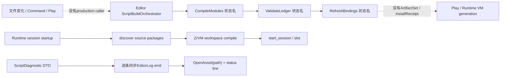

# Editor271 · Script Workspace / Build / Install / Debug 当前工作树复核

## 1. 结论

当前Zircon已经有可保留的Runtime脚本底座，但仍没有工程级Editor脚本产品闭环。`ScriptBuildOrchestrator`具备300 ms debounce、1,000 ms首事件硬截止、20路径/64 KiB准入、active + one queued、`Watch < Command < Play`意图提升、checked request ID和纯状态机测试；Runtime有typed backend catalog、package discovery预算、reflection prepare/commit、state migration/rollback、GC deadline和真实ZrVM backend；新增Vampire测试也确实通过公共Runtime ABI执行gameplay、menu、HUD、input、capture与diagnostics。这些不是空壳，必须保留。

但Editor链仍然停在“有状态机、无产品调用者”。在`zircon_editor/src/core/script_build/**`外精确搜索`ScriptBuildOrchestrator`、`ScriptBuildDiagnosticsSink`、`notify_watch_change`、`enqueue_play`与`enqueue_command`没有产品调用者；三个固定step `CompileModules -> ValidateLedger -> RefreshBindings`没有executor、artifact publication、install receipt、Play waiter或commandlet。Runtime则继续在session启动关键路径discover source并调用`load_discovered_package`，ZrVM backend继续`ProjectWorkspace::open -> compile(incremental=true) -> start_session`。Editor Build与Runtime startup因此仍是两套权威，而shipping Runtime也没有“只接受已资格化产物”的边界。

脚本创作产品同样未形成。`ResourceKind`有27类资源，但没有Script Source、Module、Class、Component、Visual Script、Debug Map或Artifact；`.zr`在Editor生产代码中没有asset importer/toolkit/document命中，只有script-build日志源和无关扩展名。`ScriptLocation`虽保存path/line/column，Host却将其降成通用`OpenAsset(path)`，行列仅写入status line。Zircon产品源码对`ScriptWorkspace`、`ScriptDocument`、`ScriptArtifactSet`、`ScriptInstallReceipt`、`ScriptDebugMap`、`ScriptDebugSession`、`BreakpointId`、`SemanticToken`、`VisualScript`、`ScriptClassId`和`ScriptComponentId`的精确命中均为0。

默认装配仍自相矛盾。WOC把`zr_vm_language`声明为Client、Server、EditorHost的required provider并选择`zr_vm:project`；`zircon_app`的`target-client`和`target-editor-host`只启用generic `script`，没有默认启用ZrVM provider，`target-server`甚至没有generic script。first-party Runtime catalog只有在feature开启时才注册ZrVM，first-party Editor catalog仍只路由Navigation与Neural，ZrVM descriptor还明确`enabled_by_default(false)`。缺provider不会在项目/target preflight阶段产生资格回执，而会延迟到加载路径失败。

因此Editor31/208的唯一账本没有可关闭项：**5项P0全部Open，60项P1全部Open，12项P2全部Open；32个Gate为31 Fail、1 Partial、0 Pass**。本轮新增Runtime产品测试只证明一个单session happy path，不能替代Editor文档、共享构建、immutable artifact、install/hot-reload production trigger、debugger/LSP和多target/fault/scale资格。

## 2. 冻结范围与计量

本报告以`74040e08c2993a29cb39d19a7588377f33e16de3`和当时共享dirty working tree为计量快照，不回退、不覆盖、不暂存其他改动。收尾验证时HEAD推进到`9963f8eb72e2d725d2536eb50b393b30387a1ffa`，两者之间只有协调器cleanup evidence文档变化，本轮179个Zircon选择文件零变更。与Editor208基线`a2d8d811c4a3a1fc1db6f5375c491e7e4502533f`相比，聚焦路径有75个变更文件、4,069 insertions、920 deletions；主要新增在Runtime/ZrVM资格、迁移、缓存、GC和Vampire产品测试，不在Editor authoring/build/install/debug闭环。

计量按目录全文件和显式边界文件去重；行数使用当前物理行，tests/ignored统计Rust属性，unsafe为词法命中。fingerprint由排序后的lowercase normalized path、逐文件SHA-256按LF连接后再次SHA-256。外部`E:/Git/zr_vm`为`03ab8ab863a9f991401ca1fb8a86062394494855`且有15项状态变化，只能作为本机snapshot，不能宣称稳定SDK。

| 选择集 | files | lines | non-empty | bytes | tests | ignored | unsafe | fingerprint |
|---|---:|---:|---:|---:|---:|---:|---:|---|
| Editor build/log/jump/command/catalog | 12 | 2,897 | 2,615 | 96,514 | 44 | 1 | 0 | `ce88aeac8f20e8e2c70f3face3a93b0bd4041379cf782c3818d892774590febf` |
| Runtime/Interface/ZrVM/App/WOC纵切面 | 167 | 29,681 | 27,218 | 1,041,564 | 263 | 10 | 23 | `9f6fc50ddde645d44da2ca7f4d821465d1c25165c286c585618f05d2f3d29771` |
| 去重Zircon联合集 | **179** | **32,578** | **29,833** | **1,138,078** | **307** | **11** | **23** | `13bcffb694ff112e75a881ba7dddaa55723374bf5873ee13700b82a6c2db9be8` |
| Unreal/Godot/Fyrox/Bevy/Unity Graphics参考集 | 121 | 37,749 | 31,439 | 1,299,471 | 3 | 0 | 18 | `ebedffe7c3645e422c159d88f5f3be48ced484f860ae7e3ad57173702890a2d8` |
| 外部ZrVM binding/LSP/debug snapshot | 6 | 3,533 | 3,140 | 138,353 | 11 | 0 | 53 | `338cbf0e84b22a80463b399b8fdc469506424ebb66d08c715d88ff5ac921cb43` |

WOC语料另做规模清点但不纳入selected fingerprint：818个`.zr`、247,408行、238,721非空行、10,002,975 bytes；355个`.zrp`、52,452 bytes；37个`.zro`、8,143,561 bytes；0个`.zri`。源码和散落binary数量不能证明dependency closure、完整artifact set、debug map、Cook/install资格或默认三个target可运行。

Godot、Bevy、Fyrox、Unity Graphics分别冻结在`8c7e6c58`、`fb89a864`、`8d815db3`、`a7e4c051`且clean；Unreal没有独立`.git`，按Zircon工作树快照读取。Tooling按用户要求排除。

## 3. 当前链路与断点

当前真实执行路径是下半条Runtime startup链；上半条Editor build链没有执行者。正确终态必须收敛为：

`transactional ScriptWorkspace/Document -> canonical semantic build -> immutable ScriptArtifactSet -> verified ScriptInstallReceipt -> expected RuntimeSession/VmSlotGeneration commit`

文本、Visual Script、Class/Component、Build、Play、Client、Server、Cook、Hot Reload和Debug必须共享source/artifact/install/debug identity，不能靠path、package name、request id或时间戳推断。

## 4. 可保留底座与不能误判的进展

| 已有底座 | 可保留部分 | 尚不能宣称的能力 |
|---|---|---|
| ScriptBuild admission | 首事件deadline、count/byte budget、single active + one queued、trigger promotion、checked ID | source snapshot、dependency plan、shared job、artifact/install/Play闭环 |
| ScriptDiagnostic + LogJump | typed severity/code/module/location、stale/replay cursor、共享日志source | compiler producer、bounded page/bytes、range/revision/encoding、真实caret navigation |
| Runtime VM manager | typed backend lookup、slot/generation、reflection commit、state rollback、GC deadline | Editor artifact consumer、session-qualified production reload trigger、component instance migration |
| ZrVM real backend | 真实workspace compile/session、host/reflection/value bridge | 并行session隔离、Editor toolchain receipt、debug/LSP adapter、shipping artifact-only load |
| Vampire public ABI test | 真实gameplay/menu/HUD/input/capture/diagnostics happy path | reload/failure/cancel/export/server/editor/multi-session/security/scale/benchmark |
| Scene script binding | package/module、phase flags、JSON property round-trip | stable Class/Component/Field、typed schema、default/override、reference/cook/rename closure |

`ScriptBuildOrchestrator::complete`在失败或取消时仍删除queued request并清空pending/debounced source fact。generation N失败可丢掉N+1编辑，这是正确性问题，不是UI polish。`ScriptBuildRequest::new`仍直接用request ID构造`ScriptBuildGeneration`，source、ticket、artifact、install与runtime generation不可追溯。diagnostic sink仍逐row format/emit；retained log容量并不限制producer CPU、allocation、file sink或fanout。

## 5. 参考实现差异

| 参考 | 源码/测试事实 | Zircon应吸收 | 不应照搬 |
|---|---|---|---|
| Unreal Blueprint/Kismet | `UBlueprint`区分dirty/error/up-to-date状态、Generated/Skeleton Class；Compilation Manager有queue、sync compile、layout readiness、extension、reinstance；Blueprint Editor有compiler results、debug object、breakpoints/watches；promotion tests真实编译并检查GeneratedClass | source/generated/debug identity、分阶段compile/apply receipt、dependency/layout readiness、真实Editor workflow | UObject全局扫描和引擎特有reinstance细节 |
| Unreal HotReload/LiveCoding | compile、patch load、reinstance、completion和cancel是不同终态 | immutable artifact candidate、safe-point commit、rollback、terminal receipt | 把native patch机制直接套到VM |
| Godot | Script Editor维护open documents、reload、live reload、source+line breakpoint；`ScriptLanguage`定义validate/reload、stack/locals/evaluate/profile；LSP测试验证workspace symbol和精确range | document lifecycle、language adapter、debug/profile产品与位置合同 | 单一全局语言对象和其特有资源模型 |
| Fyrox | Inspector用稳定UUID选择script constructor，重复UUID被拒绝；hot reload序列化plugin-owned node/script state再恢复 | stable class identity、constructor registry、显式state capture/restore失败 | 仅靠assembly/plugin边界作为Zircon最终隔离 |
| Bevy | TypeRegistry分离TypeId、full/short path、ambiguous name和TypeData，并递归注册字段依赖；FileWatcher只发布debounced asset event | Class/Field schema、歧义拒绝、依赖闭包、watcher与build解耦 | 用“Bevy无内置脚本Editor”为Zircon缺口辩护 |
| Unity Graphics | ShaderGraph检查递归依赖、执行graph validation，并有message manager单测 | Visual Script图依赖/cycle/validation/message owner的局部先例 | 把ShaderGraph写成Unity通用脚本或Visual Scripting权威 |

## 6. Owner边界与必须独立的身份

| 领域 | 唯一owner | 必须产出的合同 |
|---|---|---|
| document/save/recovery/conflict | Editor02 | `ScriptWorkspace`、Source/Visual documents、revision、encoding、line map、external conflict |
| asset/reference/dependency | Editor04 + Runtime Asset | Script Source/Class/Component/Visual Script正式resource、stable reference、rename/cook closure |
| semantics/compiler/LSP | ZrVM owner + versioned Zircon adapter | canonical parse/type/query、diagnostic pages、symbol/schema、artifact manifest |
| build execution | Editor09/Runtime job owner | immutable intent、bounded queue/cancel/progress、terminal build receipt；禁止私建线程池 |
| install/reload | Runtime07/21 | verified artifact、expected session/slot、safe-point commit、migration/rollback receipt |
| class/component/Inspector | Runtime reflection + Editor05 | compiled class/component/field schema、typed patch、default/override provenance |
| Play | Editor07 | required source/install waiter、failure/cancel/session replacement |
| debug/profile | Runtime diagnostics + ZrVM adapter + Editor25 | artifact-qualified breakpoint/session/frame/value/profile receipt |

以下identity不能合并冒充：`ScriptWorkspaceId`、`ScriptDocumentId`、`ScriptSourceGeneration`、`ScriptBuildTicket`、`ScriptArtifactSetId`、`ScriptInstallReceipt`、`VmSlotGeneration`、`ScriptClassId`、`ScriptComponentId`、`ScriptFieldId`、`ScriptDebugMapId`、`ScriptDebugSessionId`。request ID只表示请求/观察者，不是content generation。

## 7. Canonical P0 currentness

| ID | 状态 | 当前证据 | 必须重构 |
|---|---|---|---|
| P0-1 | Open | WOC required ZrVM与默认Client/Editor/Server feature不闭合，Editor catalog无provider | project/target preflight、provider/toolchain/capability receipt，启动前fail |
| P0-2 | Open | Editor orchestrator无caller，Runtime startup仍同步discover/compile source | 唯一semantic build和immutable ArtifactSet owner；shipping Runtime只接qualified artifact |
| P0-3 | Open | 无Script resource/document/editor；jump只OpenAsset并写status | transactional SourceDocument、真实code editor、revision/range navigation、LSP lifecycle |
| P0-4 | Open | Scene binding仍是package/module + JSON map | typed Class/Component/Field schema、stable ID、default/override、migration、Inspector transaction |
| P0-5 | Open | Visual Script、LSP、Debugger无Zircon adapter或产品consumer | versioned ZrVM adapter；文本/图共享artifact、debug map和Runtime |

## 8. Canonical P1 currentness

| ID | 状态 | 当前差异 | ID | 状态 | 当前差异 |
|---|---|---|---|---|---|
| P1-01 | Open | project scripts无workspace identity/schema | P1-31 | Open | state migration无Editor preflight |
| P1-02 | Open | package/module/path/name混作identity | P1-32 | Open | rollback无产品projection/receipt |
| P1-03 | Open | `.zr`不在asset catalog | P1-33 | Open | lifecycle export依赖可选字符串名 |
| P1-04 | Open | 无transactional SourceDocument | P1-34 | Open | ZrVM关键工作由process-wide mutex串行 |
| P1-05 | Open | encoding/newline/position map合同缺失 | P1-35 | Open | backend unavailable延迟到load |
| P1-06 | Open | 无LSP lifecycle owner | P1-36 | Open | 无Script Class asset identity |
| P1-07 | Open | LSP sync未接Editor02 revision | P1-37 | Open | 无Script Component asset identity |
| P1-08 | Open | language query无reflection generation | P1-38 | Open | field无stable ID/redirect |
| P1-09 | Open | definition/reference/rename无跨资产事务 | P1-39 | Open | field type/default/constraint缺失 |
| P1-10 | Open | fix-it/code action无安全/undo模型 | P1-40 | Open | default与instance override不可区分 |
| P1-11 | Open | generated/source边界未定义 | P1-41 | Open | visibility/permission/effect缺失 |
| P1-12 | Open | symbol/search index无规模预算 | P1-42 | Open | update/fixed flags代替typed lifecycle |
| P1-13 | Open | request id冒充source/artifact generation | P1-43 | Open | dynamic binding绕过typed ECS |
| P1-14 | Open | build失败/取消删除更新source fact | P1-44 | Open | required sibling/conflict规则缺失 |
| P1-15 | Open | changed path不是dependency plan | P1-45 | Open | class/component不进reference/cook/rename closure |
| P1-16 | Open | `CompileModules`无executor | P1-46 | Open | 无Visual Script document/schema |
| P1-17 | Open | `ValidateLedger`只是状态名 | P1-47 | Open | Visual Script没有统一lowering |
| P1-18 | Open | `RefreshBindings`只是状态名 | P1-48 | Open | node catalog无typed provider contract |
| P1-19 | Open | DTO存在但compiler无structured diagnostic producer | P1-49 | Open | pin inference/conversion缺失 |
| P1-20 | Open | diagnostic ingress逐条同步无page budget | P1-50 | Open | control/data flow/cycle/effect语义缺失 |
| P1-21 | Open | 散落`.zro`无完整artifact manifest | P1-51 | Open | graph refactor/semantic diff缺失 |
| P1-22 | Open | `.zri`/debug map生命周期缺失 | P1-52 | Open | graph debug mapping缺失 |
| P1-23 | Open | artifact/cache/cleanup无唯一owner | P1-53 | Open | 无Script Workspace/editor toolkit |
| P1-24 | Open | Play build-before-run未闭合 | P1-54 | Open | 无真实Build命令/status projection |
| P1-25 | Open | headless/cook无同一build入口 | P1-55 | Open | 无breakpoint store/rebind |
| P1-26 | Open | startup同步discovery/compile | P1-56 | Open | 无debug session lifecycle |
| P1-27 | Open | Runtime startup与Editor build双authority | P1-57 | Open | 无stack/locals/watch/evaluate产品 |
| P1-28 | Open | hot reload只有测试caller，无production trigger | P1-58 | Open | 无script profiling/coverage集成 |
| P1-29 | Open | package-name查找缺session-qualified identity | P1-59 | Open | 无multi-target/session/package debug model |
| P1-30 | Open | package state不等于component instance state | P1-60 | Open | 单一happy path不构成fault/scale/perf/migration资格 |

Runtime216已把Runtime07范围内的state migration、GC、callback registration和真实ZrVM产品接线推进为Partial；这些改善不重复记为Editor finding，也没有建立上述Editor caller/identity/product合同。

## 9. Canonical P2 currentness

| ID | 状态 | 当前差异 |
|---|---|---|
| P2-01 | Open | language backend plugin SDK与capability negotiation缺失 |
| P2-02 | Open | text/graph round-trip与统一semantic view缺失 |
| P2-03 | Open | live value overlay/time-travel snapshot缺失 |
| P2-04 | Open | remote/distributed compile与cache qualification缺失 |
| P2-05 | Open | package dependency registry、lock与provenance产品缺失 |
| P2-06 | Open | sandbox/capability/permission可视化缺失 |
| P2-07 | Open | deterministic replay/rollback debugger缺失 |
| P2-08 | Open | semantic merge与协作冲突模型缺失 |
| P2-09 | Open | per-script/per-export budget annotation缺失 |
| P2-10 | Open | Interp/Binary/AOT semantic parity与sidecar策略缺失 |
| P2-11 | Open | 同workload跨引擎authoring/runtime基准缺失 |
| P2-12 | Open | signing/SBOM/provenance/quarantine/revoke供应链资格缺失 |

## 10. 32项资格门

| Gate | 状态 | 当前判定 |
|---|---|---|
| G01 | Fail | 默认三个target不能共同满足required ZrVM，Server还缺generic script |
| G02 | Fail | Source document未接Editor02 revision/save/recovery/conflict |
| G03 | Fail | 无LSP lifecycle及crash/restart/shutdown产品 |
| G04 | Fail | language query未绑定host reflection generation |
| G05 | Fail | diagnostic无position encoding/source revision/end range，jump不执行真实定位 |
| G06 | Fail | fix-it/rename无preview/atomic transaction/undo/rollback |
| G07 | Partial | active+one queued、20路径/64 KiB、首事件deadline与O(1)字节记账存在；job/diagnostic/artifact bytes/age/deadline缺失 |
| G08 | Fail | active失败仍删除queued和pending source fact |
| G09 | Fail | source/artifact/install/request identity不可追溯 |
| G10 | Fail | compiler不产出bounded structured diagnostic pages |
| G11 | Fail | ArtifactSet非完整、非原子、非content-addressed，无toolchain/target/debug map |
| G12 | Fail | 818源码和37 `.zro`没有完整qualified set证明 |
| G13 | Fail | incremental changed path不是canonical dependency snapshot |
| G14 | Fail | Build/Play/Runtime load没有共同compiler/cache/artifact/receipt |
| G15 | Fail | Runtime startup同步discover/open/compile/session start |
| G16 | Fail | Runtime不接受qualified artifact，仍从source构建 |
| G17 | Fail | hot reload不消费qualified artifact/expected session-slot generation |
| G18 | Fail | package reflection/state rollback改善存在，component schema与产品receipt缺失 |
| G19 | Fail | package state与component instance state无独立迁移合同 |
| G20 | Fail | Class/Component/Field stable ID不存在 |
| G21 | Fail | Inspector没有compiled typed schema patch |
| G22 | Fail | legacy `script.bindings`仍是唯一读写格式，无迁移删除门 |
| G23 | Fail | Visual Script与文本没有共同module/artifact/interface |
| G24 | Fail | graph stable ID/type/cycle/effect/semantic diff不存在 |
| G25 | Fail | text/graph breakpoint与artifact debug map不存在 |
| G26 | Fail | debug attach/continue/step/stop与Runtime session无Zircon合同 |
| G27 | Fail | stack/value/evaluate无depth/count/bytes/time/effect预算 |
| G28 | Fail | process-wide ZrVM mutex与package-name入口不能证明multi-session/target隔离 |
| G29 | Fail | profiling/coverage没有artifact/debug map/clock-domain绑定 |
| G30 | Fail | compile/reload局部rollback不能替代LSP/debug/fault统一terminal receipt |
| G31 | Fail | WOC build/reload/debug无动态预算分布、UI hitch、RSS和I/O证据 |
| G32 | Fail | Windows/Linux、Editor/Client/Server、Interp/Binary/AOT资格未闭合 |

## 11. 分层重构顺序

1. **M0 Truthfulness/Profile**：闭合三个target的generic framework和provider feature；项目打开前验证required backend、toolchain、capability、ABI/source revision并产出receipt。外部dirty ZrVM snapshot不能成为发布依赖。
2. **M1 Workspace/Document**：在Editor02建立ScriptWorkspace、SourceDocument、VisualScriptDocument adapter、revision/encoding/newline/line map、external conflict、autosave/recovery和真实range navigation；把Script资源纳入asset/reference系统。
3. **M2 Shared Build/Artifact**：分离source generation、build ticket、artifact set、install receipt；接共享job owner；canonical compiler返回count+byte bounded diagnostic pages和content-addressed immutable ArtifactSet。
4. **M3 Class/Component/Reflection**：建立stable class/component/field schema、redirect、default/override provenance、typed Inspector patch、reference/rename/cook closure；提供legacy JSON binding一次性迁移与删除门。
5. **M4 Runtime Install/Reload**：shipping Runtime只加载verified artifact；candidate在旧generation外prepare，按expected session/slot safe-point commit；package与component state分别迁移，失败保留last-good并返回terminal receipt。
6. **M5 Visual Script**：建立typed graph/node/pin/provider、type/effect/cycle validation、semantic diff；lowering到同一compiler module/interface/artifact/debug map，禁止第二解释器。
7. **M6 LSP/Debugger/Profiler**：接versioned ZrVM adapter，提供workspace sync、request cancel、symbol/refactor、breakpoint rebind、attach/session/thread/frame/value/evaluate/profile/coverage及stale处理。
8. **M7 Product Qualification**：真实Build/Rebuild/Clean/Cancel命令、build-before-Play、headless/cook同入口；覆盖Client/Server/Editor、cold/warm/incremental/reload/debug、fault/scale/soak、安全与同workload benchmark。

M0-M4是MVP正确性前置，不应先做装饰性code editor或debug panel。Editor13旧计划把内置code editor和debugger列为非目标，已小于Editor31和当前工程级引擎目标；实施时应修订计划边界，而不是让旧非目标永久掩盖产品缺失。

## 12. 禁止的临时实现

- 禁止在Console旁添加文本框、语法颜色或静态树，就宣称Script Editor、Debugger或Visual Script完成。
- 禁止用regex、扩展名、stderr解析或第二套parser代替ZrVM canonical semantics、LSP和debugger。
- 禁止让Editor和Runtime分别编译source后按时间戳挑较新者；shipping Runtime不得重新编译。
- 禁止让request ID同时表示source、artifact、install/binding generation，或失败时清除更新source fact。
- 禁止把bounded retained log写成bounded diagnostic ingress；producer必须在page admission处限制rows/bytes/time并产出truncation receipt。
- 禁止给JSON map硬编码几个Inspector字段后命名为Script Component。
- 禁止让Visual Script拥有独立解释器、类型系统或shipping artifact。
- 禁止先画breakpoint、stack、locals面板，再用静态row冒充debug session。
- 禁止绕过HotReloadCoordinator直接替换VM，或把package state migration冒充component override migration。
- 禁止把WOC源码、`.zro`数量、Rust测试marker或单个happy path写成性能优于Unreal、产品完整或跨平台资格证据。

## 13. 验证边界与后续复核条件

本轮逐文件复核Editor script-build五文件、log jump/host dispatch/default command、Editor/Runtime catalog、Runtime Interface diagnostics/resource marker、Project/Scene script schema、Dynamic Session startup、Runtime Script全目录、ZrVM plugin/App target/WOC纵切面，并核对Unreal Blueprint/Kismet/HotReload/LiveCoding、Godot Script/LSP/Debugger、Fyrox constructor/hot reload、Bevy Reflect/Watcher、Unity Graphics graph validation及外部ZrVM LSP/debug/profile API。没有修改Rust、C、TOML、ABI、tests或UI。

本轮未运行Cargo、ZrVM CMake/CTest、Editor、Play、Client/Server、LSP/debug protocol、WOC full build、hot reload、fault、scale、soak、安全测试或跨引擎benchmark；原因是本轮授权为review-only，且当前MVP门不允许用动态测试替代仍缺失的产品合同。文档只能证明静态currentness，不能声称动态资格通过。

下次状态变化至少需要以下可复核证据之一：生产Editor caller；source/artifact/install独立identity；shared build executor与immutable artifact；Runtime artifact-only install；正式Script resource/document/toolkit；typed Class/Component schema迁移；ZrVM LSP/debug adapter；或真实多target/fault/performance资格。仅增加状态名、面板、mock row、样例脚本或happy-path测试不改变canonical状态。
