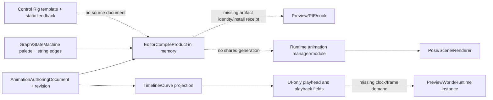

# Editor Animation Source、Compiled Artifact、Timeline、Curve、Graph、State Machine、Control Rig、Preview 与 Product 当前工作树复核

## 1. 结论

当前 Editor 动画代码已经有可保留的文档和交互骨架，但仍不是工程级动画 authoring/runtime product。`AnimationAuthoringDocument` 是一个真正的单一可变 source，带 revision、CAS 外部源写入、durable save receipt、autosave payload、transaction history 和 last-known-good 编译状态；Timeline/Curve foundation 也能从当前 source 投影出范围、playhead、track、key 和 scalar component。它们是正确的起点。

关键问题是这些底座没有收敛为同一条产品链。Editor 编译只生成 `AnimationCompileProduct` 的内存快照，没有可寻址、可安装、可回滚、可被 Preview/PIE/cook 消费的 artifact；保存成功后直接调用 asset import，也没有 `source_revision -> artifact_generation -> installed_generation -> displayed_frame` 回执。Runtime221 已确认 Runtime framework 与 animation plugin 仍存在两个 `animation.runtime` module/manager，Editor 当前仍通过通用路由把它们当成同一系统。

Timeline 的播放、scrub、range、selection 和 speed 目前只是 `AnimationSequenceSessionState` 的 UI 字段。没有共享 clock、frame demand、preview world、instance identity、prepared pose 或 event cursor。曲线把 key ID 组成为 `track_path@time_bits`，以首个 key 的 value 类型决定整条曲线；这会丢稳定 key identity、异构数据诊断和 schema 变更迁移。Runtime 的 Step、Hermite、reverse、event、root motion 语义也没有由 Editor 与 compiled artifact 共同冻结。

Graph/State Machine 的注册、palette、typed pin descriptor、capability rejection 和 compile operation 入口是真实贡献；但 Clip/Additive/Mask capability 明确为 unavailable，节点连接仍以字符串和 Vec 维持，condition AST、transition identity、BlendSpace 参数与 source map 不能完整持久化。Editor validator、Runtime compiler、plugin dist 三者没有同一个 artifact generation。

Control Rig 是当前最明显的临时实现：模板、navigation、action binding 都能渲染和路由，但 feedback 直接写入 `CR_Hero`、`Spine_CTRL`、`Hand_IK_L`、`64 controls`、`1 warning` 等固定文本。当前磁盘已删除旧 IK command/postprocess bridge，保留的 TwoBone/LookAt 只是纯数学函数，Editor 没有 ControlRig document、hierarchy、unit graph、compiled program、runtime instance、picking/gizmo、backwards solve 或 bake transaction。

本轮账本：2 项 P0（均为继承/跨层阻断）Open；36 项新的 Editor cross-cut P1 中 28 Open、8 Partial；10 项 P2 中 8 Open、2 Partial；36 个工程闸门中 31 Fail、5 Partial、0 Pass。Partial 只表示 source/revision、CAS、局部 projection、pure kernel 或 descriptor 已存在，不代表预览、编译安装或运行时执行闭环。

本轮仅做逐文件 current-source review 和文档建账，没有修改 Rust/Cargo/ZUI/ABI，也没有运行 Cargo、Editor GUI、GPU、PIE、真实保存重开、导入、cook、fault、soak 或 benchmark。当前性能和表现不能据此宣称达到或超过 Unreal、Unity、Godot、Bevy 或 Fyrox。

## 2. 审查边界与可复算基线

### 2.1 当前工作树选择集

统计口径：路径规范化后排序；文本行按换行计数，非空行按首个非空白字符计数；测试属性统计 `#[test]`/`#[tokio::test]`，unsafe 统计 token。当前选择集包含 animation document、animation editor session、curve/timeline、host animation session、animation event、动画/Graph editor plugin 和 Control Rig 模板桥接文件。

| 范围 | files | lines | non-empty | bytes | test attrs | ignored | unsafe | fingerprint |
|---|---:|---:|---:|---:|---:|---:|---:|---|
| Editor animation document/session/curve/timeline/host | 49 | 5,439 | 4,986 | 189,581 | 24 | 0 | 0 | `n/a (included in union)` |
| Animation + Animation Graph Editor plugin | 12 | 1,243 | 1,139 | 46,060 | 13 | 0 | 0 | `n/a (included in union)` |
| Control Rig/template/navigation/feedback bridge | 4 | 2,643 | 2,609 | 121,511 | 1 | 0 | 0 | `n/a (included in union)` |
| 去重 Zircon Editor cross-cut | **65** | **9,325** | **8,734** | **357,152** | **38** | **0** | **0** | `0b9f1efdd07fea6744decc809fd589127c2e9ff3236bbd39e4069dd823da2083` |

Reference paths were re-read from `dev/UnrealEngine`, `dev/bevy`, `dev/Fyrox`, `dev/godot` and `dev/Graphics`; the relevant frozen reference set is listed in frontmatter. No external web source is used as evidence.

### 2.2 Current dirty and ownership boundary

- Runtime animation source currently has dirty changes in sequence sampling, compiled source, event capacity, glTF ingestion and animation graph allocation. Editor animation paths in this report have no independent dirty patch; all conclusions therefore use the current HEAD plus the current working tree runtime boundary.
- Editor196 owns Timeline/Curve interaction details; Editor197 owns Graph/State Machine authoring; Editor198 owns Sequence/Clip/channel/event source semantics; Editor199 owns Control Rig. Editor272 owns only cross-cut consistency, product handoff and currentness. It must not create a second competing ledger.
- Editor184 owns generic transaction/history/savepoint. Runtime221 owns Runtime animation module, scheduler, pose, skinning, IK and product default. Those reports remain canonical for their vertical findings.

## 3. 当前产品链与断点

The missing arrows are product contracts, not merely UI polish. A production editor needs one source identity, one compiler, one immutable artifact, one installation/currentness record, and one preview/runtime consumer. A rendered panel or a passing route test cannot substitute for those contracts.

## 4. P0：跨层阻断（继承并在当前 Editor 重新确认）

### ED272-P0-01 · Open · Editor asset route can render without a canonical animation product

`restore_animation_editor_instance` reads bytes, deserializes an `AnimationAuthoringAsset`, attaches a document and synchronizes view metadata. The route is qualified by operation and descriptor, but there is no asset type-specific source authority, dependency closure, compiled artifact locator or preview world admission. Control Rig has no equivalent restore path at all. A view can therefore be visible while its executable artifact, skeleton dependency, plugin capability or runtime consumer is absent. This is the Editor manifestation of Editor14/196/199 and Runtime221 product gaps.

**Required cut:** introduce `AnimationAssetIdentity { asset_id, document_id, source_revision, schema_version }`, `AnimationArtifactIdentity { artifact_id, compiler_abi, source_digest, generation }`, dependency-qualified open admission and a typed `AnimationProductReceipt`. View metadata must carry the receipt, not only a serialized route.

### ED272-P0-02 · Open · Two Runtime animation authorities and no runtime-backed Editor preview

`zircon_runtime/src/animation/module.rs` and `zircon_plugins/animation/runtime/src/module.rs` expose the same conceptual animation module/manager boundary. The Editor plugin registers authoring extensions and Graph operations, while `animation.preview.runtime` is explicitly unavailable. No Editor action creates a PreviewWorld, installs a compiled generation, requests a frame, consumes a pose snapshot or publishes a displayed frame identity. The existing “preview queued” status is not an execution receipt.

**Required cut:** hard-cut to one Runtime animation owner; add an Editor `AnimationPreviewAuthority` that accepts immutable artifact and instance requests, returns typed admission/start/frame/stop receipts, and shares the exact Runtime evaluator used by PIE/cook.

## 5. P1：当前 Editor 差距

### 5.1 Source、compile、artifact、save

| ID | 状态 | 差距与重构要求 |
|---|---|---|
| ED272-P1-01 | Open | `AnimationDocumentCompilation` stores only current/LKG `AnimationCompileProduct`; no serialized artifact, compiler ABI, dependency digest, install generation or rollback receipt. Split source compile from artifact build/install and make Preview/PIE/cook consume the same immutable artifact. |
| ED272-P1-02 | Open | `AnimationAuthoringAsset` and Runtime `AnimationSequenceAsset`/Graph/State assets are parallel models. Define one versioned source IR and explicit import/export adapters; do not let Editor projection become a third evaluator. |
| ED272-P1-03 | Partial | Revision, CAS source write, durable receipt and autosave are real foundations, but save immediately calls `asset_manager().import_asset` and does not report compile/install/display generations. Add a transaction that publishes source, artifact and catalog state atomically or reports each stage explicitly. |
| ED272-P1-04 | Partial | Last-known-good is retained on compile failure, but the UI has no current-vs-LKG generation badge or stale consumer fence. Add typed diagnostic severity, source revision and LKG provenance to every projection. |
| ED272-P1-05 | Open | Generic `document_bytes()`/serde is the persistence contract; schema migration, stable IDs, external dependency locks and unknown-field policy are absent for animation source. Add versioned binary schema and migration receipts. |
| ED272-P1-06 | Open | Missing animation targets are tolerated by `execute_animation_event` and become “Ignored” status with presentation refresh. Missing locator, document or generation must fail closed with a typed diagnostic; only an explicitly optional target may be ignored. |

### 5.2 Timeline、Curve、transport、event

| ID | 状态 | 差距与重构要求 |
|---|---|---|
| ED272-P1-07 | Open | `DEFAULT_SEQUENCE_FRAMES_PER_SECOND` is 30 and the UI stores `u32` frames plus `f32` speed. Use a rational/timecode domain shared with Runtime; define rounding, reverse, sub-frame, drop-frame and rate-change policy. |
| ED272-P1-08 | Open | Timeline key IDs are `track_path@time_seconds.to_bits()`. Duplicate times, moving keys and imported precision changes lose identity. Add persistent `AnimationKeyId`, ordering key, source map and migration for old data. |
| ED272-P1-09 | Open | `timeline_foundation` rebuilds every track/key vector on projection and leaves sections empty. Add query indexes, visible-range virtualization, immutable frame snapshots and bounded allocations for large clips. |
| ED272-P1-10 | Open | Curve projection selects component layout from the first key and rejects the whole projection when a later key has another type or non-finite value. Validate channel schema at compile time and project typed diagnostics per key/component. |
| ED272-P1-11 | Open | Editor advertises Hermite tangents while Runtime plugin currently slerps quaternion Hermite and ignores tangents; Step exact-key and end-point rules also differ. Make interpolation a shared compiled sampler with golden tests consumed by both sides. |
| ED272-P1-12 | Partial | Scrub/range/selection/clamp and source-change selection reconciliation are useful local behavior, but no source generation or preview instance is attached to the cursor. Cursor commands must carry document and generation and reject stale commits. |
| ED272-P1-13 | Open | `set_playback` only changes `playing`, `looping`, `speed` fields. It does not allocate a clock lease, continuous-frame demand, prepared sequence, pose target or frame receipt. Route transport through Preview/Runtime time authority. |
| ED272-P1-14 | Open | Event markers are rendered as ordinary keys and Editor event execution has no clip/player/instance identity, direction, seek, loop-boundary or acknowledgement. Use a stable event ID, traversal cursor, dedupe policy and typed delivery receipt. |
| ED272-P1-15 | Partial | Generic authoring transaction/history is present, and animation events enter it; clipboard, multi-track edit, snap, range operations and playback changes are not one atomic animation edit transaction. Define merge groups and undo scope over source plus preview control state. |

### 5.3 Graph、State Machine、plugin product

| ID | 状态 | 差距与重构要求 |
|---|---|---|
| ED272-P1-16 | Open | Graph node connections and state transitions remain string IDs/Vec order; delete can leave empty references and order is semantic by accident. Use stable `GraphNodeId`/`TransitionId`, typed edge objects, deterministic ordering and compile-time reachability. |
| ED272-P1-17 | Open | Capability table deliberately rejects Clip/Additive/Mask and semantic compiler/Runtime preview. “Declared but unavailable” is correct honesty but proves the product is incomplete. Capability must be sourced from installed compiler/runtime module generations, not a static table. |
| ED272-P1-18 | Partial | Graph plugin contributes commands, palettes, pins and compile operation descriptors. It has no command executor that returns an artifact/currentness receipt and no native reload/revoke handling tied to open documents. |
| ED272-P1-19 | Open | Condition/parameter authoring has no persisted typed AST covering All/Any/Not, thresholds, trigger consumption or source locations; Runtime conditions are reconstructed from incomplete strings. Define a versioned condition IR and diagnostics. |
| ED272-P1-20 | Open | State-machine transition duration, normalized time, loop policy, interruptibility, blend curve and mask are not one shared schema. The Editor defaults can diverge from Runtime defaults and hide missing duration as `1.0`. |
| ED272-P1-21 | Open | BlendSpace/clip/additive/mask entries are listed in plugin contributions but do not have editor document owners, parameter pages, compiled samples or Runtime artifact references. Keep descriptors only as capability metadata until executable owners exist. |
| ED272-P1-22 | Partial | LKG and typed rejection diagnostics are better than silent fallback, but error context is still formatted text and not source/node/pin/generation qualified. Add stable diagnostic codes and bounded source spans. |

### 5.4 Control Rig、IK、direct manipulation、bake

| ID | 状态 | 差距与重构要求 |
|---|---|---|
| ED272-P1-23 | Open | No `ControlRigSourceDocument`, stable hierarchy/control/space/constraint IDs, skeleton dependency or source revision exists. Establish it as a first-class asset referencing the canonical Skeleton artifact owned by Editor32. |
| ED272-P1-24 | Open | Template bindings expose rows/actions only; feedback hard-codes `CR_Hero`, `Spine_CTRL`, `Hand_IK_L`, counts and warnings. Replace static feedback with a document projection keyed by rig/element/node generation. |
| ED272-P1-25 | Open | No typed Control/Space/Constraint values, limits, maintain-offset, parent weights, phase or read/write schedule. Build a versioned Rig source IR and compile it to a deterministic unit program. |
| ED272-P1-26 | Open | Runtime IK integration was removed; TwoBone/LookAt are pure jobs with no Editor caller, pose snapshot, phase transaction, diagnostic source map or atomic publish. Reintroduce them only as compiled rig units consumed by the one Runtime animation owner. |
| ED272-P1-27 | Open | No runtime-backed viewport shape/picking/gizmo, interaction begin/update/cancel/commit, generation fence or undo bracket exists. Do not use display row names as control identity. |
| ED272-P1-28 | Open | No backwards solve, sample plan, key reduction, control channel, mask, space-switch compensation or bake receipt bridges Control Rig to canonical Sequence source. Implement `RigBakePlan -> scratch -> AnimationEditTransaction -> RigBakeReceipt`. |
| ED272-P1-29 | Partial | Local finite/weight/axis validation and three IK math tests exist, but no hierarchy/graph/phase/writer/scale/mirror/atomicity matrix. Treat this as kernel seed only. |
| ED272-P1-30 | Open | `animation.preview.runtime` is false and Control Rig preview/validate actions only change status text. Preview must submit an immutable rig/animation artifact and display a generation-qualified pose frame. |

### 5.5 Preview、PIE、reload and performance

| ID | 状态 | 差距与重构要求 |
|---|---|---|
| ED272-P1-31 | Open | No common `PreviewWorld`/PIE instance identity, scene binding, skeleton/mesh dependency admission or frame snapshot. Build an isolated world with the same evaluator, asset manager and renderer bridge as Runtime. |
| ED272-P1-32 | Open | Save/import/plugin reload has no cancellation, stale result rejection, active document lease or artifact garbage collection. Add generation-qualified install and retire receipts. |
| ED272-P1-33 | Open | Timeline/graph/control-rig panels have no product-level P50/P95/P99 budgets for open, compile, projection, scrub, preview frame or 10K-track/10K-element cases. Establish benchmark fixtures and memory budgets before claiming engine-grade performance. |
| ED272-P1-34 | Partial | Source projection avoids mutating the document and uses bounded command history infrastructure, but it still rebuilds Vec projections and performs synchronous reads under UI calls. Move heavy compile/index/preview work to EditorJobAuthority with cancellation acknowledgement. |
| ED272-P1-35 | Open | Plugin editor manifests and native distribution descriptors do not prove that the exact Runtime compiler/evaluator generation is installed and ABI compatible. Add capability admission, dependency closure and revoke behavior. |
| ED272-P1-36 | Open | No deterministic replay receipt links source digest, compiler ABI, preview inputs, time policy, event cursor and displayed frame. Add replayable frame capture for correctness and performance diagnosis. |

## 6. P2：规模、协作与诊断债务

| ID | 状态 | 差距与重构要求 |
|---|---|---|
| ED272-P2-01 | Open | No semantic diff/merge for key, graph, transition, hierarchy or control IDs; text diff is insufficient for multi-user animation work. |
| ED272-P2-02 | Open | No source-map based node/key/unit watch, breakpoint, single-step, influence or phase trace. |
| ED272-P2-03 | Open | No animation schema migration/upgrade registry for renamed tracks, nodes, controls, spaces, interpolation or plugin versions. |
| ED272-P2-04 | Open | No paged/virtualized 10K-track timeline, large graph layout index or 10K-element rig hierarchy query model. |
| ED272-P2-05 | Open | No source-control lock/lease policy that covers external source change, autosave recovery, preview artifact and plugin revoke together. |
| ED272-P2-06 | Open | No animation-specific memory/CPU/GPU residency telemetry for curve cache, compiled pose, skinning palette, event heap or preview worlds. |
| ED272-P2-07 | Open | No cross-platform/render-backend golden output or deterministic animation replay suite. |
| ED272-P2-08 | Open | No one-hour editor/preview soak covering hot reload, scrub storms, compile storms, device loss, source conflicts and window close. |
| ED272-P2-09 | Partial | Existing route/capability/session tests prove small local invariants, but they do not execute a real asset through save -> compile -> install -> preview -> reload. |
| ED272-P2-10 | Partial | Generic editor transaction and durable source-write tests provide reusable infrastructure; animation-specific merge, fault and receipt assertions are absent. |

## 7. 五引擎差异摘要

| 领域 | Zircon 当前事实 | Unreal / Bevy / Fyrox / Godot / Unity Graphics 的工程基线 | 必须收敛的 Zircon 方向 |
|---|---|---|---|
| Animation instance | Editor has UI session; Runtime has duplicated managers; no preview instance | Unreal AnimInstance/Proxy separates update/evaluate/finalize and compact pose; Bevy graph has target IDs and transitions; Fyrox machine owns final pose/events | One Runtime instance owner, immutable input snapshot, scheduled update/evaluate/finalize and typed frame receipt |
| Identity | paths and float-bit key IDs; many strings | Unreal BoneContainer maps skeleton/compact/mesh; Bevy UUID target; Fyrox track UUID; Godot track cache | Stable document/asset/node/key/bone/control IDs plus source maps and migration |
| Compile/install | in-memory LKG only | Unreal RigVM/anim assets have compiled programs and required-bone data; Bevy graph is serializable; Godot libraries/cache are explicit | Versioned source IR -> artifact -> install/LKG/retire with compiler ABI and dependency digest |
| Time/events | 30 fps UI fields, no reverse/event cursor/preview clock | Godot mixer owns track cache, blend and root-motion accumulators; Fyrox passes events with pose; Unreal separates animation phases | Shared rational time, direction/seek/loop policy, stable event cursor and acknowledgement |
| Control Rig | static template feedback, pure IK kernels only | Unreal RigHierarchy/RigVM provide typed elements, units, phases, compiler and editor integration | Rig source document, hierarchy/unit graph, compiled program, phase schedule, manipulation and bake bridge |
| Curve/timeline | full projection Vec rebuild and first-key type inference | Mature engines use typed channels, prepared tracks, compression and runtime sampling | Typed channel schema, persistent keys, virtualized projection, shared compiled sampler |
| Skinning/preview | Runtime fixed palette path; Editor no runtime preview | Unity Graphics GPUDriven and Unreal GPU skin factories qualify buffers/device/previous pose | Preview uses same device-qualified artifact and renderer path as Runtime, with generation and residency receipts |

## 8. 分层重构顺序与验收闸门

### Layer 0：身份与 owner 收敛

Hard-cut duplicated Runtime animation module/manager. Define shared `AnimationSourceDocument`, stable IDs, schema version, source digest and dependency closure. Make Editor, plugin and Runtime use the same source compiler entry. **Gate:** one module owner; old symbols absent; route/open/save/reload tests agree on one identity.

### Layer 1：Compiled artifact and installation

Split validation, semantic compile, artifact materialization and install. Artifact contains compiler ABI, source revision, dependency digests, graph/sequence/rig program, debug map and deterministic digest. Current/LKG/installed/retired are separate dispositions. **Gate:** compile failure cannot publish current; stale preview/cook install is rejected; save receipt names source and artifact generations.

### Layer 2：Preview/PIE authority

Add `PreviewWorld`, `AnimationInstanceId`, input snapshot, time lease, prepared pose, event cursor and displayed-frame identity. Preview and PIE consume the same artifact and evaluator; control-rig preview uses the same world bridge. **Gate:** open -> compile -> install -> frame -> displayed receipt works for sequence, graph and rig; close/reload cancels and retires safely.

### Layer 3：Time, timeline and curve

Replace frame/f32-only state with rational time; persist key IDs; share interpolation/event traversal with Runtime; add visible-range query indexes and bounded allocations. **Gate:** exact Step, Hermite tangents, reverse, seek, loop boundary, non-30 fps and event dedupe golden tests pass in Editor and Runtime.

### Layer 4：Graph and State Machine

Implement typed node/edge/condition/transition IR, deterministic topology, source maps, BlendSpace/mask/additive capability admission and incremental compiler. **Gate:** every Editor graph operation returns a typed artifact receipt; unsupported nodes fail closed; LKG visibly stale; hot reload rejects old generation.

### Layer 5：Control Rig and bake

Build typed hierarchy/control/space/constraint/unit graph on the shared compiler foundation. Add phase schedule, writer arbitration, RigVM-like compiled program, runtime solve transaction, direct manipulation and backwards bake to canonical Sequence edits. **Gate:** finite/scale/mirror/cycle/overlap/failure rollback, preview frame and bake receipt are deterministic.

### Layer 6：Scale, diagnostics and performance

Add source-map watch/trace, semantic diff/merge, migration, 10K-track/10K-element fixtures, memory/CPU/GPU telemetry and one-hour soak. **Gate:** P50/P95/P99 budgets are measured on fixed hardware/backends and replay receipts reproduce the same pose/event/frame digest.

### 8.1 资格门汇总

| Gate range | 范围 | Fail | Partial | Pass | 当前判定依据 |
|---|---|---:|---:|---:|---|
| ED272-G01..G06 | identity、owner、product route、preview authority | 6 | 0 | 0 | 无唯一 Runtime owner、artifact route、PreviewWorld 或 displayed-frame receipt |
| ED272-G07..G12 | source schema、compile、artifact、save/install | 4 | 2 | 0 | revision/CAS/durable source write 与 LKG 为 Partial；artifact/install/reload 为 Fail |
| ED272-G13..G18 | time、timeline、curve、interpolation、event、history | 4 | 2 | 0 | 局部 scrub/reconcile 与 transaction 为 Partial；共享 time/sampler/event/virtualization 为 Fail |
| ED272-G19..G24 | Graph、State Machine、plugin generation | 5 | 1 | 0 | descriptor/palette/capability rejection 为 Partial；typed IR/condition/artifact/hot reload 为 Fail |
| ED272-G25..G30 | Control Rig、IK、manipulation、bake | 6 | 0 | 0 | 无 source document、compiled rig、runtime instance、viewport manipulation 或 bake product |
| ED272-G31..G36 | scale、fault、diagnostic、replay、performance、soak | 6 | 0 | 0 | 无动态资格与产品级预算证据 |
| **合计** |  | **31** | **5** | **0** |  |

## 9. 结论与后续 owner

当前 Editor 动画系统的正确策略不是继续增加静态 action、panel 或独立 sampler，而是先完成 Layer 0/1 的 owner、identity 和 artifact hard-cut，再接入 Preview/Timeline/Graph/Control Rig。Editor196-199 的垂直报告继续保留细节，本报告作为当前跨层 product readiness 复核；Runtime221 是 Runtime animation owner。实现前必须重新扫描 Runtime dirty sequence/compiler/event 文件，确认其当前改动已经形成共享 artifact 而不是第三套临时语义。
