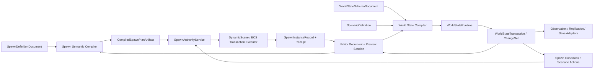

---
related_code:
  - zircon_editor/assets/ui/editor/components/workbench/modules/extensions/gameplay/workbench_extension_spawn_rules_workspace.zui
  - zircon_editor/assets/ui/editor/components/workbench/modules/extensions/gameplay/workbench_extension_world_state_workspace.zui
  - zircon_editor/assets/ui/editor/components/workbench/modules/core/assets/workbench_assets_workspace.zui
  - zircon_editor/src/ui/template_runtime/builtin/workbench_extension_module_template_bindings/gameplay_state.rs
  - zircon_editor/src/ui/retained_host/callback_dispatch/template_bridge/workbench/extension_module_navigation/specs/gameplay_state.rs
  - zircon_editor/src/ui/retained_host/callback_dispatch/template_bridge/workbench/extension_module_feedback/gameplay_state.rs
  - zircon_editor/src/ui/retained_host/workbench_preview_actions/extensions.rs
  - zircon_editor/src/ui/retained_host/callback_dispatch/template_bridge/workbench/module_field_edit.rs
  - zircon_runtime/src/scene/ecs
  - zircon_runtime/src/scene/dynamic_scene
  - zircon_runtime/src/script/vm/gameplay_host.rs
  - zircon_runtime/src/script/vm/gameplay_host/lifecycle.rs
plan_sources:
  - docs/plans/optimize/00-engine-wide-review.md
  - docs/plans/optimize/zircon_runtime/05-scene-ecs-world-lifecycle-review.md
  - docs/plans/optimize/zircon_runtime/07-script-plugin-runtime-review.md
  - docs/plans/optimize/zircon_runtime/08e-network-runtime-review.md
  - docs/plans/optimize/zircon_runtime/08g-gameplay-ability-effect-attribute-tag-cue-prediction-runtime-review.md
  - docs/plans/optimize/zircon_editor/02-document-transaction-save-autosave-recovery-review.md
  - docs/plans/optimize/zircon_editor/04-asset-index-import-reimport-catalog-thumbnail-reference-workflow-review.md
  - docs/plans/optimize/zircon_editor/07-play-session-process-pie-game-view-live-edit-recovery-review.md
  - docs/plans/optimize/zircon_editor/09-background-jobs-admission-scheduling-cancellation-progress-shutdown-product-integration-review.md
  - docs/plans/optimize/zircon_editor/16-terrain-landscape-foliage-scatter-world-partition-level-streaming-authoring-review.md
  - docs/plans/optimize/zircon_editor/20-ai-behavior-tree-blackboard-perception-eqs-debug-authoring-review.md
  - docs/plans/optimize/zircon_editor/21-gameplay-ability-effect-attribute-tag-cue-debug-authoring-review.md
  - docs/plans/optimize/zircon_editor/24-data-table-structured-data-schema-import-validation-save-game-slot-migration-platform-cloud-storage-authoring-review.md
  - docs/plans/optimize/zircon_editor/26-multiplayer-lobby-matchmaking-online-services-replication-network-emulation-pie-authoring-review.md
reference_engines:
  - dev/UnrealEngine/Engine/Source/Runtime/Engine/Classes/Engine/World.h
  - dev/UnrealEngine/Engine/Plugins/Runtime/MassGameplay/Source/MassSpawner/Public/MassSpawnerTypes.h
  - dev/UnrealEngine/Engine/Plugins/Runtime/MassGameplay/Source/MassSpawner/Public/MassSpawnerSubsystem.h
  - dev/UnrealEngine/Engine/Source/Runtime/Engine/Classes/GameFramework/GameStateBase.h
  - dev/UnrealEngine/Engine/Source/Runtime/Engine/Public/WorldPartition/DataLayer/DataLayerSubsystem.h
  - dev/godot/modules/multiplayer/multiplayer_spawner.h
  - dev/godot/scene/resources/packed_scene.h
  - dev/godot/scene/main/node.h
  - dev/bevy/crates/bevy_ecs/src/system/commands/mod.rs
  - dev/bevy/crates/bevy_scene/src/spawn.rs
  - dev/bevy/crates/bevy_scene/src/spawn_system.rs
  - dev/bevy/crates/bevy_state/src/state/resources.rs
  - dev/bevy/crates/bevy_state/src/state/transitions.rs
  - dev/bevy/crates/bevy_state/src/state/sub_states.rs
  - dev/bevy/crates/bevy_state/src/state/computed_states.rs
doc_type: review-and-refactor-plan
review_status: review_complete
implementation_status: pending
source_recheck_required: true
---

# 28 · Spawn Rules / Encounter / Population / World State / Scenario / Quest Flag / Authority / Simulation Authoring 工程化差距

## 1. 结论

Zircon并非没有生成实体的运行时底座。`World`已有稳定外部`EntityId`、内部slot/generation、deferred structural commands、component/resource registry、event/observer与world generation；`DynamicScene`已有capture、compile、preview、bounded preflight、generation/schema/resource-staleness检查、单次最终发布、异步任务和cancel路径。这些能力是真实的，应作为Spawn Runtime的底层执行器保留。

但当前产品层并不存在Spawn Rules、Encounter/Population或World State/Scenario系统。两张Gameplay Workbench把`SpawnRules_Enemy`、18 rules、12 zones、96 spawns、`Scenario_NightRaid`、84 keys、42 events、Server authority等固定字符串显示为已存在事实；三个field只修改control的`value`/`value_text`，Simulate/Validate只写固定feedback。全仓精确域搜索没有找到`SpawnPoint`、`SpawnVolume`、`SpawnTable`、`SpawnSet`、`Respawn`、`DespawnPolicy`、`ScenarioAsset`或`ScenarioState`生产模型，`SpawnRule`和`WorldStateKey`命中也只来自上述Editor路由/绑定。

更关键的是，`DynamicScene::spawn_into`最终只返回source-to-target的`EntityRemap`；它没有稳定`SpawnInstanceId`、source artifact revision、owner、authority、lease、whole-instance despawn/reload或不可变receipt。脚本侧一个粗粒度`gameplay.entity` capability又同时允许裸`Int`实体的transform/component/spawn/despawn/damage/heal。因而当前UI不能诚实宣称Server、Client Preview、Offline、Conflict、Simulation或Validation已经成立。

本轮结论不是“补几个按钮和HashMap”。必须新建Gameplay Spawn/World State运行时owner，并建立两条共享编译链：`SpawnDefinitionDocument -> CompiledSpawnPlanArtifact -> SpawnInstanceRecord`，以及`WorldStateSchemaDocument + ScenarioDefinition -> authoritative WorldStateTransaction -> observation/replication/save adapters`。Editor只拥有transactional authoring、diagnostics与sandbox/PIE体验，不能成为runtime state writer。

## 2. 审查边界与证据

### 2.1 当前工作树物理范围

| 子域 | 文件/行数/bytes | 本轮状态 |
|---|---:|---|
| Spawn Rules / World State Workbench闭环 | 8 / 2,544 / 139,493 | E3逐control/route/binding/field/feedback；2个test attributes、0 ignored |
| ECS / DynamicScene结构与生成底座 | 44 / 7,584 / 293,070 | E2/E3纵向：identity、commands、transaction、preflight、asset reload、remap；34个test attributes、1 ignored |
| script gameplay host | 5 / 1,380 / 53,031 | E3逐函数：capability、裸实体ID、spawn/model/despawn与动态component；10个test attributes |
| focused tests | 4 / 2,164 / 91,381 | E3静态阅读：identity、spawn transaction、asset reload和script spawn；60个test attributes、1 ignored |
| selected combined scope | 60 / 12,995 / 546,933 | 当前工作树fingerprint `07edfdf2f710557bc8bd3a7aa69ce507ee762c27c417ccbcb679146576b08375`；85个test attributes、1 ignored，4个在途文件 |

4个在途文件均不是本轮产生：`gameplay_state.rs`只有import重排；`spawn/transaction/tests.rs`只补`DynamicComponent` import；`dynamic_scene_asset_reload.rs`只有格式变化；`ecs_identity_storage.rs`含测试查询可变性与空世界断言调整。它们没有补出Spawn Rules/World State生产模型，但实施前仍必须重取源码、diff、scope manifest与fingerprint。

### 2.2 静态事实清单

1. Spawn Rules Workspace固定展示`SpawnRules_Enemy`、`Zone_A`、`Condition_Night`、`Tag_Combat`、1 conflict、18 rules、12 zones、Seed 2026与Server/Client Preview/Offline选项。
2. Spawn Simulate固定返回`Zone_A / 96 spawns`，Validate固定返回`18 rules / 1 conflict`，没有读取document、compiler、runtime world、job或diagnostic。
3. World State Workspace固定展示`Scenario_NightRaid`、`Layer_Global`、`Key_Alarm`、`Alarm.Active=true`、Weather/AI/Quest行、84 keys、6 layers、1 conflict与Authority Server。
4. World State Simulate固定返回`Night Raid / 42 events`，Validate固定返回`84 keys / 1 conflict`；没有schema、transaction、transition trace或network session。
5. 两张Workspace各有20个binding、3个tab、3个列表row、4个表row和3对field edit/commit；业务field最终只调用通用control property mutation。
6. `DynamicScene`能编译和一次性发布批量实体，拒绝world/schema/resource stale，并有100K managed performance probe；这证明结构事务底座存在。
7. `EntityRemap`只保存`BTreeMap<EntityId, EntityId>`，没有instance、source、owner、authority、generation lease或lifecycle status。
8. `spawn_empty`和`spawn_model`直接在active level的`World`中创建节点并返回`entity as i64`；`despawn`直接调用`world.remove_entity(entity)`。
9. 一个`gameplay.entity` capability覆盖39项Gameplay callback中的大部分危险操作；descriptor文档虽称“scoped to active script entity”，API却接收任意实体参数。
10. 当前focused tests验证ECS/DynamicScene局部事务和script helper，没有rule compiler、population budget、scenario transition、typed key、authority、replication、late join、save/load或Editor/runtime闭环测试。

### 2.3 动态证据边界

此前`zircon_editor --lib`测试编译在617.2秒后被239个既有错误和122个warning阻断，无法到达本产品行为。本轮没有重复同一无变化lane，也没有运行被忽略的100K DynamicScene受管性能探针。因此本报告只声明静态代码事实，不能作为Spawn、Scenario、World State、复制、保存或性能通过的证据。

### 2.4 参考边界

- Unreal `FActorSpawnParameters`明确携name/template/owner/instigator/level/collision/name mode/object flags与pre-spawn initialization，`SpawnActorDeferred`/`FinishSpawning`把构造与最终发布分离；MassSpawner以entity config、比例、data generator、transform生成器和creation context执行批量初始化；`GameStateBase`则把server authority、client replicated state、begin-play和world time作为专门生命周期，而非任意字符串表。
- Unreal World Partition Data Layer提供有identity的runtime state、effective state、递归变更和state-changed事件；本报告只借鉴其layer identity/authority/lifecycle，不把World State等同于streaming layer。
- Godot `MultiplayerSpawner`至少定义spawn path、spawnable scene、custom spawn、tracked node和spawn limit，PackedScene/Node承接instantiate与tree生命周期；Zircon当前script `spawn_model`尚未达到这个网络感知最小面。
- Bevy Commands提供deferred structural mutation，SceneSpawner把scene asset/instance与waiting queue分开，State/NextState/SubStates/ComputedStates和有序transition schedule提供typed state基础；它们是机制参考，不是现成的Spawn Rules产品。
- 本地Fyrox源码检索未发现同级Spawn Rules/Scenario产品，可复用的仍是Graph/scene command等结构基础；本地Unity Graphics源码也不是Gameplay/Scenario仓，未找到可对照的World State/Spawn Rule owner。本报告不据此推测闭源Unity行为，也不降低Zircon目标。

## 3. 必须保留的真实基础

1. 保留外部稳定`EntityId`与内部slot/generation分离，继续拒绝stale internal handle和复用槽串线。
2. 保留`World`的typed component/resource registry、stable query order、events/observers、change tick与deferred command queue。
3. 保留deferred structural segment的preflight、原子publish和despawn后拒绝后续命令语义。
4. 保留DynamicScene capture/compile/preview/apply分层，禁止Editor绕过compile直接逐实体写World。
5. 保留world/schema/component/resource generation fence与bounded preflight snapshot。
6. 保留DynamicScene异步schedule/cancel/status/ready prepared spawn和bytes estimate，升级为Spawn job执行器而非另写线程池。
7. 保留target World/Level绑定和asset reload staging，但为结果补stable instance/receipt，而不是删除现有reload链。
8. 保留现有focused ECS事务测试和100K managed probe，并把它们纳入新的Spawn Runtime conformance suite。
9. 保留Editor02 document/transaction/save/recovery、Editor09 job、Editor10 notification、Editor11 diagnostic/journal的唯一owner。
10. 保留Runtime08G对script gameplay authority的owner结论；Editor28只消费更细的spawn capability/lease，不复制脚本安全架构。

## 4. 目标架构与Owner边界

| 领域 | 唯一owner | Editor28消费/提供 |
|---|---|---|
| ECS identity、structural mutation、DynamicScene transaction | Runtime05 Scene/ECS | 只作为编译artifact执行器；不向UI泄露mutable World |
| Spawn definition/compiler/runtime instance/authority | 新Runtime08H Gameplay Spawn owner | stable document schema、artifact、request/receipt、instance lifecycle与provider conformance |
| World State schema/runtime/transaction/scenario | 新Runtime08H Gameplay State owner | typed key/scope/transaction/transition/observation合同 |
| script capability与entity authority | Runtime07/08G | 拆出scoped spawn/despawn request和owner lease；Editor不授权裸World写入 |
| replication/RPC/late join | Runtime08E + Editor26 | 消费WorldState/Spawn observation artifact，不拥有key或rule schema |
| tags/AI/weather/quest | Editor20/21及各Runtime owner | 通过registered typed adapter贡献condition/action/key，不把它们降为字符串 |
| document/save/asset/jobs/diagnostics | Editor02/04/09/10/11 | transactional authoring、artifact reference、async compile/simulate与真实receipt |
| world partition/streaming | Editor16 + Runtime scene | 提供cell/layer activation observation；Spawn owner决定population lifecycle |
| PIE/multi-instance simulation | Editor07/26 | 提供isolated world、server + N clients与network profile；Editor28安装同一compiled artifact |
| SaveGame/migration | Editor24 + future Runtime Save owner | 注册WorldState/Spawn participant；不让Editor snapshot成为runtime save authority |

建议的核心合同至少包括：

- `SpawnDefinitionDocument { document_id, schema_version, source_revision, rule_sets, regions, conditions, compositions, policies, references }`与immutable `CompiledSpawnPlanArtifact { artifact_id, compiler_version, source_digest, dependency_revisions, deterministic_digest, runtime_payload, diagnostics }`。
- `SpawnRequest { request_id, plan_artifact_id, source_identity, target_world, authority_context, transform_context, seed, budget, expected_world_generation, owner_lease }`。
- `SpawnInstanceRecord { instance_id, plan_artifact_id, source_revision, owner, authority, target_world, target_level, entity_set, state, created_tick, lease_generation }`与不可变`SpawnReceipt`/`DespawnReceipt`。
- `WorldStateSchemaDocument { schema_id, version, namespaces, typed_keys, scopes, defaults, validators, replication_policy, save_policy, contributors }`；key必须使用stable ID和typed value，不能以任意字符串JSON替代。
- `WorldStateTransaction { transaction_id, authority_context, expected_generation, ordered_mutations, cause, deadline }`产生唯一terminal `WorldStateChangeSet { before_generation, after_generation, accepted, rejected, events, diagnostics }`。
- `ScenarioDefinition`是引用compiled conditions/actions、clock/seed、transition graph和failure policy的asset；`ScenarioInstanceId`与`ScenarioReceipt`跟踪运行实例，不把Scenario等同于一组UI row。
- `WorldStateSnapshot`是有generation/source/authority的只读观察结果；authored defaults、runtime authoritative state和debug snapshot必须是三个类型，禁止互相覆盖。

## 5. P0：先关闭假产品与危险Authority

### P0-1：Spawn Rules Workspace伪造rule、zone、conflict、simulation与server事实

在不存在Spawn Rule domain、document、compiler、runtime provider和job的情况下，默认产品固定显示18 rules、12 zones、96 spawns并返回queued。M0必须将Simulate/Validate/authority field置为Unavailable，删除固定业务结果；不能等新系统完成后再清理。

### P0-2：World State Workspace伪造typed key、layer、scenario、conflict与42-event simulation

`Alarm.Active`、Weather/AI/Quest、84 keys、6 layers和Server都没有runtime owner。M0必须停止把control字符串当权威状态，禁用写入/模拟/验证，并用明确Missing Provider诊断替换成功反馈。

### P0-3：DynamicScene生成只有EntityRemap，没有可治理的Spawn Instance生命周期

当前调用者不能按instance查询、取消、整体despawn、reload、迁移、审计或判定owner；source revision和authority也随返回丢失。任何rule runtime接入前必须先增加stable instance identity、record、request/receipt、lease与terminal state。

### P0-4：脚本粗粒度gameplay.entity可直接生成和删除任意裸ID实体

`spawn_empty`/`spawn_model`直接写active level，`despawn`直接remove；capability同时覆盖transform/component/combat。Runtime08G必须拆分observe/self-mutate/spawn/despawn/admin能力，引入authority/owner/generation/rate/budget检查；Spawn Rules不能调用该旁路冒充服务。

### P0-5：Simulate/Validate没有隔离World、共享compiler、确定性trace或server/client证明

当前按钮不创建PreviewWorld/PIE，不执行rule或scenario，也不采集spawn/state transition。M0后只有同一compiled artifact在隔离World或Editor07/26 session中成功执行、并返回source-qualified receipt时，才能恢复成功语义。

## 6. P1：Spawn Definition、Compiler 与 Artifact

### P1-1：缺少Spawn Definition asset kind与stable document identity

在Editor04注册真实asset、factory、toolkit、source/revision和reference extraction；不允许把ZUI state或DynamicScene文件名当规则identity。

### P1-2：缺少rule set与rule stable ID

每个rule需stable ID、enabled state、priority/order、owner namespace和schema version，rename/reorder不能导致runtime identity漂移。

### P1-3：缺少source template/config引用

支持DynamicScene/Prefab/entity config等typed source reference、revision fence、missing/stale/cycle诊断；禁止把model/material/string路径塞进runtime rule。

### P1-4：缺少Spawn Region与空间语义

定义volume/surface/point/spline/cell等region source、local/world transform、bounds revision和streaming ownership；`Zone_A`不能只是文本。

### P1-5：缺少condition表达式与依赖声明

condition应编译typed World State key、tag query、time/window、player count、distance等依赖，并声明pure/deterministic/authority要求。

### P1-6：缺少composition、weight与数量分配

定义source proportions、min/max/count/density、rounding和zero-weight policy，参考MassSpawner而不是在按钮结果写96。

### P1-7：缺少placement与collision policy

定义transform generator、orientation/scale randomization、collision handling、ground/nav projection、overlap rejection和bounded retry。

### P1-8：缺少population budget与quota

支持per-rule/region/world/owner并发、spawn rate、frame CPU、memory和entity count预算；超限返回typed deferred/rejected，不静默少生成。

### P1-9：缺少despawn/respawn/lifetime policy

定义distance、time、state、streaming unload、owner loss、death、manual与shutdown原因，以及cooldown/backoff/max attempts。

### P1-10：缺少deterministic seed合同

Seed必须与artifact/source/region/simulation tick绑定并记录算法版本；不能把`Seed: 2026`解析为随意字符串。

### P1-11：缺少共享semantic compiler

Editor validate、preview、PIE、cook和shipping runtime必须消费同一compiler与artifact schema，诊断携rule/path/range/code和dependency revision。

### P1-12：缺少immutable artifact与cook/reference集成

artifact需content digest、compiler/runtime compatibility、dependency manifest、cost estimate和canonical serialization，并接入Editor04/Tooling03 cook与cache。

## 7. P1：Spawn Runtime、Authority 与 Instance Lifecycle

### P1-13：缺少SpawnAuthorityService注册与owner lease

provider按world/runtime session注册，owner unload/reload后旧lease失效；禁止global singleton和Editor持有mutable service指针。

### P1-14：缺少typed SpawnRequest admission

请求需校验artifact、world/level generation、authority、owner、budget、deadline和cancel token，拒绝原因可机器判断。

### P1-15：缺少stable SpawnInstanceId

每次逻辑生成获得与entity ID无关的instance ID，支持批次查询、日志、复制、保存、reload和whole-instance操作。

### P1-16：缺少source identity与revision provenance

record保存document/artifact/dependency revision，hot reload后旧实例仍可解释，不把当前asset内容误认为历史来源。

### P1-17：缺少owner、instigator与authority context

参考Unreal spawn参数明确owner/instigator/level与authority；Zircon需区分server、client predicted、editor preview、offline和system owner。

### P1-18：缺少deferred construct/initialize/publish三阶段

复用DynamicScene transaction但补齐pre-initialize hook、required component validation、observer ordering和publish barrier；失败不得泄露半初始化实体。

### P1-19：缺少batch atomicity与partial policy

定义all-or-nothing、bounded partial或streamed batch模式，receipt逐项记录accepted/rejected；不能让调用者从entity count猜结果。

### P1-20：缺少SpawnReceipt与唯一terminal outcome

receipt需request/instance/entity set、timing/cost、seed、diagnostics、cancel acknowledgement和terminal reason，late completion不得覆盖cancelled。

### P1-21：缺少whole-instance DespawnRequest/Receipt

按instance/owner/region/source选择实体，执行generation fence、observer ordering和terminal receipt；不依赖缓存`EntityRemap`手工循环remove。

### P1-22：缺少reload/reconcile策略

source revision变化时明确keep old、replace、patch、drain或reject；保留DynamicScene asset reload staging并增加instance-aware reconciliation。

### P1-23：缺少streaming/world teardown协调

World/Level/cell unload必须阻止新请求、取消在途、drain实例并等待lifecycle barrier，旧回调不得写入复用world。

### P1-24：缺少pooling与reuse的identity规则

若以后加入pool，entity reuse不能复用instance/authority lease；reset contract必须覆盖组件、observer、network/save identity和debug label。

### P1-25：缺少runtime query/observation API

按instance/rule/region/owner/state分页查询只读snapshot与增量，带generation/cursor/retention；Editor不得遍历World推导权威事实。

### P1-26：缺少规模、背压与故障资格

建立1/1K/100K entity、burst/steady、cancel/reload/unload、allocation/observer cost与bounded queue门，复用现有managed probe但不把单次成功当产品性能结论。

## 8. P1：World State、Scenario 与 Quest/AI/Weather集成

### P1-27：缺少World State schema asset与stable schema ID

schema需要version、namespace、owner、typed keys、default、validator和migration；不得用`BTreeMap<String, JSON>`冒充工程合同。

### P1-28：缺少stable WorldStateKeyId与显示名分离

rename只改变display/path alias，不改变runtime/save/network identity；删除、deprecated与redirect需显式治理。

### P1-29：缺少受限typed value集合

至少支持bool/int/float/string/name/tag/enum/entity/resource和结构化registered type，并定义equality、hash、serialization、range与unknown value。

### P1-30：缺少scope identity

Global/Region/System/Scenario不是下拉文本；需`WorldStateScopeKey`、lifetime、parent/world/session identity和合法key集合。

### P1-31：缺少layer precedence与conflict semantics

定义authored default、server runtime、scenario override、debug override的优先级、merge/replace、conflict reason和effective-value provenance。

### P1-32：缺少authoritative WorldStateTransaction

所有写入走expected generation、ordered mutations、validation和唯一terminal change set；UI和脚本不能直接写store。

### P1-33：缺少CAS、idempotency与concurrent writer规则

支持compare-and-set、transaction key、retry policy和actor/owner审计，防止network、scenario、AI并发覆盖。

### P1-34：缺少change event与bounded journal

事件携before/after、generation、cause、authority、scenario/action和correlation；retention、cursor gap与full resync必须明确。

### P1-35：缺少computed/derived state

参考Bevy ComputedStates定义pure dependency graph、cycle检测、incremental recompute和transition ordering；computed key不可被直接写入。

### P1-36：缺少ScenarioDefinition与state machine

Scenario需stable states/transitions、typed guards/actions、entry/exit、timeout、failure/cancel和compiler diagnostics，不是一行`Scenario_NightRaid`。

### P1-37：缺少Scenario instance lifecycle

定义start/pause/resume/complete/fail/cancel、instance ID、authority、clock、seed、source revision与receipt；world unload后不留悬空timer/action。

### P1-38：缺少确定性clock、timer与ordered transition

simulation/runtime使用明确tick/time domain、timer wheel/budget和同tick排序；禁止直接依赖wall clock或UI事件顺序。

### P1-39：缺少condition/action contributor registry

AI、weather、quest、tags、spawn通过typed registration/owner lease贡献节点与key，不由World State核心硬编码所有业务域。

### P1-40：缺少save/load与migration participant

保存schema/source/generation、authoritative keys、active scenario/clock和spawn linkage；加载先迁移/验证再原子安装，owner属于Editor24/future Save Runtime。

### P1-41：缺少replication、interest与late join artifact

按key/scope策略编译stable wire ID、visibility、reliability、delta/snapshot和late-join baseline；接Runtime08E/Editor26，不在World State内另写transport。

### P1-42：缺少security、redaction与untrusted write policy

server-only、owner-only、client request、debug-only和secret state需显式；日志/Editor/remote script按权限投影，不能暴露全部key/value。

## 9. P1：Editor Authoring、Simulation 与 Diagnostics

### P1-43：缺少transactional Spawn/World State document

接Editor02 dirty/history/save/conflict/recovery，field edit产生typed command和changed path；通用control mutation只保留纯UI preference。

### P1-44：缺少schema-driven Inspector和multi-selection

字段由registered type、validator和capability生成，支持mixed/per-target、array/map/reorder、reference picker和invalid raw preservation。

### P1-45：缺少rule/scenario graph、table与reference navigation

列表/图/表只是同一document projection，selection使用stable ID；diagnostic可导航到rule/key/transition/source asset与World region。

### P1-46：缺少isolated PreviewWorld

Preview必须创建有session ID、artifact revision、budget和teardown barrier的隔离World，不能修改authoring World或复用上次残留实体/state。

### P1-47：缺少真实deterministic simulation trace

记录seed/clock/tick、condition input/result、chosen source/placement rejection、spawn/despawn receipt和state before/after，支持重放与差异定位。

### P1-48：缺少server + N clients authority simulation

复用Editor07/26拓扑启动真实role，显示per-instance authoritative/predicted/observed state与replication lag；`Client Preview`不能只是下拉选项。

### P1-49：缺少viewport overlays与population heatmap

overlay从runtime observation snapshot投影region/budget/rejection/instance状态，reader-gated、有界、可过滤，不在render loop运行rule evaluator。

### P1-50：缺少diff、timeline与debug override隔离

区分source diff、compiled artifact diff、runtime state timeline和temporary debug override；override有owner/expiry/audit且绝不保存回authored default。

### P1-51：缺少compile/simulate job与cancel/currentness

接Editor09 job，source/dependency变化使旧结果Stale；late result不能覆盖新document，cancel/timeout/crash均有唯一terminal receipt。

### P1-52：缺少last-known-good与hot reload UX

compile失败继续显示LKG artifact及其revision，用户可选择replace/keep/drain；不得把旧runtime成功显示成新source已应用。

## 10. P1：跨域集成、测试与治理

### P1-53：Gameplay Tags只能作为typed依赖

消费Editor21/Runtime08G未来的Tag registry/artifact，tag rename/migration使Spawn artifact stale；不再解析`Tag_Combat`字符串。

### P1-54：AI/Weather/Quest不能被World State吸收为字符串字段

各owner通过typed contributor、authority和receipt读写；World State只拥有schema/transaction/observation，不拥有AI算法、天气模拟或Quest流程。

### P1-55：World Partition与population ownership未闭合

定义cell activate/deactivate、region revision、instance migrate/drain和cross-cell owner；与Editor16 partition manifest/streaming generation对齐。

### P1-56：Network与Save adapter未闭合

Runtime08E和Editor24只消费stable schema/instance artifact；禁止从DynamicScene snapshot或raw component JSON反推协议/存档。

### P1-57：script API未接Spawn/World State service

提供scoped request/query/observe facade、typed handle/receipt、budget和capability；迁移后删除直接spawn/despawn旁路的产品调用。

### P1-58：缺少分层test matrix

加入schema/compiler golden、runtime conformance、determinism、transaction/fault、authority/network/late join、save/migration、Editor integration与reference fixture tests。

### P1-59：缺少性能与内存基线

分别度量compile、condition evaluation、placement、spawn publish、state transaction、replication delta、query/overlay和journal；记录硬件/build/config/artifact digest。

### P1-60：缺少旧fixture、URI与schema迁移/删除门

inventory两张ZUI、40个binding、fixed feedback和旧route；新产品通过后零引用硬删除，不能长期双轨或把fixture改成默认seed data。

## 11. P2：完整性、扩展性与高级能力

### P2-1：Encounter/Population Director

基于目标强度、节奏、玩家状态与预算协调多个compiled plan，输出可解释decision trace而非黑盒随机数。

### P2-2：空间cell与大世界分布式population

支持partition cell manifest、跨cell密度、预热、迁移、HLOD/streaming协调和远距离低频模拟。

### P2-3：生态与长期population simulation

提供出生/死亡/迁移/资源容量和离线推进的versioned model，明确与即时Spawn实例的边界。

### P2-4：程序化生成与约束求解

支持可插拔generator、constraint solver、deterministic cache、局部rebuild和可视化失败解释。

### P2-5：预测生成与rollback

在明确网络模型下支持client-predicted spawn、stable prediction key、reconcile、rollback和duplicate suppression。

### P2-6：跨服务器handoff

为world shard/zone迁移定义instance/state ownership transfer、two-phase handoff、timeout和idempotent recovery。

### P2-7：Scenario录制、回放与分支比较

保存artifact/input/event/seed/time与外部依赖，支持确定性重放、branch fork和差异定位。

### P2-8：Semantic merge与团队协作

按stable rule/key/transition ID执行三方merge、冲突定位和review，而非整文件文本冲突。

### P2-9：Authoring variants与平台/难度覆盖

以显式继承/override和compiled flattening支持platform、mode、difficulty、DLC，不复制整份规则。

### P2-10：Analytics与调优闭环

在consent/redaction/schema/version治理下关联spawn/state决策与游戏结果；编辑器只读趋势，不让遥测直接改authoritative state。

### P2-11：Mod/plugin扩展

允许受签名/权限/预算约束的condition/action/value/provider注册，owner卸载后安全失效并保留unknown data。

### P2-12：分布式确定性simulation farm

以immutable artifact/input bundle在多worker运行大规模scenario/population soak，验证digest一致性和性能分位数。

## 12. 当前第二Authority与断路清单

| 表面产品 | 当前事实来源 | 最终动作 |
|---|---|---|
| Spawn Rules Workspace | 固定18 rules/12 zones/1 conflict/Seed 2026 | M0变Unavailable；接真实document/compiler/runtime projection后恢复 |
| Spawn Simulate/Validate | fixed feedback：96 spawns、18 rules | 删除；消费Editor09 job和Spawn/Simulation receipt |
| Authority dropdown | Server/Client Preview/Offline control字符串 | 只投影Editor07/26真实session role与runtime authority capability |
| World State Workspace | 固定84 keys/6 layers/Alarm/Weather/AI/Quest | 删除fixture；消费typed schema/runtime snapshot |
| World State Simulate/Validate | fixed feedback：42 events、84 keys | 删除；消费Scenario trace和compiler diagnostics |
| generic field mutation | 3对field仅改`value`/`value_text` | 业务字段迁移为Editor02 typed transaction |
| DynamicScene `EntityRemap` | source-to-target entity map | 保留低层remap；上层新增instance record/request/receipt |
| script `gameplay.entity` | 任意裸ID spawn/despawn/component/combat | 按Runtime08G拆 capability并接SpawnAuthorityService |

## 13. 分层重构里程碑

### M0：Truthfulness、Inventory与Owner冻结

禁用两张Workspace的Simulate/Validate/authority成功语义，删除固定96/42等业务结果；冻结60文件manifest、40个binding、routes/URI与owner图，并为Runtime08H开独立计划记录。

### M1：Spawn与World State核心合同

实现stable IDs、documents、schema/value/scope、request/receipt/instance、transaction/change set、provider registry和in-memory conformance fake；不接产品UI。

### M2：Shared Compiler与immutable artifacts

实现Spawn/World State/Scenario semantic compiler、dependency/reference extraction、canonical artifact、diagnostics和cook/cache compatibility。

### M3：Runtime Authority与DynamicScene执行桥

以SpawnAuthorityService包装现有preflight/transaction，完成instance lifecycle、whole-instance despawn、cancel/reload/world teardown和bounded observation。

### M4：World State Runtime与Contributor

完成typed transaction、layer/effective value、computed state、journal、Scenario lifecycle/clock，并接fake Tags/AI/Weather/Quest contributor。

### M5：Transactional Editor产品

建立真实asset/toolkit/document/Inspector/table/graph/reference navigation，接Editor02/04/08-11并移除control-string业务写入。

### M6：Preview、PIE与多人验证

接isolated PreviewWorld、deterministic trace、viewport overlay，以及Editor07/26 server + N clients、network emulation和authority projection。

### M7：Script、Network、Save与World Partition集成

迁移脚本旁路，接Runtime08E replication/late join、Editor24 save/migration participant和Editor16 cell/population lifecycle。

### M8：迁移、恢复、安全与规模资格

迁移/删除旧ZUI/binding/route fixture，完成LKG/hot reload、crash recovery、redaction、100K instance/key、fault injection与accessibility。

### M9：Encounter、预测、生态与发布资格

在核心门通过后扩展director、prediction/rollback、distributed population、semantic merge、mod与simulation farm，以长期soak和shipping gate收敛。

## 14. 验收门禁

- G01：默认产品入口不再显示`SpawnRules_Enemy`、18 rules、96 spawns、`Scenario_NightRaid`、84 keys或42 events等固定业务事实。
- G02：两张旧Workspace、40个binding、所有route/fixed feedback有完整inventory，迁移后零产品引用。
- G03：没有Spawn/World State provider时UI明确Unavailable，Simulate/Validate不可调用且不产生queued/success文本。
- G04：Spawn/World State fake provider和真实provider通过同一registry、lease、request/receipt与lifecycle conformance suite。
- G05：rule/key/scenario rename、reorder和display path变化不改变stable identity；delete/deprecated/redirect有迁移报告。
- G06：shared compiler在Editor、cook、PIE和shipping对同一输入产出同一artifact digest与diagnostics。
- G07：missing/stale/cyclic source/reference使compile失败或LKG明确Stale，不生成不可解释runtime payload。
- G08：seed、algorithm version、clock、artifact和region相同的重复simulation产生相同decision/placement/state digest。
- G09：SpawnRequest在world/schema/source/owner lease stale时原子拒绝且不发布任何实体。
- G10：构造、initialize或observer故障不会泄露半初始化entity、半登记instance或虚假receipt。
- G11：每个accepted request只有一个stable instance和一个terminal receipt；cancel/timeout/late result不产生双终态。
- G12：whole-instance despawn在部分entity已外部删除、world unload和observer failure下仍返回可解释terminal结果。
- G13：reload明确执行keep/replace/patch/drain/reject之一，旧/new source revision和instance均可追溯。
- G14：script不能用一个粗粒度capability修改/删除任意实体；self/owned/spawn/admin范围和rate/budget均被验证。
- G15：World State不以任意字符串JSON作为canonical storage；每个key有stable ID、type、scope、owner、validation和policy。
- G16：concurrent transaction按expected generation/CAS/idempotency产生确定结果，失败不部分写入。
- G17：layer precedence、effective value和conflict均携provenance，debug override不会保存回authored default。
- G18：computed state cycle在compile拒绝，transition顺序与enter/exit事件在同tick确定。
- G19：Scenario start/pause/resume/complete/fail/cancel都有instance、authority、clock、source和唯一receipt。
- G20：journal有界，cursor gap触发full resync；100K keys/changes不会无界占用UI或runtime内存。
- G21：server-only/redacted key不会出现在未授权client、script、Editor remote view、日志或export中。
- G22：late-join client从schema-qualified baseline加delta收敛，wire ID不会因本地注册顺序变化。
- G23：save/load保留schema/source/active scenario/clock/spawn linkage，旧版本经migration后原子安装，失败保持原世界。
- G24：streaming cell unload阻止新spawn、取消/排空在途并终结所属instance，late callback不写复用world。
- G25：PreviewWorld和authoring World完全隔离，重复simulate前后authoring document/world hash不变。
- G26：server + N clients测试显示真实role、authority、replication和per-link网络配置，Client Preview不由下拉文本伪造。
- G27：simulation trace能从condition input追到chosen source、placement rejection、spawn receipt和World State change set。
- G28：source/dependency变化使旧compile/simulate/trace自动Stale，late job结果不能覆盖新generation。
- G29：viewport overlay只消费bounded observation snapshot，关闭reader后无持续extract/evaluate成本。
- G30：1/1K/100K spawn与state矩阵记录CPU、allocation、publish、query、replication和journal预算，失败有typed bottleneck证据。
- G31：Windows优先的compiler/runtime/Editor/network/save/fault lanes通过；Linux-specific需求按证据另行验证，不复用失败的Editor compile声明。
- G32：长期soak覆盖spawn/despawn/reload/world unload/scenario loop/late join，证明queue/journal/instance有界、无generation回退、无authority泄漏和终态丢失。

## 15. 禁止的临时修补

1. 禁止把两张ZUI的固定row改成另一组更像真的demo数据并称为产品。
2. 禁止用`HashMap<String, serde_json::Value>`直接命名为WorldState系统。
3. 禁止把`DynamicScene::spawn_into`返回的`EntityRemap`直接改名为Spawn Instance而不增加identity/lifecycle/receipt。
4. 禁止从entity name、component string或asset path推导owner、authority、rule、scenario或network identity。
5. 禁止Editor Simulate直接写authoring World或复用上一次PreviewWorld残留状态。
6. 禁止Editor、runtime、cook和script各写一套condition evaluator或random算法。
7. 禁止用wall clock、thread completion order或map iteration顺序作为确定性scenario/spawn排序。
8. 禁止把AI/Weather/Quest全部吸收到World State核心并以字符串switch实现。
9. 禁止用脚本`gameplay.entity`旁路调用来完成Spawn Rules MVP。
10. 禁止在没有真实server/client topology时显示Server、Client Preview、Replicated或Late Join成功。
11. 禁止用DynamicScene archive直接冒充SaveGame/Scenario persistence而忽略plugin typed component与migration。
12. 禁止旧workspace与新产品长期双轨；迁移完成后必须零引用硬删除fixture、binding和fixed feedback。

## 16. 本轮产出边界

本轮只完成静态review、参考对照、owner划分与分层重构计划，没有修改production Editor/runtime/plugin代码或tests，没有实现Spawn/World State provider，也没有运行动态测试。结论不能作为Spawn Rules、Encounter/Population、World State、Scenario、Quest Flag、authority、replication、save或simulation已通过的声明；实施必须从M0开始，并在每个里程碑重取当前源码、4个在途diff、60文件manifest、fingerprint和动态结果。
