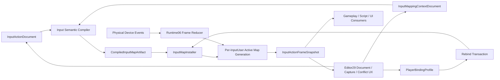

---
related_code:
  - zircon_runtime/src/core/framework/input
  - zircon_runtime/src/input
  - zircon_runtime/src/script/vm/gameplay_host/input.rs
  - zircon_runtime/src/script/vm/gameplay_host.rs
  - zircon_runtime_interface/src/resource/marker.rs
  - zircon_editor/src/core/asset/type_registry/builtin.rs
  - zircon_editor/src/core/commands/keymap.rs
  - zircon_editor/src/core/settings/keymap_overrides.rs
  - zircon_plugins/first_party_editor_catalog/src/catalog.rs
plan_sources:
  - docs/plans/optimize/00-engine-wide-review.md
  - docs/plans/optimize/zircon_runtime/06-platform-input-process-review.md
  - docs/plans/optimize/zircon_runtime/07-script-plugin-runtime-review.md
  - docs/plans/optimize/zircon_editor/02-document-transaction-save-autosave-recovery-review.md
  - docs/plans/optimize/zircon_editor/04-asset-index-import-reimport-catalog-thumbnail-reference-workflow-review.md
  - docs/plans/optimize/zircon_editor/07-play-session-process-pie-game-view-live-edit-recovery-review.md
  - docs/plans/optimize/zircon_editor/08-command-registry-keymap-menu-palette-context-routing-remote-automation-review.md
  - docs/plans/optimize/zircon_editor/12-settings-preferences-scope-persistence-locale-i18n-appearance-plugin-extensibility-review.md
  - docs/plans/optimize/zircon_editor/24-data-table-structured-data-schema-import-validation-save-game-slot-migration-platform-cloud-storage-authoring-review.md
  - docs/plans/optimize/zircon_editor/26-multiplayer-lobby-matchmaking-online-services-replication-network-emulation-pie-authoring-review.md
reference_engines:
  - dev/UnrealEngine/Engine/Plugins/EnhancedInput/Source/EnhancedInput/Public/InputAction.h
  - dev/UnrealEngine/Engine/Plugins/EnhancedInput/Source/EnhancedInput/Public/InputMappingContext.h
  - dev/UnrealEngine/Engine/Plugins/EnhancedInput/Source/EnhancedInput/Public/EnhancedInputSubsystemInterface.h
  - dev/UnrealEngine/Engine/Plugins/EnhancedInput/Source/EnhancedInput/Public/EnhancedInputSubsystems.h
  - dev/UnrealEngine/Engine/Plugins/EnhancedInput/Source/EnhancedInput/Public/PlayerMappableKeySettings.h
  - dev/UnrealEngine/Engine/Plugins/EnhancedInput/Source/InputEditor/Public/EnhancedInputEditorSubsystem.h
  - dev/UnrealEngine/Engine/Plugins/EnhancedInput/Source/InputEditor/Private/AssetDefinition_InputAction.cpp
  - dev/UnrealEngine/Engine/Plugins/EnhancedInput/Source/InputEditor/Private/AssetDefinition_InputMappingContext.h
  - dev/godot/core/input/input_map.h
  - dev/godot/core/input/input.h
  - dev/godot/editor/settings/input_event_configuration_dialog.h
  - dev/godot/editor/settings/input_event_configuration_dialog.cpp
  - dev/bevy/crates/bevy_input/src/lib.rs
  - dev/bevy/crates/bevy_input/src/gamepad.rs
  - dev/bevy/crates/bevy_input_focus/src/lib.rs
doc_type: review-and-refactor-plan
review_status: review_complete
implementation_status: pending
source_recheck_required: true
---

# 29 · Input Action / Mapping Context / Binding / Trigger / Modifier / Device / User / Rebinding / Accessibility Authoring 工程化差距

## 1. 结论

Zircon的输入底层并非临时空实现。`InputActionEvaluator`在map变更时建立immutable action/context/binding generation，按action保存binding range；frame axis与consumed input各只建立一次索引，workspace可复用；现有测试覆盖chord、context、UI consumed input、gamepad axis、transition、map replacement以及10/100/1K/10K binding规模。这些能力应当保留，并继续由Runtime06 Input owner维护。

但当前不存在可交付的Input Action authoring产品。`ResourceKind`和Editor builtin asset registry没有Input Action或Mapping Context，first-party Editor catalog也无Input插件、factory、toolkit或surface。唯一`InputConfig`把整个`InputActionMap`嵌进模块构造参数；production source中`module_descriptor_with_config`没有调用者，默认descriptor又以`enabled=false`和空map构建Action Manager。也就是说，测试能手工构造的Action Mapping并没有从项目资产、cook artifact进入shipping runtime。

现有serialized schema还把运行时连接实例写进资产：`InputButton::Gamepad`和`InputAxisBinding`都直接持`GamepadId(u64)`，而App从当前`gilrs::GamepadId`槽位转换该值。重启、重连、第二玩家或设备顺序变化后，保存的binding没有稳定含义。仓内也没有`InputUser`、`LocalPlayer`、device assignment、player-mappable profile或rebind receipt。

Action/context/binding identity仍是裸`String`；重复action/context会被helper静默忽略，未声明context会被compiled generation自动创建并默认enabled，未知action的binding则无消费者。schema没有version、deny-unknown、compiler diagnostics或artifact identity。脚本玩法仍通过`gameplay.key_pressed`读取raw `InputSnapshot`，绕过context、consume、rebind、device/user和action phase。

因此本轮目标不是给`InputActionMap`套一张表格，而是建立`InputActionDocument + InputMappingContextDocument -> CompiledInputMapArtifact -> per-InputUser ActiveInputMapGeneration`完整链，并以`PlayerBindingProfile`、`RebindCaptureRequest/Receipt`、typed conflict query、frame-boundary install和action snapshot替代raw key产品路径。Editor08命令快捷键可复用capture/conflict/settings经验，但不能与shipping gameplay map合并成一个authority。

## 2. 审查边界与证据

### 2.1 当前工作树物理范围

| 子域 | 文件/行数/bytes | 本轮状态 |
|---|---:|---|
| Action/context/binding公共合同 | 11 / 987 / 27,824 | E3逐字段：action/map/state/manager、button/gamepad/frame、module config/descriptor；0 tests |
| evaluator/runtime安装底座 | 6 / 1,079 / 33,144 | E3逐分支：compiled generation、workspace、consumed/axis index、manager；1 test、0 ignored |
| Editor authoring与keymap复用锚点 | 13 / 2,031 / 67,393 | E2/E3：ResourceKind、asset registry、first-party catalog、Editor keymap/settings；16 tests |
| product consumers与focused tests | 7 / 1,980 / 77,103 | E3：script raw key、action mapping/axis/manager/boundary tests；37 tests |
| selected combined scope | 37 / 6,077 / 205,464 | 当前工作树fingerprint `b95b135fed1da846913644b52cea3adce0f3038bb1dea15d6825f078e6d172b9`；54个test attributes、0 ignored、0个在途文件 |

本轮未把Runtime06已审的整个platform/window/process输入栈重复计入，只对authoring所依赖的device token、frame snapshot和evaluator做纵向复核。37文件范围当前无在途修改；实现前仍必须重取源码、scope manifest、fingerprint和production consumer搜索。

### 2.2 静态事实清单

1. `InputAction`只有`id/context/display_name`三个字符串字段，没有stable ID、value type、consume/paused policy、triggers或modifiers。
2. `InputActionContext`只有string ID、priority和静态enabled；没有asset identity、owner、activation lease、input mode或dependency。
3. `InputBinding`只有action string、button chord和gamepad axes；没有binding ID、device selector、scale/deadzone/invert/composite、trigger/modifier或player mapping metadata。
4. `InputActionState`只保存string set与`f32`值，没有map generation、frame/tick、InputUser、trigger phase、vector value或source binding。
5. `InputActionMap::add_action/add_context`对duplicate静默no-op；`bind`只拒绝空binding，不验证action/context/reference/conflict。
6. generation会为action引用的missing context插入enabled=true slot；unknown-action binding被索引但没有compiled action消费，均无diagnostic。
7. `InputAxisBinding`与`InputButton::Gamepad`序列化具体`GamepadId`；App的ID只是当前`gilrs`槽位转`u64`。
8. `InputConfig`默认disabled；production中只有无参`module_descriptor()`调用`module_descriptor_with_config(InputConfig::default())`，没有project/asset/cook安装路径。
9. `InputActionManager::set_action_map`立即在mutex中整图替换，没有expected generation、frame barrier、install receipt、LKG或rebuild/flush policy。
10. `gameplay.key_pressed`每次resolve InputManager并读取raw snapshot，支持raw key code/name，但完全不消费InputActionManager。
11. Editor `ResourceKind`的26类不含Input，builtin registry自然没有Input Action/Mapping Context的factory/toolkit/thumbnail/reference analyzer。
12. Editor command keymap已有typed override、settings layer、conflict enumeration与大表signature index，可复用工程模式；它没有Gameplay device/user/vector/trigger语义，也不应成为同一存储。

### 2.3 动态证据边界

此前`zircon_editor --lib`测试编译在617.2秒后被239个既有错误和122个warning阻断。本轮没有重复同一无变化lane，也没有运行Runtime Input focused tests；54个test attributes只表示静态存在。现有10K测试验证evaluator局部索引与workspace，不能证明asset authoring、cook/install、player rebinding、设备重连、跨平台布局或shipping玩法闭环。

### 2.4 参考边界

- Unreal Enhanced Input把`InputAction`做成独立asset，包含Boolean/Axis1D/2D/3D value type、triggers、modifiers、consume/paused/reserve policy和player-mappable metadata；`InputMappingContext`是独立DataAsset，保存mapping/profile override与context filter。
- Unreal subsystem以per-player mapping context、priority、add/remove、rebuild/flush、mapping query issue、user settings/profile和frame-end rebuilt event组织runtime；Input Editor提供Action/Context asset definition、customization和Editor subsystem，不把authoring藏在模块构造代码里。
- Godot `InputMap`至少提供project settings持久化、action增删、每action deadzone与InputEvent增删，Editor有input event configuration dialog；它比Zircon字符串map更接近可用产品，但仍不足以定义Zircon目标的stable artifact、多用户和复杂trigger graph。
- Bevy本地`bevy_input`主要提供keyboard/mouse/gamepad/touch raw events、ButtonInput与focus系统，可作为低层typed event参考，不是Action Mapping authoring方案。
- 本地Fyrox和Unity Graphics源码的限定检索没有同级Input Action/Mapping Editor命中；本报告不推测外部/闭源Unity Input System行为，也不以参考缺失降低目标。

## 3. 必须保留的真实基础

1. 保留map-change-time `ActionEvaluationGeneration`和action-to-binding range，禁止Editor产品退回每帧字符串全表扫描。
2. 保留`ActionEvaluationWorkspace`、frame axis index和consumed input index的容量复用及10K规模测试。
3. 保留button chord、positive/negative/full axis方向、dominant absolute value和axis transition局部语义，升级时用compat tests约束。
4. 保留UI consumed buttons/axes入口，并把它接入正式frame schedule而非删除。
5. 保留`InputManager`低层frame snapshot/event reducer、gamepad deadzone/settings、focus/device事件基础，由Runtime06继续拥有。
6. 保留Input module的typed manager registration/resolver边界，artifact installer通过该service装载，不新建全局singleton。
7. 保留Editor08的command keymap typed override、settings projection、conflict enumeration和signature index，但保持Editor command与Gameplay Action两个domain。
8. 保留Editor02/04/09/10/11的document、asset、job、notification和diagnostic唯一owner。
9. 保留Editor12的settings scope/migration authority；player binding profile作为typed contributor接入，不另写随意JSON文件。
10. 保留Runtime06对frame reducer、window/device/user input routing的整改方向，本计划只定义authoring/artifact消费合同。

## 4. 目标架构与Owner边界

| 领域 | 唯一owner | Editor29消费/提供 |
|---|---|---|
| raw device/window/focus/event/frame reducer/evaluator | Runtime06 Input | typed physical tokens、compiled artifact installer、per-user action snapshot |
| Input Action/Mapping Context source/compiler/artifact | 新Runtime06A + Editor29 | shared schema/compiler；Editor拥有transactional authoring和diagnostics |
| Editor command shortcuts | Editor08 | 复用capture/conflict/formatter控件；不共享Gameplay map identity或storage |
| document/asset/jobs/notification/journal | Editor02/04/09/10/11 | source revision、factory/toolkit、compile/capture operation与receipt |
| settings/profile/persistence | Editor12 + platform/save owner | typed user/profile delta、migration、atomic persistence；Editor29不自建文件backend |
| Play/multi-instance/network | Editor07/26 | LocalPlayer/InputUser/device topology和runtime observation，不拥有input schema |
| UI input consumption | Runtime11A + retained UI | 提供consumed physical token set和capture priority，不直接执行Gameplay action |
| gameplay/script API | Runtime07及Gameplay owners | 读取per-user action snapshot；raw key只保留低层/工具capability |
| cook/package | Tooling03 + Runtime asset | 编译artifact、dependency manifest和platform capability qualification |

建议的核心合同至少包括：

- `InputActionDocument { action_id, schema_version, source_revision, value_type, trigger_graph, modifiers, consumption_policy, player_mapping_metadata, localization_refs }`。
- `InputMappingContextDocument { context_id, schema_version, source_revision, mappings, activation_policy, priority_policy, profile_overrides, dependencies }`，mapping有stable `InputBindingId`。
- `PhysicalInputPattern`描述device class/layout/control/logical-or-physical policy和optional selector；authored source绝不保存runtime `GamepadId`。
- `CompiledInputMapArtifact { artifact_id, compiler_version, source_digest, dependency_revisions, dense_action_ids, dense_context_ids, compiled_bindings, capability_requirements, diagnostics }`。
- `InputMapInstallRequest/Receipt`携InputUser、expected active generation、artifact、binding profile revision、frame barrier、rebuild/flush policy、terminal result与diagnostic correlation。
- `InputActionFrameSnapshot { input_user, local_player, map_generation, frame_tick, values, trigger_phases, consumed_sources }`，value是Bool/Axis1D/2D/3D typed union。
- `PlayerBindingProfile { profile_id, base_artifact, revision, overrides, device/layout scope, accessibility transforms }`与`RebindCaptureRequest/Receipt`，支持冲突查询、取消、超时、原子提交和迁移。

## 5. P0：先关闭不可交付与错误绑定边界

### P0-1：没有Input Action/Mapping Context asset、factory、toolkit或Editor产品

`ResourceKind`和builtin registry完全没有Input类型，first-party catalog也无provider。必须先建立真实source asset/document/compiler入口，禁止把`InputConfig` debug表单或Editor command keymap改名冒充产品。

### P0-2：shipping Action Manager默认空，且没有项目/asset/cook安装桥

production只有`module_descriptor()`以default disabled config构造manager，手工configured descriptor只在Input模块与测试出现。恢复任何“Action Mapping可用”声明前，必须让project-selected artifact在runtime session握手后、首帧前有typed install receipt。

### P0-3：可序列化binding硬编码临时GamepadId

当前asset-shaped schema保存当前gilrs连接槽，重启、重连、第二手柄或多玩家必然串线/失效。M1必须把authored `PhysicalInputPattern`与runtime `InputDeviceId`分离，并在artifact install时按InputUser/device assignment解析。

### P0-4：非法map被静默接受并改变运行语义

duplicate action/context、missing context、unknown-action binding都没有diagnostic，其中missing context还自动enabled。必须在共享compiler中拒绝或显式迁移，runtime evaluator只消费validated artifact，不再直接接受任意serde graph作为shipping配置。

### P0-5：Gameplay脚本绕过Action Manager，且没有InputUser/rebind profile

raw `gameplay.key_pressed`无法遵守context、consume、device assignment、player profile或accessibility。Runtime07必须新增scoped action query，产品脚本迁移后限制raw key capability；同时建立per-user profile与原子rebind，而不是全局`set_action_map`。

## 6. P1：Source Asset、Schema、Compiler 与 Artifact

### P1-1：缺少Input Action asset kind

在Runtime interface和Editor04注册stable type、marker、factory、thumbnail、toolkit、reference analysis与cook role；Action不是Mapping Context内的一行匿名字符串。

### P1-2：缺少Input Mapping Context asset kind

Context独立拥有mapping、activation/profile policy和source revision，可被多个项目/player组合；禁止把整个map永久嵌入module config。

### P1-3：action/context identity没有stable ID

display name、localized label和source path与`InputActionId`/`InputContextId`分离，rename不破坏script、profile、save或network identity。

### P1-4：schema没有版本、header与unknown-field policy

加入schema/compiler/runtime compatibility、migration chain、canonical serialization和unknown data保留/拒绝规则；不依赖serde默认静默行为。

### P1-5：缺少Action value type

支持Bool、Axis1D、Axis2D、Axis3D并在compile检查binding/composite/modifier输出类型；不能把所有操作压成`f32`和pressed set。

### P1-6：缺少设备无关physical token模型

定义keyboard logical/physical、mouse、gamepad semantic control、touch/gesture、motion/VR等token与platform capability，不保存runtime instance ID。

### P1-7：binding没有stable ID

每条mapping有stable ID、source range、enabled/deprecated状态和owner，profile override、diff、merge、diagnostic与rebind均按ID定位。

### P1-8：context priority与activation混在静态字段

source声明default/constraints，runtime context stack决定per-user priority和lease；同一context可在不同player以不同priority激活。

### P1-9：缺少duplicate/collision admission

compiler检查duplicate IDs、same control/chord、reserved mappings、shadow/consume、unreachable action和ambiguous device/layout，并输出blocking/nonblocking issue。

### P1-10：缺少reference integrity与dependency graph

mapping对Action用typed asset/stable ID引用，删除/rename/cycle/missing/stale有Editor04 reference graph和compile diagnostic。

### P1-11：缺少Trigger模型

定义Pressed/Released/Hold/Tap/Pulse/Chord/Sequence/Threshold/Combo及implicit/explicit/blocker组合、time domain和state size；插件trigger需owner lease与预算。

### P1-12：缺少Modifier/Processor模型

支持deadzone、scalar、negate、swizzle、normalize、response curve、smoothing和platform/device transforms，顺序与type必须可编译、可解释。

### P1-13：缺少composite/vector mapping

支持WASD/arrow到Axis2D、stick、mouse delta、dual-axis、radial deadzone和多个mapping聚合策略，而不是仅dominant单标量。

### P1-14：缺少shared semantic compiler与immutable artifact

Editor validation、preview、PIE、cook和shipping使用同一compiler；artifact含dense IDs、compiled evaluator tables、capability requirements、digest与diagnostics。

### P1-15：缺少dependency/cook/cache集成

Tooling03构建artifact manifest，按platform/device capability剔除或拒绝unsupported mapping，cache key包含source/compiler/dependency/profile base revision。

## 7. P1：Runtime Install、Context、Evaluation 与Observation

### P1-16：缺少artifact installer

通过Input manager service按runtime session/InputUser安装validated artifact，验证compatibility和resource budget，返回typed receipt。

### P1-17：map replacement没有frame-boundary generation

`set_action_map`不能在任意线程/帧中间改变语义；提交在明确barrier原子切换，旧generation snapshot在本帧内保持一致。

### P1-18：Action state没有source identity

snapshot携artifact/profile/generation/frame/InputUser，consumer能拒绝stale handle；字符串查询仅为迁移facade。

### P1-19：缺少trigger phase与duration

至少提供Started/Ongoing/Triggered/Completed/Cancelled及held time/value history的有界状态，避免所有行为退化为pressed/just activated。

### P1-20：缺少typed vector value与aggregation

runtime action value保存类型和向量，聚合策略显式选择max magnitude/latest/sum/custom；NaN和type mismatch在边界拒绝。

### P1-21：缺少per-user active context stack

支持add/remove/clear、priority、owner lease、activation reason、generation和snapshot；空active list不能含糊表示“全部context”。

### P1-22：consume/block/reserve policy不完整

消费在priority/context/action/binding级解析，记录哪个mapping消费何种source；UI consumption与Gameplay lower-priority blocking走统一token语义。

### P1-23：context lifetime没有owner lease

screen/vehicle/ability/plugin unload必须撤销其context，重复add/remove与owner crash有tracking diagnostics，不能遗留静态enabled bit。

### P1-24：缺少rebuild/flush policy

map、trigger、modifier、profile变化分别选择preserve state、rebuild或flush；receipt说明哪些action被cancel/reset。

### P1-25：held input期间rebind语义未定义

明确ignore-until-release、transfer、cancel/retrigger策略，防止改键瞬间触发或永远保持；加入键盘、axis、chord和sequence测试。

### P1-26：focus/device loss没有Action cancellation闭环

低层release/reset必须转换为per-user Completed/Cancelled；disconnect、window focus loss、suspend与session teardown均清理trigger state。

### P1-27：缺少multi-window/viewport路由

physical event携window/viewport/device，assignment后才进入InputUser evaluator；Editor窗口输入不应误驱动PIE或另一个local player。

### P1-28：缺少input injection/simulation合同

测试、Editor preview和automation按Action/physical token注入，仍执行modifier/trigger/consume并标记provenance；禁止直接篡改state set。

### P1-29：Gameplay/script action facade缺失

提供`action_value/phase/triggered`等per-user scoped API、stable handle和capability；raw key只允许明确低层工具/诊断场景。

### P1-30：缺少bounded action observation/debug

按user/context/action订阅map generation、raw/modified value、trigger/consume trace，分页/采样/retention有预算，无reader时不物化全量trace。

## 8. P1：Device、InputUser、Profile、Rebinding 与Accessibility

### P1-31：缺少InputUser与LocalPlayer identity

定义稳定session-scoped IDs及player/session关系；action snapshot、context、profile和device assignment均必须携user。

### P1-32：authored device selector与runtime device identity混淆

source使用AnyGamepad/PrimaryGamepad/layout/vendor capability等selector；runtime connection使用generation-qualified ID，二者由assignment resolver关联。

### P1-33：缺少device assignment authority

支持keyboard/mouse sharing policy、gamepad join/leave、manual assignment、exclusive/shared和player transfer，输出immutable assignment snapshot/receipt。

### P1-34：缺少hotplug/reconnect策略

同设备重连、slot变化、vendor/product变化、临时断线和replacement分别处理，binding profile不绑定一次性gilrs index。

### P1-35：keyboard logical/physical/layout语义缺失

binding显式选择logical character或physical position，处理IME、AltGraph、left/right modifier、numpad、repeat和布局切换；显示名与运行token分离。

### P1-36：缺少gamepad layout与glyph family

按Xbox/PlayStation/Nintendo/generic和自定义layout映射semantic controls、swap face buttons与glyph；vendor metadata不是稳定identity。

### P1-37：touch/motion/VR等设备无法扩展

以registered physical token/capability provider扩展，不向核心enum无限堆平台码；owner卸载和unknown token有迁移规则。

### P1-38：缺少player-mappable metadata

mapping需stable player name、localized display/category、glyph/icon、remappable/locked/reserved flag、supported device/profile和optional gameplay metadata。

### P1-39：缺少base map与user profile delta

profile保存相对artifact的override/tombstone而非整图复制；base更新后执行three-way reconcile并隔离orphan/conflict。

### P1-40：缺少Rebind Capture状态机

定义armed/listening/candidate/conflict/committing/completed/cancelled/timeout，处理modifier-only、axis threshold、noise、release gate和device filter。

### P1-41：缺少typed conflict query与resolution

按active context set/priority/consume/reserved/profile查询Blocking/Shadowing/Allowed，支持replace/swap/unbind/keep-both/cancel并展示影响。

### P1-42：缺少原子rebind transaction与receipt

以expected profile/artifact generation提交多个override，失败零可见；receipt记录before/after、resolution、diagnostics和install generation。

### P1-43：缺少profile persistence/migration/cloud边界

接Editor12/platform storage/Editor24相关owner，支持schema migration、atomic write、quota、account/profile和optional cloud conflict；Editor不直接写任意文件。

### P1-44：缺少input accessibility transforms

支持hold/toggle替换、sticky/chord assistance、repeat/long-press、sensitivity/deadzone、one-handed、motor filtering和timeout adjustment，按profile可审计应用。

### P1-45：缺少隐私与安全边界

capture/debug默认不记录文本/IME/secret field原始按键，remote automation和untrusted script不能全局监听；profile export需redaction与scope确认。

## 9. P1：Editor Product、Preview 与Diagnostics

### P1-46：缺少transactional Input document

接Editor02 dirty/history/save/conflict/recovery；action/context/binding/trigger/modifier编辑产生typed command与changed path。

### P1-47：缺少asset factory/toolkit/open route

Editor04创建/打开/rename/reference/thumbnail与default template闭环，first-party catalog显式装配owner和operation factory。

### P1-48：缺少Action Editor

编辑value type、trigger graph、modifier pipeline、consume/paused/player metadata和localization，显示compile diagnostics与引用context。

### P1-49：缺少Mapping Context Editor

提供action rows、stable mapping IDs、device/profile/platform filters、priority/activation说明、bulk edit、search/filter和reference navigation。

### P1-50：缺少真实binding capture控件

复用Editor08 capture基础但走Gameplay token/provider，显示logical/physical、device/layout、axis direction/threshold和取消/超时状态。

### P1-51：缺少Trigger/Modifier schema-driven Inspector

由registered descriptor生成typed字段、validation、documentation key和cost estimate，支持reorder/duplicate/preset而不以JSON文本编辑。

### P1-52：缺少conflict graph与影响预览

展示同context、active context stack、profile/platform下的blocking/shadowing/reserved关系，提交前预览哪些mapping/action变化。

### P1-53：缺少live Input Debugger

观察真实InputUser/device/context/map generation、raw/modified value、trigger phase和consume reason，可冻结/过滤但不成为runtime writer。

### P1-54：缺少PIE multi-player/device模拟

接Editor07/26启动local players或多process，分配virtual/real devices、注入loss/hotplug/layout变化并验证每user action snapshot。

### P1-55：缺少locale/layout/platform/accessibility preview

切换keyboard layout、glyph family、platform capability、profile和accessibility transforms，UI提示消费同一effective binding snapshot。

## 10. P1：跨域集成、测试、性能与迁移

### P1-56：Editor keymap与Gameplay map边界未制度化

共享physical token/capture/formatter library，但保持不同ID、scope、settings、conflict和runtime owner；建立依赖方向测试防止互相引用业务schema。

### P1-57：Runtime UI consumed input没有接Action schedule

在Runtime06固定阶段发布consumed token，再按InputUser/context evaluate；text/IME/modal/capture优先级与Gameplay action有行为测试。

### P1-58：settings/save/network owners未闭合

profile persistence接Editor12/platform，游戏存档只保存必要profile reference，network不传raw secret input；replay/rollback需要明确action/physical输入artifact identity。

### P1-59：缺少完整test matrix

加入schema/compiler golden、invalid reference、trigger/modifier、layout/device/user、rebind conflict、hotplug/focus、PIE、script migration、cook/install和fault tests。

### P1-60：缺少性能资格与旧API迁移门

保持10K evaluator基线，并测compile/install/context churn/trigger state/rebind/debug；inventory `InputConfig.action_map`、raw key脚本和string query，迁移后删除产品旁路。

## 11. P2：完整性、扩展性与高级能力

### P2-1：高级combo/sequence graph

支持跨action sequence、buffer window、cancel branch和deterministic state machine，以compiled automata控制热路径成本。

### P2-2：Input recording/replay与rollback

记录artifact/profile/user/device assignment/frame identity和bounded physical/action stream，支持确定性回放及网络rollback验证。

### P2-3：自动化控制方案生成

从Action metadata生成默认keyboard/gamepad/touch方案，并以constraint solver避免冲突；结果仍需显式review/receipt。

### P2-4：平台认证与保留按键策略

按console/mobile/desktop/web验证reserved/system controls、background policy、controller requirements和认证测试。

### P2-5：Adaptive Input与情境提示

按最近active device/InputUser/profile投影glyph与提示，使用hysteresis避免设备抖动导致UI闪烁。

### P2-6：设备校准与per-device curves

保存安全的device family calibration、drift/deadzone/response curve，runtime instance变化后按匹配策略应用并可重置。

### P2-7：本地多人共享设备策略

支持keyboard partitions、shared mouse、join flow和seat reassignment，冲突/ownership可解释且不泄露跨用户输入。

### P2-8：Semantic merge与团队协作

按stable Action/Context/Binding/Trigger ID三方merge、review和冲突定位，不以整文件文本合并。

### P2-9：Mod/plugin Input extensions

受签名、capability、预算和owner lease约束地注册token/trigger/modifier/editor schema，卸载后保留unknown source并停用artifact。

### P2-10：输入延迟与响应分析

关联device timestamp、frame reducer、action trigger、gameplay consume和render present，形成clock-calibrated latency trace而非Editor wall-clock日志。

### P2-11：无障碍方案共享与合规验证

支持可导入/导出的accessibility profile、敏感字段清理、WCAG/平台准则检查和真实设备测试矩阵。

### P2-12：大规模配置仿真farm

对platform/layout/device/profile/context组合分布式编译与行为回放，验证artifact digest、冲突率、性能分位和迁移结果。

## 12. 当前Authority与断路清单

| 表面/底层能力 | 当前事实来源 | 最终动作 |
|---|---|---|
| `InputActionMap` | code/serde struct，未进入asset registry | 升级为source documents + compiled artifact；保留compat importer |
| Action Manager | 默认disabled空map；仅测试配置 | 接project/cook artifact installer与per-user generation |
| action/context IDs | 裸String、helper静默去重 | stable IDs + compiler diagnostics + redirects/migration |
| gamepad binding | serialized runtime `GamepadId` | authored device selector + runtime assignment resolution |
| map replacement | 全局mutex内立即`set_action_map` | frame-boundary expected-generation install receipt |
| player rebinding | 测试中重建整个map | profile delta + capture/conflict/atomic transaction |
| script gameplay input | raw `key_pressed` | per-user action facade；raw key降为受限低层capability |
| Editor command keymap | typed override/conflict但无Gameplay语义 | 复用capture/formatter模式；保持独立authority |

## 13. 分层重构里程碑

### M0：Inventory、Truthfulness与Owner冻结

冻结37文件manifest、raw key caller、`InputConfig.action_map`和所有string IDs；禁止宣称Action Mapping已进入产品，明确Runtime06/07、Editor02/04/08/12、Tooling03 owner。

### M1：Stable Schema与Device/User Identity

实现Action/Context/Binding stable IDs、value type、PhysicalInputPattern、InputUser/LocalPlayer/InputDevice/assignment基础，以及V1 source migration diagnostics。

### M2：Shared Compiler与Artifacts

实现reference/collision/type/capability validation、trigger/modifier/composite IR、canonical artifact、dependency digest和fake conformance fixtures。

### M3：Runtime Installer与Per-user Evaluation

以frame barrier安装artifact/profile，建立active context stack、typed action snapshot、rebuild/flush、focus/device cancellation和bounded observation。

### M4：Asset与Transactional Editor

注册两类asset/factory/toolkit，交付Action/Context document、Inspector、reference navigation、compile diagnostics并接Editor02/04/09-11。

### M5：Rebind/Profile/Accessibility

完成capture state machine、conflict query/resolution、profile delta、atomic receipt、settings/platform persistence和accessibility transforms。

### M6：Gameplay/Script/UI迁移

固定UI consume -> context/evaluate -> gameplay schedule，提供action facade，迁移示例与产品脚本并限制raw key旁路。

### M7：PIE、Device与Platform闭环

接Editor07/26 multi-user/device assignment、virtual device、hotplug/layout/glyph/platform capability和live debugger。

### M8：Cook、Migration、Fault与规模资格

接Tooling03 artifact、LKG/hot reload、schema/profile migration、10K+ trigger/context churn、故障注入、安全与accessibility gates。

### M9：Advanced Input与发布资格

扩展combo/recording/rollback/calibration/shared device/plugin/latency trace，以跨平台真实设备和长期soak收敛shipping gate。

## 14. 验收门禁

- G01：Input Action与Mapping Context能由真实asset factory创建、保存、重开、rename并由reference graph追踪。
- G02：没有compiled artifact时runtime明确Input Mapping Unavailable，不把空default manager声明为可用。
- G03：project-selected source经同一compiler/cook安装到PIE和shipping，receipt携artifact/profile/user/generation。
- G04：source、artifact、runtime action/context/binding identity在rename/reorder后稳定，redirect/migration可追溯。
- G05：duplicate/missing/unknown/type mismatch/reserved/collision输入产生typed diagnostic，不再静默启用或丢弃。
- G06：authored bytes与player profile中不出现runtime `GamepadId`或gilrs slot；重启/重连/顺序变化后binding仍正确。
- G07：两只同型号手柄分配给不同InputUser时，action snapshot绝不串线，transfer有generation-qualified receipt。
- G08：Bool/Axis1D/Axis2D/Axis3D、composite、deadzone、scale/invert/swizzle和aggregation通过golden matrix。
- G09：Trigger Started/Ongoing/Triggered/Completed/Cancelled在hold/tap/chord/sequence/focus loss/device loss下确定。
- G10：context add/remove/priority/owner revoke在frame barrier原子生效，空context selection语义明确。
- G11：consume/reserve/UI capture按priority阻断正确source，debug trace能解释最终action为何触发或被挡。
- G12：map/profile replacement按preserve/rebuild/flush policy处理held input，不产生stuck action或意外触发。
- G13：同一帧consumer读取同一map generation；late install不能覆盖更新artifact/profile。
- G14：script/gameplay产品路径只读取scoped per-user action，raw key capability不能旁路profile/context/consume。
- G15：keyboard logical/physical、IME、AltGraph、左右modifier、numpad、repeat和layout切换行为有平台golden。
- G16：gamepad semantic layout/glyph在Xbox/PlayStation/Nintendo/generic间正确，显示名不参与runtime identity。
- G17：Rebind Capture能处理noise/axis threshold/modifier-only/release/cancel/timeout/device filter且不记录text secret。
- G18：conflict query在active context set下区分Blocking/Shadowing/Allowed/Reserved，resolution影响预览准确。
- G19：rebind transaction按expected artifact/profile revision原子提交，失败零可见且有唯一terminal receipt。
- G20：base artifact升级后profile delta三方reconcile，orphan/conflict隔离且用户旧配置不被静默覆盖。
- G21：profile保存/迁移/重启恢复原子通过，quota/auth/cloud conflict显示typed degraded状态。
- G22：accessibility hold/toggle/sticky/sensitivity/deadzone/one-handed transforms可组合、可重置、可审计。
- G23：Action/Context Editor全部编辑走Editor02 transaction，dirty/undo/redo/save/conflict/recovery一致。
- G24：compile/simulate job的source变化使旧结果Stale，late result不覆盖新document generation。
- G25：PIE至少验证两个LocalPlayer、两设备、独立context/profile和hotplug/reassignment，不用单全局manager伪造。
- G26：live debugger只消费bounded observation，无reader时无全量trigger trace成本，不能直接写runtime state。
- G27：Editor command keymap与Gameplay map共享基础token/capture库但无schema/storage/owner循环依赖。
- G28：10/100/1K/10K现有evaluator行为/visit/workspace基线不回退，新trigger/vector/context churn有CPU/allocation预算。
- G29：compiler、artifact install、rebind和profile fault injection覆盖panic/cancel/timeout/stale/device loss/disk failure。
- G30：remote automation/untrusted script无法全局监听按键、IME或其他InputUser，export/log默认脱敏。
- G31：Windows优先lane覆盖compiler/runtime/Editor/PIE/profile；Linux/macOS/web/mobile/console按实际capability与设备证据验证。
- G32：长期soak覆盖context churn、map reload、rebind、hotplug、focus/suspend和multi-user，证明无stuck action、无串线、无无界state/trace增长。

## 15. 禁止的临时修补

1. 禁止只给`InputActionMap`加一张serde编辑表就称为Input Editor。
2. 禁止把Editor08命令shortcut map直接复用为shipping Gameplay Action Map。
3. 禁止在asset/profile中保存`GamepadId`、连接顺序、窗口句柄或当前device slot。
4. 禁止继续让missing context自动enabled、unknown binding静默丢失或duplicate静默first-wins。
5. 禁止把所有Action值压成`f32`并用命名约定模拟Axis2D/3D。
6. 禁止Editor、PIE、shipping和script分别实现trigger/modifier/consume逻辑。
7. 禁止rebind通过整图无generation `set_action_map`并直接覆盖用户profile。
8. 禁止held key/axis期间改键时依赖偶然event顺序决定触发状态。
9. 禁止把raw `gameplay.key_pressed`继续作为默认玩法控制API。
10. 禁止在Input Debugger/capture/log/export记录text field、IME、密码或其他用户原始按键。
11. 禁止只用synthetic `GamepadId(7)`测试证明hotplug、多用户或跨重启binding正确。
12. 禁止旧embedded `InputConfig.action_map`与新artifact长期双轨；迁移完成后产品caller必须归零。

## 16. 本轮产出边界

本轮只完成静态review、参考对照、owner划分与分层重构计划，没有修改production Editor/runtime/interface/plugin代码或tests，没有实现Input asset/compiler/rebind，也没有运行动态测试。结论不能作为Input Action Mapping、device/user assignment、player profile、rebinding、accessibility或shipping integration已通过的声明；实施必须从M0开始，并在每个里程碑重取当前源码、37文件manifest、fingerprint、production caller与动态结果。
