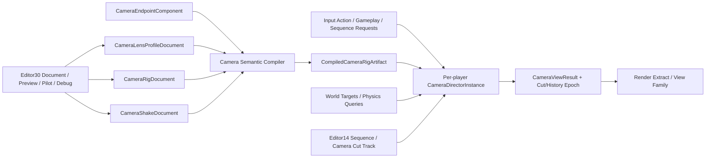

---
related_code:
  - zircon_runtime/src/asset/assets/scene/camera.rs
  - zircon_runtime/src/core/framework/camera_controller
  - zircon_runtime/src/core/framework/render/camera.rs
  - zircon_runtime/src/core/framework/render/camera_ordering.rs
  - zircon_runtime/src/core/framework/render/camera_stack.rs
  - zircon_runtime/src/dynamic_api/camera_controller.rs
  - zircon_runtime/src/dynamic_api/session/events.rs
  - zircon_runtime/src/scene/components/scene/camera.rs
  - zircon_runtime/src/scene/world/project_io/camera.rs
  - zircon_runtime/src/scene/world/render.rs
  - zircon_runtime/src/script/vm/gameplay_host/transform.rs
  - zircon_plugins/ai/runtime/src/plugin/registration.rs
  - zircon_editor/src/scene/viewport/controller
  - zircon_editor/src/ui/retained_host/callback_dispatch/template_bridge/workbench/extension_module_navigation/specs/gameplay_animation.rs
  - zircon_runtime_interface/src/resource/marker.rs
plan_sources:
  - docs/plans/optimize/00-engine-wide-review.md
  - docs/plans/optimize/zircon_runtime/05-scene-ecs-world-lifecycle-review.md
  - docs/plans/optimize/zircon_runtime/06-platform-input-process-review.md
  - docs/plans/optimize/zircon_runtime/07-script-plugin-runtime-review.md
  - docs/plans/optimize/zircon_runtime/08f-ai-behavior-tree-blackboard-perception-runtime-review.md
  - docs/plans/optimize/zircon_runtime/09b-renderer-visibility-gpu-scene-review.md
  - docs/plans/optimize/zircon_runtime/09h1-temporal-aa-velocity-history-upscaling-review.md
  - docs/plans/optimize/zircon_editor/02-document-transaction-save-autosave-recovery-review.md
  - docs/plans/optimize/zircon_editor/03-scene-prefab-selection-mode-gizmo-picking-review.md
  - docs/plans/optimize/zircon_editor/05-inspector-reflection-property-authoring-customization-review.md
  - docs/plans/optimize/zircon_editor/07-play-session-process-pie-game-view-live-edit-recovery-review.md
  - docs/plans/optimize/zircon_editor/14-animation-sequence-graph-state-machine-timeline-curve-preview-compiler-authoring-review.md
  - docs/plans/optimize/zircon_editor/22-render-pipeline-frame-capture-lighting-bake-reflection-probe-post-process-debug-authoring-review.md
  - docs/plans/optimize/zircon_editor/29-input-action-mapping-context-binding-trigger-modifier-device-user-rebinding-accessibility-authoring-review.md
reference_engines:
  - dev/UnrealEngine/Engine/Source/Runtime/Engine/Classes/Camera/CameraComponent.h
  - dev/UnrealEngine/Engine/Source/Runtime/Engine/Classes/Camera/PlayerCameraManager.h
  - dev/UnrealEngine/Engine/Source/Runtime/Engine/Classes/GameFramework/SpringArmComponent.h
  - dev/UnrealEngine/Engine/Source/Runtime/CinematicCamera/Public/CineCameraComponent.h
  - dev/UnrealEngine/Engine/Source/Runtime/MovieSceneTracks/Public/Tracks/MovieSceneCameraCutTrack.h
  - dev/UnrealEngine/Engine/Plugins/Cameras/GameplayCameras/Source/GameplayCameras/Public/Core/CameraRigAsset.h
  - dev/UnrealEngine/Engine/Plugins/Cameras/GameplayCameras/Source/GameplayCameras/Public/Core/CameraNodeEvaluator.h
  - dev/UnrealEngine/Engine/Plugins/Cameras/GameplayCameras/Source/GameplayCameras/Public/Core/BlendStackCameraNode.h
  - dev/UnrealEngine/Engine/Plugins/Cameras/GameplayCameras/Source/GameplayCameras/Public/Core/CameraShakeAsset.h
  - dev/UnrealEngine/Engine/Plugins/Cameras/GameplayCameras/Source/GameplayCameras/Public/Nodes/Collision/CollisionPushCameraNode.h
  - dev/godot/scene/3d/camera_3d.h
  - dev/godot/editor/scene/3d/camera_3d_editor_plugin.h
  - dev/godot/editor/scene/3d/camera_3d_editor_plugin.cpp
  - dev/bevy/crates/bevy_camera/src/camera.rs
  - dev/bevy/crates/bevy_camera/src/projection.rs
  - dev/Fyrox/fyrox-impl/src/scene/camera.rs
  - dev/Fyrox/editor/src/settings/camera.rs
  - dev/Graphics/Packages/com.unity.render-pipelines.universal/Runtime/UniversalAdditionalCameraData.cs
  - dev/Graphics/Packages/com.unity.render-pipelines.universal/Editor/Camera/UniversalRenderPipelineCameraEditor.cs
  - dev/Graphics/Packages/com.unity.render-pipelines.high-definition/Runtime/RenderPipeline/Camera/HDCamera.cs
doc_type: review-and-refactor-plan
review_status: review_complete
implementation_status: pending
source_recheck_required: true
---

# 30 · Camera Asset / Component / Rig / Controller / Director / Blend / Shake / Cinematic Cut / Preview Authoring 工程化差距

## 1. 结论

Zircon的相机底层并非空壳。`SceneCameraAsset`已经能持久化pipeline、投影、FOV/orthographic size、clip plane、surface/texture/headless target、viewport、order、active、HDR、exposure、clear color、MSAA和post-process settings；`CameraComponent`能进入World并被scene render extraction消费。`ViewportCameraSnapshot`、`CameraRenderDescriptor`、deterministic ordering和Base/Overlay stack validator也形成了真实render合同。free/orbit/pan controller把input/settings/state/output拆开，局部数学和cursor intent可继续复用。

但这些基础目前没有组成工程级相机产品。`CameraComponent`的14个字段中有11个被`#[zr_reflect(skip)]`排除，Editor实际只能编辑FOV、near和far；`ResourceKind`没有Camera Rig、Lens或Shake资产，仓内production source也没有CameraRig、CameraDirector、CameraBlend、CameraShake、SpringArm、CineCamera、CameraModifier或CameraMode。Scene创建Camera只是在通用Scene document中增加一个节点，没有相机专属toolkit、预览、pilot、frustum、safe frame或导演调试。

render侧看似支持stack，source侧却无法表达：`SceneCameraAsset`和`CameraComponent`都没有`render_type`、stack成员、clear-depth、独立culling/volume mask、dynamic resolution、temporal jitter或projection override。World extraction把每台scene camera固定成Base、空stack、`clear_depth=true`，并把同一`RenderLayerMask`同时复制为culling和volume mask。当前stack能力主要由手工descriptor测试证明，真实场景资产无法创作和重开它。

更严重的是动态Runtime始终构造`RuntimeCameraController`。UI未消费时，右键/中键/滚轮既提交通用`InputEvent`，又直接orbit/pan/zoom `world.active_camera()`的scene transform；没有enable flag、debug profile、Input Action、InputUser、camera possession或director仲裁。脚本`camera_follow`同样直接覆盖实体transform，既不验证CameraComponent，也没有damping、collision、blend或receipt。AI Behavior LOD又读取全局`world.active_camera()`，使一个未持久化的单例选择同时承担render默认视图、玩法相机和AI观察者语义。

Sequencer中的Camera、Camera Cut和Preview只是静态row/control/route。没有typed camera-cut track、camera binding、director bridge、shot evaluation或cut event。Temporal velocity只能用“位移超过far plane 20%、旋转超过60°、FOV变化超过15°”等启发式把结果归类为`CameraCutOrInvalid`；小位移硬切、同位置镜头切换和主动history reset均无法表达。

因此本轮目标不是继续给Orbit controller加条件分支，而是建立`CameraEndpointComponent + CameraLensProfileDocument + CameraRigDocument + CameraShakeDocument -> CompiledCameraRigArtifact -> per-player/per-viewport CameraDirectorInstance -> CameraViewResult`完整链。Scene camera继续作为render endpoint，Rig/Lens/Shake成为可复用资产；director统一拥有activation、target、evaluation、blend、modifier、cut/history epoch和possession，Editor再围绕同一compiler/evaluator提供transactional authoring、preview、pilot、Sequencer和diagnostics。

## 2. 审查边界与证据

### 2.1 当前工作树物理范围

| 子域 | 文件/行数/bytes | 本轮状态 |
|---|---:|---|
| Scene asset/component/world/project IO | 13 / 3,797 / 154,905 | E3逐字段与转换：source、component、reflection、active camera、render extract和focused tests；19个test attributes |
| Render view/stack/order/history | 10 / 2,774 / 93,763 | E3逐分支：descriptor、Base/Overlay校验、history key和velocity cut heuristic；25个test attributes，3个在途文件 |
| controller/dynamic runtime/script/AI | 24 / 3,142 / 116,192 | E3逐输入与写入：free/orbit/pan、动态session事件、script follow和AI LOD；11个test attributes，2个在途文件 |
| Editor viewport/Sequencer/catalog anchors | 20 / 4,188 / 141,021 | E2/E3：transient editor camera、create command、static sequence rows和ResourceKind；12个test attributes，1个在途文件 |
| selected combined scope | 67 / 13,901 / 505,881 | 当前工作树fingerprint `3c91d2ae154f435e3aa740c3c99274a67063c71081113d8df1be112c1350fd00`；67个test attributes、0 ignored、6个在途文件 |

6个在途文件为`camera_stack.rs`、`frame_extract.rs`、planar `derive_camera.rs`、dynamic session `construction.rs/events.rs`和Sequencer template binding；均非本轮产生。实施前必须重新导出67文件manifest、重算fingerprint，并复核这些文件的owner和最终事件顺序。本轮没有把Renderer09B、Temporal09H1、Editor03或Editor14的全部物理范围重复计入。

### 2.2 静态事实清单

1. `SceneCameraAsset`有15个source字段和target/viewport typed schema，是真实可保留的scene持久化基础。
2. `CameraComponent`有14个public字段；只有`fov_y_radians/z_near/z_far`进入reflection，另11个字段明确skip。
3. `SceneAsset`只保存entities，没有active camera stable identity、camera director、schema version或redirect；reload后world按首个camera修复active selection。
4. `World::set_active_camera`对invalid/non-camera请求静默忽略，没有expected generation、receipt、change event、owner或blend。
5. `CameraRenderDescriptor`已表达Base/Overlay、stack、target、viewport、clear/clear-depth、culling/volume mask和snapshot，validator能报告missing/non-overlay/target mismatch。
6. Scene source和component无法表达descriptor中的render type、stack、clear-depth和独立masks；extraction固定Base/empty/true并复用entity render layer。
7. `ViewportCameraSnapshot`比scene component更丰富，另含aspect、projection override、dynamic resolution和temporal jitter；这些字段没有authoring source。
8. free/orbit/pan controllers是typed、deterministic局部数学工具；Orbit仅被Editor viewport与dynamic runtime消费，Free/Pan没有shipping gameplay owner。
9. dynamic session无条件构造`RuntimeCameraController`，默认orbit target取首个Cube或active camera。
10. UI未消费的mouse事件先/同时进入通用Input，再由硬编码right/middle/wheel路径直接改active camera transform；没有可搜索到的enable/profile/capability gate。
11. script `camera_follow`直接`update_transform`并使用固定offset/look-at，注册在宽泛`gameplay.entity` capability下。
12. AI插件以全局active camera的world transform计算behavior LOD，没有view family、local player或server relevance策略。
13. Editor scene viewport一旦导航便持有transient snapshot，与active scene camera分叉；projection mode和ortho size改的是Editor view而非scene source。
14. Editor没有camera preview/pilot/lock/view-through/safe-frame/frustum/bookmark产品命中；选择任意对象只改变orbit target。
15. `CameraRig`在仓内只命中测试/展示fixture字符串；其他Rig/Director/Blend/Shake/Cine/Mode production symbols为零。
16. `ResourceKind`没有Camera、CameraRig、Lens或Shake；Camera endpoint仍可合法属于Scene，但可复用Rig/Lens/Shake没有asset身份。
17. Sequencer只有Camera row、Camera Cut table row和Preview/Validate route；没有camera cut domain object、track compiler或runtime consumer。
18. motion-vector camera status把projection/history incompatibility统一叫`CameraCutOrInvalid`，cut由数值阈值猜测而不是authoring/runtime事件。

### 2.3 动态证据边界

此前`zircon_editor --lib`测试编译在617.2秒后被239个既有错误和122个warning阻断。本轮没有重复同一无变化lane，也没有运行Camera、Editor、WGPU或Play focused tests；67个test attributes只表示静态存在。没有执行真实Play input possession、camera stack scene round-trip、Sequencer cut、temporal capture、collision/occlusion、split-screen、device loss或长时间soak，不能把局部controller/render测试当作相机产品验收。

### 2.4 参考边界

- Unreal基础CameraComponent暴露projection/FOV/ortho/aspect/overscan/post-process并提供显式`NotifyCameraCut`；PlayerCameraManager拥有current/pending view target、blend函数、modifier和shake生命周期；SpringArm把arm length、collision probe/channel、camera lag和offset分开；CineCamera再增加filmback、lens、focus、focal length和aperture。
- Unreal MovieScene使用typed Camera Cut Track/section；GameplayCameras插件进一步把CameraRigAsset、builder、node/evaluator hierarchy/storage、persistent/transient blend stack、transition、collision、damping、framing、lens、shake、debug和Editor asset toolkit分层。Zircon不必复制类层次，但必须达到source/compiled/runtime/editor authority闭合。
- Godot Camera3D至少提供per-Viewport current camera、perspective/orthogonal/frustum、keep-aspect、offset、cull mask、environment/attributes/compositor及project/unproject/frustum query；Editor有显式Preview toggle、custom camera、SubViewport preview和camera gizmo。
- Bevy Camera/Projection可作为ECS render endpoint参考，覆盖target、viewport、order、active、HDR、computed camera、world/viewport conversion以及Perspective/Orthographic projection；它不是Gameplay rig/director或cinematic authoring方案。
- Fyrox Camera node有reflected projection、viewport、enabled、environment、exposure、color grading、render target、frustum/project/unproject/ray与debug frustum；Editor settings持久化speed、sensitivity和zoom参数，可作为最低可用navigation/inspection基线。
- Unity Graphics URP Additional Camera Data明确序列化Base/Overlay、camera stack、clear depth、post-processing、AA、volume mask/trigger、depth/color requirement、renderer与history reset，Editor对这些字段做条件化校验；HDRP `HDCamera`维护per-camera history/jitter/dynamic-resolution/exposure。Unity Graphics本地范围不含Cinemachine，本文不推测其闭源或未收录能力。

## 3. 必须保留的真实基础

1. 保留`SceneCameraAsset`现有target/viewport/render settings和post-process source，不退回只保存transform/FOV的临时格式。
2. 保留`CameraComponent`作为scene中的render endpoint；Rig/Lens/Shake资产引用它，不把每台endpoint强制改成独立顶层Camera asset。
3. 保留`ViewportCameraSnapshot`和`ViewProjectionMatrixPair`作为render-facing immutable view合同，扩展history identity而非让Editor直接操纵renderer internals。
4. 保留`CameraRenderDescriptor`、deterministic ordering、Base/Overlay stack validation和target mismatch diagnostics。
5. 保留free/orbit/pan controller的input/settings/state/output拆分和deterministic数学测试，将其降格为可组合node/导航工具。
6. 保留Editor viewport的transient editor camera与scene camera分离原则，但补齐显式view-through/pilot和可见状态，不再靠隐式分叉。
7. 保留Editor03的通用viewport navigation、selection、gizmo、picking和per-viewport session owner；本计划只提供camera-specific adapter。
8. 保留Editor05统一reflection/property transaction方向；Camera Inspector走同一property address和customization，不另建字符串表单。
9. 保留Editor14的Sequence document/compiler/preview owner；Camera Cut是typed track extension，不另建平行timeline。
10. 保留Runtime09B/09H1与Editor22的view/history/render/post-process owner；Camera Director只发布qualified view result、cut/history epoch和profile references。

## 4. 目标架构与Owner边界

| 领域 | 唯一owner | Editor30消费/提供 |
|---|---|---|
| Scene/document/component/transaction | Runtime05 + Editor02/03/05 | Camera endpoint schema/customization、rig references和typed commands |
| raw input/action/user/device | Runtime06 + Editor29 | director消费scoped actions；不读取hardcoded mouse或重建Input authority |
| gameplay camera evaluation/director | 新Runtime Camera domain | compiled rig evaluator、per-player/viewport activation/blend/modifier/cut |
| render view/stack/history/post-process | Runtime09B/09H1 + Editor22 | 消费`CameraViewResult`和endpoint render settings；返回typed validation/debug snapshot |
| sequence/timeline/preview clock | Editor14 + Runtime Animation/Sequence | Camera Cut track schema/evaluator adapter、shot binding和cut event |
| Play/Game View/possession | Editor07 | player/viewport/session identity、input focus和director observation |
| physics/collision/occlusion | Runtime Physics | async/budgeted query snapshot与query generation；Camera不私建物理世界 |
| asset/import/cook/jobs/diagnostics | Editor04/09-11 + Tooling03 | Rig/Lens/Shake source、compiler job、artifact、receipt与cook qualification |
| AI relevance/network/replay | AI/Network/Gameplay owners | 消费view family/relevance snapshot；不得读取模糊global active camera |

建议的核心合同至少包括：

- `CameraEndpointComponent { endpoint_id, render_settings, lens_profile, default_rig, post_process_profile, layer_policy }`；endpoint保持scene component身份。
- `CameraRigDocument { rig_id, schema_version, source_revision, root_node, nodes, parameters, transitions, dependencies }`，node和parameter均有stable ID。
- `CameraLensProfileDocument { sensor/filmback, focal range, aperture range, focus policy, crop/overscan, distortion metadata }`与`CameraShakeDocument { pattern, envelopes, channels, space, seed policy }`。
- `CompiledCameraRigArtifact { artifact_id, compiler_version, source_digest, dependency_revisions, evaluator_layout, node_program, parameter_layout, capability_requirements, diagnostics }`。
- `CameraActivationRequest/Receipt { player, viewport, owner, priority, artifact, target, transition, expected_generation, lifetime }`，owner revoke/timeout产生唯一terminal result。
- `CameraEvaluationContext { tick, delta, time_domain, player, viewport, target snapshots, input action snapshot, physics query generation, previous state }`。
- `CameraViewResult { pose, projection/lens, post_process, culling/volume policy, render target/stack, source rig/node, director_generation, history_epoch, cut_reason, diagnostics }`。
- `CameraPreviewSession`冻结document/artifact/world/time/device/aspect generation，preview、pilot和Sequencer都执行同一compiled evaluator。

## 5. P0：先关闭产品劫持与不可创作边界

### P0-1：动态Runtime无条件劫持右键、中键和滚轮并直接改scene camera

同一未消费事件既进入Gameplay Input又触发硬编码orbit/pan/zoom，没有enable/profile/InputUser/possession/director。M0必须把该路径默认关闭或限定为显式development camera capability；任何camera mutation都经activation lease和action mapping，UI/input arbitration只产生一个可解释结果。

### P0-2：Camera Component绝大多数字段不可编辑，且没有Rig/Lens/Shake产品

14个component字段只有3个进入reflection，target/viewport/order/active/HDR/exposure/clear/MSAA等真实source无法通过通用Inspector创作；production又没有Rig/Director/Blend/Shake/Cine资产或toolkit。必须先交付完整endpoint customization和至少Rig/Lens/Shake source/compiler入口，禁止把Create Camera + 三个float称为Camera Authoring。

### P0-3：Render Camera Stack能力无法从Scene source到达

descriptor/validator有Base/Overlay和stack，但scene extraction永远生成Base/empty stack/default clear-depth并混用layer masks。M1必须让source round-trip表达这些字段、compiler验证target/pipeline/order/cycle并让真实scene test消费；否则应明确标为Unavailable，不能把手工descriptor tests当产品能力。

### P0-4：没有per-player/per-viewport Camera Director，global active camera同时污染玩法、脚本和AI

active camera不持久化、invalid set静默忽略、script直接写transform、AI LOD读取同一singleton；没有view target、priority、blend、collision、owner或receipt。必须建立director实例和activation/evaluation合同，将world active camera降为legacy/default endpoint选择并完成caller迁移。

### P0-5：Sequencer Camera Cut是静态UI，Temporal history只能猜cut

没有typed cut track、camera binding、shot evaluation或显式history epoch。必须由Editor14 Sequence extension发布`CameraCutEvent`，director生成新的history epoch并让TAA/velocity/exposure/occlusion等消费者按reason reset；数值阈值只保留异常保护，不能代表authoring cut语义。

## 6. P1：Endpoint Source、Schema、Compiler 与 Artifact

### P1-1：Camera endpoint reflection不完整

将14个字段全部纳入typed property system或明确只读/advanced policy；projection切换、target、viewport、order、active、HDR、exposure、clear和MSAA均有validation、transaction、undo和multi-edit语义。

### P1-2：Scene camera source没有schema/version/unknown policy

加入schema version、canonical serialization、migration、unknown field保留/拒绝和compiler compatibility；不能长期依赖serde default静默补字段。

### P1-3：active camera identity不持久化

Scene/project保存stable endpoint ID或明确default selection policy；reload、rename、reorder、duplicate和missing reference有migration/diagnostic，不再按首个entity偶然选择。

### P1-4：投影模型不完整

支持perspective/orthographic/frustum/off-center、aspect constraint、sensor fit、lens shift和reverse/infinite-Z capability；非法near/far/FOV/size在compiler中拒绝而非传到matrix阶段。

### P1-5：target/viewport source缺少跨字段验证

检查surface/texture/headless尺寸、viewport bounds/depth range、format/MSAA/HDR兼容、resize policy和missing target，输出property-addressed diagnostics。

### P1-6：Base/Overlay与stack没有source字段

在endpoint render settings表达render type、ordered stable stack references、clear mode/depth和pipeline compatibility；cycle、duplicate、orphan和target mismatch在save/compile前可见。

### P1-7：culling mask与volume mask被错误合并

二者具有独立source、defaults和layer registry引用；camera render visibility与post-process volume选择不能借同一entity mask偶然一致。

### P1-8：post-process只有嵌入settings且缺权重/trigger policy

支持typed profile reference、local overrides、blend weight、volume trigger和override mask；复用Editor22 profile/volume authority，不复制第三套post-process schema。

### P1-9：缺少Camera Lens Profile asset

建立可复用filmback/sensor、focal/aperture/focus/crop/overscan/distortion profile及厂商metadata；endpoint可override但不复制整份物理镜头数据。

### P1-10：缺少Camera Rig asset

Rig独立于scene endpoint，保存stable graph、parameters、transitions、target slots和dependencies，可被多个角色/关卡实例化和版本化。

### P1-11：缺少Camera Shake asset

Shake source保存pattern/envelope/channel/space/seed/scaling和stop behavior，不能靠脚本每帧随机改transform。

### P1-12：Rig node/parameter没有stable identity

node、pin、parameter、transition和binding使用stable IDs；rename/reorder不破坏sequence、profile、save、debug trace或preset override。

### P1-13：缺少typed reference graph

Rig对Lens/Shake/Curve/Target Provider/Post Process和nested Rig使用typed asset/stable ID引用，删除/rename/cycle/stale由Editor04 reference graph和compiler诊断。

### P1-14：缺少shared semantic compiler和immutable artifact

Editor validate、preview、PIE、cook和shipping共用compiler，产出canonical evaluator program、layout、capability requirements、source spans、dependency digest和diagnostics。

### P1-15：缺少migration、redirect与LKG

Scene旧camera字段、future Rig versions和asset rename都必须迁移；hot reload compile失败保持last-known-good artifact并标记Stale，不把半编译graph装入director。

## 7. P1：Director、Rig Evaluation、Controller 与 Ownership

### P1-16：缺少per-player/per-viewport director identity

每个LocalPlayer/Viewport/ViewFamily拥有独立director generation、active stack、state和history；headless/server可选择无view或显式relevance views，不共享全局singleton。

### P1-17：缺少activation priority与owner lease

Gameplay mode、ability、vehicle、dialog、sequence和debug camera通过typed request进入priority stack；owner unload/death/timeout必定撤销并产生receipt。

### P1-18：view target只剩裸entity transform

定义target provider、socket/bone、local offset、velocity/bounds和missing target policy；snapshot带world/entity generation，禁止跨world裸ID。

### P1-19：缺少Follow/LookAt/Aim节点

分别建模position target、aim target、offset space、axis constraints、dead zone和target prediction；不以固定`Vec3::Y` look-at替代产品语义。

### P1-20：缺少Boom/SpringArm与collision

支持arm length、socket/target offset、probe shape/radius/channel、ignore owner、push/recovery速度和initial overlap；查询复用Physics owner并有budget/generation。

### P1-21：缺少occlusion处理策略

区分camera collision、target occlusion、fade/material proxy、alternate shoulder和line-of-sight；query失效/超时有保守policy与diagnostic。

### P1-22：damping/lag没有空间和时间合同

位置/旋转/FOV/focus分别支持world/local/target space、half-life/max speed、fixed/variable tick和teleport reset；禁止frame-rate-dependent lerp。

### P1-23：缺少framing/composition节点

支持single/multi-target bounds、screen-space region、dead/soft zone、look-ahead、safe frame和constraint solve，极端bounds/behind-camera有可解释fallback。

### P1-24：controller不消费Input Action

Orbit/Free/Pan只接typed intent/action snapshot，不读取mouse key；参数来自Rig/profile，InputUser、viewport、focus和consume provenance贯穿evaluation。

### P1-25：development navigation与shipping camera混在dynamic session

将当前`RuntimeCameraController`迁为显式DevCameraMode，默认off；enable/disable、possess/eject、cursor capture和target选择走session capability与receipt。

### P1-26：缺少确定的evaluation phase/order

冻结target snapshot -> base rig -> constraints/collision -> blend -> modifiers/shakes -> lens/post -> history/cut，插件节点只能在声明phase运行且有budget。

### P1-27：缺少pose/lens/post-process blend

定义position/rotation/FOV/focal/focus/post override的typed blend和curve，支持outgoing lock、preblended、cut与duration，不用transform直接跳变。

### P1-28：blend interruption语义缺失

new request、owner revoke、target loss、sequence cut和network correction分别选择continue/rebase/reverse/cut；状态可序列化、调试和测试。

### P1-29：缺少modifier stack

shake、recoil、head bob、camera animation、accessibility reduction和debug offset按channel/priority/additive/absolute组合，lifetime和stop/fade由director管理。

### P1-30：script camera facade绕过authority

以stable director handle提供activate rig、set target/parameter、play/stop shake、cut/blend和query receipt；限制raw transform camera mutation，并收窄`gameplay.entity` capability。

## 8. P1：Lens、Cinematic、Shake 与 Temporal History

### P1-31：缺少filmback/sensor与焦距模型

支持sensor width/height、sensor fit、focal length与FOV互算、preset和单位；避免FOV与焦距两套值无authority地互相覆盖。

### P1-32：缺少aperture、focus和autofocus

支持f-stop、manual/tracking/target-ray focus、focus offset、smoothing和debug plane；与DOF owner共享qualified lens snapshot。

### P1-33：exposure/post-process没有director合成

endpoint、lens/rig、volume和sequence override按明确优先级合成，输出contributor trace；cut时exposure adaptation reset/hold policy可配置。

### P1-34：缺少aspect、crop、gate fit与overscan

preview、Game View、render target和export使用同一sensor fit/crop/aspect policy；safe area、letterbox/pillarbox和overscan不靠UI偶然裁剪。

### P1-35：缺少lens distortion与breathing metadata

先建立profile/renderer capability接口、calibration/version和fallback；没有真实shader/校准前明确Unavailable，不用任意系数伪造电影镜头。

### P1-36：Shake pattern不具确定性与通道语义

支持perlin/wave/sequence/custom compiled pattern、seed、duration/envelope、position/rotation/FOV channel和local/world/camera space。

### P1-37：缺少Shake service生命周期

play/stop/stop-all按owner/source/tag/instance ID管理，scale/fade、single-instance、source attenuation和pause/time domain有receipt与bounded observation。

### P1-38：缺少显式CameraCutEvent/history epoch

director对endpoint/rig/pose/lens/viewport变化分类，生成monotonic history epoch与typed reason；renderer、velocity、TAA、exposure、SSR/occlusion共同消费。

### P1-39：camera history identity不绑定director/view source

history key加入player/viewport/view/endpoint/director generation和history epoch；同target切camera、stack overlay、resize和stereo eye不能错误复用历史。

### P1-40：Sequencer没有typed Camera Cut Track

在Editor14 schema中实现stable camera binding、cut section、range、blend/easing、priority和compile diagnostics，不能让Camera Cut只是一行可选字符串。

### P1-41：Sequence与director没有ownership handshake

play/scrub/stop/loop/jump分别申请/更新/释放director lease，pre-roll和restore state明确；Sequence结束不遗留被占用camera。

### P1-42：缺少shot/take与cinematic metadata

支持shot ID、take、frame rate/timecode、handles、camera/lens refs、safe frame和notes，并保持与sequence source revision关联。

### P1-43：多camera render与director view混淆

安全区分active gameplay view、render-active endpoint、Base/Overlay stack、capture/probe和Editor preview；每类有view family purpose与成本预算。

### P1-44：split-screen/stereo/XR contract缺失

每eye/view拥有projection、pose offset、history和culling identity，共享camera-neutral rig evaluation的边界明确；mono singleton不得复制到所有view。

### P1-45：network/replay/AI relevance没有view policy

定义本地表现相机是否网络同步、spectator/replay camera、server interest views和AI LOD observers；AI不得把任意client/editor active camera当全局真值。

## 9. P1：Editor Product、Preview、Sequencer 与 Diagnostics

### P1-46：缺少Rig/Lens/Shake asset factory与toolkit

接Editor04注册create/open/rename/reference/thumbnail/cook role和first-party catalog；Camera endpoint仍由Scene创建，三类可复用资产有独立toolkit。

### P1-47：缺少transactional Camera authoring document

Rig graph、lens fields、shake curves和endpoint overrides全部接Editor02 dirty/history/save/conflict/recovery，interactive edits用preview transaction而非直接改world。

### P1-48：Camera Endpoint Inspector不完整

提供projection/lens/render target/stack/layer/post-process/activation分组、条件字段、units、validation、reference picker和multi-edit；不复制CameraComponent真值。

### P1-49：缺少Rig graph/stack editor

显示node hierarchy、parameters、target slots、transitions、blend/modifier order、cost和diagnostics；graph view只是source projection，compiler拥有语义。

### P1-50：缺少Camera Preview与View Through

选中camera时提供显式preview tile/viewport和View Through；preview标明source/artifact/world/time/aspect generation，不偷偷替换Editor navigation camera。

### P1-51：缺少Pilot/Lock与可逆提交

Pilot scene camera时Editor navigation可选择预览或transactionally写回endpoint transform；Lock阻止误写，Esc/capture loss/scene switch恢复明确状态。

### P1-52：缺少frustum/focus/filmback/safe-frame gizmo

通过Editor03 visualization registry绘制可pick frustum、near/far、focus plane、boom/collision、composition zones和safe frame，受show flags与预算控制。

### P1-53：缺少多上下文Preview Session

可切target、input intent、aspect/device、time、post-process、collision world和platform capability；同artifact结果可与PIE snapshot做差异比较。

### P1-54：缺少live Camera Debugger

展示director/player/viewport、active stack、owner/priority、node timings、target/collision、blend weights、modifier/shake、lens和history reset reason；无reader时不物化全trace。

### P1-55：Sequencer camera UX没有真实runtime投影

Camera/Cut rows必须绑定typed sections和compiled result，scrub/preview驱动同一director；stale/missing camera、overlap和restore-state问题定位到source range。

## 10. P1：跨域集成、测试、性能与迁移

### P1-56：Input Action与Camera intent未闭合

消费Editor29 compiled actions、InputUser和consume provenance；Editor navigation和Gameplay camera共享intent vocabulary但保持profile/context/owner隔离。

### P1-57：Play/Game View possession未闭合

接Editor07 player/instance/viewport/input focus，支持possess/eject/debug camera和多实例目标；Play与Simulate的camera mutation/selection语义可观察地区分。

### P1-58：render/post-process/history handoff缺少typed receipt

Scene compile和director输出经过Render owner admission，unsupported stack/lens/dynamic-resolution有degraded reason；frame diagnostics能追溯source/artifact/view generation。

### P1-59：缺少完整test与fault matrix

加入schema/compiler golden、scene round-trip、invalid stack、director priority/lease、blend interrupt、collision/target loss、cut/history、sequence scrub、multi-player/viewport、Editor recovery和fault tests。

### P1-60：缺少性能资格与legacy迁移门

测1/10/100 active rig、1K nodes、multi-view共享、collision budgets、trace off/on、allocation和frame-time分位；inventory global active camera、raw transform/script和dynamic mouse path，迁移后删除产品旁路。

## 11. P2：完整性、扩展性与高级能力

### P2-1：Procedural camera constraint solver

支持多目标构图、遮挡、碰撞和镜头限制的可终止优化，提供iteration/time budget、warm start、fallback与调试残差。

### P2-2：Virtual production lens calibration

导入真实lens calibration、distortion/ST map、nodal offset、focus/zoom tables和版本化设备metadata，和capture/timecode链闭合。

### P2-3：Camera animation与motion matching

把authoring curve/clip编译为可组合modifier，支持phase sync、root space、retarget和deterministic sampling，不直接播放transform文本。

### P2-4：Advanced shake source field

按world source、distance、occlusion、frequency band和accessibility filter合成大量shake，使用空间索引和bounded selection。

### P2-5：Spectator/replay/photo mode

独立director policy、permission、time control、camera collision、capture metadata和network visibility；不复用开发orbit旁路。

### P2-6：Deterministic recording/rollback

记录artifact、parameter、target snapshot、activation/cut/shake events和time domain，支持重放、rollback与跨平台差异验证。

### P2-7：Large-world与origin rebasing

camera target、damping、collision、history和cut detection使用large-world stable coordinates/generation，origin shift不触发伪cut或数值抖动。

### P2-8：Semantic merge与团队协作

按stable rig node/parameter/transition/shot ID三方merge、review与冲突定位，不以整份graph或sequence文本覆盖。

### P2-9：Plugin camera nodes与sandbox

插件可注册compiled node/evaluator/editor schema，但必须有签名、capability、owner lease、memory/time budget、version和卸载fallback。

### P2-10：Camera quality scalability

按platform/budget选择collision frequency、occlusion、lens effects、shake bands和multi-target solve质量，结果与artifact/source可追溯。

### P2-11：跨引擎行为/画面基准

建立同场景构图、blend、collision、shake、cut/history与cinematic lens对比，记录相同输入、帧率、画质和capture证据，不能只比较API数量。

### P2-12：大规模camera simulation farm

分布式回放target/input/sequence/network traces，验证artifact digest、determinism、cut/reset、性能分位、故障与迁移结果。

## 12. 当前Authority与断路清单

| 表面/底层能力 | 当前事实来源 | 最终动作 |
|---|---|---|
| Camera scene source | `SceneCameraAsset`，字段较完整 | 保留并version；补endpoint render/rig/lens引用和compiler |
| Camera component authoring | 14字段中仅3字段反射 | 统一Inspector customization和transaction，移除无理由skip |
| world active camera | 非持久化单`EntityId`、silent set | 降为legacy/default endpoint；迁到per-player/viewport director |
| render camera stack | descriptor/validator与手工tests | 建立source round-trip和scene compiler；否则明确Unavailable |
| free/orbit/pan | 可复用数学controller | 作为navigation/compiled node kernel，不直接拥有shipping camera |
| dynamic runtime camera | 无条件right/middle/wheel writer | 默认关闭，迁为capability-gated DevCameraMode |
| script camera follow | broad capability下直接写transform | typed director facade、target/parameter/activation receipt |
| AI behavior LOD observer | 读取global active camera | view/relevance policy snapshot，server/local/editor身份明确 |
| Sequencer Camera Cut | static row/control/route | Editor14 typed cut track + director lease + history epoch |
| temporal camera cut | 数值阈值`CameraCutOrInvalid` | 显式cut/reset event为truth；heuristic仅做异常保护 |
| Editor camera preview | transient editor navigation snapshot | 显式Preview/View Through/Pilot和qualified session |

## 13. 分层重构里程碑

### M0：Truthfulness、Input Hijack封闭与Owner冻结

冻结67文件manifest、6个在途文件、global active camera/raw transform callers；默认关闭dynamic mouse camera writer，建立Camera capability状态和跨计划owner矩阵。

### M1：Endpoint Schema与Render Source闭环

version Scene camera source，完整Camera Inspector，持久化default endpoint，补Base/Overlay/stack/clear/masks与scene round-trip/compiler diagnostics。

### M2：Rig/Lens/Shake Source与Shared Compiler

注册三类asset/factory/toolkit，完成stable IDs、reference graph、schema migration、compiled artifact、LKG和fake conformance fixtures。

### M3：Per-player Director与Evaluation Runtime

实现activation lease、target snapshot、phase order、follow/look-at/damping/framing、typed view result、bounded observation和multi-viewport identity。

### M4：Blend、Modifier、Collision与Shake

完成transition/interruption、boom/collision/occlusion、modifier stack、shake service和Physics query generation/budget。

### M5：Cinematic Lens、Cut与History

完成filmback/focal/aperture/focus/crop/overscan，typed CameraCutEvent、history epoch/key和Temporal/Post Process reset handoff。

### M6：Transactional Editor、Preview与Debug

交付endpoint customization、Rig/Lens/Shake documents、Preview/View Through/Pilot、gizmo、multi-context preview和live debugger。

### M7：Sequencer、Input、Script与Play集成

接Editor14 typed Camera Cut track、Editor29 action intents、Runtime script facade和Editor07 possession/eject/multi-instance。

### M8：Cook、Migration、Fault与性能资格

接Tooling03 artifact，迁移legacy active camera/dynamic controller/script calls；完成scene/cook/hot reload/fault/multi-view/1K-node性能门。

### M9：Advanced Camera与发布资格

扩展virtual production、photo/replay/large-world/plugin/quality/farm，以真实GPU、设备、平台、长时间soak和跨引擎同条件证据收敛shipping gate。

## 14. 验收门禁

- G01：Camera endpoint全部source字段可由统一Inspector查看/编辑/撤销/保存/重开，条件字段与units正确。
- G02：Scene显式default endpoint在entity reorder/rename/duplicate/reload后稳定，missing/redirect有typed diagnostic。
- G03：Base/Overlay/stack/clear-depth/culling/volume source经scene round-trip到真实render descriptor，不靠手工构造。
- G04：stack cycle、duplicate、orphan、target/pipeline/MSAA/HDR mismatch在compile前阻断并定位source property。
- G05：Rig/Lens/Shake能由真实factory创建、保存、重开、rename、reference graph追踪并cook为immutable artifact。
- G06：Editor preview、PIE、shipping和cook使用同一semantic compiler/evaluator，artifact digest和dependency revision可比。
- G07：没有valid artifact/endpoint/capability时明确Unavailable/Degraded，不用default orbit或首个camera伪造成功。
- G08：dynamic Runtime默认不消费right/middle/wheel；显式DevCameraMode也必须有session/owner/InputUser/viewport receipt。
- G09：Gameplay action事件只驱动所属InputUser/director，UI consumed input或另一个viewport不会同时改scene camera。
- G10：两个LocalPlayer/两个viewport拥有独立activation stack、target、history和view result，不共享global active camera。
- G11：activation priority、owner revoke、target loss和session teardown各产生唯一terminal receipt且无残留camera state。
- G12：Follow/LookAt/offset space、teleport、damping和frame-rate变化通过deterministic golden，不出现帧率相关漂移。
- G13：boom/collision处理initial overlap、thin obstacle、target teleport、query timeout和ignore owner，恢复过程无穿透/爆跳。
- G14：occlusion与collision策略可区分，关闭或unsupported时有明确fallback和diagnostic。
- G15：blend支持pose/lens/post-process、outgoing lock和interruption矩阵，cut/zero duration没有一帧旧状态泄漏。
- G16：modifier/shake按owner/channel/priority/space组合，stop/fade/pause/replay deterministic且无instance泄漏。
- G17：script只能通过scoped director handle激活/设参/播放shake；跨world裸entity和broad raw transform旁路被拒绝。
- G18：AI/network/replay消费带purpose/player/server identity的view/relevance snapshot，不读取模糊Editor/global camera。
- G19：filmback/focal/FOV/sensor fit/aperture/focus/crop/overscan互算和validation有unit/golden覆盖。
- G20：Camera Cut track有stable camera binding、section range、blend/cut和compile diagnostics，Preview/PIE结果一致。
- G21：每次显式cut生成history epoch/reason；TAA、velocity、exposure、SSR/occlusion按合同reset/hold。
- G22：小位移硬切、同位置不同camera、projection/lens change与大幅连续运动能被正确区分，heuristic不再是唯一truth。
- G23：history key隔离player/viewport/view/endpoint/eye/director generation；resize、stack和device recreate不复用stale history。
- G24：Preview/View Through/Pilot状态显式可见，scene switch/capture loss/Esc/close可恢复且dirty写回必须transactional。
- G25：frustum/focus/boom/composition/safe-frame gizmo与真实compiled/source snapshot同代，hidden/debug off时无extract成本。
- G26：Camera Debugger能解释active stack、owner、node、blend、collision、shake、lens和cut reason，但不能直接写runtime真值。
- G27：Play与Simulate在possession、Editor selection/navigation和scene camera写入上行为可观察地区分。
- G28：1/10/100 rig、1K nodes和多view基准记录compiler/evaluation/query/allocation分位；shared work不会按view重复无关计算。
- G29：schema/compiler/install/target/collision/sequence/hot reload/device loss故障注入覆盖stale/timeout/cancel/panic/LKG与recovery。
- G30：Windows优先lane覆盖compiler/runtime/Editor/Play/render history；其他平台按真实input/render/camera capability验证。
- G31：真实GPU capture验证camera stack、cut/history、motion vectors、exposure和post-process，无ghosting/一帧旧view/错误clear。
- G32：长时间soak覆盖activation churn、target spawn/despawn、shake、sequence loop/scrub、resize、multi-player和hot reload，证明无泄漏、串线、stuck ownership或无界trace。

## 15. 禁止的临时修补

1. 禁止只解除11个`zr_reflect(skip)`就宣称Camera Authoring完成。
2. 禁止把`SceneCameraAsset`继续堆成包含全部rig/sequence/shake行为的巨型component。
3. 禁止把Camera endpoint从Scene强行复制成第二套顶层asset真值；Rig/Lens/Shake才是可复用source asset。
4. 禁止保留无开关的right/middle/wheel runtime camera mutation，或只在注释里称其为debug camera。
5. 禁止让同一mouse event同时触发Gameplay Input和硬编码camera writer。
6. 禁止用全局`active_camera: EntityId`模拟LocalPlayer、viewport、spectator、capture和AI observer。
7. 禁止script/ability/sequence直接每帧覆盖camera transform以规避director。
8. 禁止把Base/Overlay stack只保留在descriptor tests而不提供scene source、Inspector和round-trip。
9. 禁止用大位移/大旋转阈值冒充Camera Cut事件或所有temporal reset语义。
10. 禁止Editor Preview/Pilot直接写scene且不进入transaction/dirty/recovery。
11. 禁止Editor、PIE、shipping、Sequencer分别实现不同follow/blend/shake/lens evaluator。
12. 禁止以更多静态Camera/Camera Cut rows、固定Preview反馈或展示fixture替代真实document/compiler/runtime闭环。

## 16. 本轮产出边界

本轮只完成静态review、参考对照、owner划分与分层重构计划，没有修改production Editor/runtime/interface/plugin代码或tests，没有实现Camera Rig/Director/Blend/Shake/Cinematic/Preview，也没有运行动态测试。结论不能作为Camera Authoring、Gameplay Camera、Camera Stack、Sequencer Cut或Temporal history integration已通过的声明；实施必须从M0开始，并在每个里程碑重取当前源码、67文件manifest、fingerprint、6个在途文件、production callers与动态结果。
