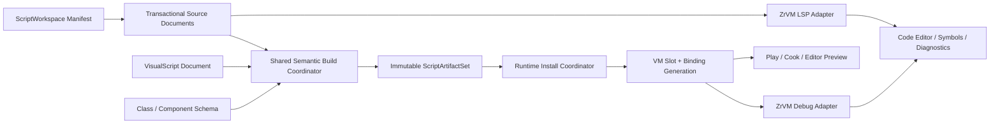

---
related_code:
  - zircon_editor/src/core/script_build
  - zircon_editor/src/core/logging/jump.rs
  - zircon_editor/src/ui/host/editor_activity_log.rs
  - zircon_editor/src/core/commands/defaults.rs
  - zircon_runtime_interface/src/script_diagnostics/mod.rs
  - zircon_runtime_interface/src/resource/marker.rs
  - zircon_runtime/src/dynamic_api/session/project.rs
  - zircon_runtime/src/asset/assets/scene/extensions.rs
  - zircon_runtime/src/scene/world/project_io/script.rs
  - zircon_runtime/src/script/vm/plugin/vm_plugin_package_discovery.rs
  - zircon_runtime/src/script/vm/runtime/vm_plugin_manager.rs
  - zircon_runtime/src/script/vm/runtime/hot_reload_coordinator.rs
  - zircon_plugins/zr_vm_language
  - zircon_plugins/first_party_runtime_catalog
  - zircon_plugins/first_party_editor_catalog
  - zircon_app/Cargo.toml
  - examples/woc/zircon-project.toml
  - examples/woc/scripts/woc_game
plan_sources:
  - docs/plans/optimize/00-engine-wide-review.md
  - docs/plans/optimize/zircon_runtime/05-scene-ecs-world-lifecycle-review.md
  - docs/plans/optimize/zircon_runtime/07-script-plugin-runtime-review.md
  - docs/plans/optimize/zircon_runtime_interface/02-serialization-reflection-resource-project-world-sync-public-dto-contract-review.md
  - docs/plans/optimize/zircon_editor/02-document-transaction-save-autosave-recovery-review.md
  - docs/plans/optimize/zircon_editor/04-asset-index-import-reimport-catalog-thumbnail-reference-workflow-review.md
  - docs/plans/optimize/zircon_editor/05-inspector-reflection-property-authoring-customization-review.md
  - docs/plans/optimize/zircon_editor/07-play-session-process-pie-game-view-live-edit-recovery-review.md
  - docs/plans/optimize/zircon_editor/08-command-registry-keymap-menu-palette-context-routing-remote-automation-review.md
  - docs/plans/optimize/zircon_editor/09-background-jobs-admission-scheduling-cancellation-progress-shutdown-product-integration-review.md
  - docs/plans/optimize/zircon_editor/11-logging-diagnostic-journal-output-console-status-routing-retention-export-review.md
  - docs/plans/zircon_editor/editor/13-script-compilation-management.md
  - docs/plans/performance/01/2026-08-16-editor-core-script-build-generation-current-architecture-review.md
reference_engines:
  - dev/UnrealEngine/Engine/Source/Runtime/Engine/Classes/Engine/Blueprint.h
  - dev/UnrealEngine/Engine/Source/Editor/Kismet/Public/BlueprintEditor.h
  - dev/UnrealEngine/Engine/Source/Editor/Kismet/Public/BlueprintCompilationManager.h
  - dev/UnrealEngine/Engine/Source/Editor/Kismet/Private/BlueprintCompilationManager.cpp
  - dev/UnrealEngine/Engine/Source/Developer/HotReload
  - dev/UnrealEngine/Engine/Source/Developer/Windows/LiveCoding
  - dev/godot/editor/script/script_editor_plugin.h
  - dev/godot/editor/script/script_editor_plugin.cpp
  - dev/godot/core/object/script_language.h
  - dev/godot/core/debugger/script_debugger.h
  - dev/Fyrox/editor/src/plugins/inspector/editors/script.rs
  - dev/Fyrox/editor/src/lib.rs
reference_sources:
  - E:/Git/zr_vm/zr_vm_rust_binding/rust/zr_vm_rust_binding/src/lib.rs
  - E:/Git/zr_vm/zr_vm_language_server
  - E:/Git/zr_vm/zr_vm_lib_debug
doc_type: review-and-refactor-plan
review_status: review_complete
implementation_status: pending
source_recheck_required: true
---

# 31 · Script Source / Code Editor / Build / Compiler / Hot Reload / Debugger / Visual Script / Class / Component Authoring 工程化差距

## 1. 结论

Zircon的脚本Runtime并非临时空壳。VM package discovery有深度、条目、manifest bytes、path bytes、wall-time和取消预算；`VmPluginManager`有backend family、package slot和generation；`HotReloadCoordinator`能保存旧实例状态、准备下一reflection generation、迁移state schema、激活新实例并在任一步失败时回滚旧实例。可选`zr_vm_language`插件也确实会打开`.zrp`、增量编译、启动解释/二进制session、注册host/reflection模块并执行生命周期export。这些底座必须保留。

但Editor产品没有接到这套底座。`ScriptBuildOrchestrator`的5个文件、1,582行和26个测试只形成纯领域状态机；除模块导出和测试外没有production caller。没有watch owner、Build Scripts命令、shared job executor、真实VM compile adapter、artifact receipt、binding publication、Play waiter或commandlet。当前Runtime在`load_startup_scripts()`中同步discover package，再在backend `load_package()`内直接`ProjectWorkspace::compile()`并立即启动session，绕开Editor build generation和诊断DTO。

默认产品装配也自相矛盾。`woc`与`vampire`都把`zr_vm_language`标为required；`zircon_app`虽定义`first-party-zr-vm-language-runtime-plugin`和`backend-zr-vm`feature，但默认`target-client`与`target-editor-host`均未启用。first-party Editor catalog只注册Navigation和Neural，没有ZrVM/Script Editor provider。未启用backend时插件明确返回`BackendUnavailable`；因此“项目声明required”不能证明默认Editor/Client能加载项目。

Editor没有Script/ScriptModule/VisualScript资源类型、source document、代码编辑器、外部IDE provider、LSP client、symbol/search/rename、breakpoint、debug session或profile pane。唯一可见命令是`Show Script Build Logs`过滤器。诊断`ScriptLocation`点击后被转换成通用`OpenAsset(path)`；若打开成功，只在status line显示行列号，并不把代码文档、光标或选区定位到该位置。

Scene脚本绑定同样只有运行时最低表达。`SceneScriptBindingAsset`保存`package/module/enabled/update/fixed_update`和`BTreeMap<String, JSON>`，加载World后又整体编码成动态组件`script.bindings`。Runtime按字符串反序列化并为标量属性建立文本索引，但没有Script Class/Component stable ID、编译器符号、字段类型、默认值、可见性、约束、schema version、redirect、实例override provenance或Editor property customization。它可以调用脚本模块，不能支撑工程级脚本组件创作与迁移。

真正的语言工具能力反而存在于兄弟仓库`E:/Git/zr_vm`：本地source包含parser/AOT/CLI、native stdio LSP和debug library；LSP声明diagnostics、completion、hover、signature、definition/reference、rename、semantic tokens、inlay hints、code actions、formatting、hierarchy和workspace file operations；debug library包含line/function/data breakpoint、condition/logpoint、stack/evaluate/snapshot/profile等实现。但Zircon plugin/Rust binding没有暴露这些debug能力，Editor也没有启动、监督或消费LSP/debug protocol。

因此本轮目标不是在Console旁增加一个多行文本框，也不是再造ZrVM parser。目标是建立`ScriptWorkspace + transactional ScriptSourceDocument/VisualScriptDocument -> shared semantic compiler -> immutable ScriptArtifactSet -> validated ScriptInstallReceipt -> VM slot generation`的统一链。文本脚本、Visual Script、Script Class/Component、Editor build、Play、cook和hot reload必须共享source/artifact/install identity；Editor通过ZrVM LSP/debug adapter提供authoring与调试，而Runtime继续拥有隔离、实例、状态迁移和安全点安装。

## 2. 审查边界与证据

### 2.1 当前工作树物理范围

| 子域 | 文件/行数/bytes | 本轮状态 |
|---|---:|---|
| Editor orchestrator/log/command/catalog | 11 / 2,656 / 85,877 | E3：5个script-build文件、diagnostic projection、typed jump最终动作、唯一Console命令和Editor catalog；31个test attributes |
| Runtime interface | 2 / 291 / 7,643 | E3：`ScriptDiagnostic`与完整`ResourceKind`逐字段；1个test attribute |
| Runtime project/scene/package/reload | 14 / 4,627 / 174,354 | E2/E3：startup load、scene binding、bounded discovery、slot manager、state migration和hot-reload rollback；27个test attributes，1个在途文件 |
| App/ZrVM provider/catalog | 10 / 991 / 38,093 | E3：feature graph、provider catalog、plugin capability、real backend compile/session与instance state；1个在途文件 |
| WOC product evidence | 5 / 1,276 / 78,914 | E2/E3：project/package/project manifest、entry module与README truthfulness边界 |
| selected combined scope | 42 / 9,841 / 384,881 | 当前工作树fingerprint `dda20ad4fe2c65c3a84429dc94e2f8c1365d95def6afee81e4f6988fa786398c`；59个test attributes、0 ignored、2个在途文件 |

2个在途文件为`zircon_app/Cargo.toml`和`zircon_runtime/src/dynamic_api/session/project.rs`，均非本轮产生。实施前必须重新导出42文件manifest、重算fingerprint，并复核feature组合与startup顺序。本轮没有重复计入Runtime07的整个18,867行Script VM范围，也没有把817个WOC `.zr`文件逐个列入selected fingerprint；它们作为独立内容规模事实记录。

兄弟仓库选取的6个language/runtime adapter文件合计3,996行、162,188 bytes，fingerprint为`7ec12072a6bb28e00a335dd5b54ca2b1ce45977d71305781530ecfe7e096f407`。其中LSP `CMakeLists.txt`和Rust binding `lib.rs`处于外部在途修改状态；实现adapter前必须与`zr_vm` owner冻结revision/API，本文只把本地当前source当能力证据，不把它写成已发布稳定SDK。

### 2.2 内容与产物规模事实

1. `examples/woc/scripts/woc_game`当前有817个`.zr`文件、246,765物理行、9,978,430 bytes；另有354个`.zrp`文件、52,268 bytes。
2. package中有37个已跟踪`.zro`，分布在主`bin`、tests、wire和4类trace-dump目录；没有已跟踪`.zri`。这些是局部预编译证据，不是完整817模块的统一artifact set、dependency manifest或cook资格。
3. `woc_game/plugin.toml`选择`backend = "zr_vm:project"`、`hot_reload = "preserve_state"`、64/128 MiB memory limits和cooperative GC；`.zrp`定义`src`与`bin`，entry为`main`。
4. `main.zr`有`activate/deactivate/fixedTick/saveState/restoreState/stateSchema`等真实生命周期export；`stateSchema()`声明WOS113、20 Hz simulation和60 Hz presentation。
5. WOC README明确说历史slice只是partial authored work、inventory不是完整port，并在后文声明当前foundation milestone不可playable。本文不把代码量、golden或37个`.zro`转写成产品完成度。

### 2.3 静态事实清单

1. `ScriptBuildOrchestrator`有300 ms debounce、1,000 ms first-event cap、20 path/64 KiB path预算、active+one queued generation和`Watch < Command < Play`提升。
2. 每个request固定生成`CompileModules/ValidateLedger/RefreshBindings`三步，但没有任何production executor实现这三个名字。
3. `ScriptBuildGeneration`直接由request ID构造，不是source、artifact或installed binding generation。
4. 任一步失败/取消会丢弃queued request和debouncing watch changes；新source事实可能被旧失败删除。
5. diagnostics sink按generation/request/step cursor拒绝stale/duplicate，但逐条同步格式化并调用log service；没有count/byte page预算。
6. `ScriptDiagnostic`只有severity/code/module/message/optional path-line-column；没有source revision、artifact、range、related info、fix-it、symbol或backend identity。
7. `ScriptDiagnostic`在Runtime、ZrVM plugin和App production code中零消费；当前真实compiler只把失败映射成`VmError`字符串。
8. 全仓production caller search只在script-build自身与测试命中orchestrator/sink；watch/command/Play/job/VM/commandlet未接线。
9. command registry只有`view.console.source.script_build`，没有Build/Rebuild/Clean/Cancel/Open Script/Attach Debugger等命令。
10. `ResourceKind`有27类资产，但没有Script Source、Script Module、Script Class、Script Component或Visual Script。
11. first-party Editor catalog只认识Navigation和Neural插件；没有ZrVM language/editor registration分支。
12. `target-client`与`target-editor-host`包含generic `script` feature，却没有first-party ZrVM provider或`backend-zr-vm`。
13. ZrVM runtime provider默认feature为空；未启用backend时selector仍可解析，直到load才返回环境/feature错误。
14. 启用backend后`load_project_package()`在调用线程构造Runtime、注册host/reflection、open workspace、compile并start session。
15. Rust binding compile结果只有compiled/skipped/removed计数；当前公开接口不返回structured diagnostics或source ranges。
16. package discovery本身有明确I/O admission与预算，可作为source workspace discovery的底层参考，但同步`discover_packages().wait()`仍被startup直接调用。
17. Runtime hot reload拥有state save/migration/reflection prepare/activate/commit/rollback；非测试production code没有`hot_reload_discovered_slot()`调用者。
18. `ZrVmPluginInstance`通过JSON字符串实现save/restore/stateSchema；这迁移的是package状态，不等同于每个scene script component字段schema与override迁移。
19. Scene script binding属性是任意JSON map；Editor没有从compiler/reflection产生字段列表、类型widget、validation或default diff。
20. Scene project IO把完整binding vector塞入动态component，runtime又按相同字符串常量解析；没有typed ECS component registration或版本header。
21. script scene system能按binding property字符串/标量检索并调用update/fixedUpdate，但没有authoring source receipt或installed artifact qualification。
22. `LogJump::script_location`是typed值对象，但host最终只发`OpenAsset(path)`并写status line，行列没有进入document navigation。
23. Editor/ZrVM plugin/App production source对`LanguageServer/LSP/CodeEditor/ScriptEditor/VisualScript/Blueprint`均无产品命中。
24. 与脚本调试相关的`Breakpoint/Debugger`搜索只命中responsive UI breakpoint、Behavior Tree静态route或graphics debugger，不存在VM script debug session。

### 2.4 动态证据边界

此前`zircon_editor --lib`测试编译在617.2秒后被239个既有错误和122个warning阻断。本轮没有重复同一未变化lane，也没有运行ZrVM native build、LSP、debug protocol、WOC full compile、hot reload、Play、cook或Editor UI测试。59个test attributes只表示selected source存在静态测试；不能据此宣称默认target能打开WOC、脚本保存会编译、Play会等待、状态会迁移或断点可用。

### 2.5 参考边界

- Unreal `UBlueprint`持有status、system version、Ubergraph/Function/Macro graphs、Component Templates和Generated/Skeleton Class关系；`FBlueprintEditor`提供compile results、graph/document navigation、search、breakpoint和debug object；Compilation Manager有queued jobs、多阶段skeleton/class generation、dependency repair与reinstancing。Zircon不应复制UObject全局扫描，但必须拥有source schema、generated interface、dependency graph、install/reinstance receipt和debug identity。
- Unreal Hot Reload/Live Coding证明compile、load patch、reinstance和completion是不同阶段；Zircon的VM更适合immutable artifact + slot generation + safe-point commit，不应让Editor直接替换实例指针。
- Godot `ScriptEditor`拥有多文档、line/column edit、unsaved/save-all、history、autosave、reload和breakpoint；`ScriptLanguage`定义validate、instance/reload、stack/locals/members/globals/evaluate、profiling等语言适配面。Zircon可用LSP/DAP-like adapter实现，不必把语言逻辑写进Editor。
- Fyrox至少把Script类型选择、反射Inspector与外部IDE打开组成真实Inspector workflow，并把build queue、child process output和play-after-build连成产品状态。它不是Visual Script标准，但高于Zircon当前只有字符串binding和Console filter的状态。
- Bevy本地源码适合作为ECS/reflection/runtime参考，不提供可对标的first-party脚本Editor、Visual Script或调试产品；本报告不从其缺失推导Zircon可以缺失。
- Unity Graphics本地范围只覆盖渲染管线，不包含Unity Editor scripting/Visual Scripting权威源码；本轮明确排除，避免用不在参考仓的能力作伪证据。
- `E:/Git/zr_vm`是当前最直接的语言工具依赖：应复用其parser/compiler/LSP/debug实现，并通过版本化adapter补齐Zircon source/artifact/install identity；不另写简化parser、regex semantic或私有debug protocol。

## 3. 必须保留的真实基础

1. 保留`ScriptBuildOrchestrator`的typed trigger、single active + one coalesced pending、first-event deadline和path count/byte admission，但重做generation语义与failure preservation。
2. 保留canonical `ScriptDiagnostic`模块和Editor log source/jump值对象，将其扩成版本化diagnostic page，而不是改回stderr字符串解析。
3. 保留Runtime package manifest、capability、memory/GC/hot-reload policy和bounded discovery worker。
4. 保留`VmPluginManager`的backend family、slot和generation，不让Editor持有backend instance。
5. 保留`HotReloadCoordinator`的state snapshot、schema migration、reflection prepare/commit、activation与rollback原子性。
6. 保留ZrVM plugin的host module、reflection table、call-site和lifecycle export集成；Editor authoring不得绕过同一host contract。
7. 保留WOC `.zr/.zrp/.zro`与source-pinned parity evidence，但将其纳入显式artifact manifest和qualification，不删除或伪装完成度。
8. 保留Editor02 document/transaction/autosave/recovery owner；Script与Visual Script作为document adapter加入，不私建另一套dirty/save系统。
9. 保留Editor04 asset catalog/import/reference owner；Script Class/Component/Visual Script取得正式asset identity，不继续归为裸Data或filesystem path。
10. 保留Editor05 reflection/property transaction owner；脚本字段Inspector消费compiled schema和typed property address，不维护平行JSON form。
11. 保留Editor07 Play session/process owner；Script build只返回admission/install receipt，不能自行启动第二套Play进程。
12. 保留Editor09 shared job authority、Editor11 diagnostics authority和Tooling03 cook/package authority；compiler/LSP/debug adapter不得私建无预算线程、队列和artifact目录。

## 4. 目标架构与Owner边界

| 领域 | 唯一owner | Editor31消费/提供 |
|---|---|---|
| source workspace/document/transaction | Editor02 + 新Script Workspace domain | package/project/module identity、dirty/save/conflict、LSP document revision |
| asset catalog/reference/dependency | Editor04 + Runtime Asset | Script Class/Component/Visual Script source类型与stable reference |
| language semantics/compiler/LSP | ZrVM owner + versioned adapter | compile request、structured diagnostics、symbol/schema/artifact manifest |
| build admission/execution | Editor09/Runtime job authority | source generation、bounded job、cancel/progress、terminal build receipt |
| runtime package/instance/reload | Runtime07 | artifact install、slot generation、state migration、rollback与safe point |
| reflection/Inspector/component overrides | Runtime reflection + Editor05 | compiled class/component schema、typed field editor、override provenance |
| Play/Preview/session | Editor07 | required install generation、resume/cancel、debug attach identity |
| diagnostics/logging | Editor11 | bounded diagnostic pages、generation invalidation、jump/fix-it |
| debugger/profiler | ZrVM debug adapter + Editor25 observation | attach/session/thread/frame/value/evaluate/profile，Editor只投影 |
| cook/export/package | Tooling03 | qualified artifact set、backend/platform mode、source stripping/debug sidecars |

建议的核心合同至少包括：

- `ScriptWorkspaceManifest { workspace_id, schema_version, language_backend, package_roots, startup_packages, module_rules, generated_roots, dependency_lock, target_profiles }`。
- `ScriptSourceDocument { document_id, package_id, module_id, canonical_path, source_revision, saved_revision, encoding, line_map, content_digest }`；revision与LSP version一致。
- `ScriptBuildIntent { source_generation, target_profile, changed_modules|full, priority, observers, required_for_play, cancellation }`。
- `ScriptDiagnosticPage { source_generation, backend_version, rows, severity_counts, truncated, continuation, byte_count }`，row包含range、related、fix-it和symbol。
- `ScriptArtifactSet { artifact_id, source_generation, compiler_version, target, module_manifest, interface_digest, dependency_digest, debug_map, content_digest, durability_receipt }`。
- `ScriptInstallReceipt { artifact_id, runtime_session, slot_generations, binding_generation, safe_point, migration_report, rollback_status }`。
- `ScriptClassSchema/ScriptComponentSchema { stable_type_id, version, base/interfaces, fields, methods, attributes, defaults, serialization, replication, editor metadata, redirects }`。
- `VisualScriptDocument { graph_id, schema_version, stable node/pin IDs, typed variables/functions/events, dependencies, layout_metadata }`，编译到与文本脚本相同的semantic module/artifact contract。
- `ScriptDebugSession { session_id, runtime_session, artifact/debug_map, process/thread/frame/value generations, capabilities, lifecycle }`。

## 5. P0：先关闭默认产品断路与伪闭环

### P0-1：required ZrVM项目无法由默认Client/Editor feature组保证装配

`woc`和`vampire`把`zr_vm_language`标为required，但默认targets只启用generic `script`，不启用first-party provider/backend。M0必须建立manifest-to-build feature qualification：required provider未链接时在启动前给出typed fatal diagnostic，标准Editor/Client profile必须显式选择并验证ZrVM backend，不能到package load才报环境字符串。

### P0-2：Editor build状态机无产品caller，Runtime又在startup同步编译

三步orchestrator没有watch/command/Play/job/VM consumer；Runtime load则直接compile+start session。M0/M1必须冻结唯一build/install authority，禁止Editor和Runtime各编一次；Play只等待`ScriptInstallReceipt`，Runtime startup只安装qualified artifact或通过同一coordinator请求build。

### P0-3：没有Script Source产品，diagnostic jump只是假定位

没有ResourceKind、factory、document adapter、code editor或外部IDE provider；jump只OpenAsset并写status line。M1必须先交付可保存/恢复/冲突处理的source document和真实line/column navigation，再开放Build/Play诊断跳转；找不到document或revision不匹配必须显式失败并给出fallback action。

### P0-4：Scene script binding不是Script Class/Component authoring contract

裸`package/module + JSON map`无法校验字段、迁移override或证明绑定属于哪个artifact。M2必须引入compiled `ScriptComponentSchema`、stable type/field IDs、typed overrides和install generation；legacy map只作为一次性迁移输入，Runtime不得长期双读两种authority。

### P0-5：Visual Script与Script Debugger完全缺席，已有ZrVM能力未接入

仓内没有VisualScript domain或VM debugger adapter；外部LSP/debug库已有大量能力却不可达。M3/M4必须建立版本化LSP/debug transport和统一semantic/artifact pipeline，文本脚本与图脚本不得形成两个不兼容Runtime；在真实adapter到位前UI不得展示可点击但只改字符串的断点/单步/图节点。

## 6. P1：Workspace、Source Document 与语言服务

### P1-1：Project scripts配置没有workspace identity与schema version

`package_roots/startup_packages`只是字符串数组。增加workspace ID、schema、language/backend版本、generated roots、dependency lock和target profiles，并为路径迁移提供redirect与诊断。

### P1-2：package/project/module identity混用name/path字符串

manifest `name/entry/project/entry_module`没有统一stable ID。建立PackageId/ModuleId/DocumentId以及canonical path映射，重命名/移动通过事务和redirect保持scene binding、breakpoint与diagnostic可追踪。

### P1-3：`.zr`不属于Editor asset/catalog

ResourceKind没有Script Source，asset browser无法可靠创建、分类、打开、引用或恢复。新增source类型与factory/toolkit，同时区分源文档和compiled module artifact，禁止把`.zro`当用户可编辑资产。

### P1-4：没有transactional source document

脚本编辑必须复用Editor02的revision、dirty、save-as、autosave、recovery、external-change conflict和undo ownership。LSP version、saved revision和build source generation从同一document receipt派生。

### P1-5：编码与line map合同缺失

诊断只有u32 line/column，不声明0/1 base、UTF-8/16 code units或snapshot revision。冻结position encoding、newline/encoding policy与immutable line map；跨revision跳转必须rebase或标记stale。

### P1-6：没有LSP进程/库生命周期owner

Editor不得临时`spawn`后遗留process。建立per-workspace service supervisor、capability negotiation、restart backoff、stderr/log budget、shutdown fence和crash receipt，并固定外部ZrVM revision/handshake。

### P1-7：LSP document synchronization未接入Editor document

`didOpen/didChange/didClose`必须由成功的document transaction产生，不能监听磁盘后猜。增量change包含document version与range；服务重启后按bounded snapshot重建。

### P1-8：completion/hover/signature没有host reflection generation

ZrVM LSP的语义必须看到当前Zircon host modules、native callable signatures和reflection schema。生成版本化metadata snapshot并让LSP回报其generation；过期completion不得写入新document。

### P1-9：definition/reference/rename没有跨资产事务

rename可能修改多个`.zr`、scene binding、Visual Script和generated metadata。先生成workspace edit plan、冲突/只读检查和预览，再通过Editor02 cross-document transaction原子提交或全部回滚。

### P1-10：code action/fix-it没有安全模型

Structured diagnostic需要带revision-bound edits、kind和confidence。Editor验证范围、旧文本、生成目录与权限，展示diff后事务应用；禁止直接执行language server返回的任意command。

### P1-11：generated source与手写source边界未定义

WOC含大量generated/contracts与codegen产物。Workspace manifest标记generated roots、owner tool、input digest和read-only policy；Editor提供跳源/重新生成，不允许用户修改后被静默覆盖。

### P1-12：search/symbol/index没有规模预算

817文件已是最低真实规模。symbol index、workspace search和diagnostic cache必须有entry/byte/cardinality/latency预算、增量invalidations和取消；不能每次键入全仓扫描或克隆所有文档。

## 7. P1：Build、Compiler、Artifact 与 Play/Cook

### P1-13：request ID冒充source generation

分离`ScriptSourceGeneration`、observer request、artifact generation和installed binding generation。每个receipt携带exact parent identity，禁止靠单个递增u64推断内容相等。

### P1-14：失败会删除更新的source事实

失败/取消只能终止exact ticket，不能清空N+1 watch/source revision。保留latest pending generation并独立维护visible diagnostics；shutdown通过terminal fence处理。

### P1-15：changed path不是module dependency plan

20个PathBuf只是admission hint，不知道import graph、generated input或host schema影响。Compiler adapter解析为changed ModuleId set，基于sealed dependency snapshot决定incremental/full，并把原因写入receipt。

### P1-16：`CompileModules`没有真实executor

通过Editor09/Runtime job authority提交ZrVM compile，声明CPU/memory/I/O/deadline/cancellation和artifact exclusion group。UI线程只调度与消费bounded pages，不能调用`ProjectWorkspace::compile()`。

### P1-17：`ValidateLedger`只是名字

验证应覆盖host function/interface digest、module export/import、class/component schema、capability、target ABI和debug map consistency。返回绑定到exact artifact的typed receipt，而非成功bool。

### P1-18：`RefreshBindings`只是名字

Binding publication必须在Runtime safe point安装artifact、准备reflection generation、迁移状态并返回install receipt。Editor不得在编译成功时提前显示“已应用”。

### P1-19：真实compiler不产出structured diagnostics

扩展ZrVM binding/compiler adapter返回bounded diagnostic pages与source ranges；`VmError`只用于transport/terminal failure。错误、警告和lint都绑定source generation与backend version。

### P1-20：diagnostic ingress逐条同步且无工作预算

批量进入Editor11 log/diagnostic store，按count+bytes截断并保留severity counts/continuation receipt。不可先格式化一百万条再靠retention丢掉。

### P1-21：artifact只有散落`.zro`，缺统一manifest

37个WOC `.zro`没有完整817模块qualification。建立artifact set manifest，记录module/source/import/hash/compiler/target/debug sidecar，并原子durable publish；partial set不得成为startup候选。

### P1-22：`.zri`与debug map生命周期不清

区分runtime object、interface metadata、debug map和source archive。Cook profile决定保留/strip，Debugger通过artifact ID解析sidecar，不依赖开发机源目录偶然存在。

### P1-23：artifact目录、cache key与清理权威缺失

输出进入Tooling08派生数据/cache owner，key包含source/dependency/compiler/target/host schema digest。禁止在source package内任意写`bin-*`并由Editor自行删除；tracked golden与generated cache必须分类。

### P1-24：Play build-before-run未闭合

Play request冻结required source generation和session target，等待满足它的install receipt；失败聚焦对应diagnostics，取消释放waiter但不删除source事实。成功后由Editor07启动/恢复Play。

### P1-25：cook/headless build没有唯一入口

实现`build-scripts`/cook adapter复用同一compiler与artifact qualification，输出machine-readable receipt和非零退出码。Editor交互构建、CI和export不得调用三套脚本。

## 8. P1：Hot Reload、Install、状态迁移与Runtime安全

### P1-26：Runtime startup同步等待discovery/compile

Discovery worker虽有预算，`discover_packages().wait()`与backend compile仍阻塞startup调用链。改为prepare plan + bounded async work + terminal startup receipt；headless可等待，但必须有deadline/取消/阶段诊断。

### P1-27：startup compile与Editor build重复authority

Runtime优先消费qualified artifact set；缺失时通过同一build service或明确拒绝。Editor-host开发模式可允许source build，但receipt格式、cache与compiler version必须完全相同。

### P1-28：hot reload没有production trigger

File save不能直接reload。只有成功artifact qualification才能向Runtime提交install intent，Runtime按package/slot coalesce并在safe point调用现有`hot_reload_discovered_slot()`。

### P1-29：slot查找依赖package name且缺session identity

Install intent携带runtime session、package ID、expected slot generation和artifact ID。旧Editor session、重启后的同名package或stale compile不得更新新Runtime。

### P1-30：package state schema不等于component instance schema

`saveState/stateSchema`迁移全package blob，但scene中每个script component override/instance也需要stable type/field IDs与migration。两层分别报告，不能用一个JSON blob掩盖字段丢失。

### P1-31：state migration policy缺Editor预检

Compiler比较old/new schemas，给出compatible/defaulted/dropped/blocked变化与受影响实例估算。破坏性变化默认阻断自动reload，允许用户选择重启Play或显式迁移。

### P1-32：rollback结果没有产品投影

HotReloadCoordinator能回滚，但Editor没有知道“新artifact失败、旧generation仍active”。增加typed migration/install report与active generation snapshot，Console、status和Play debugger显示真实状态。

### P1-33：lifecycle export契约只靠可选名称

把activate/deactivate/save/restore/schema/update/fixedUpdate export编入module interface manifest并在build时验证签名。缺失可选hook与签名错误必须区分，避免运行到调用时才失败。

### P1-34：并发调用靠全局ZrVM mutex

当前real backend用进程级lock保护Runtime/session。冻结线程/instance affinity、compile与execution exclusion、pause/debug/reload互斥和长调用预算；性能优化前先保证无UI阻塞与无跨session饥饿。

### P1-35：backend unavailable错误到load阶段才出现

Provider registration时报告linked/feature/native library/version/capability状态，Project Open qualification先匹配required selection。不可把selector注册成功误当backend可用。

## 9. P1：Script Class、Component、Reflection 与 Scene Authoring

### P1-36：没有Script Class资产身份

定义ScriptClass source/reference，指向package/module/exported type而非裸路径。class schema包含base/interface、methods/events、defaults、serialization与editor metadata，并绑定artifact interface digest。

### P1-37：没有Script Component资产身份

Component是可附着World实体的compiled type，不是任意module字符串。Scene存stable component type ID、schema version和artifact-compatible reference，package/module仅作可读origin。

### P1-38：字段没有stable ID

字段重命名会让JSON key变成新字段并丢旧值。Compiler生成stable field ID与redirect/migration；Editor显示display name，序列化保存ID和source version。

### P1-39：字段类型与约束缺失

schema覆盖scalar/vector/color/entity/asset/class/enum/array/map/optional、range、units、nullable、read-only和category。Editor05据此选择widget并生成typed patch，Runtime加载前验证。

### P1-40：default与instance override不可区分

当前map只存值。保存`default source + override bit + value + authored schema version`，支持reset-to-default、multi-edit和class default变化后的三方合并。

### P1-41：property可见性与权限缺失

区分public/editor-visible/instance-editable/runtime-read-only/replicated/save-game/transient。Host reflection `script_visibility`不能自动替代脚本字段的Editor/serialization policy。

### P1-42：Scene binding update flags过于粗糙

`update/fixed_update`布尔值改为compiled lifecycle/interface声明和per-instance enable policy。不存在hook时不生成空调度；调度phase/order/dependency由artifact验证。

### P1-43：dynamic `script.bindings`绕过typed ECS/inspection

迁移为注册的typed component storage或明确版本化opaque component adapter，World query、diff、replication、save和Inspector都看到同一schema。字符串常量只留legacy reader并设删除门。

### P1-44：component依赖、required sibling与冲突规则缺失

schema声明requires/excludes/multiplicity/ordering和capabilities。Add Component在事务前生成plan，自动补依赖或阻断冲突，Runtime也复验。

### P1-45：class/component reference graph未进入cook与rename

asset/entity/class references必须进入Editor04 dependency graph、redirect、missing reference diagnostics和Tooling03 cook closure。JSON中嵌套字符串不能继续逃逸引用扫描。

## 10. P1：Visual Script、统一语义与图资产

### P1-46：没有Visual Script document/schema

定义版本化graph source，node/pin/variable/function/event使用stable IDs；layout metadata与semantic data分离。Document走Editor02事务/恢复，asset走Editor04 catalog。

### P1-47：Visual Script不能另建简化Runtime

Graph编译为与文本`.zr`相同的module interface、artifact、diagnostic、debug map和VM slot contract。禁止“图解释器先跑起来”再长期维护第二套类型/热载/调试语义。

### P1-48：node catalog没有typed provider contract

节点来自language primitives、host reflection、Script Class/Component和plugin contribution，均带version/capability/thread/effect metadata。Editor只投影compiled catalog，不能硬编码展示字符串。

### P1-49：pin type inference与conversion policy缺失

复用ZrVM semantic/type system，输出exact pin types、generic constraints、conversion cost和diagnostics。隐式conversion必须可视化且稳定，不能运行时猜JSON类型。

### P1-50：control/data flow验证与循环语义缺失

Compiler检测不可达、缺return、非法cycle、effect/thread/authority冲突和latent continuation。Graph preview与shipping使用同一lowering结果。

### P1-51：graph重构与semantic diff缺失

支持rename symbol、extract function、promote variable、collapse/expand、copy/paste identity remap与schema migration。团队diff以stable node/pin/property ID展示，不比较任意布局顺序。

### P1-52：graph debug mapping缺失

artifact debug map把VM instruction/frame映射到graph node/pin和文本range。breakpoint、step、current node、value bubble都以artifact generation为资格，source变更后明确stale。

## 11. P1：Editor Product、Debugger、Profiler 与规模资格

### P1-53：没有Script Workspace/Source Editor toolkit

交付文件/符号导航、tabs、dirty/conflict、outline、problems、find/references和build status；可选内置Editor或外部IDE provider必须共享document/save/build identity，不能各自偷偷编译。

### P1-54：没有真实Build命令与状态投影

注册Build/Rebuild/Clean/Cancel/Open Problems命令，WhenClause绑定workspace、job与Play状态。进度显示source generation、phase、module counts和terminal receipt，不展示固定成功反馈。

### P1-55：没有breakpoint存储与rebind

breakpoint以document/line或graph node stable identity保存，包含condition/hit/logpoint/enabled和scope。Attach时通过debug map解析为artifact位置，unresolved/stale状态可见。

### P1-56：没有debug session生命周期

Editor07进程/session提供attach target；debug adapter协商capabilities、pause/continue/step/stop并在Runtime退出时terminal。不得把全局单例Debugger跨Play session复用。

### P1-57：没有stack/locals/watch/evaluate产品

复用ZrVM debug library的stack、locals/members/globals、safe evaluate与snapshot能力，通过分页/value reference和深度/bytes/time预算投影。表达式调用或副作用默认禁止，policy明确显示。

### P1-58：没有script profiling/coverage集成

ZrVM debug库已有profile/coverage基础，Editor25统一消费source-qualified samples/counters。profile关联artifact/debug map和clock domain，不能只显示当前源码行而无运行generation。

### P1-59：没有多人/多session/多package调试模型

target identity至少包含process、runtime session、package slot、generation、thread/task。WOC client/server或多PIE时可筛选与比较，暂停一个target不应无意冻结全部进程。

### P1-60：缺少完整fault、规模、性能和迁移资格

覆盖817文件/246k行、1/10k diagnostics、LSP crash/restart、compile cancel、artifact corruption、reload rollback、schema break、Runtime restart、multi-session和cook strip。记录typing latency、incremental/full build、RSS、I/O、reload pause、debug step latency的分布与上限。

## 12. P2：完整性、扩展性与高级能力

### P2-1：Language backend plugin SDK

在ZrVM闭环后抽象source/LSP/compiler/debug capability manifest，使其他语言可接入同一artifact/install contract；不以最低公共分母削弱ZrVM能力。

### P2-2：Mixed text/graph round-trip view

可为特定受限语义提供文本与图的双向视图，但必须证明lossless stable identity；无法往返的语言特性明确只读或拒绝。

### P2-3：Live value overlays与time-travel snapshots

在bounded debug snapshot与deterministic replay基础上提供历史值/执行路径；不得通过每帧全变量序列化拖垮Runtime。

### P2-4：Distributed/remote script compile

基于content-addressed artifact与Tooling08 cache扩展remote execution，输入/工具链/host schema完全封印并验证签名。

### P2-5：Script package dependency registry

支持version constraint、lockfile、source provenance、license/security扫描和离线mirror；Runtime只加载qualified lock closure。

### P2-6：Sandbox与权限可视化

把capability、filesystem/network/host call权限投影到source、class和package，编译/cook/install三阶段复验并提供审计receipt。

### P2-7：Deterministic script replay/rollback debugger

记录输入、artifact、host schema、RNG/clock与state checkpoints，实现authority/replay偏差定位；不把普通debugger输出当determinism证据。

### P2-8：Semantic merge与协作

文本使用symbol-aware conflict提示，Visual Script使用stable graph IDs；与source control provider和cross-document transaction集成。

### P2-9：Script performance budget annotations

允许函数/system/component声明tick、allocation和host-call预算，compiler/runtime profiler联合验证并在cook gate执行。

### P2-10：Platform AOT与解释器一致性

建立Interp/Binary/AOT同一semantic/artifact lineage、golden与差异诊断；平台不支持JIT时仍保留debug sidecar策略。

### P2-11：跨引擎authoring基准

以WOC真实任务比较打开workspace、修改、diagnostic、rename、incremental build、Play、reload、breakpoint和schema迁移，不以静态截图比较功能数量。

### P2-12：企业级脚本供应链资格

artifact signing、SBOM、compiler provenance、reproducible build、quarantine/revoke和release rollback进入Tooling09；Editor显示资格而不私自决定信任。

## 13. 当前Authority与断路清单

| 当前对象/表面 | 当前真实authority | 断路 | 目标authority |
|---|---|---|---|
| `ScriptBuildOrchestrator` | 纯Editor领域状态机 | 无caller/executor/artifact/install | Script Build Coordinator + shared job receipts |
| Runtime startup scripts | `load_startup_scripts()`同步discover/load | compile+session绕过Editor generation | qualified artifact install plan |
| ZrVM real backend | load时compile/start session | 无structured diagnostics/debug/install receipt | versioned compiler/runtime adapter |
| Script Diagnostics Console | canonical log filter | 无真实compiler producer；逐条ingress | bounded generation-qualified diagnostic pages |
| Script location jump | `OpenAsset(path)` + status line | 不定位document/range/revision | Source Navigation Service |
| Scene `script.bindings` | dynamic JSON component | 无class/component schema与typed override | compiled ScriptComponent instance component |
| Runtime hot reload | robust coordinator | 无production trigger/Editor report | Install Coordinator at Runtime safe point |
| first-party runtime catalog | optional feature-gated provider | default target未链接required ZrVM | product profile qualification |
| first-party Editor catalog | Navigation/Neural only | 无Script/ZrVM Editor plugin | Script Authoring provider |
| external ZrVM LSP/debug | sibling dirty source capability | Zircon无adapter/lifecycle/version pin | supervised language/debug services |
| WOC tracked `.zro` | 37个局部artifact | 非完整module set/无统一manifest | immutable qualified ArtifactSet |
| Visual Script | 无 | 无source/compiler/runtime/debug | unified semantic graph pipeline |

## 14. 分层重构里程碑

### M0：Truthfulness、Feature Qualification 与Owner冻结

冻结ZrVM revision/backend availability contract；默认profile对required provider做preflight；隐藏/禁用无真实owner的Script Build/Debug表面；确定唯一build/install authority。

### M1：Workspace、Source Document、LSP 与真实导航

引入Script resource/workspace/document identity、Editor02 adapter、source toolkit、supervised ZrVM LSP、structured diagnostics和revision-aware line/column jump。

### M2：Shared Build、Artifact Set 与Play/Cook收据

重构generation、保留newer source、接Editor09 job、ZrVM compiler diagnostics、artifact manifest/cache、Build commands、Play waiter和headless/cook入口。

### M3：Script Class/Component Schema 与Scene迁移

生成stable class/component/field schema、typed Inspector overrides、dependency graph和legacy `script.bindings`单向迁移；Runtime只消费qualified installed schema。

### M4：Install Coordinator 与Hot Reload产品闭环

artifact qualification后safe-point install，接现有HotReloadCoordinator；实现migration preflight、rollback report、active generation UI和Runtime restart fallback。

### M5：Visual Script Source、Compiler 与Editor

交付stable graph schema、node catalog、typed pins、shared semantic lowering、transactions、diagnostics、refactor与文本/图统一artifact。

### M6：Debugger、Profiler 与Graph/Text Debug Map

接ZrVM debug transport，完成target/session、breakpoint、stack/locals/watch/evaluate、graph current-node、profiling/coverage和bounded observation。

### M7：多Target、Package、Network 与权限集成

支持client/server/multi-PIE package slot选择、capability/sandbox可视化、session isolation与remote attach policy。

### M8：规模、Fault、性能、Cook 与Migration资格

以WOC 817文件执行cold/warm/incremental、diagnostic storm、LSP restart、artifact corruption、schema break、reload rollback、cook strip和cross-platform矩阵。

### M9：高级语言生态与发布资格

remote compile/cache、dependency registry、AOT parity、semantic collaboration、supply-chain signing与跨引擎workflow基准。

## 15. 验收门禁

| Gate | 必须证明的事实 |
|---|---|
| G01 | 标准Editor/Client profile能满足project required ZrVM provider，缺失时preflight明确失败 |
| G02 | source document open/edit/save/recovery/external conflict共享Editor02 revision |
| G03 | LSP crash/restart/shutdown无遗留process、无丢document、预算受控 |
| G04 | completion/hover/definition/reference/rename与host reflection generation一致 |
| G05 | diagnostic range含position encoding/source revision，stale跳转不会伪定位 |
| G06 | fix-it/cross-file rename事务原子、可预览、可撤销、冲突全回滚 |
| G07 | active+pending build resident work有count/bytes/age/deadline上限 |
| G08 | active build失败不会删除更新source generation |
| G09 | source/artifact/install/request identities逐阶段可追溯，stale apply为零 |
| G10 | compiler返回bounded structured diagnostics，不依赖stderr解析 |
| G11 | artifact set完整、原子、content-addressed并记录compiler/target/dependency/debug map |
| G12 | WOC 817文件full build只产生qualified完整set；37个legacy `.zro`不被误判完整 |
| G13 | incremental build基于module dependency snapshot，不只按changed path猜测 |
| G14 | Build/Play/Cook使用同一compiler、cache、artifact和terminal receipt |
| G15 | UI线程compile/process wait/file I/O wall time为零 |
| G16 | Runtime startup不重复编译已有qualified artifact |
| G17 | hot reload只消费qualified artifact并验证runtime session/expected slot generation |
| G18 | reload成功迁移state/reflection/component schema，失败完整回滚并报告旧generation active |
| G19 | package state和component instance state分别迁移、分别诊断 |
| G20 | Script Class/Component/Field stable IDs经rename/move/version upgrade保持引用与override |
| G21 | Inspector只产生typed schema-valid patch，unknown/invalid字段不可静默保存 |
| G22 | legacy `script.bindings`迁移后单写新格式，legacy reader有删除门 |
| G23 | Visual Script和文本脚本产出同一module/artifact/interface contract |
| G24 | graph node/pin stable ID、type inference、cycle/effect验证和semantic diff通过矩阵 |
| G25 | text/graph breakpoint按artifact debug map解析，source变化后显式stale |
| G26 | debug attach/continue/step/stop与Runtime session生命周期一致 |
| G27 | stack/locals/watch/evaluate有depth/count/bytes/time和side-effect预算 |
| G28 | multi-PIE/client/server/package/thread target选择不会串session或全局冻结 |
| G29 | profiling/coverage samples绑定artifact/debug map和统一clock domain |
| G30 | LSP/compile/reload/debug fault injection均有唯一terminal receipt且无资源泄漏 |
| G31 | WOC typing/build/reload/debug performance分布满足冻结预算，无UI hitch/无界RSS/I/O |
| G32 | Windows/Linux/editor/client/server/cook的Interp/Binary/AOT资格和sidecar策略明确 |

## 16. 禁止的临时修补

1. 禁止在Console旁加文本框就宣称Script Editor完成。
2. 禁止用regex、文件扩展名或字符串搜索重写ZrVM parser/LSP语义。
3. 禁止让Editor和Runtime各自调用一次compiler并比较时间戳。
4. 禁止继续用request ID同时代表source、artifact、binding和Play generation。
5. 禁止编译失败时清空更新的watch/source事实。
6. 禁止把compiler stderr逐行转成无revision诊断并同步灌入log。
7. 禁止点击诊断只写“Opened at line”状态文字而不定位文档。
8. 禁止给JSON map加几个hardcoded Inspector字段就命名为Script Component。
9. 禁止把Visual Script做成独立解释器、独立类型系统或shipping-only graph runner。
10. 禁止先画断点/单步按钮，再用静态route或固定反馈冒充debugger。
11. 禁止绕过现有HotReloadCoordinator直接替换VM instance或清空状态。
12. 禁止把817文件、37个`.zro`或golden数量当作默认Editor/Client可运行证明。

## 17. 本轮产出边界

本轮只完成静态review、目标架构、差距分级、重构里程碑与验收门禁，没有修改Rust/C/TOML生产实现，没有新增Script/Visual Script UI，也没有声称动态测试通过。后续实施必须从M0开始重新冻结42文件与外部ZrVM revision，先关闭feature/product truthfulness和双编译authority，再进入source authoring与功能扩展。
