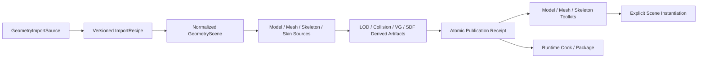

---
related_code:
  - zircon_editor/src/core/asset/type_registry/builtin.rs
  - zircon_editor/src/core/editing/paths.rs
  - zircon_editor/src/ui/host/editor_asset_manager/manager/preview_refresh/generate_preview_artifact.rs
  - zircon_editor/src/ui/retained_host/app/assets/workspace.rs
  - zircon_editor/src/ui/retained_host/app/helpers/model_staging.rs
  - zircon_editor/src/ui/retained_host/app/helpers/animation_assets.rs
  - zircon_editor/assets/ui/editor/asset_browser.zui
  - zircon_editor/assets/ui/editor/components/workbench/modules/extensions/animation/workbench_extension_retarget_workspace.zui
  - zircon_editor/assets/ui/editor/components/workbench/modules/extensions/simulation/workbench_extension_collision_proxy_workspace.zui
  - zircon_runtime/src/asset/assets/model
  - zircon_runtime/src/asset/assets/mesh
  - zircon_runtime/src/asset/importer/ingest/import_gltf.rs
  - zircon_runtime/src/asset/importer/ingest/gltf_labeled_subassets.rs
  - zircon_runtime/src/core/framework/animation/asset/skeleton.rs
  - zircon_runtime/src/graphics/scene/scene_renderer/mesh/build_mesh_draws/build/skinning.rs
  - zircon_runtime/src/scene/components/scene/mesh_renderer.rs
  - zircon_plugins/gltf_importer/runtime
  - zircon_plugins/asset_importers/model/runtime
  - zircon_plugins/virtual_geometry/editor
  - zircon_app/Cargo.toml
plan_sources:
  - docs/plans/optimize/00-engine-wide-review.md
  - docs/plans/optimize/zircon_runtime/04-core-resource-asset-serialization-review.md
  - docs/plans/optimize/zircon_runtime/05-scene-ecs-world-lifecycle-review.md
  - docs/plans/optimize/zircon_runtime/08a-physics-runtime-review.md
  - docs/plans/optimize/zircon_runtime/08c-animation-runtime-review.md
  - docs/plans/optimize/zircon_editor/02-document-transaction-save-autosave-recovery-review.md
  - docs/plans/optimize/zircon_editor/03-scene-prefab-selection-mode-gizmo-picking-review.md
  - docs/plans/optimize/zircon_editor/04-asset-index-import-reimport-catalog-thumbnail-reference-workflow-review.md
  - docs/plans/optimize/zircon_editor/05-inspector-reflection-property-authoring-customization-review.md
  - docs/plans/optimize/zircon_editor/09-background-jobs-admission-scheduling-cancellation-progress-shutdown-product-integration-review.md
  - docs/plans/optimize/zircon_editor/14-animation-sequence-graph-state-machine-timeline-curve-preview-compiler-authoring-review.md
  - docs/plans/optimize/zircon_editor/18-physics-material-rigidbody-collider-joint-collision-profile-cook-ragdoll-debug-authoring-review.md
reference_engines:
  - dev/UnrealEngine/Engine/Source/Editor/StaticMeshEditor/Private/StaticMeshEditor.cpp
  - dev/UnrealEngine/Engine/Source/Editor/StaticMeshEditor/Private/StaticMeshEditorActions.cpp
  - dev/UnrealEngine/Engine/Source/Editor/StaticMeshEditor/Private/SStaticMeshEditorViewport.cpp
  - dev/UnrealEngine/Engine/Source/Editor/SkeletalMeshEditor/Private/SkeletalMeshEditor.cpp
  - dev/UnrealEngine/Engine/Source/Editor/Persona/Private/AnimationEditorPreviewScene.cpp
  - dev/UnrealEngine/Engine/Plugins/Interchange/Runtime/Source/Pipelines/Public/InterchangeGenericAssetsPipeline.h
  - dev/UnrealEngine/Engine/Plugins/Animation/IKRig/Source/IKRig/Public/Retargeter/IKRetargeter.h
  - dev/godot/editor/import/3d/resource_importer_scene.cpp
  - dev/godot/scene/resources/3d/importer_mesh.cpp
  - dev/godot/editor/scene/3d/mesh_editor_plugin.cpp
  - dev/godot/editor/scene/3d/skeleton_3d_editor_plugin.cpp
  - dev/godot/editor/scene/3d/bone_map_editor_plugin.cpp
  - dev/godot/scene/3d/retarget_modifier_3d.cpp
  - dev/Fyrox/fyrox-impl/src/resource/gltf/mod.rs
  - dev/Fyrox/fyrox-impl/src/resource/gltf/surface.rs
  - dev/Fyrox/fyrox-impl/src/resource/fbx/mod.rs
  - dev/bevy/crates/bevy_gltf/src/loader/mod.rs
  - dev/bevy/crates/bevy_mesh/src/mesh.rs
  - dev/bevy/crates/bevy_mesh/src/skinning.rs
  - dev/Graphics/Packages/com.unity.render-pipelines.core/Runtime/GPUDriven/CoreDataSystems/LODGroupDataSystem.cs
  - dev/Graphics/Packages/com.unity.render-pipelines.core/Runtime/GPUDriven/SceneProcessors/LODGroupProcessor.cs
  - dev/Graphics/Packages/com.unity.render-pipelines.universal/ShaderLibrary/LODCrossFade.hlsl
doc_type: review-and-refactor-plan
review_status: review_complete
implementation_status: pending
source_recheck_required: true
---

# 32 · Model / Mesh / Skeleton / Geometry Import / LOD / Collision / Retarget / Preview Authoring 工程化差距

## 1. 结论

Zircon的几何Runtime不是简陋空壳。`MeshAsset`已经表达拓扑、任意attribute、16/32位index、usage、morph target、skin metadata、Mesh SDF和Virtual Geometry；normal/tangent生成、Mesh management record、typed `.zmeta` cook settings、glTF mesh quantization、meshopt、WebP、两套UV、vertex color、PBR材质扩展、texture transform、scene/material/texture/mesh labeled subasset与typed animation clip/skeleton也真实存在。Scene和renderer可以提交direct Mesh、primitive material binding、Morph、CPU/GPU skinning、LOD选择与previous palette。Virtual Geometry和Mesh SDF的cook/runtime基础应保留。

但Editor产品链没有把这些能力组成工程级几何资产工作流。Asset Browser显示“Drop or paste asset source path”，这个TextField却没有事件；`mesh_import_path_edited`只有callback定义和安装，没有production invoke caller。默认`mesh_import_path`为空，因此标准Quick Import按钮会在路径校验处失败。即便从外部注入路径，入口只允许OBJ/glTF/GLB，直接导入并向当前Scene插入一个使用默认材质的Model节点；它没有file picker、drop handler、导入选项、source preview、冲突预检、atomic publish、material mapping、scene selection或reimport diff。

资产语义也存在高风险断裂。核心glTF importer将几何移到Mesh subasset，root `ModelAsset`只保留空`vertices/indices + mesh reference`；但`ModelAsset::overview()`和`render_mesh_descriptors()`只读inline payload，不能解析引用，因而可把有真实几何的模型报告为0顶点、0索引和空bounds。`MeshSkinAsset`注释明确只是过渡结构，仅有inverse bind matrices；Importer把同一mesh遇到的第一个node skin确定性地写入Mesh，无法表达同一mesh的多skin实例。

更严重的是，导入器保存的glTF inverse bind matrices没有进入生产skinning计算。Renderer从`AnimationSkeletonAsset`的local reference pose重新计算`bind_world.inverse()`，再按bone name匹配pose。Skeleton没有stable bone ID、层级/重复名/有限值验证、bind metadata、socket、retarget profile或compatibility signature。导入的glTF Scene又把`animation_skeleton`与所有player字段固定为`None`，Quick Import也只插入Model；因此“导入出Skeleton/Clip subasset”不等于Skinned Scene可以正确播放。

Importer authority同时发生分叉。核心`zircon.builtin.model.gltf`为schema 2、priority 10，支持typed Skeleton/Clip、tangent/color、meshopt和更完整材质扩展；split `gltf_importer.gltf`为schema 1、priority 120，animation只是“not implemented”Data placeholder，skin/IBM还另存generic Data，且不读authored tangent/color。Registry先按availability、再按priority选择；所以该插件只要编译、启用并available，就会覆盖更完整的核心实现。默认`target-client`/`target-editor-host`没有启用base first-party runtime catalog，不能把此覆盖写成默认必现，但产品profile不同会产生不同资产语义，必须消除。

工程化authoring基本缺失。Model、Mesh、AnimationSkeleton虽在ResourceKind和catalog中存在，却没有Asset Toolkit；除Texture外内建thumbnail全是placeholder。Virtual Geometry Editor plugin声明`plugins://virtual_geometry/editor/authoring.zui`，实际包中没有该文件。Retarget与Collision Proxy workspace有完整视觉控件，但动作只返回固定`SK_Mannequin -> SK_Robot`、4 chains、decimator/hull等反馈，没有Retarget asset、bone map、solver、collision cook、artifact或Runtime consumer。Scene LOD只有per-instance distance阈值且Inspector只读；没有asset-level LOD group、reduction、screen-size、hysteresis、crossfade、collision LOD或平台策略。

因此目标不是再加几个静态panel。应建立`GeometryImportSource + versioned ImportRecipe -> normalized GeometryScene -> Model/Mesh/Skeleton/Skin source assets -> derived LOD/Collision/VG/SDF artifacts -> atomic publication receipt -> dedicated toolkits/preview -> explicit scene instantiation`。Import/Reimport、preview和Create Scene Node必须分离；Core与plugin importer只能有一个语义authority；Skin/Skeleton/IBM、LOD、Collision和Retarget均需stable schema、cook receipt与真实Runtime消费。

## 2. 审查边界与证据

### 2.1 当前工作树物理范围

| 子域 | 文件/行数/bytes | 本轮状态 |
|---|---:|---|
| Editor catalog/import/preview/workspaces | 18 / 3,154 / 173,163 | E3逐control/callback/route：Quick Import、toolkit/thumbnail、animation derivation、Retarget与Collision Proxy；2个test attributes |
| Runtime Model/Mesh/import | 26 / 6,066 / 207,724 | E3逐字段/分支：Model/Mesh schema、validation、glTF/OBJ、meshopt、SDF/VG request与registry selection；11个test attributes，4个在途文件 |
| Runtime animation/scene/render/physics handoff | 6 / 1,525 / 56,253 | E3：Skeleton、PhysicsMesh、Scene/World LOD与skinning palette完整路径 |
| Plugin/product assembly | 14 / 3,207 / 111,088 | E3：split glTF/OBJ、STL/PLY/DXF、diagnostic-only formats、VG Editor与feature catalog；7个test attributes，1个在途文件 |
| Focused tests | 8 / 2,739 / 90,313 | E3静态阅读：glTF labels/channels、Mesh validation、OBJ、Scene mesh binding、plugin import与registration；38个test attributes |
| selected combined scope | 72 / 16,691 / 638,541 | 当前工作树fingerprint `54a74f35cea79515b82528bfac2b51e0dff13be71431ab311e8abbbb1a91bfdb`；58个test attributes、0 ignored、5个在途文件 |

5个在途文件为`zircon_app/Cargo.toml`、核心`import_gltf.rs`、`import_mesh.rs`、`model_mesh_subassets.rs`和`primitive_from_indexed_mesh.rs`，均非本轮产生。本报告按读取时当前工作树事实编写；实施前必须重新导出72文件manifest、重算fingerprint并复核Core/plugin importer与Model/Mesh payload关系。

### 2.2 格式与产品装配事实

1. 核心Importer真实支持OBJ、glTF/GLB、`.zmesh`和`.model.toml`；Model plugin真实解析STL、PLY与DXF。
2. Model plugin对FBX、DAE、3DS、USD/USDA/USDC/USDZ只注册`DiagnosticOnlyAssetImporter`，明确要求未提供的NativeDynamic backend。
3. 同一个Model plugin对glTF与OBJ也只作诊断delegator，分别要求split package；核心又内建同格式实现，形成重复provider面。
4. 核心OBJ调用`tobj::load_obj()`后丢弃第二个material结果；split OBJ也没有形成完整Material/Texture subasset与scene binding工作流。Quick Import虽复制同名`.mtl`，Importer并未消费成Zircon Material。
5. Quick Import path validator只允许OBJ/glTF/GLB，使真实STL/PLY/DXF importer没有标准可见入口。
6. 外部`.gltf`因sidecar处理未完成而被拒绝，要求用户手工复制整个目录或改用GLB；外部OBJ/GLB被直接复制到`models`，没有collision、重名、覆盖、source provenance或rollback计划。
7. `target-client`默认是产品default；`target-editor-host`只打开advanced render/navigation/neural相关first-party catalog，没有`first-party-runtime-plugins`。
8. base runtime catalog若显式启用会编译split glTF provider；其priority 120高于核心10并在available时覆盖核心。

### 2.3 静态事实清单

1. Asset Browser的import path TextField没有`events`；全仓唯一`invoke_mesh_import_path_edited`命中是宏生成定义，没有调用者。
2. Import按钮调用`canonical_model_source_path(&chrome.mesh_import_path)`；初始值为空，因此可见标准路径不可操作。
3. Quick Import完成import后立即调用Runtime `import_mesh_asset`修改当前authoring World，import与scene authoring不是两个事务。
4. Scene node使用default project material；glTF primitive material bindings、source scene hierarchy、camera/light和skin均未被Quick Import消费。
5. Editor另外重新用`gltf::import()`解析source，只取`document.skins().next()`，写出同目录`.skeleton.zranim`与`.clip.zranim`；这与核心Importer已经生成的typed labeled subassets重复。
6. 多skin glTF只为第一个skin生成物理sibling skeleton；生成clip以该skeleton映射所有animation，不能证明每条channel兼容。
7. 核心glTF Scene subasset保留node hierarchy与primitive material binding，却把Skeleton和所有Animation player字段固定为`None`。
8. `MeshSkinAsset`只有`inverse_bind_matrices`，没有skin/skeleton reference、joint ordinal mapping、bind pose identity或source node provenance。
9. `mesh_skin_assets_by_mesh()`按mesh index保存首个node skin；同一mesh被不同skin实例化时后续binding静默丢失。
10. Renderer skinning palette完全由Skeleton bind local pose和Animation pose生成；selected production路径没有读取`MeshSkinAsset.inverse_bind_matrices`。
11. Pose以bone name建`HashMap`；duplicate bone name会覆盖，rename会断开，缺失pose bone回退bind transform。
12. `compose_world_matrices()`要求parent先于child并只在渲染时报告missing parent；Skeleton decode本身不验证parent range/order/cycle、duplicate name、TRS finite或rotation有效性。
13. `MeshAsset::validate()`覆盖position存在/格式、attribute长度、index bounds、topology倍数和morph长度；没有finite、weight range/normalization、joint bounds、degenerate geometry、duplicate morph name或skin/IBM count验证。
14. Core glTF root Model primitive只有空inline payload和Mesh reference；Model overview/bounds/descriptor不resolve Mesh reference。
15. Resource streamer的Model management overview直接调用该inline-only `overview()`，因此错误统计不是只限Editor显示。
16. `ModelPrimitiveAsset`同时允许inline geometry和Mesh reference，没有规定exactly-one、mirror或authority优先级。
17. Model没有material slot stable ID、section identity、source node/mesh ID、import recipe、skeleton/skin binding、socket、collision setup或LOD group。
18. glTF morph target名称被生成为`MorphTarget{index}`，没有消费源mesh target names或stable channel ID。
19. `primitive_from_indexed_mesh()`对缺失normal生成，对短normal数组补零；缺失tangent用固定X tangent，不是按UV生成MikkTSpace结果。
20. VG用joint index的两个slot保存vertex ordinal；skinned primitive被禁止自动VG，表明当前vertex schema在两个功能间复用语义通道。
21. Mesh SDF和VG都有typed、bounded、opt-in import settings，这是正确基础；Editor没有编辑/比较/重导入这些settings的产品面。
22. Scene LOD只是一组`min_distance + model/mesh/material/primitives`，按camera到entity transform origin距离选最大满足阈值项。
23. LOD没有bounds/screen coverage、projection、hysteresis、crossfade/dither、forced LOD、quality/platform override或streaming residency coordination。
24. Inspector把`lods`作为只读List，Importer始终写空LOD，仓内没有simplification/reduction/LOD cook authoring。
25. `PhysicsMeshAsset`只有TriangleMesh/HeightField payload；没有从Render Mesh生成PhysicsMesh的生产converter/cooker、simple primitive fit或convex decomposition。
26. 内建physics backend不支持TriangleMesh/HeightField/Compound，依赖Jolt等backend；几何Editor没有显示目标backend资格。
27. Mesh SDF是render/lighting derived data，不能自动等同于collision geometry或physics material assignment。
28. Collision Proxy workspace字段和按钮最终只导航/返回fixed feedback，没有source asset、cook job、artifact、preview diff或Scene collider install。
29. Retarget workspace中skeleton、chain、solver、preview/apply都是fixture；Runtime/plugin没有Retarget asset、IK Rig、Bone Map、profile、solver或consumer。
30. Model/Mesh/Skeleton只有catalog presentation，无built-in toolkit；thumbnail均走placeholder生成。
31. 全仓没有production ModelEditor/MeshEditor/SkeletonEditor/mesh preview scene、orbit camera、UV/wireframe/normals/bounds/LOD/collision/bone/morph/animation inspection产品。
32. Virtual Geometry Editor注册的`plugins://virtual_geometry/editor/authoring.zui`文件不存在；测试只断言descriptor/command/menu，不验证模板加载与功能。

### 2.4 动态证据边界

此前`zircon_editor --lib`测试编译在617.2秒后被239个既有错误和122个warning阻断。本轮没有重复同一未变化lane，也没有运行Importer corpus、malformed/fuzz、Model/Mesh toolkit、skinned render、LOD切换、collision cook、retarget solver、VG Editor模板加载或跨平台cook。58个test attributes仅表示selected source存在静态测试，不能证明Quick Import可输入路径、glTF skinning正确、split provider等价、placeholder workspace可执行或FBX/USD可用。

### 2.5 参考边界

- Unreal Static Mesh Editor具备UV、bounds、simple/complex collision、socket、Nanite fallback、distance field、LOD生成/保存、material bake与多种reimport动作；Skeletal Mesh/Persona提供独立preview scene与骨架选择。Interchange用pipeline/factory node表达offset、scale、mesh/skeleton/animation/material option、reimport strategy与conflict。Zircon应学习source/recipe/artifact/editor分层，不复制UObject包模型。
- Unreal IK Retargeter是正式资产，持有source/target IK Rig、preview mesh、retarget pose、chain mapping、operation stack、profile与override。Zircon当前固定文本workspace与此不在同一完成度层级。
- Godot `ResourceImporterScene`和`ImporterMesh`提供import option/post-import、surface/material/blend shape/LOD/shadow mesh/lightmap unwrap/collision；Mesh、Skeleton、Bone Map各有真实Editor plugin，Retarget Modifier消费Skeleton Profile/Bone Map。其结构证明这些能力不应塞进一个Quick Import按钮。
- Fyrox本地代码具有真实FBX与glTF、`ModelImportOptions`、material search、linked graph、animation、skin/bone surface assignment、blend shape与normal/tangent处理。它不是本轮完整Editor目标，但可作为多格式和场景集成最低参照。
- Bevy用于校验typed glTF labels/assets、Mesh attribute、skinning与morph运行时数据设计；它不是专用Model/Skeleton Editor产品标杆，不能据此降低Editor要求。
- Unity Graphics本地范围只提供GPU-driven LOD group data/scene processing和URP LOD crossfade shader。本文只用它校验Runtime LOD数据与crossfade，不推测未收录的Unity Model Importer或Editor功能。

## 3. 必须保留的真实基础

1. 保留`MeshAsset`的typed attribute/index/topology、morph、usage、SDF和VG结构，并扩展validation，不退回固定`MeshVertex`唯一authoring格式。
2. 保留core glTF对meshopt、quantization、WebP、材质扩展、texture transform、typed scene/material/texture/mesh/skeleton/clip subasset的实现。
3. 保留Importer registry的availability、priority、suffix和slot稳定选择规则；通过provider资格与唯一语义authority修正使用方式。
4. 保留Model/Mesh stable AssetReference、labeled subasset、dependency与reference repair基础。
5. 保留normal/tangent生成模块，但把import policy、算法版本和source-authored/derived provenance写入recipe/artifact。
6. 保留Mesh SDF和Virtual Geometry的typed opt-in/bounded settings、cook和runtime consumer；Editor只增加recipe/preview/qualification。
7. 保留Renderer的direct Mesh path、morph payload、CPU/GPU skinning、previous palette/history和Scene primitive binding。
8. 保留Scene source/component/project IO边界，但将LOD从只读临时列表升级为引用typed LOD artifact的实例policy。
9. 保留Physics backend-neutral `PhysicsMeshAsset`，补正式converter/cook artifact与backend capability，不让Editor直接生成backend对象。
10. 保留Editor04 catalog/import/reimport、Editor02 transaction、Editor09 jobs和Editor14 animation preview owner；Geometry Editor必须接入现有owner而非另建平行保存/任务系统。
11. 保留plugin manifest/capability/package装配，但禁止插件用高priority静默替换语义不等价的核心Importer。
12. 保留STL/PLY/DXF当前真实解析器，同时对FBX/DAE/3DS/USD维持明确DiagnosticOnly状态，直到backend和qualification真实存在。

## 4. 目标架构与Owner边界

| 领域 | 唯一owner | Editor32消费/提供 |
|---|---|---|
| source、catalog、import/reimport、dependency | Editor04 + Runtime Asset | Geometry source、recipe、normalized outputs、conflict/diff与publication receipt |
| document transaction/save/recovery | Editor02 | toolkit设置、socket/collision/LOD/retarget source的transaction adapter |
| job/admission/progress/cancel | Editor09 + Runtime cook service | parse/normalize/reduce/collision/VG/SDF异步job与terminal receipt |
| Mesh/Model/Skin/Skeleton schema | Runtime Asset + Animation | stable IDs、validation、compatibility、reference与serialization |
| GPU render/LOD/skinning/VG | Graphics | qualified artifact消费、screen-size selection、crossfade、skin palette contract |
| collision artifact/backend | Runtime Physics + selected plugin | render-mesh转换、simple/convex/triangle policy、backend qualification |
| animation/retarget/preview | Animation runtime + Editor14 | Skeleton/BoneMap/Retarget资产、solver/compiler和共享preview scene |
| toolkit/viewport/commands | Editor32 + Editor03/08 | Model/Mesh/Skeleton inspection、authoring、preview与显式scene insertion |
| cook/package/DDC | Tooling03/08 | importer/cooker version、platform artifact、cache key与qualification |

## 5. P0：必须先关闭的架构与正确性缺口

### P0-1：Quick Import可见输入面没有生产事件链

TextField没有event，callback没有invoke caller，默认值为空，按钮必经empty path失败。先移除伪可用状态或接正式file dialog/drop/source selection；任何import必须通过Editor04 request、Editor09 job、preview/conflict与terminal receipt，不能用隐藏状态注入通过测试。

### P0-2：Core与split glTF Importer语义分裂且高priority可覆盖完整实现

冻结一个canonical glTF semantic implementation与schema版本。split package只能包装同一implementation或提供严格superset，并以golden manifest证明Model/Mesh/Scene/Material/Texture/Skeleton/Clip、channels/extensions/settings完全一致；不等价provider不得共享matcher并靠priority选择。

### P0-3：Skin/Skeleton/IBM合同错误且导入Scene不安装动画绑定

引入独立Skin asset与per-node skin binding，保存joint-to-bone stable mapping和authored IBM。Renderer必须消费qualified Skin binding，不能无条件从Skeleton pose重建；glTF Scene entity生成Skeleton/skin/player或明确可诊断的未绑定状态，多skin/多root/duplicate-name均有拒绝或确定语义。

### P0-4：Model root引用Mesh后overview/descriptor仍只读空inline payload

冻结Model primitive authority：要么inline，要么Mesh reference，禁止含混mirror。所有overview、bounds、management、preview和render descriptor通过resolver得到同一qualified Mesh facts；未解析引用返回typed unavailable/stale，而不是0顶点/空bounds伪事实。

### P0-5：没有Geometry Toolkit与可执行LOD/Collision/Retarget authoring

在Model/Mesh/Skeleton toolkit与共享preview scene成立前，Retarget/Collision/VG静态workspace不得宣称可用。建立typed LOD、Collision Setup、Bone Map/Retarget source与cook/apply receipt；修复或禁用缺失`authoring.zui`的VG Editor contribution。

## 6. P1：Import Source、Recipe、Reimport 与发布事务

### P1-1：缺少Geometry Import Source身份

Catalog保存source URI、content digest、format、provider、provider version、platform-independent decode version与dependency closure；外部源复制后仍保留origin/provenance，不把项目内目标路径冒充原始source。

### P1-2：缺少版本化Import Recipe

Recipe表达scene/mesh/animation选择、unit/axis/handedness、transform bake、normal/tangent、weld、material、skin、morph、LOD、collision、VG/SDF和naming policy，并进入`.zmeta`、diff、cache key与cook receipt。

### P1-3：file picker、drop与paste不是同一source request

三种入口统一生成typed request，验证project/session、path/URI、format capability与read lease。TextField editing不得直接复制文件或修改World。

### P1-4：外部sidecar staging不完整

Importer先发现glTF buffers/images、OBJ MTL/textures与format-specific dependencies，生成copy/link/embed plan和冲突列表，再原子stage。禁止只复制一个主文件或悄悄忽略MTL copy失败。

### P1-5：目标命名与覆盖策略缺失

提供stable asset IDs、sanitized names、subasset labels、target folder、collision policy和user rename map。重复import不能按文件名覆盖未知资产，cancel/failure清理临时产物。

### P1-6：Import与Scene插入耦合

Import只发布资产；“Add to Scene”是独立Editor03 command，用户选择root scene/subscene/model/mesh和material policy。两者各自可撤销、可失败、可重试。

### P1-7：没有import preview与selection tree

预览normalized scene hierarchy、meshes/primitives/materials/textures/skins/animations/cameras/lights、counts、bounds和warnings，允许include/exclude与rename；preview generation绑定source+recipe generation。

### P1-8：没有结构化diagnostics

Parse/normalize/validate/cook以code、severity、source object/path、byte/JSON location、affected output、fix和provider identity报告；不能把所有失败压成一条String。

### P1-9：reimport缺三方diff

比较old source snapshot、new normalized source与当前authored asset overrides，分类add/remove/rename/topology/material/skeleton变化；用户可预览，policy决定保留、迁移或阻断。

### P1-10：atomic publication缺失

所有root/subasset/dependency/derived artifact先在staging generation完成验证，再一次提交catalog generation；失败保留旧qualified generation，不能先写skeleton文件再让model import失败。

### P1-11：Importer capability与产品profile未预检

打开Import对话前列出real/diagnostic-only/unavailable、format/schema/version/target/platform；FBX/USD等无backend时禁用并给安装要求，不能到click后才报统一错误。

### P1-12：批量与headless Import无统一合同

Editor、commandlet、cook、CI和batch reimport共享recipe、provider selection、artifact manifest与receipt。UI不得有只存在于host helper的第二套glTF animation生成逻辑。

## 7. P1：Model、Mesh、Material、Morph 与几何数据合同

### P1-13：Model primitive authority含混

定义`InlineGeometrySource`仅用于authoring/legacy migration，shipping Model引用stable Mesh/section assets；serialization和validator拒绝空inline+missing ref、双payload不一致与悬空ref。

### P1-14：Model缺stable node/mesh/primitive identity

保存source node ID、mesh ID、primitive ID与persistent asset ID，支持rename/reorder后的reimport匹配。数组ordinal只能作展示，不能作长期引用。

### P1-15：material slot与section合同缺失

Model/Mesh定义stable section、slot name、default material、source material ID和override compatibility；Scene instance只保存差异，不用“第一个primitive material + default material”替代完整mapping。

### P1-16：overview需要resolver与资格

建立resolved Model overview artifact，记录Mesh generation、bounds、topology/count、skin/morph/LOD/collision facts和failure。Catalog/streamer/toolkit消费同一artifact。

### P1-17：Mesh finite与范围验证不完整

验证positions/normals/tangents/UV/colors/weights/morph为finite，normal/tangent可归一化，weights非负且sum policy明确，joint index可解析，bounds不溢出，diagnostics定位attribute/vertex。

### P1-18：degenerate与topology质量诊断缺失

检测zero-area、duplicate triangle、non-manifold、winding、NaN、extreme aspect、unused vertex和index locality；将错误、warning与optional repair区分，repair写入recipe和artifact provenance。

### P1-19：normal/tangent provenance缺失

区分authored/preserved/recomputed，冻结crease/smoothing group、weighted normal、MikkTSpace、UV channel与degenerate policy。固定fallback tangent只能用于显式diagnostic fallback，不能默默成为shipping数据。

### P1-20：vertex schema复用joint slot保存VG ordinal

Virtual Geometry cluster/vertex remap使用独立derived buffer或semantic channel，不能占用skinning joint字段。这样skinned VG能力才能演进且validator不需猜通道意义。

### P1-21：Morph identity与范围不完整

消费source target name并生成stable morph ID；验证duplicate、vertex count、finite delta、normal/tangent policy、default weight与animation channel映射，reimport保留rename redirect。

### P1-22：Mesh usage没有build/runtime策略闭环

把static/dynamic/readback、CPU copy、deformation、streaming、ray tracing/VG/SDF需求编入artifact layout selection；Editor显示estimated memory与不兼容组合。

### P1-23：OBJ material链被丢弃

解析MTL、texture dependencies、material slots、missing asset diagnostics与color space；若暂不支持，Importer必须明确输出“geometry-only”capability并阻断声称完整Model import。

### P1-24：format parity没有golden corpus

为Core/plugin/OBJ/glTF/STL/PLY/DXF建立共享corpus，比较normalized manifest、geometry hash、materials、skin、animation、diagnostics和derived settings；同matcher provider必须bit/semantic equivalent。

## 8. P1：Skeleton、Skin、Animation Binding 与 Retarget

### P1-25：Skeleton bone没有stable identity

每个bone保存stable ID、source ID、name、parent ID与reference local/global pose；name用于显示和redirect，不能作为pose与animation唯一join key。

### P1-26：Skeleton decode无结构验证

验证parent存在、acyclic、拓扑排序/任意排序解析、root policy、duplicate ID/name、finite TRS、normalized quaternion和invertible bind；失败在import/cook前终止。

### P1-27：Skin必须成为独立资产

Skin保存Skeleton reference、ordered joint stable IDs、authored inverse bind matrices、mesh bind transform、source skin ID与validation digest；Mesh只引用compatible Skin或由Scene node绑定。

### P1-28：同Mesh多Skin实例不可表达

Skin binding属于node/instance或明确variant，不属于唯一Mesh metadata。Importer不得first-wins；共享geometry可被多个Skin binding复用。

### P1-29：IBM与reference pose authority未冻结

定义palette公式、coordinate space和mesh/node transforms；优先使用authored IBM，缺失时从validated reference pose生成并写provenance。两者不一致时给阈值诊断或阻断。

### P1-30：Animation channel绑定不能靠bone name

Clip track绑定Skeleton stable bone ID，import时保留source node mapping；rename用redirect，duplicate names不丢track。兼容性由Skeleton signature验证。

### P1-31：glTF Scene未安装Skeleton/player

按node skin与animation selection生成typed Scene skeleton/mesh binding；默认不应自动播放所有clip，但preview和Scene instance必须能明确选择clip/graph/player并报告缺失。

### P1-32：Editor sibling animation derivation重复Importer authority

删除host私有二次parse/write；核心Importer一次产出所有typed Skeleton/Skin/Clip labeled subassets，用户选择promote/rename为独立资产时走正式transaction与reference rewrite。

### P1-33：Skeleton socket/attachment缺失

定义stable socket asset/record，绑定bone ID、local transform、tags与preview mesh；Scene attachment和animation runtime消费同一contract，不能用fixture `LootSocket`字符串替代。

### P1-34：Bone Map/Skeleton Profile缺失

建立版本化human/creature/custom profile、semantic bone/chain、required/optional规则、reference pose与validation；Godot BoneMap/Profile可作轻量数据参照。

### P1-35：Retarget资产与solver/compiler缺失

Retarget source引用source/target Skeleton/Profile、chain map、poses、root/scale/translation policy、solver operation stack和version；compile生成runtime/bake artifact与diagnostics。

### P1-36：Retarget Preview/Apply是固定反馈

Preview运行真实solver，显示source/target同步、error heatmap、root trajectory、foot lock/chain warnings；Apply是生成新Clip或配置Runtime retarget的transaction，返回artifact ID，不改字符串状态。

## 9. P1：LOD、Collision、Derived Data 与运行时资格

### P1-37：LOD应是资产级typed group

定义LODGroup source，包含base mesh、custom/generated levels、stable level IDs、material remap、screen coverage threshold、hysteresis/crossfade和platform/quality policy；Scene instance只保存override。

### P1-38：distance-to-origin LOD选择不可靠

使用bounds projected screen size、camera projection与scale；处理orthographic、multiple views、shadow/reflection passes和large/offset meshes。CPU/GPU selection结果必须一致。

### P1-39：LOD没有hysteresis与crossfade

保存previous level与transition state，避免threshold抖动；Graphics实现dither/crossfade、motion/history语义和material capability，参考Unity Graphics只限Runtime实现。

### P1-40：LOD reduction没有cook service

提供deterministic simplifier provider、target triangle/error/silhouette/UV/skin/morph/section constraints、version与bounded job；结果为derived artifact而非破坏base Mesh。

### P1-41：custom LOD import/reimport缺失

允许每level独立source或source naming rule，验证bounds/material/skeleton/morph兼容；reimport diff可只更新指定level并保留其他authored level。

### P1-42：LOD与streaming/VG没有统一策略

Classic LOD、Virtual Geometry hierarchy、fallback mesh和residency共享RenderGeometryPolicy；平台cook选择实现，Editor显示实际target artifact，不能把VG内部`lod_level`冒充asset LOD。

### P1-43：Collision Setup缺正式schema

定义simple shapes、convex hulls、complex mesh、heightfield、collision LOD、physics material、channel/filter与source provenance；Model/Mesh引用setup，Scene Collider引用qualified PhysicsMesh artifact。

### P1-44：render mesh到PhysicsMesh无converter

建立triangle extraction、weld/clean、scale/axis、index validation和backend-neutral cook；结果带source mesh generation、settings、bounds、counts与hash。

### P1-45：simple primitive与convex decomposition缺失

支持box/sphere/capsule/k-DOP/convex hull及可选VHACD类provider，参数有预算、determinism和质量指标；失败保留旧artifact并可视化差异。

### P1-46：Physics backend资格未进入authoring

Cook/preview前验证TriangleMesh/HeightField/Compound、dynamic/static restrictions与target backend；内建backend不支持的shape不能显示为已完成。

### P1-47：Mesh SDF不能替代Collision

UI、schema、artifact kind和debug view明确区分render distance field与physics geometry；允许未来SDF collision provider，但必须有独立capability和误差/性能资格。

### P1-48：Derived data key与失效关系不完整

LOD/Collision/VG/SDF key包括normalized Mesh digest、recipe subset、provider/tool version、target/platform和schema；source或relevant setting变化只失效对应artifact，并通过Editor09/DDC报告。

## 10. P1：Toolkit、Preview、可观测性与规模资格

### P1-49：Model Toolkit缺失

提供scene tree、primitive/material/skin/animation选择、source/reimport、statistics、dependencies、derived artifacts、save/revert和显式Add to Scene；不把当前Level当预览器。

### P1-50：Mesh Toolkit缺失

提供orbit/focus、wireframe、bounds、normals/tangents、UV channels、vertex color、skin weights、morph、LOD、collision、VG/SDF和memory/quality面板。

### P1-51：Skeleton Toolkit缺失

显示hierarchy、reference/animated pose、bone axes/names/weights、socket、compatible meshes/clips、profile与retarget；选择和编辑使用stable IDs与Editor02 transaction。

### P1-52：共享Preview Scene缺失

Editor14与Geometry toolkits共享isolated world、camera、lighting environment、floor/grid、animation clock、selection/debug draw和resource lifetime；不能复制三个mock viewport。

### P1-53：thumbnail全部placeholder

Model/Mesh用bounded offscreen render artifact，Skeleton使用preview mesh或明确骨架glyph；thumbnail key含asset/derived generation、style/environment version并可取消、限流、失败诊断。

### P1-54：preview没有资格与stale状态

显示source/recipe/artifact generation，后台reimport时保持旧qualified preview并标stale；新artifact失败不切空白或显示旧图冒充当前。

### P1-55：Virtual Geometry Editor模板缺失

package validation必须检查所有`plugins://`文档存在、可解析、bindings/routes可满足；缺失模板使plugin qualification失败并从菜单移除，不允许descriptor-only测试通过。

### P1-56：commands、menus与WhenClause缺失

注册Reimport、Open Source、Generate LOD、Edit Collision、Preview LOD/Collision/Skin、Retarget、Save/Revert等typed commands；按selection、asset state、job、capability与read-only状态启用。

### P1-57：没有资产健康与可观测性

Catalog/Toolkit显示triangles/vertices/sections/bounds、GPU/CPU bytes、skin bones/influences、morphs、LODs、collision hulls、derived residency和last cook/import receipts，禁止空Model overview写0冒充健康。

### P1-58：没有fault/cancel/recovery矩阵

覆盖malformed source、missing sidecar、provider crash、disk full、rename conflict、cancel each phase、stale reimport、corrupt cache、GPU preview loss和Runtime restart；每个request只有一个terminal receipt且旧generation可用。

### P1-59：没有大资产规模预算

冻结source bytes、nodes/meshes/primitives/vertices/indices/bones/morphs/animations/textures、decode memory、job wall time、preview GPU memory和diagnostic count/bytes上限；超限可诊断拒绝，不OOM或UI阻塞。

### P1-60：没有跨平台质量与性能资格

建立Windows/Linux、Editor/Client/Server、Core/plugin、CPU/GPU skinning、Classic/VG LOD、physics backend和cook/package矩阵；记录import/reimport time、peak RSS、artifact size、draw/skin/LOD成本与visual/geometry golden。

## 11. P2：完整性、扩展性与高级能力

### P2-1：USD scene composition与variant/layer policy

Native backend成立后支持layer、variant、payload/reference与material binding的显式subset，不能把USD降成一次性三角网格导入。

### P2-2：CAD tessellation profile

为曲面格式提供chord/angle/edge tolerance、unit、sew/heal、part hierarchy与instance preservation，并记录tessellator version。

### P2-3：Geometry processing graph

在稳定recipe/cook基础上提供可复用weld、repair、generate UV、reduce、collision、bake节点图；节点必须content-addressed、deterministic并共享job/DDC。

### P2-4：Mesh editing与non-destructive modifiers

支持受控vertex/section/attribute编辑、modifier stack与source rebase；不把二进制Mesh直接原地改写成不可重导入状态。

### P2-5：UV unwrap、packing与lightmap qualification

提供channel生成/验证、island overlap/padding/texel density和platform bake artifact，与lighting bake owner衔接。

### P2-6：Skin weight painting与骨架编辑

在stable Skin/Skeleton schema后提供weight normalize/prune/mirror、bone add/reparent和reference pose编辑，所有操作可撤销并触发兼容性诊断。

### P2-7：Mesh merge、instancing与HLOD

建立World Partition/HLOD owner下的merge proxy、material bake、cluster与streaming artifact，不把它混入单资产LOD按钮。

### P2-8：Remote/distributed geometry cook

基于Tooling08 immutable inputs和DDC扩展reduction/collision/VG/SDF remote execution，校验toolchain、provider签名和artifact provenance。

### P2-9：Runtime retarget与motion adaptation

在baked retarget正确后提供bounded runtime retarget、LOD与cache策略，profile/solver artifact可热换但必须generation-qualified。

### P2-10：Geometry diff与团队审查

用stable node/section/bone/morph IDs显示source/reimport差异，生成可分享的preview capture、metrics与artifact report，集成Source Control submission。

### P2-11：Import plugin SDK与conformance kit

发布normalized scene writer、diagnostic、recipe schema、streaming reader和golden corpus；第三方provider必须通过resource/cancel/fault/security与semantic parity门禁。

### P2-12：跨引擎任务基准

以导入复杂角色、重映材质、生成LOD/Collision、调weight、retarget、reimport保留override和cook为任务，比较正确性、操作数、延迟、内存与artifact，而非静态截图数量。

## 12. 当前Authority与断路清单

| 当前对象/表面 | 当前真实authority | 断路 | 目标authority |
|---|---|---|---|
| Quick Import path | 无caller的host callback + empty chrome state | TextField不产生value | Geometry Import Source request |
| Import button | host同步stage/import/scene insert | 无preview/recipe/transaction separation | Editor04 import publication + Editor03 insert command |
| core glTF | 更完整schema 2 importer | 可被高priority split provider替换 | canonical normalized glTF implementation |
| split glTF | schema 1 plugin importer | animation placeholder、channel/extension差异 | 同canonical implementation的package adapter |
| Model root | Mesh references + empty inline primitives | overview/descriptor只读inline | resolved Model artifact |
| Mesh skin | Mesh内一个IBM vector | 无Skeleton/joint mapping，多skinfirst-wins | independent Skin asset + node binding |
| Renderer palette | Skeleton pose反推bind inverse | 不消费authored IBM | qualified Skin/Skeleton palette contract |
| imported Scene | hierarchy/mesh/material binding | Skeleton/player固定None | typed skinned scene binding |
| Editor animation derivation | first skin sibling files | 重复Importer、忽略多skin | promote canonical labeled subassets |
| Scene LOD | per-instance distance list | 只读、无cook/crossfade | LODGroup source/artifact + instance policy |
| Collision Proxy | static ZUI/fixed feedback | 无PhysicsMesh cooker | CollisionSetup + cook receipt |
| Retarget | static ZUI/fixed feedback | 无asset/solver/runtime | Retarget source/compiler/preview |
| Model/Mesh/Skeleton preview | placeholder thumbnail | 无toolkit/isolated preview | shared qualified Preview Scene |
| VG Editor plugin | descriptor指向缺失ZUI | package仍可注册 | package content qualification |

## 13. 分层重构里程碑

### M0：Truthfulness、Provider与数据正确性止血

禁用无event的Quick Import输入、缺模板VG surface和fixture Retarget/Collision动作；冻结canonical glTF provider；为Model empty-overview、Skin/IBM未消费和Skeleton验证建立失败测试与migration decision。

### M1：Geometry Source、Recipe、Normalized Scene与Atomic Import

交付source identity、dependency discovery/staging、versioned recipe、structured diagnostics、normalized scene、preview selection和atomic root/subasset publication；删除host二次glTF parse。

### M2：Model/Mesh Authority、Validation与Material Sections

硬切Model inline/ref contract，建立resolved overview、stable node/primitive/section/material slot、finite/quality validation、normal/tangent provenance和Morph IDs。

### M3：Skeleton/Skin/IBM与Scene Binding

引入stable bone IDs、validated Skeleton、independent Skin、authored IBM palette、multi-skin node binding、Clip track stable mapping和imported Scene skeleton/player选择。

### M4：Dedicated Toolkits、Shared Preview与Real Thumbnails

交付Model/Mesh/Skeleton toolkits、isolated preview scene、inspection/debug modes、source/reimport/save/revert、bounded thumbnails与explicit Add to Scene。

### M5：LOD Source、Reduction、Runtime Selection与Crossfade

建立LODGroup/custom/generated levels、deterministic reduction、screen-size/hysteresis/crossfade、Classic/VG/fallback policy和streaming coordination。

### M6：Collision Setup、Cook、Backend Qualification与Preview

建立simple/convex/triangle/heightfield source、Render Mesh converter、decomposition provider、PhysicsMesh artifact、target backend preflight和真实debug preview。

### M7：Bone Map、Retarget Source、Solver与Apply

交付Skeleton Profile/Bone Map、Retarget source/operation stack、compile artifact、同步preview/error diagnostics，以及bake Clip或Runtime config的transactional Apply。

### M8：格式、Fault、规模、DDC与跨平台资格

以共享corpus验证Core/plugin/OBJ/glTF/STL/PLY/DXF，加入malformed/fuzz/cancel/recovery、大资产预算、DDC、Editor/Client/Server和physics/render backend矩阵。

### M9：Native格式、CAD/USD、高级处理与团队工作流

在M0-M8门禁后接FBX/DAE/3DS/USD NativeDynamic、CAD tessellation、UV/weight editing、processing graph、HLOD、remote cook与geometry diff review。

## 14. 验收门禁

| Gate | 必须证明的事实 |
|---|---|
| G01 | Asset Browser file picker/drop/paste均产生typed source request，空路径按钮不可执行 |
| G02 | import不修改Scene；Add to Scene是独立可撤销命令 |
| G03 | source dependency discovery覆盖glTF sidecar、OBJ MTL/texture并有原子staging/rollback |
| G04 | recipe含unit/axis/normal/tangent/material/skin/LOD/collision/VG/SDF且进入cache key |
| G05 | import preview选择与最终published output manifest逐项一致 |
| G06 | root/subasset/derived publication原子，失败保持旧qualified generation |
| G07 | Core与所有available glTF provider通过同一corpus并输出semantic-equivalent manifest |
| G08 | product profile的Importer selection、schema/version/capability可见且可重现 |
| G09 | Model primitive只有一个geometry authority，invalid dual/empty payload被拒绝 |
| G10 | referenced Mesh的Model overview/bounds/count与resolved Mesh一致，未解析不写0伪事实 |
| G11 | material section/slot stable ID经rename/reorder/reimport保持Scene overrides |
| G12 | Mesh finite、topology、index、attribute、skin weight/joint、morph验证覆盖malformed corpus |
| G13 | normal/tangent authored/derived provenance与算法版本可追溯且visual golden通过 |
| G14 | VG不再占用joint semantic，skinned/non-skinned vertex schema均可验证 |
| G15 | Skeleton parent/cycle/root/duplicate/TRS/rotation验证在import/cook前执行 |
| G16 | Skin引用Skeleton并保存joint stable mapping、authored IBM与mesh bind transform |
| G17 | 同一Mesh的多Skin node实例正确，first-wins路径删除 |
| G18 | CPU/GPU skinning消费同一qualified palette，authored IBM golden匹配 |
| G19 | Clip按bone stable ID绑定，duplicate name/rename不丢track |
| G20 | imported skinned Scene拥有可解析Skeleton/Skin/player选择并能在Preview播放 |
| G21 | host sibling animation二次parse/write路径删除，promote走正式transaction |
| G22 | LODGroup支持custom/generated levels、screen threshold、hysteresis/crossfade与platform policy |
| G23 | CPU/GPU/multi-view LOD选择一致，large offset bounds不按origin误选 |
| G24 | reduction provider deterministic、bounded、可取消，失败保留旧LOD artifact |
| G25 | CollisionSetup可生成simple/convex/triangle/heightfield PhysicsMesh并记录source generation |
| G26 | target physics backend不支持的shape在authoring/cook前明确阻断 |
| G27 | Mesh SDF与Collision artifact在schema/UI/debug/cook中不可混淆 |
| G28 | Retarget source/profile/chain/pose/solver产出真实preview与compile/apply receipt |
| G29 | Model/Mesh/Skeleton toolkit共享isolated Preview Scene，状态不污染当前Level |
| G30 | thumbnail绑定asset/derived generation，stale/failure/cancel状态明确且有资源预算 |
| G31 | missing sidecar/provider crash/disk full/cancel/stale reimport/corrupt cache均唯一终态且可恢复 |
| G32 | Windows/Linux、Editor/Client/Server、render/physics provider的import/cook/visual/perf矩阵达标 |

## 15. 禁止的临时修补

1. 禁止只给Import Path TextField补一个字符串callback就宣称Geometry Import完成。
2. 禁止继续在import成功后自动向当前Scene插入节点。
3. 禁止以提高/降低priority掩盖两套glTF实现的语义差异。
4. 禁止让Core与plugin复制同一解析代码并靠测试数量声称等价。
5. 禁止继续让Model同时保存inline geometry和Mesh reference而无authority规则。
6. 禁止把unresolved referenced Mesh统计成0顶点、空bounds或健康资产。
7. 禁止继续把第一个node skin写进共享Mesh并忽略后续skin。
8. 禁止保存inverse bind matrices却让Renderer完全不消费且无diagnostic。
9. 禁止用bone name作为Animation/Skin/Retarget唯一长期身份。
10. 禁止把Mesh SDF、VG internal LOD或render fallback命名成Collision/asset LOD完成度。
11. 禁止用固定SK_Mannequin、4 chains、decimator/hull反馈冒充Retarget/Collision执行。
12. 禁止注册指向不存在ZUI的Editor plugin并只用descriptor测试验收。

## 16. 本轮产出边界

本轮只完成72文件的静态review、参考引擎对照、目标架构、差距分级、M0-M9重构路线与32个验收门，没有修改Rust/TOML/ZUI生产实现或tests，没有新增Importer/Toolkit/Preview，也没有声称动态测试通过。后续实施必须从M0重新冻结当前5个在途文件与provider feature图，先关闭可见伪功能、双glTF authority、Model空overview和Skin/IBM数据正确性，再进入功能扩展。
