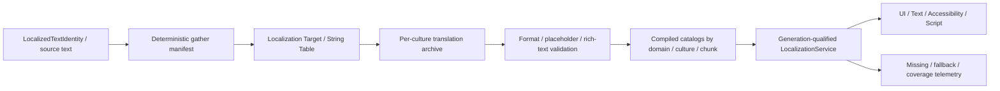

---
related_code:
  - zircon_editor/src/core/i18n
  - zircon_editor/assets/i18n/en.toml
  - zircon_editor/assets/i18n/zh-CN.toml
  - zircon_editor/src/core/context/builder.rs
  - zircon_editor/src/core/settings/defaults.rs
  - zircon_editor/src/core/notifications/presentation.rs
  - zircon_editor/src/ui/asset_editor/session/resolver_state.rs
  - zircon_editor/src/ui/asset_editor/session/runtime_report_state.rs
  - zircon_editor/src/ui/asset_editor/session/preview_compile.rs
  - zircon_editor/src/ui/retained_host/app/ui_asset_editor/actions/mode_preview/locale.rs
  - zircon_runtime_interface/src/ui/template/asset/localization
  - zircon_runtime/src/ui/template/asset/localization
  - zircon_runtime/src/ui/template/asset/compiler/component_props.rs
  - zircon_runtime/src/ui/template/asset/compiler/package/manifest.rs
  - zircon_runtime/src/ui/surface/render/resolve.rs
  - zircon_runtime/src/text/language.rs
  - zircon_runtime/src/text/font/composite_resolve.rs
  - zircon_runtime/src/asset/assets/font.rs
  - zircon_runtime_interface/src/resource/marker.rs
  - tools/editor-workbench-preview/design.js
plan_sources:
  - docs/plans/optimize/00-engine-wide-review.md
  - docs/plans/optimize/zircon_runtime/04-core-resource-asset-serialization-review.md
  - docs/plans/optimize/zircon_runtime/11a-runtime-ui-architecture-tree-layout-input-accessibility-review.md
  - docs/plans/optimize/zircon_runtime/11b-runtime-text-font-shaping-layout-editing-ime-review.md
  - docs/plans/optimize/zircon_editor/02-document-transaction-save-autosave-recovery-review.md
  - docs/plans/optimize/zircon_editor/04-asset-index-import-reimport-catalog-thumbnail-reference-workflow-review.md
  - docs/plans/optimize/zircon_editor/09-background-jobs-admission-scheduling-cancellation-progress-shutdown-product-integration-review.md
  - docs/plans/optimize/zircon_editor/12-settings-preferences-scope-persistence-locale-i18n-appearance-plugin-extensibility-review.md
  - docs/plans/optimize/zircon_editor/23-ui-asset-hud-widget-binding-theme-icon-accessibility-menu-flow-font-atlas-authoring-review.md
reference_engines:
  - dev/UnrealEngine/Engine/Source/Developer/Localization/Public/LocalizationTargetTypes.h
  - dev/UnrealEngine/Engine/Source/Developer/Localization/Public/TextLocalizationResourceGenerator.h
  - dev/UnrealEngine/Engine/Source/Developer/Localization/Public/LocalizationChunkDataGenerator.h
  - dev/UnrealEngine/Engine/Source/Editor/LocalizationCommandletExecution/Public/LocalizationCommandletTasks.h
  - dev/UnrealEngine/Engine/Source/Editor/LocalizationDashboard/Private/SLocalizationTargetEditor.cpp
  - dev/UnrealEngine/Engine/Source/Editor/StringTableEditor/Private/StringTableEditor.h
  - dev/UnrealEngine/Engine/Source/Editor/UnrealEd/Classes/Commandlets/GatherTextCommandlet.h
  - dev/UnrealEngine/Engine/Source/Editor/UnrealEd/Classes/Commandlets/GenerateTextLocalizationResourceCommandlet.h
  - dev/godot/core/string/translation.h
  - dev/godot/core/string/translation_domain.h
  - dev/godot/core/string/translation_server.h
  - dev/godot/core/io/translation_loader_po.cpp
  - dev/godot/editor/import/resource_importer_csv_translation.cpp
  - dev/godot/editor/translations/localization_editor.h
  - dev/godot/editor/translations/editor_translation_preview_menu.cpp
  - dev/bevy/crates/bevy_text/Cargo.toml
  - dev/Graphics/Packages/com.unity.render-pipelines.core/Editor/Utilities/LocalizationHelper.cs
doc_type: review-and-refactor-plan
review_status: review_complete
implementation_status: pending
source_recheck_required: true
---

# 33 · Localization / String Table / Culture / Translation Import-Export / Fallback / Pseudo-localization / Preview Authoring 工程化差距

## 1. 结论

Zircon不是完全没有国际化基础。Editor shell已有严格的内嵌TOML catalog、`EditorLocale`、线程安全`EditorI18nService`、用户设置热切换、消息总线locale change/resync、bounded delivery与English fallback；English和Simplified Chinese各54个key且完全对齐。通知、后台任务、Play pending decision与Settings presentation保留locale-neutral key，并在展示边界捕获同一locale后解析，这部分基础应保留。

Runtime文本栈也已把language/culture用于字体fallback与shaping。`FontAsset`的composite sub-font有normalized culture selector，Cosmic Text font-system cache按locale分离，render text contract含BCP 47 language tag。UI Asset compiler另有`UiLocalizedTextRef { key, table, fallback }`、LTR/RTL方向、递归提取报告、缺表/缺键诊断和compiled package dependency manifest。这些是可复用的局部合同，但它们目前彼此没有汇合为Localization产品。

最严重的正确性断点位于UI Runtime。Compiler遇到String schema的localized table时，用伪造的空`UiValue::String`让类型校验通过，随后仍把TOML table保留在template attributes；Runtime renderer的`resolve_string_attribute()`只接受`Value::as_str()`，没有Localization resolver。因此`text_key`既不会解析translation value，也不会消费其fallback；多数控件最终显示其他literal/value heuristic或根本没有目标文本。所谓`localization_dependencies`只被生成、序列化和测试，全仓没有cook/package/runtime consumer。

UI Asset Editor的Locale Preview同样只是报告面。选项硬编码为`authoring-fallback`、`en-US`、`zh-CN`，切换locale只重算诊断和列表文字，不把locale传给`compile_preview()`。Session catalog只保存`locale -> table -> source_uri + key set`，不保存翻译值；唯一production注册入口没有production caller，catalog通常为空。它能指出“这个key不存在”，不能显示翻译后的Widget，更不能预览plural、RTL、字体fallback或文本膨胀。

项目/游戏内容层目前不存在正式Localization domain。`ResourceKind`没有String Table、Localization Table、Localization Target或Translation Catalog；Asset registry无factory/toolkit/thumbnail；项目配置没有native/supported cultures与fallback graph；Runtime没有culture authority、localized text handle、value catalog、plural/select/number/date格式化、script API或热换代际；import/export/cook没有PO/CSV/XLIFF、manifest/archive/compiled resource/chunk。`tools/editor-workbench-preview`虽然画了Localization Workbench和97% coverage等静态设计数据，但没有production controller、document、job或artifact，不能计入功能完成度。

因此不能继续在现有`UiLocalizationTableCatalog`里多塞几个字符串，也不能把Editor shell的54-key catalog直接改名成项目本地化。目标架构应是：`LocalizedTextIdentity(namespace, key, source, context) -> Gather Manifest -> Localization Target / String Table source -> per-culture Translation Archive -> validated compiled catalog -> culture/package/chunk cook -> generation-qualified Runtime LocalizationService -> UI/Text/A11y/Script`。Editor shell、game content、plugin/DLC domain可共享底层格式与resolver，但必须有独立加载策略、owner、revision与失败边界。

## 2. 审查边界与证据

### 2.1 当前工作树物理范围

| 子域 | 文件/行数/bytes | 本轮状态 |
|---|---:|---|
| Editor shell i18n | 18 / 4,345 / 157,604 | E3逐字段/分支：bundle validation、locale normalization、settings同步、event backpressure、notification/settings presentation；30个test attributes |
| Runtime UI localization | 15 / 1,504 / 52,378 | E3逐值路径：reference/report/collector/catalog、component validation、package manifest与renderer string resolution |
| UI Asset Editor locale/report/preview | 10 / 1,351 / 48,773 | E3逐action/call chain：固定选项、diagnostic-only resolver、preview compile与host projection；4个test attributes，2个在途文件 |
| Runtime text/culture | 7 / 1,425 / 48,448 | E3逐字段：system locale、font culture matching、Cosmic font-system locale cache与render language；4个test attributes，1个在途文件 |
| Asset/resource anchors | 4 / 976 / 34,785 | E2/E3：ResourceKind、builtin registry、template document与resource/cook接缝；2个test attributes |
| Focused tests | 4 / 1,301 / 39,670 | E3静态阅读：localized ref collection/package、UI report/locale action与render-shaped fixtures；30个test attributes，2个在途文件 |
| selected combined scope | 58 / 10,902 / 381,658 | 当前工作树fingerprint `e7b2942f3759b4504667ca30513733eef36623d2be2027176e9a798423e21871`；70个test attributes、0 ignored、5个在途文件 |

5个在途文件为`zircon_editor/src/ui/asset_editor/session/preview_compile.rs`、`resolver_state.rs`、两份UI Asset localization/runtime report test，以及`zircon_runtime/src/text/font/database.rs`，均非本轮产生。本报告按读取时当前工作树事实编写；实施前必须重新导出58文件manifest、重算fingerprint，并复核preview compile、catalog registration和font locale cache终态。

### 2.2 Catalog与产品覆盖事实

1. Editor内嵌bundle只有`en`和`zh-CN`，各54个translation key，key集合完全一致。
2. English bundle是强制fallback；active locale exact miss后回退English，再回退raw key。
3. `EditorLocale::parse()`只是近似BCP 47：language为2到3个ASCII字母，后续qualifier为2到8个ASCII alphanumeric，并做简单case normalization。
4. bundle value只校验非空；没有plural/select AST、placeholder schema、rich-text balance或culture-specific format validation。
5. Notification presentation会先捕获locale，并在同一locale下解析title/message/options，这个快照一致性设计正确。
6. Decision message参数通过循环`String::replace("{name}")`插值；没有plural、escaping、typed formatter或缺参数诊断。
7. Production translation消费主要集中在Settings、notifications/activity与Play pending decision；消息总线locale topic的非测试production代码只负责发布，没有Retained Host subscriber据此全量重建UI。
8. `zircon_editor/assets/ui`有252个production `.zui`，production `text_key`引用为0；252份asset `display_name`均为literal。
9. ZUI的多数可见文案由host snapshot/presentation动态注入，不能仅靠扫描`text =`判断覆盖；这些Rust presentation strings没有统一LocalizedText identity或gather manifest。
10. Editor12已经拥有Settings/Preferences的locale持久化与shell appearance边界；Editor33只拥有项目内容Localization、String Table、翻译流水线和真实preview，不重复建立第二套Settings authority。

### 2.3 UI Asset localization静态事实

1. `UiLocalizedTextRef`只有key、optional table和optional fallback；validation只拒绝空key。
2. reference没有namespace、source string identity、context、comment、format signature、argument schema、revision或owner。
3. collector递归扫描node props/layout/params与stylesheet self/slot values。
4. literal extraction只认path末尾`.text`、`.label`、`.title`，不会完整覆盖placeholder、tooltip、a11y label/description、option/column/row文本、rich text、validation message或自定义component schema。
5. structured reference用`{ text_key, table?, fallback?, direction? }`识别；unknown direction静默变为Auto，而不是diagnostic。
6. `UiLocalizationTableCatalog`只保存key集合，不保存localized values、source value、entry state、format metadata或revision。
7. catalog lookup只查exact locale/table；没有language/script/region parent fallback、project fallback、native source fallback或domain priority。
8. `register_table_keys()`覆盖同locale/table旧entry，没有owner lease、generation、merge、conflict或unregister receipt。
9. TOML key loader递归flatten table leaf，忽略array；它接受任意TOML scalar为“翻译存在”，不验证value类型或格式。
10. component String prop对localized table的类型通过依赖一个fabricated empty `UiValue::String`，不是resolver结果。
11. compiled `UiTemplateNode.attributes`保留原table；renderer string path只调用`Value::as_str()`，所以table不是显示字符串。
12. localized ref的`fallback`只进入报告/manifest和diagnostic severity，不进入Runtime visible text resolution。
13. package manifest会序列化localization dependency，但除builder/interface/tests外没有production reader。
14. production `.zui`没有一条`text_key`，说明该合同尚未进入真实Editor或game UI内容。
15. focused tests覆盖collector、empty key、catalog缺键和manifest roundtrip；没有测试断言surface实际显示指定culture翻译。

### 2.4 Locale Preview静态事实

1. UI Asset Session默认locale为`authoring-fallback`，可选项固定三项；unknown locale被静默归一回default。
2. action ID固定为`locale.preview.authoring_fallback`、`locale.preview.en_us`、`locale.preview.zh_cn`。
3. locale选择只调用`set_locale_preview()`、刷新structured diagnostics并同步host pane。
4. `compile_preview(document, size, imports)`没有locale、catalog或LocalizationService参数。
5. preview projection只读取shared surface render commands、frame、component/control identity，与selected locale无关。
6. locale preview列表仅拼接locale名称、key摘要和extraction candidate数量，不显示translation value。
7. Session的`register_locale_table_keys()`没有非测试production caller，项目资产或catalog watcher不会自动填表。
8. 即便测试手工注册key，也只证明存在性诊断消失，不证明translated glyph进入layout/render。
9. 没有从project supported cultures动态生成菜单，没有native/fallback/unsupported/stale状态。
10. 没有pseudo-localization、fake bidi、expansion ratio、accent/placeholder preservation、locale-specific font或screenshot矩阵。

### 2.5 Runtime culture、资源与cook事实

1. Runtime `system_text_locale()`从OS locale得到lowercase BCP-like tag，服务于文本shaping/font fallback，不是游戏content locale authority。
2. Composite font culture matching可按culture selector选择sub-font，这是应保留的显示基础。
3. Render resolved style含text language，能让shaper选择language；没有LocalizedText handle或translation generation。
4. `ResourceKind`有Data、Font与三类UI asset，但没有StringTable、LocalizationTarget、TranslationCatalog或CompiledLocalizationResource。
5. Builtin asset registry因此没有Localization factory、toolkit、thumbnail、importer或reference repair policy。
6. project/cook/export路径的精确搜索没有native culture、supported cultures、cultures to cook、fallback graph或localization chunks。
7. Gameplay script host的`translate`是Transform位移函数；没有文本translate/plural/format/culture API。
8. tools里的Localization Workbench、Localization Preview、dialogue/voice/subtitle locale表格全部是design preview静态fixture，不是production surface。

### 2.6 动态证据边界

此前`zircon_editor --lib`测试编译在617.2秒后被239个既有错误和122个warning阻断。本轮没有重复同一未变化lane，也没有运行locale hot-switch GUI capture、translated text render、pseudo/RTL、PO/CSV import、gather/cook/package、fallback、font qualification或跨平台culture测试。70个test attributes只表示selected source存在静态测试，不能证明项目Localization asset、Runtime translation、真实locale preview或shipping package成立。

### 2.7 参考边界

- Unreal `FLocalizationTargetSettings`表达target GUID/dependency、text/package/metadata gather config、export/compile/import-dialogue、native culture与supported-culture statistics；Localization Dashboard驱动Gather/Import/Export/Compile/Word Count。Zircon应学习target/source/archive/artifact分层和headless pipeline，不复制UObject/config格式。
- Unreal String Table Editor拥有namespace、key、source string、developer notes、search、add/delete、undo/redo和CSV import/export；Localization resource generator会验证stale translation、format pattern、unsafe whitespace与rich-text tags，并为culture生成LocMeta/LocRes。Chunk generator按package chunk与cultures-to-cook生成shipping文件。
- Godot `Translation`是typed Resource，保存locale、context、plural values与rules；`TranslationDomain`提供locale override、fallback和可配置pseudo-localization；`TranslationServer`拥有locale canonicalization/compare、loaded locale、plural、number formatting、domain与project translation loading。其Editor preview从真实loaded locales动态构造并能切pseudo。
- Godot CSV importer识别locale列、context、plural、plural rule，标准化locale并输出per-locale Translation resource；PO loader与source/parser plugins提供另一条真实内容链。Zircon可采用类似typed importer与parser registry，但需要更强的generation/cook/transaction合同。
- Fyrox本地选取范围没有独立Localization/locale/String Table子系统命中，不能作为本轮产品完成度标杆；其缺失不构成Zircon降级理由。
- Bevy本地`bevy_text`只声明`sys-locale`依赖，选取源码没有专用Localization authoring/runtime domain。这里只把它当文本生态边界，不推测外部插件。
- Unity Graphics本地仓库不是Unity Localization package。唯一直接证据是Render Pipelines Core的`LocalizationHelper`遍历VisualElement并调用`L10n.Tr`翻译tooltip/label，注释还明确这是UXML支持不足时的temporary helper；本文只用它证明图形包也不应自建内容Localization authority，不把它当完整Unity产品参考。

## 3. 必须保留的真实基础

1. 保留Editor catalog的bundle key/value validation、English required fallback和atomic active-locale snapshot。
2. 保留Settings change到I18n Service的linearized同步，不让UI直接读取磁盘配置。
3. 保留bounded locale event delivery、drop diagnostics与latest-locale resync，但增加真实subscriber和generation语义。
4. 保留Notification/Decision在presentation边界捕获一个locale再解析全部字段的快照一致性。
5. 保留Settings presentation只保存locale-neutral keys、不在authority层缓存display string的原则。
6. 保留`UiLocalizedTextRef`作为UI source syntax入口，但升级为共享LocalizedText identity，不让UI单独发明平行schema。
7. 保留递归UI localization dependency/extraction collector与compiled package manifest，扩展schema-aware coverage并接入真实cook。
8. 保留`UiTextDirection`与Runtime text language/font culture基础，让translation resolver输出进入同一shaping/layout链。
9. 保留Composite Font culture selector与locale-keyed Cosmic font-system cache，并加入culture generation、script fallback与glyph qualification。
10. 保留UI Asset Editor的structured diagnostic映射、report pane和preview session生命周期，但把report与真实render preview明确分层。
11. 保留Editor09 Job、Editor02 transaction/save/recovery、Editor04 import/reimport/catalog和Runtime resource handle作为Localization实施底座。
12. 保留tools中的Localization UX设计作为视觉需求草图，但所有数字、动作与状态必须由production authority提供。

## 4. 目标架构与Owner边界

| 领域 | 唯一owner | Editor33消费/提供 |
|---|---|---|
| Editor language setting与Preferences | Editor12 | user locale、shell domain选择、settings migration；不拥有game content table |
| LocalizedText公共身份/DTO | Runtime Interface | namespace/key/source/context、argument schema、domain与stable serialization |
| String Table/Target/Archive source assets | Runtime Asset + Editor33 | typed schema、reference、migration、factory/toolkit与transaction adapter |
| gather/import/export/compile | Tooling + Editor04/09 | parser registry、headless tasks、incremental manifest、atomic publication receipt |
| Runtime culture与lookup | Runtime LocalizationService | active/requested/resolved culture snapshot、fallback、domain loading、cache与diagnostics |
| UI source/compiler/package | Runtime11a + Editor23 | resolver hook、dependency/cook closure、real locale preview、layout/a11y invalidation |
| shaping/font/glyph | Runtime11b | language/script/direction、font fallback、glyph coverage与generation |
| editor dashboard/toolkits | Editor33 | target/culture/status、String Table、review/import/export、usage与QA preview |
| shell translation | Editor12 + Editor33 shared substrate | 独立Editor domain；逐步迁移literal，不与Project/Game domain混载 |
| plugin/DLC localization | Plugin runtime + Tooling | owner/domain lease、loading policy、chunk、unload与version compatibility |

## 5. P0：必须先关闭的架构与正确性缺口

### P0-1：`text_key`能通过编译却没有Runtime resolver

删除fabricated empty String validation旁路。Compiler必须保留typed LocalizedText value并在Surface实例化/属性解析前通过generation-qualified resolver得到display text、language、direction和fallback provenance；未安装catalog要返回typed unavailable/diagnostic，不能被renderer当非字符串静默忽略。

### P0-2：没有项目Localization资产、culture authority与shipping cook

新增String Table、Localization Target/Archive与Compiled Catalog typed contracts；冻结native/supported cultures、fallback graph、loading policy与cultures-to-cook。Runtime service只消费validated compiled artifact，Editor source TOML/PO/CSV不能直接成为shipping lookup authority。

### P0-3：UI Asset Locale Preview是固定菜单与存在性报告，不是真实预览

菜单从当前project target/cooked preview catalog动态生成。Preview compile安装指定culture snapshot和values，切换后必须使text/layout/shaping/a11y同generation重建；pseudo、RTL、font fallback、missing/stale状态进入同一preview session。当前三项hardcode与empty key-only catalog应删除。

### P0-4：没有Gather / Import / Export / Compile闭环

建立deterministic gather manifest、source archive、translation archive、PO/CSV interchange、format validation、compile与atomic publication。ZUI/Rust/asset/script extractor均写同一identity；重复key不同source、source变化导致stale、rename与冲突必须显式处理，不能靠手工编辑两份TOML。

### P0-5：Editor shell、project content、Runtime text各自持有不相交的locale语义

冻结公共culture canonicalization、LocalizedText DTO、domain/load/fallback/generation合同，同时保留Editor/Game/Plugin独立loading policy。Locale event必须驱动真实UI subscriber和cache invalidation；font/shaping locale与translation resolved locale在一帧内一致，不能出现文案、方向和字体来自不同generation。

## 6. P1：身份、Source Asset与文化模型

### P1-1：建立`LocalizedTextIdentity`

至少包含domain/namespace、stable key、source string、optional context和owner；identity equality与display value分离，serialization跨asset rename与cook稳定。

### P1-2：source string不能只是fallback字段

Source是翻译staleness、review、format validation和native culture的authority；fallback policy另有typed字段，不能把optional fallback同时当source与故障显示。

### P1-3：stable key与rename redirect缺失

提供key create/rename/delete receipt、redirect/tombstone和reference repair；rename在同一transaction更新String Table与可解析引用，历史archive可迁移且冲突可诊断。

### P1-4：String Table必须是typed asset

表达table ID/namespace、entries、source、developer notes、format arguments、tags、owner、schema version和revision；Data/TOML只作import格式，不能代替资产合同。

### P1-5：Localization Target必须是typed project object

表达target ID/name、dependencies、gather rules、native culture、supported cultures、loading policy、export/compile设置与artifact generation。

### P1-6：Translation Archive必须保留entry状态

每文化entry保存translation、source revision、review state、translator note、import provenance与format validation；missing、stale、needs-review、approved不能压成是否有key。

### P1-7：Culture canonicalization必须统一

用完整BCP 47 language/script/region/variant解析与canonical form替代Editor近似parser和Runtime lowercase helper分裂；invalid、unsupported与alias/likely-subtag决策可诊断。

### P1-8：fallback应是可验证DAG

表达requested -> exact -> parent/script/region -> project configured -> native source链，拒绝cycle；lookup receipt记录命中层级，不能只做exact/English/raw key。

### P1-9：domain与loading policy缺失

至少区分Editor、Game、Property/Tooltip、Plugin/DLC和User Generated Content；按Editor/Game/Always/Never/explicit load策略装载，domain间priority与shadowing明确。

### P1-10：plural/select/format schema缺失

Localized source必须支持culture-aware plural、ordinal、select/gender与typed arguments；compile验证每文化variant和argument type，禁止运行时循环`replace`冒充formatter。

### P1-11：rich text与placeholder合同缺失

解析并比较tag/placeholder AST，校验缺失、重复、类型变化、unsafe whitespace和不可翻译token；不使用易误报的正则替换。

### P1-12：source location与owner缺失

Gather entry保存asset/document path、node/property、line/column或stable property address、extractor/version和owner；同identity多source location聚合，删除最后usage才进入orphan策略。

## 7. P1：Runtime Service、Lookup与文本集成

### P1-13：建立唯一Runtime LocalizationService

服务拥有active requested/resolved culture、loaded catalog generations、domain registry、fallback resolver、lookup cache和diagnostics；UI、script与gameplay不直接读文件或全局HashMap。

### P1-14：culture选择优先级未定义

冻结command line/project default/user profile/platform locale/server authority与per-player override的优先级；dedicated server、local multiplayer和preview可有显式不同scope。

### P1-15：frame-consistent culture snapshot缺失

一次UI frame/layout pass捕获同一culture/catalog/font generation；locale hot switch在边界原子发布，旧snapshot活到reader结束，禁止逐Widget读mutable active locale。

### P1-16：catalog load/unload生命周期缺失

Domain用owner lease和generation装载；plugin/DLC unload先撤销新lookup、等待reader fence再释放资源，dangling LocalizedText handle返回typed unavailable。

### P1-17：lookup结果必须带provenance

返回value、resolved culture、domain/table、source/fallback/stale状态、text direction和catalog generation；debug/telemetry由receipt生成，不靠二次猜测。

### P1-18：lookup cache缺少预算与失效

key包含identity、argument values、requested culture和catalog generation；限制entry/bytes，提供hit/miss/eviction，locale/catalog切换不做同步全表复制。

### P1-19：missing/fallback不能静默

Development build按identity去重、bounded记录missing table/key/culture/format；shipping按policy选择source、placeholder或error marker，并避免无界日志洪泛。

### P1-20：UI属性解析必须接真实resolver

`text`、`label`、`title`、placeholder、tooltip、options、table cells与custom component String schema共享typed resolver；style/compiler不能因为Value是Table而丢文本相关class。

### P1-21：Accessibility必须消费同一LocalizedText

name、description、hint、role-specific value与shortcut描述进入gather/lookup；visible text与a11y text可以identity不同，但culture/generation一致且有missing诊断。

### P1-22：Script API缺失

提供受限`tr`、plural/select/format、current/requested culture和domain handle；参数typed且有allocation/budget策略，不与Transform `translate`命名冲突。

### P1-23：locale hot reload缺少generation receipt

Editor translation edit/import/compile成功后原子发布新catalog generation，发送typed changed-domain/key set；失败保持旧qualified generation，不清空当前UI。

### P1-24：线程与性能合同缺失

Lookup常用路径只读、bounded、避免全局锁和每帧format parse；catalog decode/validation后台执行，主线程只交换prepared snapshot；建立100K/1M key规模基线。

## 8. P1：Gather、Import/Export、Compile与Cook

### P1-25：ZUI extractor覆盖不完整

由component schema标记localizable properties，覆盖text/label/title/placeholder/tooltip/a11y/options/columns/rich content与nested values；不维护三个后缀白名单。

### P1-26：Rust与script extractor缺失

支持编译期macro/AST或明确manifest emitter，捕获namespace/key/source/context和source location；禁止全仓字符串正则扫描生成不稳定key。

### P1-27：asset/metadata extractor registry缺失

Dialogue、subtitle、quest、input prompt、data table、notification和plugin asset通过versioned extractor接口贡献entries；unknown schema返回诊断而非漏扫。

### P1-28：Gather Manifest与Archive分层缺失

Manifest保存source identities/usages，native Archive保存source text与metadata，per-culture Archive保存translation；三者有schema/version/hash并可diff。

### P1-29：增量gather缺少确定性

Cache key含source digest、extractor/version、schema和target rules；排序稳定，parallel结果一致，删除/rename产生orphan/redirect，不因文件遍历顺序改变输出。

### P1-30：conflicting source identity未处理

同namespace/key出现不同source/context时gather失败或进入显式conflict resolution；提供stabilize/fix commandlet，不允许last-writer-wins。

### P1-31：PO/CSV import缺失

支持locale、context、plural、notes、escaping与line-level diagnostics，先生成preview/diff再提交；CSV不是唯一canonical source，malformed/duplicate/unknown locale有bounded错误。

### P1-32：标准export与roundtrip缺失

提供PO和明确版本化CSV，后续可加XLIFF；export保留identity/context/notes/plural/format metadata，roundtrip不丢review state或制造source churn。

### P1-33：merge/stale/review规则缺失

Source revision变化将旧translation标stale而不立即删除；import可按entry state、timestamp/provenance和review policy合并，冲突需人工或provider决策。

### P1-34：headless commandlet缺失

Gather、Validate、Import、Export、Compile、Coverage、Conflict和Stale Report可在CI无UI运行，输出machine-readable receipt与稳定exit code；Editor按钮只是同一task adapter。

### P1-35：compiled catalog artifact缺失

按domain/culture生成紧凑、只读、versioned、校验和保护的catalog；source notes/location/authoring diagnostics按profile strip，不在shipping包携带无用数据。

### P1-36：culture/package/chunk cook缺失

Project选择cultures-to-cook和fallback parents，plugin/DLC按owner与content chunk分片；dependency closure从UI/asset manifest进入cook，missing required culture在package前失败。

## 9. P1：Dashboard、String Table与翻译工作流

### P1-37：Localization Dashboard缺失

显示targets、native/supported cultures、word/entry coverage、missing/stale/conflict、last gather/import/compile generation和loading/cook policy；数据来自authority snapshot而非固定97%。

### P1-38：Target/Culture authoring缺失

创建/rename/delete target、配置dependencies/gather rules/native/supported cultures和loading policy，全部通过Editor02 transaction/save/recovery；删除先显示引用与artifact影响。

### P1-39：String Table Toolkit缺失

提供namespace、key、source、translation-by-culture、developer notes、format arguments、state与usage；Add/Edit/Delete/Rename有validation、undo/redo与save conflict处理。

### P1-40：多文档与source control语义缺失

Table/Target/Archive有dirty/history/revision CAS、external change merge、read-only/checkout与atomic multi-file save；不直接覆写TOML/PO。

### P1-41：搜索、过滤与bulk edit缺失

按key/source/translation/context/tag/state/culture/owner/usage过滤，支持审慎bulk state/tag/assignment；大表virtualized，不复制整表到Retained snapshot。

### P1-42：usage/reference browser缺失

从entry跳转ZUI node、asset property、Rust/script source location；显示unresolved/stale usage和redirect，跨asset rename使用Editor04 reference graph。

### P1-43：Import preview与冲突决策缺失

导入前逐entry显示add/change/stale/conflict/invalid，用户可按规则筛选；apply生成一个terminal receipt，cancel/failure不部分写入多文化archive。

### P1-44：长任务与进度缺失

Gather/import/export/compile/cook进入Editor09 job admission，支持target/culture阶段、cancel acknowledgement、bounded diagnostics与restart recovery；UI线程不解析大型PO/CSV。

### P1-45：UI Asset locale菜单必须动态化

从active project target/catalog snapshot列出native、supported、fallback与unavailable cultures；选项identity不是hardcoded action ID，插件/DLC locale变更可增量更新。

### P1-46：Pseudo-localization配置缺失

支持accent、expansion ratio、double vowel、prefix/suffix、fake bidi、placeholder preservation和untranslated override；配置可按preview session调整，不污染source archive。

### P1-47：RTL/font/layout preview缺失

Locale切换同步text direction、layout mirroring policy、font/sub-font、line breaking、number shaping和input caret；显示glyph missing与fallback provenance。

### P1-48：截图与overflow QA缺失

按culture/device/scale/theme生成deterministic UI captures，检测clipping/overflow/overlap/missing glyph/a11y name；baseline绑定asset/catalog/font generations，不以肉眼单图验收。

## 10. P1：Shell迁移、可观测性、扩展与规模资格

### P1-49：Editor shell与game content共享substrate但不共享domain

把Editor catalog迁移到公共compiled catalog/formatter后仍保持Editor loading policy和独立target；项目切换不能覆盖Editor命令/设置文案，game包也不携带Editor source。

### P1-50：ZUI/Rust literal迁移没有门禁

为production UI建立localizable property inventory、gather baseline和新增literal lint；`display_name`区分developer identity与user-facing label，不能机械翻译所有字符串。

### P1-51：bundle parity只检查两份文件不够

CI验证catalog key/source/argument/rich-text parity、unused/orphan/duplicate/conflict与all-required-cultures coverage；允许按target policy定义optional culture，不硬编码English/Chinese。

### P1-52：locale event没有真实消费闭环

Retained Host注册typed locale generation subscriber，按changed domain/key invalidates presentation/layout/accessibility；drop/resync后拉authoritative snapshot，不只证明消息进入测试subscriber。

### P1-53：Notification formatter需要typed arguments

Decision/Toast/Progress保存identity与typed argument map，presentation用compiled message formatter；跨locale参数顺序、plural和escaping可验证，失败有diagnostic/fallback。

### P1-54：number/date/time/unit/currency缺失

建立culture data provider与formatter接口，统一Editor/Game/UI/Script输出；解析与显示分开，save/config serialization保持locale-neutral。

### P1-55：Localization diagnostics需要统一journal

Gather/import/compile/runtime lookup/font glyph/preview问题写structured code、severity、identity、culture、source location、generation和remediation；计数/bytes有界并可导出。

### P1-56：Extractor/Importer/Formatter plugin SDK缺失

插件以owner lease注册versioned capability，声明formats/domains/schema/budgets；disable/unload撤销provider且已发布artifact仍可按version诊断，不执行未知代码路径。

### P1-57：外部Localization Service接入边界缺失

供应商只通过export/import/review state adapter或受控API接入，凭据在secure settings，网络/权限/审计由provider管理；core不绑定某个TMS。

### P1-58：malformed/fuzz/fault矩阵缺失

覆盖invalid UTF-8、巨型entry、deep TOML/CSV、duplicate keys、broken plural/rich text、provider crash、disk full、cancel、stale generation和corrupt catalog；失败保持旧qualified数据。

### P1-59：规模与性能预算缺失

冻结targets/cultures/entries/usages/arguments/catalog bytes、gather/import wall time、peak RSS、lookup p50/p99、locale-switch frame cost与UI table virtualization；超限可诊断拒绝。

### P1-60：跨平台与release资格缺失

Windows/Linux、Editor/Client/Server、native/translated/pseudo/RTL、plugin/DLC、debug/shipping和offline/online provider矩阵，验证同输入产生相同manifest/artifact hash与可接受lookup/render性能。

## 11. P2：高级能力与团队规模

### P2-1：Translation Memory

基于source/context/format signature提供exact/fuzzy suggestion、provenance和license/tenant边界；suggestion永不自动标approved。

### P2-2：Machine Translation provider

以opt-in job生成draft，脱敏、费用/速率、prompt injection和数据驻留可治理；结果带provider/model/version且必须review。

### P2-3：术语表与禁用词

Target/locale共享term base、品牌词、大小写与不翻译规则，validate和review显示冲突，不在Runtime lookup热路径执行。

### P2-4：Dialogue、subtitle与voice localization

把speaker/context/timing/audio asset、subtitle length和lip-sync artifact接入同一identity/archive，不把普通String Table强行承载全部媒体关系。

### P2-5：Grammatical feature与message variants

在typed formatter稳定后支持gender/case/formality和locale-specific variants，schema兼容可迁移，缺variant有明确fallback。

### P2-6：Live Localization Preview

允许翻译者在隔离Preview/remote development session推送draft catalog generation，权限、session lease与rollback明确，不修改shipping source。

### P2-7：UGC / mod localization

沙箱domain、签名/size limits、culture fallback与load priority明确；mod不能shadow protected Editor/System keys或注入formatter代码。

### P2-8：Translation diff与review submission

按source/translation/state/usage/generation生成可分享diff，评论/approval与Source Control提交关联，避免只导出整份CSV人工比较。

### P2-9：Localization analytics

在隐私许可下聚合missing/fallback/locale distribution与UI overflow，不上传原始用户文本；dashboard标明sample、version和freshness。

### P2-10：Distributed gather/compile

超大项目按target/domain/source shard并行，输入immutable/content-addressed，merge deterministic；remote worker/tool version进入receipt。

### P2-11：Culture-specific assets与resource remap

为voice/image/video/font等建立typed locale variant与fallback，不把路径拼接藏进String lookup；cook dependency与chunk residency可追踪。

### P2-12：跨引擎任务基准

以创建target、gather、处理source change、PO roundtrip、pseudo/RTL preview、missing repair、plugin chunk和shipping cook为任务，比较正确性、操作数、延迟、内存与artifact size，而非词条数量。

## 12. 当前Authority与断路清单

| 当前对象/表面 | 当前真实authority | 断路 | 目标authority |
|---|---|---|---|
| Editor shell catalog | 两份内嵌TOML、54 key | 只有两文化，有限consumer/formatter | Editor Localization Target compiled catalog |
| Editor locale | Settings + `EditorI18nService` | approximate parser，event无真实UI subscriber | shared Culture ID + Editor domain snapshot |
| Notification text | identity keys + loop replace | 无typed plural/format validation | LocalizedMessage + typed arguments |
| `UiLocalizedTextRef` | TOML table DTO | 无namespace/source/context/revision | shared LocalizedTextIdentity |
| component String validation | fabricated empty UiValue | 只骗过schema，不产生显示值 | typed localized property validation |
| compiled attributes | 保留TOML table | renderer只接string | resolver-produced display snapshot |
| UI localization manifest | key dependency rows | cook/package无consumer | target/culture artifact dependency closure |
| table catalog | exact locale/table key set | 无value/fallback/generation/owner | compiled catalog registry |
| UI locale preview | fixed three-option report | 不重编译/不重绘translated text | project-backed PreviewCultureSession |
| Runtime system locale | shaping/font hint | 不是game locale policy | Runtime LocalizationService culture snapshot |
| ResourceKind/Data | generic Data可装任意TOML | 无Localization semantics/toolkit/cook | typed Table/Target/Archive resources |
| design preview workbench | static JS fixture/97% | 无production controller/document | Localization Dashboard projections |

## 13. 分层重构里程碑

### M0：Truthfulness与Runtime断路止血

增加失败测试证明localized table当前不产生指定translation；UI Asset locale selector标为Report或暂时禁用Preview宣称；冻结公共Culture/LocalizedText/Catalog generation合同，禁止继续扩展key-only catalog为Runtime authority。

### M1：Identity、Culture、String Table与Target Source Assets

交付LocalizedTextIdentity、BCP 47 Culture ID、fallback DAG、String Table、Localization Target/Archive schema、ResourceKind、factory与migration；Editor shell和Project content分domain。

### M2：Gather Manifest、Extractor Registry与Conflict/Stale

交付ZUI schema extractor、Rust/script/asset adapters、deterministic incremental manifest/archive、source location、conflict/stabilize、rename/orphan和CI lint。

### M3：Import/Export、Validation与Headless Tasks

交付PO/CSV roundtrip、plural/context/notes、preview merge、format/rich-text/placeholder validation，以及Gather/Import/Export/Validate/Report commandlets和typed receipts。

### M4：Compiled Catalog、Cook、Chunk与Runtime Service

交付versioned compact catalog、culture/domain/chunk cook、project/plugin/DLC loading policy、generation-qualified service、fallback/cache/diagnostics与frame snapshot。

### M5：UI/Text/A11y/Script完整接入

删除fabricated empty-string路径，让所有localizable UI schema、Accessibility和Script走同一resolver；locale切换同步direction/font/shaping/layout并有bounded invalidation。

### M6：Dashboard、String Table Toolkit与真实Locale Preview

交付target/culture dashboard、transactional table editor、usage/reference、import diff、job progress，以及project-backed translated/pseudo/RTL/glyph/overflow preview。

### M7：Editor Shell迁移与Formatter完整性

把54-key shell catalog迁移到公共compiled substrate，扩展ZUI/Rust literal coverage，交付plural/select/number/date/unit/currency与typed Notification arguments；保留独立Editor domain。

### M8：Fault、规模、性能、跨平台与Release资格

完成malformed/fuzz/cancel/recovery、100K/1M entry、locale-switch/render性能、Windows/Linux和Editor/Client/Server/plugin/DLC/shipping矩阵，建立artifact reproducibility。

### M9：TMS、Dialogue/Voice、UGC与团队高级工作流

在M0-M8门禁后接Translation Memory/MT provider、术语、dialogue/subtitle/voice、live preview、UGC domain、review diff、analytics与distributed compile。

## 14. 验收门禁

| Gate | 必须证明的事实 |
|---|---|
| G01 | LocalizedText identity含domain/namespace/key/source/context并经serialize/cook稳定 |
| G02 | Culture parser/canonicalization/fallback DAG覆盖language/script/region/variant、alias与cycle拒绝 |
| G03 | String Table、Target、Archive为typed assets并有schema migration、factory、transaction/save/recovery |
| G04 | 同identity不同source被deterministic conflict阻断，不存在last-writer-wins |
| G05 | ZUI所有schema-marked localizable properties进入gather，placeholder/tooltip/a11y/options不漏 |
| G06 | Rust/script/asset extractors输出同一manifest schema、stable location与extractor version |
| G07 | 增量与clean gather在不同线程/文件遍历顺序下产生相同hash |
| G08 | source rename/delete产生redirect/orphan receipt且usage/reference graph可跳转 |
| G09 | PO/CSV context/plural/notes/escaping roundtrip不丢identity、state或format metadata |
| G10 | import preview逐项分类，cancel/failure不部分修改多文化archive |
| G11 | stale、conflict、missing、needs-review、approved状态转换有测试与审计 |
| G12 | plural/select/arguments/rich-text/whitespace validation在compile前阻断invalid entry |
| G13 | compiled catalog有version/hash/domain/culture/generation，corrupt/incompatible被拒绝 |
| G14 | cultures-to-cook、fallback parents、plugin/DLC chunks进入package closure并可检查 |
| G15 | Runtime service原子发布catalog generation，失败继续服务旧qualified generation |
| G16 | UI frame内translation、direction、font/shaping和a11y来自同一culture generation |
| G17 | `{ text_key = ... }`在真实surface显示目标culture value，而非table、空串或control fallback |
| G18 | LocalizedText fallback/source/missing策略有provenance且runtime diagnostics有界去重 |
| G19 | placeholder、tooltip、option/table cell、rich text和custom component均通过同一resolver |
| G20 | Script tr/plural/format API typed、bounded且不与Transform translate混淆 |
| G21 | UI Asset locale列表来自project targets，不含固定en-US/zh-CN action分支 |
| G22 | locale preview实际重建rendered text/layout/a11y，不只是更新报告列表 |
| G23 | pseudo accent/expansion/fake bidi/placeholder preservation与RTL screenshot golden通过 |
| G24 | locale-specific composite font/glyph coverage/fallback provenance在preview可见 |
| G25 | Dashboard coverage/missing/stale/conflict/last-generation数据来自authority snapshot |
| G26 | String Table add/edit/delete/rename、external change与multi-file save均可撤销/恢复/冲突处理 |
| G27 | Locale event drop/resync后Retained Host拉最新generation并只失效受影响presentation |
| G28 | Notification/Decision typed formatter通过不同plural rules、escaping和missing-argument测试 |
| G29 | malformed PO/CSV/catalog、provider crash、disk full、cancel、stale/corrupt均唯一终态且可恢复 |
| G30 | 100K/1M key lookup、gather/import、locale switch的p50/p99、RSS、frame成本达标 |
| G31 | Windows/Linux、Editor/Client/Server、native/translated/pseudo/RTL、plugin/DLC矩阵通过 |
| G32 | clean CI headless gather/validate/compile/cook可复现artifact hash并阻断required-culture缺失 |

## 15. 禁止的临时修补

1. 禁止只让renderer读取`fallback`字段就宣称Runtime Localization完成。
2. 禁止继续用fabricated empty `UiValue::String`绕过String schema validation。
3. 禁止把key-only `UiLocalizationTableCatalog`扩成另一个全局mutable string map。
4. 禁止把UI Asset固定三项locale菜单改成更多hardcoded culture列表。
5. 禁止只更新Locale Preview报告文字而不使真实surface text/layout/shaping重建。
6. 禁止把Editor两份54-key TOML直接复制为项目String Table或shipping catalog。
7. 禁止用正则扫描所有字符串自动生成unstable keys和错误source identity。
8. 禁止用`String::replace`继续扩展plural/select/typed formatting。
9. 禁止让OS shaping locale、Editor setting和game culture各自静默决定同一帧文本。
10. 禁止把generic Data/TOML/CSV文件存在等同于typed Localization asset与import pipeline。
11. 禁止把tools design fixture中的97% coverage、PO export ready或missing count当production证据。
12. 禁止在无artifact generation/cook/chunk/fault/perf门禁时接TMS或Machine Translation扩大状态面。

## 16. 本轮产出边界

本轮只完成58文件的静态review、参考引擎对照、目标架构、差距分级、M0-M9重构路线与32个验收门，没有修改Rust/TOML/ZUI production实现或tests，没有新增Localization资产、resolver、Dashboard、import/export、preview或cook，也没有声称动态测试通过。后续实施必须从M0重新冻结5个在途文件，先关闭`text_key`可编译但不可显示、固定report-only locale preview和无project/runtime authority三项truthfulness/correctness断点，再扩展翻译工作流。
