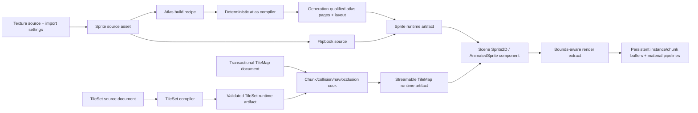

---
related_code:
  - zircon_runtime/src/asset/assets/authoring.rs
  - zircon_runtime/src/asset/assets/sprite_atlas
  - zircon_runtime/src/asset/assets/scene/entity.rs
  - zircon_runtime/src/asset/importer/ingest/import_authoring_asset.rs
  - zircon_runtime/src/asset/pipeline/manager/project_asset_manager/loading
  - zircon_runtime/src/scene/components/render2d
  - zircon_runtime/src/scene/components/scene/identity.rs
  - zircon_runtime/src/scene/world/project_io/scene_asset.rs
  - zircon_runtime/src/scene/world/render.rs
  - zircon_runtime/src/scene/world/render_visibility.rs
  - zircon_runtime/src/core/framework/render/sprite
  - zircon_runtime/src/core/framework/render/frame_extract.rs
  - zircon_runtime/src/graphics/scene/scene_renderer/sprite
  - zircon_runtime/src/graphics/feature/builtin_render_feature
  - zircon_runtime_interface/src/resource/marker.rs
  - zircon_editor/src/core/asset/type_registry
  - zircon_editor/src/ui/host/editor_asset_manager/manager/sprite_atlas
  - zircon_editor/src/ui/retained_host/host_contract/paint_template_nodes/sprite_atlas
  - zircon_editor/src/ui/workbench/event/node_kind_from_id.rs
  - zircon_plugins/tilemap_2d
  - zircon_plugins/first_party_runtime_catalog
  - zircon_plugins/first_party_editor_catalog
  - zircon_app/Cargo.toml
plan_sources:
  - docs/plans/optimize/00-engine-wide-review.md
  - docs/plans/optimize/zircon_runtime/04-core-resource-asset-serialization-review.md
  - docs/plans/optimize/zircon_runtime/05-scene-ecs-world-lifecycle-review.md
  - docs/plans/optimize/zircon_runtime/09b-renderer-visibility-gpu-scene-review.md
  - docs/plans/optimize/zircon_runtime/09c-material-shader-pipeline-pso-review.md
  - docs/plans/optimize/zircon_editor/02-document-transaction-save-autosave-recovery-review.md
  - docs/plans/optimize/zircon_editor/03-scene-prefab-selection-mode-gizmo-picking-review.md
  - docs/plans/optimize/zircon_editor/04-asset-index-import-reimport-catalog-thumbnail-reference-workflow-review.md
  - docs/plans/optimize/zircon_editor/09-background-jobs-admission-scheduling-cancellation-progress-shutdown-product-integration-review.md
  - docs/plans/optimize/zircon_editor/14-animation-sequence-graph-state-machine-timeline-curve-preview-compiler-authoring-review.md
  - docs/plans/optimize/zircon_editor/16-terrain-landscape-foliage-scatter-world-partition-level-streaming-authoring-review.md
  - docs/plans/optimize/zircon_editor/18-physics-material-rigidbody-collider-joint-collision-profile-cook-ragdoll-debug-authoring-review.md
  - docs/plans/optimize/zircon_editor/23-ui-asset-hud-widget-binding-theme-icon-accessibility-menu-flow-font-atlas-authoring-review.md
reference_engines:
  - dev/UnrealEngine/Engine/Plugins/2D/Paper2D/Source/Paper2D/Classes/PaperSprite.h
  - dev/UnrealEngine/Engine/Plugins/2D/Paper2D/Source/Paper2D/Classes/PaperSpriteAtlas.h
  - dev/UnrealEngine/Engine/Plugins/2D/Paper2D/Source/Paper2D/Classes/PaperFlipbook.h
  - dev/UnrealEngine/Engine/Plugins/2D/Paper2D/Source/Paper2D/Classes/PaperTileSet.h
  - dev/UnrealEngine/Engine/Plugins/2D/Paper2D/Source/Paper2D/Classes/PaperTileMap.h
  - dev/UnrealEngine/Engine/Plugins/2D/Paper2D/Source/Paper2D/Classes/PaperTileLayer.h
  - dev/UnrealEngine/Engine/Plugins/2D/Paper2D/Source/Paper2D/Classes/PaperTileMapComponent.h
  - dev/UnrealEngine/Engine/Plugins/2D/Paper2D/Source/Paper2DEditor/Private/SpriteEditor
  - dev/UnrealEngine/Engine/Plugins/2D/Paper2D/Source/Paper2DEditor/Private/TileMapEditing
  - dev/UnrealEngine/Engine/Plugins/2D/Paper2D/Source/Paper2DEditor/Private/TileSetEditor
  - dev/UnrealEngine/Engine/Plugins/2D/Paper2D/Source/Paper2DEditor/Private/Atlasing
  - dev/godot/scene/2d/sprite_2d.h
  - dev/godot/scene/2d/tile_map_layer.h
  - dev/godot/scene/resources/2d/tile_set.h
  - dev/godot/editor/scene/2d/sprite_2d_editor_plugin.h
  - dev/godot/editor/scene/2d/tiles/tile_map_layer_editor.h
  - dev/godot/editor/scene/2d/tiles/tile_set_atlas_source_editor.h
  - dev/Fyrox/fyrox-impl/src/scene/sprite.rs
  - dev/Fyrox/fyrox-impl/src/scene/tilemap
  - dev/Fyrox/editor/src/plugins/tilemap
  - dev/bevy/crates/bevy_sprite/src/sprite.rs
  - dev/bevy/crates/bevy_sprite_render/src/render/mod.rs
  - dev/bevy/crates/bevy_sprite_render/src/tilemap_chunk
  - dev/Graphics/Tests/SRPTests/Projects/UniversalGraphicsTest_2D/Assets/Scenes
doc_type: review-and-refactor-plan
review_status: review_complete
implementation_status: pending
source_recheck_required: true
---

# 34 · Sprite / Atlas / TileSet / TileMap / Canvas 2D / Animation / Collision / Preview Authoring 工程化差距

## 1. 结论

Zircon不是完全没有2D基础。Runtime已有真实`Sprite2dComponent`、Sprite extract/phase queue、anchor/flip/tint/custom size、rect/atlas UV、Stretch/Scale/Tiled/Sliced模式、2D/3D透明阶段混排和可工作的WGPU Sprite管线。`SpriteAtlasAsset`对尺寸、重名、pixel rect、UV范围和pixel-to-UV一致性做了严格校验；Editor另有确定性rectangle pack、RGBA复制、PNG/TOML写出及Retained Host atlas image cache。这些局部实现应保留并纳入正式产品链。

但当前2D链路没有形成工程级产品，首先存在确定性数据丢失。`SceneEntityAsset`可以保存`tilemap: Option<SceneTileMapAsset>`，`World::from_scene_asset()`却完全不读取它；`World::to_scene_asset()`又把`tilemap`固定写成`None`。Sprite问题更早：`SceneEntityAsset`根本没有Sprite2D字段，load路径固定`NodeRecord.sprite_2d = None`，save路径也无处写回。也就是说TileMap source经过一次World load/save会消失，Sprite2D则从未进入项目Scene持久化合同。

TileMap Runtime目前只是名字和数据容器。`ResourceKind`、`ImportedAsset`、typed marker/load API及`BuiltinRenderFeature::Tilemap`槽位存在，但没有TileMap component、world install、chunk compiler、renderer、collision、navigation、occlusion或runtime mutation system。`tilemap_2d`插件只注册一个动态component descriptor和DiagnosticOnly Tiled importer；Editor侧声明五个菜单操作、toolkit和inspector，但没有operation factory，两个`.zui`资源不存在，纯`apply_tilemap_paint()`函数也没有production controller。第一方runtime/editor catalog没有TileMap provider feature或依赖，默认Editor Host不会链接该插件。

Sprite Atlas同样不是正式资产产品。`ResourceKind`和`ImportedAsset`没有Sprite、SpriteAtlas或Flipbook；`SpriteAtlasAsset`只被Editor UI cache工具消费。packer的production精确搜索只有定义，没有controller/job调用者，写出位置固定为`.zircon/cache/editor-sprite-atlases`，先写PNG再用`fs::write`写TOML，没有原子多文件发布、source digest、recipe、generation、DDC、平台变体或cook。`Sprite2dComponent`仅保存inline UV region，不引用atlas asset和stable entry ID，因此atlas重排无法可靠修复场景引用。

现有TileSet/TileMap schema也不能作为长期兼容合同。TileSet只有单图、tile宽高和`{ id, name?, collider?: String }`；TileMap只有单TileSet、宽高、projection与dense `Vec<Option<u32>>` layer。TileSet导入没有任何语义校验；TileMap只检查每层cell数量，未验证非零尺寸、乘法溢出、opacity、重复层名、tile ID有效性或资源一致性。多source、alternative、cell transform/tint、animated tile、terrain/autotile、physics/navigation/occlusion/custom data、sparse chunk、infinite map和object/image/group layer都无可表达位置。

Sprite renderer虽然可画，但还不是高性能或完整材质管线。`material`被带进snapshot，却没有进入batch key、bind group、shader或pipeline选择；所有stage共用固定alpha blend、无alpha discard、depth write disabled的单一管线。Opaque/AlphaMask只改变phase筛选，不改变实际blend/depth/shader语义。每个纹理批次每帧重新生成CPU vertices、创建GPU vertex buffer并单独开启render pass；batch只合并相邻同纹理项。`RenderSpriteBounds`无人使用，visibility payload没有bounds，production graphics也不消费该visibility列表做Sprite culling。

因此不能继续给`TileMapAsset`添加几个可选字段、把`apply_tilemap_paint()`接到按钮、或把Editor UI atlas cache改名为SpriteAtlas产品。目标链必须是：`Texture Source + Sprite Import Recipe -> versioned Sprite Source Asset -> Atlas Build Recipe -> generation-qualified derived pages -> Sprite/Flipbook runtime artifacts`，以及`TileSet Source -> validated TileSet artifact -> transactional TileMap document -> chunk/collision/navigation/occlusion cook -> Scene TileMap component -> streaming renderer`。Editor、cook和Runtime只能消费同一stable identity、compiler与artifact receipt。

## 2. 审查边界与证据

### 2.1 当前工作树物理范围

| 子域 | 文件/行数/bytes | 本轮状态 |
|---|---:|---|
| Asset/schema/import | 13 / 2,413 / 82,454 | E3逐字段/分支：TileSet/TileMap、SpriteAtlas、ImportedAsset、marker/load、TOML ingest；16个test attributes |
| Scene/render/performance | 27 / 4,660 / 172,951 | E3逐值路径：Sprite component、Scene IO、extract/phase、CPU tessellation、batch、WGPU submit、visibility与Tilemap feature slot；10个test attributes，1个在途文件 |
| Editor/atlas/scene UX | 18 / 2,239 / 78,007 | E3逐调用/控制路径：atlas pack/write/resolve/cache、asset type registry、NodeKind和菜单映射；16个test attributes |
| Tilemap plugin/product assembly | 22 / 1,357 / 49,977 | E3逐descriptor/provider：manifest、runtime/editor registration、operation、resource、first-party catalogs和App feature；14个test attributes，1个在途文件 |
| Focused tests | 16 / 3,383 / 124,399 | E3静态阅读：authoring schema、scene reference、sprite render、asset registry和plugin descriptor；78个test attributes |
| selected combined scope | 94 / 13,837 / 500,887 | 当前工作树fingerprint `687fa0085847b8c121c44ecd520dbf5caa4af4a6e07452547281b80ed80f47e3`；126个test attributes、0 ignored、2个在途文件 |

2个在途文件为`zircon_app/Cargo.toml`和`zircon_runtime/src/core/framework/render/frame_extract.rs`，均非本轮产生。本报告按读取时当前工作树事实编写；实施前必须重新导出94文件manifest、重算fingerprint，并复核App provider feature与Sprite phase extract终态。

### 2.2 Sprite、Atlas与Renderer静态事实

1. `Sprite2dComponent`包含Texture handle、optional Material、atlas region、rect、flip、anchor、custom size、image mode、tint、z order和alpha mode。
2. component没有`ZrReflect`，全仓Editor没有Sprite2D inspector descriptor或customization。
3. `NodeKind`只有Empty、Camera、Cube、Mesh和五类light，没有Sprite2D、TileMap、Canvas2D或Camera2D。
4. Editor node ID、control ID和menu action mapping同样只覆盖这些3D/lighting kinds。
5. `SceneEntityAsset`没有Sprite2D/Mesh2D字段，World load固定两者为`None`，所以runtime component不能项目持久化。
6. `RenderSpriteAtlasRegion`只有normalized `min/max`，没有atlas handle、entry ID、generation或page。
7. 默认无rect/custom size时Sprite尺寸为`Vec2::ONE`，不从Texture尺寸或pixels-per-unit推导。
8. image mode真实支持Fit/Fill对齐、Tiled与nine-slice；单Sprite展开slice上限为1,000，超量时截断生成路径。
9. Sprite phase DTO支持camera order、sorting layer、y sort和UI z index，但`SpriteExtract::from_sprites()`固定camera order/sorting layer为0、y sort为None，component也没有这些字段。
10. World按`(z_order, entity)`预排序，phase queue再按通用packed key排序；没有Canvas layer/custom axis/pixel snap语义。
11. snapshot保留Material handle，但graphics production只读取`material_alpha_mode`；shader只执行`textureSample * color`。
12. 同一个固定Sprite pipeline用于Opaque2d、AlphaMask2d、Transparent2d和Transparent3d，始终启用alpha blend、关闭depth write且没有mask threshold/discard。
13. batch key只有Texture ID，连续同纹理才合并；不同Material同纹理会被错误合批，因为Material本就未消费。
14. 每个batch每帧`create_buffer_init`并各开一个render pass，没有persistent/ring buffer、instance buffer、multi-draw、bindless或indirect路径。
15. `RenderSpriteBounds`除re-export外无人使用；visibility input只保存entity/mobility/layer mask，graphics production没有基于它执行Sprite bounds culling。
16. Atlas schema校验严格覆盖zero size、duplicate/blank name、pixel bounds、UV finite/range/order和derived UV一致性，应保留。
17. Atlas packer解码到RGBA8、确定性按source index装箱，失败时同时倍增宽高，直到配置max size。
18. packer没有trim transparent、rotation、extrude/dilate、multi-page、mip policy、compression、color space、stable layout或platform profile。
19. writer先写PNG再写TOML，任一第二步失败会留下半发布artifact；也没有replace generation或rollback receipt。
20. Atlas manifest不属于`ResourceKind`/`ImportedAsset`，其唯一真实consumer是Editor Retained Host模板图片解析与64-entry/64MiB RGBA cache。

### 2.3 TileSet、TileMap、Scene与Runtime静态事实

1. `TileSetAsset`只有一个image reference、tile width/height和tile records。
2. tile record只有numeric ID、optional name和untyped optional collider string。
3. TileSet没有`validate()`；builtin TOML importer反序列化后直接接受。
4. TileSet未验证zero tile size、duplicate ID、image grid/range、collider grammar、name或resource kind。
5. `TileMapAsset`只有一个TileSet reference、四种projection、width/height和layers。
6. layer只有name、visible、opacity和dense `Vec<Option<u32>>`。
7. `validate_layers()`以`width as usize * height as usize`计算expected，没有checked multiplication或cell budget。
8. validation只比较layer vector length；zero dimensions、empty/duplicate layer、opacity NaN/out-of-range和unknown tile ID均可进入artifact。
9. payload内`uri`未与`AssetImportContext.uri`比较或归一，source identity可自相矛盾。
10. `ResourceKind`、marker、Asset facade、ImportedAsset/cache payload和ProjectAssetManager load API完整承认TileSet/TileMap。
11. Scene source保存TileMap reference，reference overview也能统计它，但World load不消费。
12. World save固定`tilemap: None`，因此load/save roundtrip会删除合法source data。
13. Scene persistence focused tests覆盖reference collection/count，却没有TileMap World load/save保真测试。
14. Runtime没有`TileMapComponent` typed struct、archetype storage、system、extract或renderer。
15. `BuiltinRenderFeature::Tilemap`仅存在enum、advanced slot和descriptor tests，没有render feature implementation。
16. Runtime没有2D physics/collider类型；generic 3D Collider存在，但TileSet collider string没有cook或consumer。
17. Runtime没有TileMap collision/nav/occlusion生成、dirty chunk更新、streaming、runtime cell edit或replication。
18. Runtime没有Flipbook/AnimatedSprite/SpriteAnimation/Canvas2D/Light2D/SpriteMask production identifier。
19. dense layer schema不能表达infinite/sparse/chunk map，多层大世界会按空cell付出完整内存和序列化成本。
20. 四种projection只是enum值，没有canonical cell-to-local/local-to-cell、neighbor、bounds、picking或render math owner。

### 2.4 Editor与Tilemap插件静态事实

1. builtin asset registry展示Tile Set和Tile Map，type IDs分别为`tilemap_2d.tileset`与`tilemap_2d.tilemap`。
2. Tile Set与Terrain Layer Stack都使用缩写`TLS`，资产表的视觉身份有冲突。
3. registry仅提供placeholder presentation；完整toolkit/creation来自可选TileMap Editor插件描述符。
4. runtime plugin capability明确标记`Partial`，这是应保留的truthfulness。
5. runtime plugin注册一个动态component descriptor，只有`tilemap`和optional `material`两个asset_ref property。
6. descriptor没有对应typed runtime component/system，也没有把动态value安装到World/renderer。
7. Tiled `tmx/tsx/json` importer全部是`DiagnosticOnlyAssetImporter`，固定报告backend未安装。
8. Editor plugin声明Import Tiled、Create Tilemap、Create Tileset、Open和Paint五个operation。
9. 排除descriptor/tests后，五个`tilemap_2d.authoring.*`路径没有任何production operation factory。
10. Editor plugin声明`plugins://tilemap_2d/editor/authoring.zui`与`tilemap_component.zui`，插件目录内两份文件均不存在。
11. `apply_tilemap_paint()`只校验单cell边界并直接修改dense vector，没有document revision、command、transaction、dirty或save。
12. `validate_tilemap_for_editor()`和paint/stats除export/tests外没有production consumer。
13. first-party runtime catalog没有TileMap registration branch、feature或dependency。
14. first-party editor catalog只装Navigation/Neural，没有TileMap feature或dependency；App也没有TileMap first-party feature。
15. 即便通过外部native dynamic形式加载，缺失ZUI、factory、controller和runtime implementation仍会使可见命令不可执行。
16. 没有Sprite Editor、Atlas Editor、TileSet Editor、TileMap canvas、palette、layer tree、grid、selection或preview controller。
17. 没有scene create Sprite/TileMap入口，没有Sprite picking/gizmo/outline或TileMap cell picking。
18. 没有brush/stamp/line/rect/bucket/erase/picker、terrain paint、pattern、macro、randomization或WFC工具。
19. 没有2D animation timeline、frame event、onion skin、socket/marker或collision geometry editing。
20. Atlas packer没有非测试production caller；其Editor UI cache用途不能替代game Sprite/Atlas authoring。

### 2.5 动态证据边界

此前`zircon_editor --lib`测试编译在617.2秒后被239个既有错误和122个warning阻断。本轮没有重复同一未变化lane，也没有运行Sprite Scene roundtrip、TileMap render/collision、Atlas reimport/repack、Tiled import、Editor paint/save/undo、Flipbook、Canvas2D、GPU capture或10万/100万cell压力测试。126个test attributes只表示selected source存在静态测试，不能证明2D产品链成立。

### 2.6 参考边界

- Unreal Paper2D的`UPaperSprite`把source/baked texture区域、trim/rotation、pixels-per-unit、pivot、default/alternate material、socket、render/collision geometry、BodySetup和AtlasGroup放在正式asset中；`UPaperSpriteAtlas`有page尺寸、mip、padding类型、compression/filter、generated textures、stable GUID、slots和incremental build状态。Zircon应学习source/derived分层、stable identity和toolkit/cook责任，不复制UObject格式。
- Unreal TileSet/TileMap/Layer/Component表达sheet margin/spacing/drawing offset、per-tile data、projection、layers、material、color、collision layer/thickness、owned-vs-asset mutation与batched collision rebuild；Paper2DEditor有独立Sprite/TileSet/TileMap/Flipbook/Atlas toolkit、geometry editing与extract sprites流程。
- Godot `TileSet`拥有多source、alternative tile、animation、physics/navigation/occlusion/custom-data layers、terrain sets和tile proxy；`TileMapLayer`维护quadrant/dirty/runtime tile data/collision/navigation状态；Editor提供atlas source和TileMap layer专用工具。其功能集合可用于检验schema是否留有长期扩展位置。
- Fyrox Runtime TileMap分离data、tileset、autotile、brush、property、transform、effect与collider；Editor插件包含command、palette、preview、collider、brush macro、autotile和WFC。这证明中型Rust引擎也需要typed document与命令化authoring，不能以语言或规模为由降级为直接改Vec。
- Bevy本地源码提供typed Sprite/TextureAtlas引用和`TilemapChunk`。chunk以单mesh、tile-data image、material和change detection更新tile indices，至少给出chunked GPU representation基线；Bevy没有同级Editor产品，本报告不据此推测authoring能力。
- Unity Graphics本地仓库不是Unity 2D Authoring package，只可作为render验收参考。其2D测试场景明确覆盖lit/unlit、Sprite Mask/normal、2D lights/blending、sort mode、SpriteAtlas/dilate、secondary textures、MaterialPropertyBlock、GPU skinning、batching、custom axis和TileMap Editor preview box fill；本文不把这些测试目录误称为完整Unity Sprite/Tilemap源码。

## 3. 必须保留的真实基础

1. 保留`Sprite2dComponent -> RenderSpriteSnapshot -> SpriteExtract -> phase queue`的typed路径，但补齐source/persistence/material/sorting合同。
2. 保留anchor、flip、tint、custom size和rect语义，并为pixels-per-unit、pixel snap和stable Sprite asset建立上层authority。
3. 保留Fit/Fill/Tiled/Sliced的局部几何算法及slice budget，改为预编译或GPU友好的缓存表示。
4. 保留2D与3D透明submission统一排序的基础，增加真实sorting layer/custom axis/material pipeline identity。
5. 保留Sprite Atlas对pixel/UV一致性的严格校验及重复name拒绝。
6. 保留safe output stem、checked RGBA length、deterministic pack input order和失败diagnostics。
7. 保留TileSet/TileMap作为typed ResourceKind、ImportedAsset、marker和reference graph节点的已有接缝。
8. 保留TileMap四种projection枚举，但让projection owner提供完整坐标、邻接、bounds、render和picking合同。
9. 保留插件manifest的`Partial`状态与DiagnosticOnly importer诚实失败，不得在backend缺失时伪造成功。
10. 保留Editor Asset Type contribution、toolkit/template/inspector extension模型，补齐owner lease、factory和实际resource。
11. 保留Editor02 transaction/save、Editor04 import/reimport、Editor09 background job和Runtime artifact store作为2D产品底座。
12. 保留通用3D physics、navigation和graphics subsystem边界，通过cook artifact集成2D，不在TileMap插件内复制简化引擎。

## 4. 目标架构与Owner边界



| Owner | 唯一职责 | 禁止持有 |
|---|---|---|
| Sprite/TileSet source asset | stable identity、authoring metadata、source references、schema version | GPU buffer、平台压缩页、Editor transient selection |
| Atlas/TileMap compiler | deterministic validation、dependency digest、derived pages/chunks/collision/nav artifacts | UI widget、World entity、silent fallback |
| Artifact store/DDC | content-addressed blob、generation、platform variant、atomic publication | source mutation、Editor command history |
| Scene component | runtime artifact handle、instance overrides、sorting/layer/mobility | inline atlas UV作为唯一身份、TileMap整份dense source副本 |
| Runtime 2D systems | generation install、visibility、render/collision/nav同步、mutation receipt | source TOML写回、Editor selection |
| Editor document/toolkit | transaction、undo/redo、dirty/save/conflict、selection、preview | 旁路compiler直接写cache、固定成功反馈 |
| Plugin/catalog | capability/provider选择、owner lease、resource/factory装配 | descriptor-only产品宣称、不可执行菜单 |

关键身份必须至少包含：

```text
SpriteId(asset_id, local_id)
AtlasEntryId(sprite_id, variant, page_generation)
TileSetId(asset_id, schema_generation)
TileId(tile_set_id, stable_local_id, alternative_id)
TileCell(layer_id, chunk_coord, local_coord, tile_id, transform, tint)
TileMapArtifactId(source_revision, dependency_digest, platform, compiler_version)
```

## 5. P0：必须先关闭的架构与正确性缺口

### P0-1：Scene load/save会丢失TileMap，Sprite2D无法持久化

证据：Scene source有`tilemap`字段，World load不读，save固定`None`；Sprite2D source字段不存在，load固定`None`。影响不是“Editor尚未支持”，而是合法数据经过一次标准roundtrip会被删除，Runtime-created Sprite也无法成为项目内容。

重构要求：冻结Scene schema新版本；加入typed Sprite2D/AnimatedSprite/TileMap component source；load必须resolve并安装，save必须lossless回写；未知/未启用插件component必须保留opaque payload而不是删除；为old schema提供migration与roundtrip golden。完成前Editor不得声称Scene支持Sprite/TileMap authoring。

### P0-2：TileMap只有资产名和feature槽位，没有Runtime产品

证据：TileMap marker/load成立，但没有typed component、World storage、extract、chunk compiler、render feature、collision/nav/occlusion或runtime edit。`BuiltinRenderFeature::Tilemap`只是enum/slot。

重构要求：建立`TileMapComponent -> TileMapRuntimeArtifact -> chunk residency -> render/collision/nav systems`完整链；所有安装带generation/receipt；支持bounds、dirty chunk和fault isolation；未安装provider时Scene load给出typed unavailable error且保留source，不得静默变Empty。

### P0-3：Tilemap插件暴露不可执行操作与不存在的UI资源

证据：五个菜单/command/toolkit operation无factory，两份ZUI不存在，Tiled importer只诊断，first-party catalogs/App feature未装配。用户看到的surface合同与实际能力不一致。

重构要求：M0先删除或硬禁用所有不可执行贡献，并显示`Unavailable/Partial`原因；建立provider feature、resource packaging、operation factory、controller owner、shutdown/unregister receipt。只有真实Import/Create/Open/Paint能提交transaction并返回artifact/diagnostic时才恢复菜单。

### P0-4：Sprite/SpriteAtlas不是正式资产，Atlas packer是孤立UI cache工具

证据：ResourceKind/ImportedAsset无Sprite/Atlas/Flipbook；packer无production caller，写cache而非source/artifact pipeline，非原子双文件发布；component只持inline UV，不引用stable entry。

重构要求：建立versioned Sprite、SpriteAtlasRecipe、SpriteAtlasLayoutArtifact与Flipbook asset；packer成为Editor09 job背后的共享compiler；source/artifact分离、content digest、atomic multi-page publish、platform variant和generation install；Scene只保存stable Sprite ID与instance override。

### P0-5：当前TileSet/TileMap schema不能作为工程长期合同

证据：单图、单TileSet、dense ID cell、string collider和唯一length validation，无法表达参考引擎的最小长期能力，也允许无效TileSet/Map进入artifact。

重构要求：在继续生产内容前设计schema v2和迁移：multi-source/stable TileId/alternative/per-tile typed layers、cell transform/tint、sparse chunk、multi-layer kinds、terrain/animation/collision/nav/occlusion/custom data；compiler执行资源解析和跨资产校验；v1只作为import migration输入，不继续扩展optional字段。

## 6. P1：Identity、Source Asset与Schema

### P1-1：建立正式`SpriteAsset`

Sprite必须拥有stable local ID、source texture/region、trim、rotation、pivot、pixels-per-unit、default material与source revision，不能让Scene直接拼Texture handle和UV。

### P1-2：Atlas recipe与layout artifact必须分离

Recipe保存packing policy和member selection；layout/page是derived artifact。不得把生成TOML当source authority，也不得手工编辑cache manifest。

### P1-3：Atlas entry需要stable identity

name只能用于展示和搜索。Scene/Flipbook/TileSet引用stable Sprite ID，repack或rename通过redirect/migration保持引用，page/UV由generation layout解析。

### P1-4：Source与derived metadata必须完整

记录source URI、source digest、importer/compiler version、dependency digest、build platform、page、rect、original size、trim offset、rotation和artifact generation。

### P1-5：像素、单位、pivot与trim语义缺失

统一pixels-per-unit、texture origin、Y方向、pixel center、custom pivot和trim compensation；编辑器、physics cook、renderer和picking必须使用同一转换库。

### P1-6：Sprite附属数据缺少typed owner

Nine-slice border、socket、render polygon、collision polygon、secondary textures和material slots应属于Sprite source/variant，而不是散落在component optional字段。

### P1-7：TileSet必须支持multi-source与stable TileId

单TileSet可包含atlas source、scene source和generated source；TileId不得依赖图集格子顺序，删除/重排要有proxy/redirect和missing tile诊断。

### P1-8：Per-tile数据必须类型化

以命名layer表达physics shape、navigation polygon、occluder、terrain bits、custom property、animation、probability、material/secondary texture；删除`Option<String> collider`。

### P1-9：Tile cell schema必须可扩展

Cell至少包含TileId、alternative、flip/rotate/transpose、tint、variant seed和可选instance data；packed representation由compiler决定，source不暴露脆弱bit layout。

### P1-10：Projection/Grid需要唯一数学authority

Orthogonal/diamond/staggered/hex必须提供cell/local/world转换、neighbor topology、used rect、chunk bounds、picking与serialization golden，并明确odd/even axis与side length。

### P1-11：支持sparse/chunk/infinite map

Source document以chunk或sparse map保存，只序列化occupied区域；compiler可选择dense GPU tile-data。必须有cell/chunk/bytes预算和超限诊断。

### P1-12：Schema version、migration与unknown preservation缺失

Sprite/Atlas/TileSet/TileMap均需显式schema version、deterministic upgrader、downgrade拒绝和unknown extension preservation，不能靠Serde default静默吞掉语义。

## 7. P1：Scene、Runtime Renderer与性能

### P1-13：Scene component持久化必须闭环

新增source/component mapper、reference resolution、missing resource policy和save roundtrip；focused test必须覆盖启用/禁用provider及unknown component保留。

### P1-14：建立typed TileMap runtime component

动态descriptor只能作为reflection projection，背后必须有typed component、artifact handle、material/sorting/collision/navigation overrides、generation和runtime mutation policy。

### P1-15：TileMap renderer必须以chunk为工作单元

采用chunk mesh/instance/tile-data texture或等价GPU结构，dirty cell只更新受影响chunk；不得每帧把全图展开成Sprite vertices。

### P1-16：Sprite/TileMap bounds与culling缺失

让Sprite/TileMap发布world bounds、chunk bounds和visibility generation；frustum、layer、optional occlusion和streaming admission应在CPU tessellation/submit前生效。

### P1-17：Sprite Material必须真实进入管线

Material handle需要resolve shader/pipeline/bindings/secondary textures/property overrides并进入batch key；unsupported material必须诊断，不能继续静默使用固定texture shader。

### P1-18：Opaque/Mask/Blend语义需要独立PSO

Opaque关闭blend并按策略写depth，AlphaMask执行threshold/discard，Transparent使用正确premultiplied或straight alpha合同；stage、shader和pipeline必须一致。

### P1-19：2D排序模型缺失

把sorting layer、order in layer、custom axis/y sort、camera/canvas order和material queue变成可author字段，定义stable tie break和transparent 2D/3D交叉规则。

### P1-20：Batch与buffer生命周期不合格

从per-batch `create_buffer_init + render pass`迁移到persistent ring/instance/chunk buffers、共享pass、state-aware batching；按material/texture/page/pipeline排序但保持透明顺序正确。

### P1-21：Atlas residency与generation缺失

Atlas page加载、eviction、hot reload和repack必须由ResourceStreamer按generation管理；frame内layout/page一致，旧generation在GPU fence后释放。

### P1-22：Hot reload需要原子install receipt

Texture、Sprite、Atlas、Flipbook、TileSet与TileMap依赖更新必须先stage/validate，再frame-boundary commit；失败保持旧generation并发布diagnostic。

### P1-23：Canvas2D runtime authority缺失

建立Canvas/CanvasLayer或等价2D hierarchy，拥有modulate、visibility、sorting、clip、render target和screen/world-space语义；不能继续把所有2D对象塞进普通3D transform后用z猜顺序。

### P1-24：Camera2D与pixel-perfect合同缺失

基于Editor30 camera endpoint扩展2D limits、zoom、smoothing、drag margins、pixel snap、reference resolution和safe area；不得另建第二套不兼容camera service。

## 8. P1：Editor Toolkit、Document与交互

### P1-25：Sprite/Atlas/TileSet/TileMap必须有正式Toolkit

每类asset都需要document session、details、viewport/canvas、diagnostics、save/conflict/reimport和thumbnail，而不是asset registry placeholder或一个通用surface ID。

### P1-26：Texture import需要Sprite slicing recipe

支持single/grid/automatic/manual slicing、naming template、pivot、trim、border、pixels-per-unit和source change diff；import preview必须显示将新增/删除/重定向的Sprite IDs。

### P1-27：Atlas build必须进入Background Job

通过Editor09 admission、progress、cancel acknowledgement和artifact publication；大图decode/pack/compress不得阻塞UI线程，取消不得留下半写PNG/TOML。

### P1-28：Packing policy不完整

补齐trim、rotation、extrude/dilate、padding mode、multi-page、POT、mip、compression/filter、platform max size、secondary texture alignment和deterministic seed。

### P1-29：Repack diff与stable layout缺失

提供incremental/stable layout策略、page/UV diff、waste统计和forced full rebuild原因；引用修复基于stable ID而非name。

### P1-30：Sprite Editor模式缺失

至少有source region、pivot/socket、render geometry、collision geometry和nine-slice模式，支持snap、zoom/pan、overlay、multi-selection与transaction。

### P1-31：TileSet Editor缺失

需要atlas grid/source管理、alternative、per-tile data layer、animation、terrain、collision/nav/occlusion与property inspector，所有edit走typed command。

### P1-32：TileMap Canvas缺失

需要projection-aware grid、layer tree、palette、selection、viewport navigation、visible chunk culling、hover/pick和live diagnostics；不能用普通ZUI表格替代画布。

### P1-33：基础绘制工具缺失

Brush、stamp、line、rect、bucket、erase、picker、random variant和transform必须共享preview/commit算法，并对超大区域提供预算、进度与取消。

### P1-34：Selection、layer与clipboard语义缺失

支持cell/region/layer选择、move/duplicate/copy-paste、cross-map TileId remap、locked/hidden layer和multi-layer stamp；clipboard payload要versioned且可诊断。

### P1-35：Undo/Redo、dirty/save/conflict没有接入

Paint不能直接改asset Vec。每次stroke形成可合并command，记录before/after chunk diff；autosave/recovery/source-control conflict遵循Editor02统一authority。

### P1-36：Preview与Play边界缺失

Asset preview使用isolated PreviewWorld和真实runtime artifact；Scene preview与PIE使用同一compiler/renderer，不得维护另一份Editor-only cell renderer或固定成功反馈。

## 9. P1：Collision、Animation、Canvas与2D表现

### P1-37：Sprite collision geometry与cook缺失

支持box/circle/capsule/convex/polygon/outline生成、简化、验证、自交诊断和可选3D extrusion；结果进入共享physics cook artifact。

### P1-38：Tile collision layer与增量重建缺失

TileSet定义typed shapes/material/layer，TileMap按dirty chunk合并或实例化collider；一次stroke完成后批量rebuild，不得每cell同步重建。

### P1-39：Navigation、occlusion与custom data缺失

每tile可贡献navigation polygon、area/cost、occluder和typed custom property；TileMap chunk cook向现有Navigation/renderer发布generation-qualified artifact。

### P1-40：Terrain/Autotile规则缺失

设计terrain set、peering bits/neighbor mask、weighted alternatives和deterministic solver；paint preview与commit必须相同，规则错误给出局部解释。

### P1-41：Pattern、Brush Macro与WFC缺失

Pattern asset保存multi-layer cells和parameters；macro/WFC作为可取消job运行，使用seed、约束、预算和失败证据，不能在UI callback中无界求解。

### P1-42：Flipbook/Frame Animation asset缺失

建立frame引用、duration/fps、loop、play mode、notify/event和source dependency；Atlas repack不改变动画身份。

### P1-43：AnimatedSprite runtime component缺失

提供clip handle、time、speed、direction、loop、playing、frame event、generation migration和deterministic update phase，并与Scene persistence闭环。

### P1-44：2D Animation Timeline与onion skin缺失

复用Editor14 timeline/curve/preview owner，增加frame strip、duration edit、event marker、onion skin和sprite socket preview，不复制一套简化history。

### P1-45：Sprite socket与attachment缺失

Socket使用stable ID与local transform，Scene child attachment在frame change时解析；rename/删除要有redirect/diagnostic，physics与render使用同一pose snapshot。

### P1-46：2D lighting、normal、mask与secondary textures缺失

定义Sprite material输入、normal/mask/light map secondary textures、Light2D/SpriteMask interaction和sorting；接入现有material/render graph，不在Sprite shader硬编码特例。

### P1-47：Scene picking、gizmo与selection outline缺失

Sprite按actual geometry/alpha policy命中，TileMap返回layer/cell/TileId；outline、bounds、pivot和collision overlay必须来自真实component/artifact。

### P1-48：2D debug与质量视图缺失

提供grid/chunk/bounds/overdraw/batch/page/collision/nav/occlusion/terrain规则和missing tile overlay，数据必须来自Runtime/Compiler snapshot并带generation。

## 10. P1：Importer、Plugin、Diagnostics与规模资格

### P1-49：Tiled importer必须是真实backend

解析TMX/TSX/JSON、embedded/external tileset、layer/object/group/image、GID flip bits、properties、animation、terrain/Wang、infinite chunks和templates；unsupported字段列明path与severity。

### P1-50：多文件依赖与reimport缺失

Importer记录TMX -> TSX -> image/template依赖图、source digest和subasset stable IDs；任一依赖变化触发增量diff，不允许仅凭主文件时间重建。

### P1-51：2D格式扩展策略缺失

Aseprite、TexturePacker、LDtk等通过importer registry接入统一normalized Sprite/TileSet/TileMap IR；没有backend时保持DiagnosticOnly，不写简化一次性parser。

### P1-52：First-party provider装配缺失

为TileMap runtime/editor建立明确feature、dependency、catalog branch、profile选择和packaging测试；默认是否启用由产品profile决定，但enabled必须可执行。

### P1-53：Operation factory与owner lease缺失

Import/Create/Open/Paint各自注册factory、payload validation、capability admission、document scope、cancel/shutdown和unregister receipt；重复owner或stale callback必须拒绝。

### P1-54：Plugin resource packaging缺失

`.zui`、icons、templates、schemas和native dist必须进入manifest/cook并校验存在/hash；缺resource时插件整体admission失败，不保留断裂菜单。

### P1-55：2D diagnostics没有统一journal

Importer/compiler/editor/runtime以同一typed diagnostic记录asset/cell/layer/source path、generation、owner、severity、repair action和provenance，并投影到Console/asset badge/canvas。

### P1-56：Malformed input与资源预算缺失

对image dimensions、atlas pixels/pages、map cells/chunks/layers、XML/JSON depth/nodes/bytes、property size、animation frames和geometry vertices设checked budget与fuzz lane。

### P1-57：Deterministic cook与DDC缺失

相同source/dependency/settings/compiler version必须得到byte-identical artifact；key包含platform/compression/feature set，local/remote DDC命中不改变receipt。

### P1-58：性能遥测缺失

记录visible/loaded chunks、dirty cells、sprite instances、slice expansion、batches、passes、buffer upload、atlas residency、cull ratio、cook/reimport耗时与budget breach。

### P1-59：测试矩阵不完整

增加schema migration、Scene roundtrip、projection golden、atlas stable repack、import/reimport、paint undo/save、runtime render/collision/nav、material alpha、device loss和fault injection。

### P1-60：跨平台与release资格缺失

Windows/Linux/macOS及目标GPU验证texture array/format/filter/mip/precision，固定视觉golden覆盖sort、mask、lighting、dilate、secondary texture、GPU skinning和Editor preview；未达门不得标Stable。

## 11. P2：高级能力与团队规模

### P2-1：2D skeletal deformation与GPU skinning

Sprite mesh/bone/weight、deform bounds、batch和lighting使用统一GPU skinning基础，并覆盖TileMap/SpriteMask交互。

### P2-2：Sprite Shape与spline terrain

用spline生成render/collision geometry、corner/fill sprite和LOD，source与derived mesh分层。

### P2-3：Palette swap与material variants

支持palette/lookup texture、per-instance parameter block和batch-compatible variant，不复制整张atlas。

### P2-4：高级hex/isometric topology

支持custom stagger axis/index、hex side length、elevation、height layer、custom sort axis与projection-aware navigation。

### P2-5：大世界TileMap streaming

按region/chunk异步load/cook/residency、HLOD/minimap artifact和server-authoritative cell state，接入World Partition而非平行streamer。

### P2-6：Runtime editable TileMap

定义copy-on-write overlay、save delta、replication/prediction、rollback和collision/nav rebuild budget，不直接改shared source asset。

### P2-7：Procedural tile rule graph

可视化规则编译为deterministic artifact，支持seed、局部增量求解、debug trace和headless generation。

### P2-8：多人协同TileMap编辑

以chunk/cell operation和stable layer identity进行merge/lock/conflict，保留per-user selection与transaction provenance。

### P2-9：自动Atlas优化与热度布局

依据runtime telemetry建议page grouping、variant和compression，但必须可复现、可预览diff并由用户批准recipe变更。

### P2-10：内容分析与repair assistant

检测duplicate/unused/missing tile、wasted atlas area、overdraw、collision/nav seams和unstable IDs，repair产生显式transaction。

### P2-11：GPU-driven Sprite/TileMap submission

在正确性和persistent buffer基线完成后评估GPU cull、indirect/multi-draw、bindless page和chunk compaction，以capture证据而非接口名验收。

### P2-12：跨引擎任务基准

以同一大型关卡执行import、slice、atlas、paint、autotile、undo、save、cook、load、render、collision与hot reload，对照Paper2D/Godot/Fyrox/Bevy/Unity Graphics适用部分。

## 12. 当前Authority与断路清单

| 能力 | 当前authority | 真实consumer | 断路 |
|---|---|---|---|
| Sprite runtime instance | `Sprite2dComponent` | Scene render extract/graphics Sprite renderer | Scene source/save、reflection、Editor create/inspect缺失 |
| Sprite material | component/snapshot optional handle | 无；只有alpha mode影响phase | shader/PSO/batch不消费Material |
| Sprite bounds/visibility | dead `RenderSpriteBounds`与identity-only visibility DTO | 无production culling consumer | 全量extract/CPU tessellation |
| Sprite Atlas schema | `SpriteAtlasAsset` TOML struct | Editor template image resolver | 非ResourceKind、非game Sprite引用、无cook |
| Atlas build | Editor cache packer/writer | tests；无production builder caller | 非原子、无recipe/job/generation/DDC |
| TileSet source | `TileSetAsset` | importer/cache/load/reference | 无validation、toolkit、runtime resolver |
| TileMap source | `TileMapAsset` | importer/cache/load/reference | 无World/runtime/render/collision/nav |
| Scene TileMap reference | `SceneEntityAsset.tilemap` | reference overview | World load忽略，save删除 |
| Tilemap render feature | enum/advanced slot | descriptor tests | 无implementation |
| Tilemap runtime plugin | dynamic descriptor + DiagnosticOnly importer | registry metadata | 无typed component/system/backend |
| Tilemap Editor plugin | contribution descriptors + pure paint function | tests | no factory、no ZUI、no controller、no catalog feature |
| 2D animation | 无 | 无 | 无Flipbook/AnimatedSprite/timeline consumer |
| 2D collision | string collider + generic 3D physics | 无TileSet consumer | 无typed geometry/cook/dirty rebuild |
| Canvas2D/Camera2D | 无 | ordinary Transform/Camera only | 无2D hierarchy/sort/pixel-perfect owner |

## 13. 分层重构里程碑

### M0：Truthfulness与数据丢失止血

隐藏/禁用无factory菜单和缺失resource contribution；Scene遇到Sprite/TileMap未支持状态必须拒绝save或opaque保留；补TileMap loss regression；文档/UI明确Partial。

### M1：Stable Identity、Schema v2与Migration

定义Sprite/AtlasRecipe/TileSet/TileMap/Flipbook source schemas、stable IDs、projection math、unknown preservation和v1 migration；不接renderer前先完成roundtrip。

### M2：Shared Compiler、Artifact与Atomic Publication

建立Sprite slice、Atlas、TileSet、TileMap chunk/collision/nav compilers，content digest、budget、DDC key、multi-artifact atomic commit和generation receipt。

### M3：Scene Component与Runtime Install

完成Sprite2D/AnimatedSprite/TileMap source-component mapper、typed handles、missing policy、frame-boundary install/hot reload和opaque disabled-provider preservation。

### M4：Renderer正确性与性能基线

实现material/alpha/sorting/bounds/culling，persistent Sprite instance buffer和TileMap chunk renderer；用capture证明pass/upload/batch/cull指标。

### M5：Collision、Navigation、Occlusion与Animation

接入shared physics/navigation/render artifacts、dirty chunk rebuild、Flipbook evaluator/events/socket和2D secondary texture/lighting/mask合同。

### M6：Sprite/Atlas/TileSet Toolkits

交付transactional Sprite slicing/geometry/pivot、Atlas recipe/diff/build、TileSet multi-source/per-tile layer/terrain/animation工具。

### M7：TileMap Canvas与Tiled Reimport

交付projection-aware canvas、palette/layers/tools/selection/undo/save/recovery，真实TMX/TSX/JSON normalized importer和dependency-aware reimport。

### M8：Fault、规模、性能与跨平台资格

完成fuzz/budget/device-loss/cancel/crash/atomicity、百万cell/十万Sprite规模、visual golden和Windows/Linux/macOS/GPU矩阵。

### M9：高级2D生态

在M0-M8证据稳定后再交付skeletal 2D、Sprite Shape、runtime editing/replication、large-world streaming、procedural rule graph和collaboration。

## 14. 验收门禁

### G01：Scene Sprite roundtrip

含Sprite/AnimatedSprite全部字段的Scene经load/save byte-semantic等价，unknown extension保留。

### G02：Scene TileMap roundtrip

启用、禁用和缺失provider三种情况下TileMap reference均不丢失；不可保存时给typed blocker。

### G03：Schema migration

v1 TileSet/TileMap corpus确定性迁移v2，重复运行不再变化，unsupported内容明确拒绝。

### G04：Stable identity

Sprite rename、atlas repack、tile source reorder和TileSet reimport后Scene/Flipbook/TileMap引用保持同一logical target。

### G05：Atlas atomicity

在page/manifest任一步注入失败、取消或崩溃，读者只看到完整旧generation或完整新generation。

### G06：Atlas deterministic

相同输入/settings/compiler version在clean/local-DDC/remote-DDC路径生成同hash artifacts。

### G07：Atlas quality

trim/rotation/extrude/dilate/mip/secondary texture visual goldens无bleeding，平台压缩策略可追溯。

### G08：TileSet validation

zero/duplicate/out-of-grid/malformed geometry/unknown layer/NaN property均在artifact publication前失败并定位source path。

### G09：Projection golden

四种projection及stagger/hex参数的cell-local-world、neighbor、bounds和pick roundtrip通过golden/fuzz。

### G10：Sparse scale

百万逻辑cell但低occupancy地图的source size、load memory和edit latency随occupied chunks增长，不随全矩形增长。

### G11：Sprite material

两个同纹理不同material Sprite产生正确PSO/binding/visual，batch不会错误合并。

### G12：Alpha semantics

Opaque/Mask/Blend的blend、depth、discard和sort capture与visual golden一致。

### G13：Sorting

sorting layer/order/y/custom axis/camera/canvas以及2D/3D透明交叉场景在所有平台stable。

### G14：Sprite culling

离屏Sprite不进入vertex generation/upload/draw；旋转、negative scale、nine-slice bounds不误剔除。

### G15：TileMap chunk renderer

单cell edit只更新受影响chunk；draw/upload与visible chunks相关，不随total map全量增长。

### G16：GPU lifetime

Atlas hot reload、page eviction、device loss和surface recreate无use-after-free、stale generation或永久resident leak。

### G17：Collision cook

Sprite/Tile collision geometry自交/退化被拒绝；dirty stroke只批量重建相关chunks且physics frame一致。

### G18：Navigation/occlusion

Tile edit后nav/occlusion generation与render generation可追踪，失败保持旧artifact并显示stale状态。

### G19：Flipbook determinism

fixed-step/variable render、reverse、loop、speed change和hot reload下frame/event序列有明确golden。

### G20：Editor transaction

每个paint stroke、bulk fill、layer operation和geometry edit可undo/redo，dirty/save/recovery与Editor02一致。

### G21：Conflict handling

外部reimport与本地unsaved edit并发时展示三方diff，不覆盖用户修改或静默清空history。

### G22：Tiled fidelity

TMX/TSX/JSON corpus覆盖external/embedded source、infinite chunks、flip bits、objects/groups/properties/animation/terrain，roundtrip语义报告完整。

### G23：Reimport dependency

只修改TSX/image/template能触发正确subasset diff，未变化stable IDs和chunks不重建。

### G24：Plugin admission

缺ZUI/factory/capability/native backend任一条件时整个贡献不可见或disabled-with-reason，不出现可点击空命令。

### G25：Job cancellation

Atlas pack、Tiled import、bulk fill/autotile和TileMap cook在预算时间内ack cancel，无半artifact、stuck dirty或lost progress terminal。

### G26：Malformed/fuzz

XML/JSON/TOML/image/geometry fuzz不panic、不越界、不无界分配，所有budget breach输出typed diagnostic。

### G27：Performance telemetry

capture同时给出Sprite/TileMap counts、cull ratio、batches/passes、upload bytes、atlas/chunk residency和generation provenance。

### G28：Large-scene baseline

十万Sprite、百万cell/千visible chunks及高频paint的CPU/GPU/frame-time/memory基线达到预设预算并可复现。

### G29：Visual matrix

lit/unlit、mask/normal/light、sort、atlas dilate、secondary texture、material override、GPU skinning、TileMap editor preview均有固定图像差异阈值。

### G30：Cross-platform

Windows/Linux/macOS及目标backend的texture format/filter/mip/array limits、precision和pixel-center结果一致或有批准差异。

### G31：Headless cook/package

无Editor UI的clean machine可导入/cook/package Sprite/Atlas/TileSet/TileMap，shipping运行时不读取source TOML或Editor cache路径。

### G32：Truthful maturity

只有G01-G31全部带artifact/capture/log证据且required lanes通过，TileMap capability才能从Partial升级，任何Workbench/README不得提前标Complete/Stable。

## 15. 禁止的临时修补

1. 禁止只给`SceneEntityAsset`加`Option<Sprite2dComponent>`后直接序列化runtime handle，必须有source DTO、reference resolution与migration。
2. 禁止继续在TileMap v1 dense Vec上堆可选字段并称为schema v2。
3. 禁止把`Option<String> collider`解析成临时JSON/DSL；改为typed geometry/layer source。
4. 禁止让Scene保存inline atlas UV作为唯一Sprite身份。
5. 禁止把`.zircon/cache/editor-sprite-atlases`提升为项目source目录或shipping runtime输入。
6. 禁止用`fs::write`顺序写多个artifact后以“最后一步成功”冒充原子发布。
7. 禁止在Sprite shader里再加几个if来模拟Material、Mask或2D lighting；接入正式material/pipeline。
8. 禁止为TileMap逐cell生成独立Sprite entity或每帧全图CPU vertices作为最终实现。
9. 禁止把`BuiltinRenderFeature::Tilemap` enum/descriptor测试当render feature完成证据。
10. 禁止注册没有factory或缺resource的菜单、toolkit、inspector与importer。
11. 禁止让Paint callback直接修改asset Vec并手工设置dirty字符串，必须走document transaction。
12. 禁止以固定Workbench数据、测试fixture、README清单或`Partial`manifest存在本身冒充产品行为。

## 16. 本轮产出边界

本轮只完成静态review与重构计划，没有修改production Runtime/Editor/interface/plugin/App代码或tests，也没有运行动态测试。报告覆盖94个Zircon选取文件、13,837行、500,887 bytes，并逐项核对Unreal Paper2D、Godot、Fyrox、Bevy及Unity Graphics本地参考的适用边界。

此前`zircon_editor --lib`测试编译在617.2秒后被239个既有错误和122个warning阻断，本轮未重复不能抵达2D产品行为的相同lane。实施顺序必须从M0数据保真与truthfulness开始，不得先做画布按钮、更多descriptor或局部shader效果。
