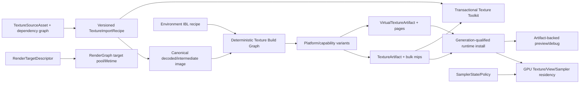

---
related_code:
  - zircon_runtime/src/asset/assets/texture
  - zircon_runtime/src/asset/importer/image_decode.rs
  - zircon_runtime/src/asset/importer/ingest/import_texture.rs
  - zircon_runtime/src/asset/importer/environment_ibl.rs
  - zircon_runtime/src/asset/importer/environment_ibl
  - zircon_runtime/src/asset/artifact/ibl_bake_artifact_asset_derived.rs
  - zircon_runtime/src/asset/artifact/ibl_bake_artifact_cache.rs
  - zircon_runtime/src/asset/artifact/ibl_source_cubemap_staging.rs
  - zircon_runtime/src/core/framework/render/image
  - zircon_runtime/src/core/framework/render/camera.rs
  - zircon_runtime/src/graphics/scene/resources/gpu_texture
  - zircon_runtime/src/graphics/scene/resources/output_target_texture
  - zircon_runtime/src/graphics/scene/resources/resource_streamer/resource_streamer_ensure_texture.rs
  - zircon_runtime/src/graphics/scene/resources/resource_streamer/resource_streamer_mip_streaming.rs
  - zircon_editor/src/core/asset/type_registry
  - zircon_editor/src/ui/host/editor_asset_manager/manager/preview_refresh
  - zircon_plugins/texture
  - zircon_plugins/texture_importer
  - zircon_plugins/asset_importers/texture
  - zircon_plugins/first_party_runtime_catalog
  - zircon_plugins/first_party_editor_catalog
  - zircon_app/Cargo.toml
plan_sources:
  - docs/plans/optimize/00-engine-wide-review.md
  - docs/plans/optimize/zircon_runtime/04-core-resource-asset-serialization-review.md
  - docs/plans/optimize/zircon_runtime/09a-rhi-render-graph-gpu-lifetime-review.md
  - docs/plans/optimize/zircon_runtime/09c-material-shader-pipeline-pso-review.md
  - docs/plans/optimize/zircon_runtime/09d-render-asset-streaming-residency-review.md
  - docs/plans/optimize/zircon_runtime/09f1-environment-sky-ibl-reflection-probe-review.md
  - docs/plans/optimize/zircon_editor/02-document-transaction-save-autosave-recovery-review.md
  - docs/plans/optimize/zircon_editor/04-asset-index-import-reimport-catalog-thumbnail-reference-workflow-review.md
  - docs/plans/optimize/zircon_editor/09-background-jobs-admission-scheduling-cancellation-progress-shutdown-product-integration-review.md
  - docs/plans/optimize/zircon_editor/22-render-pipeline-frame-capture-lighting-bake-reflection-probe-post-process-debug-authoring-review.md
  - docs/plans/optimize/zircon_editor/34-sprite-atlas-tileset-tilemap-canvas-2d-animation-collision-preview-authoring-review.md
reference_engines:
  - dev/UnrealEngine/Engine/Source/Runtime/Engine/Classes/Engine/Texture.h
  - dev/UnrealEngine/Engine/Source/Editor/TextureEditor/Public/Interfaces/ITextureEditorToolkit.h
  - dev/UnrealEngine/Engine/Source/Editor/TextureEditor/Private/TextureEditorToolkit.cpp
  - dev/UnrealEngine/Engine/Source/Runtime/Engine/Private/TextureDerivedData.cpp
  - dev/UnrealEngine/Engine/Source/Runtime/Engine/Private/Streaming/Texture2DStreamIn_IO.cpp
  - dev/UnrealEngine/Engine/Source/Runtime/Engine/Classes/Engine/TextureRenderTarget2D.h
  - dev/godot/editor/import/resource_importer_texture.cpp
  - dev/godot/editor/import/resource_importer_layered_texture.cpp
  - dev/godot/editor/scene/texture/texture_editor_plugin.cpp
  - dev/godot/editor/scene/texture/texture_layered_editor_plugin.cpp
  - dev/godot/editor/scene/texture/texture_3d_editor_plugin.cpp
  - dev/bevy/crates/bevy_image/src/image.rs
  - dev/bevy/crates/bevy_image/src/image_loader.rs
  - dev/bevy/crates/bevy_image/src/hdr_texture_loader.rs
  - dev/bevy/crates/bevy_image/src/exr_texture_loader.rs
  - dev/bevy/crates/bevy_render/src/texture/texture_cache.rs
  - dev/Fyrox/fyrox-texture/src/lib.rs
  - dev/Graphics/Packages/com.unity.render-pipelines.core/Runtime/RenderGraph/RenderGraphResourceTexture.cs
  - dev/Graphics/Packages/com.unity.render-pipelines.core/Runtime/Textures/Texture2DAtlas.cs
  - dev/Graphics/Packages/com.unity.render-pipelines.core/ShaderLibrary/DebugMipmapStreaming.hlsl
doc_type: review-and-refactor-plan
review_status: review_complete
implementation_status: pending
source_recheck_required: true
---

# 35 · Texture / Image / Cubemap / RenderTarget / Sampler / Compression / Streaming / Preview Authoring 工程化差距

## 1. 结论

Zircon的Texture基础不是空白。Runtime已有typed `TextureAssetDescriptor`、颜色空间/用途/mip/压缩/SVT metadata、DDS/KTX/KTX2/ASTC容器识别、subresource upload plan、BC/ETC2/ASTC设备能力门、2D array/cube构造、sampler cache以及物理mip residency状态。普通RGBA8负载会在上传前校验shape、mip/layer字节数与格式；外部DDS/KTX source cubemap也被明确阻止直接上传，避免把IBL源误当成PMREM。上述校验与类型接缝应保留。

环境IBL是本轮最强的现成基础，不能与普通`.zcube`导入混为一谈。HDR/EXR equirectangular源走`decode_texture_source_image_rgba32f()`，生成source cubemap mip chain、GGX PMREM、SH9和optional irradiance cube；request包含source identity、source/PMREM layout与required contents，artifact带format/algorithm version、BLAKE3 key、atomic publication、restore/rebuild和并行执行计数。外部DDS/KTX cubemap也可进入同一source staging。它已经具备一个局部工程化派生链，应作为通用Texture build graph的样板，而不是被重写成普通RGBA8导入。

但普通图片路径存在确定性正确性断裂。builtin importer与`texture_importer.image`都声明支持HDR/EXR，却调用`DynamicImage::to_rgba8()`；`TexturePayload`也只有`Rgba8`和opaque `Container`。默认导入会先丢失高动态范围；若作者设置`usage_hint=hdr`且保留RGBA8格式，metadata validation直接拒绝；若再把`format`改为`rgba16float/rgba32float`，RGBA8 upload readiness又明确报告“requires conversion before upload”。因此普通HDR/EXR不是低质量但可用，而是可能在导入阶段或GPU上传阶段失败。专用Environment IBL成功不等于通用HDR Texture成立。

压缩、mip和平台cook也没有形成可信工件合同。metadata默认会为albedo/data/mask/HDR选择BC7/BC4/BC6H等目标，但自产encoder只有BC5 normal；其余普通图片仍保存RGBA8。builtin importer甚至不执行offline mipgen、normal convention转换或BC5 transcode，而可选`texture_importer`会执行这些步骤。同一源文件因provider是否安装而产生不同结果。现有artifact cache将完整`TextureAsset`整体bincode化，没有source/recipe/platform variant/bulk mip分层，缺少encoder/tool/version、quality/RDO和target capability key。能读取预压缩容器不等于能为Windows、Linux、macOS、mobile和web生产正确平台工件。

Runtime mip streaming有真实调度和GPU重建代码，但当前仍是同步、全驻留起步的原型：首次ensure上传完整mip chain；每帧在render resource准备路径同步load asset、重建texture/view/bind group并复制公共mip；compressed texture被排除；demand只来自主视图可见mesh/material，并用transform scale近似屏幕需求。SVT只有三个metadata字段和validation，没有page artifact、feedback、page table或tile cache，并且又被普通mip streaming排除。RenderTarget继续复用普通Texture handle，只接受单层单mipRGBA8、sample count 1；Sampler只表达三轴address和三类nearest/linear filter。这些接口名称已明显大于实现语义。

Editor产品链基本未成立。builtin registry只把所有Texture归为一个`ResourceKind::Texture`并用原始source image生成thumbnail；DDS/KTX/KTX2/ASTC/PSD/`.zcube`/`.zarray`均无法由该provider可靠预览。thumbnail固定拉伸到192x192，没有alpha棋盘、channel/mip/layer/face/slice、exposure/gamma、normal或compression对比。`texture` Editor插件只声明一个不存在的`plugins://texture/editor/authoring.zui`，没有operation factory、document、toolkit controller、save/reimport或undo/redo，且未进入first-party Editor catalog和App feature。与此同时`texture_importer`与`asset_importers/texture`两套包重叠声明owner，后者只暴露descriptor而不注册实际importer。

所以不能继续通过新增字符串format、增加一个checkbox、为缺失ZUI补静态页面或在render thread再包一层线程来修补。目标边界必须是：`TextureSourceAsset + versioned ImportRecipe -> canonical decoded/intermediate image -> platform/capability-qualified build graph -> immutable TextureArtifact/BulkMip/VirtualPage artifacts -> generation-qualified runtime install`；Texture2D、Layered/Cube/Volume、RenderTarget、VirtualTexture和Sampler必须拥有可验证的独立身份或严格variant；Editor必须消费同一recipe、compiler、artifact和install receipt。

## 2. 审查边界与证据

### 2.1 当前工作树物理范围

| 子域 | 文件/行数/bytes | 本轮状态 |
|---|---:|---|
| Texture model/import/IBL artifact | 53 / 11,640 / 412,144 | E3逐字段/分支：descriptor、payload、image decode、DDS/KTX/ASTC、cube/array、external source cubemap、PMREM、artifact key/cache；94个test attributes |
| GPU upload/streaming/output target | 19 / 5,094 / 181,988 | E3逐调用/资源生命周期：upload plan、sampler cache、ensure、residency调度、texture rebuild、camera target与writeback；54个test attributes |
| Texture/importer plugins | 66 / 10,710 / 362,657 | E3逐manifest/provider/importer：texture shell、主texture_importer、重复asset_importers owner、mipgen与BC5；183个test attributes |
| Editor preview/product assembly | 28 / 3,739 / 127,314 | E3逐provider/控制路径：type registry、preview generation/cache/scheduler、first-party catalogs与App feature；18个test attributes |
| Focused contract tests | 16 / 4,758 / 166,640 | E3静态阅读：upload readiness、cube/source cubemap/IBL staging、camera texture target与registry；76个test attributes，1个ignored |
| selected combined scope | 182 / 35,941 / 1,250,743 | 当前工作树fingerprint `8594ca8241273601a0ba2ea5ede39d70240f08a996375a504dae5b8d1fc72ceb`；425个test attributes、1个ignored、4个在途文件 |

4个在途文件为`zircon_app/Cargo.toml`、`zircon_runtime/src/asset/importer/ingest/import_texture.rs`、`zircon_runtime/src/core/framework/render/image/metadata_validation.rs`和`zircon_runtime/src/core/framework/render/image/mod.rs`，均非本轮产生。`import_texture.rs`当前diff只有import排序，但其余文件仍须按并发工作对待。本报告按读取时当前工作树事实编写；实施前必须重新导出182文件manifest、重算fingerprint，并复核import validation、App plugin feature和image metadata终态。

### 2.2 Texture模型、普通导入与工件静态事实

1. Runtime对外只有一个`ResourceKind::Texture`与一个`TextureMarker`；Texture2D、Cube、Array、Volume、RenderTarget和VirtualTexture没有独立资源身份。
2. `TextureAsset`保存`width`、`height`、legacy `rgba`、`TexturePayload`和optional descriptor；payload只有`Rgba8`与opaque `Container`。
3. descriptor的`format`是字符串，不是由payload layout约束的typed format；`depth_or_array_layers`和`array_layer_count`重复表达layer extent。
4. import settings允许覆盖format、dimension、mip count和layer count，但不会把RGBA8字节转换成对应的float、depth、compressed或3D layout。
5. `rgba8_upload_readiness()`只接受`rgba8unorm`与`rgba8unorm_srgb`，会拒绝被重新标注为float的RGBA8负载，并严格验证完整mip/layer字节长度。
6. `decode_texture_source_image()`无条件`to_rgba8()`；builtin image importer和plugin image importer都使用它。
7. `decode_texture_source_image_rgba32f()`只被Environment IBL路径使用，普通HDR/EXR Texture不使用。
8. builtin importer声明bmp/gif/hdr/ico/jpeg/png/pnm/qoi/tga/tiff/webp/exr，但只执行decode、apply settings和metadata validation。
9. builtin importer默认把单mip decoded image标为`GenerateOffline`，却不生成离线mips，artifact仍是base-level RGBA8。
10. `texture_importer.image`会执行normal convention、runtime mip preparation、offline mip generation和BC5 normal transcode，导致可选provider与builtin provider语义不一致。
11. provider priority在已安装时是确定性的；问题不是随机选择，而是产品装配不同会改变同一源的结果与工件身份。
12. metadata默认目标包含BC1/BC4/BC5/BC6H/BC7，但`transcode`模块只有BC5实现。
13. albedo/data/mask/HDR默认压缩标签可与实际RGBA8 payload不一致，运行时不能从该标签恢复真正的编码事实。
14. cache payload把整个`TextureAsset`作为单块bincode内容保存，没有独立source record、recipe、canonical intermediate、platform artifact、bulk mip或streaming chunk。
15. artifact key没有纳入encoder版本、quality/RDO、target platform、GPU family、format fallback chain或deterministic build recipe。
16. `.zarray`与普通`.zcube`manifest最终都折叠成`TextureAsset`，导入后丢失可编辑source recipe身份。
17. array source list通过相邻文件系统路径直接读取并`to_rgba8()`，引用虽被报告为dependency，却没有消费依赖资产的artifact/settings。
18. array只支持source列表或竖直row slicing，没有grid/cell region、per-layer crop/resample、typed layer identity或heterogeneous source validation。
19. ordinary cubemap支持six files、cross或equirectangular布局，但输出同样是RGBA8；HDR cube recipe会丢失radiance。
20. cubemap cross变换规则硬编码且只对特定face旋转，没有显式坐标系、handedness、face remap/flip、seam fixup或可验证orientation recipe。
21. 非法`cubemap_face_size`会经过filter后静默回落默认值，而不是把错误设置报告给作者。
22. legacy `TextureSource::{BuiltinChecker,BuiltinGrid,Path}`与`CpuTexturePayload`另建一套直接文件decode路径，没有descriptor/settings/dependency/version，形成次级导入authority。

### 2.3 Container、Cubemap与IBL静态事实

1. DDS/KTX/KTX2/ASTC路径会解析container header、format、mip/layer范围与block layout，再构造`TextureUploadPlan`。
2. upload readiness会按设备BC/ETC2/ASTC能力拒绝不支持的容器，并校验subresource范围、block row和payload边界。
3. KTX2 Basis supercompression明确要求外部transcoding backend；Zstandard/Zlib重写路径与普通未压缩container ingestion已有局部实现。
4. 读取预编码container是runtime ingestion能力，不是source-to-platform texture cook；二者不能共用“compression complete”结论。
5. external DDS/KTX cubemap通过container metadata识别为source-only；直接GPU upload被明确拒绝，这是正确边界。
6. `.zcube` source container也被明确标记为IBL baking source，而不是可直接sample的PMREM。
7. Environment IBL对HDR/EXR默认自动识别2:1 equirectangular源，并保持RGBA32F decode。
8. source identity由原始bytes、face size和mip count派生；request同时包含source和PMREM layout以及required artifact contents。
9. source cubemap builder实现equirectangular投影、source mip、GGX PMREM、SH9与optional irradiance cube，并有serial/parallel executor路径。
10. `IBL_BAKE_ARTIFACT_FORMAT_VERSION`与`IBL_BAKE_ALGORITHM_VERSION`进入路径/校验；cache identity使用BLAKE3。
11. runtime cache与asset-derived writer使用共享`atomic_write()`；paired source/derived staging有restore、rebuildable miss和invalid-derived移除策略。
12. PMREM最终可编码为RGBA16F Texture artifact并进入Runtime PBR/reflection probe路径，不能被普通RGBA8缺口概括掉。
13. IBL recipe目前仍是专用竖井，未成为通用Texture compiler graph中的一种recipe/provider。
14. IBL key包含算法和布局，但没有平台压缩/packaging variant；RGBA16F PMREM仍需后续平台策略、bulk layout与distribution ownership。
15. 本轮focused tests含真实IBL staging/cache/cube contract，但Poly Haven staging与部分产品截图仍是ignored/manual evidence，不能替代发布矩阵。

### 2.4 GPU Upload、Mip Streaming、SVT、Sampler与RenderTarget静态事实

1. `GpuTextureResource::from_asset()`先执行upload readiness；decoded RGBA8、lightmap RGBA16F和compressed container各有独立上传分支。
2. `ensure_texture()`首次加载时上传完整mip chain，再以`PreparedTexture::fully_resident`登记；没有tail-first启动。
3. mip demand由主视图可见mesh实例及其Material texture slots收集，没有覆盖Sprite/UI/Particle/Terrain/secondary camera/reflection capture等consumer。
4. 屏幕需求用`transform.scale.abs().length() * 0.5`近似半径，不读取mesh bounds、UV/texel density、viewport pixel footprint或各向异性采样方向。
5. scheduler有transition count和upload byte budget，但默认GPU residency budget为`u64::MAX`，不是项目/平台预算。
6. rebuild任务在render resource preparation路径同步load asset、创建新texture/view/bind group、复制公共mips并写入缺失mips。
7. 没有异步bulk I/O、优先级队列、deadline、cancellation、staging ring、copy fence、install generation或跨帧completion handoff。
8. compressed physical mip streaming被明确排除；大型BC/ASTC/ETC texture只能全驻留。
9. rebuild失败返回`None`并重置状态，缺少进入统一diagnostic journal的stable failure/asset/generation/retry记录。
10. CPU侧仍依赖完整artifact，当前GPU residency降低不等于磁盘/CPU bulk streaming成立。
11. `SvtSettings`只有page size、border和mip tail；全仓production consumer局限于metadata/validation/re-export。
12. import settings没有解析`svt`对象；没有page compiler、page table、feedback pass、tile cache、request dedupe、eviction或fault telemetry。
13. SVT又被普通`allows_mip_streaming()`排除，所以设置SVT不会获得另一条可工作的residency路径。
14. sampler descriptor只含U/V/W address与mag/min/mipmap nearest/linear；anisotropy存于Texture metadata后由cache合成。
15. sampler缺comparison、border color、LOD min/max、LOD bias、reduction、unnormalized coordinates和独立Sampler asset/policy。
16. mip bias目前主要影响residency demand，不是底层sampler LOD bias，字段名称容易让作者误解。
17. camera target复用`ResourceHandle<TextureMarker>`，任何普通Texture都可被引用，直到graphics prepare阶段才验证render-target合同。
18. OutputTarget只接受2D、单层、单mip、RGBA8 UNORM/SRGB并固定sample count 1；没有HDR、depth/stencil、MSAA/resolve、array/cube/volume或typed UAV目标。
19. output target固定以源descriptor尺寸创建，没有relative/dynamic sizing、resize generation、pooling、aliasing、history lifetime或clear/discard policy。
20. writeback converter固定RGBA8路径；readback格式、row packing、latency、backpressure和ownership未成为可配置产品合同。

### 2.5 Editor、Plugin与Preview静态事实

1. builtin type registry只有一个Texture type，并为所有Texture指定`SourceImage` thumbnail provider。
2. preview generation直接`image::open(source_path)`，不读取imported artifact、recipe、platform variant或runtime descriptor。
3. DDS/KTX/KTX2/ASTC/PSD/`.zcube`/`.zarray`虽然归类为Texture，但source-image provider不能可靠解码它们。
4. thumbnail使用`thumbnail_exact(192, 192)`，会改变非方形图像纵横比。
5. preview没有alpha棋盘、background、R/G/B/A/luminance、normal、sRGB/linear、exposure、gamma或HDR tonemap模式。
6. preview没有mip/layer/face/slice/cubemap projection/volume模式，也没有source-vs-artifact、compression error或memory estimate。
7. cache key含asset UUID与source hash，但writer直接保存最终路径，没有临时文件+atomic rename。
8. `editor-previews`只有创建/读取路径，没有cache prune、GC、schema/renderer version或项目切换清理政策。
9. scheduler按64个请求限制数量，不按decoded/upload bytes、priority class、fairness或device memory预算。
10. cancellation只在整个decode/resize前后检查，长时decode/volume/cube处理没有cooperative checkpoint。
11. failure进入Error并清除dirty，没有自动retry/backoff、source-change generation或provider恢复重试。
12. Texture runtime plugin manager只返回width/height/mip/texel summary；插件manifest却标记stable/runtime complete。
13. Texture runtime plugin没有注册Texture compiler、runtime manager service、streaming provider或diagnostic provider。
14. Texture Editor plugin只声明drawer/view/template，template URI为`plugins://texture/editor/authoring.zui`，仓库内该资源不存在。
15. Texture Editor plugin没有operation factory、document factory、toolkit controller、inspector customization、undo/redo、save/reimport或preview provider。
16. first-party Editor catalog只有Navigation/Neural，App也没有Texture Editor feature；默认Editor Host不会装配该模块。
17. Texture dist只导出runtime entry，没有Editor动态module entry，因此外部native加载也不能补齐Editor产品链。
18. `texture_importer`是stable并真正注册FunctionAssetImporter；`asset_importers/texture`是experimental、声明重叠descriptor却没有`register()`实现。
19. 两套importer package同时进入生成/静态manifest catalog，形成重叠owner、能力声明与实际注册不一致。
20. `texture_importer`插件manifest仅声明Windows/Linux/macOS支持，没有mobile/web artifact策略；产品仍缺跨平台资格。

### 2.6 动态证据边界

本轮执行了定向命令：`cargo check --manifest-path zircon_plugins/Cargo.toml -p zircon_plugin_texture_importer_runtime --locked --offline --jobs 1 --target-dir D:\cargo-targets\zircon-editor35-texture-importer-check --message-format short --color never`。Cargo在编译前即报告`zircon_plugins/Cargo.lock`需要更新，而`--locked`禁止修改，因此没有取得compiler result；本轮没有去掉`--locked`，也没有改动lockfile。

静态源码中`downsample_box_color_pixel()`当前要求最后一个`kaiser_normalizer: f32`参数，Kaiser zero-weight fallback却少传该参数，这是直接可定位的arity缺陷；由于上述lock drift，报告只把它表述为静态编译断点，不伪造动态编译证据。此前`zircon_editor --lib`测试编译在617.2秒后被239个既有错误和122个warning阻断，本轮没有重复无法抵达Texture行为的相同lane。

本轮没有运行HDR/EXR roundtrip、BC encoder质量、平台cook、compressed mip streaming、SVT feedback、RenderTarget HDR/MSAA、Editor toolkit、preview、GPU capture或规模压力测试。425个test attributes只表示selected source存在静态测试；其中1个ignored是Poly Haven IBL validation bundle，不能作为自动发布门。

### 2.7 参考边界

- Unreal `UTexture`把compression、mip generation、filter、LOD group、virtual texture streaming和source color信息纳入正式asset/build设置；`TextureDerivedData.cpp`把完整build settings、texture format/version与per-mip data放入DDC identity。Zircon应学习source/build/artifact分层和key完整性，不复制UObject或旧API。
- Unreal Texture Editor toolkit提供mip、layer、face、zoom、exposure、volume opacity/mode和cubemap view；Texture build UI能查看platform format、size、re-encode与RDO/encoder状态。它证明Texture authoring不是一张通用thumbnail。
- Unreal `Texture2DStreamIn_IO`以per-mip bulk data、IO priority、async callback、cancellation和完成校验组织stream-in。Zircon现有residency state可保留，但render-thread同步全artifact重建不能作为终态。
- Godot Texture importer区分lossless/lossy/VRAM compressed/VRAM uncompressed/Basis Universal，提供high quality、UASTC/RDO、HDR compression、normal/channel/remap、mip limit、roughness limiter、alpha border/premultiply和usage detection/reimport；layered/3D/cube另有独立importer/editor。
- Bevy HDR与EXR loader输出`Rgba32Float`，Image sampler包含LOD clamp、compare、anisotropy和border；Image loader支持stacked array/grid，TextureCache按descriptor复用临时render texture。Bevy没有同级完整Editor，本文不据此推测authoring。
- Fyrox Texture明确区分kind、filters、wrap U/V/W、base/max level、min/max LOD、bias、anisotropy、mip与render-target flag，并用TextureImportOptions承载可序列化导入政策。其规模足以证明Rust引擎也需要长期typed texture合同。
- Unity Graphics本地仓库不是完整Unity TextureImporter/Inspector源码，本报告只使用其RenderGraph `TextureDesc`、Texture2DAtlas和mip streaming debug shader。`TextureDesc`覆盖explicit/scale/functor sizing、slices、GraphicsFormat、dimension、UAV、mips、MSAA、dynamic scale、clear/discard和resource import/lifetime；不把这些runtime代码误称为完整Unity authoring产品。

## 3. 必须保留的真实基础

1. 保留`TextureAssetDescriptor`到`RenderImageDescriptor`的typed字段路径，但让format/extent/payload由compiler生成而非任意字符串重标。
2. 保留RGBA8 upload readiness的shape、完整mip/layer字节数与format conversion拒绝。
3. 保留DDS/KTX/KTX2/ASTC parser、subresource ranges、block layout与设备能力门，并补齐fuzz和platform artifact ownership。
4. 保留external source cubemap“source-only、禁止直接上传”的明确合同。
5. 保留Environment IBL的RGBA32F decode、source cubemap、PMREM、SH9/IEM算法和serial/parallel executor。
6. 保留IBL format/algorithm version、BLAKE3 request identity、atomic source/derived publication、restore/rebuild策略。
7. 保留2D array/cube构造与cube layer multiple-of-six、square face校验。
8. 保留normal-aware mip filter、linear-space color downsample和normal renormalization意图，先修复编译断点再建立golden。
9. 保留BC5 normal encoder作为第一个真实自产encoder，但不得把它外推为完整compression product。
10. 保留`PreparedTexture`、resident mip range、scheduler budget字段与GPU common-mip copy机制，重构为异步install pipeline。
11. 保留sampler cache按effective descriptor复用GPU sampler的设计，扩展完整descriptor与独立policy。
12. 保留OutputTarget显式检查RenderTarget usage、format和shape，不得在unsupported时静默降级。
13. 保留Editor asset registry的thumbnail provider扩展点、bounded scheduler和source-hash invalidation，替换provider实现与cache publication。
14. 保留plugin manifest/registration模型和first-party catalog admission边界，修正maturity、resource、factory与真实装配。

## 4. 目标架构与Owner边界

| Owner | 必须唯一拥有 | 不得继续拥有 |
|---|---|---|
| Texture Source Repository | source bytes、stable source ID、dependency edges、source revision | GPU format字符串、resident range、Editor临时状态 |
| Texture Import Recipe | semantic usage、color transform、alpha/normal/channel policy、mip/compression intent、platform overrides、schema migration | decoded pixels、GPU handle、provider安装偶然性 |
| Texture Compiler | decode、canonical intermediate、mip/filter、compression、variant selection、deterministic diagnostics | Editor widget状态、render-thread同步I/O |
| Artifact Store/DDC | recipe+source+tool+platform key、atomic generation、bulk mip/page、provenance、GC | mutable source recipe、live GPU ownership |
| Runtime Texture Service | artifact selection、async I/O、residency、install generation、failure/retry/telemetry | source decode、authoring defaults、静态preview fixture |
| RenderTarget Pool | typed descriptor、relative sizing、MSAA/resolve、alias/lifetime、clear/discard、readback | 普通Texture source/cook、项目asset identity伪装 |
| Sampler Policy | complete immutable sampler descriptor、device normalization、cache key与fallback | Texture import compression/mip生成 |
| Texture Editor Toolkit | transactional recipe edit、artifact inspection、preview modes、reimport/build job、diff/undo/save/conflict | 独立编译算法、静态假数据、绕过artifact的raw source truth |
| Plugin Catalog | capability admission、resource/factory/module存在性、maturity与platform truth | 重叠owner、descriptor-only成功、未装配stable声明 |

Texture subtype可以采用独立`ResourceKind`，也可采用封闭的typed variant，但必须满足三条硬约束：引用时可区分sampled texture与render target；compiler能按2D/layered/cube/volume/virtual生成不同artifact；Editor和Runtime不能靠字符串format或late validation猜测对象种类。

## 5. P0：必须先关闭的正确性与产品真实性缺口

### P0-1：普通HDR/EXR导入会量化或在上传阶段断裂

普通image importer宣称支持HDR/EXR，却先`to_rgba8()`；HDR metadata与float format又分别在import/upload阶段拒绝这个payload。必须新增保持线性浮点的canonical intermediate与float payload/artifact，建立HDR/EXR导入、mip、preview、cook、upload端到端合同，并确保Environment IBL专用路径复用而不退化。

### P0-2：主Texture importer源码存在静态arity编译断点，动态复现又被lock drift阻断

`mipgen/kernel.rs`的Kaiser fallback少传`kaiser_normalizer`，而`zircon_plugins/Cargo.lock`与manifest不一致导致`--locked` check在编译前退出。先恢复workspace lock可复现性并修复签名/调用；未通过package check、mip golden与normal/compression contract前，不得把`texture_importer`标记stable或纳入默认产品。

### P0-3：Compression/Mip metadata可以声称已完成实际未生成的工件

默认BC7/BC4/BC6H目标与`GenerateOffline`政策会保留在descriptor中，但除BC5 normal外payload仍可为base RGBA8。必须拆分`requested recipe`、`resolved build settings`和`actual artifact descriptor`，只有真实encoder/mip build成功后才能发布对应format/mip count；unsupported target必须在cook阶段结构化失败或选择显式fallback。

### P0-4：Texture插件与两套importer暴露不存在或不执行的产品

Texture Editor声明不存在的ZUI且没有factory/controller，stable runtime manager仅做summary；`texture_importer`与`asset_importers/texture`重叠声明owner，后者不注册实现；first-party Editor/App又不装配Texture产品。必须确定唯一package owner，删除或吸收descriptor-only副本，校验resource/factory/module可达性，并将maturity从真实端到端资格派生。

### P0-5：单一Texture identity混装sampled、cube/array source、RenderTarget与SVT，错误只能late fail

Camera可引用任意Texture作为target，`.zcube`/external cubemap只是source container，SVT又没有runtime，而所有对象共享同一marker/kind。必须建立sealed subtype/variant、typed handles与artifact capability，使引用、导入、Editor、cook和Runtime在边界上拒绝错误组合，而不是在GPU prepare时才报错。

## 6. P1：Source、Recipe、Decode、Build与Artifact

### P1-1：建立稳定`TextureSourceAsset`

保存source ID、URI、content digest、detected encoding、dimensions/channels/bit depth、ICC/chromaticity、alpha/HDR信息和dependency edges；不能只把原始文件路径当authority。

### P1-2：建立versioned `TextureImportRecipe`

把usage、color、alpha、normal、channel packing、resize、mip、compression、streaming、platform overrides与schema version集中在可迁移文档，保留unknown fields并记录默认值来源。

### P1-3：建立canonical intermediate image

至少支持UNorm8、UNorm16、Float16/32与明确channel layout，decode后不丢HDR、wide gamut、single/dual-channel或高位深数据。

### P1-4：颜色管理必须端到端

定义source transfer/primaries、working space、linearization、ICC/EXR chromaticities、sRGB tagging和display preview transform；metadata字符串不能代替pixel transform。

### P1-5：Alpha处理政策缺失

支持straight/premultiplied/opaque、alpha coverage、border dilate、bleed、threshold preservation和transparent RGB清理，并把变换进入recipe key。

### P1-6：Normal处理必须成为正式recipe stage

包含DX/GL convention、Y flip、renormalization、height-to-normal、BC5 channel reconstruction、mip filter与validation，不能只在可选plugin分支中隐式执行。

### P1-7：Channel packing/remap缺失

支持R/G/B/A source选择、constant/invert、ORM等preset、multi-source dependency、resolution policy和preview；每个输入必须进入artifact key与reimport graph。

### P1-8：Resize与NPOT政策缺失

定义max dimension、power-of-two、pad/crop/resample、per-platform limit和filter；任何隐式resize必须进入diagnostic与artifact provenance。

### P1-9：Mipmap compiler必须唯一

统一builtin/plugin/offline/runtime policy，提供box/Kaiser/normal/alpha coverage/HDR/cubemap seam-aware filters；生成后的actual mip layout必须由artifact而非作者填写。

### P1-10：Compression backend需要完整provider合同

为BC1/4/5/6H/7、ETC2/EAC、ASTC和Basis/UASTC定义encoder capability、quality、RDO、threads、determinism、version和错误；缺backend时不得只留下目标标签。

### P1-11：Platform variant resolver缺失

由target platform、GPU feature tier、usage、alpha/HDR和quality profile解析actual format与fallback chain，支持Windows/Linux/macOS/mobile/web而不是固定desktop manifest。

### P1-12：Texture artifact必须分块且可追溯

header记录actual typed descriptor、recipe/source/tool/platform identity；mip/layer/face/page作为独立bulk chunks支持校验、streaming、dedupe、patch和GC。

## 7. P1：Shape、Format、Cubemap、Sampler与RenderTarget

### P1-13：Format必须从字符串升级为typed closed set

区分logical/intermediate/GPU/container format，提供block geometry、bytes、sRGB/float/depth/render/storage能力查询，禁止通过suffix猜测语义。

### P1-14：Extent与layer字段必须唯一

用typed `Extent3D + TextureViewKind`表达D1/D2/D3/array/cube/cube-array；消除`depth_or_array_layers`与`array_layer_count`双authority。

### P1-15：Texture2D、Layered、Cube与Volume需要稳定identity

引用、Editor toolkit、import validation和Runtime view创建必须知道真实shape；不得把manifest recipe导入后折叠到无来源的通用Texture。

### P1-16：Layered import需要正式source map

支持row count/height、grid、file list、array slice、cube faces与volume slices；每层有stable ID、dependency和一致性诊断。

### P1-17：Cubemap orientation必须单一authority

明确坐标系、face order、rotation/flip和equirect projection；用方向采样golden覆盖six-file、cross、DDS/KTX和`.zcube`一致性。

### P1-18：Cubemap mip与seam policy不完整

普通cube texture也需要seam-aware filtering、edge fixup、HDR与compression，而不是只有Environment IBL PMREM链具备高质量处理。

### P1-19：Environment IBL应并入通用build graph

保留现有算法/version/cache，实现为Texture derived provider；source cubemap、PMREM、SH/IEM各自是typed artifact并参与平台cook与package manifest。

### P1-20：Sampler descriptor不完整

增加compare、border、LOD min/max/bias、reduction和unnormalized coordinate等设备允许项，并把unsupported normalization/fallback写入receipt。

### P1-21：Sampler应可作为独立资源或项目policy

Texture recipe可引用共享SamplerState/TextureGroup默认值并局部override；GPU cache key来自resolved immutable descriptor，不把sampling policy混进compression artifact。

### P1-22：RenderTarget需要typed descriptor与handle

从普通Texture source identity分离，表达format、extent policy、layers/mips、usage、clear/discard、sample count、resolve与readback，Camera只能引用target handle。

### P1-23：RenderTarget format/shape产品面过窄

补齐HDR float、depth/stencil、MSAA、array/cube/volume、storage/UAV与mip generation的合法组合和device capability validation。

### P1-24：RenderTarget lifetime/pool/resize缺失

对接RenderGraph transient/imported/persistent/history lifetime、relative/dynamic sizing、alias/reuse、generation-qualified resize与OOM fallback，避免每个asset永久持有固定RGBA8 texture。

## 8. P1：Physical Streaming、Virtual Texture与性能

### P1-25：首次加载必须支持mip-tail-first

artifact header与tail可先到达，Runtime在高mip未读入前安装可采样资源；不得先上传完整链再声称streaming。

### P1-26：Bulk mip I/O必须异步

引入priority/deadline/cancellation、bounded read/decompress/transcode/upload queues、staging ring和copy completion fence；render thread只消费ready receipt。

### P1-27：Compressed mip streaming必须成立

BC/ETC2/ASTC subresource chunks需可独立读取与上传，验证block alignment、row layout和device format；否则最大内容类型反而无法stream。

### P1-28：Install必须generation-qualified

每次request、I/O、GPU copy和bind-group swap携带resource revision/build generation；late completion不能覆盖新reimport或新residency决策。

### P1-29：Demand计算必须使用真实几何与采样footprint

结合mesh bounds、UV density、viewport pixels、FOV、anisotropy、material transforms和camera priority，不再用transform scale猜测。

### P1-30：所有Texture consumer必须进入demand图

覆盖mesh、sprite、UI、particle、terrain、decal、light function、reflection/capture、post process、secondary view和editor preview，并定义pinned/critical class。

### P1-31：Texture Group与预算policy缺失

按UI/world/character/effect/cinematic/lightmap等group设置min/max mip、bias、priority、pool share和never-stream；项目/平台配置替代`u64::MAX`默认预算。

### P1-32：Eviction与thrash控制不完整

增加hysteresis、cooldown、recently visible protection、request coalescing、per-frame byte/time budgets和over-budget emergency policy。

### P1-33：Failure/retry必须可观察

I/O、decode、unsupported format、OOM、copy和install失败进入统一journal，携带asset/generation/mip range/retry count；不得静默`None`后重置。

### P1-34：SVT必须有真实artifact与runtime

实现page compiler、border bake、mip tail、page table、physical tile cache、feedback/readback、request dedupe、priority、eviction和fallback；未完成前设置与capability必须隐藏或标记unsupported。

### P1-35：Streaming telemetry缺失

暴露requested/resident/wanted mips、bytes in flight、I/O/decode/upload latency、miss/thrash、budget pressure、drop/retry和per-group统计，并提供mip debug overlay。

### P1-36：规模与性能基线缺失

建立1/1k/100k texture records、4K/8K/16K、array/cube/volume、cold/warm DDC、slow disk、upload saturation和memory pressure矩阵，记录p50/p95/p99与峰值RSS/VRAM。

## 9. P1：Editor Toolkit、Preview、Reimport与交互

### P1-37：Texture必须有正式Toolkit

为2D/layered/cube/volume/virtual/render target提供专用或mode-aware toolkit，接入Document、transaction、dirty/save/autosave/recovery/conflict与owner lease。

### P1-38：Import settings inspector必须schema-driven

字段由recipe schema/provider贡献，显示default来源、platform override、validation和resolved actual setting；不可编辑的artifact字段只读。

### P1-39：Reimport/build必须进入Background Job

decode/mip/compression/IBL/preview通过有预算、可取消、可恢复的job执行，发布atomic generation并返回structured receipt。

### P1-40：Source与artifact diff缺失

展示source digest、recipe diff、platform variant、format/mips/bytes变化和依赖影响；作者确认后才替换当前generation。

### P1-41：2D preview需要完整inspection modes

提供fit/1:1/zoom/pan、alpha棋盘、RGBA/luma、normal、sRGB/linear、exposure/gamma、clipping/NaN与pixel probe/histogram。

### P1-42：Mip与compression preview缺失

选择mip、查看resident/wanted状态、source-vs-compressed split、error/PSNR等质量指标、各平台format与memory/disk estimate。

### P1-43：Layered/Cube/Volume preview缺失

支持layer/face/slice、cross/latlong/3D orientation、cubemap rotation、volume opacity/raycast/axis slice，并使用真实artifact view。

### P1-44：RenderTarget preview缺失

支持live/pause/frame pin、channel/depth/stencil/HDR、MSAA resolve、history generation、readback latency和producer ownership；不得当普通source thumbnail。

### P1-45：Thumbnail provider必须artifact-aware

按Texture subtype和artifact格式选择decoder/provider；DDS/KTX/ASTC/PSD/cube/array/volume均有明确fallback与diagnostic。

### P1-46：Thumbnail layout与color正确性不足

保持aspect ratio、letterbox、alpha背景、orientation和color transform；cache key包含provider/renderer/schema version与artifact generation。

### P1-47：Preview cache publication与GC不合格

采用temp+fsync/atomic rename、size/count/age/project generation预算、LRU/GC和损坏检测；项目切换与recipe change不会遗留无界cache。

### P1-48：Preview scheduler需要公平与可取消阶段

按visible/selected/background分级，限制decoded/upload bytes和CPU/GPU time，在decode/mip/layer处理阶段提供cooperative cancellation、retry/backoff与generation drop。

## 10. P1：Plugin、Diagnostics、测试与发布资格

### P1-49：确定唯一Texture package owner

明确`texture`、`texture_importer`与`asset_importers/texture`的package/module/capability边界；吸收或删除重叠importer descriptor，避免双manifest authority。

### P1-50：Plugin registration必须证明可执行

admission同时验证manifest capability、runtime/editor module、factory、resource URI、operation/controller与required service；descriptor-only不算成功。

### P1-51：First-party装配缺失

为Runtime importer/compiler和Editor toolkit定义显式feature、dependency、catalog registration和App target组合，并测试default/editor/client/server矩阵。

### P1-52：Maturity必须由资格门派生

在compile、resource、registration、roundtrip、platform cook、preview、streaming和fault gates未通过前，Texture plugin不得标`stable/runtime complete`。

### P1-53：Built-in fallback语义必须与plugin一致

要么builtin调用同一Texture compiler，要么只作为明确的minimal provider并在artifact/maturity中区分；同源不能因安装状态改变默认mip/normal/compression结果。

### P1-54：Import/cook diagnostics需要stable codes

覆盖decode、color、shape、mip、encoder、platform、dependency、budget、artifact publication和GPU capability，携带source span/setting key/remediation并进入统一journal。

### P1-55：Malformed input与fuzz边界不完整

对DDS/KTX/KTX2/ASTC/PSD/image/cube/array manifest做header/offset/overflow/decompression bomb/path traversal/huge extent fuzz和预算拒绝。

### P1-56：Determinism与cache correctness门缺失

相同source/recipe/tool/platform在不同线程数、机器和warm/cold cache生成相同artifact/key；任何算法/encoder变化必须失效旧工件。

### P1-57：Visual/quality golden矩阵缺失

覆盖sRGB/linear/HDR、alpha、normal、mip、compression、cube seams/orientation、array/volume和RenderTarget；比较实际GPU framebuffer而非只测DTO。

### P1-58：Fault-injection矩阵缺失

覆盖partial source read、cache corruption、disk full、cancel、worker panic、device lost、OOM、late completion、hot reimport和plugin unload，证明无半发布与旧generation覆盖。

### P1-59：Cross-platform/device矩阵缺失

验证BC/ETC2/ASTC支持组合、format fallback、desktop/mobile/web limits、row alignment、sampler restrictions和RenderTarget feature tiers。

### P1-60：Headless cook/package/release资格缺失

CI必须从clean source完成所有目标variant cook、package manifest、bulk chunks、dedupe/patch、runtime install与editor-disabled client/server启动；Editor本机cache不能成为shipping输入。

## 11. P2：高级能力与长期竞争力

### P2-1：GPU/compute texture encoding farm

提供可插拔CPU/GPU encoder、remote execution、deterministic receipt和成本/质量调度，大规模项目可并行生产平台variants。

### P2-2：Perceptual/RDO自动质量优化

按usage、内容特征、视觉误差和磁盘/VRAM预算搜索format/bitrate/RDO参数，并把决策与质量证据持久化。

### P2-3：Advanced virtual texturing

支持多layer material pages、anisotropic feedback、prefetch、producer hierarchy、runtime procedural pages和跨场景共享physical cache。

### P2-4：Sparse/reserved resource backend

在平台支持时将physical mip/page residency映射到sparse texture/tiled resources，并有传统copy fallback与同一上层合同。

### P2-5：UDIM与大型材质集

建立stable tile identity、missing tile policy、per-tile build/streaming、material binding和Editor inspect/paint/reimport链。

### P2-6：Runtime/procedural texture producers

用typed producer graph、dirty region、format/usage validation、double buffering与budget承载视频、simulation、canvas和compute输出。

### P2-7：Texture atlas与bindless residency协同

结合Sprite/UI/Glyph/Material atlas、bindless table与streaming heat构建稳定布局、partial update和generation-safe descriptor索引。

### P2-8：Neural texture compression与super-resolution

作为可选provider接入相同recipe/artifact/quality/fallback框架，不能绕过平台cook、diagnostics和determinism。

### P2-9：自动内容审计与修复建议

检测错误颜色空间、normal convention、alpha bleed、过大分辨率、无用channel、mip shimmer与压缩artifact，建议recipe patch但不静默改源。

### P2-10：多人协同Texture authoring

对recipe、channel pack、platform overrides和annotation提供field-level diff/merge/lock；derived artifact不进入人工merge。

### P2-11：跨版本artifact迁移与rollout

支持双读/重建、canary cook、generation pin、rollback与增量下载，encoder或artifact schema升级不阻断大型项目。

### P2-12：跨引擎质量/性能基准

在相同source、平台、VRAM/磁盘预算下对比Unreal/Godot/Fyrox/Bevy/Unity Graphics可比路径的build time、quality、startup、streaming和frame hitch，并公开methodology。

## 12. 当前Authority与断路清单

| 当前authority/声明 | 实际consumer或结果 | 断路 |
|---|---|---|
| `ResourceKind::Texture` / `TextureMarker` | sampled、cube/array、source container、camera target共用 | 无subtype与typed reference，错误late fail |
| `TextureAssetDescriptor.format: String` | metadata validation与upload mapping各自解释 | logical/actual/container format混用，payload不变量不能由类型证明 |
| `decode_texture_source_image()` | builtin与plugin普通图片导入 | HDR/EXR被量化为RGBA8 |
| `decode_texture_source_image_rgba32f()` | Environment IBL staging | 专用路径真实，但未服务普通HDR Texture |
| `GenerateOffline` / BC目标metadata | builtin和plugin artifact | builtin不生成mip；除BC5外不编码，requested与actual混淆 |
| DDS/KTX/KTX2/ASTC parser | container upload plan | 能消费已有container，不能生产平台artifact |
| IBL source/derived stores | PMREM/SH/IEM cache与Runtime | 局部工程化竖井，尚未进入通用Texture build/package |
| `PreparedTexture` residency | mesh Material主视图 | 全驻留起步、同步重建、consumer覆盖窄、compressed不stream |
| `SvtSettings` | metadata validation | 无page artifact、feedback、page table、cache或runtime |
| `RenderSamplerDescriptor` | sampler cache/WGPU sampler | 字段集不完整，mip bias不进入sampler |
| `RenderCameraTarget::Texture` | OutputTarget prepare | 任意Texture可引用，晚期只接受单层单mipRGBA8 |
| `ThumbnailProviderDescriptor::SourceImage` | raw `image::open()` + 192² | container/cube/array/volume/recipe/artifact不可见且拉伸 |
| `texture` Editor plugin descriptor | nonexistent `authoring.zui` | 无factory/controller/document/catalog/App feature |
| `texture_importer` package | 注册真实FunctionAssetImporter | 当前mipgen静态arity断点，lock drift阻断check |
| `asset_importers/texture` package | descriptor/manifest tests | 重叠owner且没有真实register实现 |
| plugin maturity `stable` | summary/descriptor-level tests | 未由端到端产品资格门支撑 |

## 13. 分层重构里程碑

### M0：Truthfulness与可编译基线

修复lock drift和mipgen arity；临时下调虚假maturity/capability；禁止普通HDR量化成功、requested compression冒充actual、缺失ZUI/无factory的Editor admission。

### M1：Stable Source、Recipe、Typed Shape与Migration

建立TextureSourceAsset、TextureImportRecipe v2、typed format/extent/subtype、颜色/alpha/normal/channel政策与旧descriptor迁移/unknown preservation。

### M2：Canonical Decode与Shared Texture Compiler

统一builtin/plugin入口，支持UNorm/float intermediate、mip、normal、channel/resize、encoder provider和structured diagnostics；Environment IBL以provider接入。

### M3：Platform Artifact、DDC与Atomic Publication

完成source/recipe/tool/platform key、actual descriptor、bulk mip/page chunks、provenance、atomic generation、cache validation/GC和headless cook。

### M4：Runtime Install与Physical Streaming

实现tail-first、async bulk I/O/decode/upload、compressed streaming、generation receipt、完整consumer demand、group budgets、failure/retry与telemetry。

### M5：Sampler、RenderTarget与RenderGraph Lifetime

完成完整SamplerState、typed RenderTarget、format/shape/MSAA/resolve、relative sizing、pool/alias/history/readback和device capability matrix。

### M6：Virtual Texture产品链

实现page compiler、mip tail、page table、feedback、physical cache、priority/eviction、debug与fault/scale资格；未完成前保持capability不可见。

### M7：Texture Editor与Preview

装配first-party toolkit、schema inspector、transaction/save/reimport/build job、2D/layer/cube/volume/target模式、artifact diff、quality/memory和atomic preview cache。

### M8：Plugin收敛与跨平台发布资格

删除重复owner，校验factory/resource/module，完成desktop/mobile/web variants、malformed/fault/determinism/visual/performance矩阵和shipping package验证。

### M9：高级Streaming与内容优化

推进sparse/UDIM/GPU encode/RDO/remote farm/procedural producer/bindless协同、迁移rollout与跨引擎量化基准。

## 14. 验收门禁

### G01：HDR/EXR fidelity

HDR与EXR普通Texture保持线性float动态范围，source -> artifact -> GPU -> readback误差落入阈值；不得经过RGBA8。

### G02：Importer compile/reproducibility

`texture_importer`在`--locked --offline`可编译，lockfile无漂移；Box/Kaiser fallback、normal和BC5 tests通过。

### G03：Requested/actual truth

每个artifact的actual format/mip/layout与payload逐字节一致；unsupported encoder绝不发布目标标签。

### G04：Builtin/plugin parity

相同source/recipe由所有允许入口生成相同key、artifact和diagnostics，provider安装状态不改变默认结果。

### G05：Typed shape/reference

2D/array/cube/volume/virtual/render target错误引用在asset/compile边界拒绝，不到GPU prepare才失败。

### G06：Color/alpha/normal golden

sRGB/linear/HDR、premultiply/coverage/border、DX/GL normal及mips通过CPU数值与GPU framebuffer golden。

### G07：Compression matrix

BC/ETC2/ASTC/Basis每个声明backend通过decode quality、block layout、determinism、fallback与device support gates。

### G08：Platform variant key

source、recipe、tool、encoder、platform、feature tier任一变化都会命中新key；无关Editor UI变化不失效artifact。

### G09：Artifact atomicity

disk full、cancel、panic、process kill和partial write只留下旧完整generation或新完整generation，不留下混合header/chunks。

### G10：Artifact determinism

不同线程数、clean/warm cache与两台构建机输出同一content hash；非确定backend被显式隔离。

### G11：Container malformed/fuzz

DDS/KTX/KTX2/ASTC/PSD与image decoder接受corpus fuzz，所有offset/extent/decompression预算有界且无panic/OOM。

### G12：Cubemap orientation/seams

six-file/cross/equirect/DDS/KTX/`.zcube`方向采样一致，所有face edge与mip seam误差低于阈值。

### G13：IBL preservation

现有PMREM/SH/IEM serial/parallel、cache reuse、algorithm invalidation与reflection product tests在重构后不退化。

### G14：Sampler completeness

address/filter/LOD/compare/border/aniso组合按device normalize，cache key无碰撞，unsupported组合返回receipt而非静默不同语义。

### G15：RenderTarget format/shape

RGBA8/HDR/depth、MSAA/resolve、array/cube和storage合法组合通过创建/clear/sample/readback；非法组合早期拒绝。

### G16：RenderTarget resize/lifetime

动态分辨率、窗口resize、history swap、alias/reuse和producer teardown无旧view、泄漏或跨generation使用。

### G17：Tail-first startup

8K/16K texture在高mip未读入时可先以mip tail渲染，startup I/O/VRAM峰值符合预算。

### G18：Compressed physical streaming

BC/ETC2/ASTC texture可按mip独立stream in/out，copy alignment正确，screen result和full-res artifact一致。

### G19：Async/cancellation

slow I/O、rapid camera change、reimport和shutdown下请求可取消，render thread无同步file/decode等待，late completion不能覆盖新generation。

### G20：Demand coverage

mesh/sprite/UI/particle/terrain/decal/capture/post/secondary view/preview各有自动contract，critical/pinned texture不会被错误evict。

### G21：Budget/thrash

在固定VRAM/IO/upload预算下稳定收敛，over-budget有明确降级，往返相机不会产生无界mip oscillation与frame hitch。

### G22：SVT end-to-end

source -> pages/tail -> package -> feedback -> page table/cache -> rendered frame闭环，missing page、overflow和device loss可诊断恢复。

### G23：Editor transaction

所有recipe改动支持undo/redo、dirty、save/autosave/recovery；reimport/build只在receipt提交后切换generation。

### G24：Editor conflict/reimport

外部source/recipe变化触发三方diff或明确选择，取消与失败不覆盖未保存编辑。

### G25：Preview modes

2D/HDR/normal/mip/channel/layer/cube/volume/render target模式使用真实artifact并通过视觉/数值golden。

### G26：Preview cache/scheduler

aspect/color正确，atomic cache可GC；10k asset滚动、cancel、provider失败和项目切换下CPU/RSS/GPU/queue有界。

### G27：Plugin admission

缺module/factory/resource/controller/service任一项都拒绝插件；first-party Texture产品在声明target中确实可打开并执行。

### G28：Maturity truth

每个Stable/Complete capability链接到通过的compile、registration、artifact、runtime、Editor、fault和platform证据；descriptor测试不足以升级。

### G29：Diagnostics

每类import/cook/stream/GPU/preview错误有stable code、asset/source/setting/generation与remediation，统一journal可筛选导出。

### G30：Scale/performance

声明硬件上完成1/1k/100k记录、4K/8K/16K、cold/warm cook、streaming压力矩阵，p50/p95/p99、RSS、VRAM与frame hitch低于预算。

### G31：Cross-platform/headless package

Windows/Linux/macOS/mobile/web支持矩阵在clean headless CI cook并由无Editor runtime消费；unsupported平台在manifest/admission阶段明确失败。

### G32：Release rollback

artifact schema/encoder升级支持canary、旧generation pin、patch、rollback和cache migration；发布失败不要求重新导入源或清空全局cache。

## 15. 禁止的临时修补

1. 禁止继续让普通HDR/EXR经过`to_rgba8()`后靠format字符串伪装float。
2. 禁止把“目标压缩格式”直接写成“实际artifact格式”。
3. 禁止只添加BC7/BC6H enum、UI选项或manifest capability而没有encoder与quality gates。
4. 禁止把读取DDS/KTX/ASTC描述成完整平台Texture cook。
5. 禁止让builtin与plugin维护两套不同mip/normal/compression语义。
6. 禁止保留两套重叠Texture importer package owner。
7. 禁止把缺少factory/controller/resource的descriptor视为Editor产品。
8. 禁止用静态ZUI mock、固定summary或raw source thumbnail代替真实artifact authoring。
9. 禁止让Camera继续接受任意Texture handle作为RenderTarget。
10. 禁止通过更多字符串format与late GPU validation扩展Texture shape。
11. 禁止在render thread同步执行source/artifact读取、decode或大纹理重建。
12. 禁止先全驻留再把GPU mip range变化命名为完整streaming。
13. 禁止让SVT设置存在而没有page artifact、feedback与cache，或在unsupported时静默全驻留。
14. 禁止只按transition count设预算而忽略bytes、CPU/GPU time、I/O和staging memory。
15. 禁止直接写最终thumbnail/cache路径或留下无界preview cache。
16. 禁止用test attribute数量、descriptor测试或manual ignored screenshot替代产品验收。
17. 禁止为绕过lock drift去掉`--locked`并无意修改用户lockfile。
18. 禁止在四个在途文件未重算manifest/fingerprint时直接实施本报告假设。

## 16. 本轮产出边界

本轮只新增审查与分层重构计划，没有修改Runtime、Editor、Interface、Plugin、App或tests production代码，也没有修改`Cargo.lock`。动态Texture importer check被既有plugin lock drift阻断，Editor动态lane仍受此前239个编译错误影响；这些阻断已作为证据边界记录，未被写成通过。

下一实施轮必须从M0开始：先重算182文件fingerprint，确认4个在途文件终态，恢复`zircon_plugins --locked`可编译性，修复mipgen arity并建立普通HDR/EXR失败repro；不得先做Texture Editor页面或增加新compression选项。P0关闭前，任何“stable Texture authoring / compression / streaming / SVT / render target complete”声明都不成立。
