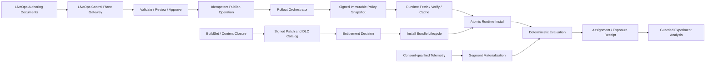

---
related_code:
  - tools/editor-workbench-preview/design-manifest.mjs
  - tools/editor-workbench-preview/design.js
  - tools/editor-workbench-preview/design.html
  - tools/editor-workbench-preview/design.css
  - tools/editor-workbench-preview/export-designs.mjs
  - tools/editor-workbench-preview/verify-designs.mjs
  - docs/ui-and-layout/index.md
  - docs/ui-and-layout/editor-workbench-designs
  - zircon_editor/src/core/settings/authority.rs
  - zircon_editor/src/core/settings/registry.rs
  - zircon_editor/src/core/export/stages/platform_bundle.rs
  - zircon_runtime/runtime-feature-presets.toml
  - zircon_runtime/src/plugin/runtime_profile/feature_presets.rs
  - zircon_runtime/src/plugin/package_manifest/plugin_feature_bundle_manifest.rs
  - zircon_runtime/src/core/framework/net/download.rs
  - zircon_runtime/src/graphics/pipeline/declarations/compiled_render_pipeline/runtime_feature_flags.rs
  - zircon_runtime/src/graphics/scene/scene_renderer/post_process/scene_runtime_feature_flags/scene_runtime_feature_flags.rs
  - tools/zircon_export/platform_bundle.py
  - tools/mvp/MvpStagingRelease.psm1
plan_sources:
  - docs/plans/optimize/00-engine-wide-review.md
  - docs/plans/optimize/01-cross-report-owner-schema-abi-p0-consolidation-review.md
  - docs/plans/optimize/zircon_editor/08-command-registry-keymap-menu-palette-context-routing-remote-automation-review.md
  - docs/plans/optimize/zircon_editor/12-settings-preferences-scope-persistence-locale-i18n-appearance-plugin-extensibility-review.md
  - docs/plans/optimize/zircon_editor/25-runtime-diagnostics-performance-timeline-console-telemetry-observability-authoring-review.md
  - docs/plans/optimize/zircon_editor/26-multiplayer-lobby-matchmaking-online-services-replication-network-emulation-pie-authoring-review.md
  - docs/plans/optimize/zircon_editor/27-project-operations-source-control-changelist-diff-automation-report-submit-gates-health-dashboard-review.md
  - docs/plans/optimize/zircon_plugins/01-plugin-sdk-package-catalog-distribution-native-abi-review.md
  - docs/plans/optimize/zircon_tooling/03-export-preset-build-cook-pack-platform-bundle-release-review.md
  - docs/plans/optimize/zircon_tooling/07-performance-benchmark-profile-capture-symbol-crash-evidence-baseline-review.md
  - docs/plans/optimize/zircon_tooling/09-release-channel-artifact-repository-install-update-rollback-operations-review.md
  - docs/plans/optimize/zircon_tooling/14-editor-workbench-design-spec-screenshot-export-visual-evidence-prototype-governance-review.md
  - docs/plans/optimize/zircon_tooling/26-security-principal-credential-trust-capability-cryptography-supply-chain-audit-review.md
  - docs/plans/optimize/zircon_tooling/27-version-domain-schema-compatibility-support-window-migration-deprecation-upgrade-downgrade-review.md
reference_engines:
  - dev/UnrealEngine/Engine/Plugins/Online/OnlineFramework/Source/Hotfix/Public/OnlineHotfixManager.h
  - dev/UnrealEngine/Engine/Plugins/Online/OnlineFramework/Source/Hotfix/Private/OnlineHotfixManager.cpp
  - dev/UnrealEngine/Engine/Plugins/Online/OnlineFramework/Source/Hotfix/Public/UpdateManager.h
  - dev/UnrealEngine/Engine/Plugins/Online/OnlineFramework/Source/Hotfix/Private/UpdateManager.cpp
  - dev/UnrealEngine/Engine/Source/Runtime/InstallBundleManager/Public/InstallBundleManagerInterface.h
  - dev/UnrealEngine/Engine/Source/Runtime/InstallBundleManager/Public/InstallBundleTypes.h
  - dev/UnrealEngine/Engine/Plugins/Runtime/GameFeatures/Source/GameFeatures/Public/GameFeaturesSubsystem.h
  - dev/UnrealEngine/Engine/Plugins/Runtime/GameFeatures/Source/GameFeatures/Private/GameFeaturePluginStateMachine.h
  - dev/UnrealEngine/Engine/Plugins/Runtime/GameFeatures/Source/GameFeatures/Private/GameFeaturePluginStateMachine.cpp
  - dev/UnrealEngine/Engine/Source/Runtime/Engine/Classes/Engine/AssetManagerTypes.h
  - dev/UnrealEngine/Engine/Source/Runtime/Analytics/Analytics/Public/Interfaces/IAnalyticsProvider.h
  - dev/UnrealEngine/Engine/Source/Runtime/CrashReportCore/Public/CrashReportCoreConfig.h
  - dev/godot/core/io/pck_packer.h
  - dev/godot/core/io/pck_packer.cpp
  - dev/godot/platform/windows/crash_handler_windows.h
  - dev/godot/platform/windows/crash_handler_windows_seh.cpp
  - dev/bevy/crates/bevy_asset/src/io/source.rs
  - dev/bevy/crates/bevy_asset/src/server/mod.rs
  - dev/bevy/crates/bevy_remote/src/lib.rs
  - dev/bevy/crates/bevy_remote/src/http.rs
  - dev/Fyrox/fyrox-impl/src/engine/hotreload.rs
  - dev/Fyrox/fyrox-resource/src/manager.rs
  - dev/Fyrox/fyrox-resource/src/event.rs
  - dev/Graphics/Packages/com.unity.render-pipelines.core/Editor/Analytics/AnalyticsUtils.cs
  - dev/Graphics/Packages/com.unity.render-pipelines.core/Editor/Analytics/RenderPipelineGraphicsSettingsAnalytics.cs
  - dev/Graphics/Packages/com.unity.render-pipelines.core/Editor/BuildProcessors/CorePreprocessBuild.cs
  - dev/Graphics/Packages/com.unity.render-pipelines.core/Editor/BuildProcessors/SettingsStrippers/RenderingDebuggerRuntimeResourcesStripper.cs
doc_type: review-and-refactor-plan
review_status: review_complete
implementation_status: pending
source_recheck_required: true
---

# 46 · LiveOps / Feature Flag / Remote Config / Segmentation / Experiment / Patch / DLC / Crash Control Plane Authoring 工程化差距

## 1. 结论

Zircon当前没有可称为工程级LiveOps控制面、Feature Flag、Remote Config、Player Segment或Experiment产品。仓库确实展示了八张视觉完成度较高的Workbench：`feature-flags`、`remote-config`、`telemetry-query`、`patch-planner`、`dlc-catalog`、`crash-symbolication`、`player-segment`和`experiment-console`；但它们只存在于`tools/editor-workbench-preview`、八张PNG和文档索引。对生产Editor、Runtime、Plugin、Hub、App、Interface与Host的精确检索没有找到对应capability、document、command、operation、provider或runtime consumer。

这八张页面不是“后端还少几个接口”的半成品。`design.js`直接写死Live v42、12 live flags、42k users、3 live experiments、184 crashes、92% resolved、8 DLC packs和24 patch changes；同一文件没有`addEventListener`、`fetch`、XHR、WebSocket、storage、timer、message channel或签名验证。按钮、筛选、发布、rollout、launch、resolve、package与export都只是截图中的视觉字符，没有任何effect或receipt。`docs/ui-and-layout/index.md`又把它们列为LiveOps pages，因此必须同时纠正“有图即有能力”的文档投影。

现有局部基础值得保留，但语义不能偷换。Editor `SettingsRegistry`有User/Project/Session三层、schema校验、revision和snapshot；Runtime profile preset有build-time schema和生成式Cargo feature闭包；Plugin feature bundle有owner/dependency/module/capability/packaging描述；Net download DTO有chunk/hash/resume/status；export pipeline能产出pack/delta pack/platform bundle。它们分别是本地设置、构建选择、插件装配、下载描述和发布产物基础，不是远程运营策略、玩家定向、实验分桶、内容授权或运行时热更新authority。Graphics里的`runtime_feature_flags`更只是编译后渲染路径布尔位，绝不能因同名被接成远程Feature Flag。

工程级目标应分成三条独立但可组合的链：`authoring document -> review/publish/rollout operation -> signed immutable policy snapshot -> runtime fetch/verify/cache/atomic install -> deterministic evaluation`；`consent-qualified telemetry -> segment materialization -> experiment assignment/exposure -> guarded analysis`；以及`BuildSet/content closure -> signed patch/DLC catalog -> entitlement -> install bundle lifecycle`。Crash ingestion、symbol store和symbolication仍由Tooling07拥有，Telemetry schema/privacy由Editor25拥有，build/cook/pack与release/install/rollback由Tooling03/09拥有；本篇拥有LiveOps Editor产品、远程策略控制面、运行时策略合同及这些owner的typed orchestration，不复制第二套发布、遥测或崩溃系统。

本轮登记 **6项P0、72项P1、12项P2和36个验收门**。在M0真实性封口、M1域模型与M2签名快照完成前，八张页面只能标记为`concept/prototype/unavailable`，不得进入产品导航、能力覆盖、发布说明或性能对比。

## 2. 审查范围、物理事实与证据强度

### 2.1 选定范围

| 子域 | 文件 / 行 / bytes | 证据 |
|---|---:|---|
| Zircon LiveOps DesignSpec、renderer、verifier、docs与局部基础 | 18 / 16,417 / 778,467 | E3逐manifest、八组config/detail/output、renderer I/O语义、settings/profile/plugin/download/export局部合同 |
| 八张tracked LiveOps PNG | 8 / binary / 779,850 | E2逐输出存在性与Feature Flags页面视觉检查；只证明设计意图 |
| Unreal Hotfix/Update/InstallBundle/GameFeatures/AssetManager/Analytics/Crash | 12 / 14,520 / 574,706 | E2/E3按状态机、结果、依赖、进度、撤销、content lifecycle和provider边界 |
| Godot PCK与Windows crash handler | 4 / 696 / 25,769 | E2按pack增删/加密和最小crash capture边界；不是完整LiveOps参考 |
| Bevy AssetSource/AssetServer/Remote | 4 / 5,328 / 203,395 | E2按named source、reader/writer/watcher、reload与transport/method registry边界 |
| Fyrox hot reload/ResourceManager/events | 3 / 2,945 / 113,229 | E2按state保存恢复、resource registry/watcher/event边界；不是远程运营控制面 |
| Unity Graphics analytics/build stripping | 4 / 472 / 17,835 | E2仅按analytics enabled gate、event metadata、build callback与setting stripping；不外推Unity LiveOps闭源能力 |
| 合计 | 53 / 40,378 / 2,493,251 | 21个参考test attributes；Zircon选定26文件当前clean |

Zircon选定26文件按规范化路径排序，对每个文件计算小写SHA-256，再以`path|hash`和LF连接形成清单，当前工作树fingerprint为`b36f6ae575891aee88ca63bae19f204a590c225f2c72a2959e3b9a8ab0c45da7`。源revision为`ae2be3d865a937b9ed368bf965592045346c64e3`；选定文件没有非本轮在途修改，但邻接Editor/Runtime源码仍有大量其他会话改动，实施前必须重算fingerprint和全仓精确命中。

### 2.2 八张页面的事实表

| 页面 | 固定声明 | 生产authority检索 | canonical实现owner |
|---|---|---|---|
| Feature Flags | 12 live / 2 staged、25% Beta rollout | 无 | 本篇Policy/Runtime Evaluation |
| Remote Config | Live v42 / 3 drafts、8 keys changed | 无 | 本篇Policy/Publish Control Plane |
| Telemetry Query | 1.2k events、3 alerts | 无；Editor25已确认Telemetry provider不存在 | Editor25数据治理，本篇只消费qualified query |
| Patch Planner | 0.18.1 / 24 changes、0 blockers | 无Editor product | Tooling03/09 artifact/release，本篇只编排candidate |
| DLC Catalog | 8 packs、Steam/Xbox/PSN SKU与entitlement | 无 | Tooling03/09 + Plugins01 + 本篇catalog/entitlement UX |
| Crash Symbolication | 184 crashes、92% resolved、6 symbols missing | 无 | Tooling07 crash/symbol evidence，本篇只做查询/triage UX |
| Player Segment | 42k users、3 cohorts、2 alerts | 无 | 本篇Segment，依赖Editor25 consent/telemetry |
| Experiment Console | 3 live、8 variants、10% traffic | 无 | 本篇Experiment，依赖Segment/Telemetry |

精确ID检索显示，八组ID除preview工具、verifier和静态文档外没有生产命中。`feature-flags`的另外四个命中属于MUI-X样式测试字符串，不是业务Feature Flag。`experimental` plugin maturity、Cargo features、Render Profile、Shader feature bit和Solari experimental gate也不是LiveOps实验或玩家分桶证据。

### 2.3 动态证据边界

本轮没有运行Cargo、Editor、Hub、远程服务、发布、下载、Telemetry、crash upload或实验。原因不是把静态阅读当动态通过，而是当前没有可运行的LiveOps产品入口或provider；编造一个mock server只会再次制造假闭环。Tooling14已在同一DesignSpec revision上确认270页可静态渲染，同时`npm run design:verify`因fixture digest漂移失败；相关source没有变化，本轮没有重复同一失败lane，也没有执行会覆盖271张PNG的`design:export`。

Feature Flags PNG已人工检查：页面视觉上呈现Live/Staged/Draft、Audience、Rollout、Validation与Output，并使用“12 flags scanned”等完成式文案。这进一步证明M0需要显式Prototype/Unavailable标识；它不增加后端、交互、可访问性或产品证据等级。

## 3. 必须保留且不得冒名的真实基础

1. 保留Editor settings的typed definition、scope校验、revision、change log和immutable snapshot；它适合本地Editor偏好，不应接收tenant/player/region环境的远程策略。
2. 保留Runtime profile preset的单一TOML、build-time validator和生成式Cargo feature闭包；它决定二进制能力，不应在运行中由远程服务改变。
3. 保留`PluginFeatureBundleManifest`的owner、dependency、module、capability与packaging字段；它可成为DLC/Game Feature manifest材料，但需要版本、签名、安装与生命周期owner。
4. 保留`NetDownloadManifest`的chunk、content hash、mirror、resume与progress DTO；Runtime08E继续拥有网络实现，本篇只要求Install Bundle在其上建立可信manifest和事务生命周期。
5. 保留`zircon_export`的pack、delta pack、platform bundle、report与handoff；Tooling03拥有构建正确性，Tooling09拥有channel/repository/install/update/rollback。
6. 保留Tooling26的Principal/SecurityContext/TrustReceipt方向；LiveOps发布和运行时下载必须消费它，不能自建字符串token与散落secret。
7. 保留Tooling27的BuildIdentity、VersionDomain、CompatibilityDecision、SupportWindow与MigrationReceipt方向；策略和内容snapshot必须携带这些身份。
8. 保留Editor25的Telemetry schema、consent、redaction、tenant、retention与deletion边界；Segment/Experiment只能消费qualified数据，不拥有第二条采集链。
9. 保留Tooling07的capture、symbol、crash evidence边界；本篇不实现minidump解析、symbol store或symbolication算法。
10. 保留Tooling14的DesignSpec状态与视觉证据治理方向；八张图应继续作为concept设计输入，但不能计入implemented capability。

## 4. 当前实现事实与参考差距

### 4.1 DesignSpec把八个不同风险域压成同一静态表格模板

八页共用`table-editor`或`metrics-graph`、四行fixture、summary、detail和三行output。Feature rollout、Remote Config publish、Patch validation、DLC entitlement、Crash resolve和Experiment launch在代码里只是不同label。真实系统需要完全不同的权限、状态机、失败、回滚、证据、隐私与运行时consumer；共享Workbench chrome可以复用，domain operation不能复用一个“按钮 -> 成功文本”的generic contract。

### 4.2 本地Feature、远程Policy与Experiment是三种不同语义

仓内至少存在四类名为feature/flag的对象：Cargo/runtime profile feature决定binary closure；plugin feature bundle决定可装配模块；render runtime flags决定当前compiled pipeline路径；Solari experimental gate决定显式实验渲染能力。它们都由build/project/renderer owner解析，输入不含player、tenant、environment、audience、assignment或policy revision。LiveOps必须采用独立类型和namespace，禁止把现有bool集合序列化后远程覆盖。

### 4.3 Settings snapshot可借鉴形状，但不是Remote Config

`SettingsRegistry`有三层precedence和snapshot，这是正向结构；但definition静态注册，scope只有User/Project/Session，value与变更面向Editor，authority也没有tenant、environment、targeting rule、signature、expiry、fetch/cache、rollout、approval或runtime install。Remote Config应复用“validated immutable generation”的思想，不能直接扩展Settings key空间承载生产玩家策略。

### 4.4 Download DTO和delta pack没有形成Install Bundle

`NetDownloadManifest`描述chunk URL/hash/resume，`zircon_export`能产出pack/delta pack；两端之间没有signed catalog、bundle dependency closure、disk/cache admission、download/install/mount/activate/release状态机、cancel/pause/resume、retry、recovery、entitlement、compatibility或atomic visibility。DLC页面却已显示跨商店SKU和Ready/Live状态，远超当前证据。

### 4.5 Segment与Experiment没有数据、隐私或统计authority

仓内不存在player identity resolution、consent-qualified event lake、segment definition/materialization、freshness、randomization unit、sticky assignment、mutual exclusion、holdout、exposure event或sample-ratio guard。将42k users、conversion和A/B/C结果写进截图，会掩盖数据删除、未成年人、区域规则、PII、重复曝光、交叉实验污染和错误统计结论等高风险问题。

### 4.6 参考引擎给出的可验证边界

Unreal Hotfix将非可执行INI/PAK/locres文件的枚举、读取进度、changed/removed delta、INI backup/restore、PAK mount/unmount、compatibility与needs reload/relaunch显式化；UpdateManager有Idle/Pending/Patch/Hotfix/Preload/Complete状态和typed completion。InstallBundleManager进一步提供init、content state、dependency query、update/release、cache、cancel/pause/resume、progress与patch check。GameFeatures又以URL/protocol/options、destination/transition/error state、dependency、install/mount/register/load/activate/deactivate/uninstall、cancel/progress/result管理动态内容。Zircon不需要复制其历史API，但最低也不能少这些生命周期事实。

Unreal AssetManager用Primary Asset、priority、chunk、recursive management与cook rule建立内容闭包；Analytics provider把session/user/event/flush分开，CrashReportCore把crash采集配置独立于Editor视图。Godot PCK支持start/add/remove/encrypt/flush，但没有完整LiveOps控制面；其crash handler也只是平台捕获下限。Bevy named AssetSource、reader/writer/watcher和Remote method registry证明source与transport可扩展，但不提供发布治理。Fyrox ResourceManager/hot reload证明registry、watcher、event和state restore。Unity Graphics源码只证明analytics enabled gate、event metadata和build-time settings stripping；本地镜像不包含Unity Gaming Services LiveOps，因此本文不凭产品印象补齐闭源实现。

## 5. 目标架构与责任边界

### 5.1 必须新增的公共合同

- `LiveOpsProjectId / TenantId / EnvironmentId / PolicyId / PolicyRevision / SnapshotId / BuildSetId`必须是稳定typed identity，不得用显示名和自由字符串拼接。
- `FeatureFlagDefinition`与`RemoteConfigDefinition`共享owner/version/value schema/targeting policy，但前者返回variant/boolean，后者返回typed value；两者不与Cargo、plugin或render feature类型复用。
- `EvaluationContext`是一次session/frame冻结的最小、已授权属性snapshot；不得让任意provider在每次flag读取时回调网络、账号或可变World。
- `PolicySnapshotEnvelope`包含canonical payload hash、schema/version、environment、compatible build range、created/expiry、issuer/key、signature、rollout generation与rollback predecessor。
- `PublishOperation`必须有request/idempotency、principal、source revision、target environment、approval set、validation artifact、deadline、state、逐stage receipt和audit cursor。
- `AssignmentReceipt / ExposureReceipt`必须区分“被分配”“真正暴露”“转化事件”，携带experiment/variant/policy revision/randomization unit和privacy class。
- `ContentBundleManifest`必须包含bundle/version/chunk/dependency/size/hash/signature/platform/build compatibility/install policy/mount point/entitlement requirement。

### 5.2 canonical owner矩阵

| 责任 | canonical owner | 本篇关系 |
|---|---|---|
| Editor LiveOps documents、review、rollout、simulation、status UX | Editor46 | 直接拥有 |
| Runtime policy fetch/verify/cache/install/evaluate合同 | Runtime新LiveOps domain + Editor46 schema | 本篇定义跨边界验收，Runtime实现另立owner |
| Local Editor preferences | Editor12 | 只复用snapshot思想，不迁入LiveOps |
| Telemetry schema/query/consent/redaction/retention | Editor25 | Segment/Experiment的硬依赖 |
| Online identity/session/provider | Editor26 / Runtime08E | 提供qualified subject，不把账号逻辑塞进flag evaluator |
| Build/cook/pack/delta/platform bundle | Tooling03 | Patch/DLC source artifact依赖 |
| Release channel/repository/install/update/rollback | Tooling09 | Patch Planner只编排其operation |
| Plugin package/Game Feature capability | Plugins01 | DLC/feature package admission依赖 |
| Crash capture/symbol/evidence | Tooling07 | Crash页面只查询typed artifact |
| Security principal/credential/trust/audit | Tooling26 | 发布、下载、entitlement必需 |
| Version/compatibility/migration/support window | Tooling27 | snapshot/content/schema必需 |
| DesignSpec/prototype状态与visual evidence | Tooling14 | 八页先降级为prototype |

## 6. P0：立即封口的真实性、安全与effect边界

### E-LIVEOPS-P0-001 · 八张静态页面必须从产品能力投影中fail-close

Manifest、PNG与docs只能标记`concept/prototype`；production capability registry、默认导航、release notes和coverage不得显示implemented。若未来接入Editor，provider/capability/admission缺失时必须显示Unavailable，不能回退fixture。

### E-LIVEOPS-P0-002 · 禁止把Cargo、Plugin、Render或Experimental bool远程化

现有同名feature/flag对象分别决定binary、module与GPU pipeline结构，热改可造成ABI、资源布局、shader binding或能力事实失配。建立独立LiveOps namespace/type，compile-time和render flag只能作为只读eligibility输入，不能成为远程policy写目标。

### E-LIVEOPS-P0-003 · 无签名、兼容、expiry与atomic install的远程策略不得进入Runtime

在TrustReceipt、VersionDecision、environment/build binding、canonical hash、signature、cache recovery和frame/session fence完成前，Runtime不得读取网络配置、任意URL或Editor settings作为玩家策略。失败必须使用显式last-known-good/default并报告degraded provenance。

### E-LIVEOPS-P0-004 · Publish/Rollout/Launch/Resolve/Package不得由UI直接宣称成功

所有effect必须来自idempotent operation及逐stage receipt；source revision冲突、approval缺失、partial provider failure、cancel、timeout和rollback都要可见。删除Live v42、3 experiments live、92% resolved等无source完成式反馈。

### E-LIVEOPS-P0-005 · Segment/Experiment在无consent、identity和exposure合同前必须禁用

不得读取或上传PII，不得按region/account/device生成隐式高基数属性，不得用telemetry dashboard fixture计算人群或实验结果。无consent-qualified provider时Segment和Experiment产品均为Unavailable。

### E-LIVEOPS-P0-006 · Patch/DLC/Crash聚合页不得绕过各canonical安全owner

Patch必须消费Tooling03/09的BuildSet、artifact、repository、compatibility和rollback receipt；DLC必须再经过签名、entitlement、install lifecycle；Crash必须消费Tooling07的crash/symbol artifact。Editor46不能自己下载、mount、解包、解析minidump或持有store credential。

## 7. P1：工程化主线

### 7.1 Domain、Identity、Schema与Snapshot

### E-LIVEOPS-P1-001 · 拆分六个domain model

Feature Flag、Remote Config、Segment、Experiment、Patch/DLC和Crash Query必须有独立schema、owner与operation；共享identity/audit，不共享万能JSON document。

### E-LIVEOPS-P1-002 · 建立稳定typed identity

Project、tenant、environment、policy、segment、experiment、variant、bundle、release、crash group和symbol set均使用稳定ID；display name可改且不参与引用。

### E-LIVEOPS-P1-003 · 将environment与principal设为一等边界

至少区分local/dev/test/staging/canary/production，并绑定organization/project/region/provider；跨环境promotion是新operation，不是修改一个字符串。

### E-LIVEOPS-P1-004 · 绑定source revision、BuildSet与compatible range

每份draft、published snapshot和content catalog同时记录source revision、producer BuildSet、minimum/maximum compatible build与schema version。

### E-LIVEOPS-P1-005 · 定义typed config value schema

支持bool/int/float/string/enum/duration/ratio/color/asset reference/structured object等受控类型，包含range、length、finite、unit和custom validator；禁止任意无界JSON直达Runtime。

### E-LIVEOPS-P1-006 · 默认值与required/fallback语义必须显式

definition声明compile default、server default、last-known-good、missing/expired/invalid策略和是否允许启动阻塞；consumer不得各写一个`unwrap_or(false)`。

### E-LIVEOPS-P1-007 · 建立targeting attribute registry

属性包含stable ID、type、source owner、privacy class、availability、freshness、cardinality和allowed environments；未注册属性不能进入规则。

### E-LIVEOPS-P1-008 · 使用versioned targeting AST

支持typed compare、set membership、range、locale/region、percentage bucket和组合逻辑；canonical normalization、depth/node/CPU预算及unknown operator拒绝必须可测试。

### E-LIVEOPS-P1-009 · 建立policy dependency graph

Flag/Config/Segment之间的引用必须检测missing、cycle、environment mismatch与version mismatch；编译为拓扑有序artifact，不在每次evaluate递归解析。

### E-LIVEOPS-P1-010 · 提供alias、deprecation与migration

rename/split/merge/value transform需要Tooling27的version domain与migration receipt；旧key使用量可观测并有removal window。

### E-LIVEOPS-P1-011 · owner与provenance进入每个定义

记录owner package/team、created/modified principal、source document、ticket/change request和schema provider generation；plugin unload可撤销definition lease。

### E-LIVEOPS-P1-012 · canonical serialization、hash与signature envelope

字段顺序、数字、Unicode、map排序和unknown field规则固定；hash覆盖完整identity，signature与key rotation/revocation由Tooling26提供。

### 7.2 Runtime Fetch、Install与Evaluation Data Plane

### E-LIVEOPS-P1-013 · 建立provider-neutral Runtime LiveOps接口

Runtime只依赖fetch snapshot、watch generation、health与ack receipt合同；HTTP/vendor SDK放adapter，不能侵入gameplay或render module。

### E-LIVEOPS-P1-014 · 建立有界fetch/cache pipeline

支持ETag/digest、deadline、retry/backoff/jitter、download byte budget、mirror、cancel和offline；网络线程不直接改World或全局map。

### E-LIVEOPS-P1-015 · 验签必须先于解析和安装

校验source origin、TLS/pin policy、manifest hash、signature、issuer/key、expiry、revocation、environment和BuildSet，再解析高成本payload。

### E-LIVEOPS-P1-016 · 定义bootstrap与offline策略

首次启动、无网、cache损坏、clock异常、future schema与expired snapshot分别有typed状态；shipping默认不得静默使用dev环境或空策略。

### E-LIVEOPS-P1-017 · snapshot安装必须原子且可恢复

staging验证通过后一次交换generation；崩溃/断电保留last-known-good，启动恢复不能看到半份policy或混合revision。

### E-LIVEOPS-P1-018 · evaluation必须确定且无I/O

相同snapshot、context与subject seed产生相同结果；hot path不分配、不锁全局大mutex、不访问网络/磁盘/账号provider。

### E-LIVEOPS-P1-019 · EvaluationContext必须冻结且最小化

context由授权provider在session/frame边界生成immutable snapshot，包含availability/provenance；consumer不能任意拉取PII字段。

### E-LIVEOPS-P1-020 · percentage rollout与assignment必须sticky

使用versioned稳定hash、明确randomization unit、salt和bucket count；扩缩traffic时迁移量可预测，跨设备/账号策略明确。

### E-LIVEOPS-P1-021 · kill switch与override precedence必须统一

emergency disable、environment override、QA override、segment rule、percentage与default的优先级进入编译合同；override有expiry、principal与audit。

### E-LIVEOPS-P1-022 · session/frame一致性必须可选择

配置声明install cadence：startup-only、session-boundary、world-boundary或frame-boundary；一次simulation/frame内不能读到两个generation。

### E-LIVEOPS-P1-023 · 预算与攻击面必须有上限

限制snapshot bytes、definitions、rules、AST depth、attributes、string length、segment references、evaluation count和per-frame time；超限fail closed并计数。

### E-LIVEOPS-P1-024 · 暴露完整但低敏诊断

提供provider/generation/freshness/cache/default/fallback/reject/eval latency与reason code，不记录secret、原始PII或无界subject ID。

### 7.3 Draft、Review、Publish与Rollout Control Plane

### E-LIVEOPS-P1-025 · Draft必须是transactional document

接入Editor02的dirty/save/autosave/recovery/undo-redo，字段编辑产生typed command；不直接修改published generation。

### E-LIVEOPS-P1-026 · Promotion必须跨environment显式执行

dev到staging、staging到production各自产生candidate、diff、validation与approval；禁止把production当另一个tab直接覆盖。

### E-LIVEOPS-P1-027 · 建立语义diff

显示definition/rule/default/targeting/dependency/build compatibility变化及预计影响，不只比较JSON文本或“8 keys changed”。

### E-LIVEOPS-P1-028 · 建立publish前validation artifact

验证schema、cycles、dead rule、unreachable variant、missing default、attribute privacy、build compatibility、sample cohort与runtime evaluator parity。

### E-LIVEOPS-P1-029 · 接入RBAC与多方approval

read/edit/review/approve/publish/rollback/secret/store entitlement权限分离；production高风险change可要求双人审批与owner gate。

### E-LIVEOPS-P1-030 · Publish operation必须幂等

request ID、idempotency key、source revision、target environment、deadline和expected predecessor固定；重试返回同一receipt而非重复发布。

### E-LIVEOPS-P1-031 · Rollout建立明确状态机

Draft -> Validated -> Approved -> Scheduled -> Canary -> Expanding -> FullyRolledOut / Paused / RollingBack / Failed；每阶段有generation与进入条件。

### E-LIVEOPS-P1-032 · Health gate必须消费qualified指标

crash、error、latency、conversion等gate绑定query revision、source、sampling、freshness和minimum sample；Telemetry不可用时不能自动判GREEN。

### E-LIVEOPS-P1-033 · Rollback是一等operation

记录predecessor、compatibility、rollback reason、principal和逐region/provider结果；策略回滚与内容二进制回滚不可混为一个按钮。

### E-LIVEOPS-P1-034 · 调度采用明确clock与timezone

start/end、blackout、freeze window和expiry绑定UTC、source clock与skew tolerance；Runtime22拥有clock基础，UI显示用户locale但保存canonical time。

### E-LIVEOPS-P1-035 · 并发编辑与发布使用CAS

draft revision、approval revision和published predecessor均比较；stale editor不得覆盖新发布，冲突进入merge/rebase而非last-write-wins。

### E-LIVEOPS-P1-036 · 建立不可变audit journal

记录principal、intent、before/after digest、validation、approval、operation stages、provider response和rollback；query/export有retention与redaction。

### 7.4 Segment、Experiment、Privacy与分析

### E-LIVEOPS-P1-037 · 每个attribute/event定义privacy classification

区分public/device/account/pseudonymous/sensitive/secret，声明purpose、retention、allowed regions与consumers；unknown classification拒绝进入Segment。

### E-LIVEOPS-P1-038 · consent与legal basis进入query plan

Segment materialization和exposure只消费当前有效consent/purpose；withdrawal触发后续排除与删除流程，不能只在UI隐藏。

### E-LIVEOPS-P1-039 · 最小化与pseudonymization

 evaluator使用稳定pseudonymous subject key和最小属性，不复制邮箱、昵称、IP或完整设备指纹到policy/cache/log。

### E-LIVEOPS-P1-040 · retention与deletion传播到派生数据

raw event、segment membership、assignment、exposure、analysis和export分别声明TTL；删除请求能追踪并清除派生artifact。

### E-LIVEOPS-P1-041 · Segment定义明确time semantics

event time、ingest time、window、late arrival、timezone、dedupe与membership expiry固定；“Returning Players”不能只是无时间定义的label。

### E-LIVEOPS-P1-042 · materialization携带freshness与completeness

snapshot记录query revision、watermark、coverage、partial/error、member count uncertainty；陈旧或partial segment不能显示精确42k。

### E-LIVEOPS-P1-043 · identity merge/split必须可审计

guest->account、cross-device、account merge/delete和region move有versioned policy；assignment稳定性与历史数据处理明确。

### E-LIVEOPS-P1-044 · Experiment声明randomization unit和hypothesis

每项实验定义owner、hypothesis、primary/guardrail metrics、population、unit、variants、start/end与minimum duration，不只写A/B/C和traffic。

### E-LIVEOPS-P1-045 · mutual exclusion、holdout与layer

冲突实验进入显式layer/namespace；global holdout与长期基线有稳定assignment，防止交叉污染。

### E-LIVEOPS-P1-046 · allocation与sample-ratio mismatch门禁

traffic split总和、bucket coverage、assignment churn和observed allocation持续验证；SRM触发暂停/Invalid，不继续给出胜负结论。

### E-LIVEOPS-P1-047 · Exposure必须在真正展示时once-record

assignment不等于exposure；去重key包含experiment/variant/subject/session/policy revision，离线队列有budget、retry与drop receipt。

### E-LIVEOPS-P1-048 · 分析结果必须带统计资格

报告sample、effect、interval、missingness、multiple testing、guardrail与data freshness；不得只展示8.2% vs 9.1%并暗示胜者。

### 7.5 Patch、DLC、Crash、Telemetry与Plugin集成

### E-LIVEOPS-P1-049 · Telemetry Query只消费Editor25 provider

页面需要query ID/revision、tenant、time range、filters、sampling、freshness、privacy与export receipt；无provider时Unavailable，不建立本地第二仓库。

### E-LIVEOPS-P1-050 · Patch candidate绑定BuildSet

24 changes必须来自source/build/artifact manifest，记录base/target BuildSet、platform、profile、dependency closure、test qualification与provenance。

### E-LIVEOPS-P1-051 · Patch使用typed compatibility decision

Tooling27判断engine/plugin/asset/schema/save/network compatibility，区分hot apply、map reload、process restart、full patch与unsupported。

### E-LIVEOPS-P1-052 · Content bundle拥有确定性closure

由asset/package graph计算chunk、dependency、optional/required、size、hash和mount priority；missing/duplicate/cycle/collision在publish前失败。

### E-LIVEOPS-P1-053 · 实现Install Bundle完整生命周期

Init/Query/Request/Download/Verify/Install/Mount/Activate/Pause/Resume/Cancel/Release/Recover全部有typed state、progress、error与receipt。

### E-LIVEOPS-P1-054 · Entitlement是provider decision

subject/store/SKU/region/offline lease/refund/revocation/family sharing进入typed decision；游戏代码不直接比较SKU字符串。

### E-LIVEOPS-P1-055 · Store mapping与price不得写进engine truth

Steam/Xbox/PSN只是provider catalog projection；SKU mapping版本化、environment-specific并由credential/capability保护，price/availability带locale/currency/freshness。

### E-LIVEOPS-P1-056 · Hotfix限制可执行内容与apply surface

默认只允许签名、兼容、schema-validated data/config/content；native DLL、script bytecode、shader或unsafe asset patch需独立政策、restart和qualification，不能借PAK名义自动执行。

### E-LIVEOPS-P1-057 · Crash ingestion与grouping由Tooling07提供

Crash page消费CrashArtifactId、BuildSet、platform、fingerprint/group、sample count和privacy state；不直接扫描本地dump目录冒充全局队列。

### E-LIVEOPS-P1-058 · Symbol store绑定build与访问控制

symbol set含binary/module/build ID、platform、format、hash、upload/retention状态；解析结果携symbol revision、missing modules与confidence。

### E-LIVEOPS-P1-059 · DLC/Game Feature activation复用Plugin lifecycle

内容包、可选plugin和runtime service分别经过discover/admit/install/mount/register/activate/deactivate/unload/release；依赖失败可补偿，owner generation可撤销。

### E-LIVEOPS-P1-060 · 所有外部effect消费Security Control Plane

publish、download、store、entitlement、crash、symbol、telemetry分别使用最小scope credential lease、origin/trust decision、sensitive-field redaction和audit。

### 7.6 Editor产品、操作体验与资格

### E-LIVEOPS-P1-061 · 为每个产品建立真实capability descriptor

descriptor链接owner、document kind、provider、commands、operations、permissions、templates和acceptance tests；不再由DesignSpec ID推断实现。

### E-LIVEOPS-P1-062 · 使用provider-backed document和query snapshot

UI只消费immutable generation，编辑通过transaction command，远程query在后台job执行；presentation路径不阻塞网络或解析大人群。

### E-LIVEOPS-P1-063 · 展示完整状态与provenance

明确Draft/Validating/Approved/Published/RollingOut/Paused/Rollback/Failed/Stale/Offline/Unavailable，并显示environment、revision、source、freshness和principal。

### E-LIVEOPS-P1-064 · 大规模列表必须虚拟化和分页

10k flags、100k config keys、1k experiments、百万crash groups使用server-side query、cursor、sort、filter、bounded cache和cancel；不全量clone到pane。

### E-LIVEOPS-P1-065 · 提供typed rule/value editor

schema驱动字段、unit、enum、asset picker、attribute/rule builder与inline diagnostics；invalid draft可保存但不能publish，秘密值不回显。

### E-LIVEOPS-P1-066 · 建立离线simulation与subject preview

用脱敏fixture或synthetic subject在固定snapshot上解释matched rule、bucket、variant、fallback和cost；production用户查询需要额外权限和审计。

### E-LIVEOPS-P1-067 · Review展示语义diff与影响估计

在同一界面关联source diff、compiled diff、estimated audience、content size、compatibility、validation和approval，不靠summary数字。

### E-LIVEOPS-P1-068 · 长操作接入Job/Notification/Journal

query、materialize、publish、rollout、package、download、symbolicate都支持progress/cancel/retry/resume、background continuation和durable result link。

### E-LIVEOPS-P1-069 · 完成localization与accessibility

所有状态/reason/operation使用localized typed text；键盘、reader、focus、table semantics、chart alternative和color-independent state进入Editor23/33合同。

### E-LIVEOPS-P1-070 · Unavailable/Degraded必须是产品一等状态

缺provider、permission、consent、network、symbol、entitlement或fresh data时显示原因和可执行修复；绝不回退静态rows或固定成功。

### E-LIVEOPS-P1-071 · 建立故障与安全测试矩阵

覆盖bad signature、wrong environment/build、expired/revoked key、cache corruption、partial rollout、provider timeout、duplicate request、stale CAS、privacy deletion、SRM、entitlement revoke和mount failure。

### E-LIVEOPS-P1-072 · 建立规模、性能与currentness门

固定10k policy/1M subjects/100k keys/large bundle/crash corpus，测compile/evaluate/fetch/install/query/UI frame；source fingerprint或provider version变化自动标recheck。

## 8. P2：后续增强

### E-LIVEOPS-P2-001 · 可视化规则DSL与静态解释器

在typed AST之上提供graph/table双视图、dead branch、shadowing和complexity heatmap，不创建第二套语义。

### E-LIVEOPS-P2-002 · 历史snapshot simulation与replay

用脱敏event/context重放任意policy revision，比较assignment、exposure和配置差异，产出可复核artifact。

### E-LIVEOPS-P2-003 · 多区域主动-主动rollout

支持region wave、replication lag、quorum、split-brain检测与逐region rollback，仍保持单一logical operation。

### E-LIVEOPS-P2-004 · 多provider联邦与迁移

同一domain可在vendor/self-hosted provider之间迁移，identity、snapshot、audit和receipt保持稳定，避免vendor DTO泄漏gameplay。

### E-LIVEOPS-P2-005 · 高级实验统计

在统计owner和qualification后增加sequential testing、CUPED、heterogeneous treatment effect与长期holdout分析。

### E-LIVEOPS-P2-006 · 受控contextual bandit

只有在可解释、可回滚、guardrail、consent和off-policy evaluation齐备后启用；不能替代基础A/B正确性。

### E-LIVEOPS-P2-007 · 自动health guard与runbook

qualified metrics触发pause/rollback proposal，默认仍需权限策略；自动effect携完整reason、evidence和人工接管入口。

### E-LIVEOPS-P2-008 · Dynamic Game Feature热激活

在Install Bundle、Plugin lifecycle、World quiescence和state migration通过后支持内容/feature动态激活；不承诺任意native hot swap。

### E-LIVEOPS-P2-009 · 跨商店entitlement reconciliation

统一购买、退款、订阅、家庭共享、离线lease和cross-save权益，提供冲突与客服审计工具。

### E-LIVEOPS-P2-010 · 隐私保护的聚合分析

按产品需要评估k-anonymity、differential privacy或federated aggregate，并明确误差与不可逆删除合同。

### E-LIVEOPS-P2-011 · 多人review与approval协作

接入Editor43的presence/lock/comment/decision history，production publish仍由服务端CAS与policy授权，不依赖客户端锁。

### E-LIVEOPS-P2-012 · 全链路time-travel与事故复盘

按BuildSet、policy、segment、experiment、content、crash和operator operation重建任一时刻的事实，输出不可变incident bundle。

## 9. 实施里程碑

| Milestone | 范围 | 退出条件 |
|---|---|---|
| M0 Truth Closure | 八页降级、docs/coverage纠偏、ID namespace隔离 | 无provider时0 fixture、0成功文案、0implemented projection |
| M1 Domain & Schema | typed identity、definition、AST、snapshot、owner/version/security | schema golden/fuzz/migration通过；公共合同owner唯一 |
| M2 Runtime Data Plane | fetch/verify/cache/atomic install/evaluate/default/recovery | offline/bad signature/corrupt cache/frame consistency和hot-path预算通过 |
| M3 Publish & Rollout | draft/review/approval/CAS/state machine/health/rollback/audit | duplicate/partial/cancel/timeout/stale/restart故障注入通过 |
| M4 Segment & Experiment | consent、materialization、assignment、exposure、analysis | privacy deletion、identity merge、SRM、mutual exclusion和parity通过 |
| M5 Patch/DLC/Crash Integration | BuildSet/catalog/install/entitlement/plugin/crash/symbol query | signed bundle lifecycle、rollback、revocation、symbol/build mapping通过 |
| M6 Editor Product | provider-backed pages、job UX、simulation/diff/a11y/localization | 八页真实surface完成keyboard/reader/empty/degraded/error规模验收 |
| M7 Product Qualification | platform/provider/region/build/security/performance/incident matrix | 所有G01-G36有BuildSet-bound evidence，才可标implemented |

## 10. 验收门

| Gate | 必须证明的事实 |
|---|---|
| G01 | 八个DesignSpec均有`concept/prototype/implemented/verified/retired`状态，只有verified进入coverage |
| G02 | production中无provider时八个产品均Unavailable，0 fixture row、0固定成功反馈 |
| G03 | Cargo/plugin/render/experimental feature与LiveOps Policy类型、namespace、权限完全隔离 |
| G04 | 所有definition/snapshot有stable ID、owner、environment、revision、BuildSet和version |
| G05 | canonical serialization在Windows/Linux、debug/shipping和不同进程间hash一致 |
| G06 | wrong signature/key/origin/environment/build/expiry/revocation全部拒绝且不污染last-known-good |
| G07 | cache partial write/corruption/power loss可恢复，Runtime只看到完整generation |
| G08 | evaluate相同输入确定，hot path 0 I/O且满足固定allocation/latency budget |
| G09 | 同一session/frame按声明cadence只读取一个policy generation |
| G10 | targeting AST malformed/deep/cyclic/high-cardinality corpus有界拒绝 |
| G11 | percentage rollout跨重启/设备按声明sticky，扩容迁移比例可解释 |
| G12 | default/last-known-good/expired/offline/future schema各有typed outcome和provenance |
| G13 | draft edit具备undo/redo/autosave/recovery，不能直接改变published snapshot |
| G14 | publish使用source CAS、idempotency与approval；重复请求不产生第二generation |
| G15 | rollout pause/resume/expand/rollback/partial failure均有逐stage receipt |
| G16 | health gate绑定qualified metric/query/freshness/sample，Telemetry缺失时不判GREEN |
| G17 | audit可按principal/policy/operation追溯before/after digest且敏感字段已redact |
| G18 | attribute/event有privacy class、purpose、region、retention与consumer allowlist |
| G19 | consent withdrawal与deletion传播到segment/assignment/exposure/analysis派生数据 |
| G20 | Segment watermark/late data/partial/freshness明确，UI不把估计值显示为精确事实 |
| G21 | Experiment randomization、mutual exclusion、holdout、SRM和exposure once语义通过 |
| G22 | Runtime evaluator与Editor simulation对golden corpus逐result/reason一致 |
| G23 | Patch candidate可回溯base/target BuildSet、artifact closure、test与compatibility |
| G24 | bundle下载/验证/安装/mount/activate/release支持cancel/pause/resume/recovery |
| G25 | entitlement expired/refund/revoke/offline/provider unavailable有typed decision |
| G26 | hotfix不执行未授权native/script/shader payload；需reload/restart显式报告 |
| G27 | DLC/plugin dependency failure可补偿，unload/release不留dangling owner/provider |
| G28 | Crash query每项可回溯CrashArtifact/BuildSet/privacy/group revision |
| G29 | Symbol result绑定binary/module/build/symbol revision并报告missing/confidence |
| G30 | secret/token/store credential不进入document、log、telemetry、screenshot或artifact |
| G31 | 10k flags/100k keys/1k experiments/百万crash groups下UI保持虚拟化与响应预算 |
| G32 | query/publish/package/download/symbolicate后台job支持cancel/retry/resume与durable link |
| G33 | keyboard、reader、focus、table/chart alternative、locale/RTL/200% DPI通过 |
| G34 | provider/region/platform/build N-2/N-1/current/future与offline/degraded矩阵通过 |
| G35 | source/provider/schema fingerprint变化自动标记stale并阻止继续宣称verified |
| G36 | 同场景性能/可靠性/安全证据完成前不宣称LiveOps达到或超过Unreal |

## 11. 实施禁止项

- 禁止把`SettingsRegistry`增加Remote scope后直接当LiveOps。
- 禁止把render `runtime_feature_flags`、Cargo features或plugin `enabled_by_default`暴露给远程服务修改。
- 禁止用`serde_json::Value`、字符串表达式、百分比字符串和任意属性map作为长期wire/runtime contract。
- 禁止在无TrustReceipt/CompatibilityDecision前下载、解析、mount或激活远程内容。
- 禁止在UI callback里同步执行网络、segment query、publish、download、symbolication或大规模diff。
- 禁止用assignment事件代替exposure，或用DAU/转化率截图代替统计资格。
- 禁止Editor46保存provider secret、store credential、原始PII、minidump或symbol binary。
- 禁止将八张PNG或DesignSpec验证通过解释为产品实现通过。
- 禁止复制Tooling03/07/09、Editor25或Plugins01的canonical finding来抬高本篇计数。
- 禁止在M0-M2未通过时连接任何真实production tenant、store、telemetry或crash endpoint。

## 12. 本轮状态

本轮只完成review与重构计划，新增本报告；没有修改Runtime、Editor、Plugin、Hub、App、ABI、tests、manifest或workflow，没有发布策略、下载内容、查询用户、上传Crash或连接外部服务。八张现有PNG和preview source保持原样，既有Editor/Hub/WOC/plugin编译与验证阻断也没有变化。

下一轮实现必须从M0开始：先由Tooling14把八个DesignSpec降级并断开capability投影，再定义LiveOps identity/schema/security/version合同；随后才能建设Runtime snapshot data plane。任何具体UI实现都必须等待canonical provider、operation和receipt存在。只有G01-G36由current BuildSet-bound evidence全部通过后，Feature Flags、Remote Config、Segment、Experiment、Patch/DLC或Crash Control Plane才可标记为工程级产品。
