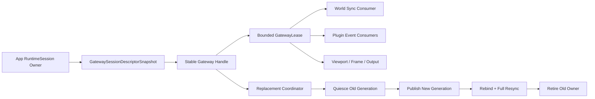

---
related_code:
  - zircon_editor/src/core/gateway
  - zircon_editor/src/core/runtime_event_consumer
  - zircon_editor/src/core/sync
  - zircon_editor/src/ui/host/editor_extension_registration.rs
  - zircon_editor/src/ui/host/editor_host_event_controller.rs
  - zircon_editor/src/ui/host/editor_host_startup.rs
  - zircon_editor/src/ui/host/editor_manager_minimal_host.rs
  - zircon_editor/src/ui/host/editor_world_sync.rs
  - zircon_editor/src/ui/host/editor_event_execution/menu_action.rs
  - zircon_editor/src/ui/retained_host/app.rs
  - zircon_editor/src/ui/retained_host/app/startup.rs
  - zircon_editor/src/ui/retained_host/app/host_lifecycle
  - zircon_app/src/entry/entry_runner/editor.rs
  - zircon_app/src/entry/entry_runner/editor/composition.rs
  - zircon_app/src/entry/runtime_library/runtime_session.rs
  - zircon_app/src/entry/runtime_library/runtime_session
  - zircon_runtime_interface/src/runtime_api/abi/api_table.rs
  - zircon_runtime_interface/src/runtime_api/session/plugin_event_mirror.rs
  - zircon_runtime_interface/src/world_sync
  - zircon_runtime/src/dynamic_api/session/event_mirror.rs
  - zircon_runtime/src/dynamic_api/session/world_sync.rs
tests:
  - zircon_editor/src/core/gateway/session/tests.rs
  - zircon_editor/src/core/sync/pump/tests.rs
  - zircon_editor/src/core/sync/watch_map/tests.rs
  - zircon_editor/src/tests/gateway
  - zircon_editor/src/tests/runtime_event_consumer.rs
  - zircon_editor/src/tests/runtime_event_consumer_bounded_pump.rs
  - zircon_editor/src/tests/runtime_event_consumer_bounded_pump
plan_sources:
  - docs/plans/zircon_editor/editor/01-editor-kernel-and-runtime-interaction.md
  - docs/plans/zircon_editor/editor/02-data-sync-and-messaging.md
  - docs/plans/zircon_editor/editor/01/failure-2026-07-17-gateway-stable-call-lock-and-clone.md
  - docs/plans/zircon_editor/editor/02/failure-2026-07-17-runtime-event-consumer-unbounded-pump-lock.md
  - docs/plans/zircon_editor/editor/02/failure-2026-07-22-world-sync-subscription-invalidation-scaling.md
  - docs/plans/zircon_editor/editor/02/failure-2026-08-01-plugin-registration-runtime-consumer-atomicity.md
  - docs/plans/zircon_editor/editor/01/failure-2026-07-31-highlight-set-gateway-contract.md
  - docs/plans/zircon_editor/editor/01/failure-2026-08-13-editorui10-test-budget-gateway-session.md
  - docs/plans/zircon_editor/editor/02/failure-2026-08-13-editorui10-test-budget-message-runtime-event.md
  - docs/plans/optimize/zircon_editor/01-retained-ui-architecture-performance-review.md
  - docs/plans/optimize/zircon_editor/02-document-transaction-save-autosave-recovery-review.md
  - docs/plans/optimize/zircon_editor/05-inspector-reflection-property-authoring-customization-review.md
  - docs/plans/optimize/zircon_editor/06-plugin-manager-discovery-enablement-live-reload-settings-diagnostics-review.md
  - docs/plans/optimize/zircon_editor/07-play-session-process-pie-game-view-live-edit-recovery-review.md
  - docs/plans/optimize/zircon_editor/09-background-jobs-admission-scheduling-cancellation-progress-shutdown-product-integration-review.md
  - docs/plans/optimize/zircon_runtime/43-dynamic-runtime-session-registry-ffi-frame-event-extract-host-request-world-sync-ui-shader-prewarm-product-integration-review.md
  - docs/plans/optimize/zircon_runtime_interface/02-serialization-reflection-resource-project-world-sync-public-dto-contract-review.md
  - docs/plans/optimize/zircon_runtime_interface/04-profiling-plugin-event-script-diagnostic-manifest-crate-ownership-consolidation-review.md
  - docs/plans/optimize/zircon_runtime_interface/05-runtime-host-foreign-output-safe-api-ownership-admission-budget-fuse-observability-review.md
reference_engines:
  - dev/UnrealEngine/Engine/Source/Runtime/SessionServices/Public/ISessionManager.h
  - dev/UnrealEngine/Engine/Source/Runtime/SessionServices/Private/SessionManager.h
  - dev/UnrealEngine/Engine/Source/Runtime/SessionServices/Private/SessionManager.cpp
  - dev/UnrealEngine/Engine/Source/Runtime/SessionServices/Private/SessionInfo.h
  - dev/UnrealEngine/Engine/Source/Runtime/SessionServices/Private/SessionInfo.cpp
  - dev/UnrealEngine/Engine/Source/Runtime/Messaging/Private/Bridge/MessageBridge.h
  - dev/UnrealEngine/Engine/Source/Runtime/Messaging/Private/Bridge/MessageBridge.cpp
  - dev/godot/editor/debugger/editor_debugger_node.h
  - dev/godot/editor/debugger/editor_debugger_node.cpp
  - dev/godot/editor/debugger/script_editor_debugger.h
  - dev/godot/editor/debugger/script_editor_debugger.cpp
  - dev/Fyrox/editor/src/message.rs
  - dev/Fyrox/editor/src/plugin.rs
  - dev/bevy/crates/bevy_remote/src/lib.rs
  - dev/bevy/crates/bevy_remote/src/builtin_methods.rs
doc_type: review-and-refactor-plan
review_status: review_complete
implementation_status: pending
source_recheck_required: true
---

# 47 · Runtime Gateway / Session / Event Consumer / World Sync / Generation / Backpressure / Reconnect / Shutdown 工程化差距

## 1. 结论

Editor到动态Runtime的边界已经不是临时空壳。`EditorRuntimeGatewayHandle`使用`ArcSwap`发布不可变`GatewayGeneration`，普通调用不再持有全局读锁；`SessionGateway`由`Arc<RuntimeSession>`保持动态库和session owner存活；foreign output有统一预算、释放和fuse；plugin event producer提供64 deliveries / 256 KiB的有界page、sequence、remaining和oldest-age；`WorldWatchMap`也已经用索引而不是全量视图扫描。这些基础必须保留。

当前阻断发生在更高一层：单次gateway调用会固定一个`Arc`，但Editor的协议通常是多步的。`WorldSyncPump::pump()`先独立读取`gateway.generation()`，随后通过另一次快照调用`drain_world_invalidations()`；runtime event consumer先读当前`session_handle()`，再逐subscription调用drain/unsubscribe，而`ActiveConsumer`只保存本地consumer generation，没有保存创建subscription时的gateway generation、runtime session identity或origin gateway lease。若Play runtime在两步之间替换，新的session可以复用同一个opaque token/subscription数值，旧watch map、旧plugin callback或旧Play identity便可能消费新session数据。这不是悬空指针问题，Arc owner已经阻止悬空；它是跨项目、跨PIE实例的身份污染和错误投影问题。

World Sync的producer分页也没有把分页事实传给consumer。一个`InvalidationBatch`可以拆成多个同generation页面，但DTO没有page sequence、cursor、remaining、oldest age或final marker；consumer只拒绝generation回退，不识别缺页、重复页或generation gap。它逐fact调用Editor bus并忽略dispatch report，却仍增加`published_facts`和提交`last_generation`，所以bus拒绝、背压或subscriber故障可被记录成已发布并永久越过恢复点。gateway replacement又直接清空全部watch，而不是在新session完成重订阅和full-resync后切换。

Runtime event consumer已经有生命周期原子门、公平round-robin、pending tail恢复和有界pump，但插件callback仍在Editor主路径直接执行且没有panic隔离。`begin_session`发生在active entry插入之前，panic会泄漏远端subscription；`consume` panic会丢失当前delivery；`end_session` panic会中断本地清理。每个active tick还会clone完整capability snapshot并全量diff全部registration，即使generation没有变化；aggregate backlog使用全有或全无的`try_fold`，一个尚未drain的consumer会隐藏其他consumer已经确定的积压。

产品退出路径没有统一的session shutdown coordinator。`EditorHostEventController::drop()`只注销scene-inspection subscriber，`RetainedEditorHost::drop()`只尝试注销hierarchy watch；两者都不保证`end_runtime_event_consumers -> unwatch all -> detach play gateway -> release outstanding output -> destroy RuntimeSession`。菜单退出还把远端unsubscribe成功当成本地退出的前置条件，transport已丢失时可能让Editor长期停在伪Playing状态。Godot在peer失活或消息格式错误时先终止本地debug session并清空cache，证明本地状态退休不能依赖已经失联的远端确认。

本报告新增 **1项P0、44项P1、12项P2和36个资格门**。Editor07继续拥有Play checkpoint、process/terminal ownership和PIE产品状态机；Runtime43拥有dynamic session producer、registry和Runtime侧page lifecycle；Runtime Interface 02/04/05拥有ABI DTO、foreign output和固定布局；Editor01/02拥有总体kernel/message路线。本文只拥有Editor消费端的session-qualified gateway lease、event consumer fault domain、world sync page/commit/resync、reconnect和host shutdown choreography，不重复累计父报告P0。

## 2. 审查边界、语料与 currentness

### 2.1 冻结语料

| 子域 | 文件 / 行 / bytes | 证据等级 | 本轮检查重点 |
|---|---:|---|---|
| Gateway、runtime event consumer、World Sync核心 | 34 / 5,860 / 196,476 | E3 | trait、ArcSwap generation、session owner、subscription、pump、watch map、page/output ownership |
| 聚焦测试 | 15 / 4,043 / 137,591 | E3 | 106个test attributes、2个managed ignored performance/E2E lane；替换、错误、预算、公平、panic tail语义 |
| Editor Host与Retained Host真实consumer | 11 / 2,911 / 120,264 | E3 | startup、extension registration、active tick、hierarchy refresh、menu exit、Drop与diagnostics投影 |
| App RuntimeSession与Editor composition | 6 / 1,998 / 77,467 | E3 | Arc owner、gateway转移、foreign output、session destroy和动态库寿命 |
| Runtime Interface与producer | 8 / 1,470 / 54,802 | E3 | V7 API、plugin page metadata、world invalidation分页、prepare/commit/rollback |
| 父计划与开放failure | 9 / 1,252 / 122,975 | E2 | 已完成优化的currentness、唯一owner和不能重复计数的问题 |
| Unreal、Godot、Fyrox、Bevy参考 | 15 / 9,953 / 347,606 | E2/E3 | session/instance identity、bridge teardown、disconnect、time-budget pump、plugin lifecycle和observer局限 |
| selected combined scope | 98 / 27,487 / 1,057,181 | E2/E3 | 工作树fingerprint `bfbf925c215138c729b69dfe3a27745ad82d977ceaff1ca4954da4a081905fb3` |

指纹按98个selected path去重排序，对每个文件取lowercase SHA-256，再以`forward/slash/path<TAB>hash`和LF连接、无末尾LF后取总SHA-256。统计冻结的是2026-08-19当前工作树，基线提交为`25e09a23178000f2e783ce2143cf70a8b118d404`。本轮只修改review文档和索引，不修改Rust、测试、Cargo、ABI、资源或产品配置。

### 2.2 检查方法

按`App RuntimeSession owner -> SessionGateway construction -> stable handle publication/replacement -> capability snapshot -> Editor Host startup -> plugin registration -> begin subscription -> active tick reconcile -> bounded drain -> callback -> pending tail -> World watch -> invalidation prepare/commit -> bus publication -> hierarchy refresh -> end/unsubscribe -> host Drop -> RuntimeSession destroy`顺序逐段阅读，并反向搜索真实产品caller和测试。

每一段核对session identity、gateway generation、opaque handle namespace、prepare/commit、panic/error、backpressure、cursor/gap、reconnect、local/remote retirement、owner lifetime、allocation和diagnostic projection。所有新发现都要求能落到当前代码控制流；没有以关键词数量或参考引擎功能列表直接计缺陷。

### 2.3 动态证据边界

1. 本轮是review-only，没有运行Cargo。跨代替换、callback panic、bus rejection、reconnect和shutdown kill-point均登记为待实施RED gate，不得把静态阅读写成动态通过。
2. 106个聚焦test attributes中有2个managed ignored lane，分别用于1K/10K delivery预算和真实Runtime ABI证据；它们没有覆盖gateway并发replacement、cross-session token collision、host Drop或断线退出。
3. 既有Editor编译、Hub persist、WOC协议、npm计数和plugin locked metadata阻断没有因本报告改变，本轮也没有重复运行这些已知失败lane。
4. `SessionGateway`持有`Arc<RuntimeSession>`，frame/output又持有runtime owner，所以本文不宣称FFI回调会因普通gateway替换产生use-after-free。
5. P0依据明确控制流成立：generation/session读取和drain/unsubscribe是不同ArcSwap load，active state不保存origin generation；动态并发测试仍必须限定可复现交错和产品影响。

### 2.4 已完成failure与旧结论修正

`gateway-stable-call-lock-and-clone`的修复真实存在：普通调用使用不可变ArcSwap snapshot，不再共享持有RwLock；`watch_view_with_gateway_generation`和`unwatch_view`也已用replacement mutex把token注册与generation绑定。本文不恢复全局读锁，而是把同样的代际lease推广到完整多步协议。

`runtime-event-consumer-unbounded-pump-lock`的主体修复也真实存在：producer page、Editor delivery/byte/deadline预算、round-robin和callback-outside-map-lock均已落地。本文新增的是callback fault domain、origin session identity、partial metrics和generation-driven reconcile，不把“已经有bounded page”重复记成缺失。

`world-sync-subscription-invalidation-scaling`已落地indexed watch map和producer pending-page commit，但其旧文档已明确留下page continuation、remaining和age缺口；本文沿真实Host调用链确认这些缺口会导致consumer无法区分同generation分页完成、缺页与gap。

`plugin-registration-runtime-consumer-atomicity`的candidate prepare/install已经存在；本文不重复其注册原子性。`highlight-set-gateway-contract`已经补齐lower contract，但viewport projection仍由Editor05拥有。Editor02早期“hierarchy没有lifecycle caller”的陈述已发生source drift：当前Retained Host每tick确实执行ensure watch、pump和refresh；新的问题是replacement期间这三步没有共同session lease。

## 3. 必须保留的工程基础

1. 保留`EditorRuntimeGatewayHandle`的ArcSwap immutable generation，不恢复跨FFI调用持有全局RwLock。
2. 保留`SessionGateway`对`Arc<RuntimeSession>`的owner持有和RuntimeSession唯一destroy authority。
3. 保留foreign output的统一budget、validation、release和shared fuse，不在各consumer复制unsafe读取。
4. 保留plugin event page的64 deliveries、256 KiB、sequence、remaining和oldest pending age。
5. 保留producer的prepare/commit/rollback语义，扩展world page envelope而不是改成先drain后序列化。
6. 保留event consumer的单lifecycle/pump原子门、callback-outside-map-lock和round-robin公平调度。
7. 保留`PendingDeliveryBatchRestoreGuard`对未处理tail的恢复，升级当前delivery的disposition合同。
8. 保留`WorldWatchMap`的token/view/dependency索引、稳定排序、duplicate/unknown token统计。
9. 保留watch/unwatch在replacement mutex下完成generation绑定的正向模式。
10. 保留Editor bus作为immutable world fact发布点，但让它返回的dispatch disposition参与commit和resync。
11. 保留Retained Host的`ensure watch -> pump -> consume fragment`产品路径，改成session-qualified transaction。
12. 保留capability immutable snapshot，增加descriptor version/limits和generation delta，不退回散落字符串探测。
13. 保留App composition对RuntimeSession的强owner，shutdown只增加显式顺序和receipt。
14. 保留managed scale/E2E测试作为可复现证据lane，补充required的correctness/teardown矩阵。

## 4. 当前实现链与断路

```text
Arc<RuntimeSession>
  -> SessionGateway { owner, V7 api, session handle, capabilities }
  -> EditorRuntimeGatewayHandle::replace()
       ArcSwap<GatewayGeneration { id, gateway, capabilities }>

Host active tick
  -> ensure_hierarchy_world_watch()
       replacement mutex + generation A + watch token A
  -> WorldSyncPump::pump()
       load generation A
       [replacement may publish generation B]
       second load -> drain invalidations from B
       project token/facts through map associated with A or freshly cleared map
       ignore Editor bus dispatch result
       commit last_generation
  -> RuntimeEventConsumerHost::reconcile_enabled_capabilities()
       clone full capability snapshot and all registrations every tick
  -> RuntimeEventConsumerHost::pump()
       read current session handle
       [replacement may publish another session]
       drain opaque subscriptions that were created by an older session
       invoke plugin callback without panic boundary

Host shutdown / transport loss
  -> menu asks remote unsubscribe to succeed
  -> controller Drop removes one editor subscriber
  -> retained host Drop tries one hierarchy unwatch
  -> no single terminal receipt proving consumers, watches, outputs and gateway retired
  -> RuntimeSession owner eventually destroys session
```

| 边界 | 当前正向事实 | 工程断路 |
|---|---|---|
| Stable gateway | 单次调用固定Arc snapshot | 多步协议不固定同一generation/session |
| Session owner | Arc防止动态库和回调提前销毁 | active subscription/watch不保存origin owner/identity |
| Capabilities | replacement时生成immutable snapshot | 只有字符串集合；无feature version、limits或transport epoch |
| Plugin page | 有界、sequence、remaining、age、transactional output | callback无panic fault domain；subscription可跨generation误用 |
| World page | producer pending + commit/rollback | DTO无page cursor/remaining/final/age，consumer不能证明完整性 |
| World projection | indexed token map和coalesced dirty view | replacement清空而不重订阅/full resync；bus结果被忽略 |
| Reconcile | capability变化能增删consumer | 每tick全量clone/diff；没有capability/registry generation fast path |
| Teardown | 单个owner有局部Drop | 没有跨Host/Gateway/RuntimeSession的统一终态顺序和receipt |

## 5. P0：跨Runtime代际的opaque handle可污染新会话

| ID | 事实 | 影响 | 必须修复 |
|---|---|---|---|
| E47-P0-01 | World Sync的generation读取与drain是两个独立gateway snapshot；runtime event active entry不保存创建subscription时的gateway generation/session identity，pump和unsubscribe继续向stable handle的当前gateway发送旧opaque值 | replacement交错下，新session复用token/subscription整数即可让旧Editor view或旧plugin consumer消费、取消或投影新项目/新PIE数据；错误可静默进入Hierarchy、Inspector、插件状态和后续命令 | 引入不可伪造的`GatewaySessionIdentity`与origin `GatewayLease`，所有subscribe/watch/drain/unsubscribe/page commit绑定同一identity；replacement先阻止新旧混用，退休旧active state，再在新session重订阅并full-resync；加入可控barrier的A->B token collision RED测试 |

P0不得通过“opaque值目前通常递增”“replacement不常发生”或“Arc不会悬空”降级。数值是否碰撞不是协议保证；项目切换、PIE重启、runtime crash/reload正是必须支持的正常产品路径。

## 6. P1：必须完成的工程重构

### 6.1 Session identity、generation lease与replacement

| ID | 差距 | 重构要求 |
|---|---|---|
| E47-P1-01 | `GatewayGeneration.id`只是stable handle局部计数 | 定义`GatewaySessionIdentity { runtime_instance, runtime_session, gateway_generation, transport_epoch, project, play_instance }`，明确哪些字段由App、Runtime和Editor签发 |
| E47-P1-02 | 多步consumer只能逐方法重新load ArcSwap | 提供短时`GatewayLease`或`with_current_session`，固定gateway、capability、identity和owner；lease不得跨帧或阻塞replacement无限期 |
| E47-P1-03 | `ActiveConsumer`只存本地consumer generation | 保存origin session identity、origin gateway owner、subscription qualified handle和activation receipt |
| E47-P1-04 | subscribe、`begin_session`、active insert不是一个prepared transaction | 建立`PreparedConsumerActivation`，仅在远端subscribe、本地callback begin和active publish全部成功后commit，任一步失败都执行幂等rollback |
| E47-P1-05 | pump只在开头读一次当前raw session handle | 每个active snapshot先比对origin identity；mismatch不调用新gateway，而进入Retiring/Stale并生成typed report |
| E47-P1-06 | unsubscribe通过当前stable handle执行 | 优先对origin lease执行；origin transport已失联时写本地tombstone并完成本地退休，远端清理作为best-effort reconciliation |
| E47-P1-07 | World Sync pump先读generation再独立drain | generation检查、drain和返回page identity必须处于同一lease；report携带实际drain identity，不从调用前猜测 |
| E47-P1-08 | replacement只发布新Arc，没有跨consumer barrier/receipt | 增加`prepare_replace -> quiesce old consumers -> publish new generation -> rebind/resync -> retire old owner`状态机和`GatewayReplacementReceipt` |
| E47-P1-09 | WatchToken和plugin subscription裸`u64`跨session可复用 | 在Editor内部使用`QualifiedWatchToken`/`QualifiedSubscription`，至少组合session identity与opaque value；ABI层保持固定宽度时在边界包装 |
| E47-P1-10 | gateway generation溢出有typed error，但consumer generation在max处饱和并重复 | 所有代际分配统一为checked monotonic domain；耗尽进入terminal错误并要求重建owner，不允许重复身份 |

### 6.2 World Sync page、commit、backpressure与resync

| ID | 差距 | 重构要求 |
|---|---|---|
| E47-P1-11 | 同一InvalidationBatch可被拆成多个同generation页面 | ABI增加`page_sequence/cursor`、`remaining_facts/bytes`、`is_final_for_generation`和`oldest_pending_age`，并定义版本迁移 |
| E47-P1-12 | consumer把每个返回page当作独立完整batch | 引入`WorldInvalidationPageAssembler`或明确的增量commit合同；只有连续page才推进generation completion watermark |
| E47-P1-13 | 只拒绝generation regression | 检测duplicate page、cursor discontinuity、generation gap、unexpected reset和page-after-final，返回typed disposition |
| E47-P1-14 | 缺页或gap没有恢复协议 | 定义`RequestFullWorldSnapshot`/`ResubscribeFromRevision`，并让Runtime明确返回可恢复、必须全量或session terminal |
| E47-P1-15 | replacement立即清空watch，随后可能先消费新session facts | 在新lease上先重建watch set和baseline snapshot，完成后原子切换projection；旧watch map保留到旧page停止可见 |
| E47-P1-16 | unknown token只出现在单次report | 按session、source generation和token维护有界累计计数、首次/最近时间和阈值；达到阈值自动触发resync或隔离producer |
| E47-P1-17 | `bus.publish()`的dispatch report被忽略 | 将Accepted/Rejected/NoSubscriber/Backpressured/Faulted纳入page disposition，不能把尝试次数命名为published |
| E47-P1-18 | fact逐个发布且没有pending retry | 在Editor侧按page建立有界staging，只有全部必需subscriber接受或显式允许降级后提交watermark；背压时保留cursor并限额重试 |
| E47-P1-19 | dirty view只记录数量，没有source revision receipt | 输出`WorldProjectionReceipt`，绑定session、generation、page cursor、matched/unknown tokens、dirty view IDs和bus dispositions |
| E47-P1-20 | Host Drop只尝试一个hierarchy token，WorldSyncPump自身无cleanup | `WorldSyncPump::shutdown`枚举并注销全部qualified watches；Drop只能做no-block fallback，错误进入shutdown receipt而不是丢弃 |

### 6.3 Runtime event consumer fault domain与调度

| ID | 差距 | 重构要求 |
|---|---|---|
| E47-P1-21 | `begin_session`、`consume`、`end_session`没有panic隔离 | 在插件边界使用`catch_unwind(AssertUnwindSafe)`并转换为typed plugin fault；Editor host和其他consumer必须继续运行 |
| E47-P1-22 | begin callback早于active insert，panic会泄漏远端subscription | prepared activation guard必须在panic/error时unsubscribe origin session，并记录rollback失败供后续reconciliation |
| E47-P1-23 | consume panic时当前delivery已从batch取出，现有测试接受丢失 | 定义callback disposition `Applied/Retryable/Poison/DropWithReason`；panic默认Poison并隔离consumer，当前delivery进入dead-letter/diagnostic，不得无记录消失 |
| E47-P1-24 | end callback panic可中断本地清理 | 先将active entry原子转为Retiring并从调度可见集移除，再分别执行远端unsubscribe和callback end；两边失败均不能恢复成Active |
| E47-P1-25 | 单consumer可持续错误或超时拖累每tick | 引入连续失败、错误率和callback wall-time预算；超过策略进入Quarantined，产品UI提供重试/禁用/诊断动作 |
| E47-P1-26 | pending page恢复只覆盖未处理tail，不表达当前delivery状态 | `PendingDeliveryBatch`保存delivery disposition、retry count、first seen和bytes，且受总retained-byte预算约束 |
| E47-P1-27 | backlog aggregate用`try_fold`，一个未知样本使全部值为None | 报告known sum、unknown consumer count、lower bound、max oldest age和sample coverage，不隐藏已知积压 |
| E47-P1-28 | active tick无条件clone capability snapshot和enabled Vec后全量reconcile | capability snapshot带generation；未变化时O(1)跳过，变化时只处理delta并留下receipt |
| E47-P1-29 | registration registry没有独立generation/delta消费 | registry publish immutable generation，active session按added/changed/removed consumer增量迁移，替换registration需版本兼容判定 |
| E47-P1-30 | callback耗时只观测，无法提供服务等级 | 定义per-consumer soft/hard budget、defer policy和长期分位数；不可抢占Rust callback时至少限制每帧调用数并支持worker-safe consumer类型 |

### 6.4 产品生命周期、断线与shutdown

| ID | 差距 | 重构要求 |
|---|---|---|
| E47-P1-31 | 没有统一Editor Runtime session shutdown owner | 建立`EditorRuntimeSessionCoordinator`，唯一编排consumer、world watch、viewport/frame/output、gateway和App RuntimeSession |
| E47-P1-32 | `EditorHostEventController::drop()`不结束runtime consumers | 提供显式async/bounded `shutdown()`并由顶层host调用；Drop只验证已终止并做不会阻塞的fallback |
| E47-P1-33 | `RetainedEditorHost::drop()`不保证detach Play gateway | shutdown按identity detach当前Play link，拒绝误detach已经替换的新instance，并记录stale link清理结果 |
| E47-P1-34 | menu exit把远端unsubscribe成功当作本地退出前置 | transport lost/session missing时立即完成本地terminal retirement；远端清理失败不得保持伪Playing |
| E47-P1-35 | 产品状态不能区分Active、Stopping、RemoteLost和CleanupPending | 扩展Play/Runtime UI状态和command admission，RemoteLost禁止新命令但允许查看最终诊断、重启和强制本地退休 |
| E47-P1-36 | output/frame lease与session destroy缺统一drain fence | coordinator等待或取消outstanding frame/foreign output到明确deadline；超时触发fuse和diagnostic，再由App执行destroy |
| E47-P1-37 | world/event成功report未进入产品diagnostics | 暴露session identity、generation、page backlog/age、consumer backlog/quarantine、unknown token、resync和shutdown receipt到Editor25观察面 |
| E47-P1-38 | startup extension/consumer部分成功后的回滚分散 | Host startup使用prepared composition；任一registration/begin/watch失败按逆序回滚，并保留可诊断的partial-start receipt |

### 6.5 Capability协议、测试真值与规模资格

| ID | 差距 | 重构要求 |
|---|---|---|
| E47-P1-39 | capability是字符串存在性，不表达版本和限制 | 定义typed feature descriptors，至少包含protocol version、max page bytes/deliveries、cursor support、reconnect/resync和callback policy |
| E47-P1-40 | session handle、capability和generation可被分别读取 | gateway replacement发布单一`GatewaySessionDescriptorSnapshot`，所有consumer只从一次snapshot或lease读取配对字段 |
| E47-P1-41 | construction test仍期望“requires runtime API V6”，生产已要求V7 | 修正为V7，并将错误文本、fixture API和version constant从同一contract生成，禁止手写旧版本字符串 |
| E47-P1-42 | V7 compatibility测试偏重函数表存在和单路径输出 | 增加旧/新producer、缺capability、limit mismatch、unknown page field、wrong session和release失败矩阵 |
| E47-P1-43 | 没有replacement/reconnect chaos矩阵 | 用barrier精确覆盖generation-read后替换、subscribe后替换、drain中替换、callback中detach、A-B-A token collision、transport loss和shutdown并发 |
| E47-P1-44 | 1K/10K managed lane只测delivery预算 | 建立watch/subscription 1K/10K、page backlog、capability delta、replacement、slow/faulting consumer和shutdown deadline的CPU/内存/延迟基线 |

## 7. P2：维护性、诊断与局部性能债务

| ID | 债务 | 收敛方向 |
|---|---|---|
| E47-P2-01 | `runtime_session_id()`返回stable handle当前session，而非active consumer绑定session | 改名为`current_gateway_session_id`，active session另提供qualified identity |
| E47-P2-02 | play session、runtime session、gateway generation、consumer generation大量使用裸`u64` | 使用newtype并限制跨域比较和格式化 |
| E47-P2-03 | consumer generation使用`saturating_add`，达到max后重复 | 使用checked allocator和typed exhaustion |
| E47-P2-04 | world drain一次返回`Vec<InvalidationBatch>`，Editor先拥有全部page | 迁移为有界单page或iterator-like pull，避免大backlog瞬时分配 |
| E47-P2-05 | 每个world fact独立`serde_json::to_value` | 评估typed/binary batch envelope或复用buffer，保留schema诊断 |
| E47-P2-06 | 每个fact clone同一个topic并单独dispatch | page级publish或interned topic，减少锁、clone和subscriber traversal |
| E47-P2-07 | `published_facts`实际统计attempted publish | 改为attempted/accepted/rejected等分项，不用完成式名称掩盖结果 |
| E47-P2-08 | duplicate/unknown token只在当前report计数 | 接入有界session diagnostics和阈值策略 |
| E47-P2-09 | Retained Host丢弃成功WorldSync report | 保存最近receipt和滚动指标，UI按需投影而非每帧构造文本 |
| E47-P2-10 | unchanged tick仍有Arc capability和Vec enabled clone | generation fast path落地后只clone不可变Arc，不复制字符串集合 |
| E47-P2-11 | V7错误文本和测试期望手写，已经发生V6漂移 | 统一contract formatter和golden fixture生成 |
| E47-P2-12 | 注释与测试把“panic时当前delivery丢失”描述成既定行为 | 改为显式policy/receipt测试；文档不得把当前偶然语义固化为兼容合同 |

## 8. 参考引擎对照与适用边界

### 8.1 Unreal

`FSessionManager`以`SessionId`聚合session、以`InstanceId`和message address区分instance，选择instance时还验证其owner session；pong只更新匹配的session identity。`FMessageBridge`有独立bridge GUID、address book和transport node映射，`ForgetTransportNode`会注销该node的全部地址；析构顺序先`Disable()`，停止subscription和transport，再移除bus callback、unregister本地与远端地址。Zircon不需要复制Messaging Bus API，但必须同样保证opaque address只在origin session/node namespace有效，并有明确的forget/disable顺序。

这份Unreal源码也不是无条件正确模板：`FindExpiredSessions`在当前版本ticker中被注释掉，所以不能引用它证明完整的session expiry。可借鉴的是identity/owner校验和bridge teardown形状，不是把历史实现整体搬入Zircon。

### 8.2 Godot

`EditorDebuggerNode::start()`先强制停止旧server，再创建新server；process发现server inactive会立即`stop()`。`ScriptEditorDebugger`每帧poll后只在约20ms窗口内处理peer消息，非法消息格式或peer失活会`_stop_and_notify()`；`stop()`关闭peer、清thread/PID、execution、inspector cache、path cache和profiler状态。Godot还把debug session并发数限制为4，超额连接会主动close。Zircon应借鉴“本地终态不依赖失联peer确认”、time budget和per-session cache清理，而不是照搬它的UI结构或固定4 session上限。

### 8.3 Fyrox

Fyrox `EditorPlugin`明确给出一次`on_start`/`on_exit`和mode/scene change回调，插件容器调用期间临时take entry以避免容器自身可变借用冲突。它的Editor消息sender仍使用标准无界`mpsc::channel`，所以只能作为插件生命周期和command-oriented Editor边界参考，不能作为Zircon backpressure目标。

### 8.4 Bevy

Bevy Remote的`world.observe+watch`按event/entity key保存observer buffer，首次poll注册、后续poll取走事件；但当前buffer是`Arc<Mutex<Vec<Value>>>`，callback直接`push`，poll又`drain(..)`全部取走，没有容量、字节、age、cursor或unsubscribe生命周期。这正好说明“支持watch”不等于工程级远程观察。Zircon已有bounded plugin page，world invalidation也必须达到同等或更严格的page/backpressure合同，不能退回无界Vec。

### 8.5 Unity Graphics适用性

本地`dev/Graphics`镜像是Unity render pipeline包，不包含Editor与player dynamic session、debug transport或通用runtime event consumer的可比owner。本轮不为了凑齐引擎名称强行引用不相关render code；Unity Graphics继续在渲染、Frame Debugger、Render Graph和graphics settings报告中作为参考。

## 9. 目标架构

### 9.1 Session-qualified gateway



`GatewayLease`只保证一次bounded operation chain使用同一descriptor和owner，不应被插件无限持有。长期consumer保存的是qualified identity和可退休的origin endpoint，而不是阻止replacement的永久锁。

### 9.2 World page状态机

```text
Idle
  -> Receiving { session, generation, next_cursor, staged facts/dirty views }
  -> Backpressured { retained page, retry budget }
  -> Complete { final cursor, projection receipt }
  -> Committed { completion watermark advanced }

任何 identity mismatch / gap / duplicate conflict / schema error
  -> ResyncRequired
  -> BaselineRequested
  -> WatchesRebound
  -> Idle(new session/generation)
```

producer page commit只表示foreign output已被安全消费，不等于Editor projection已经被所有必需consumer接受。Runtime producer watermark、Editor receive cursor和Editor projection watermark必须是三个明确字段，不能继续共用一个`last_generation`。

### 9.3 Plugin consumer状态机

```text
Registered
  -> PreparingSubscription
  -> BeginningCallback
  -> Active
  -> Backpressured | Quarantined | StaleGeneration
  -> Retiring
  -> LocallyRetired
  -> RemoteCleanupPending | Closed
```

任何插件panic都只影响该consumer。`LocallyRetired`是Editor正确性终态，`RemoteCleanupPending`是可观察的资源reconciliation状态；transport丢失时不能反向把本地状态恢复为Active。

### 9.4 Shutdown顺序

```text
stop command admission
  -> freeze current GatewaySessionIdentity
  -> stop scheduling event callbacks and world projection
  -> retire event consumers locally
  -> unsubscribe origin subscriptions best effort
  -> unwatch all origin world watches best effort
  -> unbind viewport and drain/release outputs to deadline
  -> detach stable gateway only if identity still matches
  -> destroy RuntimeSession
  -> unload dynamic library when last owner is gone
  -> publish EditorRuntimeShutdownReceipt
```

## 10. 硬切范围与禁止方案

1. 禁止用一个更大的RwLock覆盖整个active tick；replacement正确性通过qualified lease和状态机实现，不用长锁换正确性。
2. 禁止只比较raw session handle或opaque token；identity必须覆盖runtime instance、transport epoch和Editor play/project owner。
3. 禁止在replacement时仅`clear()`本地map后继续消费；必须先重订阅和baseline/full resync。
4. 禁止把world page的same generation解释成自然去重；没有cursor时无法区分第二页和重复页。
5. 禁止忽略Editor bus disposition后推进completion watermark。
6. 禁止catch plugin panic后静默继续同一个consumer；必须隔离、记录fault并决定retry/drop/disable。
7. 禁止在transport丢失时等待remote unsubscribe才能退出本地Playing。
8. 禁止让Drop承担可能阻塞的完整shutdown；顶层必须显式调用bounded shutdown并取得receipt。
9. 禁止把字符串capability存在性当作协议版本、page limit或reconnect支持度。
10. 禁止把managed ignored performance test当作required correctness gate；两类证据必须分开。
11. 禁止重新创建一套Editor私有session registry；App RuntimeSession和Runtime API仍是owner，Editor保存qualified projection。
12. 禁止把Editor07、Runtime43或Interface05的父问题复制成本文独立P0以抬高数量。

## 11. 测试先行的重构里程碑

### M0 · P0代际封口

先写A/B runtime fixture和可控barrier，稳定复现generation读取后replacement、old subscription对new gateway drain/unsubscribe、same raw token collision。引入identity/lease后要求全部RED转GREEN，同时证明replacement不恢复全局长锁。

### M1 · World page envelope与projection commit

先补same-generation多页、duplicate、gap、missing final、bus reject/backpressure和full resync测试；再扩展Interface DTO、Runtime producer和Editor assembler。ABI迁移由Runtime Interface owner批准。

### M2 · Plugin callback fault domain

先覆盖begin/consume/end panic、retryable error、poison delivery、slow consumer和partial backlog metrics；再实现prepared activation、quarantine、dead-letter diagnostic和incremental registry generation。

### M3 · Replacement与reconnect coordinator

实现quiesce/publish/rebind/resync/retire状态机，覆盖A-B-A、crash、lost transport、project switch、PIE restart和capability downgrade。

### M4 · Host terminal shutdown

由Retained Host和App composition调用显式shutdown；注入每个阶段失败和deadline，验证本地终态、best-effort remote cleanup、output release、session destroy与library owner顺序。

### M5 · 产品diagnostics与规模资格

接入Editor25 observation surface，运行1K/10K watch/subscription、backlog age、slow consumer、replacement storm和shutdown deadline基线。只有required correctness全绿后，managed性能lane才用于建立预算而非代替正确性。

## 12. 资格门

- [ ] G01：A session创建的watch token不能在B session drain、project或unwatch，即使raw值相同。
- [ ] G02：A session创建的plugin subscription不能在B session drain或unsubscribe，即使raw值相同。
- [ ] G03：generation读取与drain之间replacement的deterministic RED测试在修复前失败、修复后通过。
- [ ] G04：`GatewayLease`不会跨帧永久阻塞replacement，超时和取消有typed结果。
- [ ] G05：replacement receipt证明old quiesce、new publish、rebind/resync和old retire顺序。
- [ ] G06：same-generation多页按cursor连续组装，只有final page推进completion watermark。
- [ ] G07：duplicate page不会重复发布fact或重复dirty view。
- [ ] G08：cursor gap和generation gap会进入ResyncRequired，不会静默跳过。
- [ ] G09：unknown token达到阈值会触发有界诊断和resync策略。
- [ ] G10：Editor bus rejected/backpressured时page不会被记录为published/committed。
- [ ] G11：bus恢复后pending page按policy重试，且不会违反总retained-byte预算。
- [ ] G12：full baseline与增量page绑定同一session identity和world revision。
- [ ] G13：replacement期间新session watch在首个增量page可见前完成重建或baseline。
- [ ] G14：WorldSync shutdown注销全部qualified watches，不只hierarchy token。
- [ ] G15：plugin `begin_session` panic不会泄漏active entry或无记录remote subscription。
- [ ] G16：plugin `consume` panic只隔离一个consumer，其他consumer和Host tick继续运行。
- [ ] G17：panic对应delivery有Poison/dead-letter receipt，不会无记录丢失。
- [ ] G18：plugin `end_session` panic仍完成本地terminal retirement。
- [ ] G19：slow consumer超过预算会被defer/quarantine，公平consumer仍获得服务。
- [ ] G20：pending delivery batch和dead-letter总字节受配置预算控制。
- [ ] G21：backlog report同时表达known lower bound和unknown sample count。
- [ ] G22：capability与registration generation未变时reconcile为O(1) fast path。
- [ ] G23：capability downgrade只退休受影响consumer，并生成兼容性receipt。
- [ ] G24：transport loss时Editor本地状态在deadline内离开Playing，无需remote ack。
- [ ] G25：Controller和Retained Host显式shutdown完成后Drop不再产生未处理consumer/watch。
- [ ] G26：outstanding frame/output在session destroy前release、cancel或记录deadline fuse。
- [ ] G27：detach只作用于匹配的PlayInstance/GatewaySessionIdentity，不误伤新session。
- [ ] G28：startup中任一consumer/watch失败会逆序回滚全部已提交资源。
- [ ] G29：V7 construction test与production diagnostic来自同一version contract，不再出现V6漂移。
- [ ] G30：旧/新API、capability缺失、limit mismatch和unknown page schema矩阵有typed结果。
- [ ] G31：A-B-A replacement、callback中detach和shutdown并发通过loom/barrier或等价deterministic测试。
- [ ] G32：1K/10K subscriptions在固定delivery/byte/deadline预算下有CPU、内存和p99记录。
- [ ] G33：1K/10K watches和backlog pages不产生全视图/全registration每tick扫描。
- [ ] G34：Editor diagnostics可查询session identity、page cursor/backlog age、quarantine、resync和shutdown receipt。
- [ ] G35：所有测试分别标注required correctness、managed performance或managed real-runtime E2E，不混淆证据等级。
- [ ] G36：源范围currentness、ABI layout、Windows required lane和产品exit/reconnect E2E全部通过后，方可宣称Editor Runtime gateway/session integration ready。

## 13. Owner与依赖顺序

| Owner | 本文责任 | 依赖/不得越界 |
|---|---|---|
| Editor47 | session-qualified lease、consumer fault domain、world projection commit/resync、Host reconnect/shutdown | 本篇主owner |
| Editor01/02 | Editor kernel、message bus、总体gateway/data sync路线 | 本篇实现不得建立第二bus或第二kernel |
| Editor05 | Inspector/viewport projection产品 | 消费qualified facts，不拥有transport |
| Editor06 | Plugin Manager、enable/disable、插件诊断 | 消费quarantine/fault receipt，不拥有event ABI |
| Editor07 | Play/PIE process、checkpoint、terminal product state | 提供PlayInstance identity和exit state，不重复本文subscription协议 |
| Editor09 | background jobs、deadline/cancel/shutdown服务 | 可承载异步reconcile，不替代session coordinator |
| Editor25 | diagnostics/observability产品 | 投影本文receipt，不自建采集真值 |
| Runtime43 | dynamic session producer、registry、page prepare/commit和runtime shutdown | 配合page envelope与origin identity，不把Editor projection搬入Runtime |
| Interface02/04/05 | World Sync、plugin event、V7 ABI和foreign output固定合同 | ABI版本、布局、兼容矩阵由其批准 |
| App01 | RuntimeSession/dynamic library owner和产品shutdown根 | 最终destroy authority保持在App |

依赖顺序必须是`Interface identity/page contract -> Runtime producer -> Editor lease/assembler/consumer -> Host coordinator -> Play product state -> diagnostics -> scale/E2E`。P0可以先在Editor内部用origin gateway Arc和generation封口，但最终qualified identity及page envelope不能长期作为Editor私有旁路。

## 14. 状态与产出记录

- 当前状态：`review_complete / implementation_pending`。
- 产出：本文件、Editor分类索引、全局索引、coverage和跨报告总账增量。
- 源码改动：无。
- 动态验证：本轮未运行；所有相关测试和性能项仍是待实施资格门。
- 实施前必须重算98文件fingerprint，并复核gateway、Host tick、RuntimeSession、V7 API、world/plugin producer及相关failure是否发生source drift。
- 完成定义：1个P0、44个P1、12个P2全部关闭，36个资格门具备source-bound receipt，且Editor07、Runtime43和Interface父owner接受边界后，方可把该集成标记为工程级完成。
