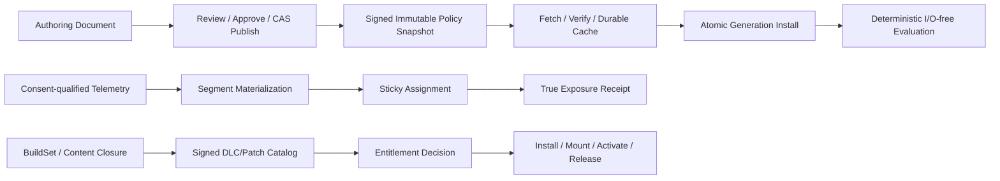

# Editor LiveOps、Feature Flag、Remote Config、Segmentation、Experiment、Patch、DLC、Crash Control Plane 与 Product Integration 当前源码复核

## 1. 结论

Editor46的主结论仍成立：Zircon当前没有工程级LiveOps控制面，也没有可运行的Feature Flag、Remote Config、Player Segment、Experiment、Patch Planner、DLC Catalog或Crash Symbolication Editor产品。生产`zircon_app`、`zircon_editor`、`zircon_runtime`、`zircon_runtime_interface`和`zircon_plugins`中，八个DesignSpec页面ID除四个MUI样式测试字符串外为零命中；`FeatureFlagDefinition`、`PolicySnapshot`、`ExperimentDefinition`、`AssignmentReceipt`、`ExposureReceipt`、`InstallBundle`、`EntitlementDecision`和`CrashArtifactId`等领域类型同样全部为零。`PageLayoutTemplate::builtin_templates()`、Workbench module ZUI inventory和builtin extension bindings均未装配LiveOps页面。

旧报告对两条既有底座描述不足，本次必须纠正。第一，`zircon_plugins/net/features/content_download`不是只有DTO：它是可注册的真实Runtime feature，具备HTTP、mirror切换、Range续传、content-range校验、BLAKE3内容哈希、进度、取消和测试。第二，`zircon_runtime::asset::pack`已经具备确定性manifest、依赖闭包裁剪、delta重建、staging、promotion、backup恢复和v2 install receipt；native plugin live host还具有owner撤销、强依赖阻断、帧边界bridge lifecycle、状态snapshot与失败回滚。这些是应保留的工程底座，因此7项P1评为`Partial`。

这些底座仍没有闭合任何LiveOps finding。Content Download用固定30秒timeout和一次retry，resume bitmap、partial bytes、manifest与失败表全部只存在于无界内存`HashMap`，完整chunk拼接进`Vec`，HTTP强制使用`NetSecurityPolicy::development()`；没有durable cache、ETag、backoff/jitter、磁盘预算、签名、environment、BuildSet或offline policy。`ZrPackInstallReceipt`是未签名JSON，单pack promotion没有durable journal或mount/activate/release状态机；`hot_reload_runtime_plugins_after_delta_pack_install`先promotion并写receipt，再执行plugin hot reload，后者失败时没有恢复整条pack+plugin操作。Generic plugin rollback不能替代DLC catalog、entitlement、signed admission和跨崩溃补偿。

Tooling不在本轮优化范围内；本报告只把它作为产品真实性边界证据。当前`design-manifest.mjs`仍把八页标成`editor-page`，没有`concept/prototype/implemented/verified/retired`状态；`design.js`仍固定显示`Live v42`、`184 crashes / 92% resolved`、`42k users`等完成式数据，文档仍称其为“LiveOps pages”。这些问题继续由Tooling14等canonical owner处理，本报告不修改preview脚本或截图。

本轮不新增finding，不重复计数Editor46的**6项P0、72项P1、12项P2**。当前闭合状态为**83 Open / 7 Partial / 0 Closed**；原36个验收门和本轮48个current-source复验门全部Fail。没有证据支持“达到或超过Unreal”，也没有可以进入高级功能实现的MVP资格。

## 2. Owner、currentness与冻结语料

### 2.1 唯一owner与去重边界

本报告是Editor46的current-source refresh，不建立第二套LiveOps owner，不把旧6/72/12重新计入索引。

- Editor46继续直接拥有LiveOps documents、review、rollout、simulation、status与degraded UX，并定义跨Runtime的策略schema验收。
- Runtime必须另立唯一LiveOps domain实现policy fetch/verify/cache/install/evaluate；本报告不把Network、Settings或Plugin bool改名冒充该domain。
- Editor12只拥有本地User/Project/Session settings；Editor25继续拥有telemetry schema、consent、privacy、retention与query qualification；Editor26/Runtime08E拥有online identity/provider。
- Tooling03/09/07/26/27继续分别拥有build/cook/pack、release/install/update/rollback、crash/symbol、security/trust和version/compatibility。本轮按用户要求不优化tooling。
- Plugins01拥有plugin package/catalog/ABI；Editor46只消费其typed lifecycle，不复制第二套plugin loader。
- `ContentDownload`、`ZrPack`和native live host是可复用底座，不是LiveOps authority、Install Bundle产品或已交付DLC链。

### 2.2 Currentness

- 审查HEAD：`21242973f5255d6e7066842aa99ffd13df53301d`；baseline epoch：`361`。
- 协调session：`optimize-editor84-liveops-review-r1-20260823`；model tier `5.6-sol`，thinking depth `High`。
- Editor46旧baseline为`ae2be3d865a937b9ed368bf965592045346c64e3`。旧selected paths到当前HEAD只有`zircon_editor/src/core/settings/tests/registry.rs`发生2增2删的提交变化；DesignSpec、download、pack与plugin相关源没有语义漂移。
- 本次101个Zircon selected file在冻结时全部clean。共享工作树还有大量其他Session改动，本报告不回退、不覆盖、不把它们计作本轮实现。
- 当前MVP仍为`in_progress`。本轮是C2 review-only文档交付，不实现高级LiveOps产品，也不运行Cargo或产品GUI。

### 2.3 可复算selected set

统计口径：路径转小写正斜杠并排序；逐文件SHA-256后，以`path + NUL + lowercase hash + LF`拼接再计算集合SHA-256。tests统计Rust `#[test]`、Unreal automation macro与常见C# test attribute；ignored单独计数。

| 范围 | 文件 / 行 / 非空行 / bytes / tests / ignored | fingerprint |
|---|---:|---|
| Zircon产品真实性、Settings、Job/Notification与局部合同 | 43 / 17,800 / 16,802 / 890,679 / 48 / 0 | `aab391ac16a204bbd0b09e7253f53d42e051209dbbf77e2d8bb57b7b210ae0c0` |
| Zircon Content Download package | 21 / 1,453 / 1,318 / 51,279 / 15 / 0 | `12a9b4d75795e36fcfcb947f1199a22dda6fb210e56d66b2ca0664b5b9d0c7e6` |
| Zircon ZrPack与pack tests | 24 / 3,308 / 2,971 / 113,437 / 45 / 0 | `0364b52f6fc3d87d52f2f7948383b05ee70d8f6b4d5176fe2d3ec640b084e84a` |
| Zircon Plugin lifecycle与tests | 13 / 3,272 / 3,029 / 122,691 / 25 / 0 | `e5ad49a5eb7430c19f3296351caeb02ad60ad7828338bd64554579aa810c61d9` |
| **Zircon total** | **101 / 25,833 / 24,120 / 1,178,086 / 133 / 0** | `9424dcdc497ffafedca86af45987fdad5d2459c169966fc638c3e071da880eee` |
| Unreal | 14 / 15,294 / 13,000 / 608,556 / 10 / 0 | `86da174106db66ecd78221c264201990b59cc1f64c045075ae788298202d263d` |
| Godot | 4 / 696 / 575 / 25,769 / 0 / 0 | `81f724c4f7d83ca5f2e7ea9b7dc28b0bd4765a7382b14017415e28502809a0b5` |
| Bevy | 4 / 5,328 / 4,896 / 203,395 / 2 / 0 | `ecf1bd89abe78ac2bb3678f1f63c79be74d3df4090ffb2b6093057432967fb1f` |
| Fyrox | 3 / 2,945 / 2,659 / 113,229 / 19 / 0 | `d025c78189e14949bafecefb57005dba07dd7e219beef6c5f848ea29cbf7a00e` |
| Graphics | 4 / 472 / 399 / 17,835 / 0 / 0 | `2bafd5d06189f8daa8f1f34575f9f457c68feba8137eae43e827eee265656269` |
| **Five-engine total** | **29 / 24,735 / 21,529 / 968,784 / 31 / 0** | `5f6fcb7bdae5d02e4819e03a327b19303536a2bba01c2ae86dee723d78cd7669` |
| **All selected** | **130 / 50,568 / 45,649 / 2,146,870 / 164 / 0** | `7a21799187639f225e5a9b64dcd1e9143fa8bffced4994f8b70d0fe9b469ff5a` |

Zircon 101文件由以下可复算集合组成：frontmatter中列出的产品/局部合同文件，加`git ls-files zircon_editor/src/core/settings`、`git ls-files zircon_plugins/net/features/content_download`、`git ls-files zircon_runtime/src/asset/pack`、`git ls-files zircon_runtime/src/asset/tests/pack*`，以及13个Plugin lifecycle/source/test文件。参考29文件即frontmatter的`reference_engines`完整列表。本集合用于复核Editor46相关变化与旧报告遗漏，不替代旧报告的完整语料。

## 3. 当前Zircon产品链事实

### 3.1 生产Editor没有LiveOps产品

`PageLayoutTemplate::builtin_templates()`只安装Scene、Game、Material、Inspector、Prefab、UI、Animation、Asset Browser、Console和Runtime Diagnostics。Workbench builtin extension bindings只有gameplay/animation、state、render/VFX、simulation、online sessions、runtime state、UI/diagnostics和world building；59个tracked Workbench module ZUI文件名对LiveOps/flag/config/segment/experiment/patch/DLC/crash symbol均为零命中。

八个DesignSpec ID在五个产品根中的精确命中只有`grid-feature-flags`和`tree-view-feature-flags`四处MUI样式测试字符串。它们不是业务页面、capability、document、command、operation或provider。生产缺页属于fail-safe的物理事实，但并不等价于拥有`Unavailable/Degraded`产品状态、capability descriptor或truth projection。

### 3.2 DesignSpec仍宣称不可证明的结果

`design-manifest.mjs:215-222`仍把八项全部标为`kind: "editor-page"`，没有实现状态字段。`design.js`仍固定提供`12 live / 2 staged`、`Live v42 / 3 drafts`、`24 changes`、`8 packs`、`184 crashes / 92% resolved`、`42k users`和`3 live`，并输出“validated / refreshed / grouped / resolved”等完成式反馈。`docs/ui-and-layout/index.md:387`仍称其为LiveOps pages。

这些文件不属于本轮实现范围，不能通过本报告修改来伪造M0完成。产品实现开始前，Editor46必须消费Tooling14提供的typed DesignSpec status，只有provider-backed且qualified的页面才可进入产品能力投影。

### 3.3 Settings、build feature与render flag必须保持隔离

`SettingsAuthority`已有Mutex写authority、ArcSwap immutable snapshot、User/Project/Session layer、typed definition/validation、revision/change cursor和持久层preflight；这是可复用的snapshot形状。它没有tenant、environment、issuer、signature、expiry、fetch、targeting或runtime evaluation，不能扩展成Remote Config key空间。

`runtime-feature-presets.toml`决定Cargo/runtime/app feature closure；`PluginFeatureBundleManifest`决定owner/provider/dependency/module/capability/default packaging；render runtime flags只从compiled renderer capability派生布尔路径。这三类feature都必须与远程Policy使用不同类型、namespace、权限和测试。当前没有显式LiveOps类型，也就没有可以证明隔离的跨域compile guard。

### 3.4 Content Download是真实网络底座，但不是可信安装器

`net.content_download`注册lazy manager并依赖Net/HTTP，实际执行HTTP请求、mirror切换、Range恢复、content-range验证、body长度校验和content hash验证。15个测试覆盖无效manifest、mirror、mock HTTP、hash mismatch、Range resume、progress和cancel；因此旧报告“只有DTO”的说法应废止。

其状态仍全部放在`Arc<Mutex<State>>`中的无界maps；partial bytes和bitmap不落盘，进程退出后不能恢复。一个chunk整体进入内存，request ID由attempt index局部生成，timeout/retry固定，cancel只改变状态，HTTP security policy硬编码development。没有LKG、cache generation、ETag、origin/key、signature、compatibility、credential或global admission budget；manager也没有LiveOps/Editor consumer。

### 3.5 ZrPack提供单包delta publication，不是Install Bundle

`ZrPackDocumentManifest`校验magic/version、安全规范化路径、排序、重复、chunk table、size与BLAKE3 payload hash。`ZrPackTrimPlanner`用BTreeMap/BTreeSet和BFS生成确定性reachable closure，报告missing dependency、duplicate和filter trim。Delta reader/writer验证base/target manifest与changed/removed chunk集合。

`ZrPackDeltaInstaller`能重建staging pack、验证后rename promotion，rename失败时copy+重读校验，并可先把旧pack重命名为backup；promotion失败会best-effort恢复backup。8个installer tests覆盖wrong base、invalid staged pack、backup、copy fallback、receipt mismatch等。这足以作为P1-052/P1-053/P1-071的Partial证据。

但manifest和receipt没有signature、issuer、environment、BuildSet、compatible range、entitlement、mount point、dependency bundle或activation policy。receipt只记录路径、manifest、size、method和`promoted: true`；没有operation ID、stage journal、fs crash recovery、CAS/idempotency、release/refcount、mount/activate/unmount或rollback operation。它只处理单个pack文件，不是可管理的bundle graph。

### 3.6 Plugin lifecycle真实存在，但跨pack热更新没有事务闭包

Runtime plugin catalog可在帧边界activate/disable/deactivate/reload bridge provider，disable/deactivate会拒绝strong dependents。Extension registry能撤销owner的systems/resources/events/interfaces/managers/modules/render providers/components/options/importers并通知listener。Native live host在hot reload时保存state blob、校验schema version、控制callback admission，并在load/publication失败时尝试恢复旧generation。

`hot_reload_runtime_plugins_after_delta_pack_install`却按`rebuild -> promote -> write receipt -> hot reload`顺序执行。pack已成为installed generation后，plugin discovery/load/hot reload若失败，只返回错误；函数没有把backup恢复为installed pack，也没有撤回已经成功更新的其他plugin。它还没有签名catalog、dependency transaction、entitlement、mount generation或restart receipt。因此P1-059只能Partial，G27继续Fail。

### 3.7 Job/Notification是通用UX底座，不是LiveOps operation journal

Editor已有带priority、category、mutex group、dependency、cancellation、pending-age、entry/byte quota、progress、event pump和shutdown处理的`EditorJobSystem`；Notifications已有typed identity/source、decision/toast/progress center和localization presentation。它们适合承载未来query/publish/download/symbolicate前台体验。

当前没有任何LiveOps operation adapter，没有durable operation ID、idempotency、resume cursor、stage receipt、audit journal或跨重启链接。故P1-068为Partial；不能因通用Job/Notification成熟就把publish、rollout或install显示为成功。

### 3.8 Crash、Telemetry、Identity与Security仍是外部owner依赖

产品根中没有`CrashArtifactId`、symbol result、segment identity、consent-qualified materialization、experiment exposure或LiveOps security context。Runtime diagnostic log有panic边界flush，Editor也出现Telemetry Dashboard静态surface，但两者都不是Editor46所需的provider-backed crash/telemetry control plane。Crash ingestion/symbol store继续由Tooling07拥有，telemetry/privacy由Editor25拥有，online identity由Editor26/Runtime08E拥有，trust/version由Tooling26/27拥有；本报告不复制或优化这些系统。

## 4. Editor46 finding闭合状态

### 4.1 状态汇总

| 优先级 | Open | Partial | Closed | canonical total |
|---|---:|---:|---:|---:|
| P0 | 6 | 0 | 0 | 6 |
| P1 | 65 | 7 | 0 | 72 |
| P2 | 12 | 0 | 0 | 12 |
| **合计** | **83** | **7** | **0** | **90** |

`Partial`只表示底层某一机制真实存在，不表示LiveOps产品、runtime policy、publish control plane或Install Bundle已经可用。

### 4.2 P0状态

| Finding | 状态 | 当前证据 |
|---|---|---|
| P0-001 八张静态页面fail-close | Open | production没有页面，但DesignSpec/docs仍以editor-page/LiveOps pages投影，缺显式prototype/unavailable/verified状态 |
| P0-002 禁止远程化Cargo/Plugin/Render bool | Open | 当前没有误接，但也没有独立LiveOps类型、namespace与compile guard证明长期隔离 |
| P0-003 未签名/不兼容/过期策略不得进入Runtime | Open | policy envelope/verify/install均不存在；content downloader还硬编码development security |
| P0-004 UI不得直接宣称Publish/Rollout/Launch/Resolve/Package成功 | Open | preview仍输出固定完成式数据；production没有typed operation/receipt |
| P0-005 无consent/identity/exposure合同禁用Segment/Experiment | Open | production无相关产品，但DesignSpec仍显示42k用户和3 live实验 |
| P0-006 Patch/DLC/Crash不得绕过canonical安全owner | Open | 无typed orchestration；pack/plugin局部链没有BuildSet、TrustReceipt、entitlement或CrashArtifact |

### 4.3 P1状态

| ID | 状态 | 当前源码判断 |
|---|---|---|
| P1-001 六个domain model | Open | 精确类型零命中 |
| P1-002 稳定typed identity | Open | LiveOps identity零命中 |
| P1-003 environment/principal一等边界 | Open | settings scope不是tenant/environment |
| P1-004 source revision/BuildSet/compatible range | Open | exact `BuildSet`/`BuildIdentity`/`CompatibilityDecision`零命中 |
| P1-005 typed config value schema | Open | 无定义 |
| P1-006 default/required/fallback语义 | Open | 无定义 |
| P1-007 targeting attribute registry | Open | 无定义 |
| P1-008 versioned targeting AST | Open | 无定义 |
| P1-009 policy dependency graph | Open | 无定义 |
| P1-010 alias/deprecation/migration | Open | 无定义 |
| P1-011 owner/provenance | Open | plugin owner不能替代policy owner |
| P1-012 canonical serialization/hash/signature envelope | Open | pack content hash不属于policy signature envelope |
| P1-013 provider-neutral Runtime LiveOps接口 | Open | NetManager/content feature不是LiveOps provider |
| P1-014 有界fetch/cache pipeline | Partial | HTTP/mirror/range/timeout/hash存在；durable cache、ETag、backoff、budget、offline/LKG缺失 |
| P1-015 验签先于解析安装 | Partial | content hash在安装前校验；signature/key/origin/environment/build/revocation全部缺失 |
| P1-016 bootstrap/offline策略 | Open | 无policy bootstrap/LKG/outcome |
| P1-017 snapshot原子安装与恢复 | Open | 单pack promotion不能替代PolicySnapshot generation install |
| P1-018 evaluation确定且无I/O | Open | evaluator不存在 |
| P1-019 EvaluationContext冻结且最小 | Open | 无定义 |
| P1-020 sticky percentage assignment | Open | 无定义 |
| P1-021 kill switch/override precedence | Open | 无定义 |
| P1-022 session/frame一致性cadence | Open | 无定义 |
| P1-023 预算与攻击面上限 | Open | downloader仍有无界maps/whole-chunk Vec，targeting预算不存在 |
| P1-024 完整低敏诊断 | Open | 局部download/plugin字符串诊断不是LiveOps reason/provenance |
| P1-025 transactional draft document | Open | 无document |
| P1-026 跨environment promotion | Open | 无operation |
| P1-027 semantic diff | Open | 无policy diff |
| P1-028 publish validation artifact | Open | 无artifact |
| P1-029 RBAC与多方approval | Open | 无合同 |
| P1-030 idempotent publish | Open | 无operation ID/CAS |
| P1-031 rollout state machine | Open | 无状态机 |
| P1-032 qualified health gate | Open | 无provider/query qualification |
| P1-033 rollback一等operation | Open | pack backup是局部file fallback，不是rollout rollback |
| P1-034 clock/timezone调度 | Open | 无定义 |
| P1-035 并发编辑/发布CAS | Open | 无定义 |
| P1-036 immutable audit journal | Open | 无定义 |
| P1-037 attribute/event privacy class | Open | 无LiveOps attribute/event registry |
| P1-038 consent/legal basis进入query plan | Open | 无query plan |
| P1-039 minimization/pseudonymization | Open | 无数据链 |
| P1-040 retention/deletion派生传播 | Open | 无数据链 |
| P1-041 Segment time semantics | Open | 无segment definition |
| P1-042 materialization freshness/completeness | Open | 无materialization |
| P1-043 identity merge/split audit | Open | 无identity graph |
| P1-044 experiment hypothesis/randomization unit | Open | 无experiment definition |
| P1-045 mutual exclusion/holdout/layer | Open | 无定义 |
| P1-046 allocation/SRM gate | Open | 无分析链 |
| P1-047 true exposure once-record | Open | 无receipt |
| P1-048 statistically qualified results | Open | 无分析链 |
| P1-049 Telemetry Query只消费Editor25 provider | Open | LiveOps query integration不存在 |
| P1-050 Patch candidate绑定BuildSet | Open | BuildSet零命中 |
| P1-051 typed compatibility decision | Open | CompatibilityDecision零命中 |
| P1-052 deterministic content closure | Partial | ZrPack trim有确定性reachable closure/missing dependency；无bundle identity/platform/build/signature |
| P1-053 Install Bundle完整生命周期 | Partial | download+staging+promotion+backup+receipt存在；mount/activate/release/pause/durable recovery/entitlement缺失 |
| P1-054 provider entitlement decision | Open | EntitlementDecision零命中 |
| P1-055 Store mapping/price不进入engine truth | Open | 没有typed provider boundary；DesignSpec仍固定跨商店SKU |
| P1-056 Hotfix限制可执行内容/apply surface | Open | delta pack可直接触发native plugin hot reload，缺signed admission和payload policy |
| P1-057 Crash ingestion/grouping由Tooling07提供 | Open | canonical owner已明确，但无typed消费链 |
| P1-058 Symbol store绑定build/access | Open | 无symbol result/build identity/access receipt |
| P1-059 DLC/Game Feature复用Plugin lifecycle | Partial | owner revoke、strong dependency、frame-boundary lifecycle、state rollback存在；DLC catalog/install/entitlement集成缺失 |
| P1-060 外部effect消费Security Control Plane | Open | downloader强制development policy；TrustReceipt/SecurityContext零命中 |
| P1-061 每个产品真实capability descriptor | Open | 八页production descriptor零命中 |
| P1-062 provider-backed document/query snapshot | Open | 无provider/document |
| P1-063 完整status/provenance | Open | 无页面，preview只有fixture status |
| P1-064 大列表虚拟化/分页 | Open | 无产品数据源和规模测试 |
| P1-065 typed rule/value editor | Open | 无产品 |
| P1-066 offline simulation/subject preview | Open | 无evaluator/subject |
| P1-067 semantic diff/impact review | Open | 无产品 |
| P1-068 长操作接Job/Notification/Journal | Partial | bounded Job与typed Notification存在；无LiveOps adapter、durable journal/resume/link |
| P1-069 localization/accessibility | Open | generic notification localization存在，但八个产品surface/reader/focus/chart alternative不存在 |
| P1-070 Unavailable/Degraded一等状态 | Open | 物理缺页不是typed capability状态 |
| P1-071 故障与安全测试矩阵 | Partial | download 15、pack 45、plugin selected 25 tests；policy/signature/privacy/security/whole-transaction矩阵为零 |
| P1-072 规模/性能/currentness门 | Open | 无LiveOps benchmark、soak、provider matrix或fingerprint gate |

### 4.4 P2状态

12项P2全部`Open`：可视化规则DSL、历史snapshot replay、多区域主动-主动、多provider联邦、高级实验统计、contextual bandit、自动health guard、Dynamic Game Feature热激活、跨商店entitlement reconciliation、隐私保护聚合、多人approval协作和全链路time-travel均无生产类型、provider或测试。MVP、P0、M1/M2未完成前不得先行实现。

## 5. 五套参考引擎的工程合同差

### 5.1 Unreal仍是主参考

Unreal `IInstallBundleManager`公开initialize、source/cache、content state、install state、dependency-expanded query、update、release、flush、remove-on-next-init、cancel、pause、resume、progress、typed result/error和patch check。`GameFeatures`再将Installed、Registered、Loaded、Active及其反向状态、protocol option、dependency、mount、activate/deactivate/uninstall、progress与error放入显式状态机。Local tests覆盖async/malformed Hotfix、target-state transition、restore、dependency auto-state与transitive closure。

`OnlineHotfixManager`明确限制为non-executable files，跟踪changed/removed files、download progress、INI backup/restore、PAK mount/unmount及needs reload/relaunch；`UpdateManager`有Idle/Pending/Patch/Hotfix/Preload/Complete状态。`AssetManagerTypes`通过Primary Asset priority、chunk、recursive management和cook rule建立内容闭包。Analytics provider与Crash config各自拥有独立边界，不被LiveOps Editor页面吞并。

Zircon不应复制Unreal历史API，但至少要达到同等级的typed state、dependency、progress、cancel/pause/resume、failure/rollback、mount/activate/release和测试可观察性。当前单pack promotion加plugin hot reload远未达到该标准。

### 5.2 Godot是pack/crash下限，不是LiveOps参考

Godot PCK packer提供start、add、remove、AES256 directory/file encryption和flush；Windows crash handler提供disable/debugger guard、native/script backtrace和异常继续传播。它证明pack mutation与platform crash capture应有明确边界，但没有LiveOps publish、segment、experiment、entitlement或Install Bundle control plane，不能作为缺失高级合同的理由。

### 5.3 Bevy提供source/transport可扩展性下限

Bevy `AssetSourceId`区分default/named source，builder显式装配reader/writer/watcher/processed source；AssetServer负责source与reload。`bevy_remote`将Remote core、method registry、JSON-RPC request/response/error和HTTP transport拆开，并允许runtime扩展method。它说明provider/source与transport不应硬编码，但未提供LiveOps policy安全、发布治理或DLC生命周期。

### 5.4 Fyrox提供resource watcher和state restore下限

Fyrox ResourceManager有registry、loader、watcher、Pending/LoadError/Ok状态和Loaded/Reloaded/Added/Removed事件；reload失败会保留旧资源。Engine hotreload会序列化scene/user data、plugin-owned node和script state后恢复。这是资源与代码热重载的有用下限，但没有signed catalog、entitlement、environment或运营控制面。

### 5.5 Graphics镜像不能代表Unity闭源LiveOps

本地Graphics源码只证明analytics enabled gate、typed event metadata/rate、post-build send、pre/post build lifetime和runtime debugger settings stripping。镜像不含Unity Gaming Services LiveOps实现，因此本报告只用它约束analytics/build边界，不凭产品印象补写Remote Config、Experiment或Cloud Content Delivery合同。

## 6. 目标架构保持不变

Editor46的三条链仍是唯一目标，不因已有download/pack/plugin helper而降级：

必须新增的核心合同仍包括typed project/tenant/environment/policy/snapshot/build identities、versioned rule AST、canonical signed envelope、frozen evaluation context、publish/rollout operation receipt、assignment/exposure receipt、content bundle manifest和provider-neutral Runtime LiveOps interface。Settings snapshot、NetManager、ZrPack、Plugin lifecycle、Job/Notification只能作为其下层adapter。

尤其要新增一个跨pack和plugin的durable transaction owner：验证catalog与所有artifact后先staging，持久化journal，再在frame-safe boundary原子切换pack mount generation和plugin provider generation；任一步失败都恢复同一predecessor generation。当前“先pack promotion、后plugin reload”的函数不得扩展成发布authority。

## 7. M0-M7当前状态与重构顺序

| Milestone | 状态 | 当前源码后的重构要求 |
|---|---|---|
| M0 Truth Closure | Not started | Tooling14提供typed prototype/verified状态；Editor capability projection无provider时Unavailable，固定完成数据不进入产品证据 |
| M1 Domain & Schema | Not started | 六domain、stable IDs、environment/principal、value/rule schema、owner/version、canonical signature envelope |
| M2 Runtime Data Plane | Not started | provider-neutral fetch、signature-first verify、durable bounded cache、LKG、atomic policy generation、I/O-free evaluator |
| M3 Publish & Rollout | Not started | transactional draft、semantic diff、RBAC/approval、CAS/idempotency、rollout state machine、health、rollback、audit |
| M4 Segment & Experiment | Not started | consent/identity、materialization、sticky assignment、exposure once、SRM/mutual exclusion与qualified analysis |
| M5 Patch/DLC/Crash Integration | Partial | 保留download/ZrPack/plugin底座；新增BuildSet/signed catalog/entitlement、bundle graph、mount generation、whole-operation compensation和crash/symbol typed query |
| M6 Editor Product | Not started | 八个provider-backed surface、typed unavailable/degraded、Job/Notification/Journal、simulation/diff、virtualization、a11y/i18n |
| M7 Product Qualification | Not started | provider/region/platform/build/security/performance/fault/incident矩阵和BuildSet-bound evidence；全部门通过后才可标implemented |

实施顺序必须保持`M0 -> M1 -> M2 -> M3/M4 -> M5 -> M6 -> M7`。M5已有底座只允许在M1/M2合同上接adapter，不能绕过P0先把DLC页面接到native hot reload。

## 8. Current-source复验门（48项，当前全部Fail）

### Authority、Truth与Schema

| Gate | 当前 | 通过条件 |
|---|---|---|
| C01 | Fail | 八个DesignSpec有typed lifecycle状态，只有verified进入capability coverage |
| C02 | Fail | production无provider时八产品均typed Unavailable，零fixture row和固定成功反馈 |
| C03 | Fail | Cargo/plugin/render feature与LiveOps Policy有独立类型、namespace、权限和compile guard |
| C04 | Fail | 六domain model和stable identity owner唯一，零显示名拼接identity |
| C05 | Fail | environment、principal、tenant、source revision、BuildSet进入所有definition/snapshot |
| C06 | Fail | value schema、default/required/fallback、alias/deprecation/migration有golden/fuzz测试 |
| C07 | Fail | targeting attribute registry有privacy/purpose/type/cardinality/provider合同 |
| C08 | Fail | canonical payload跨平台/进程hash一致，signature envelope可验证且可轮换/撤销 |

### Runtime Policy Data Plane

| Gate | 当前 | 通过条件 |
|---|---|---|
| C09 | Fail | provider-neutral Runtime LiveOps接口不依赖Editor或具体backend |
| C10 | Fail | fetch具deadline、retry/backoff/jitter、ETag、mirror、cancel、entry/byte/disk budget |
| C11 | Fail | signature/key/origin/environment/build/expiry/revocation在parse/install前fail-close |
| C12 | Fail | partial write/corrupt cache/power loss恢复到完整LKG generation |
| C13 | Fail | bootstrap/offline/expired/future schema都有typed outcome与provenance |
| C14 | Fail | evaluation相同输入确定、零I/O、满足allocation/latency budget |
| C15 | Fail | EvaluationContext最小冻结，同一session/frame按cadence只读一个generation |
| C16 | Fail | malformed/deep/cyclic/high-cardinality rule corpus有界拒绝 |

### Publish、Rollout、Segment与Experiment

| Gate | 当前 | 通过条件 |
|---|---|---|
| C17 | Fail | draft undo/redo/autosave/recovery不改变published snapshot |
| C18 | Fail | publish有source CAS、idempotency、approval、deadline和逐stage receipt |
| C19 | Fail | rollout pause/resume/expand/rollback/restart/partial failure可恢复 |
| C20 | Fail | health gate绑定qualified metric/query/freshness/sample，缺数据不判GREEN |
| C21 | Fail | immutable audit按principal/policy/operation追溯且敏感字段redact |
| C22 | Fail | consent withdrawal/deletion传播到segment/assignment/exposure/analysis |
| C23 | Fail | segment watermark、late/partial/freshness、identity merge/split可审计 |
| C24 | Fail | experiment randomization、sticky、mutual exclusion、holdout、SRM、true exposure通过 |

### Patch、DLC、Plugin与Crash

| Gate | 当前 | 通过条件 |
|---|---|---|
| C25 | Fail | patch candidate绑定base/target BuildSet、artifact closure、test与compatibility |
| C26 | Fail | signed bundle catalog含dependency/platform/build/install/mount/entitlement policy |
| C27 | Fail | download支持durable pause/resume/cancel/retry、磁盘/cache admission和offline恢复 |
| C28 | Fail | install/mount/activate/release共享durable state machine与generation visibility |
| C29 | Fail | pack+plugin跨层事务失败可恢复同一predecessor，无半更新generation |
| C30 | Fail | entitlement refund/revoke/expire/offline/provider unavailable有typed decision |
| C31 | Fail | hotfix拒绝未授权native/script/shader payload并显式报告reload/restart |
| C32 | Fail | CrashArtifact/BuildSet/privacy/group revision与symbol binary/build/revision可追溯 |

### Editor Product与Operation UX

| Gate | 当前 | 通过条件 |
|---|---|---|
| C33 | Fail | 八产品各有真实capability descriptor、provider document/query snapshot |
| C34 | Fail | Unavailable/Degraded/Offline/Stale/Unauthorized/Partial为typed一等状态 |
| C35 | Fail | publish/package/download/symbolicate接Job/Notification/durable Journal和operation link |
| C36 | Fail | rule/value editor、semantic diff、impact review与offline simulation使用Runtime parity corpus |
| C37 | Fail | 10k flags/100k keys/1k experiments/百万crash groups下分页/虚拟化满足预算 |
| C38 | Fail | keyboard、reader、focus、chart/table alternative、locale/RTL/200% DPI通过 |
| C39 | Fail | 所有失败/重试/取消/rollback只由typed receipt驱动UI，不拼固定成功字符串 |
| C40 | Fail | source/provider/schema fingerprint漂移自动stale并阻止verified投影 |

### Security、Test与领先性

| Gate | 当前 | 通过条件 |
|---|---|---|
| C41 | Fail | 所有外部effect消费production SecurityContext/TrustReceipt，零development policy硬编码 |
| C42 | Fail | secret/token/store credential不进入document/log/telemetry/screenshot/artifact |
| C43 | Fail | wrong signature/cache corruption/power loss/revocation/rollback有故障注入矩阵 |
| C44 | Fail | provider/region/platform/build N-2/N-1/current/future/offline/degraded矩阵通过 |
| C45 | Fail | evaluator、Editor simulation和provider fixture逐result/reason golden parity |
| C46 | Fail | install/plugin transaction有crash-window、dependency failure和recovery soak |
| C47 | Fail | security、privacy、performance、reliability evidence绑定同一BuildSet与source fingerprint |
| C48 | Fail | 与Unreal同场景功能、性能、可靠性和安全证据全部达标后才可宣称达到或超过 |

原Editor46 G01-G36同样全部Fail。Partial底座只减少后续实现量，不改变任何产品资格门结论。

## 9. Review closeout

本次完成了Editor46在当前HEAD上的产品、Settings/feature namespace、Content Download、ZrPack、Plugin lifecycle、Job/Notification和五套本地参考源码复核，并修正旧报告对download/pack/plugin底座的低估。没有修改生产代码或tooling，没有运行Cargo、Editor/App、远程provider、下载、pack安装、plugin hot reload、crash/symbol、Telemetry或实验；原因是本轮只有文档变化且当前没有可执行LiveOps产品路径，静态复核不能冒充动态通过。

实施前必须重新冻结HEAD、coordinator leases、101-file fingerprint、八页面/领域类型exact-zero、Content Download security/cache状态、ZrPack receipt/promotion语义、pack+plugin补偿断点和Editor46 canonical status。任一漂移都要求重审受影响finding；在C01-C48与G01-G36通过前，LiveOps仍是`not_started`产品域。
