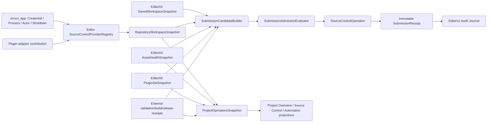

# Editor Project Operations、Source Control、Workspace、Changelist、Diff、Automation、Validation、Submission Gate 与 Health Dashboard Product Integration 当前源码复核

## 1. 结论

Editor27的主结论仍成立，而且当前源码把问题暴露得更清楚：Zircon不是只有一套尚未完成的Project Operations产品，而是同时存在两类成熟度完全不同、名称却相同的产品路径。

第一类是真实但范围较窄的产品底座。内置Project Overview从打开项目和Asset Workspace投影project/assets/cache root、default scene、catalog revision、folder count与asset count；真实Build Export已经有target projection、projection cache、wizard session、job queue、progress、cancel与output；真实Plugin Manager已经读取`EditorPluginStatusReport`并具备project/native状态投影和部分live-host动作；`authoring-automation` commandlet通过正常`EditorApplicationComposition`和retained-host callback执行UI binding，要求非降级项目打开，输出project/manifest/scene identity、inspection generation、event records与最终scene snapshot。这些底座必须保留。

第二类是仍被命名为`production`的五张Workbench Extension Workspace。Source Control继续固定显示`CL_2048`、18 files、2 conflicts、6 checks和四个文件状态；Automation Report继续固定显示642 tests、7 failed、3 flakes、Worker_03/09/11与Screenshot diff；Project Overview extension继续固定显示`NebulaGame`、M3、Healthy、Win64 Development、72 percent coverage、7 tasks与3 build jobs，并允许直接编辑Owner、Channel和Health；Build Export与Plugin Manager extension继续显示固定cook/CDN或installed/update/warning事实。它们被extension workspace总索引收录，也被Assets Workspace直接链接，不是孤立设计稿。

五张Workspace仍由100个固定template binding、固定navigation spec、control-local field edit和固定feedback字符串驱动。tab/row/command只改变control选择，field edit只改变`value`/`value_text`，Validate/Submit/Publish只生成诸如`Submit queued CL_2048 2 conflicts`、`Validation queued 642 tests`、`Project publish queued Healthy`的文本。当前产品源码精确搜索仍没有`SourceControlProvider`、`RepositoryIdentity`、`WorkspaceRevision`、`ValidationSet`、`SubmissionCandidate`、`SubmissionAdmissionReceipt`或`ProjectOperationsSnapshot`。

因此旧账本的5项P0、60项P1、12项P2没有任何一项闭合。当前状态为**72 Open / 5 Partial / 0 Closed**；32个验收门为**30 Fail / 1 Partial / 1 Pass**。唯一Pass是authoring automation继续走retained-host callback/journal而没有direct dispatch旁路；Partial只来自已有真实Project/Asset/Plugin/Build/Job投影和局部automation provenance。它们不能证明Source Control、Validation Control Plane、Submission Gate或Health Dashboard已交付。

本轮只做Editor产品与跨包消费边界review。用户已明确暂不优化tooling，因此本文不审查、重构或扩展tooling runner/build/release实现；Editor只能消费外部系统提供的versioned immutable receipt，不能复制一套测试、构建或发布执行器。当前MVP仍为`in_progress`，本文是允许的review-only文档，不实施高级产品代码。

## 2. Owner、currentness与冻结语料

### 2.1 唯一owner与包边界

- Editor27继续唯一拥有Project Operations、Source Control SPI与adapter contribution contract、workspace/status/diff/changelist产品、aggregate snapshot、submission candidate、admission UX和submit receipt projection。本报告只是current-source refresh，不建立第二账本。
- `zircon_runtime`只提供稳定project/asset/plugin/world identity以及可被Editor引用的保存后provenance；它不保存VCS credential，不执行repository进程，也不拥有Editor submission workflow。
- `zircon_editor`必须拥有authoring侧source-control合同、provider registry、typed operations、Project Operations snapshot、candidate builder与UI。Git、Perforce等adapter通过plugin contribution接入，核心不能写死某一provider语义。
- `zircon_app`拥有进程组合、OS credential broker、provider executable/native library启动与退出、actor identity和安全平台能力；它不重新定义source状态或submit policy。
- Editor02/04/06分别继续拥有document save generation、asset/import/catalog和plugin lifecycle事实；Editor08/09/10/11继续拥有command、job、notification和journal控制面。Editor27只能消费generation-qualified snapshot。
- 测试、构建、签名和发布的执行系统在本文范围外。Editor只接收带schema、source revision、environment、producer、attempt、artifact hash与currentness的不可变receipt；缺失或不匹配时fail closed。

### 2.2 Currentness与共享工作树

- 注册审查基线为`080fefe6acd449beded4497dee4a474b9e1f7383`、baseline epoch `402`；最终复核HEAD为`0a5f22c944d802b0677ebeee5fc3168361bbac5c`、epoch `404`。期间只有`docs(render16): normalize failure contracts`与`fix(coordinator): reserve future scope paths`两次提交推进，`git diff 080fefe6..0a5f22c9`没有触及本报告84个selected文件；协调session为`optimize-editor85-project-operations-current-review-r1-20260824`。
- 当前聚焦集不是clean HEAD。五张production ZUI各有1增1删，变化只是移除按钮上伪造的`selected/checked`视觉状态；`extension_module_navigation.rs`正在删除未使用的command group缓存；Plugin live-host test正在跟随native host路径迁移。这些共享修改不属于本报告，本文不回退、不覆盖。
- 上述dirty变化没有删除固定业务事实、没有接入provider/result authority，也没有改变finding状态。本文统计的是冻结时working-tree snapshot，不把它冒充已提交baseline。
- 注册时没有开放的Editor85 failure handoff；四个文档路径已由本session领取写租约。共享工作树中的其他数千项改动保持原样。

### 2.3 可复算selected set

统计口径：路径转小写正斜杠并排序；逐文件SHA-256后，以`path + NUL + lowercase hash + LF`拼接并再算集合SHA-256。tests为Rust `#[test]`、Unreal automation/test macro与常见C# test attribute的静态声明计数，不是通过数。

| 范围 | 文件 / 行 / 非空行 / bytes / tests / ignored | fingerprint |
|---|---:|---|
| 五张fake product surface、index、route、binding、field、feedback | 18 / 6,180 / 5,821 / 314,667 / 2 / 0 | `a201962fb4e164d844bfdd2a9bcd1089ab4f9cda6a5a3e0accb00121ba10bc43` |
| 真实Project/Asset、Build Export、Plugin投影聚焦集 | 23 / 2,339 / 2,103 / 90,086 / 24 / 0 | `5f0d7c458605b10304c3b1255f30b5377d516033c55dd9646460db9e15909ec7` |
| Commandlet与retained-host authoring automation | 7 / 3,187 / 2,933 / 116,335 / 41 / 0 | `2ce1e2c40130899685053edac0ceab37bee6d526e099f57fcb4814fe55361bb4` |
| **Zircon selected union** | **48 / 11,706 / 10,857 / 521,088 / 67 / 0** | `fa908ea3b5c826d089738595d794a5738125916b31a7af499f3913eb1955a482` |
| 旧账本、canonical owner与MVP plan sources | 8 / 3,126 / 2,234 / 298,469 / 0 / 0 | `379578e73b6aec733ae5f05c07b8bed2921e229ec708c2dbeea8b646738bb1d8` |
| Unreal/Godot/Bevy/Fyrox/Unity Graphics参考集 | 28 / 13,510 / 11,652 / 473,967 / 23 / 0 | `2bd863958b76a1d697029ec7e53be63bf87eb481e2d075968dcf67427779e947` |
| **All selected** | **84 / 28,342 / 24,743 / 1,293,524 / 90 / 0** | `d30971aaceb60f63f83c79f835b7716651372e82857b5562a9bb3f9c8ea582f0` |

18/23/7文件就是frontmatter `related_code`/`tests`按本节三个物理组展开后的精确集合；28个参考文件即frontmatter `reference_engines`完整列表。最终提交前必须再次复算；任一聚焦源码变化都要更新fingerprint或撤回aggregate currentness声明。

### 2.4 零实现与固定事实搜索

- 五个产品根中，`SourceControlProvider|RepositoryIdentity|WorkspaceRevision|SubmissionCandidate|SubmissionAdmission|ProjectOperationsSnapshot|ValidationSet|TestAttempt|AuthoringAutomationAttempt`为零命中。
- `ProjectManifest`只有name、format/engine version、default scene、UI/asset roots、settings、asset manifest、library version、plugins、scripts与export profiles，没有repository/provider/workspace revision、submit policy或team metadata。这并不意味着应把credential塞进Runtime manifest；正确做法是Editor-scoped repository identity与secure App credential broker。
- 固定业务字符串只在五张production workspace与fixed feedback中出现；真实Project Overview、Build Export、Plugin Manager和authoring automation没有消费这些字符串。
- `editor_scene_document_submission.rs`中的submission指scene open/create picker提交，不是source submit或release admission；不能以名称命中冒充Project Operations实现。

## 3. 当前产品链事实

### 3.1 五张production workspace仍是第二Authority

`workbench_extension_module_workspaces.zui`直接引用五张`extensions/production/*.zui`，Assets Workspace又提供五个同名入口。每张Workspace都包含固定summary、row、field、command与status output；`render_asset_vfx.rs`为五张页面各安装20个binding，共100个。`workbench_preview_actions/extensions.rs`只是action ID常量清单，不能提供领域行为。

`extension_module_navigation/specs/data_production.rs`把workspace/tab/row/command/field route固定映射到control；`module_field_edit.rs`的edit/commit只更新control本地文本并触发刷新；`extension_module_feedback/data_production.rs`根据action返回固定完成式文案。没有任何一步读取repository、test result、build receipt、plugin report或project snapshot。

危险性不只在于数据过时。Source Control即使展示2 conflicts也允许`Submit queued`；Project Overview把derived health变成可编辑字段；Automation把固定worker/failure/flake写成真实结果；Build/Plugin页面与已有真实产品同名。这会让用户把演示状态误认为工程事实，属于P0 truthfulness与data-loss/admission风险。

### 3.2 内置Project Overview真实但不是Operations Dashboard

`ProjectOverviewSnapshot`只有8个字段：project name/root、assets/cache root、default scene URI、catalog revision、folder/asset count。`project_overview_data()`和ZUI template把这些字段投影到真实pane，相关测试覆盖asset加载、design token和窄宽布局。这条链应保留。

它没有document dirty/save generation、repository/workspace revision、provider availability、import failures、plugin set revision、test/build result、job operation、release channel、section provenance、freshness或health policy。因此P1-36可评Partial，P1-31/32/33/34/35/39/41/42仍Open。不能在现有struct后面不断追加字符串；需要versioned section snapshot与混合generation检测。

### 3.3 Build Export与Plugin Manager已有真实owner，但同名fake仍未切除

真实Build Export通过`build_export_pane_data()`重建project target、缓存base revision、叠加wizard session generation，并将job snapshot、progress、cancel、output和diagnostics投影到pane。它足以让P1-38/P1-40为Partial，但没有进入Project Operations aggregate，也不能证明cook/package/sign artifact与source revision绑定。

真实Plugin Manager通过`EditorPluginStatusReport`、builtin/native/project snapshot和projection cache产生rows与diagnostics；actions区分project policy与native live host。现有测试又明确部分unload/hot-reload动作仍是“reserved ... backend is not connected yet”，所以P1-37只可Partial。fake Plugin Manager固定的18 installed/3 updates/1 warning没有读取这条链。

硬切策略应保留真实pane，删除同名fake workspace和100-binding中对应20条，而不是再让两个页面互相跳转。Build/Test/Release执行系统的内部工程化不在本轮范围；本报告只要求Editor消费其immutable receipt。

### 3.4 Authoring automation是真实产品测试adapter，但不是全局Automation Control Plane

`EditorProjectAutomationRequest`只有`bindings: Vec<EditorUiBinding>`并只校验非空。commandlet解析真实project/request路径，打开唯一`EditorApplicationComposition`，要求asset count全部ready且零failed，然后调用`run_retained_host_automation()`。retained host只允许selection、Inspector Transform X、Save、Undo/Redo等已接线binding，并要求每次dispatch产生journal record；测试还用源码顺序断言禁止`.dispatch_binding()`旁路。

`EditorProjectAutomationReport`已经输出project/manifest/scene identity、selected model/material resource ID、inspection generation、records与完整scene node snapshot。这使P1-28为Partial并使G17通过。

请求仍没有schema/binding version、attempt ID、source revision、build/toolchain/environment、principal、bytes/step/deadline/cancel预算；报告没有started/completed time、per-binding duration、retry、terminal cause、artifact manifest、content hash或supersession。Commandlet envelope也只有command/status/exit code/migration/plugins/automation/error。它不能被改名为`TestAttempt`，更不能作为Submit Gate证据。

### 3.5 Submission链完全缺失

当前没有代码能把以下事实冻结成同一候选：

1. 已保存且无冲突的document generation；
2. provider-qualified repository/workspace/base/head/local change set；
3. asset catalog/import与plugin set revision；
4. 与同一source revision绑定的required validation receipts；
5. 可选或必需的build artifact set；
6. versioned policy digest、actor与override approval。

因此没有race-safe preflight、expected revision compare-and-submit、idempotency、crash resume、compensation或immutable final receipt。Validate/Submit/Publish在M0前必须Unavailable，而不是保留按钮再弹warning。

## 4. 五参考树对照

### 4.1 Unreal是Source Control与Submit主参考

Unreal `ISourceControlProvider`分离init/close/availability/status、cached/forced state query、同步/异步operation、completion delegate、cancel、changelist state和state-change event；`ISourceControlState`与`ISourceControlRevision`表达controlled/current/added/deleted/modified/conflicted/checkout/lock/history/content。`SourceControlOperations.h`再定义connect、checkout、add、delete、revert、sync、resolve、update status、changelist、shelve等operation语义，Git/Perforce等provider是独立adapter。

Automation Controller不是一张结果表：manager处理device/cluster discovery、filter、passes、run/stop/tick与completion，report/result保存case、event、duration、participant和artifact。SubmitTool又把`IChangelistService`、`IPreflightService`、credential/lockdown等拆成服务，并用typed preflight state/outcome判断成功。Zircon应吸收身份、生命周期、异步边界和receipt，不复制C++类层次。

### 4.2 Godot给出可用DVCS Editor下限

Godot `EditorVCSInterface`定义typed status file、commit、diff file/hunk/line以及staged/unstaged/commit area，provider必须实现initialize、credential、status、stage/unstage/discard、commit、diff、history、branch、remote、pull/push/fetch。Editor plugin提供refresh、commit message/amend、split/unified diff与危险discard确认。

Godot合同比Unreal团队工作流窄，但仍远高于Zircon当前control-local字符串。Zircon不能把命令行文本解析直接塞进pane并称为架构，也不能只支持Git staging后再补Perforce语义。

### 4.3 Bevy与Fyrox只作为Rust落点参考，不降低产品标准

Bevy本地树没有同级first-party Editor VCS产品；其`AssetSourceBuilder/AssetSources`提供named/default source、reader/writer/watcher factory和processed/unprocessed分离，可借鉴provider registration与watcher ownership，但不能冒充source control设计。Fyrox Project Manager有project identity、命令队列、child process与build window，仍没有同级repository/changelist/submission产品；它只说明Rust产品可以把command execution从UI state分离。

### 4.4 Unity Graphics只提供验证/产物链的可见证据

本地Unity Graphics不含闭源Unity Editor VCS内部实现，本文不推测。`.yamato/wrench`可见validation job明确platform/editor version、dependency、timeout、retry与artifact paths，package pack job发布可追踪package artifact；Shader Analysis的async job与serializable build report保留target、compile unit、warning/error与performance report。这证明Editor结果消费应绑定producer job和artifact，而不是显示固定“642 tests”或“62%”。tooling实现本身按用户要求排除。

## 5. 目标架构与核心合同

必须先定义、再实现的最小合同：

- `SourceControlProviderRegistration { provider_id, contract_version, capabilities, config_schema, owner_lease, operation_factory }`；capability显式区分checkout、staging、changelist、shelve、branch、lock、history、remote sync与partial workspace。
- `RepositoryIdentity { provider_id, repository_id, workspace_id, root_identity, case_policy }`与`WorkspaceRevision { base_revision, head_revision, local_change_set_id, observed_at, generation }`；branch字符串、路径或mtime都不能单独充当revision。
- `SourceControlFileState { qualified_path, change_kind, staged_area, checkout_owner, lock_owner, base_revision, content_hash, conflict, observed_generation }`；rename/copy/case-only/submodule/binary必须保留语义。
- `SourceControlOperationRequest/Receipt`携operation ID、actor、workspace、expected revision、scope、deadline、cancel token、progress、terminal outcome、retryability、provider diagnostics和journal correlation。
- `TypedDiff`分离text/binary/asset/too-large/unavailable，text保留encoding、file/hunk/line/range与truncation；asset diff通过Editor04 reference/schema能力扩展，不降级为无界文本。
- `ProjectOperationsSnapshot`由document/source/asset/plugin/validation/build/job/release section组成；每节携owner、generation、source revision、produced/expires time、availability与freshness。聚合health由versioned policy只读派生。
- `SubmissionCandidate`冻结saved document generation、workspace change set、asset/plugin revision、required validation set、build artifact set和policy digest；任何输入变化都使候选Stale。
- `SubmissionAdmissionReceipt`逐项保存decision、evidence reference、override approval与expected revision；`SubmissionReceipt`保存最终revision、included paths、provider receipt、actor、timestamps和artifact/evidence digest。
- `AuthoringAutomationAttemptAdapter`把现有retained-host records/snapshot包装进外部test attempt schema；不得让现有JSON envelope成为第二套全局测试结果协议。

## 6. 状态定义

- `Open`：finding要求的核心产品合同或生产链仍不存在；相邻能力不能关闭它。
- `Partial`：当前源码已有可复用且被生产/测试路径使用的同域事实，但身份、owner或端到端闭环未完成。
- `Closed`：当前源码与动态证据都满足原finding和对应gate。本轮为0。

## 7. P0当前重判

| ID | 状态 | 当前证据与必须动作 |
|---|---|---|
| P0-1 Source Control无provider却公开Validate/Submit | Open | `CL_2048`与2 conflicts仍可产生queued反馈；M0必须禁用入口，M1后只按provider capability开放。 |
| P0-2 Automation Report伪造worker/test/failure/flake/artifact | Open | fixed 642/7/3与Worker_03等仍在产品索引；真实authoring commandlet未被消费。先删除完成式事实，再接immutable attempt projection。 |
| P0-3 Project Overview extension伪造可编辑health/build/coverage/release | Open | `NebulaGame`/Healthy/72 percent仍在，field edit仍可改Health/Channel/Owner。derived health必须只读。 |
| P0-4 五张production workspace构成重复第二Authority | Open | 总索引与Assets Workspace仍可达；真实Project/Build/Plugin产品并存。M0 inventory后硬删除旧workspace、route、binding与feedback。 |
| P0-5 无source-bound、document-bound Submission/Release Admission事务 | Open | Candidate/Admission/Receipt类型与caller均为零；Submit/Publish必须fail closed直到M5-M6。 |

## 8. P1当前重判

### 8.1 Source Control Provider、Workspace与Diff

| ID | 状态 | 当前差距 |
|---|---|---|
| P1-1 provider registry/capability negotiation | Open | 无registration、contract version、capability或owner lease。 |
| P1-2 repository/workspace identity | Open | 无provider/repository/workspace/root/case identity。 |
| P1-3 generation-qualified file state | Open | 文件row是固定字符串，无refresh generation。 |
| P1-4 async operation lifecycle | Open | 无operation ID、progress、completion、cancel acknowledgement。 |
| P1-5 revision/history/content contract | Open | 无revision object、history query或内容读取预算。 |
| P1-6 typed diff | Open | 无file/hunk/line/binary/asset/too-large模型。 |
| P1-7 rename/copy/submodule/case-only | Open | change kind闭集不存在。 |
| P1-8 changelist/staging abstraction | Open | `CL_2048`只是标签，未绑定paths或provider state。 |
| P1-9 checkout/lock/ownership | Open | Alice/Bob/Chen是fixture，不是principal/lease。 |
| P1-10 conflict/resolve state machine | Open | 2 conflicts无base/ours/theirs/result hash与恢复。 |
| P1-11 asset-aware diff/reference impact | Open | 未接Editor04 schema/reference graph。 |
| P1-12 watcher/provider refresh coordination | Open | 无watch cursor、coalesce、gap或resync。 |
| P1-13 large repository budget | Open | 无pagination、bytes/time/paths budget或100K fixture。 |
| P1-14 credential/secret boundary | Open | 无App credential broker、redaction或scope。 |
| P1-15 provider conformance suite | Open | 无fake/real adapter共享测试。 |

### 8.2 Automation Control Plane与结果消费

| ID | 状态 | 当前差距 |
|---|---|---|
| P1-16 Automation UI消费canonical test plan | Open | fake pane未读取任何外部plan/result receipt。 |
| P1-17 immutable TestAttempt identity | Open | commandlet没有attempt ID/source/build/environment identity。 |
| P1-18 worker discovery/capability | Open | Worker_03/09/11均为固定文本。 |
| P1-19 run/stop/cancel/pause状态机 | Open | Validate只回queued字符串。 |
| P1-20 deadline/heartbeat/lost worker | Open | request无deadline，产品无heartbeat或lost terminal。 |
| P1-21 typed case result/event severity | Open | 只有event records和总commandlet error，无case tree。 |
| P1-22 artifact manifest/safe download | Open | Screenshot diff不是artifact identity；无hash/size/MIME/retention。 |
| P1-23 visual regression语义 | Open | 无baseline/candidate/diff/environment/tolerance。 |
| P1-24 flake/quarantine治理 | Open | 3 flakes是固定数字，无retry attempt或policy。 |
| P1-25 coverage provenance | Open | 72 percent无instrumented build/source/metric口径。 |
| P1-26 result currentness/supersession | Open | 无source revision与superseded-by关系。 |
| P1-27 authoring request版本和资源预算 | Open | 只有nonempty bindings；无schema、bytes、steps、deadline、cancel。 |
| P1-28 authoring report attempt provenance | Partial | 已有project/manifest/scene/resource/inspection generation、records与snapshot；仍缺attempt/source/build/env/time/artifact。 |
| P1-29 query/pagination/incremental update | Open | pane数据固定，无result store cursor/page。 |
| P1-30 result publication/export receipt | Open | commandlet stdout JSON不是qualified publication receipt。 |

### 8.3 Project Operations Snapshot与健康投影

| ID | 状态 | 当前差距 |
|---|---|---|
| P1-31 canonical ProjectOperationsSnapshot | Open | 仅有8字段`ProjectOverviewSnapshot`。 |
| P1-32 project/source identity关联 | Open | project identity存在但无repository/workspace/source revision。 |
| P1-33 per-section provenance/freshness | Open | 无owner、produced/expires、availability。 |
| P1-34 versioned health policy | Open | Healthy仍是可编辑fixture。 |
| P1-35 document/save projection | Open | 未消费Editor02 dirty/save/conflict/recovery generation。 |
| P1-36 asset/catalog/import projection | Partial | 真实catalog revision、folder/asset count已投影；无import failure/readiness/provenance。 |
| P1-37 plugin set/reload projection | Partial | 真实Plugin status report与rows存在；未聚合，部分live-host backend仍reserved。 |
| P1-38 build/cook/package/sign projection | Partial | 真实Build Export target/job/progress/cancel存在；无source-bound artifact set及aggregate。 |
| P1-39 test/validation projection | Open | fake 642 tests未消费receipt。 |
| P1-40 job/operation projection | Partial | Build Export queue和通用Editor job底座存在；无统一Project Operations section与correlation。 |
| P1-41 release/channel projection | Open | Channel是control-local字段，无policy/receipt。 |
| P1-42 snapshot consistency/delta protocol | Open | 无section generation vector、gap、resync或atomic publish。 |

### 8.4 Submission Candidate、Gate与不可分割回执

| ID | 状态 | 当前差距 |
|---|---|---|
| P1-43 saved workspace precondition | Open | 无save barrier/candidate input。 |
| P1-44 source change-set freeze | Open | 无workspace revision或path set freeze。 |
| P1-45 required ValidationSet解析 | Open | 无policy到required receipt解析。 |
| P1-46 build artifact/test result绑定 | Open | 无共同source/build identity。 |
| P1-47 preflight admission evaluator | Open | Validate不是纯函数decision，只是反馈文本。 |
| P1-48 race-safe expected revision | Open | 无compare-and-submit或stale rejection。 |
| P1-49 composite order/compensation | Open | Save/Refresh/Validate/Build/Submit没有operation graph。 |
| P1-50 override/approval/permission audit | Open | 无principal、approval或policy exception receipt。 |
| P1-51 immutable submit/publish receipt | Open | 无final revision、included paths、evidence digest。 |
| P1-52 crash/restart/idempotency | Open | 无operation journal、idempotency key或recovery query。 |

### 8.5 产品集成、质量与治理

| ID | 状态 | 当前差距 |
|---|---|---|
| P1-53 unique navigation/authority convergence | Open | 同名fake与真实产品并存。 |
| P1-54 typed command registry integration | Open | 100个preview binding未接Editor08 descriptor/capability。 |
| P1-55 notification/diagnostic correlation | Open | fixed output无operation/journal/diagnostic ID。 |
| P1-56 offline/partial/degraded UX | Open | 无Unavailable/Unknown/Stale/AuthExpired区分。 |
| P1-57 accessibility/keyboard diff workflow | Open | 无真实diff tree、focus model或危险scope确认。 |
| P1-58 redaction/minimum exposure | Open | 无credential/log/artifact redaction contract。 |
| P1-59 end-to-end fault/performance qualification | Open | 无repository/worker/artifact/provider fault fixture与规模门。 |
| P1-60 fixture/schema migration/delete gate | Open | fixed workspace仍被产品索引引用，无zero-reference hard cutover test。 |

## 9. P2当前重判

| ID | 状态 | 当前差距 |
|---|---|---|
| P2-1 multi-provider/mixed workspace | Open | 无单provider合同，更无组合。 |
| P2-2 branch/stream/worktree management | Open | 无workspace identity与switch transaction。 |
| P2-3 sparse/partial clone、LFS、大二进制 | Open | 无capability与storage/bandwidth预算。 |
| P2-4 semantic merge/binary conflict tool | Open | 无typed conflict或asset merge extension。 |
| P2-5 code review/change request link | Open | 无review provider identity。 |
| P2-6 distributed worker/capacity scheduling | Open | 无worker authority。 |
| P2-7 validation/health trend | Open | 无immutable history与metric schema。 |
| P2-8 configurable operations view | Open | fake fields不是versioned layout/query。 |
| P2-9 notification/subscription/external integration | Open | 无subscription policy或delivery receipt。 |
| P2-10 automation recording/maintainable scripts | Open | binding JSON可执行但无recording、locator migration或schema tooling。 |
| P2-11 team ownership/policy metadata | Open | Alice/Bob/Chen与Owner字段是fixture。 |
| P2-12 cross-engine compatibility/migration | Open | 无provider/test/result import contract。 |

## 10. 分层重构里程碑

| Milestone | 交付内容 | 退出条件 |
|---|---|---|
| M0 Truthfulness与owner冻结 | 标记五张workspace为Unavailable或从产品索引移除；冻结18文件inventory；删除固定成功反馈；建立唯一owner表。 | G01-G03通过；无provider时危险命令不可调用。 |
| M1 Source Control核心合同 | Editor-owned provider registry、capability、repository/workspace identity、file state、operation、fake provider与conformance suite。 | G04-G08通过；fake provider覆盖async/cancel/stale/error。 |
| M2 真实adapter与Diff产品 | 至少一个真实adapter、credential broker、watch refresh、typed diff、history、stage/changelist/checkout/lock/resolve。 | G05-G11通过；100K fixture达到预算。 |
| M3 Validation result消费 | 定义外部receipt adapter、attempt/currentness/artifact projection；把authoring automation包装为一个case adapter。 | G12-G18通过；不创建第二结果schema。 |
| M4 ProjectOperationsSnapshot | 聚合document/source/asset/plugin/validation/build/job/release section，带provenance/freshness和versioned health。 | G19-G23通过；mixed generation显式Stale。 |
| M5 Candidate与纯Preflight | 冻结saved workspace、source change set、asset/plugin、validation/build/policy identity；实现纯admission evaluator。 | G24-G25通过；任一输入变化自动失效。 |
| M6 复合Submit/Publish事务 | operation graph、expected revision、override approval、idempotency、compensation、immutable receipt。 | G26-G28通过；故障注入不产生半真成功。 |
| M7 产品硬切 | 删除五张旧workspace、100个旧binding及fixed feedback，导航到唯一真实pane；迁移schema/fixture。 | G01-G02/G22通过；旧ID零产品引用。 |
| M8 安全、恢复、可访问性与规模 | credential/redaction、offline/auth degraded、keyboard/screen-reader、large repo、crash resume、fault/soak/profile。 | G29-G32通过。 |
| M9 高级团队能力 | multi-provider、stream/worktree、LFS、semantic merge、review、trend、distributed workers。 | P2按独立架构计划资格化，不能提前阻塞M0-M8。 |

里程碑必须依赖有序执行。禁止先做趋势图、多provider或漂亮Dashboard，再继续保留fixed authority。M0-M2是Source Control产品的最小真实性门；M3-M6才允许恢复Validate/Submit/Publish语义。

## 11. 32个验收门当前状态

| Gate | 状态 | 当前判定 |
|---|---|---|
| G01 fixed业务事实清零 | Fail | 五张ZUI与feedback仍存在。 |
| G02 旧workspace/binding完整inventory并零产品引用 | Partial | 本报告完成18文件/100 binding inventory；零引用与删除未完成。 |
| G03 无provider时Unavailable且危险命令禁用 | Fail | 仍返回queued。 |
| G04 fake与真实adapter同一conformance suite | Fail | 无合同/adapter。 |
| G05 repository/workspace/revision identity稳定 | Fail | 类型缺失。 |
| G06 100K status refresh预算/取消/新旧generation | Fail | 无refresh链。 |
| G07 typed text/binary/asset diff | Fail | 无diff模型。 |
| G08 capability-driven stage/changelist/checkout/lock | Fail | 无capability。 |
| G09 remote head/expected revision竞态原子拒绝 | Fail | 无candidate/expected revision。 |
| G10 conflict resolve保留base/ours/theirs/result | Fail | 无state machine。 |
| G11 credential零泄漏 | Fail | 无broker与测试。 |
| G12 Automation只消费canonical attempt identity | Fail | fixed report仍存在。 |
| G13 run/stop/cancel在lost/timeout/late result下唯一终态 | Fail | 无attempt lifecycle。 |
| G14 visual artifact可导航且环境/tolerance完整 | Fail | Screenshot diff是文本。 |
| G15 flake retry保留所有attempt/quarantine policy | Fail | 无结果模型。 |
| G16 coverage绑定instrumented build/source/metric | Fail | 72 percent固定。 |
| G17 authoring automation走retained-host callback/journal | Pass | 当前实现和测试禁止direct dispatch旁路。 |
| G18 authoring request有schema/bytes/deadline/cancel预算 | Fail | 只有nonempty bindings。 |
| G19 Overview section均有owner/provenance/freshness | Fail | 8字段snapshot无元数据。 |
| G20 Health由versioned policy只读派生 | Fail | Health可编辑。 |
| G21 dirty/autosave/conflict/recovery进入candidate policy | Fail | 无candidate。 |
| G22 section可导航到唯一owner与原始receipt | Fail | 同名fake/real并存，validation/release无receipt。 |
| G23 mixed generation与gap resync | Fail | 无section generation vector。 |
| G24 candidate冻结全部identity且变化失效 | Fail | 类型缺失。 |
| G25 validation missing/failed/stale/revision mismatch拒绝 | Fail | 无ValidationSet。 |
| G26 复合故障不产生半真Healthy/Published | Fail | 无operation graph。 |
| G27 crash/restart按idempotency恢复且不重复提交 | Fail | 无journal/key。 |
| G28 immutable receipt可追溯revision/paths/evidence/actor | Fail | 无receipt。 |
| G29 Revert/Discard/Resolve/Submit/Publish scope与a11y确认 | Fail | 无真实命令。 |
| G30 offline/auth/provider/coordinator degraded状态分离 | Fail | 无availability model。 |
| G31 Windows优先动态repository/worker/artifact/policy fixture | Fail | 本轮未运行且产品链不存在。 |
| G32 watch/result/snapshot/journal有界soak | Fail | 无可运行链。 |

## 12. 禁止的临时修补

1. 禁止把`git status`或`p4 opened`文本解析直接塞进pane并称为provider architecture。
2. 禁止在核心合同写死Git index/branch/commit或Perforce depot/changelist；差异必须进入adapter capability。
3. 禁止继续用control `value_text`保存changelist、owner、gate、health、channel或test selection业务状态。
4. 禁止在conflict、unknown、stale、missing evidence时弹warning后继续Submit/Publish。
5. 禁止把authoring automation现有JSON envelope改名为全局TestResult。
6. 禁止用retry后的Pass覆盖首次Failure，或直接修改flake/coverage数字。
7. 禁止删除真实内置Project Overview而保留`NebulaGame` extension。
8. 禁止Dashboard复制Plugin/Build/Asset mutable state并成为第二writer。
9. 禁止把source revision简化为branch、时间戳、目录mtime或project name。
10. 禁止把credential/token/ticket/remote secret写入project manifest、journal、notification、artifact或clipboard。
11. 禁止为通过自动化绕过retained-host callback、document transaction、job authority或provider receipt。
12. 禁止长期双轨；M7后旧workspace、route、binding、feedback和fixture必须零引用硬删除。
13. 禁止因tooling暂时排除就在Editor内复制test runner、build pipeline或release publisher。
14. 禁止在M0-M6未通过前声称达到或超过Unreal同类工程能力。

## 13. 本轮验证与产出边界

本轮逐文件阅读了五张production workspace、索引/入口、100-binding owner、navigation/field/feedback实现、真实Project Overview、ProjectManifest、commandlet/retained-host/App automation、真实Build Export与Plugin Manager聚焦链，并对照28个Unreal/Godot/Bevy/Fyrox/Unity Graphics文件。静态搜索与fingerprint在working tree上完成。

本轮没有修改production Rust/ZUI/test，没有运行Cargo、Editor窗口、真实repository、provider login、diff/stage/resolve/submit、worker、artifact store、build/sign/release、故障注入、规模测试或soak。当前baseline本身为degraded，静态test declaration不是测试通过证据。实施必须从M0开始，并在每个里程碑重取HEAD、working-tree diff、leases、selected fingerprint和动态结果。
