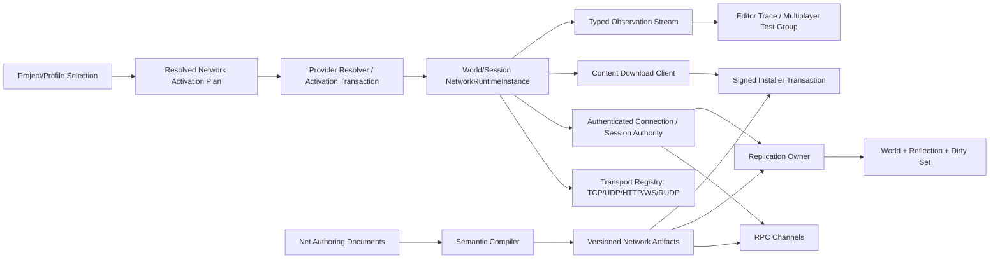

---
related_code:
  - zircon_plugins/net/plugin.toml
  - zircon_plugins/net/runtime
  - zircon_plugins/net/features/http/runtime
  - zircon_plugins/net/features/websocket/runtime
  - zircon_plugins/net/features/reliable_udp/runtime
  - zircon_plugins/net/features/rpc/runtime
  - zircon_plugins/net/features/replication/runtime
  - zircon_plugins/net/features/content_download/runtime
  - zircon_plugins/net/editor
  - zircon_plugins/net/dist
  - zircon_plugins/first_party_runtime_catalog/Cargo.toml
  - zircon_plugins/first_party_runtime_catalog/src/lib.rs
  - zircon_plugins/first_party_editor_catalog/Cargo.toml
  - zircon_plugins/first_party_editor_catalog/src/lib.rs
  - zircon_app/src/entry/first_party_runtime_plugins.rs
  - zircon_app/src/entry/first_party_editor_plugins.rs
  - zircon_runtime/src/core/framework/net
  - zircon_runtime/src/plugin/runtime_plugin/builtin_catalog/net_features.rs
  - zircon_runtime/src/plugin/runtime_plugin/builtin_catalog/net_features/manifest.rs
  - zircon_runtime/src/plugin/runtime_plugin/builtin_catalog/net_features/rows.rs
  - examples/woc/zircon-project.toml
tests:
  - zircon_plugins/net/runtime/src/tests
  - zircon_plugins/net/features/http/runtime/src/tests
  - zircon_plugins/net/features/websocket/runtime/src/tests
  - zircon_plugins/net/features/reliable_udp/runtime/src/tests
  - zircon_plugins/net/features/rpc/runtime/src/tests
  - zircon_plugins/net/features/replication/runtime/src/tests
  - zircon_plugins/net/features/content_download/runtime/src/tests
  - zircon_plugins/net/editor/src/tests
plan_sources:
  - docs/plans/optimize/00-engine-wide-review.md
  - docs/plans/optimize/01-cross-report-owner-schema-abi-p0-consolidation-review.md
  - docs/plans/optimize/zircon_plugins/01-plugin-sdk-package-catalog-distribution-native-abi-review.md
  - docs/plans/optimize/zircon_plugins/06-first-party-plugin-source-editor-runtime-dist-catalog-profile-capability-closure-review.md
  - docs/plans/optimize/zircon_plugins/08-first-party-editor-authoring-extension-document-operation-toolkit-runtime-contract-product-integration-review.md
  - docs/plans/optimize/zircon_runtime/08e-network-runtime-review.md
  - docs/plans/optimize/zircon_runtime/22-time-clock-domain-fixed-step-determinism-rng-replay-scheduling-review.md
  - docs/plans/optimize/zircon_runtime/24-stable-identity-handle-generation-owner-epoch-stale-reference-exhaustion-review.md
  - docs/plans/optimize/zircon_runtime/25-filesystem-path-uri-vfs-mount-watch-sandbox-atomic-io-review.md
  - docs/plans/optimize/zircon_runtime/42-builtin-runtime-module-catalog-profile-target-feature-selection-extension-registration-capability-load-report-product-integration-review.md
  - docs/plans/optimize/zircon_editor/07-play-session-process-pie-game-view-live-edit-recovery-review.md
  - docs/plans/optimize/zircon_editor/25-runtime-diagnostics-performance-timeline-console-telemetry-observability-authoring-review.md
  - docs/plans/optimize/zircon_editor/26-multiplayer-lobby-matchmaking-online-services-replication-network-emulation-pie-authoring-review.md
  - docs/plans/optimize/zircon_editor/50-editor-extension-contribution-store-registry-toolkit-provider-snapshot-reload-lifecycle-product-integration-review.md
reference_engines:
  - dev/UnrealEngine/Engine/Source/Runtime/Engine/Classes/Engine/NetDriver.h
  - dev/UnrealEngine/Engine/Source/Runtime/Engine/Classes/Engine/NetConnection.h
  - dev/UnrealEngine/Engine/Source/Runtime/Net/Iris/Public/Iris/ReplicationSystem/ReplicationSystem.h
  - dev/UnrealEngine/Engine/Source/Editor/UnrealEd/Classes/Settings/LevelEditorPlaySettings.h
  - dev/UnrealEngine/Engine/Source/Runtime/Online/BuildPatchServices/Public/Interfaces/IBuildInstaller.h
  - dev/UnrealEngine/Engine/Source/Runtime/Online/BuildPatchServices/Public/Interfaces/IBuildManifest.h
  - dev/UnrealEngine/Engine/Source/Runtime/Online/BuildPatchServices/Public/Interfaces/IBuildPatchServicesModule.h
  - dev/UnrealEngine/Engine/Plugins/Runtime/HTTPChunkInstaller/Source/Public/HTTPChunkInstaller.h
  - dev/godot/modules/multiplayer/scene_multiplayer.h
  - dev/godot/modules/websocket/websocket_peer.h
  - dev/godot/scene/main/http_request.h
  - dev/bevy/crates/bevy_remote/src/lib.rs
  - dev/bevy/crates/bevy_remote/src/http.rs
  - dev/Fyrox/fyrox-core/src/net.rs
  - dev/Graphics/Packages/com.unity.render-pipelines.core/package.json
doc_type: review-and-refactor-plan
review_status: review_complete
implementation_status: pending
source_recheck_required: true
---

# 10 · First-Party Network Source、Runtime、Editor、Dist、Catalog、Transport、RPC、Replication 与 Product Integration 工程化差距

## 1. 结论

`zircon_plugins/net`不是空壳。186个tracked文件中已有typed endpoint/event/error/diagnostics、TCP与UDP本机socket、HTTP client/server、WebSocket client/server、RUDP分片/确认/重传/有序交付、RPC握手/配额/队列、Replication delta/interest/budget/late join、Content Download分块/hash/resume，以及针对锁中毒、回调重入和失败提交的修复。120项测试也证明这些局部算法和loopback路径不是只为接口占位。

但当前首方交付不是一个统一网络栈，而是七个彼此弱连接的运行时。普通first-party runtime catalog只链接顶层`zircon_plugin_net_runtime`；HTTP和WebSocket feature factory各自创建带backend的私有`DefaultNetManager`，RPC、Replication和Reliable UDP再各自创建独立内存manager，Content Download虽然解析canonical `NetManager`，却得不到前述私有HTTP backend。结果是每个crate的单元测试可以通过，普通App选择`net`后却只得到没有真实HTTP/WS backend的base manager，也不会自然获得RPC、Replication、RUDP或Content Download产品能力。

显式generated export profile能够按feature链接registration，这是可保留的装配基础，但它与普通first-party source host并非同一条authority。`examples/woc/zircon-project.toml`只选择`net`，没有选择六个optional feature；默认App target也不会因project/profile选择自动链接对应provider。当前不能把builtin catalog中存在feature row、manifest dependency或crate可编译，等同于游戏进程已经安装并激活相同能力。

Editor与NativeDynamic链同样断裂。first-party editor catalog只路由Navigation和Neural，没有Net；Net Editor引用的4个ZUI和1个TOML模板全部不存在，6个operation没有factory/handler，toolkit没有document/save/undo/compiler owner，唯一测试只检查descriptor。dist entry只导出metadata，command/event/state/bridge/lifecycle为空，无法重建source runtime的transport或六个feature行为。

运行时算法的最高优先级问题已由Runtime08E登记；多人authoring、Online Provider和PIE拓扑由Editor26拥有；全局catalog与native parity由Plugins01/06拥有。本篇不重复计数，登记 **0项新增P0、48项P1和12项P2**。本篇只拥有Net单包从manifest、source、feature、editor、dist、catalog到产品consumer的纵向交付合同，并明确这些局部实现如何收敛到canonical network owner。

## 2. 审查边界、规模与currentness

### 2.1 物理冻结

| 范围 | 文件 / 行 / bytes | 冻结事实 |
|---|---:|---|
| `zircon_plugins/net`全包 | 186 / 14,377 / 495,870 | `plugin.toml`、base runtime、6个feature、editor、dist及全部生产/测试文件逐文件扫描 |
| 生产 / 测试文件 | 127 / 59 | 120项`#[test]`或`#[tokio::test]`，0 ignored |
| package fingerprint | `85a58658dd3afeac16dad9fea085acaeaa47be480aa32aa42e69caa075a4f777` | tracked路径排序，以小写`path|file_sha256`的LF串、无末尾LF再计算SHA-256 |
| optional feature | 6 | HTTP、WebSocket、RPC、Replication、Reliable UDP、Content Download均默认关闭 |
| 产品装配 | runtime root 1 / feature 0 / editor 0 | 普通first-party source catalog只返回root registration；generated export可另行链接feature |
| Editor资源 / operation | 0/5存在 / 0/6可执行 | URI只有字符串；没有operation factory、document或compiler |

源revision为`25e09a23178000f2e783ce2143cf70a8b118d404`。冻结时Net包自身无tracked working-tree差异；catalog、App、Runtime与共享计划存在其他会话或用户改动，因此本文按当前工作树读取但保留`source_recheck_required: true`。实施前必须重新冻结package、catalog、profile、App host和Runtime owner generation。

### 2.2 本轮纵向追踪

1. `plugin.toml`的maturity、capability、target、module、system、option、event和六个feature声明。
2. base runtime的manager、worker、Tokio runtime、TCP/UDP/HTTP/WebSocket、route/listener/connection、events与diagnostics。
3. HTTP、WebSocket、Reliable UDP、RPC、Replication、Content Download六个feature的factory、service、manager、算法与测试。
4. Editor provider、surface、drawer、asset/toolkit/template、graph/inspector/palette、operation descriptor与资源URI。
5. dist descriptor/registration/state/bridge/lifecycle行为。
6. first-party runtime/editor catalog、App entry、builtin feature metadata、generated export bootstrap与WOC project selection。
7. Unreal、Godot、Bevy、Fyrox和本地Unity Graphics参考树的适用边界。

本轮为E3静态源码审查，没有运行Cargo、真实网络、TLS、Editor、NativeDynamic、多进程、多客户端、丢包仿真、跨平台、soak或性能测试。120项test attribute是源码库存，不是本轮通过数。静态证据足以判定provider私有化、产品feature未装配、资源缺失、operation无执行体、dist空行为与跨feature调用断点。

## 3. 当前真实产品链与断点

```text
project/profile selects "net"
  -> first_party_runtime_catalog returns only root runtime_plugin()
       -> canonical DefaultNetManager without HTTP/WS backend
       -> TCP/UDP and local loopback surfaces exist
       -> six feature providers are not collected

optional HTTP / WebSocket provider
  -> each factory creates a private DefaultNetManager with its backend
  -> does not extend or replace canonical NetManager

optional RUDP / RPC / Replication provider
  -> each factory creates an independent in-memory manager
  -> no authenticated connection, packet channel or World owner is shared

optional Content Download provider
  -> resolves canonical NetManager
  -> canonical manager normally lacks private HTTP backend
  -> tests inject a test-only HTTP-enabled manager and bypass product composition

Net Editor provider
  -> absent from first_party_editor_catalog
  -> 5 missing resources + 6 operations without factory

NativeDynamic dist
  -> descriptor and registration metadata only
  -> cannot materialize source manager, transports, features or editor behavior
```

需要的收敛不是一个进程全局巨型manager。正确方向是由单一`NetworkRuntimeInstance`按World/Session持有认证connection与transport generation，feature provider通过显式extension contract挂入同一实例，并让catalog activation receipt证明requested、linked、admitted、activated和degraded状态。

## 4. 可保留基础

| 基础 | 当前价值 | 重构约束 |
|---|---|---|
| Beta/Partial/default-off | 没有把当前状态冒充完整产品 | G01-G32通过前保持fail-close，不自动升级maturity |
| Typed net DTO | endpoint、ID、event、error、HTTP/WS/session/RPC已有结构 | 增加owner/generation/wire version，不退回String/JSON通用命令 |
| 真实本机socket | TCP/UDP与HTTP/WS loopback可作为transport testkit | 补 framing、admission、cancel、shutdown和cross-process lane |
| Poison/reentry修复 | 多处在提交失败时abort/drop并返回typed error | 保留无锁回调与失败零发布原则，扩展到所有feature/lifecycle |
| HTTP pin实现 | HTTP feature会读取peer certificate并校验leaf pin | 不应与WS当前只检查“pin字符串存在”的假校验混为一谈 |
| RUDP局部算法 | 分片、ACK、重传、有序交付可作为codec原型 | 统一wire model并接真实UDP、peer、拥塞和资源预算 |
| RPC/Replication局部策略 | direction/quota/priority与delta/interest/budget/late join可复用 | 由认证connection、World和compiled schema驱动，不由caller伪造 |
| Generated feature registration | 显式export profile能链接feature provider | 与普通source/native host收敛为同一ProviderResolver与receipt |
| Editor contribution词汇 | surface、asset、toolkit、graph、inspector、palette已枚举 | descriptor必须绑定真实资源、document、factory、compiler和preview |

## 5. 参考实现给出的边界

### 5.1 Unreal

`UNetDriver`按World持有client/server connection、PacketHandler、timeout与replication driver，`UNetConnection`承载连接身份与channel/packet状态，Iris `ReplicationSystem`把connection、object、filter、prioritization、dirty/change mask和生命周期分开。Zircon可以采用不同对象模型，但不能用进程全局manager、caller传role和独立内存复制manager替代这些语义。

`LevelEditorPlaySettings`把standalone/listen/client、dedicated server、client数量、单/多进程、port、参数和network emulation作为可执行拓扑。Net Editor只有“Diagnostics”view descriptor不能替代可启动、可失败、可重放的多人测试组。

BuildPatchServices的`IBuildInstaller`提供start/pause/resume/cancel、update/repair/verify、typed state/error/progress/statistics和限速；module拥有manifest load/save、staging/cloud/backup、active installer、chunk verify/package/diff及全局cancel。Content Download当前内存chunk map与同步HTTP body只可作为算法原型，不能称为工程级安装器。

### 5.2 Godot

`SceneMultiplayer`在同一owner中连接peer、pending/authenticated peer、authentication timeout、object cache、RPC和replicator；`WebSocketPeer`显式管理incoming/outgoing buffer、max queued packets、heartbeat与close状态；`HTTPRequest`包含body size、timeout、download file、partial append、thread和cancel。它们证明网络feature可以模块化，但共享会话所有权、预算和生命周期不能分裂。

### 5.3 Bevy

Bevy Remote明确是基于JSON-RPC 2.0的远程检查/控制协议，`RemotePlugin`安装方法与mailbox，`RemoteHttpPlugin`才安装HTTP transport，并通过有界channel把请求交回ECS schedule。可借鉴的是core/transport分层和schedule handoff；它不是游戏多人网络栈，不能用来降低Replication、prediction或session标准。

### 5.4 Fyrox与Unity Graphics边界

当前Fyrox参考只提供非阻塞TCP listener/stream、长度前缀和bincode消息，是小而真实的framing底座，不是完整多人引擎。Unity Graphics镜像中的SRP Core `package.json`只描述图形package和依赖，不包含Netcode/Online Services源码；本篇不会从它推断Unity网络能力，也不会把参考缺失当作Zircon完成证据。

## 6. P0归属：本文不新增最高优先级finding

| 已证实现象 | Canonical owner | 本篇责任 |
|---|---|---|
| process-global manager、双runtime/同步worker、安全、RPC/Replication与下载本体 | Runtime08E | 定义Net package各feature必须回接其canonical owner |
| Lobby/Matchmaking/Online Provider、Replication authoring和多人PIE | Editor26、Editor07/25 | 记录Net Editor具体资源、operation与产品provider断点 |
| runtime/editor catalog required selection与profile closure | Plugins06、Runtime42 | 记录Net root 1 / feature 0 / editor 0的单包影响 |
| NativeDynamic metadata shell与source/native parity | Plugins01 | 定义Net transport/feature parity gate，不复制ABI P0 |
| stable handle、clock/replay、filesystem/install、安全与预算公共合同 | Runtime22/24/25及全局owner | 要求Net消费，不在本篇重造平行基础设施 |

只要Net保持beta/partial、六个feature默认关闭且产品入口不宣称可完成多人工作流，本篇不因功能量差距新增P0。任何profile、Editor或发布元数据将其升级为stable/complete/required/default-enabled前，必须先关闭canonical P0并通过本篇资格门。

## 7. P1：Package、Catalog、Capability、Editor 与Distribution闭环

| ID | 当前差距 | 需要重构 |
|---|---|---|
| NNET-P1-001 | 普通first-party runtime catalog只链接Net root，六个feature不进入provider collection | 生成package root与feature provider graph，resolution receipt逐项记录requested/linked/admitted/activated |
| NNET-P1-002 | first-party editor catalog不链接Net Editor | profile按target解析runtime+editor closure；缺required editor provider时fail-close并解释原因 |
| NNET-P1-003 | WOC只选择`net`而没有feature selection，不能获得RPC/Replication/RUDP | 项目manifest必须声明所需feature及版本/策略，build-time closure阻止缺provider产品启动 |
| NNET-P1-004 | manifest feature dependency只约束声明关系，没有把依赖实例注入factory | activation transaction解析typed dependency handle与同代generation，禁止factory忽略依赖 |
| NNET-P1-005 | HTTP和WebSocket各自创建私有`DefaultNetManager` | backend以extension安装到目标`NetworkRuntimeInstance`，注册/撤销具备事务和generation |
| NNET-P1-006 | RUDP、RPC、Replication各自创建独立内存manager | feature service消费同一session/connection/transport owner，保留模块边界但取消第二authority |
| NNET-P1-007 | `NetConfig`和manifest options没有驱动manager/worker | 建立validated `EffectiveNetConfig`，记录source、range、target override与runtime generation |
| NNET-P1-008 | runtime mode、target mode、feature集合和product role未形成单一快照 | 构建`NetworkActivationPlan`，Client/Listen/Dedicated只按同一plan创建允许的listener/service |
| NNET-P1-009 | event catalog只列4类事件且payload schema只有字符串，无producer/consumer/version证据 | 生成versioned event schema，覆盖transport/session/RPC/replication/download及budget/drop/lifecycle |
| NNET-P1-010 | dist只投影descriptor/registration metadata，command/event/state/bridge/lifecycle为空 | 实现native network provider bridge与quiesce/state handoff，或撤销NativeDynamic声明 |
| NNET-P1-011 | source、generated export、library和native没有行为等价矩阵 | 对registration、feature、transport、lifecycle、error、observation建立golden parity测试 |
| NNET-P1-012 | beta/partial是诚实基础，但没有升级或降级资格定义 | maturity绑定G01-G32与BuildSet evidence；任一feature不可用必须保持typed degraded/unavailable |
| NNET-P1-013 | `authoring.zui`、3个配置ZUI和default replication TOML均不存在 | 创建真实受版本控制资源并由package resource manifest编译、hash、装载和校验 |
| NNET-P1-014 | 6个Editor operation只有descriptor，没有factory/handler | 每项绑定typed payload、authorization、transaction/job、cancel/deadline与terminal receipt |
| NNET-P1-015 | asset/toolkit/graph没有document、save/undo/compiler/runtime artifact owner | 接入Editor02/04/09/50，建立lossless source、semantic compiler、artifact install与preview parity |
| NNET-P1-016 | Diagnostics surface没有live producer，Editor也无多人拓扑或链路仿真 | 由Editor25消费typed network trace，由Editor07启动server+N clients与per-link emulation |

## 8. P1：Base Transport、Security、Lifecycle 与Observability闭环

| ID | 当前差距 | 需要重构 |
|---|---|---|
| NNET-P1-017 | `DefaultNetManager`为process级共享状态，不按World/Session/role分域 | 建立world/session-owned实例、明确listen/client authority、teardown与跨world隔离 |
| NNET-P1-018 | manager同步API等待单一串行worker，状态又创建Tokio runtime，worker线程再创建第二个runtime | 收敛为显式I/O executor与异步operation handle，deadline/cancel能够停止底层I/O |
| NNET-P1-019 | 慢connect/send/request会占住串行worker，部分registry锁跨worker等待 | command按connection/transport分片并在锁外提交，建立公平调度、in-flight预算与HOL指标 |
| NNET-P1-020 | diagnostics会无预算轮询全部ingress，event queue无界，worker `try_send`失败被丢弃，flush system为空且frame固定0 | 统一bounded ingress/egress/event budget、drop reason、frame/tick和flush completion receipt |
| NNET-P1-021 | connection/listener/socket/route/request ID只用递增`u64`，无overflow或generation | 消费Runtime24 handle合同，near-exhaustion拒绝、retire并检测stale/cross-owner handle |
| NNET-P1-022 | TCP公开面只收发字节，没有message framing、channel、max frame、partial-write/backpressure合同 | 建立versioned packet frame、bounded parser、channel QoS与实际wire byte accounting |
| NNET-P1-023 | UDP只是raw datagram socket，没有peer/session admission、MTU/fragment policy或per-source公平性 | 定义datagram admission、source budget、truncation/ICMP/error语义和feature-owned packet pipeline |
| NNET-P1-024 | 无显式port的HTTP URL会按path命中本地route，任意remote URL可被本地handler遮蔽 | 本地dispatch使用独立URI scheme/authority或显式test adapter，禁止基于“无port”猜测 |
| NNET-P1-025 | HTTP client按请求构造client并全量buffer body，retry不区分method/idempotence且无backoff/Retry-After | 使用pool、streaming body、response limit、cancel、idempotency key和policy-driven retry |
| NNET-P1-026 | HTTP server无限accept/spawn，sync handler在async task执行，缺header/deadline/graceful drain与response limit | 建立connection/request budget、handler executor、timeout、stream backpressure和shutdown barrier |
| NNET-P1-027 | HTTP leaf pin校验是真实基础，但开发policy、证书异常接受路径、credential/redaction与trust rotation没有产品合同 | 建立环境化trust store/pin set、expiry/rotation、credential lease、audit与secure defaults |
| NNET-P1-028 | WebSocket配置的custom roots/pin未应用到TLS，当前只检查pin字符串存在 | 读取peer certificate并验证chain/pin/hostname，错误携带稳定安全reason且不可静默降级 |
| NNET-P1-029 | WebSocket server只支持明文WS，没有WSS identity、certificate rotation或client-auth路径 | 提供WSS listener config、identity reload、mTLS/authorization adapter和安全资格矩阵 |
| NNET-P1-030 | WebSocket outbound仅局部有界，inbound/event无界，close/task cancel/heartbeat不完整且部分poison会panic | 统一双向bytes/frame/age预算、heartbeat、close handshake、task owner和bounded teardown |
| NNET-P1-031 | diagnostics是manager聚合快照，没有world/session/connection generation、queue high-water、drop和error cause | 生成typed observation stream并关联BuildSet、role、frame/tick、operation与principal |
| NNET-P1-032 | listener/connection close常以移除表项或改Closed状态完成，不能证明accept/read/write task quiesce | 为每类资源建立Closing/Draining/Closed状态机、abort/join fence和零悬挂任务验收 |

## 9. P1：RUDP、RPC、Replication、Content Download 与资格闭环

| ID | 当前差距 | 需要重构 |
|---|---|---|
| NNET-P1-033 | RUDP manager不使用真实UDP/NetManager，逻辑packet的u64/String/u16字段与wire的u16/u8/u8不一致 | 定义唯一versioned wire codec并接真实socket/peer；wrap、fragment和ACK只按wire语义测试 |
| NNET-P1-034 | RUDP peer/assembly/outbound/resend/order map无全局与per-peer预算，也无拥塞、pacing、RTT RTO或安全 | 建立peer state、bytes/age/window budget、拥塞控制、path MTU、anti-amplification和abuse policy |
| NNET-P1-035 | RPC没有wire codec、transport dispatch或生产`apply_transport_events` caller | 编译RPC manifest并映射稳定wire ID/channel/correlation，将receive/dispatch/response接入认证connection |
| NNET-P1-036 | handshake token编码后在hello转换中丢弃，challenge nonce固定，role/source session由caller提供 | 从认证transport派生principal/session/role，使用随机nonce、proof、version/capability negotiation和replay protection |
| NNET-P1-037 | RPC channel queue无界，handler同步执行，timeout只在闭包返回后检查，未注册handler也可Accepted | bounded queue/executor、可抢占deadline/cancel、handler presence admission、terminal response与dedup |
| NNET-P1-038 | Replication manager不连接World、Reflection、Net transport或authenticated connection | 由per-world replication owner读取dirty set并向per-connection channel发布spawn/update/despawn |
| NNET-P1-039 | descriptor中的authority、field type和strategy多为存储信息，没有编译或执行约束 | Editor source编译为stable type/component/field ID、codec、authority、condition和migration artifact |
| NNET-P1-040 | 没有per-connection baseline/ACK、dormancy、relevancy、priority history和resync | 建立connection replication state、baseline generation、ACK/NACK、interest graph与late-join checkpoint |
| NNET-P1-041 | schedule每轮clone/sort全量snapshot，byte budget只计field payload，transform按名字和首4字节f32猜测 | 增量dirty queue、persistent priority结构、完整wire accounting和typed interpolation/prediction policy |
| NNET-P1-042 | 没有input command、client prediction、server correction、time sync、rollback或lag compensation | 在Runtime08E/22 owner下建立clocked input/prediction contract、history budget和deterministic replay evidence |
| NNET-P1-043 | Content Download生产factory使用canonical manager，但测试通过`cfg(test)`注入HTTP-enabled manager绕过真实composition | 让feature dependency解析到同一实例的HTTP capability，并添加普通App/export/native启动集成测试 |
| NNET-P1-044 | 下载manifest、partial chunk、bitmap、cache与progress全在内存，HTTP全量body且使用development security policy | 建立stream-to-disk、bounded concurrent download、cancel/resume、production trust与bandwidth/space quota |
| NNET-P1-045 | manifest只校验chunk hash，缺签名/发布身份/依赖闭包；`total_bytes`与offset+len存在unchecked arithmetic | checked arithmetic先于分配/切片，验证signed manifest、artifact key、size/layout与rollback policy |
| NNET-P1-046 | 没有temp/fsync/atomic rename、persistent cache、install/mount transaction、repair、rollback或crash recovery | 消费Runtime25与BuildPatch式installer状态机，完成stage/verify/install/activate/retire与last-good |
| NNET-P1-047 | transport/RPC/replication/download metrics没有统一producer、retention、trace export或Editor consumer | 建立generation-qualified telemetry schema、sampling/redaction、packet/RPC/object解释与failure artifact |
| NNET-P1-048 | 测试以单进程loopback/内存manager和descriptor为主，缺产品装配、cross-process/platform、fuzz、fault、scale/soak/security | 建立source/export/native × role × feature矩阵及malformed wire、loss、restart、128 client/100K object资格 |

## 10. P2：长期能力

| ID | 长期差距 | 方向 |
|---|---|---|
| NNET-P2-001 | 大世界/海量对象Replication Graph未产品化 | spatial/grid/team/owner/shared node与并行gather、persistent per-connection cache |
| NNET-P2-002 | prediction、rollback、lag compensation与replay工具不完整 | shared simulation history、correction visualization、determinism/divergence artifact |
| NNET-P2-003 | NAT traversal、relay、P2P与platform socket未设计 | provider-neutral route negotiation、relay policy、privacy与fallback receipt |
| NNET-P2-004 | Lobby、matchmaking、allocation、backfill与Online Services不在Net runtime | 按Editor26分层接provider，不把transport manager扩张为平台服务 |
| NNET-P2-005 | voice/text chat/moderation不在当前package | 独立media/social service，复用identity、transport QoS和privacy policy |
| NNET-P2-006 | multi-region、server handoff与migration未设计 | session continuity、state transfer、reservation和failure rollback |
| NNET-P2-007 | QUIC/WebTransport/console transport适配未设计 | capability-driven transport provider，不以新协议绕过session/security owner |
| NNET-P2-008 | live protocol rollout/backward compatibility缺失 | support window、feature negotiation、dual-read/controlled-write与rollback |
| NNET-P2-009 | DDoS/anti-cheat/abuse响应不是完整产品 | admission/rate/anomaly/audit与server-authoritative policy，不把客户端role当可信输入 |
| NNET-P2-010 | CDN delta、P2P patch、multi-source与内容优先级未设计 | signed chunk graph、adaptive source selection、QoS与install transaction保持分层 |
| NNET-P2-011 | remote packet capture、protocol inspector和offline replay缺失 | privacy-aware capture、schema decode、timeline/correlation与可重放failure corpus |
| NNET-P2-012 | 第三方网络SDK生态和跨版本资格缺失 | stable provider SDK、conformance kit、sandbox/trust、migration和certification matrix |

## 11. 目标架构



核心不变量：

1. 每个World/Session只有一个connection/session authority，feature不能再创建私有第二manager。
2. Transport、RPC、Replication和Installer可以独立crate，但必须通过同一activation generation和typed dependency handle装配。
3. Editor只编辑versioned source，Runtime只消费compiled artifact；UI descriptor、Rust struct和wire packet不能互相冒充。
4. source、generated export、library和native都通过同一ProviderResolver产生可比较receipt。
5. 所有网络操作在分配或I/O前执行principal、version、bytes/items/time/rate/space预算，并有cancel、terminal outcome和observation。

## 12. 分层重构里程碑

### M0 · Truth Freeze与产品降级

冻结186文件及catalog/App/Runtime指纹；普通host明确报告六feature未链接，Net Editor在资源/factory缺失时不注册可操作入口；保持beta/partial/default-off。

### M1 · Provider Graph与Effective Config

生成root/feature/editor/native provider graph，建立`NetworkActivationPlan`、typed dependency handle、same-generation activation transaction和resolution receipt。

### M2 · Per-World/Session Owner与I/O Lifecycle

把canonical manager迁为`NetworkRuntimeInstance`；统一executor、async operation、budget、cancel、drain、generation handle和diagnostics。

### M3 · Transport与Security收敛

完成TCP framing、UDP admission、HTTP pool/stream/server budget、WS/WSS真实trust、bounded queues、close/quiesce和cross-process资格。

### M4 · RUDP与Authenticated Session

冻结唯一wire codec，接真实UDP/peer、拥塞/RTT/MTU/abuse policy；握手绑定principal/session/role/version/capability并防重放。

### M5 · RPC产品链

实现compiled RPC manifest、stable ID、wire request/response/correlation、bounded executor、deadline/cancel/dedup和permission。

### M6 · Replication产品链

连接World/Reflection/dirty set/connection，完成stable schema、baseline/ACK、interest/dormancy/priority、typed smoothing、prediction和规模预算。

### M7 · Content Installer

修复feature composition，建立signed manifest、stream-to-disk、persistent cache、stage/verify/install/activate/rollback/repair和crash recovery。

### M8 · Editor与Multiplayer Test

建立真实资源、documents、operations、compiler和inspector；由Editor07启动server+N clients与链路仿真，由Editor25显示typed trace。

### M9 · Packaging、Parity与发布资格

完成source/export/library/native parity、跨平台/进程、malformed/fuzz/fault/soak/scale/security矩阵；全部通过后再评估maturity。

## 13. 验收门

1. **G01 Capability truth**：普通App对每个requested feature返回Linked/Activated/Unavailable及原因，不以manifest row冒充能力。
2. **G02 Catalog closure**：root、6 feature与Editor provider按target/profile可达，required缺失阻止启动。
3. **G03 Single generation**：所有feature依赖同一`NetworkRuntimeInstance`、BuildSet和activation generation。
4. **G04 No private manager**：HTTP/WS/RUDP/RPC/Replication/Download没有绕过canonical owner的生产实例。
5. **G05 Effective config**：所有option经schema/range/target merge进入immutable config并被实际消费。
6. **G06 Packaging parity**：source/export/library/native registration、feature、error、lifecycle和observation golden一致。
7. **G07 Native lifecycle**：真实DLL可load/activate/quiesce/save/restore/unload/reload，0 task/callback/handle越代存活。
8. **G08 Editor resources**：5个URI在source/embedded/native package中解析、编译和hash一致。
9. **G09 Editor operations**：6个operation有factory、typed payload、transaction/job、cancel/deadline和terminal receipt。
10. **G10 Durable documents**：listener/route/replication source支持edit/undo/save/reopen/conflict/recovery与unknown-field保留。
11. **G11 Product topology**：Dedicated/Listen + 1..N clients可启动、ready、join、stop/reap并隔离port/account/world/artifact。
12. **G12 Per-world isolation**：多World/Session创建、travel、teardown、reload后无连接、队列或handle串扰。
13. **G13 Bounded executor**：慢连接或请求不能阻塞其他connection；queue/in-flight/time预算和HOL指标可观察。
14. **G14 Cancellation**：timeout/cancel会停止底层connect/read/write/request/task，而非只放弃返回值。
15. **G15 Wire framing**：TCP/RUDP/RPC packet在partial/malformed/oversize/wrap输入下确定性拒绝且不越界分配。
16. **G16 Transport shutdown**：listener/connection关闭完成accept/read/write/heartbeat task join，0 orphan。
17. **G17 HTTP correctness**：remote URL不会被本地route遮蔽；pool/stream/retry/idempotency/body limit通过fault测试。
18. **G18 TLS trust**：HTTP与WS/WSS验证chain/hostname/pin/root/rotation，development降级不能进入shipping。
19. **G19 Backpressure**：TCP/UDP/WS/event/RPC/RUDP/Replication/Download都执行items/bytes/age/rate预算。
20. **G20 Identity binding**：principal/session/role从认证connection派生，caller不能伪造authority或source session。
21. **G21 RPC wire**：stable ID、codec、correlation、permission、deadline/cancel/dedup和terminal response跨进程成立。
22. **G22 Replication schema**：stable component/field IDs、codec、authority、condition、migration跨build/platform可复现。
23. **G23 Replication lifecycle**：spawn/update/despawn、baseline/ACK/resync/late join/dormancy/relevancy有per-connection状态。
24. **G24 Replication scale**：128 client/100K object不做每tick全量clone/sort，CPU/RSS/bytes满足公开预算。
25. **G25 Prediction/time**：input tick、time sync、correction、history、rollback/lag policy可重放并解释divergence。
26. **G26 RUDP qualification**：loss/dup/reorder/wrap/MTU/path change下可靠有序语义、拥塞和资源上限成立。
27. **G27 Signed download**：manifest authenticity、checked layout、chunk hash、dependency和trust policy先于写盘/安装。
28. **G28 Durable install**：pause/resume/cancel/repair、disk-full/crash/power-loss下stage/verify/atomic activate/rollback可恢复。
29. **G29 Observation**：connection/packet/RPC/object/download含source/generation/sequence/frame/tick/principal并进入Editor25。
30. **G30 Fault/security**：覆盖malformed、slowloris、queue flood、credential expiry、pin mismatch、replay和abuse redaction。
31. **G31 Cross-product matrix**：Client/Server/Editor × source/export/native × Windows/Linux/macOS有明确支持或拒绝证据。
32. **G32 Release evidence**：correctness、fault、fuzz、soak、scale、security、artifact和rollback均绑定BuildSet后才可升级maturity。

## 14. 禁止的临时修补

- 禁止只把六个feature crate加入Cargo feature而不产生provider resolution和activation receipt。
- 禁止把私有`DefaultNetManager`存入另一个service名后继续维持第二authority。
- 禁止让Content Download继续依赖`cfg(test)`注入来证明生产HTTP可用。
- 禁止新增第三套RPC/Replication manager绕过Runtime08E的world/session owner。
- 禁止把caller传入的role、session或player ID当作认证事实。
- 禁止只创建5个空资源文件或6个返回`Ok(())`的operation factory。
- 禁止用String component/field/RPC名或运行时排序index作为稳定wire ID。
- 禁止以名字包含`transform`或raw首4字节f32选择插值策略。
- 禁止用无界`VecDeque`、HashMap或event queue换取loopback测试通过。
- 禁止把“设置了pin字符串”当作WebSocket证书校验通过。
- 禁止同步等待线程超时后留下仍在执行的网络I/O或handler。
- 禁止把全量内存下载/hash称为安装、resume、repair或atomic update。
- 禁止用单进程loopback平均值证明优于Unreal；必须公开拓扑、workload、硬件、tail latency、内存和wire bytes。
- 禁止在G01-G32未通过时把Net或任一feature升级为stable/complete/default-enabled。

## 15. 本轮产出边界

本轮只完成静态review与分层重构计划，不修改Runtime、Editor、plugin、ABI、产品资源或测试，不运行Cargo或动态网络资格，也不宣称任何性能结论。实施必须从M0/M1开始，先关闭provider truth和唯一owner，再按M2-M9连接transport、session、RPC、Replication、Installer、Editor与包装形态；不能从某个局部feature继续堆独立manager。
