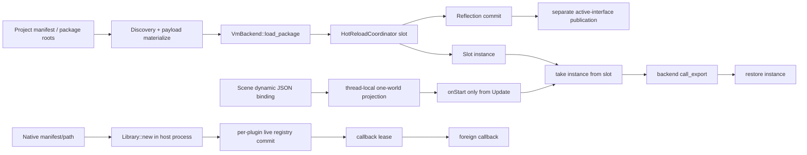

# Runtime216: Script / Plugin Execution / VM / Binding / Hot Reload / Native Isolation / Debug / Product Integration 当前工作树复核

- 复核日期：2026-09-01。
- 复核 HEAD：`5798051603e7f7f565538125c9aba96d5beabae2`；统计与判断读取当前工作树，不把 HEAD 当成唯一真相。
- 复核类型：review-only；未修改 Rust、Cargo、ABI、tests 或产品 UI，也未运行 Cargo、真实 DLL、Runtime/Editor、fault、security、scale、soak 或 benchmark。
- Tooling：按用户要求排除；本轮未查询、轮询、等待或实时跟踪协调器。

## 1. 结论

Zircon 的 Script/Plugin Runtime 不是空壳，但还没有形成工程级执行平台。当前可保留底座包括：typed catalog/compiled project plan 的局部 generation 工作、VM reflection prepared/commit、hot reload state migration 和 rollback、panic 后 instance 恢复、带宿主 wall-clock deadline 的 cooperative GC、borrowed scalar/bytes call frame、generation-qualified registration、native callback generation lease、host-owned bounded output sink，以及一个通过 public Runtime ABI 驱动真实 ZrVM Vampire gameplay/menu/HUD/diagnostics 的产品测试。

这些实现仍由多套状态机拼接。普通脚本调用没有 execution context、fuel、deadline、cancel、memory 或 host-call budget；真实 ZrVM 用进程级 mutex 串行 compile/load/call/GC/drop；VM slot 通过把 instance 从 map 取出实现互斥，重入和并发立即变成“instance unavailable”；load/reload/unload 后再单独发布 active interface snapshot。scene binding 只有 FixedUpdate/Update，`onStart`只在 Update 分支执行，binding identity依赖数组 index，任意 binding generation重建会丢失 started 状态，首个失败会终止本阶段剩余脚本。值合同只有七种标量/bytes/raw handle，复杂 gameplay/reflection/state 继续大量走 JSON。backend-neutral debugger、source map、per-export profiler 与 shipping trace 基本不存在。

native 路径的 callback lease 是本轮最强的并发底座，但 DLL 仍由主进程直接 `Library::new`；load admission 没有 artifact digest、signer、certificate、revocation、quarantine 或 OS isolation。lifecycle transition 只能在 active callback 为零时立即 CAS 成功，没有先关闭准入再 bounded drain；批量 load 逐插件提交，后项失败会留下前项；hot reload 还明确存在“previous package was already unloaded，rollback unavailable”的状态。SDK `native.rs` 当前又保留六个重复/自引用 V3 type alias，是 Plugins01 所有的源级构建阻断；本报告引用而不重复建立 Runtime P0。

Runtime07 的 14 项 P1 本轮重判为 **6 Open / 8 Partial / 0 Closed**，2 项 P2 为 **0 Open / 2 Partial / 0 Closed**。变化只有两项：新的 real-ZrVM Vampire public-ABI 产品测试使 `P1-14` 和 `P2-2` 从 Open 降为 Partial；它没有覆盖 installed artifact、Editor Play、standalone/export/cook、reload、并发、timeout、crash/hang、security、soak 或同机性能，因此不能 Closed。16 道资格门为 **9 Fail / 7 Partial / 0 Pass**。

## 2. 冻结范围与证据强度

### 2.1 当前工作树选择集

统计包括 tracked 与未忽略的 untracked 文件。`tests`、`ignored`、`unsafe`是词法属性/词项，不代表动态通过或风险数量。fingerprint 是排序后的规范相对路径与逐文件内容 SHA-256 再聚合 SHA-256。

| 范围 | files | lines | non-empty | bytes | tests | ignored | unsafe | fingerprint |
|---|---:|---:|---:|---:|---:|---:|---:|---|
| Runtime Script VM / framework call contract | 120 | 22,651 | 20,685 | 788,608 | 210 | 0 | 1 | `aa079d8f64992f48435e473b0fe61f8c4533c8f4814dc9ce91adf29fdb55436b` |
| ZrVM language plugin | 41 | 5,558 | 5,081 | 197,808 | 48 | 0 | 18 | `ae886cadd20a6769874b3d18123096a728ec7d1a0db8a9df875b5995b919d636` |
| Native loader + SDK native surface | 116 | 31,809 | 29,010 | 1,144,566 | 373 | 0 | 253 | `13442f9a4fd7bf10e54bce45ba0ed103fd9399bbe2c61551245a530a57646b47` |
| App/catalog/dynamic session/Vampire product integration | 77 | 21,308 | 19,682 | 865,857 | 226 | 9 | 105 | `8f84195aef11899e4a449a52a15d8da329162b0e0c9967e950b8daa881428b5a` |
| 去重 Zircon 联合集 | **354** | **81,326** | **74,458** | **2,996,839** | **857** | **9** | **377** | `8faf66421334379fb2e064d8edbd1a274032cc4e7e7002b22c17f99da0fd3245` |
| 五引擎参考选择集 | **24** | **32,298** | **29,216** | **1,148,377** | **45** | **0** | **11** | `7323890fb820ef56881d50678e07e8d8c6ad50320a8e6d2054b19cff52b30cc2` |

复核时根工作树有 435 条 porcelain status 记录，说明报告必须绑定以上选择集指纹。参考版本为 Godot `8c7e6c5877a78e8e61ea4fd42673219a9091dca7`、Fyrox `8d815db36494f1badb347547dfc7094bf4fbbdf8`、Bevy `fb89a8649d9b359e53ffb6e5492ebb7c059ac8af`、Unity Graphics `a7e4c051d256a781ab362c64316b125a1e104694`。本地 Unreal checkout 不拥有独立 nested Git metadata，因此只绑定上述参考选择集内容指纹，不伪造 Unreal SHA。

### 2.2 审查方法

1. 逐文件枚举 framework script value/call frame、`zircon_runtime/src/script`、ZrVM runtime、native loader/SDK、dynamic session、first-party catalog 与 Vampire 产品接线。
2. 逐符号追踪 backend load、slot call、callback resolve、scene tick、GC、state migration、native load/reload/unload、callback lease、public ABI session 和测试 ownership。
3. 对 execution budget、deadline/cancel、memory、generation、publication、trust/isolation、debug/profiler、JSON/marshalling、panic/TODO/unimplemented 与 ignore 做横向词法扫描，再回读命中上下文排除误报。
4. 对照参考引擎的生命周期、调用合同、访问调度、热重载状态、模块阶段、扩展初始化、脚本调试和包边界；不把单个引擎的实现机械复制成 Zircon 架构。

证据等级仍为静态 E3：足以确定源码合同、owner 与断链，不足以证明编译、运行时行为、fault containment 或性能。尤其 SDK alias 阻断和产品测试均未在本轮动态执行。

## 3. 应保留的工程底座

| 底座 | 当前价值 | 重构时必须保持的性质 |
|---|---|---|
| typed catalog generation / compiled project plan / session pin | 已开始把 descriptor scan 收敛成 immutable generation | 继续成为唯一 resolved product graph；不能让 backend/world 各造可见真相 |
| reflection prepare/commit 与 state migration | 新 schema 在提交前可构建，迁移失败有局部 rollback | 并入统一 generation transaction；保留 checked generation exhaustion |
| VM call panic restore | export panic 后 instance 会先归还 slot 再 resume unwind | 改成 call lease 后仍需保证 lease/instance/diagnostic 必然归还 |
| cooperative GC deadline | stable slot order、remaining budget、host elapsed/overrun、pending queue 均已存在 | GC 与普通 call 共用 execution accounting，但不能退回单次无界 stop-the-world |
| borrowed argument views / call frame | scalar/string/bytes 的 guest-to-host 路径已能避免部分 owned copy | 作为 typed marshalling plan 的 scalar/bytes fast path，不被 JSON DTO 替换 |
| generation-qualified registrations / immutable active snapshot | system/BT/RPC/editor contribution 可按 active generation 投影 | callback table也必须同样 generation-owned；publication 必须进入同一事务 |
| native per-generation callback lease | Arc pin DLL、transition bit、active count、64-shard diagnostics，callback在 registry 锁外执行 | 扩展为 close-admission + bounded drain + retire；不要恢复 callback global mutex |
| native host-owned output sink | 256 MiB hard max、checked reserve/accumulation、panic guard | 所有 input/state/output/diagnostic 都改用同类 host-owned budgeted carrier |
| real ZrVM Vampire public-ABI test | 首次把真实 backend、session、input、gameplay、HUD capture、diagnostics 放进同一测试 | 转成 installed immutable artifact，并扩展到 reload/fault/export/cook；不能退回只测 mock |
| HRTB runtime reflection scope | callback 无法把临时 world borrow 逃逸到 scope 外 | 继续作为 host access lease 的内存安全边界 |

## 4. 当前执行链与断裂位置

关键断裂不是“没有 API”，而是原子性和执行 owner 没有贯穿整条链：reflection/slot/interface publication 分步；scene lifecycle 状态位于可重建 projection；ZrVM lock 位于进程级；native trust admission 在 `Library::new` 前缺失；普通 export 和 foreign callback 都没有统一 execution policy。

## 5. Runtime07 canonical finding 重判

状态规则：只有唯一 owner、产品调用链、失败/退役合同与动态资格证据同时成立才能 Closed。source shape、单元测试数量、局部 rollback 或“有 budget 字段”不能单独关闭 finding。

| Canonical finding | 状态 | 当前工作树证据 | 必须重构的合同 |
|---|---|---|---|
| P1-1 多个平行 plugin authority，没有单一 compiled generation | **Partial** | typed catalog generation、compiled plan 与 session pin 存在；VM slot/reflection/interface、native loaded/bridge/replay、world contribution仍各自发布 | `PluginResolutionPlan -> PluginCatalogGeneration -> BackendGeneration -> WorldContributionGeneration`一次 prepare/commit；所有 consumer pin 同一 receipt |
| P1-2 batch load/activate/reload/publication不失败原子 | **Partial** | VM reflection先 commit、slot后 insert，active interface又在 manager 返回前后单独 publish；native load loop逐插件 insert，reload可在旧包卸载后失去 rollback | 统一 `GenerationTransition`：prepare、close admission、drain、activate、validate、single publish、retire；失败只能观察完整 old 或完整 new |
| P1-3 dependency不是版本/来源/信任求解器 | **Open** | manifest和catalog不形成 version range/source/digest/signer/conflict/provide/target/profile lock identity；Runtime199/Plugins01分别有局部数据 | 唯一 deterministic resolver 生成可重放 lock、artifact closure、拒绝链；Editor/Runtime/Export/Cook共用 |
| P1-4 native DLL主进程直载，无信任与故障隔离 | **Open** | load path在存在性与compat检查后直接 `unsafe Library::new`；精确 trust 词项命中均为测试/普通 isolation/revocation callback等误报，没有 load admission 或 OS containment | trusted in-process 与 isolated worker 两级；digest/signature/source/revocation/quarantine/capability/CPU-memory-time-IPC/crash policy 均在映射 DLL 前生效 |
| P1-5 ABI epoch与兼容责任不清 | **Partial** | V3 descriptor、V4 behavior、entry layout epoch 5 并存；SDK `native.rs:197-202` 六个 alias 重复/自引用，跨工具链 corpus缺失 | 单一 schema 生成 Rust/C header/decoder；明确 read/execute/upgrade matrix、calling convention、allocator、alignment 与 lifetime；先由 Plugins01 修复源级阻断 |
| P1-6 native callback预算不完整 | **Partial** | output sink host-owned且 bounded，callback有generation lease；input/state/diagnostic/handle数量/time/cancel/hang仍无共同 policy | `NativeExecutionContext`覆盖所有 carrier、deadline、cancel、thread、reentry、handle lease；大 state 使用 host-owned pages/artifact |
| P1-7 ZrVM进程级 mutex串行所有 domain | **Open** | `OnceLock<Mutex<()>>`保护 compile/load/call/GC/drop；raw-pointer owner 的 unsafe Send/Sync 只由这把锁成立 | 先证明 ZrVM thread/reentry 模型；可隔离则 per-domain owner，不可并发则 worker actor/process并显式排队/取消/超时，禁止全局锁伪装并行 |
| P1-8 VM slot无call lease、quiescence与reentrancy合同 | **Partial** | instance take/restore是panic-safe，但同slot并发/重入立即“active instance unavailable”；lifecycle用全局 mutex，没有 per-slot close/drain/retire | `VmCallLease`固定 slot+generation+execution context；close新准入、bounded drain、atomic switch、lease-zero retire；reentry按调用链显式 allow/deny |
| P1-9 memory policy未执行，普通调用无fuel/deadline/cancel | **Open** | memory policy只检查非零和 soft<=hard；`VmPluginInstance::call_export`没有 context；typed VmError也没有 timeout/cancel/OOM/fuel/trap/poison | allocator/VM/host共享 `ScriptExecutionPolicy/Context`，预算跨 nested/host/async 继承并生成 typed terminal error；GC只消费其中一类 budget |
| P1-10 scene lifecycle、identity、调度与失败隔离不完整 | **Partial** | 仅 FixedUpdate/Update；FixedUpdate可先于onStart；identity为`package::module#index`；projection重建重置started；thread-local只缓存一个world；循环以`?` fail-first；registered systems串行且无access set | stable `ScriptComponentId` + init/start/enable/disable/fixed/update/late/pause/resume/reload/destroy状态机；access-aware schedule；per-component/package/world failure policy与聚合 receipt |
| P1-11 script value/reflection/gameplay边界过窄 | **Partial** | borrowed scalar/bytes和typed descriptor存在；公共 value只有Null/Bool/Int/Float/String/Bytes/HostHandle，handle是裸u64，error只有message；scene/gameplay/state/reflection仍走JSON，ZrVM bytes逐元素array push/read | reflection生成 `TypeId + SchemaGeneration + MarshallingPlan`；支持array/map/struct/enum/nullable/result/out-ref/async及entity-component-resource lease；JSON只留文档/diagnostic边界 |
| P1-12 无debugger/source map/profiler/execution trace | **Open** | 精确搜索仅命中一条普通“stack frame”注释；没有breakpoint/step/stack/locals/watch/evaluate/source-map adapter或per-export inclusive/exclusive/allocation/host-call attribution | backend-neutral debug/profiler协议；pause、world lock、reload、GC、cancel协调；shipping保留低开销trace、符号/source artifact与crash correlation |
| P1-13 VM package不可重现、不可验证、依赖合同不足 | **Open** | real backend打开`project_path`并在load时incremental compile；plugin依赖外部相对path crate；artifact缺compiler/options/dependency hashes/signature/pages/source map | source/compiled/installed三层硬分离；runtime只加载 resolved+verified+paged immutable artifact，package identity进入统一solver/lock |
| P1-14 缺真实产品、并发、故障与性能证据 | **Partial** | 新测试通过public ABI创建linked session，覆盖真实ZrVM、input、追逐/击杀、HUD capture和diagnostics；仍复制源码到temp project并运行期编译，legacy dynamic session还有9项ignore | Editor Play/App/standalone/export/cook + installed artifact + reload/concurrency/fault/security/soak/perf矩阵，artifact/trace/crash都绑定BuildSet |
| P2-1 control-plane DTO/string index/full rebuild重复 | **Partial** | immutable snapshots、dense callback、borrowed path与局部cache存在；active publication、callback table、scene projection、JSON/string lookup仍重复/全量派生 | generation build一次 intern/compile dense spans；affected-slot增量更新；记录build/copy/lookup/call p50/p95/p99与bytes |
| P2-2 test/source guard不能替代ABI/并发/故障/产品证据 | **Partial** | real-ZrVM public-ABI产品测试消除了“只有mock/source guard”的一个后果；无 foreign ABI、crash/hang、timeout、active reload、signature、shipping/export证据 | 测试分层标 unit/property/integration/product/stress/fault/security/performance；关键 harness 保存manifest/artifact/trace/crash/replay receipt |

汇总：P1 **6 Open / 8 Partial / 0 Closed**；P2 **0 Open / 2 Partial / 0 Closed**。本轮不新增平行 canonical finding；callback generation alias、Fixed-before-Start 和 non-atomic publication 均是既有 P1-2/P1-8/P1-10/P1-11 的更强验收反例。

## 6. 逐子系统差异与重构要求

### 6.1 Backend、slot 与 execution contract

`VmBackend`只有 `backend_name/load_package`；runtime capability、thread model、determinism、debug/profiler、artifact formats、execution budgets均靠实现外推。`VmPluginInstance`把activate/deactivate/state/call/GC混在一个 mutable trait object，普通call只接`&[ScriptHostValue]`。`VmError`的可执行分类只有 backend missing、slot missing、operation string、parse、state migration、reflection，不能让 scheduler/session 判定 retry、disable component、quarantine package、abort world 或 terminate process。

必须拆为：

- `VmBackendDescriptor`：backend/version/artifact formats/thread/reentry/determinism/debug/profiler/capability真实性。
- `VmDomainOwner`：per session/world/domain所有权与shutdown。
- `ScriptExecutionContext`：session/world/component/slot/generation/call-chain/deadline/cancel/fuel/memory/host-call/trace。
- `ScriptExecutionError`：typed trap、timeout、cancelled、OOM、host fault、stale generation、reentry denied、backend poisoned、quarantined。
- `VmCallLease`：固定generation并贯穿 callback resolution、world access和backend call。

### 6.2 Hot reload 与 publication

VM load在 slot 185用unchecked `fetch_add`，在 slot插入前提交reflection；manager不论 coordinator结果成功与否都会再调用`publish_active_interfaces`。reload虽有详细局部rollback，但仍先从slot取出旧instance并全局串行；callback、reflection、slot和active snapshot不是一份prepared generation。native batch同样逐插件将bridge binding和loaded registry提交；后续失败不撤销已提交前项。native hot reload甚至允许旧库已卸载后才发现不可回滚。

目标 transaction 必须有以下不可省略状态：

`Resolved -> Prepared -> AdmissionClosed -> Draining -> Activated -> Validated -> Published -> Retiring -> Retired`，以及任何阶段到`RolledBack/Quarantined`的typed terminal。publish只能有一个release point，consumer pin receipt 后看到的 catalog、backend slots、interfaces、reflection、world contributions和debug symbols必须同代。

### 6.3 Callback generation correctness

registration key包含generation，但callback dense table是`slot -> OwnerCallbackTable`。reload后`compile_callback`继续向同一个slot表追加module/function；`resolve_callback`按旧ordinal取字符串，再无条件把handle generation改成active generation。真实ZrVM把missing optional export转换成`Ok(None)`。因此“旧generation存在函数、新generation删除函数”可能不报stale，而是把旧handle指向新generation同名目标；若新包确实无目标，又可能静默成功无返回。

必须把 callback table 变成 immutable `CallbackTableGeneration`，handle至少包含 slot、generation、table generation、module/function ordinal。reload只能通过显式 remap plan 将旧symbol迁移到新symbol；删除目标必须返回 `RemovedExport/StaleCallback`，不能改写generation后继续调用。optional只允许用于生命周期中合同明确可省略的export，scene/system注册过的callback不得把missing当no-op。

### 6.4 Scene lifecycle 与调度

当前 `ScriptSceneLifecyclePhase`只有FixedUpdate/Update，`onStart`仅由Update第一次调用触发。若引擎先跑fixed stage，则`onFixedUpdate`先于start。`started`和callback cache都在`Rc<ActiveScriptBinding>`投影内；任意`script.bindings` generation变化都会重建并归零。数组index进入identity，使reorder/disable/insert改变后续所有binding身份。thread-local cache一次只保留一个world，跨world交替会重复构建。每个export还创建`CoreWeak`并clone`LevelSystem`；系统与binding循环都在首错处退出。

重构必须先定义唯一状态机，而不是继续加bool：

`Declared -> Initialized -> Started -> Enabled -> Paused/Disabled -> Reloading -> Destroying -> Destroyed/Failed`。

状态归 stable component instance owner，不归cache；fixed/update/late/event只是对状态机的调度输入。script descriptor必须声明读写component/resource/event集合，scheduler据此并行无冲突脚本、延迟提交command并聚合错误。reload要定义 old/new component instance、state schema、callback table、pending async continuation和world mutation的共同切换点。

### 6.5 Values、reflection 与 marshalling

borrowed `ScriptHostCallFrame`/visitor string/bytes值得保留，但neutral owned value仍只有七类；raw host handle无法检查type、owner、generation或lifetime。`ScriptHostError { message }`无法表达argument index、expected/actual type、schema generation、source location、retryability或terminal policy。scene properties是`BTreeMap<String, serde_json::Value>`，projection会clone整份value再`from_value`；gameplay transform/navigation/component/result用JSON string传输；real backend state/schema和reflection读写也用JSON，bytes用VM array逐元素构造/读取。

目标是由 reflection artifact 生成 immutable marshalling plan：scalar/borrowed bytes直接fast path；aggregate按layout/field plan；host对象使用 qualified lease；large buffer/page由host owner；async使用 continuation token；错误带type path、argument、source和generation。禁止在frame gameplay主路径重新parse JSON或按字符串寻找字段。

### 6.6 Native ABI、trust 与 isolation

callback lease实现已正确把DLL generation pin到每次foreign call，并通过transition bit拒绝新callback；问题在transition只能从activity=0开始，已有callback时直接Busy，不具“先关闭准入、等待存量归零”的两阶段quiescence。save state仍接收plugin-owned pointer descriptor再copy/free，其他输入与时间无统一预算。更根本的是主进程映射前没有cryptographic identity和trust decision，catch_unwind也不能捕获access violation、abort、hang或任意内存破坏。

必须分层：

- `NativeArtifactAdmission`：canonical path、digest、signature、signer policy、source/lock、revocation、platform/ABI、quarantine，在load前完成。
- `TrustedInProcessNativeDomain`：仅允许明确trusted artifact，使用现有lease扩展bounded drain与structured fault accounting。
- `IsolatedNativeWorkerDomain`：默认第三方/未知代码，版本化IPC、capability token、shared-page budget、heartbeat、deadline/cancel、process kill、crash dump、restart/quarantine。
- `NativeGenerationTransaction`：DLL、bridge、registration replay、catalog/world contribution只发布一次；旧generation在所有call/bridge/context lease归零后卸载。

### 6.7 Debugger、profiler 与 shipping diagnostics

当前trace env只记录binding export start/done和success，GC/host hot path有局部counter；没有统一source identity、instruction location、call stack、locals、watch、evaluate、breakpoint、step、pause或per-export time/allocation/host-call。Editor无法安全暂停一个world而继续其他session，也没有规定pause期间reload/GC/native worker怎么处理。

需要一个backend-neutral `ScriptDebugAdapter`和`ScriptProfilerAdapter`，backend可以声明支持级别。source map必须绑定 installed artifact digest；stack frame绑定session/world/component/slot/generation；profile同时提供inclusive/exclusive time、calls、alloc bytes、host time、GC attribution、trap/timeout。shipping至少保留低成本sample/event和可离线解析的符号/source artifact，不要求携带完整Editor debugger。

### 6.8 产品与测试证据

新Vampire测试是真实进展：它复制当前`main.zr`到临时项目，通过`create_linked_runtime_session`和public V8 API发送resize/pointer/mouse/keyboard、tick、query world、capture RGBA并检查runtime diagnostics。它仍不是可发布产品证据：源码被测试时复制，runtime打开project path并incremental compile；只有单session、单backend、短流程；不验证hot reload/state migration、multiple worlds、cancel/timeout/OOM、native DLL、installed package、Editor Play、standalone、export/cook、restart/replay、crash/security/soak/perf。dynamic session旧Vampire文件当前仍有9项`#[ignore = "coverage moved"]`，ownership迁移尚未硬切清理。

## 7. 五引擎参考差异

| 参考 | 可迁移工程原则 | Zircon当前差异 | 不应机械复制 |
|---|---|---|---|
| Unreal | module有load failure reason与startup/post-load/pre-unload/shutdown阶段；`FFrame`携带code/locals/property边界，Blueprint具exception、breakpoint、step、watch与instrumentation | Zircon module/package/VM/world发布不在同一阶段事务；脚本调用无frame/debug contract | Unreal也不等于第三方native安全沙箱，不能用其in-process module模型替代trust/isolation |
| Godot | `ScriptLanguage`有thread enter/exit、reload、debug stack/locals/members/globals/evaluate及profile；`ScriptInstance`有property/method/notification；MethodBind分dynamic/validated/ptr call；GDExtension按init level正序、deinit逆序 | Zircon只有窄value/call和两阶段scene tick，无language/thread/debug/profile/完整instance contract；native lifecycle不分init level | 不复制Variant everywhere；Zircon应保留生成式typed/borrowed fast path |
| Fyrox | Script保证on_init先于任何回调、所有init后再start、deinit最后；context借用scene；动态plugin有on_loaded/on_deinit；hot reload序列化scene user data/node/script再恢复 | Zircon FixedUpdate可先于start，lifecycle state放在cache，reload不拥有完整scene/script activation transaction | Fyrox序列化策略可作lifecycle oracle，不代表JSON或全量serialization适合Zircon热路径 |
| Bevy | plugin有build/ready/finish/cleanup状态；system初始化返回`FilteredAccessSet`，无冲突才并行，deferred mutation显式apply；error/param validation进入schedule contract | Zircon registered systems串行fail-first，无access descriptor/deferred command/failure policy，plugin readiness与world activation也未统一 | Bevy不是脚本VM或native ABI参考；只借鉴调度与插件阶段原则 |
| Unity Graphics | package声明依赖，Runtime/Editor/Runtime.Tests以asmdef硬分层，tests非auto referenced | Zircon runtime/editor/test/package边界仍被feature/path/runtime compile和owner迁移测试交叉污染 | Graphics仓库没有脚本VM，不据此推导执行、GC、debug或isolation设计 |

参考代码的作用是给出可检验的不变量：生命周期先后、访问冲突、状态迁移、调用类型、调试可观察性、初始化/卸载逆序与包边界。Zircon的目标应是把这些原则统一到一套generation和execution contract，而不是在每个backend各写一份适配状态机。

## 8. 目标架构

建议最终 owner 划分如下：

| Owner | 唯一职责 | 禁止继续承担 |
|---|---|---|
| `PluginResolutionService` | dependency/source/trust/target/profile求解并产lock与artifact closure | backend load、world mutation |
| `PluginGenerationCompiler` | 编译catalog、interfaces、types、backend plans、world contributions、debug symbols | live publication |
| `PluginGenerationCoordinator` | prepare/quiesce/activate/validate/single-publish/retire/rollback | 编译器细节、foreign callback业务 |
| `ScriptExecutionService` | execution context、lease、budget、cancel、typed errors、schedule/failure policy | backend-specific VM pointer |
| `VmDomainOwner` | 每backend domain的thread/reentry/GC/allocator/shutdown | process-global implicit mutex |
| `ScriptComponentRuntime` | stable identity、完整scene lifecycle、state/async continuation | projection cache中的lifecycle truth |
| `ScriptTypeCatalog` | type/schema/marshalling plans与qualified handles | gameplay JSON DTO authority |
| `ScriptDebugService` | source map、breakpoint/step/stack/locals/watch/profile/trace | backend私有不可组合日志 |
| `NativeArtifactAdmission` | digest/signature/source/revocation/quarantine/load policy | DLL映射后补校验 |
| `NativeDomainSupervisor` | trusted in-process或isolated worker、budget、heartbeat、crash/kill/restart | catalog/world publication |

产品consumer只能从一份 `ActivePluginGenerationReceipt` 进入；receipt至少绑定 BuildSet、resolution lock、catalog generation、backend domain generations、world contribution generation、type/schema generation、debug artifact、trust decision与publication epoch。

## 9. 依赖有序重构里程碑

### M0：恢复可验证基线与ABI单源

- Plugins01删除重复/自引用alias，由单一schema生成Rust/C合同与layout tests。
- 冻结当前公开ABI与read/execute/upgrade matrix；完成MSVC/GNU/Linux/macOS基本conformance。
- 给所有后续里程碑建立clean BuildSet、artifact identity和动态验证入口；M0未过不得继续扩ABI。

### M1：统一 execution context、typed error 与 budget

- 先写跨mock/ZrVM/native的RED tests：deadline、cancel、fuel、memory、host-call、nested inheritance、typed terminal。
- 将`VmPluginInstance::call_export`和native callback收敛到共享execution semantics；GC作为同一context的cooperative子预算。
- 定义component/package/world/session的failure policy与聚合receipt。

### M2：call lease、quiescence 与原子 generation transaction

- VM与native都实现close admission、bounded drain、atomic switch、lease-zero retire。
- callback table、reflection、interfaces、slot、bridge/replay/catalog/world contribution用同一prepared generation。
- 删除manager事后`publish_active_interfaces`和native逐插件可见提交路径；加入active-call reload/unload与rollback fault矩阵。

### M3：stable scene script runtime 与 typed marshalling

- 引入stable ScriptComponentId和完整lifecycle状态机，删除index identity及cache-owned started。
- compiler生成access set、schedule batch、marshalling/state migration plan；JSON退出frame gameplay和reflection主路径。
- 支持aggregate/qualified handle/lease/async continuation，并验证multi-world/multi-session/reentry。

### M4：reproducible package 与 native trust/isolation

- runtime禁止打开project source并即时compile；只加载solver输出的verified installed artifact。
- 建立native pre-load trust admission、trusted in-process policy与isolated worker supervisor。
- 验证signature/revocation/malformed ABI/foreign allocator/access violation/abort/hang/OOM/quarantine/restart。

### M5：debugger、profiler 与Editor/Runtime产品链

- 接backend-neutral source map、breakpoint/step/stack/locals/watch/evaluate和per-export profile。
- 定义pause/reload/world lock/GC/native worker协作；shipping trace绑定artifact/BuildSet。
- 覆盖project open、Editor Play/stop/reload、App、standalone、export/cook、restart/replay。

### M6：scale、soak 与性能资格

- 执行1/10/100 package、1/10/100 world、并发call/reload、短/长GC、1/8/24h稳定性矩阵。
- 同硬件、同项目、同build/profile对比startup、reload、frame script CPU、RSS、p50/p95/p99、GC、hitch、debug/profiler开销和tool latency。
- 所有结果绑定source/binary/package/trace identity；在此之前禁止宣称“性能或表现优于Unreal”。

## 10. 资格门重判

| Gate | 状态 | 缺失证据 |
|---|---|---|
| G1 单一resolved/compiled product generation | **Partial** | typed catalog/plan/session pin存在；native/VM/bridge/world仍有平行authority |
| G2 跨package/backend/contribution失败原子transition | **Partial** | 局部rollback存在；无整批close/drain/single-publish/retire事务 |
| G3 version/source/digest/signer/trust deterministic resolver与lock | **Fail** | manifest/solver不足，Editor/Runtime/Export/Cook不能重放同一图 |
| G4 native pre-load trust admission、隔离与revocation | **Fail** | 主进程直载，无cryptographic admission、OS crash/hang boundary |
| G5 单源ABI schema、header与跨工具链/外语conformance | **Fail** | SDK仍有重复alias源级阻断，epoch/allocator/layout/calling convention矩阵缺失 |
| G6 native callback全input/output/state/time/handle故障控制 | **Partial** | output sink与lease存在；其他carrier、deadline/cancel/hang/isolation缺失 |
| G7 ZrVM多domain/多world并发与故障隔离 | **Fail** | process-global mutex串行真实backend全部动作 |
| G8 VM slot call lease、reentry、bounded quiesce与retire | **Partial** | panic-safe take/restore存在；per-slot lease与drain未实现 |
| G9 script fuel/deadline/memory/host-call/cancel执行预算 | **Fail** | policy只声明，普通call没有execution context或typed budget trap |
| G10 scene完整lifecycle、stable identity、schedule与failure policy | **Partial** | start/update/fixed/cache存在；Fixed-before-Start、index identity、reset、fail-first和无access schedule仍在 |
| G11 typed value/reflection/marshalling/state migration热路径 | **Partial** | borrowed scalar/bytes与reflection存在；aggregate/lease/schema plan和JSON退出未完成 |
| G12 debugger/source map/profiler/shipping trace | **Fail** | backend-neutral运行中debug和per-export/entity归因为零 |
| G13 verified/reproducible/paged script package artifact | **Fail** | runtime仍打开project path并compile，缺compiler/dependency hash/signature/source map/pages |
| G14 Editor/Play/App/standalone/export/cook真实产品session | **Partial** | public-ABI real ZrVM Vampire短流程已存在；仍是临时源码fixture，缺Editor/export/cook/reload/replay且旧tests有9项ignore |
| G15 stress/fault/security/soak资格 | **Fail** | 无crash/hang/OOM/signature/active reload/long-run受管artifact |
| G16 同硬件参考引擎性能与稳定性对照 | **Fail** | 无同场景source/binary/trace绑定CPU/RSS/latency/GC/hitch数据 |

汇总：**9 Fail / 7 Partial / 0 Pass**。

## 11. Owner 去重与实施边界

- Runtime216/Runtime07唯一拥有跨backend执行合同、call lease、generation transaction、scene lifecycle、typed marshalling、debug/profiler、产品与资格闭环。
- Runtime199继续拥有provider/catalog/factory/capability/profile完整性；这里不复制其provider finding，只要求其输出进入统一generation。
- Plugins01继续拥有SDK/package/manifest/native ABI schema和具体native loader failure；这里拥有跨native/VM一致的execution、transaction与isolation集成要求。
- Plugins16继续拥有首方ZrVM package的backend实现；这里拥有backend-neutral domain/thread/reentry/budget/debug合同。
- Runtime24拥有通用identity/exhaustion；本篇只要求script/native handle消费其qualified owner/generation方案。
- Runtime13 failure保留scene binding hot-path局部修复历史；canonical状态回写Runtime07 P1-10/P1-11，不在failure旁新增第二套生命周期。

## 12. 当前状态

`review_complete；implementation_partial；execution_atomicity_quiescence_lifecycle_marshalling_isolation_debug_reproducibility_and_qualification_pending；source_recheck_required`

本轮只完成 current-working-tree 静态复核、参考引擎对照、canonical重判和依赖有序重构计划。没有动态Cargo或产品证据，因此报告不会把新Vampire测试写成“已通过”，只确认源码中存在该测试与完整public-ABI调用链。进入实现前必须先处理Plugins01 SDK alias阻断并重取选择集fingerprint；在M6完成前，任何“工程级完成”或“性能/表现优于Unreal”的声明都没有可审计证据。
