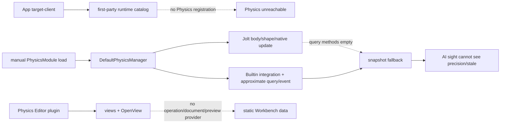
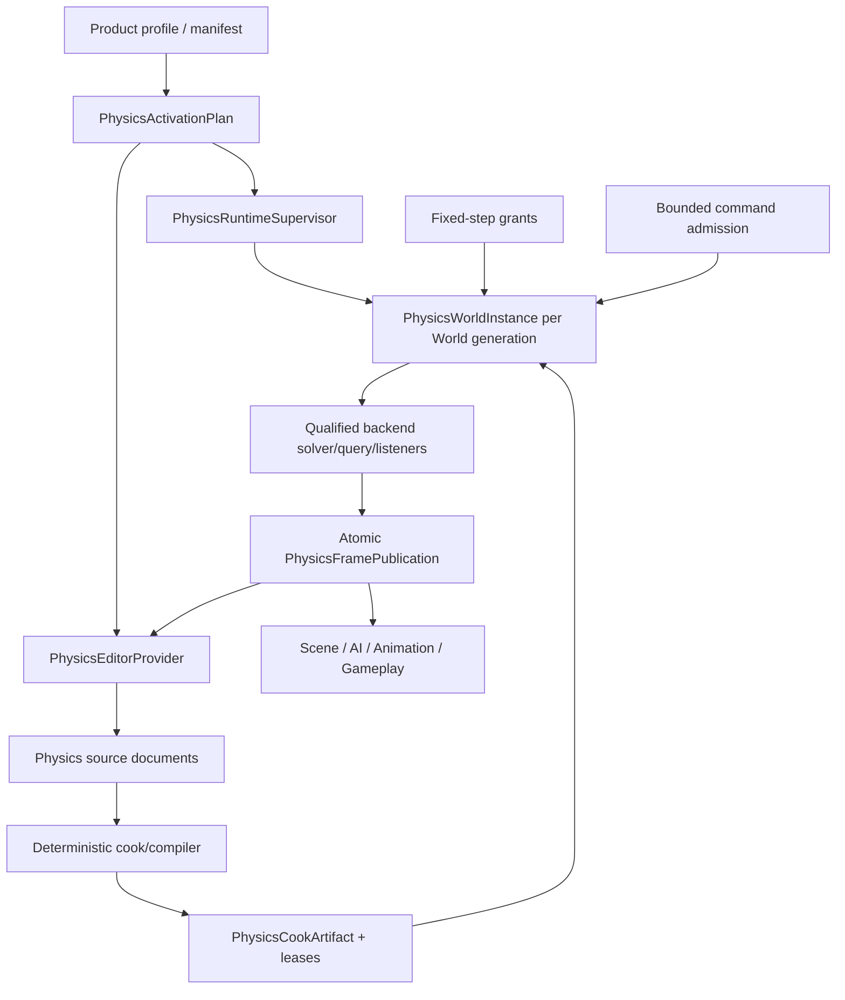

# Runtime219 - Physics 当前工作树复审

## 1. 结论

当前 Physics 不能被判定为工程级物理系统，也没有可复现证据支持其正确性、性能或产品表现优于 Unreal。它已有值得保留的底座：中立 Physics contract、Scene body/collider/joint/material schema、bounded command queue、Arc world snapshot、Jolt 基本 body/shape/native update、Builtin primitive query、Ragdoll profile/runtime、Level replacement epoch 和单元测试。问题是这些代码没有收敛为可由普通 Client/Editor Host 装配、按 World 隔离、按固定时钟推进、使用同一 backend 求解/查询/事件、通过 cooked artifact 驱动、可故障恢复并能被 Editor 事务化编辑的产品系统。

当前真实形态：

1. 默认 App profile 与首方 runtime/editor catalog 不选择 Physics；Jolt feature 默认关闭；manifest 的七项能力为 `partial`，maturity 为 `experimental`。
2. Builtin 不是碰撞求解器，Jolt 的 ray/shape/overlap query 入口为空，但两者都可报告 `Ready`；manager 又用同步快照上的 Builtin 近似几何返回结果。
3. 生产 `tick_scene_world` 用 caller frame delta 生成恰好一步，忽略 `fixed_hz/max_substeps`；另一条 `advance_clock` 才有 accumulator，形成两个物理时钟 authority。
4. 每帧仍从 Scene 全量投影 bodies/colliders/joints/materials；sanitize、command apply 与 Scene writeback 多处静默 drop/continue/`let _ =`，没有 generation-qualified 原子 receipt。
5. Jolt 没有原生 constraint、query、contact/trigger listener、authoring collision matrix、完整 material slot/local transform/scale 或 cooked mesh/heightfield 链；固定 native 容量没有 admission/high-water/overflow contract。
6. Character Controller 与 Vehicle 没有 runtime owner；Ragdoll 是可测试的内存模型，但没有 PhysicsAsset source/import/cook/document/preview/teardown 产品链。
7. Physics Editor 四份 ZUI 共 139 行，其中 11 个业务 `Space`，0 Button、0 event、0 route；两个业务命令只发 `OpenView`。主 Workbench 另有静态 Physics 页面，固定显示 124 bodies、32 contacts、82 kg。
8. 测试和 ignored microbenchmark 无法回答堆叠/穿透/摩擦/CCD/睡眠正确性、native fault、容量溢出、1K/10K/100K scale、长时稳定性及同语义跨引擎性能。

本报告不新增第二套物理债务编号。Runtime138（实际文件 `99zm-physics-world-review.md`）继续拥有 `PH-P1-001..048`、`PH-P2-001..012` 与 42 项 Gate；Runtime167、Runtime186 和 Editor246 保留细化映射。本报告冻结当前工作树，纠正旧报告算术并定义重构边界。

## 2. 审查边界与 currentness

### 2.1 Zircon 选择集

| 选择集 | files | lines | non-empty | bytes | test attrs | ignored | unsafe tokens | fingerprint |
|---|---:|---:|---:|---:|---:|---:|---:|---|
| Runtime neutral framework + Scene/asset Physics owner | 62 | 5,434 | 5,078 | 196,058 | 34 | 3 | 0 | `b77543ce980ec023411b50de83332def873c1a9d1c95805487489917fb152588` |
| Physics plugin root，含 plugin.toml/runtime/editor/dist | 94 | 13,759 | 12,726 | 481,444 | 92 | 1 | 49 | `71c605ae2852c69acc75de92ef4edfe46c91ca3fbd0d35d8f8670fcf4be407b6` |
| App/AI/Animation runtime consumer + 首方 catalog owner | 27 | 7,788 | 7,226 | 295,601 | 103 | 1 | 0 | `343de66a18ac9f201f31c7faf7baba30c06459c9c50e4fa2c168bb91779d5ac1` |
| Editor Physics 产品投影与测试 | 43 | 15,587 | 14,474 | 725,089 | 84 | 4 | 0 | `b1cbe6ea8e8459b68144c987a8e9c60e6f627807b4df0fd5bc3964f392cf5c99` |
| 去重 Zircon 联合集 | **226** | **42,568** | **39,504** | **1,698,192** | **313** | **9** | **49** | `e7d215cd4719945cbce2ed803b862137a262facf04b866dfc55b7bec6b9e9414` |

选择规则：Runtime 集包含 `core/framework/physics`、`core/framework/scene/physics` 全部 `.rs/.toml/.zui`，并按相对路径选择 `asset`、`scene` 中含 physics/rigid_body/collider/joint 的同类文件；Physics plugin 从根目录递归，包含 `plugin.toml`；consumer 集对 App、AI、Animation 做 physics 内容选择，并显式加入 App runtime plugin 与首方 runtime/editor catalog owner；Editor 集对 `zircon_editor` 做 physics 内容选择。测试统计识别 `#[test]`/`#[async_test]` 和 `#[ignore]`/`#[ignore = "reason"]`。fingerprint 对归一化小写相对路径排序，拼接 `path + NUL + lowercase(file SHA-256) + LF` 后计算 SHA-256，读取当前工作树。

### 2.2 参考样本与版本

27 个关键参考文件共 20,019 行、16,436 非空行、842,399 bytes，fingerprint 为 `edfd0d08dbf29c49bb92529adcf59c73b1c8592bd7d8997b555a80136c09ac71`。版本冻结为：Bevy `fb89a8649d9b359e53ffb6e5492ebb7c059ac8af`、Fyrox `8d815db36494f1badb347547dfc7094bf4fbbdf8`、Godot `8c7e6c5877a78e8e61ea4fd42673219a9091dca7`、Unity Graphics `a7e4c051d256a781ab362c64316b125a1e104694`。Unreal mirror 无独立 git 元数据，以文件内容冻结。

最近 Physics 相关提交为 `5798051603e7f7f565538125c9aba96d5beabae2`，增加了容量预分配、owned projection、HashMap lookup、Arc publication、typed tick delta 与 Editor menu path 迁移，但没有关闭 provider、solver、native query/event、artifact 或 Editor product gate。其他模块的并行改动不属于本报告。

## 3. 产品调用链事实

- `zircon_app/Cargo.toml:26` 默认只有 `target-client`；`first-party-runtime-plugins` 是可选 feature。
- `zircon_plugins/first_party_runtime_catalog/src/lib.rs:39-95` 有 AI/Sound/Texture/Net/Navigation/Particles/Animation/Rendering 等分发，没有 `RuntimePluginId::Physics`。
- `zircon_plugins/first_party_editor_catalog/src/catalog.rs:41-54` 只返回 Navigation/Neural provider，没有 Physics。
- `zircon_plugins/physics/plugin.toml:10-51` 发布七项 Partial capability；`runtime/Cargo.toml:9-10` default 为空，Jolt 只在 `backend-jolt` 下存在。
- `zircon_plugins/physics/dist/src/lib.rs:30-36` 的 command/event manifest 为空且 `invoke_command` 为 `None`；dist 是 metadata projection，不是 executable authority。
- AI perception 是已确认的生产 query consumer：`zircon_plugins/ai/runtime/src/perception/scan.rs:92-96` 调用 ray cast，registration 在 `plugin/registration.rs:310`；hit DTO 无 backend/precision/stale/overflow。

## 4. Product、Ready 与故障语义

| 证据 | 当前后果 | 重构要求 |
|---|---|---|
| App、runtime catalog、editor catalog 都不装配 Physics | 普通 Client/Editor Host 无法到达插件 | `PhysicsActivationPlan` 原子选择 source/runtime/editor/dist/backend/artifact；缺项 fail-closed |
| manifest 是 experimental/partial，`selection.rs:77/85` 却让 Builtin/Jolt `Ready` | capability truth 与 readiness 冲突 | Ready 绑定 build feature、platform、provider version、qualification、world generation、precision |
| Jolt disabled 时可 unconfigured，启用后仍无 query/listener/constraint | backend 名称掩盖 capability 子集 | descriptor 逐项声明 solver/query/contact/trigger/constraint/shape/material support |
| manager 只有全局 `last_backend_error` | 多 World 错误覆盖、无法定位 generation | 每 World FaultState 带 provider/config/world/tick generation、cause chain、last-good、retirement fence |
| Jolt error (`jolt_world.rs:464-469`) 删除 world/snapshot/events | 故障变成空成功表象 | Faulted generation、拒绝新命令、last-good publication、typed terminal receipt、bounded restart |
| `store_settings` 先清 world/command、再持久化 | durable failure 造成内存/磁盘分叉 | validate -> prepare -> durable commit -> rebuild -> publish；失败保留 last-good |
| poison recovery 取 poisoned inner | 破坏不变量后继续运行 | poison 进入 terminal fault，不得恢复为 Ready |

## 5. World、固定步进与状态发布

| 证据 | 当前后果 | 重构要求 |
|---|---|---|
| `manager/service.rs:198-227` 最多一步且 step seconds 等于 caller delta | `fixed_hz/max_substeps` 在生产路径无效 | 删除第二时钟；唯一 fixed authority 产生 0..N substeps、overstep/debt/drop receipt、单调 tick |
| `manager/clock.rs:11-34` 另有 accumulator | 同一 World 可有不同物理结果 | scheduler 只提交 fixed-step grant，World instance 独占 accumulator/policy |
| runtime system 直接传 `context.tick().delta_seconds()` | 物理未绑定稳定 fixed domain | 禁止任意浮点 delta，使用 generation-qualified grant |
| `build_world_sync_state` 调用 `world.node_records()` 全量扫描 | Arc 只减少 clone，没有消除 O(N) projection | Scene change journal、component revision、dirty compiler、增量 patch |
| 四个无界 Vec，sanitize `retain`/HashSet 静默删除 | source 错误、容量和 overflow 不可见 | source -> compiled artifact -> runtime SoA/view，逐对象诊断和 admission receipt |
| settings/accumulator/snapshot/commands/events/Jolt 多张 Mutex map | lock/teardown/replacement 无法原子化 | 每 World `PhysicsWorldInstance` 统一 owner、clock、backend、query、event、fault、retirement |
| Jolt map 锁覆盖 synchronize/native update | 多 World 被全局锁串行化 | 短锁取得 generation-qualified instance，各 World 独立 executor/solver lock |
| Scene writeback 多处 `let _ =` | missing/stale/error 被当成功 | frame publication 同时给 state patch、event、metrics、writeback receipt |

## 6. Body、Shape、Material、Constraint、Cook

| 证据 | 当前后果 | 重构要求 |
|---|---|---|
| node 最多一个 body/collider/joint，compound child 无 stable ID | reorder 后 query/event/Editor selection 不稳定 | body 与多 shape instance 分离；source ID -> artifact slot -> generational handle |
| public write/query/event 以 EntityId 为主 | local HandlePool generation 不能防 stale/cross-World | 所有对象使用 world + generation + body/collider/subshape/material identity |
| Teleport 与 Jolt active state 用 body pose 覆盖 collider transform | local transform 丢失 | body pose 与 shape local TRS 分层，定义 scale/shear/negative determinant policy |
| Jolt layer 只有 moving/non-moving | authored layer/group/mask/matrix 未进 native | collision profile/table 编译，solver/query/sensor 共用并带 reload generation |
| material 只取 inline override/default，native 只写 dynamic friction/restitution | `sync.materials`、static friction、combine、locator 不生效 | versioned material artifact、dependency lease、slot mapping、完整 combine 规则 |
| mesh/heightfield 没 production caller；每 triangle 建 shape 再 StaticCompound | cook、native object、内存、residency 不可控 | optimized offline cook、DDC、material slots、streaming lease、budget、failure receipt |
| `create_constraint` 只存 Rust descriptor，step 后 `project_constraints` | native solver 不执行 limit/drive/motor/break | native constraint、local frame、limit/drive/motor/break/collision policy 与事件生命周期 |
| mass 只 primitive analytic/有限 scalar | density/COM/inertia 与 Editor 不一致 | cooked mass properties artifact，density precedence、COM、principal axes、full tensor |
| native 固定 allocator/body/pair/contact 常量无 profile | 大场景只在 native error 时失败 | admission/high-water/overflow、线程/job ownership、capacity qualification |

## 7. Solver、Query、Contact、Trigger

### 7.1 Solver truth

- Builtin `integrate_builtin_physics_steps` 只有重力、阻尼、轴锁、旋转更新，没有 broad/narrow phase、collision impulse、摩擦/恢复、island/sleep 或 CCD solver。
- Builtin contact/trigger 在 `query_contact/contact.rs:15-29`、`trigger/scan.rs:50-55` 对 collider 双层扫描；contact 只输出 midpoint/normal。
- Jolt `backend/jolt/runtime.rs:527-549` 的 ray/shape/overlap 方法体为空；owner 中没有 native ContactListener、BodyActivationListener、BroadPhaseQuery、NarrowPhaseQuery、CastRay、CastShape、CollideShape。
- Jolt step 后仍执行 Rust `project_constraints`，event refresh 复用 Builtin snapshot 近似；当前是混合 authority，不是完整 Jolt provider。

### 7.2 Query/event contract

| 证据 | 当前后果 | 重构要求 |
|---|---|---|
| `PhysicsQueryInterface` 三方法返回新 `Vec` | 无 caller capacity/scratch/overflow/cancel/consistency | caller-owned bounded arena 或 paged ticket；complete/overflow/unsupported/stale disposition |
| hit 只有 entity/distance/position/normal | 无 world/provider/frame generation、collider/subshape/material/feature/precision | versioned hit envelope 与 stable IDs、face/feature/material、precision class |
| overlap hit clone shape/transform | 大 DTO 分配，仍无 penetration/subshape | handle + optional detail page，明确 sensor/filter/order/truncation |
| First 依赖迭代顺序，All 无 max results | order 不稳定、分配和排序尖峰 | distance/subshape tie-break、max results、batch/stream、deterministic oracle |
| complex/unsupported 常返回空 | miss 与 unsupported 不可区分 | typed capability denial，shipping 禁止隐式 fallback |
| contact 只有 world/two entity/point/normal | 无 begin/persist/end、manifold、impulse、penetration、material、tick | native listener、stable contact key、bounded event journal |
| trigger 用 previous pair map 推 Enter/Stay/Exit | reset/teleport/replacement/gap 无语义，O(n2) | native sensor lifecycle、pair generation、cursor/overflow/resync、replay |
| AI sight 只拿裸 Vec | 无法要求 native/exact、判断 stale/overflow | consumer 声明 precision/latency/budget，不满足则 fail closed 或显式降级 |

Godot 的 `intersect_shape`/`collide_shape` 明确接收 caller-owned result buffer 和 max result；Fyrox 的 Rapier pipeline 具有 broad/narrow phase、CCD、island、event handler、contact manifold/impulse 与可控 QueryResultsStorage。Zircon 当前接口没有这些边界。

## 8. Jolt 资源、并行与性能

`native_world.rs:25-29` 固定使用 16 MiB temp allocator、16,384 bodies、65,536 body pairs、16,384 contact constraints；collision steps 固定 1。没有 scene/profile admission、high-water、overflow 分类、thread affinity、job ownership 或容量升级/降级流程。

- 全局 Jolt map 锁覆盖 synchronize/native update，多 World 不能并行。
- `JoltManagedWorld` 每次 sync clone collider map、desired set、stale vector；sync/query/event 又创建多份 Vec。
- `read_active_states` 只读 active bodies，inactive/static publication 没有 unchanged mask 和完整性 contract。
- native error 清除 world 与 events，只保留一条 global string；无 allocator/pair/contact typed cause、last-good、restart budget。
- 唯一直接 Physics ignored benchmark 是 `runtime/src/manager/tests.rs:211` 的局部 P95 比较，不是 solver/query correctness 或产品 scale benchmark。

允许性能比较前，必须先冻结相同 scene、cook artifact、tick、thread、build flags、hardware 和 correctness oracle，然后覆盖 1K/10K/100K bodies、stack/joint/CCD/sleep、primitive/compound/mesh/heightfield、query 1/100/10K batch、event storm、teleport/reset/replacement、command/native capacity/fault。记录 P50/P95/P99、throughput、内存、allocation、lock wait、overflow、cook/load latency、长时漂移。当前没有满足条件的 Unreal/Fyrox/Godot 动态竞争证据。

## 9. Character、Vehicle、Ragdoll

| 域 | 当前状态 | 必须形成的 owner |
|---|---|---|
| Character | Physics owner 中 CharacterController/KinematicCharacter 命中为 0 | capsule/shape sweep、floor/step/slope/slide/snap、moving platform、depenetration、ground state、prediction |
| Vehicle | owner 中 Vehicle 命中为 0；Workbench 只有字符串 option | wheel/suspension/tire/contact query/substep/drivetrain/input/replication/telemetry |
| Ragdoll source | profile/TOML/validation/generator 存在 | stable skeleton/bone ID、PhysicsAsset source/import/compiler/cooked artifact、migration |
| Ragdoll runtime | Animated/Simulated/Blended、spawn rollback、pose feed 是真实底座 | per-instance generation、native constraints/drive、authority handoff、reset/recovery/save/network/replay |
| Ragdoll lifecycle | `spawn_configured` 无确认生产 caller；remove 只删 runtime state | transactional spawn/despawn/rebuild、body/constraint teardown、reload cancellation |
| Cloth/soft body/rope/destruction | 无独立 Physics provider | 独立 capability/artifact/provider，不能由通用 Physics 名称推定完成 |

Unreal CharacterMovement 单独定义 MaxStepHeight、walkable floor、StepUp、moving base、MoveAlongFloor、SlideAlongSurface、FindFloor；Fyrox character 也提供 autostep、slope、slide、snap 和 typed movement result。裸 query 不能替代这些跨帧状态。

## 10. Editor 与 authoring

| 证据 | 当前后果 | 重构要求 |
|---|---|---|
| 四份 plugin ZUI 共 139 行、11 Space、0 Button/event/route | view 是插槽，不是 authoring tool | typed body/shape/joint/material/profile widgets、validation、capability-aware state |
| debug toggle/create ragdoll 只 `OpenView` | 无 preflight、DocumentKey、transaction/job、terminal receipt | `PhysicsEditorOperationFactory` + transaction/job/cancel/progress/result |
| `build_physics_overlay` 纯 mapper 且无 production registration caller | overlay provider failure 未解决 | generation-bound provider、register/revoke、viewport/frame/world identity、pick、budget、stale cleanup |
| ragdoll generator 用 String bone path 和 translation length 猜 capsule | 无 dependency、fit、cook、preview、migration | PhysicsAsset document、skeleton resolver、stable ID、isolated preview、apply/revert/save |
| first-party Editor catalog 不含 Physics | 普通 Editor Host 无 surface | 同一 ActivationPlan 选择 editor provider，缺项 typed unavailable |
| Workbench 固定 `Simulation queued 124 bodies 32 contacts`、`82 kg` | false product data | 删除固定值，投影 live job/runtime snapshot 与 generation |
| solver/profile 下拉不来自 Runtime capability | 可提交 backend 不支持的字符串 | qualified provider descriptor 驱动，生成 versioned profile artifact |
| 无 material/mesh/heightfield cook、Save All/CAS、capture/replay | source/artifact/preview 分裂、不能复现 frame | document/dependency/cook/preview/save/recovery/capture 统一 |

三份既有 failure handoff frontmatter 均为 `status: open`：Physics overlay provider、Level frame snapshot、World fixed component/stable query index；本轮没有源码证据允许关闭。

## 11. 既有账本重判与算术纠正

| Owner | P0 | P1 | P2 | Gates | 当前重判 |
|---|---:|---:|---:|---:|---|
| Runtime138 `99zm-physics-world-review.md` | inherited | **45 Open / 3 Partial / 0 Closed** | **12 Open** | **38 Fail / 4 Partial / 0 Pass** | 不变；Partial 为 `PH-P1-007/010/026` |
| Runtime167 `PHY3-*` | **5 Open** | **26 Open / 4 Partial / 0 Closed** | **4 Open** | inherited | 不变；局部底座不构成端到端关闭 |
| Runtime186 `PHY4-*` | inherited | **28 Open / 2 Partial / 0 Closed** | **12 Open** | **24 Fail / 2 Partial / 0 Pass** | 不变；Partial 为 `PHY4-P1-001/023` |
| Editor246 `ED4-*` | inherited | **26 Open / 2 Partial / 0 Closed** | **10 Open** | **24 Fail / 1 Partial / 0 Pass** | 不变；Partial 为 `ED4-P1-006/023` |

Runtime186 prose 的 `24 Open/6 Partial` 与逐行 `PHY4-P1-001..030` 表不符；权威逐行统计是 28/2。本报告不修改历史报告。Editor246 prose 的 `24 Open/4 Partial` 与逐行 `ED4-P1-001..028` 表不符；权威逐行统计是 26/2。最近的预分配、index、Arc、owned projection、typed delta 只巩固局部 Partial，未改变产品不可达、双时钟、全量 sync、Jolt 空 query/event/constraint、silent success 或静态 Editor 产品面。

## 12. 参考差异摘要

| 参考 owner | 已验证工程边界 | Zircon 缺口 |
|---|---|---|
| Unreal BodyInstance/CollisionQueryParams | per-shape collision state、sleep/CCD、mass/COM/inertia、material/filter、complex/face/material/mobility/ignore query | body/shape/artifact 分层、filter/hit identity、precision/capacity 不足 |
| Unreal PBDRigidsSolver | proxy registry、evolution、event/filter、dirty buffer、task dispatcher、spatial acceleration、rewind、buffered result | 无 per-World task/result buffer、native event、rewind、fault generation |
| Unreal PhysicsAsset/CharacterMovement | PhysicsAsset body/constraint/skeleton；独立 floor/step/slope/moving-base controller | Ragdoll 无 PhysicsAsset 产品链，Character 不存在 |
| Godot PhysicsServer/WrapMT/Space | RID service、MT sync、step/flush/end_sync、direct state、bounded query output、broadphase/island | global maps、无查询窗口、Vec API、无 solver/query parity |
| Fyrox physics/character | Rapier pipeline、CCD/island/events/contact manifold、caller-owned query storage、autostep/slope/snap | 近似 contact、总分配 query、无 controller |
| Bevy Fixed time | accumulator/overstep，每帧运行 0..N fixed timestep | production plan 恰好一步且用 frame delta |
| Unity Graphics VFX binder | 只是 Physics consumer，消费 ContactPoint 发 VFX event | 只能证明稳定 contact payload 需求，不能作为 solver 完成证据 |

## 13. 目标架构与实施顺序

核心对象必须是：`PhysicsActivationPlan`（唯一产品/provider/backend/editor/artifact truth）、`PhysicsRuntimeSupervisor`（World registry、job、budget、reload、shutdown）、`PhysicsWorldInstance`（clock/backend/command/query/event/fault/retirement）、`PhysicsCookArtifact`（stable IDs、geometry、mass/filter/material/constraint）、`PhysicsFramePublication`（完整 state/event/query/metrics/fault/writeback receipt）、以及独立的 Character/Vehicle/Ragdoll service。Editor 只消费同一 artifact/generation。

实施顺序：

1. M0 Product fail-close：装配或明确 unavailable；Ready 绑定 feature/capability/qualification；Builtin 退出 shipping Ready；为 false Ready、空 native query、static Workbench 写 RED。
2. M1 World/clock/transaction：per-World instance，唯一 0..N fixed clock，command sequence/target generation/admission receipt，fault/poison/settings/replacement/shutdown 状态机。
3. M2 Source/cook/body：stable body/shape/subshape/material/constraint identity，多 shape/local TRS/filter/mass round-trip，PhysicsMaterial/mesh/heightfield/mass/collision profile DDC/residency。
4. M3 Native backend：Jolt native query、contact/trigger/activation listener、constraint；solver/query/event 共用 native identity，bounded arena、overflow/resync、capacity/fault corpus。
5. M4 Advanced：Character floor/step/slope/slide/snap/platform；Vehicle wheel/suspension/tire/drivetrain；PhysicsAsset/Ragdoll native drive、lifecycle、save/network/replay。
6. M5 Editor：typed authoring/document/cook/preview/overlay/pick/capture/save/recovery/CAS；删除静态业务数据；插件 reload 原子撤销资源。
7. M6 Qualification：correctness corpus 先过，再用同 scene/artifact/tick/thread/build/hardware 比较 Unreal/Fyrox/Godot；按 P50/P95/P99、memory、allocation、lock wait、overflow、drift 给具体性能结论。

## 14. 验收门

| 门类 | 必须有的证据 |
|---|---|
| Product | default Client/Editor 唯一 qualified provider 可达；不可用时 typed unavailable，无伪 Ready/固定数据 |
| World | per-World generation、唯一 fixed clock、0..N substep、transactional command/writeback/fault/retirement |
| Artifact | stable body/shape/subshape/material/constraint IDs；geometry/material/mass/filter cook、dependency、residency、reload |
| Solver | shipping backend 有 collision response、friction/restitution、island/sleep、CCD、native constraints、capacity admission |
| Query | native ray/sweep/overlap、bounded output、precision/unsupported/stale/overflow、stable order、complex parity |
| Event | native contact/trigger lifecycle、manifold/impulse/material/subshape/tick、bounded journal、cursor/gap/resync |
| Advanced | Character/Vehicle/Ragdoll 各自有 source/artifact/runtime/editor/lifecycle/correctness corpus |
| Editor | transaction、cook/preview/overlay/capture、save/recovery/CAS、reload cleanup，消费同一 artifact |
| Fault | native unavailable、allocator/pair/contact overflow、poison、replacement、shutdown 保留 last-good 并给 terminal receipt |
| Performance | correctness 先通过；1K/10K/100K 与 query/event pressure 的同硬件 capture 可复现，按具体指标比较 |

## 15. 本轮边界

本轮只做 review、报告与索引更新，不修改 Rust/Cargo/ABI/tests/ZUI，也没有运行 Cargo、Jolt native runtime、真实 Editor/PreviewWorld、scale benchmark、fault injection、跨平台、soak 或动态跨引擎比较。Tooling 按用户要求排除；本轮没有查询、轮询、等待或实时跟踪协调器状态。动态性能、native availability 和 UI 行为均保持未验证，不能从静态源码推定通过。
