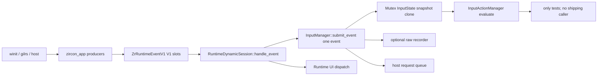
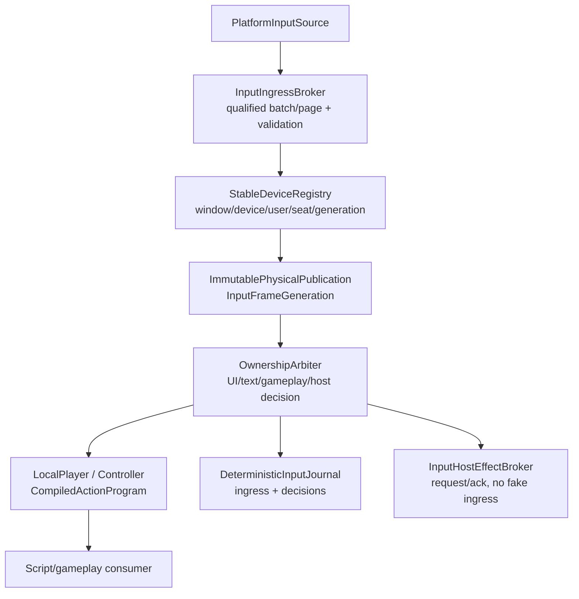

# Runtime220 - Input 当前工作树复审

## 1. 结论

Zircon 的 Input 已经不再是完全没有状态的占位模块，但仍不能被判定为工程级输入系统，也没有证据支持其性能或表现优于 Unreal。当前可保留底座包括：物理按钮 held/edge 状态、相邻鼠标移动局部合并、Gamepad axis transition 的 frame-local index、Gamepad polling 的 256 条/2 ms 静态预算、动作图的 map-change generation、部分 deadzone/hysteresis、host request 跨帧保留，以及 physical-first 的键盘/指针/触摸/滚轮/手柄路由。

系统性缺口仍然存在：

1. `InputDriver` 是空 ZST，模块、物理 manager 和 action manager 都以 `Immediate + Ready` 形态注册；`InputConfig` 默认禁用，类型可见性被错误地当作产品就绪。
2. Dynamic Session 每次解析 manager 后逐条提交 `InputEvent`。一个 `Mutex<InputState>` 同时拥有物理状态、帧事件、host request、recorder 和设备表，无法提供批量准入、source identity、背压或不可变 frame generation。
3. 事件 ABI 仍是 V1 通用字段槽位。窗口、设备、用户/seat、坐标空间、单调时间、source epoch、sequence、device generation 和 repeat 等事实无法由 downstream 重建；键盘仍有 `scan_code=0`、FNV Debug spelling 与左右修饰键折叠。
4. Action map 只有字符串 ID、context priority、button chord 和 f32 axis。priority 不执行 consume/block/conflict，unknown context/binding 可接受，空 active context 表示全部，重复项静默丢弃，且没有非测试 production evaluator caller。
5. 录制 `InputRecording.frames` 无界；replay 忽略原始 timestamp/sequence、立即提交并可能重放 host effect。没有 manifest、checksum、完整性、隔离 target、reset、实时输入仲裁或 typed terminal receipt。
6. Editor 没有 Input Action/Mapping Context 资产、导入/编译/重绑文档和真实 UI route。Editor206 的 5 个 P0 约束仍然成立；局部物理顺序修复不能替代 Editor/runtime 共用的 semantic artifact。

本报告将 Runtime117 的旧账本重判为 `2 P0 Open / 1 P0 Partial / 61 P1 Open / 3 P1 Partial / 16 P2 Open / 40 Gate Fail`。旧报告中“全部 physical event 都被 UI 先消费”的表述已过期：当前 physical state 对 keyboard、pointer、touch、wheel、gamepad 先提交；但 text/IME 仍 UI-first，且没有同一 generation 的 ownership receipt，所以 `INP-P0-002` 只能是 Partial，不能关闭。

## 2. 审查边界与可复算指标

选择集按 owner 目录去重，读取当前工作树字节；没有把 `dev/`、tooling 或生成物混入 Zircon 指标。

| 选择集 | files | lines | non-empty | bytes | tests | ignored | unsafe tokens |
|---|---:|---:|---:|---:|---:|---:|---:|
| `zircon_runtime/src/core/framework/input` | 45 | 2,267 | 1,958 | 66,695 | 14 | 4 | 0 |
| `zircon_runtime/src/input` | 40 | 6,714 | 5,964 | 233,228 | 81 | 9 | 0 |
| Dynamic Session/input bridge | 9 | 3,192 | 2,972 | 128,902 | 22 | 4 | 5 |
| Runtime Interface event/UI adapter | 4 | 2,237 | 2,097 | 75,650 | 7 | 0 | 2 |
| App input/host producers | 39 | 2,718 | 2,466 | 95,641 | 30 | 0 | 17 |
| product consumers and sample | 3 | 304 | 275 | 19,162 | 2 | 0 | 0 |
| 去重 Zircon 联合集 | **140** | **17,432** | **15,732** | **619,278** | **156** | **17** | **24** |

Workspace-relative `path + NUL + raw bytes + NUL`、路径排序、SHA-256 指纹：`8fc81723aa0909ab601152f3690baeecd8535dc8934a2376f24c91373e24f877`。

参考联合集为 Unreal Enhanced Input 5 文件、Godot core input 6 文件、Bevy input 3 文件、Fyrox shortcut 1 文件、Unity Graphics DebugManager input 1 文件和 WOC product input 6 文件，共 22 个文件、16,816 行、14,583 非空行、638,327 bytes、44 个 test markers、1 个 unsafe token；指纹 `0ff46543b534731d222d2839be2ba92977a1a82f1fddf716a90f7e1bc407ffef`。参考仓库 revisions：Unreal `9963f8eb72e2d725d2536eb50b393b30387a1ffa`，Bevy `fb89a8649d9b359e53ffb6e5492ebb7c059ac8af`，Fyrox `8d815db36494f1badb347547dfc7094bf4fbbdf8`，Godot `8c7e6c5877a78e8e61ea4fd42673219a9091dca7`，Unity Graphics `a7e4c051d256a781ab362c64316b125a1e104694`，WOC `5ef9f7cb21cd8875b6d2c49701015dfcd78de35a`。

## 3. 当前调用链与所有权问题

`zircon_app` 的 keyboard/pointer/touch/wheel/gamepad producer 创建 `ZrRuntimeEventV1`，`dispatch_runtime_event` 调 `RuntimeDynamicSession::handle_event`；Session 再解析 manager、逐事件 `submit_event`，并在 semantic UI dispatch 后决定是否继续 gameplay camera/UI action。键盘非 text 与物理指针等路径目前先写物理状态；`handle_keyboard` 的 text 和 `handle_ime` 仍先给 UI，再写入 physical/IME state。此顺序修复了旧 early-return 卡键缺陷的主体，却没有建立可审计的 ownership arbitration 记录。

`InputActionManager` 的 production 搜索结果只落在 trait、实现、runtime/input tests 和 inventory guards；没有 Runtime tick、Local Player、Controller、world schedule 或 script host 调用 `evaluate_actions*`。Vampire 仍在 `main.zr` 直接调用 `gameplay.key_pressed("A/D/W/S")`。因此 evaluator 已有 generation 只能说明局部算法优化，不能说明动作系统已经接入产品。

## 4. P0 级系统缺口

| ID | 当前判定 | 证据 | 必须重构 |
|---|---|---|---|
| `INP-P0-001` | Open | `input_driver.rs` 只有 `pub struct InputDriver;`；descriptor 将 driver、InputManager、InputActionManager immediate 注册，config 默认 `enabled: false` | 建立真实 ingress owner、clock/device registry、health/backpressure/teardown；Ready 必须由 capability receipt 支持 |
| `INP-P0-002` | Partial | `events.rs` 的 keyboard/pointer/touch/wheel/gamepad 物理先提交；`keyboard_ime.rs` text/IME UI-first；无统一 sequence/ownership receipt | 物理事实与 UI/text/gameplay decision 分层，所有路径写同一 qualified generation，capture/focus/modal 转换产生一次性 terminal edge |
| `INP-P0-003` | Open | 逐事件 ABI/manager resolve；单一 broad mutex；frame queue 没 bytes/age admission；App 只有 256 条/2 ms 静态 producer budget，Runtime12 storm failure 仍 Open | page/batch ingress、global count+bytes+age budget、critical-edge reservation、producer pressure/lag/gap receipt 和 immutable publication |

## 5. P1 差距账本（当前重判）

### 5.1 Owner、配置、产品 reachability

| ID | 状态 | 发现与目标 |
|---|---|---|
| `INP-P1-001` | Open | Driver 无 ingress、clock、device、health、teardown；变成真实 `InputIngressBroker` |
| `INP-P1-002` | Open | descriptor 依赖只有 Platform，未声明 action schedule/device registry/clock；启动契约必须完整 |
| `INP-P1-003` | Open | disabled config 与 Ready manager 并存；disabled 必须显式 `Disabled`，不生成伪 action capability |
| `INP-P1-004` | Open | 无 production action tick/per-player/controller consumer；唯一 shipping owner 必须明确 |
| `INP-P1-005` | Partial | `button_pressed` 避免部分 snapshot clone，但每次仍 resolve manager/持有锁；改为 frame lease/read-only view |
| `INP-P1-006` | Open | consumed button/axis 只是调用参数和测试，没有 UI priority/block/reserve producer |
| `INP-P1-007` | Open | context priority 只排序保存，未执行跨 context 冲突消费 |
| `INP-P1-008` | Open | unknown context 默认 enabled/可继续；compiler 必须返回诊断 |
| `INP-P1-009` | Open | empty active context 表示 all，无法表达 None/Explicit Set |
| `INP-P1-010` | Open | contextless action 是 global string，不属于 player/world scope |
| `INP-P1-011` | Open | duplicate action/context 静默 no-op，binding order 与错误不可见 |
| `INP-P1-012` | Open | unknown binding target 保留在 compiled source，未 fail-closed |
| `INP-P1-013` | Open | action/context/control 全是未命名空间 String；需 stable typed IDs |
| `INP-P1-014` | Open | 无 conflict graph、reserved/reserve/share/block 规则与 authoring diagnostics |
| `INP-P1-015` | Open | map replace 没有 public generation、held/rebuild policy、install receipt |
| `INP-P1-016` | Open | action state 无 user/seat/player/world/window ownership |
| `INP-P1-017` | Open | 无 trigger/modifier/hold/tap/repeat/chord lifecycle；button chord 不是 trigger pipeline |
| `INP-P1-018` | Open | action output 只有 f32，缺 Boolean/Vector2/Vector3/1D/2D composite/radial |
| `INP-P1-019` | Open | 无 qualified synthetic injection 与 source arbitration |
| `INP-P1-020` | Open | `BTreeSet<String>`/`BTreeMap<String,f32>` 丢 action slot/provenance/generation |

### 5.2 Event identity、设备和 UI ownership

| ID | 状态 | 发现与目标 |
|---|---|---|
| `INP-P1-021` | Open | Runtime event viewport 不是窗口/device identity；所有事件需 window generation |
| `INP-P1-022` | Open | ABI 缺 user/seat/source sequence/monotonic time/device generation |
| `INP-P1-023` | Open | App keyboard 发送 physical key code 但 scan 固定 0，repeat 丢失 |
| `INP-P1-024` | Open | 左右 Shift/Ctrl/Alt 折叠为 16/17/18，chord 与 rebind 无法区分物理位置 |
| `INP-P1-025` | Open | 非常规 KeyCode 用 Debug spelling 的 FNV hash，不是稳定跨平台 namespace |
| `INP-P1-026` | Open | unidentified native code 只有数值/0，无 platform/layout/epoch |
| `INP-P1-027` | Open | logical key/text 可选且由 payload 猜测，无法重建完整键集合 |
| `INP-P1-028` | Open | metadata 默认时间、sequence saturation 可重复；需 checked rollover/incomplete |
| `INP-P1-029` | Open | FocusLost 是全局物理清理，不按 window/device/seat policy 隔离 |
| `INP-P1-030` | Open | cursor/motion 无 coord space、DPI、relative/captured source |
| `INP-P1-031` | Open | line/pixel wheel 仍有两种 InputEvent，未统一量纲与 versioned wire |
| `INP-P1-032` | Open | `WheelScrolled` 与 `MouseWheel` 重叠 ABI/semantic domain 未硬切 |
| `INP-P1-033` | Open | float ingress 未统一 finite/range rejection；只在若干 wheel 入口校验 |
| `INP-P1-034` | Open | Touch 只有 id/phase/position，缺 pressure/tool/tilt/device/window |
| `INP-P1-035` | Open | disconnected gamepad sample 仍可能进入 state，缺 connection generation gate |
| `INP-P1-036` | Open | gamepad deadzone/livezone/threshold 有默认值但无 stable per-device profile |
| `INP-P1-037` | Partial | settings 构造已做部分阈值/hysteresis 检查，但没有统一 typed error/property contract |
| `INP-P1-038` | Open | gamepad descriptor 仅 name/vendor/product，无 GUID/capability/power/user slot |
| `INP-P1-039` | Open | reconnect 无 slot migration/rebind receipt，`GamepadId(u64)` 是运行时 ID |
| `INP-P1-040` | Open | file drag lossless URI/security/source window provenance 缺失 |
| `INP-P1-041` | Open | IME target revision/request/deadline/ack 缺失，text UI-first 无共用 ownership row |
| `INP-P1-042` | Open | cursor request 无 request ID/capture generation/ack |
| `INP-P1-043` | Open | rumble 仅按 gamepad cap 32，缺 request ID/deadline/device generation/completion |
| `INP-P1-044` | Open | host outputs 和 physical input 共用 `InputEvent` 语义域 |

### 5.3 Frame state、queue、record/replay 和 lifecycle

| ID | 状态 | 发现与目标 |
|---|---|---|
| `INP-P1-045` | Open | 一个 Mutex 覆盖 state/event/host/recorder；拆成 ingress、physical publication、effect、journal owner |
| `INP-P1-046` | Open | `frame_snapshot()` 在锁内复制 vectors/sets/strings；改为 immutable double-buffer/generation lease |
| `INP-P1-047` | Open | 每 sample 经过多次 ABI 转换与锁；一次 batch validation/publication |
| `INP-P1-048` | Partial | host requests 已跨 frame 保留，但 `FrameEventBuffer::begin_frame` 仍无条件 clear 未 drain events |
| `INP-P1-049` | Open | 仅相邻 cursor/motion coalesce，其他 edges 可无界增长 |
| `INP-P1-050` | Open | queue/recording 主要按 count，无 global payload bytes/age 上限 |
| `INP-P1-051` | Open | drop/coalesce 只有局部计数，无 producer throttle/lag/gap contract |
| `INP-P1-052` | Open | InputManager 必需能力有 no-op 默认方法；可选能力必须显式 Unsupported |
| `INP-P1-053` | Open | public subscribe 仍返回 None，能力声明与实现不一致 |
| `INP-P1-054` | Open | poison mutex 取 inner 继续运行，无 Degraded generation |
| `INP-P1-055` | Open | recorder 使用可回拨 `SystemTime` 毫秒，缺 monotonic timebase |
| `INP-P1-056` | Open | sequence saturating add 会重复，不能产生可审计 order |
| `INP-P1-057` | Open | `InputRecording.frames: Vec` 无界，不能长录制或流式落盘 |
| `INP-P1-058` | Open | recording 缺 schema/build/map/device/clock/project/session/RNG/checksum manifest |
| `INP-P1-059` | Open | replay 不按 timestamp/sequence 调度，当前立即提交所有 records |
| `INP-P1-060` | Open | host-effect-shaped input 可被录制并产生真实 OS side effect |
| `INP-P1-061` | Open | replay 接受缺帧、gap、incomplete，无 hash/schema preflight |
| `INP-P1-062` | Open | replay 无 isolated target/reset/live arbitration/cancel |
| `INP-P1-063` | Open | record/replay 无 accepted/progress/terminal typed receipt |
| `INP-P1-064` | Open | stop 无 quiesce、device drain、effect cancel、reader terminal health |

## 6. P2 产品能力

Runtime117 的 16 项 P2 没有 current-source closure，全部保持 Open：

| ID | 状态 | 产品能力与前置条件 |
|---|---|---|
| `INP-P2-001` | Open | 本地化键名、平台 glyph、layout-aware 显示；依赖 stable control/device profile |
| `INP-P2-002` | Open | 键盘布局提示与冲突解释；依赖 physical/logical 双身份和 compiler diagnostics |
| `INP-P2-003` | Open | Action Map 冲突图和 context priority editor；依赖 compiled conflict graph |
| `INP-P2-004` | Open | per-device accessibility、sticky/chord/hold assist；依赖 player/device scope 与 trigger pipeline |
| `INP-P2-005` | Open | 安全 rebind capture、reserved keys、timeout/cancel UX；依赖 ownership arbiter 和 stable binding |
| `INP-P2-006` | Open | 键鼠/手柄 prompt 自动切换与防抖；依赖 device activity provenance |
| `INP-P2-007` | Open | haptic curve/channel/mix/priority；依赖 qualified rumble operation |
| `INP-P2-008` | Open | pinch/swipe/rotate gesture recognizer；依赖完整 touch/pen contact contract |
| `INP-P2-009` | Open | sensor、pen、MIDI、专业控制器扩展；依赖 extensible device/control schema |
| `INP-P2-010` | Open | frame history 与 action contribution debugger；依赖 bounded journal/provenance |
| `INP-P2-011` | Open | remote/network input authority 可视化；依赖 player/source/network identity |
| `INP-P2-012` | Open | deterministic replay 导入/导出/diff；依赖 manifest、scheduler、oracle |
| `INP-P2-013` | Open | 官方 controller layout/profile catalog；依赖 signed/versioned mapping catalog |
| `INP-P2-014` | Open | per-action latency/drop/contention telemetry；依赖 monotonic clock 和 bounded diagnostics |
| `INP-P2-015` | Open | provenance/ownership/capture 调试 UI；依赖 arbitration journal |
| `INP-P2-016` | Open | 跨设备/平台/帧率 benchmark 与 soak harness；依赖 correctness/fault/artifact gates |

## 7. Editor 级差距

Editor206 的 current-source 结论继续有效，并由本次 runtime 入口复核确认：

| 范围 | 当前事实 | 重构要求 |
|---|---|---|
| 资产与 artifact | `zircon_editor/src` 没有 InputActionDocument、InputMappingContextDocument、compiled input artifact 或 install receipt | 新增 versioned action/context assets，序列化 stable control/device/profile identity；runtime/editor 共享 compiler |
| Catalog/manifest | builtin asset registry、first-party editor catalog、project manifest 与 App 首帧没有 Input Action/Mapping Context 产品装配 | Editor authoring、runtime install、migration、dirty/save/recovery 必须走同一 artifact owner |
| UI interaction | 没有 Input 专属 editor surface、route、binding capture、conflict diagnostics、device preview；现有 keymap 是 Editor command shortcut，不是游戏 Input Map | 建立 Action Map editor、context priority graph、trigger/modifier inspector、rebind capture、accessibility/profile preview |
| Runtime bridge | Editor command keymap 与 runtime physical/action state 无统一 generation；不能验证 UI capture 与 gameplay action 的同一 source event | 以 `InputOwnershipArbiter` 输出 decision receipt，Editor preview 只消费 leased frame，不复制一套 state |
| Test/product | Runtime evaluator tests 不能证明 asset -> compile -> install -> player tick -> script consumer；Vampire 仍 raw key string | 建立 asset round-trip、invalid diagnostics、rebind migration、multi-user/device、hot reload held policy 和 launchable product tests |

## 8. 参考引擎对照

| 参考 | 本地源码事实 | 对 Zircon 的工程约束 |
|---|---|---|
| Unreal Enhanced Input | `InputAction` 有 typed ValueType、Triggers、Modifiers、ConsumeInput、player-mappable settings；Subsystem 按 priority 添加 context，ModifyContextOptions 有 rebuild 与 IgnoreAllPressedKeysUntilRelease；PlayerInput 保存 applied contexts、mapping order、pressed keys 与 injected input | priority 必须真实执行 consume/block/conflict；map rebuild 必须有 generation 与 held policy；action/profile/device identity 必须可持久化、查询和回执 |
| Godot | `Input` 维护 per-action DeviceState，含 pressed/strength/raw strength/frame markers；InputEvent 保留 device/physical/logical/unicode/location/echo；joy mapping 有 UID/name/bindings，支持 buffered/accumulated input 与 vibration | 事件不能退化为匿名 V1 槽位；state 必须 per-device，raw/filtered 和 buffered policy 必须显式；GUID/profile 与 haptic 生命周期不可省略 |
| Bevy | `KeyboardInput` 保留 physical key、logical key、text、repeat、window；`RawGamepadEvent` 与 filtered `GamepadEvent` 分层，Gamepad 为 Entity，settings 对 deadzone/threshold 返回 typed errors；focus lost 明确释放缓存 | Zircon 需要 raw/filtered 分层、window/device identity、connection-before-sample、typed settings error 和 focus policy |
| Fyrox | `engine/input.rs` 明确把 Mouse/Keyboard InputState 称为 simple shortcut，并警告不记录 device origin，复杂场景应使用 event-based approach | 当前 snapshot 只能是 compatibility shortcut，不得成为 shipping gameplay authority |
| Unity Graphics | `DebugManager.Input.cs` 用 Input System 的两个 InputActionMap，显式 Enable/Disable、composite binding、typed Button/Value 和 performed callback | debug/editor input 也应有 map lifecycle、composite、typed action callback；command keymap 不是 runtime action product |
| WOC product | `Input`/`Keybinds` 有 physical code registry、held/edge 区分、modifier chord、localStorage repair、pointer/touch/gamepad reset 与 movement intent revision | Zircon 至少要有稳定 profile/rebind/migration、held/edge lifecycle、focus reset、device activity provenance；browser/localStorage 不能替代 engine artifact/ABI |

## 9. 目标架构与硬切边界

Owner 边界：Runtime117 拥有 input vertical integration；Runtime10/43/46/50 拥有 dynamic ABI/page、service/module/manager kernel；Runtime09/11A 拥有 UI focus/IME semantic；Runtime38 拥有 Local Player/Controller；Runtime24/25/45 拥有 stable identity、artifact 和 persistence；Runtime99q/App 拥有 platform host；性能报告只拥有通用 lock/batch benchmark。不得在 Editor 或 script 再造第二套 physical state。

硬切删除或隔离：空 `InputDriver`；shipping raw `key_pressed("W")`；持久化 gilrs `GamepadId`、Debug hash 或无 namespace native code；UI early return 能吞物理 press/release；InputManager 必需能力的 no-op default；host effect 伪装 InputEvent；忽略 time/sequence/manifest 的 replay。迁移期兼容入口必须命名 `LegacyRawInputShortcut`，并禁止写入 shipping action artifact。

## 10. 分层重构里程碑

### M220.0 - Truth freeze 与 RED

- 将 module readiness、empty driver、无 production action caller、text/IME UI-first、frame clear 丢弃、replay effect side effect 固化为 source guards/RED tests。
- 保留当前 axis index、gamepad 256/2 ms 与物理先提交的局部修复，但不把它们升级为系统完成度。
- Runtime12 storm failure 继续 Open；不得用 ignored microbenchmark 关闭动态门禁。

### M220.1 - Qualified ingress 与 device identity

- 用 `InputIngressGeneration` 替换空 driver；一次 batch/page 先做 count/bytes/age/finite 校验，再修改状态。
- 引入 window/device/user/seat/source epoch/monotonic sequence/device generation；keyboard physical/logical/native/repeat 完整传递。
- gamepad connection 先于 sample，stable GUID/profile 与 reconnect receipt 进入 artifact。

### M220.2 - Physical publication 与 ownership

- Candidate physical state 在一个 batch 中归并，发布不可变 `InputFrameGeneration`；reader 只租借 typed domain，不在 broad mutex 深拷贝。
- UI/text/gameplay/editor/host 对同一 sequence 写 decision receipt；focus/capture/modal 变更只 terminalize 一次。
- window/device/seat/player 隔离 focus loss、touch、gamepad 和 cursor，删除全局释放策略。

### M220.3 - Compiled action product

- compiler 对 IDs、context、priority、conflict、consume/block、trigger、modifier、typed value、device selector、map generation 做 fail-closed diagnostics。
- Local Player/Controller schedule 成为唯一 shipping evaluator；输出 dense typed slots、action generation 和 contribution provenance。
- rebind/profile 支持版本化、迁移、冲突查询、held/rebuild policy、accessibility；Vampire/模板硬切 typed action。

### M220.4 - Editor asset 与 runtime install

- 建立 Input Action/Mapping Context asset、compiled artifact、manifest/catalog、dirty/save/recovery、install receipt 与 hot reload policy。
- Editor 使用同一 compiler/rendered diagnostics；rebind capture 记录 device/window/user/source generation，不复制 physical state。

### M220.5 - Bounded journal/replay/host effects

- chunked journal 带 schema/build/map/device/clock/session/RNG/checksum/completeness；count+bytes+duration bounded，overflow 有 gap/backpressure receipt。
- replay preflight manifest/hash/schema，按声明 timing/frame/sequence 调度，拥有 isolated target/reset/live arbitration/cancel；默认不发真实 OS effect。
- rumble/IME/cursor 变成 request/ack operation，具 request ID、deadline、device generation、terminal outcome。

### M220.6 - Fault、soak 与竞争性证据

- quiesce ingress、cancel effects、drain readers、disconnect devices、terminal health；完成 multi-window/reconnect/layout/focus/fault/soak correctness。
- 只有 current-source Cargo、动态 storm/replay/device tests 通过后，才以同硬件、同事件序列、同帧率和同统计协议与 Unreal/Godot/Bevy 比较性能。

## 11. 验收门禁

| Gate | Status | 必须证明 |
|---|---|---|
| `INP-G01` | Fail | Ready 需要真实 ingress、clock、device registry、health、teardown |
| `INP-G02` | Fail | production Local Player action consumer 存在，sample 不再 raw key string |
| `INP-G03` | Fail | physical/UI ownership 在 press/release/focus/capture/text/IME 上都不丢边沿 |
| `INP-G04` | Fail | physical、UI、action、journal 可按同一 sequence/generation 解释 |
| `INP-G05` | Fail | context priority 执行 consume/block/share/conflict |
| `INP-G06` | Fail | unknown/duplicate/empty IDs 与 binding target 编译失败并有诊断 |
| `INP-G07` | Fail | active context 明确区分 All/None/Explicit Set |
| `INP-G08` | Fail | map rebuild 对 held controls 有 declared ignore/preserve/flush policy |
| `INP-G09` | Fail | trigger/modifier/hold/tap/repeat/chord/typed composite 有确定性测试 |
| `INP-G10` | Fail | per-player/controller/world/window/device state 隔离 |
| `INP-G11` | Fail | persisted binding 不含临时 GamepadId、Debug hash、未命名空间 native code |
| `INP-G12` | Fail | reconnect 保持正确 profile/slot，不跨设备错绑 |
| `INP-G13` | Fail | artifact 有 schema/profile/hardware identity/迁移策略 |
| `INP-G14` | Fail | keyboard wire 覆盖 physical/logical/text/location/native/repeat |
| `INP-G15` | Fail | Space/Enter/arrows/F-keys 经 App ABI 到 action consumer |
| `INP-G16` | Fail | event 保留 window/device/user/seat/time/sequence/generation |
| `INP-G17` | Fail | sequence/clock 不 saturation 重复，回拨不改变顺序 |
| `INP-G18` | Fail | wheel 单位分离，重叠 variant 硬切删除 |
| `INP-G19` | Fail | multi-window/DPI/relative/captured cursor 坐标正确 |
| `INP-G20` | Fail | touch/pen contact identity、pressure/tool/tilt、范围验证完整 |
| `INP-G21` | Fail | connection-before-sample 且 stale sample 不改变 state |
| `INP-G22` | Fail | axis/button settings typed error 与 property/boundary tests 完整 |
| `INP-G23` | Fail | focus loss 按 policy 释放，不全局释放不相关 device/player |
| `INP-G24` | Fail | drag URI/path 保真并含 source/admission provenance |
| `INP-G25` | Fail | IME/cursor/rumble 含 target generation、request ID、deadline、ack |
| `INP-G26` | Fail | host effect 与 physical ingress 的 type/queue/recording policy 分离 |
| `INP-G27` | Fail | immutable snapshot/lease，读者不深拷贝 broad mutex |
| `INP-G28` | Fail | frame boundary 对 undrained rows 有显式保留/丢弃/gap policy |
| `INP-G29` | Fail | queue 同时受 count/bytes/age/global budget |
| `INP-G30` | Fail | overflow/backpressure 有 typed gap 且保留 release/cancel |
| `INP-G31` | Fail | required manager methods 无 no-op；optional 返回 Unsupported |
| `INP-G32` | Fail | poison/fault 进入 Degraded/Failed 并隔离 generation |
| `INP-G33` | Fail | recording manifest/schema/build/map/device/clock/session/checksum |
| `INP-G34` | Fail | long recording chunk-stream bounded，无 Vec frames 无界增长 |
| `INP-G35` | Fail | replay timing/sequence/gap/hash/incomplete preflight 与 scheduler 完整 |
| `INP-G36` | Fail | isolated target/reset/live policy/cancel 且默认无 OS side effect |
| `INP-G37` | Fail | record/replay 有 accepted/progress/terminal typed receipt |
| `INP-G38` | Fail | stop 顺序是 quiesce -> cancel -> drain -> disconnect -> terminal health |
| `INP-G39` | Fail | correctness/fault/reconnect/multi-window/layout/soak 先于 benchmark |
| `INP-G40` | Fail | 同协议竞争性对照前不得宣称优于 Unreal |

## 12. 验证与状态

- 已完成 current-source 逐文件复核、调用链搜索、参考源码关键契约抽查和指标复算。
- 当前未运行 Cargo、dynamic session、真实 gilrs/winit storm、multi-window、replay、fault、soak 或 benchmark；Input tests 在 managed Cargo 之前被 foreign `zr_rhi_wgpu/src/render_pass_validation.rs:455` 的 `texture_view_layer_count` 缺失阻塞，不能把静态 source guards 当动态通过。
- `docs/plans/zircon_runtime/runtime/12/failure-2026-07-19-app-entry-input-and-gamepad-storm-budget.md` 仍 Open；`2026-08-24-physical-input-before-ui-ownership-red.md` 的 RED execution 与 production ownership transfer 仍 pending。
- 本轮只新增 review 文档，未修改 Rust、Cargo、ABI、tests、ZUI 或 tooling。后续任何 Input ABI、UI event ordering、module readiness、profile/artifact、script consumer 或 recorder schema 变化，都必须重新计算本报告选择集并重判 P0/P1/Gates。

Runtime220 是 review-only 的当前冻结，不是 Input 完成声明。局部 transition index、producer budget 和 physical-first 路由可以保留；在 qualified ingress、per-player compiled action、Editor artifact、bounded deterministic replay 与 terminal lifecycle 完成前，不能把 Zircon Input 称作工程级或性能优于参考引擎。
