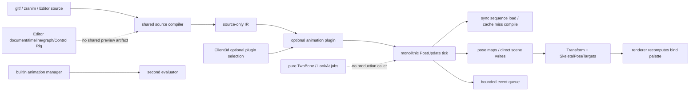

# Runtime221 - Animation 当前工作树复审

## 1. 结论

当前工作树已经有可复用的动画底座：typed skeleton/clip/sequence/graph/state-machine source、共享 source compiler、revision-aware cache、dense target/graph/state 路径、局部 pose pool、bounded clip-event admission、Scene 到 `SkeletalPoseTargets` 的桥，以及 Editor document/history/last-good 的部分状态机。这些是真实代码，不应被误判为完全空壳。

但它仍不是工程级动画系统。最高风险是身份和所有权没有收敛：`zircon_runtime/src/animation/module.rs` 与 `zircon_plugins/animation/runtime/src/module.rs` 物理复制同名 module/driver/manager；共享 compiler 只产生 source-only product，插件 evaluator 又维护另一套 compiled clip/graph/state 语义；gltf inverse-bind matrix 被输出为独立 Data subasset，skeleton 和 renderer 没有同一个 skin binding artifact。角色姿态最终仍由一个大 tick 直接写 Scene transform，IK、root motion、跨域 writer、GPU/CPU/compute deformation 和 product preview 没有统一 commit contract。

本轮特别复核了当前未提交的 Sequence sampler/compiler 变更：

- world-bound `CompiledAnimationSequence` 现在拥有 `Arc<AnimationCompiledSequence>`，source asset 后续变更不会污染已编译投影；compiled key interval 使用 `partition_point`，移除了 steady-state 的全 key finite 重扫。这两项把 Sequence 局部从 Open 提升为 Partial。
- cache miss 仍在 runtime tick 中同步调用 `compile_animation_sequence`，source compiler 仍不负责依赖解析、generation、cook/install；因此不是可独立加载的 artifact。
- Step 精确 key time 仍刻意返回 preceding value，plugin quaternion Hermite 仍使用 slerp 并忽略 tangent；gltf morph-target channel 仍直接拒绝。采样语义仍未统一。

本报告只做 review，不修改 production Rust、Cargo、ZUI 或 tooling。实现前必须先完成唯一 source/compiled/presentation/render identity、真实 skeleton binding、可取消调度器和 pose writer arbitration。

## 2. 审查范围与可复算指标

选择集按当前磁盘文件、路径排序、`workspace-relative path + NUL + raw bytes + NUL` 计算 SHA-256；行数按 UTF-8 文件的换行数统计，`test` 为 Rust `#[test]` 属性，未将 `dev/` 混入 Zircon 计数。Editor 选择集包括所有路径含 `animation` 的 Rust 文件，以及 `ui/curve`、`ui/timeline`、`ui/timeline_strip`；boundary 选择集只包含跨模块 importer/render/scene/App 入口。

| 选择集 | files | lines | non-empty | bytes | test attrs | ignored | unsafe tokens | fingerprint |
|---|---:|---:|---:|---:|---:|---:|---:|---|
| Runtime framework + builtin (`zircon_runtime/src/animation`, `core/framework/animation`) | 80 | 12,721 | 11,507 | 432,218 | 108 | 22 | 0 | `b4cf56f685a160bf34bb39ffce8f4d847ee1b24cb59ede35b23eaa7a285e8012` |
| First-party animation runtime/editor + `animation_graph` (`.rs/.toml/.zui`) | 183 | 24,039 | 22,041 | 851,905 | 229 | 26 | 18 | `a3efd3b05c769f483e9b6794c7738cdfa278acabf03113590de1f0bf3d2607cf` |
| Editor animation/document/curve/timeline selection | 78 | 9,979 | 9,252 | 354,343 | 84 | 1 | 0 | `4a9e438538ae2c1260fa7e98a54454d587c309864076557ebcb86fbf92d8a738` |
| Import/render/scene/App boundary | 16 | 3,831 | 3,562 | 143,297 | 22 | 4 | 0 | `2fe5e9a830d2e7b416d0c6184e6919c0fef8bf2d5b8c264fe3bd93fa1c87a2a7` |
| 去重 Zircon union | **357** | **50,570** | **46,362** | **1,781,763** | **443** | **53** | **18** | `5e47d319495288ca18bf4b42ea6b8f3f1c09b80196262e04d939d06d77b9a307` |

参考集冻结 96 个 Unreal/Bevy/Fyrox/Godot/Unity Graphics 文件，38,039 行、32,311 非空行、1,605,434 bytes、24 个 test attrs、99 个 unsafe token，fingerprint `906cd612da66fce12886810394728831cd59af3b4b15d7944096ea7780b2381a`。参考 checkout revisions：Unreal `9963f8eb72e2d725d2536eb50b393b30387a1ffa`，Bevy `fb89a8649d9b359e53ffb6e5492ebb7c059ac8af`，Fyrox `8d815db36494f1badb347547dfc7094bf4fbbdf8`，Godot `8c7e6c5877a78e8e61ea4fd42673219a9091dca7`，Unity Graphics `a7e4c051d256a781ab362c64316b125a1e104694`。

## 3. 当前调用链与所有权

当前产品测试只证明 `Client3d.with_optional_runtime_plugins([Animation, ...])` 能链接 `animation.runtime`；它没有证明普通 `EntryConfig::new(Runtime)` 或默认 Client3d 会装配动画。`plugin.toml` 将 animation capability 标为 `partial`，而 runtime module 与 plugin module 都声明同一 `animation.runtime` identity。

## 4. 当前工作树差异重判

| 旧账本 | 当前证据 | 本轮裁决 |
|---|---|---|
| Runtime170 RT-AN-01 双 manager/evaluator | 两份 `module.rs` 仍拥有相同 module/driver/manager；App 仅在 optional selection 测试中启用 plugin | Open，未收敛 |
| Runtime170 RT-AN-02 IBM/remap | importer 仍把 IBM 放进 `Data`；skeleton 只有 name/parent/local TRS；renderer 与 plugin palette 各自计算 `posed * inverse(bind)` | Open |
| Runtime170 RT-AN-03 channel semantics | Sequence source IR、自包含 world projection、二分采样是真实进展；Step boundary、quat Hermite、morph、compression/additive/reverse 仍缺 | **Partial** |
| Runtime170 RT-AN-04 scheduler | `tick_animation_world` 仍串行 scan/load/evaluate/event/apply；cache miss 同步 compile，无 budget/cancel/receipt | Open |
| Runtime170 RT-AN-05 writer/root motion | `pose_apply.rs` 直接 `world.update_transform`；pose target 权重恒为 1.0；无 root-motion packet/claims | Open |
| Runtime170 RT-AN-06 IK | production search 只有 exports 与 `animation_ik_contract`；历史 diagnostic/execution/postprocess owner 已删除 | Open |
| Runtime170 RT-AN-07 events | heap、span/event/byte limits 与 cursor 保留；reverse 被 `to_time <= from_time` 拒绝，event identity 仍不稳定 | Open |
| Runtime170 RT-AN-08 instance semantics | transition journal/interrupted source/nested state 存在；仍无 stable instance snapshot、sync marker、montage/inertialization/replication | Open |
| Runtime170 RT-AN-09 render deformation | `MAX_SKIN_JOINTS=256`、CPU/GPU 双路径和 fixed palette 仍存在；无 device profile、upload/velocity/device-loss receipt | Open |
| Runtime170 RT-AN-10 artifact closure | source compiler 生成可用 IR，world caller 仍自行 load/compile/cache；没有 cook/install/dependency-complete artifact | **Partial** |
| Runtime170 RT-AN-11 product features | root motion/retarget/morph/montage/cinematic/ability/motion matching runtime owner 仍缺，Editor UI 多为 fixture | Open |

## 5. P0 缺口

### RT-AN-01 - 双 runtime authority 与双 compiler product（P0，Open）

`zircon_runtime/src/animation/module.rs:13-73` 和 `zircon_plugins/animation/runtime/src/module.rs:13-75` 各自注册同名 `animation.runtime`、`AnimationDriver`、`DefaultAnimationManager`、`AnimationManager`。builtin manager 仍能从 `zircon_runtime/src/animation/manager` 解释 source；plugin 另有 `AnimationEvaluationPipeline`、compiled clip、compiled graph/state machine。`AnimationCompileProduct::is_successful` 只把结果称为 installable source-only product，且明确把 loading bytes、external resources、generation 与 installation 留给 caller。

这不是代码风格重复，而是 asset identity、cache key、failure policy 和 target-mode composition 都可能改变语义。当前 App 只在 optional plugin selection 测试中验证 animation provider 可链接，不能证明普通 Client/Editor/Server 对同一资产选择同一 evaluator。

重构：保留一个 `AnimationSourceAsset` schema；由唯一 compiler 产出版本化 `AnimationArtifact`（skeleton binding、channel storage、graph/state bytecode、event schema、compiler fingerprint、dependency closure）；builtin 代码只能是 contract/路由，不能继续作为第二 evaluator。每个 consumer 必须携带 `(asset_id, source_revision, artifact_generation, skeleton_binding_generation)`。

### RT-AN-02 - IBM、skeleton index 与 mesh joint remap 不具备 canonical contract（P0，Open）

`gltf_animation_subassets.rs:96-168` 读取 inverse-bind matrices，却将它们作为独立 `Data` subasset；`AnimationSkeletonAsset` 只有 `name`、`parent_index`、`local_transform`。`zircon_plugins/animation/runtime/src/gpu_skinning/palette.rs:27-50` 和 renderer skinning owner 都按 skeleton 名称/顺序重建 bind world，再计算 `posed_world * bind_world.inverse()`。这无法表达 mesh joint order、authored IBM、多个 mesh 使用同一 skeleton、非均匀缩放或重新导入后的稳定 remap。

重构：导入阶段建立 `SkeletonBindingArtifact`，为每个 joint 保存 stable id、skeleton index、mesh joint index、authored IBM、bind-space convention、parent topology 与 validation receipt。IBM 数量、顺序或 skin reference 不完整时必须 fail-close 或生成明确 repair diagnostic；runtime 每个 pose generation 只生成一个 palette packet，renderer 不得再次推导 bind math。必须覆盖 identity pose、reordered joints、non-uniform scale、IBM mismatch、mesh/skeleton reload。

### RT-AN-04 - `tick_animation_world` 是串行大函数，不是 scheduler（P0，Open）

`zircon_plugins/animation/runtime/src/evaluation/pipeline/tick.rs:29-505` 在一次 `PostUpdate` 中完成 scene scan、asset resolve、sequence load、clip/graph/state evaluation、event admission、sequence apply、pose writeback 和 diagnostics。`sequences.rs:47-63` 在 cache miss 或 revision 不匹配时同步执行 source compile 与 world binding compile。现有 deferred entity map 是有价值的 rollback 辅助，但没有 per-World budget、priority、deadline、cancellation、back-pressure、worker completion 或 shutdown receipt。

更严重的是，`record_animation_requires_continuous_frame(true)` 在 production pipeline 没有 caller；只有 session failed-tick reset 写 `false`。因此普通播放没有 event backlog 时不能驱动 reactive frame demand，可能只推进一帧。

重构：把请求拆成 immutable `AnimationEvaluationRequest`、dependency-resolved work graph、bounded scheduler、worker completion packet 和 commit transaction。每个 job 携带 world epoch、tick、source/artifact generation 与 cancellation；超预算必须返回 `Deferred`/`Failed` receipt。由 runtime 发布带 reason/generation 的 frame-demand snapshot，session 只消费 snapshot，不从 pose map 推断是否继续 tick。加入 1/64/1,024/10,000 actor、取消、world replacement、asset reload、worker failure 与最终回 idle 的规模矩阵。

### RT-AN-05 - pose writer 没有跨域所有权，root motion 不可消费（P0，Open）

`pose_apply.rs:13-56` 将每个 pose bone 解析成 `(EntityId, Transform)` 后直接 `world.update_transform`；`tick.rs:431-475` 发布的 `SkeletalPoseTarget` 固定 `normalized_weight: 1.0`。没有 animation、physics/ragdoll、IK、network correction、gameplay、cinematic 之间的 property claim、priority、mask、blend 或 conflict receipt。`SimulatedPoseFeed` 只是特殊侧通道，不能替代一般 writer graph。source schema 也没有 extracted root delta。

重构：定义 `PoseEvaluationPacket`，统一承载 local/component pose、layer masks、additive/base、root-motion delta、curve/morph values、event journal 和 writer claims；提交前经过 per-entity `PoseWriterArbiter`，按稳定 priority 与 transaction scope 决定写入。Root motion 必须由 gameplay/physics 通过显式 ticket 消费，禁止 Transform 隐式覆盖。动画、ragdoll、network correction 和 cinematic 必须能在同一帧证明谁拥有每个 property range。

### RT-AN-06 - IK 只剩数学 job，生产后处理链断裂（P0，Open）

当前 plugin 只从 `ik/mod.rs` 导出 `TwoBoneIkJob` 与 `LookAtJob`；生产搜索结果只有 crate export 和 `animation_ik_contract.rs`。当前工作树中历史 `ik/diagnostic.rs`、`execution_error.rs`、`postprocess.rs` 及 framework IK command owners 已删除，`tick.rs` 没有 IK phase、target generation check、solver budget 或 pose delta commit。

重构：恢复 typed post-process graph：authoring unit -> compiled solver descriptor -> bounded job -> pose delta -> writer arbiter -> diagnostic/event receipt。描述 chain topology、pole/target handle、limits、weight、failure policy、physics handoff 和 deterministic iteration budget；纯数学 job 可以保留，但必须由唯一 runtime phase 调度，并拒绝 stale target/pose generation。Control Rig、runtime IK 和 bake 必须消费同一个 compiled unit schema。

### RT-AN-09 - GPU skinning 仍是固定上限 admission + CPU fallback（P0，Open）

`gpu_skinning/palette.rs:11-50` 固定 `MAX_SKIN_JOINTS=256` 并按 runtime skeleton 重建 bind/pose world。renderer 的 `SkinnedMeshPreparedPrimitive` 同时保留 shader source primitive 与可 CPU 处理的 primitive；GPU readiness 不是 draw submission 的证明。缺少 device/profile-specific joint limit、palette residency、current/previous pose generation、upload completion、motion-vector policy 和 device-loss recovery。

重构：由 render scheduler 选择 device-qualified `SkinningPipelineProfile`（vertex/compute/CPU），创建带 remap、current/previous pose、generation 和 upload ticket 的 `SkinningPaletteHandle`。morph、skin、velocity 必须合成同一 deformation packet；CPU fallback 只由明确设备能力或资源失败 receipt 触发，不能由字符串诊断隐式决定。增加 palette budget、eviction、device loss、joint reorder 与 velocity golden。

## 6. P1 缺口

### RT-AN-03 - channel/interpolation/compression 语义仍是 Partial（P1，Partial）

当前 Sequence compiled sampler 的二分区间和 source-owned IR 是实质优化，但 `channel_sample.rs:97-104` 固化 exact key time 的 preceding interval；`evaluation/clip_evaluator/hermite.rs:59-67` 对 quaternion 直接 normalize+slerp，完全不消费 quaternion tangent。gltf `ReadOutputs::MorphTargetWeights` 在 `gltf_animation_subassets.rs:482-486` 直接报 unsupported；CubicSpline 只是把三元组写成通用 tangent，artifact 没有 quantization/error budget、constant/default channel、additive reference、quaternion sign continuity 或统一 rational time domain。builtin sequence 与 plugin clip 仍不是同一个 sampler owner。

重构：在唯一 compiler 中完成 typed scalar/vector/quaternion/morph codec、quaternion continuity、CubicSpline tangent validation、Step/Linear/Hermite truth table、channel default/additive reference、compression error bound 与 forward/reverse/seek/loop policy。若某插值不支持，compile 必须结构化拒绝，不能静默改成 slerp 或 left value。

### RT-AN-07 - bounded event heap 不是完整 notify contract（P1，Open）

`clip_event.rs:80-110` 有 max events/bytes/span 与 resumable cursor，且当前变更只增加 capacity；但 `to_time_seconds <= from_time_seconds` 直接返回空批，reverse playback/direction flip/seek discontinuity 没有模型。event cursor 仍携带 track index、时间和字符串排序事实，`AnimationEventTrackAsset` 没有跨 reimport/reorder 稳定 event id。oversized first event 可被单独发送，这个行为需要产品化 receipt，而不是默认“预算失败仍继续”。

重构：编译 event track stable id、notify class、payload schema、source order 和 phase；定义包含 direction、loop occurrence、discontinuity、artifact generation 的 `PlaybackCursor`。输出带 dedupe key 的 event journal 和 exactly-once/at-most-once delivery receipt，消费方可以 ack 或按 policy drop。覆盖 same-time、forward/reverse、multi-loop、seek、deferred frame、overflow、cancel 和 queue age。

### RT-AN-08 - state machine 缺少完整 instance semantics（P1，Open）

现有 pipeline 保留 transition journal、interrupted source、nested machine state 和 consumed trigger；但 active state 更新仍由 `apply_active_state_update` 在 evaluation 后修改 ECS component，参数、pose、event、diagnostic 不在同一个 atomic commit。cache key 仍围绕 entity/asset/maps，没有 stable `AnimationInstanceId`、sync group/marker phase、montage slot/section、blend profile、inertialization 或 network-replicable snapshot。

重构：定义 generation-qualified `AnimationInstanceId` 与 `AnimationInstanceSnapshot`，把 transition priority/tie-break、sync marker、interruption、terminal state、slot/montage metadata 编译进 artifact；state/parameter/pose/event 必须由同一 commit receipt 发布。再实现 sync groups、marker phase、inertialization 和 deterministic replication，之后才暴露 montage 或 motion matching authoring。

### RT-AN-10 - importer/compile/cook 生命周期只有 Partial artifact（P1，Partial）

importer 会生成 labeled skeleton/skin/data/clip entries 和依赖边，但 IBM、mesh skin、morph、clip artifact 与 graph/state source 没有一个 atomic build receipt。`.zranim` 仍是 suffix dispatch 到 typed bytes；source compiler 的 API 明确不负责 external resources、generation 或 installation。runtime cache miss 重新编译并可在缺失 track 时保留 partial projection，无法证明 skeleton binding、render palette 和 animation artifact 同代可用。

重构为 content-addressed build graph：source document -> normalized skeleton/skin binding -> curves/events/morph -> graph/state source -> compiled artifact -> render/physics adapters。publish 只接受 dependency-complete generation，并同时发布 compiler/recipe/target/dependency fingerprint、diagnostics 和 LKG；Editor、runtime cache、package/export 和 replay 必须使用同一 artifact identity。

### RT-AN-11 - root motion、retarget、morph、cinematic 与能力消费缺失（P1，Open）

source schema 没有 root-motion extraction/warp、retarget profile、morph/curve stream、montage、cinematic section、ability notify、motion-matching database。Editor196/197/198/199 已分别记录 timeline、graph/state、sequence/clip、Control Rig 的入口和静态 UI 底座，但 preview 没有 runtime-backed isolated world 与同一 artifact；Control Rig 当前只有静态 hardcoded hierarchy/controls，IK 数学没有接回 runtime。

重构顺序必须在 artifact、scheduler、writer arbiter 完成后：retarget mapping/scale policy、root-motion extraction/consumption ticket、morph/curve lane、montage/notify、motion database/index、Gameplay/Physics/Audio/Cinematic adapters；任何没有 runtime/cook owner 的 Editor field 都不得继续扩张。

## 7. 跨系统覆盖账本

| 子系统 | 当前可保留 | 工程级缺口 | canonical owner |
|---|---|---|---|
| Source/asset schema | typed assets、binary codec、revision | source/clip/skeleton/skin/graph 三方 schema 不同源，缺 migration/unknown-field policy | Runtime221 + Editor198 |
| Compiler/artifact | source compiler、dense graph/state/target、Sequence IR | 无持久 artifact ABI、cook/install/LKG/dependency closure | Runtime221 |
| Pose/state | layered blend、interruption journal、pose snapshot | String/Vec runtime identity、instance/terminal/sync/inertialization 缺失 | Runtime221 + Editor197 |
| Sampling | 二分 Sequence sampler、clip cache | Step boundary、quat tangent、morph/compression/reverse 不一致 | Runtime221 + Editor198 |
| Events | heap/span/bytes/cursor | reverse/seek/loop/dedupe/stable notify id/ack 缺失 | Runtime221 + Editor198 |
| Scheduler/frame cadence | named `animation.evaluate` stage、epoch rollback primitive | 同步大 tick、无 worker/budget/cancel，continuous demand 无 production producer | Runtime221 |
| Pose writers | SkeletalPoseTargets、Physics feed bridge | animation/physics/IK/network/cinematic 无 claims/root ticket | Runtime221 + Runtime219 |
| Skeleton/deformation | fused local buffers、CPU/GPU skeleton tests | authored IBM/remap、device profile、previous pose、morph/velocity 不闭合 | Runtime221 |
| IK/Control Rig | pure TwoBone/LookAt math、Editor route | 无 compiled unit/phase/diagnostic/viewport/bake/runtime caller | Runtime221 + Editor199 |
| Import/cook | glTF labeled subassets、dependency edges | IBM/morph/artifact atomic generation 缺失 | Runtime221 + Runtime207 |
| Product reachability | first-party catalog optional provider | default Client/Editor/Server 产品链与 preview/cook 不闭合 | Runtime221 + Runtime199 |

## 8. 参考引擎差异

- **Unreal** 的 `AnimInstance` 明确分为 game-thread update、parallel update/evaluate、post-evaluate/finalize；`FParallelEvaluationData` 携带 compact pose/curve/attributes，`FBoneContainer` 明确 compact pose、skeleton pose、mesh pose 的映射，GPU skin vertex factory 维护 bone map、current/previous reference-to-local buffer。Zircon 目前只有一个 PostUpdate 大函数、名称匹配和单次 pose map，没有 instance/proxy/worker/commit 或 compact/remap contract。
- **Bevy** 的 `AnimationTargetId`、`AnimationGraph`、serialized graph、`AnimationTransitions` 和 threaded graph resource 表明 graph topology、target identity、transition state 和 asset loader 是一套可寻址资源，而不是临时字符串 map。Zircon 已有局部 dense graph，但 Editor schema、runtime artifact 和 instance identity 尚未统一。
- **Fyrox** 的 `AnimationPose` 明确带 root motion，`TrackBinding`/track 使用 UUID，machine/layer 复用 final pose 并处理 event passage。Zircon 的 pose 输出没有 root-motion 字段，event cursor 仍依赖 track index/text，层间只做局部 pipeline 合并。
- **Godot** 的 `AnimationMixer` 有 track cache、library change signal、blend capture 和 root-motion accumulators，`AnimationTree` 把 playback/mixing 与 Skeleton3D 应用分开。Zircon 直接从 tick 写 Scene transform，缺 cache invalidation signal、blend transaction 和 root-motion consumer。
- **Unity Graphics** 的 GPUDriven 目录展示 device/renderer capability、buffer residency、batch/compute 路径必须由渲染调度器决定。Zircon 的固定 256 joint 与字符串 CPU fallback 不能证明 GPU draw、velocity 或 device-loss 行为。

这些参考代码不是要求照抄；它们共同指出 Zircon 缺少的是可验证的所有权、artifact、调度和提交边界，而不是再增加几个临时节点。

## 9. 重构顺序

1. **M0 authority hard cut**：选择唯一 animation provider，删除重复 manager/evaluator 注册；确定 source revision、artifact generation、skeleton binding generation 和 target-mode fail-close 规则。
2. **M1 skeleton/skin artifact**：把 IBM、mesh joint remap、parent topology、bind convention 纳入 canonical artifact；删除 renderer/plugin palette 重算；完成 identity/reordered/non-uniform-scale golden。
3. **M2 compiler/evaluator**：统一 Sequence/Clip/Graph/State/Events sampling kernel，增加 quaternion/morph/compression/additive/reverse semantics；原子安装 artifact 与 LKG。
4. **M3 scheduler/commit**：实现 immutable request、per-World bounded jobs、cancel/deadline/Deferred receipt、continuous frame-demand snapshot、instance snapshot 和 PoseWriterArbiter/root-motion ticket。
5. **M4 post-process/render**：接入 IK compiled phase、Control Rig unit、morph/curve、device-qualified CPU/GPU/compute deformation、current/previous palette 与 velocity。
6. **M5 product/editor**：让 Editor timeline/graph/Control Rig preview、save/reopen、cook/export、Gameplay/Physics/Audio/Cinematic/retarget/montage/motion matching 都消费同一 artifact；没有 runtime owner 的 UI 不进入产品。

禁止通过恢复旧 alias、保留第二 evaluator、固定低骨数、丢弃 reverse event、仅增加 parallel iterator 或把 source-only IR 改名为 cooked artifact 来降低差异数量。任何 partial implementation 必须保留 typed status、generation 和失败原因。

## 10. 资格门

| Gate | 必须证明 | 当前 |
|---|---|---|
| RT-AN-1 provider authority | Client/Server/EditorHost 对同一资产解析同一 provider/artifact ABI | Fail |
| RT-AN-2 skeleton binding | authored IBM、mesh remap、identity pose、reorder/non-uniform scale 全链路一致 | Fail |
| RT-AN-3 sampling determinism | Step/Linear/Hermite/quat/morph/compressed forward/reverse/seek/loop 跨 target 一致 | Fail |
| RT-AN-4 bounded scheduler | actor scale、budget、cancel、stale generation、Deferred/Failed receipt 可复现 | Fail |
| RT-AN-5 writer ownership | animation/physics/IK/network/cinematic property claim 与 root-motion ticket 无隐式覆盖 | Fail |
| RT-AN-6 notify delivery | stable id、direction/loop/seek、dedupe、ack、overflow policy 可复现 | Fail |
| RT-AN-7 IK production path | compiled unit、scheduled phase、pose delta、diagnostic、failure policy、Control Rig bridge | Fail |
| RT-AN-8 render deformation | 一个 palette/deformation packet 驱动 CPU/GPU/compute、morph、velocity、device loss | Fail |
| RT-AN-9 artifact closure | import/compile/cook/package/reload 原子发布 dependency-complete generation | Partial |
| RT-AN-10 product/scale/soak | default product reachability、10K actor、reload/device loss/long loop/preview soak | Fail |

当前总计：**9 Fail / 1 Partial / 0 Pass**。本轮未运行 Cargo、Editor、GUI/GPU、真实 device、scale 或 soak；这些缺失不会被文档状态误报为通过。已有 failure 仍须纳入关闭条件：

- `docs/plans/zircon_plugins/04/failure-2026-07-22-runtime-animation-fallback-evaluator-divergence.md`：Runtime fallback 与 plugin evaluator 仍是两个 authority。
- `docs/plans/zircon_plugins/04/failure-2026-07-29-animation-frame-diagnostics-hardcut-omission.md`：frame diagnostics producer 未随 hard cut 完整迁移。
- `docs/plans/zircon_plugins/04/failure-2026-07-29-dynamic-runtime-animation-module-duplication.md`：同名动态 module/manager 的 owner 收敛未完成。
- `docs/plans/zircon_plugins/04/failure-2026-07-29-animation-sequence-caller-root-drift.md`：caller path 已修正，但 managed Rust module-resolution evidence 仍需单独闭合。

本报告完成的是当前源码差异登记，不代表实现完成；下一阶段应按 M0 -> M1 的依赖顺序建立新计划，并在每个 artifact/owner 变更后重新执行 current-source review。
