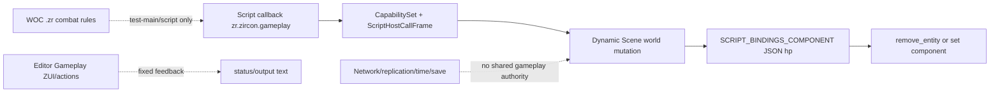

# Runtime Gameplay Ability、Effect、Attribute、Tag、Cue、Prediction、Replication、Save、Script Host 与 Editor Product 当前工作树复核

## 1. 结论

当前 Zircon 没有可交付的 Gameplay Ability System。Runtime 生产入口仍是 `zr.zircon.gameplay` script host，而不是 `AbilitySystemComponent`/`GameplayAbilitySpec`/`ActiveGameplayEffect`/`AttributeSet`/`GameplayTagContainer`/`GameplayCue`/`PredictionKey` 这类领域 owner。旧 Runtime151 的“没有 GAS 类型、provider、asset、compiler、artifact、prediction 或 replication”结论在当前 HEAD 仍成立。

实际存在的底座有三类：脚本宿主能按 capability 注册 input/scene/transform/component/HUD/particle/combat callback；Dynamic Scene 能提供受事务约束的世界修改；WOC 有 197 个 combat `.zr` 文件，包含 admission、cast、cooldown、damage、heal、effect、aura、threat、death、talent 等规则 oracle。它们可以成为领域设计输入，但不构成 Runtime authority：WOC 规则由 test-main/脚本入口驱动，未编译为引擎 artifact，也没有每 World/每实体生命周期、网络 authority、prediction rollback、save participant 或 deterministic receipt。

最危险的临时实现仍在 `gameplay_host/combat.rs`：`damage_entity`/`heal_entity` 读取和 clone `SCRIPT_BINDINGS_COMPONENT` 的 JSON，`heal_entity` 信任脚本传入 `max_health`，damage 到阈值直接 `remove_entity`。这绕过 resistance、immunity、shield、attribute aggregation、effect hooks、downed/death policy、ordered event、network ownership 和 replay。`damage_entity_report` 只是同一修改路径的 JSON 包装，不是 effect transaction。

Editor 的 Gameplay surface 继续是固定演示：模板与 retained action 能路由，但 workspace、字段、Preview/Validate/Save/Simulate 反馈没有对应 document、typed operation、compile artifact、runtime request 或 receipt。Runtime/Editor 的 capability 名称不能替代 capability provider。当前不能声称该系统具有 Unreal GAS、Godot multiplayer、Bevy ECS 或 Unity VFX 同等级的正确性、可扩展性和性能。

本轮账本：继承 Runtime151/Runtime08G 的 5 项 P0 全部 Open；新增当前 cross-cut P1 24 项中 20 Open、4 Partial；P2 8 项中 6 Open、2 Partial；24 道资格门中 20 Fail、4 Partial、0 Pass。Partial 只承认 capability gate、script/animation 参数桥、Dynamic Scene transaction、WOC 规则样本和局部测试，不表示 GAS 能力成立。

## 2. 当前选择集与证据

| 范围 | files | lines | non-empty | bytes | tests + script entries | 备注 |
|---|---:|---:|---:|---:|---:|---|
| Runtime gameplay host/support | 18 | 3,366 | 3,140 | 121,237 | 24 test attrs | 唯一生产 callback/脚本入口，未发现 GAS 类型 |
| WOC combat rules and test mains | 197 | 21,573 | 19,950 | 816,637 | 197 script entries | 规则 oracle；不是 Runtime provider/artifact |
| Editor gameplay surface/template bridge | 97 | 21,464 | 20,093 | 831,143 | 54 test attrs | 固定 workspace/feedback 与通用 route |
| 去重三层选择集 | **312** | **46,403** | **43,183** | **1,769,017** | **275 combined** | 选择集间无共同 execution receipt |

当前 Runtime/Editor gameplay 路径没有独立 dirty patch；工作树存在大量其他域变更，本报告不归因、不回滚。WOC 文件按当前 bytes 统计；`.zr` 没有 Rust test attribute，因此 `test_main` 只计为脚本入口，不当作自动化测试通过数。

## 3. 真实调用链与断点

The path from a player ability request to validated cost/admission, typed effect spec, attribute aggregation, cue, prediction, replication, save and replay does not exist. A JSON component write is not a substitute for that path.

## 4. 继承 P0（当前复核）

### RT-GAS-P0-01..05 · Open · no Runtime GAS authority, asset/compiler/artifact, prediction/replication and product default

Runtime151/Runtime08G retain the five canonical P0 findings: no domain type/asset/provider; no per-World/entity owner or transaction; no compiled artifact/cook/install; no prediction/rollback/replication contract; no Editor/Runtime/App product consumer. Current `combat.rs`, WOC inventory and Editor template scan did not close any of them. Do not split them into new P0 aliases.

## 5. P1：当前 Runtime/Editor 差距

| ID | 状态 | 当前证据与重构要求 |
|---|---|---|
| RT222-P1-01 | Open | No typed Ability/Effect/Attribute/Tag/Cue asset or source schema. Define stable asset/document IDs, versioned source IR and dependency closure. |
| RT222-P1-02 | Open | `expect_entity` accepts caller-provided entity/handle without script-owner, world generation or network authority proof. Bind calls to a qualified `ScriptEntityLease` and reject stale/foreign entities. |
| RT222-P1-03 | Open | `damage_entity` clones dynamic JSON and mutates/removes an entity directly. Replace with `GameplayCommand` -> admission -> effect transaction -> typed outcome; death must be a policy/event, not implicit despawn. |
| RT222-P1-04 | Open | `heal_entity` trusts caller `max_health`; no attribute cap, modifier source, immunity or prediction reconciliation. Store authoritative base/current/max attributes and derive caps inside the owner. |
| RT222-P1-05 | Open | No effect spec, duration/period scheduler, stacking, tags, immunity, dispel, source/target context or rollback snapshot. Build immutable `CompiledEffectSpec` plus instance state and ordered phase execution. |
| RT222-P1-06 | Open | No typed gameplay tags/query AST; string capability names and component keys are not hierarchical tag semantics. Add interned/tag-asset identity, query compiler and migration. |
| RT222-P1-07 | Open | No ability admission owner for cost, cooldown, charges, activation policy, cancellation, channel or task lifecycle. WOC `ability_admission` is a script oracle only. |
| RT222-P1-08 | Open | No target data/selection/shape query contract linking physics/navigation/world snapshots to ability execution. Caller-supplied entity IDs are not a target proof. |
| RT222-P1-09 | Open | No cue authority for gameplay/audio/particle/UI side effects; direct script callbacks bypass ordered event and effect lifetime. Add cue spec, prediction policy and host-effect receipt. |
| RT222-P1-10 | Open | No prediction key, input command sequence, server correction, rollback buffer or deterministic re-simulation. Runtime217 network primitives are not a gameplay rollback implementation. |
| RT222-P1-11 | Open | No replication baseline/delta for abilities, attributes, effects, tags or cues, no owner/authority role and no relevancy policy. Keep network wire schema separate from local script JSON. |
| RT222-P1-12 | Open | No save/replay participant for ability/effect timers, random streams, cooldowns, stacks, tags or pending cues. Add versioned capture/restore and replay receipts. |
| RT222-P1-13 | Partial | Dynamic Scene world mutation is transactional and script host errors are typed locally, but gameplay result is flattened to `ScriptHostError` strings and has no command/effect receipt. Preserve scene transaction; add domain outcome. |
| RT222-P1-14 | Partial | `set_animation_bool` reaches the Runtime animation state-machine player through a typed parameter map. It is a narrow bridge, not an ability activation or montage/ability task owner. |
| RT222-P1-15 | Partial | CapabilitySet gates script exports and host metrics track guest string copies. Capability admission is useful infrastructure but does not prove gameplay permission, authority or resource budget. |
| RT222-P1-16 | Open | WOC has rich rule files, but tests are script mains and project-specific arrays/strings/floats. Add engine-owned schema/compiler and use WOC only as golden behavior vectors. |
| RT222-P1-17 | Open | Editor Gameplay ZUI/feedback contains fixed ability/effect/tag names, values and “predicted activation” text. Replace with provider-backed documents, typed operations, compile/install and runtime snapshot projection. |
| RT222-P1-18 | Open | App/default catalog does not install a Gameplay provider or validate a complete dependency graph. A feature name or manifest capability must not produce Ready without an executable owner. |
| RT222-P1-19 | Open | No deterministic phase schedule across input, ability admission, attribute aggregation, effect tick, cue dispatch, animation, physics and network replication. Define explicit world phases and barriers. |
| RT222-P1-20 | Open | No stable source addresses/diagnostic codes for ability node, effect modifier, attribute, tag query, target and cue. Replace formatted strings with bounded typed diagnostics. |
| RT222-P1-21 | Open | No resource-vector admission for ability/effect/cue counts, heap bytes, command bytes, rollback history or per-frame execution. Add per-world budgets and terminal dispositions. |
| RT222-P1-22 | Open | No hot reload/migration/revoke behavior for active ability/effect instances. Generation-qualified instances must retain or explicitly cancel old compiled generations. |
| RT222-P1-23 | Partial | Combat host tests cover JSON HP hit/miss/death and animation parameter updates. They do not cover authority, modifiers, tags, prediction, replication, rollback, save or fault atomicity. |
| RT222-P1-24 | Open | No cross-platform, multiplayer, replay, soak or benchmark evidence; WOC script count is not a performance metric. Establish fixed scenarios and P50/P95/P99 budgets before optimizing. |

## 6. P2：长期工程能力

| ID | 状态 | 需要建立的能力 |
|---|---|---|
| RT222-P2-01 | Open | Gameplay source semantic diff/merge, stable ID migration and review annotations. |
| RT222-P2-02 | Open | Ability/effect graph debugger with source map, phase trace, modifier explanation and cue timeline. |
| RT222-P2-03 | Open | Large-scale query/index/virtualization for tag sets, effect instances and ability catalogs. |
| RT222-P2-04 | Open | Deterministic random stream, replay capture and cross-backend golden outcomes. |
| RT222-P2-05 | Open | Multiplayer soak/fault matrix for loss, reorder, duplicate, correction and reconnect. |
| RT222-P2-06 | Open | Memory/CPU telemetry for per-World instances, modifier aggregation, rollback history and cue queues. |
| RT222-P2-07 | Partial | Existing script host metrics and Runtime task/time/network budgets can be reused; they are not yet gameplay-qualified. |
| RT222-P2-08 | Partial | WOC has broad behavioral examples; it needs migration into engine-owned fixtures and automated oracle comparison. |

## 7. 分层重构计划

1. **Authority and identity.** Create one `GameplayWorldAuthority`, stable `AbilityId/EffectId/AttributeId/TagId/CueId/InstanceId`, entity/world/owner generations and explicit phase schedule. Hard-cut direct combat JSON writes after the new command path is proven.
2. **Source/compiler/artifact.** Define typed Ability/Effect/Tag/Attribute source IR, semantic diagnostics, deterministic compiler, debug map and immutable artifact with dependency digest/ABI. WOC scripts become fixtures or migration input, never a second Runtime owner.
3. **Execution transaction.** Add activation admission, target snapshot, cost/cooldown, modifier aggregation, effect instance lifecycle, ordered cues, cancellation and atomic outcome. Return typed receipts with source/generation/phase context.
4. **Prediction/replication/save.** Bind input command sequence and prediction key to rollback snapshots; add server correction/re-simulation, baseline/delta replication, authority policy and versioned save/replay participants.
5. **Editor/Product.** Add asset/document/provider/toolkit, Graph/Effect/Tag/Attribute authoring, compile/install/LKG, PreviewWorld/PIE and runtime snapshot. Every button must produce an operation ticket and receipt; no fixed status text.
6. **Qualification.** Use WOC golden vectors plus invalid/fault/multiplayer/replay/soak/scale fixtures. Measure identical scenarios on fixed hardware and report correctness before throughput.

## 8. 五引擎差异摘要

Unreal GameplayAbilities separates ability specs, effect specs/instances, tags, attribute sets, prediction keys, replication and cue execution; its GameplayTags are typed/queryable rather than arbitrary strings. Bevy provides ECS ownership and asset/task composition but still requires an explicit game-domain authority. Fyrox and Godot expose scene/node and multiplayer lifecycles that must be qualified by owner/world identity. Unity VFX utilities consume typed event/context data, not arbitrary JSON component mutation. Zircon currently has the script host and WOC rules but none of these domain contracts; the refactor must reuse Runtime identity, task, time, network and asset foundations instead of adding another ad-hoc manager.

## 9. Verification boundary

This report only re-read current source and counted the focused working-tree selection. No Rust/Zr/ZUI/Cargo file was modified by this report, and no Cargo, multiplayer, replay, save/restore, fault, soak or benchmark command was run. Before implementation, re-freeze the WOC and gameplay host fingerprints and require all 24 gates to be re-evaluated against the same source/artifact generation.
