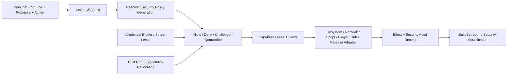

---
related_code:
  - Cargo.toml
  - deny.toml
  - .github/workflows/ci.yml
  - .github/workflows/mvp-editor-windows.yml
  - zircon_runtime/src/core/framework/net/http.rs
  - zircon_runtime/src/core/framework/net/transport.rs
  - zircon_runtime/src/plugin/export_build_plan/platform_host_files/mobile.rs
  - zircon_runtime/src/plugin/native_plugin_loader/candidate_from_manifest.rs
  - zircon_runtime/src/plugin/native_plugin_loader/load_discovered.rs
  - zircon_runtime/src/script/vm/host/host_export_registry.rs
  - zircon_runtime/src/script/vm/host/script_call_table.rs
  - zircon_runtime/src/script/vm/host/vm_plugin_host_context.rs
  - zircon_runtime/src/script/vm/runtime_context.rs
  - zircon_app/src/entry/runtime_library/loaded_runtime.rs
  - zircon_editor/src/core/plugin/manager/discovery.rs
  - zircon_plugins/Cargo.toml
  - zircon_plugins/net/runtime/src/transport/tls.rs
  - zircon_plugins/net/features/http/runtime/src/backend/security.rs
  - zircon_plugins/net/features/http/runtime/src/backend/client.rs
  - zircon_plugins/net/features/websocket/runtime/src/backend/security.rs
  - zircon_plugins/net/features/websocket/runtime/src/backend/client.rs
  - zircon_hub/capabilities/default.json
  - zircon_hub/tauri.conf.json
  - zircon_hub/src/settings/hub_config.rs
  - zircon_hub/src/tauri_app/view_model/coming_soon.rs
  - tools/zircon_export/plugin_build_signature.py
  - tools/zircon_export/native_signing.py
  - tools/zircon_export/plugin_build.py
  - tools/session_coordinator/control_plane/auth.py
  - tools/session_coordinator/control_plane/http_security.py
  - tools/session_coordinator/control_plane/actions/permissions.py
  - tools/session_coordinator/audit.py
  - tools/session_tray/src/runtime_descriptor.rs
  - tools/session_tray/src/coordinator_client.rs
  - tools/session_tray/capabilities/default.json
tests:
  - zircon_plugins/net/features/http/runtime/src/tests/security.rs
  - zircon_plugins/net/features/websocket/runtime/src/tests/security.rs
plan_sources:
  - docs/plans/optimize/00-engine-wide-review.md
  - docs/plans/optimize/01-cross-report-owner-schema-abi-p0-consolidation-review.md
  - docs/plans/optimize/zircon_runtime/07-script-plugin-runtime-review.md
  - docs/plans/optimize/zircon_runtime/08e-network-runtime-review.md
  - docs/plans/optimize/zircon_runtime/25-filesystem-path-uri-vfs-mount-watch-sandbox-atomic-io-review.md
  - docs/plans/optimize/zircon_plugins/01-plugin-sdk-package-catalog-distribution-native-abi-review.md
  - docs/plans/optimize/zircon_hub/03-marketplace-account-auth-organization-cloud-repository-provider-review.md
  - docs/plans/optimize/zircon_tooling/03-export-preset-build-cook-pack-platform-bundle-release-review.md
  - docs/plans/optimize/zircon_tooling/06-session-coordinator-control-plane-leases-validation-artifacts-finalize-supervision-review.md
  - docs/plans/optimize/zircon_tooling/09-release-channel-artifact-repository-install-update-rollback-operations-review.md
  - docs/plans/optimize/zircon_tooling/13-repository-codex-skill-hook-structural-audit-governance-security-currentness-review.md
  - docs/plans/optimize/zircon_tooling/16-capability-truth-placeholder-noop-fallback-degraded-qualification-control-plane-review.md
  - docs/plans/optimize/zircon_tooling/17-repository-content-source-set-ignore-generated-vendor-license-distribution-review.md
  - docs/plans/optimize/zircon_tooling/21-unsafe-rust-ffi-native-memory-thread-affinity-panic-unload-safety-governance-review.md
  - docs/plans/optimize/zircon_tooling/23-failure-contract-panic-unwind-error-propagation-poison-recovery-result-observability-review.md
reference_engines:
  - dev/UnrealEngine/Engine/Source/Runtime/Core/Internal/Misc/EncryptionKeyManager.h
  - dev/UnrealEngine/Engine/Source/Runtime/Core/Public/Misc/IEngineCrypto.h
  - dev/UnrealEngine/Engine/Source/Runtime/Core/Public/Misc/NamePermissionList.h
  - dev/UnrealEngine/Engine/Source/Runtime/Core/Private/Misc/PathPermissionList.cpp
  - dev/UnrealEngine/Engine/Source/Runtime/Messaging/Public/IAuthorizeMessageRecipients.h
  - dev/UnrealEngine/Engine/Source/Runtime/Online/SSL/Public/Interfaces/ISslCertificateManager.h
  - dev/UnrealEngine/Engine/Source/Runtime/PakFile/Private/SignedArchiveReader.h
  - dev/UnrealEngine/Engine/Source/Developer/PakFileUtilities/Private/SignedArchiveWriter.h
  - dev/godot/core/crypto/crypto.h
  - dev/godot/core/io/stream_peer_tls.h
  - dev/godot/core/io/file_access_encrypted.h
  - dev/bevy/crates/bevy_app/src/plugin.rs
  - dev/Fyrox/fyrox-impl/src/plugin/mod.rs
  - dev/Graphics/Packages/com.unity.render-pipelines.core/package.json
doc_type: review-and-refactor-plan
review_status: review_complete
implementation_status: pending
source_recheck_required: true
---

# 26 · Security Principal、Credential、Trust、Capability、Cryptography、Supply Chain 与 Audit 审查

## 1. 结论

Zircon并不是完全没有安全工程基础。Script host在调用导出函数前检查package capability；native plugin discovery有bounded read、deadline、cancellation和last-good generation；Network plugin采用Rustls并能配置root与certificate pin；Hub远程Account、Marketplace和Cloud入口保持`disabled`；Tauri capability只给main window基础window命令；Session Coordinator有opaque browser credential、server-side digest、SameSite/HttpOnly cookie、CSRF、loopback Host/Origin验证、role/elevation/bound-session和audit；Session Tray用`SecretString`阻止Debug直接打印bearer；CI已用`cargo-deny`检查root与plugin workspace的advisory、ban、license和source。这些都应保留。

但这些基础属于互不相认的安全孤岛。引擎没有canonical `SecurityContext`、principal taxonomy、credential lease、capability decision、trust receipt、cryptographic policy、sensitive-field metadata或audit envelope。Plugin manifest里的capability是字符串声明，Script call table里的capability是host API开关，Tauri capability是WebView IPC权限，Session Coordinator role是维护工具权限，Hub未来RBAC又是远程组织权限；它们名字相似，却没有共同principal、resource、operation、source、generation或decision语义。O15目前只是总账中的owner家族，还没有可被产品组合器执行的控制面。

当前源码还存在不能用“已有TLS/签名/secret类型”掩盖的具体断点。Native loader在digest/signature/trust admission前直接`Library::new`；`.sig`只是可与payload一起重写的SHA-256 TOML旁车和外部signer运行记录，没有runtime consumer；HTTP certificate pinning为读取peer certificate而开启`danger_accept_invalid_certs(true)`，把标准chain/hostname/expiry验证替换成自定义leaf DER hash；WebSocket只检查配置中存在pin，未检查peer；`TlsServerIdentity`对含私钥的`Vec<u8>`派生`Clone, Debug`；HTTP request/response DTO对Authorization、Cookie、body等任意敏感数据派生`Debug, Serialize`；Hub CSP仍为`null`。这些不是理论上的“以后再增强”，而是产品启用相应入口前必须fail-close的安全门。

本轮对八个产品/代码family的12,542个production-like tracked source/config文件、约1,475,370行做词法路由，再对plugin load、script capability、TLS/HTTP/WebSocket、Hub/Tauri、export signing、Session Coordinator/Tray和CI逐文件读控制流。词法命中只用于找owner：`principal/permission/capability/auth`有3,070处/656文件，`trust/signature/signed/publisher/revocation`有1,434处/271文件，其中大量是类型签名、shader signature、owner revocation或声明文本，不能当成安全实现。精确依赖扫描只确认`ring/rustls`网络岛、SHA-256完整性和`cargo-deny`；没有OS keyring、`secrecy/zeroize`、OAuth/OIDC/JWT、现代package signature/TUF/Sigstore/in-toto产品依赖。

本篇不重复Plugins01的native admission、Runtime07的script/plugin隔离、Runtime08E的具体网络修复、Hub03的账号/RBAC/Marketplace、Tooling09的release signing/update、Tooling13的Codex权限或Runtime25的secure filesystem finding。**没有新增P0，登记40项P1和12项P2**。本篇拥有跨产品security schema、deny-by-default decision、secret生命周期、trust/crypto policy、security evidence与总体验收；局部owner继续实现各自adapter。

## 2. 审查边界与Evidence

| Evidence | 本轮结果 |
|---|---|
| E1 tracked production-like inventory | 8个family，12,542文件，约1,475,370行；排除显式test/bench/example/fixture/vendor/generated/gen/dist/target目录和test文件名 |
| E2 security signal routing | secret/credential 58处/14文件；principal/permission 3,070处/656文件；trust/signature 1,434处/271文件；TLS/certificate 1,623处/24文件；hash 703处/112文件 |
| E3 decision-point control flow | 已读native load、script call、TLS/HTTP/WS、Hub/Tauri、signing、Coordinator/Tray与CI代表路径 |
| E4 dynamic attack/fault validation | 未执行；没有统一security harness，既有产品build阻断未变化 |
| E5 external penetration/supply-chain exercise | 未建立；没有signed test repository、malicious plugin corpus、credential canary或red-team evidence |
| Currentness | revision `ae2be3d865a937b9ed368bf965592045346c64e3`，branch `main`；31个关键产品文件clean，选取范围fingerprint `d9954d86145cd9aed22be4db21ff699581d88c30fb149057cea4f2569732639c` |

本轮词法统计不作以下推导：

1. `capability`命中不等于authorization decision；许多只是feature或host接口声明。
2. SHA-256命中只证明代码计算hash，不证明签名、publisher、freshness、anti-rollback或授权来源。
3. `rustls`依赖不自动证明hostname、chain、redirect、pin、key custody和shipping policy正确。
4. `SecretString`的Debug redaction不等于内存清零、复制控制、访问审计、vault custody或所有sink不泄漏。
5. 本篇是静态安全架构审查，不宣称已完成渗透测试、密码学验证或供应链认证。

## 3. 必须保留的工程基础

### 3.1 Session Coordinator的本机控制面是可复用证据形状

Coordinator用随机opaque ticket/session，数据库只保存digest；browser session使用HttpOnly、SameSite=Strict cookie，mutation要求CSRF；Host、Origin/Referer与Fetch-Site限制为绑定loopback；role/elevation有TTL和Session scope。它应保留为Tooling06的局部authority，并抽取通用`Decision/Audit` schema，而不是把本机bearer直接升级成Hub/Game账号系统。

### 3.2 Script host-call capability确实位于调用前

`HostExportRegistry`把export descriptor、required capability和callable绑定，`ScriptCallTable`在执行host API前检查package grant。这是正确的调用面拦截点。后续要增加typed resource/action、limits、provenance和decision receipt，不应退回“脚本自己检查布尔值”。

### 3.3 Network已有生产可演进的TLS库与policy DTO

Rustls provider、root store、HTTPS/WSS requirement、loopback exception和pin配置是可保留底座。问题是验证组合、URL/origin解析、secret DTO和产品policy，不是换回自写TLS或裸socket加密。

### 3.4 Hub远程入口当前fail-closed

Marketplace download、remote sync、account service、cloud repository、sign-out、invite和permissions保持coming-soon disabled。安全控制面未完成前继续Unavailable是正确状态，不应为展示完整度启用mock token、local Git identity或无CSP远程内容。

### 3.5 CI已有依赖治理lane

`cargo-deny-action`覆盖root与plugin manifest的advisories、bans、licenses和sources，并有contract test。这比“未来加audit”更真实；后续重点是锁定action、完整workspace/target closure、SBOM/provenance、exception expiry和release消费。

## 4. 已确认的当前源码安全断点

### 4.1 Native code在trust admission前执行

`load_discovered.rs`只检查artifact存在和engine compatibility，随后直接`Library::new`，再probe descriptor与entry。动态库initializer已经在descriptor/capability/signature验证前执行；capability只能限制其通过Zircon host API的调用，不能限制它直接访问文件、网络、进程和内存。具体loader修复由Plugins01/Runtime07拥有，本篇拥有“任何产品不得把post-load check计为pre-execution trust”的全局门。

### 4.2 `.sig`不是密码学签名

`plugin_build_signature.py`把artifact SHA-256、外部sign command运行结果和before/after hash写入同目录TOML；schema没有signature bytes、algorithm、key ID、certificate/publisher chain或signed payload，runtime loader也不读取它。文件名和success状态会误导完成度，必须先改名为artifact audit或实现consumer-verified detached signature。

### 4.3 HTTP pinning关闭标准证书验证

HTTPS client在`certificate_pinning`时调用`danger_accept_invalid_certs(true)`，请求完成后比较peer leaf DER SHA-256。这样chain、hostname、expiry和EKU不再由标准validator保证；配置的pin成为唯一验证。目标应在正常TLS验证成功之上执行SPKI/leaf附加pin，并定义rotation set、redirect与domain语义。

### 4.4 WebSocket pinning是声明而非行为

WebSocket security函数只验证URL看似WSS且policy中有host pin；`connect_async`路径没有自定义verifier或peer certificate读取。现有测试只证明缺pin时拒绝，不能证明wrong peer pin被拒绝。Runtime08E已经拥有具体transport修复，本篇将其纳入security qualification必过项。

### 4.5 TLS私钥和HTTP secret-bearing DTO可被Debug/Serialize扩散

`TlsServerIdentity`对`private_key_der: Vec<u8>`派生`Clone, Debug`，getter返回完整slice；`NetHttpRequestDescriptor`对headers/body派生`Clone, Debug, Serialize, Deserialize`。Authorization、Cookie、API key和private key没有字段级sensitive metadata、redacted formatter、zeroize或lease。这与Tray局部`SecretString`形成明显不一致。

### 4.6 Hub WebView没有CSP

Hub Tauri capability当前只开放基础window命令，这是正向基础；但`tauri.conf.json`的`security.csp`为`null`。一旦Marketplace/Cloud加载远程描述、图片、链接或账号回调，必须先建立CSP、navigation/download/origin allowlist、内容净化和WebView到native的最小IPC权限。

## 5. P1：Security Model、Principal 与 Decision Contract

### TOOL-SECURITY-P1-001 · 没有canonical Security Control Plane

Runtime、App、Editor、Plugin、Hub与Tooling没有共同security owner、policy snapshot、adapter注册和shutdown/reload合同，产品组合器不能证明所有高风险操作都经过同一代policy。

### TOOL-SECURITY-P1-002 · 没有版本化Threat Model与Trust Zone inventory

project source、downloaded package、native DLL、script bytecode、WebView、local tool、remote service、CI worker和installed release没有稳定zone/source classification、entry points、assets、attack assumptions与owner。

### TOOL-SECURITY-P1-003 · Principal taxonomy缺失

OS user、local process、project、plugin publisher、plugin instance、script package、Hub account、organization member、service principal、network peer和anonymous caller没有不混淆的typed identity。

### TOOL-SECURITY-P1-004 · SecurityContext没有跨调用链传播

request、operation、job、script host call、plugin callback、network session和filesystem capability不能携principal、tenant/project/world、source、purpose、generation、deadline与correlation。

### TOOL-SECURITY-P1-005 · Capability declaration与authorization decision混用

manifest string、host availability、Tauri permission和remote RBAC被统称capability；必须分`Requirement/Grant/Decision/Lease/Effect`，声明存在不能等于已授权。

### TOOL-SECURITY-P1-006 · Resource与Action没有稳定权限schema

filesystem/network/process/editor/runtime/world/asset/release等权限缺typed resource selector、action ID、scope、limit、condition、version和unknown-action fail-close。

### TOOL-SECURITY-P1-007 · Deny-by-default没有公共执行语义

各owner自行选择missing capability、unknown field、unavailable provider或policy error的fallback；需要统一Deny、Challenge、DegradedReadOnly、Quarantine与Unavailable，未知不能默认为Allow。

### TOOL-SECURITY-P1-008 · Decision没有revision/generation和TOCTOU约束

permission prompt、trust verdict和credential state没有绑定package digest、project revision、principal generation、policy digest与operation lease；检查后替换artifact或切账号可能复用旧decision。

### TOOL-SECURITY-P1-009 · Authorization denial缺稳定reason/remediation

字符串错误无法让Editor/Hub/CLI一致区分missing scope、expired credential、untrusted source、revoked signer、budget exceeded与policy unavailable，也无法本地化或安全展示。

### TOOL-SECURITY-P1-010 · Security decision没有统一audit envelope

Coordinator有局部audit，但Runtime/Plugin/Hub/Release没有共享actor/subject/resource/action/policy/outcome/reason/correlation/time/build/schema字段和append/retention/export规则。

## 6. P1：Credential、Secret 与 Sensitive Data Lifecycle

### TOOL-SECURITY-P1-011 · 没有OS-backed Credential Broker

Windows Credential Manager、macOS Keychain和Linux Secret Service没有统一adapter；Hub03所需账号token、publisher credential和cloud key没有opaque lease owner。

### TOOL-SECURITY-P1-012 · Secret类型只存在Tray局部

`SecretString`只保护Tray descriptor Debug；HTTP headers/body、TLS key、Hub future config、signer args/env、diagnostic context和crash payload仍使用普通String/Vec。

### TOOL-SECURITY-P1-013 · Secret没有copy/zeroize/lock-memory policy

TLS key与token可Clone、可形成临时String/Vec并留在allocator页面；没有禁止clone、explicit exposure scope、zeroize、page-lock可用性与platform degrade说明。

### TOOL-SECURITY-P1-014 · Sensitive-field metadata没有贯穿serde/tracing/debug

DTO schema不知道哪些字段必须redact/drop/hash；派生Debug、JSON snapshot、action history、support bundle和panic context无法由同一规则检查。

### TOOL-SECURITY-P1-015 · CLI/env/process参数缺secret传输合同

external signer参数、keystore路径、token/header和provider credential可能进入process list、shell history、operation report或stdout/stderr；需要file descriptor/stdin/vault reference与禁止明文参数策略。

### TOOL-SECURITY-P1-016 · Credential lease缺expiry/refresh/revoke/rotation状态机

需要Created、Active、Expiring、Refreshing、Revoked、Expired、Unavailable、Destroyed及single-owner close；UI布尔“logged in”或token非空不能成为authority。

### TOOL-SECURITY-P1-017 · Account/project/plugin credential cache未分代

账号切换、project切换、plugin reload和provider reconnect后，旧query/cache/task没有统一generation fence，可能把旧主体结果投影给新主体。

### TOOL-SECURITY-P1-018 · Secret redaction没有canary验证

缺少向日志、diagnostic、crash、telemetry、HTTP error、Hub snapshot、action history与release report注入canary secret并证明零泄漏的required test。

### TOOL-SECURITY-P1-019 · Credential backup/recovery/失效后果未定义

本机vault不可用、系统迁移、密码重置、设备丢失、project encryption key丢失和publisher key compromise没有产品流程与不可恢复边界。

### TOOL-SECURITY-P1-020 · Secret访问没有最小scope与审计

consumer拿到完整bytes/string而不是purpose-bound short lease；没有读取者、用途、时长、次数、失败与revocation audit。

## 7. P1：Trust、Cryptography、Package 与 Native Execution

### TOOL-SECURITY-P1-021 · Native plugin缺pre-execution trust receipt

具体缺陷由Plugins01/Runtime07修复；全局要求schema、compat、digest、signature、publisher、revocation、target和policy在`Library::new`前产生同一immutable receipt。

### TOOL-SECURITY-P1-022 · Hash旁车被命名成signature

`.sig`没有签名值或key identity且可与payload一起改写。立即禁止把旁车存在、SHA匹配或signer exit 0投影为Signed/Trusted。

### TOOL-SECURITY-P1-023 · Trust Root没有distribution/rotation/revocation owner

engine release、plugin marketplace、project package、TLS和enterprise repository不能共享一个裸public key文件，也不能各自隐藏root；需要purpose、threshold、validity、rollback与offline root策略。

### TOOL-SECURITY-P1-024 · Cryptographic policy未版本化

algorithm、key size、hash/signature用途、random source、certificate/pin语义、provider、platform mode和deprecation没有ResolvedCryptoPolicy绑定BuildSet。

### TOOL-SECURITY-P1-025 · Integrity、Authenticity、Authorization概念混用

SHA-256只证明bytes与expected digest一致；不能证明publisher、freshness、entitlement、malware policy或允许执行。schema与UI必须展示独立receipt。

### TOOL-SECURITY-P1-026 · Signer执行成功不等于post-sign验证通过

external signing需要回读certificate subject/issuer/key ID/algorithm/timestamp/notary/target，并用独立verifier验证最终artifact；stdout/stderr不能作为信任证据。

### TOOL-SECURITY-P1-027 · Package trust没有防rollback/freeze/mix-and-match

metadata缺versioned root/timestamp/snapshot/targets或等价角色、expiry、monotonic version与threshold；旧签名index或跨snapshot artifact可能被重放。

### TOOL-SECURITY-P1-028 · Project没有Trust/Safe Mode

打开外来project前没有source/reputation、plugin/script/native/build hook清单、permission delta、restricted mode、user decision和后续digest change再确认。

### TOOL-SECURITY-P1-029 · Native capability不能作为sandbox

in-process DLL可绕过host table直接调用OS。必须区分trusted in-process、isolated worker、VM/WASM与拒绝；catch_unwind、capability string或manifest不称为sandbox。

### TOOL-SECURITY-P1-030 · Script permission没有resource/time/data budget

host-call capability只有名字，缺world/entity/path/origin范围、call/byte/time quota、delegation、denial reason与audit；memory声明也未形成强制admission。

## 8. P1：Transport、Web、CI 与 Security Qualification

### TOOL-SECURITY-P1-031 · TLS key material是Clone/Debug普通bytes

`TlsServerIdentity`必须改为non-Debug secret lease，明确key provider、rotation、zeroization、server generation与hardware/OS-store adapter；Runtime08E拥有具体TLS接线。

### TOOL-SECURITY-P1-032 · HTTP DTO会Debug/Serialize敏感header与body

Authorization、Cookie、Set-Cookie、API keys和payload需要typed sensitive headers/body policy，日志/trace只保留allowlisted metadata和size/digest。

### TOOL-SECURITY-P1-033 · HTTP pinning以关闭标准验证实现

禁止shipping profile调用`danger_accept_invalid_certs(true)`；pin必须是标准chain/hostname/time验证后的附加约束，wrong root/host/expiry/pin/redirect均独立失败。

### TOOL-SECURITY-P1-034 · WebSocket pinning没有peer验证

配置存在不构成semantic effect。未接入peer verifier前移除capability/qualified状态，并由Runtime08E补WSS client/server与negative tests。

### TOOL-SECURITY-P1-035 · URL、origin、redirect与SSRF policy分散

Network用手写prefix/split解析host，Coordinator另有严格loopback parser，Hub未来还需remote origin。建立结构化URL、DNS/IP class、redirect chain、proxy、allowed origin/port和resolved-address policy。

### TOOL-SECURITY-P1-036 · Hub CSP与remote-content隔离缺失

在CSP、navigation/download、markup/media sanitization、scheme handler和IPC least privilege完成前，Marketplace/Cloud remote content继续disabled。

### TOOL-SECURITY-P1-037 · Security dependency inventory不覆盖完整产品closure

`cargo-deny`是正向基础，但需绑定ResolvedPackageGraph、全部lock/target/features、native/vendor/npm/tool依赖和exception owner/expiry，partial manifest scan不能代表产品closure。

### TOOL-SECURITY-P1-038 · CI third-party actions只用major tag

`actions/checkout@v5`、setup、cache和cargo-deny action未绑定immutable commit digest。建立action allowlist、SHA pin、更新bot/review和runner/image provenance。

### TOOL-SECURITY-P1-039 · 没有统一Security Test Plan

wrong principal/scope/pin/signature/hostname、expired/revoked key、malicious archive/plugin/script、secret canary、CSRF/origin、TOCTOU、rollback和resource exhaustion没有required matrix与machine result。

### TOOL-SECURITY-P1-040 · Release gate不消费Security Qualification

Build/Pack/Install/Marketplace/Hub enablement没有一个总门要求dependency, signature, trust, secret, transport, sandbox, audit与negative-test receipts同BuildSet闭合。

## 9. P2：长期安全能力

### TOOL-SECURITY-P2-001 · Hardware-backed key与remote KMS integration

为release/publisher/service identity提供HSM/TPM/Secure Enclave/KMS adapter、non-exportable key、lease和attestation；本地dev key保持明确UntrustedLocal。

### TOOL-SECURITY-P2-002 · Threshold signing与职责分离

高风险release/root rotation支持多方批准、threshold signature和break-glass审计，build worker不能同时拥有root签名与promotion权限。

### TOOL-SECURITY-P2-003 · Transparency log与key/package history

publisher key、release manifest、revocation和namespace transfer可进入可验证append-only log，支持离线审计与split-view检测。

### TOOL-SECURITY-P2-004 · Remote policy distribution与last-known-good

enterprise/project security policy支持signed version、staged rollout、expiry、offline last-good、rollback protection和本地override边界。

### TOOL-SECURITY-P2-005 · Security posture与permission diff产品面

Editor/Hub展示project/package trust、权限变化、credential健康、revocation/advisory和remediation，但只投影真实owner，不生成静态评分。

### TOOL-SECURITY-P2-006 · Continuous parser/protocol fuzzing

对manifest/archive/scene/asset/shader/Zr bytecode/network/IPC/auth callback建立versioned corpus、coverage、sanitizer和OOM/time budget。

### TOOL-SECURITY-P2-007 · Cross-platform sandbox profile

Windows AppContainer/job/token、macOS sandbox/seatbelt、Linux namespaces/seccomp/cgroup等由worker role适配；平台不支持时明确Unavailable，不宣称同等级隔离。

### TOOL-SECURITY-P2-008 · Privacy、data classification与retention

账号、组织、telemetry、crash、chat、cloud project和audit数据有classification、purpose、retention、export/delete和regional policy；不与secret redaction混为一项。

### TOOL-SECURITY-P2-009 · Incident response与security advisory pipeline

支持package/release yank、forced revoke、compromised key、affected BuildSet查询、用户通知、offline blocklist和可审计恢复。

### TOOL-SECURITY-P2-010 · Anti-tamper只作为受限产品策略

shipping integrity、debugger policy或anti-cheat不得破坏Editor/dev可调试性，也不能冒充服务器authority；按产品/平台单独声明和测量。

### TOOL-SECURITY-P2-011 · Cryptographic agility与长期迁移

manifest允许algorithm suite/version与多签名过渡，建立旧算法read、新算法write、dual-sign和retirement测试；不预设未经需求验证的单一未来算法。

### TOOL-SECURITY-P2-012 · Security性能与可用性预算

验证、签名、TLS、sandbox IPC、audit与secret broker需要latency/throughput/cache/availability指标；性能优化不得通过跳过验证、延长凭据或fail-open获得。

## 10. 目标架构

核心schema至少包括：

1. `PrincipalId(kind, provider, tenant, subject, generation)`，不把Git author、OS user、Hub account、plugin和network peer混成String。
2. `SecurityContext(principal, source, project/world/session, operation, purpose, correlation, policy_generation)`。
3. `CapabilityRequirement(resource, action, scope, limits, version)`与`CapabilityDecision(outcome, reason, policy_digest, expires_at)`。
4. `CredentialLease(id, kind, provider, owner, scope, expiry, generation)`，consumer默认不能序列化raw secret。
5. `TrustReceipt(payload_digest, metadata_digest, signer/publisher, chain, revocation, target, policy, verified_at)`。
6. `SecurityAuditEvent(actor, subject, resource, action, outcome, reason, source, build/schema, time, retention_class)`。
7. `SecurityQualificationReceipt(BuildSet, product role, policy, required tests, dependency/trust/transport/secret/sandbox results)`。

## 11. Owner与既有报告路由

| Domain | canonical implementation owner | 本篇只拥有 |
|---|---|---|
| Native/plugin package | Plugins01 + Runtime07 | 共同trust/admission schema、pre-execution gate与资格 |
| Script host calls | Runtime07 + Interface manifest | SecurityContext/capability decision/limits/audit公共合同 |
| TLS/HTTP/WebSocket/game network | Runtime08E | crypto/secret policy与跨产品transport qualification |
| Path/filesystem sandbox | Runtime25 | principal-qualified file capability与security audit schema |
| Hub Auth/RBAC/Marketplace/Cloud | Hub03 | principal/credential/trust公共schema及enablement gate |
| Export/release/update | Tooling03 + Tooling09 | trust root、crypto policy与SecurityQualification消费 |
| Session Coordinator/Tray | Tooling06 | 保留本机local authority；只输出可复用decision/audit形状 |
| Repo/CI/dependencies | Tooling01/13/17/20 | security policy、exception、provenance和release qualification |
| Unsafe/native isolation | Tooling21 | trust/sandbox tier与security evidence，不重做soundness finding |

## 12. 重构里程碑

### M0 · Freeze Capability与Security Claim

- 冻结新增`trusted/signed/secure/pinned/sandboxed/authorized`状态；每个现有状态标注Declared、Configured、Executed或Qualified。
- shipping profile禁止HTTP invalid-cert pin路径；WebSocket pin标为Unavailable。
- `.sig`在真实consumer验证前改称artifact audit；Hub remote入口继续disabled。

### M1 · Security Schema与Threat Inventory

- 建立Principal、SecurityContext、Capability、CredentialLease、TrustReceipt、AuditEvent schema和O15 owner registry。
- 输出trust zone/data flow/high-risk entry inventory，绑定SourceSet与BuildSet。
- 明确local tool、Editor project、runtime game、Hub cloud和CI release的不同policy profile。

### M2 · Secret与Credential Control Plane

- 建立OS vault adapters、sensitive-field metadata、redacted serializer/log sink和credential state machine。
- 迁移TLS key、HTTP auth headers、Hub token与signer secret；canary测试覆盖所有sink。
- 禁止raw secret进入普通config、CLI args、snapshot、action history、crash和support bundle。

### M3 · Trust、Signing与Native Admission

- 建立signed metadata、publisher identity、root rotation/revocation、anti-rollback和independent verifier。
- 将native plugin、release、package/install trust验证放到解压/probe/load/activate之前并固定opened artifact identity。
- 实现trusted in-process、isolated worker、VM/WASM与Reject tier。

### M4 · Transport与Web Security

- 在标准TLS验证上实现additional SPKI/leaf pin，统一URL/origin/redirect/SSRF policy和secret-bearing HTTP DTO。
- 完成WSS peer verification、server identity rotation和shipping/development profile硬隔离。
- 为Hub启用严格CSP、navigation/download/content/IPC隔离后再接remote provider。

### M5 · Audit、CI与Incident Operations

- 各adapter输出同schemaAudit；高风险decision有服务端/本地双侧可关联记录。
- CI actions SHA pin、完整dependency closure、SBOM/provenance、signed fixture repository与negative security matrix。
- 建立advisory、revoke/yank、affected-build查询和offline blocklist操作闭环。

### M6 · Product Qualification与持续复核

- Runtime、Editor、Hub、Tooling、shipping build分别生成BuildSet-bound SecurityQualificationReceipt。
- 运行wrong principal/scope/pin/signature、expired/revoked、malicious input、TOCTOU、secret canary、sandbox crash/hang/OOM矩阵。
- 安全开销纳入同workload性能基线；任何优化不得使policy fail-open。

## 13. 验收门

| Gate | 完成条件 |
|---|---|
| SEC-G01 | 每个高风险入口有principal/source/resource/action/policy generation，unknown默认Deny |
| SEC-G02 | raw secret不进入Debug/serde/log/trace/crash/snapshot/CLI/process list；canary全sink为0 |
| SEC-G03 | credential由vault-backed lease持有，expiry/revoke/account-switch/project-switch使旧generation立即失效 |
| SEC-G04 | native code在manifest/digest/signature/publisher/revocation/target验证前initializer与entry计数为0 |
| SEC-G05 | hash、signature、publisher、entitlement、malware/static policy分别有receipt，UI不混称Trusted |
| SEC-G06 | TLS标准chain/hostname/time验证始终开启；pin是附加检查，HTTP/WSS wrong pin/host/root/expiry均拒绝 |
| SEC-G07 | TLS private key和HTTP auth field使用sensitive type/lease，不能派生泄漏raw值的Debug/Serialize |
| SEC-G08 | Hub remote content有CSP、origin/navigation/download/sanitization和最小IPC；未完成时入口Unavailable |
| SEC-G09 | project外来plugin/script/build hook先进入Trust/Safe Mode，decision绑定digest与permission delta |
| SEC-G10 | Script/plugin capability包含typed scope/limit/provenance/denial/audit；native capability不宣称sandbox |
| SEC-G11 | CI dependency/action/source/vendor closure、SBOM、provenance和exception expiry绑定同一BuildSet |
| SEC-G12 | release/marketplace/install/enablement消费SecurityQualification，partial/omitted/timeout不可报告secure |
| SEC-G13 | security audit有actor/subject/resource/action/outcome/reason/correlation/build/time和retention，secret被删减 |
| SEC-G14 | revoked signer/key/package/account能在在线与离线policy下阻止新高风险操作并产生可恢复receipt |
| SEC-G15 | fuzz/fault/attack matrix有明确corpus、deadline、resource cap、machine result与current source fingerprint |
| SEC-G16 | 同场景安全开销有CPU/RSS/latency/throughput证据，任何性能领先声明包含安全策略等价性 |

## 14. 参考源码边界

- Unreal `IEngineCrypto`、EncryptionKeyManager、SignedArchive Reader/Writer、SSL Certificate Manager和message recipient authorizer证明crypto provider、key registry、signed content verification、TLS pin与authorization应分成独立接口。Zircon应吸收owner和验证先后，不照搬RSA/Pak历史格式，也不把Unreal现状当作现代供应链上限。
- Godot `Crypto/CryptoKey/X509Certificate/TLSOptions`区分key、certificate、sign/verify/encrypt/decrypt和safe/unsafe client option，`StreamPeerTLS`暴露hostname mismatch状态，Encrypted File又是独立I/O adapter。Zircon可借鉴typed resource/provider边界，但不能把game-script crypto API直接当credential vault或package trust。
- Bevy `Plugin::build`会在加入App时立即执行，源码没有第三方package trust/sandbox控制面；它只能说明plugin lifecycle，不是Zircon native marketplace安全完成度参考。
- Fyrox `Plugin`提供init/update/deinit与丰富Engine context，本地选取源码没有签名、publisher或sandbox admission；它用于证明runtime extension lifecycle，不为缺失trust gate降级。
- Unity Graphics本地仓库只包含render pipeline package，没有Unity Package Manager、Account、Keychain或Editor安全源码。本篇不从它推导Security产品能力，也不以其缺失为Zircon的豁免。

## 15. 禁止的伪完成方式

1. 禁止把SHA-256、`.sig`文件、signer exit 0或HTTPS scheme称为Trusted/Signed/Secure。
2. 禁止为读取peer certificate关闭标准TLS验证；测试pin匹配不替代hostname/chain/expiry验证。
3. 禁止把manifest/script capability、Tauri permission、RBAC role和native sandbox合成同一个字符串集合。
4. 禁止把`catch_unwind`、child process存在或WebView CSP单项称为完整sandbox。
5. 禁止把Tray一个`SecretString`推广为全引擎secret-safe；必须验证所有sink和raw copy生命周期。
6. 禁止让Hub、Editor、Runtime、Plugin和Release各自维护trust root、publisher和revocation真值。
7. 禁止用静态安全页面、固定评分、无攻击fixture的unit test数量或dependency scan成功宣称产品安全完成。
8. 禁止通过关闭验证、允许development transport、扩大token scope或延长credential lifetime获得性能数据。

## 16. 状态

- review：完成首轮E1-E3静态审查；`review_status: review_complete`。
- implementation：未开始；`implementation_status: pending`。
- dynamic validation：未运行新的Cargo/产品/攻击测试；既有Editor、Hub、WOC与plugin锁阻断未变化。
- currentness：关键31文件读取时clean，但邻接工作树持续在途，实施前必须重取SourceSet、fingerprint、dependency graph和所有security decision path。
- finding totals：`0 P0 / 40 P1 / 12 P2`，均为跨产品O15合同与资格finding；局部报告已有finding不重复计数。
