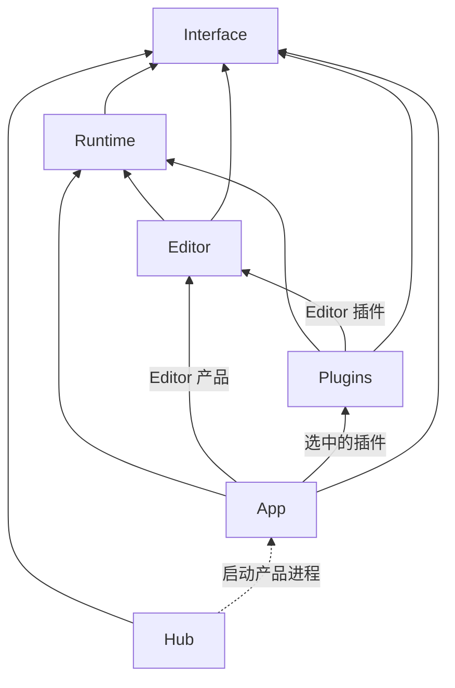

# ZirconEngine 六层目录与模块精简方案

建议将引擎源码的顶层职责固定为 `interface / runtime / editor / hub / app / plugins`，目录保留现有 `zircon_` 前缀，其中 `zircon_runtime_interface` 改为 `zircon_interface`。消除没有独立消费、发布或编译要求的辅助 crate；必要的过程宏、开发 DLL 和插件分发边界放在所属目录内部。

用户本次选择“先确认结构和合并方案”。本文是待确认的目标设计，没有迁移源码、修改 Cargo 配置或变更权限，也不代表迁移后的编译和产品验收已经通过。

## 1. 当前结构与判断依据

检查范围包括根目录、全部本地 Cargo manifest、核心源码入口、辅助 crate 实现、插件 SDK/目录提供者、接口边界测试、构建复用记录，以及本地参考引擎目录。

当前有 8 个顶层 `zircon_*` 目录。根 workspace 声明 16 个 member，插件 workspace 声明 139 个 member，共解析到 155 个本地 package。插件 member 包含 53 个 Runtime、40 个 Editor、39 个 dist、3 个 native 和 4 个支持包；这些数字描述源码包数量，不是 139 个架构层。

| 当前包 | manifest 中不同的直接消费者 | 对独立 crate 的判断 |
| --- | --- | --- |
| `zircon_runtime_interface` | 23 个，包括 Hub、App、Editor、Runtime 和部分插件 | 保留独立接口层，改名为 `zircon_interface` |
| `zircon_runtime_host` | App、Editor | 并入接口层的宿主协议辅助模块 |
| `zircon_reflect_derive` | Runtime | 与现有脚本反射宏合为一个内嵌过程宏 crate |
| `zircon_runtime_reflection_macros` | Runtime | 与上一项共用一个编译边界 |
| `zr_math` | Interface、Runtime | 移入 `interface::math`，避免 Interface 反向依赖 Runtime |
| `zr_contracts` | Runtime；当前只暴露随机状态契约 | 移入 `interface::random`，无需再设通用 contracts 包 |
| `zr_resource` | Runtime | 可回并 Runtime 的 `core::resource`；保留资源子系统边界 |
| `zr_rhi` | Runtime、`zr_rhi_wgpu` | 与后端一起回并 Runtime；中立 RHI 与 WGPU 仍分模块 |
| `zr_rhi_wgpu` | Runtime | 移入 `runtime::rhi::wgpu`，不增加顶层角色 |
| 两个 `first_party_*_catalog` | 都只有 App | 并入 App 的插件装配模块 |
| `zircon_plugin_editor_support` | 19 个 Editor 插件 | 并入现有 Plugin SDK 的 Editor 功能 |

这些消费者数量按 manifest 的 package 名去重，包含声明的可选依赖和开发依赖，不代表每个构建配置都会启用全部依赖。上表支持合并方向；资源和 RHI 回并后的构建耗时、可见性与行为仍须实际验证。

## 2. 推荐目标目录

```text
ZirconEngine/
├── Cargo.toml                         # 唯一 Cargo workspace
├── Cargo.lock                         # 引擎 workspace 的唯一依赖锁
├── zircon_interface/                  # 跨层契约与必要的轻量协议支持
│   ├── Cargo.toml
│   ├── build.rs                       # 现有 InterfaceSpec 生成，输出进 OUT_DIR
│   ├── src/
│   │   ├── math/                      # 共享数值类型、校验和数学运算
│   │   ├── reflect/                   # 反射类型、元数据与值契约
│   │   ├── random/                    # 随机流状态、checkpoint 契约
│   │   ├── resource/                  # 资源 ID、句柄、记录与状态 DTO
│   │   ├── project/                   # 项目描述、版本、启动意图和模板契约
│   │   ├── runtime_api/               # Runtime 函数表与版本化 ABI
│   │   ├── plugin_api.rs              # 插件 ABI
│   │   ├── hub_protocol/              # Hub 与产品入口共用协议
│   │   ├── ui/                        # 跨边界 UI 值、描述与结果数据
│   │   ├── serialization/             # 共用编码、校验和格式契约
│   │   └── host/                      # ABI 输出释放、限额解码、绑定状态辅助
│   └── tests/
├── zircon_runtime/                    # 运行时权威及引擎实现
│   ├── Cargo.toml
│   ├── src/
│   │   ├── core/
│   │   │   ├── runtime/               # 生命周期、调度与运行服务
│   │   │   ├── framework/             # Runtime 内部的模块/服务契约
│   │   │   ├── manager/               # 服务访问与管理入口
│   │   │   └── resource/              # 资源登记、事务、加载与运行状态
│   │   ├── scene/                     # World/ECS 权威与场景执行
│   │   ├── asset/                     # 资产管线
│   │   ├── rhi/                       # 中立设备、资源、提交与诊断抽象
│   │   │   └── wgpu/                  # 当前具体 GPU 后端
│   │   ├── graphics/                  # 渲染功能与帧组织
│   │   ├── render_graph/
│   │   ├── ui/                        # UI 布局、交互与运行算法
│   │   ├── text/
│   │   ├── platform/
│   │   ├── input/
│   │   ├── script/
│   │   ├── plugin/                    # 插件加载、调度和服务生命周期
│   │   └── dynamic_api/               # 契约到 Runtime 实现的适配
│   ├── macros/                        # 唯一 zircon_macros 过程宏 crate
│   │   └── src/{reflect,script}/        # 两类宏的实现按职责分组
│   ├── crates/                        # 仅保留有证据的开发构建边界
│   │   ├── zr_dev_deps_dylib/
│   │   └── zr_runtime_dev_dylib/
│   ├── assets/
│   └── tests/
├── zircon_editor/                     # 编辑与创作
│   ├── src/{core,scene,ui}/
│   ├── assets/
│   └── tests/
├── zircon_hub/                        # 独立安装器、项目与版本启动器
│   ├── src/                           # Tauri/服务、安装与进程管理
│   ├── web/                           # React 前端
│   ├── assets/
│   └── tests/
├── zircon_app/                        # 进程入口与产品装配
│   ├── src/
│   │   ├── bin/                       # Runtime、Editor、Server 产品入口
│   │   ├── entry/                     # 配置、窗口、加载与循环交接
│   │   └── plugins/                   # 插件选择、组装和第一方提供者目录
│   └── tests/
├── zircon_plugins/                    # 按功能组织的可选扩展
│   ├── plugin_sdk/                    # declaration/runtime/editor/native 作者 API
│   ├── rendering/{runtime,editor,dist,features}/
│   ├── physics/{runtime,editor,dist}/
│   ├── asset_importers/               # 导入插件的共同目录归属
│   └── ...                            # 其余实际存在的插件功能
├── docs/                              # 已有架构、crate、计划与使用文档
├── tools/                             # CLI、导出、验证、Jenkins 和维护工具
├── templates/                         # 可复用项目模板
├── examples/                          # 示例项目
├── dev/                               # 只读参考源码和第三方输入
└── .codex/、.github/ 等                # Agent 与 CI 控制文件
```

这棵树展示职责和关键目录，省略已有的其他模块与构建源文件。`docs/tools/templates/examples/dev` 是仓库支持目录；“六层”约束引擎源码 owner，不要求把支持文件塞进某个产品 crate。

保留现有 `runtime::core::{runtime,framework,manager,resource}` 和 Editor 的 `core/scene/ui` 主干。共享数学改由 Interface 直接拥有后，旧 `runtime::core::math` 只转发数学的壳应删除，调用点直接使用 `zircon_interface::math`；随机状态契约同理，不留下仅转发 `interface::random` 的旧框架模块。

## 3. 六层职责与依赖方向

| 层 | 唯一职责 | 边界 |
| --- | --- | --- |
| Interface | 跨层类型、ABI、协议、格式与共用轻量支持 | 不依赖 Runtime、Editor、App、Hub 或具体插件实现 |
| Runtime | 世界状态、生命周期、服务、资源与执行算法 | 不依赖 Editor、App、Hub 或具体第一方插件 |
| Editor | 编辑状态、命令/事务、工具与创作 UI | 经 Runtime API 操作运行状态，不另建世界权威 |
| Hub | 安装、版本、项目目录、认证与进程启动 | 引擎本地依赖停在 Interface，通过启动协议连接产品 |
| App | 选择产品入口、宿主循环与实际插件装配 | 可以依赖 Runtime、可选 Editor 和选中的具体插件 |
| Plugins | 可选领域实现及其编辑扩展 | Runtime 插件依赖 Runtime；Editor 插件可再依赖 Editor |

箭头表示允许的编译依赖；虚线表示进程启动。



六个 owner 不是一条线性的继承链。特别是 Hub 不应链接整个 Runtime，Runtime 和 Editor 也不应反向依赖具体插件来发现第一方功能。选用哪些具体插件由 App 装配，加载和生命周期机制仍归 Runtime/Editor。

Plugin SDK 保留现有按角色启用的依赖：native 声明/ABI 功能不因本次整理而被迫启用 Runtime 或 Editor，Editor 辅助逻辑只在 SDK 的 Editor 功能中编译。

## 4. 合并与保留的具体决策

### 4.1 Interface 保留独立包，吸收共享基础和宿主协议辅助

`zircon_runtime_interface` 已承担 Hub、项目、编辑扩展、反射与序列化等跨层职责，名字收敛为 `zircon_interface` 更准确。将它并入 Runtime 会破坏 Hub 的轻依赖和动态库契约隔离；在 Runtime 中增设一个转发 interface 模块也不能恢复这种编译隔离。

`zircon_runtime_host` 的实现只依赖现有 Interface、Serde 和 JSON，没有必要另占顶层包。移动至 `zircon_interface/src/host/`，保留输出预算、错误释放、指标、协议隔离和 viewport 绑定状态的完整行为。真实 DLL 加载、窗口与进程循环仍属于 App/Editor 的宿主实现。

当前 Interface 边界测试限制 `std::sync` 等实现。合并 host 时需对具体 `host/**` 所需同步与 ABI 安全逻辑建立窄范围边界，保留其他模块的约束，不能简单清空禁止列表。当前文本 spool 和 recent-projects store 已有类似的显式例外。

`zr_math` 的类型及纯数学操作整体进入 `interface::math`，保留一个定义来源；不能把它放进 Runtime 后再让 Interface 依赖 Runtime。`zr_contracts` 当前只有随机状态与 checkpoint 数据，进入 `interface::random`；随机数生成器、种子权威与流执行继续归 `runtime::core::runtime::random`。

Interface 允许契约必需的校验、编码、数学操作与明确限定的协议辅助。它不作为各种共用业务代码的收容箱。

### 4.2 两个反射宏合为一个嵌套 crate

将 `zircon_reflect_derive` 和 `zircon_runtime/reflection_macros` 合为 `zircon_runtime/macros`，package 名推荐 `zircon_macros`，保留 `ZrReflect`、`ZirconScriptType`、`zircon_host_function`、`zircon_host_module` 四个现有宏入口。

它们目前都只依赖 `syn/quote/proc-macro2`，均由 Runtime 直接消费。实现可按 `reflect` 和 `script` 分组，但不应把不同元数据语义强行合成一种宏。

过程宏必须定义在 `proc-macro` crate，且不能在定义它的同一个 crate 中使用，因此不能直接变成普通 Runtime 源码模块。这是语言要求的编译边界，可以放在 Runtime 目录内。[Rust Reference：过程宏](https://doc.rust-lang.org/reference/procedural-macros.html)

合并时一并修改宏生成代码中的 `::zircon_runtime_interface` 路径、测试和调用点。宏 crate 本身保持只依赖语法处理库；生成的代码可以引用 Interface/Runtime，生成器不直接链接它们，避免编译循环。

### 4.3 Resource 和 RHI 回并 Runtime，保留模块抽象

`zr_resource` 没有第二个独立 package 消费者，建议将实现并回 `runtime/src/core/resource`。资源 DTO 继续留在 Interface，资源事务、管理 generation、registry 和运行状态继续由 Runtime 唯一拥有。迁移时合并已有资源 IO 模块，不能重新出现双份实现或退回 Framework 所有权。

`zr_rhi` 与 `zr_rhi_wgpu` 需要成组回并：中立设备、句柄、提交和诊断放在 `runtime::rhi`，WGPU 对象与具体提交放在 `runtime::rhi::wgpu`。只回并其中一项会使另一项依赖 Runtime，并可能与 Runtime 对后端的依赖形成循环。

回并去掉的是包和转发层，设备抽象、后端职责、资源租约、GPU 完成时间线和现有测试仍须保留。Headless/Core 构建通过已有 graphics/platform 功能控制后端依赖，不因合并而无条件拉入 WGPU/Winit。当前没有其他独立 RHI 后端 crate 消费它，暂不为假设中的后端保留额外包层。

这些包已有独立测试和构建隔离。回并后要验证聚焦检查的成本；不能只凭 package 数减少就宣称构建更快。

### 4.4 两个开发 DLL 保留为内部构建支持

目前依赖方向为 `App/Editor → zr_runtime_dev_dylib → Runtime → zr_dev_deps_dylib → 第三方库`。一个隔离 Runtime，另一个隔离重型第三方依赖。按现有依赖直接将两个包合为一个，会产生 `Runtime → 合并包 → Runtime` 循环。

已有 [App08 构建复用记录](optimize/zircon_app/08/2026-08-30-runtime-artifact-reuse-compact-validation.md) 记录过 Runtime 单文件修改的动态构建中位数 94.82 秒，对比静态 243.05 秒；同一记录也保留了 App 改善不足和 Editor/客户端未完成验收的限制。这是保留现有隔离手段的历史依据，不是当前源码性能已通过的声明。

推荐暂时保留这两个小 crate 于 `zircon_runtime/crates/`，保持开发功能可选，与产品 Runtime ABI/DLL 区分。后续只有在明确取消动态开发模式或证据证明无需两段隔离时才删除，不为顶层目录数量而扩大构建策略改动。

### 4.5 插件支持包合并，插件发布边界保留

两个 `first_party_*_catalog` 都只有 App 消费，吸收到 `zircon_app/src/plugins/catalog/{runtime,editor}`。将可选具体插件依赖及功能转发一起移到 App，避免给 Editor 或 Runtime 增加反向依赖。

`editor_support` 吸收到 `zircon_plugins/plugin_sdk/src/editor/authoring`；19 个消费者使用 SDK 的 Editor 功能，不另建支持包。SDK 保留一个包和实际需要的角色功能。

插件的 `runtime/editor/dist/native` 不是重复的四层引擎。Editor 依赖不应进入 Runtime 插件；dist 中实际的 `cdylib` 和 ABI 入口是发布边界，应保留独立目标。个别 Runtime + dist 可以在明确只发布一套库且验证导出条件后用多 crate-type 合并，但不把它作为全插件统一硬切规则。[Rust Reference：crate 输出类型](https://doc.rust-lang.org/reference/linkage.html)

导入器有独立格式、能力和 package ID，例如 `gltf_importer`、`obj_importer` 与现有 model 家族，以及两组 audio/texture 导入目录。可以将目录归拢到 `plugins/asset_importers`，但不能依据相似名称直接删除或混合功能；保留实际格式处理、选择与发布身份，具体移动清单另按消费者确认。

### 4.6 一个 workspace、一份引擎依赖锁

删除 `zircon_plugins/Cargo.toml` 中独立 workspace 的身份，将其真实 member 统一登记到根 `Cargo.toml`，版本和依赖策略归根 workspace。收敛两份引擎 Cargo.lock，更新显式指向插件 workspace 的构建、导出、验证和 CI 工具。

默认构建范围仍只选必要核心包，检查和产品构建显式选择插件与功能。不会因为进入同一 workspace 就默认构建所有插件、全部图形后端和所有发布目标。用户项目、模板和发布 SDK 示例若具有真实独立消费目的，不因此丢失自身项目 manifest/lock。

若以上包合并全部执行，核心与工具包由 16 个减为 9 个，插件包由 139 个减为 136 个；合计 145 个实际 package 统一归根 workspace 管理。核心的 9 个包括 5 个产品/接口包、1 个过程宏包、2 个开发 DLL 包和 `cargo-zircon` 工具；Plugins 是组织这些扩展包的第六个源码 owner，不需要再造一个汇总所有插件的 `zircon_plugins` 库。

## 5. 目录精简规则

- 同一职责里的紧密相关类型、简单方法和辅助函数可以放在同一文件。文件按行为和职责组织，不实行“一种类型/一个函数一个文件”。
- 只有独立消费、独立发布、语言编译要求或有证据的构建隔离需要才保留 crate；其余优先使用普通模块。
- `lib.rs/mod.rs` 负责必要声明与入口，删除仅用于维持迁移旧路径的转发壳，不新增 `compat/shim/facade`。
- 没有跨层消费者的 Runtime 内部 Framework 类型继续留在 Runtime。跨进程/动态库或轻宿主确实需要的契约才进入 Interface，不把整个 Framework 再复制一遍。
- 现有 Interface 的 UI batch 规划、投影计算等包含实际算法，需要按消费者区分结果 DTO 与执行逻辑。确属 Runtime 执行的部分归 Runtime；共用的纯值操作可保留。类型和它的固有实现不能只搬半边，必须一起调整消费者。
- 产品资源归各 owner 的 `assets`，模板归 `templates`，验证工具归 `tools`。已有文档刚形成 `architecture/crates/editor/rendering/tooling/ui` 等分类，沿用其职责，无需再做一轮无关搬迁。
- 仓库根的 `node_modules`、`.wiki-venv`、Hub 生成文件、运行资产缓存和 `nul` 等只作为后续工具输入/产物审计项。确认用途与现有写入来源后再处理，不纳入源码合并删除清单。

## 6. 建议实施顺序与验收

1. **准备迁移窗口。** 确认本方案、精确路径与当前重叠改动。当前 checkout 存在大量预先修改，不能通过还原、整树覆盖或清理其他工作来实施。新 `zircon_interface`、`zircon_runtime/macros` 等目标不在当前完整写入授权中；实际迁移需单独明确这些目的路径及必要的权限维护，本次不修改 `.codex/config.toml`。
2. **收敛源码 owner。** Interface 改名并吸收 host/math/random；反射宏成组合并，更新生成路径；再回并 Resource 与两个 RHI 包。每个成组变更同步迁移声明、消费代码、manifest、测试与结构断言，不保留旧 crate 别名。
3. **收敛装配和 workspace。** Catalog 归 App，editor_support 归 SDK；统一 workspace 和 Cargo.lock，更新模板、导出、工具及 CI 中的有效路径与包名。插件目录分组另列精确清单，避免把功能变化混入目录调整。
4. **完成验证。** 先查路径、manifest 和依赖方向，再按受影响包/功能完成一批编译与聚焦回归，最后运行受影响的 Runtime/Editor 启动、Hub 项目启动和插件分发路径。失败从最低共享 owner 修复，保留现有 ABI、序列化格式与验收门槛。

验证重点如下：

| 变更 | 必须保留的证据 |
| --- | --- |
| Interface/Host/Math/Random | 轻依赖与源码边界、ABI 布局和版本、owned buffer 恰好释放一次、限额解码、绑定回滚、数学精度、checkpoint 编解码 |
| 过程宏 | 现有四个宏的生成、编译消费、错误诊断与反射元数据契约 |
| Resource/RHI | 单向所有权、资源事务与恢复、generation、Headless 功能闭包、设备/提交生命周期与必要的真实 GPU 路径 |
| Catalog/SDK/插件 | 可选功能选择、具体插件登记、native 轻依赖、导出符号及 dist 包装 |
| Workspace/产品 | 单一依赖锁、所有有效路径切换、模板生成、Runtime/Editor 入口、Hub 启动握手、构建暂存与开发 DLL 复用 |

编译和缓存输出继续物理位于已授权的 `D/E/F:\cargo-targets\zircon-local` 命名空间，使用当前 Windows 本地验证入口；不恢复退役 coordinator。具体检查按 [里程碑验证策略](milestone-validation-policy.md) 选择，不用静态扫描替代产品验收。

## 7. 本次证据与限制

本次完成的是目录、manifest 依赖和所列实现/结构测试的只读检查，以及目标方案的文档结构检查。21 个本地文档链接均存在，Markdown 围栏和空白检查通过。

将现有 package 按本文合并关系映射后，145 个候选 package 的普通依赖与构建依赖图没有循环，Interface 没有本地实现包依赖，Hub 的本地依赖仍只有 Interface。这项静态检查包含声明的可选/平台依赖；开发依赖单独记录，其现有 Neural Runtime 与 post-process 测试往返关系在映射前后相同。它不是 Cargo 特性解析、真实编译或测试目标验收。

未运行 Cargo 编译、GPU 产品或迁移后的回归测试；合并可行性是基于当前依赖图和语言规则的设计判断。

参考引擎仅用于校验职责：本地 Godot 的 `core/scene/editor/modules`，Unreal 的 `Runtime/Editor/Programs`，Fyrox 的 Editor/Runtime 分离和 `fyrox-core-derive`，以及 Bevy 的内嵌 `bevy_reflect/derive`。采用职责分离和必要编译边界，不照搬其独立 crate 数量。

直接源码依据包括：

- [根 workspace](../../Cargo.toml)、[当前 Interface manifest](../../zircon_runtime_interface/Cargo.toml)、[Hub manifest](../../zircon_hub/Cargo.toml)、[插件 workspace](../../zircon_plugins/Cargo.toml)。
- [Host 模块入口](../../zircon_runtime_host/src/lib.rs)、[现有 Interface 边界测试](../../zircon_runtime_interface/src/tests/boundary.rs)。
- [统一反射宏](../../zircon_reflect_derive/src/lib.rs)、[脚本反射宏](../../zircon_runtime/reflection_macros/src/lib.rs)。
- [数学包](../../zircon_runtime/crates/zr_math/src/lib.rs)、[随机契约包](../../zircon_runtime/crates/zr_contracts/src/lib.rs)、[资源包](../../zircon_runtime/crates/zr_resource/src/lib.rs)。
- [中立 RHI](../../zircon_runtime/crates/zr_rhi/Cargo.toml)、[WGPU 后端](../../zircon_runtime/crates/zr_rhi_wgpu/Cargo.toml)、[开发 Runtime DLL](../../zircon_runtime/crates/zr_runtime_dev_dylib/Cargo.toml)、[开发依赖 DLL](../../zircon_runtime/crates/zr_dev_deps_dylib/Cargo.toml)。
- [Plugin SDK](../../zircon_plugins/plugin_sdk/Cargo.toml)、[Editor 插件辅助](../../zircon_plugins/editor_support/Cargo.toml)、[Runtime 提供者目录](../../zircon_plugins/first_party_runtime_catalog/Cargo.toml)、[Editor 提供者目录](../../zircon_plugins/first_party_editor_catalog/Cargo.toml)。

这些链接指向实施前源码。未来迁移落地时必须在同一变更中更新有效文档链接与路径契约，本文不能作为保留旧目录的理由。
