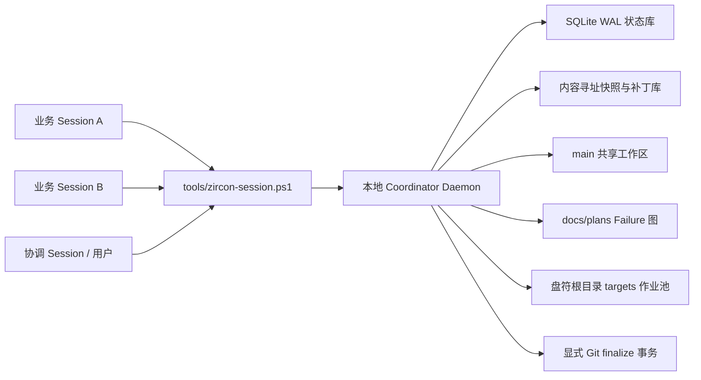

---
related_code:
  - .codex/skills/zircon-project-skills/cross-session-coordination/SKILL.md
  - .codex/skills/zircon-project-skills/cross-session-coordination/scripts/Get-RecentCoordinationContext.ps1
  - .codex/skills/zircon-project-skills/cross-session-coordination/references/session-note-template.md
  - .codex/skills/zircon-project-skills/handle-plan-failure-handoffs/SKILL.md
  - .codex/skills/zircon-project-skills/handle-plan-failure-handoffs/scripts/validate_plan_failure_handoffs.py
  - .codex/skills/zircon-project-skills/write-plan-output-records/SKILL.md
  - .codex/skills/zircon-dev/scripts/validate-matrix.ps1
  - .codex/skills/zircon-dev/references/main-branch-development-policy.md
  - .codex/skills/zircon-dev/references/cargo-target-disk-policy.md
  - tools/cleanup-stale-targets.ps1
implementation_files:
  - tools/session_coordinator/
  - tools/zircon-session.ps1
  - tools/cleanup-stale-targets.ps1
  - .codex/skills/zircon-project-skills/cross-session-coordination/
  - .codex/skills/zircon-project-skills/handle-plan-failure-handoffs/
  - .codex/skills/zircon-dev/scripts/validate-matrix.ps1
plan_sources:
  - user: 2026-07-11 multi-session main-workspace coordination requirements
  - docs/superpowers/specs/2026-07-11-plan-failure-handoff-skill-design.md
  - docs/superpowers/plans/2026-07-11-plan-failure-handoff-skill.md
tests:
  - python -m unittest discover -s tools/session_coordinator/tests -p "test_*.py"
  - pwsh -NoProfile -File tools/tests/session-coordinator-smoke.Tests.ps1
  - pwsh -NoProfile -File .codex/skills/zircon-dev/scripts/validate-matrix.Tests.ps1
doc_type: design-spec
---

# ZirconEngine 本地多 Session 协调服务设计

## 目标

在不创建 worktree、不创建功能分支、所有开发会话都直接共享 `main` 工作区的前提下，为并行 Session 提供可恢复、可审计、不会盲目覆盖的本地调度层。

服务必须解决以下问题：

- Session 状态、写入范围和基线缺少统一模型；
- 多会话可能同时修改同一文件，后写者会覆盖前写者；
- 业务中间版本不应污染 Git 历史，但必须能够恢复和追踪；
- `docs/plans` 的全局计划文档成为写入热点；
- Failure 交接只有文件规则，没有依赖图、优先级和回流治理；
- Cargo target、验证并发和定时清理之间没有同一份租约事实源；
- 活动 Session 根目录会长期堆积、状态值不受控制；
- 共享工作区缺少可判定的稳定基线。

## 已确认的不变量

1. 仓库始终在现有 `main` checkout 上开发。
2. 不创建 worktree，不创建或切换功能分支。
3. 业务 Session 的中间版本由本地服务保存，不自动形成 Git commit。
4. 只有用户明确要求最终提交时，Session 才能发起显式 finalize；服务审计通过后创建普通语义化 Git commit，不添加 Session 标签。
5. `.codex/skills` 等项目工作流文件正常纳入 Git，不按业务中间版本处理。
6. Session 不因跨计划 failure 停止；来源 Session 继续独立切片，修复 Session 优先根治 failure 的最低共享架构层。
7. 全局计划定义和索引只读；执行记录写入对应编号子计划目录。
8. Cargo 产物只能位于盘符根目录的受管 `targets` 树，且清理前必须同时确认租约和进程都已失活。
9. 临时稳定构建可复制工程验证，但复制目录不是 Git worktree，验证结束后必须安全删除。

## 方案选择

### 采用：Python 标准库守护进程、SQLite WAL 与 PowerShell 客户端

守护进程使用 Python 标准库实现，本机回环接口负责事务；SQLite WAL 保存 Session、租约、补丁队列、快照索引、Failure 图、Cargo 作业和 Git finalize 请求。PowerShell 脚本提供稳定的 Windows 入口，并负责用户级计划任务的安装、启动和健康检查。

这个方案不引入第三方运行时包，能够在服务未启动时由客户端隐藏启动；数据库事务比散落 JSON 锁文件更适合多 Session 竞争，同时不会要求先编译 ZirconEngine 或新增 Rust 自举链。

### 未采用：纯 PowerShell 文件锁

纯 PowerShell 能快速包装现有脚本，但跨进程原子事务、队列恢复、Failure 图查询和长期服务测试会持续复杂化。它适合作为客户端和安装入口，不适合作为唯一状态内核。

### 未采用：Rust 常驻服务

Rust 服务在类型和性能上更强，但协调层必须在 Cargo 环境损坏、target 被清理或工作区暂时不可编译时仍可启动。用工作区自身的构建链启动调度服务会形成错误的自举依赖。

## 总体架构



服务只绑定 `127.0.0.1` 的动态端口。端口、进程号和随机令牌写入 `.codex/state/session-coordinator/runtime.json`；接口必须携带令牌。数据库、对象库、日志和归档都位于 `.codex/state/session-coordinator/`，继续受现有 `/.codex` 忽略规则保护，不进入 Git。

服务启动时验证仓库根目录、当前分支为 `main`、数据库 schema 版本和单实例锁。若分支不为 `main`，服务进入只读诊断状态，不自行切换分支。

## 服务模块边界

`tools/session_coordinator/` 按职责拆分：

- `server.py`：回环服务、认证、单实例和健康端点；
- `database.py`、`migrations.py`：连接、事务和 schema 升级；
- `models.py`：枚举、命令 DTO 和持久化记录；
- `sessions.py`：注册、心跳、状态迁移、stale 与 archive；
- `baselines.py`：HEAD、文件 hash、epoch 和外部漂移治理；
- `leases.py`：规范化路径、多文件原子租约和冲突检测；
- `patches.py`：补丁预检、延迟队列、应用与待重放状态；
- `snapshots.py`：内容寻址对象、版本清单、恢复和保留策略；
- `plans.py`：计划根扫描、只读热点和编号子目录路由；
- `failures.py`：failure/fixed 生命周期图、优先级、环和回流；
- `cargo_jobs.py`：target lane、进程、心跳和清理资格；
- `git_finalize.py`：最终范围审计、暂存和普通提交；
- `workspace_copy.py`：临时验证副本创建、运行和安全删除；
- `cli.py`：机器可读 JSON 与人类可读命令输出。

每个模块通过 service class 和数据库事务交互，不让 HTTP handler、PowerShell 或技能文件直接操作 SQLite。

## Session 模型与状态枚举

Session 主键优先使用 `CODEX_THREAD_ID`；不可用时生成稳定的本机 UUID。每个 Session 至少记录：

- `session_id`、显示名、计划来源和编号子计划目录；
- `base_head`、`baseline_epoch`、启动时工作区摘要；
- 声明的文件、目录和模块写入范围；
- 当前切片、活动租约、排队补丁和 Cargo 作业；
- 心跳、最后活动时间、完成摘要和归档时间。

合法状态固定为：

- `registered`：已登记，尚未开始写入；
- `active`：正常推进；
- `waiting_lease`：目标文件被占用，当前补丁排队，但 Session 可切换其他切片；
- `resolving_failure`：正在处理优先 Failure；
- `waiting_validation`：实现完成，等待受管验证 lane；
- `finalizing`：正在做最终范围和 Git 审计；
- `completed`：业务工作完成，未必已提交；
- `stale`：心跳过期，等待恢复或归档；
- `archived`：只读归档；
- `cancelled`：显式取消并保留恢复证据。

不提供通用 `blocked` 状态。跨计划失败进入 Failure 图；文件冲突进入 `waiting_lease`；验证竞争进入 `waiting_validation`。状态迁移由服务校验，任意自由文本只能写入 `status_reason`，不能替代枚举。

## 稳定基线

稳定基线不是“工作区永远干净”，而是服务能够证明每个变化从哪个已知内容演进而来。

服务维护递增的 `baseline_epoch`：

1. 启动时记录 `HEAD`、索引树、Git 可见路径和内容 hash；
2. Session 注册时绑定当前 epoch；
3. 每次受管写入前保存旧对象 hash，写入后保存新对象 hash和 Session 所有者；
4. HEAD 变化时开启新 epoch，并把仍未归属的工作区变化标记为 `unattributed`；
5. 文件监控发现绕过服务的变化时，立即快照并将基线标记为 `degraded`；
6. `reconcile` 必须把每个外部变化归属给 Session、接受为新基线或恢复到已知版本，之后才恢复 `healthy`。

基线为 `degraded` 时允许继续保存中间版本，但禁止 Git finalize 和破坏性清理。这样不会因为一个外部编辑让所有 Session 停止，同时也不会把来源不明的文件提交到 Git。

## 文件租约与延迟 Patch

租约按 Windows 大小写不敏感的仓库相对路径保存。目录声明只用于冲突预警；真正写入前必须把目标展开为具体文件和新路径保留项。

- 多文件租约按规范化路径排序，在单个数据库事务中一次性获取，避免死锁；
- 默认 TTL 为 5 分钟，活动 Session 每 15 秒心跳一次，2 分钟宽限后才能回收；
- 同一 Session 可续租和重入；不同 Session 的文件租约互斥；
- 获取租约时记录文件 base hash；应用前再次比较；
- 不能立即获取时，补丁及其 base hash 进入 FIFO 延迟队列，Session 转为 `waiting_lease` 后可继续其他工作；
- 租约释放后，只有目标 hash 仍等于 base hash 才自动应用；否则转为 `needs_rebase`，生成三方内容和冲突摘要，禁止最后写入者覆盖现有文件；
- 直接编辑被监控发现后，服务保留前后快照并报告 lease violation，不自动丢弃任何一方内容。

客户端提供 `claim`、`patch enqueue`、`patch status`、`snapshot`、`restore-preview` 和 `release`。技能规则要求业务 Session 在修改共享文件前先 claim；服务端仍以 hash 与 watcher 兜底，而不是只相信 Session 自述。

## 服务管理的中间版本

中间版本由对象库保存，不使用隐藏 Git commit、stash、branch 或 worktree。

- 文件内容以 SHA-256 命名，使用 zlib 压缩；
- 每个 snapshot manifest 记录路径、模式、旧/新对象 hash、Session、epoch、计划和时间；
- 相同内容只保存一次；
- 恢复默认为 preview，只有重新取得租约且当前 hash 匹配预期时才落盘；
- Session 完成后保留 14 天，archive 后保留摘要与最终对象引用 30 天；
- 被 Failure、未完成 finalize 或审计记录引用的对象不自动回收。

这些版本只为本机协作和恢复服务，不冒充仓库历史。

## Git finalize 事务

`completed` 不等于自动提交。只有在用户明确要求 Git commit 后，Session 才能调用带 `--commit` 的 finalize 命令。

服务按以下顺序执行：

1. 建立 finalize 请求并冻结该 Session 的写入范围；
2. 拒绝基线 `degraded`、未解决 lease violation、排队 patch 或 `needs_rebase`；
3. 计算 Session 从对象日志拥有的最终路径，拒绝其他 Session 独占或来源不明的路径；
4. 执行计划、Failure、格式和用户配置的验证门；
5. 仅暂存审计后的路径，复核暂存区没有越界文件；
6. 使用用户提供或按内容生成的普通语义化提交信息，不添加 `[zircon-session:*]`；
7. 提交成功后记录 SHA、路径清单和验证结果，并开启新 baseline epoch；
8. 提交失败时恢复暂存区到事务前状态，工作树内容和中间快照保持不变。

服务不 push。工作流技能等非业务维护可按普通 Git 流程提交，但仍应通过 Git 互斥锁避免与 finalize 同时操作索引。

## 计划写入治理

协调扫描同时覆盖：

- 正式根：`docs/plans`，递归扫描；
- 兼容根：`.codex/plans`，只读扫描并标记 legacy，不再作为正式执行记录目标。

下列文件默认全局只读：

- `docs/plans/index.md` 及任意子树 `index.md`；
- `docs/plans/engine-code-*.md`；
- 作为计划定义的编号 Markdown，例如 `docs/plans/**/01-*.md`。

Session 的具体状态、测试证据和输出记录必须写到对应 `docs/plans/{family}/{id}/` 编号子目录。服务根据 Session 注册的 `plan_path` 推导允许目录；无法唯一推导时拒绝写入并给出候选路径。只有显式 maintenance 命令可以更新全局汇总，且该命令不能被普通业务 Session 调用。

## Failure 图治理

现有 `failure-{date}-{summary}.md` / `fixed-{date}-{summary}.md` 仍是可读的持久事实，SQLite 只建立索引，不取代 Markdown。

图节点以 `origin_plan + fixing_plan + summary_slug` 标识，边表示来源编号计划依赖修复编号计划。服务扫描时校验命名、provenance、位置、相对链接和状态，并额外治理：

- 同一生命周期重复 artifact；
- 自交接、环依赖和过深依赖链；
- 同一 fixing plan 下的优先级排序；
- failure 已修复但未回流、fixed 已回流但来源未确认；
- 修复只覆盖调用点、测试绕过或兼容 shim，未满足架构验收字段。

Session 启动时先查询其编号子目录的开放 failure。若存在，状态进入 `resolving_failure` 并优先处理最低共享原因；来源 Session 保持 `active`，继续无依赖切片。

修复通过自底向上验证后，服务以单事务完成：把 canonical artifact 移动并重命名为来源目录的 `fixed-*`、更新来源链接、在修复者子计划目录写入精简状态摘要和相对链接、更新图状态并通知来源 Session。任何一步失败都恢复文件移动和数据库状态。

## Cargo lane 与受管 targets

允许的根目录固定为现有盘符中的：

```text
D:\targets\zircon-engine\
E:\targets\zircon-engine\
F:\targets\zircon-engine\
```

具体启用盘符由本机配置和可用空间决定。每个 Cargo 作业使用 `{root}\lanes\{lane-id}`，临时验证使用 `{root}\verify\{job-id}\target`。仓库内 `target/`、任意 `cargo-targets*` 根和不在 allowlist 内的显式 `--target-dir` / `CARGO_TARGET_DIR` 都被受管入口拒绝。

服务分配 `check`、`test`、`workspace`、`gpu` 等 lane，记录命令、Session、PID、开始时间、心跳和 target 路径。`validate-matrix.ps1` 不再自行写 JSON lease，而是向服务申请 lane，并在退出时释放；显式和环境 target 也必须经过相同校验。

服务定期审计本机 Cargo 进程。绕过受管入口的进程不会被强杀，但会标记冲突、阻止相关 lane 清理和 finalize，并给出实际命令行与目标目录。

## 清理、归档与自动启动

用户级 Windows 计划任务在登录时以隐藏窗口启动守护进程，并每 15 分钟触发一次维护 tick；客户端健康检查失败时也可隐藏按需启动。无需管理员级 Windows Service。

维护策略：

- Session 心跳 10 分钟失活后转 `stale`；
- `stale` 24 小时且无 live PID、租约或待回流 Failure 后移入 archive；
- archive 30 天后回收无引用快照，只保留摘要、事件和 commit SHA；
- 活动 Session note 由服务生成紧凑视图，不再无限增长；旧自由文本状态迁移到枚举和 `status_reason`；
- Cargo lane 只有在无活动租约、无相关进程、超过 TTL 且路径通过 allowlist/realpath 双重检查时才可删除；
- `tools/cleanup-stale-targets.ps1` 改为调用服务维护接口或读取只读清理计划，不再扫描并直接删除模糊匹配的盘符根目录；
- 日志按大小轮转，数据库定期 checkpoint，清理操作全部留下事件记录。

## 临时稳定验证副本

当共享主工作区持续变化、需要稳定构建证据时，服务可以创建普通文件副本：

1. 冻结待验证 Session 的 snapshot manifest；
2. 在 `{root}\verify\{job-id}\source` 创建只含所需 Git 文件和该 Session 已归属变化的复制目录；
3. 明确排除 `.git`、服务状态、其他 Session 未归属变化和构建产物；
4. 把 Cargo target 指向相邻的受管 `target` 目录；
5. 记录命令、HEAD、manifest hash 和结果；
6. 作业结束后先验证 resolved path 位于当前 job 根，再递归删除；失败时标记待清理，不扩大删除范围。

该目录不是 clone、branch 或 worktree，不能在其中提交，也不能反向覆盖主工作区。

## 迁移与兼容

首次启动执行一次可重复迁移：

- 读取 `.codex/sessions` 现有 Markdown，映射已知状态到枚举，未知值归入 `status_reason`；
- 识别仍有活动迹象的 Session，其余按时间和引用关系归档；
- 扫描 `docs/plans` 与 `.codex/plans`，以后者为 legacy；
- 导入 failure/fixed artifact 并构建图；
- 导入现有 Cargo lease 仅作诊断，不延续 repo-local target；
- 检测现有清理计划任务，安装新任务成功后才禁用旧的直接删除行为；
- 生成迁移报告，任何不可判定项保持原文件并列入人工核对，不静默删除。

## 安全与失败语义

- 所有工作区路径先 `resolve`，再确认位于仓库或受管 target/job 根；
- 任何递归删除都要求 allowlist、job/lease ID、数据库记录和 live-process 检查同时通过；
- 数据库事务与文件操作使用 intent/event 两阶段记录，重启后可恢复未完成动作；
- 服务不可用时，客户端默认 fail closed：允许只读诊断，不允许 finalize、清理或无租约自动 patch；
- watcher 或 Git 状态不确定时标记 `degraded`，保留内容并停止破坏性动作；
- 不保存仓库凭据，不访问网络，不 push，不修改系统级服务。

## 验证策略

测试分四层：

1. 纯单元测试：状态迁移、路径规范化、租约竞争、hash、Failure 图、清理资格和 Git 范围计算；
2. 临时仓库集成测试：并发 Session、延迟 patch、外部漂移、snapshot 恢复、finalize 暂存越界回滚；
3. PowerShell 契约测试：客户端启动、JSON 协议、`validate-matrix.ps1` lane 接入、计划任务安装 dry-run；
4. 实仓 smoke：只读扫描现有 Session、`docs/plans` 和 Failure 图，Cargo dry-run 验证 allowlist，不运行破坏性迁移。

每个里程碑的完整编译/测试在该里程碑 testing stage 统一执行。实现切片期间只做语法检查和不落盘 dry-run。

## 验收标准

- 两个 Session 请求同一文件时，不会发生无提示的最后写入覆盖；后到 patch 排队或进入可见的 `needs_rebase`。
- 所有 Session 状态来自固定枚举，旧状态有确定迁移结果。
- 业务中间版本可预览和恢复，Git 日志中没有中间 checkpoint 或 Session 标签提交。
- 只有显式 finalize 能创建 Git commit，且暂存范围只包含该 Session 已归属文件。
- 协调扫描包含 `docs/plans`；全局计划文件对业务 Session 只读，输出进入编号子计划目录。
- Failure 图能发现重复、环、错误位置和未回流修复；修复回流后修复者目录保留相对链接与状态摘要。
- Cargo 作业只使用受管盘符根 `targets` 树；清理不会删除有租约或活动进程的 lane。
- Session 与 target 定时归档/清理可重复执行，并留下可审计记录。
- 基线能区分受管写入和外部漂移；`degraded` 状态禁止 finalize 和破坏性清理。
- 稳定验证副本不创建 Git worktree/branch，验证后按安全边界删除。
