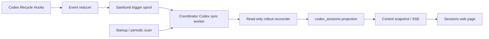

# Codex Session Hook Synchronization Design

Date: 2026-07-13
Status: approved
Owner: `zircon_tooling/session_coordinator`
Repository: `E:\Git\ZirconEngine`

## Purpose

Synchronize every Codex Session whose canonical working directory belongs to ZirconEngine into the local Session Coordinator. The coordinator must expose those Sessions in the existing web control center, keep the synchronization non-blocking for Codex, preserve the user's existing Codex notification command, and never treat Codex's private local files as the coordinator's writable state database.

## Evidence and constraints

- The installed Codex release exposes lifecycle Hooks from project `hooks.json` or inline `[hooks]`, including `SessionStart`, `UserPromptSubmit`, `Stop`, `SubagentStart`, and `SubagentStop`. Every command hook receives one JSON object on stdin.
- `SessionStart` reports `startup`, `resume`, `clear`, or `compact`; `Stop` is a turn boundary rather than a durable Session-end signal. Archive state therefore still requires read-only rollout membership reconciliation.
- Project Hooks load alongside the existing global `notify` command instead of replacing it. Non-managed project Hooks require one explicit `/hooks` review whenever their definition hash changes.
- Codex rollout files live below `$CODEX_HOME/sessions/YYYY/MM/DD/rollout-*.jsonl`; archived threads live below `$CODEX_HOME/archived_sessions/`. Their first `session_meta` record contains a thread/session ID and cwd.
- Rollout JSON may contain prompts, model instructions, tool data, environment values, and other private material. None of that raw content may be copied to the coordinator database, logs, Git, or hook queue.
- ZirconEngine currently develops in one shared `main` checkout. Hook synchronization must not create worktrees, branches, Git commits, file leases, or business Session status transitions.
- The coordinator may temporarily be offline, slow, on an older descriptor/schema, or represented by a stale runtime descriptor. A hook must not guess which process owns the repository.

## Considered approaches

### 1. Synchronize only `Stop`

This is small, but it misses startup/resume and long active turns, and `Stop` does not mean the thread was archived. Rejected.

### 2. Read or watch Codex's private app database

This could expose richer titles and UI state, but it binds ZirconEngine to an undocumented schema and risks lock contention with Codex Desktop. Rejected.

### 3. Multi-event lifecycle Hooks with periodic recovery

Session-start, prompt-submit, stop, and subagent lifecycle Hooks write bounded sanitized triggers; the coordinator then scans only changed rollout files and performs an idempotent reconciliation. Startup and periodic reconciliation recover missed, skipped, or untrusted hook runs. This covers all ZirconEngine Sessions while keeping Codex files read-only and every Hook fast. Selected.

## Architecture

### Lifecycle Hook reducer

The repository declares matching command Hooks in `.codex/hooks.json`, backed by one Python entry point under `.codex/hooks/`. Commands resolve the script from `git rev-parse --show-toplevel`, because Codex may start below the repository root. Every handler has a five-second Codex timeout while the script enforces a much shorter local deadline. The entry point:

1. reads one JSON object from stdin and rejects extra bytes after the bounded document;
2. accepts only the configured event names and reduces common fields to `sessionId`, `turnId`, normalized cwd, source/model/permission enums, optional subagent ID/type, and timestamp;
3. deliberately ignores `prompt`, `last_assistant_message`, `tool_input`, `tool_response`, and transcript contents;
4. accepts the event only when cwd resolves inside the ZirconEngine repository;
5. atomically writes a trigger no larger than 4 KiB below `%LOCALAPPDATA%/Zircon Session Coordinator/codex-hook/<repository-key>/pending/`;
6. best-effort signals the authenticated local coordinator with a short timeout;
7. emits no stdout for `SessionStart`, `UserPromptSubmit`, `SubagentStart`, or `SubagentStop`; for `Stop`, emits exactly one valid JSON object with `continue: true` so Codex never interprets plain text as an invalid Stop result;
8. returns without blocking Codex on reconciliation, daemon startup, or network I/O.

The Hook never writes SQLite and never serializes the raw stdin object. Queue filenames use random IDs rather than prompt-derived data. The queue is capped at 1,024 pending triggers; overflow removes the oldest trigger and emits only a sanitized counter when the daemon next reconciles. Other matching user, managed, or plugin Hooks and the global `notify` command continue independently under Codex's normal concurrent execution rules.

### Rollout discovery and parsing

`CodexSessionDiscovery` reads only `$CODEX_HOME/sessions` and `$CODEX_HOME/archived_sessions`. It resolves every `session_meta.payload.cwd` and retains records inside the configured repository root using case-insensitive Windows path semantics and realpath containment.

The parser reads the first valid `session_meta` line plus a bounded tail window for the latest lifecycle event. It does not deserialize or retain base instructions, messages, tool calls, assistant output, environment context, attachments, goals, or token accounting. A malformed or concurrently appended final line is ignored until the next pass; the last known-good projection remains visible with a sanitized diagnostic.

Files are incrementally keyed by canonical path, size, and nanosecond mtime. A periodic full directory membership scan detects new, moved, archived, or removed rollout files without hashing their complete contents.

### Coordinator projection

Schema v27 adds `codex_sessions` and `codex_sync_runs`.

`codex_sessions` contains only:

- `thread_id` primary key;
- canonical rollout path and source location enum (`active`, `archived`, `missing`);
- state enum (`active`, `idle`, `archived`, `unavailable`);
- canonical cwd, originator, CLI version, thread source, and safe last-event enum;
- optional last turn ID;
- first-seen, last-activity, last-synced, source mtime, and source size;
- optional `bound_session_id` foreign key;
- sanitized diagnostic code, never exception text.

`codex_sync_runs` stores aggregate counts, duration, source revision, trigger kind, terminal status, and a sanitized error code. It does not store per-line JSON or filesystem exception messages.

Codex Session state is derived deterministically:

- latest unmatched task-start event: `active`;
- latest terminal/turn-complete event while the rollout is active: `idle`;
- rollout under archived storage: `archived`;
- previously observed rollout absent for two completed membership scans: `unavailable`.

The reconciler auto-binds only when an existing business `sessions.session_id` exactly equals the Codex thread ID. It performs no fuzzy title, goal, plan-path, or message matching. Codex projections never create leases, patches, Cargo jobs, workflow runs, or business Session status changes.

### Daemon scheduling and identity

The coordinator runs one bounded Codex sync worker per repository. `SessionStart` creates or refreshes the source row immediately; `UserPromptSubmit` marks the turn active; `Stop` marks it idle; subagent start/stop updates only bounded parent activity counters. Startup performs an initial reconcile. A 30-second lightweight membership tick schedules incremental reconciliation, and a 15-minute full pass repairs missed filesystem events. Hook signals only set the worker wake event.

Before signaling, the hook validates runtime descriptor version, repository key, process ID plus creation time, localhost address, and supported control API. A stale descriptor, schema mismatch, identity mismatch, read-only daemon, or multiple candidate daemon chains causes fail-closed queueing. The hook never launches a second daemon.

The worker uses the coordinator's existing single-daemon mutex and database transaction boundaries. One run may be pending while another executes, but duplicate triggers coalesce into one follow-up pass.

## Control API and web visualization

The control snapshot gains a bounded `codexSessions` collection and `codexSync` summary. Each Codex Session row shows state text, thread ID, source location, last activity, last sync, CLI/origin, exact business binding, and diagnostic code. The Sessions page keeps business Sessions and Codex Sessions in separate panels so source presence is never confused with lease/workflow authority.

SSE publishes only `codex.session.discovered`, `codex.session.state_changed`, `codex.session.archived`, `codex.session.unavailable`, and `codex.sync.completed` summaries. Payloads contain IDs, enums, timestamps, and counts only.

No browser action is required for normal operation. A maintainer-only controlled `codex.sessions.reconcile` action may request a new pass through the existing preview/confirm/audit protocol; it cannot choose arbitrary paths or read raw rollout contents.

## Installation and removal

`tools/install-codex-session-hook.ps1` supports `Query`, `Install`, `Update`, `Remove`, and `DryRun` for the exact repository `hooks.json` definition and `[features].hooks` setting.

- Install validates the trusted ZirconEngine project config, records no webhook or credential, enables canonical `features.hooks`, and installs the exact event definitions idempotently.
- Query reports configured, feature-enabled, review-required, daemon-compatible, and queue-health states without printing hook stdin, command secrets, or runtime tokens.
- Install and Update never bypass Codex Hook trust. After a new definition hash, the operator must review it through `/hooks`; skipped runs are later recovered by the periodic scanner.
- Remove deletes only the exact managed repository Hook definitions and repository-scoped external spool; it does not alter global `notify`, user Hooks, managed Hooks, or plugin Hooks.
- Repeated install/update/remove operations are idempotent and preserve unrelated TOML keys and comments.

## Failure behavior

- Hook parse failure: emit the event-appropriate successful output without synchronization; never persist the malformed stdin.
- Coordinator unavailable or slow: retain the trigger and return promptly.
- Rollout append race: keep the last known-good row and retry.
- Rollout malformed: set a sanitized diagnostic code and continue other Sessions.
- Queue corruption: quarantine the one invalid file below the managed root and continue.
- Multiple daemon identities or stale descriptor: do not signal or start a process; wait for periodic/startup recovery.
- Database migration failure: preserve v26 and fail daemon startup closed.
- Hook definition is untrusted or disabled: Codex skips it; startup/periodic reconciliation repairs presence and archive state without bypassing trust.
- `Stop` output failure: return valid `{"continue": true}` from a final fallback path and write no explanatory plain text to stdout.

## Security and privacy invariants

- Never persist raw Codex notification payloads or rollout lines.
- Never persist prompts, assistant messages, goals, tool arguments, environment values, attachments, model instructions, runtime tokens, webhook URLs, or global notify commands.
- Accept only canonical paths inside the configured Codex roots and ZirconEngine repository.
- Limit file count, file size metadata, tail bytes, trigger bytes, queue depth, snapshot rows, and SSE payload size.
- Render all projected strings as text and validate every enum at the Python and TypeScript boundaries.
- Use authenticated localhost signaling and existing coordinator process-identity verification.

## Verification

The milestone must prove:

- stdin reduction rejects secrets, unsupported events, and non-Zircon cwd values;
- SessionStart/UserPromptSubmit/Stop and subagent fixtures produce the exact event-specific stdout contract;
- other Hook sources and the existing global notifier remain untouched;
- hook latency stays bounded with daemon online, offline, stale, and slow;
- active, idle, archived, missing, malformed, append-racing, and restored rollout fixtures reconcile idempotently;
- an initial full scan and repeated incremental scans produce the same projection;
- duplicate hook events coalesce and concurrent workers never overlap;
- v26 to v27 migration is atomic and idempotent;
- snapshots, SSE, runtime contracts, and Sessions UI remain bounded and text-only;
- install/query/update/remove preserve unrelated project/global config;
- full Python, Web, Windows Tray, controlled-action smoke, independent Critical/Important review, and a new source-frozen 24-hour soak all pass before final acceptance.

## Scope exclusions

- No Codex private app database access.
- No remote/cloud Session discovery.
- No prompt or conversation search in the control center.
- No automatic inference of plan ownership from user text.
- No hook-driven Git commits, leases, patches, validation jobs, or lifecycle actions.
- No automatic Hook-trust bypass or writes to Codex's trust store.
- No worktrees or feature branches.
