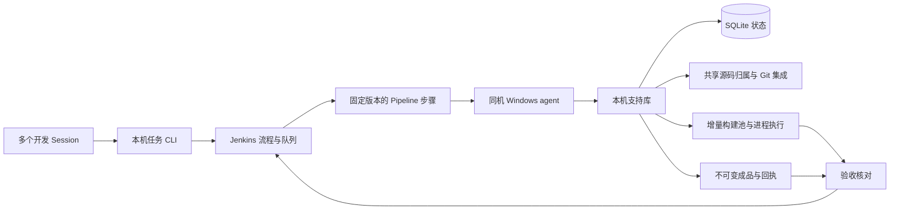
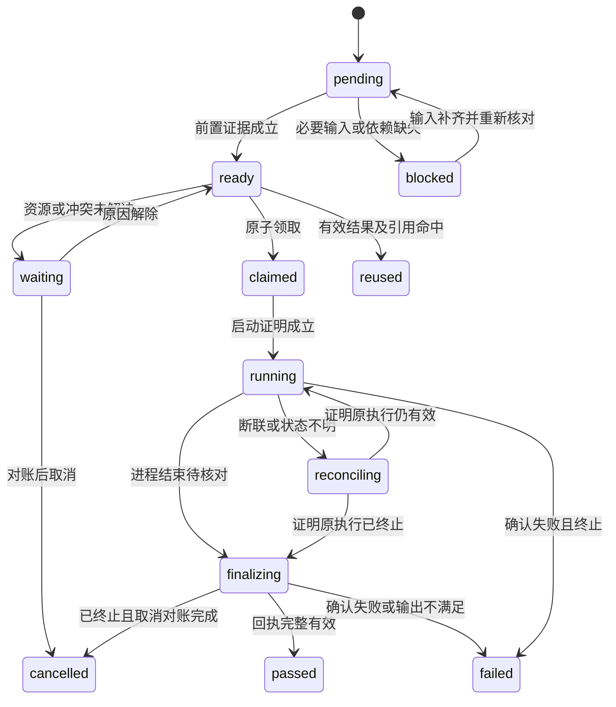

---
related_code:
  - .jenkins/deployment-spec.json
  - .jenkins/workflow-spec.json
  - .jenkins/plugins.lock
  - tools/local_cargo.py
implementation_files: []
planned_implementation_roots:
  - tools/jenkins/
  - .jenkins/pipeline/
plan_sources:
  - "user: 2026-10-02 制定单机 Jenkins 多 Session 协调的详细架构和方案"
  - docs/plans/jenkins-session-coordination/01-single-host-jenkins-coordination.md
tests:
  - docs/plans/milestone-validation-policy.md
  - tools/jenkins_pilot/tests/
doc_type: architecture-detail
status: design-only
architecture_version: 1
created: 2026-10-02
---

# 单机 Jenkins 多 Session 协调架构与实施方案

目标是在有限的 CPU、内存和磁盘资源下缩短正式验收时间。多个 Session 共用一个开发 checkout，由 Jenkins 展示和编排独立步骤；本机支持库负责源码归属、资源准入、增量池、产物索引及正式验收。

本文固定设计边界、操作协议和关键失败行为，实施顺序由[里程碑计划](../plans/jenkins-session-coordination/01-single-host-jenkins-coordination.md)拥有。当前正在实现并验收：工程内 controller、插件与 Windows agent 已运行，支持模块与流程逐阶段集成；正式接受状态以该计划的门槛记录为准。多机器接入、远程调度和跨机器传输暂缓。根据用户 2026-10-04 的最新要求，Jenkins 流水线的构建、临时、缓存、封存输入和产物固定在 `E:\Git\ZirconEngine\.jenkins\builds\zircon-jenkins`；此前 D/E/F 盘根级路径仅保留为历史证据。

## 1. 架构决策与范围

| 决策 | 选定方案 | 原因及实际边界 |
| --- | --- | --- |
| 开发源码 | 一个共享 checkout；修改精确到任务拥有的路径 | 不创建每 Session worktree；不覆盖他人编辑 |
| 验证源码 | 内容封存 + 每兼容池一个稳定输入视图 | 编译不读取持续变化的共享源码；输入视图不是 Git worktree |
| 调度 | Jenkins Pipeline 是唯一派发者 | 支持库只提供短事务、策略和受控执行，不另建后台队列 daemon |
| 状态 | 工程内本机 SQLite，短事务 | 不沿用退役服务数据库执行新任务 |
| 流程 | Scripted Pipeline + 版本固定的步骤文件 | 首版使用现有 workflow-cps；不预设未安装的 Shared Library／Declarative 插件 |
| 构建池 | 按兼容配置保留少量稳定池 | 改动源码复用增量状态；不用 Session ID 或 build number 分 target |
| 结果复用 | 编译产物复用和测试结果复用分开判定 | 相同源码不保证外部环境及运行测试等价 |
| 发布产物 | 选定交付产物按内容唯一存储，任务保存引用 | 避免每次 archive／Session 再复制一份成品 |
| 资源管理 | CPU／内存／磁盘／池写入统一准入 | executor 数不等于可以同时启动的编译数 |
| 失败处理 | 恢复原 attempt，补偿本任务改动 | 不 reset 共享 HEAD，不删除活跃池 |
| 提交与通知 | 两个独立步骤和独立操作记录 | 纯注释只到 Git 提交；消息失败不重做提交 |
| 清理 | 受管引用核对 + 按成本回收 | 不在每次构建后清空增量缓存 |
| 退役边界 | 不恢复或调用旧 runtime | 旧源码与测试只作为提取必要策略的参考 |

单机第一版不引入消息中间件、远程服务、微服务、容器编排或新的 Web 控制台。使用 Jenkins 的阶段、日志和小型结果摘要提供运行入口；复杂决策和扫描放在本机支持库。

`tools/local-cargo.ps1` 在过渡期提供独立命令证据；它不等于 Jenkins 的池管理、资源调度或正式验收。M8 才统一受管入口，不将既有独立结果直接标为 Jenkins accepted。

## 2. 分层、数据流与权威



| 事实 | 唯一权威 | Jenkins 保存的内容 |
| --- | --- | --- |
| 阶段顺序、Pipeline 执行和队列位置 | Jenkins | job／queue／build 及阶段状态 |
| 请求身份、作用域、源码作者与操作授权 | 本机支持状态库 | 引用和可显示摘要 |
| 源码／外部／生成输入的固定内容 | 封存 manifest 和内容对象 | 输入 digest |
| pool writer、资源预约与物理路径 | 支持状态库 + 有效 OS 身份 | 等待原因和预约引用 |
| 是否真正执行、终止和产生指定输出 | 受控执行器及核对后的回执 | 输出摘要和 receipt digest |
| 覆盖是否满足当前候选的验收要求 | 验收模块 | accepted／rejected／pending |
| Git ref、commit、实际共享 index | Git + 集成操作日志 | SHA 与对账结果 |
| 消息是否送达 | 通知记录 + 通道响应 | delivery 状态 |
| 产物能否删除 | 引用图、租约与进程对账结果 | GC 计划和实收空间 |

支持状态记录等待任务仅用于幂等、公平准入和回执投影，不独立选择进程去执行任务。所有派发由 Jenkins 发起，避免旧队列与新队列同时决定同一个 attempt。

Pipeline 变量只持有小型 ID 和摘要；文件 manifest、日志及目录扫描不进入 Groovy CPS 的大对象。步骤调用保留恢复能力，首版选择 `MAX_SURVIVABILITY`。Jenkins 文档说明 Pipeline 的持久化与性能存在取舍，复杂计算适合移到 agent 侧脚本。[Pipeline 持久化与扩展建议](https://www.jenkins.io/doc/book/pipeline/scaling-pipeline/)

## 3. 目录与模块职责

以下是模块所有权与实现目标，存在代码的模块仍须通过对应运行验收：

```text
E:\Git\ZirconEngine\
  .jenkins\
    deployment-spec.json
    workflow-spec.json
    plugins.lock
    plugin-checksums.json
    pipeline\
      zircon-flow.groovy
      zircon-execution.groovy
      zircon-maintenance.groovy
      steps.groovy               # 固定版本 load 的受控步骤
    jenkins_home\               # Jenkins 配置、用户、密钥、任务与历史
    runtime\                    # 专用 Java、WAR、Python 与封存驱动
    agent\                      # 控制工作区；编译进入外部封存输入
    cache\                      # WAR/插件解包及 agent remoting 缓存
    tmp\                        # Jenkins JVM 和运行组件临时目录
    state\                      # 新数据库、输入/操作/验收 metadata、部署身份
    builds\
      zircon-jenkins\            # Jenkins 构建、缓存、临时目录、输入和产物唯一根
    logs\
  tools\jenkins\
    contracts\                  # 版本协议、身份、回执和错误类型
    state\                      # schema、短事务、幂等和事件
    source\                     # 归属、patch、封存、分类、补偿
    workflow\                   # 依赖图、coverage、步骤计划
    resources\                  # 路径、库存、预算、预约和公平策略
    validation\                 # 构建/测试 recipe、范围解析与正式验收
    artifacts\                  # pool、对象、结果复用、引用和 GC
    processes\                  # Windows Job 与原生生命周期
    gitops\                     # 候选 tree、提交、index 对账
    notifications\              # outbox 与送达对账
    deployment\                 # Home、插件、controller/agent 生命周期
    cli.py
```

- `.jenkins/jenkins_home`、`state`、`logs` 和所有密钥不提交 Git；Pipeline 源码与规格为受控输入。
- `.jenkins/.gitignore` 只放行规格、Pipeline 源码、版本与校验清单及说明，运行目录和密钥继续忽略。
- 日志、源码 metadata 与 Git 临时 index 可以在工程状态目录；实际编译、测试生成内容和大型封存 payload 统一进入 `.jenkins\builds\zircon-jenkins`。
- 模块之间传递 contracts 中的 DTO／引用，不访问对方私有表，不导入退役 runtime。
- Python 使用现有受控解释器；每个 CLI 子命令是一项有明确范围的操作，不执行请求中的任意 shell。关闭仓库内 Python bytecode 写入；如启用缓存，物理路径也必须进入批准根。

步骤库、支持库和配置发布为经过核验的固定版本；当前 flow 加载的 driverDigest 在整个执行期间不变。agent 仅取得这份小型受控代码，不运行每次自动 clone 的完整开发工作区，也不从 Session 正在编辑的 Groovy／Python 文件直接加载运行逻辑。修改协调实现本身须先验证，再激活新版本；现有 attempt 保留原版本。

工程 `.jenkins\builds` 下采用独立于旧 coordinator／独立 local-cargo 的新 namespace：

```text
E:\Git\ZirconEngine\.jenkins\builds\zircon-jenkins\
  cache\                        # 编译器或构建依赖缓存，不承载 Jenkins 运行组件
  tmp\                          # 构建进程 TEMP/TMP，不承载 controller/agent
  inputs\objects\<digest>\      # 去重后的输入文件/包；按引用保留
  pools\<pool-id>\
    inputs\                     # 稳定物理路径，持 writer 时才同步
    target\
    build\                      # 工具链实际支持的中间目录
  artifacts\objects\<digest>\   # 需要长期复用的不可变交付产物
  runs\<attempt-id>\            # 有界日志、临时文件及恢复证据
```

该 namespace 是当前 Jenkins 唯一合法构建根；每次路径使用都校验完整绝对路径、全部祖先、实际物理身份与作用域。禁止 junction／symlink 等别名、工程外路径和 D/E/F 盘根级 cargo-targets；不对 `.jenkins\builds` 根目录整体递归清理。池路径在创建时固定，不搬动正在使用的池。旧 D 盘执行回执中的物理路径不得被新请求复用。

## 4. 请求、身份与核心数据模型

### 4.1 提交协议

每个请求携带：

| 字段 | 要求 |
| --- | --- |
| `schemaVersion`、`repositoryId` | 版本固定、仓库真实身份匹配 |
| `sessionId`、`requestId` | 与现有归属／授权记录绑定的作者身份和客户端幂等 ID；不能仅凭请求文字取得归属 |
| `taskKindHint`、`priority` | 仅是提示；优先级限 urgent／fix／ordinary |
| `baseHead`、`ownedPaths` | 候选基线、完整新建／修改／删除路径及 before hash |
| `patchDigest` 或 `candidateDigest` | 封存补丁，或已证明归属的当前候选内容 |
| `requiredCoverage` | 包、target、features、profile、测试／产品需求 |
| `dependsOn` | 必要的其他候选／已接受输入 |
| `requestedActions` | commit／notify／GC 等；与会话持久授权核对 |
| `driverDigest`、`policyVersion` | 使用的可信步骤和策略版本 |

同 `repositoryId + sessionId + requestId` 重复提交同 payload，返回原请求；payload 变化则报 `request_payload_mismatch`，不能悄悄覆盖。

新输入形成新的 `generation`；基础设施恢复仍对账原 attempt，已确认终态后才建立替代 attempt。generation 不是单纯的重试计数。

CLI 先保存 request 及封存引用，再请求 Jenkins 排队。数据库与 Jenkins HTTP 调用不是同一事务：enqueue 超时必须按 requestId 查询原 queue／build，记录不明状态；在无法排除已排队时禁止再次盲目提交。

### 4.2 三种 hash

| 身份 | 包含内容 | 使用方式 |
| --- | --- | --- |
| `SourceDigest` | 完整有效输入闭包，包括基线、dirty/new/deleted、外部及生成输入 | 证明具体编译／校验读到的内容 |
| `PreparationKey` | 工具链／wrapper、平台／target、profile、features、依赖／Cargo 配置及经验证的其他兼容项 | 找兼容的稳定增量池；不含当前源码版本和 Session ID |
| `ExecutionKey` | SourceDigest、完整执行 recipe／环境、coverage、步骤实现与策略版本、必要的 pool 环境约束 | 同一执行合并、精确产物／结果命中 |

首版 PreparationKey 采用保守匹配，不因为“包名一样”就共享不同 feature／profile 池。以后放宽兼容性须有独立证据，不用迁移 wrapper 掩盖失配。

CPU 并行度等进入实际环境的调度参数先绑定并记录；本版只有验证过不影响产物语义的参数才允许从精确身份中排除。结果身份不以参数无关假设换取命中率。

### 4.3 核心表

状态文件为 `.jenkins/state/coordination.sqlite3`。采用 WAL、foreign keys、显式事务与持久化 schemaVersion；写入操作短且有界，扫描、进程等待、网络、哈希及 Git 外部操作都在事务外执行。

| 表 | 主要字段与唯一约束 |
| --- | --- |
| `requests` | repo/session/request 唯一；payloadDigest、generation、Jenkins queue/build、task state |
| `candidates` | candidateDigest、baseHead、owned blob 清单、作者、依赖、sourceDigest |
| `flows`、`stage_runs` | flowDigest、步骤依赖、实现版本；同 request/generation/stage/attempt 唯一 |
| `operations` | operationKey 唯一；准备意图、执行身份、before/expected-after、对账状态 |
| `path_claims` | canonical path、owner、epoch、before/after hash；祖先作用域不能与写入者重叠 |
| `pools`、`pool_holds` | PreparationKey、物理路径、input generation、writer epoch、reader/consumer 保留 |
| `resource_reservations` | owner attempt、CPU 单位、内存上界估计、每盘增量 bytes、状态 |
| `executions`、`consumers` | 同 ExecutionKey 最多一个活跃执行，独立 executionId／Jenkins build；每个任务独立的消费归属 |
| `artifact_objects`、`artifact_refs` | digest、size、path、状态、输入／attempt／accepted／运行引用 |
| `receipts`、`acceptances` | 输入、命令、覆盖、工具版本、进程终态、正式接收结论 |
| `integration_operations`、`notification_outbox` | 预期 HEAD／tree／index、planned SHA；通知 event 和送达状态 |
| `events`、`capacity_publications` | 有界审计事件、生成时刻、完整性、索引 generation、采样来源 |

SQLite 只允许一个同时写事务；采用 `BEGIN IMMEDIATE`、唯一约束及条件更新完成一次准入，busy 则返回可恢复等待。[SQLite 事务规则](https://www.sqlite.org/lang_transaction.html) 数据库事务不能原子涵盖文件、Git 和消息通道，所以 operations 和恢复协议是必需部分。

历史 coordinator 数据库只读保存。新系统不直接继承旧租约／运行标志或重新执行旧队列；历史必要对象须核验身份后显式引入新索引。

## 5. 步骤执行与流程拼接

### 5.1 步骤契约

每个步骤定义 `id`、`implementationDigest`、`inputs`、`requiredReceipts`、`resourceClass`、`actions`、`outputs`、`retryPolicy` 和 `compensationPolicy`。依赖图必须无环，且每个依赖引用具体 input／coverage；不能只判断上一阶段显示绿色。

| 步骤 | 输入／前置条件 | 输出／完成标准 |
| --- | --- | --- |
| patch | 作者归属、before hash、封存补丁 | 本任务 after hash、应用操作 ID、候选 |
| syntax | 固定输入、语言／edition、可信 parser | 解析结果及工具身份；不做隐含类型编译 |
| format | 固定输入与格式策略 | 只读格式结果；自动修复须成为新候选 |
| build | 明确 recipe／覆盖，或复用计划；有效预约 | 实际产物／编译回执与终止证明 |
| test | 指定测试 artifact／运行环境／覆盖 | 发现和执行的测试集合、失败项、终止证明 |
| accept | 所有必要回执及当前候选 | 与输入／作者／覆盖绑定的正式验收 |
| commit | 正式验收、封存 blobs、动作授权 | 当前 HEAD 上正确候选 tree 的 commit 与 index 对账 |
| notify | 已确定事件、目的地与动作授权 | outbox ID、通道回应或明确不明状态 |
| gc | 有效库存、引用、作用域及清理许可 | 实际回收 bytes 与删除／保留理由 |
| recover | 原 operation／attempt、有效 OS 身份 | 对账、继续、拥有改动的补偿或 blocked |

syntax／format 可共用一次工具调用提供的两个事实，但在流程上保留独立阶段和证据。额外语言不得使用正则删注释或 `git diff --check` 代替解析／完整格式检查。

单独运行 test／accept／commit 仍须满足全部前置回执。首版不提供 arbitrary shell 节点、用户自定义 Groovy 或不受控环境变量；拼接只能选注册步骤和核验过的 coverage。

流程组合固定为以下五类，具体 stage ID 与选择条件见 [workflow-spec.json](../../.jenkins/workflow-spec.json)。

| 类型 | 阶段组合 | 条件 |
| --- | --- | --- |
| 纯注释 | patch → syntax → format → accept → commit | 非语义证明成立；不含 notify／GC／Cargo |
| 模块修改 | patch → syntax → format → build → unit_test → accept → commit → notify → gc | build 只取得所需测试／产品产物；没有额外产品需求就不编译产品 target |
| 跨模块修改 | 模块流程在 accept 前加入 integration_test | 包含受影响公共边界与调用方 |
| 失败修复 | 模块流程在 accept 前加入 regression_test，必要时加入 integration_test | 原失败与最低支持层／向上覆盖都必须满足 |
| 缓存维护 | gc | 无源码提交或验收状态变更 |

commit、notify、GC 的执行仍以该请求的动作授权和配置为前置条件；没有所需授权返回明确原因，不能自动代发。notify 和验收后的 GC 没有数据依赖时可以成为独立后续分支，不延长已确定的源码验收耗时。准入前的空间缓解 GC 是另一受管操作。

组合器先解析变更和覆盖，再检查依赖无环、步骤版本、可满足前置回执及副作用授权，生成固定 FlowManifest。语法与格式均通过后才启动昂贵步骤；失败使依赖后代 blocked，独立分支保留已核对结果。被政策省略的步骤记录省略原因；执行成功记 passed，命中已核对结果记 reused，三者不会混写。

### 5.2 状态与恢复



`blocked` 和 `waiting` 是非终态；恢复不创建新源码 generation。`passed`、`reused`、`failed`、`cancelled` 为确定终态；旧成功的输入、步骤或覆盖失配后不能继续沿用。取消运行项先进入 reconciling，不能直接视为资源已释放。

流程里状态不明属于 pending acceptance，不借 Jenkins SUCCESS 提前结束。accepted 之后 notify／GC 的错误单独记录为 operational warning，源码验收和 commit 保持原事实。

### 5.3 Job 与 executor 使用

设置三个固定、可并发的 job，不按 Session 增建 job 或锁住整个主流程：

| Job | 生命周期与责任 |
| --- | --- |
| `zircon-flow` | 一个 request 的可见步骤、轻量校验、消费回执、验收与获准副作用 |
| `zircon-execution` | 一个 executionId 的真实构建／测试及进程生命周期；可供多个 flow 消费 |
| `zircon-maintenance` | 有界库存核验、GC、恢复对账；进入同一资源与引用准入 |

构建与需共享的测试由独立 execution job 承载，不挂在某个 Session flow 的可取消进程树下。flow 在短 control 调用内登记消费者与 enqueue 意图，然后退出 node 等待；execution job 获得 agent 后才申请准入并开始真实工作。即使有重复 enqueue，只有在状态库中成功取得 executionId／epoch 的一个 build 可以执行，其他 build 只对账退出。

安装目标包含 `pipeline-build-step`；共享执行不依赖父 flow 的取消生命周期，首版仍由短 CLI 使用 Jenkins 的认证参数化提交 API；登记 queue／build，超时按 executionId 核对原排队，不盲目重发。私有 API token 不出现在 argv 或日志，保留 CSRF 保护，不以禁用安全检查来接入。[Jenkins Remote Access API](https://www.jenkins.io/doc/book/using/remote-access-api/)、[脚本调用的 CSRF 规则](https://www.jenkins.io/doc/book/security/csrf-protection/)

首版一个同机 Windows agent，controller 零 executor。M1–M5 先以一个编译 writer 运行；M6 可将同机 agent 的可用 executor 调整为经过预算验证的数量，使轻量流程与一个重步骤可共存，不新增远程节点。

Pipeline 仅在执行短 control CLI 或具体步骤时进入 `node`。资源不足的 control 调用返回 `wait + reason + observedGeneration`；退出 node 后使用 Jenkins sleep，下一次再短调用准入。不能在 node 内长轮询等待，也不能申请 CPU／writer 后再等待 agent。

首版资源等待使用有上限、带抖动的退避，不做每个 Session 高频扫描。等待状态保留固定输入引用，不持有 CPU、重步骤 writer 或 Git gate。[Jenkins sleep／stash 的边界](https://www.jenkins.io/doc/pipeline/steps/workflow-basic-steps/)说明 stash 面向小文件且不构成跨 job 产物存储，因此这里只用于小型控制摘要。

## 6. 共享 checkout、源码封存与注释分类

### 6.1 路径归属与补丁

采用新状态库的精确路径归属，不是旧 coordinator lease。路径按真实仓库根、Windows 大小写与目录祖先规范化；无法归属的现有 staged／dirty 文件视为 foreign。

1. Session 提交拥有路径、作者、before／after hash；预先已有编辑须提供可核对归属，不能以“当前看到”宣称拥有。
2. path_claims 在一个短事务中排除同路径及祖先写入冲突；记录 epoch。
3. 应用前重新读取 before hash；不匹配则 needs_rebase，不覆盖共享文件。
4. 文件写入与数据库登记通过 operations 日志对账，原子替换 owned 文件；新增／删除也有 before／after 描述。
5. Session 的后续直接编辑须遵守写入窗口并登记新候选；不合作的编辑只能被 hash 检出，协议不会在操作系统层阻止任意编辑器。
6. 合批期间固定候选，而不是持续读取工作树；外来编辑不会改变正在验证的输入。

不能为了建立新归属而删 OS／Cargo 锁、设置源码只读权限或改变 ACL。新归属过期只触发核验，不能凭时间接管活跃写入。

### 6.2 不可变输入

SourceManifest 记录主仓库 Git base、候选新增／删除、文件内容 hash 与 mode、外部固定 base／mount／payload、生成输入／工具身份。验证视图由明确 base + 本候选 + 已确认依赖候选构成，不自动包含全部 foreign dirty／staged 内容。需要依赖他人未提交修改时，先建立该候选依赖及归属；无法解释的必要输入保持 blocked。捕获与最终 hash 复核之间使用新归属的写入窗口，或在发现变化时有界重试。

依赖闭包包含 Cargo manifests／lockfile／config、相关包与 path dependency 的源码、include 输入、测试 fixtures 和 build script 声明的读入。build script／生成器读入无法证明时扩大封存范围或阻断；不能仅靠 Rust import 图称为完整输入。

不按 Session 复制全仓库。相同文件 payload 按 digest 共享；每个构建池在稳定 inputs 路径同步必要变化、删除已不属于该 manifest 的旧条目，再确认完整 digest。写入池期间不允许运行中的 compiler／test 读取。不得用 hardlink 将可变开发源码与封存输入连在一起。

多个独立 dirty 候选需要不同验证视图时，先排队复用同池；只在资源足够且预计验收时间有收益时增加少量独立池。用户无需额外 worktree，但稳定输入视图及依赖缓存仍有实际空间成本，必须纳入预算。

### 6.3 可信分类与覆盖

| 输入类型 | 轻量检查 | 升级条件 |
| --- | --- | --- |
| Rust | 固定 rustfmt／parser、edition 和 module 根；只读模式 | token／语义变化、doctest、lint 指令、文本嵌入、line/file 敏感宏 |
| Python | ast 解析与已固定 formatter；不导入待检查模块 | 代码 token／生成器行为变化、测试／构建输入 |
| PowerShell | Parser 解析与受控格式规则；不执行脚本 | AST／参数或调用行为变化 |
| JSON／TOML／Markdown | 对应 parser 或结构／链接规则 | Cargo／策略／代码生成配置或嵌入可执行示例变化 |

首版纯注释 recipe 的准入依据是固定 before／after、语法证据、非语义变化证明和输入影响规则；doctest 与含运行语义的 doc 内容进入对应测试流程。疑似注释但无法证明其不会改变运行输入，保持 blocked 或解析为更宽范围。

scope resolver 以变更包、target／features／profile、公共边界与反向调用方形成 CoverageManifest。普通切片不跑整个 workspace；shared root、toolchain、lockfile、ABI 等变化按验证政策扩大范围。修复失败同时列出原回归、最低支持层及需要向上验证的范围。

## 7. 按需构建与测试执行

步骤 recipe 只允许受控 argv 与配置；session 不可注入任意 shell、路径、wrapper、Cargo config 或临时环境覆盖。记录实际 executable 身份、展开的命令、完整环境白名单及 CWD。

产品目标、测试目标和类型检查分别建计划：

- 只需类型／接口检查时选择对应 check；需要运行或提交产品时才选择产品 build。
- 模块单测编译其测试目标及必要依赖，不无条件先编译产品再重新编译测试。
- 单测、集成、doctest 分别记录 coverage；编译目标必须与运行目标相符。
- 使用 Cargo 的机器输出取得实际 compiler artifact 和 executable 路径，工具 adapter 版本固定。
- 执行测试记录 discovery、匹配 filter 的集合、实际运行数、失败与 ignored 项；零测试运行不能满足要求存在的覆盖。
- 首版 libtest 执行采用已核验的 stable adapter；不得默认启用 nightly 专用 JSON 选项。
- 对未验证可分离执行的测试框架，用受管 cargo test 完成，登记其包含的编译阶段；不能为了展示独立 stage 而捏造编译回执。

普通测试 artifact 可在同池中重复运行。其执行期间锁定输入 generation 和所有运行依赖，保留 reader hold；新 writer 不得覆盖 test binary、DLL、fixtures 或稳定 source 视图。测试写出的临时内容强制放 runs 下受管路径；需要写源码的测试必须声明并隔离受管 scratch，不能操作共享开发 checkout。

直接运行测试 binary 时还原 Cargo 对应的包 CWD、动态库查找路径和相关环境，否则不能认为等价。doctest 编译与执行耦合，首版保留 cargo test --doc 的整体受控执行，不强行转成普通 binary。[Cargo 测试模型与工作目录](https://doc.rust-lang.org/cargo/commands/cargo-test.html)

Windows 执行器在开始真实工作前将进程绑定本 attempt 的 Job，记录 PID、birth time 和 supervisor 身份。只信保留句柄与 native Job 证明，不从 PPID 推断所有子孙；retained service／compiler-cache daemon 须有明确独立生命周期，首版优先禁用未归属的持久 helper。结束包括进程终态、Job 活跃进程为零、输出管道 EOF、输出关闭及 lease 对账。[Windows Job Objects](https://learn.microsoft.com/en-us/windows/win32/procthread/job-objects)

## 8. 构建池、产物与结果复用

### 8.1 单写入者与 generation

同一 pool 最多一个 writer。只有 reader holds 全部释放后才能同步下一输入 generation；“另一个模块”不能作为同池并发写入的理由。

池 epoch 的过期会标记 suspect，不能自动允许新 writer。必须证明原 native 执行已终止／不存在，且不能写原物理路径，再递增 epoch。新旧 Pipeline 并发恢复时，在 DB 比较 epoch、原 attempt 和 OS 身份，迟到回执不改变新事实。

初始一池最节省驻留空间；独立只读测试可在同 generation 下按资源预算并行。编译并行只有在增加第二个合法池的空间与延迟收益经测量成立时开启。

### 8.2 可变池与不可变产物

Cargo target 保留增量、依赖、fingerprints、build outputs 和测试所需内容；让 Cargo 按受控输入做正确失效，不从目录文件名自行拼装或跨池搬用未验证 object。[Cargo 构建缓存](https://doc.rust-lang.org/cargo/reference/build-cache.html)

需要长期复用／运行的成品及其 DLL／资源依赖按 ArtifactManifest 发布到内容对象；同 digest 只注册一份 authoritative 成品，多个任务引用。发布采用 provisional → hash 核对 → atomic finalize → registered；跨盘发布预算包含复制与暂存峰值。

为保持 incrementality，可变 pool 中仍可能保留同样输出。这是编译工作集与不可变成品的必要双重驻留，不承诺全磁盘绝无字节副本；统计并控制这一成本。不会为每个 Session／build 生成永久副本，也不把完整 Cargo target 再归档到 Home。

测试专用中间物默认只留在受管热池与运行回执，不全部发布到对象库。若后续任务需要运行旧测试产物，必须有有效 pool generation hold 或已明确发布的运行闭包。池切换后不能凭旧路径继续执行。

禁止将可变 pool 文件 hardlink 为不可变成品；后续编译可能原地修改或替换。首版发布一次必要成品、重复任务仅引用，其余中间数据按池预算管理。

### 8.3 三层复用判定

| 复用层 | 可以复用什么 | 不可省略的核对 |
| --- | --- | --- |
| 精确产物 | 相同完整输入与构建 recipe 的已登记产物 | hash、配置、输入、所需输出完整性、引用状态 |
| 增量准备 | 兼容池的依赖／增量状态 | PreparationKey、真实路径、来源、Cargo 正常失效 |
| 阶段结果 | 在有效性策略内的语法／格式或已证明可重复测试结果 | 工具和策略、coverage、环境、时效、任务需要的现态证据 |

默认复用编译产物，默认重新运行有运行语义的测试。纯粹、固定输入的单测结果只有在 recipe 声明且证明 hermetic、环境和有效期匹配时才允许复用；集成、GPU／产品运行和依赖外部状态的测试要求新运行证据。

正式 accept 总是重新核对候选、覆盖和当前依赖关系。commit／notify／GC 不使用“结果缓存”跳过副作用，只通过 operation ID 对账已经发生的动作。

同 ExecutionKey 的请求先建立独立 execution 和 consumers；execution job 领取唯一 writer，各 flow 释放 executor 等待结果。共享执行失败后所有消费者取得失败／待重试原因，不选取半成品。一个 consumer 取消只解除其引用；所有消费者都取消或无需继续时，才向 execution job 发取消意图并证明 native 终止。主 flow 的 finally 不是释放的唯一证据，重启时维护入口补做对账；管理员直接中止 execution 会明确使所有关联消费者待重试。

### 8.4 单体体积与变体约束

首先拆开统计测试 binary、产品 DLL／EXE、PDB、重复链接和增量中间物的空间。减少体积按顺序实施：缩小必需 targets → 去掉重复永久成品 → 减少未经要求的 feature/profile 变体 → 测量既有开发链接策略 → 为明确用途验证较小 profile。

debug symbols、assertions、incremental、链接方式和 strip 都属于构建身份。正式验收、故障诊断和发布各采用少量固定 recipe；不能在空间不足时自动降级验收 profile。单体瘦身须证明调试／测试功能仍满足其用途，不能以删除 PDB 或跳过覆盖宣称空间收益。

## 9. 单机调度与自适应位置

### 9.1 候选选择

流程先查精确产物／允许的阶段结果，再估算兼容热池；选择的是最早合法完成验收的位置，不单选空闲最多的盘。

估计完成时间 = 当前公平队列等待 + 输入同步 + 预计增量编译 + 所需测试 + 产物登记与验收。冷池还计入依赖恢复／首次编译；已有热池的 byte 增长估计使用对应 package/profile 的真实历史。

每次候选决定产生小型 DecisionReceipt：输入身份、候选池、库存 publication、预算、估计与选择／等待原因。估计缺失时用配置的保守单任务预算，不伪造历史样本。

无合法候选时返回明确原因，例如 `cpu_budget_unavailable`、`memory_budget_unavailable`、`storage_snapshot_stale`、`disk_reservation_insufficient`、`pool_writer_active`、`source_conflict`、`build_root_policy_mismatch`；不得转到 C 盘、repo target、D/E/F 盘根级 cargo-targets 或其他未登记路径。

### 9.2 原子准入与空间核算

1. 事务外取得有界的 OS free bytes、内存／CPU 观察和索引 publication；记录实际采样时刻。
2. DB 短事务核对 request／generation、reader/writer、cleanup scope、库存完整性与有效期及公平资格。
3. 按同一索引 generation 计算每盘可预约增量，再一次性建立 CPU／内存／磁盘／pool holds。
4. 到真正 spawn 前重新验证路径、预约、当前 free bytes 与 observation 有效期；不成立则对账后退回等待。
5. 执行中更新实际占用与预约余额，终态登记后按真实释放结果结束预约。

磁盘核算使用“当前物理 free bytes − 活跃未兑现增量预约 − 安全余量”，不能既扣现存产物又扣已被物理 free 包含的空间，也不能忽略多个并行申请的未来增长。source 同步、发布复制和日志增长同样计入阶段预算。

reservation 与实际写入不是 OS 层绝对配额。若其他程序抢占空间或估算偏低，重新采样后暂停新 admission，按已定义策略结束／取消本系统拥有的工作；不杀其他 Session，不放宽 freshness 或删未知对象硬凑容量。

### 9.3 CPU、内存、公平与 I/O

CPU 预算同时约束 Cargo jobs、rustc/linker、测试线程和获准缓存 helper，不能每个任务都取整机核数。预算属于 admission 上限，不声称等于整个系统实测 CPU 的硬限额。

为前台开发和 OS 保留配置余量；内存根据编译／链接峰值历史保守估计，缺失数据先串行校准。CPU 高压减少新 work 的并发和下一次 recipe 的 jobs；运行中的 recipe 不被静默改写。磁盘 I/O 饱和时延迟 GC 与冷池创建，避免增加更多扫描和拷贝。

公平策略保留 urgent／fix／ordinary、持久化 enqueue 时间、老化和有界连续优先启动数。最短估计用于当前公平类别内选择，不允许不断进入的短任务永久饿死长任务。被磁盘／writer 阻断的项不扣一次成功派发额度，也不阻挡其他合法资源上的独立任务。

controller、短 control CLI 和轻校验也有自身预算。等待不得长期占 executor；M6 在同机增加经过预算验证的执行机会用于轻量阶段，编译 writer 数仍独立控制。

### 9.4 资源不足时的次序

| 情况 | 动作 |
| --- | --- |
| 精确产物存在 | 取得合法引用，省掉重复构建；按策略执行必需测试 |
| 热池合法且有增量容量 | 同池同步必要变化并增量执行 |
| 热池盘不足，其他批准盘可更早完成 | 创建新兼容池；保留原热池，空间及重建成本计入决策 |
| 可安全回收对象足够 | 调度有界 GC，然后取得新 publication 再准入 |
| CPU／内存不足 | 等待或降低下一 recipe 的并行度；不复制额外 target 解决 CPU 问题 |
| 库存不完整、陈旧或所有盘均不足 | 保留 pending 和等待原因；保持安全边界 |

冷池创建与 GC 的顺序不是固定胜过热池；实际选择按合法性和预计验收时间比较，禁止以规则表直接绕过原子准入。

## 10. 引用管理、库存与 GC

ArtifactRefs 至少包括：pending request／input、正在运行、pool reader/writer、消费者持有、accepted／运行产品保留、恢复证据保留。accepted 成品保留期限和显式释放事件归验收记录；过期不是无条件删除通知。

库存采用注册路径与受控写入的增量索引；有界后台核验由 Jenkins 维护 job 驱动，不在每次 CLI 或 DB writer 内全盘递归扫描。publication 包含采样和生成时间、complete、sourceGeneration 和失败原因；重读旧 snapshot 不能刷新其采样时刻或有效期。

未知旧 root、foreign 产物、未归属缓存 daemon、打不开的文件或身份不明的 native owner 保留，不计作立即可回收容量。范围重叠按物理祖先／子孙关系判断，不能用字符串前缀或“不同 request”绕开。

清理协议：

1. 依据当前引用和重建成本形成有界候选；不持 DB 锁做哈希或递归扫描。
2. 短事务复核引用、OS 身份、generation 和 scope，标记 deleting；新 reader／writer 禁止取得这些对象。
3. 在明确的新 namespace 内检查目标物理路径，再执行删除。
4. 核验实际 bytes／剩余内容并登记 tombstone；失败保留 deleting/error，后续对账后恢复或继续。
5. 发布新有效容量，等待任务重新申请。

排序先处理无人引用的终态 scratch／多余输入，再处理冷成品和中间状态；比较实际可释放空间、重建秒数与预期复用。热增量池不因每次任务成功而清空。GC 失败只影响维护／后续准入，不撤销已经 accepted 的源码。

## 11. Git 集成、合批与回滚

### 11.1 候选 tree 与共享 index

每个候选保存准确 base tree、owned blob／mode／删除、作者及正式验收指纹。Git 提交不运行全局 `git add -A`，不把 foreign staged／dirty 当成本任务内容。

1. 在仓库级集成 gate 下读取当前 HEAD、候选、共享 index 与持有归属。
2. 用独立 `GIT_INDEX_FILE` 构造“当前 HEAD + 获准候选”的 tree，避免构造过程中改真实 index；不使用真实 index 的 `--index-output` 代替独立 index。
3. 核对候选 tree 所对应的受影响输入／coverage 与验收完全匹配；HEAD 变化影响证据则退出 gate，重新封存／排队验证，不能拿旧验收直接提交。
4. 将 planned tree／commit、expected old HEAD、共享 index before／expected-after 和操作 ID 写入 journal。
5. 按 Git 原生 index lock 协议准备只更新 owned entries 的新 index，保留 foreign entry 的 OID、mode、stage 和必要 flags；owned 路径已有 foreign staging 或 unmerged 状态则 blocked。
6. 通过 expected old SHA 的 ref 更新和 index 发布完成集成；外来 ref 变化使本次 CAS 失败。
7. 对账 HEAD、planned commit 和 index 后登记 commit receipt；保留工作树后续编辑，不 checkout 覆盖它们。

HEAD ref 与 index 是两个持久化对象，不能宣称事务原子覆盖。崩溃后 journal 区分“尚未更新”“ref 已更新、index 待完成”“外来变化阻止恢复”。在不明状态阻断本仓库新集成；只能凭 before／after 核验完成 owned 操作，不盲目回退 HEAD 或删 native lock。

[Git 的 GIT_INDEX_FILE](https://git-scm.com/docs/git#Documentation/git.txt-GITINDEXFILE)定义独立 index 文件，[read-tree](https://git-scm.com/docs/git-read-tree)定义 tree 读入方式；[Git update-ref](https://git-scm.com/docs/git-update-ref)支持按 old OID 检查更新 ref。实际 finalizer 的 shared-index 协议须通过崩溃与 foreign staging 测试后才能启用。

### 11.2 合批不等于逐项都已验收

不同 Session 的候选只有在依赖、作者、覆盖和输入兼容后才能进入 BatchManifest。最终 union tree 通过测试，并不证明每个未含其他候选的子集／中间 commit 已通过。

首版成功合批采用一个 combined integration unit，保留每个候选归属与 co-author／任务映射，并为各消费者签发带 union 依赖的正式回执。若产品规则要求分开独立 commit，则验证实际要发布的各 candidate／prefix tree；不能拿一次 union 测试给所有中间态签验收。

测试失败保留 union 输入，先检查最低共享支持层，再进行有预算上限的定位。只重新执行定位所需部分，不重复整批历史，也不自动撤回已证明独立通过的外来候选。

### 11.3 失败项目补偿

| 失败点 | 处理 |
| --- | --- |
| patch 尚未应用 | 取消／rebase；共享文件不变 |
| 本任务已应用，syntax／format／build／test 失败 | 阻断 accept／commit；证明 terminal 后按 scoped policy 补偿本任务 |
| 本任务路径有后续 foreign 编辑 | blocked compensation，保留失败和当前内容；禁止覆盖 |
| commit 行为超时／返回不明 | 按 planned SHA／ref／index 对账，不能重复盲提交 |
| 已确认 commit 后需要撤销 | 单独获准的 forward revert，重新验收影响范围 |
| notify 或 post-accept GC 失败 | 只重试对应操作，accepted 与 commit 保持原事实 |

前后 hash 的比较必须覆盖删除、新增及重命名；hunk 补偿只有在同文件并发已可证明分离时允许。首版文件级冲突优先 blocked，不以自动 merge 对安全做猜测。

## 12. 通知、取消和故障恢复

notify outbox 以 `eventId + destinationId` 幂等登记，发送意图、响应和不明状态分开保存。不是数据库提交后必然只发送一次；外部 webhook 超时无法判断是否收到时，先对账或明确记录需处置，不能自动重提 Git。

提交步骤不会隐式发送通知，纯注释模板不含 notify／GC。失败消息需有已有的明确授权和配置目的地；秘密仅从私有配置读取，不出现在 command、receipt 或日志。Git push 是另一项外部动作，首版流程未默认包含它。

恢复规则：

| 场景 | 对账和释放条件 |
| --- | --- |
| Jenkins controller 重启 | 原 request/queue/build/stage/attempt，核对原 runner 与 receipt，再决定继续 |
| agent 断联 | 原 Job 与进程身份先标不明，保留 writer／运行引用，不启动同池新工作 |
| runner 崩溃 | 明确 Job 归属与终止；输出未核对不得接受 |
| pid 重用 | 比较 birth time 和保留身份，不杀同号新进程 |
| 运行取消 | 终止本 attempt 的 native Job，确认子进程零活跃／EOF 后登记 cancelled |
| reservation 心跳过期 | suspect → native 对账；不是 TTL 到期即可回收 |
| 恢复时发现源码／步骤版本不同 | 旧回执不能驱动新输入；必要时新 generation 并失效后续 |
| SQLite／磁盘错误 | 停止新派发和写入，保持现有执行保护；恢复状态一致性后再处理 |

执行宿主启动前绑定具名外层 Job，并将阶段子进程成员身份绑定到该 guard。命令主进程退出后清理本阶段自有残留进程，核验全树终止及 EOF 后才发布输出。外层 guard 证明可用于宿主崩溃后的失败恢复，不能替代阶段成功回执；遗失证明时保护预约和构建池。跨真实 Windows 重启的恢复要求全部旧进程出生时间早于当前系统启动时间，仅生成失败或中断证据，不补造成功或 native EOF 回执。

部署重试同样不以 `failed`／`stopped` 标签作为终止证据。正常重新启动须验证同 Home、operation／generation 下各已启动组件的原生全树终止和 EOF；agent 未尝试启动必须有明确的持久化记录。未明实例保持保护，跨启动边界只核验实际启动过的组件身份，不能把缺失身份当作尚未启动。

本机 runner 的活跃 heartbeat 只描述已启动执行，不作为独立调度器。健康采样和 reconcile 由当前 Pipeline 或 Jenkins 维护入口调用。控制器仍在线但本机支持层不可用时，Pipeline 保持 pending，不放行直接 Cargo 规避保护。

## 13. 配置、协议与可观测输出

部署／策略分离，并且启动或步骤选择前验证：

| 配置域 | 必须包含的内容 |
| --- | --- |
| deployment | repo 真根、Home／state、host/port、Java/WAR/plugin 版本及校验、agent 路径 |
| storage | 严格批准物理根、新 namespace、状态余量、容量时效、输出闭包和 alias 拒绝 |
| resource | 编译 writer 上限、轻任务预算、CPU／内存余量、jobs／测试线程、增量空间估计规则 |
| pool | 已批准兼容配置、允许池数量／驻留上限、创建与换盘条件 |
| flow | 注册步骤、模板、coverage resolver、每步版本、可用授权动作 |
| reuse | 各 recipe 的 artifact／result 条件、test 新鲜度、结果有效期 |
| retention | 输入、scratch、accepted 成品、调试符号、失败证据保留与释放条件 |
| recovery | 有界超时、对账与重试、原生进程身份证据、操作不明处理 |

配置更改形成新 policyVersion；已有 attempt 使用原配置或明确 drain 后迁移。新配置不回写已完成 receipt。首版不填写未测量的速度倍数或动态并发默认值；从单 writer、保守预算逐步校准。

CLI 操作族固定为：request 提交／查询／取消；candidate 封存；flow 规划；admission 申请；stage 执行；receipt 对账；accept 验收；integration 提交／恢复；notification 对账；artifact 引用／GC；deployment 管理。输入用 JSON 文件或结构化参数，不在 shell 拼接用户文本。

统一响应包括 `schemaVersion`、`requestId`、`operationId`、`status`、`reasonCode`、`retryable`、`receiptRef`、`observedGeneration`。wait/blocked 不是通过；HTTP／CLI 成功表示操作已受理或已对账，不等于正式接受。

receipt 至少保留实际输入／实现／命令／环境／coverage digests、作者／消费者、执行或 reuse 来源、产物 manifest、时间分段和 native 终止证明。验收模块核对状态库中可信 producer 与 immutable object，不接受任意 request 上传的“成功 JSON”。

Jenkins 阶段摘要展示 Session、选择的模板／coverage、wait reason、pool/drive、资源预约、复用来源、测试执行数、验收结论、commit／消息／清理状态。数据库和日志有界；复杂历史读取不扫描所有大 JSON 文件。

## 14. 验证、实施映射与设计完成条件

| 设计边界 | 对应里程碑 | 必须通过的证据 |
| --- | --- | --- |
| 新状态／归属／路径／操作协议 | M0–M1 | 退役隔离、重复请求、并发冲突、路径别名与崩溃对账 |
| 实际部署与 agent | M2 | Home／所有 temp/cache 的有效路径、插件状态、真实轻任务与重启 |
| 步骤／DAG／注释／轻量 accept | M3 | 五步流程零 Cargo、零通知；doctest／line 敏感注释正确升级 |
| coverage 与执行器 | M4 | 模块与调用方回归完整、零测试拒绝、doctest、DLL/CWD 正确 |
| 可变池／成品／reuse | M5 | 单 writer、reader 保护、hash 损坏、旧路径失效、精确／增量区分 |
| admission／公平／GC | M6 | 同时申请与空间增长、陈旧库存、GC 竞争、CPU／内存高压、不误删 |
| multi-Session／Git／恢复 | M7 | 单消费者取消不终止共享执行、union/prefix 验收、foreign staging、ref/index 崩溃、迟到回执、补偿保护 |
| 唯一入口／效能／回退 | M8 | 所有调用方、五类模式、等价样本比较、已有状态和配置回退 |

实施时的结构检查、回归、产品验证与状态记录遵循[验证政策](../plans/milestone-validation-policy.md)和里程碑计划。每个阶段按声明批次验证，支持层失败先修最低原因，不靠上层旁路通过。

关键效能测量覆盖 cold、warm、exact artifact、source increment、多 Session 合批、CPU 与磁盘压力。必须区分产物复用与测试重跑；报告 input/config/coverage、样本数、prepare/queue/compile/test/accept 耗时、peak/resident bytes、重建成本和公平等待。

最终实现通过条件是：共享源码无 foreign 覆盖、同池无双 writer、任务归属可追溯、验收与发布 tree 一致、等待不占重资源、所有编译路径合法、运行及 GC 无活跃引用误释放，并存在相同覆盖下可复核的时间／空间收益。设计文档与静态校验不构成这些运行结论。
