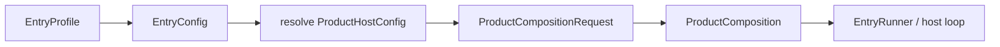

---
related_code:
  - zircon_app/src/lib.rs
  - zircon_app/src/entry/mod.rs
  - zircon_app/src/entry/entry_profile.rs
  - zircon_app/src/entry/entry_runner/mod.rs
  - zircon_app/src/entry/entry_runner/runtime.rs
  - zircon_app/src/entry/entry_runner/editor.rs
  - zircon_app/src/entry/entry_runner/headless.rs
implementation_files:
  - zircon_app/src/entry/entry_profile.rs
  - zircon_app/src/entry/entry_runner/mod.rs
plan_sources:
  - user: 2026-09-09 扩展 zircon_app 公开接口、机制案例、教程和最佳实践
tests:
  - zircon_app/src/entry/tests/profile_bootstrap
  - zircon_app/src/entry/tests/runtime_entry_source_guards
  - zircon_app/src/entry/entry_runner/editor/tests
doc_type: module-detail
---

# EntryProfile、EntryConfig 与 EntryRunner

本页是 `zircon_app` 入口 API 的参考手册。它回答三个问题：产品以哪种身份运行、启动前如何构造不可变配置、哪个 runner 接管宿主循环。入口层只负责“把产品带到可运行状态”，不负责实现 ECS、渲染图或编辑器业务。

## 1. 入口模型



`EntryProfile` 是最小选择集，当前枚举为 `Editor`、`Runtime`、`Headless`。更细的目标身份由 `ProductRoleRequest` 表示，例如 `EditorPlayChild`、`Commandlet` 或 `Embedded`。不要把 `EntryProfile::Runtime` 当作“所有桌面客户端”的完整能力描述；真正的窗口、输入、渲染和关闭策略来自解析后的角色描述。

## 2. EntryProfile

| 变体 | 默认角色 | 典型 runner | 适用场景 |
| --- | --- | --- | --- |
| `Editor` | `EditorHost` | retained editor host | 编辑器工作台、项目浏览、Play 子会话 |
| `Runtime` | `DesktopClient` | desktop event loop | 独立桌面游戏或工具 |
| `Headless` | `Server` | headless schedule | CI、服务器、命令行烘焙 |

该枚举实现 `Clone + Copy + Debug + PartialEq + Eq`，因此适合放在静态产品矩阵或命令行解析结果中。它不承诺目标平台；例如 `Runtime` 可以进一步解析为 Windows、Linux 或 macOS 桌面目标。

## 3. EntryConfig 构造

```rust
use zircon_app::{EntryConfig, EntryProfile, ProductRoleRequest};
use zircon_runtime::core::framework::project::RuntimeProfileId;

let config = EntryConfig::new(EntryProfile::Runtime)
    .with_runtime_profile(RuntimeProfileId::Client3d)
    .with_target_mode(/* RuntimeTargetMode::ClientRuntime */);

let server = EntryConfig::for_product_role(ProductRoleRequest::Server)
    .with_runtime_profile(RuntimeProfileId::Server);
```

公开构造器及其语义如下：

| API | 输入 | 行为 | 注意事项 |
| --- | --- | --- | --- |
| `EntryConfig::new(profile)` | `EntryProfile` | 按 profile 建立未解析请求 | 不会加载插件或启动线程 |
| `EntryConfig::for_product_role(role)` | `ProductRoleRequest` | 直接按产品角色建立请求 | 适合 Web、移动、嵌入式目标 |
| `EntryConfig::for_runtime_profile(id)` | `RuntimeProfileId` | 从运行时 profile 推导角色 | profile 与平台仍可被后续覆盖 |
| `with_runtime_profile(id)` | `RuntimeProfileId` | 覆盖运行时 profile | 最后一次调用生效 |
| `with_target_mode(mode)` | `RuntimeTargetMode` | 指定 Editor/Client/Server 模式 | 与角色能力矩阵一起校验 |
| `with_required_runtime_plugins(ids)` | `AsRef<[RuntimePluginId]>` | 声明必须存在的插件 | 任一缺失会使组合失败 |
| `with_optional_runtime_plugins(ids)` | 同上 | 声明可降级插件 | 缺失会记录 availability，而非必然失败 |
| `with_runtime_plugins(required, optional)` | 两组 ID | 同时设置两组插件 | 用于一次性构造配置 |
| `with_project_plugins(manifest)` | `ProjectPluginManifest` | 注入项目插件清单 | 清单本身不等于已加载 |
| `with_export_profile(profile)` | `ExportProfile` | 绑定导出目标和打包身份 | 通常由导出 bootstrap 调用 |
| `with_render_profile(bundle)` | `RenderProfileBundle` | 选择渲染 profile | 后续由渲染模块消费 |
| `with_window_descriptor(desc)` | `WindowDescriptor` | 指定首个窗口属性 | Headless 角色会按能力策略拒绝或忽略 |
| `with_editor_enabled_subsystems(ids)` | 字符串迭代器 | 约束编辑器子系统 | 仅 Editor 角色有效 |
| `with_editor_runtime_sandbox_enabled(bool)` | 布尔值 | 控制编辑器运行时沙箱 | 解析后可通过 getter 查询 |

### 配置所有权规则

`EntryConfig` 是值类型，builder 方法按值返回 `Self`，适合链式构造。构造阶段允许互相矛盾的字段；约束集中在 `resolve()`，这样可以一次性返回完整错误而不是在每个 setter 中重复平台判断。调用者应把配置视为“请求”，不要在多个线程间复制后分别解析。

## 4. 解析与诊断

`EntryConfig::resolve()` 返回 `Result<ResolvedProductHostConfig, ProductHostConfigError>`。`zircon_app` 内部的 `resolve_product_host_config` 会把该错误映射为 `CoreError::Initialization("zircon_app product host config", ...)`。解析结果包含：角色描述、EntryProfile、RuntimeProfile、目标模式、平台目标、项目插件、导出 profile、渲染 profile、窗口描述、编辑器开关和 provenance。

```rust
let resolved = config.resolve()?;
assert_eq!(resolved.profile(), EntryProfile::Runtime);
println!("runner = {}", resolved.role_descriptor().runner_kind().as_str());
println!("source = {:?}", resolved.provenance().runtime_profile());
```

解析成功并不代表动态 runtime library 已存在；它只证明产品边界能够生成一致的模块组合请求。加载动态库和创建会话属于后续阶段。

## 5. EntryRunner API

`EntryRunner` 是无状态的 `Debug + Default` 类型。公开方法按 feature gate 划分：

```rust
use zircon_app::EntryRunner;

EntryRunner::run_runtime()?;
EntryRunner::run_runtime_with_args(["--project", "examples/demo"])?;
```

| API | feature | 返回 | 说明 |
| --- | --- | --- | --- |
| `run_runtime()` | `platform-winit` | `Result<(), Box<dyn Error>>` | 无额外参数启动桌面 runtime |
| `run_runtime_with_args<I,S>(args)` | `platform-winit` | 同上 | 解析诊断、项目、Play 和退出参数 |
| `run_editor()` | `target-editor-host` | 同上 | 启动 retained editor host |
| `run_editor_with_args<I,S>(args)` | `target-editor-host` | 同上 | 编辑器参数解析入口 |
| `run_editor_with_args_exit_code<I,S>(args)` | `target-editor-host` | `Result<u8, ...>` | 将产品失败映射为进程退出码 |
| `run_headless()` | `diagnostic-log` | `Result<(), Box<dyn Error>>` | 使用默认 `HeadlessController` 的无参数 headless 调度；内部会丢弃运行报告 |
| `run_headless_with_args<I,S>(args, controller)` | `diagnostic-log` | `Result<HeadlessRunReport, Box<dyn Error>>` | 使用调用方提供的 `HeadlessController`，返回完整 headless 运行报告 |

`run_headless_with_args` 的第二个参数不是可选配置，而是用于取消、优雅关闭 deadline 和运行时销毁协调的 `HeadlessController`。调用方应保留同一个 controller 以便信号处理器或宿主线程发出停止请求：

```rust
use zircon_app::{EntryRunner, HeadlessController, HeadlessRunReport};

fn run_server(args: Vec<String>) -> Result<HeadlessRunReport, Box<dyn std::error::Error>> {
    let controller = HeadlessController::default();
    EntryRunner::run_headless_with_args(args, controller)
}

fn run_server_without_report() -> Result<(), Box<dyn std::error::Error>> {
    // 便捷入口内部创建默认 controller，并将 HeadlessRunReport 映射为 unit。
    EntryRunner::run_headless()
}
```

### Runtime 参数与环境变量

运行时入口会拒绝未知参数，并在 `--play-scene`、`--play-report-pipe` 没有项目根时返回参数错误。常用环境变量：

| 变量 | 值 | 作用 |
| --- | --- | --- |
| `ZIRCON_RUNTIME_EXIT_AFTER_FIRST_FRAME` | 非空 | 在首个 presented frame 后退出 |
| `ZIRCON_RUNTIME_EXIT_AFTER_PRESENTED_FRAMES` | 正整数 | 达到帧数后退出 |
| `ZIRCON_RUNTIME_CAPTURE_FRAME_PNG` | PNG 路径 | 保存首帧 capture |
| `ZIRCON_RUNTIME_LIBRARY` | 路径 | 覆盖 runtime 动态库发现位置 |

相对路径以解析后的项目根或产品可执行文件为基准；空字符串、非 UTF-8 帧数和零帧数都会在启动阶段失败。

## 6. 启动顺序

1. 解析诊断和 runtime 参数。
2. 规范化项目根，校验 `project.toml`。
3. 解析 frame capture 和退出帧数。
4. 初始化日志/可选 profiling。
5. 加载 runtime library 并校验 API 表。
6. 创建 `winit::EventLoop` 与 wake registration。
7. 创建 `RuntimeSession`。
8. 构造 `RuntimeEntryApp`，进入宿主事件循环。
9. 结束后先销毁 session，再关闭 library 和产品组合。

任何阶段失败都会尝试发送 Play `start-failed` 记录，并将组件、请求、原因和恢复建议写入错误文本。不要在外层重新包装成无上下文的 `anyhow!("startup failed")`。

## 7. 编辑器与 Headless 差异

编辑器 runner 保留宿主组合，支持项目自动化、Play 子进程和显式 `close()`；Headless runner 使用 `HeadlessController` 控制取消、优雅关闭 deadline 与 destroy receipt。Runtime runner 则把窗口事件、surface present 和 wake proxy 绑定在同一 event loop 线程。

## 8. 与其他引擎的迁移提示

虚幻通常将 `FEngineLoop::PreInit/Init/Exit` 作为全局生命周期；Zircon 将同一职责拆成 `EntryConfig -> ProductComposition -> EntryRunner`，因此配置和运行循环可测试、可替换。Fyrox 的 `Engine::new` 常直接取得窗口和场景；Zircon 要求先完成宿主能力准入，再创建 runtime session。Piccolo 的 VM host 偏向显式 `Context` 注入，Zircon 的等价物是 `ProductComposition` 持有 owner set。

## 9. 常见错误

| 症状 | 原因 | 修复 |
| --- | --- | --- |
| `unknown runtime argument` | 参数未被当前 runner 接受 | 先调用 `--help`，删除自定义参数或在上层解析 |
| `project root is invalid` | 路径不存在或不是目录 | 使用物理路径或含 manifest 的目录 |
| `missing project manifest` | 根目录没有项目 manifest | 补齐 `project.toml`，不要只传 `assets/` |
| `runtime library loading failed` | 动态库未随产品部署 | 检查 `ZIRCON_RUNTIME_LIBRARY` 和 BuildSet |
| Play 报告停在 `starting` | stdout outlet 不可写或子进程被终止 | 检查 editor child-output pump |
| 首帧 PNG 失败 | 路径为空/不可写 | 使用绝对或项目根相对可写路径 |

## 10. 最佳实践清单

- 将 `EntryConfig` 构造集中在一个产品工厂，避免不同 bin 产生不同默认值。
- 在调用 `compose()` 前输出 `module_selection_diagnostics()`，把失败定位在组合阶段。
- 为 CI 使用 `Headless`，不要通过隐藏窗口模拟无头运行。
- 把 runner 的 `Box<dyn Error>` 原样交给进程边界，保留 `component/request/cause/recovery` 字段。
- 只在 `platform-winit`、`target-editor-host` 或 `diagnostic-log` 对应 feature 开启时调用相关 API。
- 将 `ZIRCON_RUNTIME_EXIT_AFTER_PRESENTED_FRAMES=1` 作为图形烟测，而不是生产默认值。

## 11. 验证与源代码

- 入口导出面：`zircon_app/src/lib.rs`、`zircon_app/src/entry/mod.rs`。
- 运行时参数和阶段错误：`zircon_app/src/entry/entry_runner/runtime.rs`。
- 编辑器参数和 retained host：`zircon_app/src/entry/entry_runner/editor.rs`。
- Profile bootstrap：`zircon_app/src/entry/tests/profile_bootstrap`。
- Source guard：`zircon_app/src/entry/tests/runtime_entry_source_guards`。

## 12. API 调用决策表

| 目标 | 首选入口 | 不应调用 |
| --- | --- | --- |
| 正常桌面产品 | `EntryRunner::run_runtime_with_args` | 直接构造 `RuntimeEntryApp` |
| 编辑器 | `EntryRunner::run_editor_with_args` | 把 editor 当 Runtime profile |
| CI/服务器 | `EntryRunner::run_headless_with_args` | 隐藏桌面窗口 |
| 导出产品 | `bootstrap_export_runtime` | 重新拼接插件报告 |
| 嵌入宿主 | `ProductCompositionRequest` + HostProvided role | 假设 App 拥有外部窗口 |

## 13. 参数解析的边界

runtime runner 将诊断日志参数与 runtime session 参数分两次解析。第一阶段处理日志 filter；第二阶段处理 project、profile、play scene 和 play report pipe。编辑器 runner 有自己的 GUI/startup 参数，不要把 runtime 参数转发给 editor。

`run_*_with_args` 接受 `IntoIterator<Item = S>`，其中 `S: Into<String>`。这使得 `Vec<&str>`、`Vec<String>` 和迭代器都可用，但调用者仍要保证参数生命周期覆盖调用表达式。

## 14. 项目根规范化

runtime 入口接受项目目录或 manifest 路径。`ProjectPaths::resolve_existing` 会把 alias、junction、SUBST 和 symbolic link 统一到 physical identity；若传入 manifest 文件，入口取其 parent。目录必须存在且包含 `PROJECT_MANIFEST_FILE`。

```text
requested path -> resolve_existing -> operation path
                -> manifest-file? parent : directory
                -> project.toml exists?
```

因此日志中的 display path 可能与用户输入不同，这是为了保证跨模块资源缓存使用同一 identity，不是路径被静默改写。

## 15. Play 启动报告

当配置了 `--play-report-pipe`，runner 会输出 newline-delimited record：

```text
zircon_play_report outlet=<name> phase=starting detail=profile=...
zircon_play_report outlet=<name> phase=ready detail=...
zircon_play_report outlet=<name> phase=terminal detail=...
```

detail 中的换行和回车会被替换为空格，保证父进程按行读取不会被注入额外记录。报告写入失败会进入 failure ledger，不应通过 `println!` 旁路发送。

## 16. Feature gate 矩阵

| gate | 暴露内容 | 关闭后的结果 |
| --- | --- | --- |
| `platform-winit` | runtime app、窗口、输入、surface | 只能使用非桌面组合 |
| `target-editor-host` | editor runner、EditorApplicationComposition | editor API 不导出 |
| `diagnostic-log` | headless runner、诊断参数 | headless CLI 不导出 |
| `profiling` | 环境变量 profile capture | 不采集 profiling |
| `profiling-tracy` | Tracy sink 初始化 | 使用其他或无 sink |

编写跨平台 library 时，用条件编译保护导入；不要为了让单个平台编译通过而把 feature gate 删除。

## 17. 测试策略

入口测试应分三层：

1. 纯参数/路径解析测试，覆盖空值、非 UTF-8、非法数字。
2. source guard，断言 event loop、window、surface、teardown 的结构边界。
3. 进程级生命周期测试，验证诊断日志和退出码。

首帧 smoke test 建议同时设置 `ZIRCON_RUNTIME_EXIT_AFTER_PRESENTED_FRAMES=1` 和 capture path，检查退出成功、PNG 存在、terminal report 完整。

## 18. 入口迁移清单

- [ ] 选择 `EntryProfile` 或 `ProductRoleRequest`。
- [ ] 只在一个工厂里构造 `EntryConfig`。
- [ ] 为 required/optional plugins 分类。
- [ ] 对项目根调用解析 API，不自行 canonicalize。
- [ ] 先生成 module selection report。
- [ ] 确认 feature gate 和目标平台匹配。
- [ ] 通过合适的 runner 启动。
- [ ] 保存 composition/session owner 到退出。
- [ ] 将失败文本和退出码交给产品边界。
