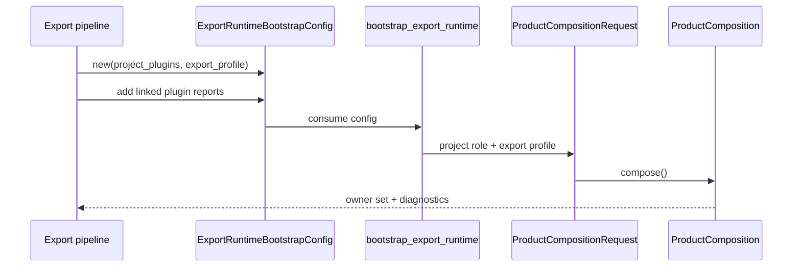

---
related_code:
  - zircon_app/src/entry/export_bootstrap.rs
  - zircon_app/src/entry/product_composition/request.rs
  - zircon_app/src/entry/product_host_config/product_artifact_manifest.rs
  - zircon_app/src/entry/product_host_config/product_role_request.rs
  - zircon_app/src/entry/tests/export_bootstrap.rs
implementation_files:
  - zircon_app/src/entry/export_bootstrap.rs
  - zircon_app/src/entry/product_composition/request.rs
plan_sources:
  - user: 2026-09-09 扩展 zircon_app 公开接口、机制案例、教程和最佳实践
tests:
  - zircon_app/src/entry/tests/export_bootstrap.rs
  - zircon_app/src/entry/tests/profile_bootstrap/first_party_runtime_plugins.rs
doc_type: workflow-detail
---

# 导出启动、产物发现与分发

导出产品需要把项目插件清单、目标平台、运行模式和已链接插件报告固化为一份 receipt，再由 `zircon_app` 重建 ProductComposition。导出 API 让生成的产品与手写产品使用同一套能力准入和 teardown 规则。

## 导出流程



## ExportRuntimeBootstrapConfig

```rust
use zircon_app::{ExportRuntimeBootstrapConfig, bootstrap_export_runtime};

let config = ExportRuntimeBootstrapConfig::new(project_plugins, export_profile)
    .with_runtime_plugin_registrations(registrations)
    .with_runtime_plugin_feature_registrations(features);
let composition = bootstrap_export_runtime(config)?;
```

构造器和 builder：

| API | 作用 |
| --- | --- |
| `new(ProjectPluginManifest, ExportProfile)` | 建立导出身份和插件清单 |
| `with_native_plugin_artifact_authority(authority)` | 授权可加载 native artifact |
| `with_runtime_plugin_registrations(iter)` | 添加已物化 runtime plugin reports |
| `with_runtime_plugin_registration_providers(iter)` | 延迟调用 provider 函数并收集 reports |
| `with_runtime_plugin_feature_registrations(iter)` | 添加 feature reports |
| `with_runtime_plugin_feature_registration_providers(iter)` | 延迟调用 feature providers |
| `entry_config()` | 借助 export profile 投影为 `EntryConfig` |

builder 按值返回 `Self`，调用顺序不影响字段合并，但 provider 会在 builder 调用时执行；provider 不应做 I/O 或依赖 Runtime 已启动。

## Provider 类型

`ExportRuntimePluginRegistrationProvider::new(fn() -> RuntimePluginRegistrationReport)` 保存一个函数指针，直到 handwritten boundary 才执行。Feature provider 还可调用 `.with_provider_package_id("package")` 覆盖报告包身份。

```rust
let provider = ExportRuntimePluginRegistrationProvider::new(register_plugin);
let feature_provider = ExportRuntimePluginFeatureRegistrationProvider::new(register_feature)
    .with_provider_package_id("com.example.feature");
```

函数必须是无捕获、可静态调用的 `fn`，不能传闭包环境。报告应来自生成的 provider table，而不是运行时扫描任意目录。

## Bootstrap 函数

| 函数 | 适用 |
| --- | --- |
| `bootstrap_export_runtime(config)` | 链接/静态导出，不加载 native plugin |
| `bootstrap_export_runtime_with_native_plugins_from_export_root(config, export_root)` | 在授权范围内加载 linked + native reports |
| `discover_export_root()` | 从 executable/working directory 向上查找 export root |

第二个 bootstrap 会复制 authority，再将 export root 和 reports 交给 `ProductCompositionRequest`。没有 authority 时仍是 `deny_all()`，因此“发现目录”不代表“信任目录”。

## Export root 发现规则

`discover_export_root()` 从当前 executable 父级祖先和 current directory 祖先中查找 `plugins/native_plugins.toml`。路径会通过 `ProjectPaths` 解析物理身份，以处理 junction、SUBST 和 symbolic link。找不到 manifest 时回退到规范化 current directory。

## ProductRole 映射

`ProductRoleRequest::from_export_profile` 按 target platform 和 target mode 映射：

| Export target | mode | role |
| --- | --- | --- |
| Android | 任意 | `AndroidClient` |
| WebGpu/Wasm | 任意 | `WebClient` |
| iOS | 任意 | `Embedded` |
| Headless | ServerRuntime | `Server` |
| Headless | 其他 | `Embedded` |
| Windows/Linux/macOS | EditorHost | `EditorHost` |
| Windows/Linux/macOS | ServerRuntime | `Server` |
| Windows/Linux/macOS | ClientRuntime | `DesktopClient` |

这张表是导出产品的关键契约；不要在生成器中另写一份字符串映射。

## 产物清单

`ProductArtifactManifest` 描述 target name、`ProductArtifactKind`、构建 feature、delivery status，以及是否有 configuration owner/runnable artifact。诊断可通过 `artifact_manifest().target_name()`、`.kind()`、`.required_build_feature()` 和 `.delivery_status()` 读取。

## 分发目录建议

```text
export-root/
  bin/exported-product(.exe)
  runtime/zircon_runtime.dll|so|dylib
  plugins/native_plugins.toml
  plugins/native/<package>/<artifact>
  project.toml
  assets/
```

运行时库路径可由 `ZIRCON_RUNTIME_LIBRARY` 覆盖；相对路径应以产品 executable 或解析后的 project root 为基准。导出流水线应把 BuildSet/ABI identity 与这些文件一起打包。

## Native artifact authority

授权策略必须包含允许的包、平台和路径边界。建议在 CI 生成 authority 时校验 hash，并让发行包只包含已审计的 `native_plugins.toml`。不要把用户可写的工作目录直接作为 export root。

## 故障排查

| 症状 | 原因 | 修复 |
| --- | --- | --- |
| 找不到 export root | 缺少 `plugins/native_plugins.toml` | 修复打包目录或显式传 root |
| 找到 root 但 plugin 未加载 | authority 仍 deny_all | 添加最小授权 |
| `Embedded` 目标无法启动 | iOS/Headless client 尚无独立宿主 | 使用平台宿主或改 target mode |
| provider panic | 生成 provider 执行了不安全初始化 | provider 只返回静态 report |
| 动态库 ABI mismatch | runtime 与导出 BuildSet 不一致 | 同一锁步构建重新打包 |
| 路径 alias 造成重复资源 | 未使用 ProjectPaths 物理解析 | 通过 discover/resolve API |

## 与其他引擎比较

虚幻 Shipping build 常把 module manifest 与 executable 一起部署，但插件加载策略可能由命令行覆盖。Zircon 把 export profile、plugin reports 和 artifact authority 固化为 config，启动前即可拒绝不兼容产物。Fyrox 的发布通常直接复制资源目录；Zircon 额外校验 project physical identity。Piccolo 的 WASM 宿主倾向由 JS 注入依赖；Zircon 通过 `Embedded`/`HostProvided` 表达同样的外部 owner。

## 最佳实践

- 使用生成的 provider table，不在导出产品扫描插件目录。
- 为每个平台生成独立 `ExportProfile` 和 artifact manifest。
- 分发前验证 runtime library、native plugin、manifest 的 BuildSet identity。
- 生产 authority 采用 allow-list 和 hash，默认 deny all。
- 将 `discover_export_root()` 结果和 provenance 写入启动诊断。
- 导出 bootstrap 返回的 `ProductComposition` 一直保留到产品退出。

## 源码与测试

- bootstrap：`zircon_app/src/entry/export_bootstrap.rs`。
- 角色映射：`product_host_config/product_role_request.rs`。
- artifact：`product_artifact_manifest.rs`。
- 测试：`zircon_app/src/entry/tests/export_bootstrap.rs`。

## 10. 发布前验收流程

1. 由导出工具生成 `ExportProfile`，不要从目标文件名推导平台。
2. 生成并冻结 `ProjectPluginManifest`。
3. 生成 linked plugin/feature provider table。
4. 对 native artifact 计算 hash 并构造最小 authority。
5. 将 manifest、runtime library、plugins 和项目文件复制到 staging root。
6. 在 staging root 调用 `discover_export_root()`，确认 physical identity。
7. 调用 bootstrap，读取 composition identity 和 diagnostics。
8. 使用 first-frame exit smoke test，验证窗口/渲染能力。
9. 在无 GPU 环境用 headless 或 CPU fallback 验证资源和脚本。
10. 只有所有步骤通过才生成最终压缩包。

## 11. Provider 设计约束

provider 函数应满足：无副作用、无阻塞、可重复调用、返回确定性 report。生成器可以在不同产品中重复调用同一个 provider，但报告中的 package id、capabilities、target mode 必须稳定。provider 不应加载动态库、读取用户目录或创建线程。

## 12. 多平台目录

Windows、Linux、macOS 的 runtime library 扩展名不同，但导出 receipt 的 target identity 必须统一。native plugin 子目录可按 target triple 分层；authority 只允许当前平台目录，防止错误加载其他平台二进制。

## 13. 回滚与升级

升级 runtime library 时，先比较 BuildSet/ABI identity，再替换 staging root 中的库。若 identity 不匹配，bootstrap 应失败并保留旧包可回滚。不要依赖操作系统 loader 的“尽量加载”行为。

## 14. 分发检查表

- [ ] export target 与 role 映射符合目录表。
- [ ] artifact manifest 标记 runnable artifact。
- [ ] native authority 不是 deny-all（若确实需要 native plugin）。
- [ ] authority 不包含工作区或临时目录。
- [ ] runtime library 与插件来自同一 BuildSet。
- [ ] `discover_export_root()` 在 alias 路径下仍返回物理 root。
- [ ] provider 报告可重复生成且没有运行时副作用。
- [ ] 诊断中包含 target、artifact、plugin selection 和 composition hash。

## 15. 导出调用形状

```rust
fn start_export(
    project_plugins: ProjectPluginManifest,
    export_profile: ExportProfile,
    providers: impl IntoIterator<Item = ExportRuntimePluginRegistrationProvider>,
) -> Result<ProductComposition, CoreError> {
    let config = ExportRuntimeBootstrapConfig::new(project_plugins, export_profile)
        .with_runtime_plugin_registration_providers(providers);
    bootstrap_export_runtime(config)
}
```

带 native plugin 的产品改用 `bootstrap_export_runtime_with_native_plugins_from_export_root`，并显式传入 authority。两条入口都返回同一种 `ProductComposition`，因此后续命令、Play 和 teardown 逻辑无需分叉。

## 16. 版本锁定

导出包应保存：runtime API 表版本、Runtime BuildSet identity、插件 provider generation、项目 schema version、target triple 和 artifact hash。启动时先比较这些值，再允许 `compose()`。缺少任一值应视为不完整 receipt，而不是默认兼容。

## 17. 可复现构建

provider 列表、manifest 顺序和 authority 规则应稳定排序。相同源输入必须生成相同 composition hash；否则缓存、崩溃复现和用户诊断都会变得不可比。不要把当前时间、临时目录或随机 UUID 写入 plugin report。

## 18. 安全审计

- [ ] export root 不可被普通用户写入。
- [ ] native plugin path 在 root 内，拒绝 `..` 穿越。
- [ ] artifact hash 与 manifest 一致。
- [ ] provider package id 与 manifest 一致。
- [ ] runtime library 加载前完成 ABI/BuildSet 预检。
- [ ] authority 只覆盖当前 platform target。
- [ ] 失败时不执行未授权 plugin provider。

导出验收应在 staging root 中执行，确保开发机工作区中“恰好存在”的 DLL 不会掩盖缺失依赖。

## 19. 发布问题定位

先检查 discovery root，再检查 artifact delivery status，再检查 role mapping，最后检查 composition report。这样能区分“文件没打包”“平台角色不匹配”和“插件报告不完整”三类问题，避免盲目替换 DLL。

## 20. 导出测试矩阵

| 测试 | 预期 |
| --- | --- |
| executable 位于 export 子目录 | discovery 向上找到 root |
| cwd 位于 alias | 返回 physical root |
| 无 native manifest | 回退到规范化 cwd |
| deny-all authority | native plugin 不加载 |
| provider package override | feature report 使用给定 package id |
| target 为 iOS | 角色为 Embedded |
| headless server | 角色为 Server |

## 21. 维护约束

新增 export target 时必须同时更新 `from_export_profile` 映射、artifact manifest、capability policy、生成器 provider table 和本页测试矩阵。否则导出产品可能在编译期成功、启动期落入错误 runner。
