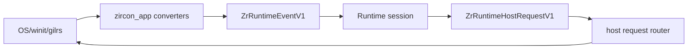
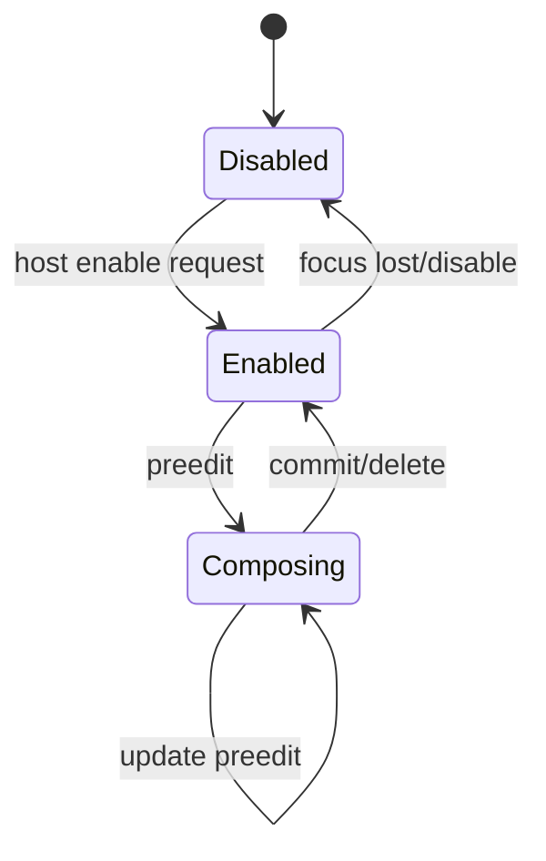

---
related_code:
  - zircon_app/src/entry/runtime_entry_app/keyboard_input
  - zircon_app/src/entry/runtime_entry_app/pointer_input
  - zircon_app/src/entry/runtime_entry_app/gamepad
  - zircon_app/src/entry/runtime_entry_app/ime_input
  - zircon_app/src/entry/runtime_entry_app/file_drag_drop
  - zircon_app/src/entry/runtime_entry_app/host_requests
  - zircon_app/src/entry/tests/runtime_entry_input_guards
implementation_files:
  - zircon_app/src/entry/runtime_entry_app/host_requests
  - zircon_app/src/entry/runtime_entry_app/keyboard_input
  - zircon_app/src/entry/runtime_entry_app/pointer_input
  - zircon_app/src/entry/runtime_entry_app/gamepad
plan_sources:
  - user: 2026-09-09 扩展 zircon_app 公开接口、机制案例、教程和最佳实践
tests:
  - zircon_app/src/entry/tests/runtime_entry_input_guards
  - zircon_app/src/entry/runtime_entry_app/ime_input/tests.rs
doc_type: module-detail
---

# 键盘、指针、手柄、IME 与文件拖放

输入系统由 App 负责接收平台事件、转换为 `zircon_runtime_interface` 的 ABI event，并把 Runtime 发出的 host request 路由回窗口、剪贴板、光标或手柄。转换器是宿主内部实现，稳定契约是 ABI event/request 的字段和 viewport 目标规则。

## 总体数据流



所有输入事件都带 `viewport`。当前默认 viewport 为 `ZIRCON_RUNTIME_DEFAULT_VIEWPORT_HANDLE_V1`。IME 请求没有 target 时只允许路由到默认 viewport；显式 target 不匹配会被拒绝并写 warning。

## 键盘

`RuntimeEntryApp::handle_keyboard_input(&mut self, event_loop, KeyEvent)` 将 winit `KeyEvent` 转成 `ZrRuntimeEventV1::keyboard(version, viewport, action, physical_code, modifiers, payload)`。其中：

- `action` 由 `ElementState` 映射为 press/release。
- `physical_code` 来自 `PhysicalKey`，保证布局无关。
- `payload` 是可选文本切片，使用 ABI byte slice，不把 `String` 跨边界传递。
- 当前 modifiers 参数为宿主维护的数值字段，不能假设是 Unicode 字符。

```rust
// 调用形状（宿主内部）：
let event = ZrRuntimeEventV1::keyboard(
    ZIRCON_RUNTIME_ABI_VERSION_V1,
    viewport,
    action,
    physical_code,
    modifiers,
    payload,
);
session.submit_event(event)?;
```

不要用字符值替代 physical code；“Y/Z”在不同键盘布局上的行为正是物理码存在的原因。文本输入应优先使用 IME/text payload，而不是自己拼接按键。

## 指针与滚轮

`pointer_input` 拆为 device、button、motion、wheel、cursor。宿主转换：

| 来源 | ABI 信息 |
| --- | --- |
| 鼠标/触控按钮 | button code + pressed/released |
| 移动 | viewport 坐标、source、touch id |
| 滚轮 | x/y delta 与 phase |
| 触控 | touch id、kind、phase |
| 光标 | host request 设置可见性/抓取模式 |

触控 kind 没有 touch id 时不会伪造稳定 id；鼠标按钮未知值会被丢弃。滚轮 delta 保留浮点方向，Runtime 负责灵敏度和相机语义。

## 游戏手柄

`gilrs` 被宿主以 feature/平台可用性初始化。事件包括连接、按钮、原始按钮和轴：

```text
connect(gamepad_id, connected)
button(gamepad_id, button_code, value)
raw_button(gamepad_id, raw_code, value)
axis(gamepad_id, axis_code, value)
```

gamepad id 会转换为稳定 `u64`，但不要把它当跨重启持久化身份。轮询使用 drain budget，防止设备风暴阻塞一帧。断开设备时宿主会清除未完成 rumble effect。

### Rumble 请求

Runtime 可发送 `ZrRuntimeHostRequestV1::GamepadRumble`。App 只接受当前 host 能找到的 gamepad，并按 duration/强度启动效果；结束或断开时清理。未支持 rumble 的平台记录 warning，不应让整个 session 失败。

## IME

IME 是有状态输入，不是普通键盘事件。其流程为：

1. 窗口 focus 获得，宿主允许 IME。
2. Runtime 请求 `Enable`、`SetCursorArea` 或 `SetSurroundingText`。
3. 宿主校验 target viewport。
4. winit/平台输入法发送 preedit、commit、delete-surrounding。
5. App 转为 Runtime event，保持 composition 生命周期。
6. 失焦或关闭窗口时清理 IME 状态。



`ZrRuntimeImeHostRequestV1::enable()` 默认目标是 default viewport；调用 `.with_target_viewport(handle)` 才能指定其他 viewport。目标不匹配会被拒绝，不会偷偷发送到当前窗口。

## 剪贴板

剪贴板请求通过 `ZrRuntimeHostRequestV1::Clipboard` 路由。Windows 实现位于 `host_requests/clipboard/platform/windows.rs`，读写均返回 `Result`。平台不支持时应返回可诊断错误，而不是返回伪造空文本。

剪贴板文本必须在 host request 生命周期内复制到 ABI-owned buffer；禁止把系统剪贴板临时指针直接放进 `ZrByteSlice`。

## 文件拖放

拖放状态分为 hovered、dropped、cancelled。hovered 只更新 UI/高亮，不应触发资源导入；dropped 才提交路径列表；cancelled 清理 hover state。路径在进入 Runtime 前要经过项目路径规范化和权限检查。

## Host request 路由

`apply_runtime_host_request(app, event_loop, request)` 按枚举分派：IME、GamepadRumble、Cursor、Clipboard、UiAction、UiHost。路由器在 request 失败时写入 `runtime_host_request_failed` warning，不会 panic。

UI action 和 UI host request 必须命中当前 viewport；未处理的 UI 请求会记录 unhandled 诊断，提醒上层编辑器或 UI host 接管。

## 平台 feature 与能力

| 功能 | 依赖 | 无能力时 |
| --- | --- | --- |
| 键盘/指针 | `platform-winit` | 不编译 runtime entry app |
| 窗口 IME | winit + platform | 返回 IME request error |
| 手柄 | `gilrs`/平台支持 | 不创建 poller |
| 剪贴板 | 平台实现 | 返回 transfer failure |
| 文件拖放 | 窗口事件 | 只保留普通窗口运行 |

`Headless` 不应假装产生 OS 输入；测试需要输入时可直接构造 ABI events，验证 Runtime 行为而不是调用 winit。

## 输入延迟与顺序

同一 event loop turn 内，App 按接收顺序提交事件；Runtime 不应看到未来时间戳。手柄轮询有 budget，超出部分留到下一帧。IME commit 必须在对应 preedit 生命周期内提交，不能异步重排。

## 故障排查

| 症状 | 检查 |
| --- | --- |
| 按键布局错误 | 是否使用 physical key code |
| 中文输入丢字 | 是否启用了 IME，而不是只监听 KeyEvent |
| 触控拖动跳跃 | touch id 是否稳定、坐标是否按 viewport 转换 |
| 手柄卡顿 | drain budget 和断开清理日志 |
| 剪贴板为空 | 平台 transfer error，而非把空文本当成功 |
| UI 请求无效 | target viewport 是否等于当前 viewport |
| 拖放重复导入 | 只在 dropped 阶段触发 import |

## 与其他引擎比较

虚幻 Enhanced Input 常在引擎层做 mapping context；Zircon App 只做物理事件到 ABI 的转换，mapping 留给 Runtime/游戏层，避免宿主知道 gameplay。Fyrox 直接把 winit event 暴露给应用；Zircon 用固定 V1 event 结构隔离 winit 版本。Piccolo 通常由宿主注入文本和指针消息；Zircon 的 host request 让 Runtime 反向请求剪贴板/IME/光标，同时保留 viewport 安全校验。

## 最佳实践

- 将键盘物理码、文本 payload、IME commit 三种语义分开处理。
- 所有 request 都先校验 viewport，再访问窗口或系统设备。
- 输入转换器保持纯函数，便于 `runtime_entry_input_guards` 测试。
- 对手柄和拖放设置预算/去重，避免外部事件洪峰拖垮帧循环。
- 不把平台对象或字符串指针跨 ABI 保存；复制到拥有的缓冲区。
- Headless 测试直接构造 ABI event，不启动桌面设备。

## 源码与测试

- 键盘：`keyboard_input`。
- 指针：`pointer_input`。
- IME：`ime_input`、`host_requests/ime`。
- 手柄：`gamepad`。
- 拖放：`file_drag_drop`。
- 路由：`host_requests/routing.rs`。
- 测试：`zircon_app/src/entry/tests/runtime_entry_input_guards`。

## 10. 请求矩阵

| request | target | 平台动作 | 失败是否熔断 |
| --- | --- | --- | --- |
| `Ime` | 显式或 default viewport | enable/disable、光标区域、周边文本 | 否，记录 warning |
| `GamepadRumble` | gamepad id | 启动/清理 rumble effect | 否，设备不可用时降级 |
| `Cursor` | 当前窗口 | 可见性、抓取、图标 | 否，窗口缺失时忽略 |
| `Clipboard` | 当前窗口/平台 | read/write text | 否，返回 transfer failure |
| `UiAction` | 必须命中 viewport | 交给 UI host/记录 unhandled | 否 |
| `UiHost` | 必须命中 viewport | 交给 UI host/记录 unhandled | 否 |

这些 request 的非致命策略是刻意设计：剪贴板或光标不可用不应摧毁游戏会话；只有 ABI 校验、越界或严重协议错误才由更低层 host 触发熔断。

## 11. 键盘处理案例

```rust
fn handle_key(event: KeyEvent) -> Option<ZrRuntimeEventV1> {
    let action = key_action(event.state)?;
    Some(ZrRuntimeEventV1::keyboard(
        ZIRCON_RUNTIME_ABI_VERSION_V1,
        viewport,
        action,
        physical_key_code(&event.physical_key),
        0,
        keyboard_text_payload(&event),
    ))
}
```

这里的代码形状展示数据流；`key_action`、`physical_key_code` 和 `keyboard_text_payload` 是 runtime_entry_app 内部函数，外部 crate 应提交已经构造好的 ABI event。

## 12. IME 细节

IME preedit 可以多次更新，commit 只在候选确认时发送。delete-surrounding 请求必须携带相对光标范围；宿主不能把它当普通退格。窗口失焦时先发送 composition cancellation/disable，再丢弃后续平台候选事件。

IME cursor area 使用逻辑坐标转换为 winit position/size。高 DPI 环境下，传入物理像素会让候选框偏移；应使用 Runtime 的逻辑 UI 坐标。

## 13. 文件拖放安全

拖放路径属于外部输入：

1. 检查 path 是否存在且是允许的文件类型。
2. 解析为项目相对路径或拒绝越界路径。
3. hovered 只更新预览，dropped 才执行导入。
4. 将导入任务交给 ProjectAssetManager，不在 event callback 阻塞。

不要把任意 dropped path 直接传给插件动态库；插件应接收已验证的项目资源引用。

## 14. 手柄轮询预算

`GamepadDrainBudget` 限制每次 poll 消费的事件量。超出预算的事件留给下一次 poll；断开事件优先于普通轴事件处理，以便及时清理 rumble。对于重连，新的 `gamepad_id` 仍需经过连接事件后才可使用。

## 15. 输入测试断言

- 键盘 press/release 对应正确 action。
- physical code 不受键盘布局影响。
- 目标 viewport 不匹配时 request 不落到窗口。
- legacy IME 无 target 只命中 default viewport。
- IME preedit/commit/delete 顺序保持。
- pointer touch id 不伪造。
- gamepad poll 遵守 drain budget。
- dropped/cancelled 清理拖放状态。

## 16. 不应做的事情

- 不在 host router 中实现 gameplay mapping。
- 不在 ABI slice 中借用平台临时字符串。
- 不在 winit callback 中同步加载资源或阻塞 Runtime。
- 不将 warning 当成成功的 clipboard read。
- 不因单个 rumble 失败关闭整个 session。
- 不绕过 viewport 检查发送 UI/IME request。
